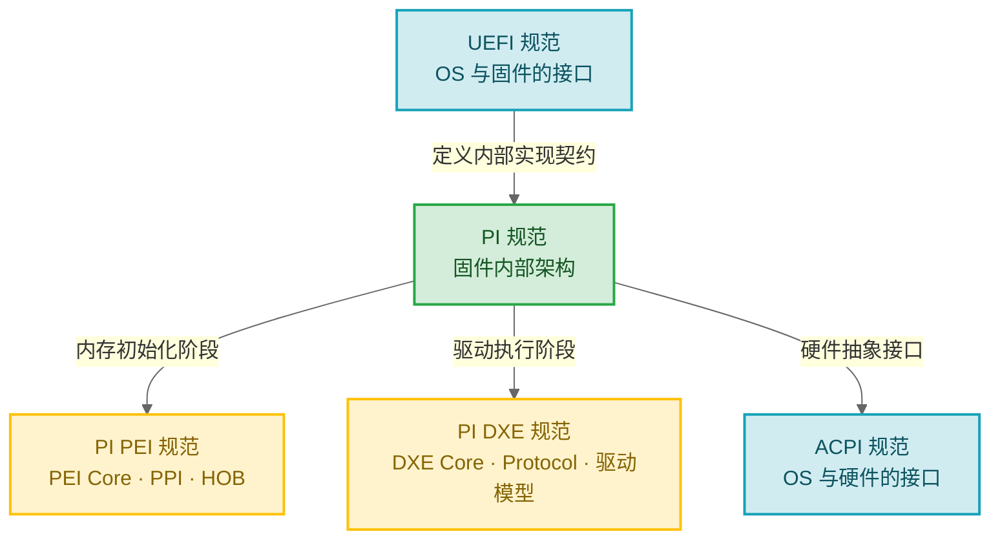

# EDK2 全景地图

> 每一个能启动 Linux 内核的固件，都经历了从"一片空白"到"完整系统"的演进。这一篇帮你理解 EDK2 在这个演进中扮演的角色。

### 关键术语

| 缩写 | 全称 | 含义 |
|------|------|------|
| UEFI | Unified Extensible Firmware Interface | 统一可扩展固件接口，替代传统 BIOS 的标准 |
| PI | Platform Initialization | 平台初始化规范，定义固件内部架构 |
| ACPI | Advanced Configuration and Power Interface | 高级配置与电源接口，OS 与硬件的桥梁 |
| EDK2 | EFI Development Kit II | UEFI/PI 规范的开源参考实现 |

---

## 1. 前置知识

| 需要了解 | 参考文档 |
|----------|----------|
| C 语言基础 | — |
| 计算机体系结构（CPU 模式、内存管理） | — |

---

## 2. 问题：RISC-V 芯片怎么启动操作系统？

如果你在做 RISC-V SoC，你的芯片最终要跑 Linux。但 Linux 不能直接运行在裸硅上——它需要在启动前有一系列准备工作：

- 初始化 DDR 内存控制器，让 CPU 有内存可用
- 枚举 PCIe 总线，识别网卡和存储设备
- 发现硬盘上的操作系统内核
- 构造 ACPI 表，告诉 OS 硬件布局

这些工作由固件完成。而 UEFI（Unified Extensible Firmware Interface，统一可扩展固件接口）就是当前工业界最广泛使用的固件标准。

EDK2 是 UEFI 的官方开源参考实现，由 Intel 主导，TianoCore 社区维护。它被用于从服务器主板到嵌入式设备的各类平台。学习 EDK2 就是把"如何让 RISC-V 芯片对接标准操作系统"这条路走通。

---

## 3. 从 BIOS 到 UEFI：固件标准的演进

传统 BIOS 诞生于 1981 年 IBM PC，到 21 世纪初已经积累了根本性的架构缺陷。理解这些缺陷，才能理解 UEFI 的设计动机：

| 传统 BIOS 的局限 | UEFI 的解决方案 |
|------------------|-----------------|
| 16 位实模式运行，只能寻址 1MB | 保护模式/长模式运行，完整地址空间 |
| 汇编语言编写，不可移植 | C 语言编写，跨架构（x86/ARM/RISC-V） |
| 512KB 空间限制（Option ROM） | 无空间限制，支持大容量固件 |
| 无网络栈，只能从本地启动 | 内置网络栈，支持 PXE/HTTP 启动 |
| INT 13h 中断接口，只能读 8GB | Block I/O 协议，支持大容量存储 |
| 无安全启动机制 | Secure Boot 防止恶意代码执行 |
| MBR 分区表，最多 4 个主分区 | GPT 分区表，支持 128 个分区 |

> Intel 在 1998 年启动 EFI 项目，最初用于 Itanium 服务器。2005 年捐赠给 UEFI Forum 更名为 UEFI，AMD、ARM、IBM、Microsoft 等共同参与制定规范。

---

## 4. 规范体系：一个项目，两套规范

EDK2 同时实现了两套规范，初学者最容易在这一点上混淆：

- **UEFI 规范**面向 OS 开发者——它定义"OS 能从固件获得什么服务"。比如：怎么读磁盘？怎么获取系统时间？怎么设置启动顺序？这是固件对外（OS）的契约。
- **PI 规范**面向固件开发者——它定义"固件内部各阶段怎么协作"。比如：PEI 阶段怎么给 DXE 阶段传数据？驱动怎么被发现？这是固件内部团队之间的契约。

两套规范分离的原因是服务对象不同。OS 不需要关心固件内部怎么实现，固件内部架构也可以独立演进。这种分离正是 UEFI 生态能容纳多家厂商（AMI、Insyde、Phoenix 等各自实现）的关键。

---

## 5. EDK2 的核心设计哲学

EDK2 管理着一百多个模块、数十万行代码。它用什么策略来组织这种复杂度？

| 策略 | 怎么做 | 解决了什么问题 |
|------|--------|---------------|
| **模块化** | 每个功能是独立的 Module（`.inf` 描述） | 几十人的团队可以并行开发、独立测试各自的驱动 |
| **包化管理** | 相关模块组织成 Package（`.dec` 描述） | Intel、ARM、RISC-V 厂商各自维护自己的包，互不干扰 |
| **接口与实现分离** | Library Class（接口）vs Library Instance（实现） | 同一个"内存拷贝"接口，在 PEI 阶段和 DXE 阶段用不同实现，调用方代码不变 |
| **数据驱动** | PCD（Platform Configuration Database）替代 `#ifdef` | 平台差异通过配置数据表达，编译器看到的都是条件分支而非预处理宏 |
| **声明式构建** | DSC/FDF 声明"要构建什么"和"放到 Flash 哪里" | 数千模块的依赖关系由工具自动计算，不靠人工维护 Makefile |

一句话总结 EDK2 的设计：**用声明替代命令，用接口隐藏实现**。这个理念贯穿从类型定义到构建系统的每一个环节。

---

## 6. 四类元数据文件

EDK2 有自己独特的元数据文件体系，定义了"有什么代码"和"怎么组合它们"：

| 文件类型 | 扩展名 | 作用 | 可类比为 |
|----------|--------|------|----------|
| **DEC** | `.dec` | 包声明：定义包的公共接口（库类、GUID、PCD） | C 的 `.h` 头文件 |
| **DSC** | `.dsc` | 平台描述：定义一个平台的构建配置（用什么库、包含哪些模块） | 构建配置 + Makefile |
| **INF** | `.inf` | 模块定义：描述一个模块的源码、依赖、入口点 | 模块的编译说明文件 |
| **FDF** | `.fdf` | 固件描述：定义 Flash 布局和固件卷内容 | 链接脚本 + Flash 分区表 |

四种文件的关系是：**DEC 声明"有什么供应"→ DSC 决定"用哪个实现"→ INF 描述"我怎么编译"→ FDF 指定"我在 Flash 哪里"**。

详细的格式和用法见 [04-构建系统深入](./04-build-system.md)。

---

## 7. 要点回顾

| 要点 | 说明 |
|------|------|
| UEFI 替代 BIOS | 解决了 16 位模式、安全性、可扩展性等根本问题，已是工业标准 |
| UEFI vs PI 两套规范 | UEFI 定义"对外接口"（OS 能获得什么服务），PI 定义"内部架构"（固件内部各阶段怎么协作） |
| EDK2 核心设计哲学 | 模块化 + 接口实现分离 + 声明式构建，用来管理数十万行固件代码的复杂度 |
| 四类元数据文件 | DEC 声明接口、DSC 配置平台、INF 描述模块、FDF 定义布局 |
| RISC-V 服务器需要 UEFI + ACPI | 从服务器到嵌入式，UEFI 已是 RISC-V 启动操作系统的标准路径 |

---

## 参考资料

- [UEFI Specification 2.10](https://uefi.org/specs/UEFI/2.10/) — 官方规范
- [EDK2 Source Code](https://github.com/tianocore/edk2) — 开源实现
- [TianoCore Documentation](https://tianocore-docs.github.io/) — 官方文档

---

**下一篇**：[01-快速上手：构建与运行](./01-quick-start.md) — 动手构建你的第一个 UEFI 固件
