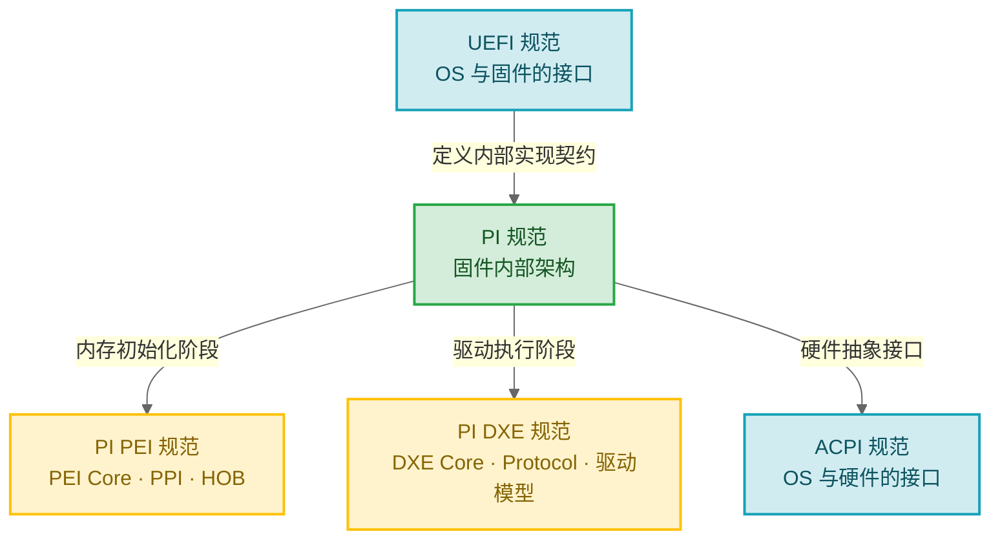

# EDK2 全景地图

> EDK2 是 UEFI 固件的开源参考实现。不懂它，你的 RISC-V SoC 就是一块没有灵魂的硅片。

### 关键术语

| 缩写 | 全称 | 含义 |
|------|------|------|
| UEFI | Unified Extensible Firmware Interface | 统一可扩展固件接口，替代传统 BIOS 的标准 |
| PI | Platform Initialization | 平台初始化规范，定义固件内部架构 |
| ACPI | Advanced Configuration and Power Interface | 高级配置与电源接口，OS 与硬件的桥梁 |
| EDK2 | EFI Development Kit II | UEFI/PI 规范的开源参考实现 |

---

## 1. 前置知识

| 需要了解 | 参考文档 |
|----------|----------|
| C 语言基础 | — |
| 计算机体系结构（CPU 模式、内存管理） | — |

---

## 2. 为什么你需要了解 EDK2

如果你从事 RISC-V SoC 固件或内核开发，EDK2 是绕不开的基础设施：

- **UEFI 是事实标准**：从服务器到嵌入式，UEFI 已取代传统 BIOS 成为固件接口标准
- **EDK2 是 UEFI 的参考实现**：Intel 开源，社区维护，工业界广泛使用
- **RISC-V 服务器需要 UEFI**：UEFI + ACPI 是 RISC-V 服务器启动的标配
- **固件是安全的第一道防线**：Secure Boot、TPM、Measured Boot 都在固件层实现

---

## 3. 从 BIOS 到 UEFI

传统 BIOS 诞生于 1981 年 IBM PC 时代，在近 40 年的演进中积累了根本性的架构缺陷：

| 传统 BIOS 的局限 | UEFI 的解决方案 |
|------------------|-----------------|
| 16 位实模式运行，只能寻址 1MB | 保护模式/长模式运行，完整地址空间 |
| 汇编语言编写，不可移植 | C 语言编写，跨架构（x86/ARM/RISC-V） |
| 512KB 空间限制（Option ROM） | 无空间限制，支持大容量固件 |
| 无网络栈，只能从本地启动 | 内置网络栈，支持 PXE/HTTP 启动 |
| INT 13h 中断接口，只能读 8GB | Block I/O 协议，支持大容量存储 |
| 无安全启动机制 | Secure Boot 防止恶意代码执行 |
| MBR 分区表，最多 4 个主分区 | GPT 分区表，支持 128 个分区 |

> **设计背景**：Intel 在 1998 年启动 EFI 项目，最初用于 Itanium 服务器。2005 年捐赠给 UEFI Forum 更名为 UEFI，AMD、ARM、IBM、Microsoft 等共同参与制定规范。

---

## 4. 规范体系

理解 EDK2 必须先理解它实现的规范体系：

**UEFI vs PI 的区别**（初学者最容易混淆的点）：

- **UEFI 规范**面向 OS 开发者——定义"OS 能从固件获得什么服务"（对外的契约）
- **PI 规范**面向固件开发者——定义"固件内部各阶段如何协作"（对内的契约）
- EDK2 同时实现了两者

> **设计背景**：为什么需要两套规范？因为服务对象不同。OS 不需要关心固件内部实现，固件内部架构也可以独立演进。这种分离是 UEFI 生态能容纳众多厂商实现的关键。

---

## 5. EDK2 的核心设计哲学

| 设计哲学 | 体现 | 设计动机 |
|----------|------|----------|
| **模块化** | 每个功能是一个独立的 Module（.inf 描述） | 百万行级代码，模块化使团队并行开发、独立测试 |
| **包化管理** | 相关模块组织成 Package（.dec 描述） | 不同厂商各自维护自己的包，互不干扰 |
| **接口与实现分离** | Library Class（接口）vs Library Instance（实现） | 同一接口在不同阶段/平台有不同实现，代码无需修改 |
| **数据驱动** | PCD 实现配置与代码分离 | 平台差异通过配置数据表达，而非 `#ifdef` |
| **声明式构建** | DSC/FDF 声明"要构建什么" | 数千模块的依赖关系，手动管理 Makefile 不现实 |

---

## 6. 核心文件类型

EDK2 有自己独特的元数据文件体系：

| 文件类型 | 扩展名 | 作用 | 类比 |
|----------|--------|------|------|
| **DEC** | `.dec` | 包声明：定义包的公共接口 | C 的 `.h` 文件 |
| **DSC** | `.dsc` | 平台描述：定义如何构建一个平台 | Makefile |
| **INF** | `.inf` | 模块定义：描述一个模块的源码和依赖 | `.c` 文件 + 编译信息 |
| **FDF** | `.fdf` | 固件描述：定义 Flash 布局 | 链接脚本 + 分区表 |

> 详见 [04-构建系统深入](./04-build-system.md)。

---

## 7. 要点回顾

| 要点 | 说明 |
|------|------|
| UEFI 替代 BIOS 解决了 16 位模式、安全性、可扩展性等根本问题 | 从服务器到嵌入式已是事实标准 |
| UEFI 规范定义对外接口，PI 规范定义内部架构 | EDK2 同时实现两者 |
| EDK2 的核心设计是模块化 + 接口与实现分离 | DEC/DSC/INF/FDF 四类文件驱动整个构建 |
| RISC-V 服务器需要 UEFI + ACPI | 这是学习 EDK2 的核心动机之一 |

---

## 参考资料

- [UEFI Specification 2.10](https://uefi.org/specs/UEFI/2.10/) — 官方规范
- [EDK2 Source Code](https://github.com/tianocore/edk2) — 开源实现
- [TianoCore Documentation](https://tianocore-docs.github.io/) — 官方文档

---

**下一篇**：[01-快速上手：构建与运行](./01-quick-start.md) — 30 分钟内让固件跑起来
