# EDK2 架构与核心概念

> 固件不是黑魔法，它只是在你以为计算机还没开机的时候，就已经跑完了一个操作系统。

## 1. 类型系统：一切代码的根基

EDK2 的类型系统定义在 `MdePkg/Include/Base.h` 中，通过 `ProcessorBind.h` 实现架构无关性。这是你写任何 EDK2 代码前必须理解的基础。

### 1.1 架构绑定机制

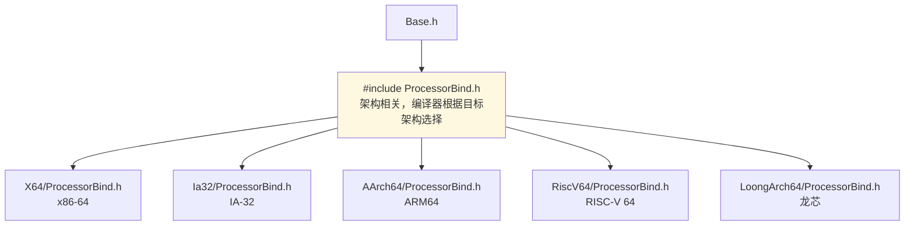

`ProcessorBind.h` 的核心职责是定义 `UINTN`/`INTN`（与指针等宽的整数）和函数调用约定。在 RISC-V 64 上，`UINTN` 是 64 位。

> **设计背景**：UEFI 规范要求固件代码可以在多种 CPU 架构上编译运行。`ProcessorBind.h` 是实现这一目标的关键——它将所有架构相关的类型定义集中到一个文件中，上层代码只需包含 `Base.h` 即可获得架构无关的类型系统。这种设计让同一个驱动源码可以在 x86、ARM、RISC-V 上编译，只需在构建时选择不同的目标架构。

### 1.2 核心数据类型

```c
// 固定宽度整数（与 Linux 内核的 u8/u16/u32/u64 对应）
UINT8, UINT16, UINT32, UINT64    // 无符号
INT8,  INT16,  INT32,  INT64     // 有符号

// 指针宽度整数（类似 Linux 的 unsigned long / long）
UINTN, INTN                       // 大小 = sizeof(void*)

// 布尔（注意：UEFI 的 BOOLEAN 是 1 字节，不是 C 的 int）
BOOLEAN                           // 必须为 TRUE (1) 或 FALSE (0)

// 字符
CHAR8                             // ASCII (1 字节)
CHAR16                            // UCS-2 (2 字节，UEFI 字符串编码)

// 物理地址
PHYSICAL_ADDRESS                  // UINT64，即使 32 位系统也是 64 位

// GUID（128 位唯一标识符，UEFI 的"万能钥匙"）
typedef struct {
  UINT32  Data1;
  UINT16  Data2;
  UINT16  Data3;
  UINT8   Data4[8];
} GUID;
```

> **为什么 UEFI 使用 UCS-2 而非 UTF-8？** UEFI 规范制定于 2000 年代初，当时 Unicode 标准尚未成熟，UCS-2 是最简单的定宽编码方案，实现成本低。代价是不支持 Unicode 代理对（surrogate pairs），即无法表示基本多文种平面（BMP）之外的字符。这是历史遗留限制，现代 UEFI 实践中通常避免使用非 BMP 字符。

### 1.3 函数参数修饰符

这是 UEFI 代码最显眼的风格特征——`IN`/`OUT`/`OPTIONAL`：

```c
EFI_STATUS
EFIAPI
SomeFunction (
  IN     EFI_HANDLE   Handle,        // 输入参数
  IN OUT UINTN        *BufferSize,   // 输入输出参数
  OUT    VOID         *Buffer,       // 输出参数
  IN     BOOLEAN      OptionalFlag  OPTIONAL  // 可选参数
  );
```

这些修饰符在编译时展开为空，纯粹是给人类看的文档。但它们在代码审查时极其有用——一眼就能看出参数的方向。

> **设计背景**：固件代码中指针的输入/输出语义对安全性至关重要。错误地理解一个指针参数是输入还是输出，可能导致写入只读内存或使用未初始化的数据。`IN`/`OUT` 修饰符虽然编译器不检查，但它们在代码审查和静态分析中提供了关键的语义信息。EDK2 的 ECC（EFI Coding Convention）检查工具会强制要求所有公共 API 使用这些修饰符。

### 1.4 状态码体系

UEFI 的函数几乎都返回 `EFI_STATUS`（本质是 `UINTN`）：

```
编码规则（32 位视图）：
  Bit 31 = 1 → 错误 (Error)
  Bit 31 = 0, Bit 30 = 1 → 警告 (Warning)
  Bit 31 = 0, Bit 30 = 0 → 成功 (Success)

常用状态码：
  EFI_SUCCESS              (0x00000000)  // 成功
  EFI_WARN_UNKNOWN_GLYPH   (0x40000001)  // 警告：未知字形
  EFI_WARN_DELETE_FAILURE  (0x40000002)  // 警告：删除失败
  EFI_INVALID_PARAMETER    (0x80000002)  // 错误：参数无效
  EFI_UNSUPPORTED          (0x80000003)  // 错误：不支持
  EFI_DEVICE_ERROR         (0x80000007)  // 错误：设备错误
  EFI_OUT_OF_RESOURCES     (0x80000009)  // 错误：资源不足
  EFI_NOT_FOUND            (0x8000000E)  // 错误：未找到
  EFI_ACCESS_DENIED        (0x8000000F)  // 错误：访问拒绝
  EFI_SECURITY_VIOLATION   (0x8000001A)  // 错误：安全违规
```

判断宏：
- `RETURN_ERROR(Status)` — 检查 Bit 31 是否为 1（是否为错误）
- `EFI_ERROR(Status)` — 同 `RETURN_ERROR`
- 注意：警告不算错误，`RETURN_ERROR` 对警告返回 `FALSE`

### 1.5 实用宏

```c
// 从成员指针获取结构体指针（Linux 内核的 container_of）
BASE_CR(Record, TYPE, Field)

// 编译时断言（C11 _Static_assert 的 EDK2 封装）
STATIC_ASSERT(expression, message)

// 位掩码（BIT0 到 BIT63，寄存器操作必备）
BIT0, BIT1, BIT2, ... BIT63

// 大小常量（内存操作必备）
SIZE_1KB, SIZE_2KB, ... SIZE_8EB
BASE_1KB, BASE_2KB, ... BASE_8EB

// 对齐宏
ALIGN_VALUE(Value, Alignment)    // 向上对齐
IS_ALIGNED(Value, Alignment)     // 判断对齐
```

## 2. 启动阶段深度解析

### 2.1 ResetVector — 从硅片到软件的桥梁

ResetVector 是 CPU 上电后执行的第一段代码，通常是纯汇编。

**x86 的 ResetVector 流程**（`UefiCpuPkg/ResetVector/`）：

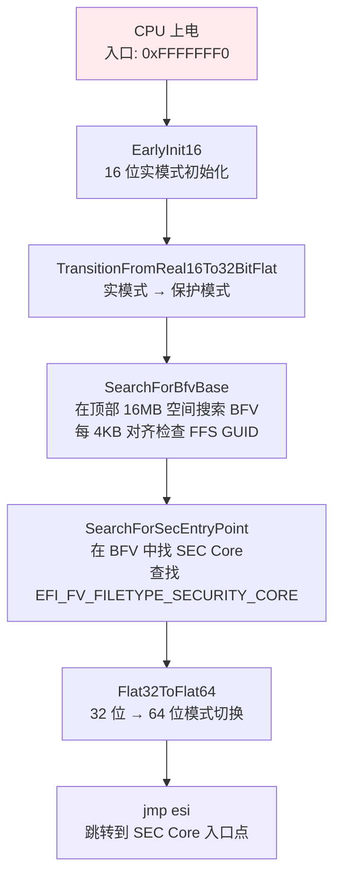

> **设计背景**：x86 的 ResetVector 之所以如此复杂，是因为 x86 CPU 上电后处于 16 位实模式——这是 8086 时代的遗产，为了向后兼容保留了 40 年。UEFI 需要运行在 64 位长模式，因此必须经历 实模式→保护模式→长模式 的三级跳。每一步切换都需要精确配置 GDT、CR0、CR4、EFER 等寄存器，任何一步出错都会导致 CPU 异常（Triple Fault = 重启）。

**RISC-V 的 ResetVector**（`OvmfPkg/RiscVVirt/Library/PlatformSecLib/SecEntry.S`）：

RISC-V 没有实模式/保护模式的概念，CPU 直接从 M-mode 启动，流程更简洁：

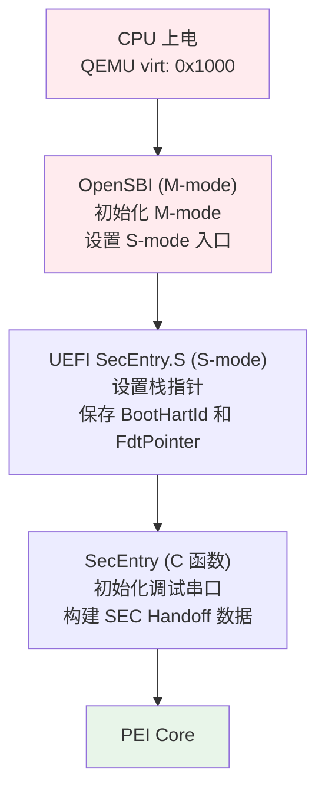

> **注意**：在 OpenSBI + UEFI 的典型流程中，UEFI 从 SEC 开始就运行在 S-mode，而非 M-mode。OpenSBI 运行在 M-mode，通过 SBI ecall 为 UEFI 提供底层服务（定时器、复位、控制台输出等）。BootHartId 和 FdtPointer 通过 a0/a1 寄存器从 OpenSBI 传递给 UEFI。

### 2.2 SEC — 安全阶段

SEC 是第一个 C 代码阶段。x86 平台的 SEC Core 源码位于 `UefiCpuPkg/SecCore/`，RISC-V 平台的 SEC 实现位于各平台的 `PlatformSecLib` 中（如 `OvmfPkg/RiscVVirt/Library/PlatformSecLib/`）。

**核心职责**：
1. 初始化临时 RAM（x86 用 CAR - Cache as RAM，RISC-V 用平台特定机制）
2. 设置 IDT/中断处理
3. 定位 PEI Core 入口点
4. 将控制权交给 PEI Core

> **设计背景 — 为什么需要临时 RAM (CAR)？** 在 DRAM 控制器被初始化之前，系统没有任何可写内存。但 SEC 和早期 PEI 代码需要栈和堆来运行 C 代码。x86 的解决方案是 CAR（Cache-as-RAM）：将 CPU L2 缓存配置为"无回写"模式，使其充当临时 RAM。这是 x86 固件开发中最精巧的技巧之一——在没有任何 DRAM 的情况下，利用 CPU 内部缓存运行 C 代码。RISC-V 平台通常使用片上 SRAM 或直接使用 DRAM（如果硬件已经初始化）作为临时 RAM。

**关键函数调用链**：

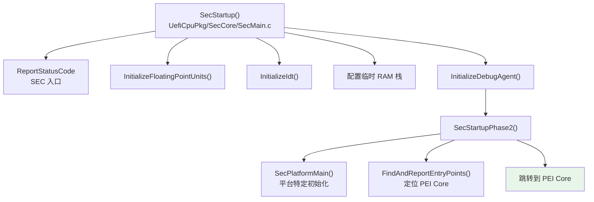

**SEC 注册的 PPI**（传递给 PEI Core）：
- `gEfiTemporaryRamDonePpiGuid` — 临时 RAM 禁用
- `gEfiSecPlatformInformationPpiGuid` — 平台信息
- `gPeiSecPerformancePpiGuid` — 性能数据

### 2.3 PEI — Pre-EFI 初始化阶段

PEI 是"内存初始化者"，源码位于 `MdeModulePkg/Core/Pei/`。

**核心职责**：
1. 调度 PEIM 模块（PEI Module）
2. 初始化永久内存（DDR）
3. 构建 HOB（Hand-Off Block）列表
4. 将控制权交给 DXE Core

**PEI 的两阶段运行**：

```mermaid
%%{init: {"theme": "base", "themeVariables": {\
    "primaryColor": "#EEEDFF",\
    "primaryTextColor": "#333333",\
    "primaryBorderColor": "#8B7EC8",\
    "secondaryColor": "#FFF8E1",\
    "secondaryTextColor": "#333333",\
    "secondaryBorderColor": "#FFB300",\
    "tertiaryColor": "#F5F5F5",\
    "tertiaryTextColor": "#333333",\
    "tertiaryBorderColor": "#9E9E9E",\
    "lineColor": "#888888",\
    "textColor": "#333333",\
    "fontFamily": "\"trebuchet ms\", verdana, arial, sans-serif"}}}%%
flowchart LR
    subgraph Phase1["Phase 1: 临时 RAM 阶段"]
        A1["PeiCore() 首次进入"] --> A2["初始化 PEI 服务表"]
        A2 --> A3["建立 PPI 数据库"]
        A3 --> A4["调度 PEIM<br/>内存初始化 PEIM 最关键"]
        A4 --> A5["永久内存可用"]
    end

    subgraph Phase2["Phase 2: 永久内存阶段"]
        B1["ShadowPeiCore()<br/>将 PEI Core 从 Flash 拷贝到内存"] --> B2["PeiCore() 重新进入<br/>OldCoreData != NULL"]
        B2 --> B3["迁移 PPI 数据库到内存"]
        B3 --> B4["继续调度剩余 PEIM"]
        B4 --> B5["构建 HOB 列表"]
        B5 --> B6["定位 DXE Core → 跳转"]
    end

    A5 --> B1

    style Phase1 fill:#FFF8E1
    style Phase2 fill:#E8F5E9
```

> **设计背景 — 为什么 PEI 需要两阶段？** PEI 面临一个"鸡生蛋"问题：要运行 C 代码需要内存，但内存控制器初始化本身也是 C 代码。解决方案是分两阶段运行：第一阶段在临时 RAM（CAR/片上 SRAM）中运行，空间极其有限（通常只有几十 KB）；内存初始化 PEIM 完成后，第二阶段将 PEI Core 自身从 Flash "影子拷贝"（Shadow）到永久内存中，然后重新进入，在充裕的内存环境中继续工作。这种设计虽然复杂，但优雅地解决了"没有内存就要初始化内存"的悖论。

**PEI 服务表**（`gPs`）是 PEI 阶段的核心 API：

| 服务类别 | 关键接口 |
|----------|----------|
| PPI 管理 | `InstallPpi`, `ReInstallPpi`, `LocatePpi`, `NotifyPpi` |
| 启动模式 | `GetBootMode`, `SetBootMode` |
| HOB 管理 | `GetHobList`, `CreateHob` |
| 固件卷 | `FfsFindNextVolume`, `FfsFindNextFile`, `FfsFindSectionData` |
| 内存 | `InstallPeiMemory`, `AllocatePages`, `AllocatePool` |
| 状态码 | `ReportStatusCode` |

#### HOB（Hand-Off Block）

HOB 是 PEI 向 DXE 传递数据的核心机制，本质是一个单向链表：

> **设计背景 — 为什么需要 HOB？** PEI 和 DXE 运行在完全不同的内存环境中：PEI 早期只有临时 RAM，DXE 拥有完整的永久内存。两者之间需要一个结构化的数据传递机制。HOB 的设计哲学是"只追加，不修改"——PEI 只能向 HOB 列表追加新节点，不能修改已有的。这保证了数据的一致性，也让 DXE 可以安全地遍历整个 HOB 列表来获取系统信息。

```c
typedef struct {
  UINT16    HobType;       // HOB 类型
  UINT16    HobLength;     // 本 HOB 长度
  UINT32    Reserved;      // 保留
} EFI_HOB_GENERIC_HEADER;
```

**关键 HOB 类型**：

| HOB 类型 | 用途 |
|----------|------|
| `EFI_HOB_TYPE_HANDOFF` | PEI 到 DXE 的交接信息（包含 DXE Core 需要的所有信息） |
| `EFI_HOB_TYPE_MEMORY_ALLOCATION` | 内存分配描述 |
| `EFI_HOB_TYPE_RESOURCE_DESCRIPTOR` | 系统资源描述（物理内存范围） |
| `EFI_HOB_TYPE_GUID_EXTENSION` | 自定义数据（通过 GUID 区分） |
| `EFI_HOB_TYPE_FV` | 固件卷位置信息 |
| `EFI_HOB_TYPE_CPU` | CPU 信息（频率等） |

**RISC-V 特有的 HOB**：`RISCV_SEC_HANDOFF_HOB_GUID`，包含 `BootHartId` 和 `FdtPointer`。

#### PPI（PEIM-to-PEIM Interface）

PPI 是 PEI 阶段的模块间通信机制，类似 DXE 阶段的 Protocol，但更轻量：

```c
typedef struct _EFI_PEI_PPI_DESCRIPTOR {
  EFI_PEI_PPI_DESCRIPTOR_FLAGS  Flags;    // 安装/通知标志
  EFI_GUID                      *Guid;    // PPI 的 GUID
  VOID                          *Ppi;     // 指向 PPI 接口结构
} EFI_PEI_PPI_DESCRIPTOR;
```

PPI 与 Protocol 的关键区别：
- PPI 在临时 RAM 中，内存有限
- PPI 没有句柄（Handle）概念
- PPI 不支持打开/关闭协议的复杂语义
- PPI 支持通知机制（NotifyPPI），类似 DXE 的事件回调

> **设计背景 — 为什么 PPI 和 Protocol 是两套机制？** PEI 阶段的内存极其有限（可能只有 32KB 的 CAR），无法支持 Protocol 那样的复杂语义（Handle 数据库、Open/Close 属性、引用计数等）。PPI 是 Protocol 的"轻量版"——只保留最核心的安装、查找和通知功能，牺牲灵活性换取最小的内存开销。当系统进入 DXE 阶段后，内存充裕，才切换到功能完整的 Protocol 机制。

### 2.4 DXE — 驱动执行环境

DXE 是 UEFI 启动中最重要、最复杂的阶段，源码位于 `MdeModulePkg/Core/Dxe/`。

**核心职责**：
1. 建立 EFI 系统表（Boot Services + Runtime Services）
2. 调度 DXE 驱动
3. 管理协议（Protocol）数据库
4. 管理事件（Event）和定时器
5. 管理内存映射（GCD）
6. 等待架构协议就绪后调用 BDS

**DxeMain() 初始化流程**：

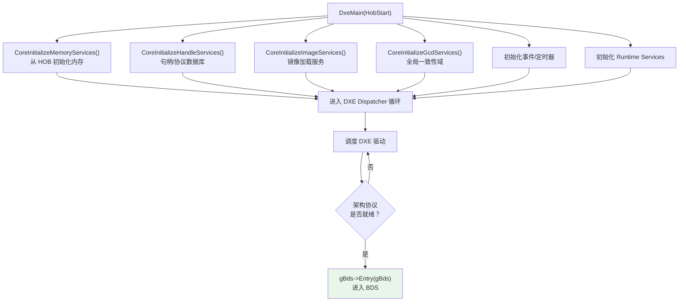

#### EFI 系统表

EFI 系统表是 DXE 阶段建立的核心数据结构，是所有 UEFI 应用程序和驱动的入口参数：

```mermaid
%%{init: {"theme": "base", "themeVariables": {\
    "primaryColor": "#EEEDFF",\
    "primaryTextColor": "#333333",\
    "primaryBorderColor": "#8B7EC8",\
    "secondaryColor": "#FFF8E1",\
    "secondaryTextColor": "#333333",\
    "secondaryBorderColor": "#FFB300",\
    "tertiaryColor": "#F5F5F5",\
    "tertiaryTextColor": "#333333",\
    "tertiaryBorderColor": "#9E9E9E",\
    "lineColor": "#888888",\
    "textColor": "#333333",\
    "fontFamily": "\"trebuchet ms\", verdana, arial, sans-serif"}}}%%
flowchart TD
    ST["EFI_SYSTEM_TABLE"]
    ST --> H["EFI_TABLE_HEADER<br/>签名、版本、校验和"]
    ST --> FW["FirmwareVendor, FirmwareRevision"]
    ST --> CI["ConsoleInHandle<br/>→ EFI_SIMPLE_TEXT_INPUT_PROTOCOL"]
    ST --> CO["ConsoleOutHandle<br/>→ EFI_SIMPLE_TEXT_OUTPUT_PROTOCOL"]
    ST --> SE["StandardErrorHandle<br/>→ EFI_SIMPLE_TEXT_OUTPUT_PROTOCOL"]
    ST --> RS["EFI_RUNTIME_SERVICES<br/>OS 可用的运行时服务"]
    ST --> BS["EFI_BOOT_SERVICES<br/>仅 Boot Services 阶段可用"]
    ST --> CT["EFI_CONFIGURATION_TABLE<br/>ACPI 表等"]

    style ST fill:#EEEDFF
    style RS fill:#FFEBEE
    style BS fill:#E8F5E9
```

#### Boot Services（启动服务）

Boot Services 在 `ExitBootServices()` 调用后失效，是 UEFI 驱动的主要 API：

| 服务类别 | 关键接口 |
|----------|----------|
| 事件 | `CreateEvent`, `SetTimer`, `WaitForEvent`, `SignalEvent` |
| 内存 | `AllocatePages`, `FreePages`, `AllocatePool`, `FreePool` |
| 协议 | `InstallProtocolInterface`, `HandleProtocol`, `LocateHandle`, `OpenProtocol` |
| 镜像 | `LoadImage`, `StartImage`, `UnloadImage`, `Exit` |
| 杂项 | `Stall`, `SetWatchdogTimer`, `CopyMem`, `SetMem` |

#### Runtime Services（运行时服务）

Runtime Services 在 OS 运行期间仍然可用，是固件与 OS 的持久接口：

| 服务类别 | 关键接口 |
|----------|----------|
| 变量 | `GetVariable`, `SetVariable`, `GetNextVariableName` |
| 时间 | `GetTime`, `SetTime`, `GetWakeupTime` |
| 重置 | `ResetSystem` (冷启动/热启动/关机) |
| 虚拟内存 | `SetVirtualAddressMap`, `ConvertPointer` |
| 杂项 | `GetNextHighMonotonicCount`, `UpdateCapsule` |

> **设计背景 — 为什么区分 Boot Services 和 Runtime Services？** Boot Services 提供了丰富的功能（协议查找、镜像加载、事件调度等），但它们依赖固件内部的数据结构，这些数据结构在 OS 接管后可能被覆盖或失效。Runtime Services 只保留 OS 真正需要的功能（读写变量、获取时间、重启等），这些服务的代码和数据被标记为 Runtime 类型，OS 需要为其保留虚拟地址映射。这种分离确保了固件在 OS 运行期间的最小占用。

#### Protocol（协议）

Protocol 是 DXE 阶段的核心通信机制，是 UEFI 的"面向对象"编程模型：

```c
// 安装 Protocol
EFI_STATUS
InstallProtocolInterface (
  IN OUT EFI_HANDLE  *Handle,       // 句柄（Protocol 的容器）
  IN     EFI_GUID    *Protocol,     // Protocol 的 GUID
  IN     EFI_INTERFACE_TYPE InterfaceType,
  IN     VOID        *Interface     // 指向 Protocol 接口结构
  );

// 查找 Protocol
EFI_STATUS
HandleProtocol (
  IN  EFI_HANDLE  Handle,
  IN  EFI_GUID    *Protocol,
  OUT VOID        **Interface
  );
```

**Protocol vs PPI 对比**：

| 特性 | PPI (PEI) | Protocol (DXE) |
|------|-----------|----------------|
| 存储位置 | 临时 RAM / 永久内存 | 永久内存 |
| 容器 | 无（全局 PPI 数据库） | Handle（句柄） |
| 生命周期 | PEI 阶段 | DXE → Runtime |
| 查找方式 | GUID | GUID + Handle |
| 通知机制 | NotifyPPI | Event + RegisterProtocolNotify |
| 复杂度 | 简单 | 复杂（Open/Close/Attributes） |

> **设计背景 — Protocol 的"面向对象"模型**：UEFI 的 Protocol 本质上是 C 语言实现的面向对象接口——一个 Protocol 就是一组函数指针和数据，通过 GUID 唯一标识。Handle 是 Protocol 的容器，一个 Handle 可以安装多个 Protocol。这种设计让 UEFI 驱动之间实现了松耦合：生产者安装 Protocol，消费者通过 GUID 查找 Protocol，双方不需要知道对方的具体实现。这与 Linux 内核的 `struct file_operations` 和 COM 的 `IUnknown` 有异曲同工之妙。

#### GCD（全局一致性域）

GCD 是 DXE 阶段的内存映射管理器，维护系统地址空间的统一视图：

```
GCD 管理的地址空间属性：
  - 内存类型：SystemMemory, MemoryMappedIo, Reserved, etc.
  - 内存属性：UC, WC, WT, WB (缓存属性)
  - 内存能力：ReadOnly, WriteOnly, ReadWrite, Executable
  - 内存状态：Allocated, Unallocated
```

GCD 的核心操作：
- `AddMemorySpace()` — 注册新的内存区域
- `AllocateMemorySpace()` — 分配内存区域
- `SetMemorySpaceAttributes()` — 设置内存属性（如缓存策略）
- `GetMemorySpaceMap()` — 获取完整内存映射

> **设计背景 — 为什么需要 GCD？** 在 DXE 阶段，多个驱动可能需要操作同一块内存区域（如 MMIO 空间）。如果没有统一的内存映射管理，驱动之间可能产生冲突——例如两个驱动同时映射同一块 MMIO 空间但使用不同的缓存策略。GCD 提供了全局的内存视图，确保所有内存操作一致且可追踪。

### 2.5 BDS — 启动设备选择

BDS 是 DXE 调度的最后一个阶段，源码位于 `MdeModulePkg/Universal/BdsDxe/`。

**BDS 的工作流程**：

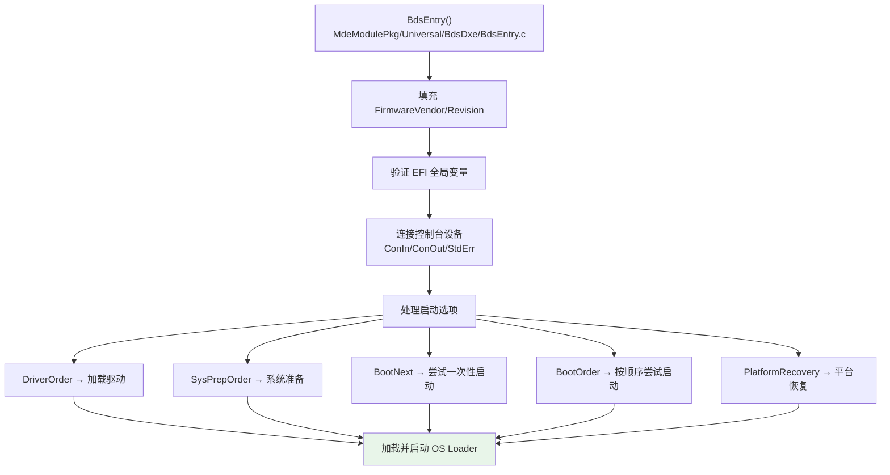

**启动选项存储在 UEFI 变量中**：

| 变量 | 含义 |
|------|------|
| `BootOrder` | 启动顺序列表（UINT16 数组） |
| `Boot####` | 具体启动选项（#### 是 BootOrder 中的编号） |
| `BootNext` | 下一次启动的选项编号（一次性） |
| `Timeout` | 启动菜单超时秒数 |

> **设计背景 — 为什么启动选项存在变量中？** UEFI 变量存储在 NV（非易失）存储中，断电不丢失。将启动选项存储为变量意味着 OS 安装程序可以通过 `SetVariable()` 修改启动顺序，而不需要修改固件代码。这比传统 BIOS 的 INT 15h 中断方式灵活得多——Linux 的 `efibootmgr` 和 Windows 的 `bcdedit` 都是通过 UEFI 变量来管理启动选项的。

### 2.6 SMM — 系统管理模式

SMM 是 x86 特有的高权限执行模式，源码位于 `MdeModulePkg/Core/PiSmmCore/`。

**SMM 的关键特性**：
- 运行在独立的 SMRAM 中，OS 完全不可见
- 由 SMI（System Management Interrupt）触发进入
- 权限高于 OS 和 Hypervisor
- 用于实现安全策略、固件更新等

> **设计背景 — 为什么需要 SMM？** SMM 是 x86 架构中唯一对 OS 完全透明的执行模式。它的设计初衷是处理硬件级紧急事件（如电源故障、温度过高等），后来被广泛用于实现安全功能（固件更新保护、Secure Boot 密钥存储等）。SMM 的"OS 不可见"特性是一把双刃剑：一方面保护了安全敏感代码，另一方面也引发了安全社区的担忧——恶意 SMM 代码（"Ring -2" rootkit）对 OS 完全不可见。这也是 StandaloneMmPkg 出现的原因之一——提供更可审计的安全执行环境。

**SMM 的加载流程**：

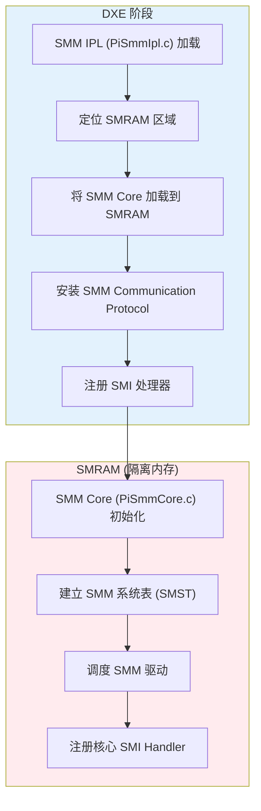

**SMM 系统表 (SMST)** 提供的服务：
- `SmmAllocatePool/SmmFreePool` — SMRAM 内存分配
- `SmmAllocatePages/SmmFreePages` — SMRAM 页面分配
- `SmiHandlerRegister/SmiHandlerUnRegister` — SMI 处理器注册
- `SmmInstallProtocolInterface` — SMM 协议管理
- `SmmStartupThisAp` — 多处理器 SMI 同步

> **RISC-V 注意**：RISC-V 没有 SMM。等价的安全执行环境是 M-mode（机器模式）和 TEE（Trusted Execution Environment）。StandaloneMmPkg 提供了架构无关的 MM 框架，可在 ARM TrustZone 或 RISC-V M-mode 上运行。StandaloneMm 的设计理念是将 MM（Management Mode）代码运行在独立的隔离环境中，不依赖 DXE Core，从而减小可信计算基（TCB）。

## 3. 库类体系

EDK2 的库类体系是其最优雅的设计之一——**接口与实现完全分离**。

### 3.1 核心概念

```mermaid
%%{init: {"theme": "base", "themeVariables": {\
    "primaryColor": "#EEEDFF",\
    "primaryTextColor": "#333333",\
    "primaryBorderColor": "#8B7EC8",\
    "secondaryColor": "#FFF8E1",\
    "secondaryTextColor": "#333333",\
    "secondaryBorderColor": "#FFB300",\
    "tertiaryColor": "#F5F5F5",\
    "tertiaryTextColor": "#333333",\
    "tertiaryBorderColor": "#9E9E9E",\
    "lineColor": "#888888",\
    "textColor": "#333333",\
    "fontFamily": "\"trebuchet ms\", verdana, arial, sans-serif"}}}%%
flowchart LR
    subgraph LC["Library Class (接口)"]
        LH["BaseLib.h<br/>声明函数签名"]
    end

    subgraph LI["Library Instance (实现)"]
        X64["BaseLib/X64/<br/>x86-64 实现"]
        RV64["BaseLib/RiscV64/<br/>RISC-V 实现"]
        A64["BaseLib/AArch64/<br/>ARM64 实现"]
    end

    LC -->|DEC 文件声明<br/>[LibraryClasses]| DEC_NODE["BaseLib|Include/Library/BaseLib.h"]
    LI -->|DSC 文件绑定<br/>[LibraryClasses.XXX]| DSC_NODE["BaseLib|MdePkg/Library/BaseLib"]

    style LC fill:#EEEDFF
    style LI fill:#E8F5E9
```

**绑定发生在 DSC 文件中**：

```ini
[LibraryClasses]
  BaseLib|MdePkg/Library/BaseLib/BaseLib.inf
  BaseMemoryLib|MdePkg/Library/BaseMemoryLibRepStr/BaseMemoryLibRepStr.inf
  DebugLib|MdePkg/Library/UefiDebugLibConOut/UefiDebugLibConOut.inf
```

同一个 Library Class 可以在不同模块类型中绑定不同实现：

```ini
[LibraryClasses.common.PEIM]
  MemoryAllocationLib|MdePkg/Library/PeiMemoryAllocationLib/PeiMemoryAllocationLib.inf

[LibraryClasses.common.DXE_DRIVER]
  MemoryAllocationLib|MdePkg/Library/UefiMemoryAllocationLib/UefiMemoryAllocationLib.inf
```

> **设计背景 — 为什么需要接口与实现分离？** 固件代码需要在多种环境下运行：PEI 阶段只有临时 RAM，DXE 阶段有完整内存，SMM 阶段运行在隔离的 SMRAM 中。同一个功能（如内存分配）在不同阶段有完全不同的实现。Library Class 机制让模块代码只依赖接口（`MemoryAllocationLib`），具体使用哪个实现在 DSC 构建配置中决定。这意味着同一个模块源码可以在不同阶段复用，只需在 DSC 中绑定不同的库实例。

### 3.2 核心库类速查

| 库类 | 职责 | 关键接口 |
|------|------|----------|
| **BaseLib** | 基础运行时（位操作、字符串、数学、CPU 特定） | `BitFieldRead64`, `StrCmp`, `DivU64x64Remainder` |
| **BaseMemoryLib** | 内存操作（拷贝、填充、比较） | `CopyMem`, `SetMem`, `CompareMem`, `ZeroMem` |
| **DebugLib** | 调试输出 | `DEBUG`, `ASSERT`, `DEBUG_CODE` |
| **PrintLib** | 格式化输出 | `UnicodeVSPrint`, `AsciiVSPrint` |
| **IoLib** | I/O 端口和 MMIO 访问 | `MmioRead32`, `MmioWrite32`, `IoRead8` |
| **PcdLib** | PCD 访问 | `FixedPcdGet32`, `PcdGetPtr`, `PcdSetBoolS` |
| **UefiLib** | UEFI 便利函数 | `InitializeLib`, `UnicodeStrToAsciiStrS` |
| **UefiBootServicesTableLib** | 提供 gBS, gImageHandle, gST | 全局变量 |
| **UefiRuntimeServicesTableLib** | 提供 gRS | 全局变量 |
| **DevicePathLib** | 设备路径操作 | `IsDevicePathValid`, `DevicePathToString` |
| **HiiLib** | 人机接口基础设施 | `HiiAddPackages`, `HiiGetString` |

### 3.3 RISC-V 特有库类

| 库类 | 职责 | 实现位置 |
|------|------|----------|
| **BaseRiscVSbiLib** | SBI 调用封装 | `MdePkg/Library/BaseRiscVSbiLib/` |
| **RiscVMmuLib** | MMU 操作 | `UefiCpuPkg/Library/BaseRiscVMmuLib/` |

**BaseRiscVSbiLib 的关键接口**：

```c
// SBI ecall 封装
EFI_STATUS
SbiCall (
  IN  UINTN ExtId,     // SBI 扩展 ID
  IN  UINTN FuncId,    // 函数 ID
  IN  UINTN NumArgs,   // 参数数量 (0-6)
  ...
  );

// 常用封装
VOID SbiSetTimer(UINT64 Time);           // 设置定时器
EFI_STATUS SbiSystemReset(UINT32 Type);  // 系统重启
```

## 4. PCD（平台配置数据库）

PCD 是 EDK2 实现"配置与代码分离"的核心机制。

> **设计背景 — 为什么需要 PCD？** 在传统固件开发中，平台差异通常通过 `#ifdef` 条件编译处理。当支持的平台数量增加时，代码会被大量的条件编译指令淹没，变得难以维护。PCD 将配置数据从代码中分离出来，模块通过 PCD 名字访问配置值，具体的值在 DSC 文件中设定。这样，添加新平台只需要创建新的 DSC 文件，而不需要修改任何模块源码。

### 4.1 PCD 类型

| 类型 | 何时确定 | 可修改 | 典型用途 |
|------|----------|--------|----------|
| **FeatureFlag** | 编译时 | 否 | 功能开关（布尔值） |
| **FixedAtBuild** | 编译时 | 否 | 固定常量（基地址、大小） |
| **PatchableInModule** | 编译时 | 二进制修补 | 需要后期调整的参数 |
| **Dynamic** | 运行时 | 是 | 运行时配置 |
| **DynamicEx** | 运行时 | 是 | 跨包共享的动态 PCD |

> **PCD 类型的性能-灵活性权衡**：`FixedAtBuild` 和 `FeatureFlag` PCD 在编译时直接内联为常量，零运行时开销；`Dynamic` 和 `DynamicEx` PCD 通过 PCD 协议在运行时查询，有额外的函数调用开销。选择 PCD 类型时，应优先使用编译时 PCD，只在确实需要运行时修改时才使用 Dynamic 类型。

### 4.2 PCD 的使用

```c
// 编译时 PCD（最高性能，直接内联常量）
UINT32 base = FixedPcdGet32(PcdPciExpressBaseAddress);

// 运行时 PCD（通过 PCD 协议/服务获取）
UINT32 size = PcdGet32(PcdMaxVariableSize);

// 设置运行时 PCD
PcdSet32S(PcdMaxVariableSize, newSize);

// FeatureFlag PCD（编译时决定代码是否包含）
if (FeaturePcdGet(PcdUgaConsumeSupport)) {
  // 这段代码在 PcdUgaConsumeSupport=FALSE 时不会被编译
}
```

### 4.3 RISC-V 相关 PCD

| PCD | 令牌空间 | 默认值 | 用途 |
|-----|----------|--------|------|
| `PcdRiscVFeatureOverride` | gEfiMdePkgTokenSpaceGuid | 0xFFFFFFFFFFFFFFFF | 覆盖 RISC-V CPU 特性自动检测 |
| `PcdCpuRiscVMmuMaxSatpMode` | gUefiCpuPkgTokenSpaceGuid | 10 | MMU SATP 最大模式 (Sv39=8, Sv48=9, Sv57=10) |

## 5. 固件卷与固件文件系统

### 5.1 固件卷（Firmware Volume）

固件卷是 EDK2 固件的基本存储单元，类似磁盘上的分区：

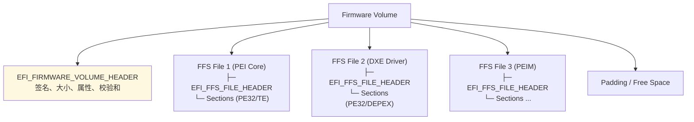

### 5.2 FFS 文件类型

| 类型值 | 含义 | 阶段 |
|--------|------|------|
| 0x01 | RAW | 任意 |
| 0x02 | FREEFORM | 任意 |
| 0x03 | SECURITY_CORE | SEC |
| 0x04 | PEI_CORE | PEI |
| 0x05 | DXE_CORE | DXE |
| 0x06 | PEIM | PEI |
| 0x07 | DRIVER | DXE |
| 0x08 | COMBINED_PEIM_DRIVER | PEI+DXE |
| 0x09 | APPLICATION | DXE |
| 0x0B | FFS_PAD | 填充 |

### 5.3 Flash 布局（以 RiscVVirt 为例）

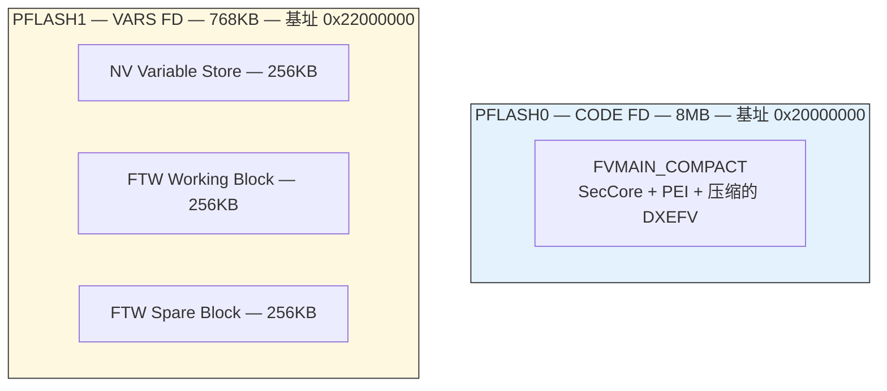

> **设计背景 — 为什么 CODE 和 VARS 分开？** CODE FD 包含固件代码（只读），VARS FD 包含 UEFI 变量存储（需要读写）。在物理硬件上，CODE 通常位于写保护的 Flash 区域，而 VARS 位于可写的 Flash 区域。这种分离既保护了固件代码不被意外写入，也允许变量存储独立更新。FTW（Fault Tolerant Write）机制确保变量写入的原子性——即使写入过程中断电，也不会损坏变量存储。

## 6. 依赖表达式（DEPEX）

DEPEX (Dependency Expression) 是 EDK2 驱动调度的核心机制，声明模块运行的前提条件。

> **设计背景 — 为什么需要 DEPEX？** DXE 阶段有数百个驱动需要调度，驱动之间存在复杂的依赖关系（如 PCI 驱动依赖 PCI Root Bridge 驱动）。手动指定加载顺序在大规模系统中不可维护。DEPEX 让每个驱动声明自己的依赖，DXE Dispatcher 根据依赖关系自动确定调度顺序——只要依赖满足就立即调度，最大化并行性。

### 6.1 PEI 阶段的 DEPEX

PEI 的 DEPEX 基于 PPI：

```c
// 在 INF 文件中声明
[Depex]
  gEfiPeiMemoryDiscoveredPpiGuid AND gEfiPeiFirmwareVolumeInfoPpiGuid
```

含义：此 PEIM 只有在内存初始化 PPI 和 FV 信息 PPI 都安装后才可调度。

### 6.2 DXE 阶段的 DEPEX

DXE 的 DEPEX 基于 Protocol：

```c
// 在 INF 文件中声明
[Depex]
  gEfiPciRootBridgeIoProtocolGuid AND gEfiCpuArchProtocolGuid
```

### 6.3 DEPEX 操作码

| 操作码 | 含义 |
|--------|------|
| `BEFORE` | 在指定 GUID 的驱动之前调度 |
| `AFTER` | 在指定 GUID 的驱动之后调度 |
| `PUSH` | 压入 GUID |
| `AND` | 逻辑与 |
| `OR` | 逻辑或 |
| `NOT` | 逻辑非 |
| `TRUE` | 恒真 |
| `FALSE` | 恒假 |
| `END` | 表达式结束 |

**DEPEX 求值模型**：使用栈式求值器，类似逆波兰表达式。DXE Dispatcher 维护一个已安装 Protocol 的集合，对每个待调度驱动的 DEPEX 字节码进行求值：遇到 GUID 就检查是否已安装（PUSH 结果），遇到 AND/OR/NOT 就弹出栈顶操作数进行逻辑运算，最终栈顶为 TRUE 时驱动可被调度。

---

**上一篇**：[00-overview.md](00-overview.md) — EDK2 全景地图
**下一篇**：[02-build-system.md](02-build-system.md) — 构建系统深入
