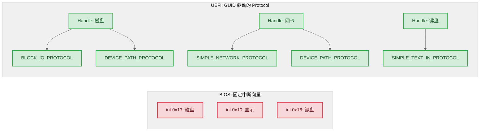

# 01 — 为什么存在 UEFI

> 不直接从 "写 HelloWorld 驱动" 开始。先理解 UEFI 解决的是谁的什么问题，EDK2 在其中的位置，以及贯穿始终的核心设计原则。这些是理解后续所有代码的基础。

### 关键术语
| 缩写 | 全称 | 含义 |
|------|------|------|
| UEFI | Unified Extensible Firmware Interface | 统一可扩展固件接口，取代传统 BIOS 的固件规范 |
| PI | Platform Initialization | UEFI 平台初始化规范，定义 SEC→PEI→DXE→BDS→RT 五个阶段 |
| DXE | Driver Execution Environment | 驱动执行环境，加载并执行设备驱动，构建 Protocol 数据库 |
| BDS | Boot Device Selection | 启动设备选择，按 BootOrder 加载 OS Loader |
| PEI | Pre-EFI Initialization | EFI 前初始化，在无 DDR 时用 Cache-as-RAM 初始化内存控制器 |
| SEC | Security Phase | 安全阶段，CPU 上电后第一段代码，建立临时栈并移交 PEI |
| GUID | Globally Unique Identifier | 全局唯一标识符，128 位值，UEFI 中用于标识一切（Protocol/文件/PCD） |

## 1. BIOS 的尽头

传统 BIOS（Basic Input/Output System）诞生于 1981 年的 IBM PC。它完成三件事：

1. **POST（上电自检）**：检查 CPU、内存、键盘等关键硬件是否在位
2. **枚举启动设备**：按 CMOS 里存储的顺序（软盘 → 硬盘 → 光驱）逐个尝试
3. **加载引导扇区**：读取第一个设备的第一个扇区（MBR，512 字节），如果最后两字节是 `0x55 0xAA`，就把 CPU 控制权交给这 512 字节里的代码

这个模型在 8086 时代是天才设计——够简单、够直接。但在 2020 年代的服务器和嵌入式设备上，它有四个致命问题：

### 1.1 16 位实模式：只能在 1MB 地址空间里干活

BIOS 运行在 x86 的**实模式**下——CPU 当自己是 8086，只有 16 位寄存器、20 位地址线（1MB 地址空间）。引导扇区的 512 字节代码想在 1MB 内存里初始化 64 位 CPU、TB 级内存、PCIe 设备树，就像拿勺子挖地铁。

```asm
; 典型传统 BIOS 引导扇区——你只有 512 字节，还只能用 16 位指令
org 0x7C00
bits 16
    cli
    mov ax, cs
    mov ds, ax
    mov ss, ax
    mov sp, 0x7C00
    ; 剩下 ~400 字节可用空间。这 400 字节里你得：
    ; - 加载内核或二级加载器 ← "磁盘在哪、怎么读？" 又要调 BIOS int 0x13
    ; - 切换到保护模式/长模式 ← 需要自己写 GDT、CR0/EFER 操作
    ; - 启用分页               ← 需要在 1MB 空间里构造页表
    ; 这就是为什么 GRUB 有两级（Stage1=446B MBR空间 + Stage2=core.img）
```

CPU 不是不能跑 64 位——是 BIOS 在把控制权交给 OS 之前，根本没机会用上。

### 1.2 MBR 的 32 位扇区号：2TB 天花板

MBR 分区表里 LBA 起始扇区号是 32 位的。每个扇区 512 字节 → `2^32 × 512 = 2TB`。超过 2TB 的磁盘，BIOS 根本无法通过 MBR 寻址。

GPT（GUID Partition Table）可以支持到 8ZB，但传统 BIOS **不认 GPT**——它只认 MBR。于是出现了各种 HACK：保护性 MBR、混合 MBR、BIOS boot partition。这已经不是在"引导"，而是在"祈祷"。

### 1.3 没有统一的设备驱动模型

BIOS 通过 `int 0x13`（磁盘）、`int 0x10`（显示）、`int 0x16`（键盘）等软件中断提供服务。这些"服务"是为 1980 年代的硬件设计的：

- `int 0x13` 只知道 CHS 寻址（柱面/磁头/扇区），后来加的 LBA 扩展也不是所有 BIOS 都支持
- 没有网络栈、没有 USB 栈（USB 键盘的支持也是后来硬塞进去的）
- 每种新硬件类型需要 BIOS 厂商手动加支持，没有统一的扩展机制

这意味着：**BIOS 启动阶段能用的设备就是 BIOS 厂商决定让你用的那些**。你想在固件阶段从 NVMe SSD 读内核？祈祷你的 BIOS 厂商支持 NVMe。你想通过网络启动？祈祷 PXE ROM 存在且没 bug。

### 1.4 BIOS 启动 = 不可控的黑箱

```
BIOS → MBR → 引导加载器 → 内核
 ↑
  ？？？这之间发生了什么？？？
  - 哪些中断向量被修改了？
  - 缓存策略是什么？
  - USB 控制器被设置成什么状态？
  - 内存里哪些区域被 BIOS SMM 占用了？
```

OS 内核启动后，对整个启动过程中硬件的状态几乎一无所知。ACPI 表的出现缓解了一部分问题（描述硬件配置），但**控制权的交接**仍然是粗暴的——OS 拿到的硬件状态完全取决于 BIOS 厂商的实现细节。

---

## 2. UEFI 的设计哲学

UEFI（Unified Extensible Firmware Interface）是对上述每一个问题的回应。它的设计原则不是"把 BIOS 做快一点"，而是**彻底换一种模型**。

### 2.1 原生 64 位，从第一条指令开始

UEFI 固件编译为 PE/COFF 格式（Windows 的可执行格式），在 CPU 的长模式/保护模式下运行。从 SEC 阶段的第一条指令汇编跳到 C 入口后，就是完整的 64 位 C 代码——可以用 64 位指针、TB 级地址空间、完整的 Cache/TLB 控制。

```c
// UEFI 驱动程序的入口签名——直接就是 64 位 C，没有"先切模式"这一步
EFI_STATUS EFIAPI MyDriverEntryPoint (
  IN EFI_HANDLE        ImageHandle,
  IN EFI_SYSTEM_TABLE  *SystemTable
  );
```

### 2.2 GPT 分区表：原生支持超大磁盘

UEFI 直接要求固件理解 GPT。启动策略变为：扫描所有 GPT 磁盘 → 找到 EFI System Partition（ESP，类型 GUID `C12A7328-F81F-11D2-BA4B-00A0C93EC93B`）→ 在 ESP 中按规则查找启动文件（如 `\EFI\BOOT\BOOTX64.EFI` 或 NVRAM 里存的 BootOrder）。不再有 MBR 的 2TB 限制，不再有"引导扇区放不下"的问题。

### 2.3 Protocol 模型：统一且可扩展的设备抽象

这是 UEFI 最重要的设计。BIOS 的 `int 0x13` 是写死在中断向量表里的磁盘接口——你不能给它"加一个新功能"，也不能让一个 USB 键盘和一个 PS/2 键盘用同一个接口。

UEFI 的答案是 **Protocol**：用 GUID 标识的接口。一个驱动想声明"我可以读写扇区"→ 在 Handle 上安装 `EFI_BLOCK_IO_PROTOCOL`。另一个驱动想声明"我可以提供网络包收发"→ 安装 `EFI_SIMPLE_NETWORK_PROTOCOL`。



只要知道 GUID，任何驱动都能发现并调用 Protocol。第三方硬件厂商不需要修改固件核心——只需提供一个驱动，安装自己的 Protocol。

### 2.4 把手（Handle）与协议（Protocol）的分离

BIOS 中"磁盘接口"和"这个接口属于哪个磁盘"是同一个东西（int 0x13 + 驱动器号 DL=0x80）。UEFI 把它们分开：

- **Handle** = "这个实体是谁"——一个不透明的容器，代表系统中存在的一个事物（设备、驱动映像、服务实例）
- **Protocol** = "这个实体能做什么"——挂在 Handle 上的 GUID 标签

同一个 Handle 可以挂多个 Protocol。例如一块 NVMe 磁盘的 Handle 同时挂着：
- `EFI_PCI_IO_PROTOCOL` — "我通过 PCI 总线访问"
- `EFI_BLOCK_IO_PROTOCOL` — "我可以读写扇区"
- `EFI_DEVICE_PATH_PROTOCOL` — "我在设备树中的路径"

这种设计让设备驱动可以**分层次叠加能力**——总线驱动先挂硬件访问层，设备驱动再挂功能层，文件系统驱动再挂文件抽象层。每一层只依赖下层 Protocol 的 GUID，不关心下层是谁实现的。

---

## 3. 两套规范，一个实现

理解 UEFI 的关键是区分两个独立但互补的规范：

| 规范 | 全称 | 定义什么 | 读者 |
|------|------|---------|------|
| **UEFI 规范** | Unified Extensible Firmware Interface Specification | 固件暴露给 OS 的接口 | OS 开发者 |
| **PI 规范** | Platform Initialization Specification | 固件内部的初始化流程 | 固件/Silicon 开发者 |

```
┌─────────────────────────────────────────────────┐
│  OS Loader / OS Kernel                          │  ← 只看 UEFI 规范
│  (只调用 UEFI Boot Services / Runtime Services)  │
├──────────────────────┬──────────────────────────┤
│  Runtime Services    │  (OS 运行时仍可调用)       │  ← UEFI 规范定义
├──────────────────────┤                          │
│  Boot Services       │  ExitBootServices() 后失效│
├──────────────────────┴──────────────────────────┤
│  固件内部实现                                      │  ← PI 规范定义
│  SEC → PEI → DXE (Dispatcher + Core) → BDS      │     (EDK2 实现)
└─────────────────────────────────────────────────┘
```

这种分离正是 UEFI 生态能容纳多家固件厂商（AMI、Insyde、Phoenix 以及开源 EDK2）的关键——**只要暴露给 OS 的接口一致，内部怎么实现的没人管**。ARM 服务器和 x86 服务器的 UEFI 固件内部结构完全不同，但 OS 看到的接口是一样的。

### EDK2：开源参考实现

EDK2（EFI Development Kit II）是 TianoCore 社区维护的**开源 PI 规范参考实现**。它提供了：

- `MdePkg`（Module Development Environment Package）：基础类型定义、库、工业标准 Protocol 头
- `MdeModulePkg`：DXE Core、BDS、通用驱动（磁盘、文件系统、网络）
- 构建系统（BaseTools + AutoGen）
- 平台支持：`OvmfPkg`（QEMU x86）、`ArmVirtPkg`（QEMU ARM）、`OvmfPkg/RiscVVirt`（QEMU RISC-V）

你在本系列中写的所有驱动、PEIM、Library 都是在这个框架之上构建的。

---

## 4. 贯穿始终的三个核心原则

在进入下一章的启动流程之前，先记住这三个原则——它们的适用场景会越来越具体：

### 原则一：一切资源都通过 Handle 数据库管理

驱动不用全局变量共享数据，不依赖编译链接顺序。唯一的公共空间是 Handle 数据库：你在上面安装什么 Protocol，别人就能通过 GUID 发现什么。这个原则贯穿 PEI/DXE/BDS 三个阶段（PEI 阶段数据库叫 PPI 数据库，原理相同）。

### 原则二：生产者和消费者完全解耦

安装 Protocol 的驱动和调用 Protocol 的驱动互不知道对方的存在。它们唯一的交集是 GUID。这意味着：
- 你可以替换网络驱动而不影响文件系统驱动
- 你可以用 QEMU 的虚拟磁盘驱动、也可以用真实 NVMe 驱动，BDS 不关心
- 第三方可以写出原厂固件不知道的设备驱动，只要按声明的 GUID 安装 Protocol

### 原则三：驱动调度是被动发现，不是主动调用

你的驱动不是"被 Dispatcher 调用然后依次初始化设备"。而是 Dispatcher 只负责**找到符合 DEPEX 的驱动并调用它的入口点**。驱动在入口点里自己决定安装什么 Protocol。接下来**其他驱动通过 DriverBinding 或通知回调来发现新设备**，而不是 Dispatcher 告诉它们。

---

**下一篇**：[02-一次完整启动](./02-boot-sequence.md) — SEC → PEI → DXE → BDS → OS Loader，从按下电源到内核接手
