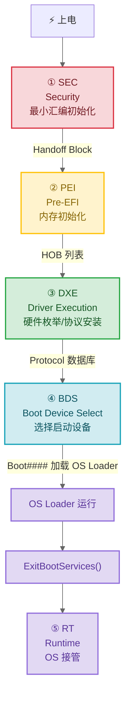

# 02 — 一次完整启动

> 从按下电源到 Linux 内核接手，固件做了哪些事？这篇按时间顺序把五个阶段走一遍，让你建立"什么阶段有什么事、能干什么、不能干什么"的直觉。具体的 API 和代码留在后面几篇。

## 1. 五分钟速览



每个阶段向上输出一组能力，下一阶段在这个基础上扩展：

| 阶段 | 内存 | 可用的通信机制 | 输出 |
|------|------|-------------|------|
| **SEC** | 无可用内存（纯寄存器 + Cache-as-RAM） | 无（串口直写） | Handoff Block（PEI Core 位置 + 临时 RAM 描述） |
| **PEI** | 临时 RAM（CAR，几十 KB）→ 后期获得 DDR | PPI（单实例，无引用计数） | HOB 列表（内存描述、固件卷位置、平台数据） |
| **DXE** | 充足 DDR（GB 级） | Protocol（多实例，引用计数）| 完整的驱动栈和 Protocol 数据库 |
| **BDS** | 充足 DDR | Protocol（同上）| OS Loader image（GRUB/Windows Boot Manager 等） |
| **RT** | 由 OS 管理 | Runtime Services（受限子集）| OS 内核运行 |

---

## 2. SEC：只有寄存器，怎么跑 C 代码？

SEC（Security Phase）是 CPU 上电后执行的第一段代码。此时：
- **没有 DRAM** —— DDR 控制器的寄存器还没写，内存颗粒不可用
- **只有 CPU 寄存器** —— 这就是你的全部可用"变量空间"
- **没有 C 运行环境** —— 没有栈、没有 `.bss`、没有 `malloc`

SEC 需要解决三件事：

### 2.1 建立临时栈：Cache-as-RAM（CAR）

现代 CPU 的 L1/L2 Cache 可以作为临时内存使用。在 RISC-V 上，OpenSBI（M-mode）已经为 S-mode UEFI 准备好了临时栈。在 x86 上，SEC 代码需要自己配置 CAR：

```
x86 CAR 原理：将 L1/L2 Cache 配置为 "No-Fill" 模式
→ 任何从未在 Cache 中的地址访问会触发 cache line fill（占用一条）
→ 之后对该地址的读写都直接命中 Cache，不回写 DRAM
→ 只要不显式 flush，这些 cache line 就是稳定的临时 RAM
```

### 2.2 跳转到 PEI Core

SEC 的汇编代码设好栈指针后，立即跳转到 C 函数（`SecStartupPlatform`），然后在 C 中定位 PEI Core 映像在 Flash 中的位置，通过 `PeiCore(&SecCoreData, NULL)` 交出控制权。

传递的数据结构叫 **Handoff Block**，包含：
- 临时 RAM 的基址和大小
- PEI Core 所在的固件卷（FV）位置
- Boot Firmware Volume（BFV）的基址

### 2.3 为什么叫 "Security"

SEC 阶段还可以做可信计算的"根信任"——在 CPU 执行第一条固件指令之前，硬件度量固件映像的哈希值写入 TPM。这是整个启动信任链的起点：SEC 度量 PEI → PEI 度量 DXE → DXE 度量 OS Loader → OS Loader 度量内核。

---

## 3. PEI：几十 KB 内存里初始化 GB 级 DDR

PEI（Pre-EFI Initialization）有明确的任务：**把 DDR 控制器初始化好，把真正的内存交给下个阶段**。它操作的"内存"仍然只是 CAR 提供的那几十 KB 临时 RAM。

### 3.1 PEI Core 的工作

PEI Core 本质上是一个微缩版的 Dispatcher。它做的事和 DXE Core 相似：

1. **扫描 FV（Firmware Volume）**：找到 Flash 中所有 PEIM（PEI Module）映像
2. **解析 DEPEX**：PEIM 的 `.depex` 段也是字节码——如 `gEfiPcdPpiGuid AND gEfiPeiMemoryDiscoveredPpiGuid`，意思是在 DDR 初始化完成之前不要加载我
3. **按依赖调度**：满足 DEPEX 的 PEIM 就调用它的入口点

每个 PEIM 的入口函数：

```c
EFI_STATUS EFIAPI MyPeimEntryPoint (
  IN       EFI_PEI_FILE_HANDLE  FileHandle,
  IN CONST EFI_PEI_SERVICES     **PeiServices
  );
```

### 3.2 PPI：PEI 阶段的 Protocol

在 PEI 阶段，Handle 数据库被称为 **PPI 数据库**。核心区别：

| | Protocol | PPI |
|---|---------|-----|
| 实例 | 一个 GUID 可以有多个实例（不同 Handle） | 一个 GUID 只有一个实例 |
| 引用计数 | 有（OpenProtocol/CloseProtocol 管理生命周期） | 无 |
| 注册方式 | InstallProtocolInterface / InstallMultipleProtocolInterfaces | `PeiServices->InstallPpi(&PpiDescriptor)` |

PPI 的单实例限制简化了实现——PEI 只有几十 KB 代码空间，不值得引入复杂的引用计数管理。

### 3.3 内存初始化的两个关键 PEIM

**PEIM 1：内存控制器驱动**

初始化 DDR PHY 和 Memory Controller。成功后安装 `gEfiPeiMemoryDiscoveredPpiGuid`。这是一个"里程碑" PPI——在该 PPI 安装之前，PEI Dispatcher 只加载不需要内存的 PEIM。

**PEIM 2：内存分配 PEIM**

收到 `gEfiPeiMemoryDiscoveredPpiGuid` 通知后：
- 从 FDT/ACPI/平台配置中读取完整的地址空间描述（哪段是 DRAM、哪段是 MMIO），也负责处理 NUMA 拓扑和内存交错的复杂场景
- 调用 `PeiServicesInstallPeiMemory(Base, Size)` 安装 PEI 永久内存
- 从此 `PeiServices->AllocatePages` 和 `malloc` 可用

### 3.4 HOB：内存描述如何传给 DXE

DDR 初始化完之后，PEIM 把内存布局编码为 **HOB（Hand-Off Block）**——一串堆在内存里的链表，每个节点描述一个资源：

```
HOB 列表结构（简化）：
┌──────────────────────────────┐
│ PHIT HOB（表头：总大小、HOB 版本）│
├──────────────────────────────┤
│ RES_DESCRIPTOR HOB           │ → "0x8000_0000 ~ 0xC000_0000 是可用 DRAM"
├──────────────────────────────┤
│ RES_DESCRIPTOR HOB           │ → "0x1000_0000 ~ 0x1000_1FFF 是 MMIO"
├──────────────────────────────┤
│ RES_DESCRIPTOR HOB           │ → "0xBF00_0000 ~ 0xBFFF_FFFF 是固件保留区"
├──────────────────────────────┤
│ GuidData HOB                 │ → "这里是一段平台特定的二进制数据"
├──────────────────────────────┤
│ ...                          │
└──────────────────────────────┘
```

PEIM 调用 `BuildResourceDescriptorHob` 和 `BuildGuidDataHob` 等函数往 HOB 列表追加条目。DXE Core 启动后第一件事就是遍历 HOB 列表，把每个 Resource HOB 注册为 UEFI 内存映射中的条目。

**PEI 阶段最关键的约束：极简主义。** CAR 只有几十 KB，大数组、递归、不必要的动态分配都会把 CAR 撑爆。PEIM 只做信息收集，业务逻辑全留给 DXE。设备驱动初始化更是在 DXE 阶段做的事——PEI 碰都不要碰。

---

## 4. DXE：驱动执行，设备枚举

PEI 的最后一步是把 HOB 列表和 DXE Core 映像的地址传给 `DxeMain`，然后 DXE Core 接管一切。从此内存充足（GB 级），Protocol 可用，真正的驱动栈开始构建。

### 4.1 DXE Core 启动

1. **加载 DXE Dispatcher**：从 FV 中枚举所有 DXE 驱动映像
2. **初始化 DXE Architecture Protocols**：安装 Security、CPU、Metronome、Timer、BDS、Watchdog Timer、Runtime 七个 Architectural Protocols。它们是 DXE 系统的"标准依赖"。
3. **调度驱动**：按 DEPEX 字节码决定加载顺序

### 4.2 Protocol 数据库

DXE Core 维护一个全局的 Handle 数据库。所有的安装、查找、回调都围绕这个数据库：

| API | 效果 |
|-----|------|
| `InstallProtocolInterface(&Handle, &Guid, IF, &Instance)` | 在 Handle 上安装 Protocol。Handle 为 NULL 时自动创建新 Handle |
| `LocateProtocol(&Guid, NULL, &Ptr)` | 返回第一个匹配的实例（假定单例） |
| `LocateHandleBuffer(ByProtocol, &Guid, NULL, &Count, &Handles)` | 枚举所有安装了某 Protocol 的 Handle |

完整的 Handle/Protocol 机制在 [04-Handle-Protocol核心模型](./04-handle-protocol.md) 中展开。

### 4.3 磁盘和文件系统的故事

这个场景虽不复杂，但它涵盖了你写驱动时会碰到的所有概念：Handle 创建、Protocol 安装、消费者查找、通知回调。

**DiskDxe（生产者）**：创建 Handle，在上面安装 BlockIoProtocol

```c
EFI_STATUS EFIAPI DiskDriverEntryPoint (
  IN EFI_HANDLE ImageHandle, IN EFI_SYSTEM_TABLE *SystemTable)
{
  EFI_HANDLE  DiskHandle;

  DiskHandle = NULL;  // NULL → 系统自动创建新的 Handle
  gBS->InstallProtocolInterface (
          &DiskHandle, &gEfiBlockIoProtocolGuid,
          EFI_NATIVE_INTERFACE, &gBlockIo);
  return EFI_SUCCESS;
}
```

**FatDxe（消费者）**：枚举所有 BlockIo Handle，读第一个扇区判断文件系统类型

```c
EFI_STATUS EFIAPI FatDriverEntryPoint (
  IN EFI_HANDLE ImageHandle, IN EFI_SYSTEM_TABLE *SystemTable)
{
  EFI_HANDLE  *BlockIoHandles;
  UINTN        Count;

  gBS->LocateHandleBuffer (
          ByProtocol, &gEfiBlockIoProtocolGuid, NULL, &Count, &BlockIoHandles);
  for (UINTN i = 0; i < Count; i++) {
    EFI_BLOCK_IO_PROTOCOL  *BlockIo;
    gBS->HandleProtocol (BlockIoHandles[i], &gEfiBlockIoProtocolGuid, (VOID**)&BlockIo);
    if (IsFatVolume(BlockIo)) {
      InstallSimpleFileSystemOn (BlockIoHandles[i]);
    }
  }
  gBS->FreePool (BlockIoHandles);
  return EFI_SUCCESS;
}
```

注意两个驱动的入口函数互相不调用，只通过 GUID 在 Handle 数据库中交互。这就是 UEFI 驱动模型的核心。

---

## 5. BDS：启动策略

BDS（Boot Device Selection）不再初始化硬件。它的任务只有一个：**按规则选择启动设备，把 OS Loader 映像加载到内存并调用**。

### 5.1 启动选项

UEFI 固件按以下优先级选择 OS Loader：

1. **平台恢复**：如果系统恢复标志位被设置，进入恢复流程
2. **Boot####**：Platform Boot Manager 读取 NVRAM 中的 BootOrder（如 `0004,0000,0001`），按顺序尝试每个 Boot#### 选项
3. **平台默认**：没有有效 BootOrder 或全部失败 → 尝试每个 `BootManagerMenu` 或遍历设备路径 `\EFI\BOOT\BOOT{RISCV64,AA64,X64}.EFI`

每个 Boot#### 变量包含：
- `EFI_LOAD_OPTION` 结构（FilePathList + 描述字符串 + OptionalData）
- FilePathList = 设备路径（告诉固件"启动设备在哪" + "启动文件在 ESP 里的路径"，例如 `\EFI\opensuse\grubriscv64.efi`）

### 5.2 固件到 OS 的交接

选好 OS Loader 后，通过 `gBS->LoadImage()` 加载 OS Loader 映像，再调用 `gBS->StartImage()`. OS Loader 运行后，在将控制权交给内核的关键时刻调用 `ExitBootServices()`——从此：

- `gBS`（Boot Services）完全失效，Runtime Services 仍然可用
- OS 已经接管控权：中断向量表、ASID、MMU 配置

`ExitBootServices` 必须是固件环境下的最后一个 UEFI 服务调用——之后调用任何 `gBS` 函数都是未定义行为。驱动需要在此事件中停止 DMA、将设备置于 OS 可接收的状态。

具体的事件注册和清理流程在 [06-事件-TPL-DEPEX](./06-events-tpl-depex.md) 中展开。

---

**上一篇**：[01-为什么存在 UEFI](./01-why-uefi.md)  
**下一篇**：[03-先跑起来](./03-quick-start.md) — clone 仓库、编译、用 QEMU 看到第一条 DEBUG 日志
