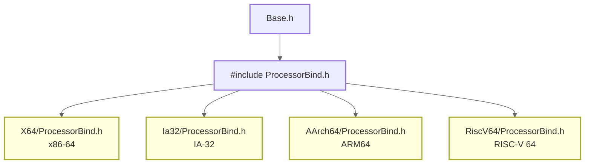

# 类型系统与编码规范

> EDK2 的类型系统是所有代码的根基。读懂它，你才能读懂任何 EDK2 源码。

### 关键术语

| 缩写 | 全称 | 含义 |
|------|------|------|
| EFI_STATUS | EFI Status Code | UEFI 函数返回状态码 |
| GUID | Globally Unique Identifier | 全局唯一标识符，UEFI 的"万能钥匙" |
| EFIAPI | EFI Application Programming Interface | UEFI 调用约定标记 |
| IN/OUT | Input/Output | 函数参数方向修饰符 |
| PCD | Platform Configuration Database | 平台配置数据库，编译时可配置的常量/宏 |

---

## 1. 前置知识

| 需要了解 | 参考文档 |
|----------|----------|
| C 语言基础与指针操作 | — |
| 已成功构建并运行固件 | [01-快速上手](./01-quick-start.md) |

---

## 2. 为什么要理解类型系统

EDK2 的类型系统定义在 `MdePkg/Include/Base.h` 中，通过 `ProcessorBind.h` 实现架构无关性。这是你写任何 EDK2 代码前必须理解的基础。

**核心目标**：同一份源码可以在 x86、ARM、RISC-V 上编译运行。

### 2.1 架构绑定机制



`ProcessorBind.h` 的核心职责是定义 `UINTN`/`INTN`（与指针等宽的整数）和函数调用约定。在 RISC-V 64 上，`UINTN` 是 64 位。

> **设计背景**：UEFI 规范要求固件代码可以在多种 CPU 架构上编译运行。`ProcessorBind.h` 将所有架构相关的类型定义集中到一个文件中，上层代码只需包含 `Base.h` 即可获得架构无关的类型系统。

---

## 3. 核心数据类型

```c
// 固定宽度整数（与 Linux 内核的 u8/u16/u32/u64 对应）
UINT8, UINT16, UINT32, UINT64    // 无符号
INT8,  INT16,  INT32,  INT64     // 有符号

// 指针宽度整数（类似 Linux 的 unsigned long / long）
UINTN, INTN                       // 大小 = sizeof(void*)

// 布尔（注意：UEFI 的 BOOLEAN 是 1 字节，不是 C 的 int）
BOOLEAN                           // 必须为 TRUE (1) 或 FALSE (0)

// 字符
CHAR8                             // ASCII (1 字节)
CHAR16                            // UCS-2 (2 字节，UEFI 字符串编码)

// 物理地址
PHYSICAL_ADDRESS                  // UINT64，即使 32 位系统也是 64 位

// GUID（128 位唯一标识符）
typedef struct {
  UINT32  Data1;
  UINT16  Data2;
  UINT16  Data3;
  UINT8   Data4[8];
} GUID;
```

> **为什么 UEFI 使用 UCS-2 而非 UTF-8？** UEFI 规范制定于 2000 年代初，UCS-2 是最简单的定宽编码方案，实现成本低。代价是不支持 Unicode 代理对，无法表示 BMP 之外的字符。

---

## 4. 函数参数修饰符

UEFI 代码最显眼的风格特征——`IN`/`OUT`/`OPTIONAL`：

```c
EFI_STATUS
EFIAPI
SomeFunction (
  IN     EFI_HANDLE   Handle,        // 输入参数
  IN OUT UINTN        *BufferSize,   // 输入输出参数
  OUT    VOID         *Buffer,       // 输出参数
  IN     BOOLEAN      OptionalFlag  OPTIONAL  // 可选参数
  );
```

这些修饰符在编译时展开为空，纯粹是给人类看的文档。但它们在代码审查时极其有用——一眼就能看出参数的方向。

> **设计背景**：固件代码中指针的输入/输出语义对安全性至关重要。错误地理解一个指针参数是输入还是输出，可能导致写入只读内存或使用未初始化的数据。

---

## 5. 状态码体系

UEFI 的函数几乎都返回 `EFI_STATUS`（本质是 `UINTN`）：

```
编码规则（32 位视图）：
  Bit 31 = 1 → 错误 (Error)
  Bit 31 = 0, Bit 30 = 1 → 警告 (Warning)
  Bit 31 = 0, Bit 30 = 0 → 成功 (Success)

常用状态码：
  EFI_SUCCESS              (0x00000000)  // 成功
  EFI_INVALID_PARAMETER    (0x80000002)  // 错误：参数无效
  EFI_UNSUPPORTED          (0x80000003)  // 错误：不支持
  EFI_DEVICE_ERROR         (0x80000007)  // 错误：设备错误
  EFI_OUT_OF_RESOURCES     (0x80000009)  // 错误：资源不足
  EFI_NOT_FOUND            (0x8000000E)  // 错误：未找到
  EFI_ACCESS_DENIED        (0x8000000F)  // 错误：访问拒绝
```

**判断宏**：
- `EFI_ERROR(Status)` — 检查 Bit 31 是否为 1（是否为错误）
- 注意：警告不算错误，`EFI_ERROR` 对警告返回 `FALSE`

---

## 6. 实用宏

```c
// 从成员指针获取结构体指针（Linux 内核的 container_of）
BASE_CR(Record, TYPE, Field)

// 编译时断言
STATIC_ASSERT(expression, message)

// 位掩码（BIT0 到 BIT63，寄存器操作必备）
BIT0, BIT1, BIT2, ... BIT63

// 对齐宏
ALIGN_VALUE(Value, Alignment)    // 向上对齐
IS_ALIGNED(Value, Alignment)     // 判断对齐
```

---

## 7. EFIAPI 调用约定

调用约定规定函数调用时**参数如何传递、栈由谁清理**。不同编译器默认约定不同，跨模块调用时若约定不一致，会导致栈指针错乱、返回地址污染，最终崩溃。

`EFIAPI` 是 UEFI 强制统一的调用约定宏，消除编译器差异：

| 架构 | `EFIAPI` 展开为 | 栈清理责任 |
|------|----------------|-----------|
| IA32 (x86 32位) | `__cdecl` | 调用者 |
| X64 (x86 64位) | `__attribute__((ms_abi))` | 调用者 |
| AArch64 / ARM | （默认 AAPCS） | 调用者 |
| RISC-V | （默认 RISC-V ABI） | 调用者 |

**使用场景**：所有跨模块调用的函数必须加 `EFIAPI`，包括 Protocol/PPI 接口、UEFI 入口点、回调函数、库接口。

**示例**：

```c
EFI_STATUS EFIAPI UefiMain(IN EFI_HANDLE ImageHandle, IN EFI_SYSTEM_TABLE *SystemTable)
{
    // EFIAPI 确保无论用 GCC 还是 MSVC 编译，参数传递方式一致
}
```

> **设计背景**：UEFI 固件由多个独立编译的模块（DXE 驱动、UEFI 应用、Shell 命令）链接而成。`EFIAPI` 强制所有模块按同一套规则传参，避免因编译器默认行为差异导致的运行时崩溃。

---

## 8. 编码规范要点

### 8.1 命名约定

| 类型 | 规范 | 示例 |
|------|------|------|
| 函数 | PascalCase | `InitializePlatform` |
| 宏 | UPPER_SNAKE_CASE | `MAX_BUFFER_SIZE` |
| 全局变量 | m 前缀 + PascalCase | `mDriverHandle` |
| 局部变量 | 小写 + 下划线 | `buffer_size` |
| 结构体类型 | _ 前缀 + PascalCase | `_MY_DRIVER_CONTEXT` |
| Protocol/PPI | g 前缀 | `gMyProtocolGuid` |
| PCD | Pcd 前缀 | `PcdMaxVariableSize` |

> **设计背景**：`m` 前缀（member）标识模块级全局变量，`g` 前缀（global）标识跨模块共享的全局符号。这种命名约定让代码审查者一眼就能区分变量的作用域。

### 8.2 关键规则

1. **所有公共函数必须使用 EFIAPI**
2. **参数必须使用 IN/OUT/IN OUT/OPTIONAL 修饰**
3. **所有函数必须返回 EFI_STATUS**（除了 VOID 返回的函数）
4. **禁止使用 C 标准库函数**（使用 EDK2 的 BaseLib/BaseMemoryLib 替代）
5. **禁止使用浮点运算**（UEFI 环境不保证 FPU 可用）
6. **禁止使用全局变量初始化**（除 CONST 变量外）

> **为什么禁止全局变量初始化？** UEFI 模块从 Flash 加载执行，Flash 是只读的。非 CONST 的初始化全局变量存储在 `.data` 段，需要加载器将其复制到可写内存。但在固件环境中（尤其是 PEI 阶段），可能没有可写内存来存放 `.data` 段。

### 8.3 禁止使用的 C 标准库函数及替代

| 禁止 | 替代 |
|------|------|
| `memcpy` | `CopyMem` |
| `memset` | `SetMem` / `ZeroMem` |
| `memcmp` | `CompareMem` |
| `strlen` | `StrLen` / `AsciiStrLen` |
| `strcpy` | `StrCpyS` / `AsciiStrCpyS` |
| `printf` | `Print` / `DEBUG` |
| `malloc`/`free` | `gBS->AllocatePool`/`FreePool` |

> **为什么禁止 C 标准库？** UEFI 环境没有 OS 提供的 C 运行时。EDK2 通过 BaseLib 和 BaseMemoryLib 提供了精简的替代实现，这些库直接操作硬件，不依赖任何 OS 服务。

---

## 9. 调试输出

### 9.1 DebugLib 使用

```c
// 调试级别（从低到高）
DEBUG_INFO      0x00000040   ← 最常用
DEBUG_ERROR     0x80000000   ← 错误信息
DEBUG_WARN      0x00000002
DEBUG_LOAD      0x00000004
DEBUG_VERBOSE   0x00400000

// 使用
DEBUG ((DEBUG_INFO, "MyDriver: Value = 0x%x\n", Value));
DEBUG ((DEBUG_ERROR, "MyDriver: Failed!\n"));

// 条件断言
ASSERT (Value != NULL);
ASSERT_EFI_ERROR (Status);
```

> `DEBUG` 宏在 RELEASE 构建中会被编译器完全消除（零开销），在 DEBUG 构建中才输出日志。

### 9.2 PCD 控制调试级别

```ini
# 在 DSC 文件中设置调试输出级别
[PcdsFixedAtBuild]
  gEfiMdePkgTokenSpaceGuid.PcdDebugPrintErrorLevel|0x80000047
```

---

## 10. 要点回顾

| 要点 | 说明 |
|------|------|
| `ProcessorBind.h` 实现架构无关的类型系统 | 同一源码可在 x86/ARM/RISC-V 上编译 |
| `UINTN` 与指针等宽 | RISC-V 64 上是 64 位 |
| `IN`/`OUT`/`OPTIONAL` 编译时展开为空 | 用于代码审查和静态分析 |
| `EFI_STATUS` 的 Bit 31 区分错误和成功 | 警告不算错误 |
| `EFIAPI` 是跨架构调用约定的关键 | 没有它跨模块调用可能崩溃 |
| 禁止使用 C 标准库 | 用 BaseLib/BaseMemoryLib 替代 |

---

## 参考资料

- [UEFI Specification 2.10](https://uefi.org/specs/UEFI/2.10/) — 第 2 章定义了数据类型
- [EDK2 Source: MdePkg/Include/Base.h](https://github.com/tianocore/edk2/blob/master/MdePkg/Include/Base.h) — 类型定义源码

---

**上一篇**：[01-快速上手](./01-quick-start.md) — 构建与运行
**下一篇**：[03-启动流程详解](./03-boot-flow.md) — SEC→PEI→DXE→BDS
