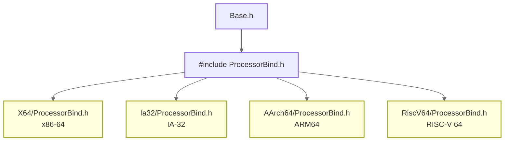

# 类型系统与编码规范

> EDK2 的代码要跑在 x86、ARM、RISC-V 三种 CPU 上。但 C 语言的 `int`、`long`、`size_t` 的大小在不同架构上不一样——32 位 ARM 上 `long` 是 32 位，64 位 RISC-V 上 `long` 是 64 位。怎么写一份代码让所有架构都能编译？

### 关键术语

| 缩写 | 全称 | 含义 |
|------|------|------|
| EFI_STATUS | EFI Status Code | UEFI 函数返回状态码 |
| GUID | Globally Unique Identifier | 全局唯一标识符，UEFI 的"万能钥匙" |
| EFIAPI | EFI Application Programming Interface | UEFI 调用约定标记，确保跨模块参数传递一致 |
| IN/OUT | Input/Output | 函数参数方向修饰符（编译时展开为空，为人类阅读服务） |
| PCD | Platform Configuration Database | 平台配置数据库，编译时可配置的常量/宏 |

---

## 1. 前置知识

| 需要了解 | 参考文档 |
|----------|----------|
| C 语言基础与指针操作 | — |
| 已成功构建并运行固件 | [01-快速上手](./01-quick-start.md) |
| EDK2 的基本概念（包、模块、元数据文件） | [00-全景地图](./00-overview.md) |

---

## 2. 问题：跨架构的类型一致性

C 标准不保证基本类型的大小，只规定相对关系。例如：

| 类型 | x86-64 (LP64) | ARM64 (LP64) | RISC-V 64 (LP64) | 32 位 ARM (ILP32) |
|------|:---:|:---:|:---:|:---:|
| `int` | 32 | 32 | 32 | 32 |
| `long` | **64** | **64** | **64** | **32** |
| `size_t` | **64** | **64** | **64** | **32** |
| `void*` | 64 | 64 | 64 | 32 |

`long` 和 `size_t` 的大小随架构变化。如果用 `unsigned long` 定义物理地址，代码在 32 位平台上就会截断高 32 位。

EDK2 的解法是：**不用标准 C 类型，而是用一组架构无关的固定宽度类型**——这就是 `UINT32`、`UINTN` 等。这些类型定义在 `MdePkg/Include/Base.h` 中，通过 `ProcessorBind.h` 为每个架构提供绑定。

### 2.1 架构绑定机制



`ProcessorBind.h` 的核心职责：
1. 定义 `UINTN`/`INTN`——与指针等宽的无符号/有符号整数类型
2. 定义调用约定——`EFIAPI` 在不同架构上展开为不同的编译器指令

在你的 RISC-V 64 开发环境中，`ProcessorBind.h` 来自 `MdePkg/Include/RiscV64/`，它会：
- `typedef unsigned long long UINT64`（RISC-V `long` 是 64 位，但用 `long long` 更明确）
- `typedef unsigned long UINTN`（64 位 = 与 `void*` 等宽）
- `#define EFIAPI` 为空（RISC-V 的默认 LP64 ABI 满足要求）

你只需要 `#include <Base.h>`，不用管具体架构是哪一个。

---

## 3. 核心数据类型

```c
// 固定宽度整数
UINT8, UINT16, UINT32, UINT64    // 无符号
INT8,  INT16,  INT32,  INT64     // 有符号

// 指针宽度整数（类似 Linux 内核的 unsigned long / long）
UINTN, INTN                       // 大小 = sizeof(void*)

// 布尔
BOOLEAN                           // 1 字节，必须为 TRUE (1) 或 FALSE (0)

// 字符
CHAR8                             // ASCII (1 字节)
CHAR16                            // UCS-2 (2 字节，UEFI 字符串的标准编码)

// 物理地址
PHYSICAL_ADDRESS                  // UINT64，32 位系统也是 64 位

// GUID（128 位唯一标识符）
typedef struct {
  UINT32  Data1;
  UINT16  Data2;
  UINT16  Data3;
  UINT8   Data4[8];
} GUID;
```

几个值得注意的设计决策：

**UINTN vs UINT32**：`UINTN` 的大小等于指针宽度——在 64 位系统上是 64 位，32 位系统上是 32 位。用它来存尺寸、计数、句柄等与指针相关的值。如果确定值不超过 32 位（如一个寄存器的偏移），用 `UINT32` 更省空间。

**CHAR16 = UCS-2**：UEFI 使用 UCS-2 而非 UTF-8，是历史原因。UEFI 规范制定于 2000 年代初，UCS-2 是当时最简单的定宽编码，实现成本低。代价是不支持代理对，无法表示 BMP 之外的 Unicode 字符。

**PHYSICAL_ADDRESS 始终是 64 位**：即使 32 位系统，物理地址也可能是 36 位（PAE）或 40 位（ARM LPAE），用 64 位保证不截断。

---

## 4. 函数参数修饰符

UEFI 代码最显眼的风格特征——`IN`/`OUT`/`OPTIONAL`：

```c
EFI_STATUS
EFIAPI
SomeFunction (
  IN     EFI_HANDLE   Handle,        // 只读输入
  IN OUT UINTN        *BufferSize,   // 输入也输出（调用前设大小，返回后读实际值）
  OUT    VOID         *Buffer,       // 纯输出（调用前不关心值）
  IN     BOOLEAN      OptionalFlag  OPTIONAL  // 可传 NULL
  );
```

这些修饰符在编译时展开为空，不产生任何代码。它们的作用是**给阅读代码的人看**——一眼就知道每个参数的输入/输出语义。这在固件开发中尤其重要，因为错误理解指针的 I/O 方向可能导致写入只读内存或使用未初始化数据。

---

## 5. 状态码体系

UEFI 函数几乎都返回 `EFI_STATUS`（本质是 `UINTN`）：

```
编码规则（从高到低）：
  Bit 31 = 1        → 错误 (Error)
  最高位为 0, 非零值  → 成功或警告 (Success/Warning)

常用值（注意最高位的 "8" 就是 Bit 31=1）：
  EFI_SUCCESS              (0x00000000)  // 成功
  EFI_INVALID_PARAMETER    (0x80000002)  // 参数无效
  EFI_UNSUPPORTED          (0x80000003)  // 不支持的操作
  EFI_DEVICE_ERROR         (0x80000007)  // 设备错误
  EFI_OUT_OF_RESOURCES     (0x80000009)  // 资源不足
  EFI_NOT_FOUND            (0x8000000E)  // 未找到
  EFI_ACCESS_DENIED        (0x8000000F)  // 访问拒绝
```

**判断宏**：
- `EFI_ERROR(Status)` — 检查 Bit 31 是否为 1。对警告返回 `FALSE`（警告不算错误）
- 用法：`if (EFI_ERROR(Status)) { return Status; }` 是最常见的错误传播模式

---

## 6. 实用宏

```c
// 从成员指针获取结构体指针（等于 Linux 内核的 container_of）
BASE_CR(Record, TYPE, Field)

// 编译时断言
STATIC_ASSERT(expression, message)

// 位掩码（BIT0 ~ BIT63，寄存器操作必备）
BIT0, BIT1, BIT2, ... BIT63

// 对齐
ALIGN_VALUE(Value, Alignment)    // 向上对齐
IS_ALIGNED(Value, Alignment)     // 判断对齐
```

---

## 7. EFIAPI 调用约定

调用约定即"函数调用时参数怎么传、栈由谁清理"的规则。不同编译器默认约定不同，跨模块调用时若约定不一致，栈指针会错乱，返回地址被污染，直接崩溃。

`EFIAPI` 是 UEFI 强制统一的调用约定标记：

| 架构 | `EFIAPI` 展开 | 栈清理 |
|------|-------------|--------|
| IA32 (x86 32位) | `__cdecl` | 调用者 |
| X64 (x86 64位) | `__attribute__((ms_abi))` | 调用者 |
| AArch64 / ARM | 默认 AAPCS | 调用者 |
| RISC-V | 默认 LP64 ABI | 调用者 |

**必须加 `EFIAPI` 的场景**：
- 所有 Protocol/PPI 接口的函数指针
- DXE 驱动和 UEFI 应用的入口函数
- 所有库接口（`BaseLib`、`DebugLib` 等）
- 事件回调函数

没有 `EFIAPI`，不同编译器编译的模块之间调用可能因参数传递方式不同而崩溃。这是 EDK2 开发中最常见的错误之一。

---

## 8. 编码规范要点

### 8.1 命名约定

| 类型 | 规范 | 示例 | 含义 |
|------|------|------|------|
| 函数 | PascalCase | `InitializePlatform` | |
| 宏 | UPPER_SNAKE_CASE | `MAX_BUFFER_SIZE` | |
| 全局变量 | `m` 前缀 + PascalCase | `mDriverHandle` | m = module-level |
| 局部变量 | 小写 + 下划线 | `buffer_size` | |
| 结构体 | `_` 前缀 + PascalCase | `_MY_DRIVER_CONTEXT` | |
| Protocol/PPI | `g` 前缀 + PascalCase | `gMyProtocolGuid` | g = global |
| PCD | `Pcd` 前缀 | `PcdMaxVariableSize` | |

`m`（member）和 `g`（global）前缀让你在阅读代码时一眼就能区分"这个变量在这个 C 文件内部共享"还是"所有模块都能访问"。

### 8.2 关键规则

1. **所有公共函数使用 `EFIAPI`**
2. **参数使用 `IN`/`OUT`/`IN OUT`/`OPTIONAL` 修饰**
3. **函数返回 `EFI_STATUS`**（除非是 `VOID` 类型的函数）
4. **禁止 C 标准库函数**——EDK2 不依赖任何 OS 提供的 C 运行时
5. **禁止浮点运算**——UEFI 环境不保证 FPU 可用
6. **禁止全局变量初始化**（除 `CONST`）——固件从 Flash 加载，Flash 只读。非 CONST 初始化全局变量存储在 `.data` 段，加载器需要将其复制到可写内存，而 PEI 阶段可能没有可写内存

### 8.3 C 标准库替代对照

| 禁止 | 替代 | 来源 |
|------|------|------|
| `memcpy` | `CopyMem` | BaseMemoryLib |
| `memset` | `SetMem` / `ZeroMem` | BaseMemoryLib |
| `memcmp` | `CompareMem` | BaseMemoryLib |
| `strlen` | `StrLen` / `AsciiStrLen` | BaseLib |
| `strcpy` | `StrCpyS` / `AsciiStrCpyS` | BaseLib |
| `printf` | `Print` / `DEBUG` | PrintLib / DebugLib |
| `malloc`/`free` | `gBS->AllocatePool`/`FreePool` | Boot Services |

---

## 9. 调试输出

### 9.1 DebugLib

EDK2 使用 `DEBUG` 宏输出调试日志。它和 `printf` 的根本区别是：**在 RELEASE 构建中被编译器完全消除（零开销）**。

```c
// 调试级别：从低到高的位掩码。最终在 DSC 中用 PcdDebugPrintErrorLevel 组合。
DEBUG_INIT      0x00000001   // 初始化
DEBUG_WARN      0x00000002   // 警告
DEBUG_LOAD      0x00000004   // 模块加载
DEBUG_INFO      0x00000040   // ← 最常用：一般信息
DEBUG_VERBOSE   0x00400000   // 详细
DEBUG_ERROR     0x80000000   // 错误（最高位 = 级别最高）
```

使用：

```c
DEBUG ((DEBUG_INFO, "MyDriver: Value = 0x%x\n", Value));
DEBUG ((DEBUG_ERROR, "MyDriver: Failed at line %d\n", __LINE__));

// 条件断言
ASSERT (Value != NULL);
ASSERT_EFI_ERROR (Status);
```

`DEBUG` 宏的双层括号是特意设计的——展开后是一个 if 语句（不是函数调用），外层 `(...)` 是 if 条件，内层是 DebugLib 调用。

### 9.2 PCD 控制调试级别

```ini
# DSC 文件中设 PcdDebugPrintErrorLevel——决定哪些级别的日志会被输出
# 该值是一个位掩码：每个位对应一个调试级别
[PcdsFixedAtBuild]
  gEfiMdePkgTokenSpaceGuid.PcdDebugPrintErrorLevel|0x80000047
```

`0x80000047 = DEBUG_ERROR | DEBUG_WARN | DEBUG_LOAD | DEBUG_INFO | DEBUG_INIT`。在 RELEASE 构建中，`PcdDebugPrintErrorLevel` 通常为 0，所有 `DEBUG` 宏被完全消除。

---

## 10. 要点回顾

| 要点 | 说明 |
|------|------|
| EDK2 建筑师无关类型体系 | 通过 `ProcessorBind.h`，同一份源码可跨 x86/ARM/RISC-V 编译，不依赖 C 基本类型的大小 |
| `UINTN` 与指针等宽 | 64 位系统 = 64 位，32 位系统 = 32 位。用于保尺寸、计数、Handle |
| `IN`/`OUT`/`OPTIONAL` 是文档性修饰符 | 不产生代码，但 I/O 歧义是固件 Bug 的一大来源 |
| `EFI_STATUS` Bit 31 判错 | `EFI_ERROR(Status)` 只检查最高位。警告不算错 |
| `EFIAPI` 保证调用一致性 | 所有跨模块调用的函数必须加。缺失是头号常见错误 |
| 禁止 C 标准库 | 用 `BaseLib`/`BaseMemoryLib` 替代——它们在无 OS 环境下工作 |
| `DEBUG` 宏在 RELEASE 构建中零开销 | 通过 PCD 和编译器优化实现完全消除 |

---

## 参考资料

- [UEFI Specification 2.10](https://uefi.org/specs/UEFI/2.10/) — 第 2 章定义数据类型
- [EDK2 Source: MdePkg/Include/Base.h](https://github.com/tianocore/edk2/blob/master/MdePkg/Include/Base.h) — 类型定义源码

---

**上一篇**：[01-快速上手](./01-quick-start.md) — 构建与运行
**下一篇**：[03-启动流程详解](./03-boot-flow.md) — 固件经历了哪几个阶段
