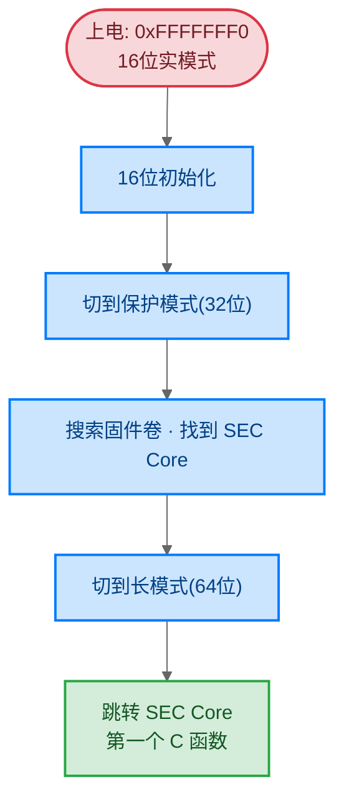
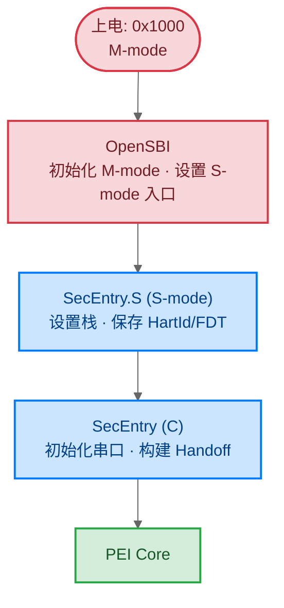
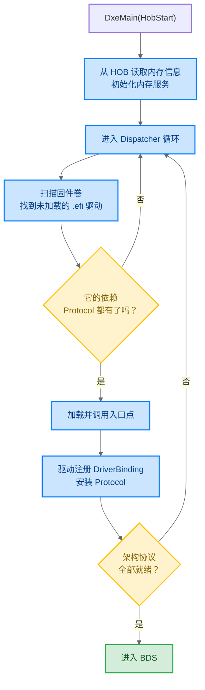
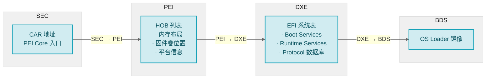

# 启动流程详解

> 从按下电源键到 OS 启动，固件经历了 SEC→PEI→DXE→BDS 四个阶段。每个阶段的诞生都因为前一个阶段留下了一个无法自己解决的问题。

### 关键术语

| 缩写 | 全称 | 含义 |
|------|------|------|
| SEC | Security Phase | 安全阶段，第一个 C 代码执行阶段 |
| PEI | Pre-EFI Initialization | 预 EFI 初始化阶段，负责内存初始化 |
| DXE | Driver Execution Environment | 驱动执行环境阶段，建立系统服务 |
| BDS | Boot Device Selection | 启动设备选择阶段 |
| PPI | PEIM-to-PEIM Interface | PEI 阶段模块间通信接口 |
| HOB | Hand-Off Block | PEI 向 DXE 传递数据的块结构 |
| Protocol | EFI Protocol | DXE 阶段的驱动接口机制 |
| PEIM | PEI Module | PEI 阶段的可加载模块 |
| CAR | Cache-as-RAM | 缓存作为临时内存的技术 |

---

## 1. 前置知识

| 需要了解 | 参考文档 |
|----------|----------|
| EDK2 类型系统与编码规范 | [02-类型系统与编码规范](./02-type-system.md) |
| C 语言与指针操作 | — |

---

## 2. 一切问题的根源：鸡生蛋

固件启动面临一个看似无解的矛盾：

- 要初始化硬件，需要运行代码
- 要运行代码，需要内存（栈、堆）
- 内存控制器本身也是硬件，也需要被初始化

这不是一个理论问题——当你按下电源键的那一刻，CPU 确确实实处于一个"没有内存、没有设备、只有 Flash 里刻好的指令"的状态。每个启动阶段的存在，都是因为前一个阶段留下了一个它自己解决不了的问题：

| 阶段 | 它继承的问题 | 它的解决方案 | 它留下的问题 |
|------|-------------|-------------|-------------|
| SEC | 没有内存，怎么跑 C 代码？ | 用 CPU Cache 冒充内存（CAR） | CAR 只有几十 KB，不够用 |
| PEI | 只有几十 KB 临时内存 | 初始化 DDR，获得真正内存 | 有了内存但没有统一的服务框架 |
| DXE | 没有服务框架 | 建立 Protocol/Event/驱动调度 | 有了服务但不知道从哪里启动 OS |
| BDS | 不知道从哪启动 OS | 枚举设备、选启动项、加载 OS Loader | — |

下面按这个线索，逐个阶段展开。

---

## 3. SEC — "没有内存怎么跑 C 代码"

### 3.1 上电瞬间发生了什么

CPU 上电后，所有寄存器处于复位状态，程序计数器指向一个硬编码地址。这个地址映射到 Flash 存储器——此时 DRAM 控制器还没初始化，系统没有任何可写内存。

**x86 的处境**：复位后处于 16 位实模式，入口 `0xFFFFFFF0`，只能执行 16 位指令。要运行 UEFI 的 64 位 C 代码，需要先自己把自己从 16 位抬升到 64 位。



**RISC-V 的处境**：没有实模式/保护模式的概念，CPU 直接从 M-mode 启动。但 UEFI 不运行在 M-mode——它运行在 S-mode。所以 RISC-V 平台通常先跑一段 M-mode 固件（OpenSBI），再跳转给 UEFI：



### 3.2 CAR：用 Cache 冒充内存

SEC 最大的难题是：**C 函数需要栈，但系统没有内存。**

x86 的解法是 CAR（Cache-as-RAM）：把 CPU 的 L2 Cache 配置为"no-eviction"模式——数据写进去不回写到 DRAM（因为 DRAM 还不存在），就留在 Cache 里当 RAM 用。

```c
// EDK2 中 CAR 初始化的汇编代码（UefiCpuPkg/SecCore/ResetVector）
// 将 Cache 设为 no-eviction 模式，充当临时 RAM
mov     cr0, eax          ; 禁用 Cache 写回
invd                       ; 清空 Cache 旧数据
; 此刻 Cache 就是临时 RAM，可以设栈指针了
mov     esp, CAR_BASE_ADDRESS
```

RISC-V 没有 Cache-as-RAM 机制，通常使用片上 SRAM 充当临时内存。

| | CAR (x86) | SRAM (RISC-V) |
|---|-----------|---------------|
| 容量 | 32KB ~ 256KB | 64KB ~ 512KB |
| 本质 | CPU Cache 被劫持为 RAM | 芯片内置的静态 RAM |
| 代价 | Cache 不能再做 Cache 用 | 占用芯片面积 |

**SEC 完成后，系统状态**：有了几十 KB 临时内存，可以跑 C 代码了。但 DDR 还没初始化，这点内存远远不够。SEC 把临时 RAM 的位置和 PEI Core 的入口地址告诉下一个阶段，然后跳转。

---

## 4. PEI — "只有几十 KB 内存怎么初始化 DDR"

### 4.1 核心矛盾

DDR 内存控制器需要复杂的初始化时序——配置时序参数、训练信号、校验延迟。这些代码本身就需要栈和堆来运行。但 CAR 只有几十 KB，跑完内存初始化代码就快满了，后面还有几十个 PEIM 要调度。

PEI 的解法是**两阶段运行**：

```mermaid
%%{init: {"theme": "base", "themeVariables": {"primaryColor": "#ECECFF", "primaryTextColor": "#333333", "primaryBorderColor": "#9370DB", "lineColor": "#666666", "secondaryColor": "#ffffde", "secondaryBorderColor": "#aaaa33", "tertiaryColor": "#f0f0f0", "fontFamily": "\"trebuchet ms\", verdana, arial, sans-serif"}}}%%
flowchart LR
    subgraph S1["阶段一：在临时 RAM 中"]
        A1["PeiCore 启动"] --> A2["调度 PEIM"]
        A2 --> A3["内存初始化 PEIM 完成<br/>DDR 可用！"]
    end
    subgraph S2["阶段二：在 DDR 中"]
        B1["把 PeiCore 从 Flash<br/>拷贝到 DDR"] --> B2["迁移 PPI 数据库到 DDR"]
        B2 --> B3["继续调度剩余 PEIM"]
        B3 --> B4["构建 HOB 列表"]
        B4 --> B5["跳转 DXE Core"]
    end
    A3 --> B1
    classDef clsPhase1 fill:#fff3cd,stroke:#ffc107,color:#856404,stroke-width:2px
    classDef clsPhase2 fill:#d4edda,stroke:#28a745,color:#155724,stroke-width:2px
    class S1 clsPhase1
    class S2 clsPhase2
```



**阶段一**：在 CAR 里运行，只做最关键的事——调度 PEIM，直到内存初始化 PEIM 把 DDR 配好。

**阶段二**：DDR 可用后，把 PeiCore 自身从 Flash 拷贝到 DDR（这叫 Shadow），把 PPI 数据库也迁移过去，然后在宽敞的 DDR 里继续调度剩余 PEIM。

### 4.2 PPI：临时 RAM 里的协作方式

PEI 阶段有几十个 PEIM 需要互相协作。典型场景：

| 协作场景 | 依赖方 | 提供方 | 通过 PPI 传递什么 |
|----------|--------|--------|------------------|
| 内存可用通知 | 需要分配内存的 PEIM | 内存初始化 PEIM | `MemoryDiscoveredPpi` |
| 访问 Flash 存储 | 需要从 Flash 读取数据的 PEIM | Flash 驱动 PEIM | `FfsPpi`（固件文件系统接口） |
| 延时等待 | 需要微秒级延时的 PEIM | 平台初始化 PEIM | `StallPpi` |
| 报告状态码 | 需要输出调试信息的 PEIM | 串口初始化 PEIM | `ReportStatusCodePpi` |
| 加载 DXE Core | PEI Core | 固件卷解析 PEIM | `FvPpi`（固件卷位置信息） |

比如内存初始化 PEIM 完成后，需要通知其他 PEIM "内存可用了"：

```c
// 内存初始化 PEIM：安装 PPI，宣布"DDR 可用了"
EFI_PEI_PPI_DESCRIPTOR mMemDiscoveredPpi = {
  EFI_PEI_PPI_DESCRIPTOR_PPI | EFI_PEI_PPI_DESCRIPTOR_TERMINATE_LIST,
  &gEfiPeiMemoryDiscoveredPpiGuid,
  NULL
};
PeiServices->InstallPpi(&mMemDiscoveredPpi);

// 其他 PEIM：注册通知，当 DDR 可用时被回调
PeiServices->NotifyPpi(&mNotifyDesc);
// 回调函数里就可以用 PeiServices->AllocatePages() 分配 DDR 内存了
// （PEI 阶段没有 AllocatePool，只有页分配的 AllocatePages）
```

在 DXE 阶段，这种协作通过 Protocol 完成。但 Protocol 需要 Handle、引用计数等机制，太重了——CAR 只有几十 KB，装不下。

**PPI 是 Protocol 的极简版**：只有安装、查找、通知三个操作，没有 Handle、没有引用计数、没有打开/关闭语义。省下来的内存，是能跑起来和跑不起来的区别。

PPI 和 Protocol 的区别，本质是资源约束下的工程取舍：

| | PPI | Protocol |
|---|-----|----------|
| 生存环境 | 临时 RAM，几十 KB | DDR，几 GB |
| 核心操作 | 安装 / 查找 / 通知 | 安装 / 打开 / 关闭 / 卸载 |
| Handle | 不需要 | 必须有 |
| 引用计数 | 不需要 | 必须有 |
| 设计哲学 | 能跑就行 | 安全可控 |

### 4.3 HOB：PEI 留给 DXE 的便条

PEI 结束后，DXE 接管。但 DXE 不知道系统有多少内存、固件卷在哪里——这些信息只有 PEI 知道。

**HOB 是 PEI 写给 DXE 的便条**，本质是一个只追加的单向链表。PEI 把所有 DXE 需要的信息写进 HOB，DXE 启动时遍历这个链表读取。

为什么是"只追加"？因为 PEI 可能在临时 RAM 和 DDR 中各写了一部分 HOB，迁移过程中不能修改已有数据，否则可能破坏数据一致性。

```c
// PEI：写便条——"系统有 4GB DDR，从 0x800000000 开始"
BuildResourceDescriptorHob(
    EFI_RESOURCE_SYSTEM_MEMORY,
    EFI_RESOURCE_ATTRIBUTE_PRESENT | EFI_RESOURCE_ATTRIBUTE_INITIALIZED,
    0x800000000,    // 起始地址
    0x100000000     // 4GB
);

// DXE：读便条——遍历 HOB 链表，把内存范围注册到内存服务
VOID EFIAPI DxeMain(IN VOID *HobStart) {
    EFI_PEI_HOB_POINTERS Hob;
    Hob.Raw = HobStart;
    while (!END_OF_HOB_LIST(Hob)) {
        if (Hob.ResourceDescriptor->Header.HobType
                == EFI_HOB_TYPE_RESOURCE_DESCRIPTOR) {
            CoreAddMemoryDescriptor(...);
        }
        Hob.Raw = GET_NEXT_HOB(Hob);
    }
}
```

DXE 最关心的几类 HOB：

| HOB 类型 | DXE 拿到后做什么 |
|----------|-----------------|
| `RESOURCE_DESCRIPTOR` | 知道哪些物理地址是 RAM，注册到内存分配器 |
| `MEMORY_ALLOCATION` | 知道 PEI 已经占了哪些内存，避免重复分配 |
| `FV`（固件卷） | 知道去哪里找 DXE 驱动的 .efi 文件 |
| `GUID_EXTENSION` | 平台自定义数据，如 ACPI 表地址 |

**PEI 完成后，系统状态**：DDR 可用，HOB 列表构建完毕。PEI 把 HOB 链表头指针传给 DXE Core，跳转。

---

## 5. DXE — "有了内存怎么让所有硬件都能用"

### 5.1 DXE 要解决什么

PEI 只做了一件事：让内存可用。但 OS 需要的是：磁盘能读写、网卡能收发包、显卡能显示、键盘能输入。这些全靠驱动来做。

DXE 面临的问题不是"怎么操作硬件"——那是驱动的事。DXE 要解决的是：**几十个驱动怎么互相发现、怎么按正确顺序加载、怎么协作？**

### 5.2 Protocol：驱动之间的松耦合协议

假设系统里有两个驱动：磁盘驱动和文件系统驱动。磁盘驱动知道怎么读写扇区，文件系统驱动知道怎么解析 FAT32。文件系统驱动需要磁盘驱动，但它们是独立编译的——文件系统驱动怎么找到磁盘驱动？

**Protocol 就是答案**。磁盘驱动安装一个 `BlockIoProtocol`（附带 GUID），文件系统驱动通过这个 GUID 查找：

```c
// 磁盘驱动：我提供 Block I/O 服务
EFI_BLOCK_IO_PROTOCOL gBlockIo = {
  .Revision    = EFI_BLOCK_IO_PROTOCOL_REVISION2,
  .Media       = &gMedia,
  .Reset       = BlockIoReset,
  .ReadBlocks  = BlockIoRead,
  .WriteBlocks = BlockIoWrite,
  .FlushBlocks = BlockIoFlush
};
gBS->InstallProtocolInterface(
    &DiskHandle, &gEfiBlockIoProtocolGuid,
    EFI_NATIVE_INTERFACE, &gBlockIo
);

// 文件系统驱动：我要找所有磁盘
EFI_HANDLE *Handles;
UINTN Count;
gBS->LocateHandleBuffer(
    ByProtocol, &gEfiBlockIoProtocolGuid,
    NULL, &Count, &Handles
);
// 在每个磁盘上尝试挂载文件系统
for (UINTN i = 0; i < Count; i++) {
    EFI_BLOCK_IO_PROTOCOL *BlkIo;
    gBS->HandleProtocol(Handles[i], &gEfiBlockIoProtocolGuid, (VOID**)&BlkIo);
    // 读分区表，如果识别到 FAT32，安装 SimpleFileSystem Protocol
}
```

关键点：磁盘驱动和文件系统驱动互不认识。它们只通过 GUID 找到对方。这就是"发布-订阅"——生产者安装 Protocol，消费者查找 Protocol，双方零耦合。

这种设计带来的好处：你可以换一个磁盘驱动（比如从 NVMe 换成 SATA），文件系统驱动完全不用改——它只认 `BlockIoProtocol` 这个 GUID，不关心底层是谁提供的。

### 5.3 Dispatcher：驱动按什么顺序加载

DXE 驱动之间有依赖：文件系统驱动依赖 Block I/O Protocol，Block I/O Protocol 依赖 Pci I/O Protocol。如果加载顺序错了，文件系统驱动找不到 Block I/O，就会初始化失败。

DXE Dispatcher 的工作就是解决这个依赖排序问题：



Dispatcher 不停循环，每轮扫描所有未加载的驱动，检查它的依赖是否已满足。如果驱动 A 依赖 Protocol X，而 Protocol X 还没人安装，A 就先跳过。等驱动 B 加载后安装了 Protocol X，下一轮循环 A 的依赖就满足了。

这就是为什么 DXE 启动比 PEI 慢——Dispatcher 可能要循环很多轮才能把所有驱动加载完。

### 5.4 DriverBinding：驱动怎么认领设备

一个驱动被加载后，它不会立刻去操作硬件。它注册一个 `DriverBindingProtocol`，里面有三个回调：

| 回调 | 作用 | 返回值 |
|------|------|--------|
| `Supported()` | "你能管这个设备吗？" | `EFI_SUCCESS` 或 `EFI_UNSUPPORTED` |
| `Start()` | "去接管这个设备" | 初始化硬件，安装上层 Protocol |
| `Stop()` | "释放这个设备" | 反初始化，卸载 Protocol |

当某个驱动安装了一个设备相关的 Protocol（比如 `PciIoProtocol`，表示"这是一个 PCI 设备"），Dispatcher 会遍历所有已注册的 `DriverBindingProtocol`，逐个调用 `Supported()`，询问"你能驱动这个设备吗？"第一个返回 `EFI_SUCCESS` 的驱动获得设备控制权，Dispatcher 调用它的 `Start()` 进行初始化。

### 5.5 EFI 系统表：驱动访问系统服务的入口

每个 DXE 驱动的入口函数都收到两个参数：

```c
EFI_STATUS EFIAPI MyDriverEntryPoint(
    IN EFI_HANDLE ImageHandle,
    IN EFI_SYSTEM_TABLE *SystemTable
)
```

`SystemTable` 里的 `BootServices` 指针是驱动最常用的——分配内存、安装 Protocol、创建事件，全靠它：

```c
gBS->AllocatePool(EfiBootServicesData, Size, &Buffer);
gBS->InstallProtocolInterface(&Handle, &Guid, EFI_NATIVE_INTERFACE, &Interface);
gBS->LocateProtocol(&Guid, NULL, (VOID**)&Interface);
gBS->CreateEvent(EVT_TIMER, TPL_CALLBACK, NotifyFunc, NULL, &Event);
```

系统表里有两类服务，它们的命运截然不同：

| | Boot Services | Runtime Services |
|---|---------------|-----------------|
| 典型功能 | 内存分配、Protocol 操作、驱动加载 | 变量读写、时间获取、系统重置 |
| 失效时机 | OS 调用 `ExitBootServices()` 后 | 永不失效 |
| 为什么 | OS 要接管内存管理和中断，固件不能再动 | OS 需要读写启动变量、获取硬件时钟 |

**如果 Boot Services 不失效会怎样？** 固件和 OS 同时管理同一块内存，互相踩踏，必崩。`ExitBootServices()` 就是在说："固件你退场，内存我来管。"

### 5.6 架构协议：DXE Core 的"手脚"

DXE Core 本身是纯软件——它不知道怎么开关中断、怎么设定时器、怎么验证签名。这些底层能力由平台驱动以 Protocol 形式提供，叫"架构协议"：

| 架构协议 | 没有它会怎样 |
|----------|-------------|
| `CPU_ARCH_PROTOCOL` | 无法开关中断 → 事件回调可能被中断打断，数据错乱 |
| `TIMER_ARCH_PROTOCOL` | 没有系统心跳 → 定时器、事件机制全部失效 |
| `METRONOME_ARCH_PROTOCOL` | 无法微秒级延时 → 硬件初始化需要精确延时时崩溃 |
| `SECURITY_ARCH_PROTOCOL` | 无法验证镜像签名 → 安全启动失效 |
| `BDS_ARCH_PROTOCOL` | 没有进入 BDS 的入口 → 启动流程卡在 DXE |
| `WATCHDOG_TIMER_ARCH_PROTOCOL` | 驱动死锁时无人复位 → 系统挂死 |

DXE Core 在 Dispatcher 循环中不停检查这些协议是否全部安装。只有全部就绪，才会调用 BDS。

**DXE 完成后，系统状态**：所有驱动已加载，Protocol 数据库建立完毕，Boot Services 和 Runtime Services 可用。系统准备好启动 OS 了。

---

## 6. BDS — "有了服务怎么找到并启动 OS"

### 6.1 BDS 做什么

BDS 是用户能感知的阶段——它显示启动菜单、连接键盘和显示器、从磁盘或网络加载 OS。

1. 枚举启动设备（磁盘、网络、USB）
2. 连接控制台（键盘、显示）
3. 读取 `BootOrder` UEFI 变量，确定启动顺序
4. 按 `BootOrder` 依次尝试加载 OS Loader
5. 调用 `LoadImage()` 加载 OS Loader，`StartImage()` 执行

如果所有启动项都失败，BDS 会进入 UEFI Shell 或显示错误信息。

### 6.2 x86 与 RISC-V 的关键差异

| | x86 | RISC-V |
|---|-----|--------|
| 复位向量 | `0xFFFFFFF0` | 平台特定（QEMU: `0x1000`） |
| 初始模式 | 16 位实模式 | M-mode |
| 模式切换 | 实模式→保护模式→长模式（三级） | M-mode→S-mode（一次） |
| SMM | 有 | 无（用 StandaloneMmPkg 替代） |
| I/O 端口 | 有（`in`/`out` 指令） | 无（纯 MMIO） |
| 设备描述 | ACPI 为主 | FDT + ACPI |

---

## 7. 全景：数据怎么从一个阶段传到下一个

启动不只是"一个阶段做完交给下一个"，更关键的是**数据怎么传递**。每个阶段交接时传递的数据，决定了下一个阶段能做什么：



| 交接点 | 传递什么 | 为什么必须传 |
|--------|----------|-------------|
| SEC → PEI | CAR 地址、PEI Core 入口位置 | PEI 需要知道临时 RAM 在哪才能设栈 |
| PEI → DXE | HOB 列表 | DXE 需要知道内存布局才能初始化内存服务，需要固件卷位置才能加载驱动 |
| DXE → BDS | EFI 系统表 | BDS 需要Boot Services 来加载 OS Loader |

---

## 8. 要点回顾

| 要点 | 说明 |
|------|------|
| 每个阶段的存在因为前一个阶段留下了它解决不了的问题 | SEC 留下"内存不够"，PEI 留下"没有服务框架"，DXE 留下"不知道从哪启动" |
| CAR 是 SEC 的核心把戏 | 用 CPU Cache 冒充 RAM，让 C 代码在没有内存时也能跑 |
| PEI 两阶段运行 | 先在 CAR 里初始化 DDR，再迁移到 DDR 继续 |
| PPI 是 Protocol 的极简版 | 因为 CAR 只有几十 KB，装不下 Protocol 的复杂语义 |
| HOB 是 PEI 写给 DXE 的便条 | 只追加不修改，保证迁移过程中数据一致性 |
| Protocol 是驱动间的松耦合协议 | 双方只通过 GUID 互相发现，换驱动不用改消费者 |
| Dispatcher 按依赖顺序加载驱动 | 循环扫描，依赖满足才加载，可能需要多轮 |
| Boot Services 在 OS 启动前失效 | 固件和 OS 不能同时管理内存 |

---

## 参考资料

- [UEFI Specification 2.10](https://uefi.org/specs/UEFI/2.10/) — 第 1-4 章定义了启动阶段和核心数据结构
- [EDK2 Source: MdeModulePkg/Core/](https://github.com/tianocore/edk2/tree/master/MdeModulePkg/Core) — PEI/DXE 核心实现

---

**上一篇**：[02-类型系统与编码规范](./02-type-system.md) — 读懂 EDK2 源码的基础
**下一篇**：[04-构建系统深入](./04-build-system.md) — DSC/DEC/INF/FDF 与 AutoGen
