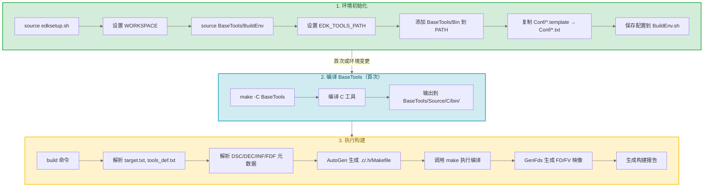

# EDK2 构建系统深入

> 构建系统是固件开发中"最不有趣但最重要"的部分。理解它，你才能从"改别人的代码"进化到"创建自己的平台"。

### 关键术语

| 缩写 | 全称 | 含义 |
|------|------|------|
| DEC | Package Declaration | 包声明文件，定义包的公共接口 |
| DSC | Platform Description | 平台描述文件，定义构建配置 |
| INF | Information | 模块定义文件 |
| FDF | Flash Description File | 固件描述文件，定义 Flash 布局 |
| PCD | Platform Configuration Database | 平台配置数据库 |
| FV | Firmware Volume | 固件卷 |
| FFS | Firmware File System | 固件文件系统 |
| FD | Firmware Device | 完整固件映像 |
| AutoGen | Automatic Generation | 自动代码生成机制 |
| DEPEX | Dependency Expression | 依赖表达式 |

---

## 1. 构建系统全景

EDK2 的构建系统是一个**双层架构**：先用 make 编译构建工具（BaseTools），再用构建工具编译固件。



> **设计背景 — 为什么是双层架构？** BaseTools 中的 C 工具（如 GenFv、VfrCompile）需要先编译才能使用，而这些工具的编译使用标准的 make 构建系统。固件的编译则使用 BaseTools 提供的 Python 构建引擎。这种分离让 BaseTools 可以独立更新，也避免了"鸡生蛋"问题——构建工具本身不需要 EDK2 的构建系统来编译。

读完本篇，你将理解 EDK2 构建系统的三个层次：

| 层次 | 内容 | 回答的问题 |
|------|------|-----------|
| **配置文件**（§3） | target.txt, tools_def.txt, build_rule.txt | 用什么编译器？编译参数是什么？ |
| **元数据文件**（§5） | DEC/DSC/INF/FDF | 构建什么模块？库怎么绑定？Flash 怎么布局？ |
| **AutoGen**（§6） | 代码生成引擎 | 元数据怎么变成可编译的 C 代码和 Makefile？ |

这三层构成"声明→翻译→编译"的完整流水线。下面先看流水线的第一站：BaseTools。

## 2. BaseTools 详解

BaseTools 是构建系统的"工具箱"——包含所有编译、链接、打包固件的底层工具。下面这些目录，就是你敲 `build` 时在背后运转的代码。

### 2.1 目录结构

```
BaseTools/
├── Bin/                     # 预编译二进制工具
├── BinWrappers/
│   ├── PosixLike/           # Linux/macOS 工具包装脚本
│   │   ├── build            # → build.py
│   │   ├── GenFds           # → GenFds.py
│   │   └── GenFv            # → GenFv C 工具
│   └── WindowsLike/         # Windows .bat 包装脚本
├── Conf/
│   ├── build_rule.template  # 构建规则模板
│   ├── target.template      # 构建目标配置模板
│   └── tools_def.template   # 工具链定义模板
├── Plugin/                  # 构建插件
│   ├── LinuxGccToolChain/   # Linux GCC 工具链
│   └── WindowsVsToolChain/  # Windows VS 工具链
├── Scripts/                 # 辅助脚本
├── Source/
│   ├── C/                   # C 语言构建工具
│   │   ├── GenFv/           # 固件卷生成
│   │   ├── GenFfs/          # FFS 文件生成
│   │   ├── GenSec/          # Section 生成
│   │   ├── GenFw/           # 固件生成（含 ELF→COFF 转换）
│   │   ├── GenCrc32/        # CRC32 生成
│   │   ├── VfrCompile/      # VFR 表单编译器
│   │   ├── LzmaCompress/    # LZMA 压缩
│   │   ├── BrotliCompress/  # Brotli 压缩
│   │   ├── TianoCompress/   # Tiano 压缩
│   │   ├── EfiRom/          # EFI ROM 生成
│   │   ├── DevicePath/      # 设备路径工具
│   │   └── VolInfo/         # 卷信息工具
│   └── Python/              # Python 构建引擎
│       ├── build/           # ★ 核心 build 命令
│       ├── AutoGen/         # 自动代码生成
│       ├── GenFds/          # FD 生成子系统
│       ├── Workspace/       # 元数据解析 (DSC/DEC/INF)
│       └── Common/          # 公共工具库
├── BuildEnv                 # Unix 环境初始化脚本
└── Edk2ToolsBuild.py        # PyTool 方式编译 BaseTools
```

### 2.2 C 工具功能详解

| 工具 | 输入 | 输出 | 核心功能 |
|------|------|------|----------|
| **GenFv** | FFS 文件 | .fv 固件卷 | 将多个 FFS 文件组装成固件卷，添加 FV 头部 |
| **GenFfs** | Section 文件 | .ffs 文件 | 将多个 Section 组装成 FFS 文件，添加文件头部 |
| **GenSec** | 原始数据 | .section | 将数据封装成 Section，支持压缩和 GUIDed 封装 |
| **GenFw** | ELF/COFF | .efi/.bin | 固件镜像生成，含 ELF→COFF 转换、重定位处理 |
| **GenCrc32** | 任意文件 | 带校验和文件 | 计算 CRC32 校验和 |
| **VfrCompile** | .vfr 文件 | .h/.i | 编译 VFR 表单定义为字节码 |
| **LzmaCompress** | 任意文件 | .lzma | LZMA 压缩（高压缩比） |
| **BrotliCompress** | 任意文件 | .brotli | Brotli 压缩 |
| **TianoCompress** | 任意文件 | .tiano | Tiano 自定义压缩 |

这些 C 工具在编译流程中各司其职，构成一条"源码→固件映像"的加工流水线。理解这条流水线，你才能理解为什么构建报错时错误信息里会出现 "GenFw" "GenFfs" 这些名字——它们就是流水线上的工位：

**工具链的数据流**：


> **PE/COFF vs ELF**：UEFI 固件使用 PE/COFF（Portable Executable / Common Object File Format）作为可执行文件格式，与 Windows 的 `.exe`/`.dll` 格式相同。这与 Linux 常用的 ELF 不同。GCC 编译出的 `.o` 是 ELF 格式，经链接器生成 ELF 动态库（`.so`），再由 **GenFw** 转换为 PE/COFF 格式的 `.efi` 文件。这也是为什么同一个源码用 `-t GCC`（Linux）和 `-t VS2022`（Windows）都能编译——工具链不同，目标格式一致。

### 2.3 Python 构建引擎

如果说 C 工具是流水线上的工位，那 Python 构建引擎就是**调度这些工位的"大脑"**——它解析元数据、调用 AutoGen、驱动 make。在理解它的结构之前，先回答一个关键问题：

> **设计背景 — 为什么需要 AutoGen？** EDK2 的元数据文件（DSC/DEC/INF）声明了模块的依赖、PCD 值、库绑定等信息，但 C 编译器不理解这些声明式格式。AutoGen 将元数据转换为 C 代码和 Makefile：`AutoGen.h` 包含 PCD 宏定义和库头文件包含；`AutoGen.c` 包含 PCD 初始值和模块信息字符串；`Makefile` 定义编译规则。这种"声明式元数据 + 自动代码生成"的模式让开发者只需关注"要构建什么"，而不需要手动编写样板代码。

Python 构建引擎的核心模块：

```
build.py (入口)
├── AutoGen/
│   ├── WorkspaceAutoGen     # 工作区级代码生成
│   ├── PlatformAutoGen      # 平台级代码生成
│   ├── ModuleAutoGen        # 模块级代码生成
│   ├── AutoGenWorker        # 多进程并行生成
│   ├── GenMake              # Makefile 生成
│   ├── GenC                 # C 代码生成（PCD、ModuleInfo 等）
│   └── GenDepex             # 依赖表达式生成
├── Workspace/
│   └── WorkspaceDatabase    # 元数据数据库（DSC/DEC/INF 解析）
├── GenFds/
│   └── GenFds               # 固件描述文件生成
└── BuildReport              # 构建报告生成
```

**AutoGen 生成的关键文件**：

| 生成文件 | 位置 | 用途 |
|----------|------|------|
| `AutoGen.h` | `Build/<Platform>/<Module>/DEBUG_GCC/` | 模块级别的宏和类型定义 |
| `AutoGen.c` | 同上 | PCD 初始化代码、ModuleInfo |
| `Makefile` | 同上 | 模块的编译规则 |
| `<Module>.depex` | 同上 | 依赖表达式字节码 |

## 3. 配置文件详解

上一节介绍了构建系统的"工具箱"（BaseTools）。但 BaseTools 只是工具——你还需要告诉它**用哪个编译器、编译哪个平台、平台里有哪些模块**。这些信息就由本节要讲的三个配置文件提供。

### 3.1 target.txt — 构建目标配置

文件位置：`Conf/target.txt`（由 `BaseTools/Conf/target.template` 生成）

```ini
# 要构建的平台 DSC 文件
ACTIVE_PLATFORM       = OvmfPkg/RiscVVirt/RiscVVirtQemu.dsc

# 构建目标类型: DEBUG, RELEASE, NOOPT
TARGET                = DEBUG

# 目标架构: IA32, X64, AARCH64, RISCV64, LOONGARCH64
TARGET_ARCH           = RISCV64

# 工具链定义文件
TOOL_CHAIN_CONF       = Conf/tools_def.txt

# 使用的工具链标签
TOOL_CHAIN_TAG        = GCC

# 构建规则文件
BUILD_RULE_CONF       = Conf/build_rule.txt

# 并发线程数
MAX_CONCURRENT_THREAD_NUMBER = 8
```
**优先级**：命令行参数 > target.txt > DSC 文件

各字段的含义：

| 字段 | 含义 | 为什么需要它 |
|------|------|-------------|
| `ACTIVE_PLATFORM` | 指向平台的 DSC 文件 | 告诉构建系统"为哪个平台编译"，一个仓库里有几十个平台 |
| `TARGET` | `DEBUG` / `RELEASE` / `NOOPT` | DEBUG 含调试信息和日志输出；RELEASE 开启优化且 DEBUG 宏被消除；NOOPT 不开优化但保留调试宏 |
| `TARGET_ARCH` | 目标 CPU 架构 | EDK2 支持跨架构编译，必须指定 |
| `TOOL_CHAIN_TAG` | 编译器工具链标签 | 对应 tools_def.txt 中的工具链定义（GCC, CLANGDWARF 等） |
| `TOOL_CHAIN_CONF` | 工具链定义文件路径 | 告诉构建系统去哪个文件找编译器的路径和参数 |
| `MAX_CONCURRENT_THREAD_NUMBER` | 并行编译线程数 | EDK2 有上百个模块，并行编译大幅缩短构建时间 |

### 3.2 tools_def.txt — 工具链定义

文件位置：`Conf/tools_def.txt`（由 `BaseTools/Conf/tools_def.template` 生成）

这是 EDK2 构建系统中最庞大的配置文件。EDK2 需要支持 x86、ARM、RISC-V 等多种架构，每种架构又有多种编译器（GCC、Clang、MSVC）——这些编译器的路径、参数格式各不相同。tools_def.txt 把所有这些差异统一成一套命名规则，让构建系统只需知道"用 GCC 编译 RISCV64"，就能自动找到正确的编译器和参数。

**配置格式**：

```
TARGET_TOOLCHAIN_ARCH_COMMANDTYPE_ATTRIBUTE = <value>
```

例如：
```
DEBUG_GCC_RISCV64_CC_PATH = /usr/bin/riscv64-unknown-elf-gcc
DEBUG_GCC_RISCV64_CC_FLAGS = -g -Os -Wall -Werror ...
```

**支持的工具链**：

| 工具链标签 | 编译器 | 平台 |
|-----------|--------|------|
| GCC | GCC | Linux/macOS |
| GCCNOLTO | GCC (无 LTO) | Linux/macOS |
| CLANGPDB | Clang (PDB 调试) | 全平台 |
| CLANGDWARF | Clang (DWARF 调试) | 全平台 |
| VS2022 | Visual Studio 2022 | Windows |
| VS2019 | Visual Studio 2019 | Windows |
| XCODE5 | Xcode | macOS |

**RISC-V 交叉编译工具链配置**：

```bash
# 安装 RISC-V 交叉编译工具链
sudo apt install gcc-riscv64-unknown-elf

# 或使用自定义路径
export GCC_RISCV64_PREFIX=/opt/riscv/bin/riscv64-unknown-elf-
```

### 3.3 build_rule.txt — 构建规则

文件位置：`Conf/build_rule.txt`（由 `BaseTools/Conf/build_rule.template` 生成）

tools_def.txt 定义了编译器路径，但没定义"`.c` 文件怎么变成 `.o` 文件"这类规则。build_rule.txt 填补了这个空缺——它定义了每种源文件类型的编译命令模板。

```ini
[C-Code-File]
    <InputFile>
        ?.c
    <OutputFile>
        $(OUTPUT_DIR)(+)${s_dir}(+)${f_base}.o
    <Command>
        "$(CC)" $(CC_FLAGS) -c -o ${dst} ${src}
```

支持的文件类型：C-Code-File, Assembly-Code-File, Vfr-Code-File, Unicode-Text-File 等。

## 4. build 命令详解

你已经配好了 target.txt、tools_def.txt、build_rule.txt——现在可以真正动手构建了。但在看参数之前，先理解敲下 `build` 后发生了什么（回顾 §1 的 RunBuild 阶段）：

1. **解析配置**：读取 target.txt/tools_def.txt，确定"为哪个平台、用什么编译器"
2. **解析元数据**：读取 DSC/DEC/INF/FDF，建立模块依赖图和 PCD 数据库
3. **AutoGen**：为每个模块生成 `AutoGen.h`、`AutoGen.c` 和 `Makefile`
4. **编译**：调用 make 逐模块编译
5. **打包**：调用 GenFds 将编译产物组装为 `.fd` 固件映像

下面按这条流水线看 `build` 命令的参数：

### 4.1 常用参数

```bash
build [选项]

必需参数：
  -p, --platform=FILE     平台 DSC 文件
  -a, --arch=ARCH         目标架构 (IA32/X64/AARCH64/RISCV64/LOONGARCH64)
  -b, --buildtarget=TYPE  构建目标 (DEBUG/RELEASE/NOOPT)
  -t, --tagname=TOOL      工具链标签 (GCC/CLANGPDB/VS2022)

可选参数：
  -m, --module=FILE       仅构建指定模块 INF
  -n, --thread=NUM        并发线程数
  -D, --define=MACRO      宏定义 (NAME[=VALUE])
  --pcd=PCD               命令行设置 PCD (TokenSpace.PcdName=Value)
  --hash                  启用基于哈希的构建缓存
  -v, --verbose           详细输出
  -s, --silent            静默模式
  -k, --skip-autogen      跳过 AutoGen

构建目标：
  all                     完整构建（默认）
  genc                    仅生成 C 代码
  genmake                仅生成 Makefile
  modules                 编译所有模块
  fds                     生成固件映像
  clean                   清理构建产物
  cleanall                清理所有（含 AutoGen）
  run                     构建并运行（仅 EmulatorPkg）
```

### 4.2 典型构建命令

```bash
# 构建 QEMU RISC-V UEFI 固件
build -p OvmfPkg/RiscVVirt/RiscVVirtQemu.dsc \
      -a RISCV64 \
      -b DEBUG \
      -t GCC \
      -n 8

# 仅构建某个模块
build -p OvmfPkg/RiscVVirt/RiscVVirtQemu.dsc \
      -a RISCV64 \
      -b DEBUG \
      -t GCC \
      -m MdeModulePkg/Universal/BdsDxe/BdsDxe.inf

# 带宏定义的构建
build -p OvmfPkg/RiscVVirt/RiscVVirtQemu.dsc \
      -a RISCV64 -b DEBUG -t GCC \
      -D SECURE_BOOT_ENABLE \
      -D TPM2_ENABLE

# 命令行设置 PCD
build -p OvmfPkg/RiscVVirt/RiscVVirtQemu.dsc \
      -a RISCV64 -b DEBUG -t GCC \
      --pcd "gUefiCpuPkgTokenSpaceGuid.PcdCpuRiscVMmuMaxSatpMode=9"
```

### 4.3 构建输出目录结构

```
Build/
└── RiscVVirtQemu/                    # 平台名
    └── DEBUG_GCC/                    # TARGET_TOOLCHAIN
        ├── FV/                       # 固件卷输出
        │   ├── RISCV_VIRT.fd         # ★ 完整固件映像
        │   ├── RISCV_VIRT_CODE.fd    # CODE FD
        │   ├── RISCV_VIRT_VARS.fd    # VARS FD
        │   └── Ffs/                  # 各模块的 FFS 文件
        ├── MdeModulePkg/             # 各包的模块输出
        │   └── Universal/
        │       └── BdsDxe/
        │           └── BdsDxe/
        │               ├── DEBUG/    # 目标文件
        │               ├── AutoGen.h # 自动生成的头文件
        │               ├── AutoGen.c # 自动生成的 C 文件
        │               ├── Makefile  # 模块 Makefile
        │               └── OUTPUT/   # 最终输出 (.efi, .depex)
        └── BuildReport.txt           # 构建报告
```

## 5. 元数据文件格式

配置文件（§3）决定"怎么编译"，元数据文件决定"编译什么"。EDK2 使用四种元数据文件，每种解决不同层次的问题：

| 文件 | 作用域 | 核心问题 |
|------|--------|----------|
| **DEC** | 包级（Package） | 这个包对外暴露什么接口？（GUID、Library Class、PCD） |
| **DSC** | 平台级（Platform） | 这个平台用哪些 Library Instance？PCD 值是多少？包含哪些模块？ |
| **INF** | 模块级（Module） | 这个模块的源码在哪？需要哪些 Library Class？依赖哪些 Protocol？ |
| **FDF** | 固件级（Firmware） | Flash 怎么分区？哪个模块放进哪个固件卷？ |

四种文件的关系是层层收窄：DEC 声明"有什么可用"→ DSC 选择"用哪个实现"→ INF 描述"一个模块用到了什么"→ FDF 指定"这些东西在 Flash 上的物理位置"。下面逐个详解。

### 5.1 DEC 文件（包声明）

DEC 文件定义包的公共接口，是包的"头文件"。

```ini
[Defines]
  DEC_SPECIFICATION   = 0x00010005
  PACKAGE_NAME        = MdePkg
  PACKAGE_GUID        = 1E73767F-8F52-4603-AEB4-F29B510B6766
  PACKAGE_VERSION     = 1.08

[Includes]
  Include                              # 通用包含路径

[Includes.RISCV64]
  Include/RiscV64                      # RISC-V 特定包含路径

[LibraryClasses]
  BaseLib|Include/Library/BaseLib.h    # 库类名|头文件路径

[LibraryClasses.RISCV64]
  BaseRiscVSbiLib|Include/Library/BaseRiscVSbiLib.h

[Guids]
  gEfiEventExitBootServicesGuid = { 0x2AB5D321, 0xDE8F, 0x4828, ... }

[Ppis]
  gEfiPeiMemoryDiscoveredPpiGuid = { 0xF894643D, 0xC449, 0x42D1, ... }

[Protocols]
  gEfiLoadedImageProtocolGuid = { 0x5B1B31A1, 0x9562, 0x11D2, ... }

[PcdsFeatureFlag]
  gEfiMdePkgTokenSpaceGuid.PcdUgaConsumeSupport|TRUE|BOOLEAN|0x00010139

[PcdsFixedAtBuild]
  gEfiMdePkgTokenSpaceGuid.PcdMaximumUnicodeStringLength|1000000|UINT32|0x00000001
```

> **设计背景 — DEC 的"头文件"角色**：DEC 文件与 C 语言的 `.h` 文件类比非常贴切。C 的 `.h` 声明了函数签名和类型，调用者只需要包含 `.h` 就能编译通过，不需要知道实现。同样，DEC 声明了包的公共接口（库类、GUID、PCD），其他包的模块只需要在 INF 中引用这个 DEC，就能使用这些接口。具体实现由 DSC 中的库绑定决定。这种"接口与实现分离"是 EDK2 包化管理的核心。

### 5.2 DSC 文件（平台描述）

DSC 文件定义如何构建一个平台，是"构建配置"的核心。

```ini
[Defines]
  DSC_SPECIFICATION    = 0x00010005
  PLATFORM_NAME        = RiscVVirtQemu
  PLATFORM_GUID        = ...
  PLATFORM_VERSION     = 1.0
  DSC_NAME             = RiscVVirtQemu
  SUPPORTED_ARCHITECTURES = RISCV64
  BUILD_TARGETS        = DEBUG|RELEASE|NOOPT
  SKUID_IDENTIFIER     = DEFAULT
  FLASH_DEFINITION     = OvmfPkg/RiscVVirt/RiscVVirtQemu.fdf

[BuildOptions]
  # 全局编译选项
  GCC:*_*_*_CC_FLAGS = -Wno-unused-but-set-variable

[LibraryClasses]
  # 库类绑定（接口 → 实现）
  BaseLib|MdePkg/Library/BaseLib/BaseLib.inf
  BaseMemoryLib|MdePkg/Library/BaseMemoryLibRepStr/BaseMemoryLibRepStr.inf
  DebugLib|MdePkg/Library/UefiDebugLibConOut/UefiDebugLibConOut.inf
  PcdLib|MdePkg/Library/BasePcdLibNull/BasePcdLibNull.inf

[LibraryClasses.common.PEIM]
  # PEI 阶段专用库绑定
  MemoryAllocationLib|MdePkg/Library/PeiMemoryAllocationLib/PeiMemoryAllocationLib.inf
  HobLib|MdePkg/Library/PeiHobLib/PeiHobLib.inf

[LibraryClasses.common.DXE_DRIVER]
  # DXE 阶段专用库绑定
  MemoryAllocationLib|MdePkg/Library/UefiMemoryAllocationLib/UefiMemoryAllocationLib.inf
  HobLib|MdePkg/Library/DxeHobLib/DxeHobLib.inf

[PcdsFixedAtBuild]
  # 平台特定的 PCD 值
  gEfiMdePkgTokenSpaceGuid.PcdDebugPrintErrorLevel|0x80000047

[Components]
  # 要构建的模块列表
  MdeModulePkg/Core/Pei/PeiCore.inf
  MdeModulePkg/Core/Dxe/DxeMain.inf
  MdeModulePkg/Universal/BdsDxe/BdsDxe.inf
  UefiCpuPkg/CpuDxeRiscV64/CpuDxeRiscV64.inf
```

> **设计背景 — DSC 的"构建配置"角色**：DSC 文件回答了"如何构建这个平台"的所有问题：使用哪些库实现？PCD 值是什么？编译选项是什么？包含哪些模块？同一个包的模块可以通过不同的 DSC 文件构建出不同的平台配置。例如，MdeModulePkg 的模块在 OVMF 的 DSC 和真实硬件的 DSC 中使用不同的库绑定和 PCD 值。

### 5.3 INF 文件（模块定义）

INF 文件描述一个模块的所有信息。

```ini
[Defines]
  INF_VERSION          = 0x00010005
  BASE_NAME            = BdsDxe
  FILE_GUID            = 634337E7-5E5B-4E7A-8B70-939C1C67ECD0
  MODULE_TYPE          = DXE_DRIVER
  VERSION_STRING       = 1.0
  ENTRY_POINT          = BdsInitialize

[Sources]
  BdsEntry.c
  Bds.h
  FrontPage.c
  FrontPage.h
  Language.c
  LanguageData.c

[Sources.RISCV64]
  # RISC-V 特定源文件（如果有）

[Packages]
  MdePkg/MdePkg.dec
  MdeModulePkg/MdeModulePkg.dec

[LibraryClasses]
  BaseLib
  BaseMemoryLib
  DebugLib
  UefiLib
  UefiBootServicesTableLib
  UefiRuntimeServicesTableLib
  DevicePathLib
  PcdLib

[Pcd]
  gEfiMdePkgTokenSpaceGuid.PcdPlatformBootTimeOut

[Protocols]
  gEfiBdsArchProtocolGuid                  ## PRODUCES
  gEfiLoadedImageProtocolGuid              ## CONSUMES
  gEfiSimpleFileSystemProtocolGuid         ## CONSUMES

[Depex]
  TRUE
```

**MODULE_TYPE 取值**：

`MODULE_TYPE` 决定了链接哪个**入口点库**。入口点库负责在 Dispatcher 加载你的模块后调用你的入口函数——不同的 `MODULE_TYPE` 链接不同的入口点库，提供不同的入口函数签名：

| 类型 | 阶段 | 入口点库提供的函数签名 |
|------|------|----------------------|
| SEC | SEC | 无（汇编入口） |
| PEIM | PEI | `(FileHandle, **PeiServices) → EFI_STATUS` |
| PEI_CORE | PEI | 同上（PEI Core 自己就是 Dispatcher） |
| DXE_DRIVER | DXE | `(ImageHandle, *SystemTable) → EFI_STATUS` |
| DXE_CORE | DXE | 同上（DXE Core 自己是 Dispatcher） |
| DXE_RUNTIME_DRIVER | DXE/RT | `(ImageHandle, *SystemTable) → EFI_STATUS` |
| DXE_SAL_DRIVER | DXE/RT (IA64) | 同上 |
| DXE_SMM_DRIVER | SMM | `(ImageHandle, *SystemTable) → EFI_STATUS` |
| UEFI_DRIVER | DXE | `(ImageHandle, *SystemTable) → EFI_STATUS` |
| UEFI_APPLICATION | DXE | `(ImageHandle, *SystemTable) → EFI_STATUS` |
| MM_STANDALONE | MM | `(ImageHandle, *MmSystemTable) → EFI_STATUS` |
| MM_CORE_STANDALONE | MM | 同上 |

> `DXE_DRIVER`、`UEFI_DRIVER`、`DXE_RUNTIME_DRIVER` 三者的入口函数签名相同，区别在于：**可用的 Library Class 绑定不同**（DSC 中 `[LibraryClasses.common.DXE_DRIVER]` vs `[LibraryClasses.common.DXE_RUNTIME_DRIVER]`）以及 DXE Runtime Driver 在 `ExitBootServices()` 后仍可运行。

### 5.4 FDF 文件（固件描述）

FDF 文件定义 Flash 布局和固件卷内容。

```ini
[Defines]
  # Flash 布局常量
  DEFINE CODE_BASE_ADDRESS   = 0x20000000
  DEFINE CODE_SIZE           = 0x00800000
  DEFINE VARS_BASE_ADDRESS   = 0x22000000
  DEFINE VARS_SIZE           = 0x000C0000

[FV.FvRecovery]
  # PEI 阶段固件卷
  FvAlignment        = 16
  ERASE_POLARITY     = 1
  MEMORY_MAPPED      = TRUE
  STICKY_WRITE       = TRUE
  LOCK_CAP           = TRUE
  LOCK_STATUS        = TRUE
  WRITE_DISABLED_CAP = TRUE
  WRITE_ENABLED_CAP  = TRUE

  # 包含的模块
  INF MdeModulePkg/Core/Pei/PeiCore.inf
  INF UefiCpuPkg/SecCore/SecCore.inf
  INF MdeModulePkg/Universal/PCD/Pei/Pcd.inf
  INF MdeModulePkg/Core/DxeIplPeim/DxeIpl.inf

[FV.FvMain]
  # DXE 阶段固件卷
  FvAlignment        = 16

  INF MdeModulePkg/Core/Dxe/DxeMain.inf
  INF MdeModulePkg/Universal/BdsDxe/BdsDxe.inf
  INF UefiCpuPkg/CpuDxeRiscV64/CpuDxeRiscV64.inf

[FD.RISCV_VIRT]
  # 完整固件映像定义
  BaseAddress   = $(CODE_BASE_ADDRESS)
  Size          = $(CODE_SIZE)
  ErasePolarity = 1

  # 区域定义
  0x00000000|$(FV_SIZE)
  FV = FvRecovery
  FV = FvMain
```

> **设计背景 — FDF 的"链接脚本 + 分区表"角色**：FDF 做两件事：定义 Flash 的物理布局（哪些地址放什么）和指定模块放入哪个固件卷。这类似于嵌入式开发中的链接脚本（定义内存布局）和分区表（定义 Flash 分区）的组合。FDF 中的 `[FD]` 段定义完整的固件映像，`[FV]` 段定义固件卷的内容。构建系统根据 FDF 调用 GenFds 工具生成最终的 `.fd` 文件。

## 6. AutoGen 机制

AutoGen 是 EDK2 构建系统最精巧的设计——根据元数据文件自动生成代码。下面用一个具体的 INF 片段与 AutoGen 产物的对照，展示"声明→代码"的映射过程。

以 §5.3 中 BdsDxe.inf 为例，它的关键声明：

```
[Defines]
  BASE_NAME   = BdsDxe                        → 模块名
  FILE_GUID   = 634337E7-5E5B-4E7A-8B70-939C1C67ECD0

[LibraryClasses]
  UefiBootServicesTableLib                    → 依赖的库

[Pcd]
  gEfiMdePkgTokenSpaceGuid.PcdPlatformBootTimeOut  → 使用的 PCD
```

AutoGen 从上述元数据中生成以下文件：

### 6.1 AutoGen.h

每个模块都会生成 `AutoGen.h`，包含：

```c
// 模块信息
#define MODULE_NAME   "BdsDxe"
#define MODULE_GUID   0x634337E7, 0x5E5B, 0x4E7A, ...

// PCD 宏定义（编译时 PCD 直接展开为常量）
#define _PCD_VALUE_PcdPlatformBootTimeOut  10
#define FixedPcdGet32(TokenName)  _PCD_VALUE_##TokenName

// 包含路径
#include <Base.h>
#include <Library/BaseLib.h>
// ... 所有 [LibraryClasses] 中声明的库类头文件
```

### 6.2 AutoGen.c

```c
// PCD 初始化（运行时 PCD 的初始值）
GLOBAL_REMOVE_IF_UNREFERENCED const UINT32 _gPcd_FixedAtBuild_PcdPlatformBootTimeOut = 10;

// 模块信息字符串
GLOBAL_REMOVE_IF_UNREFERENCED CHAR8 *gEfiCallerBaseName = "BdsDxe";

// 入口点注册
EFI_STATUS EFIAPI _ModuleEntryPoint(...);
```

### 6.3 依赖表达式生成

INF 文件中的 `[Depex]` 段被编译为字节码：

```
源码: gEfiPciRootBridgeIoProtocolGuid AND gEfiCpuArchProtocolGuid
字节码: PUSH <GUID1> PUSH <GUID2> AND END
```

DXE Dispatcher 使用栈式求值器执行这些字节码来决定驱动调度顺序。DEPEX 字节码嵌入在 `.efi` 文件的 DEPEX Section 中，Dispatcher 加载驱动前先解析它——表达式的 GUID 对应的 Protocol 全已安装 → 加载驱动，否则跳过等下一轮循环。详见 [03-启动流程](./03-boot-flow.md) §5.3。

## 7. 要点回顾

| 要点 | 说明 |
|------|------|
| 双层构建 | 先用 `make` 编译 BaseTools 中的 C 工具，再用 BaseTools（Python 引擎）编译固件 |
| 4 种元数据文件各自定位 | DEC（包接口）→ DSC（平台配置+bind）→ INF（模块描述）→ FDF（Flash 布局） |
| AutoGen 自动生成代码 | 将 DEC/DSC/INF 中的声明翻译为 `AutoGen.h`（PCD 宏+includes）、`AutoGen.c`（PCD 值）、`Makefile`（编译规则） |
| PCD 替代 #ifdef | 平台差异通过配置数据（PCD）表达，编译时展开为常量，运行时也可查询 |
| Library Class 多态绑定 | 同一接口在 PEI/DXE 阶段用不同实现，DSC 按 `MODULE_TYPE` 决定绑定哪个 INF |
| 构建命令核心参数 | `-p`（DSC）、`-a`（架构）、`-b`（DEBUG/RELEASE）、`-t`（工具链）、`-m`（单个模块） |

---

## 8. CI 系统

学会了手动 `build` 命令之后，在真实工程中你还需要知道：EDK2 社区如何保证每次代码提交不破坏现有平台？答案是 CI 框架。

EDK2 使用基于 **Stuart**（一套 Python CI 构建工具，来自 edk2-pytool-extensions 包）的 CI 框架。Stuart 做的事情和 `build` 命令本质一样——编译固件——但它额外提供了多平台并行构建、依赖缓存、细粒度检查（GUID 唯一性、库声明合法性、编码格式、拼写）等工程化能力。它的配置文件位于 `.pytool/CISettings.py`：

```bash
# 安装 CI 工具链（需要 Python 3）
pip install edk2-pytool-extensions edk2-pytool-library

# 初始化构建环境（编译 BaseTools、下载依赖）
stuart_setup -c .pytool/CISettings.py

# 更新子模块和依赖
stuart_update -c .pytool/CISettings.py

# 执行 CI 构建（等价于 build + 多平台 + 额外检查）
stuart_ci_build -c .pytool/CISettings.py -t DEBUG -a RISCV64 -p OvmfPkg/RiscVVirt
```

| 插件 | 检查内容 |
|------|----------|
| CompilerPlugin | 编译测试 |
| GuidCheck | GUID 唯一性 |
| DependencyCheck | 跨包依赖合法性 |
| LibraryClassCheck | 库类声明有效 |
| EccCheck / UncrustifyCheck | 编码格式 |
| SpellCheck | 注释拼写 |

---

**上一篇**：[03-启动流程详解](./03-boot-flow.md) — SEC→PEI→DXE→BDS
**下一篇**：[05-模块开发实战](./05-module-dev.md) — DXE 驱动、Protocol、PEIM
