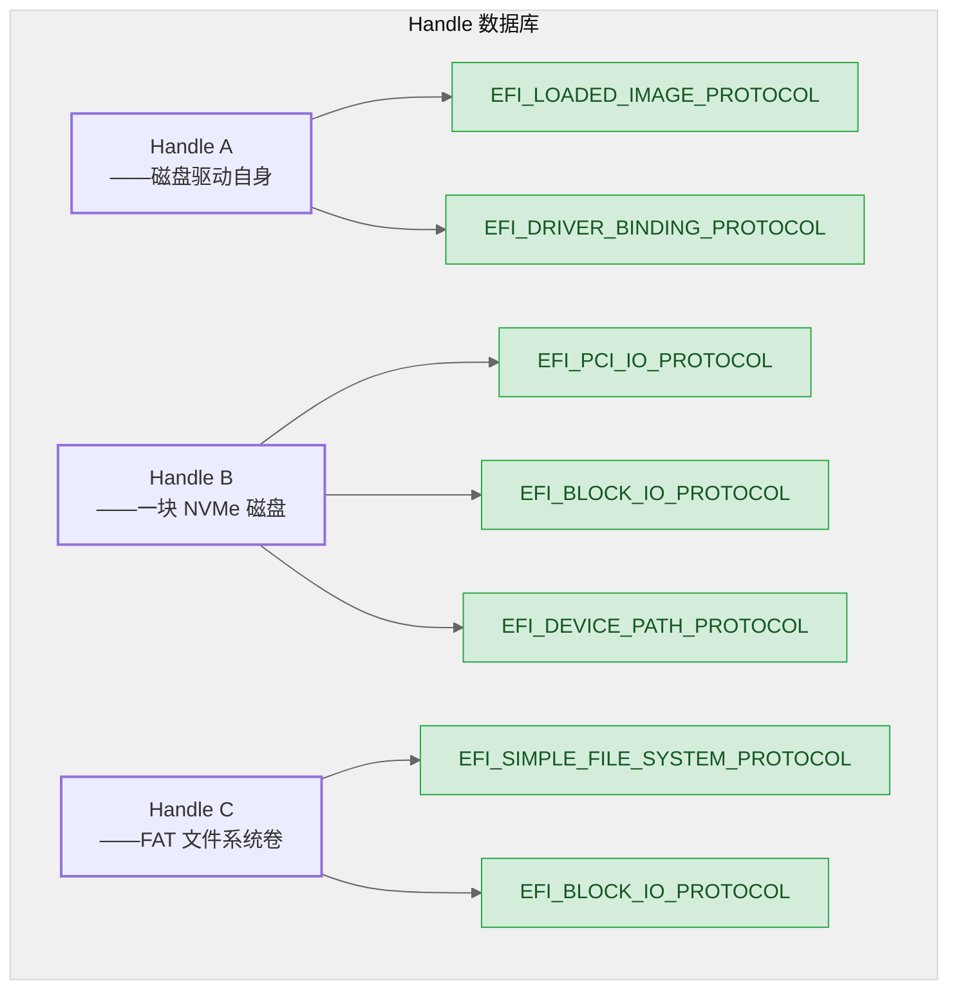

# 04 — Handle / Protocol：核心通信模型

> Handle 是装 Protocol 的容器，Protocol 是贴在 Handle 上的能力标签。所有驱动通过 GUID 在 Handle 数据库里互相发现，不直接依赖对方的存在。这是你要理解的第一优先级概念——后面的驱动编写、事件通知、TP 级别，全都构建在它之上。

## 1. 核心概念

### 1.1 Handle：没有类型的容器

`EFI_HANDLE` 本质上是一个不透明指针。它本身没有类型、没有语义、没有继承。一个 Handle 的角色完全由上面安装的 Protocol 决定：



从上图可以看出：同一个 Handle B 既是"设备 Handle"（挂了 PciIo），也是"服务 Handle"（挂了 BlockIo）。Handle 的语义完全取决于观察者——PCI 总线驱动看到 PciIo，文件系统驱动看到 BlockIo，互不干扰。

### 1.2 Protocol：GUID 标识的能力接口

Protocol 是一个由 GUID 唯一标识的结构体，通常包含函数指针：

```c
// 来自 MdePkg/Include/Protocol/BlockIo.h （简化）
#define EFI_BLOCK_IO_PROTOCOL_GUID \
  { 0x964e5b21, 0x6459, 0x11d2, { 0x8e, 0x39, 0x00, 0xa0, 0xc9, 0x69, 0x72, 0x3b } }

typedef struct _EFI_BLOCK_IO_PROTOCOL EFI_BLOCK_IO_PROTOCOL;

struct _EFI_BLOCK_IO_PROTOCOL {
  UINT64                Revision;
  EFI_BLOCK_IO_MEDIA    *Media;
  EFI_BLOCK_RESET       Reset;         // 函数指针
  EFI_BLOCK_READ        ReadBlocks;    // 函数指针
  EFI_BLOCK_WRITE       WriteBlocks;   // 函数指针
  EFI_BLOCK_FLUSH       FlushBlocks;   // 函数指针
};
```

任何驱动只要 `LocateProtocol(&gEfiBlockIoProtocolGuid, ...)`，拿到指向 `EFI_BLOCK_IO_PROTOCOL` 的指针，就可以调用 `ReadBlocks` / `WriteBlocks`，完全不关心底层是 SATA、NVMe 还是 virtio——这就是 UEFI "可扩展性"的工程体现。

GUID 在 DEC 文件中声明：

```ini
[Protocols]
  gEfiBlockIoProtocolGuid = { 0x964e5b21, 0x6459, 0x11d2, { ... }}
```

### 1.3 三种 Handle 的出身

你在代码中遇到的 Handle 只有三种来源：

```c
// —— ① ImageHandle：Dispatcher 加载 .efi 时创建的 Handle ——
EFI_STATUS EFIAPI MyDriverEntryPoint (
  IN EFI_HANDLE        ImageHandle,    // 每个入口函数都收到它
  IN EFI_SYSTEM_TABLE  *SystemTable
  )
{
  // 在这个 Handle 上安装 Protocol 宣告"我提供了什么"
  gBS->InstallProtocolInterface (&ImageHandle, &gMyProtocolGuid, ...);
}

// —— ② 设备 Handle：总线驱动扫描硬件时创建 ——
EFI_HANDLE  DeviceHandle = NULL;        // NULL = 让系统创建新 Handle
gBS->InstallProtocolInterface (
        &DeviceHandle,                  // ← 新创建的 Handle
        &gEfiPciIoProtocolGuid,         // 贴上"PCI 设备"标签
        EFI_NATIVE_INTERFACE, &PciIoInstance);

// —— ③ 服务 Handle：驱动主动创建来暴露功能 ——
EFI_HANDLE  ServiceHandle = NULL;
gBS->InstallProtocolInterface (
        &ServiceHandle, &gEfiBlockIoProtocolGuid, ...);
```

无论哪种来源，**全部存在同一个 Handle 数据库里，全部用同一套 API 操作**。区别只在于谁创建的、为什么创建。

---

## 2. 安装与查找：生产者和消费者

### 2.1 安装 Protocol

```c
STATIC MY_PROTOCOL mMyProtocol = {
  .Version  = 1,
  .GetData  = MyProtocolGetData,     // 实现回调
  .SetData  = MyProtocolSetData,
};

EFI_STATUS EFIAPI ProducerEntryPoint (
  IN EFI_HANDLE ImageHandle, IN EFI_SYSTEM_TABLE *SystemTable)
{
  gBS->InstallProtocolInterface (
          &ImageHandle,               // 安装到自己的 Handle
          &gMyProtocolGuid,           // GUID
          EFI_NATIVE_INTERFACE,       // 接口类型
          &mMyProtocol                 // Protocol 实例指针
          );
  return EFI_SUCCESS;
}
```

`EFI_NATIVE_INTERFACE` 表示这是一个普通的 Protocol 实例（不是 notification 回调）。其他取值用于更高级的场景。

**一次安装多个 Protocol**：设备 Handle 几乎总是同时需要多个 Protocol（如 DevicePath + PciIo）。用 `InstallMultipleProtocolInterfaces`：

```c
// 总线驱动扫描到一个设备 → 创建 Handle → 一次贴多个标签
EFI_HANDLE  DeviceHandle = NULL;

gBS->InstallMultipleProtocolInterfaces (
       &DeviceHandle,
       &gEfiPciIoProtocolGuid,       &mPciIoInstance,     // (GUID, 实例) 对
       &gEfiDevicePathProtocolGuid,  &mDevicePathInstance,
       NULL                           // NULL 终结符——不是参数，是列表终止
       );
// DeviceHandle 现在对 PCI 总线来说有 PciIo，对 BDS 来说有 DevicePath
```

> ⚠️ 最后一个参数必须是 `NULL`——它不是 Protocol 实例指针，而是告诉 API "列表在此终止"。忘了写 NULL → API 会把栈上的随机值当 GUID 去比较 → 未定义行为。

### 2.2 查找 Protocol

三种查找方式对应三种使用场景：

```c
// 方式一：单例查找 —— 适用于只有一个实例的 Protocol（如 CPU Arch Protocol）
MY_PROTOCOL  *MyProto;
Status = gBS->LocateProtocol (&gMyProtocolGuid, NULL, (VOID**)&MyProto);
if (!EFI_ERROR (Status)) {
    MyProto->GetData (MyProto, 0, &Value);
}

// 方式二：多实例枚举 —— 适用于每个设备都安装一份的 Protocol（如 BlockIo）
EFI_HANDLE  *Handles;
UINTN        Count;
Status = gBS->LocateHandleBuffer (
                ByProtocol, &gMyProtocolGuid, NULL, &Count, &Handles);
for (UINTN i = 0; i < Count; i++) {
    MY_PROTOCOL  *Proto;
    Status = gBS->HandleProtocol (Handles[i], &gMyProtocolGuid, (VOID**)&Proto);
    Proto->GetData (Proto, 0, &Value);
}
gBS->FreePool (Handles);

// 方式三：指定 Handle —— 已知某 Handle 时直接获取
gBS->HandleProtocol (SomeHandle, &gMyProtocolGuid, (VOID**)&MyProto);
```

---

## 3. DriverBinding：驱动如何绑定到设备

前面讲的 `InstallProtocolInterface` / `LocateProtocol` 解决的是"我提供了一个服务 / 我需要一个服务"的问题。但还有一个问题：**Dispatcher 怎么知道某个驱动应该管理某个设备**？答案是 `EFI_DRIVER_BINDING_PROTOCOL`。

### 3.1 DriverBinding 的三个回调

```c
typedef struct {
  UINT32    ImageHandle;
  UINT32    DriverBindingHandle;

  EFI_STATUS (EFIAPI *Supported)(
    IN EFI_DRIVER_BINDING_PROTOCOL *This,
    IN EFI_HANDLE                  ControllerHandle,  // "我能管这个设备吗？"
    IN EFI_DEVICE_PATH_PROTOCOL    *RemainingDevicePath);

  EFI_STATUS (EFIAPI *Start)(
    IN EFI_DRIVER_BINDING_PROTOCOL *This,
    IN EFI_HANDLE                  ControllerHandle,  // "开始管理这个设备"
    IN EFI_DEVICE_PATH_PROTOCOL    *RemainingDevicePath);

  EFI_STATUS (EFIAPI *Stop)(
    IN EFI_DRIVER_BINDING_PROTOCOL *This,
    IN EFI_HANDLE                  ControllerHandle,  // "停止管理这个设备"
    IN UINTN                       NumberOfChildren,
    IN EFI_HANDLE                  *ChildHandleBuffer);
} EFI_DRIVER_BINDING_PROTOCOL;
```

三个回调的职责：

| 回调 | Dispatcher 调它做什么 | 返回 SUCCESS 的条件 |
|------|----------------------|-------------------|
| `Supported()` | "这个 Handle 上的设备，你能驱动吗？" | Handle 上有驱动需要的底层 Protocol（如 PciIo） |
| `Start()` | "开始驱动这个设备" | 初始化硬件，安装上层 Protocol（如 BlockIo） |
| `Stop()` | "停止驱动，释放资源" | 清理所有子 Handle，卸载安装的 Protocol |

### 3.2 完整流程：网卡驱动如何被发现和绑定

这是理解 DriverBinding 最好的例子。不要把它当成"API 调用顺序"来记，而要把 Dispatcher 想象成一个"设备分配器"：

```
1. PCI 总线驱动扫描到一张网卡 → 创建设备 Handle
   → 在上面安装 EFI_PCI_IO_PROTOCOL

2. Dispatcher 遍历所有 DriverBinding 实例，
   用新创建的设备 Handle 调用 Supported()
   → NIC 驱动的 Supported() 检测：Handle 上有 PciIo → 返回 SUCCESS

3. Dispatcher 调用 NIC 驱动的 Start()
   → NIC 驱动通过 PciIo 读写配置空间和 MMIO
   → 发现这是 Intel E1000 网卡，初始化 MAC、PHY、中断
   → 在同一个 Handle 上安装 EFI_SIMPLE_NETWORK_PROTOCOL
```

```c
// NIC 驱动的 DriverBinding 实现
STATIC EFI_DRIVER_BINDING_PROTOCOL gNicDriverBinding = {
  NicDriverSupported,
  NicDriverStart,
  NicDriverStop,
  0x10,                  // Version
  NULL,                  // ImageHandle (编译时可由 AutoGen 填入)
  NULL                   // DriverBindingHandle (同上)
};

EFI_STATUS EFIAPI NicDriverSupported (
  IN EFI_DRIVER_BINDING_PROTOCOL *This,
  IN EFI_HANDLE                  ControllerHandle,
  IN EFI_DEVICE_PATH_PROTOCOL    *RemainingDevicePath)
{
  EFI_PCI_IO_PROTOCOL  *PciIo;
  // 检查这个 Handle 上是否有 PciIo——如果有，说明是个 PCI 设备
  EFI_STATUS Status = gBS->OpenProtocol (
    ControllerHandle, &gEfiPciIoProtocolGuid,
    (VOID**)&PciIo, This->DriverBindingHandle,
    ControllerHandle, EFI_OPEN_PROTOCOL_BY_DRIVER
    );
  if (EFI_ERROR (Status)) return Status;

  // 检查 Vendor ID / Device ID 是否匹配此驱动支持的设备
  UINT16 VendorId, DeviceId;
  PciIo->Pci.Read (PciIo, EfiPciIoWidthUint16, 0, 1, &VendorId);
  PciIo->Pci.Read (PciIo, EfiPciIoWidthUint16, 2, 1, &DeviceId);

  if (VendorId == 0x8086 && DeviceId == 0x10D3)  // Intel E1000
    return EFI_SUCCESS;

  return EFI_UNSUPPORTED;
}

EFI_STATUS EFIAPI NicDriverStart (
  IN EFI_DRIVER_BINDING_PROTOCOL *This,
  IN EFI_HANDLE                  ControllerHandle,
  IN EFI_DEVICE_PATH_PROTOCOL    *RemainingDevicePath)
{
  // 初始化网卡硬件（通过 PciIo 读写 MMIO、配置寄存器）
  InitializeE1000Hardware (ControllerHandle);

  // 在设备 Handle 上安装网络 Protocol
  gBS->InstallProtocolInterface (
          &ControllerHandle, &gEfiSimpleNetworkProtocolGuid,
          EFI_NATIVE_INTERFACE, &gSimpleNetwork);

  return EFI_SUCCESS;
}
```

### 3.3 OpenProtocol：控制权管理

`Supported()` 中调用的 `gBS->OpenProtocol()` 不只是"查找 Protocol"，它**标记了当前驱动对这个 Protocol 有兴趣**。参数中的 `EFI_OPEN_PROTOCOL_BY_DRIVER` 表示"我（此驱动的 DriverBindingHandle）要驱动这个设备（ControllerHandle）"。

这个标记有两个作用：
- **Disconnect 保护**：当需要卸载设备驱动时，只有持有 `BY_DRIVER` 的驱动才有权主动 Disconnect
- **资源追踪**：DXE Core 可以知道系统中哪些驱动正在使用哪些 Handle，避免资源泄漏

---

## 4. 原则总结

这些原则不是"最佳实践建议"，而是 UEFI 固件代码能运行的基础：

1. Handle 是容器（无类型、无语义），Protocol 是标签（通过 GUID 定义角色）。同一个 Handle 可以同时是"设备 Handle"和"服务 Handle"。

2. 生产者和消费者只通过 GUID 在 Handle 数据库中互动。替换任一方的实现不影响另一方。

3. DriverBinding 解决的是"**Dispatcher 怎么发现驱动应该绑定到哪个设备**"的问题——不是 Dispatcher 主动分配，而是 Dispatcher 逐个提问，驱动自己选择。

4. OpenProtocol 的 `BY_DRIVER` 标记是 UEFI 的"引用计数"——既保障 Disconnect 的安全，也追踪资源所有权。

---

**上一篇**：[03-先跑起来](./03-quick-start.md)  
**下一篇**：[05-写第一个 DXE 驱动](./05-first-driver.md)
