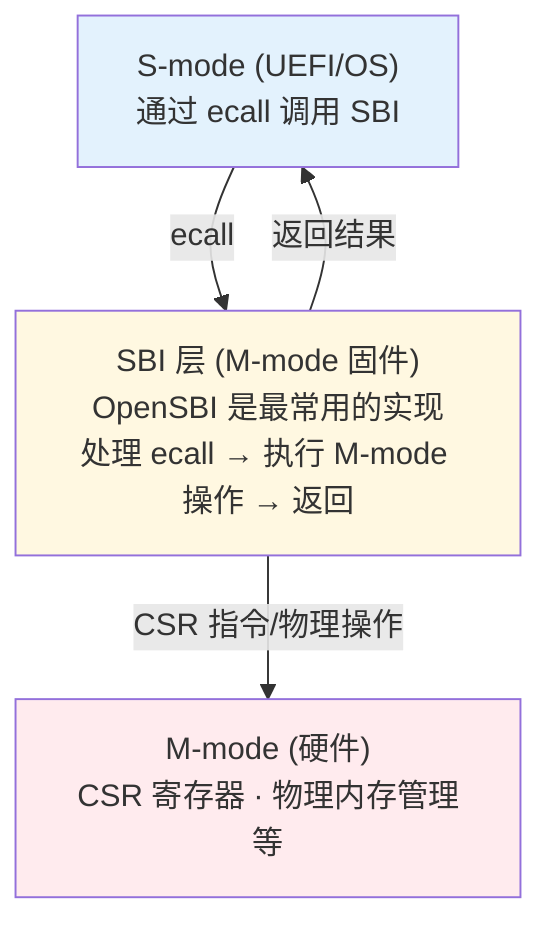
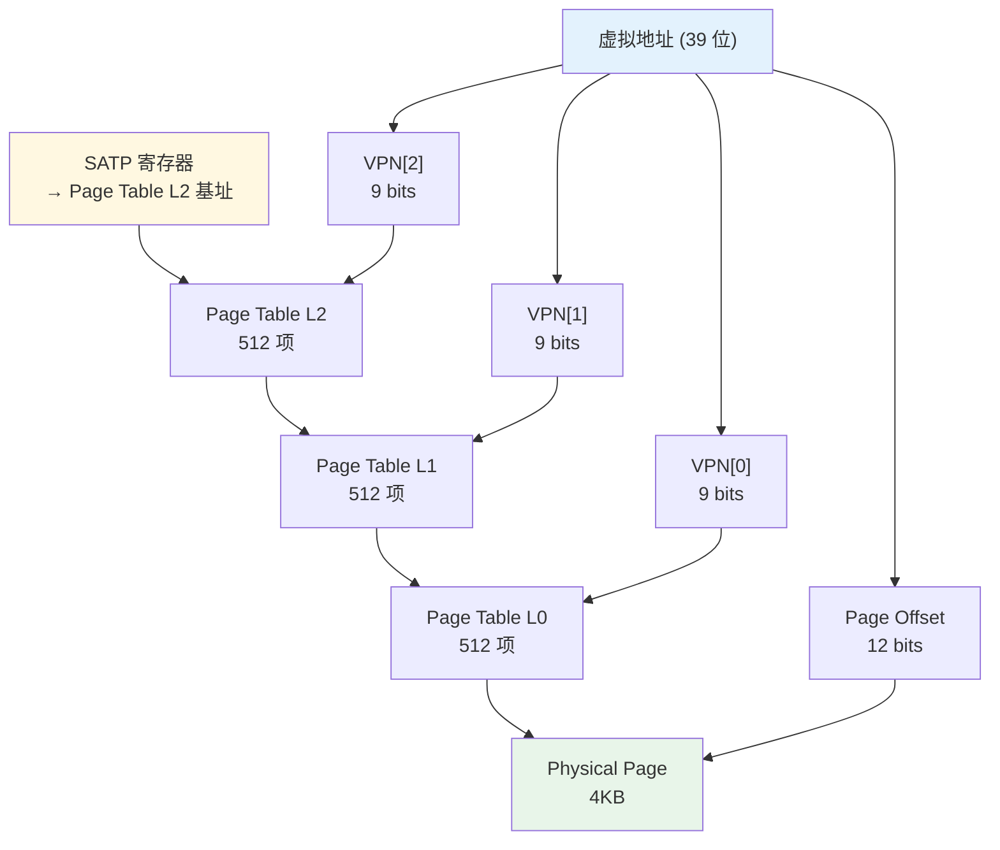
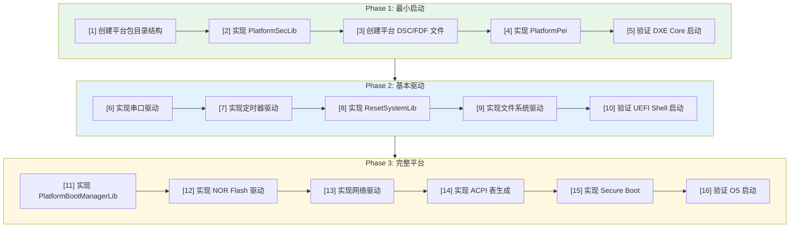

# EDK2 RISC-V 与平台移植

> RISC-V 服务器需要 UEFI，就像汽车需要方向盘——不是唯一选择，但是工业标准的选择。这一篇是你在 RISC-V SoC 上移植 UEFI 的实战指南。

## 1. RISC-V 在 EDK2 中的架构

### 1.1 代码分布

EDK2 中**没有独立的 RiscVPkg**，RISC-V 支持分散在多个包中，通过 `[RISCV64]` 架构条件段区分：

```
RISC-V 支持分布图：

MdePkg (基础层)
├── Include/RiscV64/ProcessorBind.h        ← 类型绑定
├── Include/Register/RiscV64/              ← CSR 寄存器定义
├── Include/Library/BaseRiscVSbiLib.h      ← SBI 库接口
├── Library/BaseLib/RiscV64/               ← BaseLib RISC-V 实现
├── Library/BaseRiscVSbiLib/               ← SBI 调用库
├── Library/BaseSerialPortLibRiscVSbiLib/  ← SBI 串口库
├── Library/BaseCpuLib/RiscV/              ← CPU 初始化
├── Library/BaseRngLib/RiscV/              ← 随机数
├── Library/BasePeCoffLib/RiscV/           ← PE/COFF 加载
└── Library/PeiServicesTablePointerLibRiscV/ ← PEI 服务表指针

UefiCpuPkg (CPU 层)
├── CpuDxeRiscV64/                         ← CPU DXE 驱动
├── CpuTimerDxeRiscV64/                    ← CPU 定时器驱动
├── Library/BaseRiscV64CpuTimerLib/        ← CPU 定时器库
├── Library/BaseRiscVMmuLib/               ← MMU 操作库
└── Library/CpuExceptionHandlerLib/RiscV/  ← 异常处理

OvmfPkg/RiscVVirt (平台层)
├── RiscVVirtQemu.dsc / .fdf               ← QEMU 平台定义
├── Library/PlatformSecLib/                ← SEC 平台库
├── Library/PlatformBootManagerLib/        ← 启动管理器
└── Library/ResetSystemLib/                ← 重启库

DynamicTablesPkg (ACPI 层)
├── Library/Acpi/RiscV/AcpiRhctLibRiscV/   ← RHCT 表
├── Library/Acpi/RiscV/AcpiMadtLibRiscV/   ← MADT 表
└── Library/FdtHwInfoParserLib/RiscV/      ← FDT 解析
```

> **设计背景 — 为什么没有 RiscVPkg？** EDK2 的包组织原则是"按功能而非按架构"。RISC-V 的基础类型定义属于 MdePkg（所有架构共享），CPU 驱动属于 UefiCpuPkg（所有 CPU 架构共享），平台代码属于各自的平台包。这种组织方式避免了架构特定的包变成"大杂烩"，也让跨架构的代码复用更自然。

### 1.2 RISC-V 启动流程 vs x86

```mermaid
%%{init: {"theme": "base", "themeVariables": {\
    "primaryColor": "#EEEDFF",\
    "primaryTextColor": "#333333",\
    "primaryBorderColor": "#8B7EC8",\
    "secondaryColor": "#FFF8E1",\
    "secondaryTextColor": "#333333",\
    "secondaryBorderColor": "#FFB300",\
    "tertiaryColor": "#F5F5F5",\
    "tertiaryTextColor": "#333333",\
    "tertiaryBorderColor": "#9E9E9E",\
    "lineColor": "#888888",\
    "textColor": "#333333",\
    "fontFamily": "\"trebuchet ms\", verdana, arial, sans-serif"}}}%%
flowchart TD
    subgraph x86["x86 启动流程"]
        X1["CPU 复位 (0xFFFFFFF0)"] --> X2["16位实模式"]
        X2 --> X3["32位保护模式"]
        X3 --> X4["64位长模式"]
        X4 --> X5["SEC (C 代码)"]
        X5 --> X6["PEI → DXE → BDS → OS"]
    end

    subgraph RV["RISC-V 启动流程"]
        R1["CPU 复位 (0x1000, QEMU virt)"] --> R2["M-mode (机器模式)"]
        R2 --> R3["OpenSBI (M-mode 固件)<br/>初始化 M-mode · 设置 S-mode 入口<br/>通过 SBI ecall 服务"]
        R3 --> R4["SEC (S-mode, UEFI 入口)<br/>接收 BootHartId 和 FdtPointer<br/>从 PCD 获取临时 RAM · 初始化"]
        R4 --> R5["PEI → DXE → BDS → OS"]
    end

    style x86 fill:#E3F2FD
    style RV fill:#FFF8E1
```



**关键差异**：

| 特性 | x86 | RISC-V |
|------|-----|--------|
| 复位向量 | 0xFFFFFFF0 | 平台特定（QEMU: 0x1000） |
| 初始模式 | 16位实模式 | M-mode |
| 模式切换 | 实模式→保护模式→长模式 | M-mode→S-mode（一次切换） |
| SMM | 有（x86 特有） | 无（使用 StandaloneMmPkg 替代） |
| I/O 端口 | 有（IN/OUT 指令） | 无（纯 MMIO） |
| 固件服务 | 无 | SBI (Supervisor Binary Interface) |
| 设备描述 | ACPI 为主 | FDT + ACPI |
| 串口 | I/O 端口或 MMIO | MMIO + SBI console |

> **设计背景 — 为什么 RISC-V 需要 SBI？** x86 的 SMM 提供了 OS 不可见的高权限执行环境，但 RISC-V 没有类似机制。SBI（Supervisor Binary Interface）是 RISC-V 的解决方案：M-mode 固件（如 OpenSBI）运行在最高特权级，S-mode 软件（UEFI/OS）通过 `ecall` 指令请求 M-mode 服务。这种设计比 SMM 更简洁透明——SBI 调用是显式的、可审计的，不像 SMI 那样对 OS 完全不可见。

## 2. SBI — RISC-V 的固件服务层

### 2.1 SBI 概述

SBI (Supervisor Binary Interface) 是 RISC-V S-mode 软件与 M-mode 固件之间的标准接口，类似 ARM 的 SMCCC (Secure Monitor Call)。



> **设计背景 — SBI 的设计哲学**：RISC-V 特权架构规范故意将 M-mode 和 S-mode 分离——S-mode 软件不能直接访问 M-mode 的 CSR 寄存器或执行 M-mode 操作。SBI 是两个特权级之间的"合同"：S-mode 软件只需要知道 SBI 接口，不需要知道 M-mode 固件的具体实现。这使得 M-mode 固件可以独立更新（例如从 OpenSBI 切换到其他实现），而不影响 S-mode 软件。

### 2.2 BaseRiscVSbiLib

EDK2 封装了 SBI 调用，位于 `MdePkg/Library/BaseRiscVSbiLib/`：

```c
// 核心 SBI ecall 封装（返回 SBI_RET 结构体）
SBI_RET
EFIAPI
SbiCall (
  IN  UINTN ExtId,     // SBI 扩展 ID
  IN  UINTN FuncId,    // 函数 ID
  IN  UINTN NumArgs,   // 参数数量 (0-6)
  ...
  );

// SBI_RET: Error = SBI 状态码, Value = 返回值
typedef struct { UINTN Error; UINTN Value; } SBI_RET;

// 常用 SBI 函数
VOID SbiSetTimer (UINT64 Time);                                    // 设置定时器
EFI_STATUS SbiSystemReset (UINTN ResetType, UINTN ResetReason);    // 系统重启
```

**SBI 扩展 ID**：

| 扩展 | ID | 用途 |
|------|-----|------|
| SBI_EXT_BASE | 0x10 | SBI 基础功能（版本探测等） |
| SBI_EXT_TIME | 0x54494D45 | 定时器 |
| SBI_EXT_SRST | 0x53525354 | 系统重启 |
| SBI_EXT_HSM | 0x48534D | Hart 状态管理 |
| SBI_EXT_DBCN | 0x4442434E | 调试控制台 |
| SBI_EXT_0_1_CONSOLE_PUTCHAR | 0x1 | Legacy 字符输出（SBI 0.1 兼容） |

> **SBI 扩展 ID 的编码**：有些扩展 ID 是数字（如 0x10），有些是 ASCII 编码（如 0x54494D45 = "TIME"，0x53525354 = "SRST"）。ASCII 编码的扩展 ID 是 SBI v1.0 规范引入的，用于区分标准扩展和厂商扩展。

### 2.3 SBI 串口库

`MdePkg/Library/BaseSerialPortLibRiscVSbiLib/` 通过 SBI 调试控制台扩展实现串口输出，是 RISC-V UEFI 最早可用的调试输出手段。该库有两个实现：
- **BaseSerialPortLibRiscVSbiLib.inf** — SEC/PEI 用（XIP 环境，只写不支持读）
- **BaseSerialPortLibRiscVSbiLibRam.inf** — DXE 用（完整功能）

```c
// 写数据策略（Common.c）
// 1. 优先使用 SBI DBCN 扩展 (SbiDbcnWrite)
// 2. 回退到 SBI Legacy putchar (SbiLegacyPutchar)
// 3. 两者都不可用则返回 0

UINTN SbiDbcnWrite (IN UINT8 *Buffer, IN UINTN NumberOfBytes)
{
  SBI_RET Ret;
  Ret = SbiCall(SBI_EXT_DBCN, SBI_EXT_DBCN_WRITE, 3, NumberOfBytes, (UINTN)Buffer, 0);
  return Ret.Value;  // 返回实际写入字节数
}
```

> **设计背景 — 为什么 SBI 串口是最早的调试手段？** 在 SEC 阶段，UEFI 还没有初始化任何硬件设备（如 UART 控制器）。但 SBI console 只需要一条 `ecall` 指令就能输出字符，因为实际的 UART 驱动由 M-mode 的 OpenSBI 处理。这意味着即使在 UEFI 最早期阶段，你也可以通过 `DEBUG` 宏输出调试信息。这在调试启动问题时极其宝贵。

## 3. RISC-V MMU

### 3.1 RISC-V 虚拟内存模式

RISC-V 支持三种虚拟内存模式：

| 模式 | 虚拟地址宽度 | 物理地址宽度 | SATP.Mode |
|------|-------------|-------------|-----------|
| Sv39 | 39 位 | 56 位 | 8 |
| Sv48 | 48 位 | 56 位 | 9 |
| Sv57 | 57 位 | 56 位 | 10 |

**页表结构**（以 Sv39 为例）：



> **设计背景 — Sv39/Sv48/Sv57 的渐进式设计**：RISC-V 的虚拟内存模式是渐进式的——Sv39 是必须支持的，Sv48 和 Sv57 是可选的。这种设计让简单的硬件实现只需要支持 Sv39（3 级页表，512KB 页表内存），而高性能实现可以支持 Sv48/Sv57 来获得更大的地址空间。UEFI 固件通常使用 Sv39 就足够了，因为固件阶段的地址空间需求不大。`PcdCpuRiscVMmuMaxSatpMode` PCD 允许平台选择使用哪种模式。

### 3.2 BaseRiscVMmuLib

`UefiCpuPkg/Library/BaseRiscVMmuLib/` 提供了 MMU 操作接口：

```c
// 设置内存区域属性
EFI_STATUS
RiscVSetMemoryAttributes (
  IN EFI_PHYSICAL_ADDRESS  BaseAddress,
  IN UINT64                Length,
  IN UINT64                Attributes     // EFI_MEMORY_XP, EFI_MEMORY_RO, etc.
  );

// 配置 MMU 模式
EFI_STATUS
RiscVConfigureMmu (
  IN UINT32  SatpMode     // 8=Sv39, 9=Sv48, 10=Sv57
  );

// 刷新 TLB
VOID
RiscVLocalFlushTlbAll (VOID);

VOID
RiscVLocalFlushTlbPage (IN UINT64 VirtualAddress);
```

### 3.3 PCD 控制 MMU 模式

```ini
# 在 DSC 中设置最大 SATP 模式
# 8 = Sv39, 9 = Sv48, 10 = Sv57
[PcdsFixedAtBuild]
  gUefiCpuPkgTokenSpaceGuid.PcdCpuRiscVMmuMaxSatpMode|10
```

## 4. OvmfPkg/RiscVVirt 架构分析

OvmfPkg/RiscVVirt 是 RISC-V UEFI 的参考平台实现，是学习平台移植的最佳起点。

### 4.1 目录结构

```
OvmfPkg/RiscVVirt/
├── RiscVVirtQemu.dsc               # 主平台 DSC
├── RiscVVirtQemu.fdf               # 主平台 FDF
├── RiscVVirt.dsc.inc               # 公共 DSC 包含
├── RiscVVirt.fdf.inc               # 公共 FDF 包含
├── RiscVVirtSystemFW.dsc.inc       # Capsule 更新配置
├── VarStore.fdf.inc                # NV 变量存储布局
├── PlatformPei/                    # PEI 平台初始化
│   └── PlatformPeim.c              # 解析 FDT，构建 HOB
├── Library/
│   ├── PlatformSecLib/             # SEC 阶段
│   │   ├── SecEntry.S              # 汇编入口
│   │   ├── PlatformSecLib.c        # SEC 初始化
│   │   ├── Cpu.c                   # CPU 初始化
│   │   ├── Memory.c                # 内存检测
│   │   └── Platform.c              # 平台初始化
│   ├── PlatformBootManagerLib/     # BDS 启动管理
│   │   ├── PlatformBm.c            # 启动设备枚举
│   │   └── QemuKernel.c            # 直接启动 Linux 内核
│   ├── ResetSystemLib/             # 系统重启
│   └── VirtNorFlashPlatformLib/    # NOR Flash 操作
└── Feature/
    ├── Capsule/                    # Capsule 固件更新
    └── SecureBoot/                 # 安全启动
```

### 4.2 SEC 阶段分析

RISC-V 的 SEC 阶段从 OpenSBI 转交控制权开始：

**SecEntry.S**（汇编入口，基于实际源码简化）：

```asm
#include "PlatformSecLib.h"

ASM_FUNC (_ModuleEntryPoint)
    li    s0, 0                     # 清零帧指针，防止栈回溯
    li    a2, FixedPcdGet32(PcdOvmfSecPeiTempRamBase)   # 临时 RAM 基址
    li    a3, FixedPcdGet32(PcdOvmfSecPeiTempRamSize)   # 临时 RAM 大小
    li    a4, SEC_HANDOFF_DATA_RESERVE_SIZE              # 预留 handoff 数据区
    sub   a3, a3, a4
    add   sp, a2, a3                # 设置栈指针
    call  SecStartupPlatform        # 跳转到 C 函数
```

> **注意**：实际源码中，SecEntry.S 不保存 a0/a1（BootHartId/FdtPointer）——这些参数由 C 函数 `SecStartupPlatform` 通过其他方式获取（如从 HOB 或全局变量）。临时 RAM 基址和大小通过 PCD 配置，而非硬编码。在 OpenSBI + UEFI 流程中，UEFI 运行在 S-mode，**不能**使用 `csrr mhartid` 等 M-mode CSR 指令，尝试访问会触发非法指令异常。

**PlatformSecLib.c**（C 入口）：

```c
VOID
EFIAPI
SecStartupPlatform (
  IN  UINTN  BootHartId,
  IN  VOID   *FdtPointer
  )
{
  DEBUG ((DEBUG_INFO, "SEC: Entry on Hart %lu\n", BootHartId));

  // 1. 初始化调试串口（通过 SBI DBCN/Legacy putchar）
  SerialPortInitialize ();

  // 2. 构建 SEC Handoff 数据
  // RISCV_SEC_HANDOFF_DATA: BootHartId (UINTN) + FdtPointer (VOID*)
  RiscVSecHobData.FdtPointer = (VOID *)FdtPointer;

  // 4. 定位 PEI Core 并跳转
  PeiCore = FindPeiCore ();
  PeiCore (&SecCoreData, NULL);
}
```

### 4.3 PEI 阶段分析

PlatformPeim.c 负责 FDT 解析和 HOB 构建：

```c
EFI_STATUS
EFIAPI
PlatformPeimInitialization (VOID)
{
  // 1. 从 HOB 获取 FDT 指针
  FdtPointer = GetFdtPointerFromHob ();

  // 2. 解析 FDT 获取内存信息
  // 构建 Resource Descriptor HOB
  BuildResourceDescriptorHob (...);

  // 3. 解析 FDT 获取 CPU 信息
  // 构建 CPU HOB

  // 4. 安装 FDT PPI
  // 供后续 PEIM 使用

  return EFI_SUCCESS;
}
```

> **设计背景 — 为什么 RISC-V 使用 FDT + ACPI 双重描述？** FDT（Flattened Device Tree）在 PEI 阶段使用，因为此时 UEFI 还没有建立完整的协议服务，FDT 的解析更轻量——只需要简单的二进制解析。ACPI 在 DXE 阶段由 DynamicTablesPkg 动态生成，供 OS 使用。这种"早期用 FDT，晚期用 ACPI"的模式是 RISC-V UEFI 的标准做法，也是 RISC-V 服务器规范的要求。

### 4.4 DSC 文件关键配置

**RiscVVirtQemu.dsc** 的关键部分：

```ini
[Defines]
  PLATFORM_NAME        = RiscVVirtQemu
  SUPPORTED_ARCHITECTURES = RISCV64
  FLASH_DEFINITION     = OvmfPkg/RiscVVirt/RiscVVirtQemu.fdf

# RISC-V 特定的库绑定
[LibraryClasses.RISCV64]
  BaseRiscVSbiLib|MdePkg/Library/BaseRiscVSbiLib/BaseRiscVSbiLib.inf
  RiscVMmuLib|UefiCpuPkg/Library/BaseRiscVMmuLib/BaseRiscVMmuLib.inf

# SEC/PEI 阶段库绑定
[LibraryClasses.common.SEC]
  PcdLib|MdePkg/Library/PeiPcdLib/PeiPcdLib.inf
  SerialPortLib|MdePkg/Library/BaseSerialPortLibRiscVSbiLib/BaseSerialPortLibRiscVSbiLib.inf

# DXE 阶段库绑定
[LibraryClasses.common.DXE_DRIVER]
  PcdLib|MdePkg/Library/DxePcdLib/DxePcdLib.inf
  SerialPortLib|MdePkg/Library/BaseSerialPortLibRiscVSbiLib/BaseSerialPortLibRiscVSbiLib.inf
```

### 4.5 FDF 文件关键配置

**RiscVVirt.fdf.inc** 定义了 Flash 布局常量：

```ini
DEFINE PFLASH0_BASE_ADDRESS  = 0x20000000
DEFINE PFLASH1_BASE_ADDRESS  = 0x22000000
DEFINE CODE_SIZE             = 0x00800000    # 8MB
DEFINE VARS_SIZE             = 0x000C0000    # 768KB
DEFINE VARS_FTW_WORKING_SIZE = 0x00040000    # 256KB
DEFINE VARS_FTW_SPARE_SIZE   = 0x00040000    # 256KB
```

## 5. RISC-V ACPI 表

RISC-V 服务器使用 ACPI 描述硬件，DynamicTablesPkg 提供了动态 ACPI 表生成框架。

> **设计背景 — 为什么使用动态 ACPI 表生成？** 传统的 ACPI 表是静态二进制文件，硬编码在固件中。但 RISC-V 系统的硬件配置是动态的——Hart 数量、ISA 扩展、中断控制器类型等都可能变化。DynamicTablesPkg 允许在运行时根据实际硬件配置动态生成 ACPI 表，避免了为每种配置维护单独的静态表。

### 5.1 RISC-V 特有 ACPI 表

| ACPI 表 | 缩写 | 源码位置 | 用途 |
|---------|------|----------|------|
| RISC-V Hart Capabilities Table | RHCT | `DynamicTablesPkg/Library/Acpi/RiscV/AcpiRhctLibRiscV/` | 描述 Hart 的 ISA 字符串、CMO 和 MMU 能力 |
| Multiple APIC Description Table | MADT | `DynamicTablesPkg/Library/Acpi/RiscV/AcpiMadtLibRiscV/` | 描述 RINTC (RISC-V INTC)、IMSIC、APLIC、PLIC |
| System Resource Affinity Table | SRAT | `DynamicTablesPkg/Library/Acpi/Common/AcpiSratLib/RiscV/` | NUMA 亲和性描述 |
| Fixed ACPI Description Table | FADT | `DynamicTablesPkg/Library/Acpi/Common/AcpiFadtLib/RiscV/` | 固定硬件描述 |
| Debug Port Table 2 | DBG2 | `DynamicTablesPkg/Library/Acpi/Common/AcpiDbg2Lib/RiscV/` | 调试端口描述 |

### 5.2 RHCT 表

RHCT 是 RISC-V 特有的 ACPI 表，描述 Hart 的能力：

```c
typedef struct {
  EFI_ACPI_DESCRIPTION_HEADER  Header;
  UINT64                       TimeBaseFrequency;
  UINT32                       NumHartInfo;
  UINT8                        IsaStringOffset[];  // ISA 字符串偏移
  // 后跟 Hart Info 节点和 ISA String 数组
} EFI_ACPI_RHCT_TABLE;

// Hart Info 节点
typedef struct {
  UINT16  Type;           // 0 = Hart Info
  UINT16  Length;
  UINT64  AcpiProcessorUid;
  // 后跟 CMO 节点、MMU 节点等
} RHCT_HART_INFO_NODE;
```

> **设计背景 — RHCT 的意义**：在 x86/ARM 世界中，CPU 能力通过 CPUID/ID 寄存器在运行时探测。但 RISC-V 的设计哲学是"软件通过 ISA 字符串发现 CPU 能力"——每个 Hart 支持哪些扩展由 ISA 字符串描述（如 `rv64imafdcvh_zba_zbb_sstc`）。RHCT 将这些 ISA 字符串暴露给 OS，让 OS 可以在启动时就知道每个 Hart 的能力，而不需要编写 M-mode 代码去读 CSR 寄存器。

### 5.3 MADT 表（RISC-V 版本）

RISC-V MADT 包含以下中断控制器结构：

| 类型 | 名称 | 描述 |
|------|------|------|
| 0x18 | RINTC | RISC-V Interrupt Controller（每个 Hart 一个） |
| 0x19 | IMSIC | Incoming Message Signaled Interrupt Controller |
| 0x1A | APLIC | Advanced Platform-Level Interrupt Controller |
| 0x1B | PLIC | Platform-Level Interrupt Controller |

## 6. 平台移植实战

### 6.1 移植检查清单

为新的 RISC-V SoC 移植 UEFI，需要完成以下工作：



### 6.2 创建平台包

```
MyRiscVPlatformPkg/
├── MyRiscVPlatformPkg.dec          # 包声明
├── MyRiscVPlatformPkg.dsc          # 平台 DSC
├── MyRiscVPlatformPkg.fdf          # 平台 FDF
├── Include/
│   ├── Guid/
│   │   └── MyPlatformGuid.h
│   └── Library/
│       └── MyPlatformLib.h
├── Library/
│   ├── PlatformSecLib/
│   │   ├── PlatformSecLib.c
│   │   ├── PlatformSecLib.inf
│   │   └── SecEntry.S
│   ├── PlatformBootManagerLib/
│   │   ├── PlatformBm.c
│   │   └── PlatformBootManagerLib.inf
│   └── ResetSystemLib/
│       ├── ResetSystemLib.c
│       └── ResetSystemLib.inf
├── PlatformPei/
│   ├── PlatformPeim.c
│   └── PlatformPei.inf
└── Drivers/
    └── MyHardwareDxe/
        ├── MyHardware.c
        └── MyHardwareDxe.inf
```

### 6.3 DEC 文件模板

```ini
[Defines]
  DEC_SPECIFICATION   = 0x00010005
  PACKAGE_NAME        = MyRiscVPlatformPkg
  PACKAGE_GUID        = XXXXXXXX-XXXX-XXXX-XXXX-XXXXXXXXXXXX
  PACKAGE_VERSION     = 1.0

[Includes]
  Include

[Includes.RISCV64]
  Include/RiscV64

[LibraryClasses.RISCV64]
  MyPlatformLib|Include/Library/MyPlatformLib.h

[Guids]
  gMyPlatformGuid = { XXXXXXXX-XXXX-XXXX-XXXX-XXXXXXXXXXXX }

[PcdsFixedAtBuild]
  gMyPlatformTokenSpaceGuid.PcdMyPlatformMemoryBase|0x80000000|UINT64|0x00000001
  gMyPlatformTokenSpaceGuid.PcdMyPlatformMemorySize|0x40000000|UINT64|0x00000002
```

### 6.4 DSC 文件模板

```ini
[Defines]
  DSC_SPECIFICATION    = 0x00010005
  PLATFORM_NAME        = MyRiscVPlatform
  SUPPORTED_ARCHITECTURES = RISCV64
  BUILD_TARGETS        = DEBUG|RELEASE|NOOPT
  SKUID_IDENTIFIER     = DEFAULT
  FLASH_DEFINITION     = MyRiscVPlatformPkg/MyRiscVPlatformPkg.fdf

[LibraryClasses]
  BaseLib|MdePkg/Library/BaseLib/BaseLib.inf
  BaseMemoryLib|MdePkg/Library/BaseMemoryLibRepStr/BaseMemoryLibRepStr.inf
  DebugLib|MdePkg/Library/UefiDebugLibConOut/UefiDebugLibConOut.inf
  PcdLib|MdePkg/Library/BasePcdLibNull/BasePcdLibNull.inf
  PrintLib|MdePkg/Library/BasePrintLib/BasePrintLib.inf
  IoLib|MdePkg/Library/BaseIoLibIntrinsic/BaseIoLibIntrinsic.inf

[LibraryClasses.RISCV64]
  BaseRiscVSbiLib|MdePkg/Library/BaseRiscVSbiLib/BaseRiscVSbiLib.inf
  RiscVMmuLib|UefiCpuPkg/Library/BaseRiscVMmuLib/BaseRiscVMmuLib.inf

[LibraryClasses.common.SEC]
  PcdLib|MdePkg/Library/PeiPcdLib/PeiPcdLib.inf
  HobLib|MdePkg/Library/PeiHobLib/PeiHobLib.inf
  MemoryAllocationLib|MdePkg/Library/PeiMemoryAllocationLib/PeiMemoryAllocationLib.inf
  SerialPortLib|MdePkg/Library/BaseSerialPortLibRiscVSbiLib/BaseSerialPortLibRiscVSbiLib.inf

[LibraryClasses.common.PEIM]
  PcdLib|MdePkg/Library/PeiPcdLib/PeiPcdLib.inf
  HobLib|MdePkg/Library/PeiHobLib/PeiHobLib.inf
  MemoryAllocationLib|MdePkg/Library/PeiMemoryAllocationLib/PeiMemoryAllocationLib.inf

[LibraryClasses.common.DXE_DRIVER]
  PcdLib|MdePkg/Library/DxePcdLib/DxePcdLib.inf
  HobLib|MdePkg/Library/DxeHobLib/DxeHobLib.inf
  MemoryAllocationLib|MdePkg/Library/UefiMemoryAllocationLib/UefiMemoryAllocationLib.inf
  UefiBootServicesTableLib|MdePkg/Library/UefiBootServicesTableLib/UefiBootServicesTableLib.inf

[Components]
  MdeModulePkg/Core/Pei/PeiCore.inf
  MdeModulePkg/Core/Dxe/DxeMain.inf
  MdeModulePkg/Universal/BdsDxe/BdsDxe.inf
  UefiCpuPkg/CpuDxeRiscV64/CpuDxeRiscV64.inf
  UefiCpuPkg/CpuTimerDxeRiscV64/CpuTimerDxeRiscV64.inf
  MyRiscVPlatformPkg/PlatformPei/PlatformPei.inf
  MyRiscVPlatformPkg/Library/ResetSystemLib/ResetSystemLib.inf
```

### 6.5 SEC 入口实现

**SecEntry.S**（参考 RiscVVirt 实际实现）：

```asm
#include <AsmMacroLibRiscV64.h>

ASM_FUNC (_ModuleEntryPoint)
    li    s0, 0                     # 清零帧指针，防止栈回溯
    li    a2, FixedPcdGet32(PcdSecPeiTempRamBase)   # 临时 RAM 基址
    li    a3, FixedPcdGet32(PcdSecPeiTempRamSize)   # 临时 RAM 大小
    li    a4, SEC_HANDOFF_DATA_RESERVE_SIZE
    sub   a3, a3, a4
    add   sp, a2, a3                # 设置栈指针
    call  SecStartupPlatform        # 跳转到 C 函数
```

> **注意**：实际 RiscVVirt 的 SecEntry.S 不在汇编中保存 BootHartId/FdtPointer，也不做 Boot Hart 判断——这些逻辑由 C 函数 `SecStartupPlatform` 处理。Boot Hart 判断通常通过 OpenSBI 的 HSM 扩展完成。关键是：**在 S-mode 下不能使用 M-mode CSR（如 `mhartid`、`mstatus` 等）**，否则会触发非法指令异常。

**PlatformSecLib.c**：

```c
#include <PiPei.h>
#include <Library/BaseLib.h>
#include <Library/DebugLib.h>
#include <Library/BaseRiscVSbiLib.h>
#include <Library/PcdLib.h>

STATIC RISCV_SEC_HANDOFF_DATA  mSecHandoffData;

VOID
EFIAPI
SecStartupPlatform (
  IN  UINTN  BootHartId,
  IN  VOID   *FdtPointer
  )
{
  DEBUG ((DEBUG_INFO, "SEC: Entry on Hart %lu\n", BootHartId));

  mSecHandoffData.BootHartId = BootHartId;
  mSecHandoffData.FdtPointer = FdtPointer;

  SbiSetTimer (0xFFFFFFFFFFFFFFFF);

  PeiCore = FindPeiCoreInFv ();
  if (PeiCore == NULL) {
    DEBUG ((DEBUG_ERROR, "SEC: Failed to find PEI Core\n"));
    CpuDeadLoop ();
  }

  SecCoreData.BootFirmwareVolume = GetBfvBase ();
  SecCoreData.TemporaryRamBase   = (VOID *)PcdGet64 (PcdMyPlatformMemoryBase);
  SecCoreData.TemporaryRamSize   = SIZE_128KB;

  PeiCore (&SecCoreData, NULL);
}
```

### 6.6 PlatformPei 实现

```c
#include <PiPei.h>
#include <Library/PeiServicesLib.h>
#include <Library/HobLib.h>
#include <Library/DebugLib.h>
#include <Library/FdtLib.h>
#include <Guid/RiscVSecHobData.h>

EFI_STATUS
EFIAPI
PlatformPeimInitialization (VOID)
{
  VOID   *FdtPointer;
  UINT64 MemoryBase;
  UINT64 MemorySize;

  FdtPointer = GetFdtPointerFromHob ();
  if (FdtPointer == NULL) {
    DEBUG ((DEBUG_ERROR, "PlatformPei: No FDT found\n"));
    return EFI_NOT_FOUND;
  }

  if (ParseFdtMemoryInfo (FdtPointer, &MemoryBase, &MemorySize)) {
    BuildResourceDescriptorHob (
      EFI_RESOURCE_SYSTEM_MEMORY,
      EFI_RESOURCE_ATTRIBUTE_PRESENT |
      EFI_RESOURCE_ATTRIBUTE_INITIALIZED |
      EFI_RESOURCE_ATTRIBUTE_TESTED |
      EFI_RESOURCE_ATTRIBUTE_UNCACHEABLE |
      EFI_RESOURCE_ATTRIBUTE_WRITE_COMBINEABLE |
      EFI_RESOURCE_ATTRIBUTE_WRITE_THROUGH_CACHEABLE |
      EFI_RESOURCE_ATTRIBUTE_WRITE_BACK_CACHEABLE,
      MemoryBase,
      MemorySize
      );
    DEBUG ((DEBUG_INFO, "PlatformPei: Memory 0x%lx + 0x%lx\n", MemoryBase, MemorySize));
  }

  BuildCpuHob (40, 39);

  return EFI_SUCCESS;
}
```

> **BuildCpuHob(40, 39) 的含义**：第一个参数是物理地址位数（40 = 1TB 地址空间），第二个参数是虚拟地址位数（39 = Sv39）。这些值告诉 DXE Core 系统的地址空间大小，影响内存分配和映射策略。你需要根据你的 SoC 实际支持的地址宽度来设置这些值。

## 7. RISC-V 特有协议

### 7.1 RISCV_EFI_BOOT_PROTOCOL

这是 RISC-V UEFI 平台必须实现的协议，提供获取启动 Hart ID 的方法：

```c
// UefiCpuPkg/Include/Protocol/RiscVBootProtocol.h
typedef struct _RISCV_EFI_BOOT_PROTOCOL {
  UINT64  Revision;
  EFI_STATUS (EFIAPI *GetBootHartId) (
    IN RISCV_EFI_BOOT_PROTOCOL  *This,
    OUT UINTN                    *BootHartId
    );
} RISCV_EFI_BOOT_PROTOCOL;

#define RISCV_EFI_BOOT_PROTOCOL_REVISION  0x00010000
#define RISCV_EFI_BOOT_PROTOCOL_GUID \
  { 0xccd15fec, 0x6f73, 0x4eec, { 0x83, 0x95, 0x3e, 0x69, 0xe4, 0xb9, 0x40, 0xbf } }
```

此协议由 `UefiCpuPkg/CpuDxeRiscV64/` 安装。

> **设计背景 — 为什么需要这个协议？** RISC-V UEFI 规范要求 OS 能够获取 Boot Hart ID，以便在 SMP 启动时知道哪个 Hart 是主 Hart。在 x86 上，BSP（Bootstrap Processor）的识别由硬件保证；在 RISC-V 上，Boot Hart 由 M-mode 固件（OpenSBI）决定，需要通过协议传递给 OS。这是 RISC-V UEFI 规范特有的要求。

## 8. 调试与验证

### 8.1 QEMU 调试环境

```bash
# 启动 QEMU 并等待 GDB 连接
qemu-system-riscv64 \
    -machine virt \
    -m 8G \
    -smp 4 \
    -bios default \
    -pflash /path/to/CODE.fd \
    -pflash /path/to/VARS.fd \
    -drive file=disk.img,format=raw \
    -netdev user,id=net0 \
    -device virtio-net-pci,netdev=net0 \
    -nographic \
    -s -S

# GDB 连接
riscv64-unknown-elf-gdb
(gdb) set architecture riscv:rv64
(gdb) target remote :1234
(gdb) break DxeMain
(gdb) continue
```

### 8.2 常见问题排查

| 问题 | 可能原因 | 解决方法 |
|------|----------|----------|
| 无串口输出 | SBI console 未启用 | 检查 BaseSerialPortLibRiscVSbiLib 绑定 |
| DXE Core 崩溃 | 内存 HOB 不正确 | 检查 PlatformPei 中的内存描述 |
| 驱动调度失败 | DEPEX 不满足 | 检查依赖的 Protocol 是否安装 |
| MMU fault | 页表配置错误 | 检查 BaseRiscVMmuLib 配置和 PCD |
| BDS 卡住 | 无启动设备 | 检查 BlockIo 协议和文件系统驱动 |
| 变量服务失败 | NOR Flash 驱动缺失 | 检查 VirtNorFlashPlatformLib |
| 非法指令异常 | S-mode 访问了 M-mode CSR | 检查代码中是否使用了 `mhartid` 等 M-mode CSR |

### 8.3 关键调试断点

```gdb
# 启动关键断点
break SecEntry
break PeiCore
break DxeMain
break BdsEntry

# RISC-V 特定
break RiscVSetMemoryAttributes
break CpuDxeRiscV64Entry

# 协议安装断点
break CoreInstallProtocolInterface
```

## 9. RISC-V 服务器 UEFI 生态

### 9.1 规范与标准

| 规范 | 状态 | 说明 |
|------|------|------|
| RISC-V UEFI | 已发布 | RISC-V UEFI 协议规范 |
| RISC-V ACPI | 已发布 | RHCT、MADT 等 RISC-V ACPI 表定义 |
| RISC-V SBI | v2.0 | Supervisor Binary Interface |
| RISC-V IOMMU | 规范中 | IO 内存映射规范 |
| RISC-V AIA | 已发布 | Advanced Interrupt Architecture |

### 9.2 关键资源

| 资源 | 链接 |
|------|------|
| EDK2 RISC-V 源码 | https://github.com/tianocore/edk2 |
| OpenSBI | https://github.com/riscv-software-src/opensbi |
| RISC-V UEFI 规范 | https://github.com/riscv-non-isa/riscv-uefi |
| RISC-V ACPI 规范 | https://github.com/riscv-non-isa/riscv-acpi |
| QEMU RISC-V | https://www.qemu.org/docs/master/system/target-riscv.html |

---

**上一篇**：[03-module-development.md](03-module-development.md) — 模块开发实战
