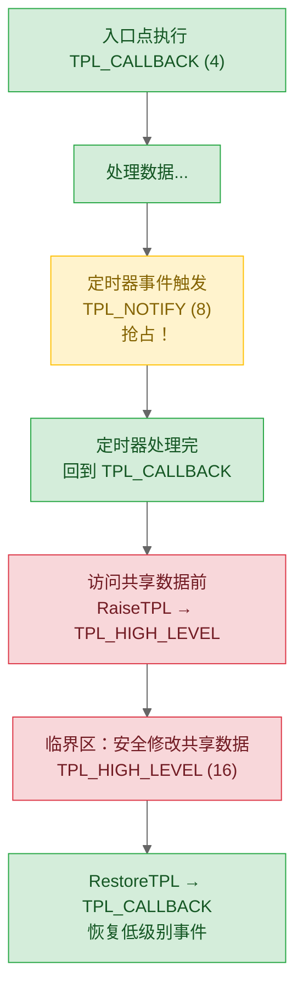

# 06 — 事件、TPL、DEPEX：驱动间的时序与调度

> 前面写驱动时假设 Dispatcher 会按正确顺序加载。现实是 Dispatcher 不保证顺序。事件、TPL、DEPEX 这三个机制要解决的就是"谁先谁后"和"怎么安全地共享数据"的问题。最后一节讲到 OS 交接——这是你写的所有驱动的终点。

## 1. 事件：UEFI 的通知机制

### 1.1 事件类型与创建

```c
EFI_EVENT  mTimerEvent;

// 创建一个 1 秒周期的定时器事件
EFI_STATUS Status = gBS->CreateEvent (
  EVT_TIMER,                    // 事件类型
  TPL_CALLBACK,                 // 回调时的 TPL
  TimerCallback,                // void EFIAPI (*)(Event, Context)
  NULL,                         // Context（传给回调的额外参数）
  &mTimerEvent                  // → 事件对象
  );
if (!EFI_ERROR (Status)) {
  gBS->SetTimer (mTimerEvent, TimerPeriodic, 10000000);  // 100ns 单位，1s
}
```

| 事件类型 | 触发时机 | 典型用途 |
|----------|----------|---------|
| `EVT_TIMER` | 定时器到期 | 周期轮询任务、看门狗 |
| `EVT_NOTIFY_SIGNAL` | 手动 `SignalEvent()` 或 Protocol 通知 | 外部事件触发逻辑 |
| `EVT_NOTIFY_WAIT` | `WaitForEvent()` 返回时 | 等待多个事件中任一就绪 |
| `EVT_SIGNAL_EXIT_BOOT_SERVICES` | OS Loader 调用 `ExitBootServices()` | 停止 DMA、清理 Boot Services 资源 |
| `EVT_SIGNAL_VIRTUAL_ADDRESS_CHANGE` | Runtime 驱动地址转换 | 在虚拟地址模式下更新指针 |

---

## 2. Protocol 通知回调：处理调度顺序不确定

回到 [05](05-first-driver.md) 里 ProducerDxe（安装 `MY_PROTOCOL`）和 ConsumerDxe（需要 `MY_PROTOCOL`）的例子。Dispatcher 可能先调度 ConsumerDxe——此时入口点直接调 `LocateProtocol` 会返回 `EFI_NOT_FOUND`，驱动初始化失败，永不重试。

Protocol 通知回调解决的就是这个问题——**不等 Dispatcher 顺序，而是主动告诉你"你要的 Protocol 到了"**。

**错误写法（直接查找）**：

```c
// ConsumerDxe 先被加载 → EFI_NOT_FOUND → 驱动永远初始化失败
EFI_STATUS EFIAPI ConsumerEntryPoint (...) {
  MY_PROTOCOL *MyProto;
  return gBS->LocateProtocol (&gMyProtocolGuid, NULL, (VOID**)&MyProto);
}
```

**正确写法（通知回调）**：

```c
STATIC VOID      *mNotificationReg;
STATIC EFI_EVENT  mNotificationEvent;

// 当 ProducerDxe 安装 MY_PROTOCOL 时，DXE Core 触发此回调
STATIC VOID EFIAPI OnMyProtocolInstalled (
  IN EFI_EVENT Event, IN VOID *Context)
{
  EFI_STATUS   Status;
  MY_PROTOCOL  *MyProto;
  UINT32        ConfigValue;

  // mNotificationReg 告诉 LocateProtocol "返回本次安装的实例"
  Status = gBS->LocateProtocol (&gMyProtocolGuid, mNotificationReg,
                                 (VOID**)&MyProto);
  if (EFI_ERROR (Status)) return;

  // Protocol 就绪——执行之前因时序问题无法做的初始化
  MyProto->GetData (MyProto, 0, &ConfigValue);
  InitializeConsumerInternals (ConfigValue);
}

EFI_STATUS EFIAPI ConsumerEntryPoint (
  IN EFI_HANDLE ImageHandle, IN EFI_SYSTEM_TABLE *SystemTable)
{
  // 入口点只注册通知，立即返回——初始化在回调里按需完成
  EfiCreateProtocolNotifyEvent (
    &gMyProtocolGuid, TPL_CALLBACK,
    OnMyProtocolInstalled, NULL,
    &mNotificationReg, &mNotificationEvent);
  return EFI_SUCCESS;
}
```

> `EfiCreateProtocolNotifyEvent` 是 `UefiLib` 的便捷函数，内部封装了 `CreateEvent(EVT_NOTIFY_SIGNAL, ...)` + `RegisterProtocolNotify(...)`。INF 中需声明 `UefiLib`。

**执行时序**：

```
Dispatcher 调度 ConsumerDxe → 入口点注册通知 → 返回 SUCCESS
Dispatcher 调度 ProducerDxe → 入口点 InstallProtocolInterface(MY_PROTOCOL)
                                ↓
      DXE Core 扫描通知注册表 → 找到 OnMyProtocolInstalled → 调用它
                                ↓
            回调中 LocateProtocol → 拿到 MyProto → 初始化 ConsumerDxe
```

---

## 3. TPL：单线程协作调度中的"中断优先级"

### 3.1 心智模型

UEFI 是**单线程协作调度的**——没有抢占式内核线程。但事件回调可以在不同 TPL 级别运行。高 TPL 可以抢占低 TPL 的执行：



| TPL | 名称 | 谁会在此 TPL 运行 |
|------|------|------------------|
| `TPL_APPLICATION` | 用户代码 | OS Loader 调用、Shell 命令 |
| `TPL_CALLBACK` | 驱动回调 | 大多数 Protocol 通知、`DriverBinding:Supported/Start/Stop` |
| `TPL_NOTIFY` | 通知信号 | 定时器回调、快速通知 |
| `TPL_HIGH_LEVEL` | 临界区 | 中断被 **完全禁用**，仅用于保护极小段共享数据 |
| `TPL_HIGH_LEVEL + 1` | — | 不再存在，此时所有中断被屏蔽 |

### 3.2 什么时候要 RaiseTPL

典型场景：在 `TPL_CALLBACK` 下维护一份链表，而定时器回调（`TPL_NOTIFY`）也可能修改同一份链表。如果不保护，定时器会在你的修改进行到一半时抢占执行，导致数据错乱。

```c
EFI_TPL OldTpl;

OldTpl = gBS->RaiseTPL (TPL_HIGH_LEVEL);
// 临界区：任何 TPL ≤ 15 的事件都不会抢占
UpdateSharedLinkedList ();
gBS->RestoreTPL (OldTpl);
```

**致命规则**：RaiseTPL 必须匹配 RestoreTPL，且必须在同一函数内完成。忘记 RestoreTPL 会永久阻塞所有低 TPL 事件——等同于死锁。

---

## 4. DEPEX：依赖表达式

DEPEX 是另一个决定"谁先谁后"的机制——不过它在**编译期**就决定了，不需要运行时的通知回调。

```
// INF 中
[Depex]
  gEfiPciRootBridgeIoProtocolGuid AND gEfiCpuArchProtocolGuid

// 编译为字节码：PUSH GUID1 PUSH GUID2 AND END
// 嵌入 .efi 文件的 DEPEX Section
```

DXE Dispatcher 加载驱动前先解析 DEPEX 字节码，栈式求值：
- `PUSH GUID` — 查询 Handle 数据库中此 GUID 的 Protocol 是否已安装 → 压栈
- `AND` / `OR` — 栈顶两个值做逻辑运算
- 结果为 TRUE → 加载驱动，FALSE → 跳过等下一轮循环

因此，`TRUE` 在 DEPEX 中是特殊值——意为"没有前置依赖"，而非布尔常量。

DEPEX vs. 通知回调的选择：

| 选择 | 条件 |
|------|------|
| **DEPEX** | 依赖的 Protocol 是系统启动必需的，且只检查"是/否已安装" |
| **通知回调** | 依赖的 Protocol 可能多次安装/替换，或需要对新安装做动态初始化 |

---

## 5. ExitBootServices：固件→OS 的交接

### 5.1 事件清理

OS Loader 在将控制权交给内核的金贵时刻调用 `ExitBootServices()`。之后所有 Boot Services **彻底失效**。

驱动需要在 `EVT_SIGNAL_EXIT_BOOT_SERVICES` 事件中做三件事：

```c
STATIC EFI_EVENT mEbsEvent;

EFI_STATUS EFIAPI MyDriverEntryPoint (...) {
  EfiCreateEventEx (EVT_NOTIFY_SIGNAL, TPL_NOTIFY,
                    OnExitBootServices, NULL,
                    &gEfiEventExitBootServicesGuid, &mEbsEvent);
}

STATIC VOID EFIAPI OnExitBootServices (
  IN EFI_EVENT Event, IN VOID *Context)
{
  // 1. 停止所有 DMA 传输——OS 接管后，DMA 再写入 OS 内存会随机崩溃
  StopAllDmaTransfers ();

  // 2. 将设备恢复到 OS 驱动程序能重新初始化的已知状态（复位 MAC、清FIFO）
  ResetDeviceToKnownState ();

  // 3. 释放所有 Boot Services 分配的内存（之后 AllocatePool 已不可用）
  FreeBootServicesResources ();
}
```

### 5.2 完整交接流程

```
UEFI 阶段                                  OS 阶段
---------                                  -------
Shell → Boot#### OS Loader                 
    → LoadImage + StartImage               
         OS Loader 运行：                   
         - 通过 gBS 收集内存映射表           
         - 通过 gBS 收集 ACPI 表            
         - 设置内核命令行                   
         - 调用 ExitBootServices() ─┐       
         - 跳转到内核入口点          │       
                                    ↓       
                              gBS 永久失效
                              Runtime Services 仍可用
                              OS 内核接管中断、MMU、ASID
```

---

**上一篇**：[05-写第一个 DXE 驱动](./05-first-driver.md)  
**下一篇**：[07-PEI 阶段：内存稀缺时代的策略](./07-pei-phase.md)
