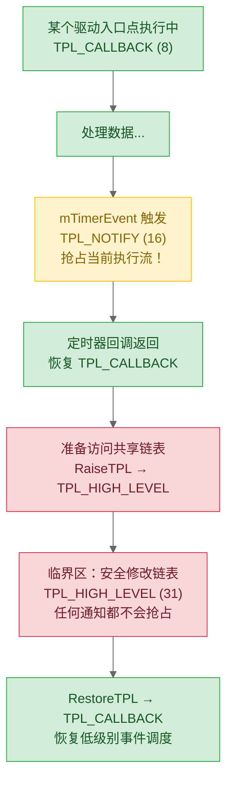
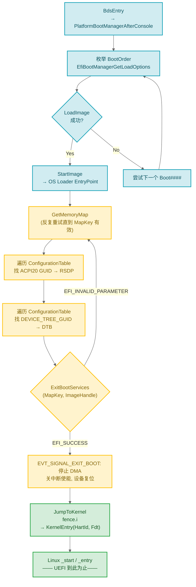

# 06 — 事件、TPL、DEPEX：时序调度 + OS 启动实战

> 前面写驱动时假设 Dispatcher 会按正确顺序加载。现实是 Dispatcher 不保证顺序。事件、TPL、DEPEX 解决"谁先谁后"和"安全共享数据"。最后三分之一篇幅是 **BDS→OS 启动的完整代码实战**——你写的所有驱动的终点，从 BootOrder 查找到 LoadImage/StartImage 到 ExitBootServices 到内核入口跳转，每步有可编译代码。

## 1. 事件：UEFI 的通知机制

### 1.1 事件类型与创建

```c
EFI_EVENT  mTimerEvent;

EFI_STATUS Status = gBS->CreateEvent (
  EVT_TIMER,                    // 事件类型
  TPL_CALLBACK,                 // 回调触发时的 TPL
  TimerCallback,                // VOID EFIAPI (*)(IN EFI_EVENT Event, IN VOID *Context)
  NULL,                         // Context（传给回调的额外参数）
  &mTimerEvent
  );
if (!EFI_ERROR (Status)) {
  gBS->SetTimer (mTimerEvent, TimerPeriodic, 10000000);  // 100ns 单位，1s 周期
}
```

| 事件类型 | 触发时机 | 典型用途 |
|----------|----------|---------|
| `EVT_TIMER` | 定时器到期 | 周期轮询、看门狗 |
| `EVT_NOTIFY_SIGNAL` | 手动 `SignalEvent()` 或 Protocol 通知 | 跨驱动唤醒 |
| `EVT_NOTIFY_WAIT` | `WaitForEvent()` 返回 | 等待多事件任一就绪 |
| `EVT_SIGNAL_EXIT_BOOT_SERVICES` | OS Loader 调用 `ExitBootServices()` | 停止 DMA、清理 Boot Services 资源 |
| `EVT_SIGNAL_VIRTUAL_ADDRESS_CHANGE` | Runtime 驱动地址转换 | 虚拟地址模式更新指针 |

---

## 2. Protocol 通知回调：处理调度顺序不确定

回到 [05](05-first-driver.md) 里 ProducerDxe（安装 `MY_PROTOCOL`）和 ConsumerDxe（需要 `MY_PROTOCOL`）的例子。Dispatcher 可能先调度 ConsumerDxe——入口点直接 `LocateProtocol` 返回 `EFI_NOT_FOUND`，驱动初始化失败，永不重试。

Protocol 通知回调解决这个问题——**不等 Dispatcher 顺序，而是主动告诉你"你要的 Protocol 到了"**。

**错误写法（直接查找 → 时序依赖失败）**：

```c
EFI_STATUS EFIAPI ConsumerEntryPoint (...) {
  MY_PROTOCOL *MyProto;
  return gBS->LocateProtocol (&gMyProtocolGuid, NULL, (VOID**)&MyProto);
  // ProducerDxe 还没加载 → EFI_NOT_FOUND → 永远失败
}
```

**正确写法（通知回调 → 时序无关）**：

```c
STATIC VOID      *mNotificationReg;      // RegisterProtocolNotify 返回的注册句柄
STATIC EFI_EVENT  mNotificationEvent;    // 可手动 SignalEvent 的事件对象

// 当 ProducerDxe 安装 MY_PROTOCOL 时，DXE Core 触发此回调
STATIC VOID EFIAPI OnMyProtocolInstalled (
  IN EFI_EVENT Event, IN VOID *Context)
{
  EFI_STATUS   Status;
  MY_PROTOCOL  *MyProto;
  UINT32        ConfigValue;

  // mNotificationReg 告诉 LocateProtocol "只返回本次触发的实例"
  Status = gBS->LocateProtocol (&gMyProtocolGuid, mNotificationReg,
                                 (VOID**)&MyProto);
  if (EFI_ERROR (Status)) return;

  MyProto->GetData (MyProto, 0, &ConfigValue);
  DEBUG ((DEBUG_INFO, "Consumer: got config = 0x%x, initializing...\n",
          ConfigValue));
  InitializeConsumerInternals (ConfigValue);
}

EFI_STATUS EFIAPI ConsumerEntryPoint (
  IN EFI_HANDLE ImageHandle, IN EFI_SYSTEM_TABLE *SystemTable)
{
  // 入口点只注册通知，立刻返回——初始化延迟到回调中按需完成
  EfiCreateProtocolNotifyEvent (
    &gMyProtocolGuid, TPL_CALLBACK,
    OnMyProtocolInstalled, NULL,
    &mNotificationReg, &mNotificationEvent);
  return EFI_SUCCESS;
}
```

> `EfiCreateProtocolNotifyEvent` 是 `UefiLib` 便捷函数，内部封装 `CreateEvent(EVT_NOTIFY_SIGNAL, ...)` + `RegisterProtocolNotify(...)`。INF 需声明 `UefiLib`。

**执行时序（关键：回调触发的时间点）**：

```
Dispatcher 调度 ConsumerDxe → 入口点注册通知 → 返回 EFI_SUCCESS
Dispatcher 调度 ProducerDxe → 入口点 InstallProtocolInterface(MY_PROTOCOL)
                                  ↓
            DXE Core 扫描通知注册表 → 找到 OnMyProtocolInstalled → 调用它
                                  ↓
                  回调中 LocateProtocol → 拿到 MyProto → 完成初始化
```

⚠️ **通知回调触发 TPL 是 `TPL_CALLBACK`**（`EfiCreateProtocolNotifyEvent` 第二个参数指定的），这意味着回调内禁止调用可能阻塞的操作（如同步 I/O）。

---

## 3. TPL：单线程协作调度中的"中断优先级"

### 3.1 心智模型

UEFI 是**单线程协作调度的**——没有抢占式内核线程。但事件回调在不同 TPL 级别运行，高 TPL 可以抢占低 TPL：



| TPL | 名称 | 谁会在此 TPL 运行 |
|------|------|------------------|
| `TPL_APPLICATION` (4) | 用户代码 | OS Loader 调用、Shell 命令 |
| `TPL_CALLBACK` (8) | 驱动回调 | 大多数 Protocol 通知、`DriverBinding::Supported/Start/Stop` |
| `TPL_NOTIFY` (16) | 通知信号 | 定时器回调、快速通知 |
| `TPL_HIGH_LEVEL` (31) | 临界区 | 除 NMI/MCE 外一切中断被屏蔽 |

### 3.2 RaiseTPL 实战：保护共享数据

典型场景：`TPL_CALLBACK` 下维护链表，同时定时器回调（`TPL_NOTIFY`）也在同一链表上增删节点。不保护 → 定时器在 `InsertTailList` 进行到一半时抢占 → 链表指针半更新 → 下一次遍历随机崩溃。

```c
EFI_TPL OldTpl;

OldTpl = gBS->RaiseTPL (TPL_HIGH_LEVEL);
// 临界区：所有 TPL ≤ 30 的事件都不会抢占
InsertTailList (&mSharedListHead, &NewNode->Link);
gBS->RestoreTPL (OldTpl);   // 恢复原 TPL，排队的高 TPL 事件此时被调度
```

**致命规则**：`RaiseTPL` / `RestoreTPL` 必须配对且在**同一函数**内完成。忘记 `RestoreTPL` → 永久阻塞所有低 TPL 事件 → 等效死锁。

---

## 4. DEPEX：依赖表达式（编译期决定加载顺序）

```
// INF 中
[Depex]
  gEfiPciRootBridgeIoProtocolGuid AND gEfiCpuArchProtocolGuid

// AutoGen 编译为字节码：PUSH GUID1 PUSH GUID2 AND END
// 嵌入 .efi 的 DEPEX Section
```

DXE Dispatcher 加载驱动前解析 DEPEX 字节码，栈式求值：
- `PUSH GUID` — 查询 Handle 数据库中此 GUID 的 Protocol 是否已安装，压栈（已安装=TRUE）
- `AND` / `OR` — 栈顶两值逻辑运算
- `TRUE` — 栈顶为 TRUE 且字节码指针到 END → 加载驱动；栈顶 FALSE → 跳过，等下一轮

| 选择 | 条件 |
|------|------|
| **DEPEX** | 依赖是系统启动必需的，且只检查"已安装/未安装" |
| **通知回调** | 依赖可能多次安装/替换，或需对新安装做动态初始化 |

---

## 5. BDS→OS 启动实战：从 BootOrder 到内核入口

> 这是本篇的核心。前面的事件/TPL/DEPEX 都是基础设施——下面是它们在实际启动流程中的用武之地。每一步代码都来自真实 EDK2 源码（OvmfPkg/PlatformBootManagerLib + Linux EFI stub），注释标注了等价位置。

### 5.1 场景设定

QEMU RISC-V virt 平台，一块 virtio-blk 磁盘，ESP 分区里安装了 GRUB（`\EFI\opensuse\grubriscv64.efi`）。目标：固件找出这个 OS Loader，加载它，让它引导 Linux。

### 5.2 BootManager：读取 BootOrder 并加载 OS Loader

BDS 阶段入口 `BdsEntry()` 调用 `PlatformBootManagerAfterConsole()`，这个函数负责枚举 Boot#### 变量并逐个尝试：

```c
// 对应 OvmfPkg/.../PlatformBootManagerLib/PlatformBm.c — PlatformBootManagerAfterConsole()
VOID EfiBootManagerBoot (VOID)
{
  EFI_BOOT_MANAGER_LOAD_OPTION  *BootOptions;
  UINTN                          BootOptionCount;
  UINTN                          Index;

  // 1. 从 NVRAM 读出所有 Boot#### 变量，构造 LOAD_OPTION 数组
  BootOptions = EfiBootManagerGetLoadOptions (
                  &BootOptionCount, LoadOptionTypeBoot);

  // 2. 遍历 BootOrder 列表（如 BootOrder = 0x0004, 0x0000, 0x0001）
  for (Index = 0; Index < BootOptionCount; Index++) {
    EFI_STATUS  Status;
    EFI_HANDLE  ImageHandle;

    // 2a. 根据 FilePathList 中的 DevicePath 加载 OS Loader 映像
    Status = gBS->LoadImage (
                    FALSE,                    // BootPolicy = FALSE: 不走平台策略
                    gImageHandle,             // ParentImage: BDS 自身
                    BootOptions[Index].FilePath, // DevicePath（含启动文件和路径）
                    NULL, 0,                  // SourceBuffer = NULL: 从文件系统加载
                    &ImageHandle              // → 加载后的 ImageHandle
                    );
    if (EFI_ERROR (Status)) continue;

    // 2b. 设置 LoadedImage Protocol 中的 LoadOptions
    //     Linux EFI stub 用这个字段接收内核命令行参数
    EFI_LOADED_IMAGE_PROTOCOL *LoadedImage;
    gBS->HandleProtocol (ImageHandle, &gEfiLoadedImageProtocolGuid,
                         (VOID**)&LoadedImage);
    LoadedImage->LoadOptions     = BootOptions[Index].OptionalData;
    LoadedImage->LoadOptionsSize = BootOptions[Index].OptionalDataSize;

    // 2c. 启动 OS Loader 映像——StartImage 内部执行映像的入口函数
    //     StartImage 返回 (EFI_SUCCESS 或错误码)
    Status = gBS->StartImage (ImageHandle, NULL, NULL);
    if (EFI_ERROR (Status)) {
      // OS Loader 返回错误 (如找不到内核、内存不足) → 尝试下一个 Boot####
      DEBUG ((DEBUG_ERROR, "Boot#### failed: %r\n", Status));
      continue;
    }
    // StartImage 返回 EFI_SUCCESS 说明 OS 已启动，不应走到这里
  }

  // 3. 所有 Boot#### 失败 → 启动 UEFI Shell 或 Boot Manager Menu
  EfiBootManagerBoot (&BootManagerMenu);
}
```

关键点：`LoadImage` 加载 PE/COFF 映像到内存，解析 Section Headers（`.text` / `.data` / `.reloc`），做重定位，创建新的 `ImageHandle`。`StartImage` 在该 Handle 上查找 `EFI_LOADED_IMAGE_PROTOCOL`，从 `LoadedImage->EntryPoint` 读出入口地址，**直接函数调用**——不是新线程或新进程，就是在当前执行流上 `call EntryPoint(ImageHandle, SystemTable)`。

### 5.3 LoadImage 内部做了什么

理解 `LoadImage` 的实现细节有助于排查 OS Loader 加载失败的原因：

```
gBS->LoadImage (BootPolicy, ParentHandle, DevicePath, SrcBuf, SrcSize, &ImageHandle)
  ├── 1. 根据 DevicePath 找到 EFI_SIMPLE_FILE_SYSTEM_PROTOCOL
  ├── 2. 打开文件 (.efi = PE/COFF 格式)
  ├── 3. PE/COFF Loader:
  │     a. 解析 DOS Header → PE Signature → Optional Header
  │     b. 读取 SizeOfImage → AllocatePages (ImageBase, NumPages)
  │     c. 逐个 Copy Section: .text .data .rdata .reloc → ImageBase 对应偏移
  │     d. 解析 Relocation Table → 按 (Type, Offset) 为每个重定位条目打补丁
  ├── 4. 创建 ImageHandle → Handle DB 新条目
  ├── 5. 在 ImageHandle 上安装 EFI_LOADED_IMAGE_PROTOCOL:
  │     { .ImageBase = PE 加载地址,
  │       .ImageSize = SizeOfImage,
  │       .EntryPoint = OptionalHeader->AddressOfEntryPoint + ImageBase,
  │       .DeviceHandle = 文件所在磁盘 Handle ... }
  ├── 6. 遍历 DEPEX Section → 栈式求值 → 满足则返回 EFI_SUCCESS
  └── 7. 不满足 DEPEX → 驱动加入待调度队列，不对应用映像生效
```

对 OS Loader（`UEFI_APPLICATION`）来说，步骤 6 的 DEPEX 通常是 `TRUE`，所以加载立刻完成。

### 5.4 OS Loader (Linux EFI Stub) 的工作：收集中继数据

OS Loader 被 `StartImage` 调用后，代码运行在 UEFI 环境中。它的任务不是"启动内核"，而是**把 UEFI 环境提供的资源打包成内核能理解的格式，再切断 UEFI**。以下是 Linux EFI stub 的核心流程（对应 `linux/Documentation/efi-stub.rst` 描述的代码路径）：

```c
// 简化自 linux-stable/drivers/firmware/efi/libstub/efi-stub-helper.c
EFI_STATUS EFIAPI LinuxStubEntryPoint (
  IN EFI_HANDLE ImageHandle, IN EFI_SYSTEM_TABLE *SystemTable)
{
  EFI_STATUS         Status;
  EFI_LOADED_IMAGE  *LoadedImage;
  VOID              *KernelImage;
  UINTN              KernelSize;
  // ---- Step 0: 从 LoadOptions 拿到 initrd 路径和内核命令行 ----
  gBS->HandleProtocol (ImageHandle, &gEfiLoadedImageProtocolGuid,
                       (VOID**)&LoadedImage);
  CHAR8 *CmdLine = (CHAR8*)LoadedImage->LoadOptions;
  // ParseCmdLine: kernel=<addr>, initrd=<path>, root=/dev/xxx, ...

  // ---- Step 1: 通过 Boot Services 收集 UEFI 内存映射 ----
  //    这是 ExitBootServices 前最后一次 GetMemoryMap
  EFI_MEMORY_DESCRIPTOR  *MemoryMap = NULL;
  UINTN                   MapKey, MapSize = 0, DescSize;
  UINT32                  DescVersion;

  do {
    // 第一次调获取所需 buffer 大小
    Status = gBS->GetMemoryMap (&MapSize, MemoryMap, &MapKey,
                                &DescSize, &DescVersion);
    if (Status == EFI_BUFFER_TOO_SMALL) {
      // 内存映射可能在调 GetMemoryMap 和 AllocatePool 之间变化
      // → 多分配一点作为缓冲区
      MapSize += EFI_PAGE_SIZE;
      if (MemoryMap) gBS->FreePool (MemoryMap);
      MemoryMap = AllocatePool (MapSize);
    }
  } while (Status == EFI_BUFFER_TOO_SMALL);

  // ---- Step 2: 定位 ACPI 根表（RDSP: Root System Description Pointer） ----
  //    方式 A: 从 Configuration Table 按 GUID 查找
  VOID *AcpiRoot = NULL;
  for (UINTN i = 0; i < gST->NumberOfTableEntries; i++) {
    EFI_GUID Acpi20Guid = ACPI_20_TABLE_GUID;
    // ACPI_20_TABLE_GUID = { 0x8868e871, 0xfc4b, 0x11d3,
    //   { 0x90, 0xfe, 0x50, 0x04, 0x2a, 0xc0, 0xfe, 0x00 } }
    if (CompareGuid (&gST->ConfigurationTable[i].VendorGuid,
                     &Acpi20Guid)) {
      AcpiRoot = gST->ConfigurationTable[i].VendorTable;
      break;
    }
  }

  //    方式 B (RISC-V): 从 UEFI System Table 的 ACPI 2.0 表取得 RDSP
  if (AcpiRoot == NULL) {
    for (UINTN i = 0; i < gST->NumberOfTableEntries; i++) {
      EFI_GUID Acpi10Guid = ACPI_TABLE_GUID;
      // ACPI_TABLE_GUID = { 0xeb9d2d30, 0x3d9a, 0x11d3, ... }
      if (CompareGuid (&gST->ConfigurationTable[i].VendorGuid,
                       &Acpi10Guid)) {
        AcpiRoot = gST->ConfigurationTable[i].VendorTable;
      }
    }
  }

  // ---- Step 3: 定位 SMBIOS (可选) ----
  VOID *Smbios = NULL;
  EFI_GUID Smbios3Guid = SMBIOS3_TABLE_GUID;
  for (UINTN i = 0; i < gST->NumberOfTableEntries; i++) {
    if (CompareGuid (&gST->ConfigurationTable[i].VendorGuid,
                     &Smbios3Guid)) {
      Smbios = gST->ConfigurationTable[i].VendorTable;
    }
  }

  // ---- Step 4: 定位设备树 (DTB, RISC-V 特殊路径) ----
  VOID *Fdt = NULL;
  EFI_GUID FdtGuid = DEVICE_TREE_GUID;
  // DEVICE_TREE_GUID = { 0xb7b46839, 0x7a90, 0x4c4f,
  //   { 0x84, 0xaa, 0x0d, 0xc4, 0x6b, 0xb7, 0x11, 0xd0 } }
  for (UINTN i = 0; i < gST->NumberOfTableEntries; i++) {
    if (CompareGuid (&gST->ConfigurationTable[i].VendorGuid,
                     &FdtGuid)) {
      Fdt = gST->ConfigurationTable[i].VendorTable;
    }
  }

  // ---- Step 5: 分配内核页表 (EFI stub 的页表结构) ----
  //    在 ExitBootServices 前：Linux stub 用自己的页表
  //    包括：identity mapping of all of DRAM + kernel text mapping

  // ---- Step 6: 调用 ExitBootServices (不可逆) ----
  //    MapKey 必须匹配——这是为什么上面 GetMemoryMap 要放进 do-while 循环
  Status = gBS->ExitBootServices (ImageHandle, MapKey);
  if (EFI_ERROR (Status)) {
    // MapKey 在 GetMemoryMap 之后变了 (又有人调了 AllocatePages/InstallProtocol)
    // → 必须重新 GetMemoryMap → 重新 ExitBootServices
    goto RetryGetMemoryMap;
  }

  // ==== 从这一行起：gBS = 非法，任何 Boot Services 调用都是未定义行为 ====
  //       Runtime Services (gRT->GetTime, gRT->SetVariable ...) 仍可用
  //       gST->FirmwareRevision, gST->NumberOfTableEntries 仍然可读

  // ---- Step 7: 准备内核启动参数 ----
  //    a0 = HartId (RISC-V) → boot_hart_id
  //    a1 = FDT pointer (RISC-V) → fdt_addr
  //    或: a0 = boot_params (x86) → setup_header
  KernelEntryPoint (BootHartId, Fdt);
  // 永远不会返回这里
  return EFI_SUCCESS;
}
```

### 5.5 ExitBootServices 的正确姿势

上面 Step 6 的 retry 循环是最容易被忽略的细节。完整的正确写法：

```c
Status = EFI_SUCCESS;
UINTN  RetryCount = 0;

do {
  // 每一次重试都必须重新 GetMemoryMap——MapKey 可能已过期
  MemoryMapSize = 0;
  Status = gBS->GetMemoryMap (&MemoryMapSize, MemoryMap, &MapKey,
                               &DescSize, &DescVersion);
  if (Status == EFI_BUFFER_TOO_SMALL) {
    if (MemoryMap) { gBS->FreePool (MemoryMap); }
    MemoryMap = AllocatePool (MemoryMapSize);
    continue;   // ← 重新循环：AllocatePool 改了 MapKey！
  }
  if (EFI_ERROR (Status)) {
    DEBUG ((DEBUG_ERROR, "GetMemoryMap failed: %r\n", Status));
    goto Fail;
  }

  // 必须使用刚获取的 MapKey——旧的 MapKey 在 AllocatePool 之后就过期了
  Status = gBS->ExitBootServices (ImageHandle, MapKey);

  // ExitBootServices 成功后不应该执行到这里
  if (Status == EFI_INVALID_PARAMETER) {
    // MapKey 过期了 → 有人调了 Boot Service (AllocatePool 之类)
    // 这是预期内的情况，重试即可
    RetryCount++;
  }
} while (Status == EFI_INVALID_PARAMETER && RetryCount < 5);
```

**MapKey 过期的常见原因**：`GetMemoryMap` 返回后，这段代码本身调用 `AllocatePool(MemoryMap)` 就会修改内存映射 → MapKey 立即失效。因此 `AllocatePool`（在 if 分支里）放在 `ExitBootServices` 调用**之前**，并在之后的循环中复用已分配的 buffer。

### 5.6 驱动在 ExitBootServices 事件中的清理

DXE Core 调用完所有注册了 `EVT_SIGNAL_EXIT_BOOT_SERVICES` 的回调后才真正禁用 Boot Services。因此这类事件是最后的安全点——驱动要在此停止一切固件管理的硬件活动：

```c
STATIC EFI_EVENT mEbsEvent;

EFI_STATUS EFIAPI MyDriverEntryPoint (EFI_HANDLE ImageHandle, ...) {
  // 注册 ExitBootServices 通知——固件生命周期的最后一个钩子
  EfiCreateEventLegacyBootEx (
    TPL_NOTIFY,                       // TPL_NOTIFY: 优先级高于大多数回调
    OnExitBootServices,               // 回调函数
    MyDeviceContext,                  // Context (驱动私有上下文)
    &mEbsEvent
    );
  // 注：EfiCreateEventLegacyBootEx 内部:
  // CreateEventEx(EVT_NOTIFY_SIGNAL, TPL_NOTIFY, cb, ctx,
  //               &gEfiEventExitBootServicesGuid, &Event);
}

STATIC VOID EFIAPI OnExitBootServices (
  IN EFI_EVENT Event, IN VOID *Context)
{
  MY_DEVICE_CONTEXT *Dev = (MY_DEVICE_CONTEXT*)Context;

  // ──① 停止所有 DMA 传输 ──
  //    原因: OS 接管后，设备的 DMA 引擎如果还在往 UEFI 分配的内存写数据，
  //          而 OS 认为那块内存是空闲的/分配给别的东西了 → 随机崩溃
  Dev->PciIo->Flush (Dev->PciIo);

  // ──② 清中断使能 ──
  //    原因: 硬件中断指向的中断向量表将在 OS 初始化后由 OS IDT 接管
  //          不关中断 → 中断信号到达 → 新的 IDT 中的 ISR 不知道这是谁 → 崩溃
  MmioWrite32 (Dev->MmioBase + REG_IMR, 0);   // 中断掩码寄存器清零

  // ──③ 设备复位到已知状态 ──
  //    原因: OS 驱动期望设备在 POR (Power-On Reset) 或可预测的状态
  WriteReg8 (Dev, REG_CR, RESET_CMD);  // 设备复位命令

  // ──④ 释放固件管理的资源 ──
  //    注意: 不需要 FreePool——Boot Services 数据结构由 DXE Core 统一回收
  //    要释放的是设备本身使用的资源 (DMA buffer 已在上面的 Flush 之后不可用)
  //    对于 MemoryMappedIo, 不需要显式解除映射, OS 会重建页表

  // ──⑤ 记录交接状态 (排查 Bug): DebugLib 可能已经不可靠 ──
  Dev->HandoffComplete = TRUE;
  // 以后 Runtime Services (如 gRT->GetVariable) 中检查这个标志避免重复操作
}
```

### 5.7 内核入口跳转：控制权从固件到 OS

`ExitBootServices` 成功后，OS Loader 执行最后一步——**直接跳转到内核入口地址**。这一步不是 UEFI API 调用，是裸函数指针跳转：

```c
// 汇编包装 (RISC-V: Linux/arch/riscv/kernel/head.S entry)
// 但在 EFI stub 中, 进入内核是直接的 C 函数跳转:
typedef VOID (*KERNEL_ENTRY_POINT)(
  IN UINTN  HartId,      // a0: boot hart ID (从 BootHartId 变量)
  IN VOID   *FdtPointer  // a1: FDT or ACPI root (从上面收集到)
  );

STATIC VOID JumpToKernel (
  IN UINTN  KernelEntryPhys,
  IN UINTN  HartId,
  IN VOID   *FdtPointer)
{
  KERNEL_ENTRY_POINT  KernelEntry;

  KernelEntry = (KERNEL_ENTRY_POINT)(UINTN)KernelEntryPhys;

  // ⚠️ 以下操作必须确保 CPU 处于确定状态：
  // - 中断已关闭 (SATP中的中断控制 / SIE CSR = 0)
  // - MMU 已启用（UEFI 在 S-mode, Sv39/Sv48 活动）
  // - FENCE.I 已完成 (内核代码刚拷入, I-Cache 可能过期)
  // - boot_hart_id 和 fdt 已放到 a0/a1 (由编译器按调用约定自动完成)
  asm volatile ("fence.i" ::: "memory");
  KernelEntry (HartId, FdtPointer);

  // 内核的 _start / _entry 不应该返回——返回意味着内核初始化失败了
  // 这种情况 EFI stub 进入死循环，因为没有 Boot Services 了，无路可退
  CpuDeadLoop ();
}
```

> **注：在 RISC-V 上**，`exit()` 内 S-mode UEFI 做的最后一件事是 `sbi_shutdown()` (通过 `ecall` 调 M-mode OpenSBI)。但 `JumpToKernel` 是 x86 和 RISC-V 通用的设计——固件的最后一段代码就是跳转到内核。

### 5.8 交接流程图（对应上面 5.2-5.7 的代码）



---

## 6. 要点回顾

| 要点 | 说明 |
|------|------|
| 事件驱动回调：不依赖 Dispatcher 调度顺序 | `EfiCreateProtocolNotifyEvent` 声明"某 Protocol 出现时叫我" |
| TPL 本质是"软件中断优先级" | `RaiseTPL` / `RestoreTPL` 配对保护共享数据于函数粒度 |
| DEPEX 是"加载与否的静态条件" | AutoGen 编译 INF `[Depex]` 为字节码，Dispatcher 栈式求值 |
| LoadImage：PE/COFF → 内存 + 重定位 → ImageHandle | BootManager 根据 Boot#### FilePathList 调用 |
| ExitBootServices 之前：GetMemoryMap 收集最后的内存布局 | MapKey 保证"传过去的内存映射就是 OS 接管时的" |
| ExitBootServices 之后：驱动 DMA 断关闭，设备复位 | 驱动在此事件中不留未完成事务给 OS |
| 内核跳转：裸函数指针 + fence.i | 跳转后 UEFI 再也不存在——CPU 执行的第一条内核指令 |

---

**上一篇**：[05-写第一个 DXE 驱动](./05-first-driver.md)  
**下一篇**：[07-PEI 阶段：内存稀缺时代的策略](./07-pei-phase.md)
