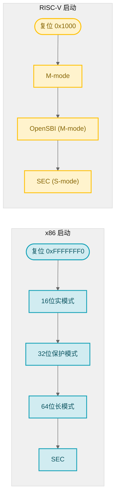
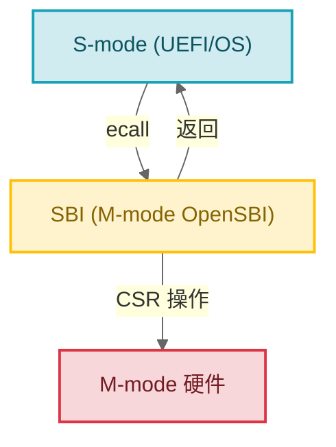
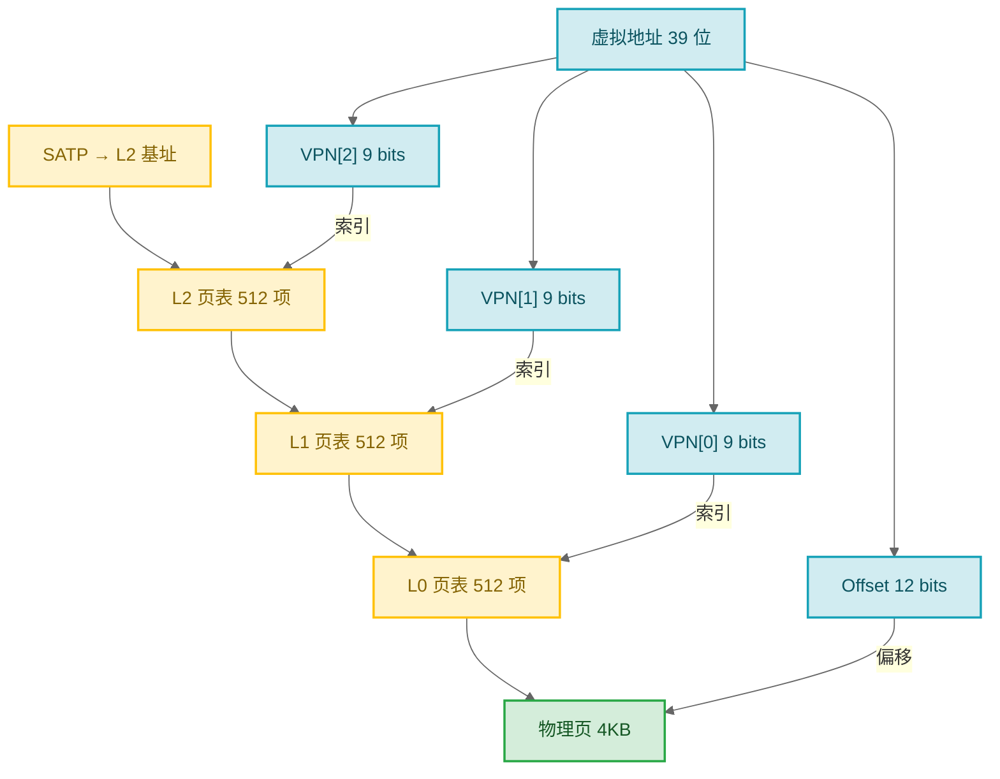
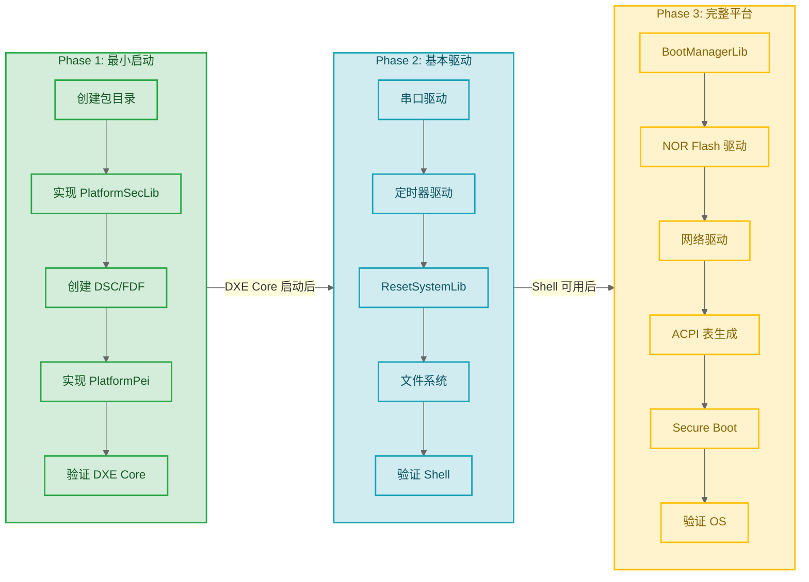

# EDK2 RISC-V 与平台移植

> RISC-V 服务器需要 UEFI，就像汽车需要方向盘——不是唯一的选择，但是工业标准的选择。这一篇是你在 RISC-V SoC 上移植 UEFI 的实战指南。

### 关键术语

| 缩写 | 全称 | 含义 |
|------|------|------|
| SBI | Supervisor Binary Interface | RISC-V S-mode 调用 M-mode 服务的标准接口 |
| OpenSBI | Open Supervisor Binary Interface | 开源 SBI 参考实现 |
| FDT | Flattened Device Tree | 扁平化设备树，描述硬件拓扑的二进制格式 |
| SATP | Supervisor Address Translation and Protection | RISC-V 页表基址寄存器 |
| ACPI | Advanced Configuration and Power Interface | 高级配置与电源接口 |
| RHCT | RISC-V Hart Capabilities Table | RISC-V Hart 能力表（ACPI） |
| CSR | Control and Status Register | RISC-V 控制和状态寄存器 |
| Hart | Hardware Thread | RISC-V 硬件线程（一个核心可以有多个 Hart） |
| PLIC | Platform-Level Interrupt Controller | 平台级中断控制器 |

---

## 1. 前置知识

| 需要了解 | 参考文档 |
|----------|----------|
| EDK2 启动流程（SEC/PEI/DXE/BDS） | [03-启动流程详解](./03-boot-flow.md) |
| Protocol 开发与 DXE 驱动编写 | [05-模块开发实战](./05-module-dev.md) |
| DSC/INF/DEC/FDF 元数据格式 | [04-构建系统深入](./04-build-system.md) |

---

## 2. RISC-V 在 EDK2 中的代码分布

EDK2 中**没有独立的 RiscVPkg**。RISC-V 支持分散在多个包中，通过 `[RISCV64]` 架构条件段区分：

```
MdePkg (基础层)
├── Include/RiscV64/ProcessorBind.h        ← 类型绑定
├── Include/Register/RiscV64/              ← CSR 寄存器定义
├── Include/Library/BaseRiscVSbiLib.h      ← SBI 库接口
├── Library/BaseRiscVSbiLib/               ← SBI ecall 封装
├── Library/BaseSerialPortLibRiscVSbiLib/  ← SBI 串口（SEC/PEI 最早可用）

UefiCpuPkg (CPU 层)
├── CpuDxeRiscV64/                         ← CPU DXE 驱动
├── CpuTimerDxeRiscV64/                    ← 定时器驱动
├── Library/BaseRiscVMmuLib/               ← MMU 页表操作
├── Library/BaseRiscV64CpuTimerLib/        ← 定时器库
└── Library/CpuExceptionHandlerLib/RiscV/  ← 异常处理

OvmfPkg/RiscVVirt (QEMU 平台层)
├── RiscVVirtQemu.dsc / .fdf               ← 平台定义
├── Library/PlatformSecLib/                ← SEC 初始化
├── Library/PlatformBootManagerLib/        ← BDS 启动管理
└── Library/ResetSystemLib/                ← 系统重启

DynamicTablesPkg (ACPI 层)
├── Library/Acpi/RiscV/AcpiRhctLibRiscV/   ← RHCT 表
└── Library/Acpi/RiscV/AcpiMadtLibRiscV/   ← MADT 表
```

EDK2 的包组织原则是"按功能而非按架构"——基础类型定义在 MdePkg、CPU 驱动在 UefiCpuPkg、平台代码在各自的平台包。这种组织避免了架构专属包膨胀，也让跨架构的代码复用更自然。

### 2.1 RISC-V 启动流程



RISC-V 和 x86 在架构层面的详细对比（SMM vs SBI、I/O 机制、设备描述、调试方式等）见 [03-启动流程详解](./03-boot-flow.md) §6.2。这里聚焦 RISC-V 特有的关键技术。

---

## 3. SBI — RISC-V 的"内置操作系统"

### 3.1 什么是 SBI

把 SBI 想象成传统 PC 时代的 BIOS 中断服务（`INT 10h` 视频输出、`INT 13h` 磁盘读写），但有三个本质区别：

| | 传统 BIOS 中断 | SBI |
|---|---------------|-----|
| 调用方式 | `INT` 软件中断指令 | `ecall` 指令 + 参数在 `a0-a7` 寄存器 |
| 运行特权 | 16 位实模式 | M-mode（机器模式，最高特权级） |
| 规范程度 | IBM PC 特定，无正式版本演进 | 由 RISC-V 基金会正式定义，有 v0.1 → v2.0 清晰版本 |
| 可移植性 | 不可移植（汇编 + Intel 专属） | 跨所有 RISC-V SoC（M-mode 硬件细节不可见） |

SBI 让 S-mode 的 UEFI 或 Linux 内核在不了解 M-mode 硬件细节的情况下，请求定时器、重启系统、输出调试信息等服务。这是 RISC-V 的"硬件抽象层"。



### 3.2 SBI 在 EDK2 中的使用

EDK2 通过 `BaseRiscVSbiLib`（`MdePkg/Library/BaseRiscVSbiLib/`）封装 `ecall` 指令。

**SbiCall**（核心封装）：

```c
SBI_RET EFIAPI SbiCall (
  IN  UINTN ExtId,     // SBI 扩展 ID
  IN  UINTN FuncId,    // 函数 ID
  IN  UINTN NumArgs,   // 参数数量 (0-6)
  ...
  );

typedef struct { UINTN Error; UINTN Value; } SBI_RET;
```

**常用功能**：

```c
VOID SbiSetTimer (UINT64 Time);                                  // 设置定时器
EFI_STATUS SbiSystemReset (UINTN ResetType, UINTN ResetReason);  // 系统重启
```

**SBI 扩展 ID**：

| 扩展 | ID | 作用 |
|------|-----|------|
| SBI_EXT_BASE | 0x10 | 版本探测、获取已注册扩展列表 |
| SBI_EXT_TIME | 0x54494D45 ("TIME") | 读写系统定时器 |
| SBI_EXT_SRST | 0x53525354 ("SRST") | 系统重启/关机 |
| SBI_EXT_HSM | 0x48534D ("HSM") | Hart 启动/停止/挂起管理 |
| SBI_EXT_DBCN | 0x4442434E ("DBCN") | 调试控制台 |

ASCII 编码的 ID（如 `0x54494D45`）是 SBI v1.0 开始使用的命名约定，用于区分标准扩展和厂商扩展。

### 3.3 SBI 串口：最早的调试输出

`MdePkg/Library/BaseSerialPortLibRiscVSbiLib/` 通过 SBI 调试控制台实现串口。它有两个版本：
- **BaseSerialPortLibRiscVSbiLib.inf** — SEC/PEI 用（**XIP**：eXecute In Place，代码直接在 Flash 中执行而不先拷贝到 RAM。PEI 阶段 DDR 尚未初始化，必须用 XIP 版本）
- **BaseSerialPortLibRiscVSbiLibRam.inf** — DXE 用（完整功能）

写数据策略（先尝试新技术，再回退）：
1. 优先：`SBI_EXT_DBCN` 批量写
2. 回退：SBI legacy `putchar`
3. 都不可用：返回 0

这是 SEC 阶段最早的调试输出手段——因为 SBI console 不需要 UART 驱动，真正的 UART 由 M-mode 的 OpenSBI 处理。即使在 UEFI 最早的几个指令周期里，也可以通过 `DEBUG` 宏输出日志。

---

## 4. RISC-V MMU 与页表

### 4.1 虚拟内存模式

RISC-V 支持三种模式，UEFI 通常用最轻的 Sv39 就足够：

| 模式 | 虚拟地址位数 | 物理地址位数 | 页表级数 | SATP.Mode |
|------|:---:|:---:|:---:|:---:|
| Sv39 | 39 | 56 | 3 | 8 |
| Sv48 | 48 | 56 | 4 | 9 |
| Sv57 | 57 | 56 | 5 | 10 |

**页表结构（Sv39）**：39 位虚拟地址 = 3 段 VPN（9+9+9 位） + 12 位页内偏移。SATP 寄存器指向根页表（L2），每下一级由 VPN 索引。



### 4.2 BaseRiscVMmuLib

`UefiCpuPkg/Library/BaseRiscVMmuLib/` 提供三个核心 API：

```c
EFI_STATUS RiscVSetMemoryAttributes (
  IN EFI_PHYSICAL_ADDRESS BaseAddress, IN UINT64 Length, IN UINT64 Attributes
  );   // 设置区域属性：EFI_MEMORY_XP (不可执行), EFI_MEMORY_RO (只读)

EFI_STATUS RiscVConfigureMmu (
  IN UINT32 SatpMode     // 8=Sv39, 9=Sv48, 10=Sv57
  );

VOID RiscVLocalFlushTlbAll (VOID);                       // 刷新 TLB
VOID RiscVLocalFlushTlbPage (IN UINT64 VirtualAddress);  // 刷新单页
```

**PCD 选择 MMU 模式**：

```ini
# DSC 中设置使用 Sv39, Sv48, 或 Sv57（8, 9, 10）
[PcdsFixedAtBuild]
  gUefiCpuPkgTokenSpaceGuid.PcdCpuRiscVMmuMaxSatpMode|9    # Sv48
```

---

## 5. OvmfPkg/RiscVVirt — 参考平台分析

这是移植 RISC-V UEFI 的最佳起点。分析它的结构有助于理解"一个新平台需要哪些东西"。

### 5.1 目录结构

```
OvmfPkg/RiscVVirt/
├── RiscVVirtQemu.dsc               # 平台 DSC
├── RiscVVirtQemu.fdf               # 平台 FDF
├── RiscVVirt.dsc.inc / .fdf.inc    # 公共配置（可 include）
├── VarStore.fdf.inc                # UEFI 变量存储布局
├── PlatformPei/
│   └── PlatformPeim.c              # 解析 FDT，构建 HOB
├── Library/
│   ├── PlatformSecLib/
│   │   ├── SecEntry.S              # 汇编入口（设栈指针）
│   │   ├── PlatformSecLib.c        # C 入口（找 PEI Core 并跳转）
│   │   └── Memory.c / Cpu.c / Platform.c
│   ├── PlatformBootManagerLib/     # BDS 启动策略
│   └── ResetSystemLib/             # 重启实现
└── Feature/
    ├── Capsule/                    # 固件在线更新
    └── SecureBoot/                 # 安全启动
```

### 5.2 SEC 阶段

**SecEntry.S**（汇编入口——基于实际源码简化）：

```asm
ASM_FUNC (_ModuleEntryPoint)
    li    s0, 0                     # fp = 0，防栈回溯
    li    a2, FixedPcdGet32(PcdSecPeiTempRamBase)    # 临时 RAM 基址
    li    a3, FixedPcdGet32(PcdSecPeiTempRamSize)    # 大小
    li    a4, SEC_HANDOFF_DATA_RESERVE_SIZE
    sub   a3, a3, a4
    add   sp, a2, a3                # sp = tmp_ram_base + size - handoff_reserve
    call  SecStartupPlatform        # → C 函数
```

> `FixedPcdGet32(NAME)` 在汇编中是 EDK2 的 AutoGen 宏。构建时 AutoGen 从 DSC 的 `[PcdsFixedAtBuild]` 中取出 PCD 值，替换为字面常数。例如若 DSC 中设 `PcdSecPeiTempRamBase=0x80200000`，则上述 `li a2, FixedPcdGet32(...)` 在编译前就被展开为 `li a2, 0x80200000`。

**PlatformSecLib.c**（C 入口）：

```c
VOID EFIAPI SecStartupPlatform (IN UINTN BootHartId, IN VOID *FdtPointer)
{
  SerialPortInitialize ();
  mSecHandoffData.BootHartId = BootHartId;
  mSecHandoffData.FdtPointer = FdtPointer;
  SbiSetTimer (0xFFFFFFFFFFFFFFFF);
  PeiCore = FindPeiCoreInFv ();
  PeiCore (&SecCoreData, NULL);
}
```

> UEFI 运行在 S-mode，**不能**使用 `csrr mhartid` 等 M-mode CSR 指令。RISC-V 硬件设计中，本特权级无法直接访问更高特权级的 CSR；尝试读取会触发非法指令异常。这也是为什么 SBI 必须存在——S-mode 通过 SBI ecall 间接获取 M-mode 才能拿到的信息。

### 5.3 PEI 阶段

PlatformPeim.c 的核心职责：解析 FDT，构建 HOB 传输信息给 DXE。

RISC-V 使用"早期用 FDT，晚期用 ACPI"的模式：
- **PEI 阶段**：FDT 轻量，二进制解析简单，不需要协议服务
- **DXE 阶段**：DynamicTablesPkg 根据实际硬件配置动态生成 ACPI 表供 OS 使用

### 5.4 DSC 关键配置

```ini
[LibraryClasses.RISCV64]
  BaseRiscVSbiLib|MdePkg/Library/BaseRiscVSbiLib/BaseRiscVSbiLib.inf
  RiscVMmuLib|UefiCpuPkg/Library/BaseRiscVMmuLib/BaseRiscVMmuLib.inf

[LibraryClasses.common.SEC]
  SerialPortLib|.../BaseSerialPortLibRiscVSbiLib.inf   # SBI 串口（XIP 版）

[LibraryClasses.common.DXE_DRIVER]
  SerialPortLib|.../BaseSerialPortLibRiscVSbiLibRam.inf  # SBI 串口（RAM 版）
```

### 5.5 FDF Flash 布局

```ini
DEFINE PFLASH0_BASE_ADDRESS  = 0x20000000    # CODE 区
DEFINE PFLASH1_BASE_ADDRESS  = 0x22000000    # VARS 区
DEFINE CODE_SIZE             = 0x00800000    # 8MB
DEFINE VARS_SIZE             = 0x000C0000    # 768KB
```

---

## 6. RISC-V ACPI 表

RISC-V 服务器用 ACPI 描述硬件，DynamicTablesPkg 运行时动态生成 ACPI 表，避免为每种硬件配置维护分离的静态二进制。

| ACPI 表 | 源码路径 | 内容 |
|---------|----------|------|
| RHCT | `DynamicTablesPkg/Library/Acpi/RiscV/AcpiRhctLibRiscV/` | 每 Hart 的 ISA 字符串 + CMO/MMU 能力 |
| MADT | `DynamicTablesPkg/Library/Acpi/RiscV/AcpiMadtLibRiscV/` | 中断控制器 (RINTC, IMSIC, APLIC, PLIC) |
| SRAT | `DynamicTablesPkg/Library/Acpi/Common/AcpiSratLib/RiscV/` | NUMA 拓扑 |
| FADT | `DynamicTablesPkg/Library/Acpi/Common/AcpiFadtLib/RiscV/` | 平台功耗/硬件特性 |

其中 RHCT 最值得关注——它将每个 Hart 的 ISA 字符串（如 `rv64imafdcvh_zba_zbb`）暴露给 OS。x86 通过 `CPUID` 指令运行时探测能力，ARM 通过 ID 寄存器。RISC-V 的哲学是"ISA 字符串就是能力清单"，OS 解析字符串即可知道支持哪些扩展。

---

## 7. 平台移植实战

### 7.1 移植路线图



### 7.2 平台包模板

```
MyRiscVPlatformPkg/
├── MyRiscVPlatformPkg.dec          # 包声明 (GUID + PCD)
├── MyRiscVPlatformPkg.dsc          # 平台 DSC (库绑定 + Components)
├── MyRiscVPlatformPkg.fdf          # 平台 FDF (Flash 布局)
├── Include/
│   ├── Guid/MyPlatformGuid.h
│   └── Library/MyPlatformLib.h
├── Library/
│   ├── PlatformSecLib/{.c, .inf, SecEntry.S}
│   ├── PlatformBootManagerLib/{PlatformBm.c, .inf}
│   └── ResetSystemLib/{.c, .inf}
├── PlatformPei/
│   ├── PlatformPeim.c              # 解析 FDT → HOB
│   └── PlatformPei.inf
└── Drivers/
    └── MyHardwareDxe/{.c, .inf}    # SoC 设备驱动
```

### 7.3 DEC 文件

```ini
[Defines]
  PACKAGE_NAME  = MyRiscVPlatformPkg
  PACKAGE_GUID  = XXXXXXXX-XXXX-XXXX-XXXX-XXXXXXXXXXXX

[Includes]
  Include

[LibraryClasses.RISCV64]
  MyPlatformLib|Include/Library/MyPlatformLib.h

[PcdsFixedAtBuild]
  gMyPlatformPkgTokenSpaceGuid.PcdMemoryBase|0x80000000|UINT64|0x00000001
  gMyPlatformPkgTokenSpaceGuid.PcdMemorySize|0x40000000|UINT64|0x00000002
```

### 7.4 DSC 文件

```ini
[Defines]
  PLATFORM_NAME  = MyRiscVPlatform
  SUPPORTED_ARCHITECTURES = RISCV64
  FLASH_DEFINITION = MyRiscVPlatformPkg/MyRiscVPlatformPkg.fdf

[LibraryClasses.RISCV64]
  BaseRiscVSbiLib|MdePkg/Library/BaseRiscVSbiLib/BaseRiscVSbiLib.inf
  RiscVMmuLib|UefiCpuPkg/Library/BaseRiscVMmuLib/BaseRiscVMmuLib.inf

[LibraryClasses.common.SEC]
  SerialPortLib|MdePkg/Library/BaseSerialPortLibRiscVSbiLib/Base...Lib.inf

[Components]
  MdeModulePkg/Core/Pei/PeiCore.inf
  MdeModulePkg/Core/Dxe/DxeMain.inf
  UefiCpuPkg/CpuDxeRiscV64/CpuDxeRiscV64.inf
  MyRiscVPlatformPkg/PlatformPei/PlatformPei.inf
```

---

## 8. 调试与验证

### 8.1 QEMU + GDB 调试

```bash
# QEMU 端：-s = GDB port 1234, -S = 启动时暂停
qemu-system-riscv64 -machine virt -m 8G -smp 4 \
    -bios default -pflash CODE.fd -pflash VARS.fd \
    -nographic -s -S

# GDB 端
riscv64-unknown-elf-gdb
(gdb) set architecture riscv:rv64
(gdb) target remote :1234
```

关键断点：

```gdb
break SecEntry         # SEC 入口
break PeiCore          # PEI Core 启动
break DxeMain          # DXE Core 启动
break BdsEntry         # BDS 开始枚举设备
break RiscVSetMemoryAttributes  # 每个 MMU 属性修改
```

### 8.2 常见问题排查

| 现象 | 原因 | 检查 |
|------|------|------|
| 无串口输出 | SBI console 未链接 | DSC 中 SerialPortLib 绑定是 SBI 版本？ |
| DXE Core 崩溃 | 内存 HOB 错误 | PlatformPei 构建的内存描述与实际物理地址匹配？ |
| 非法指令异常 | S-mode 访问 M-mode CSR | 检查 `mhartid`/`mstatus` 等 M-mode CSR 被意外使用 |
| BDS 卡住 | 无启动设备 | Block I/O Protocol 有没有被磁盘驱动安装？ |
| 变量服务失败 | NOR Flash 驱动缺失 | VirtNorFlashPlatformLib 实例匹配平台？ |

---

## 9. 要点回顾

| 要点 | 说明 |
|------|------|
| RISC-V 无独立包 | RISC-V 代码分散在 MdePkg/UefiCpuPkg/OvmfPkg 中，通过 `[RISCV64]` 段区分 |
| SBI = RISC-V 的"BIOS 服务" | S-mode 通过固件调用 M-mode 服务，替代 x86 的 SMM。EDK2 有 `BaseRiscVSbiLib` 封装 |
| 不同 MMU 模式可切换 | Sv39/Sv48/Sv57。UEFI 用 Sv39 已足够。`PcdCpuRiscVMmuMaxSatpMode` 选模式 |
| FDT + ACPI = 早期/晚期双描述 | PEI 用 FDT（轻量），DXE 用 DynamicTablesPkg 生成 ACPI（供 OS） |
| 移植三阶段 | SEC → DXE Core 启动 → UEFI Shell → OS |
| S-mode 不能访问 M-mode CSR | `mhartid`/`mstatus` 会触发非法指令异常。通过 SBI ecall 间接获取 |
| RHCT 暴露 ISA 字符串 | 替代 x86 CPUID。OS 直接解析 `rv64imafdcvh_zba_zbb` 了解 Hart 能力 |

---

## 10. 生态资源

| 资源 | 链接 |
|------|------|
| EDK2 RISC-V | https://github.com/tianocore/edk2 |
| OpenSBI | https://github.com/riscv-software-src/opensbi |
| RISC-V UEFI 规范 | https://github.com/riscv-non-isa/riscv-uefi |
| RISC-V ACPI 规范 | https://github.com/riscv-non-isa/riscv-acpi |
| QEMU RISC-V | https://www.qemu.org/docs/master/system/target-riscv.html |

---

**上一篇**：[05-模块开发实战](./05-module-dev.md) — 写一个真正的 DXE 驱动
