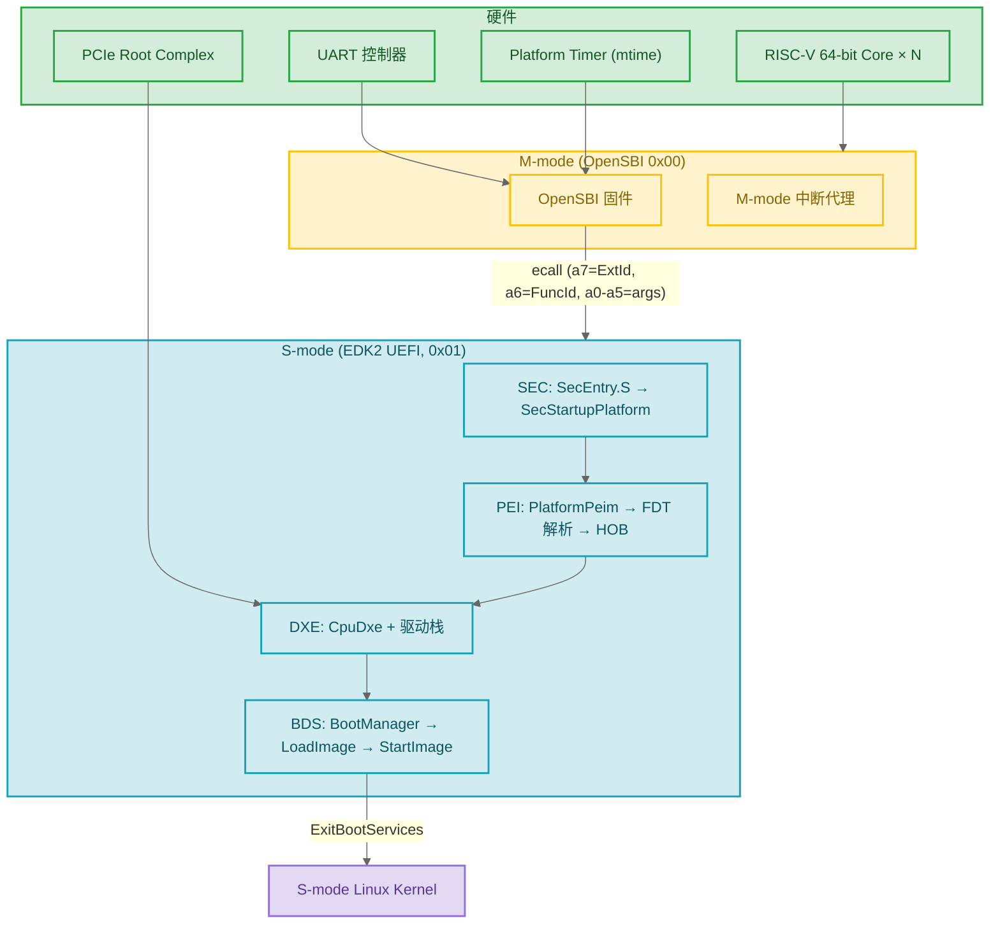

# 09 — RISC-V 平台移植实战

> 这是整个系列的综合练习。你已经懂了 Handle/Protocol、驱动开发、BDS/OS 启动——现在把这些串起来，把一个新 RISC-V SoC 移植到 UEFI。前半部分讲 SBI、MMU、OvmfPkg 参考实现；后半部分是 **ACPI 表的完整构造代码**（RHCT + MADT + FADT，从 SDT Header 到字节布局到注册到 UEFI 系统表），以及一个端到端的 SoC 移植流程。

### 关键术语
| 缩写 | 全称 | 含义 |
|------|------|------|
| SBI | Supervisor Binary Interface | S-mode UEFI 调用 M-mode OpenSBI 的 ecall 接口 |
| FDT | Flattened Device Tree | DTB (Device Tree Blob) 的内存表示，描述硬件拓扑 |
| RHCT | RISC-V Hart Capabilities Table | RISC-V 特有的 ACPI 表，描述每个 Hart 的 ISA 字符串和能力 |
| RINTC | RISC-V Interrupt Controller | MADT 中 RISC-V 的中断控制器结构类型 |
| RDSP | Root System Description Pointer | ACPI 的入口结构，指向 XSDT/RSDT |
| XSDT | eXtended System Description Table | 64 位指针版本的 ACPI 根表，指向所有 SDT |
| SDT | System Description Table | 所有 ACPI 表的通用头部格式 (Signature + Length + Checksum) |
| CAR | Cache-as-RAM | PEI 阶段用 CPU Cache 充当临时 RAM，DDR 初始化之前可用 |
| EFI_MEMORY_UC | UnCacheable memory | 用于 MMIO 区域（绕过 cache 直接读硬件寄存器） |
| EFI_MEMORY_WB | Write-Back cacheable | 用于普通 DRAM 区域 |

---

## 1. RISC-V UEFI 架构全景

RISC-V 有四个特权级（U/S/H/M）。UEFI 固件运行在 **S-mode**，通过 **SBI**（Supervisor Binary Interface）调用 M-mode 的 OpenSBI 完成硬件操作。

x86 固件能直接写 IO 端口/HW 寄存器。RISC-V 不行——UEFI 在 S-mode，访问 M-mode CSR 会触发非法指令异常。**所有跨特权级操作必须通过 SBI ecall**。



---

## 2. SBI：RISC-V 的硬件抽象层

### 2.1 SBI 调用原语

EDK2 通过 `MdePkg/Library/BaseRiscVSbiLib` 封装 ecall：

```c
// 底层封装 —— 所有 SBI 调用的唯一入口
// 对应 RISC-V SBI v1.0 规范的二进制编码接口
typedef struct {
  UINTN Error;   // a0: 0 = SBI_SUCCESS
  UINTN Value;   // a1: 函数返回值
} SBI_RET;

SBI_RET EFIAPI SbiCall (
  IN UINTN ExtId,    // a7: SBI Extension ID (如 SBI_EXT_TIME = 0x54494D45)
  IN UINTN FuncId,   // a6: 扩展内的函数 ID (0 = set_timer)
  IN UINTN NumArgs,  // 0-6
  IN UINTN Arg0, IN UINTN Arg1, IN UINTN Arg2,
  IN UINTN Arg3, IN UINTN Arg4, IN UINTN Arg5
  );
// 内部实现：将参数填入 a0-a5, a6, a7 → ecall → 读 a0, a1 → 返回 SBI_RET
```

> **示例调用**：`SbiCall(SBI_EXT_TIME, 0, 1, stime_value, 0,0,0, 0,0,0)` 等价于：`a7=0x54494D45, a6=0, a0=stime_value_low, a1=stime_value_high → ecall`。OpenSBI 在 M-mode 捕获 ecall，根据 a7 分发到 `sbi_ecall_time_handler`，解析 a6 为 `SBI_EXT_TIME_SET_TIMER`，写入 `mtimecmp` CSR。

便捷封装（你不应该直接调 SbiCall——用这些）：

```c
// 设置下一次定时器中断的时间 (微秒)
VOID SbiSetTimer (IN UINT64 Time);
// 系统复位（关机/重启）
EFI_STATUS SbiSystemReset (IN UINTN ResetType, IN UINTN ResetReason);
// 输出字符到调试控制台
INTN SbiLegacyPutchar (IN INTN Ch);
```

SBI 扩展 ID 常用值：

| 扩展 | ID | 编码含义 | 提供的服务 |
|------|-----|---------|-----------|
| SBI_EXT_BASE | 0x10 | 保留 | 获取 SBI 版本、已注册扩展列表、探测某扩展是否存在 |
| SBI_EXT_TIME | 0x54494D45 | ASCII "TIME" (小端) | `set_timer(fn=0)`: 设置 mtimecmp 寄存器 |
| SBI_EXT_SRST | 0x53525354 | ASCII "SRST" | `system_reset(fn=0)`: 关机/冷重启/热重启 |
| SBI_EXT_DBCN | 0x4442434E | ASCII "DBCN" | `debug_console_write(fn=0)`: 批量写字节到调试串口 |

ASCII 编码 ID 是 SBI v1.0 引入的命名约定——ID 值本身就是扩展名的 ASCII 表示，可读可调试。

### 2.2 串口输出的分层回退策略

EDK2 通过 `BaseSerialPortLibRiscVSbiLib` 实现最早的调试输出。XIP 版（SEC/PEI 在 Flash 中直接执行）和 RAM 版（DXE 可用）有不同实现：

```c
// 来自 MdePkg/Library/BaseSerialPortLibRiscVSbiLib/BaseSerialPortLibRiscVSbiLib.c (简化)
UINTN EFIAPI SerialPortWrite (
  IN UINT8 *Buffer, IN UINTN NumberOfBytes)
{
  // 优先级 1: DBCN 批量输出 (SBI v1.0+) —— 一次 ecall 发多个字节
  SBI_RET Ret = SbiCall (SBI_EXT_DBCN, 0, 3,
                 NumberOfBytes, (UINTN)Buffer, 0, 0,0,0);
  if (Ret.Error == SBI_SUCCESS) return NumberOfBytes;

  // 优先级 2: Legacy putchar —— 每字节一个 ecall (慢但兼容所有 OpenSBI 版本)
  SBI_RET ProbeRet = SbiCall (SBI_EXT_BASE, 3, 1, SBI_EXT_DBCN, 0,0,0, 0,0,0);
  // fn=3 = SBI_EXT_BASE_PROBE_EXT: 检查扩展是否可用
  if (ProbeRet.Value == 0) {
    // DBCN 不可用 —— 回退为 Legacy putchar
    for (UINTN i = 0; i < NumberOfBytes; i++) {
      SbiLegacyPutchar (Buffer[i]);
    }
    return NumberOfBytes;
  }

  // 优先级 3: 都不可用 → 静默失败 (生产固件不能因为调试串口卡住启动)
  return 0;
}
```

> 由于 OpenSBI 在 M-mode 管理真正的 UART 硬件，UEFI 从第一条 SBI 调用起就能输出 DEBUG 日志。

---

## 3. RISC-V MMU 与页表

### 3.1 虚拟地址模式

| 模式 | VA bits | PA bits | 页表级数 | SATP.Mode | 页大小 | 适用 |
|------|:---:|:---:|:---:|:---:|:---:|------|
| Sv39 | 39 | 56 | 3 | 8 | 4KB | 固件、嵌入式 Linux |
| Sv48 | 48 | 56 | 4 | 9 | 4KB | 服务器 Linux |
| Sv57 | 57 | 56 | 5 | 10 | 4KB | 大规模虚拟化 |

Sv39 三级页表的结构：
```
VPN[2] (9 bits) → L2 根页表  ──→ PTE → 下一级物理地址
VPN[1] (9 bits) → L1 中间页表 ──→ PTE → 下一级物理地址  
VPN[0] (9 bits) → L0 叶子页表 ──→ PTE → PPN[0] + Offset(12) = 物理地址
```

每个 Sv39 PTE（Page Table Entry, 64 位）的关键位域：
- `PPN[0..2]` (bits 10-53): 物理页号，各级 PPN 拼接
- `V` (bit 0): Valid — 页表项有效
- `R/W/X` (bits 1-3): 读/写/执行权限
- `U` (bit 4): User-mode 可访问
- `G` (bit 5): Global mapping（对所有 ASID 有效）
- `A/D` (bits 6-7): Accessed/Dirty（硬件自动置位）

### 3.2 BaseRiscVMmuLib API

来自 `UefiCpuPkg/Library/BaseRiscVMmuLib`。分两个阶段使用：

**阶段一：SEC/PEI — 启用身份映射**

```c
// SEC 阶段：启用 MMU，初始所有 PA == VA
RiscVConfigureMmu (8);  // 8 = Sv39 SATP mode
// 给临时 RAM (CAR) 区域设置 WB cacheable
RiscVSetMemoryAttributes (TempRamBase, TempRamSize, EFI_MEMORY_WB);
// 此时：所有未显式设属性的内存默认不可访问 → 安全启动链的起点
```

**阶段二：DXE — 按内存用途精细控制**

```c
// 固件代码段：只读 + 可执行
RiscVSetMemoryAttributes (FwCodeBase, FwCodeSize,
                          EFI_MEMORY_RO);
// EFI_MEMORY_RO → PTE.W=0, PTE.R=1

// 固件数据段：读写 + 禁止执行
RiscVSetMemoryAttributes (FwDataBase, FwDataSize,
                          EFI_MEMORY_WB | EFI_MEMORY_XP);
// EFI_MEMORY_XP → PTE.X=0 (防止 ret2usr/data-only 攻击利用数据区)

// MMIO 区域：不可缓存 → 每次读直接走到硬件
RiscVSetMemoryAttributes (MmioBase, MmioSize,
                          EFI_MEMORY_UC);
// EFI_MEMORY_UC → PTE 中 PMA 属性配置为 Non-cacheable

// 页表修改后必须刷新 TLB，否则 CPU 继续用旧的虚实映射
RiscVLocalFlushTlbAll ();    // SFENCE.VMA 全部刷新，代价大
// 单页刷新用：RiscVLocalFlushTlbPage (VirtAddr)
```

| API | 何时调用 | 代价 |
|-----|---------|------|
| `RiscVConfigureMmu(SatpMode)` | SEC 一次性 | 中等（写 SATP + 初始化全空页表） |
| `RiscVSetMemoryAttributes(Base, Len, Attr)` | DXE 阶段每段内存 | 低（仅修改 PTE 位） |
| `RiscVLocalFlushTlbAll()` | 批量修改页表后 | 高（SFENCE.VMA x N 条地址） |
| `RiscVLocalFlushTlbPage(VirtAddr)` | 单页修改后 | 低（SFENCE.VMA x 1） |

---

## 4. OvmfPkg/RiscVVirt — 参考平台代码

这是 QEMU RISC-V virt 平台的 EDK2 实现——移植真实 SoC 之前先读懂它。

```
OvmfPkg/RiscVVirt/
├── RiscVVirtQemu.dsc                   # 平台 DSC: 库绑定 + Components
├── RiscVVirtQemu.fdf                   # Flash 布局: FD → FV → INF 列表
├── VarStore.fdf.inc                    # UEFI 变量存储区 (NVRAM)
├── PlatformPei/
│   └── PlatformPeim.c                  # 解析 DTB (/soc/plic, /memory) → HOB
├── Library/
│   ├── PlatformSecLib/
│   │   ├── SecEntry.S                  # 第一条指令: 设 sp, call SecStartupPlatform
│   │   ├── PlatformSecLib.c            # 定位 PEI Core, PeiCore(&SecCoreData, NULL)
│   │   └── Memory.c / Cpu.c
│   ├── PlatformBootManagerLib/         # BDS: PlatformBootManagerBefore/AfterConsole
│   └── ResetSystemLib/                 # SbiSystemReset 包装
└── Feature/
    ├── Capsule/                        # 固件在线更新 (FMP)
    └── SecureBoot/                     # UEFI Secure Boot
```

### 4.1 SEC — 第一条汇编到第一个 C 函数

```asm
# SecEntry.S — CPU 执行的第一条 UEFI 指令 (OpenSBI 已初始化并向 S-mode 跳转)
ASM_FUNC (_ModuleEntryPoint)
    csrr  a6, CSR_MHARTID               # RISC-V: 固有 mhartid CSR 保存 CPU ID
    li    s0, 0                         # fp=0 → 栈回溯终止于此
    li    a2, FixedPcdGet32(PcdSecPeiTempRamBase)
    li    a3, FixedPcdGet32(PcdSecPeiTempRamSize)
    sub   a3, a3, SEC_HANDOFF_DATA_RESERVE_SIZE
    add   sp, a2, a3                    # sp = ram_base + ram_size - handoff_reserve
    call  SecStartupPlatform            # → C 函数 (a0=BootHartId, a1=FdtPointer)
```

`FixedPcdGet32` 是**构建时宏展开**——PCD 值在 `build` 时已固定，直接替代为字面常量，无需运行时查询。

```c
// PlatformSecLib.c — 第一个 C 函数，任务：定位 & 传参
VOID EFIAPI SecStartupPlatform (
  IN UINTN BootHartId, IN VOID *FdtPointer)
{
  SerialPortInitialize ();                   // SBI 串口就绪
  mSecHandoffData.BootHartId = BootHartId;   // 保存 OpenSBI 传来的 a0
  mSecHandoffData.FdtPointer  = FdtPointer;   // 保存 OpenSBI 传来的 a1

  SbiSetTimer (ULONG64_MAX);                // 停用定器中断——固件自己调度

  // 在 FV (Firmware Volume) 中定位 PEI Core 映像
  EFI_PEI_CORE_ENTRY_POINT PeiCore = FindPeiCoreInFv (&SecCoreData);
  PeiCore (&SecCoreData, NULL);             // 控制权移交——SEC 代码不再执行
}
```

---

## 5. RISC-V ACPI 表构造实战

> **这是本篇的核心。** 前面 SBI/MMU 是 RISC-V 运行的基础设施——下面模拟"我移植了一个新 SoC，需要在 UEFI 中构造正确 ACPI 表让 Linux 能识别所有 Hart 和中断控制器"。你需要关注**数据的流向**：从硬件探测到结构体到字节布局到注册，全部走通。

### 5.1 ACPI 表的结构层级

理解 ACPI 先理解"这些表怎么被找到"：

```
┌─────────────────────────────────────────────────┐
│ gST->ConfigurationTable[i]                       │   UEFI System Table
│   .VendorGuid = EFI_ACPI_20_TABLE_GUID (GUID)   │   (OS Loader §5.4 的读取来源)
│   .VendorTable = → RDSP (Root Desc Pointer)     │
└──────────────────┬──────────────────────────────┘
                   ↓
        RSDP { Signature="RSD PTR ", 
                XsdtAddress=0x... }     ← 由 EFI_ACPI_TABLE_PROTOCOL::InstallAcpiTable 定位
                   ↓
        XSDT { Signature="XSDT",
                TableOffsetEntry[0]=→RHCT_addr,
                TableOffsetEntry[1]=→MADT_addr,
                TableOffsetEntry[2]=→FADT_addr, ... }
                   ↓
   ┌──────────────┬───────────────────┬─────────────┐
   ↓              ↓                   ↓
  RHCT           MADT               FADT
  (Harts ISA)    (RINTC + IMSIC)    (S-states + SCI)
```

每个 SDT 共享一个**通用 ACPI 表头**（`EFI_ACPI_DESCRIPTION_HEADER`）：

```c
// 来自 MdePkg/Include/IndustryStandard/Acpi.h
typedef struct {
  UINT32  Signature;    // 4 字节 ASCII: "RHCT", "APIC" (MADT), "FACP" (FADT)
  UINT32  Length;       // 整个表的字节数 (包括此 Header)
  UINT8   Revision;
  UINT8   Checksum;     // 整个表的 8-bit checksum——所有字节求和 = 0
  UINT8   OemId[6];     // OEM ID (如 "MYRISV")
  UINT64  OemTableId;   // 制造商表 ID (如 "MYPLATF\x00")
  UINT32  OemRevision;  // OEM 修订号
  UINT32  CreatorId;    // 表创建者 (如 "INTL")
  UINT32  CreatorRev;   // 创建者修订号
} EFI_ACPI_DESCRIPTION_HEADER;
```

### 5.2 RHCT 表：描述每个 Hart 的指令集能力

RHCT (RISC-V Hart Capabilities Table) 是 RISC-V 最独特的 ACPI 表——x86 用 `CPUID` 探测 CPU 功能，**RISC-V 用 RHCT 里的 ISA 字符串**（如 `rv64imafdcvh_zicsr_zifencei_zba_zbb`）向 OS 宣告各 Hart 支持哪些指令扩展。OS 不需要执行每条指令去探测——直接读 ISA 字符串即知。

#### RHCT 字节布局

```
Offset  Field
0x00  ┌──────────────────────────────────────┐
      │  EFI_ACPI_DESCRIPTION_HEADER         │  Signature="RHCT", Length=total
0x24  │  EFI_ACPI_RHCT_HEADER:               │
      │    UINT32 Flags                      │  (TIMER_CANNOT_WAKEUP ...)
      │    UINT64 TimeBaseFreq (Hz)           │  (timebase frequency mtime ticks/s)
0x34  ├──────────────────────────────────────┤→ RHCT Nodes 数组开始
      │  EFI_ACPI_RHCT_NODE_STRUCTURE  #1:  │  每个 Node 类型有不同结构
      │    UINT16 Type (= 0xFFFF)            │  Type 0xFFFF = Hart Info
      │    UINT16 Length (= 20 + offset_count*4 + ISA_string_len)
      │    UINT16 Revision (= 1)
      │    UINT8  NumOfOffsets (= 1: ISA string)
      │    UINT32 AffinityId                 │  (Hart 关联 ID，∈ MADT RINTC UID)
      │    UINT32 Offset[0] = ISA_len       │  → 从 Node 起始 + ISA_len 处为 ISA 串
      │    UINT8  IsaString[ISA_len]         │  例 "rv64imafdcvh..."
      │                                      │
      │  EFI_ACPI_RHCT_NODE_STRUCTURE  #2:   │  Type 1 = Hart Info for Hart 2
      │    ...                               │  Type 2 = CMO (Cache Mgmt Ops)
      │                                        Type 3 = MMU (Sv39/Sv48/Sv57)
      └──────────────────────────────────────┘
```

#### 构造 RHCT 的完整函数

不要用 DynamicTablesPkg——直接手写构造逻辑，理解每个字节的来源：

```c
// RiscVPlatformPkg/AcpiTables/RhctBuilder.c
#include <IndustryStandard/Acpi.h>
#include <IndustryStandard/Acpi63.h>       // RHCT 结构定义 (EDK2 内部头)
#include <Library/BaseMemoryLib.h>         // CopyMem
#include <Library/MemoryAllocationLib.h>  // AllocateZeroPool
#include <Library/BaseLib.h>              // AsciiStrLen

// Hart 描述 (平台 BSP 探测或 Kconfig/DSC PCD — 移植时最需关注的数据来源)
typedef struct {
  UINT32  HartId;        // 硬件 Hart ID (从 DeviceTree /cpus/cpu@N 获取)
  UINT32  AcpiUid;       // ACPI UID (MADT RINTC.UID 与之必须一致)
  CHAR8   IsaString[128]; // ISA 字符串 (从 DeviceTree riscv,isa 属性获取)
} HART_INFO;

// 构造单个 RHCT Hart Info Node
STATIC EFI_ACPI_RHCT_NODE_STRUCTURE * BuildRhctHartNode (
  IN HART_INFO *Hart)
{
  UINTN IsaLen = AsciiStrLen (Hart->IsaString) + 1;  // +1 for NUL

  // Node 总大小: Node 头固定部分 + NumOffsets[UINT16] + ISA string buffer
  UINTN NodeSize = sizeof (EFI_ACPI_RHCT_NODE_STRUCTURE)   // 头
                   + sizeof (UINT16)                        // NumOfOffsets
                   + sizeof (UINT32)                        // 1 个 offset
                   + IsaLen;                                // ISA 字符串

  EFI_ACPI_RHCT_NODE_STRUCTURE *Node = AllocateZeroPool (NodeSize);
  Node->Type    = EFI_ACPI_RHCT_NODE_TYPE_HART_INFO;  // 0xFFFF
  Node->Length  = (UINT16)NodeSize;
  Node->Revision = 1;

  // Hart Info 特有字段 (紧随 Node 通用头) — offset + NumOffsets + ISA_str
  // 按 RHCT 规范: byte 20 = AffinityId, byte 24 = NumOffsets, byte 26 = offsets
  UINT8  *HartData = ((UINT8*)Node) + sizeof (EFI_ACPI_RHCT_NODE_STRUCTURE);
  *(UINT16*)(HartData)     = 1;            // NumOfOffsets = 1 (只有一个 ISA string)
  *(UINT32*)(HartData + 2) = Hart->AcpiUid; // AffinityId = ACPI Processor UID
  *(UINT32*)(HartData + 6) = IsaLen;       // Offset[0] = ISA 字符串长度

  // 拷贝 ISA 字符串 (紧跟 offsets 数组之后)
  CopyMem (HartData + 6 + sizeof (UINT32), Hart->IsaString, IsaLen);

  return Node;
}
```

#### 构造 RHCT 总表

```c
// 构造完整的 RHCT (头 + 所有 Hart Nodes)
STATIC EFI_ACPI_DESCRIPTION_HEADER * BuildRhct (
  IN HART_INFO *Harts, IN UINTN HartCount, IN UINT64 TimeBaseFreq)
{
  // — 第一遍：计算所有 Hart Nodes 的总大小 —
  UINTN NodesTotalSize = 0;
  for (UINTN i = 0; i < HartCount; i++) {
    UINTN IsaLen = AsciiStrLen (Harts[i].IsaString) + 1;
    NodesTotalSize += sizeof (EFI_ACPI_RHCT_NODE_STRUCTURE)
                      + sizeof (UINT16) + sizeof (UINT32) + IsaLen;
  }

  // RHCT 总大小 = SDT Header + 表体 Header + Nodes
  UINTN TableSize = sizeof (EFI_ACPI_DESCRIPTION_HEADER)  // SDT 通用头
                    + sizeof (EFI_ACPI_RHCT_HEADER)       // RHCT 特殊头
                    + NodesTotalSize;

  UINT8 *Raw = AllocateZeroPool (TableSize);

  // — SDT Header —
  EFI_ACPI_DESCRIPTION_HEADER *Sdt = (EFI_ACPI_DESCRIPTION_HEADER*)Raw;
  Sdt->Signature = EFI_ACPI_6_4_RHCT_SIGNATURE;  // "RHCT"
  Sdt->Length    = (UINT32)TableSize;
  Sdt->Revision  = EFI_ACPI_6_4_RHCT_REVISION;   // 1
  Sdt->OemId[0]  = 'M'; Sdt->OemId[1] = 'Y';    // OEM: "MYRISV" (6 字节)
  Sdt->OemId[2]  = 'R'; Sdt->OemId[3] = 'I';
  Sdt->OemId[4]  = 'S'; Sdt->OemId[5] = 'V';
  Sdt->OemTableId = SIGNATURE_64 ('M','Y','P','L','A','T','F',0);
  Sdt->CreatorId  = SIGNATURE_32 ('I','N','T','L');  // Intel ACPI CA
  Sdt->CreatorRev = 0x01000013;                       // ACPICA v1.0.13

  // — RHCT Header (flags + timebase) —
  EFI_ACPI_RHCT_HEADER *RhctHdr =
    (EFI_ACPI_RHCT_HEADER*)(Raw + sizeof (EFI_ACPI_DESCRIPTION_HEADER));
  RhctHdr->Flags           = 0;                // bit0=0: timer 能唤醒
  RhctHdr->TimeBaseFreq    = TimeBaseFreq;     // mtime tick 频率 (Hz)，平台常量
  RhctHdr->NodeCount       = (UINT32)HartCount;
  RhctHdr->NodeOffset      = sizeof (EFI_ACPI_RHCT_HEADER);  // ← Nodes 起始偏移

  // — Nodes —
  UINT8 *Dest = Raw + sizeof (EFI_ACPI_DESCRIPTION_HEADER)
                     + sizeof (EFI_ACPI_RHCT_HEADER);
  for (UINTN i = 0; i < HartCount; i++) {
    EFI_ACPI_RHCT_NODE_STRUCTURE *Node = BuildRhctHartNode (&Harts[i]);
    CopyMem (Dest, Node, Node->Length);
    Dest += Node->Length;
    FreePool (Node);
  }

  // — 计算 8-bit Checksum (注释位置：见下方校验函数) —
  Sdt->Checksum = CalculateAcpiChecksum (Raw, TableSize);

  return Sdt;
}
```

### 5.3 MADT 表：中断控制器拓扑（RINTC 条目）

MADT (Multiple APIC Description Table, Signature="APIC") 是所有架构通用的中断控制器描述表。RISC-V 使用 **RINTC** (RISC-V Interrupt Controller) 子结构描述每个 Hart 的中断控制器身份。

```c
// RiscVPlatformPkg/AcpiTables/MadtBuilder.c

// 构造一个 RINTC 条目 (每个 Hart 对应一个)
STATIC EFI_ACPI_MADT_RINTC_STRUCTURE * BuildRintcEntry (
  IN UINT32 AcpiUid, IN UINT32 HartId)
{
  EFI_ACPI_MADT_RINTC_STRUCTURE *Rintc;

  Rintc = AllocateZeroPool (sizeof (EFI_ACPI_MADT_RINTC_STRUCTURE));

  Rintc->Header.Type   = EFI_ACPI_MADT_TYPE_RINTC;          // RISC-V INTerrupt Controller
  Rintc->Header.Length = sizeof (EFI_ACPI_MADT_RINTC_STRUCTURE);
  Rintc->Version        = 1;                                 // RINTC spec version
  Rintc->Reserved       = 0;
  Rintc->Flags          = EFI_ACPI_MADT_RINTC_ENABLED;       // Hart 启用
  Rintc->HartId         = HartId;                            // SBI HSM suspend 等用的 Hart ID
  Rintc->AcpiProcessorUid = AcpiUid;                        // ACPI Processor UID (与 RHCT AffinityId 一致)

  return Rintc;
}

// 构造完整的 MADT 表
STATIC EFI_ACPI_DESCRIPTION_HEADER * BuildMadt (
  IN HART_INFO *Harts, IN UINTN HartCount)
{
  UINTN RintcSize = sizeof (EFI_ACPI_MADT_RINTC_STRUCTURE);
  UINTN TableSize = sizeof (EFI_ACPI_DESCRIPTION_HEADER)  // SDT Header
                    + sizeof (EFI_ACPI_MADT_HEADER)        // MADT Header (含 LocalICAddr)
                    + HartCount * RintcSize;               // RINTC 条目

  UINT8 *Raw = AllocateZeroPool (TableSize);

  // — SDT Header —
  EFI_ACPI_DESCRIPTION_HEADER *Sdt = (EFI_ACPI_DESCRIPTION_HEADER*)Raw;
  Sdt->Signature = EFI_ACPI_6_4_MADT_SIGNATURE;   // "APIC"
  Sdt->Length    = (UINT32)TableSize;
  Sdt->Revision  = EFI_ACPI_6_4_MADT_REVISION;    // 5

  // — MADT Header: Local Interrupt Controller Address & Flags —
  EFI_ACPI_MADT_HEADER *MadtHdr =
    (EFI_ACPI_MADT_HEADER*)(Raw + sizeof (EFI_ACPI_DESCRIPTION_HEADER));
  MadtHdr->LocalApicAddress    = 0;  // x86 LOCAL_APIC, RISC-V 保留为 0
  MadtHdr->Flags               = EFI_ACPI_MADT_PCAT_COMPAT;  // dual-8259 legacy (RISC-V=0)

  // — RINTC Entries —
  UINT8 *Dest = Raw + sizeof (EFI_ACPI_DESCRIPTION_HEADER)
                     + sizeof (EFI_ACPI_MADT_HEADER);
  for (UINTN i = 0; i < HartCount; i++) {
    EFI_ACPI_MADT_RINTC_STRUCTURE *Rintc =
      BuildRintcEntry (Harts[i].AcpiUid, Harts[i].HartId);
    CopyMem (Dest, Rintc, RintcSize);
    Dest += RintcSize;
    FreePool (Rintc);
  }

  Sdt->Checksum = CalculateAcpiChecksum (Raw, TableSize);
  return Sdt;
}
```

### 5.4 FADT：固件 ACPI 控制特性

FADT (Fixed ACPI Description Table, Signature="FACP") 声明平台 ACPI 兼容性级别（如 ACPI 6.5）、电源管理寄存器、SCI (System Control Interrupt) 映射。不做实现细节科普——只需知道对新 SoC 移植需填哪些字段：

```c
STATIC EFI_ACPI_DESCRIPTION_HEADER * BuildFadt (VOID)
{
  UINTN TableSize = sizeof (EFI_ACPI_DESCRIPTION_HEADER)  // SDT Header
                    + sizeof (EFI_ACPI_6_4_FADT);          // FADT fixed fields

  UINT8 *Raw = AllocateZeroPool (TableSize);

  // SDT Header
  EFI_ACPI_DESCRIPTION_HEADER *Sdt = (EFI_ACPI_DESCRIPTION_HEADER*)Raw;
  Sdt->Signature = EFI_ACPI_6_4_FADT_SIGNATURE;  // "FACP"
  Sdt->Length    = (UINT32)TableSize;

  // FADT body
  EFI_ACPI_6_4_FADT *Fadt =
    (EFI_ACPI_6_4_FADT*)(Raw + sizeof (EFI_ACPI_DESCRIPTION_HEADER));
  Fadt->FirmwareCtrl  = 0;             // Physical address of FACS (0: 无)
  Fadt->Dsdt          = 0;             // DSDT 地址——静态表用 XSDT 指 DSDT
  Fadt->Reserved0     = 0;             // (reserved = 0)
  Fadt->PreferredPmProfile = 0;        // Unspecified (RISC-V 无传统 PM profile)
  Fadt->SciInt        = 0;             // SCI IRQ (RISC-V 用 PLIC/MSI-based SCI)
  Fadt->SmiCmd        = 0;             // SMI Command Port (x86 only, RISC-V=0)
  Fadt->AcpiEnable    = 0;             // (x86 only)
  Fadt->AcpiDisable   = 0;             // (x86 only)
  Fadt->S4BiosReq     = 0;             // (x86 only)
  Fadt->PstateCnt     = 0;             // (x86 only)

  // PM1a Event Block (x86 only, RISC-V=0 — 这些地址按架构补零)
  Fadt->Pm1aEvtBlk    = 0;  Fadt->Pm1bEvtBlk    = 0;
  Fadt->Pm1aCntBlk    = 0;  Fadt->Pm1bCntBlk    = 0;
  Fadt->Pm2CntBlk     = 0;
  Fadt->PmTmrBlk      = 0;
  Fadt->Gpe0Blk       = 0;  Fadt->Gpe1Blk       = 0;
  Fadt->Pm1EvtLen     = 0;  Fadt->Pm1CntLen     = 0;
  Fadt->Pm2CntLen     = 0;  Fadt->PmTmrLen      = 0;
  Fadt->Gpe0BlkLen    = 0;  Fadt->Gpe1BlkLen    = 0;
  Fadt->Gpe1Base      = 0;
  Fadt->CstCnt        = 0;
  Fadt->PLvl2Lat      = 0;  Fadt->PLvl3Lat      = 0;
  Fadt->FlushSize     = 0;  Fadt->FlushStride   = 0;
  Fadt->DutyOffset    = 0;  Fadt->DutyWidth     = 0;
  Fadt->DayAlrm       = 0;  Fadt->MonAlrm       = 0;
  Fadt->Century       = 0;

  // IA-PC Boot Architecture Flags (x86 only, RISC-V=0)
  Fadt->IaPcBootArch  = 0;
  Fadt->Reserved1     = 0;

  // Flags — 声明平台支持的 ACPI HW-reduced mode
  Fadt->Flags = EFI_ACPI_6_4_HW_REDUCED_ACPI   // ← RISC-V: 无传统 PM 端口
                | EFI_ACPI_6_4_LOW_POWER_S0_IDLE_CAPABLE;

  // Reset Register — 通过 SBI System Reset 实现，ACPI Reset Register 可空
  Fadt->ResetReg.AddressSpaceId = 0;   // System Memory (for MMIO-based reset)
  Fadt->ResetReg.RegisterBitWidth = 0;
  Fadt->ResetReg.RegisterBitOffset = 0;
  Fadt->ResetReg.AccessSize = 0;
  Fadt->ResetReg.Address = 0;
  Fadt->ResetValue   = 0;

  // ARM-specific fields: (RISC-V 全空)
  Fadt->ArmBootArch  = 0;           // not ARM
  Fadt->MinorVersion = 0;

  // Extended addresses for GPE/PM blocks (x86 only)
  Fadt->XPm1aEvtBlk.Address  = 0;  Fadt->XPm1bEvtBlk.Address  = 0;
  Fadt->XPm1aCntBlk.Address  = 0;  Fadt->XPm1bCntBlk.Address  = 0;
  Fadt->XPm2CntBlk.Address   = 0;  Fadt->XPmTmrBlk.Address    = 0;
  Fadt->XGpe0Blk.Address     = 0;  Fadt->XGpe1Blk.Address     = 0;

  // Sleep & Reset Registers (extended)
  Fadt->SleepControlReg.AddressSpaceId = 0;   // 无睡眠控制 (RISC-V=0)
  Fadt->SleepStatusReg.AddressSpaceId  = 0;   // 同上

  // Hypervisor Vendor ID (RISC-V 无 hypervisor ACPI 机制)
  Fadt->HypervisorVendorIdentity = 0;

  Sdt->Checksum = CalculateAcpiChecksum (Raw, TableSize);
  return Sdt;
}
```

### 5.5 Checksum：保证表完整性

```c
STATIC UINT8 CalculateAcpiChecksum (IN UINT8 *Raw, IN UINTN Size)
{
  UINT8 Sum = 0;
  for (UINTN i = 0; i < Size; i++) {
    Sum += Raw[i];
  }
  return (UINT8)(0x100 - Sum);  // 2's complement: 加到全表 → Sum = 0x00
}
```

> **校验方法**：Linux ACPI 解析器 (`drivers/acpi/acpica/tbprint.c`) 启动时会对所有 SDT 计算 `sum(uint8_t[Length])`。结果为 0 → 表完好→ 解析内容；结果非 0 → 打印 `"ACPI Warning: Table checksum is incorrect"` → 丢弃该表。

### 5.6 注册 ACPI 表到 UEFI 系统表

构造完所有表后，调用 `EFI_ACPI_TABLE_PROTOCOL::InstallAcpiTable`。DXE Core 会维护 RSDP 和 XSDT，并在 `gST->ConfigurationTable` 中暴露 ACPI_20_TABLE_GUID → RSDP：

```c
// RiscVPlatformPkg/AcpiTables/AcpiTableDxe.c
#include <Protocol/AcpiTable.h>

// 数据来源 (真实移植中这些来自 FDT/DTB 或 PEI HOB)
STATIC HART_INFO mHarts[] = {
  { .HartId = 1, .AcpiUid = 0,
    .IsaString = "rv64imafdcvh_zicsr_zifencei_zba_zbb_zbc_zbs" },
  { .HartId = 2, .AcpiUid = 1,
    .IsaString = "rv64imafdcvh_zicsr_zifencei_zba_zbb_zbc_zbs" },
  { .HartId = 3, .AcpiUid = 2,
    .IsaString = "rv64imafdcvh_zicsr_zifencei_zba_zbb_zbc_zbs" },
  { .HartId = 4, .AcpiUid = 3,
    .IsaString = "rv64imafdcvh_zicsr_zifencei_zba_zbb_zbc_zbs" },
};

EFI_STATUS EFIAPI AcpiTableDxeEntryPoint (...)
{
  EFI_STATUS  Status;
  EFI_ACPI_TABLE_PROTOCOL *AcpiTable;

  // — 获取 ACPI Table Protocol —
  Status = gBS->LocateProtocol (&gEfiAcpiTableProtocolGuid, NULL,
                                (VOID**)&AcpiTable);
  if (EFI_ERROR (Status)) {
    DEBUG ((DEBUG_ERROR, "ACPI Table Protocol not found: %r\n", Status));
    return Status;
  }

  UINTN  HartCount = ARRAY_SIZE (mHarts);
  UINT64 TimeBaseFreq = 10000000;  // 10 MHz (QEMU default — 真实 SoC 从 CSR 读)

  // — 构造并安装各表 —
  EFI_ACPI_DESCRIPTION_HEADER *Rhct = BuildRhct (mHarts, HartCount,
                                                   TimeBaseFreq);
  UINTN RhctKey;
  Status = AcpiTable->InstallAcpiTable (AcpiTable, Rhct,
                      Rhct->Length, &RhctKey);
  DEBUG ((DEBUG_INFO, "RHCT installed (key=%d, len=%d, status=%r)\n",
          RhctKey, Rhct->Length, Status));

  EFI_ACPI_DESCRIPTION_HEADER *Madt = BuildMadt (mHarts, HartCount);
  UINTN MadtKey;
  Status = AcpiTable->InstallAcpiTable (AcpiTable, Madt,
                      Madt->Length, &MadtKey);
  DEBUG ((DEBUG_INFO, "MADT installed (key=%d, len=%d, status=%r)\n",
          MadtKey, Madt->Length, Status));

  EFI_ACPI_DESCRIPTION_HEADER *Fadt = BuildFadt ();
  UINTN FadtKey;
  Status = AcpiTable->InstallAcpiTable (AcpiTable, Fadt,
                      Fadt->Length, &FadtKey);
  DEBUG ((DEBUG_INFO, "FADT installed (key=%d, len=%d, status=%r)\n",
          FadtKey, Fadt->Length, Status));

  // — 释放构造的临时内存 —
  FreePool (Rhct);  FreePool (Madt);  FreePool (Fadt);

  return EFI_SUCCESS;
}
```

> `EFI_ACPI_TABLE_PROTOCOL::InstallAcpiTable` 内部逻辑：① 写 Checksum；② 分配 XSDT 或 RSDT 条目指向新表；③ 更新 RSDP 中的 RSDT/XSDT 地址和 Checksum；④ 返回 `TableKey`（用于后续 `UninstallAcpiTable`）。

### 5.7 OS 端如何消费 ACPI 表

回顾 [06 §5.4](06-events-tpl-depex.md) 中 Linux EFI stub 收集 ACPI 表的代码——它通过 `gST->ConfigurationTable` 找到 RSDP。进入 Linux 内核后：

```
Linux start_kernel → setup_arch → acpi_boot_table_init
  └→ acpi_table_init → acpi_tb_parse_root_table (读取 RDSP → XSDT)
     └→ acpi_ns_load_table → 逐表 .aml (AML bytecode) → ACPI namespace
        └→ drivers 通过 namespace 查询: /_SB/PCI0, /_SB/CPU0 ...
```

在 RISC-V 上，RHCT 被 `acpi_parse_rhct`（`arch/riscv/kernel/acpi.c`）解析——该函数遍历 RHCT Nodes，对每个 Type=0xFFFF 的 Node 提取 `HartId` 和 `IsaString`，注册为 `riscv_hart_capabilities`。后续 `setup_smp` 函数的 `cpu_ops` 根据 `AcpiUid ↔ HartId` 的映射唤醒非 boot Harts。

---

## 6. 端到端 SoC 移植流程（总结）

前面各节分别覆盖了 SBI（硬件调用）、MMU（内存权限）、ACPI 表构造。下面是将一切串起来的完整移植清单——假设要从零给"MYRISCV"这个 SoC 做 EDK2 支持：

### 6.1 目录结构

```
RiscVPlatformPkg/
├── RiscVPlatformPkg.dec                 # GUID + PCD + LibraryClass 声明
├── RiscVPlatformPkg.dsc                 # DEFINES + LibraryClasses (按阶段绑定) + Components
├── RiscVPlatformPkg.fdf                 # FD: Flash 布局 + FV: 模块列表
├── Include/
│   ├── Guid/MyPlatformHobGuid.h         # HOB GUID (PEI-DXE 沟通)
│   └── Library/MyPlatformSecLib.h       # (可选)
├── Library/
│   ├── PlatformSecLib/                  # SEC: SecEntry.S + PlatformSecLib.c
│   ├── PlatformBootManagerLib/          # BDS: 启动策略 (PlatformBm.c)
│   └── ResetSystemLib/                  # SbiSystemReset 封装
├── PlatformPei/                         # PEI: 解析 DTB/平台配置 → HOB
│   ├── PlatformPeim.c
│   └── PlatformPei.inf
├── AcpiTables/
│   ├── RhctBuilder.c                    # §5.2 RHCT 构造
│   ├── MadtBuilder.c                    # §5.3 MADT 构造
│   ├── FadtBuilder.c                    # §5.4 FADT 构造
│   └── AcpiTableDxe.inf                 # AcpiTableDxe — 调用 InstallAcpiTable
└── Drivers/
    ├── CpuDxe/                          # (来自 UefiCpuPkg, 非自定义)
    └── MyHardwareDxe/                   # SoC 特有设备 (MMIO UART/PCIe Root)
```

### 6.2 移植检查清单

| 步骤 | 涉及的文件 | 做什么 |
|------|----------|--------|
| ① DEC: 声明 GUID + PCD | `RiscVPlatformPkg.dec` | `[Protocols]` 无通用 GUID；`[PcdsFixedAtBuild]` 声明 Flash 基址、临时 RAM 基址/大小、DTB 地址 |
| ② DSC: 库绑定 | `RiscVPlatformPkg.dsc` | `[LibraryClasses.RISCV64]` 绑定 `BaseRiscVSbiLib` + `RiscVMmuLib`；`[LibraryClasses.common.SEC]` 绑定 `SerialPortLib` XIP 版 |
| ③ FDF: Flash 布局 | `RiscVPlatformPkg.fdf` | `BaseAddress=0x20000000`；FD Code 区 = 8MB；Vars 区 = 768KB；在 FV 中列出 SEC/PEI/DXE Core .inf |
| ④ SEC: 汇编→C | `PlatformSecLib/` | `_ModuleEntryPoint` 设 sp + 调 `SecStartupPlatform`；C 中定位 PEI Core 并 `PeiCore(&SecCoreData, NULL)` |
| ⑤ PEI: DTB→HOB | `PlatformPei/` | 用 DT 库解析 DTB 中的 `/memory` reg → `BuildResourceDescriptorHob`；`/cpus/cpu@N` → `BuildGuidDataHob` 存 ISA 信息 |
| ⑥ DXE: ACPI 表 | `AcpiTables/` | `AcpiTableDxeEntryPoint` → `LocateProtocol(AcpiTableProtocol)` → `InstallAcpiTable(RHCT/MADT/FADT)`。§5.2-5.6 的完整代码即此步骤 |
| ⑦ DXE: CpuDxe | `UefiCpuPkg/CpuDxeRiscV64/` | (非自定义 — EDK2 通用驱动) 在 `[Components]` 中引用 |
| ⑧ BDS: 启动策略 | `PlatformBootManagerLib/` | [06 §5.2](06-events-tpl-depex.md) 中的 `EfiBootManagerBoot` 代码——枚举 BootOrder + LoadImage + StartImage |
| ⑨ 调试: QEMU + GDB | — | `qemu-system-riscv64 -s -S` + `riscv64-unknown-elf-gdb` |

---

## 7. 调试

```gdb
# QEMU: -s = gdb port 1234, -S = 启动即暂停
qemu-system-riscv64 -machine virt -smp 4 -m 8G \
  -bios default -pflash CODE.fd -pflash VARS.fd \
  -nographic -s -S

# GDB
riscv64-unknown-elf-gdb
(gdb) set architecture riscv:rv64
(gdb) target remote :1234
(gdb) break _ModuleEntryPoint      # SEC 第一条汇编指令
(gdb) break SecStartupPlatform     # C 第一个函数
(gdb) break DxeMain                # DXE Core 入口
(gdb) break BdsEntry               # BDS 入口
(gdb) break InstallAcpiTable       # 每个 ACPI 表安装点
(gdb) break ExitBootServices       # 固件→OS 交接点
```

### 常见问题排查

| 现象 | 排查方向 |
|------|---------|
| 串口无输出 | SEC `sp` (由 `PcdSecPeiTempRamBase/Size` 计算) 是否越过 OpenSBI 分配的合法内存范围；`SecEntry.S` 路径是否正确；PCD 值 (Flash 基址) 是否匹配硬件 |
| `SecStartupPlatform` 未进入 | `sp` 越界执行 → 非法访存 → M-mode exception；通过 `qemu -d in_asm,cpu_reset` 跟踪每一条指令 |
| PEI/DXE crash | HOB 描述的内存范围是否覆盖 PEI/DXE 所需区域；页表映射是否包含所有 PV (PEIM-to-FV) 区域；确保 MMU 已启用但未越界 |
| MADT mismatch → SMP 失败 | `Madt.RINTC.AcpiUid` 与 `RHCT.HartInfo.AffinityId` 不一致；HartId 与 DeviceTree `/cpus/cpu@N` 的 `reg` 字段不一致 |
| BDS 找不到 BOOT#### | VARS.fd 初始格式 (用 `UefiRuntimeServicesBase` 的 VarCheck 初始化代码)；BootOrder → Boot#### → FilePathList 链路完整 |
| RHCT install 成功但 Linux 不识别 | ISA 字符串 (大小写、扩展顺序) 与硬件不一致；`TimeBaseFreq` 单位 (Hz vs ticks/s)；Checksum 不对 (调试: 在 Linux boot 参数 `acpi=force log_buf_len=4M` 中打印) |

---

**上一篇**：[08-构建系统深入](./08-build-system.md)  
**这是本系列的最后一篇。** 学完后你应该能：

- 写自己的 DXE UART/PCIe 驱动（[05](05-first-driver.md)）
- 引导 Linux 内核——完整的 BDS→OS 交接（[06](06-events-tpl-depex.md)）
- 构造 RISC-V 平台的 ACPI 表——RHCT + MADT + FADT，并注册到 UEFI 系统表（本文 §5）
- 将新的 RISC-V SoC 从 SEC 到 BDS 完整移植（本文 §4, §6）
- 调试移植过程——GDB + QEMU + DEBUG 日志（本文 §7）
