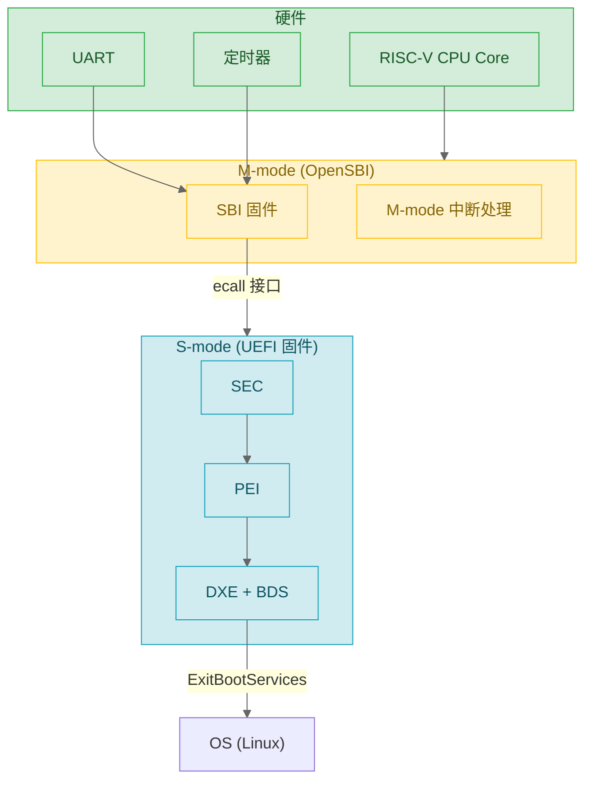

# 09 — RISC-V 平台移植实战

> 这是整个系列的综合练习。你已经懂了 Handle/Protocol、驱动开发、事件/TPL、PEI/HOB、构建系统——现在把这些串起来，把一个新的 RISC-V SoC 移植到 UEFI。从 SBI 调用到 MMU 配置到 ACPI 表生成到最终引导 Linux 内核，每步都有代码。

## 1. RISC-V 的 UEFI 架构全景

RISC-V 有四个特权级（U/S/H/M），UEFI 固件运行在 **S-mode**，通过 **SBI**（Supervisor Binary Interface）调用 M-mode 的 OpenSBI 完成硬件操作：



x86 固件能直接写 IO 端口/HW 寄存器。RISC-V 不行——UEFI 在 S-mode，访问 M-mode CSR 会触发非法指令异常。所有跨特权级操作必须通过 SBI ecall。

## 2. SBI：硬件抽象层

### 2.1 SBI 扩展与调用

EDK2 通过 `BaseRiscVSbiLib` 封装了所有 SBI 调用：

```c
// 底层封装——通过 ecall 指令从 S-mode 调 M-mode
SBI_RET EFIAPI SbiCall (
  IN UINTN ExtId,    // SBI 扩展 ID（如 SBI_EXT_TIME = 0x54494D45）
  IN UINTN FuncId,   // 扩展内的函数 ID（0 = set_timer）
  IN UINTN NumArgs,  // 参数数量 (0-6)
  IN UINTN Arg0, IN UINTN Arg1, IN UINTN Arg2,
  IN UINTN Arg3, IN UINTN Arg4, IN UINTN Arg5);
// 返回: SBI_RET { UINTN Error; UINTN Value; }
// Error=0 成功; Value=a0 寄存器返回值

// 便捷封装——开发者直接用这些
VOID SbiSetTimer (UINT64 Time);       // Time 单位: 微秒 (1us)
EFI_STATUS SbiSystemReset (UINTN ResetType, UINTN ResetReason);
```

SBI 扩展 ID 常用值：

| 扩展 | ID | 作用 |
|------|-----|------|
| SBI_EXT_BASE | 0x10 | 版本探测、获取已注册扩展列表 |
| SBI_EXT_TIME | 0x54494D45 ("TIME") | 读写 `mtime` 定时器（微秒精度） |
| SBI_EXT_SRST | 0x53525354 ("SRST") | 系统重启/关机 |
| SBI_EXT_DBCN | 0x4442434E ("DBCN") | 调试控制台 |

ASCII 编码 ID（如 `0x54494D45` = "TIME" 小端序）是 SBI v1.0 开始的标准命名约定。厂商自定义扩展用非 ASCII 的 ID 范围。

### 2.2 SBI 串口：最早的调试输出

`BaseSerialPortLibRiscVSbiLib` 通过 SBI DBCN 扩展实现串口写。它有两个版本：

- `BaseSerialPortLibRiscVSbiLib.inf` — SEC/PEI 用（**XIP**：eXecute In Place，代码直接在 Flash 执行，DDR 尚未初始化）
- `BaseSerialPortLibRiscVSbiLibRam.inf` — DXE 用（完整功能）

写数据时的回退策略：
1. 优先用 `SBI_EXT_DBCN` 批量输出（快、支持多个字符）
2. DBCN 不可用则回退到 SBI legacy `putchar`（每字符一个 ecall，慢）
3. 都不可用则静默返回

由于 OpenSBI 在 M-mode 管理着真正的 UART 硬件，UEFI 从第一条指令开始就能通过 `DEBUG` 宏输出日志。

## 3. RISC-V MMU 与页表

### 3.1 虚拟内存模式

| 模式 | 虚拟地址 | 物理地址 | 页表级数 | SATP.Mode | 适用场景 |
|------|:---:|:---:|:---:|:---:|------|
| Sv39 | 39 | 56 | 3 | 8 | UEFI 固件、嵌入式 Linux |
| Sv48 | 48 | 56 | 4 | 9 | 服务器 Linux |
| Sv57 | 57 | 56 | 5 | 10 | 超大规模虚拟化 |

UEFI 固件通常 Sv39 就足够——它的地址空间只需覆盖 Flash 和少量 MMIO。

Sv39 页表的地址映射：39 位虚拟地址 = 3 段 VPN（各 9 bits） + 12 bits offset。SATP 寄存器指向 L2 根页表，每级通过 VPN 索引找到下一级地址。实际实现中页表结构使用物理地址，最后一级页表项中的 PPN 与 offset 拼接成最终物理地址。

### 3.2 BaseRiscVMmuLib

四个 API 在两个启动阶段中调用：

**阶段一：SEC/PEI —— 身份映射**

```c
// 启用 Sv39，页表初始为 VA == PA（物理地址直通）
RiscVConfigureMmu (8);  // 8 = Sv39
// 给临时 RAM 区域设置可读写属性
RiscVSetMemoryAttributes (TempRamBase, TempRamSize, EFI_MEMORY_WB);
```

**阶段二：DXE —— 按用途精细控制权限**

```c
// 代码段：只读（RW 清零） + 可执行（默认）
RiscVSetMemoryAttributes (FwCodeBase, FwCodeSize, EFI_MEMORY_RO);

// 数据段：可读写 + 禁止执行
RiscVSetMemoryAttributes (FwDataBase, FwDataSize,
                          EFI_MEMORY_WB | EFI_MEMORY_XP);
// EFI_MEMORY_XP = eXecute Protect: 设置页表项 X 位 = 0

// MMIO 区域：不可缓存
RiscVSetMemoryAttributes (MmioBase, MmioSize, EFI_MEMORY_UC);

// 修改页表后刷新 TLB——否则 CPU 继续用过期缓存
RiscVLocalFlushTlbAll ();
```

| API | 何时调 |
|-----|--------|
| `RiscVConfigureMmu(SatpMode)` | SEC 阶段一次，之后不改 |
| `RiscVSetMemoryAttributes(Base, Size, Attr)` | DXE 阶段为每段内存配置 |
| `RiscVLocalFlushTlbAll()` | 批量修改页表后（性能代价大） |
| `RiscVLocalFlushTlbPage(VirtAddr)` | 单页修改后（精准，代价小） |

## 4. OvmfPkg/RiscVVirt：参考平台分析

这是 QEMU RISC-V 虚拟平台的 EDK2 实现，也是移植真实 SoC 的最佳起点。

```
OvmfPkg/RiscVVirt/
├── RiscVVirtQemu.dsc               # 平台 DSC
├── RiscVVirtQemu.fdf               # Flash 布局
├── VarStore.fdf.inc                # UEFI 变量存储区
├── PlatformPei/
│   └── PlatformPeim.c              # 解析 FDT → 构建 HOB
├── Library/
│   ├── PlatformSecLib/             # SEC 汇编入口 + C 函数
│   │   ├── SecEntry.S              # 设栈指针，调 SecStartupPlatform
│   │   ├── PlatformSecLib.c        # 找 PEI Core，调 PeiCore()
│   │   └── Memory.c / Cpu.c
│   ├── PlatformBootManagerLib/     # BDS 启动策略
│   └── ResetSystemLib/             # 重启实现
└── Feature/
    ├── Capsule/                    # 固件在线更新
    └── SecureBoot/                 # 安全启动
```

### 4.1 SEC：汇编入口到 C 代码

```asm
# SecEntry.S —— 固件执行的第一条指令
ASM_FUNC (_ModuleEntryPoint)
    li    s0, 0                                  # fp = 0，防栈回溯
    li    a2, FixedPcdGet32(PcdSecPeiTempRamBase) # 临时 RAM 基址
    li    a3, FixedPcdGet32(PcdSecPeiTempRamSize) # 大小
    sub   a3, a3, SEC_HANDOFF_DATA_RESERVE_SIZE   # 预留 Handoff Block 空间
    add   sp, a2, a3                             # sp = ram_base + ram_size - reserve
    call  SecStartupPlatform                     # → C 函数
```

`FixedPcdGet32(NAME)` 是 AutoGen 宏——构建时从 DSC 中取出 PCD 值直接替换。例如 DSC 中 `PcdSecPeiTempRamBase=0x80200000`，则在 Makefile 阶段就被展开为字面常数 `0x80200000`。

```c
// PlatformSecLib.c —— 第一个 C 函数
VOID EFIAPI SecStartupPlatform (IN UINTN BootHartId, IN VOID *FdtPointer)
{
  SerialPortInitialize ();              // SBI 串口就绪，DEBUG 可用
  mSecHandoffData.BootHartId = BootHartId;
  mSecHandoffData.FdtPointer  = FdtPointer;
  SbiSetTimer (ULONG64_MAX);           // 禁止定时器中断（固件不需要）
  PeiCore = FindPeiCoreInFv ();        // 在 FV 中定位 PEI Core
  PeiCore (&SecCoreData, NULL);        // 交出控制权
}
```

## 5. RISC-V ACPI 表生成

移植 RISC-V 平台的核心挑战之一是让 OS 正确识别硬件布局和每 Hart 的 ISA 能力。**DynamicTablesPkg** 从预设配置自动生成标准的 ACPI 表，避免手工维护多个平台二进制 - 这种"配置驱动、运行时生成"的方式是 UEFI ACPI 的核心设计理念。

关键 ACPI 表：

| 表 | 内容 | 谁生成 |
|-----|------|--------|
| RHCT（RISC-V Hart Capabilities Table） | 每个 Hart 的 ISA 字符串（如 `rv64imafdcvh_zba_zbb`）+ CMO/MMU 能力 | `AcpiRhctLibRiscV` |
| MADT | 中断控制器（RINTC, IMSIC, APLIC, PLIC） | `AcpiMadtLibRiscV` |
| SRAT | NUMA 拓扑（HART 到 NUMA 域的映射、内存亲和性） | `AcpiSratLib` |
| FADT | 平台 ACPI 定时器 / S-state / P-state 配置 | `AcpiFadtLibRiscV` |

RHCT 是 RISC-V 最独特的表——x86 用 `CPUID` 指令探测 CPU 能力，RISC-V 通过 ISA 字符串（如 `rv64imafdcvh_zicsr_zifencei_zba_zbb`）描述指令集扩展集合。配置时只需在配置描述文件中填写 ISA 字符串列表，框架就会自动生成正确的 RHCT。

```c
// DynamicTablesPkg 的工作流程（简化）
// 配置示例：
CM_OBJECT RiscVRhct[] = {
  { .IsaString = "rv64imafdcvh_zicsr_zifencei_zba_zbb" },
  { .IsaString = "rv64imafdcvh_zicsr_zifencei_zba_zbb" },  // Hart 2
  ...
};
// Auto-Gen 遍历 CM_OBJECT → 生成 RHCT.aml → 在 BDS 阶段加载
```

## 6. 初始化与启动流程总结

移植过程中，不同阶段的职责需要明确划分：

| 阶段 | RISC-V 具体职责 |
|------|----------------|
| SEC (_ModuleEntryPoint) | 汇编设栈指针；OpenSBI/FDT 指针通过 a0/a1 寄存器传入；C 函数 `SecStartupPlatform` 中保存并调用 `PeiCore` |
| PEI (PlatformPeim) | 用 OpenSBI 传来的 FDT 初始化 DDR（真实平台）或解析已有内存节点（QEMU virt）；构建 Resource Descriptor HOB；生成 PEI-to-DXE HOB 过渡 |
| DXE | 安装 CPU Arch Protocol 和 MMU 库；调用 `RiscVConfigureMmu` 启用 Sv39 + 身份映射；逐步加载磁盘/文件系统驱动 |
| BDS | 解析 BootOrder；从 ESP 分区加载 OS Loader（如 GRUB/Linux EFI stub）到内存 |
| RT | `ExitBootServices` 后调用 OS 入口；OS 接管中断和页表 |

实际平台还需要：
- `CpuDxeRiscV64.inf` — CPU Architectural Protocol（中断状态、定时器 IRQ、电源管理）
- `PlatformBootManagerLib` — BDS 启动策略和 fallback 路径

## 7. 平台移植模板

### 7.1 目录结构

```
MyRiscVPlatformPkg/
├── MyRiscVPlatformPkg.dec          # DEC: GUID + PCD
├── MyRiscVPlatformPkg.dsc          # DSC: 库绑定 + Components
├── MyRiscVPlatformPkg.fdf          # FDF: Flash 布局
├── Include/
│   ├── Guid/MyPlatformGuid.h
│   └── Library/MyPlatformLib.h
├── Library/
│   ├── PlatformSecLib/{.c, SecEntry.S, .inf}
│   ├── PlatformBootManagerLib/{PlatformBm.c, .inf}
│   └── ResetSystemLib/{.c, .inf}
├── PlatformPei/
│   ├── PlatformPeim.c              # 解析 FDT → HOB
│   └── PlatformPei.inf
└── Drivers/
    └── MyHardwareDxe/{.c, .inf}    # SoC 专用设备驱动
```

### 7.2 DSC 关键配置

```ini
[LibraryClasses.RISCV64]
  BaseRiscVSbiLib|MdePkg/Library/BaseRiscVSbiLib/...inf
  RiscVMmuLib|UefiCpuPkg/Library/BaseRiscVMmuLib/...inf

[LibraryClasses.common.SEC]
  SerialPortLib|MdePkg/Library/BaseSerialPortLibRiscVSbiLib/BaseSerialPortLibRiscVSbiLib.inf

[PcdsFixedAtBuild]
  gUefiCpuPkgTokenSpaceGuid.PcdCpuRiscVMmuMaxSatpMode|8    # Sv39

[Components]
  MdeModulePkg/Core/Pei/PeiCore.inf
  MdeModulePkg/Core/Dxe/DxeMain.inf
  UefiCpuPkg/CpuDxeRiscV64/CpuDxeRiscV64.inf
  MyRiscVPlatformPkg/PlatformPei/PlatformPei.inf
```

### 7.3 FDF Flash 布局

```ini
DEFINE CODE_BASE = 0x20000000
DEFINE CODE_SIZE = 0x00800000     # 8MB CODE 区
DEFINE VARS_BASE = 0x22000000
DEFINE VARS_SIZE = 0x000C0000     # 768KB VARS 区

[FD.Main]
  BaseAddress = $(CODE_BASE)
  Size        = $(CODE_SIZE)

[FV.Main]
  INF MdeModulePkg/Core/Dxe/DxeMain.inf
  INF MyRiscVPlatformPkg/PlatformPei/PlatformPei.inf
```

SEC 和 PEI Core 通常不会在 `[FV]` 中单独列出 - 它们在 FDF 的 `APRIORI` 段中优先级最高，直接写入 Raw Section（未经常规压缩）。

## 8. 调试

### 8.1 QEMU + GDB

```bash
# QEMU：-s = GDB port 1234, -S = 启动时暂停
qemu-system-riscv64 -machine virt -m 8G -smp 4 \
  -bios default -pflash CODE.fd -pflash VARS.fd \
  -nographic -s -S

# GDB
riscv64-unknown-elf-gdb
(gdb) set architecture riscv:rv64
(gdb) target remote :1234
```

关键断点：

```gdb
break SecEntry              # SEC 第一条汇编指令
break DxeMain               # DXE Core 入口
break BdsEntry              # BDS 入口
break RiscVSetMemoryAttributes  # 每个 MMU 属性修改
```

### 8.2 常见问题排查

| 现象 | 排查方向 |
|------|---------|
| 串口无输出 | SEC `sp` 是否越过合法范围；`SecEntry.S` 是否在 `FV_MAIN` FV 中路径正确；OpenSBI 是否已正确加载 |
| `SecStartupPlatform` 未进入 | QEMU `-bios default` 是否已正确加载；RISC-V image 入口是否正确 |
| PEI/DXE 崩溃 | 检查 HOB 描述的内存范围是否覆盖 PEI/DXE 需要的内存区域；确认内存页表映射无误 |
| BDS 找不到 BOOT#### | VARS.fd 是否已正确格式化并提供了合法的 BootOrder 变量 |

---

**上一篇**：[08-构建系统深入](./08-build-system.md)  
**这是本系列的最后一篇。** 有了上述知识体系，你应该能够：
- 写自己的 DXE 驱动和 PEIM
- 定义 Protocol 并实现生产者/消费者
- 处理驱动调度时序和资源清理
- 将新的 RISC-V SoC 移植到 UEFI
- 生成平台专属的 ACPI 表并引导 OS
