# EDK2 学习笔记

> 从零到能写驱动、移植平台的 EDK2 学习路径。面向 RISC-V 固件开发者。

### 关键术语

| 缩写 | 全称 | 含义 |
|------|------|------|
| UEFI | Unified Extensible Firmware Interface | 统一可扩展固件接口，替代传统 BIOS 的标准 |
| PI | Platform Initialization | 平台初始化规范，定义固件内部架构 |
| EDK2 | EFI Development Kit II | UEFI/PI 规范的开源参考实现 |

---

## 学习路线

```mermaid
%%{init: {"theme": "base", "themeVariables": {"primaryColor": "#ECECFF", "primaryTextColor": "#333333", "primaryBorderColor": "#9370DB", "lineColor": "#666666", "secondaryColor": "#ffffde", "secondaryBorderColor": "#aaaa33", "tertiaryColor": "#f0f0f0", "fontFamily": "\"trebuchet ms\", verdana, arial, sans-serif"}}}%%
flowchart LR
    P1["00-overview<br/>EDK2 是什么"]
    P2["01-quick-start<br/>构建运行"]
    P3["02-type-system<br/>类型与规范"]
    P4["03-boot-flow<br/>启动流程"]
    P5["04-build-system<br/>构建系统"]
    P6["05-module-dev<br/>模块开发"]
    P7["06-riscv-platform<br/>RISC-V 移植"]

    P1 --> P2 --> P3 --> P4 --> P5 --> P6 --> P7

    classDef phase1 fill:#d4edda,stroke:#28a745,color:#155724,stroke-width:2px
    classDef phase2 fill:#d1ecf1,stroke:#17a2b8,color:#0c5460,stroke-width:2px
    classDef phase3 fill:#fff3cd,stroke:#ffc107,color:#856404,stroke-width:2px
    classDef phase4 fill:#f8d7da,stroke:#dc3545,color:#721c24,stroke-width:2px
    classDef phase5 fill:#e2e3e5,stroke:#6c757d,color:#383d41,stroke-width:2px
    class P1,P2 phase1
    class P3,P4 phase2
    class P5 phase3
    class P6 phase4
    class P7 phase5
```

## 文档索引

| 序号 | 文档 | 概要 | 建议学时 |
|------|------|------|----------|
| 00 | [EDK2 全景地图](./00-overview.md) | BIOS vs UEFI、规范体系、EDK2 的定位 | 0.5h |
| 01 | [快速上手：构建与运行](./01-quick-start.md) | 环境搭建、首次构建、QEMU 运行固件 | 1h |
| 02 | [类型系统与编码规范](./02-type-system.md) | UINTN/EFI_STATUS/GUID、命名约定、编码规则 | 1h |
| 03 | [启动流程详解](./03-boot-flow.md) | SEC→PEI→DXE→BDS 各阶段职责与通信机制 | 2h |
| 04 | [构建系统深入](./04-build-system.md) | DSC/DEC/INF/FDF 元数据、AutoGen、build 命令 | 2h |
| 05 | [模块开发实战](./05-module-dev.md) | DXE 驱动、Protocol、事件、PEIM、Library | 3h |
| 06 | [RISC-V 平台移植](./06-riscv-platform.md) | SBI、MMU、OvmfPkg 分析、新 SoC 移植 | 3h |

---

## 源码阅读导航

| 包 | 路径 | 职责 | 对应文档 |
|----|------|------|----------|
| **MdePkg** | `MdePkg/` | 类型定义、库类声明、UEFI/PI 头文件 | 02-type-system |
| **MdeModulePkg** | `MdeModulePkg/` | PEI Core、DXE Core、通用驱动 | 03-boot-flow |
| **UefiCpuPkg** | `UefiCpuPkg/` | CPU 驱动、异常处理、MMU | 06-riscv-platform |
| **OvmfPkg** | `OvmfPkg/` | QEMU 虚拟机平台（含 RiscVVirt） | 06-riscv-platform |
| **BaseTools** | `BaseTools/` | 构建工具集 | 04-build-system |
| **DynamicTablesPkg** | `DynamicTablesPkg/` | 动态 ACPI 表生成 | 06-riscv-platform |

---

## 官方文档

| 文档 | 用途 | 阶段 |
|------|------|------|
| [EDK II Build Specification](https://tianocore-docs.github.io/) | 构建系统详解 | 学完 04 后 |
| [EDK II Module Writer's Guide](https://tianocore-docs.github.io/) | 模块开发指南 | 学完 05 后 |
| [UEFI Specification 2.10](https://uefi.org/specs/UEFI/2.10/) | OS 与固件的接口规范 | 按需查阅 |
| [RISC-V UEFI 规范](https://github.com/riscv-non-isa/riscv-uefi) | RISC-V UEFI 协议 | 学完 06 后 |
