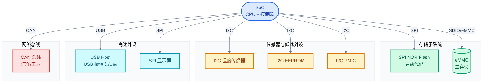
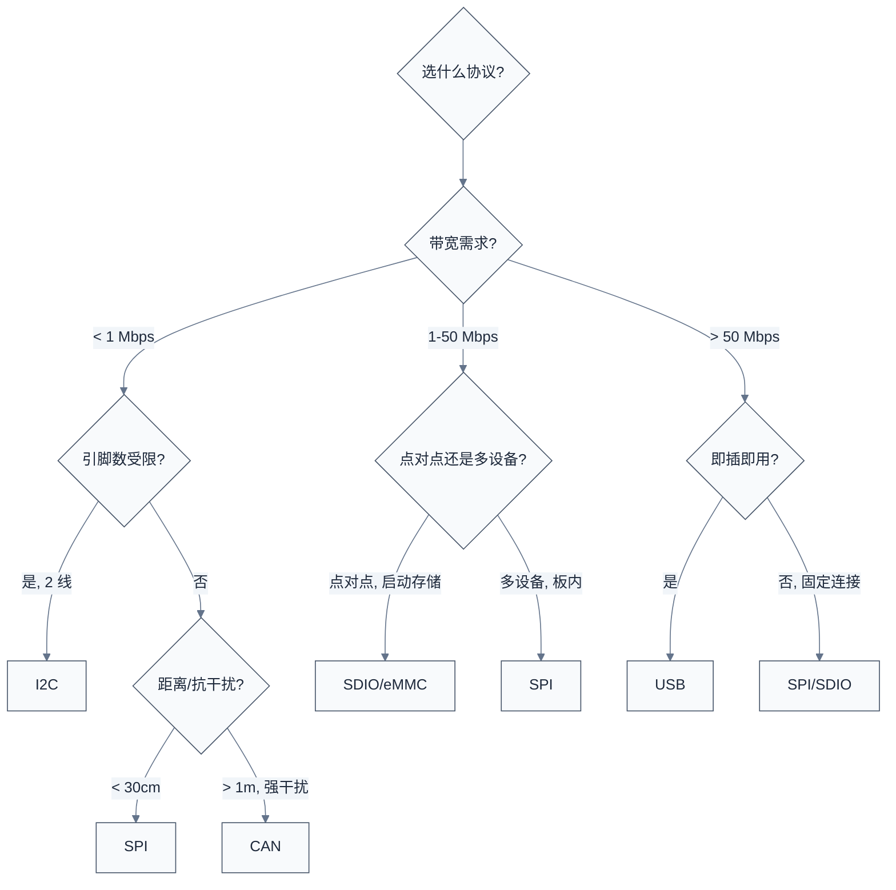

# 通信协议总览

> 本篇建立 SPI、I2C、CAN、USB、SDIO/eMMC 五种协议的整体认知：用共性维度（主从/同步/电气/拓扑）建立对比框架，再用一张嵌入式典型拓扑图把它们定位到真实系统中。
> **工程师视角**：拿到一颗新 SoC 的数据手册时，最先看的就是它支持哪些外设接口。理解每种协议"为什么这样设计"，比记住寄存器字段更重要——字段会查手册就行，但选错协议会让整个方案返工。

### 关键术语

| 缩写 | 全称 | 含义 |
|------|------|------|
| SPI | Serial Peripheral Interface | 串行外设接口，同步主从总线 |
| I2C | Inter-Integrated Circuit | 集成电路间总线，两线开漏同步总线 |
| CAN | Controller Area Network | 控制器局域网，差分广播总线 |
| USB | Universal Serial Bus | 通用串行总线，主机轮询式 |
| SDIO | Secure Digital Input Output | SD 协议族的 IO 扩展 |
| eMMC | embedded MultiMediaCard | 嵌入式 MMC，板级存储 |
| SCK | Serial Clock | 串行时钟（SPI） |
| CS | Chip Select | 片选（SPI） |
| NRZI | Non-Return-to-Zero Inverted | 非归零反转编码（USB） |
| URB | USB Request Block | USB 请求块（Linux USB 核心） |

### 前置知识

| 需要了解 | 参考文档 |
|----------|----------|
| 数字电路基础（电平、时钟、边沿） | — |
| Linux 驱动模型（probe、device tree） | [edk2/04-handle-protocol.md](../edk2/04-handle-protocol.md)、[zephyr-rtos/13-设备驱动模型.md](../zephyr-rtos/13-设备驱动模型.md) |
| 设备树基础语法 | [zephyr-rtos/03-设备树详解.md](../zephyr-rtos/03-设备树详解.md) |

---

## 1. 为什么需要这么多协议

> 一颗 SoC 要连接的外设千差万别：传感器只要几 Kbps，存储要几个 Gbps，汽车总线要抗强干扰，USB 要即插即用。没有任何一种协议能同时满足所有需求，于是工程师们针对不同场景设计了不同的协议。本章先用具体场景说明"五种协议各自在做什么"，再抽取共性维度建立对比框架。

### 1.1 五个典型场景

**场景一：温度传感器读取**。MCU 要从一颗 TMP102 温度传感器读 2 字节数据，传感器就在板子旁边 5cm 处，每秒读一次。这种场景对速度没要求（几 Kbps 足够），对引脚数敏感（MCU 的 GPIO 很贵），对协议复杂度敏感（传感器芯片成本可能只有 0.1 元，不能让它实现复杂的协议栈）。**I2C** 就是为这种场景设计的：两根线（SCL/SDA）、地址寻址、开漏电气、几百 Kbps。

**场景二：SPI Flash 启动**。SoC 从板载 SPI NOR Flash 启动，需要以最快速度读取 1MB 内核镜像。这里引脚数不是主要约束（4-6 根线可接受），但带宽是关键——启动时间每减少 100ms 都有意义。**SPI** 适合：全双工、无地址开销、时钟可达 50-100MHz，四线模式下吞吐可达 50MB/s。

**场景三：汽车 ECU 通信**。发动机控制单元要实时把转速信息广播给变速箱、仪表盘、ABS 等多个节点。环境干扰极强（点火线圈产生强烈电磁干扰），节点间距离可达几十米，且任一节点故障不能拖垮整个网络。**CAN** 为此而生：差分信号抗干扰、ID 优先级仲裁保证实时性、完善的错误状态机隔离故障节点。

**场景四：USB 摄像头**。用户插上一个 USB 摄像头，系统要自动识别、加载驱动、传输视频流。这里的关键是"即插即用"和"高带宽"：主机必须能枚举未知设备、分配地址、协商配置，然后以 480Mbps（HS）或 5Gbps（SS）传输等时数据。**USB** 是唯一选择：主机轮询式保证可控性、枚举协议保证即插即用、差分信号保证高速。

**场景五：eMMC 启动存储**。手机/嵌入式设备的主存储，容量 4-128GB，吞吐要支持系统启动和应用运行。引脚数受限（手机 PCB 面积极其紧张），但带宽要求高。**eMMC** 基于 SD 协议族：8 线 DDR 模式、HS400 可达 400MB/s，且把控制器和 Flash 颗粒封装成一颗 BGA 芯片。

> **核心要点**：协议多样性源于需求多样性。引脚数、带宽、距离、抗干扰、即插即用、成本——这些维度相互冲突（如高带宽通常意味着多引脚和高复杂度），每种协议都是在特定约束下的优化解。

### 1.2 五种协议一句话定位

| 协议 | 一句话定位 | 典型带宽 | 典型用途 |
|------|----------|---------|---------|
| **SPI** | 时钟驱动的全双工同步串行总线 | 1-100 Mbps | SPI Flash、传感器、显示屏 |
| **I2C** | 两线开漏、地址寻址的同步总线 | 0.1-3.4 Mbps | 传感器、EEPROM、PMIC |
| **CAN** | 差分、ID 仲裁的广播总线 | 0.05-8 Mbps | 汽车/工业控制网络 |
| **USB** | 主机轮询、端点寻址的即插即用总线 | 1.5-10000 Mbps | 外设扩展、存储、网络 |
| **SDIO/eMMC** | SD 协议族的存储/IO 接口 | 12.5-400 MB/s | eMMC 启动存储、SDIO WiFi/BT |

---

## 2. 通信协议的共性维度

> 上一节用场景说明了"每种协议在做什么"。这一节抽取共性维度，建立对比框架——后续每个协议章节都会在这个框架下展开。理解这些维度，就能快速判断一个新协议的设计取舍。

### 2.1 主从 vs 对等

**主从（Master/Slave）**：总线上有一个主设备控制时钟和发起传输，从设备只能响应。SPI、I2C、SDIO、USB 都是主从式。

- **SPI**：主设备产生 SCK，片选 CS 决定与哪个从设备通信
- **I2C**：主设备产生 SCL 和 START/STOP，从设备响应地址
- **USB**：主机（Host）轮询调度，设备（Device）只能等待被访问
- **SDIO/eMMC**：主机控制器发命令，存储卡响应

**对等（Peer-to-Peer）**：总线上所有节点平等，任一节点都可主动发送。CAN 是典型的对等总线。

- **CAN**：任一节点都可发起帧，通过 ID 优先级仲裁决定谁先发送

> **核心要点**：主从简化了设计（从设备逻辑简单），但限制了拓扑（所有通信必须经过主设备）。CAN 选择对等是因为汽车场景要求任一节点都能主动报告事件（如 ABS 故障），不能等主机轮询到才上报。

### 2.2 同步 vs 异步（时钟来源）

**同步总线**：有独立的时钟线，发送方和接收方共用同一时钟。SPI、I2C、USB、SDIO 都是同步总线。

- **SPI/I2C/SDIO**：有显式时钟线（SCK/SCL/CLK），接收方按时钟边沿采样
- **USB**：时钟嵌入在数据流中（NRZI + 位填充），接收方通过 PLL 恢复时钟——本质仍是同步

**异步总线**：无独立时钟线，靠起始位/停止位界定帧边界。本专题的五种协议都是同步的，但 UART 是典型的异步总线。

> **为什么 USB 把时钟嵌入数据流？** 因为 USB 速率高（HS 480Mbps），若用独立时钟线，时钟与数据的传输延迟差异会导致采样错误。嵌入时钟后，数据流本身就是时钟源，PLL 锁定即可。代价是需要位填充（连续 6 个 1 后插入 0）保证时钟可恢复。

### 2.3 全双工 vs 半双工

| 协议 | 双工模式 | 原因 |
|------|---------|------|
| SPI | 全双工 | MOSI + MISO 独立两根数据线 |
| I2C | 半双工 | SDA 一根线分时复用 |
| CAN | 半双工 | CAN_H/CAN_L 一对差分线 |
| USB 2.0 | 半双工 | D+/D- 一对差分线 |
| USB 3.0+ | 全双工 | 增加独立 TX/RX 差分对 |
| SDIO/eMMC | 半双工（CMD 线） | CMD 线分时复用，DATA 线可双向 |

> **核心要点**：全双工需要双倍数据线，但吞吐翻倍。SPI 选全双工是因为它面向高速场景且引脚数可接受；I2C 选半双工是为了极致省引脚（只要两根线）。

### 2.4 电气特性

| 协议 | 电气类型 | 电平 | 终端/上拉 |
|------|---------|------|----------|
| SPI | 推挽（Push-Pull） | CMOS 电平（VCC） | 无需上拉 |
| I2C | 开漏（Open-Drain） | CMOS 电平 | 需上拉电阻 |
| CAN | 差分（Differential） | 显性 2V/3V，隐性 0V | 需 120Ω 终端电阻 |
| USB 2.0 | 差分（D+/D-） | LS: 0.3/0.8V, HS: ±0.4V | 需 45Ω 终端 |
| SDIO/eMMC | 推挽 | CMOS 电平（1.8/3.3V） | 部分信号需上拉 |

开漏的好处是支持多主（任一节点拉低不会短路），代价是需要上拉电阻且速度受 RC 时间常数限制。差分的好处是抗共模干扰（两根线一起受干扰，差值不变），代价是双线。

### 2.5 拓扑

| 协议 | 典型拓扑 | 节点数 |
|------|---------|--------|
| SPI | 星型（每从一根 CS） | 通常 1-8 个从设备 |
| I2C | 总线（多设备并联） | 7 位地址理论上 127，实际受电容限制 ~20 |
| CAN | 总线 + 终端电阻 | 受延迟限制，通常 30 节点 |
| USB | 树型（Hub 扩展） | 理论 127，受供电限制 |
| SDIO/eMMC | 点对点（一主一卡/芯片） | 1 |

---

## 3. 嵌入式系统典型拓扑

> 前面两节建立了维度框架。这一节用一张真实的 SoC 拓扑图，把五种协议定位到系统中——读者会看到它们如何协同工作。

> **如何读这张图**：SoC 通过不同协议连接不同类型外设。绿色（存储）走 SPI/eMMC，黄色（低速传感器）走 I2C，蓝色（高速外设）走 USB/SPI，红色（网络总线）走 CAN。颜色对应"角色"，不是协议——SPI 既可接 Flash（存储）也可接显示屏（高速外设），取决于带宽需求。

---

## 4. 共性机制

> 每种协议都有自己的一套机制，但背后要解决的问题高度相似。这一节抽取四个共性机制，说明各协议如何用不同方式解决同一类问题。后续章节会展开每种协议的具体实现。

### 4.1 时钟同步

所有同步总线都要解决"接收方何时采样"的问题：

- **SPI**：接收方在 SCK 的某个边沿采样。模式 0-3 由 CPOL/CPHA 决定哪个边沿
- **I2C**：接收方在 SCL 高电平期间采样 SDA，发送方在 SCL 低电平期间改变 SDA
- **CAN**：接收方在采样点（位时间的 75%-87.5%）采样位值
- **USB**：接收方用 PLL 从 NRZI 数据流恢复时钟，在恢复的时钟边沿采样
- **SDIO**：接收方在 CLK 的上升沿或下降沿采样（取决于模式）

### 4.2 仲裁

当多个节点同时想发送时，需要仲裁决定谁先发：

- **SPI**：无仲裁（主设备决定一切，CS 唯一指向一个从设备）
- **I2C**：多主时用"线与"仲裁——ID 越小（0 比 1 更能拉低总线）优先级越高
- **CAN**：ID 优先级仲裁——显性（0）覆盖隐性（1），ID 越小优先级越高
- **USB**：无仲裁（主机轮询调度，设备不能主动发送）
- **SDIO**：无仲裁（一主一从点对点）

> **核心要点**：I2C 和 CAN 的仲裁都基于"线与/显性覆盖隐性"原理，但实现不同。I2C 在地址位仲裁，CAN 在 ID 位仲裁。仲裁失败的节点会自动停止发送，不会损坏总线。

### 4.3 CRC 与错误检测

| 协议 | CRC 类型 | 检测范围 |
|------|---------|---------|
| SPI | 无 | SPI 协议本身不提供 CRC（应用层可加） |
| I2C | 无 | I2C 协议只用 ACK，无 CRC |
| CAN | CRC-15（标准帧）/ CRC-17（扩展帧） | 帧头 + 数据 |
| USB | CRC-16（数据）+ CRC-5（令牌） | 包头 + 数据 |
| SDIO/eMMC | CRC-7（命令）+ CRC-16（数据） | 命令 + 数据 |

> **为什么 SPI/I2C 不用 CRC？** 因为它们面向板级短距离通信，噪声干扰小，ACK 足够。CAN 面向汽车强干扰环境，USB 面向可拔插外设（接触不良常见），SDIO 面向高密度存储（位错误率要求 1e-12），都需要更强的错误检测。

### 4.4 错误恢复

- **SPI**：无协议级错误恢复，靠应用层重传或 CS 重新选中
- **I2C**：从设备 NACK 表示忙或无应答，主设备可重试或 STOP
- **CAN**：发送方在 ACK 槽检测到隐性表示无节点应答，触发错误帧；错误计数到阈值进入 Bus-off
- **USB**：CRC 错误时主机重传（最多 3 次）；等时传输不重传
- **SDIO**：CRC 错误时主机重发命令或重传数据块

---

## 5. 选型决策引子

> 本篇建立了五种协议的整体认知。但实际项目选型时，工程师面对的问题是"我该用哪个协议接这个外设"。这个问题的答案取决于带宽、引脚、距离、成本、生态等多维权衡，将在 [06-协议对比与选型](./06-协议对比与选型.md) 详细展开。这里先给出一个粗略的决策引子：

> **如何读这张图**：从"带宽需求"切入，逐步收敛到具体协议。这是粗略决策——实际选型还要考虑供电、生态、驱动支持等。详细对比见 [06 章](./06-协议对比与选型.md)。

---

## 参考资料

- [Synopsys DesignWare IP 文档](https://www.synopsys.com/dw/ipdir.php) — DW_apb_i2c、DWC_mshc、DW_apb_ssi 系列 IP
- [Bosch MCAN 用户手册](https://www.bosch-semiconductors.com/) — CAN 控制器规范
- [USB-IF 文档库](https://www.usb.org/document-library) — USB 2.0/3.0 规范（需注册）
- [SD Association 简化规范](https://www.sdcard.org/downloads/pls/) — SD/SDIO/eMMC 协议
- [Linux 内核源码](https://git.kernel.org/) — `drivers/spi/`、`drivers/i2c/`、`drivers/net/can/`、`drivers/usb/`、`drivers/mmc/`
- [Zephyr 项目](https://docs.zephyrproject.org/) — 驱动模型与各协议驱动

---

**下一篇**：[01-SPI协议与驱动](./01-SPI协议与驱动.md) — 从最简单的同步主从总线开始，建立"时钟驱动一切"的直觉，再深入 Linux `spi_controller` 框架与 DesignWare SPI 驱动实现。
