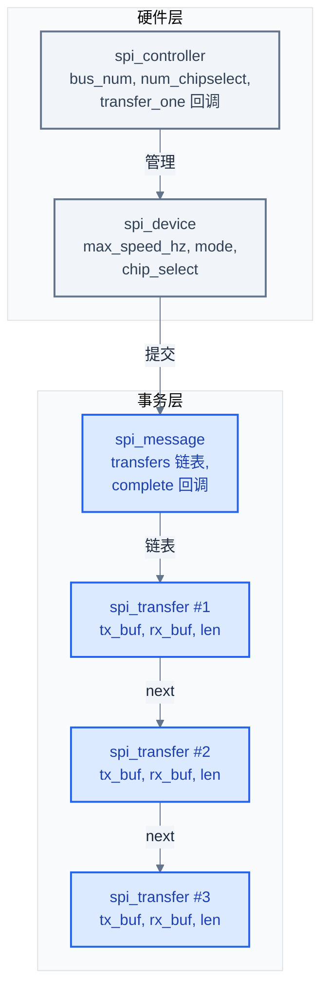

# SPI 协议与驱动深入分析

> 本篇从 SPI "时钟驱动交换" 的本质出发，逐层推进到电气规范、协议变体、Linux/Zephyr 两套驱动框架的对照实现，以 Synopsys DesignWare APB SSI 为贯穿案例，深入到寄存器位域、FIFO 阈值动态调整、DMA scatter-gather 同步、spi-mem EEPROM-read 模式等工程细节。
> **工程师视角**：调 SPI 时九成问题不在协议本身，而在 CPOL/CPHA 错配、CS 时序、信号完整性。先把示波器上的波形看懂，再去读驱动代码，会事半功倍。

### 关键术语

| 缩写 | 全称 | 含义 |
|------|------|------|
| SPI | Serial Peripheral Interface | 串行外设接口，同步主从总线 |
| SSI | Synchronous Serial Interface | 同步串行接口，Synopsys DW IP 名称 |
| SCK | Serial Clock | 串行时钟线 |
| MOSI | Master Out Slave In | 主出从入数据线 |
| MISO | Master In Slave Out | 主入从出数据线 |
| CS | Chip Select | 片选信号线 |
| CPOL | Clock Polarity | 时钟极性，决定空闲电平 |
| CPHA | Clock Phase | 时钟相位，决定采样边沿 |
| DW | DesignWare | Synopsys 公司的 IP 核系列 |
| PSSI | DW APB SSI | DesignWare APB 总线接口 SSI（旧版 IP） |
| HSSI | DWC SSI | DesignWare AHB/AXI 接口 SSI（新版 IP） |
| FIFO | First In First Out | 先进先出缓冲队列 |
| ISR | Interrupt Service Routine | 中断服务程序 |
| DMA | Direct Memory Access | 直接内存访问 |
| SG | Scatter-Gather | 散列-聚集，DMA 描述符链表组织方式 |
| RTIO | Runtime I/O | Zephyr 的异步 I/O 提交框架 |
| DTS | Device Tree Source | 设备树源文件 |
| DFS | Data Frame Size | 数据帧宽度字段 |
| TMOD | Transfer Mode | 传输模式字段 |
| NDF | Number of Data Frames | 数据帧数字段（EEPROM-read 模式用） |

### 前置知识

| 需要了解 | 参考文档 |
|----------|----------|
| 五种通信协议的共性与定位 | [00-通信协议总览.md](./00-通信协议总览.md) |
| Linux 驱动模型（probe、设备树） | [zephyr-rtos/13-设备驱动模型.md](../zephyr-rtos/13-设备驱动模型.md) |
| 设备树基础语法 | [zephyr-rtos/03-设备树详解.md](../zephyr-rtos/03-设备树详解.md) |

---

## 1. SPI 本质：时钟驱动的同步交换

### 1.1 一个字节是怎么交换出去的

SPI 的核心操作可以用一句话概括：**主设备产生时钟，每个时钟周期主从各移出一位、移入一位**。这是 "交换" 而非 "发送"——理解这一点是理解 SPI 全部行为的钥匙。

假设主设备要发 `0xA5`（`10100101`，MSB first），从设备同时回 `0x3C`（`00111100`）。Mode 0（CPOL=0, CPHA=0，空闲低、上升沿采样）下，8 个时钟周期的时序如下：

```
SCK   ‾‾‾‾‾\__/‾\__/‾‾\__/‾\__/‾\__/‾‾\__/‾‾\__/‾‾
        0  1  2  3  4  5  6  7      时钟周期编号
MOSI  ----10100101-------------------->  主发 0xA5
MISO  <----00111100-------------------  从回 0x3C
CS    ‾‾‾‾\______________________________/‾‾‾‾  拉低期间传输有效
```

逐周期分析（每个上升沿主从各锁存一位）：

| 周期 | MOSI（主→从） | MISO（从→主） | 主设备移位寄存器（发送前 → 接收后） |
|------|---------------|---------------|----------------------------------------|
| 0    | 1             | 0             | `10100101` → `_0100101` + 接收位 0    |
| 1    | 0             | 0             | `_0100101` → `__100101` + 接收位 0    |
| 2    | 1             | 1             | `__100101` → `___00101` + 接收位 1    |
| 3    | 0             | 1             | `___00101` → `____0101` + 接收位 1    |
| 4    | 0             | 1             | `____0101` → `_____101` + 接收位 1    |
| 5    | 1             | 1             | `_____101` → `______01` + 接收位 1    |
| 6    | 0             | 0             | `______01` → `_______1` + 接收位 0    |
| 7    | 1             | 0             | `_______1` → `________` + 接收位 0    |

8 个周期后，主设备 TX 移位寄存器中的 `0xA5` 已被推入从设备，从设备的 `0x3C` 已被推入主设备。**主设备没有 "只读不写" 的操作**——如果要读从设备的状态寄存器，必须发一个 dummy 字节（如 `0x00`）以产生时钟。

> **核心要点**：SPI 每个时钟周期都是双向交换。读从设备数据时必须同时发数据（哪怕 dummy 字节），因为没有时钟就没有数据流动。这一特性决定了驱动代码中 "TX/RX 长度必须相等" 的约束。

### 1.2 全双工的代价：引脚数量与无多主

"全双工" 听起来比 I2C 的 "半双工" 优秀，但代价是：

- **引脚多**：4 线（SCK/MOSI/MISO/CS）vs I2C 的 2 线（SCL/SDA）
- **不能多主**：MOSI/MISO 是单向推挽驱动，两个主同时上线会电气冲突；I2C 用开漏 + 线与仲裁天然支持多主
- **寻址靠硬件**：每增加一个从设备就多一根 CS 线，I2C 用 7-bit 地址软寻址

SPI 是典型的 "用引脚换速度、用主从结构换复杂度" 的工程权衡。

### 1.3 带宽演算：25MHz 传 1MB 要多久

单线 SPI 每字节 8 个时钟，纯传输时间（不含 CS 建立时间）为：

$$
T_{\text{transfer}} = \frac{N \cdot 8}{f_{\text{SCK}}}
$$

- $N$：字节数（本例 $N = 1\,\text{MB} = 1\,048\,576$）
- $f_{\text{SCK}}$：串行时钟频率（本例 $f_{\text{SCK}} = 25\,\text{MHz} = 25 \times 10^6\,\text{Hz}$）

代入：

$$
T_{\text{transfer}} = \frac{1\,048\,576 \times 8}{25 \times 10^6} \approx 0.3355\,\text{s} \approx 335.5\,\text{ms}
$$

对应吞吐 $\frac{1\,\text{MB}}{0.3355\,\text{s}} \approx 3.125\,\text{MB/s}$。这正是 SPI NOR Flash 启动 1MB 内核占用约 0.3 秒的由来。

若改为 Quad SPI（4 线并行），同频率下吞吐 4 倍，1MB 仅需约 84ms——这是嵌入式系统启动时间优化的关键手段。Octal SPI（8 线）再翻一倍，约 42ms。

> **核心要点**：SPI 带宽 = $\frac{f_{\text{SCK}}}{8} \times \text{数据线数}$。提速要么升频率（受 PCB 信号完整性限制），要么加线数（Quad/Octal，受引脚数量与从设备支持限制）。

---

## 2. 电气与物理层

### 2.1 四线信号职责

| 信号 | 方向 | 作用 | 推挽/开漏 |
|------|------|------|-----------|
| **SCK** | 主→从 | 串行时钟，驱动移位 | 推挽 |
| **MOSI** | 主→从 | 主出从入数据线 | 推挽 |
| **MISO** | 从→主 | 主入从出数据线 | 推挽 |
| **CS** | 主→从 | 片选，拉低（默认）选中从设备 | 推挽 |

多从设备采用星型拓扑：SCK/MOSI/MISO 三线共享，每个从设备独占一根 CS。主设备要和谁通信，就拉低谁的 CS，其余保持高电平（未选中）。未选中从设备的 MISO 必须呈现高阻态（Hi-Z），否则会与被选中从设备的 MISO 电气冲突——这是 SPI 从设备数据手册中 "MISO output goes Hi-Z when CS is high" 的由来。

### 2.2 推挽电气：为什么 SPI 能跑到 100MHz

SPI 采用推挽（push-pull）驱动：输出级由一个 PMOS + 一个 NMOS 组成，上拉时 PMOS 导通主动拉高，下拉时 NMOS 导通主动拉低。两边都有低阻抗驱动源，边沿陡峭，驱动电流大（典型 ±4mA ~ ±24mA）。

对比 I2C 的开漏（open-drain）+ 上拉电阻：开漏只能拉低，恢复高电平靠 $RC$ 充电，时间常数 $\tau = R_{\text{pullup}} \cdot C_{\text{bus}}$。400kHz I2C 用 4.7kΩ 上拉、总线电容 100pF 时 $\tau = 470\,\text{ns}$，上升沿已经接近 1μs，再提速就被 $RC$ 限制死。

| 电气特性 | SPI（推挽） | I2C（开漏） |
|----------|-------------|-------------|
| 主动拉高 | ✓（PMOS） | ✗（靠上拉） |
| 主动拉低 | ✓（NMOS） | ✓（NMOS） |
| 边沿速度 | <1ns（@100MHz） | ~1μs（@400kHz） |
| 最大速率 | 100MHz+ | 3.4MHz（Hs） |
| 多主能力 | ✗ | ✓（线与仲裁） |
| 引脚数 | 4+N（N 个从） | 2（共享） |

> **核心要点**：SPI 用推挽电气换速度、用引脚数换带宽。这是 SPI 能跑 100MHz、I2C 普遍只有 400kHz~3.4MHz 的根本原因。

### 2.3 CPOL 与 CPHA 的四模式

CPOL 决定空闲电平，CPHA 决定采样边沿，组合出四种模式：

| 模式 | CPOL | CPHA | 空闲电平 | 采样边沿 | 移位边沿 |
|------|------|------|----------|----------|----------|
| **0** | 0 | 0 | 低 | 上升沿 | 下降沿 |
| **1** | 0 | 1 | 低 | 下降沿 | 上升沿 |
| **2** | 1 | 0 | 高 | 下降沿 | 上升沿 |
| **3** | 1 | 1 | 高 | 上升沿 | 下降沿 |

> **如何读这张表**：Mode 0 和 Mode 3 的采样边沿都是上升沿，差别仅在于空闲电平。Mode 0 空闲低、上升沿采样；Mode 3 空闲高，下降沿移位、上升沿采样——两者采样时刻相同，只是 CS 拉低后到第一个时钟边沿间的过渡不同。这就是为什么很多 Flash 同时支持 Mode 0 和 Mode 3。

Mode 0 和 Mode 3 实际最常见，因为采样边沿都是上升沿，对主从时钟设计最自然。Mode 1/2 的下降沿采样在有些控制器里需要额外反相逻辑，较少使用。

```
Mode 0 (CPOL=0,CPHA=0): 空闲低, 上升沿采样       Mode 3 (CPOL=1,CPHA=1): 空闲高, 上升沿采样
SCK ‾‾‾‾\__/‾\__/‾\__/‾‾                            SCK ____‾‾‾‾\__/‾\__/‾\__/‾‾____
         ^    ^    ^   采样                                  ^    ^    ^   采样
CS  ‾‾‾‾\________________________________/‾‾        CS  ‾‾‾‾\________________________________/‾‾
       ^                                  ^                ^                                  ^
       CS 拉低                          CS 拉高             CS 拉低                          CS 拉高
```

### 2.4 CS 时序：setup/hold time 与 SPI 的隐藏陷阱

CS 时序不是 "拉低就开始"，从设备对 CS 拉低到第一个 SCK 边沿之间有最小建立时间要求，CS 拉高前最后一个 SCK 边沿也有最小保持时间：

| 参数 | 含义 | 典型值（SPI NOR Flash） |
|------|------|--------------------------|
| $t_{\text{CSS}}$ | CS 拉低到第一个 SCK 边沿 | 5~20 ns |
| $t_{\text{CSH}}$ | 最后一个 SCK 边沿到 CS 拉高 | 5~20 ns |
| $t_{\text{CS}}$ | CS 高电平持续时间（两次访问间隔） | 50~100 ns |

这些参数决定了高速 SPI 不能 "拉低 CS 立刻出时钟"，控制器必须在 CS 拉低后插入延迟。Linux 用 `spi_transfer.delay` 与 `spi_transfer.cs_change_delay` 描述这些间隔，DW 驱动通过 `spi_delay_exec` 执行。

**DW 控制器的隐藏陷阱**：DW APB SSI 在 TX FIFO 空时会**自动撤销 CS**，无论软件是否愿意。这意味着：

1. 单次 `spi_transfer` 内部如果 CPU 填 FIFO 不够快，TX FIFO 见底，CS 会被拉高
2. 多段 `spi_message` 之间如果 TX FIFO 清空，CS 也会被拉高，破坏 "命令+地址+数据" 的原子性

源码 `spi-dw-core.c` 的 `dw_spi_exec_mem_op` 函数注释（L711-L738）专门讨论了这个坑：

```c
// linux/drivers/spi/spi-dw-core.c:L711-L738（节选）
/*
 * DW APB SSI controller has very nasty peculiarities. First originally
 * (without any vendor-specific modifications) it doesn't provide a
 * direct way to set and clear the native chip-select signal. Instead
 * the controller asserts the CS lane if Tx FIFO isn't empty and a
 * transmission is going on, and automatically de-asserts it back to
 * the high level if the Tx FIFO doesn't have anything to be pushed
 * out. Due to that a multi-tasking or heavy IRQs activity might be
 * fatal, since the transfer procedure preemption may cause the Tx FIFO
 * getting empty and sudden CS de-assertion, which in the middle of the
 * transfer will most likely cause the data loss.
 */
```

工程上的规避方法：

- **方法 1**：用 `cs-gpios` 改由 GPIO 软件控制 CS，绕开 DW 自动撤 CS 行为
- **方法 2**：`dw_spi_exec_mem_op` 在执行 mem_op 时 `local_irq_save` + `preempt_disable`，关闭抢占避免 TX FIFO 见底
- **方法 3**：增大 TXFTLR 阈值，让中断提前触发，减少 FIFO 见底概率

> **核心要点**：DW APB SSI 的 "TX FIFO 空自动撤 CS" 是 SPI 驱动中最隐蔽的硬件陷阱。理解它就理解了为什么 `spi-dw-core.c` 在 mem_op 路径要关中断关抢占、为什么很多板子用 `cs-gpios` 而不用原生 CS。

### 2.5 多从拓扑与寻址

| 拓扑 | 接线方式 | 适用场景 |
|------|----------|----------|
| **独立 CS** | SCK/MOSI/MISO 共享，每从一根 CS | 最常见，寻址 O(1) |
| **菊花链** | 主 MOSI→从1→从1 MISO→从2 MOSI→...→从N MISO→主 MISO | LED 灯带、移位寄存器，所有从共享一个 CS |
| **CS+GPIO 扩展** | 用 GPIO 扩展芯片（如 74HC138）多路译码 | 从设备多（>8）且 CS 引脚紧张 |

菊花链模式下，主设备要写 N 个从设备，必须发 N×帧长 bit，前 N-1 帧数据被从设备依次 "传" 给下游，最后一帧留在最远端。读时反向，类似移位寄存器级联。

---

## 3. 协议变体与扩展

### 3.1 单线/双线/四线/八线传输

标准 SPI 用 1 根 MOSI + 1 根 MISO。为提升 Flash 读取吞吐，业界扩展出复用数据线模式：

| 模式 | 数据线数 | 命令/地址阶段 | 数据阶段 | 典型吞吐(@50MHz) | 引脚数 |
|------|----------|---------------|----------|-------------------|--------|
| **Standard** | 1+1 | 1 线 | 1 线 | 6.25 MB/s | 4 |
| **Dual** | 1+1 → 2 | 1 线 | 2 线 | 12.5 MB/s | 4（复用 IO0/IO1） |
| **Quad** | 1+1 → 4 | 1 线 | 4 线 | 25 MB/s | 6（IO0~IO3） |
| **Octal** | 8 | 8 线 | 8 线 | 50 MB/s | 11（IO0~IO7） |
| **QPI** | 4 | 4 线 | 4 线 | 25 MB/s | 6 |
| **OSPI** | 8 | 8 线 | 8 线 | 50 MB/s | 11 |

> **如何读这张表**：提速倍数等于数据阶段线数。Quad SPI 把 MOSI/MISO 复用为 IO0~IO3，数据阶段 4 位并行传输，吞吐 4 倍。命令和地址阶段通常仍为单线（为兼容旧协议），所以实际加速比略低于 4。QPI/OSPI 模式连命令地址也走多线，进一步降低开销，但要求 Flash 进入特殊模式。

DW APB SSI 不支持 Dual/Quad/Octal——它是 "经典 SPI" 控制器。多线模式需要 DWC SSI（HSSI）或专门的 QSPI 控制器（如 Zynq MPSoC 的 GQSPI）。Linux 用 `spi-mem` 框架的 `spi_mem_op` 结构描述多线操作，控制器驱动根据自身能力决定走硬件多线还是回退到 1 线。

### 3.2 三线 SPI（3-wire）

三线 SPI 把 MOSI 和 MISO 合并为一根 IO 线，半双工工作：

| 接线 | SCK | IO | CS |
|------|-----|----|----|
| 标准 SPI | 1 | MOSI+MISO=2 | 1 |
| 三线 SPI | 1 | 1（双向） | 1 |

适用场景：引脚紧张的传感器（如 MPU9250 加速度计）、ADC。Linux 用 `SPI_3WIRE` 标志启用，DW 控制器 CTRLR0 的 SLV_OE 位控制 MISO 输出使能。

### 3.3 SPI 从模式（target mode）

SPI 通常主设备是 SoC、从设备是外设，但有时 SoC 也要做从设备（如作为协处理器被主 SoC 控制）。SPI 从模式的关键差异：

| 维度 | 主模式 | 从模式 |
|------|--------|--------|
| 时钟产生 | 主产生 SCK | 等待主设备 SCK |
| 传输发起 | 主动 | 被动响应 |
| CS 控制 | 主拉低 CS | 等待主拉低 CS |
| FIFO 阈值 | 动态调整 | 通常固定 |
| 速度 | 主动设频率 | 被动跟随主 |

Linux 5.x 后将 "slave" 改名 "target"（`SPI_CONTROLLER_TARGET`）。DW 驱动在 `dw_spi_hw_init` 中检测从模式：

```c
// linux/drivers/spi/spi-dw-core.c:L852-L869
if (spi_controller_is_target(dws->ctlr)) {
    /* There is only one CS input signal in target mode */
    dws->num_cs = 1;
} else {
    /* 主模式下检测 CS 数量 */
    if (!dws->num_cs) {
        u32 ser;
        dw_writel(dws, DW_SPI_SER, 0xffff);
        ser = dw_readl(dws, DW_SPI_SER);
        dw_writel(dws, DW_SPI_SER, 0);
        dws->num_cs = hweight16(ser);
    }
}
```

从模式的核心难点：**主设备来的时钟不可预测**，从设备必须随时准备好接收。Zephyr 的 `spi_context_wait_for_completion` 在从模式下用 `K_FOREVER` 超时（`spi_context.h:L206-L208`），因为不知道主何时开始传输。

### 3.4 协议层的"无协议"取舍

SPI 协议本身没有：

- **地址机制**：靠硬件 CS 选片，不像 I2C 有 7-bit 地址
- **应答（ACK）**：从设备不回应答，发出去就发出去了
- **CRC/校验**：传输错误靠应用层（如 Flash 状态寄存器轮询）发现
- **流量控制**：从设备无法暂停主设备，必须实时跟随

> **核心要点**：SPI 用 "无协议" 换 "高速度"——没有地址开销、应答延迟、校验计算，每个时钟周期都传有效数据。可靠性由应用层保证。这是 SPI 与 I2C/CAN 的根本设计取舍：I2C 用 ACK 换总线可靠性，CAN 用 CRC+ACK 换工业级鲁棒性，SPI 什么都不换，所以最快。

---

## 4. Linux SPI 子系统架构

### 4.1 四层核心数据结构

Linux SPI 子系统用四层结构表达一次传输，定义在 `linux/include/linux/spi/spi.h`：

| 层级 | 结构体 | 行号 | 职责 |
|------|--------|------|------|
| 控制器 | `spi_controller` | L573 | 描述控制器硬件（bus_num、num_chipselect、回调函数表） |
| 从设备 | `spi_device` | L194 | 描述总线上的从设备（max_speed_hz、mode、chip_select） |
| 事务 | `spi_message` | L1195 | 原子事务，含多个 transfer 链表 |
| 段 | `spi_transfer` | L1104 | 事务中的一段（tx_buf/rx_buf/len/speed_hz） |

四层关系如下：



`spi_controller` 关键字段（spi.h:L573-L672）：

```c
// linux/include/linux/spi/spi.h:L573-L672（节选）
struct spi_controller {
    struct device       dev;
    s16                 bus_num;            // 控制器编号
    u16                 num_chipselect;     // 原生 CS 数量
    u32                 mode_bits;          // 支持的 mode 标志
    u32                 bits_per_word_mask; // 支持的位宽
    u32                 min_speed_hz;
    u32                 max_speed_hz;
    u16                 flags;              // SPI_CONTROLLER_* 标志
    union {
        bool            slave;              // 旧名：从模式
        bool            target;             // 新名：target 模式
    };
    struct mutex        io_mutex;           // I/O 互斥
    struct mutex        bus_lock_mutex;     // 总线锁
    // 回调函数表
    int  (*setup)(struct spi_device *spi);
    int  (*transfer_one)(struct spi_controller *ctlr,
                         struct spi_device *spi,
                         struct spi_transfer *transfer);
    int  (*prepare_message)(struct spi_controller *ctlr,
                            struct spi_message *message);
    int  (*unprepare_message)(struct spi_controller *ctlr,
                              struct spi_message *message);
    // ...
};
```

`spi_transfer`（spi.h:L1104-L1160）描述一段连续数据，关键字段：

```c
// linux/include/linux/spi/spi.h:L1104-L1160（节选）
struct spi_transfer {
    const void  *tx_buf;           // 发送缓冲（可为 NULL）
    void        *rx_buf;           // 接收缓冲（可为 NULL）
    unsigned    len;               // 字节数
    u8          bits_per_word;     // 覆盖 spi_device 的位宽
    u32         speed_hz;          // 覆盖 spi_device 的频率
    u32         effective_speed_hz;// 控制器实际生效频率（驱动回填）
    unsigned    cs_change:1;       // 本段结束后翻转 CS
    unsigned    cs_off:1;          // 本段期间 CS 拉高
    unsigned    tx_nbits:4;        // TX 线数（1/2/4/8）
    unsigned    rx_nbits:4;        // RX 线数
    bool        dtr_mode;          // Double Transfer Rate（DDR）
    struct spi_delay delay;            // 段间延迟
    struct spi_delay cs_change_delay;  // cs_change 时的延迟
    struct spi_delay word_delay;       // 字间延迟
    struct sg_table tx_sg;             // DMA scatterlist
    struct sg_table rx_sg;
    struct list_head transfer_list;    // 链入 spi_message
};
```

`spi_message`（spi.h:L1195-L1233）把多个 transfer 串成链表，保证整段事务原子执行：

```c
// linux/include/linux/spi/spi.h:L1195-L1233（节选）
struct spi_message {
    struct list_head    transfers;     // transfer 链表头
    struct spi_device   *spi;          // 目标从设备
    bool                is_dma_mapped; // 是否已 DMA 映射
    int                 status;        // 完成状态
    void                (*complete)(void *context);  // 完成回调
    void                *context;      // 回调参数
    unsigned            frame_length;  // 总字节数
    unsigned            actual_length; // 实际传输字节数
    struct list_head    queue;         // 入控制器队列
};
```

> **核心要点**：`spi_message` 是 "一次完整的对话"，`spi_transfer` 是 "对话中的一句话"。读 Flash 时，"发命令 + 发地址 + 读数据" 是三个 transfer 组成一个 message，CS 全程保持低电平——这靠 `spi_transfer.cs_change=0`（默认）实现。

### 4.2 spi_sync / spi_async 执行流

| 接口 | 阻塞 | 完成通知 | 适用场景 |
|------|------|----------|----------|
| **spi_sync** | 是 | 函数返回即完成 | 简单场景、进程上下文 |
| **spi_async** | 否 | 回调 `message.complete` | 高吞吐、需并行处理 |
| **spi_sync_locked** | 是 | 函数返回即完成 | 已持有总线锁 |

`spi_async` 提交后立即返回，控制器驱动在完成后调用 `spi_message.complete` 回调。`spi_sync` 本质是 `spi_async` + 等待 `completion`：

```c
// 简化的 spi_sync 等价逻辑
int spi_sync(struct spi_controller *ctlr, struct spi_message *msg)
{
    DECLARE_COMPLETION_ONSTACK(done);
    msg->complete = spi_complete;
    msg->context = &done;
    spi_async(ctlr, msg);
    wait_for_completion(&done);
    return msg->status;
}
```

实际执行流（核心层 `spi.c`）：

1. `spi_async` 加锁 `io_mutex`，调用 `__spi_async`
2. `__spi_async` 调用 `spi_optimize_message`（若未优化）
3. 调用 `ctlr->prepare_message`（控制器一次性准备整个 message）
4. 调用 `ctlr->transfer_one`（逐段 transfer，核心回调）
5. 每段完成后 `spi_finalize_current_transfer` 通知核心层
6. 全部完成后调用 `msg->complete`

`transfer_one` 是控制器驱动最关键的回调——它接收一个 `spi_transfer`，配置硬件、启动传输，返回 0 表示完成、返回 1 表示异步进行中（完成后必须调 `spi_finalize_current_transfer`）。

### 4.3 spi-mem 框架：为 Flash 优化

传统 `spi_message` 模型对 SPI NOR/NAND Flash 不够高效：Flash 操作是固定的 "命令 + 地址 + dummy + 数据" 四段式，每次组装 message 浪费时间。Linux 5.x 引入 `spi-mem` 框架，定义 `spi_mem_op` 一次性描述整个操作：

```c
// linux/include/linux/spi/spi-mem.h:L164-L203
struct spi_mem_op {
    struct {
        u8  nbytes;     // 命令字节数（1 或 2）
        u8  buswidth;   // 命令阶段线数（1/2/4/8）
        u8  dtr : 1;    // DDR 模式
        u16 opcode;     // 操作码
    } cmd;
    struct {
        u8  nbytes;     // 地址字节数
        u8  buswidth;
        u8  dtr : 1;
        u64 val;        // 地址值
    } addr;
    struct {
        u8  nbytes;     // dummy 字节数
        u8  buswidth;
        u8  dtr : 1;
    } dummy;
    struct {
        u8  buswidth;
        u8  dtr : 1;
        u8  ecc : 1;    // 是否要求硬件 ECC
        u8  swap16 : 1; // Octal DTR 字节序交换
        enum spi_mem_data_dir dir;  // IN/OUT/NONE
        unsigned int nbytes;
        union {
            void        *in;
            const void  *out;
        } buf;
    } data;
    unsigned int max_freq;
};
```

控制器驱动实现 `spi_controller_mem_ops`：

```c
struct spi_controller_mem_ops {
    bool (*supports_op)(struct spi_mem *mem, const struct spi_mem_op *op);
    int  (*exec_op)(struct spi_mem *mem, const struct spi_mem_op *op);
    int  (*adjust_op_size)(struct spi_mem *mem, struct spi_mem_op *op);
    // dirmap 系列：直接映射，进一步加速
    int  (*dirmap_create)(struct spi_mem_dirmap_desc *desc);
    void (*dirmap_destroy)(struct spi_mem_dirmap_desc *desc);
    ssize_t (*dirmap_read)(struct spi_mem_dirmap_desc *desc, u64 offs, size_t len, void *buf);
    ssize_t (*dirmap_write)(struct spi_mem_dirmap_desc *desc, u64 offs, size_t len, const void *buf);
};
```

> **核心要点**：`spi-mem` 框架让控制器驱动能 "整体优化" 一个 Flash 操作（如用 EEPROM-read 模式一次性读多字节），而不是机械地把四段式拆成四个 transfer。这是现代 SPI NOR 驱动性能的关键。

---

## 5. DesignWare SPI 控制器驱动深入

> 第四章讲了通用子系统的数据结构。但通用框架不碰寄存器——FIFO 填充、中断使能、时钟分频都由控制器驱动完成。本章深入 Synopsys DW APB SSI 驱动，看它如何把 `spi_transfer` 变成寄存器操作。

### 5.1 IP 变体：PSSI 与 HSSI

Synopsys DW SSI 有两个主要 IP 变体，差异在寄存器字段位定义：

| 维度 | PSSI（DW APB SSI） | HSSI（DWC SSI） |
|------|--------------------|-----------------|
| 总线接口 | APB | AHB/AXI |
| compatible | `snps,dw-apb-ssi` | `snps,dwc-ssi-1.01a` |
| DFS 字段 | CTRLR0[3:0] 或 [20:16]（32-bit 模式） | CTRLR0[4:0] |
| FRF 字段 | CTRLR0[5:4] | CTRLR0[7:6] |
| SCPH 位 | bit 6 | bit 8 |
| SCPOL 位 | bit 7 | bit 9 |
| TMOD 字段 | CTRLR0[9:8] | CTRLR0[11:10] |
| SRL 位 | bit 11 | bit 13 |
| MST 位 | 无 | bit 31（HSSI 102A+） |
| 最大位宽 | 16（标准）/ 32（DFS32 扩展） | 32 |

驱动用宏 `dw_spi_ip_is(dws, PSSI)` / `dw_spi_ip_is(dws, HSSI)` 区分（spi-dw.h:L22-L23）：

```c
// linux/drivers/spi/spi-dw.h:L14-L30
#define DW_PSSI_ID            0
#define DW_HSSI_ID            1

#define dw_spi_ip_is(_dws, _ip) \
    ((_dws)->ip == DW_ ## _ip ## _ID)

#define dw_spi_ver_is_ge(_dws, _ip, _ver) \
    (dw_spi_ip_is(_dws, _ip) && (_dws)->ver _op DW_ ## _ip ## _ ## _ver)

#define DW_HSSI_102A          0x3130322a   // 版本编码：'1''0''2''*'
```

`dw_spi_prepare_cr0`（spi-dw-core.c:L268-L313）根据 IP 类型分支：

```c
// linux/drivers/spi/spi-dw-core.c:L268-L313
static u32 dw_spi_prepare_cr0(struct dw_spi *dws, struct spi_device *spi)
{
    u32 cr0 = 0;

    if (dw_spi_ip_is(dws, PSSI)) {
        /* PSSI: CTRLR0[5:4] FRF, [6] SCPH, [7] SCPOL, [11] SRL */
        cr0 |= FIELD_PREP(DW_PSSI_CTRLR0_FRF_MASK, DW_SPI_CTRLR0_FRF_MOTO_SPI);
        if (spi->mode & SPI_CPOL) cr0 |= DW_PSSI_CTRLR0_SCPOL;
        if (spi->mode & SPI_CPHA) cr0 |= DW_PSSI_CTRLR0_SCPHA;
        if (spi->mode & SPI_LOOP) cr0 |= DW_PSSI_CTRLR0_SRL;
    } else {
        /* HSSI: CTRLR0[7:6] FRF, [8] SCPH, [9] SCPOL, [13] SRL, [31] MST */
        cr0 |= FIELD_PREP(DW_HSSI_CTRLR0_FRF_MASK, DW_SPI_CTRLR0_FRF_MOTO_SPI);
        if (spi->mode & SPI_CPOL) cr0 |= DW_HSSI_CTRLR0_SCPOL;
        if (spi->mode & SPI_CPHA) cr0 |= DW_HSSI_CTRLR0_SCPHA;
        if (spi->mode & SPI_LOOP) cr0 |= DW_HSSI_CTRLR0_SRL;
        /* HSSI 102A+ 必须设 MST 位才能工作在主模式 */
        if (dw_spi_ver_is_ge(dws, HSSI, 102A))
            cr0 |= DW_HSSI_CTRLR0_MST;
    }
    return cr0;
}
```

> **核心要点**：PSSI 与 HSSI 不是版本号差异，是**两套不同的 IP**，寄存器位定义不兼容。驱动用 `dw_spi_ip_is` 宏在编译期分支，避免运行时分支预测开销。同一份驱动兼容两个 IP 是 Synopsys 的设计目标。

### 5.2 完整寄存器地图

DW SSI 寄存器偏移（spi-dw.h:L36-L63），PSSI 与 HSSI 共用：

| 偏移 | 寄存器 | 全称 | 作用 |
|------|--------|------|------|
| 0x00 | CTRLR0 | Control Register 0 | 模式配置（DFS/FRF/SCPH/SCPOL/TMOD） |
| 0x04 | CTRLR1 | Control Register 1 | NDF：EEPROM-read 模式数据帧数 |
| 0x08 | SSIENR | SSI Enable Register | 全局使能（0=禁用，1=使能） |
| 0x0c | MWCR | Microwire Control Register | Microwire 模式专用 |
| 0x10 | SER | Slave Enable Register | CS 使能（每 bit 对应一个 CS） |
| 0x14 | BAUDR | Baud Rate Select | 时钟分频（偶数，2~65534） |
| 0x18 | TXFTLR | TX FIFO Threshold | TX FIFO 阈值（低于此触发中断） |
| 0x1c | RXFTLR | RX FIFO Threshold | RX FIFO 阈值（高于此触发中断） |
| 0x20 | TXFLR | TX FIFO Level | 当前 TX FIFO 数据数（只读） |
| 0x24 | RXFLR | RX FIFO Level | 当前 RX FIFO 数据数（只读） |
| 0x28 | SR | Status Register | 状态（BUSY/TF_EMPT/RF_NOT_EMPT...） |
| 0x2c | IMR | Interrupt Mask | 中断屏蔽 |
| 0x30 | ISR | Interrupt Status | 中断状态（读后清） |
| 0x34 | RISR | Raw Interrupt Status | 原始中断状态（未屏蔽） |
| 0x38 | TXOICR | TX Overflow IRQ Clear | TX 溢出清除（读后清） |
| 0x3c | RXOICR | RX Overflow IRQ Clear | RX 溢出清除 |
| 0x40 | RXUICR | RX Underflow IRQ Clear | RX 下溢清除 |
| 0x44 | MSTICR | Multi-Master IRQ Clear | 多主冲突清除 |
| 0x48 | ICR | IRQ Clear | 清除所有中断 |
| 0x4c | DMACR | DMA Control | DMA 使能（RDMAE/TDMAE） |
| 0x50 | DMATDLR | DMA TX Data Level | TX DMA 触发阈值 |
| 0x54 | DMARDLR | DMA RX Data Level | RX DMA 触发阈值 |
| 0x58 | IDR | Identification Register | IP 标识 |
| 0x5c | VERSION | Version | Synopsys 版本编码 |
| 0x60 | DR | Data Register | 数据寄存器（写=TX，读=RX） |
| 0xf0 | RX_SAMPLE_DLY | RX Sample Delay | RX 采样延迟（纳秒单位） |
| 0xf4 | CS_OVERRIDE | CS Override | 强制 CS 控制（厂商扩展） |

SR（状态寄存器）位定义（spi-dw.h:L102-L109）：

| 位 | 名称 | 含义 |
|----|------|------|
| 0 | BUSY | 正在传输 |
| 1 | TF_NOT_FULL | TX FIFO 未满 |
| 2 | TF_EMPT | TX FIFO 空 |
| 3 | RF_NOT_EMPT | RX FIFO 非空 |
| 4 | RF_FULL | RX FIFO 满 |
| 5 | TX_ERR | TX 错误 |
| 6 | DCOL | 数据冲突 |

中断位（spi-dw.h:L112-L118）：

| 位 | 名称 | 含义 |
|----|------|------|
| 0 | TXEI | TX FIFO 空（低于 TXFTLR） |
| 1 | TXOI | TX FIFO 溢出 |
| 2 | RXUI | RX FIFO 下溢（读空 FIFO 后再读） |
| 3 | RXOI | RX FIFO 溢出 |
| 4 | RXFI | RX FIFO 达到 RXFTLR |
| 5 | MSTI | 多主冲突 |

### 5.3 probe 完整流程

`dw_spi_mmio_probe`（spi-dw-mmio.c:L313-L391）是 platform driver 入口：

```c
// linux/drivers/spi/spi-dw-mmio.c:L313-L391（节选）
static int dw_spi_mmio_probe(struct platform_device *pdev)
{
    int (*init_func)(struct platform_device *pdev, struct dw_spi_mmio *dwsmmio);
    struct dw_spi_mmio *dwsmmio;
    struct dw_spi *dws;
    int ret;

    dwsmmio = devm_kzalloc(&pdev->dev, sizeof(*dwsmmio), GFP_KERNEL);
    dws = &dwsmmio->dws;

    /* 1. 获取寄存器资源 */
    dws->regs = devm_platform_get_and_ioremap_resource(pdev, 0, &mem);
    dws->paddr = mem->start;

    /* 2. 获取中断号 */
    dws->irq = platform_get_irq(pdev, 0);
    if (dws->irq < 0) return dws->irq;

    /* 3. 使能时钟 */
    dwsmmio->clk = devm_clk_get_enabled(&pdev->dev, NULL);
    dwsmmio->pclk = devm_clk_get_optional_enabled(&pdev->dev, "pclk");

    /* 4. 复位控制 */
    dwsmmio->rstc = devm_reset_control_get_optional_exclusive(&pdev->dev, "spi");
    reset_control_deassert(dwsmmio->rstc);

    /* 5. 设备属性 */
    dws->bus_num = pdev->id;
    dws->max_freq = clk_get_rate(dwsmmio->clk);
    if (device_property_read_u32(&pdev->dev, "reg-io-width", &dws->reg_io_width))
        dws->reg_io_width = 4;
    device_property_read_u32(&pdev->dev, "num-cs", &dws->num_cs);

    /* 6. 调用 compatible 特定的 init 函数 */
    init_func = device_get_match_data(&pdev->dev);
    if (init_func) {
        ret = init_func(pdev, dwsmmio);   // 如 dw_spi_pssi_init / dw_spi_hssi_init
        if (ret) goto out_reset;
    }

    /* 7. 注册控制器 */
    pm_runtime_enable(&pdev->dev);
    ret = dw_spi_add_controller(&pdev->dev, dws);
    if (ret) goto out;

    platform_set_drvdata(pdev, dwsmmio);
    return 0;
}
```

`init_func` 是 `of_match_table` 中的 `.data` 指针，按 compatible 分发（spi-dw-mmio.c:L434-L450）：

```c
// linux/drivers/spi/spi-dw-mmio.c:L434-L450
static const struct of_device_id dw_spi_mmio_of_match[] = {
    { .compatible = "snps,dw-apb-ssi",       .data = dw_spi_pssi_init},
    { .compatible = "mscc,ocelot-spi",       .data = dw_spi_mscc_ocelot_init},
    { .compatible = "mscc,jaguar2-spi",      .data = dw_spi_mscc_jaguar2_init},
    { .compatible = "amazon,alpine-dw-apb-ssi", .data = dw_spi_alpine_init},
    { .compatible = "renesas,rzn1-spi",      .data = dw_spi_pssi_init},
    { .compatible = "snps,dwc-ssi-1.01a",    .data = dw_spi_hssi_init},
    { .compatible = "intel,keembay-ssi",     .data = dw_spi_intel_init},
    { .compatible = "intel,mountevans-imc-ssi", .data = dw_spi_mountevans_imc_init},
    { .compatible = "microchip,sparx5-spi",  .data = dw_spi_mscc_sparx5_init},
    { .compatible = "canaan,k210-spi",       .data = dw_spi_canaan_k210_init},
    { .compatible = "amd,pensando-elba-spi", .data = dw_spi_elba_init},
    { /* end of table */}
};
```

`dw_spi_pssi_init` 仅做 DMA 设置（spi-dw-mmio.c:L211-L217）；`dw_spi_hssi_init` 额外标记 `ip = DW_HSSI_ID`（L219-L227）。某些板子（如 Mount Evans、K210）有硬件 errata，init 函数会做特殊处理——例如 Mount Evans IMC 把 fifo_len 强制设为 31 而非 32，因为满 FIFO 会数据损坏（L240-L253）。

`dw_spi_hw_init`（spi-dw-core.c:L834-L887）做硬件探测：

```c
// linux/drivers/spi/spi-dw-core.c:L834-L887（节选）
static void dw_spi_hw_init(struct device *dev, struct dw_spi *dws)
{
    dw_spi_reset_chip(dws);

    /* 读取 Synopsys 版本号（FourCC 编码，如 '1''0''2''*'） */
    if (!dws->ver) {
        dws->ver = dw_readl(dws, DW_SPI_VERSION);
        dev_dbg(dev, "Synopsys DWC%sSSI v%c.%c%c\n",
            dw_spi_ip_is(dws, PSSI) ? " APB " : " ",
            DW_SPI_GET_BYTE(dws->ver, 3),
            DW_SPI_GET_BYTE(dws->ver, 2),
            DW_SPI_GET_BYTE(dws->ver, 1));
    }

    /* 从模式：num_cs 固定为 1；主模式：自动检测 CS 数量 */
    if (spi_controller_is_target(dws->ctlr)) {
        dws->num_cs = 1;
    } else if (!dws->num_cs) {
        dw_writel(dws, DW_SPI_SER, 0xffff);
        u32 ser = dw_readl(dws, DW_SPI_SER);
        dw_writel(dws, DW_SPI_SER, 0);
        dws->num_cs = hweight16(ser);
    }

    /* 自动检测 FIFO 深度（2~256） */
    if (!dws->fifo_len) {
        u32 fifo;
        for (fifo = 1; fifo < 256; fifo++) {
            dw_writel(dws, DW_SPI_TXFTLR, fifo);
            if (fifo != dw_readl(dws, DW_SPI_TXFTLR))
                break;
        }
        dw_writel(dws, DW_SPI_TXFTLR, 0);
        dws->fifo_len = (fifo == 1) ? 0 : fifo;
    }
}
```

> **核心要点**：DW 驱动 probe 的精妙在于 "属性优先、自动探测兜底"——`num_cs`、`fifo_len` 既可由设备树指定，也可由驱动写寄存器读回自动检测。这让同一份驱动能跨多种 SoC 平台工作。

### 5.4 setup 回调与 CR0 缓存

`dw_spi_setup`（spi-dw-core.c:L789-L823）在每个从设备首次使用时调用一次，缓存 CR0：

```c
// linux/drivers/spi/spi-dw-core.c:L789-L823
static int dw_spi_setup(struct spi_device *spi)
{
    struct dw_spi *dws = spi_controller_get_devdata(spi->controller);
    struct dw_spi_chip_data *chip;

    chip = spi_get_ctldata(spi);
    if (!chip) {
        /* 首次 setup：分配 chip 数据，读取 rx-sample-delay */
        chip = kzalloc_obj(*chip);
        if (!chip) return -ENOMEM;
        spi_set_ctldata(spi, chip);

        u32 rx_sample_dly_ns;
        if (device_property_read_u32(&spi->dev, "rx-sample-delay-ns",
                                     &rx_sample_dly_ns) != 0)
            rx_sample_dly_ns = dws->def_rx_sample_dly_ns;
        /* 纳秒转换为时钟周期数 */
        chip->rx_sample_dly = DIV_ROUND_CLOSEST(rx_sample_dly_ns,
                                                NSEC_PER_SEC / dws->max_freq);
    }

    /* 每次都重算 CR0（mode 可能被协议驱动改） */
    chip->cr0 = dw_spi_prepare_cr0(dws, spi);
    return 0;
}
```

`dw_spi_chip_data` 缓存两个字段：

- `cr0`：CTRLR0 的"模式部分"（FRF/SCPH/SCPOL/SRL），不含 DFS/TMOD（这两个每次 transfer 都可能变）
- `rx_sample_dly`：RX 采样延迟（时钟周期数）

这样设计的原因：CR0 的"模式部分"很少变，但 DFS（位宽）和 TMOD（传输模式）每次 transfer 都可能不同。`dw_spi_update_config` 把缓存 + 当次配置合并：

```c
// linux/drivers/spi/spi-dw-core.c:L315-L356
void dw_spi_update_config(struct dw_spi *dws, struct spi_device *spi,
                          struct dw_spi_cfg *cfg)
{
    struct dw_spi_chip_data *chip = spi_get_ctldata(spi);
    u32 cr0 = chip->cr0;
    u32 speed_hz;
    u16 clk_div;

    /* 叠加本次 transfer 的 DFS */
    cr0 |= (cfg->dfs - 1) << dws->dfs_offset;

    /* 叠加本次 transfer 的 TMOD */
    if (dw_spi_ip_is(dws, PSSI))
        cr0 |= FIELD_PREP(DW_PSSI_CTRLR0_TMOD_MASK, cfg->tmode);
    else
        cr0 |= FIELD_PREP(DW_HSSI_CTRLR0_TMOD_MASK, cfg->tmode);

    dw_writel(dws, DW_SPI_CTRLR0, cr0);

    /* 从模式不配置时钟和 NDF */
    if (spi_controller_is_target(dws->ctlr))
        return;

    /* EEPROM-read / Read-only 模式：写 NDF */
    if (cfg->tmode == DW_SPI_CTRLR0_TMOD_EPROMREAD ||
        cfg->tmode == DW_SPI_CTRLR0_TMOD_RO)
        dw_writel(dws, DW_SPI_CTRLR1, cfg->ndf ? cfg->ndf - 1 : 0);

    /* 时钟分频：注意 DW APB SSI 不支持奇数分频 */
    clk_div = (DIV_ROUND_UP(dws->max_freq, cfg->freq) + 1) & 0xfffe;
    speed_hz = dws->max_freq / clk_div;

    if (dws->current_freq != speed_hz) {
        dw_spi_set_clk(dws, clk_div);
        dws->current_freq = speed_hz;
    }

    /* RX 采样延迟（高速 SPI 关键参数） */
    if (dws->cur_rx_sample_dly != chip->rx_sample_dly) {
        dw_writel(dws, DW_SPI_RX_SAMPLE_DLY, chip->rx_sample_dly);
        dws->cur_rx_sample_dly = chip->rx_sample_dly;
    }
}
```

**时钟分频的关键细节**：`(DIV_ROUND_UP(max_freq, freq) + 1) & 0xfffe`，最后 `& 0xfffe` 强制最低位为 0，即分频系数必须是**偶数**。这是因为 DW APB SSI 硬件不支持奇数分频（spi-dw-core.c:L342 注释）。

举例：max_freq = 100MHz，目标 freq = 30MHz。

- `DIV_ROUND_UP(100, 30) = 4`（向上取整）
- `4 + 1 = 5`
- `5 & 0xfffe = 4`
- 实际 `speed_hz = 100 / 4 = 25MHz`（不是 30MHz！）

驱动把 `current_freq` 回填到 `transfer->effective_speed_hz`，让协议驱动知道实际速率。

### 5.5 三种传输路径：Poll / IRQ / DMA

`dw_spi_transfer_one`（spi-dw-core.c:L416-L466）是每次传输的入口，根据条件选择三种执行路径：

```c
// linux/drivers/spi/spi-dw-core.c:L416-L466
static int dw_spi_transfer_one(struct spi_controller *ctlr,
                               struct spi_device *spi,
                               struct spi_transfer *transfer)
{
    struct dw_spi *dws = spi_controller_get_devdata(ctlr);
    struct dw_spi_cfg cfg = {
        .tmode = DW_SPI_CTRLR0_TMOD_TR,   // 默认收发模式
        .dfs = transfer->bits_per_word,
        .freq = transfer->speed_hz,
    };
    int ret;

    dws->dma_mapped = 0;
    dws->n_bytes = spi_bpw_to_bytes(transfer->bits_per_word);
    dws->tx = (void *)transfer->tx_buf;
    dws->tx_len = transfer->len / dws->n_bytes;
    dws->rx = transfer->rx_buf;
    dws->rx_len = dws->tx_len;            // 注意：强制 TX/RX 等长

    smp_mb();                              // 内存屏障，确保数据可见

    dw_spi_enable_chip(dws, 0);            // 禁用控制器（配置前必须禁用）
    dw_spi_update_config(dws, spi, &cfg);  // 写 CTRLR0/BAUDR
    transfer->effective_speed_hz = dws->current_freq;

    /* 检查是否走 DMA */
    dws->dma_mapped = spi_xfer_is_dma_mapped(ctlr, spi, transfer);
    dw_spi_mask_intr(dws, 0xff);           // 关所有中断

    if (dws->dma_mapped) {
        ret = dws->dma_ops->dma_setup(dws, transfer);
        if (ret) return ret;
    }

    dw_spi_enable_chip(dws, 1);            // 使能控制器

    if (dws->dma_mapped)
        return dws->dma_ops->dma_transfer(dws, transfer);
    else if (dws->irq == IRQ_NOTCONNECTED)
        return dw_spi_poll_transfer(dws, transfer);

    dw_spi_irq_setup(dws);                 // 路径3：中断
    return 1;                              // 1 表示异步进行中
}
```

三种模式对比：

| 模式 | 触发条件 | CPU 占用 | 延迟 | 适用场景 |
|------|----------|----------|------|----------|
| **Poll** | `irq == IRQ_NOTCONNECTED` | 100%（忙等 SR） | 最低 | 无中断线、短传输 |
| **IRQ** | 默认 | 低（中断驱动） | 中 | 大多数场景 |
| **DMA** | `dma_mapped` 为真 | 最低 | 较高（setup 开销） | 大块传输 |

### 5.6 中断处理与 FIFO 阈值动态调整

#### 5.6.1 中断初始化

`dw_spi_irq_setup`（spi-dw-core.c:L359-L378）是中断模式的关键：

```c
// linux/drivers/spi/spi-dw-core.c:L359-L378
static void dw_spi_irq_setup(struct dw_spi *dws)
{
    u16 level;
    u8 imask;

    /*
     * 初始阈值 = min(fifo_len/2, tx_len)
     * RX 阈值 = level - 1（FIFO 中数据 >= level 时触发 RXFI）
     */
    level = min_t(unsigned int, dws->fifo_len / 2, dws->tx_len);
    dw_writel(dws, DW_SPI_TXFTLR, level);
    dw_writel(dws, DW_SPI_RXFTLR, level - 1);

    dws->transfer_handler = dw_spi_transfer_handler;

    imask = DW_SPI_INT_TXEI | DW_SPI_INT_TXOI |
            DW_SPI_INT_RXUI | DW_SPI_INT_RXOI | DW_SPI_INT_RXFI;
    dw_spi_umask_intr(dws, imask);
}
```

举例：fifo_len=32，tx_len=128（待发 128 字）。

- `level = min(16, 128) = 16`
- TXFTLR=16：TX FIFO 数据 <= 16 时触发 TXEI（"该补充了"）
- RXFTLR=15：RX FIFO 数据 >= 16 时触发 RXFI（"该读走了"）

这样每次中断处理 ~16 字，中断频率 = 总字数 / 16，平衡了中断开销与延迟。

#### 5.6.2 中断处理逻辑

`dw_spi_transfer_handler`（spi-dw-core.c:L213-L249）是核心处理函数：

```c
// linux/drivers/spi/spi-dw-core.c:L213-L249
static irqreturn_t dw_spi_transfer_handler(struct dw_spi *dws)
{
    u16 irq_status = dw_readl(dws, DW_SPI_ISR);

    /* 1. 先检查错误 */
    if (dw_spi_check_status(dws, false)) {
        spi_finalize_current_transfer(dws->ctlr);
        return IRQ_HANDLED;
    }

    /* 2. 先读 RX（避免 RX FIFO 溢出） */
    dw_reader(dws);
    if (!dws->rx_len) {
        /* 全部接收完成 */
        dw_spi_mask_intr(dws, 0xff);
        spi_finalize_current_transfer(dws->ctlr);
    } else if (dws->rx_len <= dw_readl(dws, DW_SPI_RXFTLR)) {
        /* 关键：末段动态调低 RXFTLR */
        dw_writel(dws, DW_SPI_RXFTLR, dws->rx_len - 1);
    }

    /* 3. 再写 TX（如果 TXEI 触发） */
    if (irq_status & DW_SPI_INT_TXEI) {
        dw_writer(dws);
        if (!dws->tx_len)
            dw_spi_mask_intr(dws, DW_SPI_INT_TXEI);   /* 发完关 TXEI */
    }

    return IRQ_HANDLED;
}
```

**末段动态调低 RXFTLR 的原因**：假设剩 3 字待收，但 RXFTLR=15，RX FIFO 永远到不了 16，RXFI 不会触发，传输卡死。所以驱动检测到 `rx_len <= RXFTLR` 时立即把 RXFTLR 调到 `rx_len - 1`，让最后几字也能触发中断。

#### 5.6.3 错误处理完整路径

`dw_spi_check_status`（spi-dw-core.c:L177-L210）处理三类错误：

```c
// linux/drivers/spi/spi-dw-core.c:L177-L210
int dw_spi_check_status(struct dw_spi *dws, bool raw)
{
    u32 irq_status;
    int ret = 0;

    if (raw)
        irq_status = dw_readl(dws, DW_SPI_RISR);   // 原始状态（含被屏蔽）
    else
        irq_status = dw_readl(dws, DW_SPI_ISR);    // 屏蔽后状态

    if (irq_status & DW_SPI_INT_RXOI) {            // RX FIFO 溢出
        dev_err(&dws->ctlr->dev, "RX FIFO overflow detected\n");
        ret = -EIO;
    }
    if (irq_status & DW_SPI_INT_RXUI) {            // RX FIFO 下溢
        dev_err(&dws->ctlr->dev, "RX FIFO underflow detected\n");
        ret = -EIO;
    }
    if (irq_status & DW_SPI_INT_TXOI) {            // TX FIFO 溢出
        dev_err(&dws->ctlr->dev, "TX FIFO overflow detected\n");
        ret = -EIO;
    }

    if (ret) {
        dw_spi_reset_chip(dws);                    // 复位整个控制器
        if (dws->ctlr->cur_msg)
            dws->ctlr->cur_msg->status = ret;
    }
    return ret;
}
```

错误原因分析：

| 错误 | 触发原因 | 后果 |
|------|----------|------|
| **RXOI**（RX 溢出） | RX FIFO 满了又来新数据，旧数据被覆盖 | 数据丢失 |
| **RXUI**（RX 下溢） | RX FIFO 空了还读 DR | 读出垃圾数据 |
| **TXOI**（TX 溢出） | TX FIFO 满了还写 DR | 写入被丢弃 |

任何错误都触发 `dw_spi_reset_chip`（spi-dw.h:L272-L279）：禁用控制器、清中断、清 CS、重新使能。这是 "硬复位" 策略，因为 SPI 错误后从设备状态可能已乱，继续传只会得到更多错误。

> **核心要点**：DW SPI 中断处理遵循 "先读后写 + 末段调阈值" 模式。先读 RX 避免 FIFO 溢出，再写 TX 维持数据流；末段动态调低 RXFTLR 防止 "最后几字卡死"。错误处理简单粗暴——直接复位整个芯片。

### 5.7 spi-mem EEPROM-read 模式

DW SSI 的 TMOD=11（EEPROM-read）模式专为 SPI NOR/NAND Flash 优化：

- 软件一次性把 "命令+地址+dummy" 填入 TX FIFO
- 硬件自动产生 NDF（Number of Data Frames）个时钟读取数据
- 期间不需要 CPU 干预，避免 TX FIFO 见底导致 CS 自动撤销

`dw_spi_exec_mem_op`（spi-dw-core.c:L675-L765）实现：

```c
// linux/drivers/spi/spi-dw-core.c:L675-L765（节选）
static int dw_spi_exec_mem_op(struct spi_mem *mem, const struct spi_mem_op *op)
{
    struct dw_spi *dws = spi_controller_get_devdata(mem->spi->controller);
    struct dw_spi_cfg cfg;
    unsigned long flags;
    int ret;

    /* 1. 把 cmd+addr+dummy 合并到一个 buffer */
    ret = dw_spi_init_mem_buf(dws, op);
    if (ret) return ret;

    /* 2. 选择 TMOD：读用 EPROMREAD，写用 TO（只发） */
    cfg.dfs = 8;
    cfg.freq = clamp(op->max_freq, 0U, dws->max_mem_freq);
    if (op->data.dir == SPI_MEM_DATA_IN) {
        cfg.tmode = DW_SPI_CTRLR0_TMOD_EPROMREAD;
        cfg.ndf = op->data.nbytes;          // NDF = 要读的字节数
    } else {
        cfg.tmode = DW_SPI_CTRLR0_TMOD_TO;
    }

    dw_spi_enable_chip(dws, 0);
    dw_spi_update_config(dws, mem->spi, &cfg);
    dw_spi_mask_intr(dws, 0xff);
    dw_spi_enable_chip(dws, 1);

    /* 3. 关中断 + 关抢占，避免 TX FIFO 见底导致 CS 撤销 */
    local_irq_save(flags);
    preempt_disable();

    ret = dw_spi_write_then_read(dws, mem->spi);

    local_irq_restore(flags);
    preempt_enable();

    /* 4. 等待 BUSY 清除 */
    if (!ret) {
        ret = dw_spi_wait_mem_op_done(dws);
        if (!ret)
            ret = dw_spi_check_status(dws, true);
    }

    /* 5. 停止 mem op：禁用控制器 + 拉 CS 高 + 重新使能 */
    dw_spi_stop_mem_op(dws, mem->spi);
    dw_spi_free_mem_buf(dws);

    return ret;
}
```

`dw_spi_write_then_read`（spi-dw-core.c:L565-L623）是关键：先预填 TX FIFO，再拉 CS，然后持续补充 TX、读 RX：

```c
// linux/drivers/spi/spi-dw-core.c:L565-L623（节选）
static int dw_spi_write_then_read(struct dw_spi *dws, struct spi_device *spi)
{
    u32 room, entries, sts;
    unsigned int len;
    u8 *buf;

    /* 预填 TX FIFO（此时 CS 还没拉低，不会自动启动） */
    len = min(dws->fifo_len, dws->tx_len);
    buf = dws->tx;
    while (len--)
        dw_write_io_reg(dws, DW_SPI_DR, *buf++);

    /* 拉 CS 低，传输自动开始 */
    len = dws->tx_len - ((void *)buf - dws->tx);
    dw_spi_set_cs(spi, false);

    /* 持续补充 TX FIFO */
    while (len) {
        entries = readl_relaxed(dws->regs + DW_SPI_TXFLR);
        if (!entries) {
            dev_err(&dws->ctlr->dev, "CS de-assertion on Tx\n");
            return -EIO;   /* TX FIFO 见底导致 CS 撤销，错误 */
        }
        room = min(dws->fifo_len - entries, len);
        for (; room; --room, --len)
            dw_write_io_reg(dws, DW_SPI_DR, *buf++);
    }

    /* 持续读 RX FIFO（EEPROM-read 模式硬件自动拉数据进来） */
    len = dws->rx_len;
    buf = dws->rx;
    while (len) {
        entries = readl_relaxed(dws->regs + DW_SPI_RXFLR);
        if (!entries) {
            sts = readl_relaxed(dws->regs + DW_SPI_RISR);
            if (sts & DW_SPI_INT_RXOI) {
                dev_err(&dws->ctlr->dev, "FIFO overflow on Rx\n");
                return -EIO;
            }
            continue;
        }
        entries = min(entries, len);
        for (; entries; --entries, --len)
            *buf++ = dw_read_io_reg(dws, DW_SPI_DR);
    }
    return 0;
}
```

> **核心要点**：`dw_spi_exec_mem_op` 是 SPI 驱动工程化的典范——它把 Flash 操作优化为 "关中断关抢占 + 预填 FIFO + 拉 CS + 忙等读写"。代价是 CPU 在传输期间被独占，但收益是避免了 DW "TX FIFO 空自动撤 CS" 的硬件陷阱。这种 "丑陋但可靠" 的设计在嵌入式驱动中很常见。

---

## 6. DMA 与电源管理

### 6.1 DMA 通道初始化与 burst 配置

`dw_spi_dma_init_generic`（spi-dw-dma.c:L168-L207）通过 device tree 的 `dmas` 属性获取通道：

```c
// linux/drivers/spi/spi-dw-dma.c:L168-L207（节选）
static int dw_spi_dma_init_generic(struct device *dev, struct dw_spi *dws)
{
    dws->rxchan = dma_request_chan(dev, "rx");   // 请求 RX 通道
    dws->txchan = dma_request_chan(dev, "tx");   // 请求 TX 通道
    dws->ctlr->dma_rx = dws->rxchan;
    dws->ctlr->dma_tx = dws->txchan;

    init_completion(&dws->dma_completion);

    dw_spi_dma_caps_init(dws);     // 查询 DMA 控制器能力
    dw_spi_dma_maxburst_init(dws); // 配置 burst
    return 0;
}
```

`dw_spi_dma_maxburst_init`（spi-dw-dma.c:L37-L73）配置 burst 级别，关键细节是 **TX 阈值故意设为 burst 的两倍**：

```c
// linux/drivers/spi/spi-dw-dma.c:L37-L73（节选）
static void dw_spi_dma_maxburst_init(struct dw_spi *dws)
{
    struct dma_slave_caps caps;
    u32 max_burst, def_burst;
    int ret;

    def_burst = dws->fifo_len / 2;

    /* RX burst：DMA 控制器能力 vs FIFO 一半，取小 */
    ret = dma_get_slave_caps(dws->rxchan, &caps);
    max_burst = caps.max_burst ?: DW_SPI_RX_BURST_LEVEL;
    dws->rxburst = min(max_burst, def_burst);
    dw_writel(dws, DW_SPI_DMARDLR, dws->rxburst - 1);

    /* TX burst：同样取小 */
    ret = dma_get_slave_caps(dws->txchan, &caps);
    max_burst = caps.max_burst ?: DW_SPI_TX_BURST_LEVEL;
    dws->txburst = min(max_burst, def_burst);

    /*
     * 关键：TX DMA 阈值 = txburst（不是 txburst-1）
     * 意图：让 TX DMA 服务慢于 RX DMA，给 RX 留缓冲
     */
    dw_writel(dws, DW_SPI_DMATDLR, dws->txburst);
}
```

注释（L60-L72）解释了为什么 TX 要 "故意慢"：如果 TX DMA 比 RX DMA 快，TX 持续推数据进 SPI，RX FIFO 来不及清就会溢出。让 TX 阈值高一点，TX DMA 推完一批就停，等 RX FIFO 清得差不多了再推下一批。

### 6.2 scatter-gather 同步问题

DMA 传输用 scatterlist（散列表）描述非连续物理内存。问题：如果 DMA 控制器不支持硬件 SG 遍历，驱动会用中断方式逐个 SG 提交，但 TX/RX 通道的中断延迟不同步，可能导致 TX 跑得太快、RX FIFO 溢出。

`dw_spi_dma_transfer_one`（spi-dw-dma.c:L569-L636）的解决方案是 "拆分 SG 同步提交"：

```c
// linux/drivers/spi/spi-dw-dma.c:L537-L556（注释，ASCII 示意图）
/*
 * tx_sg list:    |___|____|__|
 * rx_sg list:    |_|____|____|
 * DMA transfers: |_|_|__|_|__|
 *
 * 把 tx_sg 和 rx_sg 按最小段切分，逐段同步提交+等待
 * 保持 TX/Rx FIFO 同步
 */
```

实现（spi-dw-dma.c:L569-L636）：

```c
// linux/drivers/spi/spi-dw-dma.c:L569-L636（节选）
static int dw_spi_dma_transfer_one(struct dw_spi *dws, struct spi_transfer *xfer)
{
    struct scatterlist *tx_sg = NULL, *rx_sg = NULL, tx_tmp, rx_tmp;
    unsigned int tx_len = 0, rx_len = 0;
    unsigned int base, len;
    int ret;

    sg_init_table(&tx_tmp, 1);
    sg_init_table(&rx_tmp, 1);

    for (base = 0; base < xfer->len; base += len) {
        /* 取下一个 TX SG 段 */
        if (!tx_len) {
            tx_sg = !tx_sg ? &xfer->tx_sg.sgl[0] : sg_next(tx_sg);
            sg_dma_address(&tx_tmp) = sg_dma_address(tx_sg);
            tx_len = sg_dma_len(tx_sg);
        }
        /* 取下一个 RX SG 段 */
        if (!rx_len) {
            rx_sg = !rx_sg ? &xfer->rx_sg.sgl[0] : sg_next(rx_sg);
            sg_dma_address(&rx_tmp) = sg_dma_address(rx_sg);
            rx_len = sg_dma_len(rx_sg);
        }

        len = min(tx_len, rx_len);   // 取较短段
        sg_dma_len(&tx_tmp) = len;
        sg_dma_len(&rx_tmp) = len;

        /* 提交 TX/RX DMA（每次只提交 1 个 SG 段） */
        ret = dw_spi_dma_submit_tx(dws, &tx_tmp, 1);
        ret = dw_spi_dma_submit_rx(dws, &rx_tmp, 1);

        /* RX 必须先启动（SPI 本能：有时钟才有数据） */
        dma_async_issue_pending(dws->rxchan);
        dma_async_issue_pending(dws->txchan);

        /* 同步等待本段完成 */
        ret = dw_spi_dma_wait(dws, len, xfer->effective_speed_hz);
        reinit_completion(&dws->dma_completion);

        /* 推进指针 */
        sg_dma_address(&tx_tmp) += len;
        sg_dma_address(&rx_tmp) += len;
        tx_len -= len;
        rx_len -= len;
    }
    return ret;
}
```

> **核心要点**：DMA SG 同步是 SPI 驱动中最微妙的工程问题。TX 和 RX 是两条独立 DMA 通道，但 SPI 协议要求它们严格同步（每个时钟周期一进一出）。驱动用 "拆段同步提交" 牺牲性能换可靠性——如果 DMA 控制器支持硬件 SG 遍历，可以走 `dw_spi_dma_transfer_all` 一次性提交所有段。

### 6.3 Runtime PM 与挂起恢复

`dw_spi_mmio_pm_ops`（spi-dw-mmio.c:L393-L423）实现挂起/恢复：

```c
// linux/drivers/spi/spi-dw-mmio.c:L393-L423
static int dw_spi_mmio_suspend(struct device *dev)
{
    struct dw_spi_mmio *dwsmmio = dev_get_drvdata(dev);
    int ret;

    ret = dw_spi_suspend_controller(&dwsmmio->dws);  // 等待当前传输完成
    if (ret) return ret;

    reset_control_assert(dwsmmio->rstc);             // 复位 IP
    clk_disable_unprepare(dwsmmio->pclk);            // 关 pclk
    clk_disable_unprepare(dwsmmio->clk);             // 关 ssi_clk
    return 0;
}

static int dw_spi_mmio_resume(struct device *dev)
{
    struct dw_spi_mmio *dwsmmio = dev_get_drvdata(dev);

    clk_prepare_enable(dwsmmio->clk);
    clk_prepare_enable(dwsmmio->pclk);
    reset_control_deassert(dwsmmio->rstc);

    return dw_spi_resume_controller(&dwsmmio->dws);  // 重新初始化 IP
}
```

`dw_spi_resume_controller` 内部会重新调用 `dw_spi_hw_init`，因为 IP 复位后所有寄存器丢失，必须重新探测 FIFO 深度、CS 数量等。

---

## 7. Zephyr SPI 框架对照

> 第六章看到 Linux 用 `spi_message` 链表 + `transfer_one` 回调的队列模型，外加 pump 线程和 kthread。Zephyr 是 RTOS，用更轻的 `spi_context` 单次模型。本章对照两者的 API 和执行流。

### 7.1 spi_context 模型

Zephyr 用 `struct spi_context`（spi_context.h:L34-L73）管理运行状态：

```c
// zephyr/drivers/spi/spi_context.h:L34-L73
struct spi_context {
    const struct spi_config *config;       // 当前配置
#ifdef CONFIG_MULTITHREADING
    const struct spi_config *owner;        // 当前持有者（用于 SPI_LOCK_ON）
#endif
    const struct gpio_dt_spec *cs_gpios;   // GPIO CS 数组
    size_t num_cs_gpios;

#ifdef CONFIG_MULTITHREADING
    struct k_sem lock;                     // 控制器独占锁
    struct k_sem sync;                     // 完成同步
#else
    atomic_t ready;                        // 无线程模式下的原子标志
#endif
    int sync_status;

#ifdef CONFIG_SPI_ASYNC
    spi_callback_t callback;               // 异步回调
    void *callback_data;
    bool asynchronous;
#endif
    const struct spi_buf *current_tx;      // 当前 TX buf 链
    size_t tx_count;
    const struct spi_buf *current_rx;
    size_t rx_count;

    const uint8_t *tx_buf;                 // 当前 TX buf 指针
    size_t tx_len;                         // 当前 buf 剩余字节数
    uint8_t *rx_buf;
    size_t rx_len;

#ifdef CONFIG_SPI_SLAVE
    int recv_frames;                       // 从模式已收帧数
#endif
};
```

对比 Linux `spi_message`：

| 维度 | Linux `spi_message` | Zephyr `spi_context` |
|------|---------------------|----------------------|
| 事务模型 | 多段 transfer 链表 | `spi_buf_set` 数组 |
| 完成同步 | `completion` + 回调 | `k_sem` + 回调（异步） |
| 锁机制 | `io_mutex` + `bus_lock` | `k_sem lock` |
| 异步支持 | `spi_async` + `complete` 回调 | `CONFIG_SPI_ASYNC` + callback |
| DMA 集成 | `dmaengine` + scatterlist | `spi_dma` 可选 |
| 配置传递 | `spi_transfer` 逐段覆盖 | `spi_config` 一次性 |

### 7.2 spi_dw_transceive 执行流

Zephyr DW 驱动入口 `transceive`（spi_dw.c:L345-L470）：

```c
// zephyr/drivers/spi/spi_dw.c:L345-L470（节选）
static int transceive(const struct device *dev,
                      const struct spi_config *config,
                      const struct spi_buf_set *tx_bufs,
                      const struct spi_buf_set *rx_bufs,
                      bool asynchronous,
                      spi_callback_t cb, void *userdata)
{
    struct spi_dw_data *spi = dev->data;
    uint32_t tmod = DW_SPI_CTRLR0_TMOD_TX_RX;
    uint32_t reg_data;
    int ret;

    spi_context_lock(&spi->ctx, asynchronous, cb, userdata, config);

    /* 1. 配置 CTRLR0 */
    ret = spi_dw_configure(dev, spi, config);
    if (ret) goto out;

    /* 2. 根据缓冲确定 TMOD */
    if (!rx_bufs || !rx_bufs->buffers)
        tmod = DW_SPI_CTRLR0_TMOD_TX;
    else if (!tx_bufs || !tx_bufs->buffers)
        tmod = DW_SPI_CTRLR0_TMOD_RX;

    /* 3. RX-only 模式：写 NDF（要收多少帧） */
    if (tmod >= DW_SPI_CTRLR0_TMOD_RX && !spi_dw_is_slave(spi)) {
        reg_data = spi_dw_compute_ndf(rx_bufs->buffers, rx_bufs->count, spi->dfs);
        write_ctrlr1(dev, reg_data);
    }

    /* 4. 更新 CTRLR0 的 TMOD 字段 */
    reg_data = read_ctrlr0(dev);
    reg_data &= ~DW_SPI_CTRLR0_TMOD_RESET;
    reg_data |= tmod;
    write_ctrlr0(dev, reg_data);

    /* 5. 设置缓冲区 */
    spi_context_buffers_setup(&spi->ctx, tx_bufs, rx_bufs, spi->dfs);
    spi->fifo_diff = 0;

    /* 6. 配置 TX/RX FIFO 阈值 */
    spi_dw_update_txftlr(dev, spi);

    reg_data = (info->fifo_depth * 5) / 8;   // RX 阈值默认 5/8 FIFO
    if (spi->ctx.rx_len && spi->ctx.rx_len < info->fifo_depth)
        reg_data = spi->ctx.rx_len - 1;       // 末段调整
    write_rxftlr(dev, reg_data);

    /* 7. 使能中断 */
    reg_data = !rx_bufs ? DW_SPI_IMR_UNMASK & DW_SPI_IMR_MASK_RX : DW_SPI_IMR_UNMASK;
    write_imr(dev, reg_data);

    /* 8. 拉 CS + 使能控制器 */
    if (!spi_dw_is_slave(spi)) {
        if (spi_cs_is_gpio(config))
            spi_context_cs_control(&spi->ctx, true);
        else
            write_ser(dev, BIT(config->slave));
    }
    set_bit_ssienr(dev);

    /* 9. 等待完成 */
    ret = spi_context_wait_for_completion(&spi->ctx);

out:
    spi_context_release(&spi->ctx, ret);
    pm_device_busy_clear(dev);
    return ret;
}
```

### 7.3 中断处理与 fifo_diff

Zephyr 的中断处理 `spi_dw_isr`（spi_dw.c:L510-L538）比 Linux 简洁：

```c
// zephyr/drivers/spi/spi_dw.c:L510-L538
void spi_dw_isr(const struct device *dev)
{
    uint32_t int_status = read_isr(dev);
    int error = 0;

    if (int_status & DW_SPI_ISR_ERRORS_MASK) {
        error = -EIO;
        goto out;
    }

    if (int_status & DW_SPI_ISR_RXFIS)
        pull_data(dev);          // 读 RX
    if (int_status & DW_SPI_ISR_TXEIS)
        push_data(dev);          // 写 TX

out:
    clear_interrupts(dev);
    completed(dev, error);
}
```

`push_data`（spi_dw.c:L88-L147）的关键变量 `fifo_diff` 跟踪 TX/RX 不平衡：

```c
// zephyr/drivers/spi/spi_dw.c:L88-L147（节选）
static void push_data(const struct device *dev)
{
    struct spi_dw_data *spi = dev->data;
    uint32_t data = 0U;
    uint32_t f_tx;

    if (spi_context_rx_on(&spi->ctx)) {
        /* 双工：可填 = FIFO 深度 - TX 已有 - RX 已有 */
        f_tx = info->fifo_depth - read_txflr(dev) - read_rxflr(dev);
    } else {
        /* 只发：可填 = FIFO 深度 - TX 已有 */
        f_tx = info->fifo_depth - read_txflr(dev);
    }

    while (f_tx) {
        if (spi_context_tx_buf_on(&spi->ctx)) {
            /* 有 TX 数据 */
            data = UNALIGNED_GET((uint8_t *)spi->ctx.tx_buf);
        } else if (spi_context_rx_on(&spi->ctx)) {
            /* 无 TX 但要 RX：填 dummy，但不超过 RX 剩余 */
            if ((int)(spi->ctx.rx_len - spi->fifo_diff) <= 0)
                break;
            data = 0U;
        } else if (spi_context_tx_on(&spi->ctx)) {
            data = 0U;
        } else {
            break;
        }

        write_dr(dev, data);
        spi_context_update_tx(&spi->ctx, spi->dfs, 1);
        spi->fifo_diff++;        // 每发一字，fifo_diff+1
        f_tx--;
    }

    /* TX 发完，关闭 TXEI 中断 */
    if (!spi_context_tx_on(&spi->ctx)) {
        write_txftlr(dev, 0);
    }
}
```

`fifo_diff` 的语义：**已发送但未接收的字数**。`pull_data` 每读一字 `fifo_diff--`。这个变量防止 "TX 已经把 RX 缓冲填满了 RX 还没读" 的过填问题。

`completed`（spi_dw.c:L50-L86）检查完成条件：

```c
// zephyr/drivers/spi/spi_dw.c:L50-L86
static void completed(const struct device *dev, int error)
{
    struct spi_dw_data *spi = dev->data;

    if (error) goto out;

    /* TX 和 RX 都还有数据？继续 */
    if (spi_context_tx_on(&spi->ctx) || spi_context_rx_on(&spi->ctx))
        return;

out:
    /* 等 BUSY 清除（最后几位还在移位） */
    while (test_bit_sr_busy(dev)) {}

    write_imr(dev, DW_SPI_IMR_MASK);   // 关中断
    clear_bit_ssienr(dev);              // 禁用控制器

    if (!spi_dw_is_slave(spi)) {
        if (spi_cs_is_gpio(ctx->config))
            spi_context_cs_control(ctx, false);
        else
            write_ser(dev, 0);          // 撤销 CS
    }

    spi_context_complete(&spi->ctx, dev, error);
}
```

> **核心要点**：Zephyr 用 `fifo_diff` 跟踪 TX/RX 不平衡，比 Linux 的 `dw_spi_tx_max`/`dw_spi_rx_max` 更直观。Linux 在 `dw_spi_tx_max` 计算 `rxtx_gap = fifo_len - (rx_len - tx_len)`，本质等价——都是防止 TX 推太快撑爆 RX FIFO。

---

## 8. 设备树与配置

### 8.1 DT binding 关键属性

`linux/Documentation/devicetree/bindings/spi/snps,dw-apb-ssi.yaml` 定义规范：

| 属性 | 类型 | 含义 | 默认值 |
|------|------|------|--------|
| `compatible` | string | 匹配驱动 | 必填 |
| `reg` | array | 寄存器基址与大小 | 必填 |
| `interrupts` | array | 中断号 | 必填 |
| `clocks` | phandle | 参考时钟 | 必填 |
| `clock-names` | string | 时钟名（"ssi_clk"、"pclk"） | - |
| `num-cs` | u32 | 片选线数量 | 自动检测 |
| `reg-io-width` | u32 | 寄存器 IO 宽度（2/4） | 4 |
| `dmas` | phandle | DMA 通道 | - |
| `dma-names` | string | "tx"/"rx" | - |
| `rx-sample-delay-ns` | u32 | RX 采样延迟（ns） | 0 |
| `resets` | phandle | 复位控制 | - |

### 8.2 DTS 示例

```dts
spi@fff00000 {
    compatible = "snps,dw-apb-ssi";
    reg = <0xfff00000 0x1000>;
    #address-cells = <1>;
    #size-cells = <0>;
    interrupts = <0 154 4>;
    clocks = <&spi_m_clk>;
    num-cs = <2>;
    cs-gpios = <&gpio0 13 0>, <&gpio0 14 0>;
    rx-sample-delay-ns = <3>;

    flash@1 {
        compatible = "spi-nand";
        reg = <1>;                       // 逻辑片选号
        spi-max-frequency = <50000000>;
        spi-cpol;                        // CPOL=1
        spi-cpha;                        // CPHA=1 → Mode 3
        rx-sample-delay-ns = <7>;        // 子节点覆盖控制器默认值
    };
};
```

`cs-gpios` 用 GPIO 做片选，**比控制器原生 CS 更可靠**——规避 DW "TX FIFO 空自动撤 CS" 的问题，且支持任意 GPIO 引脚。子节点 `reg` 是逻辑片选号（对应 `cs-gpios` 数组下标）。

### 8.3 从设备属性

| 属性 | 含义 |
|------|------|
| `spi-max-frequency` | 该从设备允许的最大 SCK 频率 |
| `spi-cpol` | 存在则 CPOL=1，否则 CPOL=0 |
| `spi-cpha` | 存在则 CPHA=1，否则 CPHA=0 |
| `spi-cs-high` | CS 高电平有效（默认低有效） |
| `spi-3wire` | 三线模式（MOSI/MISO 共用） |
| `spi-lsb-first` | LSB 优先（默认 MSB first） |
| `rx-sample-delay-ns` | 该从设备专属的 RX 采样延迟 |

Zephyr 的 DT overlay 语法与 Linux 一致，但用 `DT_INST_FOREACH` 宏实例化驱动（spi_dw.c:L671-L710），CS 控制通过 `spi_cs_control` 结构体描述。

> **核心要点**：`rx-sample-delay-ns` 是 DW 控制器特色——允许在默认采样点后延迟若干纳秒再采样 MISO，补偿 PCB 走线延迟。高速 SPI（>50MHz）时对信号完整性至关重要，可写在控制器节点（默认值）或从设备节点（覆盖）。

---

## 9. 调试与常见问题

### 9.1 信号完整性要点

高速 SPI（>25MHz）的信号完整性是产品化阶段最大的坑：

| 问题 | 现象 | 解决方法 |
|------|------|----------|
| **MISO 边沿退化** | 高频时 MISO 上升沿变缓，采样到错误数据 | 调 `rx-sample-delay-ns` 把采样点移到数据眼图中心 |
| **SCK 过冲/振铃** | SCK 边沿有过冲，从设备误触发 | 串 22~50Ω 端接电阻，PCB 走线加阻抗控制 |
| **CS 反弹** | CS 边沿有毛刺，从设备误以为传输开始/结束 | CS 信号加 0.1μF 滤波电容，或用施密特触发 GPIO |
| **串扰** | SCK 跳变耦合到 MISO，造成数据错乱 | PCB 上 SCK 与数据线间距 ≥3 倍线宽 |
| **不匹配阻抗** | 长走线（>15cm）反射导致边沿畸变 | 端接电阻匹配 PCB 特征阻抗（典型 50Ω） |

PCB 走线规则：

1. SCK 优先走最短路径，避免过孔
2. SCK 与 MOSI/MISO/CS 间距 ≥3W（W=线宽）
3. 同一 SPI 总线的所有信号线等长（差<5mil）
4. 避免 SCK 走晶体/电源下方

### 9.2 寄存器级调试

Linux 提供 debugfs 接口直接读寄存器（spi-dw-core.c:L43-L73）：

```bash
# 列出所有 DW SPI 控制器
$ ls /sys/kernel/debug/dw_spi*/
dw_spi0/

# 读寄存器
$ cat /sys/kernel/debug/dw_spi0/registers
CTRLR0:  0x00000007   # DFS=8, FRF=Moto, SCPH=1, SCPOL=1 → Mode 3
CTRLR1:  0x00000000
SSIENR:  0x00000001   # 已使能
SER:     0x00000001   # CS0 选中
BAUDR:   0x00000004   # 分频 4
TXFTLR:  0x00000010   # TX 阈值 16
RXFTLR:  0x0000000f   # RX 阈值 15
TXFLR:   0x00000000   # 当前 TX FIFO 空
RXFLR:   0x00000000   # 当前 RX FIFO 空
SR:      0x00000006   # TF_NOT_FULL | TF_EMPT
IMR:     0x00000013   # TXEI | RXUI | RXOI | RXFI
ISR:     0x00000000
DMACR:   0x00000000
RX_SAMPLE_DLY: 0x00000001   # 1 个时钟周期延迟
```

调试技巧：

- **SR.BUSY 卡 1**：传输卡死，通常是 CS 时序问题或从设备无响应
- **ISR.RXOI=1**：RX FIFO 溢出，说明 CPU/DMA 跟不上，降频或增大 FIFO 阈值
- **ISR.TXOI=1**：TX FIFO 溢出，说明 DMA 配置错误（不应写超过 FIFO 容量）

### 9.3 spidev_test 工具

Linux 用户空间可用 `spidev_test`（来自 `Documentation/spi/`）回环测试：

```bash
# Mode 0, 500kHz, 8-bit, 发 0xAA
spidev_test -D /dev/spidev0.0 -s 500000 -b 8 -p "\xAA"

# Mode 3 (CPOL=1 + CPHA=1)
spidev_test -D /dev/spidev0.0 -s 500000 -O -H -b 8 -p "\xAA"

# 用 -O 设 CPOL=1, -H 设 CPHA=1
# -s 频率, -b 位宽, -p 发送数据
```

回环模式（MOSI 接 MISO）下，收到的数据应与发送一致。

### 9.4 常见问题排查表

| 现象 | 可能原因 | 排查方法 |
|------|----------|----------|
| **全 0x00 或 0xFF** | CPOL/CPHA 错配 | 改 mode 重试，看示波器空闲电平 |
| **CS 未拉低** | `cs-gpios` 未配 / GPIO 号错 | `gpioget` 验证；查 DTS |
| **MOSI/MISO 接反** | 原理图标错 | 示波器看 MOSI 有无主设备数据 |
| **偶发数据错乱** | 速度过快、信号完整性差 | 降频测试；调 `rx-sample-delay-ns` |
| **传输卡死 / CS 中途拉高** | 中断未注册 / DMA 冲突 / DW 自动撤 CS | `dmesg` 看错误；改 GPIO CS；增大 TXFTLR |
| **RX FIFO overflow** | CPU 跟不上 / DMA 配置错 | 降频；检查 DMA burst 配置 |
| **TX FIFO overflow** | DMA 写过快 | 检查 DMATDLR；用 `dw_spi_dma_maxburst_init` 默认值 |
| **最后几字丢失** | RXFTLR 未动态调整 | 确认 `dw_spi_transfer_handler` 路径正确执行 |

> **核心要点**：SPI 调试遵循 "先看波形再读代码"。九成的 CPOL/CPHA 错配、CS 时序问题、信号完整性问题，用逻辑分析仪一眼就能定位，远比读驱动代码高效。

---

## 10. 与 I2C 协议对比

> 本篇讲了 SPI 的全部细节。下一篇将讲 I2C——另一种同步串行总线。两者经常被对比，这里先给出关键差异。

| 维度 | SPI | I2C |
|------|-----|-----|
| **拓扑** | 主从 + 星型（每从一根 CS） | 多主 + 共享总线（地址寻址） |
| **引脚数** | 4 + N（每从一根 CS） | 2（SCL/SDA 共享） |
| **电气** | 推挽 | 开漏 + 上拉 |
| **双工** | 全双工 | 半双工 |
| **速率** | 100MHz+ | 100kHz / 400kHz / 1MHz / 3.4MHz |
| **寻址** | 硬件 CS | 7-bit / 10-bit 软地址 |
| **应答** | 无 | 每字节 ACK/NACK |
| **校验** | 无 | 无（靠 ACK） |
| **多主** | 不支持 | 支持（线与仲裁） |
| **典型用途** | Flash、传感器、ADC | EEPROM、传感器、PMIC |
| **驱动复杂度** | 简单（无协议层状态机） | 复杂（START/STOP/ACK 状态机） |

> **核心要点**：SPI 与 I2C 是 "速度 vs 复杂度" 的两端。SPI 用引脚和推挽电气换最高速度，无协议层开销；I2C 用 2 线和开漏电气换引脚省，但牺牲速度和带宽。选型时：要速度选 SPI，要省引脚选 I2C，要可靠多主选 I2C。

---

## 参考资料

- [Linux SPI subsystem documentation](https://www.kernel.org/doc/html/latest/spi/) — 核心数据结构
- [Synopsys DW APB SSI databook](https://www.synopsys.com/) — 寄存器字段定义
- [Zephyr SPI driver API](https://docs.zephyrproject.org/latest/hardware/peripherals/spi.html) — spi_config/spi_context 框架
- `linux/Documentation/devicetree/bindings/spi/snps,dw-apb-ssi.yaml` — DW APB SSI 设备树绑定规范
- `linux/include/linux/spi/spi.h` — `spi_controller`/`spi_device`/`spi_message`/`spi_transfer` 定义
- `linux/include/linux/spi/spi-mem.h` — `spi_mem_op` 定义
- `linux/drivers/spi/spi-dw-core.c` — DW SPI 核心驱动
- `linux/drivers/spi/spi-dw-dma.c` — DW SPI DMA 实现
- `linux/drivers/spi/spi-dw-mmio.c` — DW SPI MMIO 平台驱动
- `zephyr/drivers/spi/spi_dw.c` — Zephyr DW SPI 驱动
- `zephyr/drivers/spi/spi_context.h` — Zephyr SPI 上下文框架

**下一篇**：[02-I2C协议与驱动](./02-I2C协议与驱动.md)
