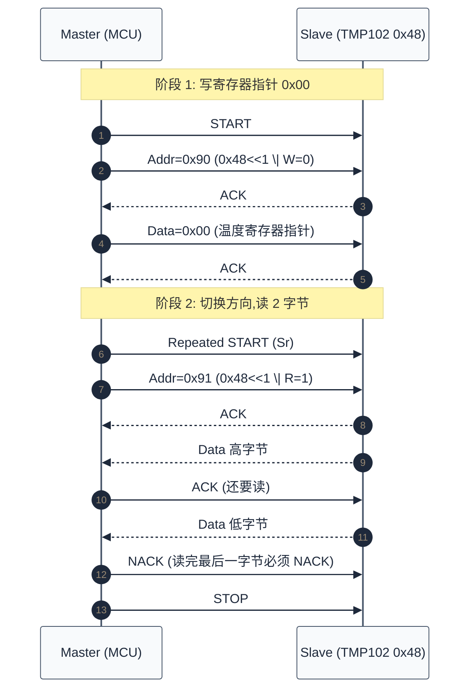
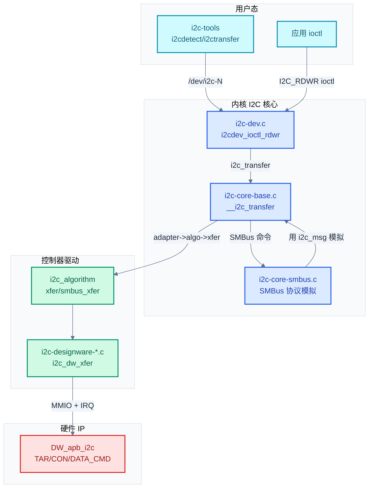
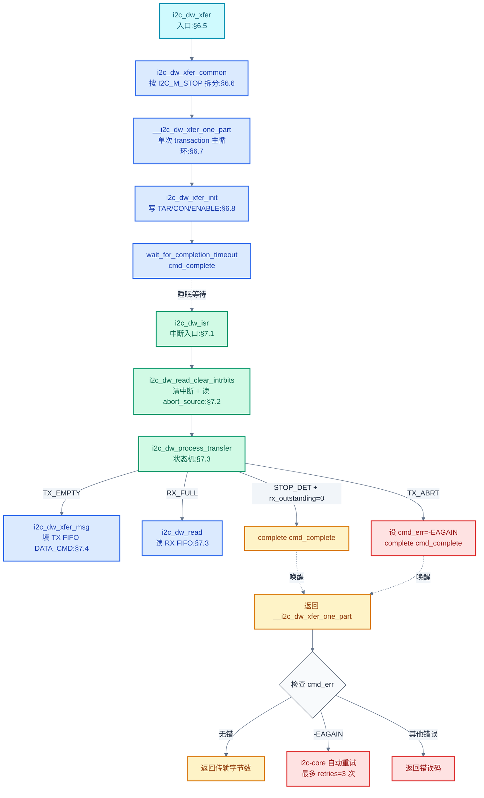
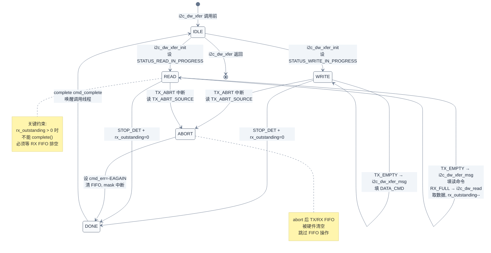
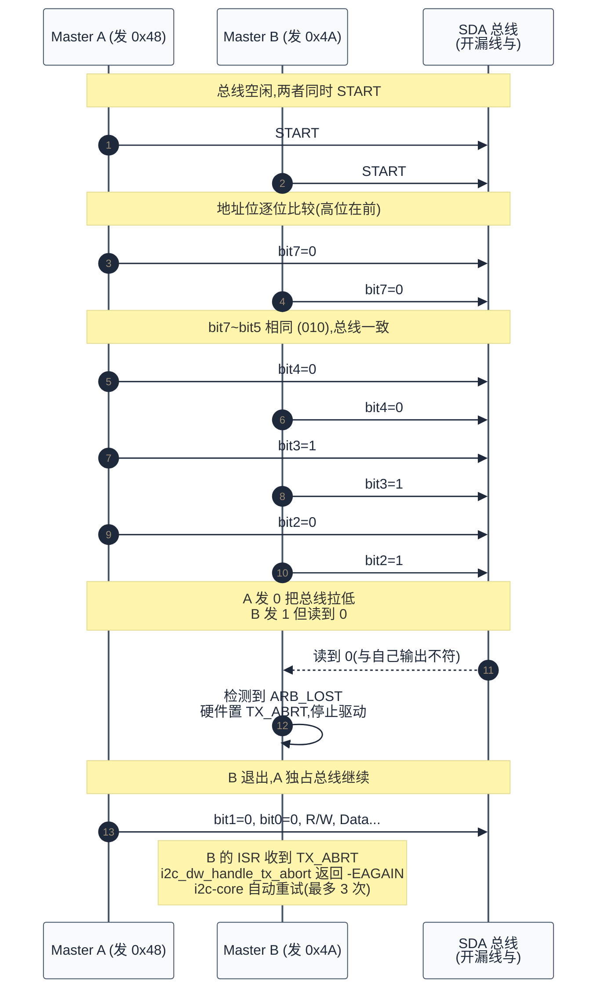

# I2C 协议与驱动深入分析

> 本篇从 I2C "两线开漏 + 地址寻址 + 线与仲裁" 的本质出发，逐层推进到电气计算、协议状态机、Linux/Zephyr 两套驱动框架的对照实现，以 Synopsys DesignWare APB I2C 为贯穿案例，深入到 SCL 时序 HCNT/LCNT 公式推导、`DATA_CMD` 命令位拼装、`TX_ABRT_SOURCE` 14 种 abort 解读、`rx_outstanding` 防溢出机制、从模式 `i2c_slave_event` 回调时序、总线恢复 SCL 脉冲法等工程细节。
> **工程师视角**：调 I2C 时九成问题不在协议本身，而在上拉电阻取值、地址错配（7-bit vs 8-bit）、时钟拉伸、SDA stuck。先把示波器上的 SCL/SDA 波形和上拉沿时间看懂，再去读驱动代码，会事半功倍。

### 关键术语

| 缩写 | 全称 | 含义 |
|------|------|------|
| I2C | Inter-Integrated Circuit | 集成电路间总线，两线开漏同步总线 |
| SCL | Serial Clock Line | 串行时钟线 |
| SDA | Serial Data Line | 串行数据线 |
| ACK | Acknowledge | 应答，第 9 时钟接收方拉低 SDA |
| NACK | Not Acknowledge | 非应答，接收方保持 SDA 高 |
| DW | DesignWare | Synopsys 公司的 IP 核系列 |
| APB | Advanced Peripheral Bus | ARM 高级外设总线 |
| HCNT | High Count | SCL 高电平计数值 |
| LCNT | Low Count | SCL 低电平计数值 |
| FIFO | First In First Out | 先进先出缓冲队列 |
| ISR | Interrupt Service Routine | 中断服务程序 |
| TAR | Target Address Register | 目标地址寄存器（DW I2C） |
| SAR | Slave Address Register | 自身从地址寄存器（DW I2C） |
| PEC | Packet Error Checking | SMBus 包错误校验 |
| SMBus | System Management Bus | 系统管理总线，I2C 子集 + 电源管理语义 |
| DTS | Device Tree Source | 设备树源文件 |
| UCSI | USB Controller System Interface | AMD GPU UCSI 寄存器 |
| PUNIT | Power Unit | Intel SoC 的电源管理单元 |

### 前置知识

| 需要了解 | 参考文档 |
|----------|----------|
| 五种通信协议的共性与定位 | [00-通信协议总览.md](./00-通信协议总览.md) |
| SPI 推挽电气与 CS 时序 | [01-SPI协议与驱动.md](./01-SPI协议与驱动.md) |
| Linux 驱动模型（probe、设备树） | [zephyr-rtos/13-设备驱动模型.md](../zephyr-rtos/13-设备驱动模型.md) |
| 设备树基础语法 | [zephyr-rtos/03-设备树详解.md](../zephyr-rtos/03-设备树详解.md) |

---

## 1. I2C 本质：地址寻址的开漏总线

### 1.1 系统上下文

I2C 子系统不是孤立模块——它向上对接用户态工具与设备驱动，向下耦合 SoC 内的 I2C 控制器 IP 与 PCB 上的从设备，左右关联中断子系统、runtime PM、设备树。理解它在系统中的位置，才能定位"为什么 `i2cdetect` 在 DW 控制器上不能用 Quick 模式""为什么 SCL 上拉电阻选错会导致多主仲裁失败"这类跨层问题。

**项目定位**：I2C 是 SoC 上**最常见的低速外设总线**——温度传感器、EEPROM、PMIC、触摸屏控制器、GPIO 扩展器几乎都挂 I2C。它的"两线开漏 + 地址寻址 + 应答"设计让一条总线能挂多个从设备，但电气特性（上拉电阻 + 总线电容）把速率限制在 100kHz~3.4MHz，远低于 SPI。它的边界在**低速、短距离、多从设备**场景，与 SPI（高速、点对点）、CAN（远距离、广播）形成互补。

**软硬件耦合点**：

| 耦合方向 | 接口 | 共同设计点 |
|----------|------|-----------|
| 应用 ↔ 内核 | `/dev/i2c-N` ioctl + `i2c-tools` | `I2C_RDWR` 传 `i2c_msg` 数组，支持写后读 |
| 内核 I2C 核心 ↔ 控制器驱动 | `i2c_algorithm->xfer` 回调 | 通用代码传 `i2c_msg`，平台代码翻译成寄存器操作 |
| 控制器驱动 ↔ DW IP | MMIO 寄存器（TAR/CON/DATA_CMD）+ IRQ | 寄存器字段语义、FIFO 深度、中断位映射 |
| DW IP ↔ 从设备 | SCL/SDA 电气（开漏 + 上拉 Rp） | 上升时间 $t_r$、总线电容 $C_b$、时钟拉伸 |
| I2C 子系统 ↔ 中断子系统 | `request_irq(dev->irq, i2c_dw_isr)` | 中断入口读 `RAW_INTR_STAT` 分发 |
| I2C 子系统 ↔ runtime PM | `pm_runtime_get_sync` / autosuspend | 1s 自动 suspend，PUNIT 共享时禁用 |

**跨实现对比**（详细对比见 [§9](#9-zephyr-i2c-框架对照)）：Linux 用 `i2c_adapter` + `i2c_algorithm` + `i2c_client` 三层抽象，控制器驱动只实现 `xfer` 回调，通用代码自动模拟 SMBus；Zephyr 用 `i2c_driver_api` + `device` 模型，更轻量，无 SMBus 模拟层，适合 MCU 级。

```mermaid
%%{init: {"theme": "base", "themeVariables": {"primaryColor": "#f8fafc", "primaryTextColor": "#1e293b", "primaryBorderColor": "#475569", "lineColor": "#64748b", "secondaryColor": "#f1f5f9", "secondaryBorderColor": "#94a3b8", "tertiaryColor": "#f8fafc", "fontFamily": "\"trebuchet ms\", verdana, arial, sans-serif"}}}%%
flowchart LR
    subgraph "用户态"
        APP[i2c-tools / 应用]
    end
    subgraph "I2C 子系统<br/>本文研究对象"
        DEV[i2c-dev.c<br/>/dev/i2c-N]
        CORE[i2c-core<br/>i2c_transfer]
        ALGO[i2c_algorithm<br/>xfer 回调]
    end
    subgraph "控制器驱动 + IP"
        DWDRV[i2c-designware<br/>驱动]
        DWIP[DW_apb_i2c IP<br/>TAR/CON/DATA_CMD]
    end
    subgraph "物理层 + 从设备"
        BUS[SCL/SDA<br/>开漏 + 上拉 Rp]
        SLAVE[TMP102 / EEPROM<br/>PMIC / 触摸屏]
    end
    APP -->|ioctl I2C_RDWR| DEV
    DEV --> CORE
    CORE -->|adapter->algo->xfer| ALGO
    ALGO --> DWDRV
    DWDRV -->|MMIO 寄存器 + IRQ| DWIP
    DWIP -->|开漏线与| BUS
    BUS --> SLAVE

classDef user fill:#cffafe, stroke:#0891b2, color:#155e75, stroke-width:2px;
classDef target fill:#dbeafe, stroke:#2563eb, color:#1e40af, stroke-width:2px;
classDef drv fill:#d1fae5, stroke:#059669, color:#065f46, stroke-width:2px;
classDef phys fill:#fee2e2, stroke:#dc2626, color:#991b1b, stroke-width:2px;
class APP user;
class DEV,CORE,ALGO target;
class DWDRV,DWIP drv;
class BUS,SLAVE phys;
```



> **如何读这张图**：本文研究对象（蓝色）是 I2C 子系统三层抽象；左青是用户态入口；右绿是控制器驱动 + DW IP（§5~§7 深入）；最右红是物理层与从设备（§2 电气）。三条关键链路：**ioctl → i2c_transfer → xfer** 是软件路径（§4 详述）；**DW 驱动 → DW IP 寄存器** 是驱动与硬件契约（§5 寄存器地图、§6 驱动深入）；**DW IP ↔ SCL/SDA ↔ 从设备** 是电气耦合点（§2 上拉计算、§8 多主仲裁）。

### 1.2 一个具体例子：读 TMP102 温度传感器

TMP102 是 TI 的数字温度传感器，I2C 接口，7 位地址 `0x48`。MCU 要读温度需两步：先写寄存器指针 `0x00`（温度寄存器），再读 2 字节数据。完整的总线时序如下：

```
       START                                          Sr(Repeated START)        STOP
        ↓                                                      ↓                ↓
SCL ‾‾‾‾‾\\___/‾\\___/‾\\___/‾\\___/‾\\___/‾\\___/‾\\___/‾\\___/‾\\___/‾‾\\___/‾\\___/‾\\___/‾\\___/‾\\___/‾\\___/‾\\___/‾‾
SDA ‾‾\\___X___X___X___X___X___X___X___X___/‾\\___X___X___X___X___X___/‾‾\\___X___X___X___X___X___X___X___X___/‾‾‾‾
         | A6 A5 A4 A3 A2 A1 A0 W|ACK| D7..D0      |ACK| A6..A0 R|ACK| D7..D0|ACK| D7..D0|NACK|
         |<--- 0x90 (写) -------->|   |<-- 0x00 --->|   |<-- 0x91 (读) -->|   |<-高字节->|   |<-低字节->|
```

逐字段解读：

- **START**：SCL 高电平时 SDA 由高变低，主设备宣告占用总线
- **地址字节**：`0x90` = `(0x48 << 1) | 0`，最低位 W=0 表示写
- **ACK**：第 9 个时钟，TMP102 拉低 SDA 表示"我在"
- **数据字节**：`0x00`（寄存器指针），主设备写
- **Repeated START（Sr）**：SCL 高时 SDA 再次拉低，**不发 STOP**，保证寄存器指针不被其他主设备抢占
- **地址字节**：`0x91` = `(0x48 << 1) | 1`，R=1 表示读
- **数据字节 1**：TMP102 输出温度高字节，主设备 ACK
- **数据字节 2**：TMP102 输出温度低字节，主设备 NACK（读完最后一字节必须 NACK）
- **STOP**：SCL 高时 SDA 由低变高，主设备释放总线

> **核心要点**：I2C 与 SPI 最大区别在于 "寻址" 与 "应答"。SPI 用 CS 引脚硬选片，无应答机制；I2C 把地址编进帧里，每字节后跟 1 位 ACK 让接收方反馈 "收到"。这一差异让 I2C 只用 2 根线就能挂多个从设备，但代价是每字节多 1 个时钟用于 ACK，带宽比 SPI 低。

上方的 ASCII 波形图展示的是电气层 SCL/SDA 的电平变化。从协议消息流的角度，同一次"写后读"可以用下面的时序图理解——它不展示电平，只展示主从双方的协议消息往来与方向切换：



> **如何读这张图**：第 1~5 步是"写"阶段，第 6~11 步是"读"阶段。关键是第 6 步 **Repeated START**——它不发 STOP 直接切换方向,保证寄存器指针 `0x00` 不被其他主设备抢占。第 10 步的 **NACK** 是"读够了"的信号,从设备看到 NACK 后释放 SDA,主设备才能发 STOP。如果最后一字节回 ACK,从设备会继续输出下一寄存器的数据,无法正常结束。

### 1.3 "两线开漏"如何支撑多主仲裁

I2C 的 SCL 和 SDA 都是 **开漏（open-drain）+ 上拉电阻**：输出端只有一个 NMOS，能主动拉低，恢复高电平靠上拉电阻充电。多个设备同时驱动时表现为 "线与"——只要有一个拉低，总线就是低；只有全部释放，总线才高。

线与逻辑带来两个关键能力：

1. **多主仲裁**：两个主设备同时发 START，谁先输出 0 而对方输出 1，谁就赢。输的一方在输出 1 时读到 0，立刻发现自己输了，退出仲裁。这种 "非破坏性仲裁" 不需要中央仲裁器。
2. **时钟同步**：多个主设备的 SCL 也是线与。慢的一方把 SCL 拉低，快的一方必须等。这就让所有主设备按最慢时钟对齐——也是 "时钟拉伸（clock stretching）" 的物理基础。

```
                Vcc
                 |
                Rp (上拉电阻, 典型 4.7kΩ @ 100kHz)
                 |
  +----+         +----+         +----+
  |主1 |---NMOS--|  SCL         |从1 |
  +----+         |              +----+
  +----+         |
  |主2 |---NMOS--+
  +----+
                 |
                GND (任一 NMOS 导通即拉低)
```

### 1.4 带宽演算：100kHz 读 2 字节温度要多久

I2C 100kHz 标准模式下，单字节传输 = 8 bit 数据 + 1 bit ACK = 9 个 SCL 周期。一次 TMP102 读温度的总 SCL 周期数为：

- START：1（隐式，半个周期）
- 地址字节 1（写）：9
- 寄存器指针字节：9
- Repeated START：1
- 地址字节 2（读）：9
- 数据字节 1：9
- 数据字节 2：9
- STOP：1

合计约 48 个 SCL 周期。100kHz 下 $T_{\text{SCL}} = 10\,\mu\text{s}$，总时间约 $480\,\mu\text{s}$。

对比 SPI 读同样 2 字节（先发 1 字节命令、再读 2 字节，共 3 字节 = 24 个 SCK 周期）：1MHz SCK 下仅 $24\,\mu\text{s}$。**I2C 比 SPI 慢 20 倍**，主因是：

- I2C 每字节多 1 个 ACK 周期（11% 开销）
- I2C 开漏上拉限制了 SCL 频率（详见 §2.2）
- I2C 地址字节占用了额外带宽

但 I2C 只用 2 根线，引脚成本低，且能多主仲裁——这是 "用速度换引脚、用复杂度换灵活性" 的工程权衡。

> **核心要点**：I2C 的开漏电气带来两大红利——多主仲裁与时钟同步，但同时限制了最高速率（典型 ≤ 1MHz Fast-mode Plus，3.4MHz High-speed 模式罕见）。读懂 I2C = 读懂 "开漏 + 线与" 的全部推论。

---

## 2. 电气与物理层

### 2.1 上拉电阻计算：从 $RC$ 时间常数到 Rp 取值

开漏总线靠上拉电阻 Rp 把 SDA/SCL 拉回高电平，充电时间常数 $\tau = R_p \cdot C_b$（$C_b$ = 总线电容）。SCL 上升沿必须满足：

$$
t_r = -R_p \cdot C_b \cdot \ln\left(1 - \frac{V_{\text{IH}}}{V_{\text{cc}}}\right)
$$

- $t_r$：上升时间，规范要求标准模式 ≤ 1000ns，快速模式 ≤ 300ns，Fast-mode Plus ≤ 120ns
- $V_{\text{IH}}$：高电平判定阈值（通常 $0.7 V_{\text{cc}}$）

代入 $V_{\text{IH}} = 0.7 V_{\text{cc}}$，得 $t_r \approx 1.2 R_p C_b$。给定 $C_b = 100\,\text{pF}$（典型 PCB），$t_r = 300\,\text{ns}$（快速模式上限）：

$$
R_p \le \frac{300\,\text{ns}}{1.2 \times 100\,\text{pF}} = 2.5\,\text{k}\Omega
$$

但 Rp 也不能太小——NMOS 拉低时电流 $I = V_{\text{cc}} / R_p$ 必须小于 NMOS 灌电流能力（典型 3mA）：

$$
R_p \ge \frac{V_{\text{cc}}}{I_{\max}} = \frac{3.3\,\text{V}}{3\,\text{mA}} = 1.1\,\text{k}\Omega
$$

| 模式 | 最高速率 | $t_r$ 上限 | 推荐 $R_p$（$C_b$=100pF） |
|------|----------|-----------|--------------------------|
| 标准模式 | 100 kHz | 1000 ns | 4.7 kΩ ~ 10 kΩ |
| 快速模式 | 400 kHz | 300 ns | 2.2 kΩ ~ 4.7 kΩ |
| Fast-mode Plus | 1 MHz | 120 ns | 1 kΩ ~ 2.2 kΩ |
| 高速模式 | 3.4 MHz | 40 ns | < 1 kΩ（须专用驱动） |

> **如何读这张表**：随着速率提升，$R_p$ 必须减小以缩短上升时间，但下限受 NMOS 灌电流能力约束。超过 1MHz 时 PCB 走线电容和器件输入电容成为瓶颈，必须用专用驱动 IC（如 PCA9509）放大信号。

### 2.2 推挽 vs 开漏：SPI 能跑 100MHz、I2C 普遍 400kHz 的根本原因

| 电气特性 | SPI（推挽） | I2C（开漏+上拉） |
|----------|-------------|-----------------|
| 主动拉高 | ✓（PMOS） | ✗（靠上拉 Rp） |
| 主动拉低 | ✓（NMOS） | ✓（NMOS） |
| 上升沿 | <1ns（@100MHz） | ~300ns（@400kHz） |
| 最大速率 | 100MHz+ | 3.4MHz（Hs，罕见）/ 1MHz（Fm+） |
| 多主能力 | ✗ | ✓（线与仲裁） |
| 引脚数 | 4+N | 2 |
| 边沿陡峭度 | 高（EMI 较大） | 低（EMI 较小） |

> **核心要点**：SPI 用推挽换速度、用引脚换带宽；I2C 用开漏换引脚、用线与换多主。两种电气没有绝对优劣，只看场景需要哪个特性。

### 2.3 START/STOP 的非法区与电平约束

I2C 协议规定：**SCL 高电平期间 SDA 的变化只能表示 START 或 STOP**。具体约束：

| SCL 电平 | SDA 跳变 | 含义 |
|----------|----------|------|
| 高 | 高 → 低 | START（含 Repeated START） |
| 高 | 低 → 高 | STOP |
| 低 | 任意 | 数据位切换（合法） |
| 高 | 保持不变 | 总线空闲/数据稳定 |

这意味着数据位必须在 SCL 低电平时切换，SCL 高电平时保持稳定以供采样。违反此规则的设备会被总线上其他设备误判为 START/STOP，导致协议状态机错乱。

### 2.4 总线电容与拓扑限制

I2C 总线电容 $C_b$ 上限：

- 标准模式：400 pF
- 快速模式：400 pF
- Fast-mode Plus：550 pF
- 高速模式：100 pF 或 400 pF（依设备数）

$C_b$ = 走线电容（约 1pF/cm）+ 所有设备输入电容（典型 5-10pF/设备）。当设备多、走线长时，$C_b$ 超限导致上升沿变缓，必须用以下方法扩展：

- **总线开关**（如 PCA9548A）：把一条 I2C 拆成多段，按需通断
- **电平转换 + 中继**（如 PCA9600）：双端推挽驱动，重整形
- **降低速率**：放弃 Fast-mode Plus，回退到 100kHz

---

## 3. 协议帧格式与状态机

### 3.1 七种基本帧元素

I2C 协议由 7 种基本元素组合：

| 元素 | SCL/SDA 行为 | 用途 |
|------|-------------|------|
| **START (S)** | SCL 高时 SDA 由高变低 | 主设备宣告占用总线 |
| **STOP (P)** | SCL 高时 SDA 由低变高 | 主设备释放总线 |
| **Repeated START (Sr)** | 不发 P 直接发 S | 切换方向或换地址，保持总线占用 |
| **ACK** | 第 9 时钟接收方拉低 SDA | "收到" 反馈 |
| **NACK** | 第 9 时钟接收方保持 SDA 高 | "未收到 / 读够了" 反馈 |
| **数据字节** | 8 bit，MSB first | 地址或数据 |
| **时钟拉伸** | 从设备在 ACK 后拉低 SCL | 从设备申请 "等一下" |

### 3.2 七种典型读写组合

```
1. 主写 1 字节：    S | Addr-W | ACK | Data    | ACK | P
2. 主写 N 字节：    S | Addr-W | ACK | D1..DN  | ACK | P
3. 主读 1 字节：    S | Addr-R | ACK | Data    | NACK| P
4. 主读 N 字节：    S | Addr-R | ACK | D1..DN-1| ACK | DN | NACK | P
5. 写后读（同设备）：S | Addr-W | ACK | Reg     | ACK | Sr | Addr-R | ACK | Data | NACK | P  ← 最常用
6. 写后读（跨设备）：S | Addr-W | ACK | Data    | ACK | P  | S | Addr-R | ACK | Data | NACK | P
7. 通用呼叫：       S | 0x00   | ACK | Data    | ACK | P  （广播给所有设备）
```

第 5 种 "写后读同设备" 是 I2C 寄存器访问的标配，由 Linux 的 `i2c_transfer` 一次提交两条 `i2c_msg`（一写一读）实现，中间用 Repeated START 衔接。

### 3.3 7-bit vs 8-bit 地址：最常见的坑

I2C 设备数据手册写的地址有 7-bit 和 8-bit 两种格式：

- **7-bit 地址**：`0x48`（TMP102 实际地址）
- **8-bit 地址**：`0x90`（写）/ `0x91`（读），即 `(0x48 << 1) | R/W`

Linux 设备树和 `i2c-tools`（`i2cdetect`）使用 **7-bit 地址**，驱动在底层自动左移一位并填 R/W 位。但有些芯片数据手册（尤其是某些国产传感器）只给 8-bit 地址，使用时需右移一位。

```c
// linux/drivers/i2c/i2c-core-base.c（节选）
// i2c_client.addr 字段存储 7-bit 地址
client->addr = info->addr;   // 直接存 7-bit
// 实际发送时由控制器驱动左移 1 位 + R/W
```

DW I2C 的 `DW_IC_TAR` 寄存器直接存 7-bit 地址，控制器硬件自动拼装 R/W 位（在 DATA_CMD 的 bit 8 区分读写命令）。这就是源码 `i2c_dw_xfer_init` 中 `regmap_write(dev->map, DW_IC_TAR, msgs[dev->msg_write_idx].addr | ic_tar)` 不做 `<< 1` 的原因。

### 3.4 10-bit 地址扩展

10-bit 地址格式：

```
S | 11110XX W | ACK | XXXXXXXX | ACK | ... | P
       ^^^^      ^^^^^^^^^^
       地址高2位    地址低8位
```

前导字节 `11110XX W` 中的 `XX` 是 10-bit 地址的最高 2 位。协议保证 7-bit 和 10-bit 设备能在同一总线共存——7-bit 地址空间前缀 `11110` 是保留的，不会被 7-bit 设备误识别。

DW I2C 的 10-bit 由 `DW_IC_CON_10BITADDR_MASTER`（master 端）和 `DW_IC_TAR_10BITADDR_MASTER`（TAR 寄存器 bit 12）共同控制，源码 `i2c_dw_xfer_init` 在判断 `I2C_M_TEN` flag 后设置两者。

### 3.5 时钟拉伸（Clock Stretching）

从设备在 ACK 后继续拉低 SCL，主设备必须等待。这是从设备申请 "处理时间" 的合法机制：

- 慢速从设备（如某些 EEPROM）写入后需要时间烧录，用拉伸等待
- 软件从设备（如 Linux `i2c-slave` 接口）中断处理慢时用拉伸

DW I2C 的从模式默认启用时钟拉伸——`DW_IC_CON_RX_FIFO_FULL_HLD_CTRL` 位置 1 时，RX FIFO 满会自动拉低 SCL 等待主设备读取。源码 `i2c_dw_configure_slave` 设置：

```c
// linux/drivers/i2c/busses/i2c-designware-slave.c:L186
dev->slave_cfg = DW_IC_CON_RX_FIFO_FULL_HLD_CTRL |
                 DW_IC_CON_RESTART_EN | DW_IC_CON_STOP_DET_IFADDRESSED;
```

> **核心要点**：I2C 协议的 7 种元素能组合出绝大多数场景。最容易踩的两个坑：7-bit/8-bit 地址混淆、忘记最后一字节 NACK。前者导致探测不到设备，后者导致从设备继续输出下一字节、主设备读到垃圾数据。

---

## 4. Linux I2C 子系统架构

> 上一章讲了 I2C 协议层的帧格式与状态机——但驱动工程师面对的不是 SCL/SDA 电平,而是 `i2c_transfer`、`i2c_client`、`i2c_algorithm` 这些抽象。本章讲 Linux 如何用四层抽象把"协议帧"和"控制器寄存器"解耦:核心数据结构(§4.1)、调用链(§4.2)、adapter 注册与 client 实例化(§4.3)。

Linux I2C 子系统用**四层抽象**把用户态、协议核心、控制器驱动、硬件 IP 串起来。下图展示了完整的分层关系与数据流向:



> **如何读这张图**:蓝色是内核 I2C 核心(通用代码,与平台无关);绿色是控制器驱动(平台相关,只实现 `xfer` 回调);红色是硬件 IP。关键设计:**SMBus 协议模拟**——如果控制器驱动没实现 `smbus_xfer`,i2c-core 会自动用 `xfer` + `i2c_msg` 组合模拟 SMBus 命令(如 Block Read),这让旧控制器驱动无需改代码就能支持 SMBus。`i2c_algorithm` 是核心层与驱动层的**唯一契约**,新增控制器只需实现这个结构体。

### 4.1 核心数据结构

Linux I2C 子系统由四层抽象构成，核心数据结构定义在 [include/linux/i2c.h](file:///home/pbw/2042f/linux/include/linux/i2c.h)：

```c
// include/linux/i2c.h:L544-L580
struct i2c_algorithm {
    union {
        int (*xfer)(struct i2c_adapter *adap, struct i2c_msg *msgs, int num);
        int (*master_xfer)(struct i2c_adapter *adap, struct i2c_msg *msgs, int num);
    };
    union {
        int (*xfer_atomic)(struct i2c_adapter *adap,
                           struct i2c_msg *msgs, int num);
        int (*master_xfer_atomic)(struct i2c_adapter *adap,
                                  struct i2c_msg *msgs, int num);
    };
    int (*smbus_xfer)(struct i2c_adapter *adap, u16 addr,
                      unsigned short flags, char read_write,
                      u8 command, int size, union i2c_smbus_data *data);
    u32 (*functionality)(struct i2c_adapter *adap);
#if IS_ENABLED(CONFIG_I2C_SLAVE)
    union { int (*reg_target)(struct i2c_client *client);
            int (*reg_slave)(struct i2c_client *client); };
    union { int (*unreg_target)(struct i2c_client *client);
            int (*unreg_slave)(struct i2c_client *client); };
#endif
};
```

逐字段解释：

- `xfer`：**核心入口**，提交 `i2c_msg` 数组，返回成功传输的消息数（< 0 表示错误）
- `xfer_atomic`：原子上下文版本（不可睡眠），用于 panic 路径
- `smbus_xfer`：SMBus 协议入口（如 SMBus Block Read）；为 NULL 时核心层用 `xfer` 模拟
- `functionality`：返回 adapter 支持的能力位（`I2C_FUNC_I2C`、`I2C_FUNC_10BIT_ADDR` 等）
- `reg_slave` / `unreg_slave`：从模式注册回调

```c
// include/uapi/linux/i2c.h:L74-L88
struct i2c_msg {
    __u16 addr;     // 7-bit 从地址（控制器驱动左移）
    __u16 flags;    // I2C_M_RD/I2C_M_TEN/I2C_M_RECV_LEN/I2C_M_STOP 等
    __u16 len;      // 缓冲区长度
    __u8 *buf;      // 数据缓冲区
};
```

`flags` 关键位：

| 标志 | 值 | 含义 |
|------|---|------|
| `I2C_M_RD` | 0x0001 | 读方向 |
| `I2C_M_TEN` | 0x0010 | 10-bit 地址 |
| `I2C_M_RECV_LEN` | 0x0400 | SMBus Block Read（首字节为长度） |
| `I2C_M_NOSTART` | 0x4000 | 不发 START（用于复用同一从设备连续传输） |
| `I2C_M_STOP` | 0x8000 | 该 msg 结束后发 STOP（强制分割 transaction） |

```c
// include/linux/i2c.h:L733-L768
struct i2c_adapter {
    struct module *owner;
    unsigned int class;
    const struct i2c_algorithm *algo;   // 算法回调集
    void *algo_data;
    const struct i2c_lock_operations *lock_ops;
    struct rt_mutex bus_lock;           // 总线互斥锁
    struct rt_mutex mux_lock;
    int timeout;                        // jiffies
    int retries;                        // 失败重试次数
    struct device dev;
    int nr;                             // 总线编号
    char name[48];
    struct i2c_bus_recovery_info *bus_recovery_info;  // 总线恢复
    const struct i2c_adapter_quirks *quirks;          // 平台怪癖
    struct dentry *debugfs;             // /sys/kernel/debug/i2c-adapter-N
    DECLARE_BITMAP(addrs_in_instantiation, 1 << 7);   // 7-bit 地址空间实例化位图
};
```

```c
// include/linux/i2c.h:L331-L356
struct i2c_client {
    unsigned short flags;       // I2C_CLIENT_TEN / I2C_CLIENT_PEC 等
    unsigned short addr;        // 7-bit 地址（注意：低 7 位）
    char name[I2C_NAME_SIZE];
    struct i2c_adapter *adapter;// 所属 adapter
    struct device dev;
    int irq;
    i2c_slave_cb_t slave_cb;    // 从模式回调（CONFIG_I2C_SLAVE）
    struct dentry *debugfs;
};
```

### 4.2 调用链：从用户态到硬件

```
用户态: i2ctransfer w1@0x48 0x00 r2
       ↓ ioctl(/dev/i2c-N, I2C_RDWR, &msg)
i2c-dev.c: i2cdev_ioctl_rdwr
       ↓ i2c_transfer(adapter, msgs, n)
i2c-core: __i2c_transfer
       ↓ adapter->algo->xfer(adapter, msgs, n)
DW 驱动: i2c_dw_xfer
       ↓ i2c_dw_xfer_common → __i2c_dw_xfer_one_part
       ↓ i2c_dw_xfer_init（写 TAR/CON/ENABLE）
       ↓ wait_for_completion_timeout(cmd_complete)
中断:  i2c_dw_isr → i2c_dw_isr_master → i2c_dw_process_transfer
       ↓ i2c_dw_xfer_msg（填 DATA_CMD）
       ↓ i2c_dw_read（读 DATA_CMD）
       ↓ complete(cmd_complete)
       ↑ 唤醒 __i2c_dw_xfer_one_part，返回
```

关键设计：

- `i2c_adapter.bus_lock` 保证同一总线上多个 client 串行访问
- `i2c_transfer` 是同步 API，内部 `wait_for_completion`；异步场景用 `i2c_transfer_async`（少见）
- 控制器驱动只实现 `xfer`，i2c-core 自动用 `i2c_msg` 模拟 SMBus 协议（如 `I2C_SMBUS_BLOCK_DATA`）

### 4.3 adapter 注册与 client 实例化

```c
// 控制器驱动 probe 末尾调用 i2c_add_numbered_adapter 注册 adapter
int i2c_dw_probe(struct dw_i2c_dev *dev) {
    ...
    adap->algo = &i2c_dw_algo;        // 算法回调
    adap->retries = 3;                // 默认重试 3 次
    adap->quirks = &i2c_dw_quirks;    // I2C_AQ_NO_ZERO_LEN
    return i2c_add_numbered_adapter(adap);
}

// i2c-core 扫描设备树 / ACPI / 板级信息，自动创建 i2c_client
// 设备树中:
//   &i2c1 { status = "okay"; };
//   &i2c1 { temp@48 { compatible = "ti,tmp102"; reg = <0x48>; }; };
// 解析 reg=<0x48> 创建 i2c_client，addr=0x48，绑定到 ti,tmp102 驱动
```

`I2C_AQ_NO_ZERO_LEN` quirk 表示 DW I2C 不支持 0 长度传输（`i2c_smbus_xfer` 的 Quick 命令必须用 `xfer` 模拟成 0 长度 msg，DW 不支持）。这就是 `i2cdetect` 在 DW 控制器上无法用 Quick 模式的原因，必须改用 read-byte 模式。

---

## 5. DesignWare I2C 控制器寄存器地图

### 5.1 寄存器全图

DW I2C 寄存器空间共 30+ 个，定义在 [i2c-designware-core.h](file:///home/pbw/2042f/linux/drivers/i2c/busses/i2c-designware-core.h)：

| 偏移 | 名称 | 作用 |
|------|------|------|
| 0x00 | `DW_IC_CON` | 控制寄存器（master/slave、speed、restart enable） |
| 0x04 | `DW_IC_TAR` | 目标地址（master 模式） |
| 0x08 | `DW_IC_SAR` | 自身从地址（slave 模式） |
| 0x0c | (reserved) | — |
| 0x10 | `DW_IC_DATA_CMD` | 数据/命令 FIFO（读此寄存器=取数据，写此寄存器=发命令+数据） |
| 0x14 | `DW_IC_SS_SCL_HCNT` | 标准模式 SCL 高电平计数 |
| 0x18 | `DW_IC_SS_SCL_LCNT` | 标准模式 SCL 低电平计数 |
| 0x1c | `DW_IC_FS_SCL_HCNT` | 快速模式 SCL 高电平计数 |
| 0x20 | `DW_IC_FS_SCL_LCNT` | 快速模式 SCL 低电平计数 |
| 0x24 | `DW_IC_HS_SCL_HCNT` | 高速模式 SCL 高电平计数 |
| 0x28 | `DW_IC_HS_SCL_LCNT` | 高速模式 SCL 低电平计数 |
| 0x2c | `DW_IC_INTR_STAT` | 中断状态（只读，已使能的中断才置位） |
| 0x30 | `DW_IC_INTR_MASK` | 中断使能掩码 |
| 0x34 | `DW_IC_RAW_INTR_STAT` | 原始中断状态（未掩码，用于调试） |
| 0x38 | `DW_IC_RX_TL` | RX FIFO 触发阈值 |
| 0x3c | `DW_IC_TX_TL` | TX FIFO 触发阈值 |
| 0x40 | `DW_IC_CLR_INTR` | 读此寄存器清除所有中断 + 返回合并状态 |
| 0x44-0x68 | `DW_IC_CLR_*` | 各中断的独立清除寄存器（读即清） |
| 0x6c | `DW_IC_ENABLE` | 使能控制（bit0=enable, bit1=abort） |
| 0x70 | `DW_IC_STATUS` | 状态（activity/TFE/RFNE/master_activity/...） |
| 0x74 | `DW_IC_TXFLR` | TX FIFO 当前深度 |
| 0x78 | `DW_IC_RXFLR` | RX FIFO 当前深度 |
| 0x7c | `DW_IC_SDA_HOLD` | SDA 保持时间（TX+RX 各 16 位） |
| 0x80 | `DW_IC_TX_ABRT_SOURCE` | abort 原因位图（保留读取后清） |
| 0x9c | `DW_IC_ENABLE_STATUS` | 使能状态（bit0=IC_EN） |
| 0xa8 | `DW_IC_CLR_RESTART_DET` | restart 检测清除 |
| 0xcc | `DW_IC_SMBUS_INTR_MASK` | SMBus 中断掩码（屏蔽 broken firmware） |
| 0xf4 | `DW_IC_COMP_PARAM_1` | 硬件参数（FIFO 深度、speed 支持等） |
| 0xf8 | `DW_IC_COMP_VERSION` | IP 版本号 |
| 0xfc | `DW_IC_COMP_TYPE` | 固定值 `0x44570140`（"DW" + 0x0140），用于识别 IP |

### 5.2 CON 寄存器位定义

```c
// i2c-designware-core.h:L28-L40
#define DW_IC_CON_MASTER                BIT(0)   // 1=master 模式
#define DW_IC_CON_SPEED_STD             (1 << 1) // 标准模式 100kHz
#define DW_IC_CON_SPEED_FAST            (2 << 1) // 快速模式 400kHz/1MHz
#define DW_IC_CON_SPEED_HIGH            (3 << 1) // 高速模式 3.4MHz
#define DW_IC_CON_SPEED_MASK            GENMASK(2, 1)
#define DW_IC_CON_10BITADDR_SLAVE       BIT(3)   // 从模式 10-bit 地址
#define DW_IC_CON_10BITADDR_MASTER      BIT(4)   // 主模式 10-bit 地址
#define DW_IC_CON_RESTART_EN            BIT(5)   // 支持 Repeated START
#define DW_IC_CON_SLAVE_DISABLE         BIT(6)   // 禁用从模式（master 必置 1）
#define DW_IC_CON_STOP_DET_IFADDRESSED  BIT(7)   // 仅当被寻址才产生 STOP_DET
#define DW_IC_CON_TX_EMPTY_CTRL         BIT(8)   // TX_EMPTY 中断可控
#define DW_IC_CON_RX_FIFO_FULL_HLD_CTRL BIT(9)   // RX FIFO 满时拉伸 SCL
#define DW_IC_CON_BUS_CLEAR_CTRL        BIT(11)  // 总线清除功能
```

### 5.3 DATA_CMD 寄存器：命令+数据合二为一

`DW_IC_DATA_CMD`（0x10）是 DW I2C 最有特色的寄存器——**TX FIFO 既是数据队列也是命令队列**。写入此寄存器的 32 位值中：

| Bit | 名称 | 含义 |
|-----|------|------|
| 7:0 | DAT | 8-bit 数据（写时） |
| 8 | CMD | **1=读命令**（硬件会主动读 1 字节），0=写命令 |
| 9 | STOP | 该字节后发 STOP |
| 10 | RESTART | 该字节前发 Repeated START |
| 11 | FIRST_DATA_BYTE | （从模式）首字节标志 |

读模式时，主设备把 `CMD=1` 写入 TX FIFO，硬件自动发起读操作，结果放入 RX FIFO；CPU 读 `DATA_CMD` 寄存器时取走 RX FIFO 顶字节。

源码 [i2c-designware-master.c:L442-L449](file:///home/pbw/2042f/linux/drivers/i2c/busses/i2c-designware-master.c#L442-L449) 体现了这一拼装：

```c
// 读命令：写 0x100（CMD=1, DAT=0, STOP/RESTART 由 cmd 决定）
if (msgs[dev->msg_write_idx].flags & I2C_M_RD) {
    if (dev->rx_outstanding >= dev->rx_fifo_depth)
        break;  // 防 RX FIFO 溢出
    regmap_write(dev->map, DW_IC_DATA_CMD, cmd | 0x100);
    rx_limit--;
    dev->rx_outstanding++;
} else {
    // 写命令：cmd | *buf++（DAT=数据字节）
    regmap_write(dev->map, DW_IC_DATA_CMD, cmd | *buf++);
}
```

> **核心要点**：DW I2C 把 "读命令" 也当成 TX FIFO 的一个 entry——读 1 字节 = 往 TX FIFO 写 `0x100`，硬件自动完成 SDA 时序并把数据放进 RX FIFO。这种设计让 "读 N 字节" 和 "写 N 字节" 共用同一套 FIFO 填充逻辑，但代价是读操作时 TX FIFO 既是命令队列又是数据队列，必须用 `rx_outstanding` 跟踪已发读命令数防止 RX FIFO 溢出。

### 5.4 中断位定义

```c
// i2c-designware-core.h:L102-L124
#define DW_IC_INTR_RX_UNDER      BIT(0)   // RX FIFO 空时读
#define DW_IC_INTR_RX_OVER       BIT(1)   // RX FIFO 溢出
#define DW_IC_INTR_RX_FULL       BIT(2)   // RX FIFO 达到阈值
#define DW_IC_INTR_TX_OVER       BIT(3)   // TX FIFO 溢出
#define DW_IC_INTR_TX_EMPTY      BIT(4)   // TX FIFO 低于阈值
#define DW_IC_INTR_RD_REQ        BIT(5)   // 从模式：主设备要读
#define DW_IC_INTR_TX_ABRT       BIT(6)   // 传输 abort（NACK/仲裁失败等）
#define DW_IC_INTR_RX_DONE       BIT(7)   // 从模式读完成
#define DW_IC_INTR_ACTIVITY      BIT(8)   // 总线活动
#define DW_IC_INTR_STOP_DET      BIT(9)   // 检测到 STOP
#define DW_IC_INTR_START_DET     BIT(10)  // 检测到 START
#define DW_IC_INTR_GEN_CALL      BIT(11)  // 通用呼叫地址
#define DW_IC_INTR_RESTART_DET   BIT(12)  // 检测到 Repeated START
#define DW_IC_INTR_MST_ON_HOLD   BIT(13)  // master 等待总线（被从设备占用）

// 默认掩码（master 模式）
#define DW_IC_INTR_DEFAULT_MASK  (RX_FULL | TX_ABRT | STOP_DET)
#define DW_IC_INTR_MASTER_MASK   (DEFAULT | TX_EMPTY)
// 从模式多使能 RX_UNDER 和 RD_REQ
#define DW_IC_INTR_SLAVE_MASK    (DEFAULT | RX_UNDER | RD_REQ)
```

> **如何读这组定义**：master 模式只需关心 4 个中断——`TX_EMPTY`（催促填 TX FIFO）、`RX_FULL`（取 RX FIFO 数据）、`TX_ABRT`（出错 abort）、`STOP_DET`（传输结束）。其他中断都是调试或从模式专用。`MST_ON_HOLD` 是较新 IP 才有的，表示 master 想发但总线被从设备时钟拉伸占用。

### 5.5 STATUS 寄存器

```c
// i2c-designware-core.h:L129-L134
#define DW_IC_STATUS_ACTIVITY                   BIT(0)  // 总线活动
#define DW_IC_STATUS_TFE                        BIT(2)  // TX FIFO 完全空
#define DW_IC_STATUS_RFNE                       BIT(3)  // RX FIFO 非空
#define DW_IC_STATUS_MASTER_ACTIVITY            BIT(5)  // master 正在传输
#define DW_IC_STATUS_SLAVE_ACTIVITY             BIT(6)  // slave 正在被寻址
#define DW_IC_STATUS_MASTER_HOLD_TX_FIFO_EMPTY  BIT(7)  // master 在等 TX FIFO
```

### 5.6 TX_ABRT_SOURCE：14 种 abort 原因

```c
// i2c-designware-core.h:L166-L194
ABRT_7B_ADDR_NOACK       // 7-bit 地址无应答（最常见，设备没接/地址错）
ABRT_10ADDR1_NOACK       // 10-bit 地址第一字节无应答
ABRT_10ADDR2_NOACK       // 10-bit 地址第二字节无应答
ABRT_TXDATA_NOACK        // 数据字节无应答（从设备拒绝某字节）
ABRT_GCALL_NOACK         // 通用呼叫无应答
ABRT_GCALL_READ          // 通用呼叫后试图读（协议非法）
ABRT_SBYTE_ACKDET        // 试图发 START 字节但被 ACK（异常）
ABRT_SBYTE_NORSTRT       // 禁用 restart 时试图发 START 字节
ABRT_10B_RD_NORSTRT      // 禁用 restart 时 10-bit 读
ABRT_MASTER_DIS          // master 模式未使能
ARB_LOST                 // 仲裁失败（多主冲突）
ABRT_SLAVE_FLUSH_TXFIFO  // 从模式：读命令清空 TX FIFO
ABRT_SLAVE_ARBLOST       // 从模式：丢失仲裁
ABRT_SLAVE_RD_INTX       // 从模式：内部读（罕见）
```

源码 [i2c-designware-common.c:L42-L71](file:///home/pbw/2042f/linux/drivers/i2c/busses/i2c-designware-common.c#L42-L71) 给出每个 abort 的字符串描述，被 `i2c_dw_handle_tx_abort` 用来打印调试信息：

```c
// i2c-designware-common.c:L764-L785
int i2c_dw_handle_tx_abort(struct dw_i2c_dev *dev) {
    unsigned long abort_source = dev->abort_source;
    int i;

    // NACK 类（地址/数据无应答）→ -EREMOTEIO（设备不在线）
    if (abort_source & DW_IC_TX_ABRT_NOACK) {
        for_each_set_bit(i, &abort_source, ARRAY_SIZE(abort_sources))
            dev_dbg(dev->dev, "%s: %s\n", __func__, abort_sources[i]);
        return -EREMOTEIO;
    }
    // 其他错误打印 err 级别日志
    for_each_set_bit(i, &abort_source, ARRAY_SIZE(abort_sources))
        dev_err(dev->dev, "%s: %s\n", __func__, abort_sources[i]);

    if (abort_source & DW_IC_TX_ARB_LOST)
        return -EAGAIN;       // 仲裁失败，可重试
    if (abort_source & DW_IC_TX_ABRT_GCALL_READ)
        return -EINVAL;       // 协议错（驱动 bug）
    return -EIO;              // 其他 IO 错误
}
```

> **核心要点**：`TX_ABRT_SOURCE` 是 I2C 调试的金矿。`ABRT_7B_ADDR_NOACK` 占 90% 以上的故障，对应 "设备没接/地址错/上拉太弱"。`ARB_LOST` 罕见但出现即说明系统设计有多主冲突。`ABRT_TXDATA_NOACK` 通常意味着从设备状态机异常（如未初始化完成就被访问）。

---

## 6. DesignWare I2C 驱动深入

> 上一章讲了 DW I2C 的寄存器地图——但寄存器是静态的,驱动是动态的。本章把"寄存器读写"串成"一次 `i2c_transfer` 的完整生命周期":从入口 `i2c_dw_xfer`(§6.5)到 transaction 启动 `i2c_dw_xfer_init`(§6.8),再到中断处理 `i2c_dw_isr`(§7)与 `complete()` 唤醒。理解这条链路,才能定位"为什么传输卡住""为什么 abort 后 `-EAGAIN` 重试"等问题。

一次完整的 master 写后读 transaction,数据流和控制流如下:



> **如何读这张图**:蓝色是调用线程(发起 `i2c_transfer` 的进程)的同步路径,它会在 `wait_for_completion_timeout` 处睡眠;绿色是中断线程(硬中断上下文)的异步路径,ISR 处理完所有事件后调 `complete()` 唤醒调用线程。两条线在 `complete` 处汇合。关键设计:**驱动用 `cmd_err` 字段跨线程传递错误**——ISR 检测到 `TX_ABRT` 后设 `cmd_err=-EAGAIN`,调用线程被唤醒后检查 `cmd_err` 决定返回值。这种"ISR 设状态 + 调用线程检查"的模式是 I2C/SPI 等总线驱动的通用范式(详见 §7 状态机)。

### 6.1 驱动文件结构

DW I2C 驱动分布在 5 个文件：

| 文件 | 行数 | 职责 |
|------|------|------|
| `i2c-designware-core.h` | 430 | 寄存器定义、`struct dw_i2c_dev`、共用内联函数 |
| `i2c-designware-common.c` | 1031 | SCL 时序计算、abort 处理、disable、probe 通用部分、PM ops |
| `i2c-designware-master.c` | 1044 | master 模式 xfer、中断处理、recovery 初始化 |
| `i2c-designware-slave.c` | 194 | slave 模式注册与中断处理 |
| `i2c-designware-platdrv.c` | 318 | platform driver 入口、probe/remove、ACPI/DT 解析 |

### 6.2 platform driver probe 完整流程

[i2c-designware-platdrv.c:L133](file:///home/pbw/2042f/linux/drivers/i2c/busses/i2c-designware-platdrv.c#L133) 的 `dw_i2c_plat_probe` 流程：

1. **解析 IRQ 与 flags**

   ```c
   irq = platform_get_irq_optional(pdev, 0);
   if (irq == -ENXIO)
       flags |= ACCESS_POLLING;   // 无 IRQ，走 polling 模式
   ```

   `ACCESS_POLLING` 标志让驱动不注册 IRQ，改在 `i2c_dw_wait_transfer` 中轮询 `RAW_INTR_STAT`。

2. **请求寄存器资源**

   ```c
   dev->base = devm_platform_ioremap_resource(pdev, 0);
   ```

   `intel,xe-i2c` 和 `wx,i2c-snps-model` 走 parent regmap（MFD 子设备）。

3. **解析固件参数**（`i2c_dw_fw_parse_and_configure`）

   - `clock-frequency`：总线速率
   - `snps,bus-capacitance-pf`：总线电容（影响高速模式 tHIGH/tLOW）
   - `snps,clk-freq-optimized`：硬件优化时钟
   - `i2c-scl-falling-time-ns` / `i2c-sda-falling-time-ns`：下降时间（默认 300ns）
   - `i2c-sda-hold-time-ns`：SDA 保持时间

   校验速率必须 ∈ {100k, 400k, 1M, 3.4M}。

4. **探测锁支持**（`i2c_dw_probe_lock_support`）

   Intel Bay Trail 和 AMD PSP 平台 I2C 总线与 PUNIT 共享，需要专用 semaphore 才能访问。`i2c_dw_semaphore_cb_table` 数组按平台遍历。

5. **配置 master 模式**（`i2c_dw_configure_master`）

   ```c
   dev->master_cfg = DW_IC_CON_MASTER | DW_IC_CON_SLAVE_DISABLE |
                     DW_IC_CON_RESTART_EN;
   switch (t->bus_freq_hz) {
       case 100000: dev->master_cfg |= DW_IC_CON_SPEED_STD; break;
       case 3400000: dev->master_cfg |= DW_IC_CON_SPEED_HIGH; break;
       default: dev->master_cfg |= DW_IC_CON_SPEED_FAST;
   }
   ```

6. **获取时钟**

   ```c
   dev->pclk = devm_clk_get_optional(device, "pclk");  // 接口时钟
   dev->clk  = devm_clk_get_optional(device, NULL);    // 功能时钟
   dev->get_clk_rate_khz = i2c_dw_get_clk_rate_khz;    // clk_get_rate / 1000
   ```

   SDA hold time 按时钟换算：`dev->sda_hold_time = DIV_S64_ROUND_CLOSEST(clk_khz * sda_hold_ns, MICRO)`

7. **Runtime PM 初始化**

   ```c
   pm_runtime_set_autosuspend_delay(device, 1000);  // 1 秒自动 suspend
   pm_runtime_use_autosuspend(device);
   pm_runtime_set_active(device);
   if (dev->shared_with_punit)
       pm_runtime_get_noresume(device);   // PUNIT 共享，禁止 suspend
   pm_runtime_enable(device);
   ```

8. **调用 `i2c_dw_probe`** 完成硬件初始化和 adapter 注册

### 6.3 i2c_dw_probe：硬件初始化与 adapter 注册

[i2c-designware-common.c:L879](file:///home/pbw/2042f/linux/drivers/i2c/busses/i2c-designware-common.c#L879)：

1. **初始化 regmap**（`i2c_dw_init_regmap`）

   读 `DW_IC_COMP_TYPE`，按值判断字节序：

   ```c
   reg = readl(dev->base + DW_IC_COMP_TYPE);
   if (reg == swab32(DW_IC_COMP_TYPE_VALUE)) {
       // 大端系统，用 swab 回调
       map_cfg.reg_read = dw_reg_read_swab;
       map_cfg.reg_write = dw_reg_write_swab;
   } else if (reg == lower_16_bits(DW_IC_COMP_TYPE_VALUE)) {
       // 16-bit 总线（如某些 Microsemi SoC），分两次读
       map_cfg.reg_read = dw_reg_read_word;
       map_cfg.reg_write = dw_reg_write_word;
   } else if (reg != DW_IC_COMP_TYPE_VALUE) {
       dev_err("Unknown Synopsys component type: 0x%08x\n", reg);
       return -ENODEV;
   }
   ```

   `COMP_TYPE` 固定值 `0x44570140` = "DW" + 0x0140，是识别 DW I2C IP 的 magic number。

2. **设置 SDA hold**（`i2c_dw_set_sda_hold`）

   ```c
   if (reg >= DW_IC_SDA_HOLD_MIN_VERS) {  // v1.11* 及以上
       if (!dev->sda_hold_time) {
           // 未配置则保留硬件默认
           regmap_read(dev->map, DW_IC_SDA_HOLD, &dev->sda_hold_time);
       }
       // 强制 RX hold 至少 1，避免 SDA 太快变化导致仲裁失败
       if (!(dev->sda_hold_time & DW_IC_SDA_HOLD_RX_MASK))
           dev->sda_hold_time |= 1 << DW_IC_SDA_HOLD_RX_SHIFT;
   }
   ```

   **为什么 RX hold 至少 1**？源码注释：从设备 SCL 下降沿后过快拉低 SDA 会引起主设备误判仲裁失败。设 RX hold 让 SDA 延迟 1 个 ic_clk 周期再响应。

3. **探测 FIFO 深度**（`i2c_dw_set_fifo_size`）

   ```c
   regmap_read(dev->map, DW_IC_COMP_PARAM_1, &param);
   tx_fifo_depth = FIELD_GET(DW_IC_FIFO_TX_FIELD, param) + 1;  // bits 23:16
   rx_fifo_depth = FIELD_GET(DW_IC_FIFO_RX_FIELD, param) + 1;  // bits 15:8
   ```

   `COMP_PARAM_1` 是硬件烧录的配置寄存器，FIFO 深度范围 2~256。某些厂商 IP（如 Wangxun TXGBE）`COMP_PARAM_1` 不实现，硬编码为 `TXGBE_TX_FIFO_DEPTH=4`、`TXGBE_RX_FIFO_DEPTH=1`。

4. **计算 SCL 时序**（`i2c_dw_set_timings_master`，详见 §6.4）

5. **初始化总线恢复**（`i2c_dw_init_recovery_info`）

   解析设备树 `scl-gpios` 和 `sda-gpios`，注册 `i2c_bus_recovery_info`：

   ```c
   rinfo->scl_gpiod = devm_gpiod_get_optional(dev->dev, "scl", GPIOD_OUT_HIGH);
   rinfo->sda_gpiod = devm_gpiod_get_optional(dev->dev, "sda", GPIOD_IN);
   rinfo->recover_bus = i2c_generic_scl_recovery;  // 通用 SCL 脉冲法
   rinfo->prepare_recovery = i2c_dw_prepare_recovery;
   rinfo->unprepare_recovery = i2c_dw_unprepare_recovery;
   ```

6. **硬件初始化**（`i2c_dw_init`）

   ```c
   __i2c_dw_disable(dev);
   regmap_write(dev->map, DW_IC_SMBUS_INTR_MASK, 0);  // 屏蔽 SMBus 中断
   i2c_dw_write_timings(dev);   // 写 HCNT/LCNT
   if (dev->sda_hold_time)
       regmap_write(dev->map, DW_IC_SDA_HOLD, dev->sda_hold_time);
   i2c_dw_configure_mode(dev, dev->mode);
   ```

7. **注册 IRQ**

   ```c
   if (dev->mode == DW_IC_SLAVE)
       irq_flags = IRQF_SHARED;
   else if (dev->flags & ACCESS_NO_IRQ_SUSPEND)
       irq_flags = IRQF_NO_SUSPEND;
   else
       irq_flags = IRQF_SHARED | IRQF_COND_SUSPEND;
   if (!dev->emptyfifo_hold_master)
       irq_flags |= IRQF_NO_THREAD;   // PREEMPT_RT 必需
   devm_request_irq(dev->dev, dev->irq, i2c_dw_isr, irq_flags, ...);
   ```

   **`IRQF_NO_THREAD` 的关键作用**：当 `emptyfifo_hold_master=false`（如 Mobileye EyeQ6L+），TX FIFO 空时硬件会自动发 STOP，IRQ handler 必须原子填 FIFO，所以禁止线程化。

8. **注册 adapter**

   ```c
   adap->algo = &i2c_dw_algo;
   adap->quirks = &i2c_dw_quirks;   // I2C_AQ_NO_ZERO_LEN
   i2c_add_numbered_adapter(adap);
   ```

### 6.4 SCL 时序计算：HCNT/LCNT 公式推导

[i2c-designware-common.c:L527-L568](file:///home/pbw/2042f/linux/drivers/i2c/busses/i2c-designware-common.c#L527-L568) 的核心公式：

```c
// SCL 高电平计数（满足 tHD;STA 与 tHIGH 中较大者）
u32 i2c_dw_scl_hcnt(struct dw_i2c_dev *dev, unsigned int reg, u32 ic_clk,
                    u32 tSYMBOL, u32 tf, int offset)
{
    return DIV_ROUND_CLOSEST_ULL((u64)ic_clk * (tSYMBOL + tf), MICRO) - 3 + offset;
}

// SCL 低电平计数（满足 tLOW + tf）
u32 i2c_dw_scl_lcnt(struct dw_i2c_dev *dev, unsigned int reg, u32 ic_clk,
                    u32 tLOW, u32 tf, int offset)
{
    return DIV_ROUND_CLOSEST_ULL((u64)ic_clk * (tLOW + tf), MICRO) - 1 + offset;
}
```

逐符号解释：

- `ic_clk`：输入时钟频率，单位 kHz（来自 `clk_get_rate` / 1000）
- `tSYMBOL`：SCL 高电平目标时间，单位 ns（标准模式 4000ns，快速模式 600ns）
- `tLOW`：SCL 低电平目标时间，单位 ns（标准模式 4700ns，快速模式 1300ns）
- `tf`：下降时间，默认 300ns（来自设备树 `i2c-scl-falling-time-ns`）
- `MICRO`：常数 $10^6$，把 kHz·ns 换算成无单位比值
- `-3` / `-1`：硬件内部延迟补偿（HCNT 寄存器值 +3 才是实际 SCL 高电平周期，LCNT +1）
- `offset`：平台特定偏移（一般 0）

**为什么 HCNT 减 3、LCNT 减 1**？源码注释：

```
HCNT + 3 >= ic_clk * (tHD;STA + tf)
LCNT + 1 >= ic_clk * (tLOW + tf)
```

硬件计数器从 HCNT 值开始递减，但有 3 个 ic_clk 周期的内部延迟（用于检测 SCL 实际电平、同步等），所以实际高电平时间 ≈ `(HCNT + 3) / ic_clk`。LCNT 类似，延迟 1 个周期。

#### 数值演算：100kHz 标准模式 @ ic_clk = 100MHz

代入参数：`ic_clk = 100000`（kHz）, `tSYMBOL = 4000`ns, `tLOW = 4700`ns, `tf = 300`ns。

```
HCNT = round(100000 * (4000 + 300) / 1e6) - 3
     = round(430) - 3
     = 427

LCNT = round(100000 * (4700 + 300) / 1e6) - 1
     = round(500) - 1
     = 499
```

实际 SCL 高电平时间 ≈ `(427 + 3) / 100000 = 4.3 µs`，低电平 ≈ `500 / 100000 = 5.0 µs`，总周期 9.3 µs（约 107.5 kHz）。略低于 100kHz 是正常的——公式保守确保满足 tHD;STA 与 tLOW 下限。

#### 数值演算：400kHz 快速模式 @ ic_clk = 100MHz

参数：`tSYMBOL = 600`ns, `tLOW = 1300`ns, `tf = 300`ns。

```
HCNT = round(100000 * 900 / 1e6) - 3 = 90 - 3 = 87
LCNT = round(100000 * 1600 / 1e6) - 1 = 160 - 1 = 159
```

总周期 ≈ `(87 + 3 + 160) / 100000 = 2.5 µs` → 400 kHz。符合预期。

#### 高速模式：依总线电容分支

```c
// i2c-designware-master.c:L154-L162
if (dev->bus_capacitance_pF >= 400) {
    t_high = dev->clk_freq_optimized ? 160 : 120;
    t_low = 320;
} else {
    t_high = 60;
    t_low = dev->clk_freq_optimized ? 120 : 160;
}
```

高速模式规范依总线电容分两档：

| 总线电容 | tHIGH (ns) | tLOW (ns) |
|----------|-----------|-----------|
| 100 pF | 60 | 160 |
| 400 pF | 120 | 320 |

设备树 `snps,bus-capacitance-pf` 默认 100。`snps,clk-freq-optimized` 让 tHIGH/tLOW 进一步缩短（硬件优化路径）。

### 6.5 i2c_dw_xfer：入口分发

[i2c-designware-master.c:L914](file:///home/pbw/2042f/linux/drivers/i2c/busses/i2c-designware-master.c#L914)：

```c
int i2c_dw_xfer(struct i2c_adapter *adap, struct i2c_msg *msgs, int num)
{
    struct dw_i2c_dev *dev = i2c_get_adapdata(adap);

    // AMD NAVI GPU 特殊路径（UCSI 接口）
    if ((dev->flags & MODEL_MASK) == MODEL_AMD_NAVI_GPU)
        return amd_i2c_dw_xfer_quirk(dev, msgs, num);

    return i2c_dw_xfer_common(dev, msgs, num);
}
```

AMD NAVI GPU 有硬件 bug，不能用正常中断驱动流程，需要 polling 模式 + 写命令两次的 quirk（`amd_i2c_dw_xfer_quirk`）。

### 6.6 i2c_dw_xfer_common：按 I2C_M_STOP 拆分

[i2c-designware-master.c:L858](file:///home/pbw/2042f/linux/drivers/i2c/busses/i2c-designware-master.c#L858)：

```c
static int i2c_dw_xfer_common(struct dw_i2c_dev *dev, struct i2c_msg msgs[], int num)
{
    struct i2c_msg *msgs_part;
    size_t cnt;
    int ret;

    PM_RUNTIME_ACQUIRE_AUTOSUSPEND(dev->dev, pm);  // 阻止 runtime suspend
    ret = i2c_dw_acquire_lock(dev);   // PUNIT 共享总线锁
    ...

    for (msgs_part = msgs; msgs_part < msgs + num; msgs_part += cnt) {
        for (cnt = 1; ; cnt++) {
            if (!i2c_dw_msg_is_valid(dev, msgs_part, cnt - 1)) {
                ret = -EINVAL; break;
            }
            // 该 msg 带 I2C_M_STOP 或是最后一条 → 此处结束 transaction
            if ((msgs_part[cnt - 1].flags & I2C_M_STOP) ||
                (msgs_part + cnt == msgs + num))
                break;
        }
        if (ret < 0) break;

        ret = __i2c_dw_xfer_one_part(dev, msgs_part, cnt);
        if (ret < 0) break;
    }

    i2c_dw_set_mode(dev, DW_IC_SLAVE);  // 完成后切回 slave（如已注册）
    i2c_dw_release_lock(dev);
    ...
}
```

**关键设计**：i2c-core 提交的 `msgs` 数组默认是一个 transaction（中间用 Repeated START 衔接，最后才发 STOP）。如果某 msg 显式带 `I2C_M_STOP`，则在此处发 STOP，强行拆成两个 transaction。

`i2c_dw_msg_is_valid` 检查 transaction 内一致性：

1. 同一 transaction 内所有 msg 的 addr 必须相同（不能中途换从设备，因为 TAR 在 transaction 开始时设定）
2. 若 `emptyfifo_hold_master=false`（硬件不支持 RESTART），则相邻 msg 必须方向相反（不能两连读或两连写）

### 6.7 __i2c_dw_xfer_one_part：单次 transaction 主循环

[i2c-designware-master.c:L748](file:///home/pbw/2042f/linux/drivers/i2c/busses/i2c-designware-master.c#L748)：

1. **重置状态**

   ```c
   reinit_completion(&dev->cmd_complete);
   dev->msgs = msgs;
   dev->msgs_num = num;
   dev->cmd_err = 0;
   dev->msg_write_idx = 0;
   dev->msg_read_idx = 0;
   dev->rx_outstanding = 0;
   dev->status = 0;
   dev->abort_source = 0;
   ```

2. **等总线空闲**

   ```c
   ret = i2c_dw_wait_bus_not_busy(dev);
   ```

   `i2c_dw_wait_bus_not_busy` 轮询 `DW_IC_STATUS_ACTIVITY`，超时后调用 `i2c_recover_bus`（详见 §8）。

3. **启动传输**

   ```c
   i2c_dw_xfer_init(dev);
   ```

   详见 §6.8。

4. **等待完成**

   ```c
   ret = i2c_dw_wait_transfer(dev);
   ```

   中断驱动模式：`wait_for_completion_timeout(&dev->cmd_complete, timeout)`
   polling 模式：循环 `try_wait_for_completion` + 主动 `i2c_dw_read_clear_intrbits` + `i2c_dw_process_transfer`

5. **超时处理**

   ```c
   if (ret) {
       dev_err(dev->dev, "controller timed out\n");
       i2c_recover_bus(&dev->adapter);  // 总线恢复
       i2c_dw_init(dev);                // 重新初始化硬件
       return ret;
   }
   ```

6. **检查 MST_ON_HOLD 竞态**

   ```c
   if (i2c_dw_is_controller_active(dev))
       dev_err(dev->dev, "controller active\n");
   ```

   源码注释解释：约 1:500 概率，STOP_DET 发生时 IC_STATUS=0x23，立即 disable 会导致 `MST_ON_HOLD` 拉低 SCL 卡死。先确认 controller 不再 active 才 disable。

7. **disable 控制器**

   ```c
   __i2c_dw_disable_nowait(dev);
   ```

   不等 disable 完成（nowait），避免中断风暴。

8. **错误处理**

   ```c
   if (dev->cmd_err == DW_IC_ERR_TX_ABRT)
       return i2c_dw_handle_tx_abort(dev);  // 返回 -EREMOTEIO/-EAGAIN/-EINVAL/-EIO
   if (dev->status)
       dev_err(dev->dev, "transfer terminated early - interrupt latency too high?\n");
   return -EIO;
   ```

### 6.8 i2c_dw_xfer_init：transaction 启动序列

[i2c-designware-master.c:L188](file:///home/pbw/2042f/linux/drivers/i2c/busses/i2c-designware-master.c#L188)：

```c
static void i2c_dw_xfer_init(struct dw_i2c_dev *dev)
{
    struct i2c_msg *msgs = dev->msgs;
    u32 ic_con = 0, ic_tar = 0;
    unsigned int dummy;

    /* 1. 禁用控制器（必须先禁用才能改 TAR/CON） */
    __i2c_dw_disable(dev);

    /* 2. 切到 master 模式 */
    i2c_dw_set_mode(dev, DW_IC_MASTER);

    /* 3. 设置 10-bit 地址位 */
    if (msgs[dev->msg_write_idx].flags & I2C_M_TEN) {
        ic_con = DW_IC_CON_10BITADDR_MASTER;
        ic_tar = DW_IC_TAR_10BITADDR_MASTER;   // TAR bit12 也需置位
    }
    regmap_update_bits(dev->map, DW_IC_CON, DW_IC_CON_10BITADDR_MASTER, ic_con);

    /* 4. 写目标地址（7-bit 或 10-bit） */
    regmap_write(dev->map, DW_IC_TAR,
                 msgs[dev->msg_write_idx].addr | ic_tar);

    /* 5. 强制屏蔽中断（避免 HW 竞态） */
    __i2c_dw_write_intr_mask(dev, 0);

    /* 6. 使能控制器 */
    __i2c_dw_enable(dev);

    /* 7. Dummy read（Bay Trail HW bug 规避） */
    regmap_read(dev->map, DW_IC_ENABLE_STATUS, &dummy);

    /* 8. 清中断 + 使能 master 中断掩码 */
    regmap_read(dev->map, DW_IC_CLR_INTR, &dummy);
    __i2c_dw_write_intr_mask(dev, DW_IC_INTR_MASTER_MASK);
}
```

**为什么需要 dummy read**？源码注释："Bay Trail 上 ENABLE_STATUS 寄存器读会被卡住，dummy read 让硬件状态机推进。"

**为什么先 disable→改 TAR→再 enable**？DW I2C 规定 TAR/CON 只能在 disable 状态下修改，运行时改会触发未定义行为。

---

## 7. 中断处理与状态机

> 上一章讲了 `i2c_dw_xfer` 的同步调用链——但调用线程在 `wait_for_completion` 处睡眠后,真正干活的是中断。本章把中断路径拆开:ISR 入口(§7.1)、清中断与 abort_source(§7.2)、状态机核心 `i2c_dw_process_transfer`(§7.3)、TX FIFO 填充(§7.4)、RX FIFO 取数据(§7.5)、禁用控制器的隐藏复杂性(§7.6)。理解状态机的转换条件,是定位"传输卡死""abort 后无法恢复"等问题的关键。

DW I2C master 驱动用 `dev->status` 字段维护一个简单的状态机,中断根据当前状态决定如何处理事件:



> **如何读这张图**:状态机的核心约束在 `DONE` 的转换条件——**必须同时满足 `STOP_DET` 中断和 `rx_outstanding=0`**。`rx_outstanding` 记录"已发读命令但未取走的数据字节数",如果 STOP_DET 到来时还有未读数据,过早 `complete()` 会导致调用线程读到不完整的数据。这是 §7.2 中 `i2c_dw_read_clear_intrbits` 对 STOP_DET 有条件清除的原因。`ABORT` 状态的特殊性:abort 后硬件自动清空 FIFO,软件必须跳过 FIFO 操作直接 `complete()`。

### 7.1 i2c_dw_isr_master：中断入口

[i2c-designware-master.c:L685](file:///home/pbw/2042f/linux/drivers/i2c/busses/i2c-designware-master.c#L685)：

```c
irqreturn_t i2c_dw_isr_master(struct dw_i2c_dev *dev)
{
    unsigned int stat, enabled;

    regmap_read(dev->map, DW_IC_ENABLE, &enabled);
    regmap_read(dev->map, DW_IC_RAW_INTR_STAT, &stat);
    if (!enabled || !(stat & ~DW_IC_INTR_ACTIVITY))
        return IRQ_NONE;                       // 控制器禁用或无中断
    if (pm_runtime_suspended(dev->dev) || stat == GENMASK(31, 0))
        return IRQ_NONE;                       // 已 suspend 或寄存器全 1（HW bug）
    dev_dbg(dev->dev, "enabled=%#x stat=%#x\n", enabled, stat);

    stat = i2c_dw_read_clear_intrbits(dev);    // 读 CLR_* 清中断

    if (!(dev->status & STATUS_ACTIVE)) {
        __i2c_dw_write_intr_mask(dev, 0);      // 异常中断，屏蔽
        return IRQ_HANDLED;
    }

    i2c_dw_process_transfer(dev, stat);
    return IRQ_HANDLED;
}
```

**为什么读 RAW_INTR_STAT 而不是 INTR_STAT**？`INTR_STAT = RAW_INTR_STAT & INTR_MASK`。但中断入口要尽量早地确认中断源（避免中断已发生但被 mask），所以读 raw。`stat == GENMASK(31,0)` 表示所有位都 1，通常是寄存器读失败（设备已 suspend）的征兆，直接返回。

### 7.2 i2c_dw_read_clear_intrbits：清中断 + 保存 abort_source

[i2c-designware-master.c:L573](file:///home/pbw/2042f/linux/drivers/i2c/busses/i2c-designware-master.c#L573)：

```c
static u32 i2c_dw_read_clear_intrbits(struct dw_i2c_dev *dev)
{
    unsigned int stat, dummy;

    if (!(dev->flags & ACCESS_POLLING)) {
        regmap_read(dev->map, DW_IC_INTR_STAT, &stat);
    } else {
        regmap_read(dev->map, DW_IC_RAW_INTR_STAT, &stat);
        stat &= dev->sw_mask;   // polling 模式用 sw_mask 模拟 INTR_MASK
    }

    /* 逐位读 CLR_* 寄存器清中断 */
    if (stat & DW_IC_INTR_RX_UNDER)
        regmap_read(dev->map, DW_IC_CLR_RX_UNDER, &dummy);
    if (stat & DW_IC_INTR_RX_OVER)
        regmap_read(dev->map, DW_IC_CLR_RX_OVER, &dummy);
    ...
    if (stat & DW_IC_INTR_TX_ABRT) {
        /* 关键：先读 TX_ABRT_SOURCE 保存原因，再读 CLR_TX_ABRT 清除
         * 因为读 CLR_TX_ABRT 会同时清 TX_ABRT_SOURCE */
        regmap_read(dev->map, DW_IC_TX_ABRT_SOURCE, &dev->abort_source);
        regmap_read(dev->map, DW_IC_CLR_TX_ABRT, &dummy);
    }
    ...

    /* STOP_DET 的清除有条件：
     * 只有当 rx_outstanding=0 或 RX_FULL 也触发时才清
     * 否则保留 STOP_DET 中断，等 RX FIFO 排空再清 */
    if ((stat & DW_IC_INTR_STOP_DET) &&
        ((dev->rx_outstanding == 0) || (stat & DW_IC_INTR_RX_FULL)))
        regmap_read(dev->map, DW_IC_CLR_STOP_DET, &dummy);

    return stat;
}
```

**为什么 STOP_DET 清除有条件**？源码注释：如果 RX FIFO 还有未读数据，过早清 STOP_DET 会丢失完成信号。必须等 `rx_outstanding=0`（所有读命令的数据都已取走）。

### 7.3 i2c_dw_process_transfer：状态机核心

[i2c-designware-master.c:L634](file:///home/pbw/2042f/linux/drivers/i2c/busses/i2c-designware-master.c#L634)：

```c
static void i2c_dw_process_transfer(struct dw_i2c_dev *dev, unsigned int stat)
{
    if (stat & DW_IC_INTR_TX_ABRT) {
        dev->cmd_err |= DW_IC_ERR_TX_ABRT;
        dev->status &= ~STATUS_MASK;
        dev->rx_outstanding = 0;
        /* abort 时 TX/RX FIFO 被硬件清空，必须跳过 */
        __i2c_dw_write_intr_mask(dev, 0);   // 屏蔽中断
        goto tx_aborted;
    }

    if (stat & DW_IC_INTR_RX_FULL)
        i2c_dw_read(dev);                   // 取 RX FIFO 数据

    if (stat & DW_IC_INTR_TX_EMPTY)
        i2c_dw_xfer_msg(dev);               // 填 TX FIFO

    /* 中途 STOP 是异常（不应在 read/write in progress 时出现） */
    if ((stat & DW_IC_INTR_STOP_DET) &&
        (dev->status & (STATUS_READ_IN_PROGRESS | STATUS_WRITE_IN_PROGRESS))) {
        dev_err(dev->dev, "spurious STOP detected\n");
        dev->rx_outstanding = 0;
        dev->msg_err = -EIO;
    }

tx_aborted:
    /* 完成条件：TX_ABRT 或 STOP_DET 或 msg_err，且无未读数据 */
    if (((stat & (DW_IC_INTR_TX_ABRT | DW_IC_INTR_STOP_DET)) || dev->msg_err) &&
         (dev->rx_outstanding == 0))
        complete(&dev->cmd_complete);       // 唤醒等待线程
    else if (unlikely(dev->flags & ACCESS_INTR_MASK)) {
        /* AMD platform workaround：写 0 再写回 mask 触发 pending 中断 */
        __i2c_dw_read_intr_mask(dev, &stat);
        __i2c_dw_write_intr_mask(dev, 0);
        __i2c_dw_write_intr_mask(dev, stat);
    }
}
```

### 7.4 i2c_dw_xfer_msg：TX FIFO 填充算法

[i2c-designware-master.c:L374](file:///home/pbw/2042f/linux/drivers/i2c/busses/i2c-designware-master.c#L374) 是 I2C 驱动最核心的算法：

```c
static void i2c_dw_xfer_msg(struct dw_i2c_dev *dev)
{
    struct i2c_msg *msgs = dev->msgs;
    u32 intr_mask = DW_IC_INTR_MASTER_MASK;
    int tx_limit, rx_limit;
    u32 buf_len = dev->tx_buf_len;
    u8 *buf = dev->tx_buf;
    bool need_restart = false;
    unsigned int flr;

    for (; dev->msg_write_idx < dev->msgs_num; dev->msg_write_idx++) {
        u32 flags = msgs[dev->msg_write_idx].flags;

        if (!(dev->status & STATUS_WRITE_IN_PROGRESS)) {
            /* 新 msg：取缓冲区 */
            buf = msgs[dev->msg_write_idx].buf;
            buf_len = msgs[dev->msg_write_idx].len;

            /* 第二条及之后 msg 默认带 RESTART（同 transaction 内） */
            if ((dev->master_cfg & DW_IC_CON_RESTART_EN) &&
                    (dev->msg_write_idx > 0))
                need_restart = true;
        }

        /* 读 TX/RX FIFO 当前深度，算可用空间 */
        regmap_read(dev->map, DW_IC_TXFLR, &flr);
        tx_limit = dev->tx_fifo_depth - flr;
        regmap_read(dev->map, DW_IC_RXFLR, &flr);
        rx_limit = dev->rx_fifo_depth - flr;

        /* 三约束同时满足才能写：
         *   buf_len > 0    （还有数据要发）
         *   tx_limit > 0   （TX FIFO 有空位）
         *   rx_limit > 0   （RX FIFO 有空位——读命令的结果要放进 RX FIFO） */
        while (buf_len > 0 && tx_limit > 0 && rx_limit > 0) {
            u32 cmd = 0;

            /* 最后一字节带 STOP（除非 I2C_M_RECV_LEN，长度未定） */
            if (dev->msg_write_idx == dev->msgs_num - 1 &&
                buf_len == 1 && !(flags & I2C_M_RECV_LEN))
                cmd |= BIT(9);   // STOP

            if (need_restart) {
                cmd |= BIT(10);  // RESTART
                need_restart = false;
            }

            if (msgs[dev->msg_write_idx].flags & I2C_M_RD) {
                /* 读命令：防 RX FIFO 溢出 */
                if (dev->rx_outstanding >= dev->rx_fifo_depth)
                    break;
                regmap_write(dev->map, DW_IC_DATA_CMD, cmd | 0x100);
                rx_limit--;
                dev->rx_outstanding++;   // 已发读命令 +1
            } else {
                /* 写命令：cmd | 数据字节 */
                regmap_write(dev->map, DW_IC_DATA_CMD, cmd | *buf++);
            }
            tx_limit--; buf_len--;
        }

        dev->tx_buf = buf;
        dev->tx_buf_len = buf_len;

        /* SMBus Block Data：首字节是长度，不能预设 STOP，禁 TX_EMPTY 中断 */
        if (flags & I2C_M_RECV_LEN) {
            dev->status |= STATUS_WRITE_IN_PROGRESS;
            intr_mask &= ~DW_IC_INTR_TX_EMPTY;
            break;
        } else if (buf_len > 0) {
            dev->status |= STATUS_WRITE_IN_PROGRESS;
            break;   // FIFO 满，等下次 TX_EMPTY 中断
        } else
            dev->status &= ~STATUS_WRITE_IN_PROGRESS;
    }

    /* 所有 msg 已写完，不再需要 TX_EMPTY 中断 */
    if (dev->msg_write_idx == dev->msgs_num)
        intr_mask &= ~DW_IC_INTR_TX_EMPTY;

    if (dev->msg_err)
        intr_mask = 0;   // 出错，屏蔽所有中断

    __i2c_dw_write_intr_mask(dev, intr_mask);
}
```

#### 三约束协调机制

| 约束 | 来源 | 失败后果 |
|------|------|----------|
| `buf_len > 0` | 上层 msg 数据 | 无事可做 |
| `tx_limit > 0` | TX FIFO 容量 | 写寄存器会溢出，硬件丢弃 |
| `rx_limit > 0` | RX FIFO 容量（读命令的结果要放） | 读命令发出但 RX FIFO 满，数据丢失 |

`rx_outstanding` 跟踪"已发读命令但未读数据"数。即使 `rx_limit > 0`，如果 `rx_outstanding >= rx_fifo_depth` 也不能再发读命令——因为硬件可能在 `rx_limit` 计算后立刻填满 RX FIFO。

#### SMBus Block Read 特殊处理

`I2C_M_RECV_LEN` flag 表示 SMBus Block Read：从设备首字节返回数据长度。这意味着总字节数在读首字节前未知，无法预设 STOP。源码逻辑：

1. 发首字节读命令（不带 STOP），禁 TX_EMPTY 中断
2. 等 RX_FULL 中断读首字节，得到长度 N
3. `i2c_dw_recv_len` 调整 `tx_buf_len = N - rx_outstanding`，重新启用 TX_EMPTY
4. 继续发剩余 N-1 个读命令（最后一字节带 STOP）

```c
// i2c-designware-master.c:L488-L513
static u8 i2c_dw_recv_len(struct dw_i2c_dev *dev, u8 len)
{
    struct i2c_msg *msgs = dev->msgs;
    u32 flags = msgs[dev->msg_read_idx].flags;
    unsigned int intr_mask;

    len += (flags & I2C_CLIENT_PEC) ? 2 : 1;   // +长度字节 +PEC（如启用）
    dev->tx_buf_len = len - min(len, dev->rx_outstanding);
    msgs[dev->msg_read_idx].len = len;
    msgs[dev->msg_read_idx].flags &= ~I2C_M_RECV_LEN;   // 清 flag，恢复普通读

    __i2c_dw_read_intr_mask(dev, &intr_mask);
    intr_mask |= DW_IC_INTR_TX_EMPTY;   // 重新启用 TX_EMPTY
    __i2c_dw_write_intr_mask(dev, intr_mask);

    return len;
}
```

### 7.5 i2c_dw_read：RX FIFO 取数据

[i2c-designware-master.c:L515](file:///home/pbw/2042f/linux/drivers/i2c/busses/i2c-designware-master.c#L515)：

```c
static void i2c_dw_read(struct dw_i2c_dev *dev)
{
    struct i2c_msg *msgs = dev->msgs;
    unsigned int rx_valid;

    for (; dev->msg_read_idx < dev->msgs_num; dev->msg_read_idx++) {
        u32 flags = msgs[dev->msg_read_idx].flags;
        unsigned int tmp;
        u32 len;
        u8 *buf;

        if (!(flags & I2C_M_RD))
            continue;   // 跳过写 msg

        if (!(dev->status & STATUS_READ_IN_PROGRESS)) {
            len = msgs[dev->msg_read_idx].len;
            buf = msgs[dev->msg_read_idx].buf;
        } else {
            len = dev->rx_buf_len;
            buf = dev->rx_buf;
        }

        regmap_read(dev->map, DW_IC_RXFLR, &rx_valid);

        for (; len > 0 && rx_valid > 0; len--, rx_valid--) {
            regmap_read(dev->map, DW_IC_DATA_CMD, &tmp);
            tmp &= DW_IC_DATA_CMD_DAT;   // 取低 8 位
            if (flags & I2C_M_RECV_LEN) {
                /* SMBus Block Read：首字节是长度 */
                if (!tmp || tmp > I2C_SMBUS_BLOCK_MAX)
                    tmp = 1;   // 长度非法，按 1 处理
                len = i2c_dw_recv_len(dev, tmp);
            }
            *buf++ = tmp;
            dev->rx_outstanding--;   // 已读数据 -1
        }

        if (len > 0) {
            /* 还没读完，保存状态等下次 RX_FULL 中断 */
            dev->status |= STATUS_READ_IN_PROGRESS;
            dev->rx_buf_len = len;
            dev->rx_buf = buf;
            return;
        } else
            dev->status &= ~STATUS_READ_IN_PROGRESS;
    }
}
```

> **核心要点**：DW I2C master 中断处理状态机由 4 个函数构成——`isr_master`（入口）→ `read_clear_intrbits`（清中断）→ `process_transfer`（分发）→ `xfer_msg`/`read`（具体动作）。核心难点是 `rx_outstanding` 跟踪机制和三约束协调（buf_len/tx_limit/rx_limit），它们保证了 TX FIFO 既不溢出、RX FIFO 也不丢失数据。

### 7.6 __i2c_dw_disable：禁用控制器的隐藏复杂性

[i2c-designware-common.c:L620](file:///home/pbw/2042f/linux/drivers/i2c/busses/i2c-designware-common.c#L620)：

```c
void __i2c_dw_disable(struct dw_i2c_dev *dev)
{
    unsigned int raw_intr_stats, ic_stats, enable;
    int timeout = 100;
    bool abort_needed;

    regmap_read(dev->map, DW_IC_RAW_INTR_STAT, &raw_intr_stats);
    regmap_read(dev->map, DW_IC_STATUS, &ic_stats);
    regmap_read(dev->map, DW_IC_ENABLE, &enable);

    /* 检测是否需要 abort：MST_ON_HOLD 或 MASTER_HOLD_TX_FIFO_EMPTY
     * 这两种状态直接 disable 会导致 SCL 卡低 */
    abort_needed = (raw_intr_stats & DW_IC_INTR_MST_ON_HOLD) ||
                    (ic_stats & DW_IC_STATUS_MASTER_HOLD_TX_FIFO_EMPTY);
    if (abort_needed) {
        if (!(enable & DW_IC_ENABLE_ENABLE)) {
            regmap_write(dev->map, DW_IC_ENABLE, DW_IC_ENABLE_ENABLE);
            /* 等 10 个最高速率时钟周期（400kHz = 25us） */
            fsleep(DIV_ROUND_CLOSEST_ULL(10 * MICRO, t->bus_freq_hz));
            enable |= DW_IC_ENABLE_ENABLE;
        }
        /* 写 ABORT 位，硬件自动发 STOP 退出当前传输 */
        regmap_write(dev->map, DW_IC_ENABLE, enable | DW_IC_ENABLE_ABORT);
        regmap_read_poll_timeout(dev->map, DW_IC_ENABLE, enable,
                                 !(enable & DW_IC_ENABLE_ABORT),
                                 DW_IC_ABORT_TIMEOUT_US,
                                 10 * DW_IC_ABORT_TIMEOUT_US);
    }

    /* 反复 disable 并等待 ENABLE_STATUS 反映 */
    do {
        __i2c_dw_disable_nowait(dev);
        regmap_read(dev->map, DW_IC_ENABLE_STATUS, &status);
        if (!(status & 1))
            return;
        usleep_range(25, 250);
    } while (timeout--);

    dev_warn(dev->dev, "timeout in disabling adapter\n");
}
```

**为什么 disable 这么复杂**？DW I2C 的 ENABLE 位是 "请求" 而非 "立即生效"。如果当前正在传输（特别是 master hold 状态），直接写 0 会让 SCL 卡低，总线死锁。必须先用 ABORT 位让硬件完成当前字节并发 STOP，才能安全 disable。

---

## 8. 从模式与多主

### 8.1 i2c_dw_reg_slave：从模式注册

[i2c-designware-slave.c:L24](file:///home/pbw/2042f/linux/drivers/i2c/busses/i2c-designware-slave.c#L24)：

```c
int i2c_dw_reg_slave(struct i2c_client *slave)
{
    struct dw_i2c_dev *dev = i2c_get_adapdata(slave->adapter);
    int ret;

    if (!i2c_check_functionality(slave->adapter, I2C_FUNC_SLAVE))
        return -EOPNOTSUPP;
    if (dev->slave)
        return -EBUSY;                    // 已有从设备注册
    if (slave->flags & I2C_CLIENT_TEN)
        return -EAFNOSUPPORT;             // DW 从模式不支持 10-bit

    pm_runtime_get_sync(dev->dev);
    __i2c_dw_disable_nowait(dev);
    dev->slave = slave;
    i2c_dw_set_mode(dev, DW_IC_SLAVE);    // 切换到从模式

    return 0;
}
```

`i2c_dw_configure_slave` 设置从模式 CON：

```c
// i2c-designware-slave.c:L179
void i2c_dw_configure_slave(struct dw_i2c_dev *dev)
{
    dev->functionality |= I2C_FUNC_SLAVE;
    dev->slave_cfg = DW_IC_CON_RX_FIFO_FULL_HLD_CTRL |   // RX FIFO 满拉 SCL
                     DW_IC_CON_RESTART_EN |              // 支持 RESTART
                     DW_IC_CON_STOP_DET_IFADDRESSED;     // 仅被寻址时 STOP_DET
}
```

`i2c_dw_configure_mode` 切换到 slave 时写 SAR（自身地址）、CON、INTR_MASK，并 enable：

```c
// i2c-designware-common.c:L370-L378
case DW_IC_SLAVE:
    dev->status = 0;
    regmap_write(dev->map, DW_IC_TX_TL, 0);
    regmap_write(dev->map, DW_IC_RX_TL, 0);
    regmap_write(dev->map, DW_IC_CON, dev->slave_cfg);
    regmap_write(dev->map, DW_IC_SAR, dev->slave->addr);
    regmap_write(dev->map, DW_IC_INTR_MASK, DW_IC_INTR_SLAVE_MASK);
    __i2c_dw_enable(dev);
    break;
```

### 8.2 i2c_dw_isr_slave：从模式中断处理

[i2c-designware-slave.c:L115](file:///home/pbw/2042f/linux/drivers/i2c/busses/i2c-designware-slave.c#L115)：

```c
irqreturn_t i2c_dw_isr_slave(struct dw_i2c_dev *dev)
{
    unsigned int raw_stat, stat, enabled, tmp;
    u8 val = 0, slave_activity;

    regmap_read(dev->map, DW_IC_ENABLE, &enabled);
    regmap_read(dev->map, DW_IC_RAW_INTR_STAT, &raw_stat);
    regmap_read(dev->map, DW_IC_STATUS, &tmp);
    slave_activity = ((tmp & DW_IC_STATUS_SLAVE_ACTIVITY) >> 6);

    if (!enabled || !(raw_stat & ~DW_IC_INTR_ACTIVITY) || !dev->slave)
        return IRQ_NONE;

    stat = i2c_dw_read_clear_intrbits_slave(dev);

    /* 1. RX_FULL：主设备写数据进来 */
    if (stat & DW_IC_INTR_RX_FULL) {
        if (!(dev->status & STATUS_WRITE_IN_PROGRESS)) {
            dev->status |= STATUS_WRITE_IN_PROGRESS;
            dev->status &= ~STATUS_READ_IN_PROGRESS;
            /* 通知上层：写请求开始 */
            i2c_slave_event(dev->slave, I2C_SLAVE_WRITE_REQUESTED, &val);
        }

        do {
            regmap_read(dev->map, DW_IC_DATA_CMD, &tmp);
            if (tmp & DW_IC_DATA_CMD_FIRST_DATA_BYTE)
                /* 首字节（地址后的第一个数据字节） */
                i2c_slave_event(dev->slave, I2C_SLAVE_WRITE_REQUESTED, &val);
            val = tmp;
            /* 通知上层：收到一字节 */
            i2c_slave_event(dev->slave, I2C_SLAVE_WRITE_RECEIVED, &val);
            regmap_read(dev->map, DW_IC_STATUS, &tmp);
        } while (tmp & DW_IC_STATUS_RFNE);   // 排空 RX FIFO
    }

    /* 2. RD_REQ：主设备要读 */
    if (stat & DW_IC_INTR_RD_REQ) {
        if (slave_activity) {
            regmap_read(dev->map, DW_IC_CLR_RD_REQ, &tmp);

            if (!(dev->status & STATUS_READ_IN_PROGRESS)) {
                /* 首次读请求：要首字节 */
                i2c_slave_event(dev->slave, I2C_SLAVE_READ_REQUESTED, &val);
                dev->status |= STATUS_READ_IN_PROGRESS;
                dev->status &= ~STATUS_WRITE_IN_PROGRESS;
            } else {
                /* 后续读：已处理完上一字节，要下一字节 */
                i2c_slave_event(dev->slave, I2C_SLAVE_READ_PROCESSED, &val);
            }
            /* 把上层提供的字节写回 TX FIFO，硬件会发给主设备 */
            regmap_write(dev->map, DW_IC_DATA_CMD, val);
        }
    }

    /* 3. STOP_DET：传输结束 */
    if (stat & DW_IC_INTR_STOP_DET)
        i2c_slave_event(dev->slave, I2C_SLAVE_STOP, &val);

    return IRQ_HANDLED;
}
```

#### 从模式状态机

```
                +-----------+
                |   IDLE    |
                +-----------+
                  |       |
        WRITE_REQ|       |READ_REQ
                ↓       ↓
        +-----------+   +-----------+
        |  RECV     |   |  SEND     |
        | (WRITE_RECV)  | (READ_REQ/PROCESSED)|
        +-----------+   +-----------+
              |              |
              |   STOP_DET   |
              ↓              ↓
                +-----------+
                |   IDLE    |
                +-----------+
```

上层通过 `i2c_slave_register` 注册回调：

```c
// 用户驱动示例
static int my_slave_cb(struct i2c_client *client,
                       enum i2c_slave_event event, u8 *val)
{
    switch (event) {
    case I2C_SLAVE_WRITE_REQUESTED:
        /* 主设备要写，初始化接收缓冲区 */
        buf_idx = 0;
        break;
    case I2C_SLAVE_WRITE_RECEIVED:
        /* 收到一字节 */
        rx_buf[buf_idx++] = *val;
        break;
    case I2C_SLAVE_READ_REQUESTED:
        /* 主设备要读，给首字节 */
        *val = tx_buf[0];
        buf_idx = 1;
        break;
    case I2C_SLAVE_READ_PROCESSED:
        /* 已读上一字节，给下一字节 */
        *val = tx_buf[buf_idx++];
        break;
    case I2C_SLAVE_STOP:
        /* 传输结束 */
        complete(&xfer_done);
        break;
    }
    return 0;
}
```

### 8.3 多主仲裁：硬件自动 + 软件处理

DW I2C master 模式默认支持多主仲裁——硬件检测到 SDA 输出 1 但读到 0 时，自动设置 `ARB_LOST` 中断位并 abort。软件侧通过 `i2c_dw_handle_tx_abort` 返回 `-EAGAIN`，i2c-core 的 `__i2c_transfer` 收到 `-EAGAIN` 后自动重试（最多 `adapter->retries=3` 次）。

以 Master A 发 `0x48`（`0100 1000`）、Master B 发 `0x4A`（`0100 1010`）为例，仲裁发生在第 5 位（A 发 0、B 发 1）：



> **如何读这张图**：关键在第 11~13 步——A 发 0、B 发 1，开漏线与让总线变成 0。B 在输出 1 的同时读到 0，立即知道自己输了。这是**非破坏性仲裁**：A 的帧没有任何损失，继续发完；B 的硬件自动 abort 并通过中断通知软件。整个过程没有中央仲裁器，全靠物理层的"线与"特性。

> **核心要点**：I2C 多主仲裁的"输赢"由地址位的数值决定——**地址数值小者赢**（因为更早出现"自己发 0 对方发 1"的位）。这与 CAN 的 ID 仲裁方向一致，但物理实现不同：I2C 用开漏线与（SDA），CAN 用差分显性覆盖隐性。DW I2C 的 `ARB_LOST` 中断位让软件无需关心仲裁时序，只需处理 `-EAGAIN` 重试。

### 8.4 总线恢复：SCL 脉冲法

[i2c-designware-master.c:L970](file:///home/pbw/2042f/linux/drivers/i2c/busses/i2c-designware-master.c#L970) 注册 `i2c_bus_recovery_info`：

```c
static int i2c_dw_init_recovery_info(struct dw_i2c_dev *dev)
{
    struct i2c_bus_recovery_info *rinfo = &dev->rinfo;
    struct gpio_desc *gpio;

    gpio = devm_gpiod_get_optional(dev->dev, "scl", GPIOD_OUT_HIGH);
    if (IS_ERR_OR_NULL(gpio))
        return PTR_ERR_OR_ZERO(gpio);
    rinfo->scl_gpiod = gpio;

    gpio = devm_gpiod_get_optional(dev->dev, "sda", GPIOD_IN);
    if (IS_ERR(gpio))
        return PTR_ERR(gpio);
    rinfo->sda_gpiod = gpio;

    rinfo->pinctrl = devm_pinctrl_get(dev->dev);   // pinctrl 切 GPIO/复用
    ...
    rinfo->recover_bus = i2c_generic_scl_recovery;  // 通用 SCL 脉冲法
    rinfo->prepare_recovery = i2c_dw_prepare_recovery;   // disable 控制器
    rinfo->unprepare_recovery = i2c_dw_unprepare_recovery;  // 重新 init
}
```

`i2c_generic_scl_recovery` 算法（i2c-core 中实现）：

1. 切换 SCL/SDA 到 GPIO 模式（pinctrl）
2. 检测 SDA 是否为低（被从设备拉死）
3. 发 9 个 SCL 脉冲，让从设备退出当前字节传输
4. 检测 SDA 是否恢复高电平
5. 产生一个 STOP（SCL 高时 SDA 由低变高）
6. 切回 I2C 复用模式

```c
// i2c-designware-master.c:L952-L968
static void i2c_dw_prepare_recovery(struct i2c_adapter *adap)
{
    struct dw_i2c_dev *dev = i2c_get_adapdata(adap);
    i2c_dw_disable(dev);
    reset_control_assert(dev->rst);      // 复位控制器
    i2c_dw_prepare_clk(dev, false);      // 关时钟
}

static void i2c_dw_unprepare_recovery(struct i2c_adapter *adap)
{
    struct dw_i2c_dev *dev = i2c_get_adapdata(adap);
    i2c_dw_prepare_clk(dev, true);       // 开时钟
    reset_control_deassert(dev->rst);    // 解除复位
    i2c_dw_init(dev);                    // 重新初始化硬件
}
```

> **核心要点**：DW I2C 的从模式实现用 `i2c_slave_event` 回调把硬件事件抽象成 5 种事件——`WRITE_REQUESTED`/`WRITE_RECEIVED`/`READ_REQUESTED`/`READ_PROCESSED`/`STOP`。这种抽象让用户驱动不必关心寄存器细节。总线恢复用 SCL 脉冲法 + pinctrl 切 GPIO，是 I2C 死锁的最后救命手段。

---

## 9. Zephyr I2C 框架对照

### 9.1 驱动结构对比

| 维度 | Linux | Zephyr |
|------|-------|--------|
| 入口 API | `i2c_algorithm.xfer` | `i2c_driver_api.transfer` |
| 消息结构 | `i2c_msg` (addr/flags/len/buf) | `i2c_msg` (flags/len/buf)，addr 单独传 |
| 同步机制 | `wait_for_completion_timeout` | `k_sem_take(device_sync_sem)` |
| 总线锁 | `adapter.bus_lock` (rt_mutex) | `bus_sem` (k_sem) |
| 寄存器访问 | regmap（自动字节序） | `sys_read32`/`sys_write32`（直接 MMIO） |
| 设备树 | `snps,designware-i2c` | `snps,designware-i2c` |
| PM | runtime PM + autosuspend | `pm_device` + `pm_policy_state_lock` |

### 9.2 Zephyr DW I2C 寄存器访问宏

[i2c_dw.h:L166-L199](file:///home/pbw/rtos/cs-learning-notes/zephyr-project/zephyr/drivers/i2c/i2c_dw.h#L166-L199) 定义了一组宏，把寄存器访问包装成 `read_xxx`/`write_xxx` 函数：

```c
#define DEFINE_MM_REG_READ(__reg, __off, __sz)                          \
    static inline uint32_t read_##__reg(uint32_t addr)                 \
    {                                                                   \
        return Z_REG_READ(__sz)(addr + __off);                          \
    }

#define DEFINE_MM_REG_WRITE(__reg, __off, __sz)                         \
    static inline void write_##__reg(uint32_t data, uint32_t addr)      \
    {                                                                   \
        Z_REG_WRITE(__sz)(data, addr + __off);                          \
    }

#define DEFINE_SET_BIT_OP(__reg_bit, __reg_off, __bit)                  \
    static inline void set_bit_##__reg_bit(uint32_t addr)               \
    {                                                                   \
        Z_REG_SET_BIT(addr + __reg_off, __bit);                         \
    }
```

调用形如 `write_con(ic_con.raw, reg_base)` / `set_bit_enable_en(reg_base)`，比 Linux 的 `regmap_write` 更轻量（无字节序处理）。

### 9.3 i2c_dw_runtime_configure：SCL 时序计算

Zephyr 的 SCL 时序用硬编码公式，比 Linux 简化：

```c
// i2c_dw.h:L72-L79
#define I2C_STD_HCNT (CONFIG_I2C_DW_CLOCK_SPEED * 4)
#define I2C_STD_LCNT (CONFIG_I2C_DW_CLOCK_SPEED * 5)
#define I2C_FS_HCNT  ((CONFIG_I2C_DW_CLOCK_SPEED * 6) / 8)
#define I2C_FS_LCNT  ((CONFIG_I2C_DW_CLOCK_SPEED * 7) / 8)
```

`CONFIG_I2C_DW_CLOCK_SPEED` 单位 MHz。`i2c_dw_runtime_configure` 中还要满足 spklen 约束（DW 规范要求 LCNT > spklen+7, HCNT > spklen+5）：

```c
// i2c_dw.c:L983-L998
case I2C_SPEED_STANDARD:
    value = I2C_STD_LCNT + rom->lcnt_offset;
    if (value <= (rom->fs_spk_len + 7))
        value = rom->fs_spk_len + 8;   // 保证 LCNT > spklen + 7
    dw->lcnt = value;

    value = I2C_STD_HCNT + rom->hcnt_offset;
    if (value <= (rom->fs_spk_len + 5))
        value = rom->fs_spk_len + 6;   // 保证 HCNT > spklen + 5
    dw->hcnt = value;
    break;
```

`fs_spk_len` 来自设备树 `fs-spike-len`，最小值 `DW_IC_SPKLEN_MIN`。spklen 是尖峰抑制长度，防止窄脉冲干扰 SCL。

### 9.4 i2c_dw_transfer：消息循环

[i2c_dw.c:L801](file:///home/pbw/rtos/cs-learning-notes/zephyr-project/zephyr/drivers/i2c/i2c_dw.c#L801)：

1. 取 `bus_sem` 串行化
2. 检查 stuck 错误，必要时 `i2c_recovery_bus`
3. 检查 `i2c_dw_is_busy`
4. 调用 `i2c_dw_setup` 设置 TAR/CON/速度
5. `set_bit_enable_en(reg_base)` 使能控制器
6. `pm_device_busy_set(dev)` 阻止 PM 挂起
7. 循环处理每条 msg：

   ```c
   while (msg_left > 0) {
       dw->xfr_buf = cur_msg->buf;
       dw->xfr_len = cur_msg->len;
       dw->xfr_flags = cur_msg->flags;
       dw->rx_pending = 0;

       /* 方向变化时自动加 RESTART */
       if ((pflags & I2C_MSG_RW_MASK) != (dw->xfr_flags & I2C_MSG_RW_MASK))
           dw->xfr_flags |= I2C_MSG_RESTART;

       if ((dw->xfr_flags & I2C_MSG_RW_MASK) == I2C_MSG_WRITE) {
           dw->state |= I2C_DW_CMD_SEND;
           dw->request_bytes = 0;
       } else {
           dw->state |= I2C_DW_CMD_RECV;
           dw->request_bytes = dw->xfr_len;
       }

       /* 启用中断 */
       write_intr_mask(DW_ENABLE_TX_INT_I2C_MASTER | DW_ENABLE_RX_INT_I2C_MASTER,
                       reg_base);

       /* 等完成 */
       ret = k_sem_take(&dw->device_sync_sem,
                        K_MSEC(CONFIG_I2C_DW_RW_TIMEOUT_MS));
       ...
       cur_msg++; msg_left--;
   }
   ```

8. `pm_device_busy_clear(dev)` 解除 PM 阻塞

### 9.5 i2c_dw_isr：中断处理

[i2c_dw.c:L482](file:///home/pbw/rtos/cs-learning-notes/zephyr-project/zephyr/drivers/i2c/i2c_dw.c#L482)：

```c
static void i2c_dw_isr(const struct device *port)
{
    struct i2c_dw_dev_config *const dw = port->data;
    union ic_interrupt_register intr_stat;
    uint32_t reg_base = get_regs(port);

    intr_stat.raw = read_intr_stat(reg_base);

    if (test_bit_con_master_mode(reg_base)) {
        /* master 模式 */
        /* 错误优先处理 */
        if ((DW_INTR_STAT_TX_ABRT | DW_INTR_STAT_TX_OVER | DW_INTR_STAT_RX_OVER |
             DW_INTR_STAT_RX_UNDER | DW_INTR_STAT_SCL_STUCK_LOW) & intr_stat.raw) {
            dw->state = I2C_DW_CMD_ERROR;
            i2c_dw_error_chk(port);
            value = read_clr_tx_abrt(reg_base);
            goto done;
        }

        if (intr_stat.bits.rx_full)
            i2c_dw_data_read(port);

        if (intr_stat.bits.tx_empty) {
            if ((dw->xfr_flags & I2C_MSG_RW_MASK) == I2C_MSG_WRITE)
                ret = i2c_dw_data_send(port);
            else
                i2c_dw_data_ask(port);   // 读命令：往 TX FIFO 写 0x100
            ...
        }

        if (intr_stat.bits.stop_det) {
            value = read_clr_stop_det(reg_base);
            goto done;
        }
    } else {
        /* slave 模式：CONFIG_I2C_TARGET */
        ...
    }
    return;

done:
    i2c_dw_transfer_complete(port);   // 清中断 + 释放 sem
}
```

### 9.6 i2c_dw_data_ask：读命令发送

[i2c_dw.c:L305](file:///home/pbw/rtos/cs-learning-notes/zephyr-project/zephyr/drivers/i2c/i2c_dw.c#L305) 对应 Linux 的 `i2c_dw_xfer_msg` 读分支，但逻辑更直接：

```c
static inline void i2c_dw_data_ask(const struct device *dev)
{
    struct i2c_dw_dev_config *const dw = dev->data;
    uint32_t data;
    int tx_empty, rx_empty;
    int cnt;
    int rx_buffer_depth, tx_buffer_depth;
    uint32_t reg_base = get_regs(dev);

    if (dw->request_bytes == 0U) {
        clear_bit_intr_mask_tx_empty(reg_base);
        return;
    }

    /* 每次重新读 FIFO 深度（COMP_PARAM_1）—— 比 Linux 缓存慢但简单 */
    ic_comp_param_1.raw = read_comp_param_1(reg_base);
    rx_buffer_depth = ic_comp_param_1.bits.rx_buffer_depth + 1;
    tx_buffer_depth = ic_comp_param_1.bits.tx_buffer_depth + 1;

    /* RX 可用空间 = RX FIFO 容量 - 当前深度 - 待取数 */
    rx_empty = (rx_buffer_depth - read_rxflr(reg_base)) - dw->rx_pending;
    if (rx_empty < 0)
        return;

    tx_empty = tx_buffer_depth - read_txflr(reg_base);

    cnt = MIN(rx_buffer_depth, dw->request_bytes);
    cnt = MIN(MIN(tx_empty, rx_empty), cnt);

    while (cnt > 0) {
        data = IC_DATA_CMD_CMD;   // 0x100，读命令

        if (dw->xfr_flags & I2C_MSG_RESTART) {
            data |= IC_DATA_CMD_RESTART;
            dw->xfr_flags &= ~(I2C_MSG_RESTART);
        }

        /* 最后一字节带 STOP */
        if ((dw->xfr_flags & I2C_MSG_STOP) && (dw->request_bytes == 1U))
            data |= IC_DATA_CMD_STOP;

        write_cmd_data(data, reg_base);

        if (i2c_dw_error_chk(dev))
            return;

        dw->rx_pending++;        // 等价于 Linux 的 rx_outstanding
        dw->request_bytes--;
        cnt--;
    }
}
```

> **核心要点**：Zephyr 的 DW I2C 驱动结构与 Linux 高度相似（同样用 `rx_pending` 防溢出、同样 DATA_CMD 拼装），但有几处差异：(1) 寄存器访问用宏生成内联函数而非 regmap；(2) HCNT/LCNT 用硬编码公式 + spklen 约束而非 Linux 的时钟频率推导；(3) 同步用 `k_sem` 而非 `completion`；(4) PM 集成用 `pm_device_busy_set` + `pm_policy_state_lock`。

---

## 10. 设备树与配置

### 10.1 Linux 设备树示例

```dts
// arch/arm64/boot/dts/example/i2c-example.dtsi
&i2c0 {
    status = "okay";
    clock-frequency = <400000>;            /* 总线速率 */
    i2c-scl-falling-time-ns = <300>;       /* SCL 下降时间 */
    i2c-sda-falling-time-ns = <300>;       /* SDA 下降时间 */
    i2c-sda-hold-time-ns = <300>;          /* SDA 保持时间 */
    snps,bus-capacitance-pf = <100>;       /* 总线电容（高速模式用） */
    /* snps,clk-freq-optimized; */         /* 硬件优化时钟（可选） */

    /* 总线恢复用 GPIO */
    scl-gpios = <&gpio1 5 GPIO_ACTIVE_HIGH>;
    sda-gpios = <&gpio1 6 GPIO_ACTIVE_HIGH>;

    /* 子设备 */
    temp@48 {
        compatible = "ti,tmp102";
        reg = <0x48>;                       /* 7-bit 地址 */
        interrupt-parent = <&gpio2>;
        interrupts = <7 IRQ_TYPE_EDGE_FALLING>;
    };

    eeprom@50 {
        compatible = "atmel,24c32";
        reg = <0x50>;
        pagesize = <32>;
    };
};
```

### 10.2 关键属性详解

| 属性 | 含义 | 默认值 | 影响范围 |
|------|------|--------|----------|
| `clock-frequency` | 总线速率 | 100kHz | SPEED 位 + HCNT/LCNT 选择 |
| `i2c-scl-falling-time-ns` | SCL 下降时间 | 300ns | HCNT/LCNT 计算（tf 参数） |
| `i2c-sda-falling-time-ns` | SDA 下降时间 | 300ns | HCNT 计算（tHD;STA 用 sda_fall） |
| `i2c-sda-hold-time-ns` | SDA 保持时间 | 0（保留 HW 默认） | SDA_HOLD 寄存器 |
| `snps,bus-capacitance-pf` | 总线电容 | 100pF | 高速模式 tHIGH/tLOW 选择 |
| `snps,clk-freq-optimized` | 硬件优化时钟 | false | 高速模式时序进一步缩短 |
| `scl-gpios` / `sda-gpios` | 总线恢复 GPIO | — | 启用 SCL 脉冲法恢复 |

### 10.3 Zephyr 设备树示例

```dts
&i2c0 {
    status = "okay";
    clock-frequency = <I2C_BITRATE_STANDARD>;
    sda-hold-tx = <0x1>;
    sda-hold-rx = <0x1>;
    lcnt-offset = <0>;
    hcnt-offset = <0>;
    fs-spike-len = <11>;
    hs-spike-len = <9>;

    temp@48 {
        compatible = "ti,tmp102";
        reg = <0x48>;
    };
};
```

| 属性 | 含义 |
|------|------|
| `clock-frequency` | 由 `i2c_map_dt_bitrate` 映射到 I2C_SPEED_* |
| `sda-hold-tx` / `sda-hold-rx` | SDA_HOLD 寄存器 TX/RX 字段 |
| `lcnt-offset` / `hcnt-offset` | LCNT/HCNT 微调偏移（板级校准用） |
| `fs-spike-len` / `hs-spike-len` | Fast/High speed spklen |
| `sda-timeout-value` / `scl-timeout-value` | SDA/SCL 超时（CONFIG_I2C_DW_EXTENDED_SUPPORT） |

### 10.4 Zephyr Kconfig 关键项

| 配置 | 含义 |
|------|------|
| `CONFIG_I2C_DW_CLOCK_SPEED` | 输入时钟频率（MHz），用于 HCNT/LCNT 公式 |
| `CONFIG_I2C_DW_RW_TIMEOUT_MS` | 单次传输超时（ms） |
| `CONFIG_I2C_DW_PM_POLICY_STATE_LOCK` | 传输期间锁 PM 策略 |
| `CONFIG_I2C_DW_LPSS_DMA` | Intel LPSS DMA 支持 |
| `CONFIG_I2C_DW_EXTENDED_SUPPORT` | SDA/SCL 超时寄存器支持 |
| `CONFIG_I2C_ALLOW_NO_STOP_TRANSACTIONS` | 允许无 STOP 传输（连续 transaction） |

---

## 11. 调试与常见问题

### 11.1 i2c-tools 工具箱

```bash
# 列出所有 I2C 总线
i2cdetect -l

# 扫描总线 0 上的设备（用 read-byte 模式，DW 不支持 Quick）
i2cdetect -y -r 0

# 读寄存器（写 1 字节 reg + 读 N 字节）
i2cget -y 0 0x48 0x00 w    # 读 TMP102 温度寄存器（2 字节）

# 写寄存器
i2cset -y 0 0x48 0x01 0x60 b   # 写配置寄存器

# 通用传输（i2ctransfer 是 i2c-tools 4.0+ 新工具）
i2ctransfer -y 0 w1@0x48 0x00 r2   # 写 reg=0x00 后读 2 字节
```

### 11.2 debugfs 与 sysfs

```bash
# /sys/bus/i2c/devices/i2c-0/
#   name              - adapter 名称
#   new_device        - 写入 "0x50 type" 创建 client
#   delete_device     - 写入 "0x50" 删除 client
#   i2c-0/            - 子目录，包含所有 client

# /sys/kernel/debug/i2c-adapter-N/
#   i2c-0/            - adapter 调试目录
#   i2c-0/0-0048/     - client 调试目录

# /sys/bus/i2c/drivers/   - 驱动列表
#   designware-i2c/       - DW 驱动绑定的设备
```

### 11.3 内核日志关键词

```
[   12.345] i2c_designware 80860F41:00: AMD NAVI GPU detected, using polling mode
[   12.567] i2c_designware 80860F41:00: Standard Mode HCNT:LCNT = 427:499
[   12.789] i2c_designware 80860F41:00: Fast Mode HCNT:LCNT = 87:159
[   13.012] i2c_designware 80860F41:00: running with GPIO recovery mode! scl,sda
```

abort 错误示例：

```
[   15.678] i2c_designware i2c_designware.0: i2c_dw_handle_tx_abort: slave address not acknowledged (7bit mode)
[   15.679] tmp102 0-0048: failed to read config: -121
```

`-121` = `-EREMOTEIO`，表示从设备无应答。

### 11.4 常见故障排查表

| 现象 | 可能原因 | 排查方法 |
|------|----------|----------|
| `i2cdetect` 找不到设备 | 地址错（7/8 bit 混淆） | 查数据手册，确认 `0x48` 还是 `0x90` |
| 同上 | 上拉太弱 / 总线电容大 | 示波器看 SCL 上升沿是否过缓 |
| 同上 | 设备未上电 / 复位脚未拉高 | 万用表测 Vcc 和 RST |
| 同上 | 设备不支持 Quick 命令 | `i2cdetect -r` 用 read-byte 模式 |
| 传输偶发 abort `7B_ADDR_NOACK` | 上拉太强（边沿过冲） | 调 Rp |
| 传输偶发 abort `ARB_LOST` | 多主冲突 | 检查总线是否真有多主 |
| SDA 持续低 | 从设备死锁 | `i2c_recover_bus` 自动 SCL 脉冲 |
| SCL 持续低 | 从设备时钟拉伸过久 | 检查从设备驱动是否卡住 |
| 高速模式跑不到 3.4MHz | 总线电容超 100pF | 降速到 Fast-mode Plus |
| 大数据传输丢字节 | RX FIFO 溢出（中断延迟） | 增大 `rx_fifo_depth` 或降速 |
| `spurious STOP detected` | 中断延迟过高 | 检查 CPU 负载、IRQ 优先级 |
| `controller timed out` | 从设备时钟拉伸超时 | 检查从设备状态机 |
| `transfer terminated early` | 中断延迟过高 | 同上 |

### 11.5 信号完整性要点

- **SCL/SDA 走线等长**：差分不要求，但等长减少时序偏移
- **避免分支**：星型拓扑会产生反射，尽量点对点串联
- **地平面完整**：I2C 信号下方地平面完整，减少 EMI
- **上拉位置**：靠近主设备或总线中点，不要放在末端
- **总线长度**：标准模式 < 1m，快速模式 < 0.5m，Fast-mode Plus < 0.3m

### 11.6 逻辑分析仪抓波形

用 Saleae Logic 或 sigrok 抓 I2C：

```
1. 设置采样率 ≥ 10× SCL 频率（400kHz → 4MHz 采样）
2. 抓 SCL 和 SDA 两通道
3. 协议解析器选 I2C
4. 检查：
   - START/STOP 时序是否符合（SCL 高时 SDA 跳变）
   - ACK/NACK 电平是否正确
   - 上升沿是否过缓（< 1/10 周期）
   - 是否有毛刺
```

---

## 12. 与 SPI 协议对比

### 12.1 电气与协议层对比

| 维度 | I2C | SPI |
|------|-----|-----|
| 线数 | 2 (SCL + SDA) | 4+N (SCK + MOSI + MISO + N×CS) |
| 电气 | 开漏 + 上拉 | 推挽 |
| 速率 | 100k/400k/1M/3.4M | 1M~100M |
| 双工 | 半双工（SDA 双向） | 全双工（MOSI + MISO） |
| 寻址 | 7-bit/10-bit 软寻址 | CS 硬选片 |
| 应答 | 每字节 ACK/NACK | 无应答 |
| 多主 | ✓（线与仲裁） | ✗ |
| 拓扑 | 总线（多设备共享 2 线） | 星型（每从一根 CS） |
| 协议复杂度 | 高（START/STOP/ACK/地址/仲裁） | 低（CS 拉低即传输） |
| 距离 | 短（电容限制） | 短（边沿反射） |
| 典型用途 | 传感器、EEPROM、PMIC | Flash、ADC、DAC、显示 |

### 12.2 驱动层对比

| 维度 | I2C (DW) | SPI (DW) |
|------|----------|----------|
| 入口 API | `i2c_adapter.algo->xfer` | `spi_controller->transfer_one` |
| 消息结构 | `i2c_msg` 数组 | `spi_message` 含 `spi_transfer` 链表 |
| 寻址 | TAR 寄存器 + 7-bit addr | CS 引脚（GPIO 或原生） |
| 命令拼装 | DATA_CMD bit8=CMD（读/写） | TX_FIFO 仅写数据，读自动同步 |
| FIFO 防溢出 | `rx_outstanding` 跟踪读命令 | TX/RX 长度相等，无此问题 |
| 错误源 | TX_ABRT_SOURCE 14 种 | RXOI/RXUI/TXOI（FIFO 错误） |
| 从模式 | 硬件 + `i2c_slave_event` 回调 | 需 `spi_slave` 框架（少见） |
| 总线恢复 | SCL 脉冲法（GPIO 切换） | 通常无（CS 控制简单） |
| 多主 | 硬件仲裁 + `-EAGAIN` 重试 | 不支持 |
| DMA | 较少（小数据多） | 常用（大数据多） |

### 12.3 选型决策树

```
是否需要多主？
  是 → I2C（线与仲裁天然支持）
  否 → 是否需要 > 1MHz？
         是 → SPI（推挽可达 100MHz）
         否 → 设备数 ≤ 4？
                是 → SPI（CS 硬选片简单）
                否 → I2C（2 线挂多设备）
```

实际系统中常常混用：I2C 接传感器/PMIC/EEPROM，SPI 接 Flash/显示/ADC。两者并不互斥，而是按场景分工。

> **核心要点**：I2C 与 SPI 是嵌入式系统中最常见的两种串行总线，分别代表了 "少引脚多设备" 和 "高速全双工" 两种工程取舍。读懂它们的电气差异（开漏 vs 推挽）和协议差异（寻址+ACK vs CS+无应答），就理解了 80% 的串行总线设计哲学。

---

## 参考资料

- [Synopsys DesignWare I2C Databook](https://www.synopsys.com/dw/doc.php/dw/apb/i2c/dw_apb_i2c_databook.pdf) — 寄存器定义、时序参数、abort codes 完整列表
- [NXP UM10204 I2C-bus Specification](https://www.nxp.com/docs/en/user-guide/UM10204.pdf) — I2C 协议官方规范
- [Linux kernel source: drivers/i2c/busses/i2c-designware-*.c](file:///home/pbw/2042f/linux/drivers/i2c/busses/) — DW I2C 驱动完整源码
- [Linux kernel source: include/linux/i2c.h](file:///home/pbw/2042f/linux/include/linux/i2c.h) — I2C 子系统核心结构
- [Zephyr source: drivers/i2c/i2c_dw.c](file:///home/pbw/rtos/cs-learning-notes/zephyr-project/zephyr/drivers/i2c/i2c_dw.c) — Zephyr DW I2C 驱动
- [Linux I2C subsystem documentation](https://www.kernel.org/doc/html/latest/i2c/) — i2c-tools、device tree、driver writing 指南

下一篇：[03-CAN协议与驱动.md](./03-CAN协议与驱动.md)
