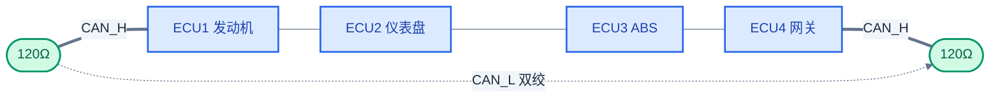
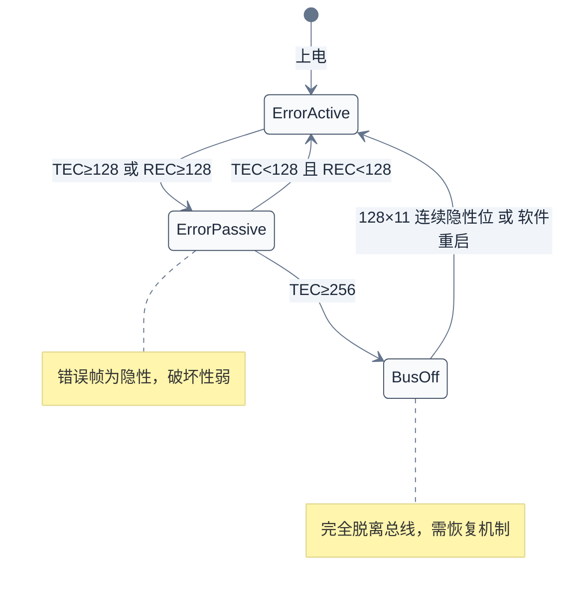
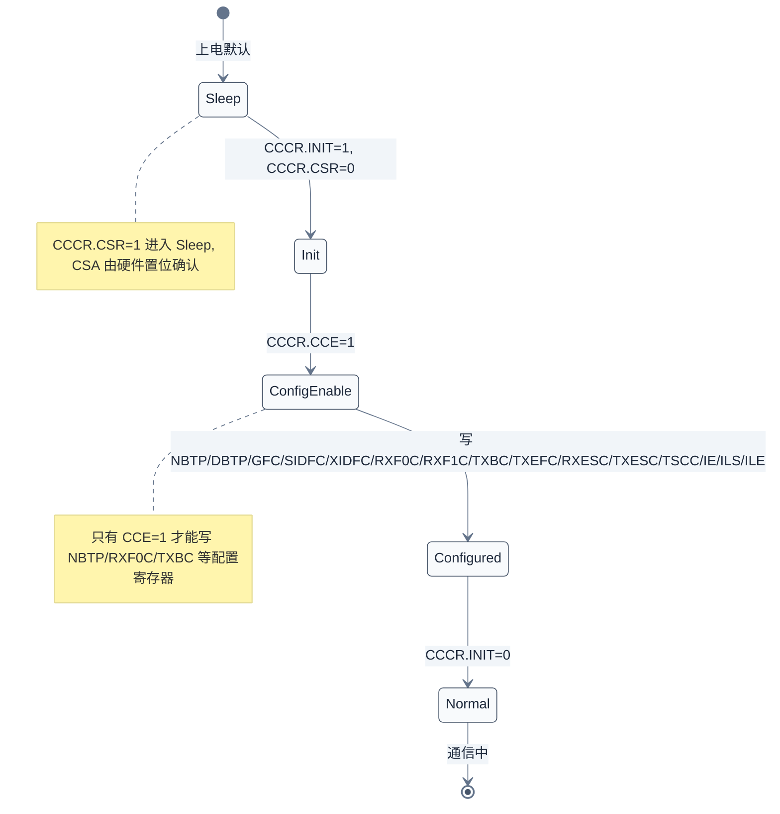

# CAN 协议与驱动深入分析

> 本篇从 CAN "差分线与 + ID 优先级仲裁 + 硬件错误管理" 的本质出发，逐层推进到差分电气、帧格式与错误状态机、位时序公式推导、Bosch M_CAN IP 的完整寄存器地图与 Message RAM 布局、Linux SocketCAN + `m_can` 驱动源码（`m_can_classdev` 抽象、`m_can_chip_config` 配置序列、NAPI 收包路径、TX Event FIFO echo 同步、hrtimer 轮询、Bus-Off 状态机），并以 Zephyr `can_mcan` + `can_driver_api` 回调模型对照，深入到 MCAN 寄存器在两套 OS 下的等价映射、过滤单元 SFEC/EFEC 路由、TDC 二次采样点、`is_peripheral` 工作队列异步发送等工程细节。
> **工程师视角**：CAN 现场问题九成不在协议而在物理层——终端电阻缺失、采样点失配、收发器共模电压、长线缆环路与波特率上限。读懂 MCAN 的"INIT→CCE→配置→退出 INIT"序列、Message RAM 元素布局、IR 中断位含义、TX Event FIFO 的 echo 机制，是 BSP 移植和现场问题定位的关键。

### 关键术语

| 缩写 | 全称 | 含义 |
|------|------|------|
| CAN | Controller Area Network | 控制器局域网，车载/工业对等广播差分总线 |
| MCAN | Bosch M_CAN | Bosch 公司的 CAN 控制器 IP 核系列 |
| ECU | Electronic Control Unit | 电子控制单元（发动机/ABS/仪表等） |
| SOF | Start Of Frame | 帧起始位（1 个显性位） |
| IDE | IDentifier Extension bit | 标识符扩展位，区分 11/29 位 ID |
| RTR | Remote Transmission Request | 远程传输请求帧标志 |
| DLC | Data Length Code | 数据长度码（经典 0–8，FD 0–64 字节） |
| SJW | Synchronization Jump Width | 同步跳转宽度（重同步可调整的 tq 数） |
| TSEG | Time SEGment | 位时间内的相位段（TSEG1/TSEG2） |
| BRP | Bit Rate Prescaler | 波特率预分频器 |
| tq | Time Quantum | 时间份额，位时间的最小单位 |
| CRC | Cyclic Redundancy Check | 循环冗余校验（CAN 用 CRC15/CRC17/CRC21） |
| ACK | ACKnowledge | 应答位，接收节点回送显性位 |
| EOF | End Of Frame | 帧结束（7 个连续隐性位） |
| TEC | Transmit Error Counter | 发送错误计数器 |
| REC | Receive Error Counter | 接收错误计数器 |
| Bus-off | Bus-off | TEC≥256 时节点脱离总线 |
| FD | Flexible Data-rate | CAN-FD，可变速率、最长 64 字节 |
| BRS | Bit Rate Switch | CAN-FD 中切换数据段速率的位 |
| FDF | Flexible Data-rate Format | CAN-FD 帧格式标志位 |
| ESI | Error State Indicator | CAN-FD 帧中发送节点错误状态指示 |
| MRAM | Message RAM | MCAN 内部存放 FIFO/过滤单元的专用 RAM |
| NAPI | New API | Linux 网络子系统的中断/轮询混合收包机制 |
| GFC | Global Filter Control | 全局过滤配置寄存器 |
| TDC | Transmitter Delay Compensation | 发送器延迟补偿（CAN-FD 高速数据段） |
| SSP | Secondary Sample Point | 二次采样点（TDC 模式下使用） |
| SFF | Standard Frame Format | 11 位标准帧 |
| EFF | Extended Frame Format | 29 位扩展帧 |
| NISO | Non-ISO | 非 ISO 11898-1:2015 兼容模式（v3.2+ 可选） |
| HPM | High Priority Message | 高优先级消息中断 |
| TEF | TX Event FIFO | 发送事件 FIFO（用于 echo 同步） |

### 前置知识

| 需要了解 | 参考文档 |
|----------|----------|
| 五种通信协议的共性与定位 | [00-通信协议总览.md](./00-通信协议总览.md) |
| SPI 推挽电气与 CS 时序 | [01-SPI协议与驱动.md](./01-SPI协议与驱动.md) |
| I2C 开漏电气与多主仲裁 | [02-I2C协议与驱动.md](./02-I2C协议与驱动.md) |
| Linux 网络设备模型（`net_device`/`net_device_ops`/NAPI） | — |
| Zephyr 设备驱动模型（`struct device`/`DEVICE_API_GET`） | [zephyr-rtos/13-设备驱动模型.md](../zephyr-rtos/13-设备驱动模型.md) |

---

## 1. CAN 本质：差分广播与 ID 优先级仲裁

> 上一篇 I2C 用"开漏线与 + 地址仲裁"实现多主，但 I2C 仍是主从寻址、单点应答。车载场景需要的是：多个节点都能主动发、一条总线所有人都能听到、紧急帧优先抢占总线、单点故障不能拖垮全网。CAN 用"差分线与 + ID 逐位仲裁 + 分布式错误计数器"满足这四个需求——本章先讲清楚广播、对等、优先级、容错四个本质特征，再揭示仲裁的物理基础。

### 1.1 一个具体场景：发动机 ECU 广播转速

发动机 ECU 要把当前转速广播给全车。它发出一帧 ID=`0x1A0`、数据=`[0x12, 0x34]`（编码转速 0x1234 rpm）的报文。仪表盘 ECU 显示转速，ABS ECU 用转速做防抱死计算，两者都接收这帧；但空调 ECU 不关心转速，它在硬件过滤单元里屏蔽 `0x1A0`，根本不会触发中断。

这个场景说明 CAN 的四个本质特征：

- **广播**：发送节点把帧送上总线，所有节点物理上都能收到。是否"看"这帧，由接收端硬件过滤单元决定，发送端不指定目的地。
- **对等**：任一节点都可以主动发起发送，没有"主机轮询从机"的概念。发动机 ECU 不需要等网关问"你的转速是多少"，而是按周期主动上报。
- **优先级**：ID 数值越小优先级越高。制动请求（ID=`0x0C0`）必然先于车窗状态（ID=`0x640`）抢到总线。
- **容错**：每个节点独立计数自己的发送/接收错误，错误多的节点自动降级，最严重的（TEC≥256）进入 Bus-off 脱离总线——单点故障不会拖垮全网。

### 1.2 与 I2C 多主仲裁的对比

I2C 也支持多主，仲裁发生在地址位：两个主节点同时发起 START，谁发的地址位先出现"自己发 1 而总线被拉 0"谁就败出。CAN 把同样的"线与"思路用在 ID 位上，但目的不同——I2C 仲裁仅去冲突，CAN 仲裁同时定义了优先级。

| 对比维度 | I2C 多主 | CAN |
|----------|----------|-----|
| 仲裁位置 | 7/10 位地址字段 | 11/29 位 ID 字段 |
| 仲裁结果 | 仅去冲突，无优先级语义 | ID 数值小者优先级高 |
| 仲裁物理基础 | 开漏线与（SDA） | 差分显性覆盖隐性 |
| 败者处理 | 退出本次传输，稍后重试 | 立即转接收，无损接收胜者帧 |
| 应答模型 | 主寻址从、从应答（点对点） | 发送者广播、所有接收者回 ACK |
| 错误管理 | 无（依赖协议栈超时） | 分布式 TEC/REC 计数 + 三态降级 |
| 单点故障隔离 | 无 | Bus-off 自动脱离 |

### 1.3 CAN 的四种帧类型

CAN 2.0 规范定义四种帧：

| 帧类型 | 用途 | 关键字段 |
|--------|------|----------|
| **数据帧** | 携带数据，最常见 | SOF + ID + RTR=0 + DLC + Data + CRC + ACK + EOF |
| **远程帧** | 请求某 ID 的数据（RTR=1，无数据段） | SOF + ID + RTR=1 + DLC + CRC + ACK + EOF |
| **错误帧** | 节点检测到错误时发送，强制当前帧失效 | 6 个同极性位（违反位填充）+ 8 个隐性位 |
| **过载帧** | 节点未准备好接收时申请间隔 | 6 个显性位 + 8 个隐性位 |

实际工程中 95% 以上是数据帧。远程帧用得越来越少（CANopen 早期用，现代 FD 不再支持）。错误帧是协议层的"自爆按钮"——任一节点检测到错误立即发送，破坏当前帧让所有节点丢弃重发。

> **核心要点**：CAN 的"广播 + 对等 + ID 优先级 + 分布式错误管理"四位一体，使它天然适合车内"多节点周期上报、高优先级帧抢占、单点故障隔离"的通信模式——这是它取代早期多点 UART/RS-485 主从方案的根本原因。

---

## 2. 物理层：差分信号与拓扑

> 上一章确立了 CAN 的逻辑模型：广播 + ID 仲裁。但仲裁能成立的物理前提是"发 0 能覆盖别人发的 1"——这要求总线电气上满足"线与"。CAN 用差分信号 + 显性/隐性电平实现这一点。本章讲物理层电气、拓扑、终端电阻、收发器选型与波特率距离约束。

### 2.1 差分电平与显性/隐性

CAN 物理层（典型收发器如 TJA1044、SN65HVD230、MCP2551、TCAN1042）用两条线 **CAN_H** 和 **CAN_L** 传输差分信号。ISO 11898-2 高速 CAN 物理层规范定义两种总线状态：

| 总线状态 | CAN_H 电压 | CAN_L 电压 | 差压 V_diff | 逻辑值 |
|----------|-----------|-----------|------------|--------|
| 显性（Dominant） | ~3.5 V | ~1.5 V | >0.9 V | 0 |
| 隐性（Recessive） | ~2.5 V | ~2.5 V | <0.5 V | 1 |

关键点：**显性位（逻辑 0）会把隐性位（逻辑 1）覆盖**。当总线上一个节点发显性、另一个发隐性，收发器内部驱动管会把 CAN_H 拉高、CAN_L 拉低，差压大于 0.9 V——这就是"线与"。这正是仲裁的物理基础：发 1 的节点检测到总线是 0，就知道有更高优先级（更小 ID）的节点在抢总线，立即退出。

### 2.2 总线拓扑与终端电阻

CAN 总线是**总线型拓扑**（直线干缆，节点从干缆分支引出），干缆两端必须各接一个 **120Ω 终端电阻**。



为什么是 120Ω？CAN 规范要求终端电阻值等于**双绞线的特征阻抗**，常用 CAN 双绞线（如 AWG22 双绞）特征阻抗约 120Ω。匹配的终端电阻吸收信号能量，避免信号在总线两端反射造成误码。两端各一个，中间节点不接——如果每个节点都接 120Ω，等效阻抗会降到几十欧，收发器驱动电流过载。

工程实测：用万用表跨接 CAN_H–CAN_L（所有节点断电），正常应读约 **60Ω**（两个 120Ω 并联）。读 120Ω 说明只接了一端，读无穷大说明两端都没接，读几十欧说明中间节点误接了终端电阻。

### 2.3 收发器选型与 CAN-FD SIC

收发器是 CAN 控制器（MCAN）和物理总线之间的桥。常见型号：

| 型号 | 厂商 | 速率 | 特性 |
|------|------|------|------|
| TJA1044 | NXP | 5 Mbps | 经典高速 CAN，低功耗待机 |
| TJA1044G | NXP | 5 Mbps | SIC（Signal Improvement Capability），改善 FD 长线环振铃 |
| TCAN1042 | TI | 5 Mbps | 5V 供电，汽车级 AEC-Q100 |
| TCAN1044 | TI | 8 Mbps | SIC，长线缆 FD 稳定 |
| MCP2551 | Microchip | 1 Mbps | 5V 经典，CAN 2.0B 不支持 FD |
| SN65HVD230 | TI | 1 Mbps | 3.3V，工业级 |
| MAX3051 | Maxim | 1 Mbps | 3.3V–5V 兼容 |

**CAN-FD SIC（Signal Improvement Capability，ISO 11898-2:2016 Amendment 1）**：FD 数据段速率 ≥ 2 Mbps 时，由于收发器延迟和总线反射，隐性→显性边沿易出现"振铃"，导致采样错误。SIC 收发器内部增加边沿整形电路，把振铃压平，使 FD 数据段速率能稳定跑到 5–8 Mbps。这是 CAN-FD 长线缆应用的关键。

### 2.4 波特率与距离

CAN 是异步总线，位时间越长（波特率越低），信号能在更长的线上稳定传输。典型对应关系：

| 波特率 | 最大总线长度 | 典型场景 |
|--------|------------|----------|
| 1 Mbps | 40 m | 车内高速 CAN（动力总线） |
| 500 kbps | 100 m | 车内主流速率 |
| 250 kbps | 250 m | 车身/舒适 CAN |
| 125 kbps | 500 m | 工业/长线缆场景 |
| 50 kbps | 1000 m | 建筑/远距离 |
| 1 Mbps 仲裁 + 5 Mbps 数据（FD） | 40 m | 车内高速 CAN-FD |

> **如何读这张表**：长度上限主要受"环路程延 × 波特率"约束——位时间内信号必须能在线上跑一个来回并完成采样。线长翻倍、波特率大约减半。实际工程中还要扣除收发器延迟（典型 100–200 ns）和节点数带来的电容效应。CAN-FD 数据段速率高，对线长更敏感：5 Mbps 数据段下 30 m 已是工程极限。

> **核心要点**：终端电阻 = 特征阻抗匹配，是 CAN 物理层第一硬性要求。缺一个 120Ω，眼图变差、间歇性误码，是现场最高频的接线错误。CAN-FD 高速数据段需配 SIC 收发器，否则长线缆下振铃导致误码。

---

## 3. 协议层：帧格式与状态机

> 上一章解决了物理层"线与"和拓扑。但线上的比特流如何组织成一帧？两个节点同时发时，仲裁在哪几个比特上发生？发错了怎么管？本章拆解 CAN 2.0/FD 帧格式、位填充、错误检测与错误状态机。

### 3.1 Classical CAN 标准帧与扩展帧

CAN 2.0A 标准帧用 11 位 ID（`0x000`–`0x7FF`，称 SFF），CAN 2.0B 扩展帧用 29 位 ID（`0x00000000`–`0x1FFFFFFF`，称 EFF），由 **IDE** 位区分。两者帧字段对比如下：

| 字段 | 标准帧位数 | 扩展帧位数 | 作用 |
|------|----------|----------|------|
| SOF | 1 | 1 | 帧起始，1 个显性位，同步 |
| ID（仲裁段） | 11 | 11（基础）+ 18（扩展） | 优先级 + 寻址；同时仲裁 |
| RTR | 1 | 1 | 远程请求帧标志（1=远程，0=数据） |
| IDE | 1（在控制段） | 1（在仲裁段，SRR 替代） | 标识符扩展位 |
| r0/FDF | 1 | 1 | 保留 / CAN-FD 标志 |
| DLC | 4 | 4 | 数据长度码 |
| Data | 0–8 | 0–8 | 数据段（经典 CAN） |
| CRC | 15+1 | 15+1 | CRC15 序列 + 界定符 |
| ACK | 1+1 | 1+1 | 应答位 + 界定符 |
| EOF | 7 | 7 | 帧结束，7 个隐性位 |
| IFS | 3 | 3 | 帧间隔，3 个隐性位 |

标准帧与扩展帧的关键差异在仲裁段：扩展帧在 11 位基础 ID 后插入 SRR（替代远程请求位，必须为隐性）+ IDE=1（隐性）+ 18 位扩展 ID + RTR。协议保证两者能共线：标准帧的 IDE 在仲裁段后是显性，扩展帧的 IDE 是隐性，所以同时发送时标准帧会仲裁胜出（IDE 位 0 < 1）。

### 3.2 CAN-FD 帧扩展

CAN-FD（ISO 11898-1:2015）在 Classical CAN 基础上扩展三个新位：

| 新位 | 位置 | 含义 |
|------|------|------|
| **FDF**（Flexible Data-rate Data） | 替代经典 r0 位 | 1=FD 帧，0=经典帧 |
| **BRS**（Bit Rate Switch） | FDF 之后 | 1=数据段切换到高速 dbitrate，0=全程固定位速率 |
| **ESI**（Error State Indicator） | BRS 之后 | 1=发送节点处于 Error Passive，0=Error Active |

CAN-FD 帧的关键变化：

- **数据段长度**：0–64 字节，DLC 编码非线性（DLC 9–15 对应 12/16/20/24/32/48/64 字节）
- **位速率切换**：仲裁段（SOF→BRS）保持固定位速率（≤1 Mbps），BRS 之后切换到数据段速率（最高 8 Mbps），CRC 段前切换回
- **CRC 长度**：数据 ≤16 字节用 CRC17，数据 >16 字节用 CRC21（经典 CAN 用 CRC15）
- **位填充**：仲裁段仍用位填充，**数据段 + CRC 段改为固定 4-bit stuff count**（不动态填充，避免填充位引入的不确定延迟）

| 对比维度 | Classical CAN | CAN-FD |
|----------|--------------|--------|
| 数据长度 | 0–8 字节 | 0–64 字节 |
| 位速率 | 全程固定 | 仲裁段固定 + 数据段可变速 |
| 位填充 | 全帧 | 仅仲裁段，数据段用 stuff count |
| CRC | CRC15 | CRC17/CRC21 + stuff count |
| 帧格式位 | r0 | FDF |
| BRS/ESI | 无 | 有 |
| 远程帧 | 支持 | 不再支持 |
| ISO 兼容 | — | ISO 11898-1:2015；非 ISO（Bosch 原始）模式可选 |

> **核心要点**：CAN-FD 的三件事——更长数据（64 字节）、更高数据段速率（5–8 Mbps）、stuff count 替代动态填充。这三者让 FD 在兼容经典 CAN 总线的前提下把带宽提升 5–10 倍。但 FD 不再支持远程帧，且要求收发器支持 SIC 才能稳定跑到 5 Mbps 以上。

### 3.3 逐位仲裁过程

ID 字段就是仲裁段。总线空闲后，多个节点可能同时开始发送。SOF（显性 0）之后进入 ID 位，每个发送节点边发边监听总线电平：

1. 节点 A 发 ID=`0x1A0`=`0001 1010 0000`（11 位标准 ID）
2. 节点 B 发 ID=`0x200`=`0010 0000 0000`
3. 第 1 位两者都发 0，总线 0，继续
4. 第 2 位 A 发 0、B 发 0，总线 0，继续
5. 第 3 位 A 发 0、B 发 1，总线被 A 拉成 0；B 发 1 却读到 0，**B 仲裁失败**
6. B 立即停止发送，转为接收，A 继续发完整帧
7. 总线空闲后 B 重发

ID 数值越小优先级越高——因为更小数值的高位 0 更多，更早"压住"对手。设计中常把安全关键帧（如制动请求 `0x0C0`）分配小 ID，把非关键帧（如车窗状态 `0x640`）分配大 ID。

仲裁失败是非破坏性的：胜者帧完整发送，败者无损转为接收，不浪费总线时间。

### 3.4 位填充

CAN 采用 NRZ（Non-Return-to-Zero）编码，连续同电平位会导致接收端时钟漂移。**位填充规则**：发送端检测到连续 5 个同电平位后，自动插入 1 个反相位；接收端检测到连续 5 个同电平位后丢弃下一位。

位填充的物理动机：CAN 没有独立时钟线，接收端靠总线电平跳变做时钟同步（边沿触发重同步）。连续 5 个同电平后若不插入跳变，接收端 PLL 可能失锁。

位填充作用范围：SOF、仲裁段、控制段、数据段、CRC 序列（不含 CRC 界定符）。**CRC 界定符、ACK、ACK 界定符、EOF、IFS 段固定格式不填充**——这些段是固定隐性位，填充会破坏其语义。

CAN-FD 数据段 + CRC 段改为固定 stuff count：发送端统计数据段+CRC 中的填充位数（mod 8，3-bit 编码），写入 stuff count 字段。接收端按相同规则解码。这消除了动态填充带来的延迟不确定性，对高速数据段采样点稳定性至关重要。

### 3.5 错误检测：五种机制

CAN 节点在收发每帧时同时执行五种错误检测：

| 错误类型 | 检测方法 | 谁能检测 |
|----------|----------|----------|
| **CRC 错误** | 接收方重新计算 CRC 与收到的 CRC 序列对比 | 所有接收节点 |
| **ACK 错误** | 发送方在 ACK 位检测总线上是否有显性位（应答） | 发送节点 |
| **Form 错误** | CRC 界定符/ACK 界定符/EOF/IFS 必须是隐性，否则错 | 所有节点 |
| **Bit 错误** | 发送方在发送时监听总线，若与自己发的位不一致（除仲裁段和 ACK 段） | 发送节点 |
| **Stuff 错误** | 检测到连续 6 个同极性位（违反位填充规则） | 所有节点 |

任一节点检测到错误，立即发送**错误帧**（6 个同极性位 + 8 个隐性位界定符），破坏当前帧让所有节点丢弃。这就是 CAN 的"自爆"机制——单点错误立即全网感知。

### 3.6 错误计数器与三态状态机

每个 CAN 节点维护两个错误计数器：

- **TEC（Transmit Error Counter）**：发送错误计数
- **REC（Receive Error Counter）**：接收错误计数

计数规则（简化）：

- 发送节点检测到错误：TEC += 8
- 接收节点检测到错误：REC += 1（首个错误），后续错误 REC += 8
- 成功发送一帧：TEC -= 1（最低到 0）
- 成功接收一帧：REC -= 1（最低到 0）

根据计数值切换三种状态：

| 状态 | 触发条件 | 行为 | 错误帧类型 |
|------|---------|------|----------|
| **Error Active** | TEC<128 且 REC<128 | 正常收发 | 主动错误帧（6 个显性位，强破坏性） |
| **Error Passive** | TEC≥128 或 REC≥128 | 仍可收发，但发送间隔需等 8 个隐性位 | 被动错误帧（6 个隐性位，弱破坏性） |
| **Bus-off** | TEC≥256 | **完全脱离总线**，不能收发 | 无 |



**Bus-off 恢复**：节点进入 Bus-off 后，硬件自动监测总线上 128 × 11 个连续隐性位（即 128 帧的 EOF+IFS），完成后回到 Error Active。Linux SocketCAN 还提供 `restart-ms` 选项，定时主动调用 `do_set_mode(CAN_MODE_START)` 重启控制器，不依赖硬件自动恢复。Zephyr 中若使能 `CAN_MODE_MANUAL_RECOVERY`，应用需调 `can_recover()` 主动恢复；否则控制器等硬件自动恢复。

> **核心要点**：CAN 的错误管理是分布式的——每个节点独立计数、独立降级。Bus-off 是最后一道防线，把持续故障节点隔离出总线，避免拖垮全网。Error Active/Pasive 的差异在错误帧极性——主动错误帧显性，全网立即感知；被动错误帧隐性，仅当无其他节点发显性时才生效，这是对故障节点的"降权"处理。

---

## 4. 位时序与采样点

> 上一章讲了帧格式，但帧里的每个比特在总线上持续多久、何时被采样？这由位时序（bit timing）决定。位时序失配是 CAN 现场最高频的"通信偶发错误"根因。本章给出位时间分解、采样点公式、CAN-FD 双相时序、TDC 二次采样点，并用真实数值算出一组可用参数。

### 4.1 位时间分解

一个位时间（bit time）由若干**时间份额（time quantum, tq）**组成，分为四段：

```
+---------+----------+------------+------------+
| SYNC_SEG| PROP_SEG | PHASE_SEG1 | PHASE_SEG2 |
+---------+----------+------------+------------+
                              ^
                        采样点 (Sample Point)
```

- **SYNC_SEG**：固定 1 tq，用于同步总线跳变边沿。
- **PROP_SEG**：传播段，补偿物理层往返延时（线缆 + 收发器）。
- **PHASE_SEG1 / PHASE_SEG2**：相位缓冲段，吸收晶振偏差；重同步时 SJW 从一段挪到另一段。

在寄存器层面，控制器把 PROP_SEG + PHASE_SEG1 合并成 **TSEG1**，PHASE_SEG2 对应 **TSEG2**。因此：

$$\text{位时间} = 1 + \text{TSEG1} + \text{TSEG2} \quad (\text{tq})$$

### 4.2 波特率与采样点公式

$$\text{波特率} = \frac{f_{\text{CAN}}}{\text{BRP} \times (1 + \text{TSEG1} + \text{TSEG2})}$$

- $f_{\text{CAN}}$：CAN 控制器输入时钟频率（Hz），由 SoC 时钟树提供（MCAN 的 cclk）
- $\text{BRP}$：波特率预分频器，把 $f_{\text{CAN}}$ 分频得到 tq 时钟
- $\text{TSEG1}$、$\text{TSEG2}$：相位段份额数（寄存器里存的是 value−1）

$$\text{采样点} = \frac{1 + \text{TSEG1}}{1 + \text{TSEG1} + \text{TSEG2}} \times 100\%$$

**SJW**（同步跳转宽度）：重同步时允许 PHASE_SEG1 延长或 PHASE_SEG2 缩短的最大 tq 数，取值范围 1–min(TSEG2, 4)。SJW 越大对晶振偏差容忍越高，但过大可能导致采样点漂移过度。

### 4.3 数值演算：500 kbps @ 40 MHz，采样点 75%

给定：$f_{\text{CAN}} = 40\,\text{MHz}$，目标波特率 $= 500\,\text{kbps}$，采样点 $= 75\%$。

**第一步**：求总分母。

$$\text{BRP} \times (1 + \text{TSEG1} + \text{TSEG2}) = \frac{40\,000\,000}{500\,000} = 80$$

**第二步**：用采样点约束联立。令 $N = 1 + \text{TSEG1} + \text{TSEG2}$，则 $\text{BRP} = 80 / N$。

$$\frac{1 + \text{TSEG1}}{N} = 0.75 \Rightarrow 1 + \text{TSEG1} = 0.75\,N \Rightarrow \text{TSEG1} = 0.75\,N - 1$$

$$\text{TSEG2} = N - 1 - \text{TSEG1} = 0.25\,N$$

**第三步**：枚举 $N$ 使 BRP、TSEG1、TSEG2 均为正整数。取 $N=8$：

- $\text{TSEG2} = 0.25 \times 8 = 2$
- $\text{TSEG1} = 0.75 \times 8 - 1 = 5$
- $\text{BRP} = 80 / 8 = 10$

**第四步**：验算。

- 波特率 $= 40\,000\,000 / (10 \times 8) = 500\,000\,\text{bps}$ ✓
- 采样点 $= (1+5)/8 = 75\%$ ✓
- $\text{SJW} = 1$（取最小，足够吸收常规晶振偏差）

**第五步**：写入 MCAN NBTP 寄存器。寄存器字段存 value−1：

- $\text{NBRP} = 10 - 1 = 9$
- $\text{NTSEG1} = 5 - 1 = 4$
- $\text{NTSEG2} = 2 - 1 = 1$
- $\text{NSJW} = 1 - 1 = 0$

### 4.4 CAN-FD 双相时序与 TDC

CAN-FD 帧的仲裁段使用 **NBTP**（Nominal Bit Timing & Prescaler）配置（即上节算的参数），数据段使用 **DBTP**（Data Bit Timing & Prescaler）独立配置。两套参数独立计算，BRS 位之后切换。

数据段速率 ≥ 2.5 Mbps 时，发送器到接收器的环路延迟（收发器 TX 延 + 线缆传 + 收发器 RX 延）已接近一个位时间，常规采样点（基于本地时钟的 PHASE_SEG1 末尾）会采到错误位置。MCAN 引入 **TDC（Transmitter Delay Compensation）**：发送端在 BRS 后第一个边沿启动内部计数器，计数到 TDCO（TDC Offset）时使用 **SSP（Secondary Sample Point）** 采样，而不是常规采样点。

TDCO 计算公式（来自 Bosch MCAN 用户手册）：

$$\text{TDCO} = \frac{f_{\text{CAN}} \times \text{SSP 位置}}{\text{数据段波特率}}$$

Linux `m_can_set_bittiming()`（[m_can.c:L1437-L1461](file:///home/pbw/2042f/linux/drivers/net/can/m_can/m_can.c#L1437-L1461)）在 `dbt->bitrate > 2500000` 时启用 TDC，并把 TDCO 设为基于数据段采样点的等效 tq 数，最大值 127。Zephyr `can_mcan_set_timing_data()`（[can_mcan.c:L226-L273](file:///home/pbw/rtos/cs-learning-notes/zephyr-project/zephyr/drivers/can/can_mcan.c#L226-L273)）在 `prescaler ∈ {1,2}` 时启用 TDC 并用 `CAN_CALC_TDCO` 宏计算 TDCO。

> **核心要点**：位时序三要素——波特率由总分母决定，采样点由 TSEG1/TSEG2 比例决定，SJW 决定抗抖动能力。三者解耦后可独立调参。MCAN 寄存器存的是 value−1，写寄存器时务必减 1，这是最容易踩的坑。CAN-FD 数据段 ≥ 2.5 Mbps 必须启用 TDC，否则环路延迟会让采样点漂移到错误位置。

### 4.5 Linux/Zephyr 自动计算位时序

Linux 的 `struct can_bittiming` 把上述参数交给 `can_calc_bittiming()` 自动求解：驱动只提供 `can_bittiming_const`（各段上下限），框架根据用户传入的 `bitrate` 和 `sample_point` 反解 BRP/TSEG1/TSEG2。MCAN 驱动在 `m_can_set_bittiming()` 中把结果写进 NBTP/DBTP。

MCAN 驱动按 IP 版本提供两套 bittiming_const（[m_can.c:L1339-L1385](file:///home/pbw/2042f/linux/drivers/net/can/m_can/m_can.c#L1339-L1385)）：

| 版本 | TSEG1 范围 | TSEG2 范围 | SJW 上限 | BRP 范围 |
|------|----------|----------|---------|---------|
| v3.0.x 标称 | 2–64 | 1–16 | 16 | 1–1024 |
| v3.0.x 数据 | 2–16 | 1–8 | 4 | 1–32 |
| v3.1+ 标称 | 2–256 | 2–128 | 128 | 1–512 |
| v3.1+ 数据 | 1–32 | 1–16 | 16 | 1–32 |

Zephyr 中 `can_calc_timing()` 在 `can_common.c` 内做同样的求解，驱动通过 `timing_min`/`timing_max` 字段提供边界。

---

## 5. Bosch MCAN 架构与寄存器地图

> 上一章算出了位时序参数，但参数要写进哪几个寄存器？发一帧要走什么 FIFO？接收过滤怎么配？这些由具体控制器决定。Bosch M_CAN 是事实标准 IP 核（用于 NXP S32、STM32 FDCAN、TI AM65、Intel Elkhart Lake、Xilinx ZynqMP、Microchip SAM 等），本章按 MCAN 用户手册 v3.3.1 和 Linux/Zephyr 驱动源码拆解其寄存器、Message RAM 布局、初始化状态机。

> 参考 `bosch_mcan_users_manual_v331.pdf` 第 6 章（Register Description）与第 7 章（Message RAM）。

### 5.1 MCAN IP 版本与差异

MCAN IP 通过 CREL（Core Release）寄存器标识版本，格式为 `REL.STEP.SUBSTEP`。Linux 驱动用 `m_can_check_core_release()`（[m_can.c:L1681-L1704](file:///home/pbw/2042f/linux/drivers/net/can/m_can/m_can.c#L1681-L1704)）解析版本，关键差异：

| 版本 | 发布 | 关键特性差异 | Linux 标识 |
|------|------|------------|----------|
| v3.0.x | 2010s 初 | 单 TX Buffer（非 FIFO），CMR/CME 控制 FD 模式，仅支持非 ISO FD | `cdev->version = 30` |
| v3.1.x | 2015 | TX FIFO、FDOE/BRSE 替代 CMR/CME，仅支持非 ISO FD | `cdev->version = 31` |
| v3.2.x | 2016 | NISO 位可选（ISO 或非 ISO），中断位精简 | `cdev->version = 32` |
| v3.3.x | 2018 | PXHD/WMM/UTSU/TXP，CAN-FD 长帧优化 | `cdev->version = 33` |

`m_can_dev_setup()` 根据 version 设置 `bittiming_const`、`ctrlmode_supported`：

```c
// m_can.c:L1771-L1804（精简）
switch (cdev->version) {
case 30:
    err = can_set_static_ctrlmode(dev, CAN_CTRLMODE_FD_NON_ISO);
    cdev->can.bittiming_const = &m_can_bittiming_const_30X;
    cdev->can.fd.data_bittiming_const = &m_can_data_bittiming_const_30X;
    break;
case 31:
    err = can_set_static_ctrlmode(dev, CAN_CTRLMODE_FD_NON_ISO);
    cdev->can.bittiming_const = &m_can_bittiming_const_31X;
    break;
case 32:
case 33:
    cdev->can.bittiming_const = &m_can_bittiming_const_31X;
    niso = m_can_niso_supported(cdev);
    if (niso)
        cdev->can.ctrlmode_supported |= CAN_CTRLMODE_FD_NON_ISO;
    break;
}
```

v3.0/v3.1 硬件固定非 ISO 模式（无法切换），v3.2+ 通过 NISO 位（CCCR[15]）支持 ISO/非 ISO 切换。

### 5.2 完整寄存器地图

以下偏移来自 [m_can.c:L31-L80](file:///home/pbw/2042f/linux/drivers/net/can/m_can/m_can.c#L31-L80) 和 [can_mcan.h:L25-L396](file:///home/pbw/rtos/cs-learning-notes/zephyr-project/zephyr/include/zephyr/drivers/can/can_mcan.h#L25-L396)，与 MCAN 手册一致：

| 寄存器 | 偏移 | 作用 |
|--------|------|------|
| CREL | 0x00 | Core Release，IP 版本号 |
| ENDN | 0x04 | Endian，固定 0x04030201 |
| CUST | 0x08 | Customer，客户自定义 |
| DBTP | 0x0C | 数据位时序（CAN-FD 数据段） |
| TEST | 0x10 | 测试模式（LBCK/RX/TX） |
| RWD | 0x14 | RAM Watchdog |
| CCCR | 0x18 | 配置控制（INIT/CCE/TEST/MON 等） |
| NBTP | 0x1C | 标称位时序（即 §4 算的参数） |
| TSCC | 0x20 | 时间戳计数器配置 |
| TSCV | 0x24 | 时间戳计数器当前值 |
| TOCC | 0x28 | 超时计数器配置 |
| TOCV | 0x2C | 超时计数器当前值 |
| ECR | 0x40 | 错误计数器（TEC/REC/CEL） |
| PSR | 0x44 | 协议状态（BO/EW/EP/LEC/DLEC） |
| TDCR | 0x48 | TDC 配置（TDCO/TDCF，v3.1+） |
| IR | 0x50 | 中断状态（读后写 1 清除） |
| IE | 0x54 | 中断使能 |
| ILS | 0x58 | 中断线选择（哪位路由到 INT0/INT1） |
| ILE | 0x5C | 中断线使能 |
| GFC | 0x80 | 全局过滤配置 |
| SIDFC | 0x84 | 标准 ID 过滤起始地址/数量 |
| XIDFC | 0x88 | 扩展 ID 过滤起始地址/数量 |
| XIDAM | 0x90 | 扩展 ID 掩码（Acceptance Mask） |
| HPMS | 0x94 | 高优先级消息状态 |
| NDAT1/2 | 0x98/0x9C | 新数据标志（RX Buffer） |
| RXF0C | 0xA0 | 接收 FIFO 0 配置（大小/水印/覆盖） |
| RXF0S | 0xA4 | 接收 FIFO 0 状态（填充量/get/put 索引） |
| RXF0A | 0xA8 | 接收 FIFO 0 确认（写 get 索引） |
| RXBC | 0xAC | 接收 Buffer 起始地址 |
| RXF1C | 0xB0 | 接收 FIFO 1 配置 |
| RXF1S | 0xB4 | 接收 FIFO 1 状态 |
| RXF1A | 0xB8 | 接收 FIFO 1 确认 |
| RXESC | 0xBC | RX Buffer/FIFO 元素大小 |
| TXBC | 0xC0 | 发送 FIFO/Buffer 配置（起始/数量/模式） |
| TXFQS | 0xC4 | 发送 FIFO 状态（空闲 put 索引） |
| TXESC | 0xC8 | TX Buffer 元素大小 |
| TXBRP | 0xCC | TX Buffer Request Pending |
| TXBAR | 0xD0 | TX Buffer Add Request（置位触发发送） |
| TXBCR | 0xD4 | TX Buffer Cancellation Request |
| TXBTO | 0xD8 | TX Buffer Transmission Occurred（硬件置位） |
| TXBCF | 0xDC | TX Buffer Cancellation Finished |
| TXBTIE | 0xE0 | TX Buffer Transmission Interrupt Enable |
| TXBCIE | 0xE4 | TX Buffer Cancellation Finished Interrupt Enable |
| TXEFC | 0xF0 | TX Event FIFO 配置 |
| TXEFS | 0xF4 | TX Event FIFO 状态 |
| TXEFA | 0xF8 | TX Event FIFO 确认 |

### 5.3 CCCR 寄存器位定义

CCCR（CC Control Register）是 MCAN 的"控制中枢"，定义在 [m_can.c:L104-L132](file:///home/pbw/2042f/linux/drivers/net/can/m_can/m_can.c#L104-L132) 和 [can_mcan.h:L65-L81](file:///home/pbw/rtos/cs-learning-notes/zephyr-project/zephyr/include/zephyr/drivers/can/can_mcan.h#L65-L81)：

| 位 | 名称 | 含义 | 引入版本 |
|---|------|------|---------|
| 0 | INIT | 进入初始化模式（写 1，硬件确认后可写 CCE） | 所有 |
| 1 | CCE | Configuration Change Enable，置 1 后才能写配置寄存器 | 所有 |
| 2 | ASM | Restricted Operation Mode（Restricted ASk mode，仅监听 ACK） | 所有 |
| 3 | CSA | Clock Stop Acknowledge（硬件置位，进入时钟停止） | 所有 |
| 4 | CSR | Clock Stop Request（请求时钟停止） | 所有 |
| 5 | MON | Monitor Mode（监听模式，不发显性位） | 所有 |
| 6 | DAR | Disable Auto-Retransmission（不自动重传） | 所有 |
| 7 | TEST | 测试模式使能（与 TEST.LBCK 配合） | 所有 |
| 8 | FDOE | FD Operation Enable（v3.1+ 替代 CME） | v3.1+ |
| 9 | BRSE | Bit Rate Switch Enable（v3.1+ 替代 CME） | v3.1+ |
| 10 | UTSU | Time Stamp Unit Select | v3.3+ |
| 11 | WMM | Windowed Memory Mode | v3.3+ |
| 12 | PXHD | Protocol Exception Handling Disable | v3.1+ |
| 13 | EFBI | Edge Filtering during Bus Integration | v3.1+ |
| 14 | TXP | Transmit Pause（仲裁胜出后暂停 2 位再发） | v3.1+ |
| 15 | NISO | Non-ISO mode（1=非 ISO 11898-1:2015） | v3.2+ |

v3.0 用 CMR/CME 字段（CCCR[11:8]）控制 FD 模式（CAN/CAN-FD/CAN-FD+BRS 三选一），v3.1+ 改用 FDOE+BRSE 两位独立控制。

### 5.4 IR/IE 中断位定义

IR（Interrupt Register）共 32 位，每位对应一个事件，写 1 清除。完整定义在 [m_can.c:L162-L217](file:///home/pbw/2042f/linux/drivers/net/can/m_can/m_can.c#L162-L217)：

| 位 | 名称 | 含义 |
|---|------|------|
| 0 | RF0N | RX FIFO 0 New Message |
| 1 | RF0W | RX FIFO 0 Watermark Reached |
| 2 | RF0F | RX FIFO 0 Full |
| 3 | RF0L | RX FIFO 0 Message Lost |
| 4–7 | RF1N/RF1W/RF1F/RF1L | 同上，FIFO 1 |
| 8 | HPM | High Priority Message |
| 9 | TC | Transmission Complete（v3.0） |
| 10 | TCF | Transmission Cancellation Finished |
| 11 | TFE | TX FIFO Empty |
| 12 | TEFN | TX Event FIFO New Entry（v3.1+ 替代 TC） |
| 13 | TEFW | TX Event FIFO Watermark |
| 14 | TEFF | TX Event FIFO Full |
| 15 | TEFL | TX Event FIFO Element Lost |
| 16 | TSW | Timestamp Wrap |
| 17 | MRAF | Message RAM Access Failure |
| 18 | TOO | Timeout Reached |
| 19 | DRX | Debug Status Change（v3.1+ 弃用） |
| 20 | BEC | Bit Error Corrected |
| 21 | BEU | Bit Error Uncorrected |
| 22 | ELO | Error Logging Overflow |
| 23 | EP | Error Passive state change |
| 24 | EW | Error Warning state change |
| 25 | BO | Bus-Off state change |
| 26 | WDI | Watchdog Interrupt |
| 27 | PEA | Protocol Error in Arbitration Phase（v3.1+ 替代 CRCE/BE/ACKE/FOE/STE） |
| 28 | PED | Protocol Error in Data Phase（v3.1+） |
| 29 | ARA | Access to Reserved Address |

v3.0 把 5 种 LEC（Stuff/Form/ACK/Bit1/Bit0/CRC）错误各自一个中断位（IR[31:27]），v3.1+ 合并为 PEA（仲裁段错误）和 PED（数据段错误）两个位，具体类型查 PSR.LEC/DLEC。

**ILS（Interrupt Line Select）** 寄存器把每个中断位路由到 INT0 或 INT1，**ILE（Interrupt Line Enable）** 使能 INT0/INT1 输出。MCAN 支持 2 条中断线，可把"高频 RX"路由到 INT0、"低频错误"路由到 INT1，分别进不同 CPU 核心。Linux `m_can_chip_config()` 默认全部路由到 INT0（`ILS_ALL_INT0`）。

### 5.5 PSR 协议状态寄存器

PSR（Protocol Status Register）反映当前协议层状态，定义在 [can_mcan.h:L117-L139](file:///home/pbw/rtos/cs-learning-notes/zephyr-project/zephyr/include/zephyr/drivers/can/can_mcan.h#L117-L139)：

| 位 | 名称 | 含义 |
|---|------|------|
| 2:0 | LEC | Last Error Code（仲裁段） |
| 4:3 | ACT | Activity（0=Sync,1=Idle,2=Rcv,3=Tx） |
| 5 | EP | Error Passive |
| 6 | EW | Error Warning |
| 7 | BO | Bus-Off |
| 10:8 | DLEC | Data Phase Last Error Code |
| 11 | RESI | ESI flag of last received frame |
| 12 | RBRS | BRS flag of last received frame |
| 13 | RFDF | FDF flag of last received frame |
| 14 | PXE | Protocol Exception Event |
| 22:16 | TDCV | Transmitter Delay Compensation Value |

LEC/DLEC 取值：0=No Error, 1=Stuff, 2=Form, 3=ACK, 4=Bit1, 5=Bit0, 6=CRC, 7=No Change。

### 5.6 初始化状态机

MCAN 配置寄存器前必须进入初始化模式并使能配置访问。关键位在 CCCR：`CCCR_INIT`(bit0) 进初始化、`CCCR_CCE`(bit1) 使能配置写入。流程如下：



Linux `m_can_config_enable()`（[m_can.c:L422-L435](file:///home/pbw/2042f/linux/drivers/net/can/m_can/m_can.c#L422-L435)）调用 `m_can_cccr_update_bits(cdev, CCCR_CCE, CCCR_CCE)`，`m_can_start()` 末尾调用 `m_can_cccr_update_bits(cdev, CCCR_INIT, 0)` 退出初始化模式。

Zephyr `can_mcan_enter_init_mode()`（[can_mcan.c:L100-L150](file:///home/pbw/rtos/cs-learning-notes/zephyr-project/zephyr/drivers/can/can_mcan.c#L100-L150)）置 CCCR.INIT 后轮询直到硬件确认，超时返回 -EAGAIN。`can_mcan_enable_configuration_change()`（[can_mcan.c:L1280-L1302](file:///home/pbw/rtos/cs-learning-notes/zephyr-project/zephyr/drivers/can/can_mcan.c#L1280-L1302)）单独置 CCE 位。

`m_can_cccr_update_bits()`（[m_can.c:L383-L420](file:///home/pbw/2042f/linux/drivers/net/can/m_can/m_can.c#L383-L420)）实现了"重试写"机制——某些位（如 NISO）依赖 CCE 先置位才能写，所以最多重试 10 次。同时屏蔽 CSR/CSA 位的读回比对（这两位硬件可能因 standby 模式自动置 1，比对会失败）。

> **核心要点**：MCAN 的"INIT→CCE→配置→退出 INIT"序列是硬性要求——忘记置 CCE，所有配置寄存器写入静默失败。MRAM 的 FIFO/过滤布局在初始化时一次性配好，运行期只动 TXBAR（发送）和 RXF0A（确认接收）。

---

## 6. Message RAM 布局与元素格式

> 上一章看了寄存器，但发送/接收的帧实际放在哪里？答案是 MCAN 外接的 **Message RAM（MRAM）**——一块专用 SRAM，按"过滤单元 + RX FIFO0/1 + RX Buffer + TX Event FIFO + TX Buffer"顺序划分。本章拆解 MRAM 布局和每种元素的位级格式。

### 6.1 MRAM 整体布局

MRAM 是 MCAN 的"工作内存"，所有过滤单元、FIFO 元素、Buffer 元素都放在这里。Linux 用 `struct mram_cfg`（[m_can.h:L55-L59](file:///home/pbw/2042f/linux/drivers/net/can/m_can/m_can.h#L55-L59)）记录每段偏移和元素数：

```c
// m_can.h:L44-L53
enum m_can_mram_cfg {
    MRAM_SIDF = 0,   // 标准 ID 过滤
    MRAM_XIDF,       // 扩展 ID 过滤
    MRAM_RXF0,       // RX FIFO 0
    MRAM_RXF1,       // RX FIFO 1
    MRAM_RXB,        // RX Buffer（可选，本驱动不配）
    MRAM_TXE,        // TX Event FIFO
    MRAM_TXB,        // TX Buffer / TX FIFO
    MRAM_CFG_NUM,
};
```

MRAM 物理布局按此顺序：

```
+------------------+
| Std Filter (SIDF)| 4 字节/元素
+------------------+
| Ext Filter (XIDF)| 8 字节/元素
+------------------+
| RX FIFO 0        | 72 字节/元素（含 64 字节数据）
+------------------+
| RX FIFO 1        | 72 字节/元素
+------------------+
| RX Buffer (可选) | 72 字节/元素
+------------------+
| TX Event FIFO    | 8 字节/元素
+------------------+
| TX Buffer/FIFO   | 72 字节/元素
+------------------+
```

每段大小由设备树 `bosch,mram-cfg` 属性指定，Zephyr 用 [can_mcan.h:L433-L498](file:///home/pbw/rtos/cs-learning-notes/zephyr-project/zephyr/include/zephyr/drivers/can/can_mcan.h#L433-L498) 一组宏自动计算偏移。Linux `m_can_init_ram()`（[m_can.c:L1387-L1406](file:///home/pbw/2042f/linux/drivers/net/can/m_can/m_can.c#L1387-L1406)）在配置前把整个 MRAM 清零，避免 ECC/parity 错误：

```c
// m_can.c:L1387-L1406
static int m_can_init_ram(struct m_can_classdev *cdev)
{
    int end, i, start;
    int err = 0;
    start = cdev->mcfg[MRAM_SIDF].off;
    end = cdev->mcfg[MRAM_TXB].off + cdev->mcfg[MRAM_TXB].num * TXB_ELEMENT_SIZE;
    for (i = start; i < end; i += 4) {
        err = m_can_fifo_write_no_off(cdev, i, 0x0);
        if (err) break;
    }
    return err;
}
```

### 6.2 标准过滤元素格式

每个标准过滤元素 32 位（4 字节）：

```
 31                   21 20          16 15           5 4   3      2   1   0
+-----------------------+--------------+--------------+---+--------+---+---+
|       SFID1[10:0]     | SFEC[2:0]    |   reserved   | - | SFT[1:0]|   |
+-----------------------+--------------+--------------+---+--------+---+---+
|       SFID2[10:0]     |              |              |   |        |   |
+-----------------------+--------------+--------------+---+--------+---+---+
```

Zephyr 定义在 [can_mcan.h:L1033-L1039](file:///home/pbw/rtos/cs-learning-notes/zephyr-project/zephyr/include/zephyr/drivers/can/can_mcan.h#L1033-L1039)：

```c
struct can_mcan_std_filter {
    uint32_t sfid2: 11;  // 第二个 ID（dual 模式）或掩码（classic 模式）
    uint32_t res: 5;
    uint32_t sfid1: 11;  // 第一个 ID
    uint32_t sfec: 3;    // 过滤元素配置
    uint32_t sft: 2;     // 过滤类型
} __packed __aligned(4);
```

**SFT（Standard Filter Type）**：

| 值 | 模式 | 含义 |
|---|------|------|
| 0 | RANGE | SFID1 ≤ ID ≤ SFID2 时匹配 |
| 1 | DUAL | ID == SFID1 或 ID == SFID2 时匹配 |
| 2 | CLASSIC | (ID & SFID2) == (SFID1 & SFID2) 时匹配（SFID2 作掩码） |
| 3 | DISABLE | 过滤单元禁用 |

**SFEC（Standard Filter Element Configuration）**——匹配后路由到哪：

| 值 | 行为 |
|---|------|
| 0 | Disable |
| 1 | 进 RX FIFO 0 |
| 2 | 进 RX FIFO 1 |
| 3 | 进 RX Buffer（按 index） |
| 4 | 进 RX FIFO 0 + 触发高优先级中断 |
| 5 | 进 RX FIFO 1 + 触发高优先级中断 |
| 6-7 | reserved |

Zephyr `can_mcan_add_rx_filter_std()`（[can_mcan.c:L1094-L1143](file:///home/pbw/rtos/cs-learning-notes/zephyr-project/zephyr/drivers/can/can_mcan.c#L1094-L1143)）只用 CLASSIC 模式，并按 filter_id 奇偶性把帧分散到 FIFO0/FIFO1：

```c
// can_mcan.c:L1100-L1104
struct can_mcan_std_filter filter_element = {
    .sfid1 = filter->id,
    .sfid2 = filter->mask,
    .sft = CAN_MCAN_SFT_CLASSIC
};
// can_mcan.c:L1124
filter_element.sfec = filter_id & 0x01 ? CAN_MCAN_XFEC_FIFO1 : CAN_MCAN_XFEC_FIFO0;
```

### 6.3 扩展过滤元素格式

每个扩展过滤元素 64 位（8 字节），定义在 [can_mcan.h:L1052-L1058](file:///home/pbw/rtos/cs-learning-notes/zephyr-project/zephyr/include/zephyr/drivers/can/can_mcan.h#L1052-L1058)：

```c
struct can_mcan_ext_filter {
    uint32_t efid1: 29;  // 第一个 ID
    uint32_t efec: 3;    // 过滤元素配置
    uint32_t efid2: 29;  // 第二个 ID 或掩码
    uint32_t esync: 1;   // 必须写 0
    uint32_t eft: 2;     // 过滤类型
} __packed __aligned(4);
```

**EFT（Extended Filter Type）**：

| 值 | 模式 | 含义 |
|---|------|------|
| 0 | RANGE_XIDAM | EFID1 ≤ ID ≤ EFID2，受 XIDAM 掩码约束 |
| 1 | DUAL | ID == EFID1 或 ID == EFID2 |
| 2 | CLASSIC | (ID & EFID2) == (EFID1 & EFID2) |
| 3 | RANGE | EFID1 ≤ ID ≤ EFID2，无掩码约束 |

### 6.4 RX FIFO 元素格式

RX FIFO 0/1 每个元素 72 字节（含 64 字节数据），定义在 [can_mcan.h:L909-L943](file:///home/pbw/rtos/cs-learning-notes/zephyr-project/zephyr/include/zephyr/drivers/can/can_mcan.h#L909-L943)：

```c
struct can_mcan_rx_fifo_hdr {
    union {
        struct {
            uint32_t ext_id: 29;  // 29 位扩展 ID
            uint32_t rtr: 1;      // 远程帧
            uint32_t xtd: 1;      // 1=扩展帧，0=标准帧
            uint32_t esi: 1;      // Error State Indicator
        };
        struct {
            uint32_t pad1: 18;
            uint32_t std_id: 11;  // 11 位标准 ID
            uint32_t pad2: 3;
        };
    };
    uint32_t rxts: 16;     // 接收时间戳
    uint32_t dlc: 4;       // 数据长度码
    uint32_t brs: 1;       // Bit Rate Switch
    uint32_t fdf: 1;       // FD Format
    uint32_t res: 2;
    uint32_t fidx: 7;      // 匹配的过滤单元索引
    uint32_t anmf: 1;      // 1=非匹配帧（被 GFC 路由进来）
};
```

字段解读：

- **R0[31:0]**：ID 字段，`xtd=1` 时低 29 位是扩展 ID，`xtd=0` 时 [28:18] 是 11 位标准 ID（Linux 用 `>> 18` 提取）
- **R1[15:0]**：rxts（16 位内部时间戳，按 TSCC.TCP 预分频）
- **R1[19:16]**：dlc（4 位，CAN-FD 时 9–15 对应 12/16/20/24/32/48/64 字节）
- **R1[20]**：brs，数据段速率切换标志
- **R1[21]**：fdf，1=FD 帧
- **R1[28:22]**：fidx，匹配的过滤单元索引（应用可据此知道是哪个 filter 接到的帧）
- **R1[31]**：anmf，1=非匹配帧（被 GFC.ANFE/ANFS 路由进 FIFO）
- **R2-R17**：64 字节数据

Linux `m_can_read_fifo()`（[m_can.c:L555-L619](file:///home/pbw/2042f/linux/drivers/net/can/m_can/m_can.c#L555-L619)）的核心解码：

```c
// m_can.c:L565-L598（精简）
err = m_can_fifo_read(cdev, fgi, M_CAN_FIFO_ID, &fifo_header, 2);
// ...
if (fifo_header.dlc & RX_BUF_FDF)
    skb = alloc_canfd_skb(dev, &cf);
else
    skb = alloc_can_skb(dev, (struct can_frame **)&cf);

if (fifo_header.dlc & RX_BUF_FDF)
    cf->len = can_fd_dlc2len((fifo_header.dlc >> 16) & 0x0F);
else
    cf->len = can_cc_dlc2len((fifo_header.dlc >> 16) & 0x0F);

if (fifo_header.id & RX_BUF_XTD)
    cf->can_id = (fifo_header.id & CAN_EFF_MASK) | CAN_EFF_FLAG;
else
    cf->can_id = (fifo_header.id >> 18) & CAN_SFF_MASK;

if (fifo_header.id & RX_BUF_ESI)
    cf->flags |= CANFD_ESI;
```

Zephyr `can_mcan_get_message()`（[can_mcan.c:L709-L818](file:///home/pbw/rtos/cs-learning-notes/zephyr-project/zephyr/drivers/can/can_mcan.c#L709-L818)）做同样的解码，但用位字段直接访问（C struct bitfield）而非移位，更易读：

```c
// can_mcan.c:L765-L797（精简）
if (hdr.xtd != 0) {
    frame.id = hdr.ext_id;
    frame.flags |= CAN_FRAME_IDE;
    cb = cbs->ext[filt_idx].function;
    user_data = cbs->ext[filt_idx].user_data;
} else {
    frame.id = hdr.std_id;
    cb = cbs->std[filt_idx].function;
    user_data = cbs->std[filt_idx].user_data;
}
// ...
cb(dev, &frame, user_data);
```

### 6.5 TX Buffer 元素格式

TX Buffer 元素也是 72 字节，定义在 [can_mcan.h:L950-L984](file:///home/pbw/rtos/cs-learning-notes/zephyr-project/zephyr/include/zephyr/drivers/can/can_mcan.h#L950-L984)：

```c
struct can_mcan_tx_buffer_hdr {
    union {
        struct {
            uint32_t ext_id: 29;  // 29 位扩展 ID
            uint32_t rtr: 1;
            uint32_t xtd: 1;
            uint32_t esi: 1;
        };
        struct {
            uint32_t pad1: 18;
            uint32_t std_id: 11;
            uint32_t pad2: 3;
        };
    };
    uint16_t res1;
    uint8_t dlc: 4;
    uint8_t brs: 1;
    uint8_t fdf: 1;
    uint8_t efc: 1;   // Event FIFO Control，1=发送完成进 TX Event FIFO
    uint8_t mm: 4;    // Message Marker，写入 TX Event FIFO 用于软件关联
    // ...
};
```

关键控制位：

- **EFC**：1=该帧发送完成后写入 TX Event FIFO，软件据此做 echo 同步
- **MM**：4 位 Message Marker，由软件写入，发送完成后原样写入 TX Event FIFO，用于软件把 TX 请求与完成事件对应起来（Linux 用 putidx 作 MM）

Linux `m_can_tx_handler()`（[m_can.c:L1863-L1976](file:///home/pbw/2042f/linux/drivers/net/can/m_can/m_can.c#L1863-L1976)）的 v3.1+ 路径构造 TX 元素：

```c
// m_can.c:L1935-L1957（精简）
fdflags = 0;
if (can_is_canfd_skb(skb)) {
    fdflags |= TX_BUF_FDF;
    if (cf->flags & CANFD_BRS)
        fdflags |= TX_BUF_BRS;
}
fifo_element.dlc = FIELD_PREP(TX_BUF_MM_MASK, putidx) |
                   FIELD_PREP(TX_BUF_DLC_MASK, can_fd_len2dlc(cf->len)) |
                   fdflags | TX_BUF_EFC;
memcpy_and_pad(fifo_element.data, CANFD_MAX_DLEN, &cf->data, cf->len, 0);
err = m_can_fifo_write(cdev, putidx, M_CAN_FIFO_ID, &fifo_element, 2 + len_padded);
// ...
can_put_echo_skb(skb, dev, putidx, frame_len);  // 缓存 skb 等 echo
m_can_write(cdev, M_CAN_TXBAR, BIT(putidx));     // 触发发送
```

### 6.6 TX Event FIFO 元素格式

TX Event FIFO 元素 8 字节，定义在 [can_mcan.h:L991-L1031](file:///home/pbw/rtos/cs-learning-notes/zephyr-project/zephyr/include/zephyr/drivers/can/can_mcan.h#L991-L1031)：

```c
struct can_mcan_tx_event_fifo {
    union {
        struct {
            uint32_t ext_id: 29;
            uint32_t rtr: 1;
            uint32_t xtd: 1;
            uint32_t esi: 1;
        };
        struct {
            uint32_t pad1: 18;
            uint32_t std_id: 11;
            uint32_t pad2: 3;
        };
    };
    uint16_t txts;  // 发送时间戳
    uint8_t dlc: 4;
    uint8_t brs: 1;
    uint8_t fdf: 1;
    uint8_t efc: 1;
    uint8_t mm: 4;   // Message Marker（与 TX Buffer 的 MM 一致）
    // ...
};
```

TX Event FIFO 的核心用途：**echo 同步**。SocketCAN 要求应用层能看到自己发出的帧（用 RAW socket 时本地回环），但驱动把 skb 交给硬件后不能立即认为"发送完成"——可能仲裁失败、可能 ACK 错误。MCAN 用 TX Event FIFO 告诉软件"这帧真的发出去了"，软件据此把缓存的 echo skb 上送网络栈。

Linux `m_can_echo_tx_event()`（[m_can.c:L1150-L1202](file:///home/pbw/2042f/linux/drivers/net/can/m_can/m_can.c#L1150-L1202)）读 TXEFS 获取已发送元素数，循环读出 MM 字段，调 `can_get_echo_skb(dev, msg_mark, &frame_len)` 把对应 skb 上送：

```c
// m_can.c:L1165-L1197（精简）
m_can_txefs = m_can_read(cdev, M_CAN_TXEFS);
txe_count = FIELD_GET(TXEFS_EFFL_MASK, m_can_txefs);
fgi = FIELD_GET(TXEFS_EFGI_MASK, m_can_txefs);

for (i = 0; i < txe_count; i++) {
    err = m_can_txe_fifo_read(cdev, fgi, 4, &txe);
    msg_mark = FIELD_GET(TX_EVENT_MM_MASK, txe);   // 取出 MM
    timestamp = FIELD_GET(TX_EVENT_TXTS_MASK, txe) << 16;
    ack_fgi = fgi;
    fgi = (++fgi >= cdev->mcfg[MRAM_TXE].num ? 0 : fgi);
    processed_frame_len += m_can_tx_update_stats(cdev, msg_mark, timestamp);
    ++processed;
}
if (ack_fgi != -1)
    m_can_write(cdev, M_CAN_TXEFA, FIELD_PREP(TXEFA_EFAI_MASK, ack_fgi));
m_can_finish_tx(cdev, processed, processed_frame_len);
```

v3.0 没有 TX Event FIFO，用 `IR_TC`（Transmission Complete）中断代替，但只能跟踪 1 个 TX Buffer，所以 v3.0 必须用 `netif_stop_queue` 串行化发送。

### 6.7 元素大小配置 RXESC/TXESC

RXESC（[m_can.c:L238-L243](file:///home/pbw/2042f/linux/drivers/net/can/m_can/m_can.c#L238-L243)）和 TXESC（[m_can.c:L254-L256](file:///home/pbw/2042f/linux/drivers/net/can/m_can/m_can.c#L254-L256)）配置每个 FIFO/Buffer 元素的数据字段大小，编码：

| 值 | 数据字段大小 |
|---|------------|
| 0 | 8 字节 |
| 1 | 12 字节 |
| 2 | 16 字节 |
| 3 | 20 字节 |
| 4 | 24 字节 |
| 5 | 32 字节 |
| 6 | 48 字节 |
| 7 | 64 字节 |

Linux/Zephyr 都默认配 64 字节（`RXESC_64B`/`TXESC_TBDS_64B`），支持全尺寸 CAN-FD 帧。MRAM 大小固定，元素数与元素大小成反比——若不需要 64 字节数据，配小一点能塞更多元素。

> **核心要点**：MRAM 是 MCAN 的"工作内存"，按 SIDF→XIDF→RXF0→RXF1→RXB→TXE→TXB 顺序布局。每个元素的 EFC/MM 字段是 TX Event FIFO echo 同步的关键——EFC=1 让硬件把发送完成事件记入 TEF，MM 让软件把 TEF 事件与原 skb 对应起来。这就是 SocketCAN echo 机制在硬件层的实现。

---

## 7. 过滤单元与 FIFO 路由

> 上一章看了 MRAM 元素格式，但帧如何进 FIFO？由谁决定？答案是 MCAN 的**全局过滤配置 GFC + 标准/扩展过滤单元 SIDFC/XIDFC**。本章拆解过滤模型、FIFO 路由规则、ANFE/ANFS 默认路由。

### 7.1 GFC 全局过滤配置

GFC（Global Filter Control）寄存器定义未匹配帧的默认处理：

| 字段 | 含义 | 取值 |
|------|------|------|
| ANFE[1:0] | Accept Non-matching Frames Extended | 0=Disable, 1=RX FIFO 0, 2=RX FIFO 1 |
| ANFS[1:0] | Accept Non-matching Frames Standard | 同上 |
| RRFS | Reject All Remote Frames Standard | 1=拒绝 |
| RRFE | Reject All Remote Frames Extended | 1=拒绝 |

Zephyr `can_mcan_init()`（[can_mcan.c:L1497-L1510](file:///home/pbw/rtos/cs-learning-notes/zephyr-project/zephyr/drivers/can/can_mcan.c#L1497-L1510)）配置：

```c
// can_mcan.c:L1502-L1505
reg |= FIELD_PREP(CAN_MCAN_GFC_ANFE, 0x2) | FIELD_PREP(CAN_MCAN_GFC_ANFS, 0x2);
if (!IS_ENABLED(CONFIG_CAN_ACCEPT_RTR)) {
    reg |= CAN_MCAN_GFC_RRFS | CAN_MCAN_GFC_RRFE;
}
```

ANFE=ANFS=2 表示未匹配帧进 RX FIFO 1（与匹配帧分到 FIFO 0/1 形成优先级区分）。Linux `m_can_chip_config()`（[m_can.c:L1513](file:///home/pbw/2042f/linux/drivers/net/can/m_can/m_can.c#L1513)）写 `M_CAN_GFC = 0x0`——即所有非匹配帧进 FIFO 0（最宽松配置），过滤逻辑完全交给上层 socket filter。

### 7.2 过滤匹配流程

每帧到达 MCAN 后，过滤流程：

1. 检查 GFC.RRFS/RRFE：若是 Remote 帧且拒绝位为 1，直接丢弃
2. 标准 ID 帧：依次扫描 SIDFC 配置的所有标准过滤单元（最多 128 个）
   - 若某元素 SFT=DISABLE，跳过
   - 否则按 SFT 模式（RANGE/DUAL/CLASSIC）匹配
   - 匹配成功 → 按 SFEC 路由（FIFO0/FIFO1/RXBuf/HPM）
   - 全部不匹配 → 按 GFC.ANFS 路由
3. 扩展 ID 帧：依次扫描 XIDFC 配置的所有扩展过滤单元（最多 64 个），逻辑同上
4. 写入对应 FIFO，置位 IR.RF0N/RF1N 中断

硬件过滤的最大价值：**降低 CPU 中断负载**。车内每秒可能有上千帧，单个 ECU 只关心几十个 ID，若不过滤每帧都触发中断，CPU 会被淹没。MCAN 把过滤做进硬件，应用只在关心的帧到达时被唤醒。

### 7.3 XIDAM 全局扩展掩码

XIDAM（Extended ID Acceptance Mask）寄存器对扩展 ID 过滤的 RANGE 模式起作用：实际匹配时 ID 先与 XIDAM 做 AND，再与 SFID1/SFID2 比较。这让 SoC 厂商能固定屏蔽某些位（如保留位），应用层过滤逻辑更简单。默认值 0x1FFFFFFF（全 1，不屏蔽任何位）。

### 7.4 双 FIFO 优先级策略

MCAN 有 RX FIFO 0 和 RX FIFO 1 两个独立队列，应用可灵活分配：

- **按 ID 优先级**：高优先级 ID 路由到 FIFO 0（高中断优先级），低优先级路由到 FIFO 1（低中断优先级）
- **按帧类型**：数据帧进 FIFO 0，远程帧进 FIFO 1
- **按匹配/非匹配**：匹配帧进 FIFO 0，未匹配帧进 FIFO 1

Zephyr 用"奇偶分配"简单负载均衡（filter_id 偶数进 FIFO 0，奇数进 FIFO 1）。

每个 FIFO 可独立配水印（RXF0C.F0WM），FIFO 填充量达到水印时触发 RF0W 中断——这是"批量接收"的硬件支持，配合 NAPI/中断合并降低中断频率。

> **核心要点**：MCAN 过滤模型是"硬件扫表 + 路由决策"。每个过滤单元独立配置 SFT/EFEC，硬件按顺序扫描，匹配后按 EC 路由到 FIFO0/FIFO1/RXBuf/HPM。未匹配帧按 GFC.ANFE/ANFS 默认路由。这套机制让"广播总线上每个 ECU 只关心自己关心的帧"成为硬件层实现，CPU 不必为不关心的帧浪费中断。

---

## 8. Linux SocketCAN 框架

> 前面七章讲清了协议、硬件、MRAM。但 Linux 怎么把 CAN 控制器暴露给应用？答案是 SocketCAN——把 CAN 总线当成网络接口 `can0`，应用用 socket API 收发，复用 NAPI/ethtool/netlink 全套网络生态。本章讲 SocketCAN 的核心数据结构、调用链、配置接口。

### 8.1 SocketCAN 设计理念

SocketCAN 的核心设计：**把 CAN 总线当成网络层链路**。CAN 控制器注册为 `net_device`（类型 `ARPHRD_CAN`），每帧 CAN 报文封装成一个 `sk_buff`（skb），走标准网络栈。应用层用 `socket(PF_CAN, SOCK_RAW, CAN_RAW)` 收发，`candump`/`cansend` 等工具基于此 API。

这一设计的红利：

- 复用 NAPI 中断合并、skb 调度、socket filter 等成熟基础设施
- 用 `ip link` 统一配置接口，与以太网一致的运维体验
- 用 RAW socket + `setsockopt` 过滤，无需 ioctl
- 支持 vcan（虚拟 CAN）、cangw（CAN 网关）等虚拟设备

代价：每帧 CAN 数据要封装成 skb（约 250 字节开销），不适合极高频率的微型帧场景。但车内场景帧率一般在 1k–10k/s，开销可接受。

### 8.2 核心数据结构

驱动侧的核心数据结构是 `struct can_priv`（[include/linux/can/dev.h](file:///home/pbw/2042f/linux/include/linux/can/dev.h)），它内嵌在每个 CAN 控制器的私有数据里：

```c
// include/linux/can/dev.h:L44-L81（精简）
struct can_priv {
    struct net_device *dev;
    struct can_bittiming_const *bittiming_const;
    struct can_bittiming bittiming;
    struct can_bittiming data_bittiming;  // CAN-FD 数据段
    const struct can_bittiming_const *data_bittiming_const;
    struct can_clock clock;
    enum can_state state;
    u32 ctrlmode;
    u32 ctrlmode_supported;
    int restart_ms;
    struct delayed_work restart_work;
    int (*do_set_bittiming)(struct net_device *dev);
    int (*do_set_mode)(struct net_device *dev, enum can_mode mode);
    int (*do_get_berr_counter)(const struct net_device *dev,
                               struct can_berr_counter *bec);
    unsigned int echo_skb_max;
    struct sk_buff **echo_skb;             // echo skb 数组
    // ...
};
```

关键字段：

- `bittiming`：当前位时序（由 `can_calc_bittiming()` 填充）
- `state`：当前 CAN 状态（Active/Warning/Passive/Bus-Off/Stopped）
- `ctrlmode`：当前控制模式（FD/LOOPBACK/LISTENONLY/BERR_REPORTING 等）
- `restart_ms`：Bus-off 自动恢复间隔（0=不自动恢复）
- `do_set_bittiming`：驱动回调，把 bittiming 写入硬件
- `do_set_mode`：驱动回调，切换 START/STOP/SLEEP 模式
- `echo_skb[]`：echo skb 数组，索引与 TX Buffer 索引对应，发送完成时取出上送

`struct can_frame`（用户态/内核态通用，[include/uapi/linux/can.h:L55-L74](file:///home/pbw/2042f/linux/include/uapi/linux/can.h#L55-L74)）：

```c
// include/uapi/linux/can.h
struct can_frame {
    canid_t can_id;     // ID + 标志位（EFF/RTR/ERR）
    union {
        __u8 len;       // 数据长度
        __u8 len8_dlc;  // 经典 CAN 8 字节但 DLC 9-15 编码
    };
    __u8 __pad;
    __u8 __res0;
    __u8 len8_dlc;
    __u8 data[8] __attribute__((aligned(8)));
};
```

`can_id` 字段布局：

| 位 | 含义 |
|---|------|
| [10:0] | 11 位标准 ID |
| [28:0] | 29 位扩展 ID（EFF_FLAG=1 时） |
| 29 | RTR_FLAG（远程帧） |
| 30 | ERR_FLAG（错误帧） |
| 31 | EFF_FLAG（扩展帧） |

`struct canfd_frame`（CAN-FD 帧）：`can_id` 同上，`len` 0-64，`data[64]`，`flags`（BRS/ESI）。

### 8.3 调用链：从用户态到硬件

```
用户态: cansend can0 1A0#0102
       ↓ write(sock, &frame, sizeof(can_frame))
can/raw.c: raw_sendmsg
       ↓ sock_alloc_send_skb → can_send(skb)
can/dev.c: can_send
       ↓ can_flush_echo_skb, can_put_echo_skb
       ↓ dev_queue_xmit(skb)
网络栈: dev_queue_xmit → __dev_queue_xmit
       ↓ dev->netdev_ops->ndo_start_xmit(skb, dev)
m_can 驱动: m_can_start_xmit
       ↓ m_can_start_tx（占 TX FIFO 槽位）
       ↓ m_can_tx_handler（写 MRAM + 置 TXBAR）
硬件: MCAN 仲裁发送，完成后置 IR.TEFN
中断: m_can_isr → m_can_interrupt_handler
       ↓ m_can_echo_tx_event（读 TX Event FIFO, 取 MM 对应 echo_skb）
       ↓ netif_receive_skb（把 echo_skb 上送网络栈, 应用层收到自己发的帧）
```

接收路径：

```
硬件: 收到匹配帧, 写入 RX FIFO 0, 置 IR.RF0N
中断: m_can_isr → m_can_interrupt_handler
       ↓ napi_schedule(&cdev->napi)（禁中断转轮询）
NAPI: m_can_poll → m_can_rx_handler
       ↓ m_can_do_rx_poll 循环调 m_can_read_fifo
       ↓ m_can_read_fifo: 读 MRAM 元素, 构造 canfd_frame
       ↓ alloc_canfd_skb / alloc_can_skb
       ↓ netif_receive_skb(skb)（上送网络栈）
应用层: socket recv() 收到帧
```

### 8.4 配置接口：iproute2

Linux 用 `ip link` 命令配置 CAN 接口，背后是 netlink：

```bash
# 设置 500kbps，采样点 87.5%
ip link set can0 type can bitrate 500000 sample-point 0.875

# CAN-FD：仲裁段 500kbps，数据段 2Mbps
ip link set can0 type can bitrate 500000 dbitrate 2000000 fd on

# Bus-off 后 100ms 自动恢复
ip link set can0 type can restart-ms 100

# 启用接口
ip link set can0 up

# 查看状态
ip -details -s link show can0
```

netlink 调用栈：`ip link set` → rtnetlink → `can_changelink()` → 驱动 `do_set_bittiming`/`do_set_mode`。框架的 `can_calc_bittiming()` 根据驱动提供的 `bittiming_const` 自动反解 BRP/TSEG1/TSEG2。

### 8.5 错误帧与状态查询

SocketCAN 把硬件错误也封装成帧上送应用层（错误帧，`can_id` 的 ERR_FLAG 位置 1）。错误帧字段：

- `data[1]`：错误类型（CAN_ERR_CRTL_TX_WARNING/RX_WARNING/TX_PASSIVE 等）
- `data[2]`：协议错误类型（CAN_ERR_PROT_STUFF/FORM/BIT0/BIT1）
- `data[3]`：错误位置（CAN_ERR_PROT_LOC_ACK/CRC_SEQ 等）
- `data[6]`：TEC，`data[7]`：REC

应用可用 `candump -e can0` 只看错误帧，或 `candump -ta can0` 看带绝对时间戳的所有帧。

`ip -s link show can0` 输出示例：

```
can0: <NOARP,UP,LOWER_UP,ECHO> mtu 72 ...
    RX: bytes  packets  errors  dropped overrun mcast
    1.23k      45       0       0       0       0
    TX: bytes  packets  errors  dropped carrier collsns
    2.34k      78       0       0       0       0
    retransmission for CAN-FD: 0
    CAN state: ERROR-ACTIVE
    restart-ms: 100
    bitrate 500000 sample-point 0.875
    dbitrate 2000000 dsample-point 0.750
    ...
```

> **核心要点**：SocketCAN 把 CAN 塞进网络栈，复用 NAPI/skb/ethtool/netlink 全套生态。`can_priv` 提供 bittiming、state、echo_skb、do_set_mode 等公共能力，驱动只需实现少量回调。错误帧让应用层能感知硬件状态变化，这是与"纯字符设备"模型的关键区别。

---

## 9. Linux m_can 驱动深入

> 上一章看了 SocketCAN 框架。本章深入 `m_can.c` 源码，看 MCAN 寄存器如何映射到 SocketCAN 抽象。重点：`m_can_classdev`/`m_can_ops` 抽象层、`m_can_chip_config` 配置序列、`m_can_start_xmit`/`m_can_tx_handler` 双路径（v3.0 单 buffer vs v3.1+ TX FIFO）、`m_can_isr`/`m_can_poll` 中断+NAPI 协作、`m_can_handle_state_change` 状态机、`is_peripheral` 工作队列异步发送、hrtimer 轮询模式、coalescing 中断合并。

### 9.1 m_can_classdev 抽象层

Linux `m_can` 驱动用 `m_can_classdev` 把 MCAN 协议层与总线访问分离，定义在 [m_can.h:L81-L135](file:///home/pbw/2042f/linux/drivers/net/can/m_can/m_can.h#L81-L135)：

```c
struct m_can_classdev {
    struct can_priv can;
    struct can_rx_offload offload;
    struct napi_struct napi;
    struct net_device *net;
    struct device *dev;
    struct clk *hclk;          // APB/外设时钟
    struct clk *cclk;          // CAN 核时钟（用于位时序计算）
    struct reset_control *rst;
    struct workqueue_struct *tx_wq;  // peripheral 模式工作队列
    struct phy *transceiver;   // 物理层收发器（PHY 框架）
    const struct m_can_ops *ops;
    int version;
    u32 irqstatus;
    int is_peripheral;         // 1=SPI 挂载（如 TCAN4x5x），0=MMIO
    bool irq_edge_triggered;
    u32 active_interrupts;
    u32 tx_fifo_putidx;        // 缓存 TX FIFO put 索引
    spinlock_t tx_handling_spinlock;
    int tx_fifo_in_flight;
    struct m_can_tx_op *tx_ops;
    int tx_fifo_size;
    struct mram_cfg mcfg[MRAM_CFG_NUM];
    struct hrtimer hrtimer;    // 无 IRQ 模式轮询
    // ...
};

struct m_can_ops {
    u32 (*read_reg)(struct m_can_classdev *cdev, int reg);
    int (*write_reg)(struct m_can_classdev *cdev, int reg, int val);
    int (*read_fifo)(struct m_can_classdev *cdev, int addr_offset, void *val, size_t val_count);
    int (*write_fifo)(struct m_can_classdev *cdev, int addr_offset, const void *val, size_t val_count);
    int (*init)(struct m_can_classdev *cdev);
    int (*deinit)(struct m_can_classdev *cdev);
    int (*clear_interrupts)(struct m_can_classdev *cdev);
};
```

`m_can_ops` 让 `m_can.c` 主体平台无关——`m_can_platform.c` 用 `readl/writel` 实现，`m_can_pci.c` 用 `ioread32/iowrite32` 实现，`m_can_tcan4x5x.c`（在 SPI 总线上）用 SPI 传输实现。同一份 `m_can.c` 协议代码三种总线复用。

### 9.2 platform 总线绑定：m_can_platform.c

`m_can_platform.c`（[完整 242 行](file:///home/pbw/2042f/linux/drivers/net/can/m_can/m_can_platform.c)）实现 MMIO 总线绑定：

```c
// m_can_platform.c:L14-L19
struct m_can_plat_priv {
    struct m_can_classdev cdev;
    void __iomem *base;       // MCAN 寄存器基地址
    void __iomem *mram_base;  // MRAM 基地址
};

// m_can_platform.c:L26-L31
static u32 iomap_read_reg(struct m_can_classdev *cdev, int reg)
{
    struct m_can_plat_priv *priv = cdev_to_priv(cdev);
    return readl(priv->base + reg);
}

// m_can_platform.c:L71-L76
static const struct m_can_ops m_can_plat_ops = {
    .read_reg = iomap_read_reg,
    .write_reg = iomap_write_reg,
    .write_fifo = iomap_write_fifo,
    .read_fifo = iomap_read_fifo,
};
```

`m_can_plat_probe()` 流程（[m_can_platform.c:L78-L165](file:///home/pbw/2042f/linux/drivers/net/can/m_can/m_can_platform.c#L78-L165)）：

1. `m_can_class_allocate_dev()`：分配 `net_device` + `m_can_classdev` + 私有数据
2. `m_can_class_get_clocks()`：获取 hclk/cclk
3. `devm_platform_ioremap_resource_byname(pdev, "m_can")`：映射寄存器
4. `platform_get_irq_byname(pdev, "int0")`：获取 IRQ
5. `platform_get_resource_byname(pdev, IORESOURCE_MEM, "message_ram")`：获取 MRAM 区域
6. `devm_ioremap()`：映射 MRAM
7. `devm_phy_optional_get()`：获取 PHY（收发器，可选）
8. 设置 `mcan_class->ops = &m_can_plat_ops`、`is_peripheral = false`
9. `pm_runtime_enable()`、`m_can_class_register()`：注册到网络栈

设备树兼容字符串：`"bosch,m_can"`。

### 9.3 m_can_chip_config 配置序列

`m_can_chip_config()`（[m_can.c:L1484-L1631](file:///home/pbw/2042f/linux/drivers/net/can/m_can/m_can.c#L1484-L1631)）是初始化的核心，按顺序配置：

1. `m_can_init_ram()`：清零整个 MRAM
2. `m_can_config_enable()`：进 INIT 模式 + 置 CCE
3. 写 `RXESC`：RX Buffer/FIFO0/FIFO1 元素数据字段 64 字节
4. 写 `GFC = 0x0`：未匹配帧进 FIFO 0（最宽松）
5. 写 `TXBC`：v3.0 配 1 个 TX Buffer，v3.1+ 配 TX FIFO（TFQS=元素数）
6. 写 `TXESC`：TX Buffer 元素 64 字节
7. 写 `TXEFC`：TX Event FIFO 配置
8. 写 `RXF0C`/`RXF1C`：RX FIFO 0/1 起始地址、元素数、水印
9. 修改 `CCCR`：清 TEST/MON/DAR，按 ctrlmode 设置 FD/NISO/BRSE/FDOE/LOOPBACK/LISTENONLY
10. 修改 `TEST`：清 LBCK，按 LOOPBACK 设置
11. 写 `IE`：使能中断（按 ctrlmode 决定是否使能 BERR_REPORTING）
12. 写 `ILS = 0`：所有中断路由到 INT0
13. `m_can_set_bittiming()`：写 NBTP/DBTP/TDCR
14. 写 `TSCC`：使能内部时间戳（预分频 16）
15. `m_can_config_disable()`：清 CCE
16. 调 `cdev->ops->init()`：SoC 特定初始化

```c
// m_can.c:L1556-L1598（精简）
cccr = m_can_read(cdev, M_CAN_CCCR);
test = m_can_read(cdev, M_CAN_TEST);
test &= ~TEST_LBCK;
if (cdev->version == 30) {
    cccr &= ~(CCCR_TEST | CCCR_MON | CCCR_DAR | CCCR_CMR_MASK | CCCR_CME_MASK);
    if (cdev->can.ctrlmode & CAN_CTRLMODE_FD)
        cccr |= FIELD_PREP(CCCR_CME_MASK, CCCR_CME_CANFD_BRS);
} else {
    cccr &= ~(CCCR_TEST | CCCR_MON | CCCR_BRSE | CCCR_FDOE | CCCR_NISO | CCCR_DAR);
    if (cdev->can.ctrlmode & CAN_CTRLMODE_FD_NON_ISO)
        cccr |= CCCR_NISO;
    if (cdev->can.ctrlmode & CAN_CTRLMODE_FD)
        cccr |= (CCCR_BRSE | CCCR_FDOE);
}
if (cdev->can.ctrlmode & CAN_CTRLMODE_LOOPBACK) {
    cccr |= CCCR_TEST | CCCR_MON;   // Loopback 隐含 Monitor
    test |= TEST_LBCK;
}
if (cdev->can.ctrlmode & CAN_CTRLMODE_LISTENONLY)
    cccr |= CCCR_MON;
if (cdev->can.ctrlmode & CAN_CTRLMODE_ONE_SHOT)
    cccr |= CCCR_DAR;
m_can_write(cdev, M_CAN_CCCR, cccr);
m_can_write(cdev, M_CAN_TEST, test);
```

### 9.4 发送路径：m_can_start_xmit

`m_can_start_xmit()`（[m_can.c:L2026-L2058](file:///home/pbw/2042f/linux/drivers/net/can/m_can/m_can.c#L2026-L2058)）是网络栈入口：

```c
// m_can.c:L2026-L2058（精简）
static netdev_tx_t m_can_start_xmit(struct sk_buff *skb, struct net_device *dev)
{
    struct m_can_classdev *cdev = netdev_priv(dev);
    if (can_dev_dropped_skb(dev, skb)) return NETDEV_TX_OK;
    if (cdev->can.state == CAN_STATE_BUS_OFF) {
        m_can_clean(cdev->net);
        return NETDEV_TX_OK;
    }
    ret = m_can_start_tx(cdev);   // 占 TX FIFO 槽位, 满则 stop_queue
    netdev_sent_queue(dev, frame_len);
    if (cdev->is_peripheral)
        ret = m_can_start_peripheral_xmit(cdev, skb);  // 异步
    else
        ret = m_can_tx_handler(cdev, skb);              // 同步
}
```

`m_can_tx_handler()`（[m_can.c:L1863-L1976](file:///home/pbw/2042f/linux/drivers/net/can/m_can/m_can.c#L1863-L1976)）按版本分支：

**v3.0 路径**（单 TX Buffer）：

```c
// m_can.c:L1887-L1922（精简）
if (cdev->version == 30) {
    netif_stop_queue(dev);  // 串行化：必须等当前帧发完
    fifo_element.dlc = can_fd_len2dlc(cf->len) << 16;
    err = m_can_fifo_write(cdev, 0, M_CAN_FIFO_ID, &fifo_element, 2);
    err = m_can_fifo_write(cdev, 0, M_CAN_FIFO_DATA, cf->data, len_padded);
    // 用 CMR 字段选 CAN/CAN-FD/CAN-FD+BRS 模式
    if (cdev->can.ctrlmode & CAN_CTRLMODE_FD) {
        cccr = m_can_read(cdev, M_CAN_CCCR);
        cccr &= ~CCCR_CMR_MASK;
        if (can_is_canfd_skb(skb)) {
            if (cf->flags & CANFD_BRS) cccr |= CCCR_CMR_CANFD_BRS;
            else cccr |= CCCR_CMR_CANFD;
        } else cccr |= CCCR_CMR_CAN;
        m_can_write(cdev, M_CAN_CCCR, cccr);
    }
    m_can_write(cdev, M_CAN_TXBTIE, 0x1);  // 使能 TC 中断
    can_put_echo_skb(skb, dev, 0, frame_len);
    m_can_write(cdev, M_CAN_TXBAR, 0x1);
}
```

**v3.1+ 路径**（TX FIFO）：

```c
// m_can.c:L1923-L1968（精简）
else {
    putidx = cdev->tx_fifo_putidx;  // 缓存的 put 索引
    fdflags = 0;
    if (can_is_canfd_skb(skb)) {
        fdflags |= TX_BUF_FDF;
        if (cf->flags & CANFD_BRS) fdflags |= TX_BUF_BRS;
    }
    fifo_element.dlc = FIELD_PREP(TX_BUF_MM_MASK, putidx) |   // MM = putidx
                       FIELD_PREP(TX_BUF_DLC_MASK, can_fd_len2dlc(cf->len)) |
                       fdflags | TX_BUF_EFC;                  // EFC=1 进 TX Event FIFO
    memcpy_and_pad(fifo_element.data, CANFD_MAX_DLEN, &cf->data, cf->len, 0);
    err = m_can_fifo_write(cdev, putidx, M_CAN_FIFO_ID, &fifo_element, 2 + len_padded);
    can_put_echo_skb(skb, dev, putidx, frame_len);  // echo_skb[putidx] = skb
    if (cdev->is_peripheral) {
        cdev->tx_peripheral_submit |= BIT(putidx);  // 延迟提交
    } else {
        m_can_write(cdev, M_CAN_TXBAR, BIT(putidx));  // 立即触发
    }
    cdev->tx_fifo_putidx = (++cdev->tx_fifo_putidx >= cdev->can.echo_skb_max ?
                            0 : cdev->tx_fifo_putidx);
}
```

### 9.5 is_peripheral 异步发送

`is_peripheral` 标志针对 SPI 总线挂载的 MCAN（如 TCAN4x5x），SPI 读写慢，不能在 `ndo_start_xmit` 上下文同步完成。`m_can_start_peripheral_xmit()`（[m_can.c:L2008-L2024](file:///home/pbw/2042f/linux/drivers/net/can/m_can/m_can.c#L2008-L2024)）把 skb 投递到工作队列：

```c
// m_can.c:L2008-L2024（精简）
static netdev_tx_t m_can_start_peripheral_xmit(struct m_can_classdev *cdev, struct sk_buff *skb)
{
    ++cdev->nr_txs_without_submit;
    if (cdev->nr_txs_without_submit >= cdev->tx_max_coalesced_frames ||
        !netdev_xmit_more()) {
        cdev->nr_txs_without_submit = 0;
        submit = true;  // 合并到一定数量后批量提交 TXBAR
    } else {
        submit = false;
    }
    m_can_tx_queue_skb(cdev, skb, submit);  // 投递到 tx_wq
    return NETDEV_TX_OK;
}
```

工作队列 `m_can_tx_work_queue()`（[m_can.c:L1984-L1994](file:///home/pbw/2042f/linux/drivers/net/can/m_can/m_can.c#L1984-L1994)）执行实际 SPI 写入，`m_can_tx_submit()` 批量置 TXBAR。这把多帧合并到一次 SPI 传输，摊薄 SPI 往返延迟。

### 9.6 中断处理与 NAPI

`m_can_isr()`（[m_can.c:L1311-L1324](file:///home/pbw/2042f/linux/drivers/net/can/m_can/m_can.c#L1311-L1324)）→ `m_can_interrupt_handler()`（[m_can.c:L1236-L1309](file:///home/pbw/2042f/linux/drivers/net/can/m_can/m_can.c#L1236-L1309)）：

```c
// m_can.c:L1251-L1303（精简）
while ((ir_read = m_can_read(cdev, M_CAN_IR)) != 0) {
    ir |= ir_read;
    m_can_write(cdev, M_CAN_IR, ir);   // 写 1 清除
    if (!cdev->irq_edge_triggered)     // 电平触发只读一次
        break;
}
m_can_coalescing_update(cdev, ir);
if (cdev->ops->clear_interrupts)
    cdev->ops->clear_interrupts(cdev);

if (ir & (IR_RF0N | IR_RF0W | IR_ERR_ALL_30X)) {
    cdev->irqstatus = ir;
    if (!cdev->is_peripheral) {
        m_can_disable_all_interrupts(cdev);
        napi_schedule(&cdev->napi);    // 转 NAPI 轮询
    } else {
        ret = m_can_rx_handler(dev, NAPI_POLL_WEIGHT, ir);  // 直接处理
    }
}
if (cdev->version == 30) {
    if (ir & IR_TC) {                   // v3.0: Transmission Complete
        m_can_tx_update_stats(cdev, 0, timestamp);
        m_can_finish_tx(cdev, 1, frame_len);
    }
} else {
    if (ir & (IR_TEFN | IR_TEFW)) {     // v3.1+: TX Event FIFO New
        ret = m_can_echo_tx_event(dev);
    }
}
```

**关键设计**：

- **边沿触发模式**：`irq_edge_triggered=1` 时（如 PCI 总线）必须循环读 IR 直到 0，否则下次中断不会产生新边沿
- **电平触发模式**：默认，读一次 IR 后转 NAPI 轮询
- **peripheral 模式**：不用 NAPI（SPI 上下文不能 sleep），直接调 `m_can_rx_handler`
- **TX 完成路径**：v3.0 用 IR_TC（仅 1 个 buffer），v3.1+ 用 IR_TEFN（TX Event FIFO，可多 buffer）

### 9.7 NAPI 收包：m_can_poll

NAPI 轮询回调 `m_can_poll()`（[m_can.c:L1068-L1088](file:///home/pbw/2042f/linux/drivers/net/can/m_can/m_can.c#L1068-L1088)）：

```c
// m_can.c:L1068-L1088（精简）
static int m_can_poll(struct napi_struct *napi, int quota)
{
    struct net_device *dev = napi->dev;
    struct m_can_classdev *cdev = netdev_priv(dev);
    irqstatus = cdev->irqstatus | m_can_read(cdev, M_CAN_IR);
    work_done = m_can_rx_handler(dev, quota, irqstatus);
    if (work_done >= 0 && work_done < quota) {
        napi_complete_done(napi, work_done);  // 收完, 重新使能中断
        m_can_enable_all_interrupts(cdev);
    }
    return work_done;
}
```

`m_can_rx_handler()`（[m_can.c:L1020-L1066](file:///home/pbw/2042f/linux/drivers/net/can/m_can/m_can.c#L1020-L1066)）按 IR 位分发：

- `IR_ERR_STATE`：调 `m_can_handle_state_errors()` 处理状态变化
- `IR_ERR_BUS_30X`：调 `m_can_handle_bus_errors()` 处理总线错误
- `IR_RF0N`：调 `m_can_do_rx_poll()` 取 RX FIFO 0 帧

`m_can_do_rx_poll()`（[m_can.c:L621-L659](file:///home/pbw/2042f/linux/drivers/net/can/m_can/m_can.c#L621-L659)）循环读 RXF0S 获取填充量，调 `m_can_read_fifo()` 取帧，写 RXF0A 确认：

```c
// m_can.c:L632-L653（精简）
rxfs = m_can_read(cdev, M_CAN_RXF0S);
rx_count = FIELD_GET(RXFS_FFL_MASK, rxfs);
fgi = FIELD_GET(RXFS_FGI_MASK, rxfs);
for (i = 0; i < rx_count && quota > 0; ++i) {
    err = m_can_read_fifo(dev, fgi);
    ack_fgi = fgi;
    fgi = (++fgi >= cdev->mcfg[MRAM_RXF0].num ? 0 : fgi);
}
if (ack_fgi != -1)
    m_can_write(cdev, M_CAN_RXF0A, ack_fgi);  // 释放 FIFO 元素
```

### 9.8 错误状态处理

`m_can_handle_state_change()`（[m_can.c:L809-L892](file:///home/pbw/2042f/linux/drivers/net/can/m_can/m_can.c#L809-L892)）根据 PSR 把状态变化转成 error skb 上送：

```c
// m_can.c:L819-L884（精简）
switch (new_state) {
case CAN_STATE_ERROR_ACTIVE:
    cdev->can.state = CAN_STATE_ERROR_ACTIVE;
    break;
case CAN_STATE_ERROR_WARNING:
    cdev->can.can_stats.error_warning++;
    cdev->can.state = CAN_STATE_ERROR_WARNING;
    break;
case CAN_STATE_ERROR_PASSIVE:
    cdev->can.can_stats.error_passive++;
    cdev->can.state = CAN_STATE_ERROR_PASSIVE;
    break;
case CAN_STATE_BUS_OFF:
    cdev->can.state = CAN_STATE_BUS_OFF;
    m_can_disable_all_interrupts(cdev);
    cdev->can.can_stats.bus_off++;
    can_bus_off(dev);   // 通知网络栈 carrier off, 启动 restart_ms 计时
    break;
}
skb = alloc_can_err_skb(dev, &cf);
__m_can_get_berr_counter(dev, &bec);
// 按 new_state 填 cf->data[1] 的 CAN_ERR_CRTL_* 标志, data[6]=TEC, data[7]=REC
m_can_receive_skb(cdev, skb, timestamp);
```

`can_bus_off()`（[dev.c:L264-L280](file:///home/pbw/2042f/linux/drivers/net/can/dev/dev.c#L264-L280)）调 `netif_carrier_off(dev)` 停止网络栈发包，若 `restart_ms > 0` 启动 `delayed_work` 在 `restart_ms` 毫秒后调 `can_restart()` → `do_set_mode(CAN_MODE_START)` 重启控制器。

LEC 错误处理 `m_can_handle_lec_err()`（[m_can.c:L689-L759](file:///home/pbw/2042f/linux/drivers/net/can/m_can/m_can.c#L689-L759)）按 LEC 类型填 `cf->data[2]` 的 CAN_ERR_PROT_* 标志：Stuff/Form/ACK/Bit1/Bit0/CRC 各有对应位。

### 9.9 hrtimer 轮询模式（无 IRQ）

某些 SoC 集成（如 Intel Elkhart Lake 早期 BIOS）的 MCAN IRQ 未正确连出，`m_can` 驱动支持 hrtimer 轮询代替中断。`m_can_open()` 中若 `dev->irq == 0`：

```c
// m_can.c:L470-L481（精简）
static inline void m_can_enable_all_interrupts(struct m_can_classdev *cdev)
{
    if (!cdev->net->irq) {
        hrtimer_start(&cdev->hrtimer,
                      ms_to_ktime(HRTIMER_POLL_INTERVAL_MS),  // 1ms
                      HRTIMER_MODE_REL_PINNED);
    }
    m_can_write(cdev, M_CAN_ILE, ILE_EINT0);
}
```

`m_can_polling_timer()`（[m_can.c:L2060-L2079](file:///home/pbw/2042f/linux/drivers/net/can/m_can/m_can.c#L2060-L2079)）每 1ms 触发一次 `m_can_interrupt_handler()`，若 NAPI 已调度则停止定时器（避免与 NAPI 重复）。这是降级方案，性能远低于中断模式。

### 9.10 coalescing 中断合并

`m_can_coalescing_update()`（[m_can.c:L1204-L1230](file:///home/pbw/2042f/linux/drivers/net/can/m_can/m_can.c#L1204-L1230)）实现 RX/TX 中断合并：当 `rx_coalesce_usecs_irq > 0` 且收到 `IR_RF0N` 时，屏蔽 `IR_RF0N` 并启动 hrtimer，超时后再触发中断让 NAPI 一次性收多帧。`ethtool -C can0 rx-usecs 100 rx-frames 8` 可配置。

这把"每帧一中断"降为"每 100us 或 8 帧一中断"，对高帧率场景（车载 1 万帧/秒）的 CPU 负载优化显著。

### 9.11 open/close 流程

`m_can_open()`（[m_can.c:L2081-L2165](file:///home/pbw/2042f/linux/drivers/net/can/m_can/m_can.c#L2081-L2165)）：

1. `phy_power_on()`：上电收发器
2. `m_can_clk_start()`：使能 cclk/hclk（runtime PM）
3. `reset_control_deassert()`：解复位
4. `open_candev()`：分配 echo_skb，启动 restart_work
5. `napi_enable()`（MMIO 模式）或 `can_rx_offload_enable()`（peripheral 模式）
6. peripheral 模式：`alloc_ordered_workqueue("mcan_wq")` 创建工作队列
7. `request_irq()` 或 `request_threaded_irq()`（peripheral）
8. `m_can_start()`：调 `m_can_chip_config()` 配置硬件，最后清 CCCR.INIT 进入正常模式
9. `netif_start_queue()`

`m_can_close()`（[m_can.c:L1834-L1861](file:///home/pbw/2042f/linux/drivers/net/can/m_can/m_can.c#L1834-L1861)）反向操作：stop_queue → `m_can_stop()`（进 INIT 模式）→ free_irq → `m_can_clean()`（清 echo_skb）→ `napi_disable()`/`can_rx_offload_disable()` → `close_candev()` → `reset_control_assert()` → `m_can_clk_stop()` → `phy_power_off()`。

### 9.12 PM runtime 与电源管理

`m_can_runtime_suspend()`（[m_can_platform.c:L187-L196](file:///home/pbw/2042f/linux/drivers/net/can/m_can/m_can_platform.c#L187-L196)）禁用 cclk/hclk；`m_can_runtime_resume()` 重新使能。`m_can_clk_start()`/`m_can_clk_stop()` 通过 `pm_runtime_resume_and_get()`/`pm_runtime_put_sync()` 调用，自动引用计数。

系统挂起 `m_can_suspend()`/`m_can_resume()` 走 `m_can_class_suspend()`/`m_can_class_resume()`，进入/退出 INIT 模式并保存/恢复状态。

> **核心要点**：`m_can.c` 把 MCAN 协议逻辑与总线访问分离，通过 `m_can_ops` 抽象让同一份代码驱动 MMIO/PCI/SPI 三种总线。`m_can_chip_config` 的配置序列是 16 步精细操作，每一步对应一个硬件状态转换。`is_peripheral` 标志触发工作队列异步发送，让 SPI 慢总线上的 MCAN 也能稳定工作。hrtimer 轮询和 coalescing 是两种降级/优化机制，分别解决"无 IRQ"和"高帧率"场景。

---

## 10. Zephyr CAN 框架对照

> 上一章看了 Linux SocketCAN + `m_can` 驱动。Zephyr 没有 SocketCAN，它把 CAN 当作普通字符型外设，用 `can_driver_api` 回调模型。本章对比两者在帧表示、发送 API、驱动抽象、过滤模型、Bus-off 恢复上的差异，并看 Zephyr `can_mcan.c` 如何把同一套 MCAN 寄存器映射到 `can_driver_api`。

### 10.1 Zephyr CAN API 模型

Zephyr 的帧结构 `struct can_frame`（[can.h:L169-L198](file:///home/pbw/rtos/cs-learning-notes/zephyr-project/zephyr/include/zephyr/drivers/can.h#L169-L198)）：

```c
struct can_frame {
    uint32_t id;          // 11 或 29 位 ID
    uint8_t dlc;          // 数据长度码
    uint8_t flags;        // CAN_FRAME_IDE/RTR/FDF/BRS/ESI
    uint16_t timestamp;   // 接收时间戳（CONFIG_CAN_RX_TIMESTAMP）
    union {
        uint8_t data[CAN_MAX_DLEN];        // 8 或 64 字节
        uint32_t data_32[DIV_ROUND_UP(CAN_MAX_DLEN, sizeof(uint32_t))];
    };
};
```

帧 flags 定义（[can.h:L147-L163](file:///home/pbw/rtos/cs-learning-notes/zephyr-project/zephyr/include/zephyr/drivers/can.h#L147-L163)）：

| Flag | 值 | 含义 |
|------|---|------|
| CAN_FRAME_IDE | BIT(0) | 29 位扩展 ID |
| CAN_FRAME_RTR | BIT(1) | 远程帧 |
| CAN_FRAME_FDF | BIT(2) | CAN-FD 格式 |
| CAN_FRAME_BRS | BIT(3) | Bit Rate Switch |
| CAN_FRAME_ESI | BIT(4) | Error State Indicator |

过滤结构 `struct can_filter`（[can.h:L215-L224](file:///home/pbw/rtos/cs-learning-notes/zephyr-project/zephyr/include/zephyr/drivers/can.h#L215-L224)）只有 `id`、`mask`、`flags` 三字段（`CAN_FILTER_IDE` 是唯一 flag），比 MCAN 硬件过滤单元抽象更简——驱动内部再展开成 MRAM 元素。

### 10.2 can_driver_api 回调集

驱动通过 `struct can_driver_api`（[can.h:L511-L586](file:///home/pbw/rtos/cs-learning-notes/zephyr-project/zephyr/include/zephyr/drivers/can.h#L511-L586)）暴露能力：

| 回调 | 必选 | 作用 | 对应 Linux |
|------|------|------|-----------|
| `get_capabilities` | ✓ | 返回支持的模式（Normal/Loopback/FD 等） | `ethtool_get_settings` |
| `start` | ✓ | 启动控制器 | `ndo_open` |
| `stop` | ✓ | 停止控制器 | `ndo_stop` |
| `set_mode` | ✓ | 设置 Normal/Loopback/ListenOnly/FD/ManualRecovery | `can_priv.do_set_mode` |
| `set_timing` | ✓ | 设置标称位时序 | `can_priv.do_set_bittiming` |
| `send` | ✓ | 发送一帧 | `ndo_start_xmit` |
| `add_rx_filter` | ✓ | 注册接收过滤回调 | 无（SocketCAN 用 `setsockopt`） |
| `remove_rx_filter` | ✓ | 注销过滤回调 | — |
| `get_state` | ✓ | 获取状态+错误计数 | `do_get_berr_counter` + state |
| `set_state_change_callback` | ✓ | 注册状态变化回调 | 错误帧上送 |
| `get_core_clock` | ✓ | 返回 CAN 核时钟 | `can_priv.clock.freq` |
| `get_max_filters` | 选 | 返回最大 filter 数 | — |
| `recover` | 选 | 手动 Bus-off 恢复 | `can_restart_now` |
| `set_timing_data` | 选 | 设置 FD 数据段时序 | `do_set_data_bittiming` |
| `timing_min`/`timing_max` | ✓ | 位时序上下限 | `can_bittiming_const` |
| `timing_data_min`/`max` | 选 | 数据段时序上下限 | `data_bittiming_const` |

### 10.3 应用层 API

应用侧主要 API：

```c
// 发送（异步，回调通知完成）
int can_send(const struct device *dev, const struct can_frame *frame,
             k_timeout_t timeout, can_tx_callback_t callback, void *user_data);

// 注册接收过滤器（匹配帧在中断上下文回调）
int can_add_rx_filter(const struct device *dev, can_rx_callback_t callback,
                      void *user_data, const struct can_filter *filter);

// 启停控制器
int can_start(const struct device *dev);
int can_stop(const struct device *dev);

// 设置模式/位时序
int can_set_mode(const struct device *dev, can_mode_t mode);
int can_set_bitrate(const struct device *dev, uint32_t bitrate);

// 状态查询
int can_get_state(const struct device *dev, enum can_state *state,
                  struct can_bus_err_cnt *err_cnt);
```

`can_send()` 在 `can_common.c` 中实现（[can_common.c:L33-L75](file:///home/pbw/rtos/cs-learning-notes/zephyr-project/zephyr/drivers/can/can_common.c#L33-L75)），校验 frame 后调 `api->send`。若 callback 为 NULL，用默认 callback + 信号量同步等待：

```c
// can_common.c:L33-L75（精简）
int z_impl_can_send(const struct device *dev, const struct can_frame *frame,
                    k_timeout_t timeout, can_tx_callback_t callback, void *user_data)
{
    // 校验 ID/flags
    if (callback == NULL) {
        callback = z_impl_can_send_default_cb;
        user_data = &data->tx_signal;
    }
    return api->send(dev, frame, timeout, callback, user_data);
}
```

### 10.4 can_mcan 抽象层

Zephyr `can_mcan.c` 与 Linux `m_can.c` 操作同一套 MCAN 寄存器，但把底层访问抽成 `can_mcan_ops`（[can_mcan.h:L1145-L1151](file:///home/pbw/rtos/cs-learning-notes/zephyr-project/zephyr/include/zephyr/drivers/can/can_mcan.h#L1145-L1151)）：

```c
struct can_mcan_ops {
    can_mcan_read_reg_t read_reg;
    can_mcan_write_reg_t write_reg;
    can_mcan_read_mram_t read_mram;
    can_mcan_write_mram_t write_mram;
    can_mcan_clear_mram_t clear_mram;
};
```

`can_mcan_read_reg()`/`can_mcan_write_reg()`（[can_mcan.c:L21-L45](file:///home/pbw/rtos/cs-learning-notes/zephyr-project/zephyr/drivers/can/can_mcan.c#L21-L45)）委托给 `config->ops`：

```c
int can_mcan_read_reg(const struct device *dev, uint16_t reg, uint32_t *val)
{
    const struct can_mcan_config *config = dev->config;
    int err;
    err = config->ops->read_reg(dev, reg, val);
    if (err != 0) LOG_ERR("failed to read reg 0x%03x (err %d)", reg, err);
    return err;
}
```

SoC 前端驱动（如 `can_stm32_fdcan.c`、`can_tcan4x5x.c`）实现这 5 个回调，把寄存器地址映射到自己的总线（MMIO 或 SPI）。`can_mcan.c` 是平台无关的"MCAN 协议层"。

`can_mcan_config`/`can_mcan_data`/`can_mcan_callbacks` 结构（[can_mcan.h:L1233-L1244](file:///home/pbw/rtos/cs-learning-notes/zephyr-project/zephyr/include/zephyr/drivers/can/can_mcan.h#L1233-L1244)）：

```c
struct can_mcan_config {
    const struct can_driver_config common;  // 通用配置（bitrate/phy/...）
    const struct can_mcan_ops *ops;
    const struct can_mcan_callbacks *callbacks;
    uint16_t mram_elements[CAN_MCAN_MRAM_CFG_NUM_CELLS];  // 各段元素数
    uint16_t mram_offsets[CAN_MCAN_MRAM_CFG_NUM_CELLS];   // 各段偏移
    size_t mram_size;
    const void *custom;  // SoC 特定数据
#ifdef CONFIG_CAN_RX_TIMESTAMP
    uint8_t timestamp_prescaler;
#endif
};

struct can_mcan_data {
    struct can_driver_data common;  // 通用数据（mode/started/...）
    struct k_mutex lock;            // 配置互斥
    struct k_sem tx_sem;            // TX buffer 信号量（初始=num_tx）
    struct k_mutex tx_mtx;          // TX 互斥
    void *custom;
};

struct can_mcan_callbacks {
    struct can_mcan_tx_callback *tx;   // TX 完成回调数组
    struct can_mcan_rx_callback *std;  // 标准 filter 回调数组
    struct can_mcan_rx_callback *ext;  // 扩展 filter 回调数组
    uint8_t num_tx;
    uint8_t num_std;
    uint8_t num_ext;
};
```

### 10.5 can_mcan_init 初始化序列

`can_mcan_init()`（[can_mcan.c:L1397-L1582](file:///home/pbw/rtos/cs-learning-notes/zephyr-project/zephyr/drivers/can/can_mcan.c#L1397-L1582)）：

1. 校验 ops/callbacks 非空
2. `k_mutex_init(&data->lock)`、`k_mutex_init(&data->tx_mtx)`、`k_sem_init(&data->tx_sem, cbs->num_tx, cbs->num_tx)`
3. `can_mcan_exit_sleep_mode()`：清 CCCR.CSR，轮询 CSA 清零
4. `can_mcan_enter_init_mode()`：置 CCCR.INIT，轮询确认
5. `can_mcan_enable_configuration_change()`：置 CCE
6. 配置 CCCR：清 FDOE/BRSE/TEST/MON/ASM
7. 配置 TSCC：时间戳预分频 + 内部时钟源（CONFIG_CAN_RX_TIMESTAMP 时）
8. 配置 TEST：清 LBCK
9. 配置 GFC：ANFE=ANFS=2（未匹配帧进 FIFO 1），RRFS/RRFE 拒绝 RTR
10. `can_calc_timing()` 自动算标称位时序，`can_set_timing()` 写 NBTP
11. `can_calc_timing_data()` + `can_set_timing_data()` 写 DBTP/TDCR（FD 模式）
12. 配置 IE：使能 BO/EWE/EPE/MRAFE/TEFLE/TEFNE/RF0NE/RF1NE/RF0LE/RF1LE
13. 配置 ILS：RX FIFO 相关中断路由到 INT1（line_1_isr 处理）
14. 配置 ILE = EINT0 | EINT1：两条中断线都使能
15. 配置 TXBTIE = 0xFFFFFFFF：每个 TX Buffer 完成都触发中断
16. `can_mcan_clear_mram()`：清零整个 MRAM
17. （由 SoC 前端调用 `can_mcan_configure_mram()`：配置 SIDFC/XIDFC/RXF0C/RXF1C/RXBC/TXEFC/TXBC/RXESC/TXESC）

注意：Linux 全部中断路由到 INT0，Zephyr 把 RX FIFO 中断路由到 INT1——双中断线分工，让 RX 高优先级中断不被错误处理拖慢。

### 10.6 can_mcan_send 发送流程

`can_mcan_send()`（[can_mcan.c:L932-L1075](file:///home/pbw/rtos/cs-learning-notes/zephyr-project/zephyr/drivers/can/can_mcan.c#L932-L1075)）：

```c
// can_mcan.c:L1000-L1068（精简）
if (!data->common.started) return -ENETDOWN;
if ((reg & CAN_MCAN_PSR_BO) != 0U) return -ENETUNREACH;  // Bus-off 拒绝

err = k_sem_take(&data->tx_sem, timeout);  // 等空闲 TX buffer
k_mutex_lock(&data->tx_mtx, K_FOREVER);

// 找空闲 TX buffer 槽位
for (int i = 0; i < cbs->num_tx; i++) {
    if (cbs->tx[i].function == NULL) { put_idx = i; break; }
}

tx_hdr.mm = put_idx;  // MM = put_idx，用于 echo
if ((frame->flags & CAN_FRAME_IDE) != 0U) tx_hdr.ext_id = frame->id;
else tx_hdr.std_id = frame->id & CAN_STD_ID_MASK;

// 写 TX Buffer header 和 data 到 MRAM
err = can_mcan_write_mram(dev, ...tx_hdr...);
if ((frame->flags & CAN_FRAME_RTR) == 0U && data_length != 0U)
    err = can_mcan_write_mram(dev, ...frame->data_32...);

cbs->tx[put_idx].function = callback;
cbs->tx[put_idx].user_data = user_data;
err = can_mcan_write_reg(dev, CAN_MCAN_TXBAR, BIT(put_idx));  // 触发发送

k_mutex_unlock(&data->tx_mtx);
return 0;
```

**关键设计**：

- `tx_sem` 初始值为 `num_tx`，每发送一帧 take 一个，发送完成 give 一个——这是"TX buffer 信号量"
- `tx_mtx` 保护 `cbs->tx[]` 数组的并发访问
- 发送完成中断里调 `cbs->tx[put_idx].function(dev, 0, user_data)` 通知应用，并 `k_sem_give(&data->tx_sem)` 释放槽位
- 与 Linux 的 `can_put_echo_skb` + `m_can_echo_tx_event` 不同，Zephyr 不需要 skb echo（应用直接回调），但仍用 MM 关联 TX 请求与完成事件

### 10.7 can_mcan_get_message 接收流程

`can_mcan_get_message()`（[can_mcan.c:L709-L818](file:///home/pbw/rtos/cs-learning-notes/zephyr-project/zephyr/drivers/can/can_mcan.c#L709-L818)）由 `can_mcan_line_1_isr()` 调用，负责从 RX FIFO 中读取所有待处理消息并分发给应用回调：

```c
// can_mcan.c:L709-L817（精简）
static void can_mcan_get_message(const struct device *dev, uint16_t fifo_offset,
                                 uint16_t fifo_status_reg, uint16_t fifo_ack_reg)
{
    const struct can_mcan_config *config = dev->config;
    const struct can_mcan_callbacks *cbs = config->callbacks;
    struct can_mcan_rx_fifo fifo;
    struct can_frame frame = {0};
    uint32_t fifo_status;
    uint8_t filter_idx;
    bool ext;
    int err;

    do {
        // 1. 读 FIFO 状态：F0FL 字段表示当前 FIFO 中消息数
        err = can_mcan_read_reg(dev, fifo_status_reg, &fifo_status);
        if (err != 0) {
            return;
        }

        if ((fifo_status & CAN_MCAN_RXF0S_F0FL) == 0U) {
            break;  // FIFO 已空
        }

        // 2. 计算 Get Index，从 MRAM 读整个 FIFO 元素
        uint8_t get_idx = FIELD_GET(CAN_MCAN_RXF0S_F0GI, fifo_status);
        err = can_mcan_read_mram(dev, fifo_offset + get_idx * sizeof(struct can_mcan_rx_fifo), &fifo);
        if (err != 0) {
            return;
        }

        // 3. 解码 header 位字段 → can_frame
        if (fifo.hdr.xtd) {
            frame.id = fifo.hdr.ext_id;     // 扩展帧 29-bit
            frame.flags |= CAN_FRAME_IDE;
        } else {
            frame.id = fifo.hdr.std_id;     // 标准帧 11-bit
        }
        if (fifo.hdr.rtr) {
            frame.flags |= CAN_FRAME_RTR;
        }
        if (fifo.hdr.fdf) {
            frame.flags |= CAN_FRAME_FDF;
        }
        if (fifo.hdr.brs) {
            frame.flags |= CAN_FRAME_BRS;
        }
        if (fifo.hdr.esi) {
            frame.flags |= CAN_FRAME_ESI;
        }
        frame.dlc = fifo.hdr.dlc;
        frame.timestamp = fifo.hdr.rxts;
        memcpy32(frame.data_32, fifo.data_32, DIV_ROUND_UP(frame.dlc, 4));

        // 4. ACK 该 FIFO 元素（让硬件释放该槽位）
        err = can_mcan_write_reg(dev, fifo_ack_reg, get_idx);
        if (err != 0) {
            return;
        }

        // 5. 查找匹配的过滤回调并调用
        filter_idx = fifo.hdr.fidx;
        if (fifo.hdr.anmf) {
            // anmf=1 表示该帧未匹配任何过滤器，按 GFC.ANFE/ANFS 路由到该 FIFO
            // Zephyr 不调用任何回调
        } else if (ext) {
            if (filter_idx < cbs->num_ext && cbs->ext[filter_idx].function) {
                cbs->ext[filter_idx].function(dev, &frame, cbs->ext[filter_idx].user_data);
            }
        } else {
            if (filter_idx < cbs->num_std && cbs->std[filter_idx].function) {
                cbs->std[filter_idx].function(dev, &frame, cbs->std[filter_idx].user_data);
            }
        }
    } while (true);
}
```

**接收流程要点**：

1. **轮询式读取**：`do { ... } while (true)` 循环直到 FIFO 空为止。每次循环用 `RXF0S.F0FL` 判断是否还有消息
2. **Get Index 来自硬件**：`F0GI` 字段由硬件维护，软件直接读出来用，无需自增
3. **MRAM 单次大块读取**：用 `can_mcan_read_mram()` 一次性读整个 `struct can_mcan_rx_fifo`（header + 64 字节数据），减少总线访问次数
4. **ACK 之后才能再读下一条**：硬件要求软件读完一个元素后写 `RXF0A.F0AI` 释放该槽位，硬件才会更新 `F0GI`
5. **过滤索引分发**：`fifo.hdr.fidx` 是硬件记录的匹配过滤器编号，软件直接索引 `cbs->std[]` 或 `cbs->ext[]` 数组
6. **`anmf` 标志位**：=1 表示该帧未匹配任何过滤器，是被 `GFC.ANFE/ANFS` 默认路由进来的；Zephyr 不调用回调，仅作计数

> **核心要点**：Zephyr 的 RX 路径**完全在 ISR 上下文执行**——`can_mcan_line_1_isr` → `can_mcan_get_message` → 应用回调 `cbs->xxx[].function`。这意味着应用回调**不能阻塞**、不能调用 `k_sleep`、不能持锁太久。这与 Linux 的 NAPI 延迟处理不同：Linux 是 ISR → NAPI 软中断 → 应用 socket，有明确的"延迟执行"边界。

### 10.8 状态变化处理与 Bus-off 恢复

`can_mcan_state_change_handler()`（[can_mcan.c:L481-L540](file:///home/pbw/rtos/cs-learning-notes/zephyr-project/zephyr/drivers/can/can_mcan.c#L481-L540)）在 INT0 触发的状态中断（`IR.BO`/`IR.EW`/`IR.EP`）里调用：

```c
// can_mcan.c:L481-L540（精简）
static void can_mcan_state_change_handler(const struct device *dev)
{
    const struct can_mcan_config *config = dev->config;
    struct can_mcan_data *data = dev->data;
    const can_state_change_callback_t state_cb = data->common.state_change_cb;
    const struct can_mcan_callbacks *cbs = config->callbacks;
    struct can_bus_err_cnt err_cnt;
    enum can_state state;
    uint32_t cccr;
    int err;

    // 1. 读 PSR + ECR，映射到 enum can_state
    err = can_mcan_get_state(dev, &state, &err_cnt);
    if (err != 0) return;

    // 2. 通知应用层（如果注册了 state_change_cb）
    if (state_cb != NULL) {
        state_cb(dev, state, err_cnt, data->common.state_change_cb_user_data);
    }

    // 3. Bus-off 时取消所有 TX，并自动尝试恢复
    if (state == CAN_STATE_BUS_OFF) {
        // 3a. 取消所有 TX 请求
        can_mcan_write_reg(dev, CAN_MCAN_TXBCR, CAN_MCAN_TXBCR_CR);

        // 3b. 调用所有挂起的 TX 回调，错误码 -ENETUNREACH
        for (uint32_t i = 0; i < cbs->num_tx; i++) {
            can_tx_callback_t tx_cb = cbs->tx[i].function;
            if (tx_cb != NULL) {
                cbs->tx[i].function = NULL;
                tx_cb(dev, -ENETUNREACH, cbs->tx[i].user_data);
                k_sem_give(&data->tx_sem);  // 释放 TX 槽位
            }
        }

        // 3c. 自动恢复：清 INIT 位（除非应用指定 MANUAL_RECOVERY）
        if (!IS_ENABLED(CONFIG_CAN_MANUAL_RECOVERY_MODE) ||
            (data->common.mode & CAN_MODE_MANUAL_RECOVERY) == 0U) {
            can_mcan_read_reg(dev, CAN_MCAN_CCCR, &cccr);
            cccr &= ~CAN_MCAN_CCCR_INIT;
            can_mcan_write_reg(dev, CAN_MCAN_CCCR, cccr);
        }
    }
}
```

**Bus-off 恢复机制对比**：

| 维度 | Linux m_can | Zephyr can_mcan |
|------|------------|-----------------|
| 触发条件 | `IR.BEC`（Bus-off recovery complete） | `IR.BO`（Bus-off entered） |
| 恢复方式 | 1. 进入 Bus-off 后自动启动 `restart_ms` 定时器<br>2. 定时器到点后清 INIT 位<br>3. 或应用调用 `ip link set canX type can restart` | 1. 自动模式：直接清 INIT 位（依赖硬件自动恢复）<br>2. 手动模式：应用调用 `can_recover()` |
| 取消挂起 TX | `m_can_echo_tx_event` 调 `can_free_echo_skb` | 遍历 `cbs->tx[]` 调回调 `-ENETUNREACH` |
| TX 信号量恢复 | N/A（用 netdev 队列） | `k_sem_give(&data->tx_sem)` 释放每个槽位 |
| 错误码 | 发送 socket 收到 `ENETUNREACH` | 应用回调收到 `-ENETUNREACH` |

**手动恢复模式**：当应用设置 `CAN_MODE_MANUAL_RECOVERY` 时，Bus-off 后驱动不会自动恢复，需要应用主动调用 `can_recover(dev, timeout)`：

```c
// can_mcan.c:L916-L929
int can_mcan_recover(const struct device *dev, k_timeout_t timeout)
{
    struct can_mcan_data *data = dev->data;
    int err;

    if (!data->common.started) return -ENETDOWN;

    // 清 INIT 位，让硬件退出 Bus-off（硬件会重新监视 128 × 11 个隐性位）
    k_mutex_lock(&data->lock, K_FOREVER);
    err = can_mcan_leave_init_mode(dev, timeout);
    k_mutex_unlock(&data->lock);

    return err;
}
```

CAN 协议规定：Bus-off 后必须连续观察 128 × 11 个隐性位才能重新参与总线。MCAN 硬件在清 `INIT` 位后自动完成此监视过程，软件无需参与。

### 10.9 STM32 FDCAN 前端驱动示例

Zephyr 的 `can_mcan` 是后端（与 IP 核心对话），各 SoC 厂商提供前端（与 SoC 时钟、电源、中断控制器对话）。STM32H7 系列的 FDCAN 前端在 [drivers/can/can_stm32_fdcan.c](file:///home/pbw/rtos/cs-learning-notes/zephyr-project/zephyr/drivers/can/can_stm32_fdcan.c)：

```c
// can_stm32_fdcan.c（精简）
static int can_stm32_fdcan_read_reg(const struct device *dev, uint16_t reg, uint32_t *val)
{
    struct can_stm32_fdcan_data *data = dev->data;
    int ret;

    // 借助 msg_ram 全局共享：每个 FDCAN 实例的 MRAM 在 SRAM2 中映射
    k_sem_take(&data->msg_ram_sem, K_FOREVER);
    ret = can_mcan_read_reg(dev, reg, val);
    k_sem_give(&data->msg_ram_sem);
    return ret;
}

static int can_stm32_fdcan_init(const struct device *dev)
{
    const struct can_stm32_fdcan_config *cfg = dev->config;
    int ret;

    // 1. 使能 PCLK（APB1 时钟）
    if (!device_is_ready(cfg->pclk.dev)) return -ENODEV;
    ret = clock_control_on(cfg->pclk.dev, &cfg->pclk.data);
    if (ret < 0) return ret;

    // 2. 配置 FDCAN 管脚（PA11/PA12 → CAN_RX/CAN_TX）
    ret = pinctrl_apply_state(cfg->pcfg, PINCTRL_STATE_DEFAULT);
    if (ret < 0) return ret;

    // 3. STM32 FDCAN 的 MRAM 通过 common RAM 偏移访问，需配置 FDCANCCU
    ret = can_stm32_fdcan_configure_mram(dev);
    if (ret < 0) return ret;

    // 4. 注册中断（INT0 在 line_0_isr，INT1 在 line_1_isr）
    cfg->config_irq_func();

    // 5. 调通用 m_can 初始化（17 步序列）
    ret = can_mcan_init(dev);
    if (ret < 0) return ret;

    return 0;
}
```

**前后端分工**：

| 责任 | can_mcan（后端） | can_stm32_fdcan（前端） |
|------|------------------|------------------------|
| 寄存器读写 | 提供通用实现 | 通过 ops 回调委托给前端（处理共享 MRAM） |
| MRAM 读写 | 提供通用实现 | 通过 ops 回调，前端处理 MRAM 物理映射 |
| 时钟 | N/A | 使能 PCLK，配置 PLL |
| 引脚 | N/A | 通过 pinctrl 配置 |
| 中断注册 | 提供 ISR 实现（line_0_isr/line_1_isr） | 注册 IRQ，连接到 Zephyr ISR |
| Filter 元素地址计算 | 提供（`can_mcan_get_std_filter_addr` 等） | 直接复用 |
| 初始化序列 | 提供 17 步 `can_mcan_init` | 前端先做 SoC 特定步骤，再调 `can_mcan_init` |

> **核心要点**：这种"后端通用 + 前端特化"的分层设计让 MCAN IP 驱动可以复用于所有采用 Bosch MCAN 的 SoC（STM32、NXP S32K、TI Sitara、Microchip SAME70 等），新增 SoC 只需写薄薄一层前端。

### 10.10 Linux vs Zephyr 对比表

| 维度 | Linux SocketCAN (m_can) | Zephyr CAN (can_mcan) |
|------|------------------------|----------------------|
| **API 模型** | net_device（socket API） | device + 回调（can_send/can_add_rx_filter） |
| **收包路径** | ISR → NAPI 软中断 → netif_receive_skb → socket 队列 | ISR → 直接调用应用回调（line_1_isr → get_message） |
| **发送路径** | hard_start_xmit → 工作队列（peripheral）→ TXBAR | can_send → tx_sem/tx_mtx → TXBAR（同步） |
| **TX 完成同步** | `can_put_echo_skb` + `m_can_echo_tx_event`（基于 TX Event FIFO） | `cbs->tx[put_idx].function` 直接回调 |
| **过滤路由** | 单一 `can_priv::filter` 数组，软件匹配 | `cbs->std[]` / `cbs->ext[]` 数组，硬件 fidx 分发 |
| **FIFO 数** | RX FIFO 0/1 同时使用，NAPI 轮询两个 | RX FIFO 0 路由 INT0，FIFO 1 路由 INT1 |
| **中断线数** | 通常单线 INT0（部分 SoC 双线） | 双线分工明确：INT0=状态/错误/TX，INT1=RX |
| **Bus-off 恢复** | `restart_ms` 定时器自动 / `ip link ... restart` 手动 | 自动清 INIT / `can_recover()` 手动 |
| **异步发送** | `is_peripheral=true` 用工作队列 | 不支持，`can_send` 同步阻塞（受 `tx_sem` 控制） |
| **轮询模式** | `hrtimer` 模拟中断（无 IRQ 引脚时） | 不支持 |
| **配置接口** | netlink (`ip link set`) | Kconfig + devicetree + `can_set_timing()` API |
| **错误帧** | `can_frame` with `CAN_ERR_FLAG` 注入 socket | `state_change_callback` + 统计计数 |
| **Coalescing** | 支持（ICCO/CUCC 寄存器） | 不支持 |
| **内存占用** | ~10 KB（结构体+skb 池） | ~1-2 KB（结构体+MRAM） |
| **延迟** | 微秒级（NAPI 调度） | 纳秒级（ISR 直接回调） |

> **核心要点**：Linux SocketCAN 把 CAN 当网络设备，借用完整的网络栈（路由、netfilter、socket 缓冲），适合复杂应用；Zephyr 把 CAN 当字符设备，回调驱动、零拷贝、低延迟，适合实时控制。两者抽象层不同源于目标场景不同——Linux 面向通用计算，Zephyr 面向微控制器实时控制。

---

## 11. 设备树与配置

### 11.1 Linux 设备树示例（STM32MP157）

```dts
// arch/arm/boot/dts/stm32mp157c.dtsi
m_can1: can@4400e000 {
    compatible = "bosch,m_can";
    reg = <0x4400e000 0x400>,        // MCAN 寄存器空间
          <0x44011000 0x1400>;       // Message RAM（共享 SRAM）
    reg-names = "m_can", "message_ram";
    interrupts = <GIC_SPI 19 IRQ_TYPE_LEVEL_HIGH>,   // INT0
                 <GIC_SPI 21 IRQ_TYPE_LEVEL_HIGH>;   // INT1
    interrupt-names = "int0", "int1";
    clocks = <&rcc CK_HSE>, <&rcc FDCAN_K>;
    clock-names = "hclk", "cclk";
    bosch,mram-cfg = <0x0 28 8 3 3 0 0 8>;  // 详见下文
    power-domains = <&pd_core>;
    status = "okay";
};

& m_can1 {
    pinctrl-names = "default";
    pinctrl-0 = <&m_can1_pins_a>;     // PA11/PA12
    status = "okay";
};
```

**`bosch,mram-cfg` 字段解析**（8 个 cell）：

| 字段 | 含义 | 典型值 |
|------|------|--------|
| Offset | MRAM 起始偏移 | 0x0 |
| Std Filter Elements | 标准过滤器数 | 28 |
| Ext Filter Elements | 扩展过滤器数 | 8 |
| RX FIFO 0 Elements | FIFO0 元素数 | 3 |
| RX FIFO 1 Elements | FIFO1 元素数 | 3 |
| RX Buffer Elements | RX 缓冲数 | 0 |
| TX Event FIFO Elements | TX 事件元素数 | 0 |
| TX Buffer Elements | TX 缓冲数 | 8 |

Zephyr 使用相同的语义，但通过 `bosch,mram-cfg` 属性在 devicetree binding 中定义（[dts/bindings/can/bosch,mcan-base.yaml](file:///home/pbw/rtos/cs-learning-notes/zephyr-project/zephyr/dts/bindings/can/bosch,mcan-base.yaml)）。

### 11.2 Linux 用户空间配置

```bash
# 1. 设置位定时（500 kbps，采样点 87.5%）
ip link set can0 type can bitrate 500000 sample-point 0.875

# 2. 设置 CAN-FD 数据段（2 Mbps，采样点 80%）
ip link set can0 type can dbitrate 2000000 dsample-point 0.80 fd on

# 3. 启用 Bus-off 自动恢复（每 100 ms 重试一次）
ip link set can0 type can restart-ms 100

# 4. 启用 Listen-Only 模式（仅监听不发送）
ip link set can0 type can listen-only on

# 5. 启用 Loopback 模式（自发自收，不输出到总线）
ip link set can0 type can loopback on

# 6. 启动接口
ip link set can0 up

# 7. 发送一帧（cansocket）
cansend can0 123#DEADBEEF        # 标准 ID 0x123，4 字节数据

# 8. 监听总线（同时收发）
candump can0

# 9. CAN-FD 帧（64 字节，BRS 启用）
cansend can0 123##1355AA BB CC DD ... 64 字节

# 10. Bus-off 后强制重启
ip link set can0 type can restart
```

### 11.3 Zephyr devicetree 示例

```yaml
// boards/arm/stm32h747i_disco/stm32h747i_disco_m7.dts
&fdcan1 {
    status = "okay";
    pinctrl-0 = <&fdcan1_rx_pa11 &fdcan1_tx_pa12>;
    pinctrl-names = "default";
    bosch,mram-cfg = <0x0 28 8 3 3 0 0 8>;
    sample-point = <875>;       // 87.5%
    sample-point-data = <800>;  // 80%
    phys = <&can_phy1>;
};

can_phy1: can-phy {
    status = "okay";
    compatible = "nxp,tja1444", "can-transceiver-gpio";
    max-bitrate = <5000000>;    // 5 Mbps
    standby-gpios = <&gpiod 3 GPIO_ACTIVE_LOW>;
};
```

Zephyr 应用代码配置示例：

```c
#include <zephyr/drivers/can.h>

const struct device *const can_dev = DEVICE_DT_GET(DT_NODELABEL(fdcan1));
struct can_filter my_filter = {
    .id = 0x123,
    .mask = 0x7FF,           // 匹配 11-bit 全部
    .flags = 0U,             // 标准帧
};
int filter_id;

void rx_callback(const struct device *dev, const struct can_frame *frame, void *user_data)
{
    printk("Received: id=0x%x dlc=%u\n", frame->id, frame->dlc);
}

void main(void)
{
    struct can_timing timing = {0};
    can_calc_timing(can_dev, &timing, 500000, 875);   // 500 kbps, 87.5%
    can_set_timing(can_dev, &timing);

#ifdef CONFIG_CAN_FD_MODE
    struct can_timing timing_data = {0};
    can_calc_timing_data(can_dev, &timing_data, 2000000, 800);
    can_set_timing_data(can_dev, &timing_data);
    can_set_mode(can_dev, CAN_MODE_FD);
#endif

    filter_id = can_add_rx_filter(can_dev, rx_callback, NULL, &my_filter);
    can_start(can_dev);

    struct can_frame tx_frame = {
        .id = 0x456,
        .dlc = 8,
        .data = { 0x01, 0x02, 0x03, 0x04, 0x05, 0x06, 0x07, 0x08 },
    };
    can_send(can_dev, &tx_frame, K_MSEC(100), NULL, NULL);
}
```

---

## 12. 调试与常见问题

### 12.1 调试工具链

| 工具 | 用途 | 示例 |
|------|------|------|
| `candump can0` | 抓取所有 CAN 帧 | `candump -tA can0` 带时间戳 |
| `cansend` | 发送单帧 | `cansend can0 123#DEADBEEF` |
| `cangen` | 生成随机流量 | `cangen can0 -g 10 -I 1A2B` |
| `canplayer` | 回放 candump 日志 | `canplayer -I candump.log` |
| `ip -details link show can0` | 查看当前状态/位率/模式 | — |
| `/proc/net/can/stats` | 全局 CAN 统计 | — |
| `ethtool -S can0` | 驱动自定义统计 | — |
| `dmesg \| grep m_can` | 内核日志 | — |
| `trace-cmd` | 抓取内核函数调用 | `trace-cmd record -p function_graph -l m_can_\*` |
| 示波器 + CAN 差分探头 | 物理层波形分析 | — |
| CAN 分析仪（PCAN/CANalyst-II） | 独立总线监控 | — |

### 12.2 常见问题诊断

**问题 1：`ip link set can0 up` 失败，报 `RTNETLINK answers: Invalid argument`**

- **原因**：未设置 `bitrate` 或位率值超出硬件支持范围
- **诊断**：`dmesg | grep m_can`，查看 `bittiming_const` 中 `tseg1_min/max`、`tseg2_min/max`、`brp_min/max`
- **解决**：先 `ip link set can0 type can bitrate 500000`，再 `up`

**问题 2：Bus-off 频繁触发**

- **原因**：物理层问题（终端电阻缺失/阻值错误、总线长度过长、波特率不匹配、共模电压超出范围）
- **诊断**：
  1. 检查终端电阻：CAN_H/CAN_L 两端各一个 120Ω，总线断电时万用表测得 60Ω
  2. 示波器测差分波形：隐性位应 ≈ 0V，显性位应 ≈ 1.5-2V
  3. `ip -details link show can0` 看 `state`、`restart-ms`、`bitrate`
  4. 检查所有节点波特率是否一致（采样点必须相同！）
- **解决**：补终端电阻、缩短总线、统一波特率与采样点

**问题 3：能发不能收（或反之）**

- **原因**：
  - 收发器芯片 STB 引脚未正确控制（休眠模式）
  - RX/TX 引脚接反
  - 过滤器配置导致帧被丢弃
- **诊断**：
  1. Loopback 模式测试：`ip link set can0 type can loopback on`，自发自收若 OK 则问题在物理层
  2. Listen-Only 模式监听总线，确认是否真有帧到达
  3. 检查 `candump` 是否能收到任何帧（包括错误帧）
  4. Zephyr 检查 `cbs->std[]/ext[]` 过滤回调是否正确注册

**问题 4：CAN-FD 帧被识别为 Classical CAN**

- **原因**：
  - CCCR.FDOE 或 BRSE 未设置
  - 应用未设置 `CAN_FRAME_FDF` 标志
  - 收发器 max-bitrate 不支持 FD 速率
- **诊断**：检查 devicetree `max-bitrate`、`ctrlmode` 是否包含 `fd`
- **解决**：`ip link set can0 type can fd on`；Zephyr 调 `can_set_mode(can_dev, CAN_MODE_FD)`

**问题 5：高负载下丢帧**

- **原因**：
  - RX FIFO 溢出（`IR.RF0L`/`IR.RF1L` 触发但中断响应不够快）
  - CPU 被高优先级中断占用太久
  - IRQ 未注册到高优先级
- **诊断**：
  1. Linux: `ethtool -S can0` 看 `rx_fifo0_lost`、`rx_fifo1_lost`
  2. Zephyr: `CAN_STATS_RX_DROP` 计数
  3. 增大 RX FIFO 元素数（devicetree `bosch,mram-cfg`）
  4. 启用 coalescing：Linux `ip link set can0 type can rx-coalesce 5 rx-irq 5`
- **解决**：扩大 FIFO、启用 NAPI coalescing、提高 IRQ 优先级

**问题 6：时间戳不准**

- **原因**：TSCC.TSS 未配置或与系统时间未同步
- **诊断**：检查 `m_can_chip_config` 中 TSCC 配置
- **解决**：
  - Zephyr: `timestamp-prescaler = <15>` 在 devicetree
  - Linux: 部分驱动支持 `hw timestamps`，通过 `SO_TIMESTAMPING` socket 选项获取

### 12.3 调试 dump 工具示例

Linux 内核态 dump（需要 `CONFIG_CAN_DEBUG_DEVICES=y`）：

```bash
# 查看实时状态
cat /sys/class/net/can0/statistics/rx_packets
cat /sys/class/net/can0/statistics/tx_packets
cat /sys/class/net/can0/statistics/rx_dropped

# 查看 CAN 控制器寄存器
echo 1 > /sys/kernel/debug/m_can/can0/regdump

# ftrace 跟踪
echo function > /sys/kernel/debug/tracing/current_tracer
echo 'm_can_*' > /sys/kernel/debug/tracing/set_ftrace_filter
echo 1 > /sys/kernel/debug/tracing/tracing_on
cansend can0 123#AABB
cat /sys/kernel/debug/tracing/trace
```

Zephyr shell 调试（需要 `CONFIG_CAN_SHELL=y`）：

```
uart:~$ can show fdcan1
state: ERROR_ACTIVE
rx_packets: 142
tx_packets: 89
rx_dropped: 0
bitrate: 500000
sample_point: 87.5%
```

### 12.4 协议分析仪示例

使用 PCAN-View 抓取的 Bus-off 事件：

```
[14:23:45.123] 123  [8]  DE AD BE EF 12 34 56 78    RX
[14:23:45.124] --- BUS-OFF ---
[14:23:45.224] 123  [8]  DE AD BE EF 12 34 56 78    RX (auto-recovered)
```

PCAN-View 的优势是**不依赖被测系统**，从独立硬件视角记录总线，可以诊断 Linux/Zephyr 驱动本身的丢帧、误发送等问题。

---

## 参考资料

### 协议规范

- [ISO 11898-1:2015](https://www.iso.org/standard/63648.html) — CAN Data Link Layer and Physical Signaling（含 CAN-FD）
- [ISO 11898-2:2016](https://www.iso.org/standard/67244.html) — CAN High-Speed Medium Access Unit
- [ISO 11898-3:2006](https://www.iso.org/standard/35343.html) — CAN Low-Speed, Fault-Tolerant
- [CiA 301](https://www.can-cia.org/cia-301/) — CANopen Application Layer and Communication Profile
- [CiA 601-1](https://www.can-cia.org/cia-601-1/) — CAN FD Recommended Bit Timing

### 厂商文档

- [Bosch M_CAN User's Manual v3.3.0](file:///home/pbw/rtos/cs-learning-notes/hsperi/reference/bosch_mcan_users_manual_v331.pdf) — 本文 MCAN 寄存器地图、Message RAM 布局、过滤机制的核心依据
- [Bosch C_CAN User's Manual](https://www.bosch-semiconductors.com/) — 早期 CAN IP 核（无 FD 支持）
- STM32F7/H7 Reference Manual — STM32 FDCAN 前端实现细节
- NXP S32K Reference Manual — S32K 系列 MCAN 实现

### Linux 内核源码

- [drivers/net/can/m_can/m_can.c](file:///home/pbw/2042f/linux/drivers/net/can/m_can/m_can.c) — MCAN 通用驱动（~2200 行）
- [drivers/net/can/m_can/m_can.h](file:///home/pbw/2042f/linux/drivers/net/can/m_can/m_can.h) — `m_can_classdev`/`m_can_ops` 抽象层
- [drivers/net/can/m_can/m_can_platform.c](file:///home/pbw/2042f/linux/drivers/net/can/m_can/m_can_platform.c) — 平台驱动绑定
- [drivers/net/can/dev/dev.c](file:///home/pbw/2042f/linux/drivers/net/can/dev/dev.c) — SocketCAN 通用框架
- [include/linux/can/dev.h](file:///home/pbw/2042f/linux/include/linux/can/dev.h) — `can_priv` 结构定义
- [include/uapi/linux/can.h](file:///home/pbw/2042f/linux/include/uapi/linux/can.h) — 用户空间 API 头

### Zephyr 源码

- [drivers/can/can_mcan.c](file:///home/pbw/rtos/cs-learning-notes/zephyr-project/zephyr/drivers/can/can_mcan.c) — MCAN 通用后端驱动（~1582 行）
- [include/zephyr/drivers/can/can_mcan.h](file:///home/pbw/rtos/cs-learning-notes/zephyr-project/zephyr/include/zephyr/drivers/can/can_mcan.h) — 寄存器定义、MRAM 结构体
- [include/zephyr/drivers/can.h](file:///home/pbw/rtos/cs-learning-notes/zephyr-project/zephyr/include/zephyr/drivers/can.h) — CAN 子系统 API
- [drivers/can/can_stm32_fdcan.c](file:///home/pbw/rtos/cs-learning-notes/zephyr-project/zephyr/drivers/can/can_stm32_fdcan.c) — STM32 FDCAN 前端
- [drivers/can/can_common.c](file:///home/pbw/rtos/cs-learning-notes/zephyr-project/zephyr/drivers/can/can_common.c) — `z_impl_can_send` 等通用实现

### 工具与社区

- [SocketCAN README](https://www.kernel.org/doc/html/latest/networking/can.html) — Linux CAN 子系统文档
- [can-utils](https://github.com/linux-can/can-utils) — candump/cansend/cangen 等工具集
- [Zephyr CAN Documentation](https://docs.zephyrproject.org/latest/hardware/peripherals/can.html) — Zephyr CAN API 文档
- [CiA – CAN in Automation](https://www.can-cia.org/) — CAN 协议官方组织

---

> **下一篇**：[04-USB协议与驱动.md](./04-USB协议与驱动.md)