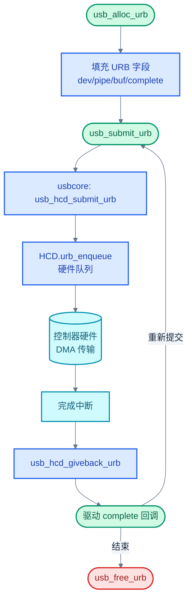

# USB 协议与驱动

> 本篇以 USB 2.0 为主线，从"主机轮询 + 端点寻址"的本质出发，逐层展开物理层（NRZI + 位填充 + HS 握手）、协议层（包格式与四种传输类型）、设备框架（描述符层次与标准请求）、Linux USB 子系统（URB 生命周期 + HCD 抽象 + Gadget 框架 + DWC2/DWC3 双角色驱动），并与 Zephyr UDC/UHC 双栈框架对照。
>
> **工程师视角**：USB 是五种协议里最复杂的——枚举、端点、传输类型、角色切换层层叠加。调试 USB 问题（枚举失败、端点 STALL、HS 握手失败）时，"哪一层出了问题"比"哪个寄存器错了"更重要。先把分层模型立起来，再钻寄存器。

### 关键术语

| **缩写** | **全称** | **含义** |
|------|------|------|
| USB | Universal Serial Bus | 通用串行总线 |
| URB | USB Request Block | USB 请求块，Linux 主机侧异步传输单元 |
| HCD | Host Controller Driver | 主机控制器驱动 |
| UDC | USB Device Controller | USB 设备控制器（外设侧） |
| UHC | USB Host Controller | USB 主机控制器（Zephyr 中与 UDC 对应） |
| NRZI | Non-Return-to-Zero Inverted | 非归零反转编码 |
| EOP | End of Packet | 包结束标志（D+/D- 同时低） |
| SOP | Start of Packet | 包起始标志（D+/D- 由空闲翻转到 K 状态） |
| PID | Packet Identifier | 包标识符（4 位类型 + 4 位校验） |
| OTG | On-The-Go | 双角色协议，允许设备在主机/外设间切换 |
| HNP | Host Negotiation Protocol | 主机协商协议（OTG 角色切换） |
| SRP | Session Request Protocol | 会话请求协议（B 设备请求 A 设备上电） |
| HS | High Speed | 高速，480 Mbps |
| FS | Full Speed | 全速，12 Mbps |
| LS | Low Speed | 低速，1.5 Mbps |
| SS | SuperSpeed | 超速，5 Gbps（USB 3.0+） |
| TT | Transaction Translator | 事务翻译器，Hub 把 HS 事务转成 FS/LS |
| DWC | DesignWare Cores | Synopsys 的 USB IP 系列（dwc2/dwc3） |
| xHCI | extensible Host Controller Interface | USB 3.0 主机控制器标准接口 |
| TRB | Transfer Request Block | DWC3 传输描述符（xHCI 风格） |
| EP | Endpoint | 端点 |
| MPS | Maximum Packet Size | 端点最大包长 |
| ZLP | Zero Length Packet | 零长度包，标志传输结束 |
| SOF | Start of Frame | 帧起始包，每 1 ms（HS 为 125 µs 微帧）一次 |
| QH | Queue Head | 队列头（EHCI/DWC2 等按端点聚合） |
| QTD | Queue Transfer Descriptor | 队列传输描述符（按 URB 切分） |
| PLL | Phase-Locked Loop | 锁相环，用于时钟恢复 |
| DESC | Descriptor | 描述符（设备/配置/接口/端点） |

### 前置知识

| **需要了解** | **参考文档** |
|----------|----------|
| 差分信号与同步/异步通信 | [00-通信协议总览](./00-通信协议总览.md) |
| Linux 驱动模型（probe、platform driver） | [01-SPI协议与驱动](./01-SPI协议与驱动.md) |
| 设备树基础语法 | [03-CAN协议与驱动](./03-CAN协议与驱动.md) |

---

## 1. USB 本质：主机轮询的端点寻址总线

> [00-通信协议总览](./00-通信协议总览.md) 已把 USB 定位为"主机轮询、端点寻址的即插即用总线"。这一章用插鼠标的具体例子把这两件事说透——为什么设备不能主动通知主机？为什么端点比"地址"更能描述 USB 的通信单元？

### 1.1 一个具体场景：插入 USB 鼠标

把 USB 鼠标插到主机后，肉眼看到的是"指针能动"，底层实际经历两个阶段：

1. **枚举阶段**（毫秒级）：
   - 主机检测到 D+ 上拉，知道来了一个 FS 设备
   - 主机用默认地址 0 通过 EP0（控制端点）读鼠标的设备描述符，发现它声明自己是 HID 类设备
   - 主机发 `SET_ADDRESS` 给鼠标分配地址 5
   - 再读配置描述符，发现配置 1 下有一个接口（HID）和两个端点（EP1 IN 中断、EP2 OUT 中断可选）
   - 主机发 `SET_CONFIGURATION(1)` 激活该配置

2. **运行阶段**：此后每 8 ms，主机发一个 IN 令牌到"地址 5、端点 1、方向 IN"，鼠标如果有数据就在 DATA1 里回 4 字节（按键状态 + X/Y 增量），主机回 ACK；没数据就回 NAK。

> **核心要点**：枚举阶段主机是"提问者"，设备是"回答者"——主机不问，设备什么都不主动说。运行阶段的中断传输名字虽叫"中断"，但**轮询动作由主机发起**，设备只是被问到时才有机会应答。这与 PCI/GPIO 那种"设备拉中断线主动通知 CPU"完全相反。

### 1.2 与 CAN 对比：为什么 USB 选轮询

| **对比维度** | **USB** | **CAN** |
|----------|-----|-----|
| 拓扑 | 树型（Hub 扩展） | 总线 + 终端电阻 |
| 谁发起传输 | 主机轮询 | 任一节点可发起 |
| 地址模型 | 设备地址 + 端点号 | 帧 ID（兼做优先级） |
| 错误恢复 | 主机重传（最多 3 次） | 自动重传 + Bus-off |
| 即插即用 | 枚举协议分配地址 | 无枚举，节点固定 ID |
| 物理介质 | 差分对 D+/D-（半双工） | 差分对 CANH/CANL（半双工） |
| 速率典型 | 12/480/5000 Mbps | 1/5/8 Mbps |
| 应用场景 | 人机外设、存储 | 工控、汽车 |

USB 选轮询的根本原因：USB 要支持**即插即用**——主机必须知道总线上有哪些设备、它们的能力是什么，才能加载驱动。如果允许设备主动发送，主机就无法在未知设备接入时维护总线秩序。轮询让主机成为唯一调度者，枚举协议让主机能逐个识别并配置设备。CAN 不需要即插即用（节点固定），所以选了对等广播。

### 1.3 端点：USB 的通信单元

USB 的寻址是**两级**：设备地址（7 位，0–127）+ 端点号（4 位，0–15）+ 方向（IN/OUT）。每个设备有一个必须的 **EP0**（双向控制端点），用于枚举和标准请求；其余端点都是**单向**的，方向在端点描述符里固定。

> **为什么端点是单向的？** 因为 USB 2.0 是半双工差分对（D+/D-），物理上同一时刻只能一个方向传。把端点设为单向后，每个端点对应一个独立的"管道"，驱动可以独立排队多个 URB，HCD 调度器按端点轮询，不必在端点内分时切换方向。USB 3.0 增加独立 TX/RX 差分对后，端点方向更多是逻辑约束而非物理约束。

### 1.4 USB 速度档次

| **速度** | **速率** | **上拉位置** | **典型用途** | **线缆最大长度** |
|------|------|----------|----------|------|
| **LS** | 1.5 Mbps | D- 拉高到 3.3V | 鼠标、键盘 | 3 m |
| **FS** | 12 Mbps | D+ 拉高到 3.3V | U 盘、音频 | 5 m |
| **HS** | 480 Mbps | 握手升级（无上拉） | 摄像头、大容量存储 | 5 m |
| **SS** | 5 Gbps | 独立 TX/RX 差分对 | SSD、4K 视频 | 1 m（无有源线缆） |
| **SS+** | 10 Gbps | 同 SS | 高速 SSD | 1 m |

LS/FS 通过上拉位置区分，主机一上电就能识别。HS 的识别更复杂：设备先以 FS 接入，主机发 Chirp K/J 握手序列，双方确认都支持 HS 后断开 FS 上拉、切换到 HS 模式（电流驱动 ±0.4V）。这就是"HS 握手失败"问题的来源——PHY 时序不达标就退回 FS。

---

## 2. 物理层：差分信号与编码

> 上一章讲了"谁和谁通信"，这一章讲"线上的位怎么编码"。USB 物理层的关键是用 D+/D- 一对差分线同时承载**时钟和数据**——这是它能在 480 Mbps 跑半双工的基础。

### 2.1 D+/D- 差分对与单端状态

USB 2.0 用一对差分线 D+/D-，配合单端 SE0（D+ 和 D- 同时为低）表示特殊状态（EOP、复位）。差分信号定义：

| **状态** | **D+** | **D-** | **含义** |
|------|------|------|------|
| **J (FS)** | 高 | 低 | 空闲态（FS） |
| **K (FS)** | 低 | 高 | SOP 起始（FS） |
| **SE0** | 低 | 低 | 复位、EOP |
| **SE1** | 高 | 高 | 非法状态 |

注意 LS 与 FS 的 J/K 定义相反——LS 的 J 是 D- 高 D+ 低。这是为了在 Hub 内部用相同硬件电路处理两种速度。

### 2.2 NRZI 编码：把时钟藏进数据

USB 2.0 用 NRZI（Non-Return-to-Zero Inverted）编码：**遇到 0 翻转电平，遇到 1 保持电平**。注意是"翻转/保持"而不是"高/低电平"——具体电平取决于前一时刻的状态。

> **为什么不用普通 NRZ？** 因为 NRZ 在长串 1（或长串 0）时电平不变，接收端的 PLL 会因缺少边沿而失锁。NRZI 把"翻转"对应到 0，配合位填充（下一节）就能保证足够多的边沿。

**小例子**：发送 8 位数据 `0xB4 = 10110100`，假设起始电平为低（0）：

- bit 0 (1) → 保持 → 0
- bit 1 (0) → 翻转 → 1
- bit 2 (1) → 保持 → 1
- bit 3 (1) → 保持 → 1
- bit 4 (0) → 翻转 → 0
- bit 5 (1) → 保持 → 0
- bit 6 (0) → 翻转 → 1
- bit 7 (0) → 翻转 → 0

最终线上的电平序列：`0 1 1 1 0 0 1 0`，共 3 次翻转。接收端按翻转=0、保持=1 解码即可。

### 2.3 位填充：保证 PLL 可恢复时钟

NRZI 仍有缺陷：如果数据是连续的 1，电平一直保持，PLL 还是会失锁。**位填充规则**：发送端在**原始数据流**中每遇到连续 6 个 1，就**插入一个 0**；接收端检测到连续 6 个 1 后删掉下一个 0。

> **为什么是 6 而不是 5 或 7？** 经验上 PLL 在 6–7 个位周期内仍能保持锁相，再长就会因本地时钟漂移而采样错位。USB 2.0 spec 第 7.1.1 节选 6 是硬件 PLL 设计余量与协议开销的折中。

#### 数值演算：发送 0xFF 的实际开销

发送字节 `0xFF = 11111111`（8 个 1）：

1. **位填充**：连续 6 个 1 后插入 0，得到 `1 1 1 1 1 1 0 1 1`（9 个位，插入 1 个 0）
2. **NRZI 编码**（起始电平低 0）：保持 6 次→0 0 0 0 0 0，翻转→1，保持 2 次→1 1，最终 `000000111`
3. **开销**：1 个填充位 / 8 个数据位 = **12.5%**

最坏情况（全 1 数据流）下，每 6 个数据位插入 1 个填充位，开销上界为：

$$\eta_{\text{stuff}} = \frac{1}{6} \approx 16.7\%$$

- $\eta_{\text{stuff}}$：位填充引入的最大线缆开销（填充位 / 数据位）
- 分母 6：连续 6 个 1 即触发一次填充

对应 HS 模式下，原始 480 Mbps 的有效数据吞吐上界约为 $480 \times \frac{6}{7} \approx 411$ Mbps；实际数据因还有包格式开销（PID/ADDR/CRC/SOP/EOP），典型大容量传输吞吐在 350–400 Mbps 之间。

> **核心要点**：NRZI + 位填充是 USB 把时钟嵌入数据流的代价——它省了独立时钟线，但用 ~5–17% 的开销换来了 PLL 可恢复性。这就是为什么 USB 抓包工具显示的"线速率"和"有效吞吐"总有差距。

### 2.4 HS 握手与眼图

HS 设备接入时序：

1. 设备先以 FS 模式接入（D+ 上拉）
2. 主机发复位（SE0 持续 ≥ 2.5 µs）
3. 设备在复位结束后发 Chirp K（D- 拉低，持续 1–7 ms）
4. 主机检测到 Chirp K 后，交替发 Chirp K/J 序列（每段 40–60 µs）
5. 设备检测到 ≥ 3 对 KJ 后断开 D+ 上拉，进入 HS 模式
6. 主机检测到 D+/D- 都变低（HS 空闲态），切换到 HS 收发器

HS 信号完整性靠"眼图"评估：在 D+/D- 上叠加多个 UI（Unit Interval，约 2.08 ns）的波形，形成的"眼睛"形状。USB 2.0 spec 第 7.1.2.2 节给出眼图模板，要求眼图开口满足模板规格，否则接收端误码率上升。

### 2.5 USB 3.0 的全双工扩展

USB 3.0 在保留 D+/D-（兼容 USB 2.0）的同时，增加独立的 **TX+/TX-** 和 **RX+/RX-** 两对差分线，实现全双工 SuperSpeed（5 Gbps）。SS 不再使用 NRZI，改用 8b/10b 编码（自带时钟恢复 + DC 平衡），并引入独立的流控与电源管理链路状态机（U0/U1/U2/U3）。本文后续以 USB 2.0 为主，SS 仅在 dwc3 章节提及。

---

## 3. 协议层：包格式与传输类型

> 上一章解决了"位怎么上线"，这一章解决"位怎么组成有意义的事务"。USB 的协议层是三层嵌套：包（Packet）→ 事务（Transaction）→ 传输（Transfer）。

### 3.1 包格式

一个 USB 包由以下字段组成：

```
| SOP | PID | ADDR(7) | ENDP(4) | [DATA] | CRC | EOP |
```

- **SOP**：包起始，D+/D- 从空闲 J 状态翻转到 K
- **PID**：8 位，低 4 位是类型，高 4 位是低 4 位的取反（用于校验）
- **ADDR/ENDP**：仅令牌包有，定位目标端点
- **CRC**：令牌包用 CRC-5，数据包用 CRC-16
- **EOP**：SE0 持续 2 个位周期 + J 持续 1 个位周期

### 3.2 PID 类型与编码

| **PID 类别** | **PID 名** | **取值（低 4 位）** | **含义** |
|----------|------|------|------|
| **令牌** | OUT | 0001 | 主机给设备发数据 |
| | IN | 1001 | 主机请设备发数据 |
| | SOF | 0101 | 帧起始 |
| | SETUP | 1101 | 主机发起控制传输的握手阶段 |
| **数据** | DATA0 | 0011 | 数据包 0（偶序号） |
| | DATA1 | 1011 | 数据包 1（奇序号） |
| | DATA2 | 0111 | 仅 HS 等时/中断用 |
| | MDATA | 1111 | 仅 HS 等时用 |
| **握手** | ACK | 0010 | 接收正确 |
| | NAK | 1010 | 设备忙，请重试 |
| | STALL | 1110 | 端点错误或 unsupported，需主机干预 |
| | NYET | 0110 | 还没准备好（HS only，与 PING 配合） |
| **特殊** | PRE | 1100 | 前导包（主机通知 Hub 准备发 LS 事务） |
| | ERR | 1100 | Hub 报错（与 PRE 复用编码，由上下文区分） |
| | SPLIT | 1000 | 分割事务（Hub TT 用） |
| | PING | 0100 | HS 主机查询 OUT 端点是否就绪 |

> **为什么 DATA0/DATA1 要交替？** 防止 ACK 丢失导致的重复。假设主机发 DATA0，设备回 ACK 但 ACK 在线缆上被破坏，主机会重传 DATA0；如果不用交替，设备无法区分"新数据"和"重传的旧数据"。交替后，重传仍是 DATA0，设备看到连续两个 DATA0 就知道第二个是重传，丢弃并回 ACK。

### 3.3 事务的三阶段

USB 事务的标准三阶段：

```
主机 IN:   IN token  →  DATA  →  ACK/NAK/STALL
主机 OUT:  OUT token  →  DATA  →  ACK/NAK/STALL
主机 SETUP: SETUP token → DATA0 →  ACK（设备必须回 ACK）
```

SETUP 事务的特殊性：设备**必须**回 ACK，且 SETUP 包**必须**是 DATA0，因为 SETUP 是控制传输的起点，data toggle 要从 DATA0 重新开始。

### 3.4 四种传输类型

| **对比维度** | **控制 (Control)** | **批量 (Bulk)** | **中断 (Interrupt)** | **等时 (Isochronous)** |
|----------|----------------|-------------|------------------|--------------------|
| **端点方向** | EP0 双向 | 单向 | 单向 | 单向 |
| **带宽保证** | 保留 10%（HS） | 无 | 保留（按 interval） | 保留（按 interval） |
| **错误恢复** | 重传 | 重传（最多 3 次） | 重传 | **不重传** |
| **最大包长** | 64 B（HS） | 512 B（HS） | 1024 B（HS） | 1024 B（HS） |
| **典型用途** | 枚举、标准请求 | U 盘、打印机 | 鼠标、键盘 | 摄像头、音频 |
| **周期性** | 否 | 否 | 是（1 ms ~ 4 s） | 是（1 ms 或 125 µs） |

> **如何读这张表**：关键差异在"带宽保证"和"错误恢复"两列。等时传输为了恒定带宽牺牲了重传——摄像头丢一帧无所谓，但延迟一帧很糟。批量传输相反：U 盘写数据不能错，但可以等下一轮带宽空闲再传。

### 3.5 控制传输的 Setup/Data/Status 三阶段

控制传输是 USB 最复杂的传输类型，固定分为三阶段：

```
1. Setup 阶段：   主机发 SETUP token + DATA0（8 字节 setup packet） + 设备 ACK
2. Data 阶段（可选）：多个 IN 或 OUT 事务，DATA1/DATA0/DATA1... 交替
3. Status 阶段：   反方向 DATA1（0 长度或含状态码）+ ACK
```

**Status 阶段的方向**：

- 如果 Data 阶段是 IN（设备→主机），Status 是 OUT（主机→设备，DATA1 ZLP）
- 如果 Data 阶段是 OUT（主机→设备），Status 是 IN（设备→主机，DATA1 ZLP）
- 如果没有 Data 阶段（如 SET_ADDRESS），Status 是 IN（设备→主机，DATA1 ZLP）

Status ZLP 表示"操作已完成"——设备的 ZLP + ACK 就是承诺。

### 3.6 批量传输的 PING 流程

HS Bulk OUT 端点在高带宽场景下用 PING 协议优化：

```
传统 OUT（无 PING）：
   主机: OUT + DATA[512B] → 设备: NAK
   主机: OUT + DATA[512B] → 设备: NAK     （浪费带宽！）

HS PING 流程：
   主机: PING → 设备: NAK (未就绪)
   主机: PING → 设备: ACK (就绪)
   主机: OUT + DATA[512B] → 设备: ACK     （无浪费）
```

PING 是 HS 专属——LS/FS 的 Bulk 端点直接重试 OUT，因为带宽不大、重传开销可接受。

---

## 4. 设备框架：描述符与枚举

> 上一章讲了协议层"包→事务→传输"。这一章讲 USB 设备的逻辑框架——描述符层次与标准请求。这是枚举实现的核心：主机通过一系列 `GET_DESCRIPTOR` 控制请求逐步"看清"设备。

### 4.1 描述符层次

USB 描述符是**四级嵌套**：

```
Device Descriptor
└─ Configuration Descriptor
   └─ Interface Descriptor
      └─ Endpoint Descriptor
```

每个描述符都以 `bLength`（自身长度）+ `bDescriptorType`（类型）开头，方便遍历。`GET_DESCRIPTOR(Configuration)` 一次性返回配置 + 所有接口 + 所有端点的描述符链，`wTotalLength` 字段给出整条链的总字节数。

### 4.2 设备描述符（18 字节）

```c
struct __packed usb_device_descriptor {
    uint8_t  bLength;            // 18
    uint8_t  bDescriptorType;    // 1 (DEVICE)
    uint16_t bcdUSB;             // USB 版本，如 0x0200 = USB 2.0
    uint8_t  bDeviceClass;       // 类代码（0 = 由接口指定，0xFF = 厂商）
    uint8_t  bDeviceSubClass;
    uint8_t  bDeviceProtocol;
    uint8_t  bMaxPacketSize0;    // EP0 最大包长（LS=8, FS=8/16/32/64, HS=64）
    uint16_t idVendor;           // VID
    uint16_t idProduct;          // PID
    uint16_t bcdDevice;          // 设备版本
    uint8_t  iManufacturer;      // 厂商字符串索引（0 = 无）
    uint8_t  iProduct;           // 产品字符串索引
    uint8_t  iSerialNumber;      // 序列号字符串索引
    uint8_t  bNumConfigurations; // 配置数
};
```

**`bMaxPacketSize0` 的意义**：主机在 `SET_ADDRESS` 之前只能用 8 字节读取设备描述符（因为还不知道 EP0 的 MPS），第一次读 8 字节拿到 `bMaxPacketSize0`，第二次才能读完整 18 字节。

### 4.3 配置描述符（9 字节）

```c
struct __packed usb_config_descriptor {
    uint8_t  bLength;            // 9
    uint8_t  bDescriptorType;    // 2 (CONFIGURATION)
    uint16_t wTotalLength;       // 整条描述符链总长（含接口+端点）
    uint8_t  bNumInterfaces;     // 接口数
    uint8_t  bConfigurationValue;// 配置值（SET_CONFIGURATION 的参数）
    uint8_t  iConfiguration;     // 字符串索引
    uint8_t  bmAttributes;       // 自供电/远程唤醒位
    uint8_t  bMaxPower;          // 最大电流（以 2 mA 为单位，HS 上限 500 mA）
};
```

`bMaxPower` 的单位是 **2 mA**：值 50 表示 100 mA，值 250 表示 500 mA（USB 上限）。

### 4.4 接口与端点描述符

```c
struct __packed usb_interface_descriptor {
    uint8_t  bLength;            // 9
    uint8_t  bDescriptorType;    // 4 (INTERFACE)
    uint8_t  bInterfaceNumber;   // 接口号（SET_INTERFACE 的参数）
    uint8_t  bAlternateSetting;  // 备选设置号
    uint8_t  bNumEndpoints;      // 端点数（不含 EP0）
    uint8_t  bInterfaceClass;    // 类代码（HID=0x03, MSC=0x08, CDC=0x02）
    uint8_t  bInterfaceSubClass;
    uint8_t  bInterfaceProtocol;
    uint8_t  iInterface;
};

struct __packed usb_endpoint_descriptor {
    uint8_t  bLength;            // 7
    uint8_t  bDescriptorType;    // 5 (ENDPOINT)
    uint8_t  bEndpointAddress;   // bit7=方向(1=IN), bit3:0=端点号
    uint8_t  bmAttributes;       // bit1:0=传输类型(0=Ctrl,1=Iso,2=Bulk,3=Int)
    uint16_t wMaxPacketSize;     // MPS
    uint8_t  bInterval;          // 轮询间隔（INT/ISO 用）
};
```

### 4.5 标准请求（bRequest）

USB 2.0 spec 第 9.4 节定义了 11 个标准请求：

| **bRequest** | **值** | **含义** | **数据阶段方向** |
|------|------|------|------|
| GET_STATUS | 0 | 查询设备/接口/端点状态 | IN |
| CLEAR_FEATURE | 1 | 清除特性（如 ENDPOINT_HALT） | 无（ZLP status） |
| (reserved) | 2 | — | — |
| SET_FEATURE | 3 | 设置特性（如 DEVICE_REMOTE_WAKEUP） | 无 |
| SET_ADDRESS | 5 | 设置设备地址 | 无 |
| GET_DESCRIPTOR | 6 | 读描述符 | IN |
| SET_DESCRIPTOR | 7 | 写描述符（罕见支持） | OUT |
| GET_CONFIGURATION | 8 | 读当前配置值 | IN |
| SET_CONFIGURATION | 9 | 激活配置 | 无 |
| GET_INTERFACE | 10 | 读当前 alt setting | IN |
| SET_INTERFACE | 11 | 切换 alt setting | 无 |
| SYNCH_FRAME | 12 | 同步帧号（ISO 端点用） | IN |

每个请求都是 8 字节 setup packet：

```c
struct __packed usb_ctrlrequest {
    uint8_t  bmRequestType;  // bit7=方向, bit5:6=类型, bit0:4= recipient
    uint8_t  bRequest;       // 上表中的值
    uint16_t wValue;         // 请求特定参数（如描述符类型在高字节）
    uint16_t wIndex;         // 请求特定参数（如接口号或端点号）
    uint16_t wLength;        // Data 阶段字节数
};
```

### 4.6 枚举流程详解

枚举是 USB 即插即用的核心。主机通过 EP0（控制传输）与设备交互：

1. **接入检测**：设备接入，主机通过 D+/D- 上拉检测速度（LS/FS），或与设备做 HS 握手升级到 HS
2. **复位**：主机发复位（SE0 ≥ 10 ms），设备进入默认状态（地址 0）
3. **首读设备描述符**：主机发 `GET_DESCRIPTOR(Device)` 到地址 0、端点 0，读取 **8 字节**（只到 `bMaxPacketSize0` 字段）
4. **设置地址**：主机发 `SET_ADDRESS(5)`，设备从此用地址 5 应答
5. **完整读设备描述符**：主机重新 `GET_DESCRIPTOR(Device)` 读取完整 18 字节
6. **读配置描述符链**：主机 `GET_DESCRIPTOR(Configuration)` 先读 9 字节拿到 `wTotalLength`，再按 `wTotalLength` 重读完整链
7. **读字符串描述符**（可选）：根据 `iManufacturer`/`iProduct`/`iSerialNumber` 读字符串
8. **激活配置**：主机 `SET_CONFIGURATION(1)` 激活配置，相关端点可用
9. **类特定枚举**：如 HID 设备读 HID 描述符、报告描述符；MSC 设备读最大 LUN
10. **接口探测**：Linux 内核按接口的 `bInterfaceClass` 匹配 `usb_driver`，调用其 `probe`

> **核心要点**：枚举的每一步都是"主机问 → 设备答"的控制传输。地址 0 是共享地址，同一时刻只能有一个未分配地址的设备接入——这是 Hub 的"端口复位"机制存在的根本原因：复位一个端口使其上的设备进入默认状态，其他端口保持禁用。

### 4.7 USB 2.0 spec 关键章节导读

USB 2.0 spec（usb.org 注册后下载，文件名 `usb_20_*.pdf`）与驱动开发最相关的章节：

| **章节** | **内容** | **驱动开发关注点** |
|------|------|----------------|
| **第 5 章 Protocol Layer** | 包格式、事务、传输类型、PID | 协议层调试基础 |
| **第 7 章 Interconnect** | 电气层、位填充、NRZI、速度检测 | PHY/信号完整性问题 |
| **第 8 章 Electrical** | D+/D- 电气、上拉/下拉、眼图模板 | 硬件设计、眼图测试 |
| **第 9 章 Device Framework** | 描述符层次、标准请求 bRequest | 枚举实现、描述符解析 |
| **第 10 章 Hub** | Hub 行为、TT、事务翻译 | Hub 调试、FS/LS 设备经 HS Hub |
| **第 11 章 HID** | HID 类描述符、报告描述符 | 鼠标键盘驱动（类驱动） |

> **待确认**：USB 2.0 spec 具体版本号与最新修订日期请以 usb.org 公示为准；本文引用章节号基于 Rev 2.0 主线。

---

## 5. Linux USB 核心：URB 生命周期

> 前四章讲了协议规范。从这一章开始进入 Linux 驱动实现——Linux 用 URB 这个统一抽象把控制/批量/中断/等时四种传输都装进异步回调模型。理解 URB 生命周期是看懂任何 HCD 的前提。

### 5.1 URB 生命周期总览



> **如何读这张图**：绿色是驱动侧动作（分配/提交/回调），蓝色是 usbcore 与 HCD 软件流程，青色是硬件与中断，红色是终结。URB 一旦提交就归 HCD 所有，驱动不能在回调前修改 URB 字段——这是 `struct urb` 注释里反复强调的所有权规则。

### 5.2 struct urb 关键字段

URB 是 Linux USB 子系统的核心数据结构，定义在 [linux/include/linux/usb.h:1623](file:///home/pbw/2042f/linux/include/linux/usb.h#L1623)：

```c
// linux/include/linux/usb.h:1623
struct urb {
    /* private: usb core 和 HCD 私有字段 */
    struct kref kref;            /* 引用计数 */
    int unlinked;                /* 取消时的错误码 */
    void *hcpriv;                /* HCD 私有数据（如 QH/TD 指针） */
    atomic_t use_count;          /* 并发提交计数 */
    atomic_t reject;             /* 拒绝新提交 */

    /* public: 驱动可用的字段 */
    struct list_head urb_list;   /* 挂到端点的 urb_list */
    struct list_head anchor_list;
    struct usb_anchor *anchor;
    struct usb_device *dev;      /* (in) 目标设备 */
    struct usb_host_endpoint *ep;/* (internal) 目标端点 */
    unsigned int pipe;           /* (in) 端点号+方向+类型编码 */
    unsigned int stream_id;      /* (in) 流 ID（SS Bulk_streams） */
    int status;                  /* (return) 非 ISO 完成状态 */
    unsigned int transfer_flags; /* (in) URB_SHORT_NOT_OK 等 */
    void *transfer_buffer;       /* (in) 数据缓冲区 */
    dma_addr_t transfer_dma;     /* (in) dma addr for transfer_buffer */
    struct scatterlist *sg;      /* (in) scatter gather 缓冲 */
    int num_sgs;                 /* (in) sg 条目数 */
    u32 transfer_buffer_length;  /* (in) 缓冲区长度 */
    u32 actual_length;           /* (return) 实际传输长度 */
    unsigned char *setup_packet; /* (in) 控制传输的 8 字节 SETUP */
    dma_addr_t setup_dma;
    int start_frame;             /* (in/out) ISO 起始帧 */
    int number_of_packets;       /* (in) ISO 包数 */
    int interval;                /* (in) INT/ISO 轮询间隔 */
    int error_count;             /* (return) ISO 错误计数 */
    void *context;               /* (in) 回调上下文 */
    usb_complete_t complete;     /* (in) 完成回调 */
    struct usb_iso_packet_descriptor iso_frame_desc[]; /* ISO 专用 */
};
```

关键字段含义：

- `pipe`：用 `usb_sndintpipe(dev, ep)`、`usb_rcvbulkpipe(dev, ep)` 等宏构造，把端点号、方向、类型打包成一个 `unsigned int`
- `transfer_flags`：`URB_SHORT_NOT_OK`（短读当错误）、`URB_ZERO_PACKET`（批量 OUT 末尾补零包）、`URB_NO_TRANSFER_DMA_MAP`（已 DMA 映射）
- `status`：回调里必查，`0` 成功、`-EPIPE` STALL、`-EPROTO` 线错误、`-ECONNRESET` 被取消
- `hcpriv`：HCD 私有数据，dwc2 里指向 `dwc2_qtd`，xHCI 里指向 `xhci_td`
- `kref` + `use_count`：URB 可被多个所有者共享（`usb_get_urb` 增引用，`usb_free_urb` 减引用；`usb_submit_urb` 增 use_count，giveback 时减）

### 5.3 usb_submit_urb 完整流程

[usb_submit_urb](file:///home/pbw/2042f/linux/drivers/usb/core/urb.c#L367) 的实现做了大量参数校验，确保 HCD 拿到的是合法 URB：

1. **基础校验**：URB 非 NULL、`complete` 已设、`hcpriv` 为 NULL（即未活跃）、`dev` 状态合法
2. **端点查找**：从 `urb->pipe` 解析端点号与方向，在 `dev->ep[]` 中找 `usb_host_endpoint`，找不到返回 `-ENOENT`
3. **控制传输方向校验**：从 setup_packet 的 `bRequestType` bit7 推导方向，与 pipe 方向比对
4. **MPS 校验**：`usb_endpoint_maxp(&ep->desc)` 必须非零
5. **ISO 校验**：每个 `iso_frame_desc[].length` ≤ `max`，`number_of_packets > 0`
6. **interval 规范化**：根据速度把 `interval` 对齐到 2 的幂（HS: 1~32768 µframe, FS/LS INT: 1~128 ms, FS/LS ISO: 1~1024 ms）
7. **transfer_flags 过滤**：只保留该传输类型允许的标志，warn 不合法的标志
8. **委托 HCD**：`usb_hcd_submit_urb(urb, mem_flags)`

### 5.4 URB 完成回调上下文

URB 完成（无论成功还是失败）最终都会调到 `urb->complete`，**关键问题**：在什么上下文？

- **传统 HCD**（UHCI/OHCI/EHCI）：在硬件中断上下文或 tasklet/bh 上下文（取决于 `HCD_BH` 标志）
- **现代 HCD**（xHCI、dwc2 with `HCD_BH`）：在 tasklet（`giveback_urb_bh`）上下文——usbcore 把 giveback 推到 bh，避免在中断里跑驱动回调
- **gadget side `usb_request.complete`**：同样在 IRQ 或 bh 上下文

驱动回调必须遵守：

- 不能睡眠（不能调 `mutex_lock`、`kmalloc(GFP_KERNEL)`、`wait_event`）
- 不能长时间运行（影响其他端点调度）
- 不能在持自旋锁时调用 `usb_submit_urb`（因为提交可能调 `kmalloc`），用 `GFP_ATOMIC` 可以
- 可以在回调里重新提交 URB（这是中断/ISO 端点的标准模式）

### 5.5 URB 取消：unlink vs kill

| **API** | **语义** | **阻塞?** | **状态码** | **使用场景** |
|------|------|------|------|------|
| `usb_unlink_urb` | 异步取消 | 不阻塞 | `-ECONNRESET` | 在 IRQ/持锁上下文取消 |
| `usb_kill_urb` | 同步取消 | 阻塞至 giveback 完成 | `-ENOENT` | disconnect/close 时清理 |
| `usb_poison_urb` | kill + 永久禁用 | 阻塞 | `-ENOENT` | 设备下线后防再提交 |
| `usb_unpoison_urb` | 恢复可提交 | 不阻塞 | — | 与 poison 配对 |
| `usb_block_urb` | 仅禁用提交 | 不阻塞 | — | 不取消已有 URB |

`usb_kill_urb` 的关键实现（[urb.c:703](file:///home/pbw/2042f/linux/drivers/usb/core/urb.c#L703)）：

```c
void usb_kill_urb(struct urb *urb)
{
    might_sleep();                          // 不允许在 IRQ/持锁上下文调用
    atomic_inc(&urb->reject);               // 阻止后续 submit
    smp_mb__after_atomic();
    usb_hcd_unlink_urb(urb, -ENOENT);       // 让 HCD 取消
    wait_event(usb_kill_urb_queue,          // 等 use_count 归零
               atomic_read(&urb->use_count) == 0);
    atomic_dec(&urb->reject);
}
```

### 5.6 usb_anchor：批量管理 URB

[usb_anchor_urb](file:///home/pbw/2042f/linux/drivers/usb/core/urb.c#L126) 把 URB 挂到 `struct usb_anchor` 上，便于一次性取消/等待所有挂起的 URB：

```c
struct usb_anchor anchor;
init_usb_anchor(&anchor);

for (i = 0; i < N; i++) {
    urb = usb_alloc_urb(0, GFP_KERNEL);
    /* 填充 URB */
    usb_anchor_urb(urb, &anchor);
    usb_submit_urb(urb, GFP_KERNEL);
    usb_free_urb(urb);  /* anchor 持有引用 */
}

/* 等所有 URB 完成 */
usb_wait_anchor_empty_timeout(&anchor, 500);

/* 或一次性取消 */
usb_kill_anchored_urbs(&anchor);
```

> **核心要点**：Linux USB 主机侧是**两层抽象**——`struct urb`（通用请求）+ `struct hc_driver`（HCD 接口）。任何 HCD（EHCI/OHCI/xHCI/dwc2）只要实现 `urb_enqueue/urb_dequeue` 和 Hub 钩子，就能对接 usbcore；上层类驱动（HID/storage）只看 `struct urb`，不关心具体 HCD。这种解耦是 Linux 能在几十种 SoC 上跑同一套 USB 类驱动的基础。

---

## 6. Linux HCD 抽象层

> 上一章讲了 URB 这个"通用请求"对象。这一章讲 HCD 接口——上层 usbcore 通过 `struct hc_driver` 这张回调表调用具体控制器驱动，HCD 把 URB 翻译成硬件操作。

### 6.1 struct hc_driver 关键回调

HCD 接口定义在 [linux/include/linux/usb/hcd.h:237](file:///home/pbw/2042f/linux/include/linux/usb/hcd.h) 的 `struct hc_driver`：

```c
struct hc_driver {
    const char  *description;
    size_t      hcd_priv_size;     /* HCD 私有数据大小（挂在 usb_hcd 末尾） */
    irqreturn_t (*irq)(struct usb_hcd *hcd);
    int         flags;             /* HCD_USB2 / HCD_USB3 / HCD_DMA / HCD_BH */

    /* 生命周期 */
    int  (*reset)(struct usb_hcd *hcd);
    int  (*start)(struct usb_hcd *hcd);
    void (*stop)(struct usb_hcd *hcd);

    /* URB 提交/取消——HCD 的核心入口 */
    int  (*urb_enqueue)(struct usb_hcd *hcd, struct urb *urb, gfp_t mem_flags);
    int  (*urb_dequeue)(struct usb_hcd *hcd, struct urb *urb, int status);

    /* 端点/Hub 钩子 */
    void (*endpoint_disable)(struct usb_hcd *hcd, struct usb_host_endpoint *ep);
    void (*endpoint_reset)(struct usb_hcd *hcd, struct usb_host_endpoint *ep);
    int  (*hub_status_data)(struct usb_hcd *hcd, char *buf);
    int  (*hub_control)(struct usb_hcd *hcd, u16 typeReq, u16 wValue,
                        u16 wIndex, char *buf, u16 wLength);
    int  (*bus_suspend)(struct usb_hcd *hcd);
    int  (*bus_resume)(struct usb_hcd *hcd);

    /* xHCI 专用：直接对应 xHCI 命令 */
    int  (*alloc_dev)(struct usb_hcd *hcd, struct usb_device *udev);
    void (*free_dev)(struct usb_hcd *hcd, struct usb_device *udev);
    int  (*address_device)(struct usb_hcd *hcd, struct usb_device *udev);
    int  (*enable_device)(struct usb_hcd *hcd, struct usb_device *udev);
    int  (*update_hub_device)(struct usb_hcd *hcd, struct usb_device *hdev);
    int  (*reset_device)(struct usb_hcd *hcd, struct usb_device *udev);
    int  (*alloc_streams)(struct usb_hcd *hcd, struct usb_device *udev,
                          struct usb_host_endpoint **eps, unsigned int num_eps,
                          unsigned int num_streams, gfp_t mem_flags);
    /* ... */
};
```

### 6.2 struct usb_hcd：控制器运行时实例

[struct usb_hcd](file:///home/pbw/2042f/linux/include/linux/usb/hcd.h#L68) 是 HCD 的运行时实例，包含：

- `const struct hc_driver *driver`：hw 钩子表
- `void __iomem *regs`：寄存器基址
- `struct usb_bus self`：挂到 USB 总线
- `struct giveback_urb_bh`：URB 完成的 bh（high_prio_bh 和 normal_bh 两个）
- `unsigned long flags`：HCD_MEMORY / HCD_USB2 / HCD_USB3 / HCD_BH 等
- `struct usb_hcd *primary_hcd`：SS+SS+ 复合控制器的主 HCD
- 私有数据：`hcd_priv_size` 字节挂在 `usb_hcd` 末尾（如 `struct dwc2_hsotg`）

### 6.3 usb_hcd_submit_urb 流程

usbcore 的 `usb_hcd_submit_urb`（[hcd.c](file:///home/pbw/2042f/linux/drivers/usb/core/hcd.c)）做几件事：

1. **根集线器特判**：如果 URB 目标是 root hub 的 EP0，调用 `rh_urb_enqueue` → 走 root hub 模拟（不发真实 USB 包，直接读 HCD 的 hub 状态寄存器）
2. **bandwidth 检查**：对 INT/ISO 端点，检查是否还有周期带宽可用（xHCI 在 `alloc_dev`/`enable_device` 时已分配，跳过）
3. **DMA 映射**：如果 `URB_NO_TRANSFER_DMA_MAP` 未设，调用 `usb_hcd_map_urb_for_dma` 把 `transfer_buffer` 映射成 DMA 地址
4. **调 `hcd->driver->urb_enqueue`**：进入具体 HCD

### 6.4 usb_hcd_giveback_urb 流程

HCD 在硬件完成后调 `usb_hcd_giveback_urb`（[hcd.c](file:///home/pbw/2042f/linux/drivers/usb/core/hcd.c)）：

1. 把 URB 从 `ep->urb_list` 摘下
2. 设置 `urb->status`（由 HCD 提供）
3. 减 `urb->use_count`
4. **调用 `urb->complete`**——直接调或推到 bh（如果 HCD 设了 `HCD_BH`，先唤醒 `giveback_urb_bh`，bh 里再调 complete）
5. 唤醒等待 use_count 的 killer

### 6.5 根集线器模拟

每个 HCD 必须实现一个**虚拟 root hub**——usbcore 把 root hub 当普通 Hub 设备处理，但实际不发 USB 包。`rh_urb_enqueue` 拦截 root hub 的控制 URB，根据 `bRequest` 调用 HCD 的 `hub_status_data`/`hub_control` 等回调读硬件状态。

例如 `GET_DESCRIPTOR(Hub)` 直接返回 spec 规定的 Hub 描述符模板（不需硬件参与）；`SET_FEATURE(PORT_RESET)` 调 `hub_control` 让 HCD 在指定端口发复位信号。

### 6.6 HCD 注册：usb_add_hcd

[usb_add_hcd](file:///home/pbw/2042f/linux/drivers/usb/core/hcd.c) 把 HCD 注册到 usbcore：

1. 分配 `struct usb_bus`，注册到 USB 总线
2. 创建 `usb_device` 表示 root hub（虚拟设备）
3. 注册 root hub 设备到 USB 总线
4. 注册 IRQ 处理函数（如未用 polling 模式）
5. 调 `hcd->driver->start` 启动控制器
6. 启动 root hub 的 hub 线程，开始枚举

---

## 7. Linux 设备枚举与 hub 驱动

> 上一章讲了 HCD 的接口。这一章讲 hub 驱动——usbcore 的 [hub.c](file:///home/pbw/2042f/linux/drivers/usb/core/hub.c) 是 USB 即插即用的核心，负责端口事件检测、复位、设备地址分配、配置激活。

### 7.1 hub 线程与端口事件

hub 驱动有一个内核线程 `hub_thread`，通过 `hub_event_list` 处理所有 hub 的事件。每个 hub 注册时启动一个 `hub_wq` 工作队列项，当 hub 端口状态变化（连接、断开、复位完成、过流等）时：

1. HCD 的 `hub_status_data` 回调返回非零（端口状态位图）
2. usbcore 调 `kick_hub_wq` 把 hub 推到工作队列
3. `hub_event` 处理每个变化位
4. 调用 `hub_port_connect_change` 处理连接事件

### 7.2 hub_port_connect_change 流程

[hub_port_connect_change](file:///home/pbw/2042f/linux/drivers/usb/core/hub.c) 是枚举的入口：

1. **复位端口**：发 `SET_FEATURE(PORT_RESET)`，等 100 ms
2. **检测速度**：通过 `USB_PORT_STAT_LOW_SPEED`/`HIGH_SPEED` 位判断
3. **分配 usb_device**：`usb_alloc_dev(hdev, hdev->bus, port1)`，分配 `usb_device` + `usb_device_descriptor` + 端点数组
4. **读设备描述符前 8 字节**：`usb_get_device_descriptor(udev, 8)`，拿 `bMaxPacketSize0`
5. **设置地址**：`hub_set_address(udev, devnum)`，发 `SET_ADDRESS(devnum)`，等 10 ms 让设备稳定
6. **完整读设备描述符**：`usb_get_device_descriptor(udev, USB_DT_DEVICE_SIZE)`，18 字节
7. **读配置描述符**：`usb_get_configuration(udev)`，先读 9 字节拿 `wTotalLength`，再按 `wTotalLength` 读完整链
8. **选配置**：`usb_choose_configuration(udev)` 根据电源、接口数选最优
9. **激活配置**：`usb_set_configuration(udev, config)`，发 `SET_CONFIGURATION`，并触发接口的 `probe`
10. **注册设备**：`device_add(&udev->dev)`，让 sysfs 出现 `/sys/bus/usb/devices/1-1`

### 7.3 usb_disconnect 流程

[usb_disconnect](file:///home/pbw/2042f/linux/drivers/usb/core/hub.c) 处理设备拔出：

1. 标记 `udev->state = USB_STATE_NOTATTACHED`
2. 遍历所有 active 配置的接口，调 `usb_driver_disconnect`
3. 取消所有挂起的 URB（`usb_disable_device`）
4. 释放设备地址（在 HCD 中）
5. `device_del` & `put_device`，让 sysfs 消失

### 7.4 接口 probe 匹配

类驱动通过 `struct usb_driver` 的 `id_table` 声明它支持哪些设备/接口：

```c
static const struct usb_device_id hid_usb_ids[] = {
    { .match_flags = USB_DEVICE_ID_MATCH_INT_CLASS,
      .bInterfaceClass = USB_INTERFACE_CLASS_HID },
    { } /* terminator */
};
MODULE_DEVICE_TABLE(usb, hid_usb_ids);

static struct usb_driver hid_driver = {
    .name = "usbhid",
    .id_table = hid_usb_ids,
    .probe = usbhid_probe,
    .disconnect = usbhid_disconnect,
};
```

匹配维度（按优先级）：

- `USB_DEVICE_ID_MATCH_DEVICE`：VID+PID 精确匹配
- `USB_DEVICE_ID_MATCH_INT_CLASS` / `INT_SUBCLASS` / `INT_PROTOCOL`：按接口类
- `USB_DEVICE_ID_MATCH_DEVICE_AND_INTERFACE`：VID+PID + 接口类
- `USB_DEVICE_ID_MATCH_VENDOR`：仅 VID

匹配成功后 usbcore 调 `driver->probe(intf, id)`，类驱动在 probe 里分配端点、提交初始 URB。

---

## 8. Linux USB Gadget 框架

> 上一章讲了主机侧的 URB/HCD。这一章讲外设侧的 Gadget 框架——Linux 用 `struct usb_gadget` + `struct usb_ep` + `struct usb_request` 三件套把外设侧也抽象成"提交请求 → 回调完成"模型，但语义与主机侧有微妙差异。

### 8.1 三件套：gadget / ep / request

```c
// include/linux/usb/gadget.h
struct usb_gadget {
    struct usb_device_descriptor *dev;       /* 设备描述符 */
    const struct usb_gadget_driver *driver;  /* 当前绑定的驱动 */
    struct usb_ep *ep0;                       /* 控制端点 */
    struct list_head ep_list;                 /* 其他端点 */
    enum usb_device_speed speed;
    unsigned max_speed;
    enum usb_device_state state;
    unsigned sg_supported:1;
    unsigned is_otg:1;
    /* ... */
    const struct usb_gadget_ops *ops;
};

struct usb_ep {
    void *driver_data;
    const struct usb_endpoint_descriptor *desc;  /* 端点描述符 */
    struct usb_ep_caps caps;
    struct usb_request *stalled;
    const struct usb_ep_ops *ops;
    struct list_head ep_list;
    unsigned maxpacket_limit;
    unsigned max_streams;
    unsigned mult:2;
    unsigned maxburst:5;
    u8 address;
    const char *name;
};

struct usb_request {
    void *buf;                 /* 数据缓冲 */
    unsigned length;           /* 请求长度 */
    unsigned actual;           /* 实际传输 */
    dma_addr_t dma;
    struct scatterlist *sg;
    unsigned num_sgs;
    unsigned num_mapped_sgs;
    unsigned stream_id:16;
    unsigned no_interrupt:1;
    unsigned zero:1;           /* 末尾补 ZLP */
    unsigned short_not_ok:1;
    void (*complete)(struct usb_ep *ep, struct usb_request *req);
    void *context;
    struct list_head list;
    int status;
    unsigned int frame_number;  /* ISO 用 */
    unsigned int length32;
};
```

### 8.2 Gadget API vs 主机侧 URB API

| **对比维度** | **主机侧 URB** | **Gadget 侧 usb_request** |
|----------|----------|----------|
| **请求类型** | `struct urb` | `struct usb_request` |
| **提交接口** | `usb_submit_urb` | `usb_ep_queue` |
| **取消** | `usb_unlink_urb` / `usb_kill_urb` | `usb_ep_dequeue` |
| **分配** | `usb_alloc_urb` | `usb_ep_alloc_request` |
| **完成上下文** | bh / IRQ | IRQ（驱动回调） |
| **传输方向** | 主机决定（IN/OUT 由 pipe 编码） | 主机决定（gadget 响应 IN/OUT 事件） |
| **端点所有权** | 设备的端点，主机驱动引用 | gadget 的端点，function 通过 `usb_ep_autoconfig` 申请 |

### 8.3 Composite Framework

[Composite Framework](file:///home/pbw/2042f/linux/drivers/usb/gadget/composite.c) 让一个 USB 设备能聚合多个 function（如 ACM + ECM + MSC）：

```c
struct usb_composite_driver {
    struct usb_gadget_driver gadget_driver;
    const char *name;
    const struct usb_device_id *id_table;
    struct usb_composite_dev *(*bind)(struct usb_composite_driver *cdrv);
    void (*unbind)(struct usb_composite_dev *cdev);
    int (*disconnect)(struct usb_composite_dev *cdev);
    void (*suspend)(struct usb_composite_dev *cdev);
    void (*resume)(struct usb_composite_dev *cdev);
    struct usb_gadget_strings **strings;
    struct usb_descriptor_header **descriptors;
};

struct usb_function {
    const char *name;
    struct usb_gadget_strings **strings;
    struct usb_descriptor_header **fs_descriptors;
    struct usb_descriptor_header **hs_descriptors;
    struct usb_descriptor_header **ss_descriptors;

    int (*bind)(struct usb_configuration *c, struct usb_function *f);
    void (*unbind)(struct usb_configuration *c, struct usb_function *f);
    int (*set_alt)(struct usb_function *f, unsigned intf, unsigned alt);
    void (*disable)(struct usb_function *f);
    int (*get_alt)(struct usb_function *f, unsigned intf);
    void (*free_func)(struct usb_function *f);
    int (*setup)(struct usb_function *f, const struct usb_ctrlrequest *ctrl);
    void (*suspend)(struct usb_function *f);
    void (*resume)(struct usb_function *f);

    struct usb_configuration *config;
    struct usb_gadget_strings **strings;
    struct list_head list;
    /* ... */
};
```

**Composite 的核心机制**：

1. **bind 阶段**：composite_driver 调每个 function 的 `bind`，让 function 用 `usb_ep_autoconfig` 申请端点，并填好接口描述符
2. **set_config 阶段**：主机发 `SET_CONFIGURATION` 后，composite 调每个 function 的 `set_alt`，function 在 `set_alt` 里 `usb_ep_enable` 启用端点，并 `usb_ep_queue` 提交初始 OUT 请求
3. **setup 阶段**：控制传输 setup 包到达时，composite 先看是不是标准请求（如 `GET_DESCRIPTOR`），否则分发给 function 的 `setup` 回调

### 8.4 Function 驱动示例：f_acm

[CDC ACM function](file:///home/pbw/2042f/linux/drivers/usb/gadget/function/f_acm.c) 实现虚拟串口：

```c
static int acm_set_alt(struct usb_function *f, unsigned intf, unsigned alt)
{
    struct f_acm *acm = func_to_acm(f);

    /* 启用 IN/OUT/NOTIFY 端点 */
    usb_ep_enable(acm->port.in);
    usb_ep_enable(acm->port.out);
    usb_ep_enable(acm->notify);

    /* 提交初始 OUT 请求，准备接收主机数据 */
    acm_start_rx(acm);
    return 0;
}

static void acm_complete_in(struct usb_ep *ep, struct usb_request *req)
{
    struct f_acm *acm = req->context;
    /* 数据已发出，唤醒 tty 层 */
    if (req->status == 0)
        acm_tx_complete(acm, req->actual);
}
```

### 8.5 ConfigFS 与 gadget 配置

ConfigFS 让用户空间动态构建 gadget：

```bash
# 创建 gadget
mkdir /sys/kernel/config/usb_gadget/g1
cd /sys/kernel/config/usb_gadget/g1

# 设置 VID/PID
echo 0x1d6b > idVendor    # Linux Foundation
echo 0x0104 > idProduct   # Multifunction Composite Gadget

# 创建配置
mkdir configs/c.1

# 创建 function
mkdir functions/acm.usb0    # ACM 串口
mkdir functions/mass_storage.0  # MSC

# 把 function 链接到配置
ln -s functions/acm.usb0 configs/c.1/
ln -s functions/mass_storage.0 configs/c.1/

# 绑定到 UDC
echo "musb-hdrc.0" > UDC
```

### 8.6 UDC 驱动接口

每个 UDC 控制器驱动实现 `struct usb_gadget_ops`：

```c
struct usb_gadget_ops {
    int (*get_frame)(struct usb_gadget *gadget);
    int (*wakeup)(struct usb_gadget *gadget);
    int (*set_selfpowered)(struct usb_gadget *gadget, int is_selfpowered);
    int (*vbus_session)(struct usb_gadget *gadget, int is_active);
    int (*vbus_draw)(struct usb_gadget *gadget, unsigned mA);
    int (*pullup)(struct usb_gadget *gadget, int is_on);
    int (*ioctl)(struct usb_gadget *gadget, unsigned code, unsigned long param);
    void (*get_config_params)(struct usb_gadget *gadget, struct usb_dcd_config_params *params);
    int (*udc_start)(struct usb_gadget *gadget, struct usb_gadget_driver *driver);
    int (*udc_stop)(struct usb_gadget *gadget);
    void (*udc_set_speed)(struct usb_gadget *gadget, enum usb_device_speed speed);
    /* ... */
};
```

UDC 驱动通过 `usb_add_gadget_udc` 注册到 `udc_class`，class 文件在 `/sys/class/udc/<name>`。

> **核心要点**：Linux Gadget 用 `gadget/ep/request` 三件套实现"反向 URB"——同样的"提交请求 → 回调完成"模型，但端点方向语义相反（IN 是设备发给主机，OUT 是设备接收）。Composite 框架让一个 UDC 可以聚合多个 function，每个 function 用 `bind/set_alt/setup` 三个回调对接协议。

---

## 9. Linux DWC2 驱动：双角色单 IP

> 前两章讲了 HCD 和 Gadget 抽象。这一章落到具体 IP——Synopsys DWC2 是 USB 2.0 OTG 单 IP 双角色（host + device），常见于 STM32F4/F7/H7、Raspberry Pi 3、TI Sitara 等 SoC。它的特点是在同一寄存器空间内同时支持主机和外设模式，由 `GUSBCFG` 寄存器与 `GINTSTS.CURMODE_HOST` 位切换。

### 9.1 dwc2_hsotg：驱动主结构

[struct dwc2_hsotg](file:///home/pbw/2042f/linux/drivers/usb/dwc2/core.h#L848) 是 DWC2 驱动的根数据结构，包含了 host 和 device 两种模式的字段：

```c
struct dwc2_hsotg {
    struct device *dev;
    void __iomem *regs;            /* 寄存器基址 */
    struct dwc2_hw_params hw_params;   /* 硬件能力（从 GHWPARAMS 寄存器读） */
    struct dwc2_core_params params;    /* 软件配置参数 */
    enum usb_otg_state op_state;       /* OTG 状态机 */
    enum usb_dr_mode dr_mode;          /* host/peripheral/otg */
    struct usb_role_switch *role_sw;   /* 角色切换 */
    bool hcd_enabled, gadget_enabled;
    bool ll_hw_enabled;
    bool hibernated, in_ppd, bus_suspended;

    struct phy *phy;
    struct usb_phy *uphy;
    struct dwc2_plat *plat;
    struct regulator *vbus_supply;

    spinlock_t lock;                /* 保护所有驱动数据 */
    void *priv;                     /* 指向 struct usb_hcd */

    /* Host 模式字段 */
    struct dwc2_host_regs_backup *hr_backup;
    struct list_head free_hc_list;            /* 空闲通道 */
    struct list_head periodic_sched_inactive; /* 非活跃周期调度 */
    struct list_head periodic_sched_ready;    /* 就绪周期调度 */
    struct list_head periodic_sched_assigned;/* 已分配通道 */
    struct list_head periodic_sched_queued;   /* 已下发 */
    struct list_head non_periodic_sched_inactive;
    struct list_head non_periodic_sched_active;
    struct list_head non_periodic_sched_waiting;
    struct dwc2_host_chan *hc_ptr_array[16];  /* 通道指针数组 */
    int available_host_channels;              /* 可用通道数（默认 8 或 16） */
    unsigned long hs_periodic_bitmap[DWC2_HS_SCHEDULE_UFRAMES];
    u16 frame_number;

    /* Device 模式字段 */
    struct dwc2_hsotg_ep *eps;     /* 端点数组 */
    struct usb_gadget gadget;       /* gadget 框架实例 */
    struct usb_gadget_driver *driver;
    unsigned int num_of_eps;        /* 端点总数（含 EP0） */
    /* ... */
};
```

### 9.2 dwc2 寄存器关键集

DWC2 寄存器分四组（[hw.h](file:///home/pbw/2042f/linux/drivers/usb/dwc2/hw.h)）：

| **组** | **前缀** | **作用** |
|------|------|------|
| **全局** | `G*` | 模式切换、中断、FIFO、PHY 配置（GUSBCFG/GINTSTS/GINTMSK/GRXFSIZ/GNPTXFSIZ/GTXFSIZ） |
| **Host** | `H*` | 主机模式调度、通道、FIFO（HCFG/HFNUM/HPRT/HPTXFSIZ/HCCHARn/HCTSIZn/HCINTn） |
| **Device** | `D*` | 设备模式端点、FIFO（DCFG/DCTL/DAINTMSK/DOEPTSIZn/DIEPCTLn/DIEPDMA） |
| **Power/PHY** | `PCGCCTL/PCGCTRL` | 电源管理、PHY 时钟门控 |

### 9.3 Host 模式实现：通道调度

DWC2 主机侧的 `urb_enqueue`（[hcd.c:4613](file:///home/pbw/2042f/linux/drivers/usb/dwc2/hcd.c)）：

```c
static int _dwc2_hcd_urb_enqueue(struct usb_hcd *hcd, struct urb *urb,
                 gfp_t mem_flags)
{
    struct dwc2_hsotg *hsotg = dwc2_hcd_to_hsotg(hcd);
    struct usb_host_endpoint *ep = urb->ep;
    struct dwc2_hcd_urb *dwc2_urb;
    struct dwc2_qh *qh;   /* 队列头，按端点聚合 */
    struct dwc2_qtd *qtd; /* 传输描述符，按 URB */
    /* ... 唤醒/电源处理、带宽分配省略 ... */
    if (!ep)
        return -EINVAL;
    /* 分配 dwc2_urb/qh/qtd，复制 URB 字段后进入通道调度 */
    return dwc2_hcd_urb_enqueue(hsotg, dwc2_urb, qh, qtd);
}
```

**核心数据结构**：

- `dwc2_qh`：Queue Head，按端点聚合（一个 EP 一个 QH）。包含端点信息、传输类型、调度间隔
- `dwc2_qtd`：Queue Transfer Descriptor，按 URB 切分。一个 URB 可能分多个 qtd（如 bulk 64 KB 分 32 个 512 字节传输）
- `dwc2_host_chan`：硬件通道，控制器同时处理的事务数（典型 8 或 16 通道）

**调度状态机**（4 个链表）：

| **链表** | **含义** | **触发迁移** |
|------|------|------|
| `periodic_sched_inactive` | 周期 QH 未到时间 | SOF 时检查 interval 计数器，到 0 迁到 ready |
| `periodic_sched_ready` | 周期 QH 等待通道 | 通道空闲时迁到 assigned |
| `periodic_sched_assigned` | 已分配通道，未下发 | 写 HCCHARn 启动通道，迁到 queued |
| `periodic_sched_queued` | 已下发，等完成 | 通道完成中断后迁回 inactive/ready |

非周期调度只有 inactive/active/waiting 三个链表，无 interval 计数器，按 round-robin 处理。

### 9.4 Device 模式实现

[dwc2_hsotg_ep_queue](file:///home/pbw/2042f/linux/drivers/usb/dwc2/gadget.c) 把 `usb_request` 挂到端点队列：

```c
static int dwc2_hsotg_ep_queue(struct usb_ep *ep, struct usb_request *req,
                   gfp_t gfp_flags)
{
    struct dwc2_hsotg_req *hs_req = our_req(req);
    struct dwc2_hsotg *hs = our_ep(ep)->parent;

    if (hs->lx_state != DWC2_L0)  /* 控制器挂起时拒绝提交 */
        return -EAGAIN;
    INIT_LIST_HEAD(&hs_req->queue);
    req->actual = 0;
    /* 后续把请求挂到端点 DMA 队列 */
}
```

EP0 状态机在 [gadget.c](file:///home/pbw/2042f/linux/drivers/usb/dwc2/gadget.c) 维护：

```c
enum dwc2_hsotg_ep0_state {
    DWC2_EP0_SETUP,           /* 等 SETUP */
    DWC2_EP0_DATA_IN,         /* 数据阶段，设备→主机 */
    DWC2_EP0_DATA_OUT,        /* 数据阶段，主机→设备 */
    DWC2_EP0_STATUS_IN,       /* Status 阶段，设备→主机 */
    DWC2_EP0_STATUS_OUT,      /* Status 阶段，主机→设备 */
    DWC2_EP0_STALL,           /* STALL */
};
```

### 9.5 中断处理

DWC2 用单中断线，所有 host/device/OTG 事件都通过 `GINTSTS` 报告：

```c
static irqreturn_t dwc2_handle_common_intr(int irq, void *dev)
{
    struct dwc2_hsotg *hsotg = dev;
    u32 gintsts = dwc2_readl(hsotg, GINTSTS);
    u32 gintmsk = dwc2_readl(hsotg, GINTMSK);
    u32 active = gintsts & gintmsk & ~GINTSTS_RESERVED;

    if (active & GINTSTS_CURMODE_HOST) {
        /* 主机模式中断 */
        if (active & GINTSTS_SOF)        dwc2_handle_sof_intr(hsotg);
        if (active & GINTSTS_RXFLVL)     dwc2_handle_rx_fifo_level_intr(hsotg);
        if (active & GINTSTS_HChInt)     dwc2_handle_hc_intr(hsotg);
        if (active & GINTSTS_PrtInt)     dwc2_handle_port_intr(hsotg);
        if (active & GINTSTS_DisconnInt) dwc2_handle_disconnect_intr(hsotg);
    } else {
        /* 设备模式中断 */
        if (active & GINTSTS_USBRst)     dwc2_hsotg_handle_reset(hsotg);
        if (active & GINTSTS_ENUMSPD)    dwc2_hsotg_handle_enum_done(hsotg);
        if (active & GINTSTS_IEPInt)     dwc2_hsotg_handle_in_ep_intr(hsotg);
        if (active & GINTSTS_OEPInt)     dwc2_hsotg_handle_out_ep_intr(hsotg);
    }

    /* 通用：OTG、唤醒等 */
    if (active & GINTSTS_OTGInt)         dwc2_handle_otg_intr(hsotg);
    if (active & GINTSTS_WkUpInt)        dwc2_handle_wakeup_detected_intr(hsotg);
    return IRQ_HANDLED;
}
```

### 9.6 DRD（Dual-Role Device）切换

DWC2 通过 `GUSBCFG.FORCEHOSTMODE` / `FORCEDEVMODE` 切换模式，触发来自：

- ID 引脚（OTG 线缆）：ID 接地为主机，悬空为设备
- `usb_role_switch`：现代内核用通用角色切换框架
- sysfs 接口：`/sys/class/usb_role/<switch>/role`

切换流程：

1. 检测到 ID 事件 → `dwc2_handle_conn_id_status_change_intr`
2. 取消所有挂起 URB/请求
3. 关闭当前模式（HCD 或 gadget）
4. 写 `GUSBCFG` 切换模式
5. 初始化新模式（HCD 注册或 gadget 启用）

---

## 10. Linux DWC3 驱动：xHCI + TRB 风格

> 上一章讲了 DWC2 的"自管 HCD"。这一章讲 DWC3——USB 3.0 双角色 IP，主机侧**委托给 xHCI 驱动**，设备侧用 xHCI 风格的 TRB（Transfer Request Block）描述符。DWC3 常见于 TI Sitara、瑞芯微 RK3399/RK3568、高通 Snapdragon、苹果 M1、Intel Bay Trail。

### 10.1 dwc3 主结构

[struct dwc3](file:///home/pbw/2042f/linux/drivers/usb/dwc3/core.h) 是 DWC3 的根结构，关键字段：

```c
struct dwc3 {
    struct device *dev;
    void __iomem *regs;             /* 寄存器基址 */
    struct dwc3_hwparams hwparams;  /* GHWPARAMS 镜像 */
    struct dentry *root;

    struct usb_phy *usb2_phy, *usb3_phy;
    struct phy *usb2_generic_phy, *usb3_generic_phy;
    struct clk *clk, *bus_clk, *ref_clk, *susp_clk;
    struct reset_control *reset;

    /* 端点 */
    struct dwc3_ep *eps[DWC3_ENDPOINTS_NUM];   /* 32 个物理端点 */
    u32 num_eps;
    struct list_head ep_list;

    /* 设备模式 */
    struct usb_gadget gadget;
    struct usb_gadget_driver *gadget_driver;
    struct usb_ep *ep0;          /* 通常指向 eps[0] 或 eps[1] */
    enum dwc3_ep0_state ep0state;  /* ep0 状态机 */
    u32 ep0_next_event;
    u8 three_stage_setup;        /* 1=三阶段 setup */
    u8 ep0_bounced:1;
    u8 ep0_expect_in:1;
    u8 start_config_issued:1;

    /* 事件缓冲区 */
    struct dwc3_event_buffer *ev_buf;
    u32 num_event_buffers;
    u32 ev_buf_size;
    u32 gevntcount_lo;

    /* 模式 */
    u32 current_dr_role;        /* GCTL.PRTCAPDIR */
    u32 desired_dr_role;
    u32 current_otg_role;
    struct usb_role_switch *role_switch;
    struct work_struct drd_work;

    /* Host 模式：xHCI 子设备 */
    struct platform_device *xhci;
    struct resource xhci_resources[DWC3_XHCI_RESOURCES_NUM];

    /* 配置 */
    u8 maximum_speed;
    u8 ip;
    bool phys_ready;
    bool connected;
    bool softconnect;
    bool pullups_connected;
    /* ... */
};
```

### 10.2 dwc3 寄存器关键集

DWC3 寄存器组（[core.h](file:///home/pbw/2042f/linux/drivers/usb/dwc3/core.h)）：

| **组** | **前缀** | **作用** |
|------|------|------|
| **全局** | `G*` | 模式（GCTL）、版本（GSNPSID）、能力（GHWPARAMSn）、FIFO（GTXFIFOSIZn/GRXFIFOSIZ） |
| **Device** | `D*` | 设备控制（DCTL/DEVTEN）、端点命令（DEPCMDn）、事件（GEVNTADRn/GEVNTSIZn） |
| **Host** | （委托 xHCI，无独立 H* 寄存器） | xHCI 寄存器空间独立映射 |

### 10.3 TRB：传输请求块

DWC3 用 TRB 描述每个传输，与 xHCI 风格一致：

```c
// core.h:883
struct dwc3_trb {
    u32 bpl;    /* DW0-3: 缓冲区地址低 32 位 */
    u32 bph;    /* DW4-7: 缓冲区地址高 32 位（SS）或长度扩展 */
    u32 size;   /* DW8-B: 长度 + PCM + 状态 */
    u32 ctrl;   /* DWC-F: 控制位 */
} __packed;
```

**TRB ctrl 字段**（[core.h:856](file:///home/pbw/2042f/linux/drivers/usb/dwc3/core.h#L856)）：

| **位** | **含义** |
|------|------|
| HWO (bit 0) | Hardware Owns（硬件拥有，1=硬件可读） |
| LST (bit 1) | Last TRB（链表末尾） |
| CHN (bit 2) | Chain（链到下一个 TRB） |
| CSP (bit 3) | Continue on Short Packet |
| TRBCTL (bit 4-9) | TRB 类型（见下表） |
| ISP_IMI (bit 10) | Interrupt on Short Packet / Interrupt on Missed Isoc |
| IOC (bit 11) | Interrupt On Complete |
| SID_SOFN (bit 14-29) | Stream ID / SOF Number |

**TRB 类型**：

```c
#define DWC3_TRBCTL_NORMAL              DWC3_TRB_CTRL_TRBCTL(1)
#define DWC3_TRBCTL_CONTROL_SETUP       DWC3_TRB_CTRL_TRBCTL(2)
#define DWC3_TRBCTL_CONTROL_STATUS2     DWC3_TRB_CTRL_TRBCTL(3)
#define DWC3_TRBCTL_CONTROL_STATUS3     DWC3_TRB_CTRL_TRBCTL(4)
#define DWC3_TRBCTL_CONTROL_DATA        DWC3_TRB_CTRL_TRBCTL(5)
#define DWC3_TRBCTL_ISOCHRONOUS_FIRST   DWC3_TRB_CTRL_TRBCTL(6)
#define DWC3_TRBCTL_ISOCHRONOUS         DWC3_TRB_CTRL_TRBCTL(7)
#define DWC3_TRBCTL_LINK_TRB            DWC3_TRB_CTRL_TRBCTL(8)
```

每个端点有一个 256 项的 TRB 环形数组（`struct dwc3_ep.trb_pool`），`trb_enqueue`/`trb_dequeue` 是 u8 索引（256 模运算可被编译器优化掉）。

### 10.4 Event Buffer 机制

DWC3 用单个事件环形缓冲区接收所有事件（device/endpoint/OTG）。每个事件是 4 字节：

| **事件类型** | **字段** |
|------|------|
| **Device Event** | bit0=0, bit1=1（类型标识），bit8-10=device event type（Disconnect/Reset/Connect/EOF/SOF/overflow） |
| **Endpoint Event** | bit0=1, bit1=endpoint number, bit8-10=ep event type（XferComplete/XferInProgress/XferNotReady） |
| **OTG Event** | OTG 状态变化 |

事件处理路径：`dwc3_thread_interrupt` → `dwc3_process_event_buf` → `dwc3_process_event_entry` → 分发到 `dwc3_process_device_event`/`dwc3_process_ep_event`。

### 10.5 ep0 状态机

DWC3 ep0 用状态机驱动控制传输（[ep0.c](file:///home/pbw/2042f/linux/drivers/usb/dwc3/ep0.c)）：

```c
// core.h:818
enum dwc3_ep0_state {
    EP0_UNCONNECTED = 0,    /* 设备未连接 */
    EP0_SETUP_PHASE,        /* 收到 SETUP，准备 Data */
    EP0_DATA_PHASE,         /* 正在传 Data */
    EP0_STATUS_PHASE,       /* 正在传 Status */
};

enum dwc3_ep0_next {
    DWC3_EP0_UNKNOWN = 0,
    DWC3_EP0_COMPLETE,
    DWC3_EP0_NRDY_DATA,
    DWC3_EP0_NRDY_STATUS,
};
```

**ep0 处理流程**：

1. `dwc3_ep0_interrupt` 收到 SETUP 包 → `dwc3_ep0_do_setup`
2. 解析 8 字节 setup packet → 标准请求分发（GET_DESCRIPTOR/SET_ADDRESS/...）
3. **Data Phase**：根据方向准备 `DWC3_TRBCTL_CONTROL_DATA` TRB，`START TRANSFER` 命令下发
4. **Status Phase**：发 `DWC3_TRBCTL_CONTROL_STATUS2/3` TRB（ZLP），等完成中断
5. 完成后回到 `EP0_SETUP_PHASE` 等下一个 SETUP

### 10.6 Endpoint 启用与传输启动

```c
static int dwc3_gadget_ep_enable(struct usb_ep *ep,
                 const struct usb_endpoint_descriptor *desc)
{
    struct dwc3_ep *dep = to_dwc3_ep(ep);
    /* 1. 调 DEPCFG（Configure Endpoint）命令配置端点 */
    /* 2. 调 DEPSTRTXFER（Start Transfer）命令启动 */
    /* 3. 设 DWC3_EP_ENABLED 标志 */
}

static int __dwc3_gadget_ep_queue(struct dwc3_ep *dep, struct dwc3_request *req)
{
    req->request.actual = 0;
    req->request.status = -EINPROGRESS;
    list_add_tail(&req->list, &dep->pending_list);
    req->status = DWC3_REQUEST_STATUS_QUEUED;

    /* 等时端点要等 XferNotReady 事件才能启动 */
    if (usb_endpoint_xfer_isoc(dep->endpoint.desc) &&
        !(dep->flags & DWC3_EP_TRANSFER_STARTED))
        return __dwc3_gadget_start_isoc(dep);

    __dwc3_gadget_kick_transfer(dep);  /* 下发 TRB，启动 DMA */
    return 0;
}
```

`__dwc3_gadget_kick_transfer` 的核心是：

1. 从 `pending_list` 取请求，构建 TRB（缓冲区地址/长度/类型）
2. 设 `TRB.HWO=1`，硬件可见
3. 调 `dwc3_send_gadget_ep_cmd(dep, DWC3_DEPCMD_STARTTRANSFER, ...)` 启动 DMA
4. 等硬件完成中断 → `dwc3_gadget_ep_transfer_complete` → 调 `usb_request.complete`

### 10.7 主机侧：xHCI 委托

DWC3 主机侧**不实现 HCD**，而是分配一个 `xhci-hcd` platform device（[host.c:130](file:///home/pbw/2042f/linux/drivers/usb/dwc3/host.c)）：

```c
int dwc3_host_init(struct dwc3 *dwc)
{
    struct platform_device *xhci;
    int ret, irq = dwc3_host_get_irq(dwc);
    if (irq < 0) return irq;

    /* 分配 xhci-hcd 平台设备，dwc3 不直接实现 HCD */
    xhci = platform_device_alloc("xhci-hcd", PLATFORM_DEVID_AUTO);
    if (!xhci) return -ENOMEM;
    xhci->dev.parent = dwc->dev;
    dwc->xhci = xhci;

    /* 透传 xHCI 寄存器与中断资源 */
    ret = platform_device_add_resources(xhci, dwc->xhci_resources,
                                        DWC3_XHCI_RESOURCES_NUM);
    /* platform_device_add_data 传入 dwc3_xhci_plat_quirk */
    /* platform_device_add */
}
```

xHCI 寄存器在 DWC3 寄存器空间内有固定偏移（通常 0x8000 起），dwc3 把这个区域映射给 xhci-hcd。

### 10.8 DRD 切换

DWC3 用 `DWC3_GCTL.PRTCAPDIR` 切换模式（[core.h:262](file:///home/pbw/2042f/linux/drivers/usb/dwc3/core.h#L262)）：

```c
#define DWC3_GCTL_PRTCAP(n)     (((n) & (3 << 12)) >> 12)
#define DWC3_GCTL_PRTCAPDIR(n)  ((n) << 12)
#define DWC3_GCTL_PRTCAP_HOST   1
#define DWC3_GCTL_PRTCAP_DEVICE 2
#define DWC3_GCTL_PRTCAP_OTG    3
```

切换流程（`dwc3_drd_start`）：

1. 检测 ID 引脚（通过 extcon/Type-C PHY）
2. 调 `dwc3_set_mode(dwc, mode)`，更新 `desired_dr_role`
3. 工作队列 `dwc3_drd_work` 调 `dwc3_drd_switch`：
   - 旧模式清理（xhci platform_device_unregister 或 gadget disconnect）
   - 写 `GCTL.PRTCAPDIR` 切换
   - 新模式初始化（dwc3_host_init 或 dwc3_gadget_init）

> **核心要点**：dwc2 是"自管 HCD"——自己实现 `urb_enqueue` 和通道调度；dwc3 是"委托 xHCI"——主机侧只分配 xhci-hcd platform device，调度由 xHCI 驱动完成。这个差异决定了调试方法：dwc2 主机问题看 `dwc2_*` 日志，dwc3 主机问题要看 `xhci-hcd` 日志。设备侧两者都用 gadget API，但 dwc3 的 TRB 机制比 dwc2 的 DMA 描述符更接近 xHCI 风格。

---

## 11. Zephyr USB 对照：UDC/UHC 双栈框架

> 前三章看了 Linux 的 USB 实现。这一章对照 Zephyr——Zephyr 把 USB Device 和 USB Host 拆成两套独立 API（UDC + UHC），各有一组控制器后端驱动。设计哲学与 Linux 不同：Linux 把 USB 当网络/字符栈，Zephyr 把 USB 当外设驱动，更适合 RTOS 受限内存场景。

### 11.1 旧版 USB Device API（usb_dc_*）

旧版 API 在 [include/zephyr/usb/usb_device.h](file:///home/pbw/rtos/cs-learning-notes/zephyr-project/zephyr/include/zephyr/usb/usb_device.h) 定义，使用 `usb_dc_*` 前缀：

- `usb_dc_attach()`：启用控制器
- `usb_dc_detach()`：禁用控制器
- `usb_dc_set_address()`：设置设备地址
- `usb_dc_ep_enable()`/`usb_dc_ep_disable()`：启用/禁用端点
- `usb_dc_ep_configure()`：配置端点（MPS/类型/方向）
- `usb_dc_ep_write()`：写端点
- `usb_dc_ep_read()`/`usb_dc_ep_read_wait()`/`usb_dc_ep_read_continue()`：读端点
- `usb_dc_ep_set_callback()`：注册端点回调
- `usb_dc_ep_set_stall()`/`usb_dc_ep_clear_stall()`：STALL 控制

旧 API 的缺点：

- 同步读阻塞（`usb_dc_ep_read_wait`），不适合实时系统
- 回调在 IRQ 上下文执行，限制应用设计
- 控制传输 setup 处理与端点读写耦合，难以维护
- 没有抽象出"请求"概念，缓冲区管理由驱动负责

### 11.2 新版 UDC 框架

新版 UDC 框架在 [include/zephyr/drivers/usb/udc.h](file:///home/pbw/rtos/cs-learning-notes/zephyr-project/zephyr/include/zephyr/drivers/usb/udc.h) 定义，引入"请求对象 + 事件回调"模型。

**核心数据结构**：

```c
// udc.h:36 - 控制器能力
struct udc_device_caps {
    uint32_t hs : 1;          /* HS 能力 */
    uint32_t rwup : 1;        /* 远程唤醒 */
    uint32_t out_ack : 1;     /* 自动 Status OUT */
    uint32_t addr_before_status : 1;  /* 在 Status 前设地址 */
    uint32_t can_detect_vbus : 1;     /* 能检测 VBUS */
    enum udc_mps0 mps0 : 2;   /* EP0 MPS */
};

// udc.h:72 - 端点能力
struct udc_ep_caps {
    uint32_t mps : 16;          /* MPS */
    uint32_t control : 1;       /* 支持控制传输 */
    uint32_t interrupt : 1;     /* 支持中断传输 */
    uint32_t bulk : 1;          /* 支持 bulk 传输 */
    uint32_t iso : 1;           /* 支持 iso 传输 */
    uint32_t high_bandwidth : 1;
    uint32_t in : 1;
    uint32_t out : 1;
};

// udc.h:114 - 端点配置（驱动内部用）
struct udc_ep_config {
    struct k_fifo fifo;         /* 请求 FIFO（net_buf 链表） */
    struct udc_ep_caps caps;
    struct udc_ep_stat stat;    /* enabled/halted/data1/odd/busy */
    uint8_t addr;
    uint8_t attributes;
    uint16_t mps;
    uint8_t interval;
};

// udc.h:165 - 事件
struct udc_event {
    enum udc_event_type type;
    union {
        uint32_t value;
        int status;
        struct net_buf *buf;   /* EP_REQUEST 事件用 */
    };
    const struct device *dev;
};

// udc.h:230 - 驱动 API
struct udc_api {
    enum udc_bus_speed (*device_speed)(const struct device *dev);
    int (*ep_enqueue)(const struct device *dev,
                      struct udc_ep_config *const cfg,
                      struct net_buf *const buf);
    int (*ep_dequeue)(const struct device *dev,
                      struct udc_ep_config *const cfg);
    int (*ep_set_halt)(const struct device *dev,
                       struct udc_ep_config *const cfg);
    int (*ep_clear_halt)(const struct device *dev,
                         struct udc_ep_config *const cfg);
    int (*ep_try_config)(const struct device *dev,
                         struct udc_ep_config *const cfg);
    int (*ep_enable)(const struct device *dev,
                     struct udc_ep_config *const cfg);
    int (*ep_disable)(const struct device *dev,
                      struct udc_ep_config *const cfg);
    int (*host_wakeup)(const struct device *dev);
    int (*set_address)(const struct device *dev, const uint8_t addr);
    int (*test_mode)(const struct device *dev,
                     const uint8_t mode, const bool dryrun);
    int (*enable)(const struct device *dev);
    int (*disable)(const struct device *dev);
    int (*init)(const struct device *dev);
    int (*shutdown)(const struct device *dev);
    void (*lock)(const struct device *dev);
    void (*unlock)(const struct device *dev);
};
```

### 11.3 请求模型：net_buf + udc_buf_info

UDC 用 `struct net_buf`（来自 buffer 池）作为请求载体，元数据存在 `net_buf_user_data` 中：

```c
// udc.h:187
struct udc_buf_info {
    uint8_t ep;          /* 关联端点 */
    unsigned int setup : 1;  /* 标志 setup 传输 */
    unsigned int data : 1;   /* 标志 data 阶段 */
    unsigned int status : 1; /* 标志 status 阶段 */
    unsigned int zlp : 1;    /* 末尾补 ZLP */
    unsigned int claimed : 1;
    unsigned int queued : 1;
    void *owner;         /* 传输 owner（类驱动实例指针） */
    int err;             /* 传输结果 */
} __packed;
```

**典型请求提交流程**：

```c
struct net_buf *buf = udc_ep_buf_alloc(dev, ep, size);
/* 填充 buf->data 和 buf->len */
udc_ep_buf_set_zlp(buf);  /* 可选 */
udc_ep_enqueue(dev, buf);  /* 提交 */
```

完成后驱动通过 `UDC_EVT_EP_REQUEST` 事件通知上层：

```c
struct udc_event event = {
    .type = UDC_EVT_EP_REQUEST,
    .buf = buf,  /* 完成的请求 */
    .dev = dev,
};
data->event_cb(dev, &event);
```

### 11.4 控制传输 SETUP 缓存

UDC 框架在 `struct udc_data` 中缓存 SETUP 包：

```c
struct udc_data {
    struct udc_ep_config *ep_lut[32];  /* 端点查表 */
    struct udc_device_caps caps;
    struct k_mutex mutex;              /* 驱动访问锁 */
    udc_event_cb_t event_cb;           /* 上层回调 */
    const void *event_ctx;
    atomic_t status;                   /* INITIALIZED/ENABLED/SUSPENDED */
    void *priv;
    uint8_t setup[8];                  /* 缓存的 SETUP 包 */
    bool setup_pending;                /* SETUP 待上层处理 */
    bool setup_valid;                  /* SETUP CRC OK */
};
```

`udc_setup_received(dev, setup)` 把 8 字节 setup 包缓存到 `data->setup`，标记 `setup_pending=true`，发 `UDC_EVT_RESET` 或专门事件通知上层。上层（USBD stack）在工作线程里处理 SETUP，避免在 IRQ 里跑复杂逻辑。

### 11.5 UDC DWC2 后端示例

[udc_dwc2.c](file:///home/pbw/rtos/cs-learning-notes/zephyr-project/zephyr/drivers/usb/udc/udc_dwc2.c) 是 DWC2 的 UDC 后端。`udc_dwc2_ep_enqueue` 把请求 buffer 入队，再通过事件标志通知工作线程启动 DMA：

```c
// udc_dwc2.c:1639
static int udc_dwc2_ep_enqueue(const struct device *dev,
                               struct udc_ep_config *const cfg,
                               struct net_buf *const buf)
{
    struct udc_dwc2_data *const priv = udc_get_private(dev);

    /* Buffer DMA 模式下做 cache 同步 */
    if (dwc2_in_buffer_dma_mode(dev)) {
        if (USB_EP_DIR_IS_IN(cfg->addr))
            sys_cache_data_flush_range(buf->data, buf->len);
        else
            sys_cache_data_invd_range(buf->data, net_buf_tailroom(buf));
    }

    udc_buf_put(cfg, buf);  /* 请求挂到端点 FIFO 尾部 */

    /* 端点未 halt 时，置位 xfer_new 并投递事件让工作线程 kick DMA */
    if (!cfg->stat.halted) {
        int ep_bit = USB_EP_DIR_IS_IN(cfg->addr) ?
                     USB_EP_GET_IDX(cfg->addr) :
                     16 + USB_EP_GET_IDX(cfg->addr);
        atomic_set_bit(&priv->xfer_new, ep_bit);
        k_event_post(&priv->drv_evt, BIT(DWC2_DRV_EVT_XFER));
    }
    return 0;
}
```

UDC 驱动通过 `struct udc_api` 注册：

```c
static const struct udc_api udc_dwc2_api = {
    .init          = udc_dwc2_init,
    .enable        = udc_dwc2_enable,
    .disable       = udc_dwc2_disable,
    .set_address   = udc_dwc2_set_address,
    .ep_enable     = udc_dwc2_ep_activate,
    .ep_set_halt   = udc_dwc2_ep_set_halt,
    .ep_clear_halt = udc_dwc2_ep_clear_halt,
    .ep_enqueue    = udc_dwc2_ep_enqueue,
    .ep_dequeue    = udc_dwc2_ep_dequeue,
};
```

### 11.6 UHC 框架

Zephyr UHC（USB Host Controller）框架对应 UDC，定义在 `include/zephyr/drivers/usb/uhc.h`。核心抽象：

- `struct uhc_device`：控制器实例
- `struct uhc_endpoint`：端点配置
- `struct uhc_transfer`：传输请求（包含一个或多个 mbuf）
- `struct uhc_driver_api`：驱动 API 表

API 设计与 UDC 对称：

```c
struct uhc_driver_api {
    int (*schedule)(const struct device *dev, struct uhc_transfer *transfer);
    int (*remove)(const struct device *dev, struct uhc_transfer *transfer);
    int (*reset)(const struct device *dev);
    int (*bus_reset)(const struct device *dev);
    int (*sof_enable)(const struct device *dev, const bool enable);
    enum uhc_bus_speed (*bus_speed)(const struct device *dev);
    /* ... */
};
```

UHC 后端示例：

- `uhc_max3421e.c`：SPI 转 USB host（外部芯片）
- `uhc_mcux_ehci.c`：NXP EHCI
- `uhc_mcux_khci.c`：NXP Kinetis 主机控制器
- `uhc_virtual.c`：虚拟 UHC，用于测试

### 11.7 USBD：高层 USB Device Stack

[USBD](file:///home/pbw/rtos/cs-learning-notes/zephyr-project/zephyr/subsys/usb/device/) 是 UDC 之上的高层栈，类似 Linux 的 composite + function 框架：

- `usbd_init(dev)`：初始化 USBD 上下文
- `usbd_enable(dev)`：启用设备
- `usbd_add_configuration(dev, config)`：添加配置
- `usbd_add_class(class_data)`：注册类驱动
- `usbd_msg.h`：消息系统，向应用上报 VBUS/reset/suspend 等事件

### 11.8 类驱动

Zephyr 内置 USB 类驱动（`include/zephyr/usb/class/`）：

| **类** | **头文件** | **典型应用** |
|------|------|------|
| CDC ACM | `usb_cdc.h` / `usbd_cdc_acm.h` | 虚拟串口 |
| HID | `usb_hid.h` / `usbd_hid.h` | 鼠标键盘 |
| MSC | `usbd_msc.h` | U 盘 |
| Audio UAC2 | `usbd_uac2.h` | USB 音频 |
| MIDI 2.0 | `usbd_midi2.h` | MIDI |
| UVC | `usbd_uvc.h` | USB 摄像头 |
| DFU | `usb_dfu.h` / `usbd_dfu.h` | 固件升级 |

### 11.9 Linux vs Zephyr 对比

| **维度** | **Linux USB** | **Zephyr USB** |
|------|------|------|
| **设备 API** | gadget + ep + usb_request | UDC + ep_config + net_buf |
| **主机 API** | URB + hc_driver + usb_hcd | UHC + uhc_transfer + uhc_driver_api |
| **请求对象** | `struct urb`（主机）/ `struct usb_request`（设备） | `struct net_buf`（通用） |
| **完成通知** | 回调，在 bh 上下文 | 事件回调，投递到 k_msgq |
| **锁** | HCD 自旋锁 + mutex | UDC 内置 `k_mutex`，drivers 自定义 lock |
| **控制传输 setup** | 类驱动直接处理 | UDC 框架缓存，工作线程处理 |
| **类驱动框架** | Composite + function | USBD + class_data |
| **配置接口** | ConfigFS（gadget）/ devicetree（host） | devicetree + Kconfig |
| **异步发送** | 工作队列（peripheral HCD） | 工作线程 + k_event |
| **错误处理** | URB status + 重试 | 事件 err 字段 |
| **HCD 抽象** | hc_driver 单层 | uhc_api + uhc_endpoint |
| **延迟** | 微秒级（bh 调度） | 微秒级（k_msgq 投递） |
| **内存占用** | ~50 KB（结构+skb 池） | ~5-10 KB（net_buf 池） |

> **核心要点**：Linux URB 模型"重"但通用——同一套 API 跑所有 HCD 与类驱动；Zephyr UDC 模型"轻"但分工硬——UDC 驱动只做端点 DMA 与事件上报。移植 DWC2 时，Linux 路径是 `urb_enqueue → dwc2_hcd_urb_enqueue → 通道调度`，Zephyr 路径是 `ep_enqueue → udc_buf_put → k_event_post → 工作线程 kick DMA`，前者在进程/中断混合上下文跑，后者集中在工作线程。

---

## 12. 设备树与配置

> 前几章讲了协议与驱动实现。这一章给出工程落地两端：设备树怎么描述 USB 控制器（决定驱动 probe），用户空间/RTOS 应用如何配置。

### 12.1 Linux 设备树绑定

dwc2 绑定在 `linux/Documentation/devicetree/bindings/usb/dwc2.yaml`，dwc3 在 `snps,dwc3.yaml` 与 `snps,dwc3-common.yaml`。`dr_mode`、`maximum-speed` 等公共属性定义在 `usb-drd.yaml` 与 `usb.yaml`。

| **属性** | **含义** | **取值** |
|------|------|------|
| `compatible` | 兼容字符串 | `snps,dwc2` / `snps,dwc3` + 厂商前缀 |
| `reg` | 寄存器基址与长度 | — |
| `interrupts` | 中断号 | dwc3 可分 `host`/`peripheral`/`otg`/`wakeup` |
| `dr_mode` | 双角色模式 | `host` / `peripheral` / `otg`（默认 `otg`） |
| `maximum-speed` | 限速 | `low-speed`/`full-speed`/`high-speed`/`super-speed` |
| `phys` / `phy-names` | PHY 引用 | dwc3 可同时引 `usb2-phy` 与 `usb3-phy` |
| `vbus-supply` | VBUS 供电调节器 | host 模式使能，peripheral 模式禁用 |
| `clocks` / `clock-names` | 时钟 | dwc2：`otg`+可选 `utmi`；dwc3：`bus_early`/`ref`/`suspend` |
| `resets` | 复位控制器 | — |
| `usb-role-switch` | 用 usb_role_switch | 配合 extcon 或 Type-C |
| `role-switch-default-mode` | 默认角色 | `host` / `peripheral` |

dwc2 绑定节选（`linux/Documentation/devicetree/bindings/usb/dwc2.yaml`）：

```yaml
properties:
  compatible:
    oneOf:
      - const: snps,dwc2
      - items:                          # 厂商前缀 + fallback
          - const: rockchip,rk3066-usb
          - const: snps,dwc2
  reg:        { maxItems: 1 }
  interrupts: { maxItems: 1 }
  phys:       { maxItems: 1 }
  phy-names:  { const: usb2-phy }
  dr_mode: true                         # 引用 usb-drd.yaml
  vbus-supply:
    description: VBUS 调节器，host 模式使能、peripheral 模式禁用
required: [compatible, reg, interrupts, clocks, clock-names]
```

> **为什么 `dr_mode` 默认 `otg`？** 因为 DRD 控制器的硬件能力本就是双角色，DT 不指定时驱动应按"最大能力"配置，让运行时（ID 引脚/Type-C 角色事件）决定实际模式。若板子明确只接外设（如 STM32 MP1 的 OTG 只引出 device 模式），写 `dr_mode = "peripheral"` 可省掉 DRD 状态机开销。

### 12.2 Linux STM32MP1 DWC2 OTG 示例

```dts
// arch/arm/boot/dts/stm32mp151.dtsi
usbotg_hs: usb-otg@49000000 {
    compatible = "st,stm32mp15-hsotg", "snps,dwc2";
    reg = <0x49000000 0x10000>;
    clocks = <&rcc USBO_K>;
    clock-names = "otg";
    resets = <&rcc USBO_R>;
    interrupts = <GIC_SPI 98 IRQ_TYPE_LEVEL_HIGH>;
    g-rx-fifo-size = <256>;
    g-np-tx-fifo-size = <32>;
    g-tx-fifo-size = <128 128 64 64 64 64 16 16>;
    dr_mode = "otg";
    usb-role-switch;
    role-switch-default-mode = "peripheral";
    status = "disabled";
};

// 板级 dts 启用
&usbotg_hs {
    pinctrl-names = "default";
    pinctrl-0 = <&usb_otg_hs_pins_a>;
    vbus-supply = <&vbus_otg>;
    status = "okay";
};
```

### 12.3 Linux DWC3 RK3399 示例

```dts
// arch/arm64/boot/dts/rockchip/rk3399.dtsi
usbdrd3_0: usb@fe800000 {
    compatible = "rockchip,rk3399-dwc3", "snps,dwc3";
    reg = <0x0 0xfe800000 0x0 0x100000>;
    interrupts = <GIC_SPI 105 IRQ_TYPE_LEVEL_HIGH 0>;
    clocks = <&cru SCLK_USB3OTG0_REF>, <&cru ACLK_USB3OTG0>,
             <&cru SCLK_USB3OTG0_SUSPEND>;
    clock-names = "ref", "bus_early", "suspend";
    resets = <&cru SRST_A_USB3_OTG0>;
    reset-names = "usb3-otg";
    #address-cells = <2>;
    #size-cells = <2>;
    ranges;
    status = "disabled";

    usbdrd_dwc3_0: dwc3@fe800000 {
        compatible = "snps,dwc3";
        reg = <0x0 0xfe800000 0x0 0x100000>;
        interrupts = <GIC_SPI 105 IRQ_TYPE_LEVEL_HIGH 0>;
        dr_mode = "otg";
        phys = <&u2phy0_otg>, <&tcphy0_usb3>;
        phy-names = "usb2-phy", "usb3-phy";
        phy_type = "utmi_wide";
        snps,dis_enbl_slp_quirk;
        snps,dis-u2-freeclk-exists-quirk;
        snps,dis-del-phy-power-chg-quirk;
        snps,dis-tx-ipgap-linecheck-quirk;
        power-domains = <&power RK3399_PD_USB3>;
        status = "disabled";
    };
};
```

### 12.4 Linux 用户空间配置

```bash
# 1. 查看 USB 控制器
ls /sys/class/udc/
# 输出：musb-hdrc.0  /  dwc3.0  /  ...

# 2. 创建 gadget（ConfigFS）
mkdir /sys/kernel/config/usb_gadget/g1
cd /sys/kernel/config/usb_gadget/g1

# 3. 设置 VID/PID
echo 0x1d6b > idVendor    # Linux Foundation
echo 0x0104 > idProduct   # Multifunction Composite Gadget

# 4. 设置 USB 版本与设备类
echo 0x0200 > bcdUSB
echo 0xEF > bDeviceClass  # Misc
echo 0x02 > bDeviceSubClass
echo 0x01 > bDeviceProtocol

# 5. 创建配置
mkdir configs/c.1
echo 250 > configs/c.1/MaxPower  # 500 mA

# 6. 创建 function
mkdir functions/acm.usb0
mkdir functions/mass_storage.0

# 7. 把 function 链接到配置
ln -s functions/acm.usb0 configs/c.1/
ln -s functions/mass_storage.0 configs/c.1/

# 8. 配置 MSC 的 backing file
echo /dev/sdb1 > functions/mass_storage.0/lun.0/file
echo 0 > functions/mass_storage.0/lun.0/ro  # 可写

# 9. 绑定到 UDC（启动 gadget）
echo "dwc3.0" > UDC

# 10. 解绑（停止）
echo "" > UDC

# 11. 主机侧枚举新设备
dmesg | tail -n 20
lsusb
```

### 12.5 Zephyr devicetree 示例

```yaml
// boards/arm/nucleo_h743zi/nucleo_h743zi.dts
&usbotg_fs {
    status = "okay";
    pinctrl-0 = <&usb_otg_fs_dp_pa12 &usb_otg_fs_dm_pa11>;
    pinctrl-names = "default";
    maximum-speed = "full-speed";
};

&usbotg_hs {
    status = "okay";
    pinctrl-0 = <&usb_otg_hs_dp_pb14 &usb_otg_hs_dm_pb15>;
    pinctrl-names = "default";
    dr_mode = "peripheral";
    maximum-speed = "high-speed";
    phys = <&usbphyc_port1>;
    phy-names = "usb2-phy";
};
```

### 12.6 Zephyr 应用代码

```c
#include <zephyr/usb/usb_device.h>
#include <zephyr/usb/class/usb_cdc.h>

const struct device *const dev = DEVICE_DT_GET(DT_NODELABEL(usbotg_fs));

void main(void)
{
    /* 启用 USB 设备 */
    int ret = usb_enable(NULL);
    if (ret != 0) {
        printk("usb_enable failed: %d\n", ret);
        return;
    }

    /* CDC ACM 自动注册，可用作为 console */
    while (1) {
        k_sleep(K_SECONDS(1));
    }
}
```

更复杂的 UDC 直接用法：

```c
#include <zephyr/drivers/usb/udc.h>

const struct device *const udc = DEVICE_DT_GET(DT_NODELABEL(usbotg_hs));
struct udc_device_caps caps;

static int event_cb(const struct device *dev, const struct udc_event *const event)
{
    switch (event->type) {
    case UDC_EVT_VBUS_READY:
        printk("VBUS ready\n");
        udc_enable(dev);
        break;
    case UDC_EVT_VBUS_REMOVED:
        printk("VBUS removed\n");
        udc_disable(dev);
        break;
    case UDC_EVT_RESET:
        printk("USB reset\n");
        break;
    case UDC_EVT_EP_REQUEST:
        /* 处理完成的请求 */
        break;
    default:
        break;
    }
    return 0;
}

void main(void)
{
    if (!device_is_ready(udc)) return;

    caps = udc_caps(udc);
    printk("HS=%d rwup=%d mps0=%d\n", caps.hs, caps.rwup, caps.mps0);

    udc_init(udc, event_cb, NULL);
    udc_enable(udc);

    /* 配置 EP1 IN Bulk */
    udc_ep_enable(udc, 0x81, USB_EP_TYPE_BULK, 512, 0);

    /* 分配请求 */
    struct net_buf *buf = udc_ep_buf_alloc(udc, 0x81, 64);
    net_buf_add(buf, 64, "Hello, USB!\n");

    /* 提交 IN 请求 */
    udc_ep_enqueue(udc, buf);
}
```

---

## 13. 调试与常见问题

### 13.1 调试工具链

| **工具** | **用途** | **典型命令** |
|------|------|----------|
| `lsusb` | 列出已枚举设备与描述符 | `lsusb -v -d 1234:5678` |
| `lsusb -t` | 树形拓扑（含速度标记） | `lsusb -t` |
| `usbmon` | 抓 USB 包（内核内置） | `mount -t debugfs none /sys/kernel/debug`，`cat /sys/kernel/debug/usb/usbmon/1u` |
| `dmesg` | 枚举日志 | `dmesg \| grep -i usb` |
| `/sys/kernel/debug/usb/devices` | 设备/端点汇总 | `cat /sys/kernel/debug/usb/devices` |
| `usb-dump`/Wireshark | 抓包可视化 | Wireshark + usbmon（`usbmon1u` 接口） |
| `usbip` | USB over IP（远程共享 USB） | `usbip list -l` |
| `usbutils` | USB 工具集 | `lsusb -t`, `lsusb.py` |
| Zephyr shell `usb` | Zephyr USB 调试 | `usb show` |
| Type-C 分析仪 | USB PD 抓包 | Total Phase Komodo / Beagle USB 480 |

### 13.2 usbmon 抓包步骤

```bash
# 1. 挂载 debugfs（如果未挂）
mount -t debugfs none /sys/kernel/debug

# 2. 加载 usbmon 模块
modprobe usbmon

# 3. 列出可监控的总线
ls /sys/kernel/debug/usb/usbmon/
# 0u  1u  2u  3u  4u

# 4. 监听总线 1（实时打印）
cat /sys/kernel/debug/usb/usbmon/1u

# 5. 用 Wireshark 抓包（更直观）
# 在 Wireshark 中选 usbmon1 接口，开始抓包
# 过滤器：usb.transfer_type == 0x02 (control)
```

### 13.3 常见问题排查

**问题 1：枚举失败**

- **症状**：`dmesg` 显示 `device descriptor read/64, error -110`（超时）或 `-32`（断管）
- **可能原因**：
  - D+/D- 上拉电阻缺失或阻值不对（应为 1.5 kΩ 上拉到 3.3V）
  - PHY 时钟未起（检查 `clocks` / `phys`）
  - 复位信号未稳定（主机发复位后未等够 50 ms）
  - 设备固件未初始化 EP0（DCTL 寄存器问题）
- **诊断**：
  1. 示波器看 D+/D- 复位波形（应为 SE0 持续 ≥ 10 ms）
  2. `dmesg | grep -E "usb|dwc"` 看驱动日志
  3. `usbmon` 看主机是否发了 SETUP，设备是否回了 STALL
- **解决**：补上拉、起 PHY 时钟、增加复位后延时

**问题 2：端点 0 STALL**

- **症状**：`usbmon` 显示 SETUP 后设备回 STALL
- **可能原因**：
  - 描述符长度错误（`bLength` 与实际不符）
  - 设备不支持的请求（如 SET_DESCRIPTOR）
  - 固件 SETUP 包解析逻辑 bug
- **诊断**：
  1. `usbmon` 看 SETUP 的 8 字节内容（bmRequestType/bRequest/wValue/wIndex/wLength）
  2. 对照 USB 2.0 spec 第 9 章检查是否标准请求
  3. Zephyr：查 `usbd_class_handle_req` 是否返回非零
- **解决**：修正描述符长度、补全标准请求处理

**问题 3：HS 握手失败退回 FS**

- **症状**：`dmesg` 显示 `device not accepting address`，速度被识别为 FS 而非 HS
- **可能原因**：
  - PHY 眼图不达标（PCB 走线阻抗不匹配）
  - Chirp 时序错（PHY 校准参数）
  - 40 MHz UTMI+ 时钟不稳
- **诊断**：
  1. `dmesg` 找 "high-speed" → "full-speed" 回退日志
  2. 示波器测 Chirp K 信号（D- 单端低，持续 1-7 ms）
  3. 测 PHY 眼图是否符合 spec 模板
- **解决**：调整 PHY 校准寄存器、改 PCB 走线、降级使用 FS

**问题 4：供电不足枚举失败**

- **症状**：设备插上后 VBUS 跌落到 4.0 V 以下，枚举中途失败
- **可能原因**：
  - Hub 端口电流不够（USB 2.0 spec 要求每端口 500 mA）
  - VBUS 调节器容量不足
  - 设备瞬态电流过大（如 SSD 启动）
- **诊断**：
  1. 万用表测 VBUS 电压（应稳在 4.75-5.25V）
  2. 示波器测 VBUS 在设备插入瞬间的跌落
  3. 查 `vbus-supply` 节点配置
- **解决**：换大电流 VBUS 供电、加 bulk 电容、用外接电源 Hub

**问题 5：大批量传输偶发 NAK**

- **症状**：U 盘传输速率不稳，偶发卡顿
- **可能原因**：
  - Bulk 端点 `bInterval` 配置错（Bulk 应为 0）
  - 端点缓冲不够深，控制器 NAK 等填充
  - IRQ 处理不够快，端点 FIFO 排空后 NAK
- **诊断**：
  1. `lsusb -v` 看 `bInterval` 字段
  2. `usbmon` 统计 NAK 比例
  3. `ethtool -S` 或驱动 debugfs 看端点统计
- **解决**：增大端点 FIFO、提高 IRQ 优先级、用 PING 协议（HS）

**问题 6：STALL 后端点卡死**

- **症状**：设备 STALL 后再无法传输
- **可能原因**：
  - 驱动未处理 `CLEAR_FEATURE(ENDPOINT_HALT)`
  - 控制器 data toggle 未重置
- **诊断**：
  1. `usbmon` 看 STALL 后主机是否发了 `CLEAR_FEATURE`
  2. 驱动是否在 `endpoint_reset` 中重置了 data toggle
- **解决**：在 STALL 处理后调 `usb_ep_clear_halt` 或 `endpoint_reset`

**问题 7：Bus suspend/resume 失败**

- **症状**：设备无法进入低功耗，或无法远程唤醒
- **可能原因**：
  - 未设 `DEVICE_REMOTE_WAKEUP` feature
  - 控制器 resume 信号时序错
  - VBUS 在 suspend 期间掉电
- **诊断**：
  1. `usbmon` 看 SET_FEATURE(DEVICE_REMOTE_WAKEUP) 是否成功
  2. 测 VBUS 在 suspend 期间是否保持（应 ≥ 100 µA）
  3. 驱动 `bus_suspend`/`bus_resume` 回调
- **解决**：启用远程唤醒、保 VBUS、调 PHY resume 时序

### 13.4 Linux ftrace 跟踪 USB

```bash
# 跟踪 dwc2 所有函数
echo function > /sys/kernel/debug/tracing/current_tracer
echo 'dwc2_*' > /sys/kernel/debug/tracing/set_ftrace_filter
echo 1 > /sys/kernel/debug/tracing/tracing_on
# 执行 USB 操作
cat /sys/kernel/debug/tracing/trace | head -n 100

# 跟踪 URB 提交
echo 'usb_submit_urb usb_hcd_giveback_urb' > /sys/kernel/debug/tracing/set_ftrace_filter

# 跟踪函数图
echo function_graph > /sys/kernel/debug/tracing/current_tracer
echo 'usb_hcd_submit_urb' > /sys/kernel/debug/tracing/set_graph_function
```

### 13.5 Zephyr USB shell

启用 `CONFIG_USB_SHELL=y` 后可用：

```
uart:~$ usb
usb - USB subsystem commands
Subcommands:
  list    :List USB devices
  show    :Show USB device information
  reset   :Reset USB device
  enable  :Enable USB device
  disable :Disable USB device

uart:~$ usb list
- usbotg_fs @ 0x40006800 (ready)
- usbotg_hs @ 0x40040000 (disabled)

uart:~$ usb show usbotg_fs
Device: usbotg_fs
  Speed: Full Speed
  State: Configured
  Address: 0x05
  EP0 MPS: 64
  Configuration: 1
  Interface 0: CDC ACM (class=0x02)
  EP 1 IN  Bulk  mps=512
  EP 2 OUT Bulk  mps=512
  EP 3 IN  Int   mps=8  interval=10ms
```

### 13.6 Linux DWC3 调试

```bash
# 查看 DWC3 寄存器
ls /sys/kernel/debug/dwc3.0/
# ep0in  ep0out  ep1in  ep1out  ...  link_state  mode  regdump

cat /sys/kernel/debug/dwc3.0/mode
# otg

cat /sys/kernel/debug/dwc3.0/link_state
# U0

# 查看端点状态
cat /sys/kernel/debug/dwc3.0/ep1in/state
# enabled stalled:0 wedge:0 trb_enqueue:42 trb_dequeue:42

# 查看 TRB
cat /sys/kernel/debug/dwc3.0/ep1in/trb_ring
```

---

## 14. Linux vs Zephyr 全景对比

| **维度** | **Linux USB** | **Zephyr USB** |
|------|------|------|
| **历史架构** | 单栈：HCD + URB（host）+ Gadget + usb_request（device） | 双栈：UHC + uhc_transfer（host）+ UDC + net_buf（device） |
| **请求抽象** | 重型 `struct urb`（~150 字节） + skb 间接缓冲 | 轻型 `struct net_buf`（~40 字节） + 直接数据 |
| **完成回调** | `urb->complete`，BH 上下文 | `udc_event_cb_t`，投递到 k_msgq |
| **控制传输** | 类驱动直接处理 SETUP | UDC 缓存 SETUP，工作线程处理 |
| **配置方式** | ConfigFS（gadget）+ devicetree（host） | devicetree + Kconfig + 运行时 API |
| **类驱动** | Composite + function（f_acm, f_mass_storage, ...） | USBD + class_data（CDC, HID, MSC, ...） |
| **HCD 实现** | EHCI/OHCI/UHCI/xHCI/dwc2，单 `hc_driver` 接口 | UHC API（uhc_max3421e, uhc_mcux_*） |
| **Gadget 实现** | dwc2/dwc3/musb，统一 `usb_gadget_ops` | UDC API（udc_dwc2, udc_nrf, udc_stm32, ...） |
| **DMA 支持** | URB_NO_TRANSFER_DMA_MAP/sg/`map_urb_for_dma` | net_buf.data + cache flush/invalidate |
| **PM** | runtime PM + system PM | pm_device + pm_action_handler |
| **多设备支持** | 完整（Hub + TT + 多 root hub） | 有限（仅 host，Hub 支持有限） |
| **SuperSpeed** | xHCI 完整支持 | 仅部分后端（mcux EHCI） |
| **典型延迟** | 微秒级（NAPI/bh 调度） | 微秒级（k_msgq + 工作线程） |
| **典型内存** | 50+ KB | 5-10 KB |

> **核心要点**：Linux USB 是"网络化"的——把 USB 当 net_device 一样抽象，URB 模型跨 host/device 统一。Zephyr USB 是"外设化"的——把 USB 当 character device 一样抽象，UDC/UHC 双栈，net_buf 替代 URB。两者抽象层不同源于目标场景不同：Linux 面向通用计算（笔记本、服务器），Zephyr 面向微控制器实时控制。

---

## 参考资料

### 协议规范

- [USB 2.0 Specification](https://www.usb.org/document-library) — USB 2.0 官方规范（需从 usb.org 注册下载），第 5/7/8/9/10/11 章为本篇主要参考
- [USB 3.0 Specification](https://www.usb.org/document-library) — SuperSpeed 与 xHCI 基础
- [USB 3.1 Specification](https://www.usb.org/document-library) — SuperSpeed+（10 Gbps）
- [xHCI Specification](https://www.intel.com/content/www/us/en/products/docs/io/universal-serial-bus/extensible-host-controler-interface-usb-xhci-revision-1-2.html) — xHCI 1.2 规范
- [USB Type-C Specification](https://www.usb.org/document-library) — Type-C 接口与 PD
- [USB OTG Specification](https://www.usb.org/document-library) — OTG 与 HNP/SRP

### 厂商文档

- [Synopsys DesignWare USB IP](https://www.synopsys.com/dw/ipdir.php) — DWC2 USB 2.0 OTG、DWC3 USB 3.0 IP 文档
- [Synopsys DWC2 Databook](https://www.synopsys.com/) — DWC2 寄存器与时序
- [Synopsys DWC3 Databook](https://www.synopsys.com/) — DWC3 TRB 与 Event Buffer
- STM32F7/H7 Reference Manual — STM32 USB OTG 实现
- NXP i.MX8 Reference Manual — ChipIdea USB IP
- Raspberry Pi BCM2835 Peripheral Spec — DWC2 实现

### Linux 内核源码

- [linux/include/linux/usb.h](file:///home/pbw/2042f/linux/include/linux/usb.h) — `struct urb`、`struct usb_device` 等核心定义
- [linux/include/linux/usb/hcd.h](file:///home/pbw/2042f/linux/include/linux/usb/hcd.h) — `struct usb_hcd`、`struct hc_driver`
- [linux/drivers/usb/core/urb.c](file:///home/pbw/2042f/linux/drivers/usb/core/urb.c) — URB 生命周期实现
- [linux/drivers/usb/core/hcd.c](file:///home/pbw/2042f/linux/drivers/usb/core/hcd.c) — HCD 抽象层
- [linux/drivers/usb/core/hub.c](file:///home/pbw/2042f/linux/drivers/usb/core/hub.c) — Hub 驱动与枚举
- [linux/drivers/usb/core/config.c](file:///home/pbw/2042f/linux/drivers/usb/core/config.c) — 描述符解析
- [linux/drivers/usb/gadget/composite.c](file:///home/pbw/2042f/linux/drivers/usb/gadget/composite.c) — Composite 框架
- [linux/drivers/usb/dwc2/](file:///home/pbw/2042f/linux/drivers/usb/dwc2/) — DWC2 驱动
- [linux/drivers/usb/dwc3/](file:///home/pbw/2042f/linux/drivers/usb/dwc3/) — DWC3 驱动
- [linux/drivers/usb/host/xhci.c](file:///home/pbw/2042f/linux/drivers/usb/host/xhci.c) — xHCI 驱动

### Zephyr 源码

- [zephyr/include/zephyr/drivers/usb/udc.h](file:///home/pbw/rtos/cs-learning-notes/zephyr-project/zephyr/include/zephyr/drivers/usb/udc.h) — UDC API
- [zephyr/include/zephyr/usb/usb_device.h](file:///home/pbw/rtos/cs-learning-notes/zephyr-project/zephyr/include/zephyr/usb/usb_device.h) — 旧版 API
- [zephyr/drivers/usb/udc/udc_dwc2.c](file:///home/pbw/rtos/cs-learning-notes/zephyr-project/zephyr/drivers/usb/udc/udc_dwc2.c) — DWC2 UDC 后端
- [zephyr/drivers/usb/udc/udc_common.c](file:///home/pbw/rtos/cs-learning-notes/zephyr-project/zephyr/drivers/usb/udc/udc_common.c) — UDC 通用实现
- [zephyr/drivers/usb/uhc/uhc_common.c](file:///home/pbw/rtos/cs-learning-notes/zephyr-project/zephyr/drivers/usb/uhc/uhc_common.c) — UHC 通用实现
- [zephyr/subsys/usb/device/](file:///home/pbw/rtos/cs-learning-notes/zephyr-project/zephyr/subsys/usb/device/) — USBD 高层栈

### 工具与社区

- [Linux USB 子系统文档](https://www.kernel.org/doc/html/latest/driver-api/usb/index.html) — URB 模型、HCD 接口、gadget API
- [usbmon Documentation](https://www.kernel.org/doc/html/latest/usb/usbmon.html) — USB 抓包用法
- [Zephyr USB Documentation](https://docs.zephyrproject.org/latest/hardware/peripherals/usb.html) — Zephyr USB API 文档
- [USB-IF](https://www.usb.org/) — USB 标准组织
- [linux-usb mailing list](https://www.spinics.net/lists/linux-usb/) — Linux USB 开发邮件列表

### 相关文档

- [00-通信协议总览](./00-通信协议总览.md) — USB 与 SPI/I2C/CAN/SDIO 的横向对比
- [01-SPI协议与驱动](./01-SPI协议与驱动.md) — Linux 驱动模型基础
- [03-CAN协议与驱动](./03-CAN协议与驱动.md) — Linux net_device 模型（与 USB URB 对照）
- [05-SDIO-eMMC协议与驱动](./05-SDIO-eMMC协议与驱动.md) — 下一篇，存储协议栈

---

> **下一篇**：[05-SDIO-eMMC协议与驱动.md](./05-SDIO-eMMC协议与驱动.md) — 从 SD 命令格式、HS200/HS400 速率档位、DWC_mshc 寄存器，到 Linux `sdhci-of-dwcmshc` 与 Zephyr SD 子系统，覆盖板级存储启动路径的协议与驱动实现。
