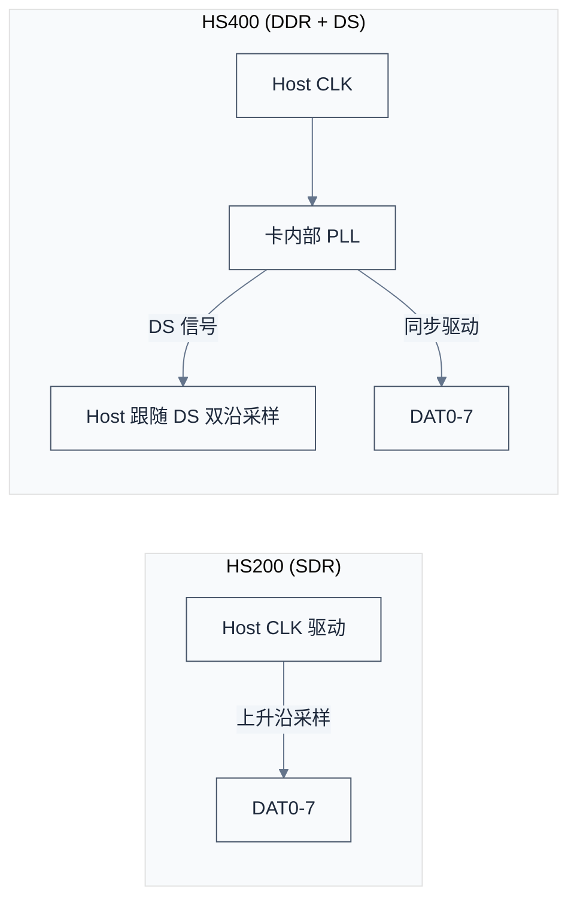
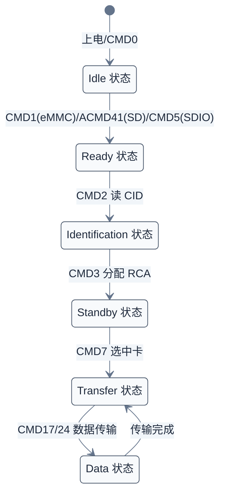
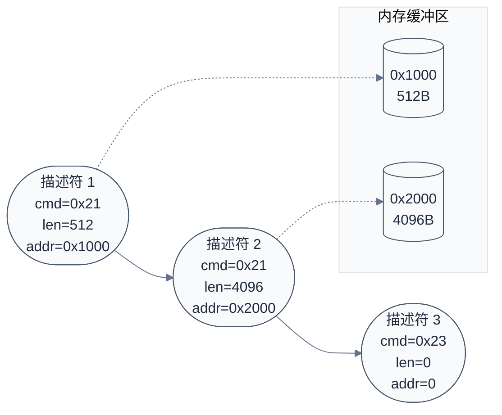
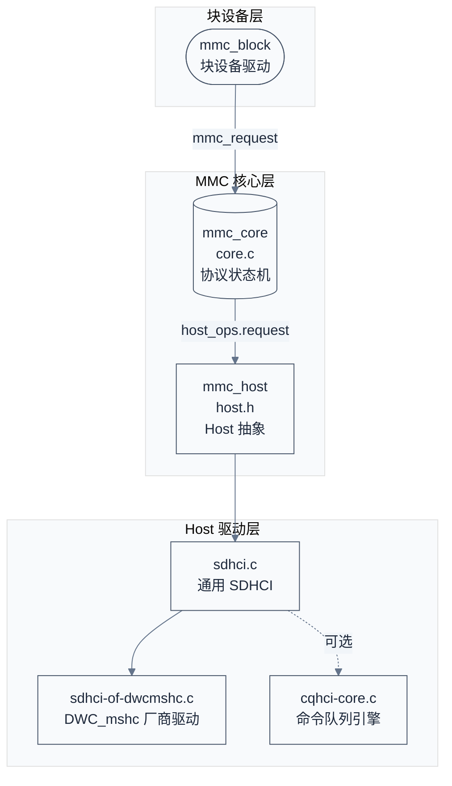
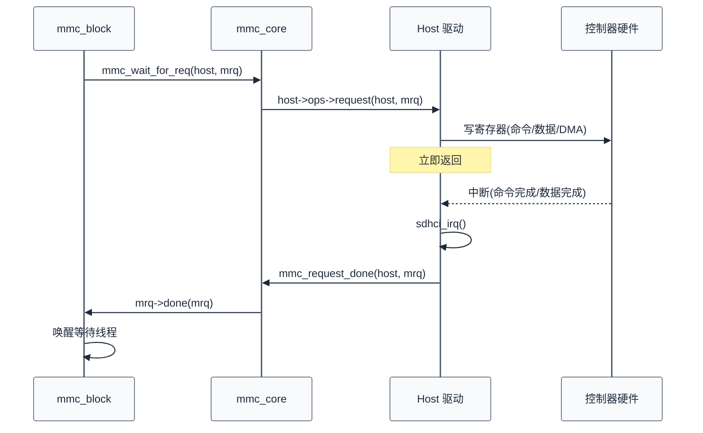
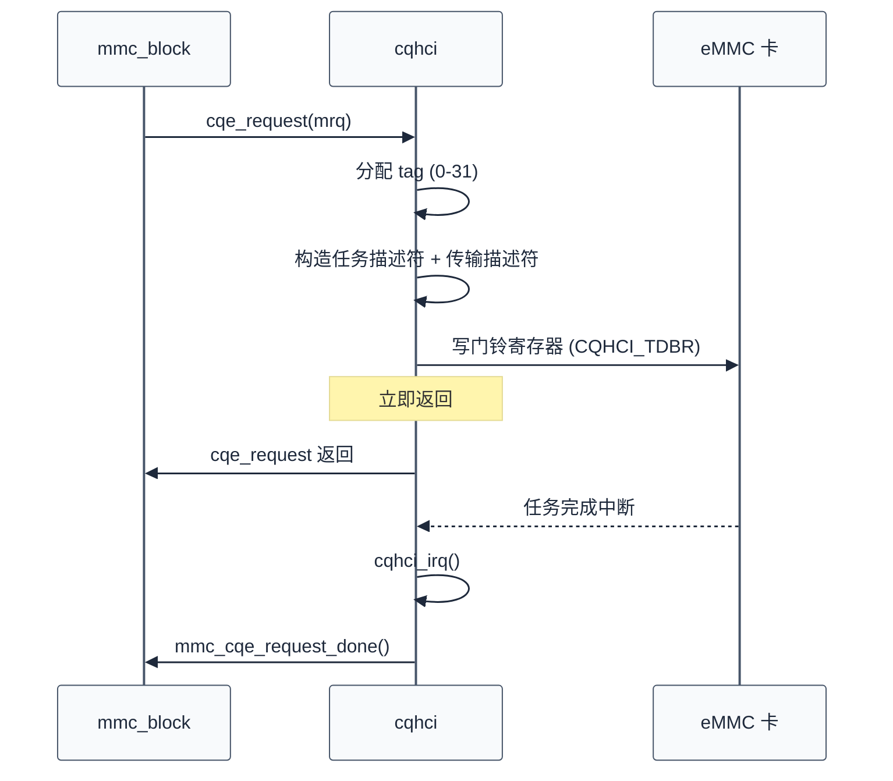
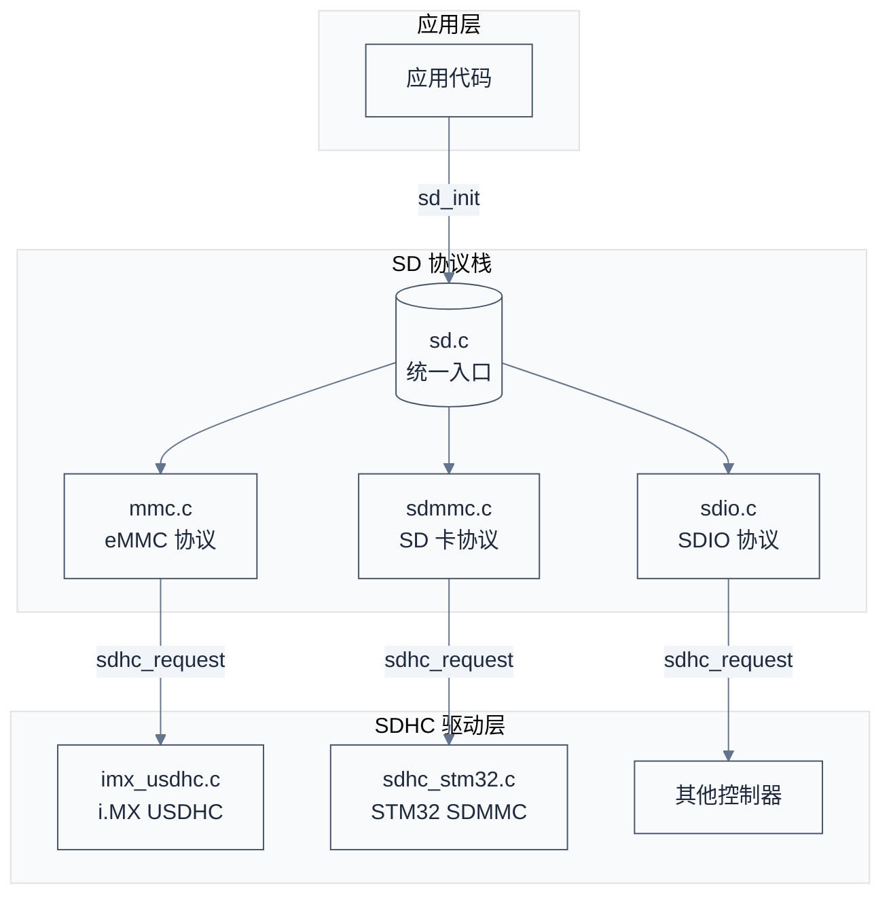

# SDIO/eMMC 协议与驱动

> SD 协议族（SD/SDIO/eMMC）的命令驱动模型、速度模式演进、DWC_mshc 控制器寄存器与 ADMA2 机制，以及 Linux `sdhci-of-dwcmshc` 驱动、CQE 命令队列引擎、Zephyr SD 子系统的对照分析。
> **工程师视角**：eMMC 是嵌入式设备的启动存储首选，SDIO 是 WiFi/BT 模块的常见接口。调试 eMMC 启动失败、HS400 训练失败、ADMA 错误，都需要深入到命令层、寄存器层与驱动数据流三层。

### 关键术语

| 缩写 | 全称 | 含义 |
|------|------|------|
| SD | Secure Digital | 安全数字存储卡标准 |
| SDIO | Secure Digital Input Output | SD 协议族的 IO 扩展接口 |
| eMMC | embedded MultiMediaCard | 嵌入式 MMC，控制器+Flash 封装为单芯片 |
| MMC | MultiMediaCard | 早期存储卡标准，eMMC 的协议基础 |
| SDHCI | SD Host Controller Interface | SD 主机控制器标准寄存器接口 |
| DWC_mshc | DesignWare Cores Mobile Storage Host Controller | Synopsys 的 SDHCI 兼容控制器 IP |
| CMD | Command | SD 协议命令，48 bit 格式 |
| ADMA | Advanced DMA | SDHCI 定义的 DMA 描述符机制 |
| SDMA | Single Operation DMA | SDHCI 单块 DMA 模式 |
| HS200 | High Speed 200 | eMMC SDR 200MHz 模式 |
| HS400 | High Speed 400 | eMMC DDR 200MHz 模式，400 MB/s |
| HS400es | High Speed 400 Enhanced Strobe | HS400 + 增强 Data Strobe |
| OCR | Operation Condition Register | 电压/容量协商寄存器 |
| CID | Card IDentification | 卡唯一标识寄存器 |
| CSD | Card Specific Data | 卡规格数据寄存器 |
| RCA | Relative Card Address | 卡相对地址 |
| EXT_CSD | Extended CSD | eMMC 扩展配置寄存器（512 字节） |
| SDR | Single Data Rate | 单沿采样 |
| DDR | Double Data Rate | 双沿采样 |
| CQE | Command Queue Engine | 命令队列引擎 |
| DCMD | Direct Command | CQE 直发命令（无数据） |
| DLL | Delay Locked Loop | 延迟锁相环，用于训练相位 |
| DS | Data Strobe | eMMC HS400 模式下由卡驱动的选通信号 |
| FTL | Flash Translation Layer | Flash 翻换层，将块设备映射到物理 Flash |

### 前置知识

| 需要了解 | 参考文档 |
|----------|----------|
| DMA 与散射-聚集列表 | [01-SPI协议与驱动](./01-SPI协议与驱动.md) |
| Linux 驱动模型（probe、device tree） | [04-USB协议与驱动](./04-USB协议与驱动.md) |
| 异步请求与完成回调 | [04-USB协议与驱动](./04-USB协议与驱动.md) |
| 设备树基础语法 | [00-通信协议总览](./00-通信协议总览.md) |

---

## 1. SDIO/eMMC 本质：命令驱动的存储与 IO 总线

> 上一篇讲了 USB 的主机轮询与端点模型。SD 协议族走的是另一条路——主机发命令、卡响应、数据线批量传输。本章先从一个具体启动场景出发，讲清 SD/SDIO/eMMC 三者的关系与本质差异。

### 1.1 一个具体场景：SoC 从 eMMC 启动

SoC 上电后，BootROM 从 eMMC 读取 bootloader。整个通信过程是命令驱动的：

```text
1. CMD0  (GO_IDLE_STATE)      — 复位所有卡，进入 Idle 状态
2. CMD1  (SEND_OP_COND)       — 发送 OCR，协商电压与容量模式
3. CMD2  (ALL_SEND_CID)       — 读取 CID，卡进入 Identification 状态
4. CMD3  (SEND_RELATIVE_ADDR) — 分配 RCA，卡进入 Standby 状态
5. CMD7  (SELECT_CARD)        — 选中指定 RCA 的卡，进入 Transfer 状态
6. CMD9  (SEND_CSD)           — 读取 CSD，获取容量与速度信息
7. CMD17 (READ_SINGLE_BLOCK)  — 读取单个 512 字节块
8. CMD24 (WRITE_BLOCK)        — 写入单个 512 字节块
```

每一步都是"主机发命令 → 卡回响应 → （可选）数据线传输"。命令在 CMD 线上串行传输，数据在 DAT 线上并行传输，二者物理分离。这与 USB 的"端点管道"模型截然不同——USB 把命令和数据都封装为事务包（Token/Data/Handshake），SD 协议则用独立的物理线分离二者。

> **核心要点**：SD 协议的本质是"命令-响应-数据"三段式事务。CMD 线和 DAT 线物理分离，让命令与数据可以并行（命令发完不等响应即可准备下一帧）；而 USB 的端点 0 控制传输把 Setup/Data/Status 都塞进同一物理线，必须串行完成。

### 1.2 SD / SDIO / eMMC 的关系

SD 协议是基础，SDIO 和 eMMC 是它在不同方向的扩展：

| 对比维度 | SD 卡 | SDIO | eMMC |
|----------|-------|------|------|
| **用途** | 可移动存储 | IO 扩展（WiFi/BT 模块） | 板载存储 |
| **控制器位置** | 卡内无控制器，Host 全权管理 | IO 功能寄存器映射 | 控制器+Flash 封装为单芯片 |
| **总线宽度** | 1/4 线 | 1/4 线 | 1/4/8 线 |
| **最高速度** | UHS-I 104 MB/s | SDR50 50 MB/s | HS400 400 MB/s |
| **初始化命令** | CMD55+ACMD41 | CMD5 | CMD1 |
| **非易失性** | 是 | 否（IO 设备） | 是 |
| **典型封装** | 可插拔卡 | 焊接模组 | BGA 封装 |
| **FTL 位置** | 无（Host 直接管理 Flash） | N/A | 卡内（Host 只见块设备） |

> **如何读这张表**：第二行的"控制器位置"是理解三者差异的关键。SD 卡只暴露原始 Flash 接口，磨损均衡/坏块管理全由 Host 软件（或文件系统）承担；eMMC 把 Flash 管理逻辑（FTL）封装在芯片内部，Host 只需发块读写命令，这就是手机用 eMMC 而非 SPI NAND Flash 的根本原因——SPI Flash 没有磨损管理，Host 软件开销巨大且寿命不可控。

### 1.3 SD 协议与 USB/CAN 的对比

| 对比维度 | SD 协议 | USB | CAN |
|----------|---------|-----|-----|
| **拓扑** | 点对点（1 Host + 1 卡） | 树形（Hub 展开） | 总线（多主） |
| **仲裁** | 无（主从） | 主机轮询 | CSMA/CD + 优先级 |
| **命令/数据** | 物理分离（CMD/DAT 独立） | 同线复用（包分时） | 同线（帧结构） |
| **最高速度** | 400 MB/s（HS400） | 5000 Mbps（USB 3.0） | 8 Mbps（CAN-FD） |
| **应用** | 存储/IO 扩展 | 通用外设 | 工业控制 |

> **核心要点**：eMMC 把 Flash 管理逻辑（磨损均衡、坏块管理、FTL）封装在芯片内部，Host 只需发块读写命令。这就是手机用 eMMC 而非 SPI NAND Flash 的原因——SPI Flash 没有磨损管理，Host 软件开销巨大且寿命不可控。

---

## 2. 物理层：总线模式与速度模式演进

> 上一节讲了 SD 协议族的命令驱动模型。但命令在什么线上跑、数据在什么线上跑、时钟多快——这些物理层细节决定了实际带宽。本章从信号线出发，推导 HS400 的 400 MB/s 带宽，并解析 DDR 采样与 Data Strobe 机制。

### 2.1 总线信号

SD/eMMC 总线共有以下信号：

| 信号 | 方向 | 用途 |
|------|------|------|
| **CLK** | Host → Card | 时钟，所有传输同步到此 |
| **CMD** | 双向 | 命令与响应传输 |
| **DAT0-DAT3** | 双向 | 4 线数据（SD 卡） |
| **DAT0-DAT7** | 双向 | 8 线数据（eMMC） |
| **DS** | Card → Host | Data Strobe，HS400 模式下由卡驱动 |
| **VDD/VSS** | 电源 | 供电与地 |

eMMC 额外有 **DAT0-DAT7** 共 8 根数据线，以及 HS400 模式下的 **DS（Data Strobe）** 信号——由 eMMC 驱动，Host 据此采样数据。DS 信号是 HS400 模式的关键：SDR/HS200 模式下 Host 用内部时钟采样数据，200MHz 下的时钟偏移可能导致采样错误；HS400 模式下改用卡驱动的 DS 信号，Host 跟随 DS 边沿采样，消除源同步偏差。

### 2.2 速度模式演进

| 模式 | 时钟频率 | 总线宽度 | 采样方式 | 理论带宽 | 引入版本 |
|------|---------|---------|---------|---------|---------|
| **DS** (Default Speed) | 26 MHz | 1/4/8 | SDR | 26 MB/s | MMC 4.0 |
| **HS** (High Speed) | 52 MHz | 1/4/8 | SDR | 52 MB/s | MMC 4.2 |
| **DDR52** | 52 MHz | 4/8 | DDR | 104 MB/s | MMC 4.4 |
| **HS200** | 200 MHz | 4/8 | SDR | 200 MB/s | MMC 4.5 |
| **HS400** | 200 MHz | 8 | DDR + DS | 400 MB/s | MMC 5.0 |
| **HS400es** | 200 MHz | 8 | DDR + Enhanced Strobe | 400 MB/s | MMC 5.1 |

> **如何读这张表**：时钟频率乘以总线宽度再除以 8 得到字节带宽；DDR 模式在时钟上下沿各传一次，带宽翻倍。HS200 到 HS400 的跃升来自两个变化：8 线变 DDR，带宽从 $200 \times 8 / 8 = 200$ MB/s 翻到 $200 \times 8 \times 2 / 8 = 400$ MB/s。HS400 到 HS400es 带宽不变，差异在 DS 信号的生成方式——HS400 的 DS 由 DLL 延时产生，HS400es 的 DS 由 eMMC 内部直接输出。

### 2.3 带宽计算

$$BW = \frac{f_{\text{clk}} \times W \times k}{8}$$

逐符号解释：

- $f_{\text{clk}}$：时钟频率（Hz），由 Host 控制器的 `SDHCI_CLOCK_CONTROL` 寄存器配置
- $W$：总线宽度（bit），取 1、4 或 8，由 `SDHCI_HOST_CONTROL` 的 `SDHCI_CTRL_4BITBUS`/`SDHCI_CTRL_8BITBUS` 位选择
- $k$：DDR 系数，SDR 模式 $k=1$，DDR 模式 $k=2$（时钟上下沿各传一次）
- 除以 8 将 bit 转为 Byte

**HS400 数值演算**：$f_{\text{clk}} = 200 \times 10^6$ Hz，$W = 8$ bit，$k = 2$：

$$BW = \frac{200 \times 10^6 \times 8 \times 2}{8} = 400 \times 10^6 \text{ B/s} = 400 \text{ MB/s}$$

**HS200 数值演算**：$f_{\text{clk}} = 200 \times 10^6$ Hz，$W = 8$ bit，$k = 1$：

$$BW = \frac{200 \times 10^6 \times 8 \times 1}{8} = 200 \text{ MB/s}$$

**DDR52 数值演算**：$f_{\text{clk}} = 52 \times 10^6$ Hz，$W = 8$ bit，$k = 2$：

$$BW = \frac{52 \times 10^6 \times 8 \times 2}{8} = 104 \times 10^6 \text{ B/s} = 104 \text{ MB/s}$$

### 2.4 电压切换

默认 3.3V 信号电压。进入 HS200/HS400 前必须切换到 1.8V，因为 200MHz 时钟下 3.3V 信号完整性无法保证（边沿过渡时间过长导致眼图闭合）。切换通过 CMD11（VOLTAGE_SWITCH）触发：

1. Host 通过 `vqmmc-supply` regulator 把 IO 电压切到 1.8V
2. Host 发 CMD11，卡检测到电压切换请求
3. 卡拉低 DAT0 表示正在切换
4. 切换完成后 DAT0 释放，Host 重新使能时钟

### 2.5 DDR 采样与 Data Strobe

SDR 模式下，Host 在 CLK 上升沿采样 DAT 线。DDR 模式下，Host 在 CLK 上升沿和下降沿各采样一次——但 200MHz 时钟下，CLK 本身的边沿抖动可能让采样窗口错位。

HS400 引入 **DS（Data Strobe）** 信号解决此问题：

- DS 由 eMMC 内部 PLL 驱动，频率与 CLK 相同
- Host 跟随 DS 的上升沿和下降沿采样 DAT 线
- DS 与 DAT 同源（都由 eMMC 内部时钟驱动），相位关系稳定



> **核心要点**：HS400 是 eMMC 的性能巅峰——200MHz × 8 线 × DDR。但它的前提是 1.8V 信号电压 + DS（Data Strobe）信号 + 训练（Tuning）成功。三者缺一不可。HS400es 进一步简化：DS 信号由 eMMC 内部直接输出，无需 Host 端 DLL 延时，减少训练失败风险。

---

## 3. 协议层：命令、响应与状态机

> 上一节讲了物理层带宽。但 Host 怎么告诉卡"读第 100 个块"？答案是一组 48 bit 的命令帧。本章解析命令格式、关键命令、响应类型，以及卡的状态机与 EXT_CSD 寄存器。

### 3.1 命令格式

每个命令帧 48 bit，结构如下：

| 字段 | 位宽 | 含义 |
|------|------|------|
| 起始位 | 1 | 固定 0 |
| 传输位 | 1 | 1=Host→Card，0=Card→Host |
| 命令索引 | 6 | CMD0-CMD63 |
| 参数 | 32 | 地址/值 |
| CRC7 | 7 | 校验 |
| 结束位 | 1 | 固定 1 |

**数值演算**：以 CMD17（READ_SINGLE_BLOCK）读 0x100 块为例，参数为 0x00000100，命令索引为 17 = 0b010001。完整 48 bit 帧为：

```
0 1 010001 000000000000000100000000 0000000 1
| |   |     |                          |      |
| |   |     +-- 参数 (32 bit)          |      |
| |   +-- 命令索引 (6 bit)             |      |
| +-- 传输位 (1 bit, Host→Card)        |      |
| 起始位                                +-- CRC7 (7 bit)
                                          结束位 (1 bit)
```

命令类型有四种：

- **bc**（broadcast no response）：广播，无响应，如 CMD0
- **bcr**（broadcast with response）：广播，有响应，如 CMD2
- **ac**（addressed no data）：寻址，无数据传输，如 CMD7
- **adtc**（addressed data transfer）：寻址，有数据传输，如 CMD17/CMD24

### 3.2 关键命令

| 命令 | 类型 | 响应 | 用途 |
|------|------|------|------|
| CMD0 | bc | 无 | GO_IDLE_STATE，复位卡 |
| CMD1 | bcr | R3 | SEND_OPCOND，eMMC 发送 OCR |
| CMD2 | bcr | R2 | ALL_SEND_CID，读取 CID |
| CMD3 | ac | R6 | SEND_RELATIVE_ADDR，分配 RCA |
| CMD5 | bcr | R4 | SDIO IO_SEND_OP_COND（SDIO 专用） |
| CMD6 | ac | R1 | SWITCH，读写 EXT_CSD 字段 |
| CMD7 | ac | R1/R1b | SELECT_CARD，选中卡 |
| CMD8 | adtc | R1 | SEND_EXT_CSD，读取 EXT_CSD（512 字节） |
| CMD9 | ac | R2 | SEND_CSD，读取 CSD |
| CMD11 | ac | R1 | VOLTAGE_SWITCH，切 1.8V |
| CMD12 | ac | R1b | STOP_TRANSMISSION，停止多块传输 |
| CMD17 | adtc | R1 | READ_SINGLE_BLOCK |
| CMD18 | adtc | R1 | READ_MULTIPLE_BLOCK |
| CMD19 | adtc | R1 | SEND_TUNING_BLOCK（HS200 训练） |
| CMD21 | adtc | R1 | SEND_TUNING_BLOCK_HS200（eMMC 训练） |
| CMD23 | ac | R1 | SET_BLOCK_COUNT，设置多块传输块数 |
| CMD24 | adtc | R1 | WRITE_BLOCK |
| CMD25 | adtc | R1 | WRITE_MULTIPLE_BLOCK |
| CMD55+ACMD41 | ac | R1/R3 | SD 卡发送 OCR（CMD55 表示下一条是 ACMD） |

> **如何读这张表**：eMMC 用 CMD1 协商 OCR，SD 卡用 CMD55+ACMD41，SDIO 用 CMD5。这是区分卡类型的关键——Linux 和 Zephyr 都通过尝试不同命令来探测卡类型。CMD6 是 eMMC 的"万能开关"——通过它读写 EXT_CSD 的不同字段实现速度切换、总线宽度切换、Cache 使能等。

### 3.3 响应类型

| 响应 | 长度 | 内容 | 对应命令 |
|------|------|------|---------|
| R1 | 48 bit | 卡状态（32 bit） | CMD7/17/24 等 |
| R1b | 48 bit | 卡状态 + BUSY 信号（DAT0 拉低） | 带忙等待的 R1，如 CMD7/R1b |
| R2 | 136 bit | CID 或 CSD | CMD2/CMD9 |
| R3 | 48 bit | OCR | CMD1/ACMD41 |
| R4 | 48 bit | OCR + IO 功能 | CMD5 |
| R6 | 48 bit | RCA + 状态 | CMD3 |

R2 响应较长（136 bit）是因为它携带 CID 或 CSD 的完整内容（128 bit），加上 CRC 和帧头。其他响应都是 48 bit，与命令帧格式对称。

Linux 的响应类型由 `mmc_command.flags` 字段编码（[include/linux/mmc/core.h:35-66](file:///home/pbw/2042f/linux/include/linux/mmc/core.h#L35-66)）：

```c
#define MMC_RSP_PRESENT   (1 << 0)
#define MMC_RSP_136       (1 << 1)  /* 136 bit response */
#define MMC_RSP_CRC       (1 << 2)  /* expect valid crc */
#define MMC_RSP_BUSY      (1 << 3)  /* card may send busy */
#define MMC_RSP_OPCODE    (1 << 4)  /* response contains opcode */

#define MMC_RSP_R1    (MMC_RSP_PRESENT|MMC_RSP_CRC|MMC_RSP_OPCODE)
#define MMC_RSP_R1B   (MMC_RSP_PRESENT|MMC_RSP_CRC|MMC_RSP_OPCODE|MMC_RSP_BUSY)
#define MMC_RSP_R2    (MMC_RSP_PRESENT|MMC_RSP_136|MMC_RSP_CRC)
#define MMC_RSP_R3    (MMC_RSP_PRESENT)
#define MMC_RSP_R6    (MMC_RSP_PRESENT|MMC_RSP_CRC|MMC_RSP_OPCODE)
```

### 3.4 初始化状态机



> **核心要点**：状态机是线性的——Idle → Ready → Ident → Standby → Tran → Data。每一步对应一条命令，跳步会导致卡无响应。调试时最常见的问题是卡停在 Idle（CMD1/ACMD41 超时）或卡停在 Standby（CMD7 未选中）。

### 3.5 EXT_CSD 寄存器

EXT_CSD 是 eMMC 5.0+ 引入的 512 字节扩展寄存器，存储速度模式、总线宽度、Cache 配置等。关键字段：

| 偏移 | 字段 | 用途 |
|------|------|------|
| 185 | `SEC_COUNT` | 卡容量（512 字节块数） |
| 183 | `EXT_CSD_REV` | eMMC 版本 |
| 197 | `CARD_TYPE` | 支持的速度模式（HS200/HS400/DDR52 位） |
| 183 | `DRIVER_STRENGTH` | 驱动强度 |
| 387 | `BUS_WIDTH` | 当前总线宽度 |
| 385 | `HS_TIMING` | 当前速度模式（0=Legacy, 1=HS, 2=HS200, 3=HS400） |
| 33 | `CACHE_CTRL` | Cache 使能位 |
| 34 | `CMDQ_EN` | 命令队列使能位 |

读写 EXT_CSD 通过 CMD6（SWITCH）完成：CMD6 的参数 32 bit 编码为 `Access(2) + Index(8) + Value(8) + Reserved(14)`。例如设置 HS400 模式（HS_TIMING=3）：

```
Access = 0b11 (Write Byte)
Index  = 385 (HS_TIMING)
Value  = 3   (HS400)
参数 = 0x03_0181_0003
```

---

## 4. SDHCI 标准与 DWC_mshc 寄存器地图

> 上一节讲了协议层命令格式。但 Host 控制器怎么把"发 CMD17"变成寄存器操作？本章解析 SDHCI 标准寄存器地图、ADMA2 描述符布局，以及 Synopsys DWC_mshc 的厂商扩展区。参考 `reference/DWC_mshc_databook(2.0a).pdf`。

### 4.1 SDHCI 兼容性

DWC_mshc 兼容 SDHCI（SD Host Controller Interface）标准——寄存器地图的前 256 字节与 SDHCI 规范一致，厂商扩展寄存器位于 Vendor Specific Area，偏移由 `P_VENDOR_AREA1`（0xE8）寄存器动态指向。这意味着 Linux 的通用 `sdhci.c` 框架可以直接复用，厂商驱动只需实现差异部分。

### 4.2 核心寄存器地图

以下寄存器偏移来自 [drivers/mmc/host/sdhci.h](file:///home/pbw/2042f/linux/drivers/mmc/host/sdhci.h#L26-L215)，DWC_mshc 完全兼容：

| 寄存器 | 偏移 | 用途 |
|--------|------|------|
| `SDHCI_DMA_ADDRESS` | 0x00 | SDMA 地址 / ADMA2 描述符表起始地址 |
| `SDHCI_BLOCK_SIZE` | 0x04 | 块大小（12 bit）+ DMA 边界（3 bit） |
| `SDHCI_BLOCK_COUNT` | 0x06 | 块计数（16 bit，或 32 bit @ Host V4） |
| `SDHCI_ARGUMENT` | 0x08 | 命令参数（32 bit） |
| `SDHCI_TRANSFER_MODE` | 0x0C | 传输模式（DMA/读/多块/Auto CMD） |
| `SDHCI_COMMAND` | 0x0E | 命令索引 + 标志（响应类型/CRC/DATA） |
| `SDHCI_RESPONSE` | 0x10 | 响应 R0-R3（136 bit 响应占 4×32 bit） |
| `SDHCI_BUFFER` | 0x20 | SDMA/PIO 数据缓冲区 |
| `SDHCI_PRESENT_STATE` | 0x24 | CMD/DAT 线电平、卡检测、读写状态 |
| `SDHCI_HOST_CONTROL` | 0x28 | 总线宽度、DMA 选择、高速模式 |
| `SDHCI_POWER_CONTROL` | 0x29 | 电压选择（3.3V/3.0V/1.8V）+ 电源使能 |
| `SDHCI_CLOCK_CONTROL` | 0x2C | 时钟分频与使能 |
| `SDHCI_SOFTWARE_RESET` | 0x2F | 软件复位（ALL/CMD/DATA） |
| `SDHCI_INT_STATUS` | 0x30 | 中断状态（命令完成/数据完成/错误） |
| `SDHCI_INT_ENABLE` | 0x34 | 中断使能 |
| `SDHCI_SIGNAL_ENABLE` | 0x38 | 中断信号使能（控制 IRQ 线） |
| `SDHCI_HOST_CONTROL2` | 0x3E | UHS 速度模式选择、1.8V 信号、驱动强度 |
| `SDHCI_CAPABILITIES` | 0x40 | 控制器能力（64 bit DMA/ADMA/SDMA/电压） |
| `SDHCI_CAPABILITIES_1` | 0x44 | 控制器能力 2（SDR50/SDR104/DDR50） |
| `SDHCI_ADMA_ADDRESS` | 0x58 | ADMA2 描述符地址（64 bit） |

### 4.3 传输模式位

`SDHCI_TRANSFER_MODE` 关键位（[sdhci.h:38-51](file:///home/pbw/2042f/linux/drivers/mmc/host/sdhci.h#L38-51)）：

```c
#define SDHCI_TRNS_DMA          0x01    /* DMA 模式 */
#define SDHCI_TRNS_BLK_CNT_EN   0x02    /* 块计数使能 */
#define SDHCI_TRNS_AUTO_CMD12   0x04    /* 自动 CMD12 停止 */
#define SDHCI_TRNS_AUTO_CMD23   0x08    /* 自动 CMD23 设块数 */
#define SDHCI_TRNS_READ         0x10    /* 读方向 */
#define SDHCI_TRNS_MULTI        0x20    /* 多块传输 */
```

> **如何读这些位**：一次多块读传输通常配置为 `SDHCI_TRNS_DMA | SDHCI_TRNS_BLK_CNT_EN | SDHCI_TRNS_AUTO_CMD23 | SDHCI_TRNS_READ | SDHCI_TRNS_MULTI` = 0x3B。Auto CMD23 让控制器在传输前自动发 CMD23 设置块数，传输结束自动发 CMD12 停止——减少 Host CPU 干预。

### 4.4 中断位

关键中断位（[sdhci.h:166-192](file:///home/pbw/2042f/linux/drivers/mmc/host/sdhci.h#L166-192)）：

| 中断位 | 值 | 含义 | 触发动作 |
|--------|------|------|---------|
| `SDHCI_INT_RESPONSE` | 0x01 | 命令完成 | 命令响应已到达 |
| `SDHCI_INT_DATA_END` | 0x02 | 数据传输完成 | 所有数据块传完 |
| `SDHCI_INT_DMA_END` | 0x08 | SDMA 边界 | SDMA 跨 512KB 边界 |
| `SDHCI_INT_CARD_INSERT` | 0x40 | 卡插入 | 卡检测变化 |
| `SDHCI_INT_CARD_REMOVE` | 0x80 | 卡移除 | 卡检测变化 |
| `SDHCI_INT_CARD_INT` | 0x100 | 卡中断 | SDIO 中断 |
| `SDHCI_INT_RETUNE` | 0x1000 | 需要重新训练 | Retune 定时器到期 |
| `SDHCI_INT_CQE` | 0x4000 | CQE 中断 | 命令队列事件 |
| `SDHCI_INT_ERROR` | 0x8000 | 错误汇总 | 任一错误位被置 |
| `SDHCI_INT_TIMEOUT` | 0x10000 | 命令超时 | CMD 线无响应 |
| `SDHCI_INT_CRC` | 0x20000 | 命令 CRC 错误 | 响应 CRC 校验失败 |
| `SDHCI_INT_DATA_TIMEOUT` | 0x100000 | 数据超时 | DAT 线超时 |
| `SDHCI_INT_DATA_CRC` | 0x200000 | 数据 CRC | DAT 线 CRC 失败 |
| `SDHCI_INT_ADMA_ERROR` | 0x2000000 | ADMA 错误 | 描述符异常 |

### 4.5 ADMA2 描述符布局

ADMA2（Advanced DMA version 2）是 SDHCI 标准定义的描述符链表 DMA 机制。Host 软件构建描述符链表，控制器自动按链表搬运数据。

ADMA2 64 bit 描述符为 12 字节（或 Host V4 模式下 16 字节），定义在 [sdhci.h:390-395](file:///home/pbw/2042f/linux/drivers/mmc/host/sdhci.h#L390-395)：

```c
struct sdhci_adma2_64_desc {
    __le16  cmd;       /* 属性 + 动作 */
    __le16  len;       /* 数据长度 */
    __le32  addr_lo;   /* 地址低 32 bit */
    __le32  addr_hi;   /* 地址高 32 bit（仅 64 bit 模式） */
} __packed __aligned(4);
```

描述符属性位（[sdhci.h:397-399](file:///home/pbw/2042f/linux/drivers/mmc/host/sdhci.h#L397-399)）：

```c
#define ADMA2_TRAN_VALID    0x21    /* 传输 + 有效 */
#define ADMA2_NOP_END_VALID 0x3     /* NOP + 结束 + 有效 */
#define ADMA2_END           0x2     /* 链表结束 */
```



> **如何读这张图**：每个描述符的 `cmd` 字段编码动作与属性——bit 5 `ACT_TRAN` 表示数据传输，bit 1 `END` 表示链表结束，bit 0 `VALID` 表示描述符有效。控制器读取描述符，自动发起 DMA 传输，遇到 `END` 标志停止并触发 `SDHCI_INT_DATA_END` 中断。

### 4.6 DWC_mshc 厂商扩展区

DWC_mshc 的厂商扩展寄存器位于 Vendor Specific Area，偏移由 `DWCMSHC_P_VENDOR_AREA1`（0xE8）寄存器动态指向（[sdhci-of-dwcmshc.c:39-60](file:///home/pbw/2042f/linux/drivers/mmc/host/sdhci-of-dwcmshc.c#L39-60)）：

```c
#define DWCMSHC_P_VENDOR_AREA1     0xe8
#define DWCMSHC_AREA1_MASK         GENMASK(11, 0)
/* Offset inside the vendor area 1 */
#define DWCMSHC_HOST_CTRL3         0x8
#define DWCMSHC_EMMC_CONTROL       0x2c
#define DWCMSHC_CARD_IS_EMMC       BIT(0)
#define DWCMSHC_ENHANCED_STROBE    BIT(8)
#define DWCMSHC_EMMC_ATCTRL        0x40
#define DWCMSHC_AT_STAT            0x44
```

关键寄存器：

- **`DWCMSHC_EMMC_CONTROL`**：bit 0 `CARD_IS_EMMC` 使能 Data Strobe（HS400 必需），bit 8 `ENHANCED_STROBE` 切换 HS400es
- **`DWCMSHC_EMMC_ATCTRL`**：自动训练控制寄存器，配置采样窗口、相位变化延迟、阈值
- **`DWCMSHC_HOST_CTRL3`**：HS400 模式选择（值 0x7 = HS400，非 SDHCI 标准值）

> **核心要点**：DWC_mshc 兼容 SDHCI 标准寄存器地图，厂商差异在 Vendor Specific Area（偏移由 `P_VENDOR_AREA1` 寄存器指向）。Linux `sdhci.c` 处理通用逻辑，`sdhci-of-dwcmshc.c` 处理厂商差异——这是 SDHCI 框架的核心设计模式。

---

## 5. Linux MMC 子系统架构与异步请求流转

> 上一节讲了 SDHCI 寄存器与 ADMA2 描述符。Linux 怎么组织这些寄存器操作？本章从 MMC 三层架构出发，解析 `mmc_host`、`mmc_request` 数据结构与异步请求流转模型。

### 5.1 MMC 三层架构



- **mmc_core**（`drivers/mmc/core/core.c`）：协议核心，负责初始化流程、命令重试、状态机管理
- **mmc_host**（[include/linux/mmc/host.h](file:///home/pbw/2042f/linux/include/linux/mmc/host.h)）：Host 抽象，`struct mmc_host` 封装控制器能力与回调
- **sdhci.c**（`drivers/mmc/host/sdhci.c`）：通用 SDHCI 实现，处理标准寄存器操作
- **sdhci-of-dwcmshc.c**：厂商驱动，仅实现 DWC_mshc 特有差异
- **cqhci-core.c**：CQE 命令队列引擎，让多个请求并发执行

### 5.2 mmc_host 数据结构

`struct mmc_host`（[include/linux/mmc/host.h:355](file:///home/pbw/2042f/linux/include/linux/mmc/host.h#L355)）封装 Host 控制器，核心字段：

```c
struct mmc_host {
    struct device           *parent;
    struct device           class_dev;
    int                     index;
    const struct mmc_host_ops *ops;       /* Host 操作回调 */
    struct mmc_pwrseq       *pwrseq;      /* 电源序列 */
    unsigned int            f_min;        /* 最小时钟 */
    unsigned int            f_max;        /* 最大时钟 */
    u32                     ocr_avail;    /* 可用电压掩码 */
    u32                     ocr_avail_sdio;
    u32                     ocr_avail_sd;
    u32                     ocr_avail_mmc;
    /* ... */
    struct mmc_ios          ios;          /* 当前 IO 配置 */
    struct mmc_card         *card;        /* 挂载的卡 */
    /* ... */
    const struct mmc_cqe_ops *cqe_ops;    /* CQE 操作回调 */
    void                    *cqe_private;
    bool                    cqe_enabled;
    bool                    cqe_on;
    /* ... */
    struct mmc_request      *ongoing_mrq; /* 当前执行的请求 */
};
```

`mmc_host_ops`（[host.h:161](file:///home/pbw/2042f/linux/include/linux/mmc/host.h#L161)）核心回调：

- `request(host, mrq)`：提交异步请求（核心）
- `request_atomic(host, mrq)`：原子上下文提交（HSQ 用）
- `set_ios(host, ios)`：配置时钟/电压/总线宽度
- `execute_tuning(host, opcode)`：HS200/HS400 训练
- `hs400_enhanced_strobe(host, ios)`：切换 HS400es
- `card_hw_reset(host)`：硬件复位 eMMC（RST_n 引脚）
- `start_signal_voltage_switch(host, ios)`：1.8V 切换

### 5.3 mmc_request 异步模型

`struct mmc_request`（[include/linux/mmc/core.h:149](file:///home/pbw/2042f/linux/include/linux/mmc/core.h#L149)）封装一次请求：

```c
struct mmc_request {
    struct mmc_command  *sbc;       /* SET_BLOCK_COUNT (CMD23) */
    struct mmc_command  *cmd;       /* 主命令 */
    struct mmc_data     *data;      /* 数据描述 */
    struct mmc_command  *stop;      /* STOP_TRANSMISSION (CMD12) */

    struct completion   completion;
    struct completion   cmd_completion;
    void                (*done)(struct mmc_request *);  /* 完成回调 */
    /* ... */
};
```

`struct mmc_command`（[core.h:28](file:///home/pbw/2042f/linux/include/linux/mmc/core.h#L28)）的 `flags` 字段编码命令类型（`MMC_CMD_AC`、`MMC_CMD_ADTC`、`MMC_CMD_BC`、`MMC_CMD_BCR`）和响应类型（`MMC_RSP_R1`、`MMC_RSP_R2` 等）。

`struct mmc_data`（[core.h:119](file:///home/pbw/2042f/linux/include/linux/mmc/core.h#L119)）封装数据传输：

```c
struct mmc_data {
    unsigned int        timeout_ns;
    unsigned int        blksz;       /* 块大小 */
    unsigned int        blocks;      /* 块数 */
    unsigned int        blk_addr;    /* 起始块地址 */
    int                 error;
    unsigned int        flags;       /* MMC_DATA_READ/WRITE */
    unsigned int        bytes_xfered;
    struct scatterlist  *sg;         /* 散射-聚集列表 */
    unsigned int        sg_len;
    int                 sg_count;    /* 映射后的 sg 项数 */
};
```

### 5.4 异步请求流转

Linux MMC 子系统是**异步模型**：上层调用 `mmc_host_ops.request()` 提交 `mmc_request`，立即返回；Host 驱动完成后回调 `mmc_request_done()`。



关键函数 `mmc_request_done`（[drivers/mmc/core/core.c:130](file:///home/pbw/2042f/linux/drivers/mmc/core/core.c#L130)）：

1. 清除 `host->ongoing_mrq`
2. 记录错误统计
3. 调用 `mrq->done(mrq)` 通知上层

`__mmc_start_request`（[core.c:215](file:///home/pbw/2042f/linux/drivers/mmc/core/core.c#L215)）启动请求：

1. 处理 retune（重新训练）
2. 处理 busy 状态
3. 若 `host->cqe_on`，调用 `cqe_off()` 切回非 CQE 模式
4. 调用 `host->ops->request(host, mrq)` 提交给 Host 驱动

> **核心要点**：Linux MMC 的异步模型让上层（mmc_block）可以在请求提交后立即处理其他工作，不必阻塞等待硬件完成。这与 USB URB 模型如出一辙，但比 Zephyr 的同步 `sdhc_request` 模型复杂得多——异步需要完成回调、引用计数、错误恢复路径。

---

## 6. Linux SDHCI 通用框架

> 上一节讲了 mmc_host 抽象与异步流转。但通用 SDHCI 框架怎么把 mmc_request 翻译为寄存器操作？本章深入 `struct sdhci_host`、`sdhci_request`、`sdhci_irq`、`sdhci_adma_write_desc` 等核心函数。

### 6.1 sdhci_host 数据结构

`struct sdhci_host`（[drivers/mmc/host/sdhci.h:428](file:///home/pbw/2042f/linux/drivers/mmc/host/sdhci.h#L428)）是 SDHCI 驱动的中心数据结构，关键字段：

```c
struct sdhci_host {
    const char  *hw_name;
    unsigned int quirks;       /* 与规范偏差 */
    unsigned int quirks2;      /* 更多偏差 */

    int irq;
    void __iomem *ioaddr;      /* 寄存器映射基址 */
    phys_addr_t mapbase;

    const struct sdhci_ops *ops;  /* 低层硬件接口 */

    struct mmc_host *mmc;          /* 关联的 mmc_host */
    struct mmc_host_ops mmc_host_ops;  /* MMC 核心 ops */

    spinlock_t lock;               /* 自旋锁 */

    int flags;                     /* 主机属性 */
#define SDHCI_USE_SDMA         (1<<0)
#define SDHCI_USE_ADMA         (1<<1)
#define SDHCI_REQ_USE_DMA      (1<<2)
#define SDHCI_DEVICE_DEAD      (1<<3)
#define SDHCI_USE_64_BIT_DMA   (1<<12)
#define SDHCI_HS400_TUNING     (1<<13)

    unsigned int clock;            /* 当前时钟 */
    unsigned int timing;           /* 当前 timing */

    struct mmc_request *mrqs_done[SDHCI_MAX_MRQS];  /* 已完成请求 */
    struct mmc_command *cmd;       /* 当前命令 */
    struct mmc_command *data_cmd;  /* 当前数据命令 */
    struct mmc_data *data;         /* 当前数据 */

    void *adma_table;              /* ADMA 描述符表 */
    dma_addr_t adma_addr;
    size_t adma_table_sz;
    unsigned int desc_sz;          /* 当前描述符大小（12 或 16） */

    struct workqueue_struct *complete_wq;
    struct work_struct complete_work;

    struct timer_list timer;       /* 超时定时器 */
    struct timer_list data_timer;

    bool cqe_on;                   /* CQE 运行中 */
    u32 cqe_ier;
    u32 cqe_err_ier;

    unsigned int tuning_mode;      /* 重训练模式 */
    unsigned int tuning_count;     /* 重训练计数器 */

    unsigned long private[] ____cacheline_aligned;  /* 厂商私有数据 */
};
```

`struct sdhci_ops`（[sdhci.h:681](file:///home/pbw/2042f/linux/drivers/mmc/host/sdhci.h#L681)）是厂商驱动的覆盖接口：

```c
struct sdhci_ops {
    u32  (*read_l)(struct sdhci_host *host, int reg);   /* I/O 访问器 */
    void (*write_l)(struct sdhci_host *host, u32 val, int reg);
    void (*set_clock)(struct sdhci_host *host, unsigned int clock);
    void (*set_power)(struct sdhci_host *host, unsigned char mode, unsigned short vdd);
    u32  (*irq)(struct sdhci_host *host, u32 intmask);
    int  (*enable_dma)(struct sdhci_host *host);
    void (*set_bus_width)(struct sdhci_host *host, int width);
    void (*reset)(struct sdhci_host *host, u8 mask);
    int  (*platform_execute_tuning)(struct sdhci_host *host, u32 opcode);
    void (*set_uhs_signaling)(struct sdhci_host *host, unsigned int uhs);
    void (*hw_reset)(struct sdhci_host *host);
    void (*voltage_switch)(struct sdhci_host *host);
    void (*adma_write_desc)(struct sdhci_host *host, void **desc,
                            dma_addr_t addr, int len, unsigned int cmd);
    /* ... */
};
```

厂商驱动通过覆盖 `sdhci_ops` 的特定字段实现差异——通用逻辑由 `sdhci.c` 提供，厂商差异通过回调注入。这就是"模板方法"设计模式。

### 6.2 sdhci_request 请求入口

`sdhci_request`（[sdhci.c:2211](file:///home/pbw/2042f/linux/drivers/mmc/host/sdhci.c#L2211)）是 mmc_core 调用 Host 驱动的入口：

```c
void sdhci_request(struct mmc_host *mmc, struct mmc_request *mrq)
{
    struct sdhci_host *host = mmc_priv(mmc);
    struct mmc_command *cmd;
    unsigned long flags;
    bool present;

    present = mmc->ops->get_cd(mmc);            /* 检查卡存在 */
    spin_lock_irqsave(&host->lock, flags);
    sdhci_led_activate(host);                   /* 点亮 LED */

    if (sdhci_present_error(host, mrq->cmd, present))
        goto out_finish;

    cmd = sdhci_manual_cmd23(host, mrq) ? mrq->sbc : mrq->cmd;
    /* 若支持 CMD23，先发 CMD23 设块数，再发主命令 */

    if (!sdhci_send_command_retry(host, cmd, flags))
        goto out_finish;

    spin_unlock_irqrestore(&host->lock, flags);
    return;

out_finish:
    sdhci_finish_mrq(host, mrq);
    spin_unlock_irqrestore(&host->lock, flags);
}
```

执行流程：

1. 检查卡存在（`get_cd` 回调）
2. 加自旋锁保护寄存器访问
3. 若支持 Auto CMD23，先发 CMD23 设置块数；否则直接发主命令
4. `sdhci_send_command_retry` 写寄存器（命令、参数、传输模式、ADMA 描述符）
5. 解锁返回——不等待完成，由中断回调 `sdhci_finish_mrq`

### 6.3 sdhci_send_command 命令发送

`sdhci_send_command`（核心步骤）：

1. 等待 `CMD_INHIBIT` 位清零（前一条命令完成）
2. 若有数据，等待 `DATA_INHIBIT` 清零
3. 调用 `sdhci_prepare_data` 准备数据传输：
   - 构建 ADMA2 描述符表（`sdhci_adma_table_pre`）
   - 写 `SDHCI_DMA_ADDRESS` 寄存器指向描述符表
   - 写 `SDHCI_BLOCK_SIZE` 和 `SDHCI_BLOCK_COUNT`
4. 写 `SDHCI_ARGUMENT` 寄存器（命令参数）
5. 写 `SDHCI_TRANSFER_MODE` 寄存器（DMA/读/多块/Auto CMD 标志）
6. 写 `SDHCI_COMMAND` 寄存器（命令索引 + 响应类型 + CRC + DATA 标志）

### 6.4 sdhci_irq 中断处理

`sdhci_irq`（[sdhci.c:3556](file:///home/pbw/2042f/linux/drivers/mmc/host/sdhci.c#L3556)）处理所有 SDHCI 中断：

1. 读 `SDHCI_INT_STATUS`
2. 若 `SDHCI_INT_RESPONSE` 置位：调用 `sdhci_finish_command` 读取响应
3. 若 `SDHCI_INT_DATA_END` 置位：调用 `sdhci_finish_data` 完成数据传输
4. 若 `SDHCI_INT_DMA_END` 置位：重写 SDMA 地址，继续传输
5. 若错误位（`SDHCI_INT_TIMEOUT`/`SDHCI_INT_CRC`/`SDHCI_INT_ADMA_ERROR`）置位：记录错误，调用 `sdhci_finish_mrq` 终止请求
6. 若 `SDHCI_INT_CARD_INSERT`/`SDHCI_INT_CARD_REMOVE` 置位：通知 mmc_core 卡变化
7. 若 `SDHCI_INT_CARD_INT` 置位：通知 SDIO 子系统
8. 若 `SDHCI_INT_RETUNE` 置位：标记需要重新训练

`sdhci_finish_command`（[sdhci.c:1818](file:///home/pbw/2042f/linux/drivers/mmc/host/sdhci.c#L1818)）读取响应：

```c
static void sdhci_finish_command(struct sdhci_host *host)
{
    struct mmc_command *cmd = host->cmd;
    host->cmd = NULL;

    if (cmd->flags & MMC_RSP_PRESENT) {
        if (cmd->flags & MMC_RSP_136) {
            sdhci_read_rsp_136(host, cmd);  /* R2: 136 bit */
        } else {
            cmd->resp[0] = sdhci_readl(host, SDHCI_RESPONSE);
        }
    }
    /* ... 处理 BUSY 状态 ... */

    /* 若刚完成 CMD23，发送主命令 */
    if (cmd == cmd->mrq->sbc) {
        if (!sdhci_send_command(host, cmd->mrq->cmd)) {
            host->deferred_cmd = cmd->mrq->cmd;
        }
    } else {
        /* 主命令完成 */
        if (host->data && host->data_early)
            sdhci_finish_data(host);
        if (!cmd->data)
            __sdhci_finish_mrq(host, cmd->mrq);
    }
}
```

### 6.5 ADMA2 描述符构建

`sdhci_adma_write_desc`（[sdhci.c:718](file:///home/pbw/2042f/linux/drivers/mmc/host/sdhci.c#L718)）写入单个描述符：

```c
void sdhci_adma_write_desc(struct sdhci_host *host, void **desc,
                           dma_addr_t addr, int len, unsigned int cmd)
{
    struct sdhci_adma2_64_desc *dma_desc = *desc;

    dma_desc->cmd = cpu_to_le16(cmd);
    dma_desc->len = cpu_to_le16(len);
    dma_desc->addr_lo = cpu_to_le32(lower_32_bits(addr));

    if (host->flags & SDHCI_USE_64_BIT_DMA)
        dma_desc->addr_hi = cpu_to_le32(upper_32_bits(addr));

    *desc += host->desc_sz;  /* 移到下一个描述符 */
}
```

`sdhci_adma_table_pre`（[sdhci.c:753](file:///home/pbw/2042f/linux/drivers/mmc/host/sdhci.c#L753)）遍历 scatterlist 构建描述符链表：

1. 对每个 sg 项检查对齐（4 字节）
2. 未对齐部分用 `align_buffer` 拼接
3. 对齐部分直接生成 `ADMA2_TRAN_VALID` 描述符
4. 最后一个描述符加上 `ADMA2_END` 标志

### 6.6 sdhci 框架的设计模式

`sdhci-pltfm.c` 提供平台驱动模板（[sdhci-pltfm.c:35](file:///home/pbw/2042f/linux/drivers/mmc/host/sdhci-pltfm.c#L35)），定义默认 `sdhci_ops`：

```c
static const struct sdhci_ops sdhci_pltfm_ops = {
    .set_clock     = sdhci_set_clock,
    .set_bus_width = sdhci_set_bus_width,
    .reset         = sdhci_reset,
    .set_uhs_signaling = sdhci_set_uhs_signaling,
};
```

厂商驱动通过 `sdhci_pltfm_init` 分配 `sdhci_host` + 厂商私有数据，覆盖需要的 ops 字段，其余字段保持默认。这是"模板方法+钩子"设计模式。

> **核心要点**：sdhci 框架把 SDHCI 标准寄存器操作封装为通用代码，厂商驱动只需覆盖差异函数（`set_clock`、`set_uhs_signaling`、`execute_tuning`、`adma_write_desc` 等）。这让 dwcmshc 驱动仅需 ~2200 行，而完全独立的驱动（如 `mtk-sd.c`）需要 ~3000+ 行从零实现 SDHCI 逻辑。

---

## 7. Linux sdhci-of-dwcmshc 驱动深度分析

> 上一节讲了通用 SDHCI 框架。本章深入 `sdhci-of-dwcmshc.c`，分析 probe 流程、HS400 切换、训练机制、各 SoC 厂商差异。这是 Synopsys DWC_mshc IP 的 Linux 主线驱动。

### 7.1 dwcmshc_probe 流程

`dwcmshc_probe`（[sdhci-of-dwcmshc.c:1960](file:///home/pbw/2042f/linux/drivers/mmc/host/sdhci-of-dwcmshc.c#L1960)）是驱动入口：

```c
static int dwcmshc_probe(struct platform_device *pdev)
{
    struct device *dev = &pdev->dev;
    struct sdhci_pltfm_host *pltfm_host;
    struct sdhci_host *host;
    struct dwcmshc_priv *priv;
    const struct dwcmshc_pltfm_data *pltfm_data;
    int err;
    u32 extra, caps;

    /* 1. 匹配 compatible 获取厂商数据 */
    pltfm_data = device_get_match_data(&pdev->dev);
    if (!pltfm_data) {
        dev_err(&pdev->dev, "Error: No device match data found\n");
        return -ENODEV;
    }

    /* 2. 调用 sdhci_pltfm_init 分配 sdhci_host + dwcmshc_priv */
    host = sdhci_pltfm_init(pdev, &pltfm_data->pdata,
                            sizeof(struct dwcmshc_priv));
    if (IS_ERR(host))
        return PTR_ERR(host);

    /* 3. 额外 ADMA 表项，处理跨 128MB 边界 */
    extra = DIV_ROUND_UP_ULL(dma_get_required_mask(dev), SZ_128M);
    if (extra > SDHCI_MAX_SEGS)
        extra = SDHCI_MAX_SEGS;
    host->adma_table_cnt += extra;

    pltfm_host = sdhci_priv(host);
    priv = sdhci_pltfm_priv(pltfm_host);

    /* 4. 获取 core/bus 时钟并使能 */
    if (dev->of_node) {
        pltfm_host->clk = devm_clk_get(dev, "core");
        err = clk_prepare_enable(pltfm_host->clk);
        priv->bus_clk = devm_clk_get(dev, "bus");
        if (!IS_ERR(priv->bus_clk))
            clk_prepare_enable(priv->bus_clk);
    }

    /* 5. 解析设备树 */
    err = mmc_of_parse(host->mmc);
    sdhci_get_of_property(pdev);

    /* 6. 读取 Vendor Area 1 偏移 */
    priv->vendor_specific_area1 =
        sdhci_readl(host, DWCMSHC_P_VENDOR_AREA1) & DWCMSHC_AREA1_MASK;

    /* 7. 覆盖 mmc_host_ops 关键回调 */
    host->mmc_host_ops.request = dwcmshc_request;
    host->mmc_host_ops.hs400_enhanced_strobe = dwcmshc_hs400_enhanced_strobe;
    host->mmc_host_ops.execute_tuning = dwcmshc_execute_tuning;

    /* 8. 调用厂商 init 回调（如 rk35xx_init） */
    if (pltfm_data->init) {
        err = pltfm_data->init(&pdev->dev, host, priv);
        if (err)
            goto err_clk;
    }

    /* 9. 若控制器支持 64 bit V4 模式，启用之 */
    caps = sdhci_readl(host, SDHCI_CAPABILITIES);
    if (caps & SDHCI_CAN_64BIT_V4)
        sdhci_enable_v4_mode(host);

    host->mmc->caps |= MMC_CAP_WAIT_WHILE_BUSY;

    /* 10. PM runtime 初始化 */
    pm_runtime_get_noresume(dev);
    pm_runtime_set_active(dev);
    pm_runtime_enable(dev);

    /* 11. sdhci_setup_host 配置 host 能力、quirks */
    err = sdhci_setup_host(host);
    if (err)
        goto err_rpm;

    /* 12. 若设备树有 supports-cqe，初始化 CQE */
    if (device_property_read_bool(&pdev->dev, "supports-cqe")) {
        priv->vendor_specific_area2 =
            sdhci_readw(host, DWCMSHC_P_VENDOR_AREA2);
        dwcmshc_cqhci_init(host, pdev, pltfm_data);
    }

    /* 13. 调用厂商 postinit 回调 */
    if (pltfm_data->postinit)
        pltfm_data->postinit(host, priv);

    /* 14. __sdhci_add_host 注册到 mmc_core */
    err = __sdhci_add_host(host);
    if (err)
        goto err_setup_host;

    pm_runtime_put(dev);
    return 0;
err_setup_host:
    sdhci_cleanup_host(host);
err_rpm:
    pm_runtime_disable(dev);
    pm_runtime_put_noidle(dev);
err_clk:
    clk_disable_unprepare(pltfm_host->clk);
    clk_disable_unprepare(priv->bus_clk);
    clk_bulk_disable_unprepare(priv->num_other_clks, priv->other_clks);
    return err;
}
```

关键设计：

- **额外 ADMA 表项**：`dma_get_required_mask(dev) / SZ_128M` 计算跨 128MB 边界需要的额外描述符数。DWC_mshc 的 ADMA 描述符地址不能跨 128MB 边界，需要拆分
- **vendor_specific_area1/2**：运行时读取 Vendor Area 偏移，兼容不同 IP 版本
- **厂商 init/postinit 回调**：让 RK35xx、TH1520、SG2042 等厂商差异通过回调注入，主流程保持通用

### 7.2 set_uhs_signaling：高速模式切换

`dwcmshc_set_uhs_signaling`（[sdhci-of-dwcmshc.c:487](file:///home/pbw/2042f/linux/drivers/mmc/host/sdhci-of-dwcmshc.c#L487)）将 Linux timing 枚举映射到 SDHCI `HOST_CONTROL2` 寄存器的速度模式位：

```c
static void dwcmshc_set_uhs_signaling(struct sdhci_host *host,
                                      unsigned int timing)
{
    struct sdhci_pltfm_host *pltfm_host = sdhci_priv(host);
    struct dwcmshc_priv *priv = sdhci_pltfm_priv(pltfm_host);
    u16 ctrl, ctrl_2;

    ctrl_2 = sdhci_readw(host, SDHCI_HOST_CONTROL2);
    ctrl_2 &= ~SDHCI_CTRL_UHS_MASK;   /* 清除速度模式位 */

    if ((timing == MMC_TIMING_MMC_HS200) ||
        (timing == MMC_TIMING_UHS_SDR104))
        ctrl_2 |= SDHCI_CTRL_UHS_SDR104;
    else if (timing == MMC_TIMING_UHS_SDR12)
        ctrl_2 |= SDHCI_CTRL_UHS_SDR12;
    else if ((timing == MMC_TIMING_UHS_SDR25) ||
             (timing == MMC_TIMING_MMC_HS))
        ctrl_2 |= SDHCI_CTRL_UHS_SDR25;
    else if (timing == MMC_TIMING_UHS_SDR50)
        ctrl_2 |= SDHCI_CTRL_UHS_SDR50;
    else if ((timing == MMC_TIMING_UHS_DDR50) ||
             (timing == MMC_TIMING_MMC_DDR52))
        ctrl_2 |= SDHCI_CTRL_UHS_DDR50;
    else if (timing == MMC_TIMING_MMC_HS400) {
        /* HS400：设置 CARD_IS_EMMC 位启用 Data Strobe */
        ctrl = sdhci_readw(host, priv->vendor_specific_area1 + DWCMSHC_EMMC_CONTROL);
        ctrl |= DWCMSHC_CARD_IS_EMMC;
        sdhci_writew(host, ctrl, priv->vendor_specific_area1 + DWCMSHC_EMMC_CONTROL);

        ctrl_2 |= DWCMSHC_CTRL_HS400;  /* 厂商自定义值 0x7 */
    }

    if (priv->flags & FLAG_IO_FIXED_1V8)
        ctrl_2 |= SDHCI_CTRL_VDD_180;
    sdhci_writew(host, ctrl_2, SDHCI_HOST_CONTROL2);
}
```

关键点：

- **HS200 复用 SDR104**：SDHCI 标准没有 HS200 专用值，借用 SDR104 = 0x3
- **HS400 用厂商值 0x7**：SDHCI 标准只定义到 0x3，0x7 是 DWC_mshc 自定义
- **`CARD_IS_EMMC` 位**：HS400 模式必须置位，控制器才使能 Data Strobe 输入

### 7.3 HS400 Enhanced Strobe 切换

`dwcmshc_hs400_enhanced_strobe`（[sdhci-of-dwcmshc.c:538](file:///home/pbw/2042f/linux/drivers/mmc/host/sdhci-of-dwcmshc.c#L538)）：

```c
static void dwcmshc_hs400_enhanced_strobe(struct mmc_host *mmc,
                                          struct mmc_ios *ios)
{
    u32 vendor;
    struct sdhci_host *host = mmc_priv(mmc);
    struct sdhci_pltfm_host *pltfm_host = sdhci_priv(host);
    struct dwcmshc_priv *priv = sdhci_pltfm_priv(pltfm_host);
    int reg = priv->vendor_specific_area1 + DWCMSHC_EMMC_CONTROL;

    vendor = sdhci_readl(host, reg);
    if (ios->enhanced_strobe)
        vendor |= DWCMSHC_ENHANCED_STROBE;
    else
        vendor &= ~DWCMSHC_ENHANCED_STROBE;

    sdhci_writel(host, vendor, reg);
}
```

`ENHANCED_STROBE` 位置位后，控制器忽略 DLL 延时，直接使用 eMMC 输出的 DS 信号采样。这避免了 DLL 训练失败的风险，是 HS400es 相对 HS400 的核心优势。

### 7.4 execute_tuning 训练流程

`dwcmshc_execute_tuning`（[sdhci-of-dwcmshc.c:556](file:///home/pbw/2042f/linux/drivers/mmc/host/sdhci-of-dwcmshc.c#L556)）：

```c
static int dwcmshc_execute_tuning(struct mmc_host *mmc, u32 opcode)
{
    int err = sdhci_execute_tuning(mmc, opcode);  /* 调用通用训练 */
    struct sdhci_host *host = mmc_priv(mmc);

    if (err)
        return err;

    /*
     * 训练可能让 IP 处于活跃状态（Buffer Read Enable 位置位），
     * 阻止低功耗状态进入。Data reset 清除之。
     */
    sdhci_reset(host, SDHCI_RESET_DATA);
    return 0;
}
```

通用 `sdhci_execute_tuning` 流程：

1. 配置 `SDHCI_HOST_CONTROL2` 的 `EXECUTE_TUNING` 位
2. 循环发送 CMD19（SD 卡）或 CMD21（eMMC）读取 tuning block
3. 每次发送后检查 `SAMPLE_CLOCK` 和 `TUNING_ERROR` 位
4. 控制器自动调整采样相位，直到找到最佳窗口
5. `EXECUTE_TUNING` 自动清零表示完成

### 7.5 TH1520 自动训练寄存器

T-Head TH1520 使用 DWC_mshc 的自动训练寄存器 `DWCMSHC_EMMC_ATCTRL`（[sdhci-of-dwcmshc.c:930-985](file:///home/pbw/2042f/linux/drivers/mmc/host/sdhci-of-dwcmshc.c#L930)）：

```c
/* Tuning and auto-tuning fields in AT_CTRL_R control register */
#define AT_CTRL_AT_EN              BIT(0)   /* 自动训练使能 */
#define AT_CTRL_CI_SEL             BIT(1)   /* 中心相位选择 */
#define AT_CTRL_SWIN_TH_EN         BIT(2)   /* 采样窗口阈值使能 */
#define AT_CTRL_RPT_TUNE_ERR       BIT(3)   /* 报告帧错误 */
#define AT_CTRL_SW_TUNE_EN         BIT(4)   /* 软件训练使能 */
#define AT_CTRL_WIN_EDGE_SEL_MASK  GENMASK(11, 8)
#define AT_CTRL_TUNE_CLK_STOP_EN   BIT(16)  /* 相位变化时停时钟 */
#define AT_CTRL_PRE_CHANGE_DLY_MASK  GENMASK(18, 17)
#define AT_CTRL_POST_CHANGE_DLY_MASK GENMASK(20, 19)
#define AT_CTRL_SWIN_TH_VAL_MASK   GENMASK(31, 24)
```

关键位含义：

- **`AT_EN`**：硬件自动训练，控制器自己迭代相位
- **`SWIN_TH_EN` + `SWIN_TH_VAL`**：采样窗口阈值，决定哪些相位视为"可用"
- **`TUNE_CLK_STOP_EN`**：相位变化期间停时钟，避免毛刺
- **`PRE_CHANGE_DLY`/`POST_CHANGE_DLY`**：相位变化前后的延迟，给 PHY 留时间稳定

### 7.6 RK35xx DLL 锁定流程

Rockchip RK3568/RK3588 不用 DWC_mshc 的内置 AT_CTRL，而是在 Vendor Area 2 实现 DLL（Delay Locked Loop）。DLL 寄存器（[sdhci-of-dwcmshc.c:86-99](file:///home/pbw/2042f/linux/drivers/mmc/host/sdhci-of-dwcmshc.c#L86)）：

```c
#define DWCMSHC_EMMC_DLL_CTRL    0x800
#define DWCMSHC_EMMC_DLL_RXCLK   0x804
#define DWCMSHC_EMMC_DLL_TXCLK   0x808
#define DWCMSHC_EMMC_DLL_STRBIN  0x80c
#define DWCMSHC_EMMC_DLL_STATUS0 0x840
#define DWCMSHC_EMMC_DLL_START        BIT(0)
#define DWCMSHC_EMMC_DLL_LOCKED       BIT(8)
#define DWCMSHC_EMMC_DLL_TIMEOUT      BIT(9)
```

DLL 锁定流程（HS400 200MHz）：

1. 启动 DLL（`DWCMSHC_EMMC_DLL_START`）
2. 轮询 `DWCMSHC_EMMC_DLL_STATUS0`，等待 `DWCMSHC_EMMC_DLL_LOCKED` 位置位且 `DWCMSHC_EMMC_DLL_TIMEOUT` 清零
3. 配置 `DWCMSHC_EMMC_DLL_RXCLK` 的 tap 数（采样相位）
4. 配置 `DWCMSHC_EMMC_DLL_TXCLK` 的 tap 数（发送相位）
5. 配置 `DWCMSHC_EMMC_DLL_STRBIN` 的 tap 数（Data Strobe 相位）

DLL 失败的常见原因：

- 时钟不稳定（PLL 未锁定）
- PCB 走线长度差异过大
- 电源噪声导致 DLL 抖动

### 7.7 厂商 ops 对比

不同 SoC 厂商的 `sdhci_ops` 差异（[sdhci-of-dwcmshc.c:1660-1744](file:///home/pbw/2042f/linux/drivers/mmc/host/sdhci-of-dwcmshc.c#L1660)）：

| ops 字段 | 默认 | RK35xx | TH1520 | CV18xx | SG2042 | EIC7700 |
|----------|------|--------|--------|--------|--------|---------|
| `set_clock` | sdhci_set_clock | rk35xx_set_clock | th1520_set_clock | cv18xx_set_clock | - | - |
| `set_uhs_signaling` | dwcmshc | dwcmshc | th1520 | dwcmshc | dwcmshc | dwcmshc |
| `adma_write_desc` | - | dwcmshc_adma_write_desc | - | - | - | - |
| `platform_execute_tuning` | - | - | th1520_execute_tuning | cv18xx_execute_tuning | - | - |
| `voltage_switch` | - | - | - | - | - | eic7700_voltage_switch |
| `reset` | sdhci_reset | rk35xx_reset | - | - | - | - |

> **如何读这张表**：每个 SoC 厂商只需要覆盖少数几个 ops 字段。RK35xx 因为有自己的 DLL，必须覆盖 `set_clock` 和 `reset`；TH1520 用 PHY，覆盖 `set_uhs_signaling` 和 `execute_tuning`；SG2042 几乎用默认值，仅覆盖 `set_uhs_signaling`。这就是 sdhci 框架"模板方法"模式的价值。

### 7.8 of_device_id 列表

`of_device_id` compatible 列表（[sdhci-of-dwcmshc.c:1908-1945](file:///home/pbw/2042f/linux/drivers/mmc/host/sdhci-of-dwcmshc.c#L1908)）：

| compatible | 厂商 | init 回调 | 特性 |
|------------|------|-----------|------|
| `rockchip,rk3588-dwcmshc` | Rockchip RK3588 | dwcmshc_rk35xx_init | DLL、CQE |
| `rockchip,rk3576-dwcmshc` | Rockchip RK3576 | dwcmshc_rk35xx_init | DLL |
| `rockchip,rk3568-dwcmshc` | Rockchip RK3568 | dwcmshc_rk35xx_init | DLL |
| `snps,dwcmshc-sdhci` | Synopsys 通用 | - | 基础 |
| `sophgo,cv1800b-dwcmshc` | Sophgo CV1800B | cv18xx_init | PHY 延时线 |
| `sophgo,sg2002-dwcmshc` | Sophgo SG2002 | cv18xx_init | PHY 延时线 |
| `thead,th1520-dwcmshc` | T-Head TH1520 | th1520_init | PHY、AT_CTRL |
| `sophgo,sg2042-dwcmshc` | Sophgo SG2042 | sg2042_init | 基础 |
| `eswin,eic7700-dwcmshc` | ESWIN EIC7700 | eic7700_init | 电压切换 |

> **核心要点**：`sdhci-of-dwcmshc.c` 的设计模式是"继承+覆盖"——复用 `sdhci.c` 的通用逻辑，仅覆盖 `set_uhs_signaling`、`set_clock`、`reset`、`execute_tuning` 等厂商差异函数。RK35xx、TH1520、SG2042、EIC7700 各有独立的 ops 结构体和 init 回调，但共享 probe 主流程。

---

## 8. Linux CQE 命令队列引擎

> 上一节讲了 dwcmshc 驱动。但传统 MMC 一次只能执行一个请求——读时不能写，写时不能读。CQE（Command Queue Engine）通过任务队列让多个请求并发，大幅提升随机 IO 性能。本章解析 CQE 的工作机制。

### 8.1 CQE 动机

传统 MMC 请求流程：

```
读块 1 → 等响应 → 等数据 → 完成 → 读块 2 → 等响应 → ...
```

每条请求独占总线，eMMC 内部 Flash 读取时间（~50-200μs）被浪费。CQE 让 Host 一次性提交最多 32 个请求到任务队列，eMMC 内部并行执行 Flash 操作，吞吐量提升 30%-100%（随机 IO 场景）。

### 8.2 CQE 数据结构

`struct mmc_cqe_ops`（[include/linux/mmc/host.h:277](file:///home/pbw/2042f/linux/include/linux/mmc/host.h#L277)）：

```c
struct mmc_cqe_ops {
    int  (*cqe_enable)(struct mmc_host *host, struct mmc_card *card);
    void (*cqe_disable)(struct mmc_host *host);
    int  (*cqe_request)(struct mmc_host *host, struct mmc_request *mrq);
    void (*cqe_post_req)(struct mmc_host *host, struct mmc_request *mrq);
    void (*cqe_off)(struct mmc_host *host);
    int  (*cqe_wait_for_idle)(struct mmc_host *host);
    bool (*cqe_timeout)(struct mmc_host *host, struct mmc_request *mrq,
                        bool *recovery_needed);
    void (*cqe_recovery_start)(struct mmc_host *host);
    void (*cqe_recovery_finish)(struct mmc_host *host);
};
```

`cqe_disable` vs `cqe_off` 的区别：

- **`cqe_disable`**：完全关闭 CQE，释放资源
- **`cqe_off`**：暂停 CQE，让控制器接受非 CQ 命令（如 CMD13 状态查询）；后续 `cqe_request` 会自动重新打开

### 8.3 CQE 任务描述符

CQE 用两种描述符（[drivers/mmc/host/cqhci-core.c:427-540](file:///home/pbw/2042f/linux/drivers/mmc/host/cqhci-core.c#L427)）：

- **任务描述符（Task Descriptor）**：32 字节，描述一个 mmc_request 的元信息（命令、数据方向、优先级、tag）
- **传输描述符（Transfer Descriptor）**：16 字节，描述一个 sg 项的 DMA 地址和长度

`cqhci_prep_task_desc`（[cqhci-core.c:427](file:///home/pbw/2042f/linux/drivers/mmc/host/cqhci-core.c#L427)）构造任务描述符，包含：

- 任务 ID（tag，0-31）
- 命令类型（READ/WRITE/DCMD）
- 优先级、可靠写、强制编程等标志
- 块数、块大小
- 数据描述符地址

`cqhci_set_tran_desc`（[cqhci-core.c:446](file:///home/pbw/2042f/linux/drivers/mmc/host/cqhci-core.c#L446)）写入传输描述符：

```c
static void cqhci_set_tran_desc(struct cqhci_host *cq_host, u8 *desc,
                                dma_addr_t addr, int len, bool end, bool dma64)
{
    __le32 *dataddr = (__le32 *)desc;
    __le32 *cmd = (__le32 *)desc + 2;  /* 第 3 个 u32 是控制字段 */

    cmd[0] = cpu_to_le32(CQHCI_VALID(1) | CQHCI_END(end ? 1 : 0) |
                          CQHCI_INT(1));
    dataddr[0] = cpu_to_le32(lower_32_bits(addr));
    if (dma64)
        dataddr[1] = cpu_to_le32(upper_32_bits(addr));
}
```

### 8.4 CQE 工作流程



`cqhci_enable`（[cqhci-core.c:337](file:///home/pbw/2042f/linux/drivers/mmc/host/cqhci-core.c#L337)）流程：

1. 分配任务列表（32 个任务描述符 + 传输描述符空间）
2. 调用 `__cqhci_enable` 配置控制器：
   - 写 `CQHCI_TDLBA`/`CQHCI_TDLBAU` 寄存器指向任务列表
   - 写 `CQHCI_SS_CFG` 配置状态报告
   - 清 `CQHCI_HALT` 位启用 CQE

`cqhci_off`（[cqhci-core.c:395](file:///home/pbw/2042f/linux/drivers/mmc/host/cqhci-core.c#L395)）：

1. 写 `CQHCI_HALT` 位
2. 轮询等待 `CQHCI_HALT` 真正置位（控制器完成当前任务）
3. 此后控制器接受非 CQ 命令

### 8.5 CQE 错误恢复

`cqhci_recovery_start` + `cqhci_recovery_finish` 流程：

1. 停止所有未完成任务
2. 复位 eMMC（CMD0 + HW_RESET）
3. 重新初始化 CQE
4. 对所有未完成请求调用 `mmc_cqe_request_done`，设置错误码

> **核心要点**：CQE 通过任务描述符 + 门铃寄存器让 eMMC 内部并行执行最多 32 个请求。`cqe_off` 是暂停（保留状态），`cqe_disable` 是关闭（释放资源）。CQE 失败时需要完整恢复流程——复位卡 + 重启 CQE + 通知上层所有未完成请求。

---

## 9. Zephyr SD 子系统

> 上一节讲了 Linux 的异步 mmc_request 模型与 CQE。Zephyr 走的是另一条路——同步 `sdhc_request` 调用，发命令、等完成、返回结果。本章对照分析两者的架构差异。

### 9.1 Zephyr SD 子系统架构

Zephyr 的 SD 子系统位于 `zephyr/subsys/sd/`，提供协议栈；控制器驱动实现 `sdhc_driver_api`（[include/zephyr/drivers/sdhc.h:266](file:///home/pbw/rtos/cs-learning-notes/zephyr-project/zephyr/include/zephyr/drivers/sdhc.h#L266)）。



### 9.2 sdhc_driver_api 回调

`struct sdhc_driver_api`（[sdhc.h:266](file:///home/pbw/rtos/cs-learning-notes/zephyr-project/zephyr/include/zephyr/drivers/sdhc.h#L266)）：

```c
__subsystem struct sdhc_driver_api {
    int (*reset)(const struct device *dev);
    int (*request)(const struct device *dev,
                   struct sdhc_command *cmd,
                   struct sdhc_data *data);
    int (*set_io)(const struct device *dev, struct sdhc_io *ios);
    int (*get_card_present)(const struct device *dev);
    int (*execute_tuning)(const struct device *dev);
    int (*card_busy)(const struct device *dev);
    int (*get_host_props)(const struct device *dev,
                          struct sdhc_host_props *props);
    int (*enable_interrupt)(const struct device *dev,
                            sdhc_interrupt_cb_t callback,
                            int sources, void *user_data);
    int (*disable_interrupt)(const struct device *dev, int sources);
};
```

关键回调：

- `request`：同步发送命令 + 数据
- `set_io`：配置时钟/电压/总线宽度/timing
- `execute_tuning`：HS200/HS400 训练
- `get_card_present`：卡检测
- `get_host_props`：查询能力

### 9.3 sdhc_command 与 sdhc_data

`struct sdhc_command`（[sdhc.h:48](file:///home/pbw/rtos/cs-learning-notes/zephyr-project/zephyr/include/zephyr/drivers/sdhc.h#L48)）：

```c
struct sdhc_command {
    uint32_t opcode;          /* CMD 索引 */
    uint32_t arg;             /* 命令参数 */
    uint32_t response[4];     /* 响应字段 */
    uint32_t response_type;   /* 期望响应类型 */
    unsigned int retries;     /* 重试次数 */
    int timeout_ms;           /* 超时（毫秒） */
};
```

`struct sdhc_data`（[sdhc.h:66](file:///home/pbw/rtos/cs-learning-notes/zephyr-project/zephyr/include/zephyr/drivers/sdhc.h#L66)）：

```c
struct sdhc_data {
    unsigned int block_addr;    /* 起始块地址 */
    unsigned int block_size;    /* 块大小 */
    unsigned int blocks;        /* 块数 */
    unsigned int bytes_xfered;  /* 实际传输字节数 */
    void *data;                 /* 数据缓冲区 */
    int timeout_ms;             /* 数据超时 */
};
```

### 9.4 sd_init 统一入口

`sd_init`（[subsys/sd/sd.c:243](file:///home/pbw/rtos/cs-learning-notes/zephyr-project/zephyr/subsys/sd/sd.c#L243)）是统一入口，依次尝试 SDIO/SDMMC/MMC：

```c
int sd_init(const struct device *sdhc_dev, struct sd_card *card)
{
    card->sdhc = sdhc_dev;
    sdhc_get_host_props(card->sdhc, &card->host_props);
    k_mutex_init(&card->lock);

    /* sd_command_init 内部流程：
     * 1. sd_init_io()           — 配置时钟/电压/总线宽度
     * 2. sd_common_init()       — CMD0 复位 + CMD8 电压检测
     * 3. 尝试 SDIO (CMD5)       — 成功则返回
     * 4. 尝试 SDMMC (ACMD41)    — 成功则返回
     * 5. 尝试 MMC (CMD1)        — 成功则返回
     */
    ret = sd_command_init(card);
    /* ... */
}
```

`sd_command_init`（[sd.c:184](file:///home/pbw/rtos/cs-learning-notes/zephyr-project/zephyr/subsys/sd/sd.c#L184)）依次尝试三种卡类型：

```c
static int sd_command_init(struct sd_card *card)
{
    sd_delay(1);  /* 74 时钟周期等待 */
    ret = sd_common_init(card);  /* CMD0 + CMD8 */
    if (ret)
        return ret;

#ifdef CONFIG_MMC_STACK
    if (card->type == CARD_MMC)
        goto mmc_init;
#endif
#ifdef CONFIG_SDIO_STACK
    if (!sdio_card_init(card))
        return 0;
#endif
#ifdef CONFIG_SDMMC_STACK
    if (!sdmmc_card_init(card))
        return 0;
#endif
#ifdef CONFIG_MMC_STACK
mmc_init:
    ret = sd_idle(card);
    if (!mmc_card_init(card))
        return 0;
#endif
    return -ENOTSUP;
}
```

### 9.5 mmc_card_init eMMC 初始化

`mmc_card_init`（[subsys/sd/mmc.c:101](file:///home/pbw/rtos/cs-learning-notes/zephyr-project/zephyr/subsys/sd/mmc.c#L101)）eMMC 初始化流程：

```c
int mmc_card_init(struct sd_card *card)
{
    /* CMD1: 协商 OCR，设置卡类型为 CARD_MMC */
    ret = mmc_send_op_cond(card, ocr_arg);

    /* CMD2: 读取 CID */
    ret = card_read_cid(card, cid);

    /* CMD3: 分配 RCA */
    ret = mmc_set_rca(card);

    /* CMD9: 读取 CSD */
    ret = mmc_read_csd(card, &card_csd);

    /* 设置最大时钟（基于 CSD） */
    ret = mmc_set_max_freq(card, &card_csd);

    /* CMD7: 选中卡 */
    ret = sdmmc_select_card(card);

    /* CMD6: 设置总线宽度 */
    ret = mmc_set_bus_width(card);

    /* CMD8: 读取 EXT_CSD */
    ret = mmc_read_ext_csd(card, &card_ext_csd);

    /* CMD6: 切换到 HS/HS200/HS400 */
    ret = mmc_set_timing(card, &card_ext_csd);

    /* 使能 Cache */
    ret = mmc_set_cache(card, &card_ext_csd);

    return 0;
}
```

`mmc_send_op_cond`（[mmc.c:196](file:///home/pbw/rtos/cs-learning-notes/zephyr-project/zephyr/subsys/sd/mmc.c#L196)）发送 CMD1 同步等待 OCR：

```c
static int mmc_send_op_cond(struct sd_card *card, int ocr)
{
    struct sdhc_command cmd = {0};
    cmd.opcode = MMC_SEND_OP_COND;
    cmd.arg = ocr;
    cmd.response_type = SD_RSP_TYPE_R3;
    cmd.timeout_ms = CONFIG_SD_CMD_TIMEOUT;

    for (retries = 0;
         retries < CONFIG_SD_OCR_RETRY_COUNT && !(cmd.response[0] & SD_OCR_PWR_BUSY_FLAG);
         retries++) {
        ret = sdhc_request(card->sdhc, &cmd, NULL);  /* 同步调用 */
        if (ret)
            return ret;
        if (retries == 0)
            card->type = CARD_MMC;  /* CMD1 成功 = MMC 卡 */
    }
    return 0;
}
```

每一步调用 `sdhc_request(card->sdhc, &cmd, &data)`，该函数阻塞直到传输完成。这与 Linux 的异步模型截然不同——Linux 的 `mmc_wait_for_req` 内部仍然异步（提交后挂起当前线程），Zephyr 的 `sdhc_request` 在驱动内部就是阻塞的。

### 9.6 SDIO 初始化

`sdio_card_init`（[subsys/sd/sdio.c:25](file:///home/pbw/rtos/cs-learning-notes/zephyr-project/zephyr/subsys/sd/sdio.c#L25)）通过 CMD5 探测 SDIO：

```c
int sdio_card_init(struct sd_card *card)
{
    struct sdhc_command cmd = {0};
    cmd.opcode = SDIO_IO_SEND_OP_COND;
    cmd.arg = 0;
    cmd.response_type = SD_RSP_TYPE_R4;

    ret = sdhc_request(card->sdhc, &cmd, NULL);
    if (ret) {
        return SD_NOT_SDIO;  /* 失败：不是 SDIO，回退到 SD/MMC */
    }
    /* 解析 R4 响应：IO 函数数量、OCR */
    /* 后续初始化 IO 函数... */
}
```

### 9.7 Zephyr 与 Linux 异步模型对比

| 对比维度 | Linux | Zephyr |
|----------|-------|--------|
| **请求模型** | 异步 `mmc_request` + 完成回调 | 同步 `sdhc_request` 阻塞调用 |
| **Host 抽象** | `mmc_host` + `mmc_host_ops` | `device` + `sdhc_driver_api` |
| **SDHCI 框架** | 通用 `sdhci.c` + 厂商覆盖 | 每控制器独立实现 |
| **初始化流程** | `mmc_core` 状态机管理 | `sd.c` 顺序调用 |
| **DMA** | ADMA2 + scatter-gather | 可选 scatter-gather |
| **CQE** | 支持（`cqhci.c`） | 不支持 |
| **请求并发** | 多请求流水线（CQE 32 并发） | 一次一个 |
| **错误恢复** | 完整 reset 流程 | reset + 重试 |
| **适用场景** | 通用 OS，高性能 | RTOS，资源受限 |

> **核心要点**：Linux 的异步模型适合高吞吐场景（CQE 命令队列、多请求流水线）；Zephyr 的同步模型简单直接，适合 RTOS 的确定性要求。Linux 的 SDHCI 通用框架让厂商驱动极简（`dwcmshc` 仅 ~2200 行），Zephyr 则需要每控制器从零实现 `sdhc_driver_api`。

---

## 10. Zephyr USDHC 驱动实例

> 上一节讲了 Zephyr SD 子系统的协议层。本章深入 `imx_usdhc.c` 驱动，看一个具体的 SDHC 控制器如何实现 `sdhc_driver_api`。i.MX USDHC 是 NXP i.MX 系列的 SDHCI 兼容控制器，是 Zephyr 中最完整的 SDHC 驱动之一。

### 10.1 imx_usdhc_execute_tuning 硬件自动训练

`imx_usdhc_execute_tuning`（[drivers/sdhc/imx_usdhc.c:623](file:///home/pbw/rtos/cs-learning-notes/zephyr-project/zephyr/drivers/sdhc/imx_usdhc.c#L623)）实现 USDHC 的硬件自动训练：

```c
static int imx_usdhc_execute_tuning(const struct device *dev)
{
    struct usdhc_data *dev_data = dev->data;
    usdhc_command_t cmd = {0};
    usdhc_data_t data = {0};
    struct usdhc_host_transfer request;
    int ret;
    bool retry_tuning = true;
    USDHC_Type *base = get_base(dev);

    /* HS200/HS400 用 CMD21（eMMC），其他用 CMD19（SD） */
    if ((dev_data->host_io.timing == SDHC_TIMING_HS200) ||
        (dev_data->host_io.timing == SDHC_TIMING_HS400)) {
        cmd.index = MMC_SEND_TUNING_BLOCK;
    } else {
        cmd.index = SD_SEND_TUNING_BLOCK;
    }
    cmd.argument = 0;
    cmd.responseType = SD_RSP_TYPE_R1;

    /* 8 线模式 tuning block 为 128 字节，4 线为 64 字节 */
    if (dev_data->host_io.bus_width == SDHC_BUS_WIDTH8BIT)
        data.blockSize = sizeof(dev_data->usdhc_rx_dummy);
    else
        data.blockSize = sizeof(dev_data->usdhc_rx_dummy) / 2;
    data.blockCount = 1;
    data.rxData = (uint32_t *)dev_data->usdhc_rx_dummy;
    data.dataType = kUSDHC_TransferDataTuning;

    /* 复位 tuning 电路 */
    USDHC_Reset(base, kUSDHC_ResetTuning, 1000U);
    /* 禁用标准 tuning */
    USDHC_EnableStandardTuning(base, IMX_USDHC_STANDARD_TUNING_START,
                               IMX_USDHC_TUNING_STEP, false);
    USDHC_ForceClockOn(base, true);
    /* 配置 tuning 计数器（覆盖可调窗口） */
    USDHC_SetStandardTuningCounter(base, IMX_USDHC_STANDARD_TUNING_COUNTER);
    /* 重新启用标准 tuning */
    USDHC_EnableStandardTuning(base, IMX_USDHC_STANDARD_TUNING_START,
                               IMX_USDHC_TUNING_STEP, true);

    request.command_timeout = K_MSEC(IMX_USDHC_DEFAULT_TIMEOUT);
    request.data_timeout = K_MSEC(IMX_USDHC_DEFAULT_TIMEOUT);
    request.transfer = &transfer;

    /* 循环发送 tuning block，直到硬件完成 */
    while (true) {
        ret = imx_usdhc_transfer(dev, &request);
        if (ret)
            return ret;
        k_busy_wait(1000);  /* 1ms 延迟 */

        /* 检查 EXECUTE_TUNING 位是否清零 */
        if (USDHC_GetExecuteStdTuningStatus(base) != 0)
            continue;

        /* 检查 tuning 错误，重试一次 */
        if ((USDHC_CheckTuningError(base) != 0U) && retry_tuning) {
            retry_tuning = false;
            USDHC_EnableStandardTuning(base, IMX_USDHC_STANDARD_TUNING_START,
                                       IMX_USDHC_TUNING_STEP, true);
            USDHC_SetTuningDelay(base, IMX_USDHC_STANDARD_TUNING_START, 0U, 0U);
        } else {
            break;
        }
    }

    /* 验证 tuning 结果 */
    if (USDHC_CheckStdTuningResult(base) == 0)
        return -EIO;
    USDHC_ForceClockOn(base, false);

    /* 启用自动 tuning（运行时持续校准） */
    USDHC_EnableAutoTuning(base, true);
    return 0;
}
```

关键点：

- **`USDHC_EnableStandardTuning`**：启用 USDHC 内置的标准 tuning 电路
- **`USDHC_SetStandardTuningCounter`**：设置 tuning 迭代次数，覆盖完整可调窗口
- **`USDHC_GetExecuteStdTuningStatus`**：检查 `EXECUTE_TUNING` 位，硬件完成后自动清零
- **`USDHC_EnableAutoTuning`**：启用运行时自动 tuning，让控制器在温度/电压漂移时持续校准

### 10.2 USDHC 与 SDHCI 标准的关系

i.MX USDHC 寄存器大部分兼容 SDHCI 标准（前 256 字节），但有以下差异：

- **Tuning**：USDHC 有自己的标准 tuning 电路，不依赖 SDHCI 的 `EXECUTE_TUNING` 位
- **DMA**：USDHC 支持 ADMA2，但描述符格式略有差异
- **Mix Bus**：USDHC 支持同时挂载多个卡（如 SD + eMMC）

### 10.3 STM32 SDMMC 驱动

STM32 SDMMC 控制器（[drivers/sdhc/sdhc_stm32.c](file:///home/pbw/rtos/cs-learning-notes/zephyr-project/zephyr/drivers/sdhc/sdhc_stm32.c)）特点：

- **IDMA（Internal DMA）**：STM32 内置的 DMA 控制器，类似 ADMA2 但描述符格式不同
- **CLKDIV**：时钟分频寄存器，与 SDHCI 略有差异
- **SDMMC 速度模式**：支持 SDMMC 4.0 的所有速度模式（DS/HS/SDR12-104/DDR50）
- **不兼容 SDHCI**：寄存器地图与 SDHCI 标准不同，需要独立驱动

> **核心要点**：Zephyr 的 SDHC 驱动模型是"每控制器独立实现"——i.MX USDHC、STM32 SDMMC、Ambiq、Renesas 等各自实现 `sdhc_driver_api`，没有通用 SDHCI 框架。这与 Linux 的"通用 sdhci.c + 厂商覆盖"模式形成对比。Zephyr 的选择简化了协议栈（仅 ~3000 行 SD 子系统代码），但厂商驱动需要更多代码。

---

## 11. 设备树与配置

> 上一节讲了 Zephyr 驱动实例。驱动怎么知道控制器用几线、支持什么速度模式？答案是设备树。本章解析 DWC_mshc 的设备树绑定，给出 eMMC、SD 卡、Zephyr 的配置示例。

### 11.1 绑定文件

DWC_mshc 有两套绑定：

- **`snps,dwcmshc-sdhci.yaml`**：新一代 `sdhci-of-dwcmshc.c` 驱动，支持 RK3568/3588、Sophgo CV18XX/SG2042、TH1520、EIC7700 等
- **`synopsys-dw-mshc.yaml`**：老一代 `dw_mmc` 驱动，使用 `biu`/`ciu` 时钟

### 11.2 关键 DTS 属性

| 属性 | 类型 | 说明 |
|------|------|------|
| `compatible` | string | 匹配驱动，如 `rockchip,rk3568-dwcmshc` |
| `reg` | array | 寄存器基址与大小 |
| `interrupts` | array | 中断号 |
| `clocks` / `clock-names` | array | 时钟引用，`core`/`bus`/`axi`/`block`/`timer` |
| `bus-width` | u32 | 总线宽度：1/4/8 |
| `max-frequency` | u32 | 最大时钟频率 |
| `cap-mmc-highspeed` | bool | 支持 MMC HS |
| `cap-sd-highspeed` | bool | 支持 SD HS |
| `mmc-hs200-1_8v` | bool | 支持 HS200 1.8V |
| `mmc-hs400-1_8v` | bool | 支持 HS400 1.8V |
| `mmc-hs400-enhanced-strobe` | bool | 支持 HS400es |
| `non-removable` | bool | 不可移除（eMMC） |
| `no-1-8-v` | bool | 不支持 1.8V（禁用 HS200/HS400） |
| `cd-gpios` | phandle | 卡检测 GPIO（SD 卡） |
| `wp-gpios` | phandle | 写保护 GPIO |
| `supports-cqe` | bool | 启用 CQE |
| `vmmc-supply` | phandle | 卡供电 regulator |
| `vqmmc-supply` | phandle | IO 电压 regulator |
| `cd-debounce-delay-ms` | u32 | 卡检测去抖时间 |
| `fixed-emmc-driver-type` | u32 | 固定驱动强度 |

### 11.3 示例：eMMC 节点（RK3568）

```dts
mmc@fe310000 {
    compatible = "rockchip,rk3568-dwcmshc";
    reg = <0x00 0xfe310000 0x00 0x10000>;
    interrupts = <GIC_SPI 25 IRQ_TYPE_LEVEL_HIGH>;
    clocks = <&cru 17>, <&cru 18>, <&cru 19>, <&cru 20>, <&cru 21>;
    clock-names = "core", "bus", "axi", "block", "timer";
    bus-width = <8>;
    cap-mmc-highspeed;
    mmc-hs200-1_8v;
    mmc-hs400-1_8v;
    mmc-hs400-enhanced-strobe;
    non-removable;
    max-frequency = <200000000>;
    supports-cqe;
    vmmc-supply = <&vcc3v3_emmc>;
    vqmmc-supply = <&vcc_1v8_emmc>;
    status = "okay";
};
```

### 11.4 示例：SD 卡节点

SD 卡节点与 eMMC 的关键差异：

```dts
mmc@fe2b0000 {
    compatible = "rockchip,rk3568-dwcmshc";
    reg = <0x00 0xfe2b0000 0x00 0x10000>;
    interrupts = <GIC_SPI 26 IRQ_TYPE_LEVEL_HIGH>;
    clocks = <&cru 17>, <&cru 18>;  /* 仅需 core/bus 两个时钟 */
    clock-names = "core", "bus";
    bus-width = <4>;                /* 4 线 */
    cap-sd-highspeed;               /* SD HS 替代 MMC HS */
    cd-gpios = <&gpio0 4 GPIO_ACTIVE_LOW>;  /* 卡检测 GPIO */
    wp-gpios = <&gpio0 7 GPIO_ACTIVE_LOW>;  /* 写保护 GPIO */
    cd-debounce-delay-ms = <500>;
    max-frequency = <150000000>;
    vmmc-supply = <&vcc3v3_sd>;
    vqmmc-supply = <&vccio_sd>;
    status = "okay";
    /* 不设 non-removable */
    /* 不设 mmc-hs400-*（SD 卡不支持 HS400） */
};
```

### 11.5 Zephyr DTS 示例

Zephyr 中 SDHC 设备树示例（i.MX RT1050）：

```dts
usdhc1: usdhc@40418000 {
    compatible = "nxp,imx-usdhc";
    reg = <0x40418000 0x4000>;
    interrupts = <70 0>, <71 0>;
    clocks = <&ccm IMX_CCM_USDHC1_CLK 0>;
    status = "okay";
    pwr-gpios = <&gpio1 5 GPIO_ACTIVE_HIGH>;
    cd-gpios = <&gpio2 28 GPIO_ACTIVE_LOW>;
    bus-width = <4>;
    max-bus-freq = <DT_FREQ_MHZ(50)>;
    min-bus-freq = <DT_FREQ_KHZ(400)>;
    sdmmc {
        compatible = "zephyr,sdmmc-disk";
        status = "okay";
    };
};
```

### 11.6 Zephyr 应用代码

```c
#include <zephyr/storage/disk_access.h>
#include <zephyr/sd/sd.h>

static struct sd_card card;

int init_emmc(void)
{
    const struct device *sdhc = DEVICE_DT_GET(DT_NODELABEL(usdhc1));
    int ret;

    /* 初始化 SD/SDIO/MMC 子系统 */
    ret = sd_init(sdhc, &card);
    if (ret) {
        printk("SD init failed: %d\n", ret);
        return ret;
    }

    printk("Card type: %d, RCA: 0x%x\n", card.type, card.rca);
    printk("Bus width: %d, clock: %u Hz\n",
           card.bus_io.bus_width, card.bus_io.clock);

    return 0;
}

/* 读单个块 */
int read_block(uint32_t block, uint8_t *buf)
{
    struct sdhc_command cmd = {
        .opcode = SD_READ_SINGLE_BLOCK,
        .arg = block,
        .response_type = SD_RSP_TYPE_R1,
        .timeout_ms = 1000,
    };
    struct sdhc_data data = {
        .block_addr = block,
        .block_size = 512,
        .blocks = 1,
        .data = buf,
        .timeout_ms = 1000,
    };

    return sdhc_request(card.sdhc, &cmd, &data);
}
```

> **核心要点**：eMMC 节点必有 `non-removable` 和 `bus-width = <8>`；SD 卡节点必有 `cd-gpios` 和 `bus-width = <4>`。`no-1-8-v` 会禁用所有高速模式，调试 HS400 失败时先检查此属性。Zephyr DTS 与 Linux DTS 结构相似，但驱动 compatible 和属性名不同。

---

## 12. 调试与常见问题

> 前面十一章讲了协议、寄存器、驱动、设备树。实战中 eMMC 调试最常见的故障是 HS400 训练失败、CRC 错误、卡检测抖动。本章给出排查路径与工具。

### 12.1 调试工具链

| 工具 | 用途 | 示例 |
|------|------|------|
| `mmc-utils` | 读写 EXT_CSD、切换模式 | `mmc extcsd read /dev/mmcblk0` |
| `debugfs` | 查看时钟、状态、错误统计 | `cat /sys/kernel/debug/mmc0/err_stats` |
| `dmesg` | 查看驱动日志 | `dmesg \| grep mmc` |
| `fdisk` / `lsblk` | 查看块设备分区 | `lsblk /dev/mmcblk0` |
| `ftrace` | 跟踪 mmc 请求 | `echo mmc:\* > set_event` |
| `trace-cmd` | 录制 ftrace | `trace-cmd record -e mmc:\*` |
| `blktrace` | 块设备 IO 跟踪 | `blktrace /dev/mmcblk0` |
| `iostat` | IO 统计 | `iostat -x 1` |

### 12.2 mmc-utils 关键命令

```bash
# 读取 EXT_CSD（512 字节寄存器）
mmc extcsd read /dev/mmcblk0

# 查看当前速度模式
mmc extcsd read /dev/mmcblk0 | grep HS_TIMING

# 切换到 HS400es
mmc cmdline reset_hs200_to_hs /dev/mmcblk0
mmc switch /dev/mmcblk0 extcsd 0x3 0x3

# 启用 Cache
mmc cache enable /dev/mmcblk0

# 启用命令队列（CQE）
mmc cmdq enable /dev/mmcblk0

# 触发硬件复位
mmc hwreset enable /dev/mmcblk0
mmc hwreset reset /dev/mmcblk0
```

### 12.3 debugfs 错误统计

```bash
cat /sys/kernel/debug/mmc0/err_stats
```

输出示例：

```
# Timeout error: 0
# CRC error: 3
# ADMA error: 0
# Tuning error: 1
# CMDQ error: 0
```

### 12.4 ftrace 跟踪 mmc 请求

```bash
# 启用 mmc 事件
echo 1 > /sys/kernel/debug/tracing/events/mmc/enable
echo 1 > /sys/kernel/debug/tracing/tracing_on

# 触发 IO（如 dd）
dd if=/dev/mmcblk0 of=/dev/null bs=512 count=100

# 查看跟踪
cat /sys/kernel/debug/tracing/trace | head -50
```

输出示例：

```
mmc_cmd_start: cmd=17 arg=0x100 flags=0x35
mmc_cmd_end: cmd=17 resp=0x900
mmc_data_start: blocks=1 blksz=512 flags=0x200
mmc_data_end: bytes_xfered=512
```

### 12.5 常见问题诊断

| 症状 | 可能原因 | 排查方法 |
|------|---------|---------|
| HS400 训练失败 | PHY 延迟线配置错误、时钟不稳、PCB 走线差 | `dmesg | grep tuning`；检查 `dwcmshc_rk3568_set_clock` 的 DLL 锁定日志；示波器测 CLK 信号 |
| ADMA 错误 | DMA 地址跨 128MB 边界、sg 项过多 | 检查 `dwcmshc_adma_write_desc` 的边界拆分日志；降低 `max_sectors` |
| CRC 错误 | 信号完整性差、时钟抖动、电压不稳 | 降速到 HS 测试；检查 `vqmmc-supply` 稳定性；示波器看 DAT 信号眼图 |
| 卡检测抖动 | `cd-gpios` 去抖时间不足 | 增加 `cd-debounce-delay-ms`；检查 GPIO 中断配置 |
| 1.8V 切换失败 | `vqmmc-supply` 未配置、`no-1-8-v` 误设 | 检查设备树与 regulator 状态；`dmesg | grep voltage` |
| CMD1 超时 | eMMC 未响应、电压不匹配、复位未完成 | 检查 `vmmc-supply`；检查 BootROM 是否释放 eMMC；示波器看 CMD 信号 |
| 初始化后无法读写 | 块设备未注册、分区表损坏 | `lsblk` 检查块设备；`fdisk -l` 检查分区；`dmesg | grep mmcblk` |
| HS400es 切换失败 | `ENHANCED_STROBE` 位未置位 | 检查 `dwcmshc_hs400_enhanced_strobe` 是否被调用；读 `DWCMSHC_EMMC_CONTROL` 寄存器 |
| CQE 启用失败 | EXT_CSD `CMDQ_EN` 未置位、驱动不支持 | `mmc extcsd read | grep CMDQ`；检查设备树 `supports-cqe` |
| 热重启后 eMMC 异常 | 上次断电时写入未完成、FTL 损坏 | `mmc hwreset reset /dev/mmcblk0`；检查 `vmmc-supply` 时序 |

### 12.6 文件系统挂载失败排查路径

按四层逐层排查：

1. **硬件层**：
   - 示波器看 CLK/CMD 信号（应有 400kHz 时钟）
   - 万用表测 VDD（3.3V）和 VQMMC（3.3V 或 1.8V）
   - 检查设备树 pinmux/power 配置

2. **协议初始化**：
   - `dmesg` 看 CMD1-CMD7 响应（每条命令应有响应）
   - `debugfs/mmc0/err_stats` 看错误统计
   - `mmc-utils` 看 EXT_CSD（容量、速度模式、CMDQ 支持）

3. **块设备**：
   - `lsblk` 看分区
   - `fdisk -l` 看分区表
   - `dmesg | grep mmcblk` 看块设备注册

4. **文件系统**：
   - `fsck` 修复
   - `mkfs` 重建（极端情况）

> **核心要点**：eMMC 调试的关键是分层定位。`dmesg` 看协议初始化是否完成（CMD1-CMD7 是否成功），`debugfs/mmc0/err_stats` 看错误类型（CRC/Timeout/ADMA），`lsblk` 看块设备是否注册。90% 的问题在这三层就能定位。

---

## 13. Linux vs Zephyr 全景对比

> 前面分别讲了 Linux 和 Zephyr 的 SD/SDIO/eMMC 实现。本章用一张全景对比表总结两者的差异，帮助理解不同 OS 的设计取舍。

| 对比维度 | Linux | Zephyr |
|----------|-------|--------|
| **请求模型** | 异步 `mmc_request` + 完成回调 | 同步 `sdhc_request` 阻塞调用 |
| **Host 抽象** | `struct mmc_host` + `mmc_host_ops` | `struct device` + `sdhc_driver_api` |
| **SDHCI 框架** | 通用 `sdhci.c` (~5000 行) + 厂商覆盖 | 每控制器独立实现（无通用框架） |
| **数据结构** | `mmc_request`/`mmc_command`/`mmc_data` 分离 | `sdhc_command`/`sdhc_data` 简化 |
| **DMA** | ADMA2/ADMA3 + scatter-gather + bounce buffer | 可选 scatter-gather，多数用单缓冲 |
| **CQE** | 完整支持（`cqhci.c`） | 不支持 |
| **请求并发** | 多请求流水线（CQE 32 并发） | 一次一个 |
| **初始化流程** | `mmc_core` 异步状态机 | `sd.c` 顺序同步调用 |
| **训练** | 通用 `sdhci_execute_tuning` + 厂商覆盖 | 每驱动独立实现 |
| **错误恢复** | reset + 重试 + CQE 恢复 | reset + 重试 |
| **电源管理** | runtime PM + suspend/resume | sleep + wake |
| **调试** | debugfs + ftrace + mmc-utils | LOG + shell |
| **典型驱动行数** | dwcmshc ~2200 行（含厂商差异） | imx_usdhc ~1400 行（单控制器） |
| **适用场景** | 通用 OS，高性能，多并发 | RTOS，资源受限，确定性 |

> **核心要点**：Linux 的 MMC 子系统是"通用框架 + 厂商覆盖"模式，复杂但可复用；Zephyr 是"每控制器独立"模式，简单但代码量分散。Linux 的异步+CQE 模型适合高吞吐场景（如手机存储），Zephyr 的同步模型适合确定性要求高的 RTOS 场景（如工业控制）。

---

## 参考资料

### 协议规范
- [SD Host Controller Standard Specification](https://www.sdcard.org/) — SDHCI 寄存器标准定义
- [JEDEC Standard No. 84-B51](https://www.jedec.org/) — eMMC 5.1 电气与协议规范
- [SD Physical Layer Simplified Specification](https://www.sdcard.org/) — SD 卡物理层规范
- [SDIO Simplified Specification](https://www.sdcard.org/) — SDIO 协议规范

### 厂商文档
- `reference/DWC_mshc_databook(2.0a).pdf` — Synopsys DWC_mshc 控制器数据手册
- `reference/DWC_mshc_user(2.0a).pdf` — Synopsys DWC_mshc 用户手册
- [i.MX USDHC Reference Manual](https://www.nxp.com/) — NXP i.MX USDHC 控制器手册
- [STM32 SDMMC Reference Manual](https://www.st.com/) — ST SDMMC 控制器手册

### Linux 源码
- [drivers/mmc/host/sdhci-of-dwcmshc.c](file:///home/pbw/2042f/linux/drivers/mmc/host/sdhci-of-dwcmshc.c) — DWC_mshc 厂商驱动
- [drivers/mmc/host/sdhci.c](file:///home/pbw/2042f/linux/drivers/mmc/host/sdhci.c) — 通用 SDHCI 框架
- [drivers/mmc/host/sdhci.h](file:///home/pbw/2042f/linux/drivers/mmc/host/sdhci.h) — SDHCI 寄存器定义
- [drivers/mmc/host/cqhci-core.c](file:///home/pbw/2042f/linux/drivers/mmc/host/cqhci-core.c) — CQE 命令队列引擎
- [drivers/mmc/core/core.c](file:///home/pbw/2042f/linux/drivers/mmc/core/core.c) — MMC 协议核心
- [drivers/mmc/core/mmc.c](file:///home/pbw/2042f/linux/drivers/mmc/core/mmc.c) — eMMC 协议实现
- [include/linux/mmc/host.h](file:///home/pbw/2042f/linux/include/linux/mmc/host.h) — mmc_host 数据结构
- [include/linux/mmc/core.h](file:///home/pbw/2042f/linux/include/linux/mmc/core.h) — mmc_request 数据结构

### Zephyr 源码
- [include/zephyr/drivers/sdhc.h](file:///home/pbw/rtos/cs-learning-notes/zephyr-project/zephyr/include/zephyr/drivers/sdhc.h) — SDHC 驱动 API
- [subsys/sd/sd.c](file:///home/pbw/rtos/cs-learning-notes/zephyr-project/zephyr/subsys/sd/sd.c) — SD 统一入口
- [subsys/sd/mmc.c](file:///home/pbw/rtos/cs-learning-notes/zephyr-project/zephyr/subsys/sd/mmc.c) — eMMC 协议实现
- [subsys/sd/sdmmc.c](file:///home/pbw/rtos/cs-learning-notes/zephyr-project/zephyr/subsys/sd/sdmmc.c) — SD 卡协议实现
- [subsys/sd/sdio.c](file:///home/pbw/rtos/cs-learning-notes/zephyr-project/zephyr/subsys/sd/sdio.c) — SDIO 协议实现
- [drivers/sdhc/imx_usdhc.c](file:///home/pbw/rtos/cs-learning-notes/zephyr-project/zephyr/drivers/sdhc/imx_usdhc.c) — i.MX USDHC 驱动
- [drivers/sdhc/sdhc_stm32.c](file:///home/pbw/rtos/cs-learning-notes/zephyr-project/zephyr/drivers/sdhc/sdhc_stm32.c) — STM32 SDMMC 驱动

### 工具与社区
- [mmc-utils](https://git.kernel.org/pub/scm/linux/kernel/git/cjb/mmc-utils.git/) — MMC 用户空间工具
- [Linux MMC 子系统文档](https://www.kernel.org/doc/html/latest/driver-api/mmc/index.html) — 内核 MMC 驱动框架
- [Zephyr SD Subsystem](https://docs.zephyrproject.org/latest/hardware/peripherals/sdhc.html) — Zephyr SD/SDIO/MMC 协议栈

**下一篇**：[06-协议对比与选型](./06-协议对比与选型.md)
