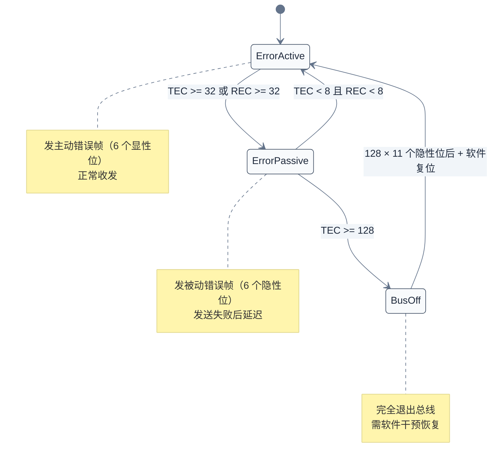
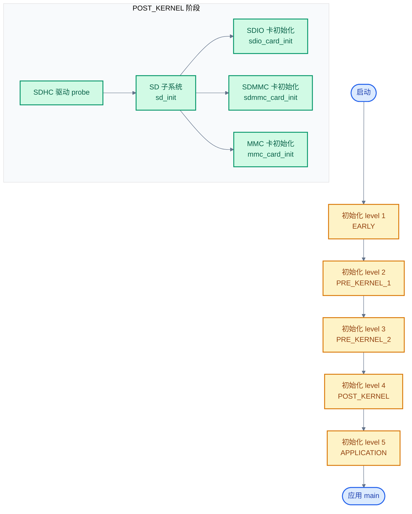
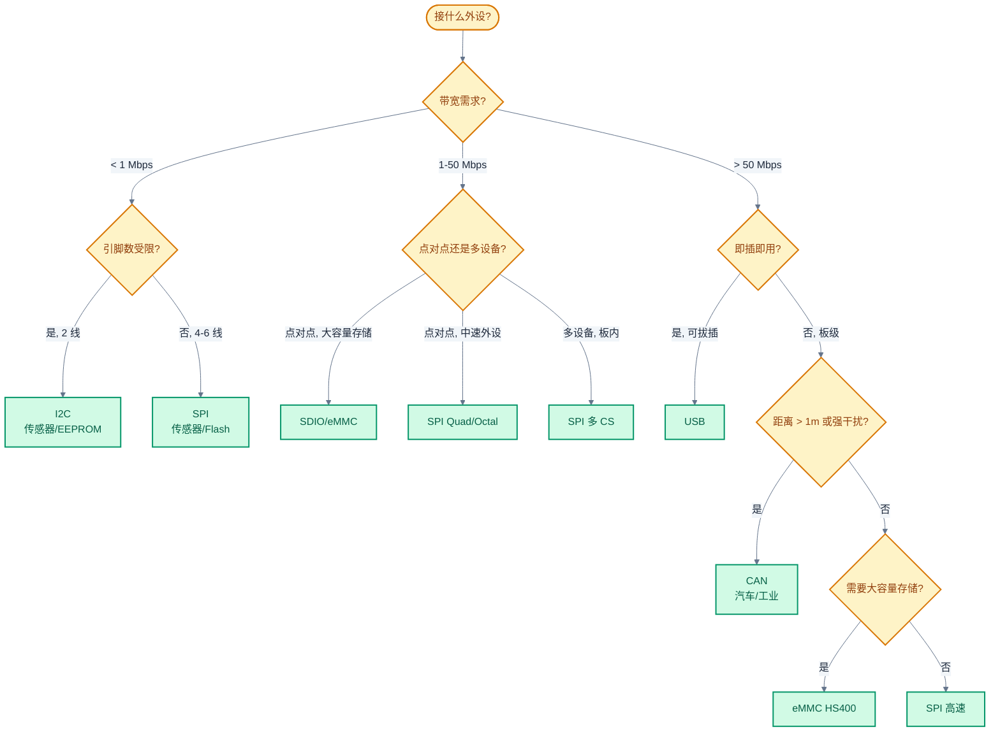
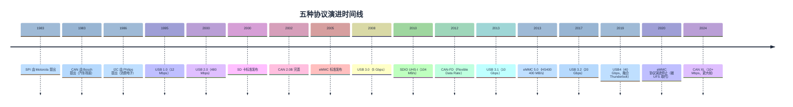

# 协议对比与选型

> 把前五章的五种协议（SPI/I2C/CAN/USB/SDIO-eMMC）放在一起做横向对比，从物理层、协议层、拓扑、性能、可靠性、电源、驱动模型七个维度抽取差异，最终给出选型决策树与决策矩阵。
> **工程师视角**：选型错误是项目返工的常见原因——比如用 I2C 接高带宽摄像头、用 SPI 接多节点传感器网络、用 UART 思维设计 CAN 网络。理解每种协议的"能力边界"与"代价"，比记住它的寄存器字段更重要。本篇的目标是建立一个稳定的对比框架，让未来面对新外设时能快速定位候选协议。

### 关键术语

| 缩写 | 全称 | 含义 |
|------|------|------|
| SPI | Serial Peripheral Interface | 串行外设接口 |
| I2C | Inter-Integrated Circuit | 集成电路间总线 |
| CAN | Controller Area Network | 控制器局域网 |
| CAN-FD | CAN with Flexible Data Rate | CAN 灵活数据速率扩展 |
| USB | Universal Serial Bus | 通用串行总线 |
| OTG | On-The-Go | USB 双角色（主机/设备切换） |
| SDIO | Secure Digital Input Output | SD 协议族 IO 扩展 |
| eMMC | embedded MultiMediaCard | 嵌入式 MMC 存储 |
| SDHCI | Secure Digital Host Controller Interface | SD 标准主机控制器接口 |
| QSPI | Quad Serial Peripheral Interface | 四线串行外设接口，SPI 的多线扩展 |
| OSPI | Octal Serial Peripheral Interface | 八线串行外设接口 |
| DTR | Double Transfer Rate | 双倍传输速率，时钟双沿采样 |
| SFDP | Serial Flash Discoverable Parameters | 串行闪存可发现参数（JEDEC JESD216） |
| XIP | eXecute In Place | 片上执行，Flash 直接映射到 CPU 地址空间 |
| CRC | Cyclic Redundancy Check | 循环冗余校验 |
| DMA | Direct Memory Access | 直接内存访问 |
| NRZI | Non-Return-to-Zero Inverted | 非归零反转编码 |
| PLL | Phase-Locked Loop | 锁相环 |
| PHY | Physical Layer transceiver | 物理层收发器 |
| HCD | Host Controller Driver | USB 主机控制器驱动 |
| UDC | USB Device Controller | USB 设备控制器 |
| URB | USB Request Block | USB 请求块 |
| ADMA | Advanced DMA | SD 高级 DMA 描述符 |
| CQE | Command Queue Engine | SD 命令队列引擎 |
| FTL | Flash Translation Layer | Flash 翻译层 |

### 前置知识

| 需要了解 | 参考文档 |
|----------|----------|
| 五种协议的基本工作原理 | [00-通信协议总览](./00-通信协议总览.md) |
| SPI 协议与驱动细节 | [01-SPI协议与驱动](./01-SPI协议与驱动.md) |
| QSPI 协议与驱动细节 | [11-QSPI协议与驱动](./11-QSPI协议与驱动.md) |
| I2C 协议与驱动细节 | [02-I2C协议与驱动](./02-I2C协议与驱动.md) |
| CAN 协议与驱动细节 | [03-CAN协议与驱动](./03-CAN协议与驱动.md) |
| USB 协议与驱动细节 | [04-USB协议与驱动](./04-USB协议与驱动.md) |
| SDIO/eMMC 协议与驱动细节 | [05-SDIO-eMMC协议与驱动](./05-SDIO-eMMC协议与驱动.md) |

---

## 1. 本篇定位与对比方法论

> 前五章分别讲了每种协议"怎么做"，从协议本质到寄存器实现到驱动框架。这一篇回答一个工程上更关键的问题——"为什么选它"以及"什么时候不该选它"。本章先建立对比的方法论，后续各章按维度展开。

### 1.1 为什么需要横向对比

单看一种协议，工程师容易陷入"我熟悉的协议就是最好的"的陷阱。比如：

- **I2C 的诱惑**：2 线省引脚，看起来"什么都能接"——但 3.4 Mbps 的上限根本带不动现代摄像头
- **SPI 的诱惑**：100 Mbps 看起来很快——但板级点对点，无法扩展到多节点网络
- **USB 的诱惑**：即插即用、高带宽——但协议栈重、引脚多、PHY 复杂，不适合简单 MCU
- **CAN 的诱惑**：抗干扰、对等广播——但速率只有 8 Mbps，不适合存储

横向对比能逼着你看到每种协议的"能力边界"与"代价"，避免用错场景。

### 1.2 对比的七个维度

| 维度 | 关注点 | 决定什么 |
|------|--------|---------|
| **物理层** | 电气、编码、时钟、距离、引脚 | 信号完整性、PCB 设计难度 |
| **协议层** | 帧格式、寻址、CRC、状态机 | 软件复杂度、可调试性 |
| **拓扑与仲裁** | 主从/对等、节点数、扩展 | 网络结构、节点容量 |
| **性能** | 带宽、延迟、协议开销 | 吞吐量、实时性 |
| **可靠性** | CRC 强度、错误恢复、Bus-off | 误码率、故障隔离 |
| **电源** | 电压、低功耗、唤醒 | 电池寿命、热插拔 |
| **驱动模型** | Linux/Zephyr API、DMA、异步 | 软件工程量、维护成本 |

### 1.3 阅读建议

- **2-7 章**：按维度横向对比，每章末尾有"核心要点"总结
- **8-9 章**：按场景纵向分析，"什么场景选什么协议"
- **10-12 章**：Linux/Zephyr 驱动模型对比，软件开发视角
- **13 章**：跨协议共性技术，DMA/中断/设备树/电源管理的统一抽象
- **14 章**：选型决策树与决策矩阵，工程实操
- **15 章**：协议演进趋势

> **核心要点**：横向对比的目的不是评出"最好"，而是建立一张"特性-代价"对照表，让选型决策有据可依。每个工程决策都是在多个约束（带宽、引脚、距离、抗干扰、即插即用、成本、生态）之间权衡，理解这些约束的优先级排序才是选型的核心能力。

---

## 2. 物理层全维度对比

> 物理层是协议"能跑多快、能跑多远、能接几个"的根本约束。本章从电气、编码、时钟、引脚、距离五个子维度展开对比，并解释为什么各协议选择不同的物理层方案。

### 2.1 电气与信号编码对比

| **对比维度** | **SPI** | **I2C** | **CAN** | **USB** | **SDIO/eMMC** |
|:------------:|:-------:|:-------:|:-------:|:-------:|:-------------:|
| **电平类型** | 单端推挽 | 开漏 + 上拉 | 差分 | 差分 | 单端推挽 |
| **驱动方式** | 推挽（CMOS） | 开漏（线与） | 差分驱动 | 差分驱动 | 推挽（CMOS） |
| **线数（数据）** | 2（MOSI+MISO） | 1（SDA） | 1 对（CANH+CANL） | 1 对（D+/D-） | 1/4/8（DAT） |
| **线数（控制）** | 1（SCK）+ N（CS） | 1（SCL） | 0（嵌入时钟） | 0（嵌入时钟） | 1（CLK）+ 1（CMD）+ 0/1（DS） |
| **电平标准** | CMOS（VCC） | CMOS（VCC） | CAN（差分 2V） | USB（差分 0.4V/0.8V） | CMOS（1.8V/3.3V） |
| **上拉电阻** | 不需要 | 必须（4.7kΩ） | 不需要（终端 120Ω） | 不需要（PHY 内置偏置） | 不需要 |
| **终端电阻** | 不需要 | 不需要 | 必须（两端各 120Ω） | 不需要（点对点） | 不需要 |
| **编码方式** | 不编码 | 不编码 | NRZ + 位填充 | NRZI + 位填充 | 不编码 |
| **共模电压范围** | N/A | N/A | -2V ~ +7V | -1V ~ +3.6V | N/A |

> **如何读这张表**：横向看是"一种协议在电气上的完整画像"，纵向看是"一个电气特性下各协议的差异"。重点看"驱动方式"和"上拉/终端电阻"——这两个直接决定 PCB 设计。SPI/SDIO 用推挽省外部元件；I2C 用开漏必须加上拉；CAN 必须终端电阻否则信号反射；USB 由 PHY 处理一切。

### 2.2 时钟机制对比

五种协议都是"同步"的（接收方需要时钟参考），但时钟来源不同：

| **对比维度** | **SPI** | **I2C** | **CAN** | **USB** | **SDIO/eMMC** |
|:------------:|:-------:|:-------:|:-------:|:-------:|:-------------:|
| **时钟来源** | 显式 SCK 线 | 显式 SCL 线 | 嵌入（位同步） | 嵌入（NRZI+PLL） | 显式 CLK 线 |
| **时钟方向** | 主→从 | 主→从（多主时双向） | 无方向（自同步） | 无方向（自同步） | 主→从 |
| **时钟频率可变** | 是 | 是 | 否（固定位时序） | 否（固定位时序） | 是（多档速度模式） |
| **位填充开销** | 无 | 无 | 有（5 同电平插 0，~20%） | 有（6 同电平插 0，~16.7%） | 无 |
| **PLL 时钟恢复** | 不需要 | 不需要 | 必须 | 必须 | 不需要 |
| **最高速率** | 100 Mbps | 3.4 Mbps | 8 Mbps（CAN-FD） | 10 Gbps（USB 3.1） | 400 MB/s（HS400） |

#### 显式时钟线的取舍

**为什么 SPI/I2C/SDIO 选择显式时钟线？**

- **优点**：实现简单（无需 PLL）、速率可灵活调整、无位填充开销
- **缺点**：需要额外引脚、时钟线本身成为信号完整性瓶颈（高频时反射、串扰）、距离受限（时钟与数据的传输延迟差异）

**为什么 USB 选择嵌入时钟？**

- **优点**：高速可达吉比特（差分 + PLL 时钟恢复）、即插即用（时钟自动恢复）
- **缺点**：需要复杂 PHY（PLL、均衡器）、位填充开销

**为什么 CAN 选择嵌入时钟？**

CAN 不是为了高速，而是为了远距离和多节点时钟容差。如果用显式时钟线：
- 多节点时，离主设备最远的节点时钟延迟最大，采样窗口不可控
- 远距离下时钟与数据的延迟差异难以补偿

嵌入时钟让每个节点用自己的 PLL 恢复时钟，节点时钟容差只需 ±0.5%（CAN 2.0）。

### 2.3 距离与节点数对比

| **对比维度** | **SPI** | **I2C** | **CAN** | **USB** | **SDIO/eMMC** |
|:------------:|:-------:|:-------:|:-------:|:-------:|:-------------:|
| **典型距离** | < 30 cm（板级） | < 30 cm（板级） | 40 m @ 1 Mbps | 5 m（USB 2.0） | < 5 cm（板级） |
| **最大距离** | 1 m（降速） | 1 m（降速） | 1000 m @ 50 kbps | 30 m（USB 3.0 有源） | 10 cm（高速信号） |
| **节点数上限** | 1-8 从设备 | ~20（受电容 400pF 限制） | ~30（受延迟限制） | 127（理论，Hub 级联 5 层） | 1（点对点） |
| **扩展方式** | CS 片选加线 | 地址区分 | 优先级 ID | Hub 级联 | 不支持 |
| **总线电容限制** | 无（推挽驱动） | 400 pF | 无（差分） | 无（差分） | 无（推挽驱动） |

#### I2C 电容限制的本质

I2C 的 400 pF 总线电容限制是开漏电气特性决定的。开漏输出只能"拉低"不能"拉高"，上拉电阻 + 总线电容构成 RC 时间常数：

$$
\tau = R_{\text{pullup}} \times C_{\text{bus}}
$$

上升时间必须小于位周期的一半：

$$
t_r \approx 0.8 \times \tau \le \frac{T_{\text{bit}}}{2} = \frac{1}{2 f_{\text{SCL}}}
$$

数值演算：标准模式 100 kHz、$R_{\text{pullup}} = 4.7\text{ k}\Omega$ 时

$$
C_{\text{bus}} \le \frac{1}{2 \times 4700 \times 100000 \times 0.8} \approx 1.3\ \mu\text{F}
$$

实际还要考虑驱动能力与噪声裕度，工程上保守限制在 400 pF。这就解释了"I2C 不能接太多元器件"——不是协议限制，是物理限制。

#### CAN 节点数与距离的取舍

CAN 的"距离 vs 速率"由位时序决定：信号往返延迟（含收发器、线缆）必须小于位周期的某一部分（采样点之前）。

| 速率 | 最大距离 | 节点数 | 物理限制 |
|------|---------|--------|---------|
| 1 Mbps | 40 m | 30 | 往返延迟 < 2 μs |
| 500 kbps | 100 m | 30 | 往返延迟 < 4 μs |
| 125 kbps | 500 m | 30 | 往返延迟 < 16 μs |
| 50 kbps | 1000 m | 30 | 往返延迟 < 40 μs |

> **核心要点**：物理层决定了协议"能跑多快、能跑多远、能接几个"的硬约束。SPI/SDIO 用推挽适合板级高速，I2C 用开漏受电容限制适合低速多点，CAN/USB 用差分适合远距离/高带宽。选型时先看物理层是否满足，再看协议层——物理层不满足，协议再好也没用。

---

## 3. 协议层全维度对比

> 物理层管"位怎么传"，协议层管"位组成什么含义"。本章对比帧格式、寻址方式、CRC、错误检测、状态机，这些直接决定软件复杂度与可调试性。

### 3.1 帧格式对比

| **对比维度** | **SPI** | **I2C** | **CAN** | **USB** | **SDIO/eMMC** |
|:------------:|:-------:|:-------:|:-------:|:-------:|:-------------:|
| **帧类型** | 无（无结构） | 地址+数据+ACK | 数据/远程/错误/过载 | 令牌/数据/握手/SOF | 命令/响应/数据 |
| **帧长度** | 任意 | 8 bit/字节 | 0-8 字节（CAN-FD 64） | 1-1024 字节（HS） | 48 bit 命令 + 数据块 |
| **帧起始** | CS 拉低（无位级） | START 条件 | SOF（1 个显性位） | SOP（K 符号） | 起始位（0） |
| **帧结束** | CS 拉高 | STOP 条件 | EOF（7 个隐性位） | EOP（J 符号） | 结束位（1） |
| **位顺序** | 可配（MSB/LSB） | MSB | MSB | LSB | MSB |
| **位填充** | 无 | 无 | 有 | 有 | 无 |

#### SPI "无帧格式"的含义

SPI 没有帧格式——它只是"主设备在 SCK 上跳变时，MOSI/MISO 上的电平就是数据"。这意味着：

- **没有"开始传输"信号**：CS 拉低就是开始，但 CS 是 GPIO，不是协议层
- **没有"结束传输"信号**：CS 拉高就是结束
- **没有"帧长"信息**：主设备决定传几个字节，从设备无法预知
- **没有"地址"概念**：CS 选定哪个从设备，传输的全部数据都属于它

这种极简设计让 SPI 在协议层几乎零开销，但代价是**应用层必须自己定义帧格式**——SPI Flash 用 8 位命令 + 24/32 位地址 + 数据，SPI LCD 用 1 位 D/C + 数据，SPI 传感器用寄存器读写格式。每个 SPI 设备的"协议"都不一样。

#### CAN 帧的 ID 优先级

CAN 是唯一把"优先级"嵌入帧头的协议。11/29 位 ID 既是地址，也是优先级——ID 越小优先级越高。仲裁期间，多个节点同时发送时，ID 大的节点会先看到总线电平与自己发送的不一致，自动退出。

```
节点 A 发 0x123
节点 B 发 0x045
仲裁过程（MSB 先发，0 显性，1 隐性）：
位 10: A=0, B=0 → 继续
位 9:  A=0, B=0 → 继续
位 8:  A=0, B=1 → B 看到 0（自己发的 1 被覆盖）→ B 退出
A 赢得仲裁，继续发送
```

#### USB 的四类传输

USB 协议层引入"传输类型"概念，不同数据流用不同策略：

| 传输类型 | 用途 | 重传 | 带宽保证 | 延迟保证 |
|---------|------|------|---------|---------|
| 控制 | 枚举、配置 | 是 | 否（10% 保留） | 否 |
| 批量 | U 盘、打印机 | 是 | 否（用空闲带宽） | 否 |
| 中断 | 鼠标、键盘 | 是 | 是（周期轮询） | 是（≤ 1 ms） |
| 等时 | 摄像头、音频 | 否 | 是（固定带宽） | 是（≤ 1 ms） |

这种分类让 USB 能同时承载"不能丢"的键盘数据和"可丢但要实时"的音频数据，是其他协议没有的能力。

#### SDIO/eMMC 的命令-响应分离

SDIO/eMMC 协议帧最大特点是**命令与数据物理分离**——CMD 线传命令和响应，DAT 线传数据块。这与 SPI/I2C 的"命令和数据混在一条线"截然不同：

- **CMD 线**：48 bit 命令帧，含起始位、传输位、命令索引、参数、CRC7、结束位
- **DAT 线**：数据块（典型 512 字节），每块后跟 CRC16

这种分离让 SDIO 能"发命令的同时收上一命令的数据"，CMD13 状态查询可以与数据传输并行。

### 3.2 寻址方式对比

| **对比维度** | **SPI** | **I2C** | **CAN** | **USB** | **SDIO/eMMC** |
|:------------:|:-------:|:-------:|:-------:|:-------:|:-------------:|
| **寻址机制** | CS 片选（GPIO） | 7/10 位地址 | 11/29 位 ID | 7 位设备地址 + 4 位端点 | RCA（相对地址，16 位） |
| **地址分配** | 硬件（CS 接哪个 GPIO） | 硬件（芯片固定或引脚配） | 应用层约定 | 枚举时分配 | CMD2/CMD3 动态分配 |
| **地址冲突** | 不可能（CS 独立） | 可能（同地址器件） | 不可能（ID 唯一） | 不可能（hub 隔离） | 不可能（点对点） |
| **多播/广播** | 不支持 | 不支持（通用呼叫地址 0x00 例外） | 支持（ID 范围约定） | 不支持 | 不支持 |
| **地址变更** | 不可能 | 不可能（硬件） | 不可能（应用层） | 不可能（hub 管理） | 支持（CMD3 重新分配） |

#### SDIO RCA 的特殊性

SDIO/eMMC 的 RCA (Relative Card Address) 是协议层动态分配的——主机发 CMD2（询问所有卡），所有卡回 CID；主机再发 CMD3（指定 RCA），卡接受后就用这个 RCA 响应后续命令。这种"动态地址"机制是为了支持"多卡总线"——同一条 SD 总线接多张卡，主机分别给每张卡分配不同 RCA。

实际嵌入式系统几乎都是点对点（一个控制器一张卡），RCA 仍按协议分配为 0x0001。这种"为多卡设计的协议用在单卡场景"是 SDIO 协议复杂度的一个来源。

### 3.3 CRC 与错误检测对比

| **对比维度** | **SPI** | **I2C** | **CAN** | **USB** | **SDIO/eMMC** |
|:------------:|:-------:|:-------:|:-------:|:-------:|:-------------:|
| **命令/帧 CRC** | 无 | 无 | CRC-15（标准）/ CRC-17（FD） | CRC-5（令牌） | CRC-7（命令） |
| **数据 CRC** | 无 | 无 | CRC-15（标准）/ CRC-21（FD） | CRC-16（数据） | CRC-16（每数据块） |
| **ACK 机制** | 无 | 1 bit ACK（每字节） | 1 bit ACK（每帧） | 1 字节握手 | 1 bit END位（每帧） |
| **CRC 多项式** | N/A | N/A | 0x4599（CRC-15） | 0x05 / 0x8005 | 0x09 / 0x1021 |
| **CRC 计算位置** | N/A | N/A | 控制器硬件 | 控制器硬件 | 控制器硬件 |
| **CRC 错误处理** | 应用层 | 应用层 | 自动重发 | 自动重传 | 自动重传 |

#### CRC 强度对比

CRC 的检错能力取决于多项式和位宽。对比五种协议的 CRC：

- **CAN CRC-15**：检错所有 ≤ 2 位的错误，所有奇数位错误，< $2^{15}$ 位的突发错误
- **USB CRC-16**：检错所有 ≤ 2 位的错误，所有奇数位错误，< 16 位的突发错误
- **SDIO CRC-7**：检错所有 ≤ 2 位的错误，< 7 位的突发错误
- **SDIO CRC-16**：与 USB CRC-16 同类，对 512 字节数据块足够

> **如何读这些数据**：CRC 强度与"位宽 + 多项式"有关。CAN 用 CRC-15 不是因为"够用"，而是因为帧短（≤ 8 字节）。SDIO 数据块 512 字节用 CRC-16 才合理。设计时不能盲目用强 CRC——位宽增加意味着帧开销增大。

### 3.4 状态机复杂度对比

| **协议** | 状态数 | 关键状态 | 复杂度 |
|---------|--------|---------|--------|
| **SPI** | 0 | 无状态机 | 极简 |
| **I2C** | 5 | IDLE/START/ADDR/DATA/STOP | 简单 |
| **CAN** | 12+ | Bus-Active/Bus-Idle/Error-Active/Error-Passive/Bus-off | 复杂 |
| **USB** | 10+ (Device) | Powered/Default/Addressed/Configured/Suspended | 复杂 |
| **SDIO/eMMC** | 8 | Idle/Ready/Ident/Standby/Tran/Data/Dis/Programming | 中等 |

#### CAN 错误状态机的特殊性

CAN 是唯一有"故障隔离"状态机的协议：

- **Error-Active**（正常）：错误计数 < 32，检测到错误发"主动错误帧"（6 个显性位）
- **Error-Passive**（受限）：32 ≤ 计数 < 128，发"被动错误帧"（6 个隐性位），延迟发送
- **Bus-off**（隔离）：计数 ≥ 128，完全退出总线，需软件干预恢复

这种机制让"有问题的节点"自动降级，避免拖垮整个网络。其他协议没有这种设计——I2C 卡死就整个总线死，USB 设备出错靠主机重试。

> **核心要点**：协议层复杂度与"能力"成正比。SPI 极简但所有逻辑留给应用层；I2C 简单但只有 ACK 没有检错；CAN 复杂但能隔离故障节点；USB 复杂但能承载多种数据流；SDIO 复杂因为要兼容 SD/SDIO/eMMC 三种卡且支持大容量存储。选型时要权衡"协议栈开发成本"与"协议提供的能力"。

---

## 4. 拓扑与仲裁机制对比

> 物理层决定了"能不能连"，拓扑决定了"怎么连"。本章对比五种协议的拓扑结构、节点扩展方式、总线仲裁机制——这些决定了系统架构的灵活性。

### 4.1 拓扑结构对比

| **对比维度** | **SPI** | **I2C** | **CAN** | **USB** | **SDIO/eMMC** |
|:------------:|:-------:|:-------:|:-------:|:-------:|:-------------:|
| **拓扑** | 星型（每从一根 CS） | 总线（并联） | 总线 + 终端电阻 | 树型（Hub 级联） | 点对点 |
| **共享信号** | SCK/MOSI/MISO 共享 | SDA/SCL 共享 | CANH/CANL 共享 | D+/D- 共享 | CLK/CMD/DAT 共享（理论多卡） |
| **独占信号** | 每从一根 CS | 无 | 无 | 无 | 无（实际单卡） |
| **终端匹配** | 无 | 无 | 两端 120Ω | 无（PHY 内置） | 无 |
| **分支长度** | 短（< 10 cm） | 短（< 30 cm） | 短（< 30 cm 分支） | 短（< 5 cm） | 短（< 5 cm） |

### 4.2 主从 vs 对等

#### 主从协议的共性

SPI、I2C、USB、SDIO 都是主从式。共同特点：

- **主设备控制时钟**：SCK/SCL/CLK 由主设备产生
- **主设备发起所有通信**：从设备只能响应
- **简化从设备逻辑**：从设备无需仲裁、调度逻辑
- **从设备通知机制受限**：
  - SPI：通过额外 INT 引脚
  - I2C：SMBus Alert 引脚或主机轮询
  - USB：端点中断（设备在主机轮询时回 NAK 或数据）
  - SDIO：INT8~INT32 寄存器（主机 CMD52 轮询）或 SDIO 中断引脚

#### CAN 的对等架构

CAN 是唯一的对等总线：

- **任一节点可主动发送**：ABS 故障立即广播，不等主机轮询
- **冗余**：无"主机"单点故障
- **仲裁保证优先级**：ID 越小优先级越高，关键控制帧永远优先

#### USB 的"伪对等"——OTG

USB OTG 允许设备临时切换主机角色，但同一时刻仍是一主一从，靠 ID 引脚判断：

```c
// ID 引脚接地 → A 设备（主机）
// ID 引脚悬空 → B 设备（外设）
// USB OTG 角色切换通过 HNP (Host Negotiation Protocol) 完成
```

### 4.3 仲裁机制对比

| **协议** | 仲裁方式 | 仲裁时机 | 失败方处理 |
|---------|---------|---------|-----------|
| **SPI** | 无仲裁（主设备独占） | N/A | N/A |
| **I2C** | 时钟拉伸 + SDA 线与 | 字节级（每字节后） | 主设备等从设备 |
| **I2C（多主）** | SDA 线与（0 显性） | 位级 | 输者退出，等 STOP 重试 |
| **CAN** | ID 仲裁（显性优先） | 帧级（SOF 之后） | 输者等 EOF 后重试 |
| **USB** | 无仲裁（主设备轮询） | N/A | N/A |
| **SDIO** | 无仲裁（主设备独占） | N/A | N/A |

#### CAN 仲裁的"非破坏性"

CAN 仲裁的最大特点是**非破坏性**——赢得仲裁的节点继续发送，输的节点等下一轮。这与 I2C 多主仲裁形成对比：

```
I2C 多主仲裁：
主 A 发 0x55 → 字节传完，主 B 发 0x33
主 A 想 SDA=0 时总线=0 → 继续
主 A 想 SDA=1 时总线=0（主 B 在拉低）→ 仲裁失败，退出
但此时主 A 的字节已传一半，被破坏
```

```
CAN 仲裁：
节点 A 发 ID=0x123
节点 B 发 ID=0x045
仲裁在帧头 ID 字段，输者退出，赢者继续发送有效数据
数据不被破坏
```

### 4.4 节点扩展能力

| **协议** | 节点数上限 | 扩展方式 | 实际工程上限 |
|---------|----------|---------|------------|
| **SPI** | CS 数量限制 | 多路 GPIO 解码（74HC138） | 8-16（受 CS 引脚） |
| **I2C** | ~127（地址） | 总线电容限制（400 pF） | 8-20（受电容） |
| **I2C 多路复用** | 理论无限 | I2C mux（PCA9548） | 64（每 mux 8 路） |
| **CAN** | ~30（物理层） | 桥接（CAN-CAN 网关） | 30（单网段） |
| **USB** | 127（理论） | Hub 级联（5 层） | 实际 10-30（带宽限制） |
| **SDIO** | 1（实际） | 协议支持多卡但 PCB 难 | 1 |

> **核心要点**：拓扑决定了系统的扩展能力。SPI 靠 CS 加线扩展；I2C 靠地址扩展但受电容限制；CAN 是单网段 30 节点；USB 靠 Hub 级联到 127；SDIO 实际是点对点。选型时要考虑"未来会不会加更多设备"——如果会，I2C 的地址机制比 SPI 的 CS 机制扩展性更好。

---

## 5. 性能与吞吐量对比

> 物理层和协议层决定了"理论最大速率"，实际吞吐量还要看协议开销、传输模型、驱动实现。本章从带宽、延迟、协议开销三个角度对比。

### 5.1 理论带宽对比

| **协议** | 速度模式 | 时钟频率 | 数据宽度 | 理论带宽 | 实测典型 |
|---------|---------|---------|---------|---------|---------|
| **SPI** | 标准 | 50 MHz | 1 bit | 6.25 MB/s | 5 MB/s |
| **SPI** | Quad | 50 MHz | 4 bit | 25 MB/s | 20 MB/s |
| **SPI** | Octal | 50 MHz | 8 bit | 50 MB/s | 40 MB/s |
| **I2C** | 标准 | 100 kHz | 1 bit | 12.5 KB/s | 10 KB/s |
| **I2C** | 快速 | 400 kHz | 1 bit | 50 KB/s | 40 KB/s |
| **I2C** | 高速 | 3.4 MHz | 1 bit | 425 KB/s | 350 KB/s |
| **CAN** | 2.0 | 1 Mbps | 1 bit | 最高 7.6 KB/s（8字节帧） | 5 KB/s |
| **CAN-FD** | FD | 8 Mbps | 1 bit | 最高 80 KB/s（64字节帧） | 60 KB/s |
| **USB** | 1.1 | 12 Mbps | 1 bit | 1.5 MB/s | 1 MB/s |
| **USB** | 2.0 | 480 Mbps | 1 bit | 60 MB/s | 35 MB/s |
| **USB** | 3.0 | 5 Gbps | 1 对 | 625 MB/s | 400 MB/s |
| **USB** | 3.1 | 10 Gbps | 1 对 | 1.25 GB/s | 800 MB/s |
| **eMMC** | HS | 52 MHz | 8 bit | 52 MB/s | 45 MB/s |
| **eMMC** | DDR52 | 52 MHz | 8 bit DDR | 104 MB/s | 90 MB/s |
| **eMMC** | HS200 | 200 MHz | 8 bit | 200 MB/s | 180 MB/s |
| **eMMC** | HS400 | 200 MHz | 8 bit DDR | 400 MB/s | 350 MB/s |

#### SDIO/eMMC 带宽公式

带宽计算公式：

$$
BW = f_{\text{clk}} \times W \times k / 8
$$

变量解释：
- $f_{\text{clk}}$：时钟频率（Hz）
- $W$：数据宽度（bit，1/4/8）
- $k$：DDR 系数（SDR=1, DDR=2）
- $8$：bit 转 byte

数值演算：HS400 模式、200 MHz、8 bit DDR

$$
BW = 200 \times 10^6 \times 8 \times 2 / 8 = 400\ \text{MB/s}
$$

CAN-FD 帧效率演算：8 Mbps 仲裁段 + 64 字节数据段

```
帧结构：SOF(1) + ID(11/29) + 控制(7) + 数据(64×8=512) + CRC(21) + ACK(2) + EOF(7)
总位 ≈ 600 bit @ 64 字节
帧效率 = 512 / 600 ≈ 85%
有效吞吐 = 8 Mbps × 85% / 8 = 85 KB/s
```

#### SPI Quad/Octal 与 QSPI 控制器

表中 SPI Quad/Octal 行的"实测典型"明显低于理论带宽，原因是命令/地址阶段通常仍走单线、还有 dummy cycle 开销。真正把 Quad/Octal 跑满需要专门的 QSPI 控制器（Cadence QSPI、Zynq GQSPI、STM32 OSPI 等），它们支持 STIG/Indirect/Direct Mapping 三种模式，并可通过 AHB 内存映射实现 XIP。SPI NOR Flash 的命令集（QIOR 0xEB、4 字节寻址、QE 位）、JEDEC SFDP 参数发现、Linux `spi-mem`/`spi-nor` 子系统的协同工作，详见 [11-QSPI协议与驱动](./11-QSPI协议与驱动.md)。

### 5.2 协议开销对比

| **协议** | 协议开销 | 开销来源 | 实际效率 |
|---------|---------|---------|---------|
| **SPI** | 几乎为 0 | 无帧头/CRC | > 95% |
| **I2C** | ~50% | 9 bit/字节（含 ACK） | ~50% |
| **CAN** | ~50%（标准）/ ~15%（FD） | 帧头+CRC+ACK+EOF | ~50% / ~85% |
| **USB** | ~10-30% | 令牌包+CRC+握手 | 70-90% |
| **SDIO** | ~10-20% | 命令帧+CRC+响应 | 80-90% |

#### I2C 协议开销为什么这么高

I2C 每传 8 位数据要消耗 9 个 SCL 周期（8 数据 + 1 ACK）。100 kHz I2C 理论 12.5 KB/s，实际只有约 9 KB/s（含 START/STOP、地址字节）。这是 I2C 适合低速传感器的根本原因——协议开销让它在 100 kHz 时不掉速到 10 KB/s 都困难。

### 5.3 传输延迟对比

| **协议** | 单次传输延迟 | 实时性 | 适用场景 |
|---------|------------|--------|---------|
| **SPI** | 微秒级 | 极好 | 实时控制 |
| **I2C** | 10 微秒级 | 好 | 低速传感 |
| **CAN** | 100 微秒级 | 中 | 控制网络 |
| **USB** | 125 微秒~毫秒 | 差 | 数据传输 |
| **SDIO** | 100 微秒~毫秒 | 差 | 存储/网络 |

#### USB 的"帧/微帧"调度

USB 2.0 高速模式把时间切成 125 μs 微帧，主机在每个微帧开始时调度传输。这意味着：

- 等时传输：每 125 μs 一次，延迟固定
- 中断传输：每微帧到每帧（1 ms）一次
- 批量传输：用空闲带宽，延迟不确定

USB 3.0 改为突发模式，但本质仍是主机调度，单次请求延迟仍在毫秒级。

#### SDIO 的"命令-响应"延迟

SDIO 每次读操作要发命令、等响应、再读数据。典型延迟：

```
CMD17 读单块：
  发命令：48 bit / 25 MHz ≈ 2 μs
  等响应：48 bit / 25 MHz ≈ 2 μs
  等数据：NAC 周期，典型 8 ~ 64 个时钟，约 1-2 μs
  数据：512 字节 / 50 MB/s ≈ 10 μs
  CRC：~1 μs
单次延迟：~15-20 μs
```

这是 SDIO 随机读 IOPS 受限的根本原因——50000 IOPS ≈ 20 μs 一次。

> **核心要点**：带宽与延迟是两个独立维度。SPI 带宽中等但延迟极低（实时控制首选）；USB 带宽高但延迟毫秒级（适合数据流不适合实时控制）；SDIO 带宽高但单次延迟大（适合顺序读不适合随机访问）；CAN 带宽低但仲裁保证关键帧优先（适合控制网络）。

---

## 6. 可靠性与错误恢复对比

> 错误恢复是协议鲁棒性的核心。本章对比各协议"检测到错误后怎么办"，以及为什么这样设计——错误恢复策略与场景风险直接相关。

### 6.1 错误检测能力对比

| **协议** | 检测机制 | 检测能力 | 漏检概率 |
|---------|---------|---------|---------|
| **SPI** | 无 | 不检测 | 高（应用层负责） |
| **I2C** | 1 bit ACK | 检测"设备是否存在/是否忙" | 高（无 CRC） |
| **CAN** | CRC-15 + ACK + 错误帧 | 检测位错误、格式错误、CRC 错误 | 极低（< $2^{-15}$） |
| **USB** | CRC-5（令牌）+ CRC-16（数据） | 检测包损坏 | 极低（< $2^{-16}$） |
| **SDIO** | CRC-7（命令）+ CRC-16（数据） | 检测命令/数据损坏 | 极低（< $2^{-16}$） |

### 6.2 错误恢复策略对比

| **协议** | 恢复策略 | 重试次数 | 故障隔离 |
|---------|---------|---------|---------|
| **SPI** | 应用层重传 | 应用决定 | 无 |
| **I2C** | 主设备 STOP 后重发 | 应用决定 | 无 |
| **CAN** | 自动重发 + 错误状态机 | 无限（直到 Bus-off） | Bus-off 隔离故障节点 |
| **USB** | 主机重传 | 最多 3 次 | 端点 STALL/PING |
| **SDIO** | 主机重发命令/重传块 | 应用决定 | 卡 reset |

### 6.3 各协议错误恢复详解

#### SPI/I2C：靠应用层

板级短距离，噪声小，错误罕见。SPI 完全不检测，I2C 只有 ACK。错误恢复靠应用层：

- 重发命令
- 重新初始化外设
- 看门狗复位整个外设

#### CAN：错误状态机 + Bus-off

CAN 是错误恢复设计最完善的协议：



错误计数器规则：
- 发送错误 +8，成功 -1
- 接收错误 +8，成功 -1（最多到 127）
- TEC ≥ 128 进入 Bus-off

#### USB：分层重传

USB 错误恢复分三层：

1. **包级**：CRC 错误时接收方不发 ACK，发送方超时重传
2. **传输级**：连续 3 次失败，标记端点为 HALT，软件干预
3. **设备级**：枚举失败或持续错误，hub 端口复位

#### SDIO：CRC + ECC 双层

SDIO 协议层只保证传输完整性，存储介质层用 ECC 处理 Flash 位错误：

- **协议层 CRC-16**：检测传输中的位翻转，错误重传
- **Flash ECC**：检测并纠正存储位翻转，典型 1 bit/512 字节纠正，2 bit 检测

> **核心要点**：错误恢复强度与场景风险成正比。SPI/I2C 面向板级，错误罕见，轻量检测足够；CAN 面向汽车强干扰，需要完善的错误状态机隔离故障；USB 面向可拔插外设，需要重传保证数据完整；SDIO 面向高密度存储，CRC + ECC 双层保护。

---

## 7. 电源管理与功耗对比

> 嵌入式系统对功耗越来越敏感，特别是电池供电设备。本章对比各协议的低功耗模式、唤醒机制、电压要求。

### 7.1 电压要求对比

| **协议** | 工作电压 | 低电压支持 | 电压切换 |
|---------|---------|----------|---------|
| **SPI** | 1.8V / 3.3V / 5V | 是（设备决定） | 无（硬件固定） |
| **I2C** | 1.8V / 3.3V / 5V | 是（设备决定） | 无（硬件固定） |
| **CAN** | 5V（CANH-CANL 差分 2V） | 否（CAN 收发器 5V） | 无 |
| **USB** | 5V（VBUS）/ 3.3V（PHY） | 否 | 无 |
| **SDIO** | 3.3V → 1.8V | 是 | CMD11 切换 |

#### SDIO 电压切换的特殊性

SDIO/eMMC 是唯一支持"协议层电压切换"的协议。SD 卡初始化在 3.3V，高速模式（SDR50/SDR104/HS200）必须 1.8V。切换流程：

```
1. 卡在 3.3V 初始化（CMD0 → CMD8 → ACMD41）
2. 主机发 CMD11（VOLTAGE_SWITCH）
3. 卡拉低 DAT0 信号
4. 主机停止 CLK，切换电压到 1.8V
5. 主机恢复 CLK，卡用新电压工作
```

eMMC 默认就是 1.8V（VCCQ），不需要切换。但 SDR50 以上模式还需要切换 VCC（电压）。

### 7.2 低功耗模式对比

| **协议** | 低功耗模式 | 唤醒方式 | 唤醒延迟 |
|---------|----------|---------|---------|
| **SPI** | 控制器关闭时钟 | GPIO 中断 | 微秒级 |
| **I2C** | 控制器关闭 + 总线空闲 | 地址匹配唤醒 | 微秒级 |
| **CAN** | 控制器睡眠 + 总线监听 | 总线活动唤醒 | 毫秒级 |
| **USB** | 选择性挂起（Suspend） | 远程唤醒（Resume 信号） | 毫秒级 |
| **SDIO** | 卡进入 Sleep（CMD5） / Power Off | CMD0 唤醒 | 毫秒级 |

#### USB Selective Suspend

USB 2.0 引入"选择性挂起"——空闲设备可被主机挂起，无总线活动 3 ms 后设备自动进入低功耗。唤醒通过 Resume 信号（K 状态保持 20 ms）。

Linux 驱动通过 `usb_autopm_get_interface()` / `usb_autopm_put_interface()` 管理设备电源状态。

#### SDIO/eMMC 低功耗

eMMC 有多种低功耗模式：

```c
// Linux mmc 子系统的电源状态
enum mmc_power_state {
    MMC_POWER_ON,      // 全速运行
    MMC_POWER_OFF,     // 完全断电
    MMC_POWER_UP,      // 上电中
    MMC_POWER_UNDEFINED // 未定义
};

// eMMC 内部状态
// Sleep State: CMD5 + 参数 0x00000000 → 卡进入 Sleep，功耗 < 0.2 mA
// Power Off State: CMD0 + 参数 0xF0F0F0F0 → 卡完全断电
```

### 7.3 功耗典型值

| **协议** | 工作功耗 | 待机功耗 | 备注 |
|---------|---------|---------|------|
| **SPI** | 5-20 mA | < 1 μA | 取决于设备 |
| **I2C** | 1-5 mA | < 1 μA | 取决于上拉电阻 |
| **CAN** | 30-70 mA（收发器） | 5-15 mA（监听） | 收发器是大头 |
| **USB 2.0** | 100-500 mA | < 1 mA（挂起） | 受 VBUS 限制 |
| **eMMC** | 50-200 mA（写） | < 0.5 mA | 写入比读耗电 |

> **核心要点**：功耗优化是嵌入式系统设计的关键。SPI/I2C 低速设备功耗小；CAN 收发器持续耗电，适合电池供电场景要慎重；USB 设备靠挂起省电；eMMC 写入比读取功耗大，写密集场景要注意散热。

---

## 8. 嵌入式场景的协议选型

> 前几章从协议自身维度对比。本章反过来，从应用场景出发——"我要做 X，该用什么协议？"

### 8.1 嵌入式存储场景

#### 启动存储（Boot ROM 加载 U-Boot）

**需求**：上电后能直接执行（XIP）/快速加载，板级布线简单。

**对比**：

| 选项 | 优势 | 劣势 | 推荐 |
|------|------|------|------|
| SPI NOR Flash | XIP 支持、1/2/4/8 线、协议简单 | 容量小（< 512 Mbit） | 启动代码首选 |
| eMMC | 容量大（4-128 GB）、速度高 | 无 XIP、协议复杂 | 大容量系统 |
| SD 卡 | 可拔插、容量大 | 不可靠（接触不良） | 消费电子 |

**结论**：SPI NOR 启动 + eMMC 跑系统是嵌入式标配。SPI NOR 因为支持 XIP，CPU 可以直接执行启动代码而无需拷贝到 RAM；eMMC 容量大、速度快适合跑完整 OS。XIP 的硬件前提是 QSPI 控制器把 Flash 映射到 CPU 地址空间（Direct Mapping / dirmap），并处理 Cache 一致性与 AHB 误差——详见 [11-QSPI协议与驱动](./11-QSPI协议与驱动.md) 的 XIP 章节。

#### 主存储（Linux 根文件系统）

**需求**：大容量（> 1 GB）、高速度（> 50 MB/s）、磨损管理。

**对比**：

| 选项 | 优势 | 劣势 | 推荐 |
|------|------|------|------|
| eMMC | 大容量、HS400 速度、磨损均衡 | 不可拔插 | 嵌入式 Linux 首选 |
| SD 卡 | 可拔插 | 不可靠、速度慢 | 消费电子 |
| SPI NAND | 便宜 | 速度慢、需 ECC | 低端设备 |
| UFS | 速度最快（3 GB/s） | 协议复杂、成本高 | 高端手机 |

### 8.2 传感器场景

#### 低速传感器（温度、湿度、压力）

**需求**：低速率（< 100 Hz）、省引脚、多传感器并联。

**对比**：

| 选项 | 优势 | 劣势 | 推荐 |
|------|------|------|------|
| I2C | 2 线、地址区分、协议标准 | 速率低 | **首选** |
| SPI | 速度快 | 4-6 线、CS 加线 | 速率需求高时 |
| ADC 直采 | 简单 | 占用 ADC 通道 | 模拟传感器 |

#### IMU/加速度计

**需求**：中速率（1-10 kHz）、低延迟、多轴数据。

**对比**：

| 选项 | 优势 | 劣势 | 推荐 |
|------|------|------|------|
| SPI | 1-50 Mbps、低延迟 | 4 线 | **首选**（IMU 多用 SPI） |
| I2C | 省引脚 | 速率太低 | 低速应用 |

### 8.3 显示场景

#### TFT LCD

**需求**：中带宽（10-100 MB/s）、点对点、低延迟。

**对比**：

| 选项 | 优势 | 劣势 | 推荐 |
|------|------|------|------|
| SPI（Quad） | 4 线、20+ MB/s | 速率上限 | 小屏 |
| 并行 RGB | 高带宽 | 20+ 引脚 | 大屏首选 |
| MIPI DSI | 最高带宽 | 协议复杂 | 高端手机 |
| USB | 即插即用 | 延迟高 | USB 显示器 |

#### OLED 小屏

**需求**：低带宽（< 5 MB/s）、低功耗、点对点。

**推荐**：I2C（SSD1306 等经典 OLED）或 SPI（大点的 OLED）。

### 8.4 网络通信场景

#### WiFi/BT 模块

**需求**：高带宽（> 50 MB/s）、模块化、协议栈成熟。

**对比**：

| 选项 | 优势 | 劣势 | 推荐 |
|------|------|------|------|
| SDIO | 50-100 MB/s、Linux 协议栈成熟 | 6+ 线 | **首选**（大多数 WiFi 模块） |
| USB | 即插即用、跨平台 | 延迟高 | USB WiFi dongle |
| PCIe | 高带宽 | 协议复杂 | 高端网卡 |
| UART | 简单 | 速率低 | 蓝牙模块（HCI） |

#### 蜂窝模块

**需求**：中带宽、长距离、AT 命令接口。

**推荐**：UART（低速）或 USB（高速 4G/5G 模块）。

### 8.5 工业控制场景

#### 电机控制

**需求**：实时性（< 100 μs）、确定性、抗干扰。

**对比**：

| 选项 | 优势 | 劣势 | 推荐 |
|------|------|------|------|
| CAN | 抗干扰、对等、ID 优先级 | 速率低 | 汽车电机 |
| EtherCAT | 实时以太网 | 协议复杂 | 工业机器人 |
| SPI | 低延迟 | 板级、无抗干扰 | 板载电机驱动 |

#### 工业传感器网络

**需求**：远距离（> 10 m）、多节点、抗干扰。

**推荐**：CAN（传统工业）或 RS-485 + Modbus（成本敏感）。

### 8.6 调试与开发场景

#### JTAG/SWD

调试接口固定用 JTAG（边界扫描）或 SWD（ARM 串行调试），与协议选型无关。

#### 调试串口

UART 仍是调试首选——简单、低速率、跨平台。

#### Linux 内核调试

`ftrace`、`kgdb`、`perf` 都依赖 UART 或网络。USB 调试因为协议复杂，不适合作为早期调试通道。

### 8.7 消费电子场景

#### 智能手机

| 子系统 | 协议 | 备注 |
|--------|------|------|
| 主存储 | UFS | 高端 / eMMC 中低端 |
| 启动代码 | SPI NOR | 备份启动 |
| 触摸屏 | I2C | 多点触控 |
| 摄像头 | MIPI CSI | 高带宽 |
| 显示屏 | MIPI DSI | 高带宽 |
| 传感器 | I2C / SPI | IMU/陀螺仪 |
| 蓝牙 | UART | HCI |
| WiFi | SDIO / PCIe | 速率需求 |
| USB | USB 2.0/3.0 | 充电 + 数据 |

#### IoT 设备

| 子系统 | 协议 | 备注 |
|--------|------|------|
| 启动 | SPI NOR | 小容量 |
| 主存 | SPI NAND | 便宜 |
| 传感器 | I2C / SPI | 低速 |
| 网络 | UART（WiFi/BT 模块） | 简单 |
| 调试 | UART | 必备 |

> **核心要点**：场景驱动选型比"我喜欢某协议"更重要。每个场景都有"主流方案"——SPI NOR 启动、eMMC 主存、I2C 低速传感、SPI IMU、SDIO WiFi、CAN 工业控制——主流意味着生态成熟、坑少。除非有明确理由，否则不要选非主流方案。

---

## 9. 典型 SoC 外设组合设计

> 实际系统不会只用一种协议。本章展示典型 SoC 的外设组合，说明各协议如何协同，以及 PCB 设计要点。

### 9.1 通用 SoC 外设地图

```mermaid
%%{init: {"theme": "base", "themeVariables": {"primaryColor": "#f8fafc", "primaryTextColor": "#1e293b", "primaryBorderColor": "#475569", "lineColor": "#64748b", "secondaryColor": "#f1f5f9", "secondaryBorderColor": "#94a3b8", "tertiaryColor": "#f8fafc", "fontFamily": "\"trebuchet ms\", verdana, arial, sans-serif"}}}%%
flowchart TD
    SoC([SoC<br/>多核 CPU])

    subgraph "启动路径"
        Boot[SPI NOR Flash<br/>启动代码] -->|SPI Quad| SoC
        SoC -->|eMMC 8-line HS400| Main[(eMMC<br/>根文件系统)]
    end

    subgraph "低速传感"
        SoC -->|I2C bus 0| TSens[温度传感器]
        SoC -->|I2C bus 0| IMU[IMU 6 轴]
        SoC -->|I2C bus 1| PMIC[PMIC 电源]
        SoC -->|I2C bus 1| RTC[RTC 时钟]
    end

    subgraph "中速设备"
        SoC -->|SPI bus 0| Touch[触摸屏控制器]
        SoC -->|SPI bus 1| ETH[以太网 PHY]
    end

    subgraph "高速外设"
        SoC -->|SDIO 4-line| WiFi[WiFi/BT 模块]
        SoC -->|MIPI DSI| LCD[TFT 显示屏]
        SoC -->|MIPI CSI| Cam[摄像头]
        SoC -->|USB Host| USBDev[USB 设备]
    end

    subgraph "网络总线"
        SoC -->|CAN 0| CANBus[CAN 总线<br/>工业控制]
        SoC -->|CAN 1| CANBus2[CAN 总线<br/>汽车网络]
    end

    subgraph "调试"
        SoC -->|UART 0| Debug[调试串口]
        SoC -->|JTAG| Jtag[JTAG 调试器]
    end

    classDef soc fill:#dbeafe,stroke:#2563eb,color:#1e40af,stroke-width:2px
    classDef boot fill:#d1fae5,stroke:#059669,color:#065f46,stroke-width:2px
    classDef sensor fill:#fef3c7,stroke:#d97706,color:#92400e,stroke-width:2px
    classDef hs fill:#cffafe,stroke:#0891b2,color:#155e75,stroke-width:2px
    classDef net fill:#fee2e2,stroke:#dc2626,color:#991b1b,stroke-width:2px
    classDef dbg fill:#f1f5f9,stroke:#64748b,color:#334155,stroke-width:2px
    class SoC soc
    class Boot,Main boot
    class TSens,IMU,PMIC,RTC,Touch,ETH sensor
    class WiFi,LCD,Cam,USBDev hs
    class CANBus,CANBus2 net
    class Debug,Jtag dbg
```



### 9.2 组合设计原则

#### 启动路径优先

```
SPI NOR（启动代码） + eMMC（主存储）是嵌入式标配
SPI 启动是因为 NOR Flash 支持片上执行（XIP）
eMMC 跑系统是因为容量和速度
```

PCB 设计要点：
- SPI NOR 走线短（< 5 cm），靠近 SoC
- eMMC 走线等长（DAT0-7 长度差 < 50 mil）
- 高速模式（HS400）需要阻抗匹配（50Ω 单端）

#### I2C 总线分组

I2C 总线分组原则：
- **电源管理组**：PMIC、RTC、电池电量计（一致性高，可同总线）
- **传感器组**：温度、IMU、压力（采样率相近）
- **EEPROM 组**：配置存储（低频访问）

不要把所有 I2C 设备堆一条总线——电容累加到 400 pF 就跑不动了。

#### SPI 总线分组

SPI 总线分组原则：
- **高速 SPI**：Flash、显示屏（50+ MHz）
- **中速 SPI**：触摸屏、网络 PHY（10-50 MHz）
- **低速 SPI**：ADC、DAC（< 10 MHz）

每条 SPI 总线接 1-2 个从设备，CS 用 GPIO 解码可以扩展。

#### USB 接口分配

USB 接口分配原则：
- **USB 2.0 OTG**：调试 + USB 设备模式（gadget）
- **USB 3.0 Host**：高速外设（U 盘、摄像头）
- **USB 2.0 Host**：键鼠、低速外设

#### CAN 总线隔离

工业/汽车场景 CAN 总线物理隔离：
- **动力 CAN**：高速（500 kbps-1 Mbps），发动机/变速箱
- **车身 CAN**：低速（125 kbps），车窗/灯光
- **诊断 CAN**：中速（250 kbps），OBD 接口

### 9.3 PCB 设计要点

| 协议 | 走线长度 | 阻抗要求 | 等长要求 | EMI 处理 |
|------|---------|---------|---------|---------|
| SPI | < 10 cm | 50Ω 单端 | 时钟与数据 < 100 mil | 串阻 22-33Ω |
| I2C | < 30 cm | 50Ω 单端 | 无 | 上拉靠近主设备 |
| CAN | < 40 m | 120Ω 差分 | CANH/CANL < 100 mil | 双绞线 |
| USB 2.0 | < 5 cm | 90Ω 差分 | D+/D- < 50 mil | ESD 保护 |
| USB 3.0 | < 10 cm | 90Ω 差分 | < 5 mil | 走带状线 |
| eMMC | < 5 cm | 50Ω 单端 | DAT0-7 < 50 mil | 串阻 22-33Ω |

#### eMMC 高速信号完整性

HS400 模式（200 MHz DDR）对信号完整性要求极高：

- DAT0-7 + CMD + CLK + DS 必须等长（< 50 mil）
- CLK 必须比 DAT 早 ~100 ps（建立时间）
- DS 信号必须等长（HS400es 模式）
- 阻抗连续（50Ω ± 10%）
- 减少 via（每个 via 增加 0.5-1 nH 寄生电感）

> **核心要点**：协议组合的核心理念是"按需求分层"——启动存储用最高优先级协议，低速传感共享总线省引脚，高速外设按场景选型，网络总线物理隔离保证可靠性。没有一种协议能通吃，组合使用才是工程实践。

---

## 10. Linux 驱动模型全景对比

> 前五章分别讲了各协议在 Linux 中的驱动模型。本章做横向对比，看 Linux 如何用不同的抽象管理五种协议。

### 10.1 Linux 子系统架构对比

| **对比维度** | **SPI** | **I2C** | **CAN** | **USB** | **MMC/SDIO** |
|:------------:|:-------:|:-------:|:-------:|:-------:|:-------------:|
| **子系统目录** | `drivers/spi/` | `drivers/i2c/` | `net/can/` | `drivers/usb/` | `drivers/mmc/` |
| **核心抽象** | `struct spi_controller` | `struct i2c_adapter` | `struct net_device` | `struct usb_hcd` / `struct usb_device` | `struct mmc_host` |
| **设备抽象** | `struct spi_device` | `struct i2c_client` | `struct net_device` | `struct usb_device` | `struct mmc_card` |
| **驱动抽象** | `struct spi_driver` | `struct i2c_driver` | `struct can_priv` | `struct usb_driver` | `struct mmc_driver` |
| **数据传输单元** | `struct spi_message` | `struct i2c_msg` | socket buffer (skb) | `struct urb` | `struct mmc_request` |
| **是否异步** | 异步（回调） | 同步（默认） | 异步（socket） | 异步（URB 回调） | 异步（mmc_request_done） |
| **DMA 支持** | 是 | 是（控制器相关） | 否 | 是（HCD 实现） | 是（SDHCI ADMA2） |

### 10.2 数据传输 API 对比

#### SPI：spi_message + spi_transfer

```c
// Linux SPI 异步传输模型
struct spi_transfer t = {
    .tx_buf = tx_buf,
    .rx_buf = rx_buf,
    .len = 4,
    .speed_hz = 50000000,
    .bits_per_word = 8,
};
struct spi_message m;
spi_message_init(&m);
spi_message_add_tail(&t, &m);
spi_async(spi_dev, &m);  // 异步，完成时调用 m.complete
// 或 spi_sync(spi_dev, &m);  // 同步阻塞
```

#### I2C：i2c_msg + i2c_transfer

```c
// Linux I2C 同步传输模型
struct i2c_msg msg = {
    .addr = client->addr,
    .flags = I2C_M_RD,  // 读
    .len = 4,
    .buf = rx_buf,
};
i2c_transfer(client->adapter, &msg, 1);  // 同步阻塞，返回传输的消息数
```

#### CAN：socket API

```c
// Linux SocketCAN 网络栈接口
int sock = socket(PF_CAN, SOCK_RAW, CAN_RAW);
struct sockaddr_can addr = {
    .can_family = AF_CAN,
    .can_ifindex = if_nametoindex("can0"),
};
bind(sock, (struct sockaddr *)&addr, sizeof(addr));

struct can_frame frame = {
    .can_id = 0x123,
    .can_dlc = 8,
    .data = {0x01, 0x02, 0x03, 0x04, 0x05, 0x06, 0x07, 0x08},
};
write(sock, &frame, sizeof(frame));  // 发送 CAN 帧
```

#### USB：URB（USB Request Block）

```c
// Linux USB 异步 URB 模型
struct urb *u = usb_alloc_urb(0, GFP_KERNEL);
usb_fill_bulk_urb(u, dev, pipe, buf, len, callback_fn, context);
usb_submit_urb(u, GFP_KERNEL);  // 异步，完成时调用 callback_fn
// 或 usb_control_msg() 同步版本
```

#### MMC：mmc_request

```c
// Linux MMC 异步请求模型
struct mmc_command cmd = {
    .opcode = MMC_READ_SINGLE_BLOCK,
    .arg = block_addr,
    .flags = MMC_RSP_R1 | MMC_CMD_ADTC,
};
struct mmc_data data = {
    .blksz = 512,
    .blocks = 1,
    .flags = MMC_DATA_READ,
    .sg = &sg,
    .sg_len = 1,
};
struct mmc_request mrq = {
    .cmd = &cmd,
    .data = &data,
    .done = mmc_request_done_callback,
};
mmc_wait_for_req(host, &mrq);  // 异步发起，done 回调通知
```

### 10.3 异步 vs 同步对比

| **协议** | 默认模型 | 异步实现 | 同步包装 |
|---------|---------|---------|---------|
| **SPI** | 异步 | `spi_async` 回调 | `spi_sync` 等待完成 |
| **I2C** | 同步 | `i2c_transfer` 阻塞 | N/A |
| **CAN** | 异步 | socket 异步 IO | `read/write` 阻塞 |
| **USB** | 异步 | URB 回调 | `usb_*_msg` 阻塞 |
| **MMC** | 异步 | `mmc_request.done` 回调 | `mmc_wait_for_req` 等待 |

#### Linux MMC 异步的优势

MMC 子系统的异步设计是为了支持 CQE（命令队列引擎）——主机可以同时发起多个 mmc_request，CQE 内部调度。其他协议是"一发一等"，MMC 是"多发排队"。

### 10.4 控制器驱动框架对比

| **协议** | 通用框架 | 厂商驱动模式 |
|---------|---------|------------|
| **SPI** | `spi-bitbang.c`（位操作）/ `spi-dw.c`（DesignWare） | `dw_spi_mmio_init()` 注册 |
| **I2C** | `i2c-designware-core.c` + `i2c-designware-platdrv.c` | probe 直接注册 `i2c_adapter` |
| **CAN** | 无通用框架，每个控制器独立 | `m_can_dev_init()` 注册 net_device |
| **USB** | `dwc2`、`dwc3`、`xhci-plat` | HCD/UDC 双向注册 |
| **MMC** | `sdhci.c` + `sdhci-pltfm.c` | `sdhci_add_host()` 注册 `mmc_host` |

#### SDHCI 框架的特殊性

SDHCI 是唯一有"标准化寄存器规范"的协议——SD Host Controller Standard 规定了寄存器偏移和位定义。Linux `sdhci.c` 实现了通用逻辑（命令发送、DMA、中断），厂商驱动（`sdhci-of-dwcmshc.c`）只实现差异部分（quirks、PLL、PHY 配置）。

其他协议没有这种标准化：
- SPI：每个控制器寄存器布局不同
- I2C：DesignWare 是事实标准但不是规范
- CAN：MCAN 是 Bosch 私有 IP
- USB：xHCI 是规范但厂商扩展多

### 10.5 DMA 模型对比

| **协议** | DMA 类型 | 描述符 | 边界处理 |
|---------|---------|--------|---------|
| **SPI** | scatter-gather | scatterlist | 通用 DMA API |
| **I2C** | 简单 DMA（可选） | 单缓冲 | 控制器相关 |
| **CAN** | 无 DMA | N/A | N/A |
| **USB** | URB + ISO | TRB（xHCI） | HCD 实现 |
| **MMC** | SDMA / ADMA2 | ADMA2 描述符 | 128 MB 边界拆分 |

#### SDIO ADMA2 描述符的独特性

SDIO 的 ADMA2 描述符是协议规范的一部分——SDHCI 标准定义了 12/16 字节描述符格式。其他协议的 DMA 描述符是控制器私有的。

```c
// SDHCI ADMA2 64-bit 描述符（12 字节）
struct sdhci_adma2_64_desc {
    __le16 cmd;       // 属性 + 长度高位
    __le16 len;       // 长度低位
    __le32 addr_lo;   // 地址低位
    __le32 addr_hi;   // 地址高位
} __packed;

// 属性位
#define ADMA2_TRAN_VALID  0x21  // 传输 + 有效
#define ADMA2_END         0x02  // 链尾
```

### 10.6 中断处理模型对比

| **协议** | 中断处理 | 顶半部 | 底半部 |
|---------|---------|--------|--------|
| **SPI** | 控制器 IRQ | 读状态 + 清中断 | worker 完成 message |
| **I2C** | 控制器 IRQ | 读状态 + 清中断 | worker 完成 transfer |
| **CAN** | 控制器 IRQ | 读状态 + 推 skb | NAPI 软中断 |
| **USB** | HCD IRQ | 读状态 + 清中断 | tasklet 完成 URB |
| **MMC** | SDHCI IRQ | 读状态 + 完成 command | tasklet 完成 mrq |

#### CAN 的 NAPI 机制

CAN 是唯一用 NAPI（New API）的协议——中断只触发软中断，软中断批量处理接收帧。这避免了高帧率下的中断风暴。

```c
// Linux CAN NAPI 实现
static int m_can_rx_poll(struct napi_struct *napi, int quota) {
    int rx_work = 0;
    while (rx_work < quota) {
        struct can_frame *cf = ...;  // 从 FIFO 读取
        if (!cf) break;
        struct sk_buff *skb = alloc_can_skb(ndev, &cf);
        memcpy(cf->data, ...);
        netif_receive_skb(skb);
        rx_work++;
    }
    if (rx_work < quota)
        napi_complete_done(napi, rx_work);
    return rx_work;
}
```

> **核心要点**：Linux 为每种协议设计了不同的抽象——SPI/I2C/MMC 用子系统抽象，CAN 用网络栈抽象，USB 用 HCD/UDC 双栈抽象。这些抽象反映了协议的本质差异：SPI/I2C/MMC 是"控制器+设备"模型，CAN 是"网络节点"模型，USB 是"主机+设备"模型。

---

## 11. Zephyr 驱动模型全景对比

> Zephyr 作为 RTOS，驱动模型与 Linux 截然不同。本章对比五种协议在 Zephyr 中的驱动模型，重点看与 Linux 的差异。

### 11.1 Zephyr 子系统架构对比

| **对比维度** | **SPI** | **I2C** | **CAN** | **USB** | **SDHC** |
|:------------:|:-------:|:-------:|:-------:|:-------:|:-------------:|
| **API 结构体** | `spi_driver_api` | `i2c_driver_api` | `can_driver_api` | `udc_api` / `uhc_api` | `sdhc_driver_api` |
| **核心回调** | `transceive` | `transfer` / `recover_bus` | `send` / `filter` / `start` | `ep_enqueue` / `ep_dequeue` | `request` / `set_io` |
| **传输单元** | `spi_config` + `spi_buf` | `i2c_msg` | `can_frame` | `net_buf` | `sdhc_command` + `sdhc_data` |
| **同步语义** | 同步（默认）/异步 | 同步 | 异步（callback） | 异步（callback） | 同步 |
| **设备模型** | `DEVICE_DT_GET` | `DEVICE_DT_GET` | `DEVICE_DT_GET` | `DEVICE_DT_GET` | `DEVICE_DT_GET` |
| **DTS 绑定** | `spi-controller.yaml` | `i2c-controller.yaml` | `can-controller.yaml` | `usb-device.yaml` | `sdhc.yaml` |

### 11.2 数据传输 API 对比

#### Zephyr SPI：spi_transceive

```c
// Zephyr SPI 同步传输
struct spi_config config = {
    .frequency = 50000000,
    .operation = SPI_OP_MODE_MASTER | SPI_WORD_SET(8),
    .slave = 0,
    .cs = &spi_cs,
};
struct spi_buf tx_buf = { .buf = tx, .len = 4 };
struct spi_buf_set tx_set = { .buffers = &tx_buf, .count = 1 };
spi_transceive(spi_dev, &config, &tx_set, &rx_set);  // 阻塞直到完成
```

#### Zephyr I2C：i2c_transfer

```c
// Zephyr I2C 同步传输
struct i2c_msg msg = {
    .buf = buf,
    .len = 4,
    .flags = I2C_MSG_READ | I2C_MSG_STOP,
};
i2c_transfer(i2c_dev, &msg, 1, dev_addr);  // 阻塞直到完成
```

#### Zephyr CAN：can_send

```c
// Zephyr CAN 异步传输
struct can_frame frame = {
    .id = 0x123,
    .dlc = 8,
    .data = {0x01, 0x02, 0x03, 0x04, 0x05, 0x06, 0x07, 0x08},
};
can_send(can_dev, &frame, K_MSEC(100), callback_fn, user_data);  // 异步，完成调用 callback
```

#### Zephyr USB：udc_ep_enqueue

```c
// Zephyr USB 设备异步传输
struct net_buf *buf = net_buf_alloc(&udc_pool, K_NO_WAIT);
net_buf_add_mem(buf, data, len);
udc_ep_enqueue(udc_dev, ep, buf);  // 异步，完成通过 callback
```

#### Zephyr SDHC：sdhc_request

```c
// Zephyr SDHC 同步传输
struct sdhc_command cmd = {
    .opcode = SD_READ_SINGLE_BLOCK,
    .arg = block_addr,
    .response_type = SD_RSP_TYPE_R1,
    .retries = 3,
    .timeout_ms = 1000,
};
struct sdhc_data data = {
    .block_addr = block_addr,
    .block_size = 512,
    .blocks = 1,
    .data = buf,
    .timeout_ms = 1000,
};
sdhc_request(sdhc_dev, &cmd, &data);  // 阻塞直到完成
```

### 11.3 同步 vs 异步语义对比

| **协议** | Zephyr 默认 | 异步支持 | 备注 |
|---------|-----------|---------|------|
| **SPI** | 同步 | `spi_transceive_async` | 完成通过 callback |
| **I2C** | 同步 | 无 | 全部同步 |
| **CAN** | 异步 | 默认异步 | filter callback |
| **USB** | 异步 | 默认异步 | net_buf 队列 |
| **SDHC** | 同步 | 无 | 全部同步 |

#### Zephyr 异步传输的实现

Zephyr 异步通过信号量（k_sem）实现：

```c
// Zephyr SPI 异步传输内部实现
static void spi_callback(const struct device *dev, int status, void *data) {
    struct spi_context *ctx = data;
    spi_context_complete(ctx, status);  // k_sem_give()
}

int spi_transceive_async(const struct device *dev,
                         const struct spi_config *config,
                         const struct spi_buf_set *tx_bufs,
                         const struct spi_buf_set *rx_bufs,
                         struct k_poll_signal *async) {
    struct spi_context *ctx = ...;
    ctx->async = async;
    return api->transceive(dev, config, tx_bufs, rx_bufs);
}
```

### 11.4 Zephyr vs Linux 设计哲学差异

| **对比维度** | **Linux** | **Zephyr** |
|:------------:|:---------:|:----------:|
| **内存模型** | 动态分配（kmalloc） | 静态分配（K_MEM_SLAB） |
| **并发模型** | 多线程 + 锁 | 协程 + 调度器 |
| **同步原语** | completion/mutex/sem | k_sem/k_mutex |
| **中断处理** | 顶半部 + 底半部（tasklet/work） | ISR + workqueue |
| **DMA 抽象** | 通用 DMA API | 控制器特定 |
| **电源管理** | runtime PM | PM policy |
| **配置方式** | Kconfig + DTS | Kconfig + DTS |
| **二进制大小** | MB 级 | KB 级（典型 100-500 KB） |

#### Zephyr 静态分配的优势

Zephyr 全部静态分配（编译期确定）：

- 无内存碎片
- 无 OOM 风险
- 启动快（无需 malloc 初始化）
- 适合硬实时

代价是灵活性差——缓冲区大小编译期固定，无法动态调整。

### 11.5 Zephyr 初始化流程对比



Zephyr 初始化的级别：
- `EARLY`：硬件最早初始化（时钟、pinctrl）
- `PRE_KERNEL_1`：内核尚未运行
- `PRE_KERNEL_2`：内核运行，设备开始初始化
- `POST_KERNEL`：内核就绪，复杂设备（SD/USB）初始化
- `APPLICATION`：应用层初始化

#### Zephyr SD 子系统初始化顺序

```c
// Zephyr SD 子系统初始化（subsys/sd/sd.c）
int sd_init(const struct device *sdhc_dev, struct sd_card *card) {
    // 1. 获取 host properties
    sdhc_get_host_props(sdhc_dev, &card->host_props);
    // 2. 初始化 mutex
    k_mutex_init(&card->lock);
    k_mutex_lock(&card->lock, K_MSEC(CONFIG_SD_INIT_TIMEOUT));
    // 3. 初始化 I/O（电源、时钟）
    sd_init_io(card);
    // 4. 卡类型探测（依次尝试）
    sd_command_init(card);  // 尝试 SDIO → SDMMC → MMC
    // 5. 完成
    card->status = CARD_INITIALIZED;
    k_mutex_unlock(&card->lock);
    return 0;
}
```

#### Linux MMC 初始化顺序

```c
// Linux MMC 初始化（drivers/mmc/core/core.c）
int mmc_add_host(struct mmc_host *host) {
    // 1. 注册 sysfs
    // 2. 启动 detect worker
    // 3. 首次 detect
    mmc_detect_change(host, 0);
    // detect worker 调用 mmc_rescan：
    mmc_rescan(struct work_struct *work) {
        // 1. 电源上电
        // 2. 发 CMD0
        // 3. 依次尝试 SDIO/SD/MMC 初始化
        // 4. 成功则注册 mmc_card
    }
}
```

Linux 是"运行时检测"，Zephyr 是"启动时初始化"。这反映了两种 OS 的定位——Linux 是通用 OS，支持热插拔；Zephyr 是 RTOS，多数场景是嵌入式固定配置。

> **核心要点**：Zephyr 与 Linux 在驱动模型上哲学不同——Linux 重视通用性和动态性（运行时检测、动态分配），Zephyr 重视确定性和低开销（静态分配、编译期配置）。选 OS 时要考虑这种差异——需要热插拔和复杂驱动栈选 Linux，需要确定性和小体积选 Zephyr。

---

## 12. Linux vs Zephyr 跨协议对比

> 前两章分别对比了 Linux 和 Zephyr 的驱动模型。本章从协议维度看"同一协议在两个 OS 中的差异"。

### 12.1 SPI：Linux vs Zephyr

| **对比维度** | **Linux** | **Zephyr** |
|:------------:|:---------:|:----------:|
| **核心结构** | `spi_controller` + `spi_device` | `spi_driver_api` |
| **传输模型** | `spi_message` 多 transfer | `spi_config` + `spi_buf_set` |
| **同步语义** | `spi_sync` 阻塞 / `spi_async` 异步 | `spi_transceive` 阻塞 / `_async` 异步 |
| **DMA 支持** | 通用 DMA API | 控制器特定 |
| **CS 管理** | `cs_gpios` DTS 属性 | `cs` 字段 in `spi_config` |
| **设备驱动** | `spi_driver` probe/remove | `spi_driver` init API |

### 12.2 I2C：Linux vs Zephyr

| **对比维度** | **Linux** | **Zephyr** |
|:------------:|:---------:|:----------:|
| **核心结构** | `i2c_adapter` + `i2c_client` | `i2c_driver_api` |
| **传输模型** | `i2c_msg` 数组 | `i2c_msg` 数组（结构相同） |
| **同步语义** | `i2c_transfer` 阻塞 | `i2c_transfer` 阻塞 |
| **总线恢复** | `i2c_recover_bus` 回调 | `recover_bus` 回调 |
| **SMBus** | `i2c_smbus_*` 完整支持 | 部分支持 |
| **多主支持** | 是 | 是（依赖驱动） |

### 12.3 CAN：Linux vs Zephyr

| **对比维度** | **Linux** | **Zephyr** |
|:------------:|:---------:|:----------:|
| **抽象层** | SocketCAN（net_device） | `can_driver_api` |
| **API** | socket + bind + read/write | `can_send` + filter callback |
| **同步语义** | socket 阻塞 / 异步 IO | 异步（callback） |
| **过滤** | `setsockopt` CAN_RAW_FILTER | `can_add_rx_filter` |
| **比特率配置** | `ip link set can0 type can bitrate` | DTS `bitrate` 属性 |
| **MCAN 支持** | `m_can` 驱动 | `can_mcan` 驱动 |

### 12.4 USB：Linux vs Zephyr

| **对比维度** | **Linux** | **Zephyr** |
|:------------:|:---------:|:----------:|
| **主机栈** | `usbcore` + HCD | UHC（uhc_api） |
| **设备栈** | Gadget（UDC + function） | UDC（udc_api） + device class |
| **传输单元** | `urb` | `net_buf` |
| **同步语义** | URB 异步 / `usb_*_msg` 同步 | 异步 |
| **描述符** | `struct usb_device_descriptor` 等 | `usb_desc`（更精简） |
| **CDC 类** | 完整支持 | 部分支持 |

### 12.5 MMC/SDIO：Linux vs Zephyr

| **对比维度** | **Linux** | **Zephyr** |
|:------------:|:---------:|:----------:|
| **核心结构** | `mmc_host` + `mmc_card` | `sdhc_driver_api` + `sd_card` |
| **传输单元** | `mmc_request` + `mmc_command` + `mmc_data` | `sdhc_command` + `sdhc_data` |
| **同步语义** | 异步（`mmc_request.done` 回调） | 同步（`sdhc_request` 阻塞） |
| **CQE 支持** | 完整（`cqhci.c`） | 无 |
| **SDHCI 框架** | `sdhci.c` 通用框架 | 各驱动独立 |
| **HS400 支持** | 完整（厂商驱动） | 部分驱动（imx_usdhc） |
| **热插拔** | 完整（detect worker） | 部分（CD 引脚） |
| **卡类型** | SD/SDIO/MMC/eMMC | SD/SDIO/MMC |

> **核心要点**：Linux 与 Zephyr 的协议栈深度差距很大。Linux 在 USB/MMC 上有完整的 CQE、HS400、热插拔、电源管理支持；Zephyr 更轻量，但在 USB 高速和 SD 高速模式上支持有限。选 OS 时要考虑协议栈成熟度——做手机/平板必须用 Linux，做简单 IoT 设备 Zephyr 足够。

---

## 13. 跨协议共性技术

> 各协议虽然不同，但驱动开发中有共性技术——DMA、中断、设备树、电源管理。本章看 Linux/Zephyr 如何抽象这些共性。

### 13.1 DMA 抽象对比

#### Linux DMA 框架

Linux 通用 DMA API：

```c
// Linux DMA 映射
dma_addr_t dma_handle = dma_map_single(dev, buf, len, DMA_TO_DEVICE);
// 提交 DMA
dmaengine_submit(desc);
dma_async_issue_pending(chan);
// 完成后解除映射
dma_unmap_single(dev, dma_handle, len, DMA_TO_DEVICE);
```

各协议的 DMA 使用：
- **SPI**：通过 `dmaengine` 异步传输
- **I2C**：DesignWare 控制器支持 DMA
- **CAN**：无 DMA（数据量小）
- **USB**：HCD 内部管理（xHCI 用 TRB）
- **MMC**：SDHCI ADMA2 描述符

#### Zephyr DMA 框架

Zephyr DMA API：

```c
// Zephyr DMA 配置
struct dma_config dma_cfg = {
    .dma_slot = 0,
    .channel_direction = MEMORY_TO_PERIPHERAL,
    .source_data_size = 4,
    .dest_data_size = 4,
    .source_burst_length = 1,
    .dest_burst_length = 1,
    .dma_callback = dma_callback,
    .complete_callback_en = 1,
};
dma_config(dma_dev, channel, &dma_cfg);
dma_start(dma_dev, channel);
```

Zephyr DMA 使用与 Linux 类似但更简洁。

### 13.2 中断管理对比

#### Linux 中断处理

Linux 中断分顶半部和底半部：

```c
// Linux 中断注册
request_irq(irq, handler, IRQF_SHARED, "spi", dev);

// 顶半部（硬中断）
irqreturn_t handler(int irq, void *dev) {
    // 读状态，清中断
    // 调度底半部
    return IRQ_WAKE_THREAD;
}

// 底半部（线程化 IRQ 或 tasklet/work）
irqreturn_t thread_fn(int irq, void *dev) {
    // 处理耗时工作
    return IRQ_HANDLED;
}
```

#### Zephyr 中断处理

Zephyr ISR 必须快速完成，长任务用 workqueue：

```c
// Zephyr ISR 注册
IRQ_CONNECT(DT_IRQN(node), priority, isr_fn, DEVICE_DT_GET(node), 0);
irq_enable(DT_IRQN(node));

// ISR（不能阻塞）
static void isr_fn(const struct device *dev) {
    // 读状态，清中断
    // 提交 work 到 workqueue
    k_work_submit(&data->work);
}

// work（可以阻塞）
static void work_handler(struct k_work *work) {
    // 处理耗时工作
}
```

### 13.3 设备树共性

所有协议在 Linux/Zephyr 中都用设备树描述硬件。DTS 通用属性：

| 通用属性 | 含义 | 示例 |
|---------|------|------|
| `compatible` | 驱动匹配 | `"snps,dw-apb-spi"` |
| `reg` | 寄存器地址 + 长度 | `<0x100 0x1000>` |
| `interrupts` | 中断号 + 触发方式 | `<32 IRQ_TYPE_LEVEL_HIGH>` |
| `clocks` | 时钟引用 | `<&clk_sys 0>` |
| `clock-frequency` | 时钟频率 | `<50000000>` |
| `pinctrl-0` | 引脚配置 | `<&pinctrl_spi0>` |
| `resets` | 复位控制 | `<&rst 16>` |
| `dma-names` + `dmas` | DMA 通道 | `<&dma 0 16>` |
| `power-domains` | 电源域 | `<&pwrc 5>` |

#### 各协议特有 DTS 属性

```dts
// SPI 特有
spi-max-frequency = <50000000>;
cs-gpios = <&gpio0 0 GPIO_ACTIVE_LOW>;

// I2C 特有
clock-frequency = <400000>;
scl-gpios = <&gpio0 1 0>;
sda-gpios = <&gpio0 2 0>;

// CAN 特有
bitrate = <500000>;
sample-point = <875>;  /* 87.5% */
sjw = <1>;

// USB 特有
dr_mode = "otg";  /* "host" / "peripheral" / "otg" */
maximum-speed = "high-speed";
phy_type = "utmi_wide";

// MMC/SDIO 特有
bus-width = <8>;
max-frequency = <200000000>;
no-1-8-v;
non-removable;
mmc-hs400-1_8v;
mmc-hs400-enhanced-strobe;
```

### 13.4 电源管理对比

#### Linux Runtime PM

```c
// Linux Runtime PM API
pm_runtime_get_sync(dev);  // 增加引用计数，唤醒设备
// 使用设备
pm_runtime_put_sync(dev);  // 减少引用计数，可能挂起设备

// 驱动实现 runtime_pm 回调
static const struct dev_pm_ops my_pm_ops = {
    SET_RUNTIME_PM_OPS(my_suspend, my_resume, NULL)
    SET_SYSTEM_SLEEP_PM_OPS(my_sleep, my_wake)
};
```

#### Zephyr PM

```c
// Zephyr PM policy
enum pm_policy_state {
    PM_POLICY_STATE_SUSPEND_TO_IDLE,
    PM_POLICY_STATE_SUSPEND_TO_RAM,
    PM_POLICY_STATE_STANDBY,
};

// PM action hook
static int my_pm_action(const struct device *dev,
                        enum pm_device_action action) {
    switch (action) {
    case PM_DEVICE_ACTION_SUSPEND:
        // 进入低功耗
        break;
    case PM_DEVICE_ACTION_RESUME:
        // 恢复
        break;
    }
    return 0;
}
```

### 13.5 pinctrl 抽象

两种 OS 都用 pinctrl 管理引脚复用：

```dts
// 通用 pinctrl 节点
&pinctrl {
    spi0_pins: spi0-pins {
        pinmux = <PINMUX_SPI0_SCK>,
                 <PINMUX_SPI0_MOSI>,
                 <PINMUX_SPI0_MISO>;
        bias-disable;
        drive-strength = <8>;
    };
};

&spi0 {
    pinctrl-0 = <&spi0_pins>;
    pinctrl-names = "default";
};
```

不同协议的 pinctrl 配置：
- **SPI/I2C**：基础推挽/开漏配置
- **CAN**：CAN 收发器引脚
- **USB**：USB PHY 引脚
- **MMC**：CMD/DAT/CLK 多引脚配置

MMC 高速模式还要切换 pinctrl 状态（3.3V 与 1.8V 电气特性不同）：

```dts
&emmc {
    pinctrl-0 = <&emmc_pins_3v3>;
    pinctrl-1 = <&emmc_pins_1v8>;
    pinctrl-names = "default", "state_1v8";
};
```

### 13.6 跨协议调试共性

#### Linux 调试工具

| 工具 | 适用协议 | 用途 |
|------|---------|------|
| `i2c-tools` | I2C | 扫描总线、读写寄存器 |
| `spi-debug` | SPI | 发送/接收测试数据 |
| `candump` / `cansend` | CAN | 抓包/发包 |
| `usbmon` | USB | USB 总线抓包 |
| `mmc-utils` | MMC | EXT_CSD 读写、状态查询 |
| `ftrace` | 所有 | 函数调用跟踪 |
| `perf` | 所有 | 性能分析 |
| `debugfs` | 所有 | 寄存器/状态导出 |

#### Zephyr 调试工具

| 工具 | 用途 |
|------|------|
| `shell` | 命令行交互 |
| `LOG_xxx` | 日志输出 |
| `assert` | 断言 |
| `Tracing` | 事件跟踪 |
| `Segger SystemView` | 实时分析 |

> **核心要点**：跨协议共性技术让 Linux/Zephyr 的驱动开发有统一模式——学完 SPI 驱动，I2C/USB/MMC 驱动的"骨架"就理解了，差异主要在协议层细节。这是 Linux/Zephyr 子系统设计的精髓——通过抽象隔离共性，让驱动开发者专注协议特性。

---

## 14. 选型决策树与决策矩阵

> 前几章分析了"为什么"各协议这样设计。本章给出"怎么选"的工程实操——决策树和决策矩阵。

### 14.1 选型决策树



### 14.2 决策步骤详解

#### 第 1 步：先看带宽

带宽是最硬的约束：

- < 1 Mbps：I2C/SPI 都可，看其他约束
- 1-50 Mbps：SPI/SDIO 候选
- > 50 Mbps：必须 USB 或 SDIO
- > 1 Gbps：必须 USB 3.x

#### 第 2 步：看引脚

MCU 引脚紧张时：

- I2C（2 线）> SPI（4-6 线）
- 但带宽要求高时引脚必须让步

#### 第 3 步：看拓扑

- 多设备并联：I2C（地址区分）或 CAN（ID 区分）
- 多从设备独立访问：SPI（CS 区分）
- 点对点高速：SDIO/eMMC
- 树型扩展：USB（Hub 级联）

#### 第 4 步：看场景

- 汽车/工业强干扰：CAN（差分 + 错误状态机）
- 可拔插外设：USB（即插即用 + 枚举）
- 板级大容量存储：eMMC（容量 + 速度 + 磨损管理）
- 板级低速传感：I2C（省引脚 + 多设备）

#### 第 5 步：看生态

- WiFi/BT 模块：SDIO 协议栈最成熟
- USB 设备类：HID/CDC/MSD 跨平台支持好
- 传感器：I2C/SPI 都有广泛支持
- CAN：汽车生态成熟

### 14.3 决策矩阵

按场景维度打分（5=最佳，1=最差）：

| **场景** | **SPI** | **I2C** | **CAN** | **USB** | **SDIO/eMMC** |
|---------|:------:|:------:|:------:|:------:|:------------:|
| **低速传感（< 100 Hz）** | 4 | **5** | 1 | 1 | 1 |
| **高速传感（> 1 kHz）** | **5** | 2 | 2 | 2 | 1 |
| **板级存储（< 100 MB）** | **5** | 1 | 1 | 2 | 3 |
| **大容量存储（> 1 GB）** | 1 | 1 | 1 | 3 | **5** |
| **网络模块（WiFi/BT）** | 2 | 1 | 1 | 3 | **5** |
| **显示屏（小）** | 3 | **5** | 1 | 1 | 1 |
| **显示屏（大）** | 3 | 1 | 1 | 2 | 1 |
| **键盘/鼠标** | 2 | 2 | 1 | **5** | 1 |
| **摄像头** | 1 | 1 | 1 | **5** | 1 |
| **汽车控制网络** | 1 | 1 | **5** | 1 | 1 |
| **工业现场总线** | 1 | 1 | **5** | 1 | 1 |
| **可拔插外设** | 1 | 1 | 1 | **5** | 2 |
| **多节点传感网络** | 2 | **5** | 4 | 1 | 1 |
| **点对点高速** | 4 | 1 | 1 | 4 | **5** |

### 14.4 典型选型案例

| 场景 | 推荐协议 | 理由 |
|------|---------|------|
| 温度/湿度传感器（10 Hz 采样） | I2C | 低速、省引脚、多传感器并联 |
| IMU 6 轴（1 kHz 采样） | SPI | 高速、低延迟、点对点 |
| SPI NOR Flash（启动存储） | SPI（Quad） | 高速读取、XIP 支持、点对点 |
| 板载主存储（手机/嵌入式） | eMMC HS400 | 大容量、高速、磨损管理 |
| 汽车发动机→仪表盘通信 | CAN-FD | 抗干扰、对等广播、实时性 |
| 工业机器人关节控制 | EtherCAT / CAN | 实时性、抗干扰 |
| USB 摄像头/键鼠 | USB 2.0 | 即插即用、高带宽、Hub 扩展 |
| WiFi/BT 模块 | SDIO 4-line | 高带宽、模块化、协议栈成熟 |
| 显示屏（TFT LCD） | SPI（小屏）/ 并行 RGB（大屏） | 中带宽、点对点 |
| EEPROM（配置存储） | I2C | 低速、省引脚、地址区分 |
| 触摸屏控制器 | I2C / SPI | 中速、点对点 |
| 蓝牙模块（HCI） | UART | 协议标准、跨平台 |
| 4G/5G 蜂窝模块 | USB 2.0 | 高带宽、AT 命令通过串口 |
| 实时时钟（RTC） | I2C | 低速、省引脚 |
| 电池电量计 | I2C | 低速、PMIC 总线共用 |

> **核心要点**：选型没有银弹——每个协议都是在特定场景下的优化解。先列约束（带宽、引脚、距离、抗干扰、即插即用、成本、生态），再按决策树过滤，最后验证候选协议的驱动支持与生态成熟度。工程上"主流方案"通常是最优解，非主流方案只在有明确理由时才考虑。

---

## 15. 协议演进与未来趋势

> 协议不是一成不变的。本章简述各协议的演进历史和未来趋势，帮助理解"为什么这样设计"和"未来会怎样"。

### 15.1 各协议演进时间线



### 15.2 各协议未来趋势

#### SPI：Octal SPI + XSPI

传统 SPI 4 线带宽有限，现代 SPI Flash 普遍支持 Octal SPI（8 线）和 XSPI（类似 Octal 但协议更丰富）：

- Macronix octal Flash：540 MB/s
- Micron Xccela Flash：800 MB/s

Zephyr/Linux 都已支持 Octal SPI 控制器。Octal/xSPI 引入 DTR 双沿采样、8-8-8 协议、JEDEC JESD251 Profile 1.0 等新机制，详见 [11-QSPI协议与驱动](./11-QSPI协议与驱动.md) 的"Octal/xSPI 演进"章节。

#### I2C：I3C 取代

I3C (Improved Inter-Integrated Circuit) 是 MIPI 联盟推出的 I2C 替代品：

- 兼容 I2C 设备（向后兼容）
- 12.5 MHz 速率（比 I2C 快 4 倍）
- 内联中断（不需要额外 INT 线）
- 动态地址分配（避免冲突）
- HDR（High Data Rate）模式 33 Mbps

I3C 正在手机/汽车场景逐步取代 I2C，但 I2C 在低端 MCU 仍会长期存在。

#### CAN：CAN-FD 普及 + CAN XL

CAN-FD 已成为新汽车标配（64 字节帧 + 8 Mbps）。CAN XL 是下一代：

- 数据率 10+ Mbps
- 帧长最大 2048 字节
- 兼容 CAN-FD

#### USB：USB4 + Thunderbolt 融合

USB4 与 Thunderbolt 4 融合：

- 40 Gbps 带宽
- 协议层支持 PCIe 隧道
- Type-C 接口统一

未来 USB 走向"高速 + 协议融合"，与 PCIe/DP/Thunderbolt 共用物理层。

#### SDIO/eMMC：被 UFS 取代

eMMC 协议演进到 5.1 后停止，被 UFS (Universal Flash Storage) 取代：

| **对比维度** | **eMMC HS400** | **UFS 3.1** | **UFS 4.0** |
|:------------:|:--------------:|:-----------:|:-----------:|
| **带宽** | 400 MB/s | 2.9 GB/s | 4.8 GB/s |
| **接口** | 8 线并行 | LVDS 串行 | LVDS 串行 |
| **命令队列** | CQE（HS400） | 原生支持 | 原生支持 |
| **应用** | 中低端手机/IoT | 高端手机 | 旗舰手机 |

但 eMMC 在 IoT 和工业领域仍会长期存在——便宜、协议成熟、Linux 支持好。

### 15.3 协议演进趋势总结

| 趋势 | 体现 |
|------|------|
| **更高带宽** | SPI Octal、CAN-FD/XL、USB4、UFS |
| **更低功耗** | USB Selective Suspend、eMMC Sleep |
| **更小引脚** | I3C（2 线兼容）、UFS（LVDS） |
| **更智能** | I3C 内联中断、UFS 命令队列 |
| **协议融合** | USB4+Thunderbolt、I3C+I2C 兼容 |

> **核心要点**：协议在演进，但旧协议不会立即消失——I2C 仍广泛用于低速传感，CAN 2.0 在低端汽车仍是主流，eMMC 在 IoT 仍是首选。新技术普及需要时间，工程选型时要看"协议栈成熟度"和"供应链稳定性"，不要盲目追新。

---

## 16. 总结：建立对比思维

> 本篇用 15 章从七个维度对比了五种协议。最后一章总结对比思维——这是工程师面对新协议/新外设时的核心能力。

### 16.1 对比思维的三个层次

#### 第 1 层：知道协议差异

知道每种协议的物理层、协议层、拓扑、性能、可靠性、电源、驱动模型。这是基础。

#### 第 2 层：理解差异背后的设计取舍

理解为什么 SPI 用推挽、I2C 用开漏、CAN 用差分、USB 用 PLL 时钟恢复。每个选择都是为了解决特定问题。

#### 第 3 层：能预测新协议的设计

看到新协议（如 I3C、CAN XL、UFS）时，能预测它会如何设计——因为知道"低速省引脚→开漏"、"高速远距离→差分"、"主机调度→USB 模型"这些设计模式。

### 16.2 协议设计的核心权衡

| 设计选择 | 优势 | 代价 |
|---------|------|------|
| 主从 vs 对等 | 简化从设备 vs 支持任意节点主动 | 主从简化设计但限制拓扑 |
| 显式时钟 vs 嵌入时钟 | 实现简单 vs 高速/远距离 | 显式时钟受引脚限制 |
| 单端 vs 差分 | 引脚少 vs 抗干扰 | 单端不适合远距离 |
| 开漏 vs 推挽 | 线与/多主 vs 高速 | 开漏有 RC 限制 |
| CRC vs 无 CRC | 检错能力强 vs 协议开销小 | CRC 增加帧长 |
| 自动重传 vs 应用层 | 鲁棒性 vs 灵活性 | 自动重传增加延迟 |
| 即插即用 vs 静态配置 | 用户体验 vs 简单 | 即插即用增加复杂度 |

### 16.3 工程选型的"5 看"原则

1. **看带宽**：硬约束，先过滤
2. **看引脚**：MCU 选型时关键
3. **看拓扑**：决定扩展性
4. **看场景**：抗干扰、即插即用、热插拔
5. **看生态**：协议栈成熟度、驱动支持、社区活跃度

### 16.4 协议学习的进阶路径

```
入门：理解协议基本原理（本系列前 5 章）
进阶：理解协议在 OS 中的实现（本系列前 5 章驱动部分）
高级：理解协议对比与选型（本篇）
专家：能设计协议变体或新协议
```

### 16.5 系列总结

本系列 7 篇文档构成了完整的通信协议学习路径：

1. **00-通信协议总览**：建立"协议=物理层+协议层+应用层"的思维框架
2. **01-SPI 协议与驱动**：理解主从+显式时钟+推挽的基础模型
3. **02-I2C 协议与驱动**：理解开漏总线+地址寻址的简化模型
4. **03-CAN 协议与驱动**：理解差分+对等+仲裁的鲁棒模型
5. **04-USB 协议与驱动**：理解差分+主机调度+即插即用的复杂模型
6. **05-SDIO-eMMC 协议与驱动**：理解命令驱动+DMA+CQE 的存储模型
7. **11-QSPI 协议与驱动**：理解 SPI 多线扩展+SPI NOR 命令集+SFDP+XIP 的存储启动模型
8. **06-协议对比与选型**（本篇）：建立横向对比能力，掌握选型决策

每篇文档都从"本质"出发，结合官方 spec、Linux/Zephyr 驱动源码、实际 SoC 厂商实现，让读者既能理解协议本身，又能看到工程实现。

> **核心要点**：通信协议是嵌入式系统的"骨架"——选错协议会导致整个项目返工。本系列的目标不是让读者记住所有协议的细节，而是建立"对比思维"——面对新外设能快速定位候选协议，面对新协议能快速理解其设计取舍。这是工程师最值钱的能力之一。

---

## 参考资料

- [Synopsys DesignWare IP](https://www.synopsys.com/dw/ipdir.php) — DW_apb_i2c、DW_apb_ssi、DWC_mshc 系列
- [Bosch MCAN 用户手册](https://www.bosch-semiconductors.com/) — CAN 控制器
- [USB-IF 文档库](https://www.usb.org/document-library) — USB 2.0/3.0/4 规范
- [SD Association 简化规范](https://www.sdcard.org/downloads/pls/) — SD/SDIO/eMMC
- [JEDEC 标准](https://www.jedec.org/) — eMMC 5.1 标准
- [MIPI I3C 规范](https://www.mipi.org/specifications/i3c) — I3C 协议
- [Linux 内核文档](https://www.kernel.org/doc/html/latest/driver-api/) — SPI/I2C/CAN/USB/MMC 子系统
- [Zephyr 文档](https://docs.zephyrproject.org/) — 驱动模型与 API
- [Linux 源码](https://git.kernel.org/pub/scm/linux/kernel/git/torvalds/linux.git/) — `drivers/spi/`、`drivers/i2c/`、`net/can/`、`drivers/usb/`、`drivers/mmc/`
- [Zephyr 源码](https://github.com/zephyrproject-rtos/zephyr) — `drivers/spi/`、`drivers/i2c/`、`drivers/can/`、`subsys/usb/`、`subsys/sd/`

---

**上一篇**：[05-SDIO-eMMC协议与驱动](./05-SDIO-eMMC协议与驱动.md)
**回目录**：[README](./README.md)
