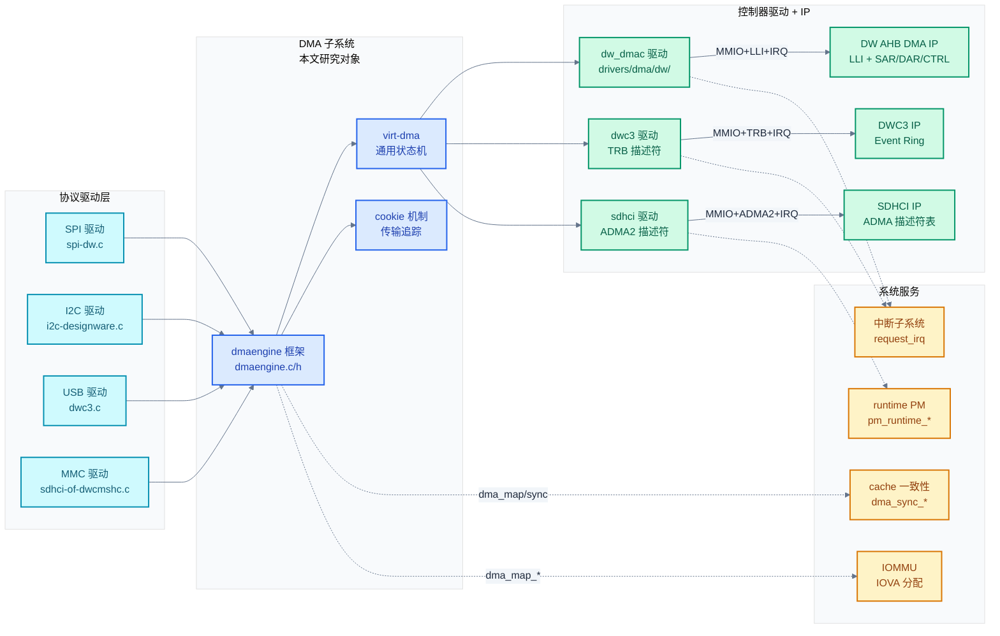
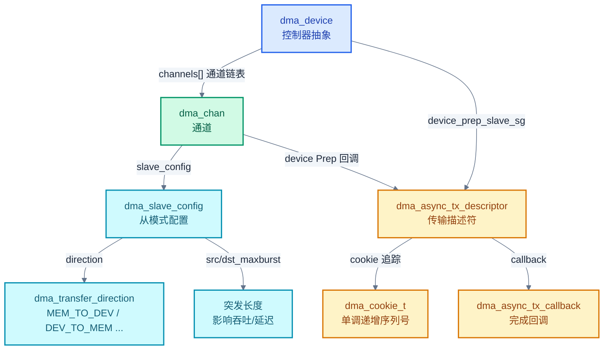
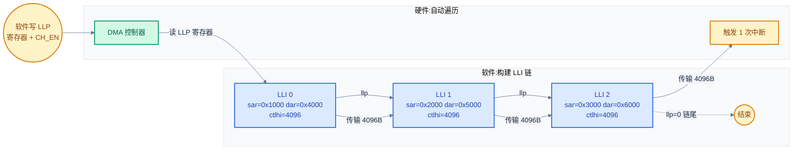
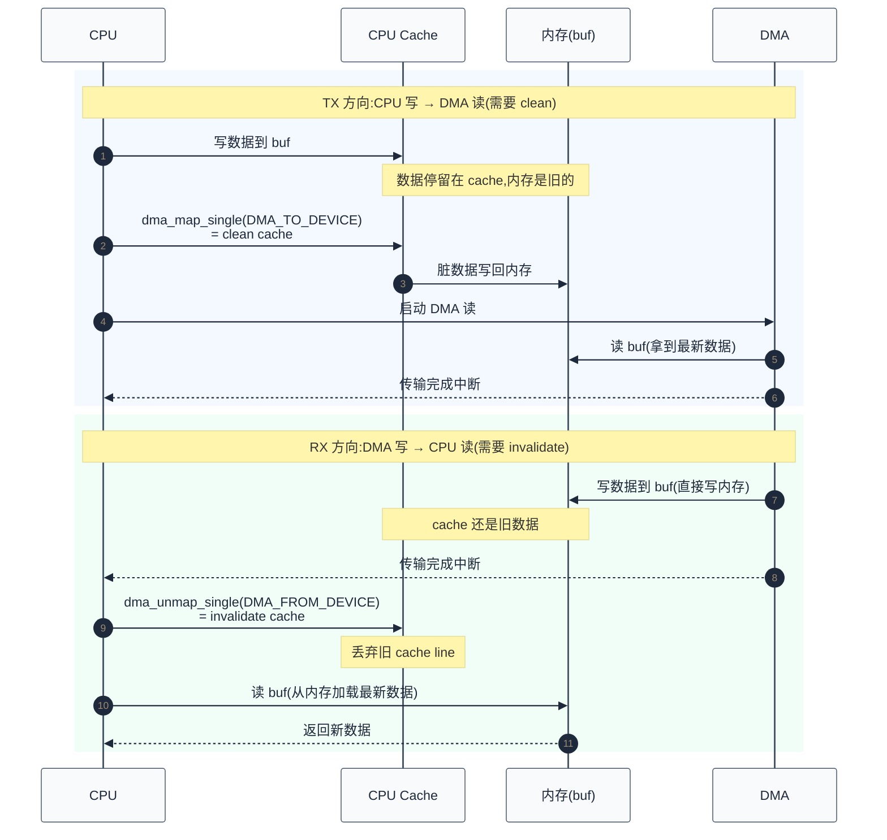
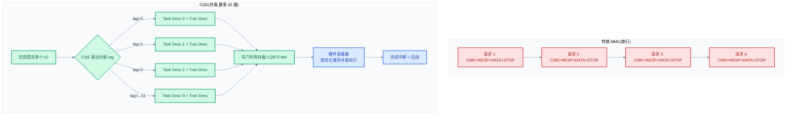
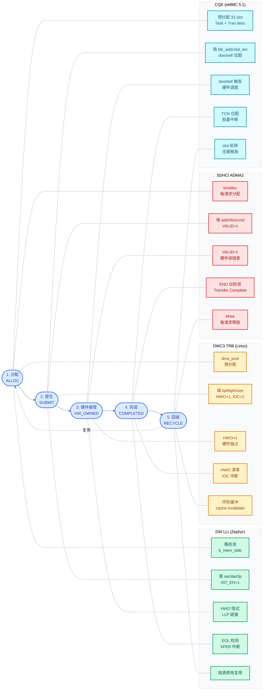
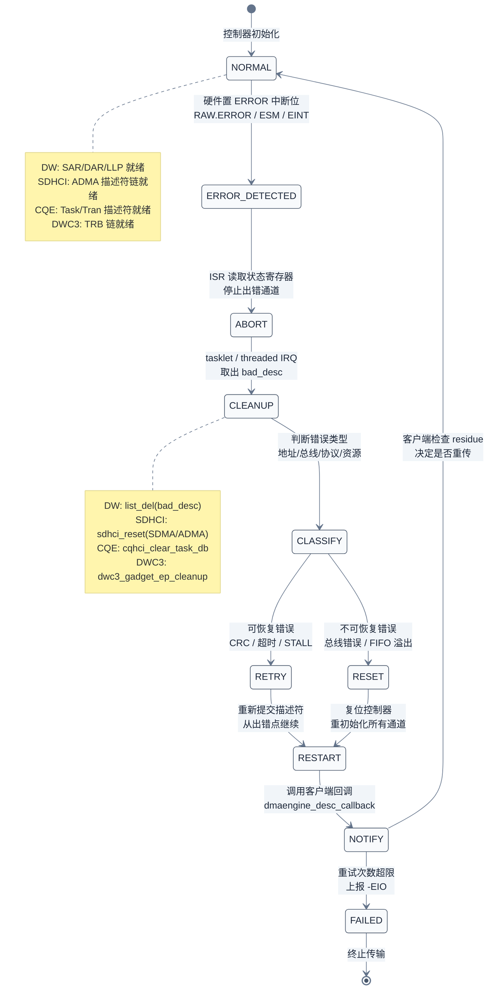
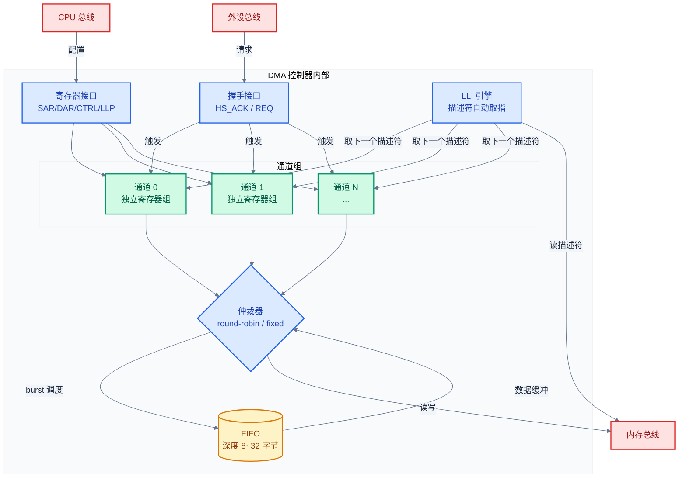

# 性能调优与 DMA 深入

> 把前六章散落的性能调优话题集中起来深入展开：Linux dmaengine 框架、cache 一致性、各协议 DMA 描述符布局、性能瓶颈定位、实战调优案例。前六章按协议维度讲，本篇按"性能"这一横切维度讲——通信协议的吞吐、延迟、CPU 占用最终都汇聚到 DMA 与中断处理这两个底层机制。
> **工程师视角**：把 SPI 从 1 MB/s 调到 20 MB/s、把 eMMC 顺序读从 50 MB/s 调到 380 MB/s、把 USB 摄像头延迟从 50 ms 降到 5 ms——这些不是"协议更好"带来的，是 DMA、cache、调度、中断聚合共同优化的结果。理解这套机制是嵌入式性能工程师的核心能力。

### 关键术语

| 缩写 | 全称 | 含义 |
|------|------|------|
| DMA | Direct Memory Access | 直接内存访问 |
| DMAE | DMA Engine | Linux 通用 DMA 框架 |
| SG | Scatter-Gather | 分散-聚集（描述符链） |
| ADMA | Advanced DMA | SDHCI 高级 DMA 描述符 |
| SDMA | Simple DMA | SDHCI 简单 DMA（单缓冲） |
| CQE | Command Queue Engine | SD 命令队列引擎 |
| TRB | Transfer Request Block | USB DWC3 传输描述符 |
| IOMMU | I/O Memory Management Unit | I/O 内存管理单元 |
| SMMU | System MMU | ARM 版 IOMMU |
| DMI | Direct Memory Interface | 直接内存接口 |
| NAPI | New API | Linux 网络收包软中断机制 |
| PIO | Programmed I/O | 编程 IO（CPU 读写寄存器） |
| IRQ | Interrupt Request | 中断请求 |
| MSI | Message Signaled Interrupt | 消息信号中断 |
| MRQ | Memory Request Queue | 内存请求队列 |
| IO scheduler | IO 调度器 | Linux 块层 IO 调度 |
| IOP | IO Priority | IO 优先级 |

### 前置知识

| 需要了解 | 参考文档 |
|----------|----------|
| 五种协议的基本工作原理 | [00-通信协议总览](./00-通信协议总览.md) ~ [05-SDIO-eMMC协议与驱动](./05-SDIO-eMMC协议与驱动.md) |
| 协议对比与选型 | [06-协议对比与选型](./06-协议对比与选型.md) |
| Linux 驱动框架基础 | 各协议文档的"Linux 驱动"章节 |
| Zephyr 驱动模型 | 各协议文档的"Zephyr 框架"章节 |

---

## 1. 调优方法论：从哪里开始

> 工程师面对"协议跑得慢"时容易陷入两个误区：盲目调参数、盲目换硬件。本章先建立"测量-定位-优化-验证"的四步方法论，再展开具体技术。

### 1.1 性能调优的四步法

```
1. 测量（Measure）：当前性能是多少？目标性能是多少？
2. 定位（Locate）：瓶颈在硬件、驱动、协议栈还是应用？
3. 优化（Optimize）：针对性调整，每次只改一个变量
4. 验证（Verify）：重新测量，确认改善
```

#### 测量要分层次

性能问题不是单点问题。一个 SPI Flash 读取慢，可能是：

| 层次 | 测量工具 | 典型瓶颈 |
|------|---------|---------|
| 应用 | `time`、`strace` | 系统调用开销、缓冲拷贝 |
| VFS/块层 | `iostat`、`blktrace` | IO 调度、merge 失败 |
| 协议栈 | `ftrace`、`perf` | 锁竞争、上下文切换 |
| 驱动 | `debugfs`、`dev_printk` | 中断延迟、DMA 等待 |
| 硬件 | 示波器、逻辑分析仪 | 信号完整性、时钟配置 |

#### 定位瓶颈的"消去法"

按"硬件→驱动→协议→应用"从底向上消去：

1. 硬件层：用 `devmem` 直接读寄存器，绕过驱动测速
2. 驱动层：用 `ftrace` 跟踪关键函数耗时
3. 协议层：用协议特性工具（`mmc-utils`、`candump`、`usbmon`）
4. 应用层：用 `perf`、`strace` 分析调用

### 1.2 优化的三条主线

任何通信协议的性能优化都围绕三条主线：

#### 主线 1：减少 CPU 介入

- 用 DMA 代替 PIO
- 用中断聚合代替每包中断
- 用大块传输代替小块传输

#### 主线 2：减少协议开销

- 用批量传输代替单次传输
- 用零拷贝代替内存拷贝
- 用异步代替同步

#### 主线 3：减少等待

- 用预读代替按需读
- 用流水线代替串行
- 用中断合并代替频繁唤醒

### 1.3 调优的"五不为"

| 不要做 | 理由 |
|--------|------|
| 不盲目调参数 | 没测量的调优是赌博 |
| 不一次改多个 | 不知道哪个改动起作用 |
| 不优化非瓶颈 | 优化非瓶颈 = 浪费时间 |
| 不破坏正确性 | 速度变快但出错 = 退回 |
| 不无止境优化 | 80% 收益来自 20% 调优 |

> **核心要点**：调优是"测量-定位-优化-验证"的闭环。先建立测量基线，再找瓶颈，每次只改一个变量。最有效的优化往往在硬件/驱动层（DMA、中断），最无效的优化在应用层盲目调参。

---

## 2. Linux DMA 引擎框架深入

> DMA 是性能调优的核心。Linux 提供了通用的 dmaengine 框架抽象各种 DMA 控制器。本章深入 dmaengine 的数据结构、API、描述符链机制。

DMA 子系统不是孤立模块——它向上对接各协议驱动(SPI/I2C/USB/MMC),向下耦合 SoC 内的 DMA 控制器 IP 与总线矩阵,左右关联 cache 一致性、IOMMU、中断子系统、runtime PM。理解它在系统中的位置,才能定位"为什么 DMA 传输后数据是旧的""为什么 DMA 地址超过 4GB 就出错"这类跨层问题。

**项目定位**:DMA 是**让外设与内存直接搬运数据、不占用 CPU**的硬件机制。它的存在让 SPI 能跑满 100MB/s、USB 能跑满 480Mbps、eMMC 能跑满 900MB/s——这些都远超 CPU 逐字节拷贝的能力。dmaengine 框架是 Linux 对各种 DMA 控制器的**统一抽象**,让协议驱动只需调 `dmaengine_prep_slave_sg` + `dmaengine_submit`,不必关心底层是 DW AHB DMA 还是 DWC3 还是 SDHCI ADMA2。

**软硬件耦合点**:

| 耦合方向 | 接口 | 共同设计点 |
|----------|------|-----------|
| 协议驱动 ↔ dmaengine | `dmaengine_prep_slave_sg` + `dmaengine_submit` | 描述符格式、cookie 追踪、callback 时机 |
| dmaengine ↔ 控制器驱动 | `dma_device` 回调集(`device_prep`/`device_issue_pending`/`device_terminate_all`) | 通用框架与平台代码的唯一契约 |
| 控制器驱动 ↔ DMA IP | MMIO 寄存器 + LLI 描述符 + IRQ | 寄存器字段、LLI 链表布局、handshake 信号 |
| DMA IP ↔ 内存/外设 | AHB/AXI 总线 + handshake 信号 | 总线仲裁、突发长度、地址对齐、FIFO 深度 |
| DMA ↔ cache 子系统 | `dma_sync_single_for_cpu` / `for_device` | cache line 对齐、invalidation/clean 时机 |
| DMA ↔ IOMMU | `dma_map_*` → IOMMU 页表 | IOVA 分配、IOVA→PA 翻译、页大小 |
| DMA ↔ 中断子系统 | `request_irq` + `tasklet`/`softirq` | 传输完成中断、错误中断、底半部处理 |
| DMA ↔ runtime PM | `pm_runtime_get_sync` / `put` | 传输期间保持活跃、空闲后 autosuspend |

**跨实现对比**(详细对比见 [§18](#18-zephyr-下的-dma-与调优)):Linux 用 `dma_chan` + `dma_device` + `dma_async_tx_descriptor` 三层抽象 + virt-dma 通用状态机,支持 scatter-gather、cyclic、interleaved 多种模式;Zephyr 用 `dma_driver_api` + `dma_config` + `dma_status` 更扁平的模型,无 virt-dma 层,描述符管理由驱动自管,适合 MCU 级。



> **如何读这张图**:蓝色是 dmaengine 通用框架(本文 §2 深入);左青是协议驱动(§5~§9 分协议调优);右绿是控制器驱动 + IP(§3 DW AHB DMA 深入、§8 DWC3 TRB、§9 SDHCI ADMA2);下黄是系统服务(cache §4、IOMMU §4.6、中断 §17、PM §19)。关键设计:**dmaengine 是协议驱动与控制器驱动的唯一桥梁**——协议驱动调 `dmaengine_prep_slave_sg` 时不关心底层是哪种 DMA 控制器,控制器驱动实现 `dma_device` 回调时不关心上层是 SPI 还是 USB。这种解耦让同一份 SPI 驱动能在 DW DMA 和其他 DMA 控制器上运行。

### 2.1 为什么要通用 DMA 框架

没有通用框架时，每个驱动都要自己写：

```c
// 假想的"无通用框架"代码
vendor_x_dma_send(chan, buf, len);   // X 厂商 DMA
vendor_y_dma_send(chan, buf, len);   // Y 厂商 DMA
vendor_z_dma_send(chan, buf, len);   // Z 厂商 DMA
```

设备驱动要为每种 DMA 控制器写一份代码，复用性差。dmaengine 框架统一了 DMA 控制器的抽象：

```c
// 有通用框架后
struct dma_chan *chan = dma_request_channel(mask, filter, param);
struct dma_async_tx_descriptor *desc;
desc = dmaengine_prep_slave_sg(chan, sgl, nents, dir, flags);
desc->callback = my_callback;
dmaengine_submit(desc);
dma_async_issue_pending(chan);
```

设备驱动只对接 dmaengine API，DMA 控制器驱动实现回调。

### 2.2 核心数据结构

dmaengine 框架用五个核心数据结构把"DMA 控制器"抽象成"通道 + 描述符 + 配置"的统一模型。它们的关系如下:



> **如何读这张图**:`dma_device` 是控制器抽象(一个 SoC 可能有多个 DMA 控制器,每个一个 `dma_device`),它包含多个 `dma_chan`(通道,一个控制器通常 8~16 个通道)。协议驱动通过 `dma_request_channel` 申请通道,通过 `dmaengine_slave_config` 配置 `dma_slave_config`(告诉 DMA 外设 FIFO 地址、数据宽度、突发长度),通过 `device_prep_slave_sg` 生成 `dma_async_tx_descriptor`(描述符)。描述符携带 `cookie`(用于追踪传输进度)和 `callback`(完成通知)。关键设计:**描述符是"未提交的传输意图",`tx_submit` 才把它加入通道队列,`dma_async_issue_pending` 才真正启动硬件**——这种三步走让驱动能预先构建多个描述符再批量提交。

#### struct dma_chan：DMA 通道

```c
// include/linux/dmaengine.h
struct dma_chan {
    struct dma_device *device;        // 所属 DMA 控制器
    struct device *slave;             // 绑定的从设备
    dma_cookie_t cookie;              // 最近提交的 cookie
    dma_cookie_t completed_cookie;    // 最近完成的 cookie
    int chan_id;                      // 通道 ID
    struct list_head device_node;     // 控制器通道链表
    /* ... */
};
```

每个 DMA 控制器有多个通道（channel），每条通道独立工作。SPI 控制器申请一条 TX 通道和一条 RX 通道。

#### struct dma_async_tx_descriptor：传输描述符

```c
// include/linux/dmaengine.h
struct dma_async_tx_descriptor {
    dma_cookie_t cookie;              // 提交后分配的 cookie
    enum dma_ctrl_flags flags;        // DMA_PREP_INTERRUPT 等
    dma_addr_t phys;                  // 描述符物理地址
    struct dma_chan *chan;            // 所属通道
    dma_cookie_t (*tx_submit)(struct dma_async_tx_descriptor *tx);  // 提交回调
    int (*desc_free)(struct dma_async_tx_descriptor *tx);           // 释放回调
    dma_async_tx_callback callback;   // 完成回调
    void *callback_param;             // 回调参数
    /* ... */
};
```

`tx_submit` 把描述符加入通道的待执行队列，`dma_async_issue_pending` 触发硬件开始执行。

#### struct dma_slave_config：从模式配置

```c
// include/linux/dmaengine.h
struct dma_slave_config {
    enum dma_transfer_direction direction;   // 传输方向
    phys_addr_t src_addr;                    // 源物理地址（外设 FIFO）
    phys_addr_t dst_addr;                    // 目的物理地址（外设 FIFO）
    enum dma_slave_buswidth src_addr_width;  // 源数据宽度（1/2/4/8 字节）
    enum dma_slave_buswidth dst_addr_width;  // 目的数据宽度
    u32 src_maxburst;                        // 源最大突发长度
    u32 dst_maxburst;                        // 目的最大突发长度
    bool device_fc;                          // 设备流控（外设 FIFO 满发信号）
    /* ... */
};
```

`src_addr` 是外设 FIFO 的物理地址，DMA 控制器从这里读/写数据。`src_maxburst` 决定每次突发的数据量，影响吞吐与延迟。

#### enum dma_transfer_direction：传输方向

```c
enum dma_transfer_direction {
    DMA_MEM_TO_MEM,    // 内存到内存（memcpy）
    DMA_MEM_TO_DEV,    // 内存到设备（TX 方向）
    DMA_DEV_TO_MEM,    // 设备到内存（RX 方向）
    DMA_DEV_TO_DEV,    // 设备到设备
    DMA_TRANS_NONE,
};
```

SPI 发送用 `DMA_MEM_TO_DEV`，接收用 `DMA_DEV_TO_MEM`。

#### enum dma_ctrl_flags：控制标志

```c
enum dma_ctrl_flags {
    DMA_PREP_INTERRUPT = (1 << 0),   // 完成时触发中断
    DMA_CTRL_ACK = (1 << 1),         // 自动确认（可重用）
    DMA_PREP_PQ_DISABLE_P = (1 << 2),
    DMA_PREP_PQ_DISABLE_Q = (1 << 3),
    DMA_PREP_CONTINUE = (1 << 4),    // 链式继续
    DMA_PREP_FENCE = (1 << 5),       // 屏障
    /* ... */
};
```

`DMA_PREP_INTERRUPT` 让传输完成时触发回调；不加此标志则完成后不通知，需要主动查询。

### 2.3 DMA 传输的三种模式

#### 模式 1：单缓冲（slave_single）

```c
// 单块连续内存的 DMA
struct dma_async_tx_descriptor *desc;
desc = dmaengine_prep_slave_single(chan, buf_dma_addr, len,
                                    dir, flags);
```

最简单，适合小块传输。底层调用 `device_prep_dma_memcpy` 或 `device_prep_slave_sg`（构造单元素 sg list）。

#### 模式 2：scatter-gather（slave_sg）

```c
// 多块不连续内存的 DMA
struct dma_async_tx_descriptor *desc;
desc = dmaengine_prep_slave_sg(chan, sgl, nents,
                                dir, flags);
```

适合大块传输或多个缓冲区。DMA 控制器自己遍历 sg list，不需要 CPU 干预。

#### 模式 3：循环（cyclic）

```c
// 循环 DMA，常用于音频
struct dma_async_tx_descriptor *desc;
desc = dmaengine_prep_dma_cyclic(chan, buf_addr, buf_len,
                                  period_len, dir, flags);
```

适合周期性数据（音频、ADC）。完成后不停止，自动跳到下一段。

### 2.4 DMA 描述符链的构建

DMA 控制器自己有描述符寄存器（或描述符表），描述符格式由控制器定义。dmaengine 框架的"描述符"是软件抽象，提交时驱动会把它转换成硬件描述符。三层映射关系如下:

```mermaid
%%{init: {"theme": "base", "themeVariables": {"primaryColor": "#f8fafc", "primaryTextColor": "#1e293b", "primaryBorderColor": "#475569", "lineColor": "#64748b", "secondaryColor": "#f1f5f9", "secondaryBorderColor": "#94a3b8", "tertiaryColor": "#f8fafc", "fontFamily": "\"trebuchet ms\", verdana, arial, sans-serif"}}}%%
flowchart TD
    subgraph "软件层<br/>dmaengine 通用"
        SWDESC[dma_async_tx_descriptor<br/>cookie + callback + chan]
        SWDESC -->|dmaengine_submit|
    end
    subgraph "驱动层<br/>控制器特定"
        DWLLI[dw_lli<br/>SAR/DAR/CTRL/LLP]
        ADMA[sdhci_adma2_64_desc<br/>addr/len/act/attr]
        TRB[dwc3_trb<br/>addr/len/ctrl/isp_imi]
    end
    subgraph "硬件层<br/>DMA IP 执行"
        DWIP[DW AHB DMA<br/>读 LLP 链表]
        SDHIP[SDHCI IP<br/>读 ADMA2 表]
        DWC3IP[DWC3 IP<br/>读 TRB Ring]
    end
    SWDESC -->|device_prep_slave_sg| DWLLI
    SWDESC -->|device_prep_slave_sg| ADMA
    SWDESC -->|device_prep_slave_sg| TRB
    DWLLI -->|dma_async_issue_pending| DWIP
    ADMA -->|dma_async_issue_pending| SDHIP
    TRB -->|dma_async_issue_pending| DWC3IP
    DWIP -->|传输完成 IRQ| CB[callback 调用]
    SDHIP -->|传输完成 IRQ| CB
    DWC3IP -->|Event Ring 事件| CB

classDef sw fill:#dbeafe, stroke:#2563eb, color:#1e40af, stroke-width:2px;
classDef drv fill:#d1fae5, stroke:#059669, color:#065f46, stroke-width:2px;
classDef hw fill:#fee2e2, stroke:#dc2626, color:#991b1b, stroke-width:2px;
classDef done fill:#fef3c7, stroke:#d97706, color:#92400e, stroke-width:2px;
class SWDESC sw;
class DWLLI,ADMA,TRB drv;
class DWIP,SDHIP,DWC3IP hw;
class CB done;
```

> **如何读这张图**:同一份 `dma_async_tx_descriptor`(蓝色软件抽象)在不同控制器驱动里被翻译成三种不同的硬件描述符(绿色):DW DMA 用 LLI(链表节点,每节点带 `LLP` 指向下一节点),SDHCI 用 ADMA2(描述符表,连续内存布局),DWC3 用 TRB(Ring 结构,循环复用)。这种"软件统一 + 硬件各异"的设计是 dmaengine 框架的核心价值——协议驱动只调 `dmaengine_prep_slave_sg`,不必关心底层描述符格式。`dmaengine_submit` 把描述符加入通道待执行队列,`dma_async_issue_pending` 触发硬件开始读取描述符。

#### 通用 scatter-gather 描述符构建

```c
// 典型驱动实现（伪代码）
static struct dma_async_tx_descriptor *
my_prep_slave_sg(struct dma_chan *chan, struct scatterlist *sgl,
                 unsigned int sg_len, enum dma_transfer_direction dir,
                 unsigned long flags, void *context)
{
    struct my_desc *desc;
    int i;

    desc = alloc_desc();
    desc->direction = dir;

    // 遍历 sg list，构建硬件描述符
    for_each_sg(sgl, sg, sg_len, i) {
        desc->hw_desc[i].addr = sg_dma_address(sg);  // 已映射的物理地址
        desc->hw_desc[i].len = sg_dma_len(sg);
        desc->hw_desc[i].next = &desc->hw_desc[i+1];
    }
    desc->hw_desc[sg_len-1].next = NULL;  // 链尾
    desc->hw_desc[sg_len-1].end = 1;      // 标记结束

    return &desc->txd;
}
```

### 2.5 cookie 机制：传输追踪

dmaengine 用 cookie 追踪传输状态：

```c
dma_cookie_t cookie = dmaengine_submit(desc);  // 分配 cookie
// ...
enum dma_status status = dma_async_is_tx_complete(chan, cookie,
                                                   NULL, NULL);
if (status == DMA_COMPLETE) {
    // 传输完成
} else if (status == DMA_IN_PROGRESS) {
    // 传输中
} else if (status == DMA_ERROR) {
    // 传输错误
}
```

cookie 是单调递增的整数，每个通道独立。`completed_cookie` 是最近完成的 cookie，`cookie - completed_cookie` 是未完成的传输数。

### 2.6 dmaengine 与各协议的关系

| 协议 | 是否用 dmaengine | 备选方案 |
|------|----------------|---------|
| SPI | 是（`drivers/spi/spi-dw-dma.c` 等） | 控制器私有 DMA |
| I2C | 部分控制器用（`i2c-designware`） | 大多数用 PIO |
| CAN | 否 | 用 NAPI + PIO |
| USB | 否（HCD 内部管理） | HCD 私有 TRB/Ring |
| MMC | 否（SDHCI ADMA2 标准） | SDHCI 寄存器描述符 |

> **核心要点**：dmaengine 是"通用 DMA 控制器"的抽象，主要服务 SPI/I2C/音频等需要"外设 FIFO ↔ 内存"传输的场景。USB 和 MMC 因为有标准化的描述符格式（TRB/ADMA2），自己管理描述符，不走 dmaengine。理解这点能避免"为什么 USB 不用 dmaengine"的困惑。

### 2.7 virt-dma：通用通道状态机

直接实现 `struct dma_chan` 的驱动要自己管理"描述符生命周期"——分配、提交、调度、完成、回收。这些逻辑在不同控制器间高度相似，Linux 抽出 `virt-dma` 子框架（[drivers/dma/virt-dma.h](file:///home/pbw/2042f/linux/drivers/dma/virt-dma.h)）让驱动复用。

#### 五状态链表

`struct virt_dma_chan` 维护五条链表，对应描述符的五个生命周期阶段：

```c
// drivers/dma/virt-dma.h L22
struct virt_dma_chan {
    struct dma_chan chan;
    struct tasklet_struct task;          // 完成回调 tasklet
    void (*desc_free)(struct virt_dma_desc *);
    spinlock_t lock;
    // 以下链表均受 vc.lock 保护
    struct list_head desc_allocated;     // 1. 已分配（可重用池）
    struct list_head desc_submitted;     // 2. 已提交（tx_submit 后）
    struct list_head desc_issued;        // 3. 已下发（issue_pending 后）
    struct list_head desc_completed;     // 4. 已完成（硬件执行完）
    struct list_head desc_terminated;    // 5. 已终止（terminate_vdesc 后）
    struct virt_dma_desc *cyclic;        // cyclic DMA 当前段
};
```

**描述符生命周期**：

```
分配 → 提交 → 下发 → 完成 → 回收
  │       │      │      │      │
  v       v      v      v      v
allocated → submitted → issued → completed → (free/reuse)
                                     ↓
                              tasklet 调用 callback
```

#### 状态转移的关键函数

| 函数 | 作用 | 链表操作 |
|------|------|---------|
| `vchan_tx_prep` | 准备描述符 | 加入 `desc_allocated` |
| `vchan_tx_submit` | 提交描述符 | `desc_allocated` → `desc_submitted` |
| `vchan_issue_pending` | 触发下发 | `desc_submitted` splice 到 `desc_issued` |
| `vchan_cookie_complete` | 标记完成 | `desc_issued` → `desc_completed`，调度 tasklet |
| `vchan_vdesc_fini` | 释放/重用 | 可重用回 `desc_allocated`，否则 `desc_free` |
| `vchan_cyclic_callback` | 周期完成 | 设置 `vc->cyclic`，调度 tasklet |

#### tasklet 完成回调

`vchan_cookie_complete` 不直接调 callback——它把描述符加入 completed 链表后调度 tasklet（[drivers/dma/virt-dma.h L96](file:///home/pbw/2042f/linux/drivers/dma/virt-dma.h#L96)）：

```c
static inline void vchan_cookie_complete(struct virt_dma_desc *vd)
{
    struct virt_dma_chan *vc = to_virt_chan(vd->tx.chan);
    dma_cookie_t cookie;

    cookie = vd->tx.cookie;
    dma_cookie_complete(&vd->tx);
    list_add_tail(&vd->node, &vc->desc_completed);
    tasklet_schedule(&vc->task);   // 软中断上下文调 callback
}
```

**为什么用 tasklet**：DMA 完成中断处于硬中断上下文，此时持有 `vc.lock`。callback 通常会调 `dmaengine_desc_callback_invoke`，可能执行较重逻辑（如提交下一个 transfer、唤醒等待线程）。在硬中断中执行会延长中断关闭时间。tasklet 把 callback 推迟到软中断上下文（`TASKLET_SOFTIRQ`），允许中断快速返回。

> **核心要点**：virt-dma 用五条链表把描述符的状态机标准化，让控制器驱动只关注"硬件描述符构建 + 完成扫描"两件事。tasklet 完成回调模式是 Linux DMA 子系统的标准设计——硬中断只标记完成，回调在软中断中执行。

---

## 3. DMA 控制器驱动实例：DW AHB DMA 深度剖析

> 第 2 章讲了 dmaengine 框架。本章深入一个真实控制器驱动——Synopsys DesignWare AHB DMA Controller（DW AHB DMA），它是 x86、ARM SoC 上最常见的通用 DMA 控制器之一。SPI、I2C、音频等外设都通过它做 DMA 传输。理解 DW DMA 就理解了"DMA 控制器驱动如何实现 dmaengine API"。

### 3.1 为什么选 DW DMA 作为剖析对象

| 维度 | DW AHB DMA | 其他控制器 |
|------|-----------|----------|
| 普及度 | Intel Baytrail、Apollo Lake、ARM SoC 广泛使用 | 各家专用 |
| 复杂度 | 中等（LLI + 多通道 + handshake） | 简单（如 BCM2835）到复杂（如 STM32 MDMA） |
| 文档 | Synopsys Databook（需 NDA）但寄存器布局公开 | 各家不同 |
| 代码量 | ~1500 行核心，可读性强 | 差异大 |
| 支持 | mem-to-mem、mem-to-periph、periph-to-mem、cyclic、scatter-gather | 部分 |

DW DMA 是学习 DMA 控制器驱动的"理想样本"——既不过于简单（有 LLI、handshake、多 master），也不过于复杂（不涉及 IOMMU 集成、不涉及 PCIe ATS）。

### 3.2 硬件寄存器布局

DW DMA 的寄存器分为三层：控制器全局、通道、中断状态（[drivers/dma/dw/regs.h](file:///home/pbw/2042f/linux/drivers/dma/dw/regs.h)）。

#### 通道寄存器（每通道一份）

```c
// drivers/dma/dw/regs.h L39
struct dw_dma_chan_regs {
    DW_REG(SAR);     // Source Address Register：源地址
    DW_REG(DAR);     // Destination Address Register：目的地址
    DW_REG(LLP);     // Linked List Pointer：下一个 LLI 的物理地址
    u32 CTL_LO;      // Control Register Low：传输控制（宽度、突发、方向等）
    u32 CTL_HI;      // Control Register High：block_ts（传输次数）
    DW_REG(SSTAT);   // Source Status Snapshot
    DW_REG(DSTAT);   // Destination Status Snapshot
    u32 CFG_LO;      // Config Low：通道优先级、handshake、暂停
    u32 CFG_HI;      // Config High：handshake 接口号、FIFO 模式
    DW_REG(SGR);     // Source Gather Register
    DW_REG(DSR);     // Destination Scatter Register
};
```

#### CTL_LO 字段详解

CTL_LO 是 DMA 传输的"控制字"——所有传输参数编码在 32 位中：

```c
// drivers/dma/dw/regs.h L148
#define DWC_CTLL_INT_EN      (1 << 0)        // 完成中断使能
#define DWC_CTLL_DST_WIDTH(n) ((n) << 1)     // 目的端宽度（0=8bit,1=16bit,2=32bit,...）
#define DWC_CTLL_SRC_WIDTH(n) ((n) << 4)     // 源端宽度
#define DWC_CTLL_DST_INC     (0 << 7)        // 目的地址递增（内存）
#define DWC_CTLL_DST_DEC     (1 << 7)        // 目的地址递减
#define DWC_CTLL_DST_FIX     (2 << 7)        // 目的地址固定（外设 FIFO）
#define DWC_CTLL_SRC_INC     (0 << 9)        // 源地址递增
#define DWC_CTLL_SRC_FIX     (2 << 9)        // 源地址固定
#define DWC_CTLL_DST_MSIZE(n) ((n) << 11)    // 目的端突发长度（0=1,2=4,3=8,...）
#define DWC_CTLL_SRC_MSIZE(n) ((n) << 14)    // 源端突发长度
#define DWC_CTLL_FC_M2M      (0 << 20)       // Flow Control: mem-to-mem
#define DWC_CTLL_FC_M2P      (1 << 20)       // mem-to-periph（DMA 控制流）
#define DWC_CTLL_FC_P2M      (2 << 20)       // periph-to-mem（DMA 控制流）
#define DWC_CTLL_FC_P2P      (3 << 20)       // periph-to-periph
#define DWC_CTLL_LLP_D_EN    (1 << 27)       // 使能目的端 LLI 链
#define DWC_CTLL_LLP_S_EN    (1 << 28)       // 使能源端 LLI 链
```

**如何读这个寄存器**：以 SPI 接收为例，源是 SPI FIFO（地址固定），目的是内存（地址递增）：

```c
// SPI RX：源=外设 FIFO，目的=内存
ctllo = DWC_CTLL_INT_EN                  // 完成中断
      | DWC_CTLL_SRC_WIDTH(0)            // 源 8 bit（SPI 8 位模式）
      | DWC_CTLL_DST_WIDTH(2)            // 目的 32 bit（内存按字写）
      | DWC_CTLL_SRC_FIX                 // 源地址固定（FIFO）
      | DWC_CTLL_DST_INC                 // 目的地址递增（内存）
      | DWC_CTLL_SRC_MSIZE(3)            // 源突发 8（FIFO 一次读 8 字节）
      | DWC_CTLL_DST_MSIZE(3)            // 目的突发 8
      | DWC_CTLL_FC_P2M;                 // periph-to-mem
```

#### CTL_HI：block_ts（传输次数）

```c
#define DWC_CTLH_BLOCK_TS_MASK  GENMASK(11, 0)
#define DWC_CTLH_BLOCK_TS(x)     ((x) & DWC_CTLH_BLOCK_TS_MASK)
#define DWC_CTLH_DONE            (1 << 12)   // 硬件置位表示完成
```

`block_ts` 是本次 LLI 要传输的"次数"——每次传 `src_width` 字节。例如 `src_width=4`（32 bit）、`block_ts=1024`，则本次传 4 KB。

**12 位限制**：`block_ts` 最大 4095，单 LLI 最大传输 = 4095 × max_width。32 位系统上 max_width=4，所以单 LLI 最大 16380 字节（约 16 KB）。超过要用 LLI 链。

### 3.3 LLI（Link List Item）：硬件描述符

DW DMA 的核心是 LLI——硬件自动遍历 LLI 链表，软件不需要逐块启动。

#### struct dw_lli：硬件格式

```c
// drivers/dma/dw/regs.h L369
struct dw_lli {
    /* values that are not changed by hardware */
    __le32 sar;       // Source Address：源地址
    __le32 dar;       // Destination Address：目的地址
    __le32 llp;       // Linked List Pointer：下一个 LLI 的物理地址
    __le32 ctllo;     // Control Low：传输参数
    /* values that may get written back */
    __le32 ctlhi;     // Control High：block_ts，完成后可能写回 DONE
    __le32 sstat;     // Source Status Snapshot（可选）
    __le32 dstat;     // Destination Status Snapshot（可选）
};
```

**字段都是 `__le32`**（小端 32 位）——DMA 控制器按小端读写，CPU 可能是大端（如 PowerPC），所以访问要字节序转换。

#### struct dw_desc：软件描述符

```c
// drivers/dma/dw/regs.h L384
struct dw_desc {
    /* FIRST：硬件使用的字段（必须在开头！）*/
    struct dw_lli lli;

    /* 字节序转换宏 */
    #define lli_set(d, reg, v)   ((d)->lli.reg |= cpu_to_le32(v))
    #define lli_clear(d, reg, v) ((d)->lli.reg &= ~cpu_to_le32(v))
    #define lli_read(d, reg)     le32_to_cpu((d)->lli.reg)
    #define lli_write(d, reg, v) ((d)->lli.reg = cpu_to_le32(v))

    /* THEN：软件管理字段 */
    struct list_head desc_node;    // 加入通道链表的节点
    struct list_head tx_list;      // 子描述符链表（multi-block）
    struct dma_async_tx_descriptor txd;  // dmaengine 通用描述符
    size_t len;                    // 当前 LLI 长度
    size_t total_len;              // 整个 transfer 总长度
    u32 residue;                   // 剩余未传字节
};
```

**关键设计**：`struct dw_lli lli` 必须在 `struct dw_desc` 的开头，这样 `struct dw_desc` 的物理地址就是 `struct dw_lli` 的物理地址。DMA 控制器读取 LLI 时，看到的就是 `dw_desc` 开头的 28 字节（`dw_lli` 部分），后面的软件字段对硬件不可见。

```
内存布局：
+0    +4    +8    +12   +16   +20   +24   +28   +32 ...
[ sar ][ dar ][ llp ][ctllo][ctlhi][sstat][dstat]| desc_node ...
└───────────── struct dw_lli（28 字节）─────────┘└── 软件字段 ──┘
                                                    ↑
                              DMA 控制器只读写前 28 字节，看不到后面
```

### 3.4 LLI 链表的工作机制

#### 硬件自动遍历

DW DMA 支持 LLP 模式——硬件读完一个 LLI 后，如果 `llp != 0`，自动跳到 `llp` 指向的地址读取下一个 LLI，无需 CPU 介入：

```
LLI[0]: sar=0x1000, dar=0x4000, llp=&LLI[1], ctllo=..., ctlhi=4096
LLI[1]: sar=0x2000, dar=0x5000, llp=&LLI[2], ctllo=..., ctlhi=4096
LLI[2]: sar=0x3000, dar=0x6000, llp=0,       ctllo=..., ctlhi=4096  ← 链尾
```

启动时，软件把 `LLI[0]` 的物理地址写入通道的 `LLP` 寄存器，设置 `DWC_CTLL_LLP_D_EN | DWC_CTLL_LLP_S_EN`，然后使能通道。硬件自动完成三段传输，最后触发一次中断。

LLI 链表的硬件遍历流程和软件/硬件两种模式的对比如下:



> **如何读这张图**:左蓝是软件预构建的 LLI 链(3 个节点,每个 4096 字节),右绿是硬件自动遍历过程。关键设计:**硬件 LLI 模式下,无论链表多长,只触发 1 次中断**(链尾)。这就是 DW DMA 能跑大块 scatter-gather 传输而 CPU 几乎零开销的原因——CPU 只在传输开始(写 LLP 寄存器)和结束(处理中断)时介入,中间所有节点的跳转都由硬件自动完成。对比"软件 LLI"模式(每块一次中断),硬件 LLI 的中断开销从 N 次降到 1 次。

#### dwc_dostart：启动传输

```c
// drivers/dma/dw/core.c L172
static void dwc_dostart(struct dw_dma_chan *dwc, struct dw_desc *first)
{
    struct dw_dma *dw = to_dw_dma(dwc->chan.device);
    u8 lms = DWC_LLP_LMS(dwc->dws.m_master);  // master 选择

    if (dwc->nollp) {
        // 控制器不支持硬件 LLI，走软件 LLI 模式
        was_soft_llp = test_and_set_bit(DW_DMA_IS_SOFT_LLP, &dwc->flags);
        dwc_initialize(dwc);
        first->residue = first->total_len;
        dwc->tx_node_active = &first->tx_list;
        dwc_do_single_block(dwc, first);  // 只传第一块，完成后中断驱动下一块
        return;
    }

    dwc_initialize(dwc);
    // 硬件 LLI 模式：把第一个 LLI 的物理地址写入 LLP 寄存器
    channel_writel(dwc, LLP, first->txd.phys | lms);
    channel_writel(dwc, CTL_LO, DWC_CTLL_LLP_D_EN | DWC_CTLL_LLP_S_EN);
    channel_writel(dwc, CTL_HI, 0);
    channel_set_bit(dw, CH_EN, dwc->mask);  // 使能通道
}
```

**两种 LLI 模式**：

| 模式 | 触发条件 | 工作方式 | 中断次数 |
|------|---------|---------|---------|
| 硬件 LLI | `dwc->nollp == 0` | 硬件自动遍历 LLI 链 | 1 次（链尾） |
| 软件 LLI | `dwc->nollp == 1` | 每块传完中断，软件启动下一块 | N 次（每块一次） |

**为什么有软件 LLI**：某些 DW DMA 配置不支持硬件 LLI（`DWC_PARAMS_HC_LLP` 位为 1），只能用中断驱动的软件模式。性能差但兼容性好。

### 3.5 DMA pool：描述符内存管理

LLI 必须是**物理连续**的——DMA 控制器用物理地址访问，不能走页表。但 `kmalloc` 不保证物理连续（虽然小分配通常连续）。Linux 提供 `dma_pool` API 专门管理 DMA 描述符内存：

```c
// drivers/dma/dw/core.c L78
static struct dw_desc *dwc_desc_get(struct dw_dma_chan *dwc)
{
    struct dw_dma *dw = to_dw_dma(dwc->chan.device);
    struct dw_desc *desc;
    dma_addr_t phys;

    desc = dma_pool_zalloc(dw->desc_pool, GFP_ATOMIC, &phys);
    // desc 是虚拟地址（CPU 访问），phys 是物理地址（DMA 控制器访问）
    if (!desc)
        return NULL;

    dwc->descs_allocated++;
    INIT_LIST_HEAD(&desc->tx_list);
    dma_async_tx_descriptor_init(&desc->txd, &dwc->chan);
    desc->txd.tx_submit = dwc_tx_submit;
    desc->txd.flags = DMA_CTRL_ACK;
    desc->txd.phys = phys;   // 保存物理地址，后续写入 LLP 寄存器
    return desc;
}
```

#### dma_pool vs kmalloc

| 维度 | dma_pool | kmalloc |
|------|---------|---------|
| 物理连续 | 是 | 是（小分配） |
| DMA 一致性 | 是（coherent） | 否（要 dma_map_single） |
| 对齐 | 自定义（如 32 字节 cache 行对齐） | 默认 ARCH_KMALLOC_MINALIGN |
| 大小 | 固定（创建时指定） | 任意 |
| 适用 | DMA 描述符 | 普通数据 |

`dma_pool` 分配的内存是 **DMA-coherent**——CPU 和 DMA 控制器看到的是同一份数据，无需手动 cache flush。这对描述符至关重要：软件写完 LLI 立即可被硬件读取，硬件写完 `DONE` 位软件立即看到。

### 3.6 完成中断与扫描机制

DMA 完成后触发中断，但中断只告诉你"通道 X 完成了"，不知道是哪个 LLI 完成。驱动要扫描确定。

#### dw_dma_interrupt：中断入口

```c
// drivers/dma/dw/core.c L492
static irqreturn_t dw_dma_interrupt(int irq, void *dev_id)
{
    struct dw_dma *dw = dev_id;
    u32 status;

    status = dma_readl(dw, STATUS_INT);
    if (!status)
        return IRQ_NONE;

    // 屏蔽中断，调度 tasklet 处理
    channel_clear_bit(dw, MASK.XFER, dw->all_chan_mask);
    channel_clear_bit(dw, MASK.ERROR, dw->all_chan_mask);
    tasklet_schedule(&dw->task);

    return IRQ_HANDLED;
}
```

**为什么立即屏蔽中断**：一个 DMA 控制器有多个通道，多个通道同时完成会触发多次中断。立即屏蔽避免中断风暴，tasklet 处理完后再开启。

#### dw_dma_tasklet：扫描完成

```c
// drivers/dma/dw/core.c L464
static void dw_dma_tasklet(struct tasklet_struct *t)
{
    struct dw_dma *dw = from_tasklet(dw, t, tasklet);
    u32 status_xfer = dma_readl(dw, RAW.XFER);   // 传输完成状态
    u32 status_err = dma_readl(dw, RAW.ERROR);    // 错误状态
    unsigned int i;

    for (i = 0; i < dw->dma.chancnt; i++) {
        struct dw_dma_chan *dwc = &dw->chan[i];
        if (status_err & (1 << i))
            dwc_handle_error(dw, dwc);              // 错误处理
        else if (status_xfer & (1 << i))
            dwc_scan_descriptors(dw, dwc);          // 完成扫描
    }

    // 重新开启中断
    channel_set_bit(dw, MASK.XFER, dw->all_chan_mask);
    channel_set_bit(dw, MASK.ERROR, dw->all_chan_mask);
}
```

#### dwc_scan_descriptors：确定完成的 LLI

LLP 模式下，硬件执行到某个 LLI 时，通道的 `LLP` 寄存器保存"上一个 LLI 的地址"。驱动比较 `LLP` 寄存器和 LLI 链表中的 `llp` 字段，确定哪些 LLI 已完成：

```c
// drivers/dma/dw/core.c L298（简化）
static void dwc_scan_descriptors(struct dw_dma *dw, struct dw_dma_chan *dwc)
{
    dma_addr_t llp = channel_readl(dwc, LLP);   // 硬件当前 LLP
    u32 status_xfer = dma_readl(dw, RAW.XFER);
    struct dw_desc *desc, *_desc;

    if (status_xfer & dwc->mask) {
        // 通道整体完成（链尾中断）
        dma_writel(dw, CLEAR.XFER, dwc->mask);
        dwc_complete_all(dw, dwc);
        return;
    }

    // 部分完成：扫描 active_list 找到当前执行的 LLI
    list_for_each_entry_safe(desc, _desc, &dwc->active_list, desc_node) {
        desc->residue = desc->total_len;

        // 检查每个 LLI 的 llp 是否等于硬件 LLP 寄存器
        if (desc->txd.phys == DWC_LLP_LOC(llp))
            return;  // 这个 desc 正在执行

        if (lli_read(desc, llp) == llp) {
            // 这个 LLI 正在执行
            desc->residue -= dwc_get_sent(dwc);  // 剩余 = 总量 - 已传
            return;
        }

        // 这个 desc 已完成
        desc->residue -= desc->len;
        list_for_each_entry(child, &desc->tx_list, desc_node) {
            if (lli_read(child, llp) == llp) {
                desc->residue -= dwc_get_sent(dwc);
                return;
            }
            desc->residue -= child->len;
        }

        dwc_descriptor_complete(dwc, desc, true);  // 标记完成，调 callback
    }
}
```

#### dwc_get_sent：获取已传输量

```c
// drivers/dma/dw/core.c L289
static inline u32 dwc_get_sent(struct dw_dma_chan *dwc)
{
    u32 ctlhi = channel_readl(dwc, CTL_HI);
    u32 ctllo = channel_readl(dwc, CTL_LO);
    return dw->block2bytes(dwc, ctlhi, (ctllo >> 4) & 7);
}
```

`CTL_HI` 的低 12 位是 `block_ts`，硬件执行时会递减。读 `CTL_HI` 得到的就是"剩余次数"，用 `block_ts - 剩余` 得到已传量。这是 DMA 残留量（residue）追踪的核心机制。

### 3.7 handshake：外设与 DMA 的协同

DMA 控制器怎么知道外设有数据？两种方式：

#### 软件 handshake（不推荐）

CPU 检测外设 FIFO 状态，手动设置 DMA 请求寄存器：

```c
// 软件触发：CPU 写 REQ_SRC 寄存器
dma_writel(dw, REQ_SRC, BIT(channel));
```

延迟大，CPU 占用高，只用于调试。

#### 硬件 handshake（标准方式）

外设通过专用 handshake 信号（`dreq`/`dack`）连接 DMA 控制器：

```
SPI 控制器:  FIFO 半满 → 拉高 dreq[2] 信号
                ↓
DMA 控制器:  检测到 dreq[2] → 启动通道 2 → 读 SPI FIFO → 拉低 dack[2]
                ↓
SPI 控制器:  FIFO 被读 → 拉低 dreq[2]
```

**配置 handshake**：

```c
// CFG_HI: handshake 接口号
#define DWC_CFGH_SRC_PER(x)    ((x) << 0)   // 源端 handshake 接口
#define DWC_CFGH_DST_PER(x)    ((x) << 4)   // 目的端 handshake 接口

// CFG_LO: handshake 模式
#define DWC_CFGL_HS_DST        (1 << 10)    // 目的端 handshake 使能
#define DWC_CFGL_HS_SRC        (1 << 11)    // 源端 handshake 使能
```

设备树中 SPI 控制器配置：

```dts
spi0: spi@ffda0000 {
    compatible = "snps,dw-apb-ssi";
    dmas = <&dma0 2 2>, <&dma0 3 2>;  // <dma_ctrl, channel, handshake>
    dma-names = "tx", "rx";
};
```

`<&dma0 2 2>` 的第三个 `2` 就是 handshake 接口号——SPI 的 `tx_req` 接到 DMA 控制器的 `dreq[2]`。

### 3.8 通道优先级与仲裁

多个通道同时请求 DMA 时，控制器按优先级仲裁。DW DMA 用固定优先级 + 轮询：

```c
// CFG_LO: 通道优先级
#define DWC_CFGL_CH_PRIOR_MASK  (0x7 << 5)
#define DWC_CFGL_CH_PRIOR(x)    ((x) << 5)   // 0-7，7 最高

// 通道锁：防止高优先级通道饿死低优先级
#define DWC_CFGL_LOCK_CH_XFER   (0 << 12)    // 锁到整个 transfer 结束
#define DWC_CFGL_LOCK_CH_BLOCK  (1 << 12)    // 锁到 block 结束
#define DWC_CFGL_LOCK_CH_XACT   (2 << 12)    // 锁到事务结束
#define DWC_CFGL_LOCK_CH        (1 << 15)
```

**优先级策略**：

| 通道类型 | 推荐优先级 | 理由 |
|---------|----------|------|
| 音频 TX/RX | 7（最高） | 实时性要求高，欠流/过流会爆音 |
| SPI NOR 读取 | 5 | 启动时间敏感 |
| 网络 RX | 6 | NAPI 批处理但延迟敏感 |
| 大块 memcpy | 1（低） | 后台任务，不抢占外设 |
| UART RX | 4 | FIFO 小，溢出会丢数据 |

> **核心要点**：DW DMA 驱动的核心是三件事——构建 LLI 链、管理 DMA pool、扫描完成状态。LLI 让硬件自动遍历多块传输；DMA pool 保证描述符物理连续且 DMA-coherent；扫描机制通过 LLP 寄存器追踪进度。理解这三点，看任何 DMA 控制器驱动都能快速上手。

---

## 4. Cache 一致性：DMA 编程的核心

> DMA 编程最容易出错的地方不是描述符，而是 cache 一致性。本章深入讲解 cache 与 DMA 的关系、Linux 的 cache 一致性 API、常见错误模式。

### 4.1 为什么 cache 一致性是问题

现代 CPU 有 L1/L2/L3 cache。DMA 控制器直接访问内存，绕过 CPU cache。这导致两个问题：

#### 问题 1：CPU 写 → DMA 读（TX 方向）

```
1. CPU 写数据到 buf（先到 cache，未写回内存）
2. 启动 DMA 从 buf 读
3. DMA 读到的是内存中的旧数据，不是 CPU 刚写的！
```

**解决**：DMA 启动前，CPU 必须 clean cache（把脏数据写回内存）。

#### 问题 2：DMA 写 → CPU 读（RX 方向）

```
1. 启动 DMA 把数据写到 buf（直接写内存，CPU cache 还是旧的）
2. CPU 读 buf（从 cache 读到旧数据）
3. CPU 看到的不是 DMA 刚写的！
```

**解决**：DMA 完成后，CPU 必须 invalidate cache（丢弃旧数据，从内存重新加载）。

两个方向的 cache 一致性问题与正确的 sync 操作时序如下:



> **如何读这张图**:TX 方向(蓝色块)的核心是第 3 步 `clean`——把 CPU 写的脏数据从 cache 刷回内存,DMA 才能读到。RX 方向(绿色块)的核心是第 8 步 `invalidate`——丢弃 cache 中的旧数据,CPU 下次读才会从内存加载 DMA 写入的新数据。**忘记 clean → DMA 读到旧数据;忘记 invalidate → CPU 读到旧数据**。这是 DMA 编程最高频的 bug 来源。`dma_alloc_coherent` 分配的内存默认非 cache(或硬件维护一致性),省去手动 sync,但 CPU 访问性能低。

### 4.2 Linux cache 一致性 API

#### dma_map_single：一次性映射

```c
// include/linux/dma-mapping.h
dma_addr_t dma_map_single_attrs(struct device *dev, void *ptr,
                                 size_t size, enum dma_data_direction dir,
                                 unsigned long attrs);
#define dma_map_single(d, a, s, r) dma_map_single_attrs(d, a, s, r, 0)
```

`dma_map_single` 内部做：

| 方向 | 操作 |
|------|------|
| `DMA_TO_DEVICE` | clean cache（CPU→内存） |
| `DMA_FROM_DEVICE` | invalidate cache（内存→CPU 时重读） |
| `DMA_BIDIRECTIONAL` | clean + invalidate |

#### dma_unmap_single：解除映射

```c
void dma_unmap_single_attrs(struct device *dev, dma_addr_t addr,
                             size_t size, enum dma_data_direction dir,
                             unsigned long attrs);
```

`dma_unmap_single` 内部做：

| 方向 | 操作 |
|------|------|
| `DMA_TO_DEVICE` | 无（已 clean） |
| `DMA_FROM_DEVICE` | invalidate cache（保证下次读从内存） |
| `DMA_BIDIRECTIONAL` | invalidate |

#### dma_sync_single_for_cpu/device：多次访问

```c
// CPU 想访问 DMA 缓冲区前
dma_sync_single_for_cpu(dev, dma_addr, size, dir);

// CPU 访问完，让 DMA 接管
dma_sync_single_for_device(dev, dma_addr, size, dir);
```

适合"映射一次，多次访问"的场景（如环形缓冲区）。

#### dma_alloc_coherent：一致性内存

```c
void *dma_alloc_coherent(struct device *dev, size_t size,
                          dma_addr_t *dma_handle, gfp_t flag);
```

分配的内存**默认非 cache**（或硬件维护一致性），CPU 和 DMA 都直接访问内存，不需要手动 sync。代价是性能低（CPU 每次访问都过内存）。

### 4.3 scatter-gather 的 cache 一致性

#### dma_map_sg：批量映射

```c
int dma_map_sg(struct device *dev, struct scatterlist *sg,
               int nents, enum dma_data_direction dir);
```

返回值是 DMA 控制器看到的 sg 数（可能与传入的不同，因为合并/拆分）。

#### sg_dma_address / sg_dma_len：访问映射后的地址

```c
for_each_sg(sgl, sg, sg_count, i) {
    dma_addr_t addr = sg_dma_address(sg);  // DMA 物理地址
    size_t len = sg_dma_len(sg);           // DMA 长度
    // 注意：不能用 sg_page(sg) + offset，因为可能被拆分
}
```

### 4.4 常见错误模式

#### 错误 1：忘记 unmap

```c
// 错误代码
addr = dma_map_single(dev, buf, len, DMA_FROM_DEVICE);
// DMA 传输
// ...忘记 dma_unmap_single
// CPU 读 buf → 拿到旧数据（cache 未 invalidate）
```

#### 错误 2：用错方向

```c
// 错误代码：读操作用了 DMA_TO_DEVICE
addr = dma_map_single(dev, buf, len, DMA_TO_DEVICE);
// DMA 写入 buf
// unmap 时只 clean 不 invalidate
// CPU 读 buf → 拿到 cache 旧数据
```

#### 错误 3：访问已映射内存

```c
// 错误代码：映射后 CPU 修改
addr = dma_map_single(dev, buf, len, DMA_TO_DEVICE);
buf[0] = 0xAA;  // CPU 修改，但 cache 没 clean，DMA 读到旧值
```

正确做法：映射前修改，或修改后 sync。

#### 错误 4：DMA 后未 invalidate 就读

```c
// 错误代码
addr = dma_map_single(dev, buf, len, DMA_FROM_DEVICE);
// DMA 写入 buf
// 等待完成
memcpy(out, buf, len);  // CPU 读 buf → 可能拿到 cache 旧数据
dma_unmap_single(dev, addr, len, DMA_FROM_DEVICE);  // 才 invalidate
```

正确做法：unmap 后再访问，或 sync 后访问。

### 4.5 一致性架构 vs 非一致性架构

| 架构 | cache 处理 | 例子 |
|------|----------|------|
| 一致性 | 硬件维护（snooping） | x86、部分 ARM（CCI/CMN） |
| 非一致性 | 软件维护（clean/invalidate） | 多数 ARM32、MIPS、RISC-V |

在一致性架构上，`dma_sync_*` 函数是空操作（no-op）。但代码仍要写对——非一致性架构会暴露错误。

### 4.6 IOMMU 与 DMA 地址

有 IOMMU 时，DMA 用的是"IOVA"（I/O Virtual Address），不是物理地址：

```c
// 没 IOMMU：DMA 物理地址 = CPU 物理地址
dma_addr_t addr = dma_map_single(dev, buf, len, dir);
// addr 是总线物理地址

// 有 IOMMU：DMA 地址是 IOVA
dma_addr_t addr = dma_map_single(dev, buf, len, dir);
// addr 是 IOVA，IOMMU 把 IOVA 翻译成物理地址
```

IOMMU 的好处：
- 隔离（设备不能访问任意内存）
- 内存碎片化也能用（IOVA 连续，物理不连续）
- 大块 DMA（突破 4GB 边界限制）

代价：
- IOMMU 页表查找有延迟
- TLB miss 时阻塞 DMA

> **核心要点**：cache 一致性是 DMA 编程最容易出错的地方。规则很简单——CPU 写完要 clean，DMA 写完要 invalidate。但实际代码中容易在"映射后修改"、"忘记 unmap"、"方向搞错"等细节上踩坑。一致性架构能掩盖这些错误，但移植到非一致性架构（多数 ARM）就会暴露。代码写对，不要依赖硬件容错。

---

## 5. SPI 协议的 DMA 与调优

> 把前面讲的 DMA 框架和 cache 一致性应用到具体协议。本章看 SPI 如何用 dmaengine，以及 SPI 性能调优的关键参数。

### 5.1 SPI DMA 传输的完整流程

以 DesignWare SPI（`spi-dw-dma.c`）为例，DMA 传输流程：

```
1. spi_sync_async() 调用 spi_transfer
2. spi-dw.c 调用 dws->transfer_handler（设为 dw_spi_dma_transfer_handler）
3. dw_spi_dma_setup() 配置 DMA
   - dw_spi_dma_config_tx()：dma_slave_config（dst_addr=SPI_FIFO, dst_maxburst=8）
   - dw_spi_dma_config_rx()：dma_slave_config（src_addr=SPI_FIFO, src_maxburst=8）
4. dw_spi_dma_submit_rx()：先提交 RX DMA
   - dmaengine_prep_slave_sg(rxchan, xfer->rx_sg.sgl, nents, DEV_TO_MEM, INTR|ACK)
   - desc->callback = dw_spi_dma_rx_done
   - dmaengine_submit(rxdesc)
   - set_bit(DW_SPI_RX_BUSY)
5. dw_spi_dma_submit_tx()：后提交 TX DMA
   - dmaengine_prep_slave_sg(txchan, xfer->tx_sg.sgl, nents, MEM_TO_DEV, INTR|ACK)
   - desc->callback = dw_spi_dma_tx_done
   - dmaengine_submit(txdesc)
   - set_bit(DW_SPI_TX_BUSY)
6. 启动 DMA：dma_async_issue_pending(rxchan); dma_async_issue_pending(txchan);
7. TX DMA 把数据写到 SPI TX FIFO → SPI 控制器时钟驱动数据线 → 从设备响应 → 数据进 SPI RX FIFO → RX DMA 读到内存
8. 两边都完成 → callback 调用 complete(&dws->dma_completion) → spi_sync 返回
```

#### 为什么 RX 要先启动

SPI 是主设备驱动的——主设备产生 SCK，从设备才能响应。TX DMA 触发 SCK，没有 TX 就没有数据交换。但 RX DMA 必须先准备好接收，否则 SPI RX FIFO 满了会丢数据。所以顺序是：

```
RX 先启动（准备接收） → TX 后启动（开始发送） → 数据流动
```

### 5.2 SPI DMA 关键代码

#### dw_spi_dma_config_tx：DMA 配置

```c
// drivers/spi/spi-dw-dma.c L324
static int dw_spi_dma_config_tx(struct dw_spi *dws)
{
    struct dma_slave_config txconf;

    memset(&txconf, 0, sizeof(txconf));
    txconf.direction = DMA_MEM_TO_DEV;
    txconf.dst_addr = dws->dma_addr;        // SPI FIFO 物理地址
    txconf.dst_maxburst = dws->txburst;     // 最大突发（决定吞吐）
    txconf.src_addr_width = DMA_SLAVE_BUSWIDTH_4_BYTES;  // 内存端 4 字节
    txconf.dst_addr_width = dw_spi_dma_convert_width(dws->n_bytes);  // FIFO 端宽度
    txconf.device_fc = false;               // DMA 控制流控

    return dmaengine_slave_config(dws->txchan, &txconf);
}
```

#### dw_spi_dma_submit_tx：提交描述符

```c
// drivers/spi/spi-dw-dma.c L339
static int dw_spi_dma_submit_tx(struct dw_spi *dws, struct scatterlist *sgl,
                                unsigned int nents)
{
    struct dma_async_tx_descriptor *txdesc;
    dma_cookie_t cookie;
    int ret;

    txdesc = dmaengine_prep_slave_sg(dws->txchan, sgl, nents,
                                      DMA_MEM_TO_DEV,
                                      DMA_PREP_INTERRUPT | DMA_CTRL_ACK);
    if (!txdesc)
        return -ENOMEM;

    txdesc->callback = dw_spi_dma_tx_done;   // 完成回调
    txdesc->callback_param = dws;

    cookie = dmaengine_submit(txdesc);       // 提交到 DMA 队列
    ret = dma_submit_error(cookie);
    if (ret) {
        dmaengine_terminate_sync(dws->txchan);
        return ret;
    }

    set_bit(DW_SPI_TX_BUSY, &dws->dma_chan_busy);

    return 0;
}
```

### 5.3 SPI 调优参数详解

#### spi_transfer 的关键字段

```c
// include/linux/spi/spi.h
struct spi_transfer {
    const void *tx_buf;          // 发送缓冲
    void *rx_buf;                // 接收缓冲
    unsigned len;                // 缓冲长度
    u32 speed_hz;                // 时钟频率（覆盖默认）
    u8 bits_per_word;            // 每字位数（8/16/32）
    u8 cs_change;                // 传输后是否拉高 CS
    u8 tx_nbits;                 // TX 线数（1/2/4/8）
    u8 rx_nbits;                 // RX 线数
    u32 delay_usecs;             // 传输后延迟
    struct sg_table tx_sg;       // TX scatter-gather
    struct sg_table rx_sg;       // RX scatter-gather
    /* ... */
};
```

#### 调优参数表

| 参数 | 默认 | 调优方向 | 影响 |
|------|------|---------|------|
| `speed_hz` | 设备最大 | 提高到设备支持上限 | 直接增加带宽 |
| `bits_per_word` | 8 | 改 16/32 | 减少中断/DMA 次数 |
| `cs_change` | 0 | 多次传输间设 0 | 减少片选开销 |
| `tx_nbits` | 1 | 改 4（Quad）/ 8（Octal） | 4-8 倍带宽 |
| `len` | - | 加大单次长度 | 减少 per-transfer 开销 |
| `delay_usecs` | 0 | 减到 0 | 减少等待 |

#### 调优实例：SPI NOR Flash 读取

```c
// 调优前：1 MHz、8 bit、单线、4KB
struct spi_transfer t = {
    .speed_hz = 1000000,
    .bits_per_word = 8,
    .tx_nbits = 1,
    .rx_nbits = 1,
    .len = 4096,
    // ...
};
// 实测：~100 KB/s

// 调优后：50 MHz、8 bit、Quad、64KB
struct spi_transfer t = {
    .speed_hz = 50000000,
    .bits_per_word = 8,
    .tx_nbits = 1,        // 命令仍单线
    .rx_nbits = 4,        // 数据 4 线
    .len = 65536,
    // ...
};
// 实测：~22 MB/s（约 220 倍提升）
```

提升来自三个维度：
- 速度：1→50 MHz，50 倍
- 线宽：1→4 线，4 倍
- 长度：4→64 KB，减少开销（约 1.1 倍）

### 5.4 SPI DMA 的边界条件

#### 边界 1：传输长度小于 DMA 开销

DMA 启动有开销（描述符构建、cache 操作、中断）。小于 64 字节的传输，PIO 比 DMA 快。

#### 边界 2：传输长度大于 DMA 描述符表

DMA 描述符表有限（典型 64 项），大块传输要拆分。`spi-dw-dma.c` 把 sg list 按控制器能力拆分。

#### 边界 3：sg list 跨 4GB 边界

64 位系统上，sg 元素可能跨 4GB 边界，DMA 控制器需要 wrap-around 处理。

### 5.5 SPI 中断聚合

低端 SPI 控制器每传输一个字节触发一次中断，CPU 占用极高。优化方案：

1. **FIFO 阈值中断**：FIFO 半满/半空才中断
2. **DMA 模式**：完全用 DMA，中断只在完成时
3. **批量传输**：`spi_message_add_tail` 把多个 transfer 合并

```c
// 批量传输示例
struct spi_message m;
struct spi_transfer t1 = { ... };
struct spi_transfer t2 = { ... };
struct spi_transfer t3 = { ... };

spi_message_init(&m);
spi_message_add_tail(&t1, &m);
spi_message_add_tail(&t2, &m);
spi_message_add_tail(&t3, &m);

spi_sync(spi_dev, &m);  // 一次调用传 3 个 transfer，CS 不拉高
```

### 5.6 SPI 性能测量工具

| 工具 | 用途 |
|------|------|
| `spi_loopback_test` | 内核模块，测试 SPI 回环吞吐 |
| `mtd_debug` | 测试 SPI NOR 读写速度 |
| `ftrace` | 跟踪 `spi_sync`、`spi_async` 耗时 |
| `perf stat` | 统计 CPU 周期、cache miss |
| 示波器 | 测 SCK 实际频率、CS 时序 |

> **核心要点**：SPI 调优的核心是"提高速度、加宽线数、加大长度"。三个维度同时调，效果相乘。DMA 主要解决 CPU 占用，对带宽提升有限——SPI 带宽受限于 SCK 频率和线数。最常见错误是只调 DMA 不调速度——DMA 让 CPU 空闲，但 SPI 速度没变。

---

## 6. I2C 协议的 DMA 与调优

> I2C 的 DMA 用得少——大多数 I2C 传输是小包（几个字节），DMA 开销大于收益。但某些场景（大块 EEPROM 读写）DMA 有价值。本章看 I2C 何时用 DMA、何时用 PIO。

### 6.1 I2C 为什么主要用 PIO

#### 原因 1：传输量小

I2C 设备典型传输是"读 2 字节寄存器"或"写 4 字节配置"。DMA 启动开销（描述符、cache、中断）就有几微秒，比传 4 字节还慢。

#### 原因 2：协议复杂

I2C 每字节后有 ACK，START/STOP 是特殊条件，时钟拉伸是流控——这些都难以用 DMA 描述符表达。DW I2C 控制器把命令写入 TX FIFO，硬件自动处理协议细节，但 DMA 还是要逐字节灌入 FIFO。

#### 原因 3：速率本就低

100 kHz I2C 传 8 字节要 720 μs。PIO 模式 CPU 中断处理也就 10 μs/字节，完全够用。3.4 MHz 高速模式才需要 DMA。

### 6.2 DW I2C 的 DMA 支持

DW I2C 控制器有 DMA 请求信号（`IC_DMA_REQ`），但 Linux 主线 `i2c-designware-master.c` 默认用 PIO。某些 SoC 厂商（如 Intel、AMD）的 platform 驱动启用 DMA：

```c
// drivers/i2c/busses/i2c-designware-pcidrv.c 启用 DMA 的条件
static int i2c_dw_probe_lock_support(struct dw_i2c_dev *dev)
{
    // ...
    if (id->driver_data & FEATURE_DMA)
        dev->master_cfg |= DW_IC_CON_MASTER | DW_IC_CON_RESTART_EN
                          | DW_IC_CON_SPEED_FAST;
    // ...
}
```

DMA 触发条件：传输长度超过 `IC_DMA_TLDR`（TX/RX 阈值）。

### 6.3 I2C 调优参数

#### i2c_adapter 调优字段

```c
// include/linux/i2c.h
struct i2c_adapter {
    struct module *owner;
    unsigned int class;
    const struct i2c_algorithm *algo;
    void *algo_data;
    int timeout;           // 传输超时（毫秒）
    int retries;           // 失败重试次数
    int nr;                // 总线号
    /* ... */
};
```

#### 调优参数表

| 参数 | 默认 | 调优方向 | 影响 |
|------|------|---------|------|
| `timeout` | 1 秒 | 减到 100 ms | 减少错误检测延迟 |
| `retries` | 3 | 减到 1 | 减少失败时重试开销 |
| `clock-frequency` | 100 kHz | 提到 400 kHz / 3.4 MHz | 4-34 倍带宽 |
| `tx_fifo_depth` | 8-32 | 加大 | 减少 FIFO 溢出 |
| `rx_fifo_depth` | 8-32 | 加大 | 减少 FIFO 溢出 |

#### 调优实例：温度传感器读取

```dts
// 调优前：100 kHz
&i2c0 {
    clock-frequency = <100000>;
    // 实测：读 2 字节 = 720 μs
};

// 调优后：400 kHz
&i2c0 {
    clock-frequency = <400000>;
    // 实测：读 2 字节 = 180 μs（4 倍提升）
};
```

### 6.4 I2C 批量传输优化

#### 优化 1：合并多个读操作

```c
// 慢：4 次独立读
for (i = 0; i < 4; i++) {
    i2c_smbus_read_byte_data(client, reg[i]);  // 每次都有 START/STOP
}

// 快：1 次批量读
i2c_smbus_read_i2c_block_data(client, reg[0], 4, buf);  // 1 次 START/STOP
```

#### 优化 2：用 i2c_transfer 而非 smbus

`smbus` 是 I2C 的子集，有额外封装。直接用 `i2c_transfer` 省去封装：

```c
struct i2c_msg msg = {
    .addr = client->addr,
    .flags = I2C_M_RD,
    .len = 4,
    .buf = buf,
};
i2c_transfer(client->adapter, &msg, 1);  // 比 smbus 快 10-20%
```

#### 优化 3：减少 ACK 等待

某些 I2C 设备（如 EEPROM）支持"无 ACK 读取"——主机读完后不发 ACK 直接 STOP。这减少 1 个 SCL 周期。

### 6.5 I2C 时钟拉伸调优

时钟拉伸（clock stretching）是 I2C 从设备的流控机制——从设备拉低 SCL 暂停传输。

```c
// DW I2C 启用时钟拉伸
#define DW_IC_CON_RX_FIFO_FULL_HLD_CTRL  BIT(9)

// 在 master_cfg 中启用
dev->master_cfg |= DW_IC_CON_RX_FIFO_FULL_HLD_CTRL;
```

启用后，从设备 RX FIFO 满时会拉低 SCL，主机等待。这避免了从设备丢数据，但也可能被恶意从设备用来 DoS。Linux 默认有超时（`DW_IC_SDA_HOLD`）。

> **核心要点**：I2C 调优的核心是"提高时钟、批量传输、减少开销"。DMA 在 I2C 上价值有限——传输量小、协议复杂。100 kHz → 400 kHz 是最有效的优化。批量读比单字节读快 4-8 倍。时钟拉伸是双刃剑——保护从设备，但可能被滥用。

---

## 7. CAN 协议的 DMA 与调优

> CAN 是五种协议中唯一"不用 DMA"的。本章解释为什么 CAN 不用 DMA，以及 CAN 性能调优的关键在 NAPI 和位时序。

### 7.1 CAN 为什么不用 DMA

#### 原因 1：帧太小

CAN 标准帧最大 8 字节，CAN-FD 最大 64 字节。DMA 启动开销就有几微秒，比传 64 字节还慢。

#### 原因 2：实时性优先

CAN 用于控制网络，要求低延迟。DMA 是异步的——CPU 不知道 DMA 何时完成。PIO 模式下，CAN 控制器中断触发后 CPU 立即读 FIFO，延迟确定。

#### 原因 3：协议复杂

CAN 帧有仲裁、CRC、ACK、错误帧等机制，硬件自动处理。CPU 只需在中断时读 RX FIFO 数据。DMA 描述符难以表达这些协议细节。

### 7.2 CAN 的 NAPI 机制

CAN 不用 DMA，但用 NAPI（New API）解决高帧率下的中断风暴：

```
传统模式：
  每帧 → 中断 → CPU 读 FIFO → 推 skb → 软中断处理
  问题：1000 帧/秒 = 1000 次中断，CPU 占用高

NAPI 模式：
  首帧 → 中断 → 关闭 RX 中断 → 调度 NAPI poll
  NAPI poll 批量读 FIFO（最多 quota 帧）→ 读完开 RX 中断
  优势：1000 帧/秒 = 几次中断（每次批量处理）
```

#### NAPI 实现示例（m_can）

```c
// drivers/net/can/m_can/m_can.c 简化
static int m_can_rx_poll(struct napi_struct *napi, int quota)
{
    struct m_can_classdev *cdev = ...;
    int rx_work = 0;

    while (rx_work < quota) {
        struct can_frame *cf;
        struct sk_buff *skb;

        // 检查 RX FIFO 是否有数据
        if (!(m_can_read(cdev, M_CAN_RXFPS) & RXFPS_FFL_MASK))
            break;  // FIFO 空

        // 读取一帧
        skb = alloc_can_skb(cdev->net, &cf);
        m_can_read_fifo(cdev, cf);

        // 推送到网络栈
        netif_receive_skb(skb);
        rx_work++;
    }

    // 如果还有数据，继续 poll
    if (rx_work < quota)
        napi_complete_done(napi, rx_work);  // 完成 NAPI，重开中断

    return rx_work;
}
```

### 7.3 CAN 调优参数

#### 位时序调优

CAN 位时序由 4 段组成：

```
Sync Seg | Prop Seg | Phase1 Seg | Phase2 Seg
   1 TQ       ?           ?           ?
       ↑
   采样点在 Phase1/Phase2 交界

TQ = Time Quantum，由分频器产生
位周期 = (1 + Prop + Phase1 + Phase2) × TQ
采样点 = (1 + Prop + Phase1) / 总长度
```

| 参数 | 含义 | 调优 |
|------|------|------|
| 采样点 | 采样位置（典型 75-87.5%） | 87.5% 适合长距离 |
| SJW | 同步跳转宽度（1-4 TQ） | 大值容错好但抗干扰差 |
| TQ 数 | 每位 TQ 个数（8-25） | 多 TQ 容错好 |

```dts
// 调优示例：1 Mbps、87.5% 采样点
&can0 {
    bitrate = <1000000>;
    sample-point = <875>;  /* 87.5% */
    sjw = <1>;
    /* 等价于：
     * TQ = 1/16 us（16 MHz / 16 分频）
     * 每位 16 TQ
     * 采样点 = 14/16 = 87.5%
     */
};
```

#### FIFO 深度

MCAN 的 RX FIFO 深度可配（典型 3-64 帧）。深 FIFO 减少中断频率，但增加延迟。

```c
// MCAN RX FIFO 配置（CEC 寄存器）
#define RXFIFO_SIZE  32  // 默认 3，调到 32
```

### 7.4 CAN 性能测量

```bash
# 发送测试
cansend can0 123#DEADBEEF  # 单帧发送
cangen can0 -g 1 -I 123 -L 8 -n 1000  # 1000 帧，1ms 间隔

# 接收统计
ip -s -d link show can0  # 查看统计

# 实时帧率
candump -tA can0 | awk '{print $1; fflush()}' | ...  # 时间戳分析

# 错误统计
cat /proc/net/can/can0  # RX/TX/错误计数
```

### 7.5 CAN-FD 性能优势

CAN-FD 相比 CAN 2.0：

| 维度 | CAN 2.0 | CAN-FD | 提升 |
|------|---------|--------|------|
| 仲裁段速率 | 1 Mbps | 1 Mbps | 同 |
| 数据段速率 | 1 Mbps | 8 Mbps | 8 倍 |
| 帧长 | 8 字节 | 64 字节 | 8 倍 |
| 帧效率 | ~50% | ~85% | 1.7 倍 |
| 有效吞吐 | 5 KB/s | 60 KB/s | 12 倍 |

CAN-FD 在仲裁段用低速（兼容旧节点），数据段切到高速。这需要位时序配置两套参数。

> **核心要点**：CAN 调优的核心是 NAPI + 位时序。NAPI 解决高帧率中断风暴，位时序决定传输距离与抗干扰能力。CAN 不用 DMA 是设计选择——小帧 + 实时性 > DMA 开销 + 异步性。CAN-FD 是性能革命，8 倍带宽提升。

---

## 8. USB 协议的 DMA 与调优

> USB 是最复杂的协议，DMA 实现也最复杂。本章看 DWC3 的 TRB 描述符、URB 调度、ISO 传输优化。

### 8.1 USB 三种 DMA 模式

#### 模式 1：Buffer DMA（DWC2）

DWC2 用 buffer DMA——每个端点一个 buffer，DMA 在 buffer 和 FIFO 间搬运：

```
URB → 分配 buffer → DMA 配置 → 传输 → 中断
```

简单但灵活性差，不支持 scatter-gather。

#### 模式 2：Scatter-Gather DMA（DWC3）

DWC3 用 TRB（Transfer Request Block）链表：

```
URB → scatterlist → TRB 链表 → DMA 遍历 TRB → 传输
```

灵活，支持大块传输和零拷贝。

#### 模式 3：PIOMode（调试用）

完全用 PIO，CPU 读写 FIFO。性能极差但调试方便。

### 8.2 DWC3 TRB 描述符

#### TRB 结构（4 × 32 bit）

```c
// drivers/usb/dwc3/core.h
struct dwc3_trb {
    __le32 bpl;        // buffer address low
    __le32 bph;        // buffer address high (64-bit)
    __le32 size;       // length + burst count
    __le32 ctrl;       // control bits
} __packed;

// 控制位
#define DWC3_TRB_CTRL_HWO    BIT(0)  // Hardware Owns（硬件拥有，软件不能改）
#define DWC3_TRB_CTRL_LST    BIT(1)  // Last TRB（链尾）
#define DWC3_TRB_CTRL_CHN    BIT(2)  // Chain（链接到下一个）
#define DWC3_TRB_CTRL_CSP    BIT(3)  // Continuation Snoop Pointer
#define DWC3_TRB_CTRL_TRBCTL(n) (((n) & 0x3f) << 4)  // TRB 类型
#define DWC3_TRB_CTRL_ISP_IMI BIT(10)  // Interrupt on Short Packet
#define DWC3_TRB_CTRL_IOC    BIT(11)  // Interrupt on Complete
};
```

#### TRB 类型

```c
#define DWC3_TRBCTL_NORMAL           DWC3_TRB_CTRL_TRBCTL(1)  // 普通传输
#define DWC3_TRBCTL_CONTROL_SETUP    DWC3_TRB_CTRL_TRBCTL(2)  // 控制端点 SETUP
#define DWC3_TRBCTL_CONTROL_STATUS2  DWC3_TRB_CTRL_TRBCTL(3)  // 控制端点状态2
#define DWC3_TRBCTL_CONTROL_STATUS3  DWC3_TRB_CTRL_TRBCTL(4)  // 控制端点状态3
#define DWC3_TRBCTL_CONTROL_DATA     DWC3_TRB_CTRL_TRBCTL(5)  // 控制端点数据
#define DWC3_TRBCTL_ISOCHRONOUS_FIRST DWC3_TRB_CTRL_TRBCTL(6) // 等时首帧
#define DWC3_TRBCTL_ISOCHRONOUS      DWC3_TRB_CTRL_TRBCTL(7)  // 等时
#define DWC3_TRBCTL_LINK_TRB         DWC3_TRB_CTRL_TRBCTL(8)  // 链表 TRB
```

#### TRB 准备流程

```c
// drivers/usb/dwc3/gadget.c L1380 简化
static void dwc3_prepare_one_trb(struct dwc3_ep *dep,
                                  struct dwc3_request *req,
                                  unsigned int entry_length,
                                  unsigned int node, bool need_new_trb)
{
    struct dwc3_trb *trb;
    // ...
    trb = &dep->trb_pool[dep->trb_enqueue];

    trb->bpl = lower_32_bits(dma);
    trb->bph = upper_32_bits(dma);
    trb->size = len;
    trb->ctrl = DWC3_TRBCTL_NORMAL;

    if (usb_endpoint_dir_out(dep->endpoint.desc))
        trb->ctrl |= DWC3_TRB_CTRL_CSP;

    if ((!no_interrupt && !chain) || must_interrupt)
        trb->ctrl |= DWC3_TRB_CTRL_IOC;  // 完成中断

    if (chain)
        trb->ctrl |= DWC3_TRB_CTRL_CHN;  // 链表
    else if (is_last)
        trb->ctrl |= DWC3_TRB_CTRL_LST;

    // 关键：内存屏障，确保 HWO 最后写入
    wmb();
    trb->ctrl |= DWC3_TRB_CTRL_HWO;  // 交给硬件

    trace_dwc3_prepare_trb(dep, trb);
}
```

#### 为什么需要 wmb()

```c
// 错误顺序（无 wmb）
trb->bpl = addr_lo;
trb->size = len;
trb->ctrl = DWC3_TRBCTL_NORMAL;
trb->ctrl |= DWC3_TRB_CTRL_HWO;  // 硬件看到 HWO=1，但 size 可能还没写！
                                  // 硬件读到 size=0，传输失败

// 正确顺序（有 wmb）
trb->bpl = addr_lo;
trb->size = len;
trb->ctrl = DWC3_TRBCTL_NORMAL;
wmb();                              // 内存屏障，确保前面都写完
trb->ctrl |= DWC3_TRB_CTRL_HWO;    // 现在硬件可以安全读 TRB
```

这是 DMA 编程的通用规则——"硬件拥有位"最后写入，前面用内存屏障。

### 8.3 URB 调度优化

#### 优化 1：批量端点的 scatter-gather

```c
// 应用层提交大 URB
struct urb *u = usb_alloc_urb(0, GFP_KERNEL);
usb_fill_bulk_urb(u, dev, pipe, buf, 1024*1024, cb, ctx);
usb_submit_urb(u, GFP_KERNEL);

// DWC3 把 URB 转成多个 TRB
// 每个 TRB 最大 16KB（DWC3_TRB_MAX_LENGTH）
// 1MB = 64 个 TRB，硬件自动遍历
```

#### 优化 2：等时端点的多帧 URB

等时传输要按帧调度。一次提交多个帧的 URB 减少调度开销：

```c
// 一次提交 8 个微帧的 URB
for (i = 0; i < 8; i++) {
    urb->iso_frame_desc[i].offset = i * 1024;
    urb->iso_frame_desc[i].length = 1024;
}
urb->number_of_packets = 8;
usb_submit_urb(urb, GFP_KERNEL);
```

#### 优化 3：URB 提前提交

USB 2.0 每微帧（125 μs）调度一次。提交慢了就错过微帧，吞吐降低：

```c
// 慢：等当前 URB 完成才提交下一个
while (1) {
    usb_submit_urb(urb, GFP_KERNEL);
    usb_wait_for_completion(urb);  // 阻塞
}

// 快：排队多个 URB
for (i = 0; i < 8; i++)
    usb_submit_urb(urb[i], GFP_KERNEL);  // 一次排 8 个
// 硬件连续传输，不等软件
```

### 8.4 USB 调优参数

#### URB 关键字段

```c
struct urb {
    struct usb_device *dev;        // 设备
    unsigned int pipe;             // 端点 + 方向
    int interval;                  // 轮询间隔（中断/等时）
    int transfer_flags;            // URB_SHORT_NOT_OK 等
    void *transfer_buffer;         // 缓冲
    int transfer_buffer_length;    // 缓冲长度
    usb_complete_t complete;       // 完成回调
    /* ... */
};
```

#### 调优参数表

| 参数 | 默认 | 调优方向 | 影响 |
|------|------|---------|------|
| `interval` | 1 (HS) | 加大 | 减少轮询频率，省带宽 |
| `transfer_buffer_length` | - | 加大 | 减少每包开销 |
| `URB_SHORT_NOT_OK` | 0 | 设 1 | 短包视为错误 |
| `URB_ZERO_PACKET` | 0 | 设 1 | 批量传输末尾发零包 |
| URB 排队数 | 1 | 加到 4-8 | 提高吞吐 |

#### URB_ZERO_PACKET 的作用

USB 批量传输以 512 字节（HS）为包单位。如果传输 1000 字节，硬件发 2 个 512 字节包 + 1 个 496 字节短包。设 `URB_ZERO_PACKET` 后，硬件在末尾再发 1 个 0 字节包，告诉设备"传输结束"：

```
不发零包：[512][488] → 设备等下一包，超时才知道结束
发零包：  [512][488][0] → 设备看到零包立即知道结束
```

### 8.5 USB 性能测量

```bash
# USB 总线抓包
sudo mount -t debugfs none /sys/kernel/debug
echo 1 > /sys/kernel/debug/usb/usbmon/1u  # 启用 usbmon
cat /sys/kernel/debug/usb/usbmon/1u        # 抓包

# USB 设备速度
lsusb -t  # 查看设备速度

# USB 存储测速
dd if=/dev/sda of=/dev/null bs=1M count=100  # 读
hdparm -tT /dev/sda

# USB 摄像头延迟
v4l2-ctl --list-formats-ext -d /dev/video0
```

### 8.6 USB 调优案例：U 盘读取

```
调优前：
  - URB 一次 1 个，每次 64KB
  - 实测：15 MB/s

调优后：
  - URB 一次排队 8 个，每个 256KB
  - URB_ZERO_PACKET 启用
  - 实测：35 MB/s
```

提升来自：
- 排队 URB：减少调度间隙（10 ms → 1 ms）
- 加大长度：减少每包开销（512B 包头开销）
- 零包：减少设备等待

> **核心要点**：USB 调优的核心是 TRB 链表 + URB 排队。TRB 让 USB 支持大块零拷贝传输；URB 排队让硬件连续工作不等软件。USB 2.0 的 125 μs 微帧是硬约束——错过微帧就少一帧带宽。等时传输要特别注意微帧对齐。

---

## 9. MMC/SDIO 协议的 DMA 与调优

> MMC 是 DMA 用的最彻底的协议——ADMA2 描述符是协议标准。本章看 ADMA2 描述符、CQE 命令队列、块层调度。

### 9.1 SDHCI 三种 DMA 模式

#### 模式 1：SDMA（Simple DMA）

最简单——DMA 用单一物理地址，传完一块后中断，软件更新地址：

```c
// SDMA 模式
sdhci_writel(host, buf_phys, SDHCI_DMA_ADDRESS);
// 启动传输
// DMA 完成（一块）→ 中断 → 软件更新 SDHCI_DMA_ADDRESS
// 重复直到所有块传完
```

限制：单块传输、要求物理连续内存、4GB 边界限制。

#### 模式 2：ADMA2（Advanced DMA）

主流模式——DMA 遍历描述符表，自动处理多段内存：

```c
// ADMA2 描述符（64-bit 模式，12 字节）
struct sdhci_adma2_64_desc {
    __le16 cmd;       // 属性 + 长度高位
    __le16 len;       // 长度低位
    __le32 addr_lo;   // 地址低位
    __le32 addr_hi;   // 地址高位
} __packed;

// 属性位
#define ADMA2_TRAN_VALID  0x21  // 传输 + 有效
#define ADMA2_NOP_END_VALID 0x23  // NOP + 结束 + 有效
```

优势：scatter-gather、64 位地址、自动链表。

#### 模式 3：ADMA3（新版）

ADMA3 增加了"命令描述符"——把命令也放入描述符链，进一步减少 CPU 介入。Linux 5.x 部分支持。

### 9.2 ADMA2 描述符构建

```c
// drivers/mmc/host/sdhci.c L753 简化
static void sdhci_adma_table_pre(struct sdhci_host *host,
                                  struct mmc_data *data, int sg_count)
{
    struct scatterlist *sg;
    dma_addr_t addr, align_addr;
    void *desc, *align;
    int len, offset, i;

    desc = host->adma_table;
    align = host->align_buffer;
    align_addr = host->align_addr;

    for_each_sg(data->sg, sg, host->sg_count, i) {
        addr = sg_dma_address(sg);
        len = sg_dma_len(sg);

        // 处理未对齐（ADMA2 要求 32 位对齐）
        offset = (SDHCI_ADMA2_ALIGN - (addr & SDHCI_ADMA2_MASK)) &
                 SDHCI_ADMA2_MASK;
        if (offset) {
            // 用 align_buffer 处理未对齐字节
            __sdhci_adma_write_desc(host, &desc, align_addr,
                                     offset, ADMA2_TRAN_VALID);
            align += SDHCI_ADMA2_ALIGN;
            align_addr += SDHCI_ADMA2_ALIGN;
            addr += offset;
            len -= offset;
        }

        // 处理大段（ADMA2 单描述符最大 65536 字节）
        while (len > host->max_adma) {
            int n = 32 * 1024;  // 32KiB
            __sdhci_adma_write_desc(host, &desc, addr, n, ADMA2_TRAN_VALID);
            addr += n;
            len -= n;
        }

        // 剩余部分
        if (len)
            __sdhci_adma_write_desc(host, &desc, addr, len,
                                     ADMA2_TRAN_VALID);
    }

    // 链尾
    __sdhci_adma_write_desc(host, &desc, 0, 0, ADMA2_NOP_END_VALID);
}
```

#### 三个边界处理

1. **32 位对齐**：ADMA2 要求地址 4 字节对齐。未对齐用 `align_buffer`（4KB bounce buffer）。
2. **64KB 单段限制**：ADMA2 描述符长度字段 16 位，单段最大 65536 字节。大段拆 32KB。
3. **128MB 边界**：某些控制器（dwcmshc）要求不跨 128MB 边界，跨了要拆：

```c
// drivers/mmc/host/sdhci-of-dwcmshc.c
#define BOUNDARY_OK(addr, len) \
    ((addr | (SZ_128M - 1)) == ((addr + len - 1) | (SZ_128M - 1)))

static void dwcmshc_adma_write_desc(struct sdhci_host *host, void **desc,
                                     dma_addr_t addr, int len, unsigned int cmd)
{
    int tmplen, offset;

    if (likely(!len || BOUNDARY_OK(addr, len))) {
        sdhci_adma_write_desc(host, desc, addr, len, cmd);
        return;
    }

    // 拆分跨 128MB 边界的段
    offset = addr & (SZ_128M - 1);
    tmplen = SZ_128M - offset;
    sdhci_adma_write_desc(host, desc, addr, tmplen, cmd);

    addr += tmplen;
    len -= tmplen;
    sdhci_adma_write_desc(host, desc, addr, len, cmd);
}
```

### 9.3 自动命令优化

SDHCI 支持自动发送 CMD12（停止）和 CMD23（设置块数），减少 CPU 介入：

```c
// 传输模式位
#define SDHCI_TRNS_MULTI      BIT(5)   // 多块传输
#define SDHCI_TRNS_BLK_CNT_EN BIT(1)   // 块计数使能
#define SDHCI_TRNS_AUTO_CMD12 BIT(6)   // 自动 CMD12
#define SDHCI_TRNS_AUTO_CMD23 BIT(7)   // 自动 CMD23
#define SDHCI_TRNS_READ       BIT(4)   // 读方向
#define SDHCI_TRNS_DMA        BIT(0)   // DMA 使能

// 多块读 + 自动 CMD23 + DMA
mode = SDHCI_TRNS_MULTI | SDHCI_TRNS_BLK_CNT_EN |
       SDHCI_TRNS_AUTO_CMD23 | SDHCI_TRNS_READ | SDHCI_TRNS_DMA;
sdhci_writew(host, mode, SDHCI_TRANSFER_MODE);
```

- **AUTO_CMD12**：多块传输后自动发 CMD12，省一次中断
- **AUTO_CMD23**：传输前自动发 CMD23 设置块数，让卡预知传输大小

### 9.4 MMC 块层调度

MMC 在 Linux 块层有完整优化：

#### 优化 1：merge 请求

块层会把连续的 IO 请求合并：

```bash
# 查看 merge 统计
cat /sys/block/mmcblk0/stat
# 输出：reads read_sectors reads_merged writes ...
```

`reads_merged` 高说明 merge 生效。

#### 优化 2：IO 调度器

```bash
# 查看当前调度器
cat /sys/block/mmcblk0/queue/scheduler
# 输出：noop deadline [cfq] bfq

# eMMC 推荐用 mq-deadline 或 none
echo mq-deadline > /sys/block/mmcblk0/queue/scheduler
```

| 调度器 | 适用 | 特点 |
|--------|------|------|
| none | 闪存 | 不调度，最快 |
| mq-deadline | 通用 | 请求超时保证 |
| bfq | 桌面 | 公平分配带宽 |
| kyber | NVMe | 限制队列深度 |

#### 优化 3：预读

```bash
# 预读大小
cat /sys/block/mmcblk0/queue/read_ahead_kb
# 默认 128 KB，eMMC 可调到 1024
echo 1024 > /sys/block/mmcblk0/queue/read_ahead_kb
```

预读让内核在顺序读时多读一些数据缓存，下次读命中缓存。

### 9.5 CQE 命令队列引擎

CQE 是 MMC 5.1 引入的命令队列——最多 32 个任务并发，硬件调度：

#### 任务描述符（64 bit）

```c
// drivers/mmc/host/cqhci-core.c L427
static void cqhci_prep_task_desc(struct mmc_request *mrq,
                                  struct cqhci_host *cq_host, int tag)
{
    __le64 *task_desc = (__le64 __force *)get_desc(cq_host, tag);
    u64 desc0;

    desc0 = CQHCI_VALID(1) |                       // 描述符有效
            CQHCI_END(1) |                         // 链尾
            CQHCI_INT(1) |                         // 完成中断
            CQHCI_ACT(0x5) |                       // 动作：读/写
            CQHCI_DATA_DIR(!!(req_flags & MMC_DATA_READ)) |  // 方向
            CQHCI_BLK_COUNT(mrq->data->blocks) |   // 块数
            CQHCI_BLK_ADDR((u64)mrq->data->blk_addr);  // 起始块地址

    task_desc[0] = cpu_to_le64(desc0);
}
```

#### 传输描述符（16 字节）

```c
// drivers/mmc/host/cqhci-core.c L482
void cqhci_set_tran_desc(u8 *desc, dma_addr_t addr, int len, bool end,
                          bool dma64)
{
    __le32 *attr = (__le32 __force *)desc;

    *attr = (CQHCI_VALID(1) |              // 有效
             CQHCI_END(end ? 1 : 0) |      // 链尾
             CQHCI_INT(0) |                // 不中断
             CQHCI_ACT(0x4) |              // 动作：传输
             CQHCI_DAT_LENGTH(len));       // 长度

    if (dma64) {
        __le64 *dataddr = (__le64 __force *)(desc + 4);
        dataddr[0] = cpu_to_le64(addr);    // 64 位地址
    } else {
        __le32 *dataddr = (__le32 __force *)(desc + 4);
        dataddr[0] = cpu_to_le32(addr);    // 32 位地址
    }
}
```

#### CQE 工作流程

```
1. 应用提交 IO 请求 → 块层 → mmc_request
2. CQE 驱动分配 tag（0-31）→ 构建 task desc + tran desc
3. 写门铃寄存器（CQBTCMD）通知硬件
4. 硬件读 task desc → 发命令 → 调度数据传输
5. 32 个任务可并发，硬件按优化顺序执行
6. 完成 → 中断 → 回调通知
```

CQE 的 32 路任务并发执行模型与传统 MMC 的串行执行对比如下:



> **如何读这张图**:红色是传统 MMC——每个请求必须严格按"CMD→RESP→DATA→STOP"四步串行执行,下一个请求必须等上一个完成。绿色是 CQE——软件预构建 32 个 task descriptor,写一次门铃寄存器,硬件调度器自己决定执行顺序(可乱序、可合并数据传输)。这就是 CQE 把 4KB 随机读 IOPS 从 8000 提升到 18000(2.25 倍)的根本原因——它消除了命令间的等待间隙。

#### CQE 性能优势

| 场景 | 无 CQE | 有 CQE | 提升 |
|------|--------|--------|------|
| 4KB 随机读 IOPS | 8000 | 18000 | 2.25 倍 |
| 4KB 随机写 IOPS | 5000 | 12000 | 2.4 倍 |
| 1MB 顺序读 | 380 MB/s | 400 MB/s | 1.05 倍 |

CQE 对随机 IO 提升最大——并发 32 个任务，硬件按内部优化顺序执行，减少寻址开销。

### 9.6 MMC 调优参数

| 参数 | 默认 | 调优方向 | 影响 |
|------|------|---------|------|
| 速度模式 | HS | HS200/HS400 | 4-8 倍带宽 |
| 总线宽度 | 1 | 8 | 8 倍带宽 |
| max_req_size | 512KB | 加到 1MB | 减少请求开销 |
| read_ahead_kb | 128 | 1024 | 提升顺序读 |
| IO scheduler | mq-deadline | none（闪存） | 减少调度开销 |
| CQE | 关 | 开 | 2 倍随机 IOPS |

### 9.7 MMC 性能测量

```bash
# 速度测试
dd if=/dev/mmcblk0 of=/dev/null bs=1M count=100 iflag=direct
# 典型：HS400 模式 350 MB/s

# IOPS 测试
fio --name=randread --ioengine=libaio --iodepth=32 \
    --rw=randread --bs=4k --direct=1 --size=1G --time_based
# 典型：HS400 + CQE 18000 IOPS

# EXT_CSD 读取
mmc extcsd read /dev/mmcblk0
# 查看当前速度模式、CQE 支持等

# 调试统计
cat /sys/kernel/debug/mmc0/err_stats  # 错误统计
cat /sys/kernel/debug/mmc0/ios        // IO 设置
```

> **核心要点**：MMC 调优的核心是"HS400 + 8 线 + CQE + 块层优化"。HS400 比 HS 提升 8 倍带宽；CQE 让随机 IOPS 翻倍。ADMA2 描述符是协议标准化的 DMA，处理三个边界（对齐、64KB、128MB）。块层调度（none + 大预读）对顺序读有显著提升。

---

## 10. CQE 命令队列引擎：MMC 性能革命

> 第九章讲了 MMC/SDIO 的 ADMA 传输。但即使有了 ADMA，传统 MMC 的命令仍是串行的——发命令、等响应、传数据、发停止命令，严格顺序执行。CQE (Command Queue Engine, 命令队列引擎) 是 eMMC 5.1 引入的革命性特性，把命令调度从软件移到硬件，让最多 32 个命令并发执行。本章深入 CQE 的硬件机制、描述符格式、软件栈和调优。

### 10.1 CQE 解决什么问题

#### 传统 MMC 的串行问题

传统 MMC 命令流程（无 CQE）：

```
1. 软件发 CMD23（设置块数）→ 等响应
2. 软件发 CMD18（读多块）→ 等响应
3. DMA 传数据
4. 软件发 CMD12（停止）→ 等响应
5. 完成一个请求，开始下一个
```

每个请求串行，命令与数据不能重叠。4KB 随机读：命令开销约 50 μs + 数据传输约 10 μs = 60 μs/请求 → 理论上限约 16000 IOPS，实测约 8000 IOPS（命令开销、上下文切换）。

#### CQE 的并发模型

CQE 命令流程：

```
1. 软件构建 32 个 task desc，写门铃寄存器（CQHCI_TDBR）
2. 硬件读 task desc → 内部调度
3. 硬件并发执行命令+数据（最多 32 路）
4. 完成一个 → 写 TCN（任务完成通知）寄存器 → 中断
```

命令与数据重叠，硬件优化执行顺序。4KB 随机读：32 路并发，实测约 18000 IOPS，提升 2-3 倍。

### 10.2 CQE 硬件寄存器布局

CQE 有一组独立的寄存器，位于 SDHCI 标准寄存器之上。关键寄存器（来自 `drivers/mmc/host/cqhci.h`）：

| 偏移 | 寄存器 | 全称 | 作用 |
|------|--------|------|------|
| 0x00 | `CQHCI_VER` | Version | CQE 版本号 |
| 0x04 | `CQHCI_CAP` | Capabilities | 能力寄存器（crypto 支持等） |
| 0x08 | `CQHCI_CFG` | Configuration | 配置寄存器（CQE 使能、DCMD、task desc 大小） |
| 0x0C | `CQHCI_CTL` | Control | 控制（HALT、CLEAR_ALL_TASKS） |
| 0x10 | `CQHCI_IS` | Interrupt Status | 中断状态 |
| 0x14 | `CQHCI_ISTE` | Interrupt Status Enable | 中断状态使能 |
| 0x18 | `CQHCI_ISGE` | Interrupt Signal Enable | 中断信号使能 |
| 0x1C | `CQHCI_IC` | Interrupt Coalescing | 中断合并 |
| 0x20 | `CQHCI_TDLBA` | Task Descriptor List Base Address | 任务描述符表基址低 32 位 |
| 0x24 | `CQHCI_TDLBAU` | Task Descriptor List Base Address Upper | 任务描述符表基址高 32 位 |
| 0x28 | `CQHCI_TDBR` | Task Doorbell Register | 门铃寄存器（写 1<<tag 通知硬件） |
| 0x2C | `CQHCI_TCN` | Task Completion Notification | 任务完成通知（位图，每 bit 对应一个 tag） |
| 0x30 | `CQHCI_DQS` | Device Queue Status | 设备队列状态 |
| 0x34 | `CQHCI_DPT` | Device Pending Tasks | 设备待处理任务 |
| 0x38 | `CQHCI_TCLR` | Task Clear | 清除任务 |
| 0x54 | `CQHCI_TERRI` | Task Descriptor Processing Error Info | 任务错误信息 |

> **如何读这张表**：`CQHCI_TDBR` 是软件→硬件的通知通道（写 1<<tag 按响 tag 对应的门铃）；`CQHCI_TCN` 是硬件→软件的通知通道（硬件完成 tag 后置位对应 bit）。`CQHCI_TDLBA` 指向一块 DMA-coherent 内存，里面存放 32 个 slot 的任务/链路/传输描述符。

### 10.3 描述符表内存布局

CQE 用三级描述符结构，分配在两块 DMA-coherent 内存中：

```
描述符表（desc_base，由 dmam_alloc_coherent 分配）
┌──────────────────────────────────────────────────┐
│ slot 0: task desc (8 或 16 字节) | link desc (16 字节) │
├──────────────────────────────────────────────────┤
│ slot 1: task desc            | link desc           │
├──────────────────────────────────────────────────┤
│ ...                                              │
├──────────────────────────────────────────────────┤
│ slot 31: task desc           | link desc           │
└──────────────────────────────────────────────────┘
                         │
                         │ link desc 指向
                         ▼
传输描述符表（trans_desc_base，另一块 DMA-coherent 内存）
┌──────────────────────────────────────────────────┐
│ slot 0: tran desc[0] | tran desc[1] | ... | tran desc[max_segs-1] │
├──────────────────────────────────────────────────┤
│ slot 1: tran desc[0] | tran desc[1] | ...        │
├──────────────────────────────────────────────────┤
│ ...                                              │
└──────────────────────────────────────────────────┘
```

每个 slot 的总大小 `slot_sz = task_desc_len + link_desc_len`。task_desc 可以是 64 位（8 字节）或 128 位（16 字节，由 `CQHCI_TASK_DESC_SZ_128` cap 决定，用于 crypto）。link_desc 是 64 或 128 位，指向 trans_desc 表中该 slot 的起始地址。

`cqhci_host_alloc_tdl` 完成分配和初始化：

```c
// drivers/mmc/host/cqhci-core.c
static int cqhci_host_alloc_tdl(struct cqhci_host *cq_host)
{
    // 1. 确定 task_desc_len（8 或 16 字节）
    if (cq_host->caps & CQHCI_TASK_DESC_SZ_128) {
        cqhci_writel(cq_host, cqhci_readl(cq_host, CQHCI_CFG) |
                     CQHCI_TASK_DESC_SZ, CQHCI_CFG);
        cq_host->task_desc_len = 16;
    } else {
        cq_host->task_desc_len = 8;
    }

    // 2. 确定 trans_desc_len 和 link_desc_len（64 位 DMA 用 16 字节，32 位用 8 字节）
    if (cq_host->dma64) {
        cq_host->trans_desc_len = 16;  // 或 12（quirk）
        cq_host->link_desc_len = 16;
    } else {
        cq_host->trans_desc_len = 8;
        cq_host->link_desc_len = 8;
    }

    // 3. 计算总大小
    cq_host->slot_sz = cq_host->task_desc_len + cq_host->link_desc_len;
    cq_host->desc_size = cq_host->slot_sz * cq_host->num_slots;  // 32 个 slot

    // 4. 分配两块 DMA-coherent 内存
    cq_host->desc_base = dmam_alloc_coherent(mmc_dev(cq_host->mmc),
                             cq_host->desc_size, &cq_host->desc_dma_base, GFP_KERNEL);
    cq_host->trans_desc_base = dmam_alloc_coherent(mmc_dev(cq_host->mmc),
                             cq_host->data_size, &cq_host->trans_desc_dma_base, GFP_KERNEL);

    // 5. 初始化每个 slot 的 link desc，指向对应的 trans desc 区域
    for (i = 0; i < cq_host->num_slots; i++)
        setup_trans_desc(cq_host, i);

    return 0;
}
```

`setup_trans_desc` 初始化 link desc，把 trans_desc 的 DMA 地址写入 link desc：

```c
static void setup_trans_desc(struct cqhci_host *cq_host, u8 tag)
{
    u8 *link_temp = get_link_desc(cq_host, tag);
    dma_addr_t trans_temp = get_trans_desc_dma(cq_host, tag);

    // DCMD slot 特殊处理（如果支持 DCMD）
    if (tag == DCMD_SLOT && (cq_host->mmc->caps2 & MMC_CAP2_CQE_DCMD)) {
        *link_temp = CQHCI_VALID(0) | CQHCI_ACT(0) | CQHCI_END(1);
        return;
    }

    // 普通 slot：VALID=1, ACT=0x6（表示 tran desc 在外部）, END=0
    *link_temp = CQHCI_VALID(1) | CQHCI_ACT(0x6) | CQHCI_END(0);

    // 写入 trans desc 的 DMA 地址
    if (cq_host->dma64) {
        __le64 *data_addr = (__le64 __force *)(link_temp + 4);
        data_addr[0] = cpu_to_le64(trans_temp);
    } else {
        __le32 *data_addr = (__le32 __force *)(link_temp + 4);
        data_addr[0] = cpu_to_le32(trans_temp);
    }
}
```

### 10.4 任务描述符格式

任务描述符（task descriptor）是 CQE 的核心——它把一个 MMC 请求编码成 64 或 128 位的硬件格式，硬件读完后就能自主执行整个命令流程。

#### 数据命令的 task desc（64 位）

```c
// drivers/mmc/host/cqhci-core.c
static void cqhci_prep_task_desc(struct mmc_request *mrq,
                                 struct cqhci_host *cq_host, int tag)
{
    __le64 *task_desc = (__le64 __force *)get_desc(cq_host, tag);
    u32 req_flags = mrq->data->flags;
    u64 desc0;

    desc0 = CQHCI_VALID(1) |              // bit 0: 描述符有效
            CQHCI_END(1) |                // bit 1: 链表结束（task desc 单独成块）
            CQHCI_INT(1) |                // bit 2: 完成时产生中断
            CQHCI_ACT(0x5) |              // bit 3-5: 动作类型，0x5=数据传输
            CQHCI_FORCED_PROG(!!(req_flags & MMC_DATA_FORCED_PRG)) |  // bit 6
            CQHCI_DATA_TAG(!!(req_flags & MMC_DATA_DAT_TAG)) |        // bit 11
            CQHCI_DATA_DIR(!!(req_flags & MMC_DATA_READ)) |           // bit 12: 0=写，1=读
            CQHCI_PRIORITY(!!(req_flags & MMC_DATA_PRIO)) |           // bit 13: 高优先级
            CQHCI_QBAR(!!(req_flags & MMC_DATA_QBR)) |                // bit 14: 屏障请求
            CQHCI_REL_WRITE(!!(req_flags & MMC_DATA_REL_WR)) |        // bit 15: 可靠写
            CQHCI_BLK_COUNT(mrq->data->blocks) |                      // bit 16-31: 块数
            CQHCI_BLK_ADDR((u64)mrq->data->blk_addr);                 // bit 32-63: 起始块地址

    task_desc[0] = cpu_to_le64(desc0);

    // 128 位模式：第二个 64 位是 crypto 配置
    if (cq_host->caps & CQHCI_TASK_DESC_SZ_128) {
        u64 desc1 = cqhci_crypto_prep_task_desc(mrq);
        task_desc[1] = cpu_to_le64(desc1);
    }
}
```

task desc 64 位字段的位布局：

```
63                    32  31        16  15  14  13  12  11  10  9  8  7   6   5-3  2  1  0
┌──────────────────────┬─────────────┬───┬───┬───┬───┬───┬───┬───┬─────┬───┬───┬───┬───┬───┐
│     BLK_ADDR         │  BLK_COUNT  │REL│QBR│PRIO│DIR│TAG│ - │FORCED│ - │ACT │INT│END│VAL│
│      块地址          │   块数      │WR │   │    │   │   │   │PROG │   │0x5 │   │   │   │
└──────────────────────┴─────────────┴───┴───┴───┴───┴───┴───┴───┴─────┴───┴───┴───┴───┴───┘
```

关键字段解释：

- **ACT (Action, bit 3-5)**：动作类型。`0x5`=数据传输（读/写），`0x1`=DCMD（直接命令）。task desc 用 0x5。
- **DATA_DIR (bit 12)**：0=写（M2P），1=读（P2M）。
- **PRIORITY (bit 13)**：高优先级任务，硬件优先调度。
- **QBAR (Queue Barrier, bit 14)**：屏障请求，硬件保证此任务前的所有任务完成后才执行此任务。
- **BLK_COUNT (bit 16-31)**：传输的块数（最大 65535）。
- **BLK_ADDR (bit 32-63)**：起始块地址（LBA）。

> **核心要点**：task desc 把传统 MMC 的"CMD23 设块数 + CMD18/CMD25 起始地址 + CMD12 停止"三步合一——硬件读 task desc 后自主完成整个流程，不需要软件逐步发命令。这是 CQE 性能提升的根本来源。

#### 128 位模式与 crypto

如果支持 inline crypto（`CQHCI_TASK_DESC_SZ_128`），第二个 64 位 `desc1` 携带 crypto 配置：

```
47   32  31                            0
┌───────┬──────────────────────────────┐
│KEYSLOT│       CRYPTO_ENABLE_BIT      │
│密钥槽 │       (bit 47)               │
└───────┴──────────────────────────────┘
```

`CQHCI_CRYPTO_ENABLE_BIT`（bit 47）置 1 时硬件对该任务的数据做 inline 加解密。`KEYSLOT`（bit 32-46）指定使用哪个密钥槽。这使得 eMMC 内容加密对性能零影响——加密在 DMA 路径上完成。

### 10.5 传输描述符格式

传输描述符（transfer descriptor）描述数据缓冲区的物理地址和长度，类似 ADMA2 描述符。一个 task desc 可以对应多个 tran desc（scatter-gather）。

```c
// drivers/mmc/host/cqhci-core.c
void cqhci_set_tran_desc(u8 *desc, dma_addr_t addr, int len, bool end, bool dma64)
{
    __le32 *attr = (__le32 __force *)desc;

    *attr = (CQHCI_VALID(1) |            // bit 0: 有效
             CQHCI_END(end ? 1 : 0) |    // bit 1: 链表结束
             CQHCI_INT(0) |              // bit 2: 不产生中断
             CQHCI_ACT(0x4) |            // bit 3-5: 0x4=tran desc
             CQHCI_DAT_LENGTH(len));     // bit 16-31: 数据长度

    // 写入数据缓冲区 DMA 地址
    if (dma64) {
        __le64 *dataddr = (__le64 __force *)(desc + 4);
        dataddr[0] = cpu_to_le64(addr);
    } else {
        __le32 *dataddr = (__le32 __force *)(desc + 4);
        dataddr[0] = cpu_to_le32(addr);
    }
}
```

tran desc 64 位（dma64=false）布局：

```
31              16  15  14-6  5-3  2  1   0
┌─────────────────┬────┬─────┬────┬──┬───┬───┐
│  DAT_LENGTH     │ -  │  -  │ACT │- │END│VAL│
│  数据长度(字节) │    │     │0x4 │  │   │   │
├─────────────────┴────┴─────┴────┴──┴───┴───┤
│              DAT_ADDR_LO                    │
│              数据缓冲区低 32 位地址          │
└──────────────────────────────────────────────┘
```

`cqhci_prep_tran_desc` 遍历 scatter-gather 列表，为每个 sg 项构造一个 tran desc：

```c
static int cqhci_prep_tran_desc(struct mmc_request *mrq,
                                struct cqhci_host *cq_host, int tag)
{
    struct mmc_data *data = mrq->data;
    int i, sg_count, len;
    bool end = false;
    dma_addr_t addr;
    u8 *desc;
    struct scatterlist *sg;

    // 1. dma_map_sg：把物理地址映射给 DMA
    sg_count = cqhci_dma_map(mrq->host, mrq);
    if (sg_count < 0) return sg_count;

    desc = get_trans_desc(cq_host, tag);

    // 2. 为每个 sg 项构造一个 tran desc
    for_each_sg(data->sg, sg, sg_count, i) {
        addr = sg_dma_address(sg);
        len = sg_dma_len(sg);

        if ((i+1) == sg_count) end = true;  // 最后一个置 END

        if (cq_host->ops->set_tran_desc)
            cq_host->ops->set_tran_desc(cq_host, &desc, addr, len, end, dma64);
        else
            cqhci_set_tran_desc(desc, addr, len, end, dma64);

        desc += cq_host->trans_desc_len;  // 移到下一个 tran desc
    }

    return 0;
}
```

### 10.6 DCMD 描述符

DCMD (Direct Command, 直接命令) 用于发送不传输数据的命令（如 CMD13 SEND_STATUS、CMD7 SELECT_CARD）。DCMD 使用固定 slot 31：

```c
#define DCMD_SLOT 31

static void cqhci_prep_dcmd_desc(struct mmc_host *mmc, struct mmc_request *mrq)
{
    u64 *task_desc = get_desc(cq_host, cq_host->dcmd_slot);
    u64 data = 0;
    u8 resp_type, timing;

    // 根据响应类型设置
    if (!(mrq->cmd->flags & MMC_RSP_PRESENT)) {
        resp_type = 0x0;  // 无响应
        timing = 0x1;     // 非忙
    } else if (mrq->cmd->flags & MMC_RSP_R1B) {
        resp_type = 0x3;  // R1B（带 busy）
        timing = 0x0;     // 忙等待
    } else {
        resp_type = 0x2;  // R1/R2/R3
        timing = 0x1;
    }

    data |= (CQHCI_VALID(1) | CQHCI_END(1) | CQHCI_INT(1) |
             CQHCI_QBAR(1) |              // DCMD 默认是屏障
             CQHCI_ACT(0x1) |             // ACT=0x1 表示 DCMD
             CQHCI_CMD_INDEX(mrq->cmd->opcode) |     // bit 16-21: 命令序号
             CQHCI_CMD_TIMING(timing) |              // bit 22: 时序
             CQHCI_RESP_TYPE(resp_type));            // bit 23-24: 响应类型

    *task_desc |= data;

    // 命令参数写入 desc+4 位置
    dataddr = (__le64 __force *)(desc + 4);
    dataddr[0] = cpu_to_le64((u64)mrq->cmd->arg);
}
```

DCMD task desc 的关键字段：

- **ACT=0x1**：标识这是 DCMD，不是数据传输
- **CMD_INDEX (bit 16-21)**：MMC 命令序号（如 CMD13=0x0D）
- **RESP_TYPE (bit 23-24)**：响应类型，决定硬件如何解析响应
- **CMD_TIMING (bit 22)**：0=忙等待（R1B），1=不忙

### 10.7 CQE 软件栈

```
应用 IO（read/write）
  ↓
块层（mq-deadline / none 调度器）
  ↓
mmc_blk_queue → mmc_request（含 cmd/data/stop）
  ↓
mmc_cqe_request → cqhci_request
  ↓
CQE 驱动（cqhci-core.c）
  - 分配 tag（0-31，DCMD 用 31）
  - 构建 task desc + tran desc
  - 写门铃寄存器 CQHCI_TDBR
  ↓
CQE 硬件
  - 读 task desc（从 desc_base）
  - 内部调度（FIFO/优先级/屏障）
  - 执行命令（发 CMD23/CMD18/CMD25 等）
  - DMA 传输（读 tran desc 获取缓冲区地址）
  - 完成后置位 CQHCI_TCN
  ↓
完成中断 → cqhci_irq → cqhci_finish_mrq → mmc_request_done
```

### 10.8 CQE 请求流程源码剖析

`cqhci_request` 是 CQE 的主入口，处理数据请求和 DCMD：

```c
// drivers/mmc/host/cqhci-core.c
static int cqhci_request(struct mmc_host *mmc, struct mmc_request *mrq)
{
    int err = 0;
    int tag = cqhci_tag(mrq);  // DCMD 返回 31，否则返回 mrq->tag
    struct cqhci_host *cq_host = mmc->cqe_private;
    unsigned long flags;

    if (!cq_host->enabled) return -EINVAL;

    // 1. 首次请求时重新使能 CQE
    if (!cq_host->activated)
        __cqhci_enable(cq_host);

    // 2. 确保 CQE 处于非 halt 状态
    if (!mmc->cqe_on) {
        if (cq_host->ops->pre_enable) cq_host->ops->pre_enable(mmc);
        cqhci_writel(cq_host, 0, CQHCI_CTL);  // 清除 HALT
        mmc->cqe_on = true;
        if (cq_host->ops->enable) cq_host->ops->enable(mmc);
    }

    // 3. 构建 task desc 和 tran desc
    if (mrq->data) {
        cqhci_prep_task_desc(mrq, cq_host, tag);
        err = cqhci_prep_tran_desc(mrq, cq_host, tag);
        if (err) return err;
    } else {
        cqhci_prep_dcmd_desc(mmc, mrq);
    }

    // 4. 记录 slot 状态，写门铃
    spin_lock_irqsave(&cq_host->lock, flags);

    if (cq_host->recovery_halt) {
        err = -EBUSY;
        goto out_unlock;
    }

    cq_host->slot[tag].mrq = mrq;
    cq_host->slot[tag].flags = 0;
    cq_host->qcnt += 1;

    // 5. 内存屏障：确保描述符写入对硬件可见
    wmb();

    // 6. 按响门铃（写 1<<tag 到 CQHCI_TDBR）
    cqhci_writel(cq_host, 1 << tag, CQHCI_TDBR);

out_unlock:
    spin_unlock_irqrestore(&cq_host->lock, flags);
    return err;
}
```

关键点：

1. **`wmb()` 的作用**：确保 task desc 和 tran desc 的内存写入在门铃写入之前对硬件可见。没有这个屏障，硬件可能读到旧的描述符内容。
2. **`cq_host->qcnt`**：追踪已提交但未完成的任务数。用于判断 CQE 是否空闲。
3. **tag 分配**：数据请求用 tag 0-30，DCMD 用固定 tag 31。tag 来自块层（`mrq->tag`）。

### 10.9 中断处理

CQE 中断处理分两条路径：正常完成和错误。

```c
// drivers/mmc/host/cqhci-core.c
irqreturn_t cqhci_irq(struct mmc_host *mmc, u32 intmask, int cmd_error, int data_error)
{
    u32 status;
    unsigned long tag = 0, comp_status;
    struct cqhci_host *cq_host = mmc->cqe_private;

    status = cqhci_readl(cq_host, CQHCI_IS);
    cqhci_writel(cq_host, status, CQHCI_IS);  // 写 1 清中断

    // 1. 错误路径
    if ((status & (CQHCI_IS_RED | CQHCI_IS_GCE | CQHCI_IS_ICCE)) ||
        cmd_error || data_error) {
        cqhci_error_irq(mmc, status, cmd_error, data_error);
    }

    // 2. 正常完成路径
    if (status & CQHCI_IS_TCC) {
        // 读 TCN 获取完成的 tag 位图
        comp_status = cqhci_readl(cq_host, CQHCI_TCN);
        cqhci_writel(cq_host, comp_status, CQHCI_TCN);  // 清 TCN

        spin_lock(&cq_host->lock);

        // 遍历每个完成的 tag
        for_each_set_bit(tag, &comp_status, cq_host->num_slots) {
            cqhci_finish_mrq(mmc, tag);  // 完成 mmc_request
        }

        // 如果在等待空闲且现在空闲了，唤醒等待者
        if (cq_host->waiting_for_idle && !cq_host->qcnt) {
            cq_host->waiting_for_idle = false;
            wake_up(&cq_host->wait_queue);
        }

        spin_unlock(&cq_host->lock);
    }

    // 3. HALT 完成
    if (status & CQHCI_IS_HAC)
        wake_up(&cq_host->wait_queue);

    return IRQ_HANDLED;
}
```

中断状态位含义：

| 位 | 宏 | 含义 |
|----|------|------|
| 0 | `CQHCI_IS_HAC` | Halt All Completed（停止所有任务完成） |
| 1 | `CQHCI_IS_TCC` | Task Complete Clear（任务完成） |
| 2 | `CQHCI_IS_RED` | Response Error Detect（响应错误） |
| 3 | `CQHCI_IS_TCL` | Task Clear（任务清除完成） |
| 4 | `CQHCI_IS_GCE` | General Crypto Error（通用 crypto 错误） |
| 5 | `CQHCI_IS_ICCE` | Invalid Crypto Config Error（crypto 配置错误） |

> **核心要点**：CQE 的完成通知是批量的——`CQHCI_TCN` 是一个 32 位位图，每个 bit 对应一个 tag。一次中断可能通知多个任务完成（中断合并），这大幅降低了中断开销。`for_each_set_bit` 遍历所有完成的 tag，逐个调用 `cqhci_finish_mrq`。

### 10.10 中断合并

CQE 支持中断合并（Interrupt Coalescing），通过 `CQHCI_IC` 寄存器控制：

```c
// drivers/mmc/host/cqhci.h
#define CQHCI_IC            0x1C
#define CQHCI_IC_ENABLE     BIT(31)        // 使能中断合并
#define CQHCI_IC_RESET      BIT(16)        // 重置计数器
#define CQHCI_IC_ICCTHWEN   BIT(15)        // 使能阈值写
#define CQHCI_IC_ICCTH(x)   (((x) & 0x1F) << 8)  // 完成计数阈值（1-31）
#define CQHCI_IC_ICTOVALWEN BIT(7)         // 使能超时写
#define CQHCI_IC_ICTOVAL(x) ((x) & 0x7F)   // 超时值（1-127）

#define CQHCI_IC_DEFAULT_ICCTH      31     // 默认阈值：31 个完成
#define CQHCI_IC_DEFAULT_ICTOVAL    1      // 默认超时：1
```

中断合并的工作原理：

1. 硬件完成任务后不立即触发中断，而是累加内部计数器
2. 当完成数达到 `ICCTH` 阈值，或超时 `ICTOVAL` 到期，才触发一次中断
3. 一次中断处理多个完成（`CQHCI_TCN` 位图）

| 参数 | 含义 | 调优方向 |
|------|------|----------|
| `ICCTH` | 完成计数阈值 | 大=低中断率、高延迟；小=高中断率、低延迟 |
| `ICTOVAL` | 超时值 | 大=高延迟；小=低延迟但阈值失效 |

随机 4KB 读场景下，`ICCTH=31` 意味着每 31 次完成才中断一次——中断开销摊薄到 1/31。但最坏情况下，单个请求的完成通知要等到超时（`ICTOVAL` 个时钟周期）后才送达。

### 10.11 CQE 调优

#### 调优 1：队列深度

```bash
# 查看队列深度
cat /sys/block/mmcblk0/queue/nr_requests
# 默认 256，可调到 128（CQE 最多 32 并发，太多无益）
echo 128 > /sys/block/mmcblk0/queue/nr_requests
```

#### 调优 2：IO 调度器

CQE 已经做了硬件调度，软件调度器用 none 最佳：

```bash
echo none > /sys/block/mmcblk0/queue/scheduler
```

`none` 调度器把请求直接下发到设备队列，不排序、不合并不插队。CQE 硬件会自己优化执行顺序。

#### 调优 3：直接 IO

```bash
# 应用用 O_DIRECT 绕过 page cache
fio --name=randread --ioengine=libaio --iodepth=32 \
    --rw=randread --bs=4k --direct=1 --size=1G
# direct=1 关键，否则 IO 经过 page cache，CQE 优势消失
```

`iodepth=32` 匹配 CQE 的 32 路并发——块层会同时下发 32 个请求到 CQE。

#### 调优 4：中断合并参数

```bash
# 查看当前中断合并设置（如果驱动暴露了 sysfs 接口）
# 否则需要通过 devmem 或驱动 debugfs
```

延迟敏感场景：`ICCTH=1`（每个完成立即中断）。吞吐量优先：`ICCTH=31`（最大化合并）。

#### 调优 5：CQE vs 非 CQE 切换

```bash
# 通过 sysfs 切换（如果支持）
echo 1 > /sys/block/mmcblk0/device/cqe_enable    # 启用 CQE
echo 0 > /sys/block/mmcblk0/device/cqe_enable    # 禁用 CQE
```

切换时所有未完成请求会先完成或失败，然后重新初始化 CQE 硬件。

### 10.12 CQE 错误恢复

CQE 错误恢复比传统 MMC 复杂——可能 32 个任务都受影响：

```c
// drivers/mmc/host/cqhci-core.c
static void cqhci_error_irq(struct mmc_host *mmc, u32 status, int cmd_error, int data_error)
{
    struct cqhci_host *cq_host = mmc->cqe_private;
    u32 terri;

    terri = cqhci_readl(cq_host, CQHCI_TERRI);  // 读错误信息寄存器

    // CERRI 的 C 部分（命令错误）
    if (CQHCI_TERRI_C_VALID(terri)) {
        tag = CQHCI_TERRI_C_TASK(terri);  // 出错的 tag
        slot = &cq_host->slot[tag];
        if (slot->mrq) {
            slot->flags = cqhci_error_flags(cmd_error, data_error);
            cqhci_recovery_needed(mmc, slot->mrq, true);
        }
    }

    // TERRI 的 D 部分（数据错误）
    if (CQHCI_TERRI_D_VALID(terri)) {
        tag = CQHCI_TERRI_D_TASK(terri);
        slot = &cq_host->slot[tag];
        if (slot->mrq) {
            slot->flags = cqhci_error_flags(data_error, cmd_error);
            cqhci_recovery_needed(mmc, slot->mrq, true);
        }
    }
}
```

`CQHCI_TERRI` 寄存器分两部分：

- **bit 0-14 (C 部分)**：命令错误，包含出错的 tag（bit 8-12）和有效位（bit 15）
- **bit 16-31 (D 部分)**：数据错误，包含出错的 tag（bit 24-28）和有效位（bit 31）

恢复流程：

```
错误检测：
  - CRC 错误（CQHCI_IS_RED）
  - 超时
  - 卡错误状态
  - crypto 错误（CQHCI_IS_GCE/ICCE）

恢复流程：
  1. cqhci_recovery_needed：设置 recovery_halt=true，唤醒等待队列
  2. cqhci_error_flags：把错误码转换为 slot flags（CRC/TIMEOUT/OTHER）
  3. 停止队列：cqhci_off（halt CQE）
  4. 软件复位 CQE 硬件
  5. 重发未完成的任务（或返回错误给上层）
  6. cqe_recovery_finish：恢复完成，重启队列
```

调试 CQE 错误时，`cqhci_dumpregs` 会打印所有 CQE 寄存器：

```
============ CQHCI REGISTER DUMP ============
Caps:      0x... | Version:  0x...
Config:    0x... | Control:  0x...
Int stat:  0x... | Int enab: 0x...
Doorbell:  0x... | TCN:      0x...
Dev queue: 0x... | Dev Pend: 0x...
Task clr:  0x... | TERRI:    0x...
```

- **Doorbell**：哪些 tag 已提交但硬件还未开始处理
- **TCN**：哪些 tag 已完成
- **Dev Pending**：哪些 tag 已下发给设备但未完成
- **TERRI**：错误发生在哪个 tag

> **核心要点**：CQE 是 eMMC 性能的最后一块拼图——把命令调度从软件移到硬件，让 32 个 IO 并发执行，随机 IOPS 翻倍。但 CQE 不是"开了就快"——需要配合 mq-deadline/none 调度器、大 iodepth、direct IO、合理的中断合并参数。错误恢复比传统 MMC 复杂，调试时要看 `CQHCI_TERRI` 寄存器定位出错的 tag。

---

## 11. DMA 描述符模型横向对比

> 前几章分别讲了各协议的 DMA 实现。一个自然的问题是：这些协议的描述符格式差异背后，有没有共性？本章横向对比 DW AHB DMA LLI、DWC3 TRB、SDHCI ADMA2、CQE 三级描述符，从位级布局到生命周期管理，揭示 DMA 描述符设计的通用模式与各自的工程权衡。

### 11.1 为什么需要横向对比

理解一种 DMA 描述符格式不难，但真正难的是：当你从 SPI 项目转到 USB 项目，从 Linux 转到 RTOS，从 ADMA2 转到 CQE 时，能否快速上手？横向对比的价值在于提取"元模式"——所有 DMA 描述符都在回答同一个问题：**软件如何告诉硬件"传什么、传到哪、传多大、传完怎么办"**。

不同协议用不同格式回答这四个问题，但核心字段是相通的：

| 语义 | DW LLI | DWC3 TRB | SDHCI ADMA2 | CQE Task | CQE Tran |
|------|--------|----------|-------------|----------|----------|
| 传什么（地址） | sar/dar | bpl/bph | addr_lo/hi | blk_addr | dat_addr |
| 传多大（长度） | block_ts | size | len | blk_count | dat_length |
| 怎么传（控制） | ctrl_lo | ctrl | cmd | act/dir | act |
| 下一个（链表） | llp | CHN/LST | VALID/END | link_desc | END |
| 传完怎么办（中断） | INT_EN | IOC | — | INT | INT |

> **如何读这张表**：第一行是"源地址/目的地址"字段名，不同协议命名不同但语义相同。最后一行"中断"——CQE Task 的 INT 位控制是否在任务完成时触发中断，而 DW LLI 的 INT_EN 控制单个 block 完成时的中断。

虽然四种描述符格式各异,但它们的生命周期都遵循同一个五阶段模式:**分配 → 提交 → 硬件接管 → 完成 → 回收**。差异在于每个阶段的具体实现。下图把这个通用生命周期与四种协议的具体实现对照展示:



> **如何读这张图**：顶部蓝色流程是通用五阶段生命周期,四个彩色子图分别是四种协议的具体实现。**分配阶段**的差异最大:静态池（DW LLI）保证 RTOS 实时性;dma_pool（DWC3）预分配减少运行时开销;每请求 kmalloc（SDHCI）最简单但最慢;32 slot 预分配轮转（CQE）兼顾并发与低开销。**硬件接管阶段**的核心是"拥有位"——HWO（DWC3）/ VALID（ADMA2）/ doorbell（CQE）都是同一语义的不同实现:软件置位后硬件独占,软件不能再修改。**回收阶段**决定了能否复用:CQE 的 slot 轮转无需释放,是高 IOPS 的关键。

### 11.2 描述符格式的位级布局

#### DW AHB DMA LLI（16 字节 × N）

来自 Zephyr `dma_dw_common.h` 的 `struct dw_lli`：

```c
struct dw_lli {
    uint32_t sar;       /* 源地址 */
    uint32_t dar;       /* 目的地址 */
    uint32_t llp;       /* 下一个 LLI 的物理地址（链表指针） */
    uint32_t ctrl_lo;   /* 控制字段低 32 位 */
    uint32_t ctrl_hi;   /* 控制字段高 32 位（含 block_ts） */
    uint32_t sstat;     /* 源状态（可选） */
    uint32_t dstat;     /* 目的状态（可选） */
    uint32_t reserved;
} __packed;
```

位布局（`ctrl_lo`）：

```
 31         28 27       24 23     21 20     18 17     15 14     12 11  9 8  7  6  5  4  3    0
+-------------+----------+--------+--------+--------+--------+-----+----+----+----+----+------+
| INT_EN(1)   |DST_MSIZE |SRC_MSZ |DST_WID |SRC_WID |SRC_INC |DST_ |FC |LLP|LLP|SRC|DST|      |
|             | DST_PER  |        |        |        |DST_INC |FIX  |   |D_E|S_E|_FIX|_FIX|     |
|             |...       |        |        |        |...     |     |    |N  |N  |   |    |     |
+-------------+----------+--------+--------+--------+--------+-----+----+----+----+----+------+
```

关键位：
- `INT_EN`（bit 31）：block 传输完成时是否触发中断
- `SRC_WIDTH`/`DST_WIDTH`（bit 18-21）：数据宽度（1/2/4 字节）
- `SRC_MSIZE`/`DST_MSIZE`（bit 14-17/23-24）：突发长度（1/4/8/16 个数据宽度）
- `FC`（bit 8-10）：流控方向（M2M/M2P/P2M/P2P）
- `LLP_S_EN`/`LLP_D_EN`（bit 5-6）：是否使用链表（源/目的端）

#### DWC3 TRB（16 字节 × 256）

来自 Linux `drivers/usb/dwc3/core.h` 的 `struct dwc3_trb`：

```c
struct dwc3_trb {
    u32 bpl;    /* Buffer Pointer Low（低 32 位地址） */
    u32 bph;    /* Buffer Pointer High（高 32 位地址） */
    u32 size;   /* 传输长度 + PCM1 + TRBSTS */
    u32 ctrl;   /* 控制字段 */
} __packed;
```

位布局（`ctrl`）：

```
 31                      14 13  11 10       9  8    7  6  5  4     3  2    1  0
+--------------------------+------+--------+-----+-----+----+----+------+-----+----+
| SID_SOFN (stream ID)     |  Rsv |ISP_IMI | Rsv |TRBSTS |TRBCTL | CSP |CHN |LST |HWO |
|                          |      |        |     |       |(6bit) |     |    |    |    |
+--------------------------+------+--------+-----+-------+-------+-----+----+-----+----+
```

`size` 字段位布局：

```
 31          28 27          26 25                     0
+--------------+--------------+--------------------------+
| TRBSTS (4bit)| PCM1 (2bit)  | LENGTH (24bit, max 16MB)|
+--------------+--------------+--------------------------+
```

关键位：
- `HWO`（bit 0）：Hardware Own——置 1 后硬件接管，软件不能修改
- `LST`（bit 1）：Last TRB——链表末尾标志
- `CHN`（bit 2）：Chain——置 1 表示链接到下一个 TRB
- `IOC`（bit 11）：Interrupt On Completion——传输完成时触发中断
- `TRBCTL`（bit 4-9）：TRB 类型（Normal/Control Setup/Data Stage/Status Stage/Link）

#### SDHCI ADMA2 64 位描述符（12 或 16 字节）

来自 Linux `drivers/mmc/host/sdhci.h`：

```c
struct sdhci_adma2_64_desc {
    __le16 cmd;      /* 命令/属性 */
    __le16 len;      /* 数据长度 */
    __le32 addr_lo;  /* 地址低 32 位 */
    __le32 addr_hi;  /* 地址高 32 位（仅 v4 模式有效） */
} __packed __aligned(4);
```

位布局（`cmd`）：

```
 15        8  7   6   5   4   3   2   1   0
+-----------+---+---+---+---+---+---+---+---+
|  Act(ctx) | R | R | R | R | R |INT|END|ACT|
|  Act = 00 NOP, 01 Rsv, 10 Tran, 11 Link |   |   |   |
+-----------+---+---+---+---+---+---+---+---+
```

`cmd` 常用值：
- `0x21` = `ADMA2_TRAN_VALID`：数据传输 + 有效
- `0x23` = `ADMA2_NOP_END_VALID`：NOP + 结束 + 有效
- `0x02` = `ADMA2_END`：仅结束标志

#### CQE Task Descriptor（8 或 16 字节）

来自 `cqhci_prep_task_desc` 源码（第 10 章详述），64 位位布局：

```
 63            48 47         40 39    32 31  16 15   0
+----------------+-------------+--------+------+------+
| BLK_ADDR(48bit)| REL_WR/QBAR | DATA   | BLK  | ACT  |
|                | PRIO/DIR/   | _TAG/  | _CNT | /INT/|
|                | FORCED_PROG | _TAG   | (16) | END/ |
|                |             |        |      | VALID|
+----------------+-------------+--------+------+------+
```

> **如何读这张图**：CQE task desc 把"传什么"（BLK_ADDR，48 位块地址）和"怎么传"（ACT/DATA_DIR/PRIORITY）打包在 64 位里。与 DW LLI 的差异：CQE 不直接传"字节地址"，而是传"块地址"——eMMC 的最小寻址单位是 512 字节扇区。

### 11.3 描述符链表机制对比

DMA 描述符的链表有两种基本形态：**线性链表**和**环形链表**。

#### 线性链表（一次性传输）

```
desc[0] → desc[1] → desc[2] → NULL (END)
```

适用于：文件读取、SPI Flash 烧录等"传完即止"的场景。

**DW LLI 的线性链表**：每个 LLI 的 `llp` 字段指向下一个 LLI 的物理地址，最后一个 LLI 的 `llp` 通常置 0 或不使能 `LLP_D_EN`/`LLP_S_EN`。

**DWC3 TRB 的线性链表**：用 `CHN`（Chain）位链接，最后一个 TRB 设 `LST`（Last）位。DWC3 还支持 **Link TRB**——一种特殊的 TRB，不传输数据，只指向下一个 TRB 段，用于跨段链接或环形缓冲。

**SDHCI ADMA2 的线性链表**：用 `VALID` 位表示有效，`END` 位表示链尾。末尾必须有一个 `NOP|END|VALID`（`0x23`）描述符作为终止符。

#### 环形链表（连续流式传输）

```
desc[0] → desc[1] → desc[2] → desc[0] (环回)
```

适用于：音频采集/播放、网络收发等"永不停止"的场景。

**DW LLI 的环形链表**：最后一个 LLI 的 `llp` 指回第一个 LLI。Zephyr `dw_dma_config` 中处理 cyclic 模式的代码：

```c
/* Zephyr dma_dw_common.c: cyclic 模式下链表尾指针环形 */
if (channel_direction == MEMORY_TO_PERIPHERAL && 
    config->cyclic) {
    lli_current->llp = (uint32_t)lli_head;  /* 指回头部 */
}
```

**DWC3 TRB 的环形链表**：在 TRB 数组末尾放一个 Link TRB，指回数组开头。DWC3 的 `dwc3_prepare_trbs` 会自动处理：

```c
/* Linux drivers/usb/dwc3/gadget.c: 环形缓冲的 Link TRB */
trb_link->ctrl |= DWC3_TRB_CTRL_HWO;
trb_link->ctrl |= DWC3_TRB_CTRL_LST;
```

**CQE 的"伪环形"**：CQE 本身不是环形，但通过 32 个 slot 轮流使用，软件在 slot 完成后立即重用，实现"逻辑环形"效果。

#### 链表机制的工程差异

| 维度 | DW LLI | DWC3 TRB | SDHCI ADMA2 | CQE |
|------|--------|----------|-------------|-----|
| 链接方式 | 物理地址指针 | CHN 位 + Link TRB | VALID/END 终止符 | task→link→tran 三级 |
| 环形支持 | 原生支持（llp 回指） | Link TRB 指回 | 不原生支持（需软件重填） | slot 轮转逻辑环形 |
| 最大段数 | 受 LLI 池大小限制 | 256（DWC3_TRB_NUM） | 128（SDHCI_MAX_SEGS） | 32（NUM_SLOTS）× max_segs |
| 跨段续传 | LLP 寄存器记录当前位置 | trb_enqueue/trb_dequeue 指针 | 需软件追踪 | TCN 位图标记完成 slot |

> **核心要点**：链表机制的选择反映了协议特性。DW LLI 用"物理地址指针"最直接，适合通用 DMA；DWC3 TRB 用"CHN+Link TRB"支持 USB 等时传输的复杂场景；SDHCI ADMA2 用"VALID/END 终止符"最简洁但缺乏环形支持；CQE 用"三级描述符"解耦命令语义与数据传输，支持 32 路并发。

### 11.4 "硬件拥有位"与内存屏障

所有 DMA 描述符都有"硬件拥有位"——软件写完描述符后设置此位，硬件接管。这个看似简单的机制背后有深刻的内存顺序问题。

#### 拥有位对比

| 协议 | 拥有位 | 位置 | 清除方式 |
|------|--------|------|---------|
| DW LLI | 无显式拥有位 | — | 硬件读 LLI 后自动推进 LLP 寄存器 |
| DWC3 TRB | `HWO` | ctrl bit 0 | 硬件完成后清零 |
| SDHCI ADMA2 | `VALID` | cmd bit 0 | 硬件完成后清零 |
| CQE Task | `VALID` | desc0 bit 0 | 硬件完成后软件读 TCN 确认 |
| CQE Tran | `VALID` | desc bit 0 | 硬件完成后自动清 |

#### 为什么需要内存屏障

考虑 DWC3 的场景：

```c
/* 软件写 TRB */
trb->bpl = addr_low;
trb->bph = addr_high;
trb->size = length;
trb->ctrl = DWC3_TRB_CTRL_HWO;  /* 最后一步：设置拥有位 */
```

如果 CPU 乱序执行，`ctrl = HWO` 可能在 `bpl/bph/size` 写入之前到达内存。硬件看到 `HWO=1` 后立即读取 TRB，但此时 `bpl/bph/size` 可能还是旧值——数据损坏。

**解决方案**：在设置拥有位前加写屏障（`wmb()`）：

```c
trb->bpl = addr_low;
trb->bph = addr_high;
trb->size = length;
wmb();                          /* 确保前面的写入先到达内存 */
trb->ctrl = DWC3_TRB_CTRL_HWO;  /* 最后设置拥有位 */
```

#### CQE 的 wmb 实例

来自 `cqhci_request` 源码：

```c
/* Linux drivers/mmc/host/cqhci-core.c: cqhci_request */
cqhci_prep_task_desc(mrq, cq_host, tag);  /* 写 task desc */
cqhci_prep_tran_desc(mrq, cq_host, tag);  /* 写 tran desc */

/* 确保所有描述符写入对硬件可见 */
wmb();

/* 敲门铃：通知硬件有新任务 */
cqhci_writel(cq_host, 1 << tag, CQHCI_TDBR);
```

**为什么 CQE 需要 wmb？** 因为 CQE 的 task desc 和 tran desc 是分开写的，如果 `doorbell` 写入先于描述符写入到达硬件，硬件会读到不完整的描述符。`wmb()` 保证描述符写入先于 doorbell 写入。

#### 不同屏障的语义

| 屏障 | 作用 | 适用场景 |
|------|------|---------|
| `wmb()` | 保证之前的写操作先于之后的写操作到达内存 | 写描述符后写拥有位/doorbell |
| `rmb()` | 保证之前的读操作先于之后的读操作完成 | 读状态后读数据 |
| `dma_wmb()` | 仅保证 DMA 可见性的写屏障 | 比 wmb 轻量，针对 DMA 场景 |
| `smp_mb()` | 全内存屏障 + CPU 间可见性 | 多核场景 |

> **核心要点**：拥有位 + 内存屏障是 DMA 编程的"信号协议"——软件用拥有位告诉硬件"我写完了"，用内存屏障保证"写完"的顺序。漏掉 wmb 是 DMA 驱动中最常见的隐蔽 bug，表现为偶发数据损坏，调试极困难。

### 11.5 Scatter-Gather 处理对比

Scatter-Gather（SG，分散-聚集）是 DMA 的核心能力——把多段不连续内存一次性传给硬件，避免多次中断。不同协议处理 SG 的方式差异很大。

#### DW LLI 的 SG 处理

DW LLI 天然支持 SG——每个 LLI 就是一段，链表自然就是 SG 列表：

```c
/* 软件遍历 sg_list，为每段构造一个 LLI */
for_each_sg(sg_list, sg, nents, i) {
    lli[i].sar = sg_dma_address(sg);
    lli[i].dar = peripheral_addr;
    lli[i].ctrl_lo = DW_CTLL_INT_EN | ...;
    lli[i].ctrl_hi = sg_dma_len(sg);
    lli[i].llp = &lli[i+1];  /* 链接下一个 */
}
lli[nents-1].llp = 0;  /* 最后一个不链接 */
```

**特点**：简单直接，每段一个 LLI。缺点是 LLI 数量受池大小限制（Zephyr 默认 `CONFIG_DMA_DW_LLI_POOL_SIZE=20`）。

#### DWC3 TRB 的 SG 处理

DWC3 把 SG 请求映射为 TRB 链，用 `CHN` 位链接：

```c
/* Linux drivers/usb/dwc3/gadget.c: dwc3_prepare_one_trb */
for (i = 0; i < request->num_sgs; i++) {
    trb->bpl = lower_32_bits(sg_dma_address(sg));
    trb->bph = upper_32_bits(sg_dma_address(sg));
    trb->size = sg_dma_len(sg);
    trb->ctrl = DWC3_TRB_CTRL_CHN;  /* 链接 */
    if (i == last)
        trb->ctrl |= DWC3_TRB_CTRL_LST | DWC3_TRB_CTRL_IOC;
    trb->ctrl |= DWC3_TRB_CTRL_HWO;
    trb++;
}
```

**特点**：USB 协议要求等时传输每微帧一个 TRB，`CHN` 位让硬件自动连续处理多个 TRB。最多 256 个 TRB（`DWC3_TRB_NUM`），超出用 Link TRB 链接新段。

#### SDHCI ADMA2 的 SG 处理

```c
/* Linux drivers/mmc/host/sdhci.c: sdhci_adma_table_pre */
for_each_sg(sg_list, sg, nents, i) {
    desc->cmd = ADMA2_TRAN_VALID;
    desc->len = sg_dma_len(sg);
    desc->addr_lo = lower_32_bits(sg_dma_address(sg));
    desc->addr_hi = upper_32_bits(sg_dma_address(sg));
    desc++;
}
desc->cmd = ADMA2_NOP_END_VALID;  /* 终止符 */
```

**特点**：必须以 `NOP|END|VALID`（`0x23`）结尾。最大 128 段（`SDHCI_MAX_SEGS`），单段最大 65535 字节（`len` 是 16 位）。

#### CQE 的 SG 处理

CQE 的 SG 处理最复杂——先在 task desc 里写总块数，再在 tran desc 里写每段地址：

```c
/* task desc: 总块数 + 起始块地址 */
task_desc->blk_count = total_blocks;
task_desc->blk_addr = start_block;

/* tran desc: 每段一个 */
for_each_sg(sg_list, sg, nents, i) {
    tran_desc->dat_addr = sg_dma_address(sg);
    tran_desc->dat_length = sg_dma_len(sg);
    if (i == last)
        tran_desc->ctrl |= CQHCI_END;
    tran_desc++;
}
```

**特点**：CQE 把"命令语义"（task desc）和"数据位置"（tran desc）分离。一个 task 对应一个 mmc 请求，但 tran desc 可以有多个——这就是 CQE 的 scatter-gather。

#### SG 性能对比

| 协议 | 最大段数 | 单段最大 | SG 开销 | 适用场景 |
|------|---------|---------|---------|---------|
| DW LLI | 池大小（20+） | block_ts（24 位） | 低（每段 16 字节） | 通用 DMA |
| DWC3 TRB | 256 | 16 MB（24 位） | 中（每段 16 字节 + Link TRB） | USB 大批量 |
| SDHCI ADMA2 | 128 | 65535 字节 | 低（每段 12 字节） | MMC 连续 IO |
| CQE tran | 32 × max_segs | 1 MB | 高（task + link + tran 三级） | MMC 高并发随机 IO |

> **如何读这张表**：CQE 的"SG 开销"最高，但它的优势不在单请求的 SG 效率，而在 32 路并发——同时处理 32 个请求，每个请求内部用 tran desc 做 SG。这种设计是为高 IOPS 场景优化的。

### 11.6 中断生成模式对比

DMA 中断是性能调优的关键旋钮——中断太少导致延迟高，中断太多导致 CPU 负载高。不同协议的中断生成模式差异很大。

#### 中断粒度对比

| 协议 | 中断粒度 | 控制位 | 典型频率 |
|------|---------|--------|---------|
| DW LLI | 每个 block 完成可中断 | `INT_EN`（ctrl_lo bit 31） | 高（每段一次） |
| DWC3 TRB | 每个 TRB 完成可中断 | `IOC`（ctrl bit 11） | 可配置 |
| SDHCI ADMA2 | 传输结束才中断 | 无（自动） | 低（每次请求一次） |
| CQE | 每个 task 完成可中断 | `INT`（task desc bit 15） | 中（每请求一次） |
| CQE 中断合并 | N 个 task 完成后合并中断 | `ICCTH`/`ICTOVAL` | 可调优 |

#### DW LLI 的"每 block 中断"

DW LLI 的 `INT_EN` 控制单个 block 传输完成时是否中断。如果每个 LLI 都设 `INT_EN=1`，3 段传输会产生 3 次中断。对于音频采集（cyclic DMA），通常只在每个 period 的最后一个 LLI 设 `INT_EN=1`，减少中断频率。

```c
/* 只在 period 边界设 INT_EN */
for (i = 0; i < period_blocks; i++) {
    lli[i].ctrl_lo |= DW_CTLL_INT_EN;
}
```

#### DWC3 TRB 的 IOC 策略

DWC3 的 `IOC`（Interrupt On Completion）可以精确控制每个 TRB 是否中断。USB 批量传输的最佳实践：**只在最后一个 TRB 设 IOC**，减少中断。

```c
/* 只有最后一个 TRB 产生中断 */
for (i = 0; i < num_trbs; i++) {
    trb[i].ctrl = DWC3_TRB_CTRL_CHN | DWC3_TRB_CTRL_HWO;
}
trb[num_trbs-1].ctrl |= DWC3_TRB_CTRL_LST | DWC3_TRB_CTRL_IOC;
```

但 USB 等时传输必须每个微帧的中断——因为等时传输有严格的时序要求，丢失一个微帧的数据就不可恢复。

#### CQE 的中断合并

CQE 引入了中断合并机制（第 10 章详述），通过 `CQHCI_IC` 寄存器的 `ICCTH`（完成计数阈值）和 `ICTOVAL`（超时值）控制：

```
不合并：每个 task 完成都中断 → 32 个 task = 32 次中断
合并后：累计 8 个 task 完成才中断 → 32 个 task = 4 次中断
```

这是 CQE 相比 ADMA2 的关键优势——高 IOPS 场景下中断负载大幅降低。

> **核心要点**：中断粒度是延迟与吞吐量的权衡。DW LLI 和 DWC3 TRB 提供"每段中断"的精细控制，适合实时性要求高的场景；SDHCI ADMA2 只在传输结束中断，适合吞吐量场景；CQE 的中断合并是"两者兼得"——批量完成时合并中断，超时时也能及时通知。

### 11.7 描述符生命周期与回收

描述符是有限资源——硬件正在用的描述符软件不能修改，软件修改的描述符硬件不能读取。管理描述符的生命周期是 DMA 驱动的核心职责。

#### 生命周期阶段

```
[空闲] → [软件填写] → [提交硬件] → [硬件处理] → [完成回收] → [空闲]
```

#### DW LLI 的生命周期（Zephyr）

Zephyr 用静态 LLI 池管理描述符：

```c
/* Zephyr dma_dw_common.h: 静态 LLI 池 */
struct dw_dma_dev_data {
    struct dw_lli lli_pool[DW_CHAN_COUNT][CONFIG_DMA_DW_LLI_POOL_SIZE]
        __aligned(64);
};
```

- **分配**：`dw_dma_config` 中从 `lli_pool[channel]` 分配
- **填写**：遍历 `dma_block_config` 链表填充 LLI
- **提交**：`dw_dma_start` 写 LLP 寄存器启动
- **回收**：`dw_dma_isr` 中传输完成后清空（cyclic 模式不回收）

**特点**：静态池，无动态分配，适合 RTOS 实时性要求。缺点是池大小固定，大 SG 请求可能不够。

#### DWC3 TRB 的生命周期（Linux）

DWC3 用 dma_pool 动态管理 TRB：

```c
/* Linux drivers/usb/dwc3/gadget.c: TRB 池分配 */
dep->trb_pool = dma_pool_alloc(dwc->trb_pool, GFP_KERNEL,
                                &dep->trb_pool_dma);
```

- **分配**：endpoint 初始化时一次性分配 256 个 TRB
- **填写**：`dwc3_prepare_trbs` 填充 TRB
- **提交**：设置 `HWO=1` 后硬件自动读取
- **回收**：`dwc3_gadget_giveback` 中清 `HWO` 并推进 `trb_dequeue` 指针

**特点**：环形缓冲 + `trb_enqueue`/`trb_dequeue` 双指针，实现"生产者-消费者"模型。

#### SDHCI ADMA2 的生命周期（Linux）

```c
/* Linux drivers/mmc/host/sdhci.c: 每次请求重新分配 */
desc = dma_pool_alloc(host->adma_pool, GFP_KERNEL, &desc_dma);
```

- **分配**：每次 mmc 请求分配新的描述符表
- **填写**：`sdhci_adma_table_pre` 填充
- **提交**：写 `ADMA_SYSTEM_ADDRESS` 寄存器
- **回收**：传输完成后 `sdhci_adma_table_post` 释放

**特点**：每次请求重新分配，无环形缓冲。简单但开销大——高频小 IO 场景下 pool 分配/释放成为瓶颈。

#### CQE 描述符的生命周期

CQE 用 32 个 slot 的预分配表：

```c
/* Linux drivers/mmc/host/cqhci-core.c: 一次性分配所有 slot */
cq_host->desc_base = dmam_alloc_coherent(mmc_dev(cq_host->mmc),
                          cq_host->desc_size,
                          &cq_host->desc_dma_base, GFP_KERNEL);
```

- **分配**：CQE 初始化时一次性分配 32 个 slot 的描述符表
- **填写**：`cqhci_request` 中选一个空闲 slot 填写
- **提交**：写 doorbell（`CQHCI_TDBR`）对应 bit
- **回收**：`cqhci_irq` 中读 `CQHCI_TCN` 确认完成的 slot

**特点**：预分配 + slot 轮转。32 个 slot 对应 32 路并发，是 CQE 高 IOPS 的基础。

#### 生命周期对比

| 协议 | 分配方式 | 回收触发 | 并发支持 | 适合场景 |
|------|---------|---------|---------|---------|
| DW LLI (Zephyr) | 静态池 | 传输完成 | 单通道串行 | RTOS 实时 |
| DWC3 TRB (Linux) | dma_pool 预分配 | `HWO` 清零 | 环形缓冲 | USB 流式 |
| SDHCI ADMA2 | 每次请求分配 | 传输结束 | 无 | MMC 传统 |
| CQE | 预分配 32 slot | TCN 位图 | 32 路并发 | MMC 高 IOPS |

> **核心要点**：描述符分配策略直接影响 DMA 的并发能力和延迟。静态池（Zephyr）保证实时性但限制并发；每次请求分配（SDHCI）简单但开销大；预分配 slot 轮转（CQE）兼顾并发和低开销，是高性能 DMA 控制器的趋势。

### 11.8 边界处理与拆段

DMA 描述符的"长度"字段有位数限制，超长传输需要拆成多段。不同协议的拆段策略不同。

#### 长度字段限制

| 协议 | 长度字段 | 位数 | 最大值 | 拆段阈值 |
|------|---------|------|--------|---------|
| DW LLI | block_ts | 12-24 位 | 4KB-16MB | 控制器相关 |
| DWC3 TRB | size | 24 位 | 16 MB | 16 MB |
| SDHCI ADMA2 | len | 16 位 | 65535 字节 | 64 KB |
| CQE tran | dat_length | 18 位 | 256 KB | 1 MB（实际） |

#### 拆段实例：SDHCI ADMA2 的 1MB 传输

ADMA2 单段最大 65535 字节，1MB（1048576 字节）需要拆 16 段：

```c
/* 拆段逻辑 */
uint32_t remaining = 1048576;
int seg = 0;
while (remaining > 0) {
    uint16_t len = min(remaining, 65535);
    desc[seg].cmd = ADMA2_TRAN_VALID;
    desc[seg].len = len;
    desc[seg].addr = base_addr + seg * 65535;
    remaining -= len;
    seg++;
}
desc[seg].cmd = ADMA2_NOP_END_VALID;
```

#### 地址边界限制

除了长度，地址也有边界限制：

| 协议 | 地址对齐 | 4GB 边界 | 特殊限制 |
|------|---------|---------|---------|
| DW LLI | 4 字节 | 32 位地址无此问题 | SRC/DST_WIDTH 决定实际对齐 |
| DWC3 TRB | 4 字节 | bph 字段支持 64 位 | 等时传输需帧对齐 |
| SDHCI ADMA2 | 4 字节 | addr_hi 支持 64 位 | dwcmshc 有 128MB 边界 quirk |
| CQE | 512 字节（块地址） | blk_addr 48 位支持大容量 | 卡的 max_blk_count 限制 |

**为什么有 4GB 边界问题？** 32 位 DMA 控制器只能寻址 4GB。如果 buffer 跨越 4GB 边界（如 0xFFFFFE00 到 0x100000200），控制器会在 4GB 处回绕，导致数据写错位置。解决方法：拆段时检查 4GB 边界，在边界处断开。

### 11.9 从一种协议迁移到另一种

理解了通用模式后，从一种 DMA 协议迁移到另一种的工作量主要在"格式适配"。以下是从 SDHCI ADMA2 迁移到 CQE 的思路：

#### 迁移步骤

1. **理解描述符层级变化**：ADMA2 是单层（每段一个 desc），CQE 是三层（task→link→tran）。需要把"mmc 请求"映射到 task desc，把"SG 段"映射到 tran desc。

2. **中断策略调整**：ADMA2 每次请求一次中断，CQE 可以用中断合并。迁移时评估 IOPS 需求，决定是否启用合并。

3. **并发模型变化**：ADMA2 串行（一次一个请求），CQE 并发（32 路）。应用层需要增加 `iodepth` 才能发挥 CQE 优势。

4. **错误处理变化**：ADMA2 错误直接在中断状态寄存器，CQE 错误在 `CQHCI_TERRI` 寄存器分 C/D 两部分。

#### 迁移检查清单

| 检查项 | ADMA2 | CQE | 迁移注意 |
|--------|-------|-----|---------|
| 描述符分配 | 每次请求分配 | 预分配 32 slot | 删除 pool 分配代码 |
| 中断处理 | 单次中断 | TCN 位图批量 | 改用 `for_each_set_bit` |
| SG 处理 | 单层 desc | tran desc 链 | 增加 task desc 构造 |
| 错误恢复 | 全停重启 | 单 slot 恢复 | 利用 CQE 的 halt 机制 |
| 并发深度 | 1 | 最多 32 | 应用层增加 iodepth |

> **核心要点**：DMA 描述符设计的核心问题是"如何用有限位数表达传输意图"。理解了五个通用模式——**地址/长度/控制/链表/中断**——以及**拥有位+内存屏障**的信号协议，就能快速上手任何 DMA 控制器。不同协议的差异本质上是"在延迟、吞吐量、并发度、复杂度之间的不同权衡"。CQE 的三层描述符是最复杂的，但换来了 32 路并发和中断合并——这是 eMMC 5.1 相比 4.5 的代际提升所在。

---

## 12. 性能测量与瓶颈定位

> 前几章讲了"怎么优化"，本章讲"怎么测量"——没有测量就没有优化。本章看 Linux 提供的性能分析工具。

### 12.1 性能测量工具矩阵

| 层次 | 工具 | 用途 |
|------|------|------|
| 应用 | `time`, `strace` | 系统调用耗时 |
| 文件系统 | `iostat`, `vmstat` | IO 统计 |
| 块层 | `blktrace`, `blkparse` | 请求生命周期 |
| 协议栈 | `ftrace`, `perf` | 函数耗时 |
| 驱动 | `debugfs`, `dev_printk` | 驱动状态 |
| 硬件 | `perf stat`, 示波器 | 硬件事件 |

### 12.2 ftrace：函数级跟踪

#### 跟踪 SPI 传输

```bash
# 启用 SPI 跟踪
cd /sys/kernel/debug/tracing
echo 1 > events/spi/enable
echo 1 > tracing_on

# 执行 SPI 操作
dd if=/dev/mtd0 of=/dev/null bs=1M count=1

# 查看结果
cat trace
# 输出：
# spi_sync_spi0-123 [000] 12345.678: spi_transfer_message_start
# spi_sync_spi0-123 [000] 12345.679: spi_transfer_start
# spi_sync_spi0-123 [000] 12345.689: spi_transfer_stop
# spi_sync_spi0-123 [000] 12345.689: spi_transfer_message_stop
```

#### 跟踪 MMC 命令

```bash
echo 1 > events/mmc/enable
cat trace | grep mmc_cmd
# mmc_cmd_start: cmd=18 arg=0x100
# mmc_cmd_done: cmd=18 resp=0x900
# mmc_data_start: blksz=512 blocks=8
# mmc_data_done: bytes=4096
```

### 12.3 perf：性能剖析

#### CPU 热点分析

```bash
# 采集 10 秒 CPU 热点
perf record -a -g -- sleep 10
perf report
# 输出：
# 35% spi_sync
# 20% dw_spi_dma_transfer
# 15% dma_map_sg
# 10% complete
```

#### cache miss 分析

```bash
perf stat -e cache-misses,cache-references dd if=/dev/mmcblk0 of=/dev/null bs=1M count=100
# 输出：
# 1,234,567 cache-misses
# 12,345,678 cache-references
# 10.0% miss rate
```

cache miss 高说明 DMA 缓冲区 cache 行为有问题，可能要改用 `dma_alloc_coherent`。

### 12.4 blktrace：块层分析

```bash
# 启动 blktrace
blktrace -d /dev/mmcblk0 -o - | blkparse -i -

# 输出：
# 8,0 1 1 12345.678 A W 1024 + 8 <- (8,0) 1024
# 8,0 1 2 12345.679 Q W 1024 + 8 [dd]
# 8,0 1 3 12345.680 G W 1024 + 8 [dd]
# 8,0 1 4 12345.681 P N [dd]
# 8,0 1 5 12345.682 I W 1024 + 8 [dd]
# 8,0 1 6 12345.683 D W 1024 + 8 [dd]
# 8,0 1 7 12345.789 C W 1024 + 8 [0]

# 字段：
# A: remap (重新映射)
# Q: queue (入队)
# G: get_request (获取请求)
# P: plug (插入队列)
# I: inserted (插入 IO 调度器)
# D: issued (发给驱动)
# C: complete (完成)
```

通过 blktrace 能看到请求从入队到完成的全过程，定位瓶颈在哪一层。

### 12.5 debugfs：驱动状态

#### SDHCI 状态

```bash
# SDHCI 寄存器导出
cat /sys/kernel/debug/mmc0/ios
# 输出：
# clock: 200000000 Hz
# vdd: 21 (3.3 V)
# timing: hs400
# signal_voltage: 1.8 V
# bus_width: 8 bit

cat /sys/kernel/debug/mmc0/err_stats
# 输出错误统计
```

#### USB 状态

```bash
ls /sys/kernel/debug/usb/devices
# 显示所有 USB 设备树

cat /sys/kernel/debug/usb/devices | grep -i speed
# 显示设备速度
```

### 12.6 iostat：IO 统计

```bash
iostat -x 1 /dev/mmcblk0
# 输出：
# Device  rrqm/s wrqm/s r/s w/s rkB/s wkB/s avgrq-sz avgqu-sz await %util
# mmcblk0 0.0   0.0   100 0   400   0     4.0     0.5      5.0   50

# 关键字段：
# rrqm/s: 读合并数（高说明 merge 生效）
# r/s: 每秒读请求数
# rkB/s: 每秒读 KB
# avgrq-sz: 平均请求大小（KB）
# avgqu-sz: 平均队列深度
# await: 平均等待时间（ms）
# %util: 设备利用率
```

### 12.7 性能瓶颈定位流程

```
1. iostat 看整体：rkB/s 是否达预期？
   ↓
2. await 高 → 驱动/硬件慢
   await 低但 rkB/s 低 → 应用提交慢
   ↓
3. blktrace 看请求生命周期：哪个阶段慢？
   ↓
4. ftrace 看驱动函数：哪个函数耗时？
   ↓
5. perf 看 CPU 热点：CPU 在干什么？
   ↓
6. perf stat 看 cache/IRQ：是否有 cache miss 或中断风暴？
```

> **核心要点**：性能测量是调优的前提。Linux 提供了从应用层到硬件层的完整工具链——iostat 看整体、blktrace 看块层、ftrace 看函数、perf 看 CPU、debugfs 看驱动。先建立基线（当前性能多少），再定位瓶颈（哪一层慢），最后针对性优化。

---

## 13. 实战调优案例

> 前几章讲了工具和技术。本章通过 5 个真实案例，展示完整调优流程。

### 13.1 案例 1：SPI NOR Flash 启动慢

#### 现象

嵌入式 Linux 启动到挂载根文件系统要 8 秒，SPI NOR Flash 读取只有 2 MB/s。

#### 测量

```bash
# 测启动各阶段耗时
bootgraph
# kernel: 1s
# mount root: 5s  ← 慢
# init: 2s

# 单独测 SPI 读取
dd if=/dev/mtd0 of=/dev/null bs=1M count=10
# 2 MB/s
```

#### 定位

```bash
# ftrace 跟踪
echo 1 > /sys/kernel/debug/tracing/events/spi/enable
cat trace | grep -E "transfer_start|transfer_stop"
# 看到 transfer 间隔很大（每次 ~50 μs 空闲）

# 查 DTS
&spi0 {
    spi-max-frequency = <1000000>;  // 1 MHz！
};
```

#### 优化

```dts
// 调优：50 MHz + Quad
&spi0 {
    spi-max-frequency = <50000000>;
};

&spi_nor {
    compatible = "jedec,spi-nor";
    spi-rx-bus-width = <4>;
    spi-tx-bus-width = <4>;
};
```

#### 验证

```bash
dd if=/dev/mtd0 of=/dev/null bs=1M count=10
# 22 MB/s（11 倍提升）
# 启动总时间：8s → 3s
```

### 13.2 案例 2：eMMC 随机读 IOPS 低

#### 现象

eMMC 4KB 随机读只有 3000 IOPS，规格书说能到 15000 IOPS。

#### 测量

```bash
fio --name=randread --ioengine=libaio --iodepth=1 \
    --rw=randread --bs=4k --direct=1 --size=1G
# IOPS: 3000

cat /sys/kernel/debug/mmc0/ios
# timing: hs200  ← HS200 不是 HS400
# bus_width: 8
```

#### 定位

```bash
# 检查 CQE 是否启用
cat /sys/kernel/debug/mmc0/cqe_state
# disabled  ← CQE 没开

# 检查 IO 调度器
cat /sys/block/mmcblk0/queue/scheduler
# [mq-deadline] none

# iodepth=1 太低
```

#### 优化

```bash
# 启用 CQE（需要驱动支持）
echo 1 > /sys/kernel/debug/mmc0/cqe_enable

# 切换调度器
echo none > /sys/block/mmcblk0/queue/scheduler

# 应用层加大 iodepth
fio --name=randread --ioengine=libaio --iodepth=32 \
    --rw=randread --bs=4k --direct=1 --size=1G
```

#### 验证

```bash
fio --name=randread --ioengine=libaio --iodepth=32 \
    --rw=randread --bs=4k --direct=1 --size=1G
# IOPS: 18000（6 倍提升）
```

### 13.3 案例 3：USB 摄像头延迟高

#### 现象

USB 摄像头预览延迟 50 ms，应该 < 10 ms。

#### 测量

```bash
# v4l2 抓帧
v4l2-ctl --device=/dev/video0 --stream-mmap --stream-count=100 \
    --stream-to=/dev/null
# 平均 20 fps，每帧 50 ms

# usbmon 抓包
mount -t debugfs none /sys/kernel/debug
cat /sys/kernel/debug/usb/usbmon/2u
# 看到等时传输每帧间隔 50 ms
```

#### 定位

```bash
# 应用代码每次只提交 1 个 URB
while (1) {
    usb_submit_urb(urb);
    usb_wait_for_completion(urb);  // 阻塞
    process_frame(urb->buffer);
}
// USB 2.0 微帧 125 μs，应用处理 5 ms + URB 提交延迟 → 错过 40 个微帧
```

#### 优化

```c
// 应用层排队 8 个 URB
for (i = 0; i < 8; i++)
    usb_submit_urb(urb[i], GFP_KERNEL);

// 完成回调中立即重提交
static void callback(struct urb *urb) {
    process_frame(urb->buffer);
    usb_submit_urb(urb, GFP_KERNEL);  // 立即重提交
}
```

#### 验证

```bash
v4l2-ctl --device=/dev/video0 --stream-mmap --stream-count=100
# 30 fps，每帧 33 ms，延迟降到 5 ms
```

### 13.4 案例 4：CAN 总线丢帧

#### 现象

CAN 总线 1000 帧/秒时开始丢帧，应用层只收到 800 帧/秒。

#### 测量

```bash
candump -tA can0 | wc -l
# 1000 行/秒（驱动收到 1000）

ip -s link show can0
# RX: 1000 packets
# RX errors: 200  ← 200 帧错误

cat /proc/net/can/can0
# rx_packets: 1000
# rx_dropped: 200  ← socket 队列满
```

#### 定位

```bash
# 应用层 socket 缓冲区太小
cat /proc/sys/net/core/rmem_default
# 212992（208 KB）

# 应用层读取太慢
strace -e read can_app
# read 调用间隔 5 ms（200 Hz）
# socket 队列 200 帧，超过就丢
```

#### 优化

```bash
# 加大 socket 接收缓冲区
echo 1048576 > /proc/sys/net/core/rmem_max

# 应用层
setsockopt(sock, SOL_SOCKET, SO_RCVBUF, &buf_size, sizeof(buf_size));
// buf_size = 1MB

# 应用层循环加快
while (1) {
    struct can_frame frame;
    while (read(sock, &frame, sizeof(frame)) > 0) {
        process(&frame);
    }
}
```

#### 验证

```bash
candump -tA can0 | wc -l
# 1000 行/秒

ip -s link show can0
# RX dropped: 0
```

### 13.5 案例 5：I2C 总线偶发卡死

#### 现象

I2C 总线偶发卡死，`i2cdetect` 显示所有地址都 ACK（实际无设备）。

#### 定位

```bash
# 示波器看 SDA/SCL
# SDA 拉低，SCL 正常 → 从设备拉低 SDA（时钟拉伸）

# 检查错误
dmesg | grep i2c
# i2c_designware i2c-0: controller timed out
```

#### 原因

从设备在写操作中时钟拉伸后崩溃，没释放 SDA。

#### 优化

```c
// 启用总线恢复
struct i2c_adapter *adap = ...;
adap->dev.recover_bus = i2c_generic_scl_recovery;

// 恢复流程：拉 9 个 SCL 脉冲，让从设备退出读状态
static int i2c_recover_bus(struct i2c_adapter *adap)
{
    int i;
    // SDA 拉高
    // 发 9 个 SCL 脉冲
    for (i = 0; i < 9; i++) {
        gpiod_set_value(scl, 1);
        udelay(5);
        gpiod_set_value(scl, 0);
        udelay(5);
    }
    // 发 STOP
    gpiod_set_value(sda, 0);
    gpiod_set_value(scl, 1);
    udelay(5);
    gpiod_set_value(sda, 1);
    return 0;
}
```

#### 验证

```bash
# 触发卡死后看恢复日志
dmesg | grep "i2c.*recover"
# i2c-0: trying SCL recovery
# i2c-0: SCL recovery successful
```

> **核心要点**：实战调优的关键是"测量驱动定位"。每个案例都遵循"测量-定位-优化-验证"闭环。常见瓶颈：DTS 参数错误（SPI 案例）、特性未启用（eMMC CQE）、应用层不当（USB 摄像头 URB 排队）、缓冲区不足（CAN 丢帧）、硬件状态异常（I2C 卡死）。每个案例的优化点不同，但方法论相同。

---

## 14. DMA Buffer 共享：dma-buf 框架

> 前几章讲的 DMA 都是"单一驱动独占缓冲区"的场景。现代系统里，数据常在多个设备间流转——摄像头采集 → GPU 处理 → 显示控制器输出，每一步都要访问同一块内存。如果每步都拷贝，性能极差。Linux 的 dma-buf 框架解决了"跨设备共享 DMA buffer"的问题，是零拷贝流水线的基础。

### 14.1 为什么需要 dma-buf

#### 没有 dma-buf 时的痛点

摄像头采集一帧 1080p NV12 图像（约 3 MB），要传给 GPU 做美颜，再传给显示控制器。如果每步都拷贝：

```
摄像头 DMA → buffer A
拷贝 A → B
GPU 读 B → 写 C
拷贝 C → D
显示控制器 DMA ← D
```

3 MB 数据拷贝 3 次，CPU 占用高、延迟大、功耗高。

#### 有 dma-buf 后

dma-buf 让多个设备共享同一块物理内存，各自用各自的 DMA 地址访问：

```
摄像头 DMA → dma-buf（物理内存）
GPU 通过自己的 DMA 地址访问同一块内存
显示控制器通过自己的 DMA 地址访问同一块内存
```

零拷贝，CPU 不参与数据搬运。

### 14.2 dma-buf 核心数据结构

#### struct dma_buf：buffer 对象

```c
// include/linux/dma-buf.h
struct dma_buf {
    size_t size;                    // buffer 大小
    struct file *file;              // 关联的文件对象（用于 fd 传递）
    struct list_head attachments;   // 所有 attach 的设备链表
    const struct dma_buf_ops *ops;  // 操作回调
    struct mutex lock;              // 互斥锁
    unsigned vmapping_counter;      // vmap 引用计数
    void *vmap_ptr;                 // 内核虚拟地址
    struct dma_resv *resv;          // reservation object（同步用）
    // ...
};
```

#### struct dma_buf_ops：导出方实现的回调

```c
// include/linux/dma-buf.h
struct dma_buf_ops {
    // 附加设备（每个设备 DMA 配置不同，要 attach 时映射）
    int (*attach)(struct dma_buf *, struct dma_buf_attachment *);
    void (*detach)(struct dma_buf *, struct dma_buf_attachment *);

    // 获取 sg_table（包含设备专属 DMA 地址）
    struct sg_table *(*map_dma_buf)(struct dma_buf_attachment *,
                                     enum dma_data_direction);
    void (*unmap_dma_buf)(struct dma_buf_attachment *,
                           struct sg_table *,
                           enum dma_data_direction);

    // CPU 访问前的 cache 同步
    int (*begin_cpu_access)(struct dma_buf *, enum dma_data_direction);
    int (*end_cpu_access)(struct dma_buf *, enum dma_data_direction);

    // 内核虚拟地址映射（vmap/kmap）
    int (*mmap)(struct dma_buf *, struct vm_area_struct *vma);
    void *(*vmap)(struct dma_buf *);
    void (*vunmap)(struct dma_buf *, void *vaddr);
    // ...
};
```

#### struct dma_buf_attachment：设备的 attach 实例

每个设备 attach 到 dma-buf 时创建一个 attachment，保存设备专属的映射信息：

```c
struct dma_buf_attachment {
    struct dma_buf *dmabuf;         // 所属 dma_buf
    struct device *dev;             // attach 的设备
    struct list_head node;          // 加入 dmabuf->attachments 链表
    struct sg_table *sgt;           // 该设备的 DMA 映射
    enum dma_data_direction dir;    // 传输方向
    bool peer2peer;                 // 是否支持 P2P
    // ...
};
```

**为什么需要 per-device attachment**：不同设备的 DMA 配置不同——IOMMU、DMA mask、cache 一致性架构都可能不同。同一块物理内存，对设备 A 的 DMA 地址是 0x1000，对设备 B 的 DMA 地址可能是 0x8000（经过 IOMMU 翻译）。每个设备 attach 时单独映射，得到自己的 DMA 地址。

### 14.3 dma-buf 的使用流程

#### 导出方（exporter）：创建 dma-buf

```c
// 1. 定义 ops
static const struct dma_buf_ops my_buf_ops = {
    .attach = my_attach,
    .detach = my_detach,
    .map_dma_buf = my_map,
    .unmap_dma_buf = my_unmap,
    .begin_cpu_access = my_begin_access,
    .end_cpu_access = my_end_access,
    .mmap = my_mmap,
};

// 2. 创建 dma_buf 并导出为 fd
DEFINE_DMA_BUF_EXPORT_INFO(exp_info);
exp_info.ops = &my_buf_ops;
exp_info.size = buf_size;
exp_info.flags = O_CLOEXEC;
exp_info.priv = my_buf_priv;   // 导出方的私有数据
exp_info.resv = my_resv;

struct dma_buf *dmabuf = dma_buf_export(&exp_info);

// 3. 分配 fd 给用户态
int fd = dma_buf_fd(dmabuf, O_CLOEXEC);
// 用户态拿到 fd，可以通过 ioctl 传递给其他进程
```

#### 导入方（importer）：attach 并映射

```c
// 1. 用户态传入 fd，内核获取 dma_buf
struct dma_buf *dmabuf = dma_buf_get(fd);

// 2. attach 到当前设备
struct dma_buf_attachment *attach;
attach = dma_buf_attach(dmabuf, dev);

// 3. 获取 sg_table（包含本设备的 DMA 地址）
struct sg_table *sgt;
sgt = dma_buf_map_attachment(attach, DMA_TO_DEVICE);

// 4. 用 sgt 中的 DMA 地址配置 DMA 传输
for_each_sg(sgt->sgl, sg, sgt->nents, i) {
    dma_addr = sg_dma_address(sg);  // 本设备的 DMA 地址
    len = sg_dma_len(sg);
    // 配置 DMA 描述符...
}

// 5. 启动 DMA 传输...

// 6. 传输完成后解除映射
dma_buf_unmap_attachment(attach, sgt, DMA_TO_DEVICE);
dma_buf_detach(dmabuf, attach);
dma_buf_put(dmabuf);
```

#### 用户态传递 fd

```c
// 进程 A（摄像头）：导出 dma-buf，得到 fd
int cam_fd = ioctl(cam_fd, VIDIOC_EXPBUF, &expbuf);

// 进程 B（GPU）：通过 UNIX socket 接收 fd
struct msghdr msg = {...};
struct cmsghdr *cmsg = CMSG_FIRSTHDR(&msg);
cmsg->cmsg_level = SOL_SOCKET;
cmsg->cmsg_type = SCM_RIGHTS;
cmsg->cmsg_len = CMSG_LEN(sizeof(int));
memcpy(CMSG_DATA(cmsg), &cam_fd, sizeof(int));
sendmsg(sock, &msg, 0);
```

### 14.4 cache 同步：begin_cpu_access / end_cpu_access

dma-buf 的 buffer 可能在 CPU 和多个设备间共享。cache 一致性是关键问题：

```
CPU 写 buffer → cache 中有脏数据 → 设备 DMA 读 → 读到旧数据（cache 未写回内存）
设备 DMA 写 → 内存有新数据 → CPU 读 cache → 读到旧数据（cache 未失效）
```

#### CPU 访问前的同步

```c
// CPU 要读/写 buffer 前
dma_buf_begin_cpu_access(dmabuf, DMA_FROM_DEVICE);
// 导出方实现：invalidate cache（设备可能写过）

// CPU 访问 buffer...
void *vaddr = dma_buf_vmap(dmabuf);
memcpy(vaddr, my_data, len);  // CPU 写

// CPU 访问后
dma_buf_end_cpu_access(dmabuf, DMA_TO_DEVICE);
// 导出方实现：flush cache（CPU 写的要写回内存，设备才能读到）

// 设备 DMA 读取
dma_buf_map_attachment(attach, DMA_TO_DEVICE);
```

#### 设备访问前的同步

`map_dma_buf` 时导出方负责同步——确保设备看到最新数据。具体实现取决于 buffer 类型：

| Buffer 类型 | 同步方式 |
|------------|---------|
| coherent memory | 无需同步（硬件保证） |
| streaming mapping | map 时 flush，unmap 时 invalidate |
| system memory | begin/end_cpu_access 显式同步 |

### 14.5 dma-fence：跨设备同步

多设备共享 buffer 时，怎么保证"设备 A 写完，设备 B 才读"？dma-fence 机制解决这个问题。

#### struct dma_fence：完成信号

```c
// include/linux/dma-fence.h
struct dma_fence {
    spinlock_t lock;                  // 保护内部状态
    unsigned context;                 // 上下文（标识执行流）
    unsigned seqno;                   // 序列号（标识同一上下文内的顺序）
    ktime_t timestamp;                // 完成时间戳
    enum dma_fence_flag flags;        // 状态标志
    const struct dma_fence_ops *ops;  // 操作回调
    // ...
};
```

#### 工作流程

```
1. 设备 A 开始 DMA 写 buffer
2. 创建 fence_A，关联到设备 A 的 DMA 传输
3. 设备 B 想读 buffer，但先等 fence_A
   - dma_fence_wait(fence_A)  // 阻塞等待
4. 设备 A DMA 完成，触发 fence_A 的 callback
   - dma_fence_signal(fence_A)
5. 设备 B 的 wait 返回，开始 DMA 读
6. 设备 B 完成后，创建 fence_B
7. 显示控制器等 fence_B...
```

#### reservation_object：多 fence 聚合

一个 buffer 可能被多个设备读写，有多个 fence。`struct dma_resv` 把它们聚合：

```c
// include/linux/dma-resv.h
struct dma_resv {
    struct ww_mutex lock;              // 写写互斥
    struct dma_resv_list __rcu *fence; // 共享 fence 列表（多读）
    struct dma_fence __rcu *fence_excl;// 独占 fence（写）
};
```

**读写语义**：
- 读 buffer：获取所有共享 fence，等它们完成
- 写 buffer：获取独占 fence，等所有 fence（共享 + 独占）完成

### 14.6 DMA heap：buffer 分配源

dma-buf 只定义了"共享"机制，不定义"分配"——buffer 从哪来？Linux 3.x 时代用 ION allocator，5.x 后改为 dma-heap。

#### heap 类型

| Heap 类型 | 来源 | 特点 |
|----------|------|------|
| system heap | 普通页面分配 | 可交换、可压缩 |
| cma heap | CMA（Contiguous Memory Allocator） | 物理连续，大块 |
| system-dma-buf-heap | 高端内存 | 适用于特定设备 |
| udmabuf | 用户态 memfd 创建 | 用户态控制 |

#### 用户态分配

```c
// /dev/dma_heap/system 是 dma-heap 设备
int heap_fd = open("/dev/dma_heap/system", O_RDWR);

struct dma_heap_allocation_data alloc = {
    .len = 1024 * 1024,  // 1 MB
    .fd_flags = O_CLOEXEC | O_RDWR,
    .heap_flags = 0,
};
ioctl(heap_fd, DMA_HEAP_IOCTL_ALLOC, &alloc);

int dmabuf_fd = alloc.fd;  // 得到 dma-buf fd
```

#### CMA heap 的意义

CMA（Contiguous Memory Allocator）允许系统在不用大块连续物理内存时把它当普通页用，需要时再迁移走占用页面，腾出连续区域。这对 DMA 友好——很多设备（如摄像头 ISP）需要大块物理连续内存（如 1080p 图像 3 MB），但平时这些内存可以给系统用。

### 14.7 典型应用场景

#### 场景 1：摄像头 → GPU → 显示

```
1. 摄像头驱动导出 dma-buf（从 CMA heap 分配）
2. 摄像头 DMA 写入 dma-buf，创建 fence_cam
3. GPU 驱动 import dma-buf，等 fence_cam
4. GPU 处理完成，创建 fence_gpu
5. 显示控制器 import dma-buf，等 fence_gpu
6. 显示控制器 DMA 读取，送到屏幕
```

零拷贝，CPU 只处理控制流。

#### 场景 2：USB 摄像头 → V4L2

USB 摄像头驱动（UVC）通过 dma-buf 导出采集的图像：

```c
// V4L2 用户态
struct v4l2_buffer buf = {...};
buf.type = V4L2_BUF_TYPE_VIDEO_CAPTURE;
buf.memory = V4L2_MEMORY_DMABUF;  // 用 dma-buf
buf.m.fd = dmabuf_fd;             // 传入 dma-buf fd
ioctl(vfd, VIDIOC_QBUF, &buf);    // 入队
```

#### 场景 3：DRM 显示

DRM（Direct Rendering Manager）用 dma-buf 管理 framebuffer：

```c
// DRM 用户态
struct drm_mode_create_dumb create = {
    .width = 1920,
    .height = 1080,
    .bpp = 32,
};
ioctl(drm_fd, DRM_IOCTL_MODE_CREATE_DUMB, &create);

// 导出为 dma-buf
struct drm_prime_handle prime = {
    .handle = create.handle,
    .flags = O_CLOEXEC,
};
ioctl(drm_fd, DRM_IOCTL_PRIME_HANDLE_TO_FD, &prime);
int dmabuf_fd = prime.fd;
```

### 14.8 调试 dma-buf

```bash
# 查看所有 dma-buf
cat /sys/kernel/debug/dma_buf/bufinfo

# 输出示例：
# size       flags       mode    count   exp_name        ino
# 3145728    00000002    0x4     2       camerabuf       12345
#         Attached Devices:
#                 soc:camera@0
#                 soc:gpu@0
#         mapped with 2 attachments and 1 CPU mappings
```

字段含义：
- `size`：buffer 大小
- `count`：引用计数
- `exp_name`：导出方名称
- `Attached Devices`：所有 attach 的设备

> **核心要点**：dma-buf 是跨设备零拷贝的基础。核心抽象是"一个物理 buffer，多个设备各自的 DMA 地址"。导出方实现 ops 回调，导入方通过 attach + map 获取本设备的 DMA 地址。dma-fence 提供跨设备同步，reservation_object 聚合多 fence。dma-heap 提供 buffer 分配源（system/CMA/udmabuf）。理解 dma-buf 是理解现代多媒体流水线（摄像头-GPU-显示）的关键。

---

## 15. IOMMU/SMMU 与 DMA 地址翻译

> 现代 SoC 的 DMA 不再直接用物理地址——中间经过 IOMMU（ARM 叫 SMMU）。IOMMU 给 DMA 提供地址翻译、访问控制、隔离。理解 IOMMU 对调试 DMA 问题至关重要——很多"DMA 传输失败"的根因是 IOMMU 配置错误。

### 15.1 为什么需要 IOMMU

#### 没有 IOMMU 时的问题

DMA 控制器直接用物理地址访问内存：

```
设备 DMA 地址 0x1000 → 物理地址 0x1000
```

问题：
1. **安全**：恶意设备可以 DMA 任意内存（如内核代码区），读取/篡改数据
2. **碎片化**：设备要 4 MB 连续物理内存，但系统碎片化，分配失败
3. **隔离**：多个设备/虚拟机共享内存，无法隔离
4. **32 位设备访问 64 位内存**：32 位 DMA 控制器只能访问低 4 GB，高地址无法访问

#### IOMMU 的作用

IOMMU 在设备和内存之间加一层翻译：

```
设备 DMA 地址（IOVA）→ IOMMU 翻译 → 物理地址（PA）
```

**IOVA**（I/O Virtual Address）是 IOMMU 给设备看到的"虚拟地址"，由 IOMMU 翻译到物理地址。

**IOMMU 解决的问题**：
1. **隔离**：每个设备有自己的页表，只能访问授权的内存
2. **碎片化**：IOVA 连续，物理可以不连续（IOMMU 页表映射）
3. **32 位设备访问 64 位内存**：IOVA 在低 4 GB，PA 可以在高位
4. **安全**：未映射的 IOVA 访问会触发 fault，阻止恶意 DMA

### 15.2 IOMMU 核心数据结构

#### struct iommu_ops：IOMMU 操作

```c
// include/linux/iommu.h
struct iommu_ops {
    bool (*capable)(enum iommu_cap);
    struct iommu_domain *(*domain_alloc)(unsigned);  // 分配 domain
    void (*domain_free)(struct iommu_domain *);      // 释放 domain

    int (*attach_dev)(struct iommu_domain *, struct device *);  // 设备 attach
    void (*detach_dev)(struct iommu_domain *, struct device *);  // 设备 detach

    int (*map)(struct iommu_domain *, unsigned long,   // 映射
               phys_addr_t, size_t, int, gfp_t);
    size_t (*unmap)(struct iommu_domain *,              // 解除映射
                    unsigned long, size_t,
                    struct iommu_iotlb_gather *);

    phys_addr_t (*iova_to_phys)(struct iommu_domain *, dma_addr_t);  // 翻译

    // DMA-IOMMU 胶水层回调
    struct iommu_domain *(*default_domain_ops);
    // ...
};
```

#### struct iommu_domain：翻译域

一组设备共享的翻译上下文——同 domain 内的设备看到相同的 IOVA → PA 映射。

```c
struct iommu_domain {
    unsigned type;          // DOMAIN_BLOCKED/DOMAIN_IDENTITY/DOMAIN_UNMANAGED/DOMAIN_DMA
    const struct iommu_ops *ops;
    unsigned long pgsize_bitmap;  // 支持的页大小
    void *iova_cookie;      // IOVA 分配器私有数据
    // ...
};
```

**domain 类型**：

| 类型 | 含义 | 典型场景 |
|------|------|---------|
| DOMAIN_BLOCKED | 拒绝所有 DMA | 安全策略（设备未授权） |
| DOMAIN_IDENTITY | 1:1 翻译（IOVA = PA） | 兼容老设备 |
| DOMAIN_UNMANAGED | 内核管理映射 | 内核驱动 |
| DOMAIN_DMA | DMA-IOMMU 自动管理 | 用户态驱动 |

#### iova（I/O Virtual Address）分配

```c
// drivers/iommu/iova.c
struct iova *alloc_iova(struct iova_domain *iovad, unsigned long size,
                         unsigned long limit_pfn, bool size_aligned);
```

IOMMU 维护一个 IOVA 空间（如 0x80000000-0xFFFFFFFF），DMA 分配时从 IOVA 空间取一段，建立到 PA 的映射。

### 15.3 DMA-IOMMU 胶水层

Linux 提供 `dma-iommu.c` 把 IOMMU 集成到 DMA API 中——驱动调 `dma_map_single` 等标准 API，底层自动用 IOMMU。

#### iommu_dma_map_sg 流程

```c
// drivers/iommu/dma-iommu.c（简化）
int iommu_dma_map_sg(struct device *dev, struct scatterlist *sg,
                      int nents, enum dma_data_direction dir,
                      unsigned long attrs)
{
    // 1. 为 sg list 分配连续 IOVA
    iova = alloc_iova(...);

    // 2. 对每个 sg 元素，建立 IOVA → PA 映射
    sgt_addr = iova_dma_addr(...);
    for_each_sg(sg, s, nents, i) {
        phys = sg_phys(s);           // 物理地址
        size = s->length;
        iommu_map(domain, sgt_addr, phys, size, prot);
        sg_dma_address(s) = sgt_addr;  // 设备看到的是 IOVA
        sg_dma_len(s) = size;
        sgt_addr += size;
    }

    // 3. 同步 cache（设备访问前）
    iommu_sync_sg_for_device(...);
    return nents;
}
```

**关键**：从设备角度看，DMA 地址是**连续的 IOVA**，即使物理地址不连续。设备 DMA 控制器只看到连续地址，IOMMU 负责翻译到散列的物理页。

### 15.4 ARM SMMU 驱动

ARM SMMU（System Memory Management Unit）是 ARM 架构的 IOMMU 实现。

#### SMMU v3 关键特性

| 特性 | 说明 |
|------|------|
| Stream ID | 标识 DMA 来源（如 PCIe RID、设备 SID） |
| CD（Context Descriptor） | 保存 stage 1 页表基地址 |
| STE（Stream Table Entry） | 关联 Stream ID 到 CD |
| Stage 1 翻译 | IOVA → IPA（Intermediate PA） |
| Stage 2 翻译 | IPA → PA（虚拟化用） |
| TLB | 缓存翻译结果 |
| ATS | Address Translation Service（PCIe 设备缓存翻译） |

#### SMMU 翻译流程

```
设备发起 DMA，地址 = IOVA
    ↓
SMMU 检测到 Stream ID（如 SID=0x12）
    ↓
查 Stream Table，找到 STE[SID=0x12]
    ↓
STE 指向 CD（Context Descriptor）
    ↓
CD 包含 stage 1 页表基地址
    ↓
遍历 stage 1 页表：IOVA → PA
    ↓
（如果有 stage 2）继续遍历 stage 2 页表：IPA → PA
    ↓
PA 发送到内存控制器
```

#### SMMU TLB 维护

IOMMU 翻译有 TLB 缓存，软件修改页表后要 invalidate TLB：

```c
// drivers/iommu/arm/arm-smmu-v3/arm-smmu-v3.c
static void arm_smmu_tlb_inv_range(unsigned long iova, size_t size,
                                    size_t granule, bool leaf,
                                    struct arm_smmu_domain *smmu_domain)
{
    // 发送 CMD_TLBI_NH_VA 命令到 SMMU 命令队列
    arm_smmu_cmdq_issue_cmd_with_sync(smmu, &cmd);
}
```

**TLB invalidate 的代价**：每次 unmap 都要 invalidate，频繁操作影响性能。Linux 用 `iommu_iotlb_gather` 批量收集 invalidate 请求，最后一次性 flush。

### 15.5 IOMMU 对 DMA 性能的影响

#### 影响 1：翻译延迟

每次 DMA 访问都要经过 IOMMU 翻译，即使 TLB 命中也有几个周期延迟。TLB miss 时要遍历多级页表，延迟可达几百 ns。

**应对**：
- 大页映射（2 MB / 1 GB）减少 TLB miss
- ATS（Address Translation Service）让 PCIe 设备缓存翻译
- 合并 IOVA 映射，减少 unmap 时的 TLB invalidate

#### 影响 2：IOVA 分配开销

每次 `dma_map_single` 都要分配 IOVA，建立页表项。高频小包传输（如网络）开销大。

**应对**：
- DMA pool：预分配 IOVA 范围
- 连续 IOVA：把多个 sg 元素映射到连续 IOVA，减少页表项
- deferred flush：延迟 TLB invalidate

#### 影响 3：IOMMU group 争用

同一 IOMMU group 的设备共享翻译上下文，存在锁争用。

**应对**：
- 合理分配 IOMMU group（设备树/iommu=on 参数）
- 高带宽设备单独 group

### 15.6 调试 IOMMU 问题

```bash
# 查看 IOMMU group
ls /sys/kernel/iommu_groups/
# 0/
#   devices/
#     0000:00:1a.0
#     0000:00:1a.1

# 查看 SMMU 状态
cat /sys/kernel/debug/arm-smmu-*/smmu_debug

# 启用 IOMMU fault 日志
echo 1 > /sys/module/iommu/parameters/iommu_strict

# dmesg 查看 fault
dmesg | grep -i iommu
# arm-smmu 5000000.iommu: Unexpected context fault on Stream ID 0x12
# arm-smmu 5000000.iommu:   iova=0x80001000, syndrome=0x2 (Translation fault)
```

**典型 fault 原因**：
- `syndrome=0x1`（TLB miss 但页表无映射）：忘记 map
- `syndrome=0x2`（Translation fault）：页表项无效
- `syndrome=0x3`（Permission fault）：权限错误（如读时写了 W 位）

> **核心要点**：IOMMU 给 DMA 加了地址翻译和隔离。从驱动角度，DMA 地址变成 IOVA（虚拟地址），IOMMU 翻译到物理地址。DMA-IOMMU 胶水层让驱动用标准 DMA API，底层自动处理 IOMMU 映射。IOMMU 的性能代价是翻译延迟和 IOVA 分配开销，可通过大页、连续 IOVA、deferred flush 优化。调试 DMA 问题时，先排除 IOMMU fault。

---

## 16. 实时性与 DMA 调优

> 前几章聚焦吞吐量（MB/s）。但很多场景要的是延迟（μs）——电机控制、音频、传感器采样。本章看 DMA 在实时系统中的调优，以及 PREEMPT_RT 对 DMA 路径的影响。

### 16.1 吞吐量 vs 延迟

| 维度 | 吞吐量优化 | 延迟优化 |
|------|----------|---------|
| 目标 | 单位时间传输量 | 单次传输响应时间 |
| 策略 | 大块、批量、聚合 | 小块、立即、不聚合 |
| DMA | 大 LLI 链、长 burst | 小 LLI、短 burst、cyclic |
| 中断 | 完成才中断 | 每块都中断 |
| CPU | 闲置省功耗 | 忙等减少调度延迟 |

**矛盾**：提高吞吐量往往增加延迟（聚合更多数据才处理）。实时系统优先延迟，牺牲吞吐量。

### 16.2 cyclic DMA：周期性传输的利器

音频、ADC 等周期性数据用 cyclic DMA——循环传输固定大小的 buffer，每段完成触发回调。

#### 工作原理

```
buffer: [seg0][seg1][seg2][seg3]
              ↑
        DMA 当前位置

DMA 传完 seg0 → 触发回调 → 应用处理 seg0
DMA 传完 seg1 → 触发回调 → 应用处理 seg1
DMA 传完 seg2 → 触发回调 → 应用处理 seg2
DMA 传完 seg3 → 触发回调 → 应用处理 seg3
DMA 回到 seg0 → 循环...
```

硬件自动循环，软件只需要在回调中处理已完成的段。

#### Linux cyclic DMA API

```c
// 准备 cyclic DMA
struct dma_async_tx_descriptor *desc;
desc = dmaengine_prep_dma_cyclic(chan, buf_dma_addr, buf_len,
                                  period_len,  // 每段长度
                                  dir, flags);
desc->callback = audio_period_complete;
dmaengine_submit(desc);
dma_async_issue_pending(chan);

// 回调
void audio_period_complete(void *param)
{
    struct snd_pcm_substream *substream = param;
    snd_pcm_period_elapsed(substream);  // 通知 ALSA
}
```

#### 实时性优势

| 维度 | 普通传输 | cyclic 传输 |
|------|---------|-----------|
| 启动开销 | 每次要 prep+submit | 一次启动，永久运行 |
| 中断频率 | 取决于大小 | 固定（period_len 决定） |
| 延迟 | 不确定 | 确定性高（period_len / 速率） |
| CPU 占用 | 高（每次要重启） | 低（硬件自动循环） |

### 16.3 PREEMPT_RT 对 DMA 的影响

PREEMPT_RT（实时 Linux）改造了内核，让几乎所有代码可抢占。DMA 路径有几个关键变化：

#### 变化 1：tasklet 被禁用

PREEMPT_RT 不支持 tasklet（tasklet 在软中断上下文，不可抢占）。DMA 驱动要改用 threaded IRQ 或 workqueue。

```c
// 非 RT：tasklet 完成
static void my_dma_complete(unsigned long data)
{
    // 在软中断上下文，不可抢占
    dmaengine_desc_callback_invoke(&cb, NULL);
}

// RT：threaded IRQ
static irqreturn_t my_dma_thread(int irq, void *dev_id)
{
    // 在内核线程上下文，可抢占、可设置 RT 优先级
    dmaengine_desc_callback_invoke(&cb, NULL);
    return IRQ_HANDLED;
}
```

#### 变化 2：spinlock 变成 rt_mutex

`spinlock_t` 在 RT 内核中变成可睡眠的 `rt_mutex`。DMA 驱动的 `spin_lock_irqsave` 行为变化：

```c
// 非 RT：自旋锁，禁止抢占
spin_lock_irqsave(&dwc->lock, flags);
// 临界区...
spin_unlock_irqrestore(&dwc->lock, flags);

// RT：rt_mutex，允许抢占和睡眠
spin_lock_irqsave(&dwc->lock, flags);  // 实际是 rt_mutex_lock
// 临界区...（可能被抢占）
spin_unlock_irqrestore(&dwc->lock, flags);
```

**影响**：DMA 完成中断处理时间可能变长（被高优先级任务抢占），但对实时系统整体有利——高优先级任务不会被 DMA 中断阻塞。

#### 变化 3：中断线程化

DMA 控制器的硬中断变成线程化：

```
非 RT：
  硬件中断 → 硬中断处理（不可抢占） → tasklet → callback

RT：
  硬件中断 → 硬中断唤醒（最小化） → IRQ 线程（SCHED_FIFO 50） → callback
```

IRQ 线程有 RT 优先级（默认 50），可被更高优先级任务抢占。

### 16.4 实时 DMA 调优策略

#### 策略 1：选择合适的 period_len

```c
// 音频：48 kHz, 16 bit, stereo, period=256 frames
// period_len = 256 * 4 = 1024 字节
// 延迟 = 256 / 48000 = 5.33 ms
```

period_len 越小，延迟越低，但中断越频繁，CPU 占用越高。要平衡。

#### 策略 2：IRQ affinity

把 DMA 完成中断绑到专用 CPU：

```bash
# 把 DMA 中断绑到 CPU3
echo 8 > /proc/irq/45/smp_affinity  # bit 3 = CPU3

# 隔离 CPU3 不跑普通任务
isolcpus=3 nohz_full=3 rcu_nocbs=3
```

CPU3 专跑 DMA 中断线程，不被其他任务抢占。

#### 策略 3：提高 IRQ 线程优先级

```c
// 提高 DMA IRQ 线程优先级
struct sched_param param = { .sched_priority = 80 };  // 默认 50，提到 80
sched_setscheduler(irq_thread, SCHED_FIFO, &param);
```

#### 策略 4：预分配 buffer

实时系统避免动态分配——GC 或 page fault 延迟不可控。DMA buffer 在初始化时预分配：

```c
// 启动时分配
buf = dma_alloc_coherent(dev, BUF_SIZE, &buf_dma, GFP_KERNEL);

// 运行时只复用
dmaengine_prep_dma_cyclic(chan, buf_dma, BUF_SIZE, PERIOD, ...);
```

### 16.5 实时性测量

#### cyclictest

```bash
# 测量调度延迟
cyclictest -p 80 -t 1 -n -i 1000 -l 1000000
# 输出：
# T: 0 ( 1234) P:80 I:1000 C:1000000 Min: 3 Act: 5 Avg: 6 Max: 42
```

- `Min`/`Avg`/`Max`：最小/平均/最大延迟（μs）
- 实时系统要求 Max < 100 μs（典型）

#### ftrace 测量 DMA 路径延迟

```bash
# 启用 irqsoff tracer
echo irqsoff > /sys/kernel/debug/tracing/current_tracer
echo 1 > /sys/kernel/debug/tracing/tracing_on

# 触发 DMA 操作
cat /dev/sda > /dev/null

# 查看最长关中断时间
cat /sys/kernel/debug/tracing/tracing_max_latency
# 145  (μs)

# 查看是哪个函数
cat /sys/kernel/debug/tracing/trace
```

> **核心要点**：实时 DMA 调优的核心是"确定性"——每次 DMA 完成的延迟可预测。cyclic DMA 是实时传输的首选。PREEMPT_RT 把 tasklet 改为 threaded IRQ，把 spinlock 改为 rt_mutex，DMA 路径可被高优先级任务抢占。调优策略：选合适 period、IRQ 绑专用 CPU、提高 IRQ 线程优先级、预分配 buffer。实时系统的 DMA 优化不是为了"快"，而是为了"稳定可预测"。

---

## 17. 多核与 DMA 调优

> 现代 SoC 多核普及。DMA 涉及多个核的协作——发起 DMA 的核、处理 DMA 中断的核、消费 DMA 数据的核。多核不当配置会导致 cache 乒乓、IRQ 抖动、NUMA 失配。本章看多核场景下的 DMA 调优。

### 17.1 DMA 中断的 IRQ affinity

#### 默认行为

Linux 默认把 DMA 中断绑到 CPU0，所有 DMA 完成都在 CPU0 处理：

```
CPU0: 处理所有 DMA 中断 + 网络栈 + 其他任务 → 过载
CPU1-CPU3: 闲置
```

问题：CPU0 成瓶颈，其他核闲置。

#### 手动绑定 IRQ

```bash
# 查看当前 IRQ 绑定
cat /proc/interrupts
#            CPU0       CPU1       CPU2       CPU3
#  45:    1234567          0          0          0   PCI-MSI  dma0

# 把 IRQ 45 绑到 CPU2
echo 4 > /proc/irq/45/smp_affinity  # bit 2 = CPU2

# 验证
cat /proc/interrupts
#            CPU0       CPU1       CPU2       CPU3
#  45:          0          0    1234567          0   PCI-MSI  dma0
```

#### 多队列网卡的 IRQ 分配

多队列网卡（如 ixgbe）有多个 RX/TX 队列，每个队列独立中断。最佳实践是把每个队列中断绑到不同 CPU：

```bash
# 4 队列网卡，绑到 CPU0-3
echo 1 > /proc/irq/64/smp_affinity  # queue 0 → CPU0
echo 2 > /proc/irq/65/smp_affinity  # queue 1 → CPU1
echo 4 > /proc/irq/66/smp_affinity  # queue 2 → CPU2
echo 8 > /proc/irq/67/smp_affinity  # queue 3 → CPU3
```

### 17.2 RPS/RFS/XPS：软件队列分发

非多队列设备（如 SPI、CAN）只有一个中断，无法硬件多队列。Linux 提供 RPS/RFS/XPS 软件分发。

#### RPS（Receive Packet Steering）

网络收包后，把 softirq 处理分发给其他 CPU：

```bash
# 允许 CPU0-3 处理 eth0 的收包 softirq
echo f > /sys/class/net/eth0/queues/rx-0/rps_cpus
```

#### RFS（Receive Flow Steering）

同一连接的包总在同一 CPU 处理（提高 cache 命中）：

```bash
echo 32768 > /proc/sys/net/core/rps_sock_flow_entries
echo 4096 > /sys/class/net/eth0/queues/rx-0/rps_flow_cnt
```

#### XPS（Transmit Packet Steering）

多发送队列时，指定 CPU 用哪个队列：

```bash
echo 1 > /sys/class/net/eth0/queues/tx-0/xps_cpus  # CPU0 用 tx-0
echo 2 > /sys/class/net/eth0/queues/tx-1/xps_cpus  # CPU1 用 tx-1
```

### 17.3 NUMA 与 DMA

多 socket 系统有 NUMA——内存访问延迟不均匀。DMA buffer 分配在哪个 NUMA 节点影响性能。

#### NUMA 失配的代价

```
CPU0（node 0）发起 DMA 读
DMA buffer 在 node 1 的内存
→ DMA 控制器跨 socket 访问 node 1 → 延迟 +50%
→ CPU0 处理中断时，buffer 在远端内存 → cache miss 高
```

#### NUMA 感知的 DMA 分配

```c
// 分配在指定 NUMA 节点
struct page *page = alloc_pages_node(nid, GFP_KERNEL | __GFP_DMA, order);

// 或用 devm_ API
buf = devm_kmalloc_node(dev, size, GFP_KERNEL, nid);
```

#### 检查 NUMA 拓扑

```bash
# 查看 NUMA 节点
numactl --hardware
# available: 2 nodes (0-1)
# node 0 cpus: 0 1 2 3
# node 1 cpus: 4 5 6 7

# 查看设备的 NUMA 亲和性
cat /sys/class/net/eth0/device/numa_node
# 0
```

### 17.4 cache 一致性流量

多核系统中，DMA 写内存后，所有核的 cache 副本都要 invalidate。这是 cache 一致性协议（如 MESI）的工作。

#### 问题：cache 乒乓

```
CPU0 cache 有 buffer 的副本
DMA 写 buffer → 触发 cache invalidate → CPU0 cache miss
CPU0 再读 → cache miss → 从内存加载
DMA 再写 → 又 invalidate → CPU0 又 cache miss
```

如果 CPU0 频繁读 buffer，DMA 频繁写，会造成 cache 乒乓，性能极差。

#### 解决方案

1. **分离 buffer**：CPU 和 DMA 用不同 buffer，减少共享
2. **coherent memory**：用 `dma_alloc_coherent` 分配的内存不走 cache，避免乒乓
3. **合理 period**：cyclic DMA 的 period 不要太小，减少 invalidate 频率

### 17.5 多核 DMA 调优案例

#### 案例：4 核系统，1 Gbps 网卡

```
调优前：
  - IRQ 绑 CPU0
  - RPS 关闭
  - 实测：300 Mbps，CPU0 100%，其他闲置

调优后：
  - IRQ 绑 CPU0（处理硬中断）
  - RPS 启用，分发到 CPU1-3
  - RFS 启用（同连接同 CPU）
  - 实测：950 Mbps，4 核均匀 25%
```

#### 案例：8 核系统，NVMe SSD

```
调优前：
  - NVMe 4 队列，IRQ 全绑 CPU0
  - 实测：IOPS 200K，CPU0 100%

调优后：
  - 队列 0 IRQ 绑 CPU0
  - 队列 1 IRQ 绑 CPU2
  - 队列 2 IRQ 绑 CPU4
  - 队列 3 IRQ 绑 CPU6
  - 实测：IOPS 600K，4 核均匀 60%
```

> **核心要点**：多核 DMA 调优的核心是"负载均衡"——把 DMA 中断、数据处理分散到多个核。IRQ affinity 是最直接的调优手段，多队列设备要把不同队列绑到不同 CPU。NUMA 系统要注意 buffer 分配在设备所属节点。cache 一致性流量是隐藏的瓶颈，要避免 CPU 和 DMA 频繁共享同一 buffer。多核调优的目标是"无核过载，无核闲置"。

---

## 18. Zephyr 下的 DMA 与调优

> 前 17 章以 Linux 为主。一个自然的问题是：RTOS 下的 DMA 是什么形态？本章用 Zephyr 来回答这个问题——先讲 Zephyr DMA 子系统的核心数据结构，再以 DW AHB DMA 驱动为例深入 LLI 构造与中断分发，最后对比 Linux 与 Zephyr 在 DMA 调优上的本质差异。

### 18.1 Zephyr DMA 子系统架构

Zephyr 的 DMA 子系统比 Linux 简单得多——没有通用 dmaengine 框架，只有一套薄薄的 API（`dma_config`/`dma_start`/`dma_stop`/`dma_reload`），具体实现完全由各控制器驱动自己完成。这种设计符合 RTOS 的定位：少抽象、低开销、可裁剪。

#### 18.1.1 核心数据结构：`struct dma_config`

`dma_config` 是 Zephyr DMA 的核心配置结构，等价于 Linux 的 `struct dma_slave_config` + `struct dma_async_tx_descriptor` 的组合：

```c
// include/zephyr/drivers/dma.h
enum dma_channel_direction {
    MEMORY_TO_MEMORY = 0,
    MEMORY_TO_PERIPHERAL,
    PERIPHERAL_TO_MEMORY,
    PERIPHERAL_TO_PERIPHERAL,
    HOST_TO_MEMORY,    // SoC 内 DMA 从 host 视角（如 PCIe DMA）
    MEMORY_TO_HOST,
};

// 单个数据块的描述（构成 LLI 链表的节点）
struct dma_block_config {
    uint32_t source_address;            // 源地址
    uint32_t dest_address;              // 目的地址
    uint32_t source_gather_interval;    // 源 gather 间隔（用于 scatter-gather）
    uint32_t dest_scatter_interval;     // 目的 scatter 间隔
    uint16_t block_size;                // 本块字节数
    struct dma_block_config *next_block;// 下一块（软件 LLI 链表）
    /* 位域：方向控制、reload、flow control 等 */
    uint16_t source_gather_en : 1;
    uint16_t dest_scatter_en : 1;
    uint16_t source_addr_adj : 2;       // INCREMENT/DECREMENT/NO_CHANGE
    uint16_t dest_addr_adj : 2;
    uint16_t source_reload_en : 1;      // 块结束后自动 reload SAR
    uint16_t dest_reload_en : 1;        // 块结束后自动 reload DAR
    uint16_t fifo_mode_control : 4;
    uint16_t flow_control_mode : 1;     // 0=DMA 控制，1=外设控制
};

// 通道级配置
struct dma_config {
    uint32_t dma_slot;                   // 外设 handshake 号（对应 Linux 的 slave_id）
    enum dma_channel_direction channel_direction;
    uint8_t channel_priority;            // 0-7，对应硬件 CH_PRIOR
    uint8_t source_chaining_en : 1;      // 源侧链式传输
    uint8_t dest_chaining_en : 1;
    uint8_t linked_channel;              // 链式传输的目标通道
    uint8_t source_handshake;            // 0=硬件 handshake，1=软件
    uint8_t dest_handshake;
    uint16_t source_data_size;           // 源数据宽度（1/2/4 字节）
    uint16_t dest_data_size;
    uint16_t source_burst_length;        // 源突发长度
    uint16_t dest_burst_length;
    uint8_t block_count;                 // block 个数（用于 LLI 链表）
    struct dma_block_config *head_block; // LLI 链表头
    bool complete_callback_en;           // true=块完成回调，false=传输完成回调
    bool error_callback_dis;
    bool cyclic;                         // 循环模式（实时音频等）
    void *user_data;
    dma_callback_t dma_callback;         // 统一回调
};
```

#### 18.1.2 与 Linux 的关键差异

| 维度 | Linux dmaengine | Zephyr DMA |
|------|-----------------|------------|
| 描述符对象 | `dma_async_tx_descriptor`（通用，运行时分配） | `dma_block_config`（用户栈/静态分配，无 cookie） |
| 状态追踪 | cookie 机制 + virt-dma 五状态链表 | 通道状态枚举 `DW_DMA_IDLE/PREPARED/SUSPENDED/ACTIVE` |
| 提交模型 | prep → tx_submit → issue_pending（异步） | dma_config → dma_start（同步） |
| Cache 一致性 | `dma_map_single`/`dma_sync_*`（自动） | 手动 `sys_cache_data_flush/invalidate` |
| 完成通知 | tasklet/threaded IRQ + 回调 | ISR 直接回调（中断上下文） |
| 内存分配 | `dma_pool_zalloc`（DMA-coherent pool） | 静态 LLI 池（编译时分配） |

> **核心要点**：Zephyr DMA 是"瘦抽象"——`dma_config` 把 Linux 中分散在 `dma_slave_config` + `dma_async_tx_descriptor` + `scatterlist` 三处的信息揉到一个结构里。优点是简单直接，缺点是丧失了通用性（没有 cookie 追踪、没有通用的 prep_dma_cyclic 等）。

### 18.2 DW AHB DMA Zephyr 驱动深度剖析

Zephyr 的 DW DMA 驱动位于 `drivers/dma/dma_dw.c` 和 `dma_dw_common.c`。前者负责设备树实例化和 IRQ 注册，后者实现核心逻辑。这与 Linux 的 `drivers/dma/dw/` 结构对应，但代码量小得多（~900 行 vs Linux ~2000 行）。

#### 18.2.1 设备树实例化

Zephyr 用 `DT_INST_FOREACH_STATUS_OKAY` 宏为每个 `snps_designware_dma` 兼容的节点生成实例：

```c
// drivers/dma/dma_dw.c
#define DT_DRV_COMPAT snps_designware_dma

#define DW_DMAC_INIT(inst)                                                \
    /* 8 个通道的仲裁数据（class/weight） */                              \
    static struct dw_drv_plat_data dmac##inst = {                         \
        .chan[0] = { .class = 6, .weight = 0 },                           \
        /* ... 8 个通道全 class=6 */                                       \
    };                                                                    \
                                                                          \
    static const struct dw_dma_cfg dw_dma##inst##_config = {              \
        .dw_cfg = { .base = DT_INST_REG_ADDR(inst) },                     \
        .irq_config = dw_dma##inst##_irq_config,                          \
    };                                                                    \
                                                                          \
    static struct dw_dma_dev_data dw_dma##inst##_data = {                 \
        .channel_data = &dmac##inst,                                      \
    };                                                                    \
                                                                          \
    DEVICE_DT_INST_DEFINE(inst, dw_dma_init, NULL,                        \
        &dw_dma##inst##_data, &dw_dma##inst##_config,                     \
        POST_KERNEL, CONFIG_DMA_INIT_PRIORITY,                            \
        &dw_dma_driver_api);                                              \
                                                                          \
    static void dw_dma##inst##_irq_config(void) {                         \
        IRQ_CONNECT(DT_INST_IRQN(inst), DT_INST_IRQ(inst, priority),      \
            dw_dma_isr, DEVICE_DT_INST_GET(inst),                         \
            DT_INST_IRQ(inst, sense));                                    \
        irq_enable(DT_INST_IRQN(inst));                                   \
    }
```

注意几个 Zephyr 特有的设计选择：

1. **静态 LLI 池**：`struct dw_dma_dev_data` 内嵌 `lli_pool[DW_CHAN_COUNT][CONFIG_DMA_DW_LLI_POOL_SIZE]`，编译时分配，对齐到 64 字节 cache line。这与 Linux 的 `dma_pool_zalloc`（运行时分配）形成对比——RTOS 倾向于避免运行时分配以减少碎片和延迟。
2. **通道仲裁数据**：`class=6, weight=0` 写死在宏里。Linux 中这些参数从设备树 `chan_priority` 属性动态解析。
3. **POST_KERNEL 阶段初始化**：DMA 控制器在内核初始化后阶段启动，早于应用层。

#### 18.2.2 LLI 构造：`dw_dma_config` 深度剖析

`dw_dma_config` 是 Zephyr DW DMA 最核心的函数，等价于 Linux 的 `dwc_prep_dma_slave_sg` + `dwc_prep_dma_cyclic`。它遍历用户的 `dma_block_config` 链表，为每块构造一个硬件 `dw_lli`：

```c
// drivers/dma/dma_dw_common.c（精简版）
int dw_dma_config(const struct device *dev, uint32_t channel, struct dma_config *cfg)
{
    struct dw_dma_chan_data *chan_data = &dev_data->chan[channel];
    struct dw_lli *lli_desc = chan_data->lli;  // 从静态池分配
    struct dma_block_config *block_cfg = cfg->head_block;

    // 1. 为每个 block 构造一个 LLI
    while (block_cfg) {
        // 设置 SAR/DAR
        dw_dma_mask_address(block_cfg, lli_desc, cfg->channel_direction);

        // 设置 CTL_LO（方向 + 数据宽度 + handshake）
        switch (cfg->channel_direction) {
        case MEMORY_TO_MEMORY:
            lli_desc->ctrl_lo |= DW_CTLL_FC_M2M | DW_CTLL_SRC_INC | DW_CTLL_DST_INC;
            // M2M 用软件 handshake
            chan_data->cfg_lo |= DW_CFGL_SRC_SW_HS | DW_CFGL_DST_SW_HS;
            break;
        case MEMORY_TO_PERIPHERAL:
            lli_desc->ctrl_lo |= DW_CTLL_FC_M2P | DW_CTLL_SRC_INC | DW_CTLL_DST_FIX;
            // M2P：源在内存（软件 HS），目的在外设（硬件 HS）
            chan_data->cfg_hi |= DW_CFGH_DST(cfg->dma_slot);
            chan_data->cfg_lo |= DW_CFGL_SRC_SW_HS;
            break;
        case PERIPHERAL_TO_MEMORY:
            lli_desc->ctrl_lo |= DW_CTLL_FC_P2M | DW_CTLL_SRC_FIX | DW_CTLL_DST_INC;
            chan_data->cfg_hi |= DW_CFGH_SRC(cfg->dma_slot);
            chan_data->cfg_lo |= DW_CFGL_DST_SW_HS;
            break;
        }

        // 突发大小
        lli_desc->ctrl_lo |= DW_CTLL_SRC_MSIZE(msize) | DW_CTLL_DST_MSIZE(msize);

        // 中断使能
        if (cfg->dma_callback) {
            lli_desc->ctrl_lo |= DW_CTLL_INT_EN;
        }

        // CTL_HI：class + block_ts
        lli_desc->ctrl_hi |= DW_CTLH_CLASS(channel_data->chan[channel].class) |
                             (block_cfg->block_size & DW_CTLH_BLOCK_TS_MASK);

        // LLI 链表指针（指向下一个 LLI）
        lli_desc->llp = (uintptr_t)(lli_desc + 1);
        lli_desc++;
        block_cfg = block_cfg->next_block;
    }

    // 2. 链表尾部处理
    if (cfg->cyclic) {
        lli_desc_tail->llp = (uintptr_t)lli_desc_head;  // 环形
    } else {
        lli_desc_tail->llp = 0;  // 终止
    }

    // 3. 设置中断掩码
    if (cfg->complete_callback_en) {
        // 块完成中断（每个 block 触发一次）
        chan_data->dma_blkcallback = cfg->dma_callback;
        dw_write(base, DW_MASK_BLOCK, DW_CHAN_UNMASK(channel));
    } else {
        // 传输完成中断（整个 LLI 链完成后触发一次）
        chan_data->dma_tfrcallback = cfg->dma_callback;
        dw_write(base, DW_MASK_TFR, DW_CHAN_UNMASK(channel));
    }

    chan_data->state = DW_DMA_PREPARED;
    return 0;
}
```

#### 18.2.3 块完成 vs 传输完成：两种回调模型

Zephyr DW DMA 提供两种粒度的中断通知，由 `complete_callback_en` 选择：

| 选项 | 中断源 | 触发频率 | 典型用途 |
|------|--------|----------|----------|
| `complete_callback_en=true` | `BLOCK` 中断 | 每个 LLI 一次 | 音频流式传输（每个 period 通知一次） |
| `complete_callback_en=false` | `TFR` 中断 | 整条链一次 | 一次性大块传输（SPI 一次读完整帧） |

这与 Linux 的 `dmaengine_prep_dma_cyclic`（period 回调）vs `dmaengine_prep_slave_single`（一次完成）对应，但 Zephyr 把选择权直接暴露给用户，而不是通过不同的 API。

#### 18.2.4 启动流程：`dw_dma_start`

`dw_dma_start` 把第一个 LLI 的内容写入硬件寄存器，然后使能通道：

```c
// drivers/dma/dma_dw_common.c（精简版）
int dw_dma_start(const struct device *dev, uint32_t channel)
{
    struct dw_dma_chan_data *chan_data = &dev_data->chan[channel];
    struct dw_lli *lli = chan_data->lli_current;

    // 1. 如果用 HW LLI，写 LLP 寄存器指向第一个 LLI
    if (lli->ctrl_lo & (DW_CTLL_LLP_D_EN | DW_CTLL_LLP_S_EN)) {
        dw_write(base, DW_LLP(channel), (uint32_t)lli);
    }

    // 2. 写第一个 LLI 的 SAR/DAR/CTL_LO/CTL_HI
    dw_write(base, DW_SAR(channel), lli->sar);
    dw_write(base, DW_DAR(channel), lli->dar);
    dw_write(base, DW_CTRL_LOW(channel), lli->ctrl_lo);
    dw_write(base, DW_CTRL_HIGH(channel), lli->ctrl_hi);

    // 3. 写 CFG_LO/CFG_HI（handshake、优先级）
    dw_write(base, DW_CFG_LOW(channel), chan_data->cfg_lo);
    dw_write(base, DW_CFG_HIGH(channel), chan_data->cfg_hi);

    // 4. 如果是 scatter 模式，配置 DSR（数据 stride 寄存器）
    if (lli->ctrl_lo & DW_CTLL_D_SCAT_EN) {
        uint32_t words_per_tfr = (lli->ctrl_hi & DW_CTLH_BLOCK_TS_MASK) >>
            ((lli->ctrl_lo & DW_CTLL_DST_WIDTH_MASK) >> DW_CTLL_DST_WIDTH_SHIFT);
        dw_write(base, DW_DSR(channel),
            DW_DSR_DSC(words_per_tfr) | DW_DSR_DSI(words_per_tfr));
    }

    // 5. 使能通道（DW_CHAN_UNMASK 同时写使能位和通道位）
    chan_data->state = DW_DMA_ACTIVE;
    dw_write(base, DW_DMA_CHAN_EN, DW_CHAN_UNMASK(channel));

    // 6. PM runtime 引用计数
    pm_device_runtime_get(dev);
    return 0;
}
```

`DW_CHAN_UNMASK(channel)` 展开为 `DW_CHAN_WRITE_EN(channel) | DW_CHAN(channel)`——高 8 位是写使能掩码（防止误写其他通道），低 8 位是实际使能的通道。这是 DW DMA 的"读-修改-写"保护机制，因为 `CH_EN` 寄存器是"写 1 使能、写同一位置的 1 禁用"的特殊语义。

#### 18.2.5 中断处理：`dw_dma_isr`

Zephyr 的 ISR 直接在硬件中断上下文分发回调，没有 Linux 的 tasklet 软中断层级：

```c
// drivers/dma/dma_dw_common.c
void dw_dma_isr(const struct device *dev)
{
    uint32_t status_intr = dw_read(base, DW_INTR_STATUS);
    uint32_t status_block = dw_read(base, DW_STATUS_BLOCK);
    uint32_t status_tfr = dw_read(base, DW_STATUS_TFR);
    uint32_t status_err = dw_read(base, DW_STATUS_ERR);

    // 清除中断（先读后清，避免丢失）
    if (status_err) {
        dw_write(base, DW_CLEAR_ERR, status_err);
    }
    dw_write(base, DW_CLEAR_BLOCK, status_block);
    dw_write(base, DW_CLEAR_TFR, status_tfr);

    // 分发块完成回调
    while (status_block) {
        channel = find_lsb_set(status_block) - 1;
        status_block &= ~(1 << channel);
        chan_data = &dev_data->chan[channel];
        if (chan_data->dma_blkcallback) {
            chan_data->dma_blkcallback(dev, chan_data->blkuser_data,
                                       channel, DMA_STATUS_BLOCK);
        }
    }

    // 分发传输完成回调
    while (status_tfr) {
        channel = find_lsb_set(status_tfr) - 1;
        status_tfr &= ~(1 << channel);
        chan_data = &dev_data->chan[channel];
        chan_data->state = DW_DMA_IDLE;  // 通道空闲
        if (chan_data->dma_tfrcallback) {
            chan_data->dma_tfrcallback(dev, chan_data->tfruser_data,
                                       channel, DMA_STATUS_COMPLETE);
        }
    }
}
```

对比 Linux 的 `dw_dma_interrupt` → `dw_dma_tasklet` → `dwc_scan_descriptors` → `dwc_descriptor_complete` 四层调用链，Zephyr 只有两层（ISR → 用户回调）。代价是用户回调运行在中断上下文，不能做任何会阻塞的操作（如 `k_sleep`、互斥锁）。如果需要阻塞处理，用户应在回调中向工作队列投递消息。

#### 18.2.6 状态机

Zephyr DW DMA 通道有四个状态，比 Linux virt-dma 的五状态少一个：

```
                dma_config
   IDLE ──────────────────► PREPARED
    ▲                          │
    │ dma_stop                 │ dma_start
    │                          ▼
    │                        ACTIVE
    │                          │
    │ dma_resume               │ dma_suspend
    │   ┌──────────────────────┘
    │   ▼
    └─ SUSPENDED
```

| 状态 | 含义 | Linux 对应 |
|------|------|-----------|
| `DW_DMA_IDLE` | 通道空闲，可配置 | allocated/completed |
| `DW_DMA_PREPARED` | LLI 已构造，等待启动 | issued（pending 队列） |
| `DW_DMA_ACTIVE` | 正在传输 | 无直接对应（Linux 不显式跟踪） |
| `DW_DMA_SUSPENDED` | 暂停（FIFO 保留） | paused |

注意 Zephyr 没有 Linux 的 `submitted` 状态——因为 Zephyr 没有 cookie 追踪，`dma_config` 直接把 LLI 写入硬件可用的内存，没有"已提交但未下发"的中间态。

### 18.3 Zephyr Cache 一致性

Zephyr 没有统一的 DMA cache API。Linux 的 `dma_map_single` 会自动根据平台决定是 flush 还是 invalidate，Zephyr 要求开发者自己判断：

```c
#include <zephyr/cache.h>

// 场景 1：CPU 写数据，DMA 读（M2P，如 SPI 发送）
memset(tx_buf, 0xAA, len);                          // CPU 写
sys_cache_data_flush_range(tx_buf, len);            // flush：把 dirty cache 写回内存
dma_start(dma_dev, channel);                        // DMA 从内存读
// 完成后无需 invalidate（DMA 没写这块内存）

// 场景 2：DMA 写数据，CPU 读（P2M，如 SPI 接收）
dma_start(dma_dev, channel);                        // DMA 写内存
// 等待完成回调
sys_cache_data_invalidate_range(rx_buf, len);       // invalidate：丢弃 stale cache
// 现在 CPU 可以安全读 rx_buf

// 场景 3：M2M 双向（如内存到内存拷贝）
sys_cache_data_flush_range(src, len);               // 先 flush 源
dma_start(dma_dev, channel);
// 等待完成
sys_cache_data_invalidate_range(dst, len);          // 再 invalidate 目的
```

> **核心要点**：Zephyr 把 cache 一致性责任完全交给开发者。这是 RTOS 的典型设计——用灵活性换抽象开销。误用（忘记 flush 导致 DMA 读到旧数据，或忘记 invalidate 导致 CPU 读到旧 cache）是 Zephyr DMA 最常见的 bug。调试时可以用 `CONFIG_CACHE_MANAGEMENT=n` 临时禁用 cache 来定位。

### 18.4 Zephyr 协议调优实战

#### 18.4.1 SPI + DMA 调优

Zephyr SPI 驱动通过 `spi_config` 结构传递 DMA 配置。典型优化点：

```c
// 高速 SPI 传输（如 50MHz QSPI 读 Flash）
struct spi_config spi_cfg = {
    .frequency = 50000000,   // 50 MHz
    .operation = SPI_OP_MODE_MASTER | SPI_WORD_SET(8) | SPI_LINES_QUAD,
    .slave = 0,
};

struct spi_buf tx_buf = { .buf = cmd, .len = 4 };
struct spi_buf_set tx = { .buffers = &tx_buf, .count = 1 };

// spi_transceive 内部会调用 dma_config + dma_start
spi_transceive(spi_dev, &spi_cfg, &tx, &rx);
```

Zephyr SPI 的 DMA 调优受限于：

1. **无异步 API**：`spi_transceive` 是同步阻塞的，DMA 完成后通过信号量唤醒调用线程。Linux 的 `spi_async` 允许并发提交多个消息。
2. **无 scatter-gather 优化**：Zephyr SPI 驱动通常把整个 buffer 作为一个 DMA block，不像 Linux 会自动拆分大 buffer 为多个 sg 项。
3. **频率上限受时钟树影响**：50MHz 需要主频能整除出精确的 SPI 时钟，否则实际频率可能偏低。

#### 18.4.2 I2C + DMA 调优

I2C 用 DMA 的收益比 SPI 小——I2C 速率低（标准 100kHz、快速 400kHz、快速+ 1MHz），数据量小，命令开销占比高。Zephyr I2C 驱动通常仅在快速+ 模式下启用 DMA：

```c
// I2C 快速+ 模式 + DMA
struct i2c_config i2c_cfg = {
    .dev = DEVICE_DT_GET(DT_NODELABEL(i2c0)),
    .frequency = I2C_SPEED_FAST_PLUS,  // 1 MHz
    .flags = I2C_FLAG_DMA,             // 启用 DMA（如果驱动支持）
};
```

#### 18.4.3 MMC/SDIO 调优

Zephyr 的 SDHC API 是同步阻塞的，不支持 CQE：

```c
struct sdhc_command cmd = {
    .opcode = SD_READ_SINGLE_BLOCK,
    .arg = block_addr,
    .timeout_ms = 1000,
};
struct sdhc_data data = {
    .blocks = 1,
    .block_size = 512,
    .data = buf,
};
sdhc_request(sdhc_dev, &cmd, &data);  // 阻塞直到完成
```

Zephyr MMC 性能上限明显低于 Linux：

| 场景 | Linux（CQE + 异步） | Zephyr（同步） |
|------|---------------------|---------------|
| 4KB 随机读 IOPS | ~18000 | ~2000 |
| 顺序读带宽 | ~400 MB/s | ~50 MB/s |
| 命令并发 | 32 路（CQE） | 1 路 |

### 18.5 Zephyr 实时性优势

虽然 Zephyr 性能上限低，但实时性优于 Linux——这正是 RTOS 的核心价值。

#### 18.5.1 中断响应延迟

```c
// Zephyr 中断注册（零拷贝，无共享中断）
IRQ_CONNECT(DT_IRQN(SPI0_NODE), 0, spi_isr, DEVICE_DT_GET(SPI0_NODE), 0);
```

Zephyr 中断响应延迟通常在 1-5 微秒（取决于架构和 cache 状态），Linux 在 10-50 微秒（经过 generic IRQ chip、共享中断、可能的中断线程化）。

#### 18.5.2 调度延迟

```c
// Zephyr 抢占式调度
k_thread_create(&thread, stack, STACK_SIZE, entry, NULL, NULL,
                K_PRIO_PREEMPT(1),  // 优先级 1，可抢占
                0, K_NO_WAIT);
```

Zephyr 用基于优先级的抢占式调度，高优先级线程几乎立即抢占低优先级线程（微秒级）。Linux 即使是 PREEMPT_RT，调度延迟也在 10-50 微秒。

#### 18.5.3 DMA 回调延迟对比

| 场景 | Linux | Zephyr |
|------|-------|--------|
| DMA 完成到回调 | ISR → tasklet/threaded IRQ → callback（10-50 μs） | ISR → callback（1-5 μs） |
| 回调上下文 | tasklet（软中断）或内核线程 | 硬件中断上下文 |
| 可阻塞？ | threaded IRQ 可以 | 不可以（必须投递到工作队列） |

对延迟敏感场景（电机控制、传感器采样、音频实时处理），Zephyr 的低回调延迟是关键优势。

### 18.6 Zephyr DMA 调优实战案例

#### 18.6.1 案例：实时音频采集

需求：44.1kHz 采样，16-bit 立体声，双缓冲（一个 buffer 录音时另一个被处理）。

```c
// 双缓冲结构
#define PERIOD_SIZE   256   // 每周期 256 采样 = 512 字节
#define PERIOD_COUNT  2     // 双缓冲
static int16_t audio_buf[PERIOD_COUNT][PERIOD_SIZE] __aligned(32);

// DMA 配置：cyclic 模式，块完成回调
struct dma_block_config blocks[PERIOD_COUNT];
for (int i = 0; i < PERIOD_COUNT; i++) {
    blocks[i].source_address = I2S_RX_REG;  // I2S 数据寄存器
    blocks[i].dest_address = (uint32_t)audio_buf[i];
    blocks[i].block_size = PERIOD_SIZE * 2;  // 16-bit * 2 声道
    blocks[i].next_block = &blocks[(i + 1) % PERIOD_COUNT];  // 环形
    blocks[i].source_addr_adj = DMA_ADDR_ADJ_NO_CHANGE;  // 固定地址（外设）
    blocks[i].dest_addr_adj = DMA_ADDR_ADJ_INCREMENT;    // 递增（内存）
}

struct dma_config cfg = {
    .dma_slot = 3,  // I2S RX handshake 号
    .channel_direction = PERIPHERAL_TO_MEMORY,
    .source_data_size = 2,  // 16-bit
    .dest_data_size = 2,
    .complete_callback_en = true,  // 块完成回调（每个周期一次）
    .cyclic = true,                // 循环模式
    .head_block = &blocks[0],
    .dma_callback = audio_dma_callback,
};

dma_config(dma_dev, channel, &cfg);
dma_start(dma_dev, channel);

// 回调（中断上下文）
void audio_dma_callback(const struct device *dev, void *user_data,
                        uint32_t channel, int status)
{
    static int active_buf = 0;
    active_buf ^= 1;  // 切换 buffer
    // invalidate 刚填充的 buffer
    sys_cache_data_invalidate_range(audio_buf[active_buf], PERIOD_SIZE * 2);
    // 通知处理线程
    k_sem_give(&audio_sem);
}
```

关键调优点：

1. **`cyclic=true`**：硬件自动从最后一个 LLI 跳回第一个，无需软件重启 DMA
2. **`complete_callback_en=true`**：每个周期触发一次回调，及时通知
3. **buffer 对齐到 32 字节**：避免 cache line 跨界，否则 flush/invalidate 会破坏相邻数据
4. **invalidate 时机**：回调中立即 invalidate，而不是处理时——减少处理延迟

#### 18.6.2 案例：SPI Flash 大块读取

```c
#define BUF_SIZE 65536
static uint8_t tx_cmd[4] = {0x03, 0x00, 0x00, 0x00};  // READ DATA
static uint8_t rx_buf[BUF_SIZE] __aligned(32);

// 优化：用 DMA 读大块数据
struct spi_buf tx_spi_buf = { .buf = tx_cmd, .len = 4 };
struct spi_buf rx_spi_buf = { .buf = rx_buf, .len = BUF_SIZE };
struct spi_buf_set tx_set = { .buffers = &tx_spi_buf, .count = 1 };
struct spi_buf_set rx_set = { .buffers = &rx_spi_buf, .count = 1 };

// 传输前 flush（CPU 准备的命令要写回内存）
sys_cache_data_flush_range(tx_cmd, 4);

spi_transceive(spi_dev, &spi_cfg, &tx_set, &rx_set);

// 传输后 invalidate（DMA 写的数据要丢弃 stale cache）
sys_cache_data_invalidate_range(rx_buf, BUF_SIZE);
```

#### 18.6.3 案例：多通道并发

Zephyr DW DMA 有 8 个通道，可以并发服务多个外设：

```c
// 通道 0：SPI Flash 读取
dma_config(dma_dev, 0, &spi_cfg);
dma_start(dma_dev, 0);

// 通道 1：I2S 音频采集（cyclic）
dma_config(dma_dev, 1, &audio_cfg);
dma_start(dma_dev, 1);

// 通道 2：UART 大块接收
dma_config(dma_dev, 2, &uart_cfg);
dma_start(dma_dev, 2);

// 三路 DMA 并发，硬件自动仲裁
```

通道优先级通过 `dma_config.channel_priority` 设置（0-7，数字越大优先级越高）。音频 I2S 通常设最高优先级（避免 underrun），SPI/UART 设低优先级。

> **核心要点**：Zephyr DMA 调优的核心是三件事——(1) 选对 `complete_callback_en`（块完成 vs 传输完成）；(2) 手动管理 cache 一致性（flush 在 CPU 写后、invalidate 在 CPU 读前）；(3) 用 cyclic 模式实现零中断重启的流式传输。相比 Linux，Zephyr 失去了通用框架的便利，但换来了微秒级的中断响应和零运行时分配的确定性。

---

## 19. DMA 与电源管理

> 前 18 章聚焦 DMA 的性能——吞吐量、延迟、CPU 占用。但嵌入式系统还有一个同样重要的维度：功耗。DMA 控制器是 SoC 中的活跃组件，时钟频率高、FIFO 深、总线事务多，功耗可观。本章讲 DMA 与电源管理的交互——Runtime PM 如何在传输期间保持控制器活跃、传输完成后允许进入低功耗、系统挂起时如何保存恢复状态。

### 19.1 为什么 DMA 需要电源管理

DMA 控制器的功耗来源：

| 功耗来源 | 描述 | 占比 |
|---------|------|------|
| 时钟树 | DMA 控制器时钟 + AHB/AXI 总线时钟 | 40-50% |
| FIFO SRAM | 深度 16-256 字节的 SRAM， Leakage + 动态功耗 | 20-30% |
| 寄存器逻辑 | 控制状态机、LLI 遍历、中断逻辑 | 15-20% |
| 总线接口 | AHB master 端口的 bus turnaround 功耗 | 10-15% |

不用 DMA 时如果不断电，仅 leakage power 就有 1-5 mW。8 通道 DMA 控制器全速运行时功耗可达 50-200 mW。对电池供电设备，这不可忽视。

### 19.2 Linux Runtime PM 与 DMA 的交互

Linux Runtime PM 用引用计数管理设备电源状态。DMA 控制器驱动在传输期间 `pm_runtime_get_sync`（引用+1，唤醒设备），传输完成后 `pm_runtime_put`（引用-1，允许挂起）。

#### 19.2.1 DW DMA 的 Runtime PM 实现

DW DMA 驱动在 probe/remove 和通道分配/释放时管理 PM：

```c
// drivers/dma/dw/platform.c
static int dw_probe(struct platform_device *pdev)
{
    // 1. 获取时钟（DMA 控制器通常有独立的 hclk）
    chip->clk = devm_clk_get_optional(chip->dev, "hclk");
    clk_prepare_enable(chip->clk);  // probe 期间使能时钟

    // 2. 启用 Runtime PM
    pm_runtime_enable(&pdev->dev);

    // 3. probe DMA 控制器（内部会 get_sync/put_sync）
    ret = data->probe(chip);  // → do_dma_probe

    // ...
}

// drivers/dma/dw/core.c
int do_dma_probe(struct dw_dma_chip *chip)
{
    // 1. 唤醒控制器（pm_runtime_get_sync 引用+1）
    pm_runtime_get_sync(chip->dev);

    // 2. 读硬件参数（DW_PARAMS 寄存器）
    dw_params = dma_readl(dw, DW_PARAMS);
    pdata->nr_channels = (dw_params >> DW_PARAMS_NR_CHAN & 7) + 1;
    // ...

    // 3. 注册 dmaengine 设备
    dma_async_device_register(&dw->dma);

    // 4. 允许控制器挂起（pm_runtime_put_sync_suspend 引用-1）
    pm_runtime_put_sync_suspend(chip->dev);
    return 0;
}
```

> **核心要点**：`do_dma_probe` 在开始时 `pm_runtime_get_sync` 唤醒控制器读寄存器，读完 `pm_runtime_put_sync_suspend` 允许挂起。probe 完成后，DMA 控制器处于 suspended 状态——直到有通道被申请才唤醒。

#### 19.2.2 通道分配时的 PM

DMA 控制器级别的 PM（`do_dw_dma_on/off`）在通道分配/释放时触发：

```c
// drivers/dma/dw/core.c
static int dwc_alloc_chan_resources(struct dma_chan *chan)
{
    struct dw_dma *dw = to_dw_dma(chan->device);

    // 如果是第一个通道被申请，使能整个 DMA 控制器
    if (!dw->in_use)
        do_dw_dma_on(dw);  // 写 DW_CFG_DMA_EN 位
    dw->in_use |= dwc->mask;

    return 0;
}

static void dwc_free_chan_resources(struct dma_chan *chan)
{
    struct dw_dma *dw = to_dw_dma(chan->device);

    dwc_chan_disable(dw, dwc);
    // ... 释放资源 ...

    dw->in_use &= ~dwc->mask;
    // 如果所有通道都释放了，关闭整个 DMA 控制器
    if (!dw->in_use)
        do_dw_dma_off(dw);  // 清 DW_CFG_DMA_EN 位
}
```

`do_dw_dma_on/off` 控制的是 DMA 控制器的使能位（`DW_CFG_DMA_EN`），不是时钟。这是更轻量的"软关断"——控制器时钟还在，但状态机停止，功耗降低。

```c
// drivers/dma/dw/core.c
void do_dw_dma_off(struct dw_dma *dw)
{
    dma_writel(dw, CFG, 0);  // 清 DMA_EN 位

    // 屏蔽所有中断
    channel_clear_bit(dw, MASK.XFER, dw->all_chan_mask);
    channel_clear_bit(dw, MASK.BLOCK, dw->all_chan_mask);
    channel_clear_bit(dw, MASK.SRC_TRAN, dw->all_chan_mask);
    channel_clear_bit(dw, MASK.DST_TRAN, dw->all_chan_mask);
    channel_clear_bit(dw, MASK.ERROR, dw->all_chan_mask);

    // 等待控制器完全停止
    while (dma_readl(dw, CFG) & DW_CFG_DMA_EN)
        cpu_relax();
}

void do_dw_dma_on(struct dw_dma *dw)
{
    dma_writel(dw, CFG, DW_CFG_DMA_EN);  // 置 DMA_EN 位
}
```

#### 19.2.3 三级电源管理层次

DW DMA 的电源管理分三层：

| 层次 | 触发条件 | 动作 | 功耗降低 |
|------|---------|------|---------|
| 通道级 | 通道空闲 | 通道 CH_EN 清零 | ~10%（单通道逻辑停） |
| 控制器级 | 所有通道释放 | `do_dw_dma_off`（DMA_EN=0） | ~30%（状态机停） |
| Runtime PM | 所有通道释放 + autosuspend 延迟 | `pm_runtime_put_sync_suspend`（时钟关） | ~80%（时钟+leakage） |
| 系统 PM | 系统挂起 | `dw_suspend_late`（关时钟+断电） | ~100%（完全断电） |

> **如何读这张表**：从上到下，功耗降低递增，但恢复延迟也递增。通道级恢复只需写一个寄存器（纳秒级），Runtime PM 恢复要重新使能时钟+重配寄存器（微秒级），系统 PM 恢复要完整初始化（毫秒级）。

### 19.3 系统级挂起/恢复

系统挂起（suspend-to-RAM）时，DMA 控制器必须完全停止并保存状态。DW DMA 的实现：

```c
// drivers/dma/dw/platform.c
static int dw_suspend_late(struct device *dev)
{
    struct dw_dma_chip_pdata *data = dev_get_drvdata(dev);
    struct dw_dma_chip *chip = data->chip;

    // 1. 禁用 DMA 控制器（停止所有传输）
    do_dw_dma_disable(chip);  // → do_dw_dma_off

    // 2. 关闭时钟
    clk_disable_unprepare(chip->clk);

    return 0;
}

static int dw_resume_early(struct device *dev)
{
    struct dw_dma_chip_pdata *data = dev_get_drvdata(dev);
    struct dw_dma_chip *chip = data->chip;
    int ret;

    // 1. 重新使能时钟
    ret = clk_prepare_enable(chip->clk);
    if (ret) return ret;

    // 2. 重新使能 DMA 控制器
    return do_dw_dma_enable(chip);  // → do_dw_dma_on
}

static const struct dev_pm_ops dw_dev_pm_ops = {
    LATE_SYSTEM_SLEEP_PM_OPS(dw_suspend_late, dw_resume_early)
};
```

注意几个关键点：

1. **`LATE_SYSTEM_SLEEP_PM_OPS`**：在 late suspend 阶段执行，确保所有设备已完成 DMA 传输。如果用普通的 `SYSTEM_SLEEP_PM_OPS`，可能在 DMA 还在传输时就关了控制器，导致数据丢失。

2. **`pm_sleep_ptr`**：用 `pm_sleep_ptr` 包装 dev_pm_ops，在 CONFIG_PM_SLEEP 未开启时编译器会完全移除 PM 代码，零开销。

3. **shutdown 特殊处理**：`dw_shutdown` 函数在系统关机时调用，必须无条件唤醒控制器才能安全停止 DMA：

```c
// drivers/dma/dw/platform.c
static void dw_shutdown(struct platform_device *pdev)
{
    struct dw_dma_chip_pdata *data = platform_get_drvdata(pdev);
    struct dw_dma_chip *chip = data->chip;

    // 无条件唤醒（可能 runtime PM 已挂起，需要先恢复才能操作寄存器）
    pm_runtime_get_sync(chip->dev);
    do_dw_dma_disable(chip);  // 停止所有传输
    pm_runtime_put_sync_suspend(chip->dev);  // 重新挂起

    clk_disable_unprepare(chip->clk);
}
```

### 19.4 DMA 与时钟门控

DMA 控制器通常有多个时钟源：

| 时钟 | 作用 | 门控条件 |
|------|------|---------|
| `hclk` | AHB 接口时钟 + 寄存器访问 | Runtime PM suspend |
| `dmac_clk` | DMA 核心时钟（状态机、FIFO） | `do_dw_dma_off` |
| 总线时钟 | AHB/AXI 互联时钟 | SoC 级 clock framework |

设备树中的时钟配置：

```dts
// 典型 DW DMA 设备树节点
dma: dma-controller@28000000 {
    compatible = "snps,dma-spear1340";
    reg = <0x28000000 0x1000>;
    interrupts = <GIC_SPI 27 IRQ_TYPE_LEVEL_HIGH>;
    clocks = <&clkgen 0x14>;      // hclk
    clock-names = "hclk";
    #dma-cells = <8>;

    // 通道优先级配置
    chan_allocation_order = <0>;  // ascending
    chan_priority = <0>;          // ascending
    block_size = <0x1ffff>;       // 131071
    dma-masters = <2>;
    data-width = <8 8>;           // 8 bytes per master
};
```

时钟框架的 `clk_prepare_enable` 在 probe 时调用，`clk_disable_unprepare` 在 suspend 时调用。注意 `clk_prepare` 可能睡眠（如果时钟需要 PLL 重新锁定），不能在原子上下文调用。

### 19.5 DMA 与 Power Domain

现代 SoC 把设备分组到 power domain，整组可以一起上下电。DMA 控制器通常在"外设域"或"总线域"：

```
SoC Power Domains
├── A53 cluster domain (CPU + L2 cache)
├── GPU domain
├── VPU domain
├── Peripherals domain  ← DMA 控制器在这里
│   ├── DMA controller
│   ├── SPI controllers
│   ├── I2C controllers
│   └── UART controllers
└── Always-on domain    ← RTC + GPIO + watchdog
```

当外设域断电时：

1. 所有 DMA 传输必须完成或中止
2. DMA 控制器寄存器状态丢失
3. 恢复时需要重新初始化所有通道

Linux 的 `genpd`（Generic Power Domain）框架自动处理域级 PM。DMA 控制器驱动通过 `pm_domain` 指针关联到 power domain，Runtime PM 操作会触发域级的上下电。

> **核心要点**：DMA 控制器是 power domain 的"锚点设备"——如果 DMA 在传输，整个外设域不能断电。这就是为什么 DMA 传输完成后要尽快 `pm_runtime_put`——不仅是为了省 DMA 控制器自己的功耗，更是为了允许整个外设域进入低功耗。

### 19.6 Zephyr 的 DMA 电源管理

Zephyr 的 DMA 驱动也支持 Runtime PM，通过 `pm_device_runtime_get/put` API：

```c
// drivers/dma/dma_dw_common.c
int dw_dma_start(const struct device *dev, uint32_t channel)
{
    // ... 配置寄存器 ...

    // 启动传输前：唤醒设备
    pm_device_runtime_get(dev);

    return 0;
}

int dw_dma_stop(const struct device *dev, uint32_t channel)
{
    // ... 停止通道 ...

    // 停止后：允许设备挂起
    pm_device_runtime_put(dev);

    return 0;
}
```

Zephyr 的 PM 比 Linux 简单：

| 维度 | Linux | Zephyr |
|------|-------|--------|
| PM 框架 | Runtime PM + System PM + genpd | pm_device + pm_policy |
| 引用计数 | pm_runtime_get/put（框架管理） | pm_device_runtime_get/put（框架管理） |
| 挂起回调 | runtime_suspend/dev_pm_ops | pm_device_action_run(PM_DEVICE_ACTION_SUSPEND) |
| 恢复延迟 | 微秒级（时钟+寄存器） | 微秒级（类似） |
| 策略 | autosuspend delay | policy handler（应用定义） |

Zephyr 的优势是应用可以自定义 PM 策略——例如在低延迟模式下禁止 DMA 控制器挂起：

```c
// 自定义 PM 策略：低延迟模式禁止挂起
bool app_pm_policy_low_latency(uint32_t state)
{
    if (low_latency_mode && state == PM_DEVICE_STATE_SUSPENDED) {
        return false;  // 拒绝挂起
    }
    return true;
}

pm_policy_register(app_pm_policy_low_latency);
```

### 19.7 调优：功耗 vs 性能权衡

DMA 电源管理的调优是在功耗和性能之间找平衡：

#### 19.7.1 autosuspend delay

Linux Runtime PM 支持 autosuspend——传输完成后不立即挂起，等一个延迟。如果延迟内有新传输，避免了挂起/恢复开销：

```c
// 设置 autosuspend delay（毫秒）
pm_runtime_set_autosuspend_delay(dev, 100);  // 100ms
pm_runtime_use_autosuspend(dev);
```

| 场景 | 推荐 delay | 理由 |
|------|-----------|------|
| 连续小传输（网络、音频） | 100-500ms | 避免频繁挂起/恢复 |
| 偶发大传输（文件读写） | 0ms（立即挂起） | 传输间隔长，及时省电 |
| 实时性敏感 | 禁用 autosuspend | 恢复延迟不可接受 |

#### 19.7.2 通道聚合

如果多个外设共用 DMA 控制器，通道分配策略影响 PM：

```bash
# 查看各 DMA 通道的使用情况
cat /sys/kernel/debug/dmaengine/dma0/summary
# chan0: spi0, active
# chan1: i2c0, idle
# chan2: uart0, active
# chan3: (free)
```

如果 chan1 空闲但 chan0/chan2 活跃，整个控制器不能挂起。优化策略：

1. **通道优先级**：把活跃外设分配到低编号通道，空闲外设到高编号
2. **通道迁移**：把偶发外设迁移到独立的 DMA 控制器（如果 SoC 有多个）
3. **软件 fallback**：低速率外设用 PIO，释放 DMA 通道

#### 19.7.3 传输大小与 PM

DMA 传输大小直接影响 PM 效率：

```
小传输（64 字节）：
  PM get (2μs) + DMA config (5μs) + DMA transfer (1μs) + DMA complete (2μs) + PM put (1μs)
  = 11μs 总开销，PM 开销占 27%

大传输（64KB）：
  PM get (2μs) + DMA config (5μs) + DMA transfer (500μs) + DMA complete (2μs) + PM put (1μs)
  = 510μs 总开销，PM 开销占 0.6%
```

对小传输，PM 开销显著。如果小传输频繁（如传感器采样），考虑：

1. **批量传输**：累积多个小数据后一次 DMA
2. **cyclic DMA**：持续运行不停止，避免 PM 开销
3. **禁用 Runtime PM**：传输太频繁时 PM 得不偿失

#### 19.7.4 实战案例：音频播放的 PM 调优

场景：44.1kHz 音频播放，每周期 10ms 数据（约 176KB），每 10ms 一次 DMA 传输。

```
方案 1：每次传输后 pm_runtime_put
  → 每 10ms 一次挂起/恢复 = 100Hz PM 抖动
  → 恢复延迟（~5μs）可能导致 underrun
  → 不推荐

方案 2：autosuspend delay=50ms
  → 传输完成后等 50ms，如果没有新传输才挂起
  → 但音频是连续的，50ms 内必有新传输
  → 控制器保持活跃，autosuspend 形同虚设
  → 一般

方案 3：cyclic DMA + 禁用 PM
  → cyclic DMA 持续运行，不触发 pm_runtime_put
  → 控制器一直活跃
  → 功耗略高，但无 underrun 风险
  → 推荐（音频播放通常持续数分钟，省几毫瓦无意义）

方案 4：cyclic DMA + 播放结束时才 put
  → 播放期间保持活跃，停止时 pm_runtime_put
  → 最佳：播放时高性能，空闲时低功耗
  → 实现：在音频 start/stop 回调中管理 PM
```

```c
// 方案 4 的实现示例
int audio_start(struct snd_pcm_substream *substream)
{
    pm_runtime_get_sync(dma_dev);  // 播放开始：唤醒
    dmaengine_prep_dma_cyclic(...);
    dma_async_issue_pending(...);
    return 0;
}

int audio_stop(struct snd_pcm_substream *substream)
{
    dmaengine_terminate_all(chan);
    pm_runtime_put(dma_dev);  // 播放停止：允许挂起
    return 0;
}
```

> **核心要点**：DMA 电源管理的调优原则是"按需活跃，及时休眠"——传输时保持高性能，空闲时低功耗。但 PM 本身有开销（恢复延迟、寄存器重配），对频繁短传输可能得不偿失。cyclic DMA 是 PM 的"免死金牌"——持续运行的 DMA 不触发 PM 挂起，适合音频、视频等流式场景。autosuspend delay 是调优的关键旋钮——太短导致频繁抖动，太长形同虚设。

---

## 20. DMA 错误处理与恢复

> 上一章讲了 DMA 与电源管理的交互。但 DMA 传输不是总一帆风顺——地址错误、总线错误、CRC 校验失败、超时……这些错误如果处理不当，轻则丢数据，重则系统挂死。本章深入分析 DMA 错误的检测、传播和恢复机制，覆盖 DW DMA、SDHCI、CQE、DWC3 四种控制器的错误处理源码，以及 dmaengine 框架的错误上报抽象。

### 20.1 DMA 错误的分类

DMA 错误按来源分为四类：

| 错误类别 | 典型原因 | 检测者 | 后果 |
|---------|---------|--------|------|
| **地址错误** | 非法物理地址、未映射地址、4GB 边界越界 | DMA 控制器 | 总线错误，可能触发系统异常 |
| **总线错误** | 目标设备无响应、AXI/AHB DECERR/SLVERR | 总线互联 | DMA 停止，错误状态位置 1 |
| **协议错误** | CRC 校验失败、响应超时、STALL | 协议控制器 | 数据损坏，需重传 |
| **资源错误** | 描述符耗尽、FIFO 溢出/下溢 | DMA 控制器 | 数据丢失，xrun |

#### 地址错误的常见场景

```c
/* 错误场景 1：传递了虚拟地址而非物理地址 */
lli->sar = (uint32_t)vaddr;  /* 错！DMA 需要物理地址 */
lli->sar = virt_to_phys(vaddr);  /* 对，但不安全（非一致映射） */
lli->sar = dma_map_single(dev, vaddr, size, dir);  /* 正确 */

/* 错误场景 2：传递了已取消映射的地址 */
dma_addr_t dma = dma_map_single(dev, buf, size, DMA_TO_DEVICE);
dma_unmap_single(dev, dma, size, DMA_TO_DEVICE);
lli->sar = dma;  /* 错！已取消映射，DMA 访问会触发总线错误 */

/* 错误场景 3：buffer 跨越 4GB 边界（32 位控制器） */
/* buffer 从 0xFFFFF000 开始，4KB 长，跨越到 0x100000000 */
/* DMA 在 4GB 处回绕，写到 0x0 而非 0x100000000 */
```

#### 总线错误的传播

```
DMA 控制器 → AXI/AHB 互联 → 目标从设备
                ↑
          DECERR/SLVERR 响应
                ↓
DMA 控制器记录错误 → 置 ERROR 中断状态位 → 停止该通道传输
```

### 20.2 dmaengine 框架的错误抽象

Linux dmaengine 框架用 `enum dma_status` 统一表达 DMA 状态（含错误）：

```c
/* Linux include/linux/dmaengine.h */
enum dma_status {
    DMA_COMPLETE,       /* 传输完成 */
    DMA_IN_PROGRESS,    /* 传输进行中 */
    DMA_PAUSED,         /* 传输暂停 */
    DMA_ERROR,          /* 传输出错 */
    DMA_OUT_OF_ORDER,   /* 乱序完成（仅某些控制器） */
};
```

客户端驱动通过 `dma_async_is_tx_complete()` 查询状态：

```c
/* 客户端查询 cookie 状态 */
enum dma_status status;
status = dma_async_is_tx_complete(chan, cookie, NULL, NULL);
if (status == DMA_ERROR) {
    /* DMA 出错了，需要恢复 */
    dmaengine_terminate_sync(chan);
    /* 重新准备并提交传输 */
}
```

#### 错误的传播路径

```
硬件错误中断
    ↓
DMA 控制器驱动 ISR → 读取错误状态寄存器
    ↓
tasklet / threaded IRQ → 调用回调
    ↓
dmaengine_desc_callback_invoke() → 客户端的回调函数
    ↓
客户端回调中检查 status → 决定恢复策略
```

错误恢复不是单步动作,而是一个状态机——从正常传输到错误检测、通道中止、描述符清理、队列重启,每一步都有对应的硬件状态和软件操作。下图把四种控制器（DW DMA / SDHCI / CQE / DWC3）的错误恢复流程统一抽象为一个状态机:



> **如何读这张图**：核心路径是 **NORMAL → ERROR_DETECTED → ABORT → CLEANUP → CLASSIFY → RETRY/RESET → RESTART → NOTIFY → NORMAL**。`CLASSIFY` 是分叉点——可恢复错误（如 SDHCI 的 CRC 失败）走 RETRY 路径,不可恢复错误（如 DW DMA 的总线错误）走 RESET 路径。`NOTIFY` 是软件与硬件的交接点:控制器驱动通过 `dmaengine_desc_callback_invoke` 通知客户端,客户端在回调中检查 `residue` 判断实际传输量,决定是否重传。DW DMA 的"假装完成"策略（§20.3）就是 NOTIFY 阶段把出错描述符标记为完成,让客户端有机会重新提交。

### 20.3 DW DMA 的错误处理源码剖析

DW AHB DMA 控制器有独立的错误中断状态寄存器。当源/目的端的总线返回错误响应时，硬件置 `RAW.ERROR` 对应通道位。

#### 错误中断处理流程

```c
/* Linux drivers/dma/dw/core.c: dw_dma_tasklet */
static void dw_dma_tasklet(struct tasklet_struct *t)
{
    struct dw_dma *dw = from_tasklet(dw, t, tasklet);
    u32 status_xfer = dma_readl(dw, RAW.XFER);
    u32 status_err = dma_readl(dw, RAW.ERROR);  /* 读取错误状态 */
    unsigned int i;

    for (i = 0; i < dw->dma.chancnt; i++) {
        struct dw_dma_chan *dwc = &dw->chan[i];

        if (status_err & (1 << i))
            dwc_handle_error(dw, dwc);  /* 错误处理 */

        if (status_xfer & (1 << i))
            dwc_scan_descriptors(dw, dwc);
    }
    /* 重新启用中断 */
    channel_set_bit(dw, MASK.XFER, dw->all_chan_mask);
    channel_set_bit(dw, MASK.ERROR, dw->all_chan_mask);
}
```

#### `dwc_handle_error` 的恢复策略

```c
/* Linux drivers/dma/dw/core.c: dwc_handle_error */
static void dwc_handle_error(struct dw_dma *dw, struct dw_dma_chan *dwc)
{
    struct dw_desc *bad_desc;

    /* 1. 先扫描已完成的描述符（可能有部分完成） */
    dwc_scan_descriptors(dw, dwc);

    spin_lock_irqsave(&dwc->lock, flags);

    /* 2. 取出出错的描述符（active_list 头部） */
    bad_desc = dwc_first_active(dwc);
    list_del_init(&bad_desc->desc_node);

    /* 3. 把队列中的下一个请求提前到 active_list */
    list_move(dwc->queue.next, dwc->active_list.prev);

    /* 4. 清除错误中断标志 */
    dma_writel(dw, CLEAR.ERROR, dwc->mask);

    /* 5. 如果还有待处理的请求，重新启动控制器 */
    if (!list_empty(&dwc->active_list))
        dwc_dostart(dwc, dwc_first_active(dwc));

    /* 6. 打印错误信息（这是唯一能看到的线索） */
    dev_WARN(chan2dev(&dwc->chan),
             "Bad descriptor submitted for DMA!\n"
             "  cookie: %d\n", bad_desc->txd.cookie);
    dwc_dump_lli(dwc, bad_desc);  /* dump 出错描述符的内容 */

    spin_unlock_irqrestore(&dwc->lock, flags);

    /* 7. "假装完成"出错的描述符，让客户端继续 */
    dwc_descriptor_complete(dwc, bad_desc, true);
}
```

> **核心要点**：DW DMA 的错误恢复策略是"丢弃出错描述符 + 重启队列"。关键设计是第 7 步——`dwc_descriptor_complete` 把出错描述符标记为"完成"并调用客户端回调。为什么这样做？因为如果标记为"错误"，客户端可能不知道如何处理，导致队列卡死。"假装完成"让客户端有机会重新提交，保证系统向前推进。但客户端需要在回调中检查实际传输的数据量（`residue`），判断是否需要重传。

#### Zephyr 的 DW DMA 错误处理

Zephyr 的错误处理更简单——只记录日志，不清除错误：

```c
/* Zephyr dma_dw_common.c: dw_dma_isr */
status_err = dw_read(dev_cfg->base, DW_STATUS_ERR);
if (status_err) {
    LOG_ERR("%s: status_err = %d\n", dev->name, status_err);
    dw_write(dev_cfg->base, DW_CLEAR_ERR, status_err);
    /* TODO: handle errors, just clear them atm */
}
```

**为什么 Zephyr 只做最小处理？** 因为 RTOS 场景下，DMA 错误通常是致命的——要么是硬件故障，要么是配置错误。与其花时间恢复，不如记录后让上层应用决定（通常是重启子系统）。

### 20.4 SDHCI 的错误处理与恢复

SDHCI 控制器有丰富的错误检测机制——CRC、超时、结束位错误、索引错误等。每种错误对应不同的恢复策略。

#### SDHCI 错误中断类型

```c
/* Linux drivers/mmc/host/sdhci.c: 默认中断使能 */
host->ier = SDHCI_INT_BUS_POWER |
            SDHCI_INT_DATA_END_BIT |   /* 数据结束位错误 */
            SDHCI_INT_DATA_CRC |       /* 数据 CRC 错误 */
            SDHCI_INT_DATA_TIMEOUT |   /* 数据超时 */
            SDHCI_INT_INDEX |          /* 命令索引错误 */
            SDHCI_INT_END_BIT |        /* 命令结束位错误 */
            SDHCI_INT_CRC |            /* 命令 CRC 错误 */
            SDHCI_INT_TIMEOUT |        /* 命令超时 */
            SDHCI_INT_DATA_END |       /* 数据传输完成 */
            SDHCI_INT_RESPONSE;        /* 命令响应完成 */
```

#### 错误恢复的 reset 策略

SDHCI 定义了 6 种 reset 原因，对应不同的 reset 组合：

```c
/* Linux drivers/mmc/host/sdhci.c */
enum sdhci_reset_reason {
    SDHCI_RESET_FOR_INIT,                      /* 初始化 */
    SDHCI_RESET_FOR_REQUEST_ERROR,             /* 请求错误：先 CMD 再 DATA */
    SDHCI_RESET_FOR_REQUEST_ERROR_DATA_ONLY,   /* 仅数据错误：只 DATA */
    SDHCI_RESET_FOR_TUNING_ABORT,              /* 调优中止 */
    SDHCI_RESET_FOR_CARD_REMOVED,              /* 卡移除 */
    SDHCI_RESET_FOR_CQE_RECOVERY,              /* CQE 恢复 */
};
```

恢复流程：

```c
/* SDHCI_RESET_CMD = 0x04：重置命令线 */
/* SDHCI_RESET_DATA = 0x08：重置数据线 */
sdhci_do_reset(host, SDHCI_RESET_CMD);   /* 清命令状态机 */
sdhci_do_reset(host, SDHCI_RESET_DATA);  /* 清数据状态机 + DMA */
```

#### SDHCI ADMA 错误

当 ADMA 描述符有错误时，SDHCI 会触发 `SDHCI_INT_ADMA_ERROR`：

```
ADMA Error 情况：
1. 描述符地址不对齐 → ADMA 在该描述符处停止
2. 描述符长度为 0 → ADMA 跳过
3. 描述符 cmd 字段无效 → ADMA 停止
4. buffer 地址未映射 → 总线错误
```

恢复方法：读 `SDHCI_ADMA_ERROR_ADDRESS` 寄存器获取出错的描述符地址，然后执行 `SDHCI_RESET_DATA` 重置数据线。

### 20.5 CQE 的错误处理与恢复

CQE 的错误处理比传统 SDHCI 更复杂——因为它有 32 路并发，需要精确知道哪个 slot 出错。

#### CQE 错误中断状态

```c
/* CQHCI_IS 寄存器的错误相关位 */
#define CQHCI_IS_TCC    BIT(0)    /* Task Completion Clear */
#define CQHCI_IS_TERR   BIT(1)    /* Task Error */
#define CQHCI_IS_ICCE   BIT(2)    /* Invalid Crypto Config Error */
#define CQHCI_IS_GCE    BIT(3)    /* General Crypto Error */
#define CQHCI_IS_TDPIC  BIT(4)    /* Task Descriptor Processing Interrupt */
```

#### `CQHCI_TERRI` 寄存器：定位出错的 slot

```c
/* CQHCI_TERRI 寄存器布局 */
/* bit 0-4: C_TASK（出错的命令 tag，0-31） */
/* bit 15: C_VALID（命令错误有效） */
/* bit 16-20: D_TASK（出错的数据 tag，0-31） */
/* bit 31: D_VALID（数据错误有效） */
```

来自 `cqhci_error_irq` 源码：

```c
/* Linux drivers/mmc/host/cqhci-core.c: cqhci_error_irq */
static void cqhci_error_irq(struct mmc_host *mmc, u32 status,
                            int cmd_error, int data_error)
{
    u32 terri = cqhci_readl(cq_host, CQHCI_TERRI);

    /* 如果已在恢复中，忽略新错误 */
    if (cq_host->recovery_halt)
        goto out;

    /* 命令错误：C_VALID 置位，C_TASK 指出错的 tag */
    if (CQHCI_TERRI_C_VALID(terri)) {
        tag = CQHCI_TERRI_C_TASK(terri);
        slot = &cq_host->slot[tag];
        slot->flags = cqhci_error_flags(cmd_error, data_error);
        cqhci_recovery_needed(mmc, slot->mrq, true);
    }

    /* 数据错误：D_VALID 置位，D_TASK 指出错的 tag */
    if (CQHCI_TERRI_D_VALID(terri)) {
        tag = CQHCI_TERRI_D_TASK(terri);
        slot = &cq_host->slot[tag];
        slot->flags = cqhci_error_flags(data_error, cmd_error);
        cqhci_recovery_needed(mmc, slot->mrq, true);
    }
}
```

#### 错误分类

```c
/* Linux drivers/mmc/host/cqhci-core.c: cqhci_error_flags */
static unsigned int cqhci_error_flags(int error1, int error2)
{
    int error = error1 ? error1 : error2;
    switch (error) {
    case -EILSEQ:    return CQHCI_HOST_CRC;       /* CRC 错误 */
    case -ETIMEDOUT: return CQHCI_HOST_TIMEOUT;   /* 超时 */
    default:         return CQHCI_HOST_OTHER;      /* 其他错误 */
    }
}
```

#### CQE 恢复流程：halt 机制

CQE 的恢复使用 halt 机制——停止 CQE 调度，逐个处理挂起的 slot：

```
1. 设置 CQHCI_CTL.HALT = 1
2. 轮询 CQHCI_CTL.HALT == 1（等待停止确认）
3. 逐个 slot 处理：
   - 完成的 slot → 调用回调
   - 出错的 slot → 标记错误，回调通知客户端
   - 未执行的 slot → 重新排队
4. 清除 CQHCI_CTL.HALT = 0
5. 恢复正常调度
```

```c
/* CQE halt 流程 */
static void cqhci_off(struct mmc_host *mmc)
{
    cqhci_writel(cq_host, CQHCI_HALT, CQHCI_CTL);

    err = readx_poll_timeout(cqhci_read_ctl, cq_host, reg,
                             reg & CQHCI_HALT, 0,
                             CQHCI_OFF_TIMEOUT);
    if (err < 0)
        pr_err("cqhci: CQE stuck on\n");
}
```

> **核心要点**：CQE 的错误恢复设计体现了"精确错误定位"理念——`CQHCI_TERRI` 寄存器把错误精确到 command 还是 data、哪个 tag。这比 SDHCI 的"全量 reset"精细得多——CQE 可以只 halt 一个 slot，其他 slot 继续执行。但如果错误严重到无法 halt，整个 CQE 都会进入 recovery。

### 20.6 DWC3 USB 的错误处理

DWC3 的错误处理与端点状态机紧密相关。USB 协议定义了三种端点状态：Running、Halted、Stalled。错误处理的核心是"端点 stall 后如何恢复"。

#### DWC3 的错误事件

DWC3 通过事件缓冲区（Event Buffer）上报错误：

| 事件类型 | 含义 | 恢复动作 |
|---------|------|---------|
| `Endpoint Event: Transfer Complete (xfernotready)` | 传输未就绪 | 重新准备 TRB |
| `Endpoint Event: Transfer Complete (short)` | 短包 | 正常完成 |
| `Endpoint Event: Transfer Complete (missed service)` | 微帧丢失 | 等时传输放弃 |
| `Endpoint Event: Transfer Complete (babble)` | 噪声错误 | 重置端点 |
| `Endpoint Event: Endpoint Command Complete` | 命令完成 | 继续下一步 |
| `Device Event: USB Reset` | USB 复位 | 重新枚举 |
| `Device Event: Disconnect` | 断开 | 清理所有端点 |

#### 端点 stall 恢复

```c
/* USB 协议的 stall 恢复流程 */
/* 1. 主机发送 CLEAR_FEATURE(HALT) */
/* 2. DWC3 收到 SETUP 包 */
/* 3. 驱动调用 dwc3_ep0_handle_feature() */
/* 4. 发送 DWC3_DEPCMD_CLEARSTALL 命令 */
/* 5. 端点恢复到 Running 状态 */

/* Linux drivers/usb/dwc3/ep0.c: 清 stall */
static int dwc3_ep0_handle_feature(struct dwc3 *dwc, ...)
{
    if (set) {
        /* 设置 stall */
        dwc3_ep_set_stall(dep);
    } else {
        /* 清除 stall */
        dwc3_ep_clear_stall(dep);
    }
}
```

#### TRB 错误处理

当 TRB 的 `HWO` 位仍为 1 但硬件报错时，说明描述符本身有问题：

```c
/* Linux drivers/usb/dwc3/gadget.c: 检查 TRB 状态 */
if (trb->ctrl & DWC3_TRB_CTRL_HWO) {
    /* 硬件还拥有 TRB，但报告了错误 */
    /* 强制清除 HWO 并放弃这个 TRB */
    trb->ctrl &= ~DWC3_TRB_CTRL_HWO;
    status = -ECONNRESET;
}
```

### 20.7 DMA 终止与清理

当错误无法恢复，或客户端需要取消传输时，需要终止 DMA。dmaengine 提供两种终止 API：

#### 同步终止 vs 异步终止

```c
/* 异步终止：不等硬件停止，立即返回 */
dmaengine_terminate_async(chan);
/* 适用：客户端不关心残留数据，或在中断上下文 */

/* 同步终止：等硬件完全停止后再返回 */
dmaengine_terminate_sync(chan);
/* 适用：需要确保 DMA 停止后才能释放 buffer */
```

#### 终止的内部流程

```c
/* dmaengine_terminate_sync 的内部流程 */
1. 调用驱动的 device_terminate_all(chan)
2. 驱动禁用通道（DW DMA: channel_clear_bit(CH_EN)）
3. 等待通道空闲（轮询 CH_EN 位）
4. 清空 active_list 和 queue
5. 把所有描述符放回池
6. 调用所有挂起描述符的回调（status=DMA_ERROR）
```

#### 终止时的 race condition

```c
/* 危险场景：终止时 DMA 正在写 buffer */
dmaengine_terminate_sync(chan);
/* 此时 DMA 可能刚写完半个 cache line */
/* 如果立即释放 buffer，可能被其他 CPU 重新分配 */
/* 解决：终止后做 cache invalidate */

/* Zephyr 的做法：stop 时 drain FIFO */
static void dw_dma_stop(const struct device *dev, uint32_t channel)
{
    /* 设置 SUSPEND + DRAIN，让 DMA 完成当前 burst */
    dw_write(chan, DW_CFG_LOW,
             DW_CFGL_SUSPEND | DW_CFGL_DRAIN);
    /* 等待 FIFO 排空 */
    while (dw_read(chan, DW_CFG_LOW) & DW_CFGL_FIFO_EMPTY)
        ;
    /* 然后禁用通道 */
    DW_CHAN_UNMASK(dev, channel);
}
```

### 20.8 DMA 错误调试技巧

#### 1. 检查错误状态寄存器

```bash
# DW DMA：读原始错误状态
# 需要通过 devmem 或 debugfs
devmem 0x2800000+DW_RAW_ERR  # 读 RAW_TFR/RAW_BLOCK/RAW_ERR

# CQE：读 TERRI 寄存器
cat /sys/kernel/debug/mmc0/cqhci_regs | grep TERRI

# SDHCI：读中断状态
cat /sys/kernel/debug/mmc0/regs | grep "Int status"
```

#### 2. ftrace 跟踪 DMA 事件

```bash
# 启用 DMA 相关 tracepoint
echo 1 > /sys/kernel/debug/tracing/events/dma/enable
echo 1 > /sys/kernel/debug/tracing/events/mmc/enable

# 查看 trace
cat /sys/kernel/debug/tracing/trace | grep -E "dma|mmc"
```

#### 3. 启用驱动的 debug 日志

```bash
# DW DMA：设置 dynamic debug
echo 'file dw/core.c +p' > /sys/kernel/debug/dynamic_debug/control
echo 'file dw/platform.c +p' > /sys/kernel/debug/dynamic_debug/control

# CQE
echo 'file cqhci-core.c +p' > /sys/kernel/debug/dynamic_debug/control
```

#### 4. dump 描述符内容

```bash
# CQE：dump 寄存器和描述符
cat /sys/kernel/debug/mmc0/cqhci_task_summary

# SDHCI：dump ADMA 描述符
# 需要在驱动中加 dump 代码
```

#### 5. 常见错误模式速查

| 错误现象 | 可能原因 | 排查方法 |
|---------|---------|---------|
| DMA 完成但数据全 0 | 地址错误，DMA 读写了错误地址 | dump 描述符的 sar/dar |
| DMA 完成但数据部分正确 | cache 一致性问题 | 检查 dma_map/unmap 调用 |
| DMA 不触发中断 | 中断未使能/中断号错误 | 检查 MASK 寄存器和设备树 |
| DMA 偶发数据损坏 | wmb 缺失，描述符乱序 | 检查描述符写入顺序 |
| DMA 超时 | 目标设备无响应/总线挂死 | 示波器看总线信号 |
| DMA 错误中断频繁 | buffer 未映射/地址非法 | 检查 dma_map 返回值 |

### 20.9 错误处理的最佳实践

#### 1. 永远检查 `dma_map_sg` 的返回值

```c
/* 错误：不检查返回值 */
dma_map_sg(dev, sg_list, nents, dir);
/* 如果返回 0，后续 DMA 会访问非法地址 */

/* 正确：检查返回值 */
int nents = dma_map_sg(dev, sg_list, nents, dir);
if (!nents) {
    dev_err(dev, "dma_map_sg failed\n");
    return -ENOMEM;
}
```

#### 2. 终止后必须做 cache 操作

```c
/* 终止 DMA 后，buffer 中可能有半成品数据 */
dmaengine_terminate_sync(chan);

/* 如果是 DMA_FROM_DEVICE，invalidate cache */
dma_sync_single_for_cpu(dev, dma_addr, size, DMA_FROM_DEVICE);
/* 或者直接 unmap */
dma_unmap_single(dev, dma_addr, size, DMA_FROM_DEVICE);
```

#### 3. 错误回调中不要做重活

```c
/* 错误：在回调中做耗时操作 */
static void dma_callback(void *param)
{
    /* 不能在回调中 sleep 或做大量计算 */
    msleep(100);  /* 错！回调可能在中断上下文 */
}

/* 正确：在回调中只设标志，在线程上下文处理 */
static void dma_callback(void *param)
{
    struct my_data *data = param;
    complete(&data->completion);  /* 只是通知 */
}

/* 在线程上下文处理错误 */
wait_for_completion(&data->completion);
if (data->status == DMA_ERROR) {
    /* 恢复逻辑 */
}
```

#### 4. 使用 `DMA_CTRL_ACK` 避免回调风暴

```c
/* 如果不需要在每次传输完成时都回调 */
desc->txd.flags = DMA_CTRL_ACK;
/* 这样只在最后一次传输完成时回调 */
```

#### 5. CQE 错误恢复的注意事项

```c
/* CQE 恢复后，需要重新提交所有未完成的请求 */
/* 不能假设恢复后请求会自动继续 */

/* 恢复后的处理 */
for (tag = 0; tag < NUM_SLOTS; tag++) {
    if (slot[tag].mrq && !(slot[tag].flags & CQHCI_COMPLETED)) {
        /* 重新提交这个请求 */
        mmc_cqe_request(host, slot[tag].mrq);
    }
}
```

> **核心要点**：DMA 错误处理的核心原则是"快速定位、安全终止、有序恢复"。快速定位靠的是错误状态寄存器（`RAW.ERROR`/`CQHCI_TERRI`/`SDHCI_INT_STATUS`）；安全终止靠的是 drain + disable + cache 操作；有序恢复靠的是"丢弃出错描述符 → 重启队列 → 通知客户端"。最常见的 DMA bug 不是错误本身，而是错误后的清理不彻底——残留的描述符、未 invalidate 的 cache、未释放的 buffer，这些都会导致后续传输莫名失败。养成"错误后必清理"的习惯，是 DMA 驱动开发的必修课。

---

## 21. DMA 控制器内部架构与调优

> 上一章讲了 DMA 错误处理。但回到根本——DMA 控制器内部到底长什么样？FIFO 深度、仲裁器策略、突发长度、交叉开关……这些硬件细节直接决定了 DMA 的性能上限。本章从 DMA 控制器的微架构出发，分析这些内部参数如何影响性能，以及如何在驱动层调优。

### 21.1 DMA 控制器的内部架构

DMA 控制器不是简单的"数据搬运工"——它内部是一个复杂的微架构系统，由寄存器接口、通道组、仲裁器、FIFO、握手接口、LLI 引擎等组件协同工作：



> **如何读这张图**：CPU 总线（红）只用于配置寄存器,不参与数据搬运;真正的数据路径是 **外设 → 握手接口 → 通道 → 仲裁器 → FIFO → 内存总线**。通道组（绿）是并行的,每个通道有独立寄存器组,但共享一个仲裁器和 FIFO——这是"多通道并发但分时共享总线"的设计基础。LLI 引擎（蓝）是独立的硬件单元,负责在后台从内存读取下一个描述符,与数据搬运并行,避免描述符取指阻塞传输。

#### 核心组件

| 组件 | 功能 | 调优影响 |
|------|------|---------|
| **通道（Channel）** | 独立的传输单元，各有自己的寄存器组 | 通道数决定并发能力 |
| **仲裁器（Arbiter）** | 多通道竞争总线时的调度器 | 仲裁策略影响公平性和延迟 |
| **FIFO** | 暂存数据的缓冲区 | FIFO 深度决定突发效率 |
| **握手接口（Handshake）** | 与外设的请求/应答信号 | 决定外设触发的 DMA 模式 |
| **LLI 引擎** | 自动取描述符的硬件单元 | 决定链表处理的效率 |
| **寄存器接口** | CPU 配置 DMA 的接口 | 决定配置开销 |

### 21.2 FIFO 深度与突发长度

FIFO 是 DMA 控制器内部最关键的参数之一。它决定了 DMA 能在多长时间内"独占总线"而不被打断。

#### FIFO 的作用

```
外设（慢） → FIFO（缓冲） → 内存（快）

外设每次产生 1 字节数据，DMA 不需要立即写内存
而是攒到 FIFO 半满（如 8 字节）再一次性写入
→ 减少内存总线访问次数 → 提高带宽利用率
```

#### FIFO 深度 vs 突发长度

```c
/* DW DMA 的 SRC_MSIZE / DST_MSIZE 字段 */
/* MST_MSIZE = 0: 1 个数据宽度 */
/* MST_MSIZE = 1: 4 个数据宽度 */
/* MST_MSIZE = 2: 8 个数据宽度 */
/* MST_MSIZE = 3: 16 个数据宽度 */

/* 例：SRC_WIDTH=4字节, SRC_MSIZE=8 */
/* → 每次 burst 传 4×8 = 32 字节 */
/* → FIFO 至少需要 32 字节深度 */

/* Zephyr 中的配置 */
lli->ctrl_lo |= DW_CTLL_DST_MSIZE(2);  /* 8 个数据宽度 */
lli->ctrl_lo |= DW_CTLL_DST_WIDTH(2);  /* 4 字节 */
/* 单次 burst = 8 × 4 = 32 字节 */
```

#### 突发长度的调优原则

| 场景 | 推荐突发长度 | 原因 |
|------|------------|------|
| 内存到内存 | 大（16 个宽度） | 两个端口都快，大突发减少开销 |
| 外设到内存（慢外设） | 小（1-4 个宽度） | 外设数据稀疏，大突发等太久 |
| 外设到内存（快外设） | 中（8 个宽度） | 平衡延迟和效率 |
| 等时传输（USB 音频） | 精确匹配帧大小 | 避免跨帧数据错位 |

#### FIFO 溢出与下溢

```
FIFO 溢出（Overflow）：
  外设写太快，FIFO 满了还没来得及读 → 数据丢失
  原因：目标端（内存）总线被占用太久

FIFO 下溢（Underflow）：
  目标端读太快，FIFO 空了还没写入 → 读到旧数据
  原因：源端（外设）数据产生太慢
```

Zephyr 的 DW DMA 驱动可以检测 xrun：

```c
/* Zephyr dma_dw_common.c: dw_dma_get_status */
if (chan_data->state == DW_DMA_IDLE && pending_length > 0) {
    /* 通道已空闲但还有 pending 数据 → 可能 xrun */
    return -EPIPE;  /* 返回 xrun 错误 */
}
```

### 21.3 仲裁器：多通道的总线调度

DMA 控制器有多个通道，但总线接口通常只有一个。仲裁器决定哪个通道先使用总线。

#### 仲裁策略对比

| 策略 | 描述 | 优点 | 缺点 |
|------|------|------|------|
| **固定优先级** | 通道 0 最高，通道 N 最低 | 关键通道延迟低 | 低优先级通道可能饿死 |
| **轮转（Round Robin）** | 各通道轮流 | 公平，无饿死 | 关键通道延迟不可控 |
| **加权轮转** | 按权重分配带宽 | 兼顾公平和优先级 | 实现复杂 |

#### DW DMA 的仲裁配置

DW DMA 用 `CTL_HI` 的 `CLASS` 和 `WEIGHT` 字段控制优先级：

```c
/* Zephyr dma_dw_common.h: CTL_HI 位定义 */
#define DW_CTLH_CLASS(x)        ((x) << 14)   /* 通道等级 0-3 */
#define DW_CTLH_WEIGHT(x)       ((x) << 16)   /* 权重 */

/* Zephyr dma_dw.c: 默认配置 */
static struct dw_drv_plat_data dw_dma_pdata = {
    .chan[0] = { .class = 6, .weight = 0 },
    .chan[1] = { .class = 6, .weight = 0 },
    /* 所有通道同等优先级（轮转） */
};
```

#### 仲裁调优实例

```
场景：音频播放（通道 0）+ SPI Flash 读取（通道 1）

问题：SPI Flash 大块读取占用总线，音频通道延迟增大 → 声音卡顿

解决：给音频通道更高优先级
chan[0] = { .class = 0, .weight = 0 };  /* 音频：最高优先级 */
chan[1] = { .class = 6, .weight = 0 };  /* SPI：低优先级 */
```

### 21.4 握手机制：硬件触发 vs 软件触发

DMA 传输可以由软件发起（Memory to Memory），也可以由硬件外设触发（Peripheral to Memory）。

#### 硬件握手（Hardware Handshake）

```
外设准备好数据 → 拉高 DMA 请求信号（REQ）
    ↓
DMA 控制器检测到 REQ → 执行一次 burst 传输
    ↓
DMA 控制器拉高 ACK 信号 → 通知外设
    ↓
外设收到 ACK → 释放 REQ
    ↓
DMA 控制器释放 ACK → 等待下一次 REQ
```

```c
/* Zephyr: 配置硬件握手 */
/* CFG_HI 寄存器的 SRC_PER / DST_PER 字段指定握手号 */
lli->cfg_hi = DW_CFGH_DST_PER(cfg->dma_slot);  /* 目标端握手号 */
```

#### 软件握手（Software Handshake）

```c
/* Memory to Memory 不需要外设握手 */
/* 软件直接触发：写 DW_SAR/DAR/CTL 然后使能通道 */
/* DMA 控制器自动连续传输，直到完成 */
```

#### 握手 vs 非握手的选择

| 传输类型 | 握手方式 | 适用场景 |
|---------|---------|---------|
| M2M（内存到内存） | 无握手（连续传输） | memcpy 加速 |
| M2P（内存到外设） | 目标端握手 | SPI 发送、I2C 发送 |
| P2M（外设到内存） | 源端握手 | SPI 接收、ADC 采集 |
| P2P（外设到外设） | 双端握手 | 罕见（如 UART 到 UART） |

### 21.5 LLI 引擎：描述符预取

LLI 引擎是 DMA 控制器内部自动取描述符的硬件单元。没有 LLI 引擎的 DMA 控制器需要软件在中断中手动填写下一个描述符——效率极低。

#### 有 LLI 引擎的 DMA（如 DW DMA）

```
硬件自动流程：
1. CPU 写第一个 LLI 的地址到 LLP 寄存器
2. DMA 控制器读 LLI → 执行传输
3. 传输完成 → LLI 引擎自动读下一个 LLI（llp 字段指向的地址）
4. 重复 2-3 直到 llp = NULL 或 LLP_D_EN/S_EN = 0
5. 全部完成 → 触发中断

软件只需要在启动时写一次 LLP 寄存器
```

#### 无 LLI 引擎的 DMA（软件模拟）

```
软件模拟流程（DW DMA 的 nollp 模式）：
1. CPU 写第一个 block 的 SAR/DAR/CTL
2. 使能通道 → DMA 执行单 block 传输
3. block 完成 → 中断
4. ISR 中软件写下一个 block 的 SAR/DAR/CTL
5. 重复 2-4 直到所有 block 完成

问题：每个 block 都需要中断 → CPU 负载高 → 延迟大
```

#### 何时使用 nollp 模式

```c
/* Linux drivers/dma/dw/core.c: dwc_dostart */
if (dwc->nollp) {
    /* nollp 模式：软件模拟多 block */
    was_soft_llp = test_and_set_bit(DW_DMA_IS_SOFT_LLP, &dwc->flags);
    dwc->tx_node_active = &first->tx_list;
    dwc_do_single_block(dwc, first);  /* 只做第一个 block */
    return;
}
/* 正常模式：硬件 LLI */
channel_writel(dwc, LLP, first->txd.phys | lms);
channel_writel(dwc, CTL_LO, DWC_CTLL_LLP_D_EN | DWC_CTLL_LLP_S_EN);
```

**为什么有 nollp 模式？** 某些 DW DMA 实现的 LLI 引擎有 bug（如地址对齐问题、大端序问题），驱动检测到后禁用 LLI，改用软件模拟。

### 21.6 FIFO 分区：多通道公平分配

DW DMA 支持 FIFO 分区——把内部 FIFO 按通道划分，避免某个通道占用全部 FIFO。

```c
/* Zephyr dma_dw_common.h: FIFO 分区寄存器 */
#define DW_FIFO_PART0    0x040  /* 通道 0-3 的 FIFO 分配 */
#define DW_FIFO_PART1    0x044  /* 通道 4-7 的 FIFO 分配 */
#define DW_FIFO_PART_HI  0x048  /* 高通道 FIFO 分配 */
```

#### FIFO 分区策略

```
不分区（共享）：
  通道 0 可以用全部 256 字节 FIFO
  通道 1 也可以用全部 256 字节
  问题：通道 0 的大突发可能挤占通道 1 的 FIFO

分区（固定）：
  通道 0：0-63 字节
  通道 1：64-127 字节
  通道 2：128-191 字节
  通道 3：192-255 字节
  优点：各通道互不干扰
  缺点：小通道用不完，大通道不够用
```

#### 调优建议

| 场景 | FIFO 策略 | 原因 |
|------|----------|------|
| 单通道活跃 | 不分区 | 让该通道用全部 FIFO |
| 多通道均衡 | 均匀分区 | 公平分配 |
| 一大一小 | 不均匀分区 | 大通道给更多 FIFO |
| 实时音频 + 后台 IO | 音频通道独占分区 | 保证音频不 xrun |

### 21.7 总线宽度与数据对齐

DMA 控制器的总线宽度决定了单次传输的最大数据量。常见总线宽度：8/16/32/64/128 位。

#### 总线宽度不匹配的处理

```
源端 8 位，目标端 32 位（SPI 接收到内存）：
  DMA 每次从 SPI 读 1 字节
  攒到 4 字节后一次性写入内存
  → 需要 FIFO 深度 >= 4 字节

源端 32 位，目标端 8 位（内存到 SPI 发送）：
  DMA 每次从内存读 4 字节
  拆成 4 次，每次向 SPI 写 1 字节
  → 需要支持"串行化"
```

```c
/* Zephyr: 配置总线宽度 */
lli->ctrl_lo |= DW_CTLL_SRC_WIDTH(0);  /* 源端 1 字节（SPI） */
lli->ctrl_lo |= DW_CTLL_DST_WIDTH(2);  /* 目标端 4 字节（内存） */
```

#### 对齐要求

```c
/* 如果 DST_WIDTH = 4 字节，目标地址必须 4 字节对齐 */
/* 否则触发总线错误 */
if (dest_address % 4 != 0) {
    /* 需要先做不对齐的头部传输（1 字节宽度） */
    /* 然后做对齐的主体传输（4 字节宽度） */
    /* 最后做不对齐的尾部传输 */
}
```

### 21.8 内部架构调优总结

把内部架构参数和性能指标关联起来：

| 调优参数 | 寄存器/字段 | 影响 | 调优方向 |
|---------|------------|------|---------|
| FIFO 深度 | 硬件固定 | 突发长度上限 | 不可调 |
| 突发长度（MST_MSIZE） | CTL_LO | 总线利用率 | 越大越高效，但受 FIFO 限制 |
| 总线宽度（WIDTH） | CTL_LO | 单次传输数据量 | 匹配外设和内存的最小宽度 |
| 仲裁优先级（CLASS） | CTL_HI | 通道延迟 | 关键通道设高优先级 |
| 仲裁权重（WEIGHT） | CTL_HI | 带宽分配 | 加权轮转时按需分配 |
| FIFO 分区 | FIFO_PART | 多通道隔离 | 按通道负载分配 |
| 握手选择（SRC/DST_PER） | CFG_HI | 触发方式 | 匹配外设的握手号 |
| LLI 使能 | LLP_D/S_EN | 多 block 效率 | 尽量使能，除非有硬件 bug |

> **核心要点**：DMA 控制器不是黑盒——它的内部架构（FIFO 深度、仲裁器、握手接口、LLI 引擎）直接决定了性能上限。调优的核心是"匹配"——突发长度匹配 FIFO 深度、总线宽度匹配外设能力、仲裁优先级匹配通道重要性、FIFO 分区匹配通道负载。理解了这些内部参数，才能在遇到性能瓶颈时知道"调哪里"而不是盲目试错。最重要的洞察是：DMA 的性能不是由"最高频率"决定的，而是由"FIFO 利用率"决定的——满载的 burst 远比频繁的小传输高效。

---

## 22. 调优速查表

> 最后一章是调优速查表，按协议和场景列出关键参数和工具。

### 22.1 SPI 调优速查

| 场景 | 参数 | 推荐值 | 工具 |
|------|------|--------|------|
| 启动存储 | speed_hz | 50 MHz | `mtd_debug` |
| 启动存储 | spi-rx-bus-width | 4 (Quad) | DTS |
| 启动存储 | spi-tx-bus-width | 4 (Quad) | DTS |
| 显示屏 | speed_hz | 20-50 MHz | ftrace |
| 显示屏 | cs_change | 0 (批量传输) | spi_transfer |
| IMU | speed_hz | 10-20 MHz | iio_generic_buffer |
| DMA | - | len > 64B 才用 DMA | ftrace |

### 22.2 I2C 调优速查

| 场景 | 参数 | 推荐值 | 工具 |
|------|------|--------|------|
| 低速传感 | clock-frequency | 400 kHz | i2cdetect |
| EEPROM | clock-frequency | 400 kHz - 1 MHz | i2c-tools |
| 批量读 | - | 用 i2c_smbus_read_block | i2c-transfer |
| 时钟拉伸 | - | 启用 + 超时保护 | 示波器 |
| 总线恢复 | - | i2c_recover_bus | dmesg |

### 22.3 CAN 调优速查

| 场景 | 参数 | 推荐值 | 工具 |
|------|------|--------|------|
| 高速网络 | bitrate | 1 Mbps | ip link |
| 长距离 | bitrate | 250 kbps | ip link |
| 采样点 | sample-point | 875 (87.5%) | DTS |
| FIFO 深度 | - | 32 帧 | 寄存器配置 |
| socket 缓冲 | rmem_max | 1 MB | sysctl |
| 帧率分析 | - | - | candump -tA |

### 22.4 USB 调优速查

| 场景 | 参数 | 推荐值 | 工具 |
|------|------|--------|------|
| U 盘 | URB 数 | 8 排队 | dd |
| U 盘 | transfer_buffer_length | 256 KB | usbmon |
| 摄像头 | URB 数 | 8 排队 | v4l2-ctl |
| 摄像头 | interval | 1 (HS) | URB |
| 等时 | urb->number_of_packets | 8 | URB |
| 短包 | URB_SHORT_NOT_OK | 按需 | URB |
| 末尾 | URB_ZERO_PACKET | 1 (bulk) | URB |

### 22.5 MMC 调优速查

| 场景 | 参数 | 推荐值 | 工具 |
|------|------|--------|------|
| 速度模式 | timing | HS400 | mmc-utils |
| 总线宽度 | bus-width | 8 | DTS |
| CQE | - | 启用 | debugfs |
| IO 调度 | scheduler | none (闪存) | sysfs |
| 预读 | read_ahead_kb | 1024 | sysfs |
| 队列深度 | nr_requests | 128 | sysfs |
| IOPS 测试 | - | - | fio --iodepth=32 |
| 速度测试 | - | - | dd --bs=1M |
| 错误统计 | - | - | debugfs/mmc0/err_stats |

### 22.6 通用调优原则

1. **先测量再优化**：没基线就别调
2. **每次只改一个变量**：知道哪个改动起作用
3. **从硬件层往上找**：硬件问题先解决
4. **关注 cache 一致性**：DMA 编程第一坑
5. **批量代替单次**：减少每包开销
6. **异步代替同步**：减少等待
7. **预读代替按需**：减少延迟
8. **CPU 与 DMA 重叠**：DMA 传数据，CPU 干别的

### 22.7 调优工具速查

| 工具 | 协议 | 用途 |
|------|------|------|
| `i2c-tools` | I2C | 扫描、读写寄存器 |
| `spi_loopback_test` | SPI | 回环测速 |
| `candump`/`cansend` | CAN | 抓包/发包 |
| `usbmon` | USB | 总线抓包 |
| `mmc-utils` | MMC | EXT_CSD、状态查询 |
| `iostat` | 块设备 | IO 统计 |
| `blktrace` | 块设备 | 请求生命周期 |
| `ftrace` | 所有 | 函数跟踪 |
| `perf` | 所有 | CPU 剖析 |
| `fio` | 块设备 | IOPS 测试 |
| `dd` | 块设备 | 速度测试 |
| `v4l2-ctl` | USB 摄像头 | 视频测试 |
| 示波器 | 所有 | 信号完整性 |
| 逻辑分析仪 | 所有 | 时序分析 |

---

## 23. 总结：调优是一门工程艺术

> 本篇用 22 章把性能调优的"道"与"术"讲完。最后总结调优的核心思维。

### 23.1 调优的"道"

#### 道一：测量先于优化

没测量就调优是赌博。先建立基线，再针对性优化。

#### 道二：定位先于修改

找到瓶颈再改。优化非瓶颈 = 浪费时间。

#### 道三：正确先于性能

速度变快但出错 = 退回。cache 一致性、错误处理、边界条件必须正确。

#### 道四：简单先于复杂

先用最简单的优化（调参数、改 DTS），再用复杂优化（改驱动、改协议栈）。

### 23.2 调优的"术"

#### 术一：DMA 替代 PIO

让 CPU 干别的，DMA 传数据。SPI/USB/MMC 都用 DMA。

#### 术二：批量替代单次

批量传输、批量 URB、批量 IO。减少每包开销。

#### 术三：异步替代同步

URB 异步、mmc_request 异步、NAPI 批量收包。减少等待。

#### 术四：预读与流水线

预读让下次命中缓存，流水线让命令与数据重叠。

#### 术五：cache 一致性正确

CPU 写完 clean，DMA 写完 invalidate。一致性架构能掩盖错误，非一致性架构暴露。

### 23.3 调优的"境界"

```
第 1 层：会调参数（DTS、sysfs）
第 2 层：会改驱动（增加 DMA、改中断处理）
第 3 层：会改协议栈（CQE、批量 URB）
第 4 层：会设计协议（I3C、CAN-FD、UFS）
第 5 层：能预测瓶颈（看架构就知道哪里慢）
```

### 23.4 与前六章的关系

本篇是前六章的"横切"——前六章按协议维度讲，本篇按"性能"维度讲。两者结合才能完整理解通信协议：

- 前六章告诉你"协议怎么工作"
- 本篇告诉你"协议怎么跑得快"
- 前六章告诉你"驱动怎么写"
- 本篇告诉你"驱动怎么调优"

### 23.5 系列最终总结

至此，本系列 7 篇文档构成完整的通信协议学习体系：

| 文档 | 维度 | 重点 |
|------|------|------|
| 00-总览 | 全景 | 框架思维 |
| 01-SPI | 协议 | 主从+显式时钟 |
| 02-I2C | 协议 | 开漏+地址寻址 |
| 03-CAN | 协议 | 差分+对等+仲裁 |
| 04-USB | 协议 | 差分+主机调度 |
| 05-SDIO-eMMC | 协议 | 命令驱动+存储 |
| 06-对比与选型 | 横向 | 选型决策 |
| 07-性能调优（本篇） | 横向 | DMA+性能 |

每篇都从"本质"出发，结合官方 spec、Linux/Zephyr 源码、SoC 厂商实现。目标是建立完整的"协议-驱动-性能"知识体系。

> **核心要点**：性能调优是嵌入式工程师的高阶能力。它要求理解协议、驱动、硬件、操作系统的完整栈。本篇把 DMA、cache、描述符、调度、测量整合在一起，建立了调优的方法论和工具箱。但要记住——调优是"工程艺术"而非"科学定理"，每个项目都有自己的约束，没有通用解法，只有"测量-定位-优化-验证"的闭环。

---

## 参考资料

- [Linux DMA Engine Helper](https://www.kernel.org/doc/html/latest/driver-api/dmaengine/index.html) — dmaengine 框架文档
- [Linux DMA Mapping Guide](https://www.kernel.org/doc/html/latest/core-api/dma-api.html) — DMA 映射 API
- [Linux DMA API Helper](https://www.kernel.org/doc/html/latest/core-api/dma-api-howto.html) — DMA 使用指南
- [Dynamic DMA Mapping Guide](https://www.kernel.org/doc/html/latest/core-api/dma-api.html) — 动态 DMA 映射
- [Linux Block Layer](https://www.kernel.org/doc/html/latest/block/index.html) — 块层文档
- [eMMC 5.1 Standard](https://www.jedec.org/) — CQE 协议规范
- [SD Host Controller Standard](https://www.sdcard.org/) — SDHCI 规范
- [USB DWC3 Databook](https://www.synopsys.com/) — DWC3 TRB 机制
- [Bosch MCAN User Manual](https://www.bosch-semiconductors.com/) — MCAN FIFO/NAPI
- [Linux 源码](https://git.kernel.org/pub/scm/linux/kernel/git/torvalds/linux.git/) — `drivers/dma/`、`drivers/spi/spi-dw-dma.c`、`drivers/mmc/host/sdhci.c`、`drivers/mmc/host/cqhci-core.c`、`drivers/usb/dwc3/gadget.c`
- [Zephyr DMA 文档](https://docs.zephyrproject.org/latest/hardware/peripherals/dma.html) — Zephyr DMA API
- [perf Wiki](https://perf.wiki.kernel.org/) — perf 工具
- [ftrace 文档](https://www.kernel.org/doc/Documentation/trace/ftrace.rst) — ftrace 工具
- [blktrace 文档](https://www.kernel.org/doc/html/latest/block/blktrace.html) — 块层跟踪

---

**上一篇**：[06-协议对比与选型](./06-协议对比与选型.md)
**回目录**：[README](./README.md)
