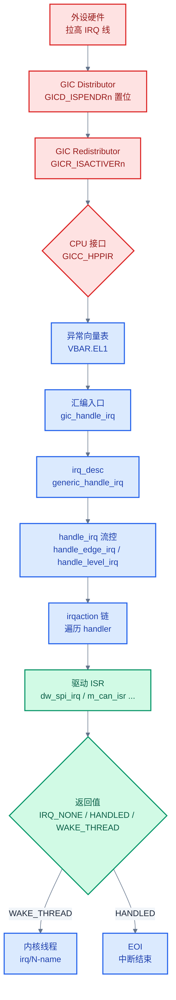
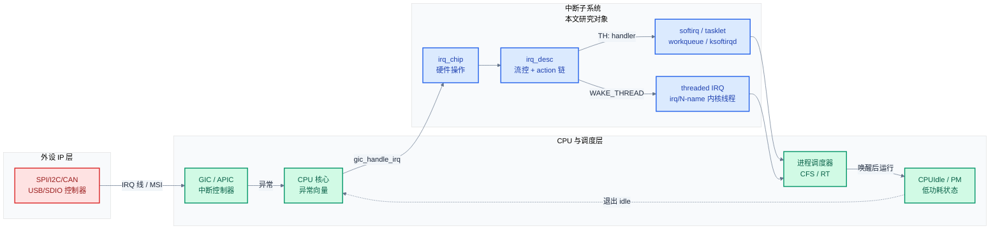
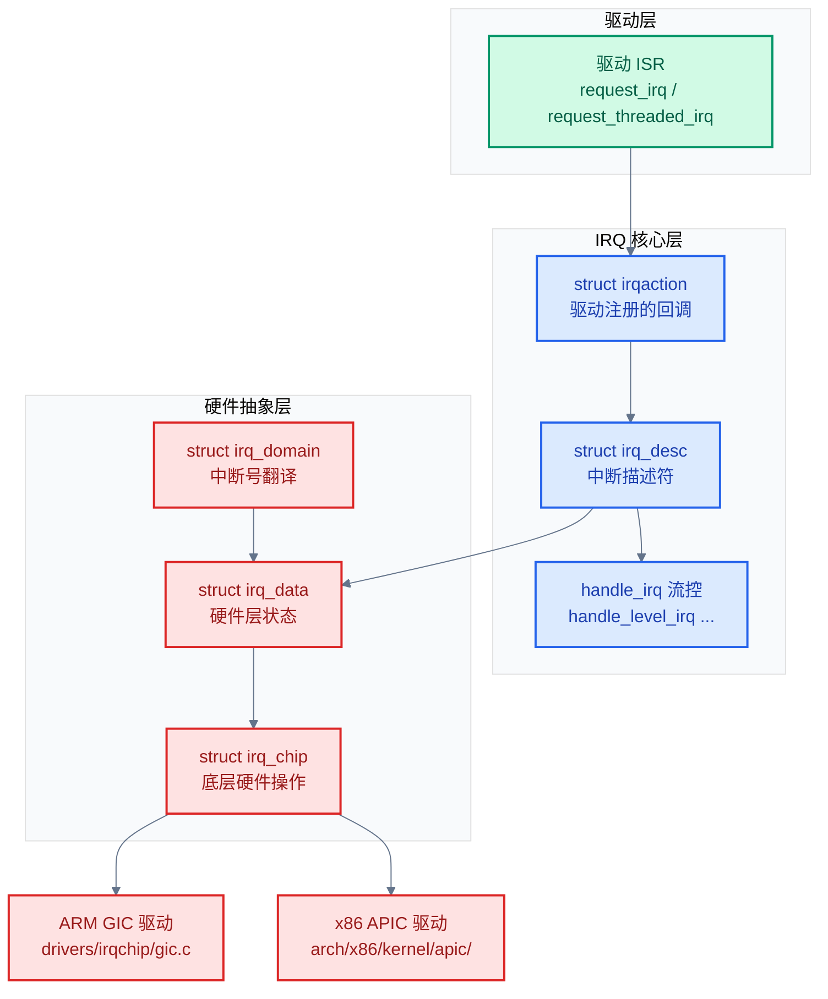
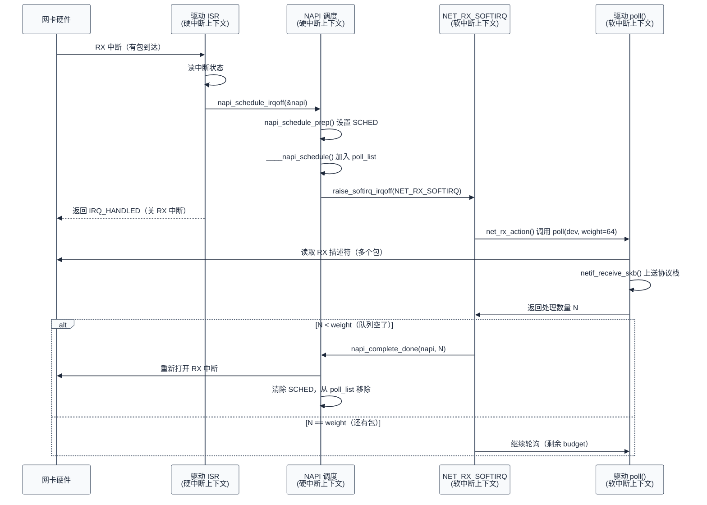

# 中断处理与延迟优化

> 把第七章散落的中断话题集中起来深入展开：Linux 中断子系统数据结构、顶半部/底半部分离、软中断/tasklet/workqueue/NAPI、threaded IRQ、IRQ affinity、RT-Linux、延迟测量与各协议中断模式对比。前七章按协议维度讲，本篇按"中断"这一横切维度讲——通信协议的实时性、低延迟、低 CPU 占用最终都汇聚到中断处理这一底层机制。
>
> **工程师视角**：把 SPI 中断延迟从 50 μs 降到 5 μs、把 CAN 收包丢帧率从 1% 降到 0、把 USB 摄像头延迟从 50 ms 降到 5 ms——这些不是"协议更好"带来的，是中断模式选择、底半部分离、IRQ affinity、NAPI 调度共同优化的结果。理解中断子系统是嵌入式实时性工程师的核心能力。

### 关键术语

| 缩写 | 全称 | 含义 |
|------|------|------|
| IRQ | Interrupt ReQuest | 中断请求 |
| ISR | Interrupt Service Routine | 中断服务程序 |
| GIC | Generic Interrupt Controller | ARM 通用中断控制器 |
| APIC | Advanced Programmable Interrupt Controller | x86 高级可编程中断控制器 |
| MSI | Message Signaled Interrupt | 消息信号中断 |
| MSI-X | MSI eXtended | 扩展 MSI（多向量） |
| NAPI | New API | Linux 网络收包软中断机制 |
| IRQD | IRQ Data | Linux `struct irq_data`（中断硬件层抽象） |
| IRQS | IRQ Status | 中断状态字段 |
| BH | Bottom Half | 底半部（延迟处理） |
| TH | Top Half | 顶半部（硬中断上下文） |
| RT | Real-Time | 实时 |
| PREEMPT_RT | Preemptible Real-Time | Linux 实时补丁（已合入主线） |
| IPI | Inter-Processor Interrupt | 处理器间中断 |
| FIFO | First In First Out | 调度策略 FIFO（实时） |
| RR | Round Robin | 调度策略轮转 |
| SG | Scatter-Gather | 分散-聚集（DMA 术语） |
| latency | — | 延迟（响应时间） |
| jitter | — | 抖动（延迟变化） |
| IRQF | IRQ Flag | 中断标志位（`IRQF_*`） |
| SDHCI | Secure Digital Host Controller Interface | SD 主机控制器接口 |

### 前置知识

| 需要了解 | 参考文档 |
|----------|----------|
| 五种协议的基本工作原理 | [00-通信协议总览](./00-通信协议总览.md) ~ [05-SDIO-eMMC协议与驱动](./05-SDIO-eMMC协议与驱动.md) |
| 协议对比与选型 | [06-协议对比与选型](./06-协议对比与选型.md) |
| 性能调优与 DMA | [07-性能调优与DMA深入](./07-性能调优与DMA深入.md) |
| Linux 驱动框架基础 | 各协议文档的"Linux 驱动"章节 |

---

## 1. 中断子系统总览：从硬件信号到驱动 ISR

> 第七章讲 DMA 时提到"DMA 完成后通过中断通知 CPU"，但中断是如何从硬件信号一路走到驱动 ISR 的？这一章先建立完整的中断路径全景，再逐层深入。

### 1.1 中断的"信号路径"

以 ARM GIC 为例，一个外设中断从产生到 ISR 执行的完整路径：



**逐步说明**：

1. **硬件层**：外设拉高中断线（电平触发）或产生边沿。GIC Distributor 检测到信号，在 `GICD_ISPENDRn`（中断 pending 寄存器）中置位。
2. **GIC 层**：Distributor 根据 affinity 路由到目标 CPU，Redistributor 激活中断（`GICR_ISACTIVERn`）。CPU 接口判断优先级，若高于当前运行优先级则触发 CPU 异常。
3. **CPU 层**：CPU 跳到异常向量表 `VBAR.EL1` 中的中断入口，执行汇编桩代码保存上下文，调用 `gic_handle_irq`。
4. **内核 IRQ 核心**：通过 `irq_to_desc(irq)` 找到 `struct irq_desc`，调用 `desc->handle_irq()`（流控回调）。
5. **流控层**：`handle_edge_irq` / `handle_level_irq` 处理边沿/电平中断的 ACK 与 mask，然后调用 `handle_irq_event`。
6. **驱动层**：遍历 `irq_desc->action` 链表（共享中断可能有多个 `irqaction`），逐个调用 `action->handler(irq, action->dev_id)`，即驱动注册的 ISR。
7. **返回值处理**：
   - `IRQ_HANDLED`：中断已处理，结束。
   - `IRQ_NONE`：不是本设备的中断（共享中断场景），继续下一个 action。
   - `IRQ_WAKE_THREAD`：硬中断部分已完成，唤醒中断线程执行底半部。
8. **EOI**：中断处理结束，向 GIC 写 EOI（End of Interrupt），允许同优先级或更低优先级中断。

### 1.2 系统上下文

中断子系统不是孤立模块——它向上对接进程调度器与电源管理，向下耦合硬件中断控制器与外设 IP，左右关联驱动框架与 RT 子系统。理解它在系统中的位置，才能定位"为什么中断延迟受 CPUIdle 影响""为什么 RT-Linux 要把硬中断线程化"这类跨层问题。

**项目定位**：中断子系统是 OS 内核中**唯一允许"异步打断当前执行流"的入口**。所有外设的"事件通知"——SPI 完成、I2C 传输结束、CAN 收到帧、USB 枚举完成、SDIO DMA 完成——最终都汇聚成一条 IRQ 线进入内核。它的设计直接决定了系统的实时性、吞吐、功耗三大指标的上限。

**软硬件耦合点**：

| 耦合方向 | 接口 | 共同设计点 |
|----------|------|-----------|
| 外设 ↔ 中断控制器 | IRQ 线（物理引脚或 MSI/MSI-X 消息） | 触发类型（边沿/电平）、优先级、affinity 路由 |
| 中断控制器 ↔ CPU | 异常向量（VBAR.EL1 / IDT） | 向量表布局、入口汇编、上下文保存 |
| 中断子系统 ↔ 调度器 | `wake_thread` / `__wake_up` | thread_fn 唤醒、softirqd 调度、RT 优先级 |
| 中断子系统 ↔ 电源管理 | IRQF_NO_SUSPEND / `irq_set_wake` | 唤醒源、CPUIdle 在中断后退出、runtime PM resume |
| 中断子系统 ↔ RT 框架 | `force_irqthreads` / PREEMPT_RT | 硬中断线程化、优先级继承、 IRQ 中不可抢占 → 可抢占 |

**跨实现对比**（详细对比见 [§9](#9-zephyr-中断子系统与-linux-的对比)）：Linux 用三层抽象（`irq_chip` / `irq_desc` / `irqaction`）+ softirq/tasklet/workqueue 多套底半部机制，支持 SMP affinity 与 PREEMPT_RT；Zephyr 用更轻量的 `struct isr` + `_sw_isr_table` + `irq_connect_dynamic`，无 softirq 概念，底半部靠 workqueue 或 custom thread，适合 MCU 级实时场景。



> **如何读这张图**：本文研究对象（蓝色）是中断子系统，左红是外设 IP（事件源），右绿是 CPU 与调度层（事件处理终点）。三条横向耦合链路最关键：**外设 → GIC → CPU** 是硬件路径（§1.1 的信号路径）；**irq_desc → softirq/threaded → 调度器** 是软件路径（§4/§5 详述）；**调度器 ↔ PM** 是实时性与功耗的耦合点（§9 对比 Zephyr）。后续章节都是对这张图的某一链路做深入。

### 1.3 Linux 中断子系统的三层抽象



**三层职责**：

| 层 | 数据结构 | 职责 | 位置 |
|----|---------|------|------|
| 驱动层 | `struct irqaction` | 提供 ISR 函数、`dev_id`、共享标志 | `include/linux/interrupt.h` |
| IRQ 核心层 | `struct irq_desc` | 中断描述符，串起 action 与 chip | `include/linux/irqdesc.h` |
| 硬件抽象层 | `struct irq_chip` / `struct irq_data` / `struct irq_domain` | 底层 ack/mask/unmask/set_affinity/set_type | `include/linux/irq.h` |

> **核心要点**：Linux 中断子系统用三层抽象把"驱动 ISR"和"硬件寄存器操作"解耦。驱动只调用 `request_irq()`，不直接操作 GIC；GIC 驱动只实现 `irq_chip` 回调，不关心外设语义。这种分层让同一个驱动能跨平台运行。

### 1.4 关键数据结构

#### `struct irqaction`：驱动的注册信息

来自 [interrupt.h](file:///home/pbw/2042f/linux/include/linux/interrupt.h#L123-L140)：

```c
struct irqaction {
    irq_handler_t       handler;        // 顶半部 ISR
    union {
        void        *dev_id;            // 设备 cookie（共享中断必需）
        void __percpu *percpu_dev_id;
    };
    const struct cpumask *affinity;     // CPU 亲和性
    struct irqaction    *next;          // 共享中断的下一个 action
    irq_handler_t       thread_fn;      // 线程化中断的底半部
    struct task_struct  *thread;        // 中断线程 task_struct
    struct irqaction    *secondary;     // force-threading 的次级 action
    unsigned int        irq;            // 中断号
    unsigned int        flags;          // IRQF_* 标志
    unsigned long       thread_flags;
    unsigned long       thread_mask;
    const char          *name;          // /proc/interrupts 中的名字
    struct proc_dir_entry *dir;
} ____cacheline_internodealigned_in_smp;
```

- `handler` 是顶半部 ISR，运行在硬中断上下文（不可睡眠、不可抢占）
- `thread_fn` 是底半部，运行在内核线程上下文（可睡眠、可抢占）
- `next` 链表用于共享中断（同一 IRQ 多个设备共享）

#### `struct irq_desc`：中断描述符

来自 [irqdesc.h](file:///home/pbw/2042f/linux/include/linux/irqdesc.h#L44-L133)，关键字段：

```c
struct irq_desc {
    struct irq_data      irq_data;       // 硬件层状态
    irq_flow_handler_t   handle_irq;     // 流控回调
    struct irqaction    *action;         // action 链表头
    unsigned int         status_use_accessors;  // IRQD_* 状态
    unsigned int         core_internal_state__do_not_mess_with_it;
    unsigned int         depth;          // disable 嵌套深度
    unsigned int         wake_depth;     // wake 嵌套深度
    unsigned int         tot_count;      // 累计中断次数
    raw_spinlock_t       lock;
    struct cpumask      *percpu_enabled;
    const struct cpumask *percpu_affinity;
    unsigned int         threads_oneshot;  // oneshot 线程位图
    atomic_t             threads_active;   // 活跃线程计数
    wait_queue_head_t    wait_for_threads; // 等待线程完成
#ifdef CONFIG_SPARSE_IRQ
    struct rcu_head      rcu;
    struct irq_desc      *dir;            // /proc/irq/N
#endif
    int                 parent_irq;
    struct module       *owner;
    const char          *name;
} ____cacheline_internodealigned_in_smp;
```

> **如何读这个结构**：`irq_data` 是硬件层状态（如 `irq_chip` 指针、硬件中断号 hwirq）；`handle_irq` 是流控回调（处理 ACK、mask、调用 action）；`action` 是驱动注册的回调链；`depth` 表示 `disable_irq()` 的嵌套次数（>0 表示已禁用）；`threads_active` 计数当前活跃的中断线程，`wait_for_threads` 用于 `synchronize_irq()` 等待线程退出。

#### `struct irq_chip`：硬件操作回调

来自 [irq.h](file:///home/pbw/2042f/linux/include/linux/irq.h#L443-L547)，关键字段：

```c
struct irq_chip {
    const char      *name;
    unsigned int    (*irq_startup)(struct irq_data *data);
    void            (*irq_shutdown)(struct irq_data *data);
    void            (*irq_enable)(struct irq_data *data);
    void            (*irq_disable)(struct irq_data *data);

    void            (*irq_ack)(struct irq_data *data);
    void            (*irq_mask)(struct irq_data *data);
    void            (*irq_mask_ack)(struct irq_data *data);
    void            (*irq_unmask)(struct irq_data *data);
    void            (*irq_eoi)(struct irq_data *data);

    int             (*irq_set_affinity)(struct irq_data *data, const struct cpumask *dest, bool force);
    int             (*irq_retrigger)(struct irq_data *data);
    int             (*irq_set_type)(struct irq_data *data, unsigned int flow_type);
    int             (*irq_set_wake)(struct irq_data *data, unsigned int on);

    void            (*irq_bus_lock)(struct irq_data *data);
    void            (*irq_bus_sync_unlock)(struct irq_data *data);

    void            (*irq_cpu_online)(struct irq_data *d);
    void            (*irq_cpu_offline)(struct irq_data *d);

    int             (*irq_set_vcpu_affinity)(struct irq_data *data, void *vcpu_info);
    int             (*irq_set_irqchip_state)(struct irq_data *data, enum irqchip_irq_state which, bool val);
    /* MSI / NMI / IPI 等更多回调... */
};
```

- ARM GIC 实现 `gic_chip` / `gic_eoimode1_chip`，覆盖以上回调
- x86 APIC 实现 `lapic_chip` / `ioapic_chip`
- GPIO 控制器通常实现为"级联 irq_chip"：GPIO 中断父中断是 GIC 的某个 IRQ，GPIO 驱动收到父中断后查询自己的状态寄存器，分发到具体 GPIO 引脚的中断

---

## 2. 中断注册 API：request_irq vs request_threaded_irq

> 知道了中断路径全景，下一问题是：驱动如何注册 ISR？Linux 提供了 `request_irq` 和 `request_threaded_irq` 两个核心 API，后者是前者的超集。本章深入两者的差异、何时用哪个、底层的 `__setup_irq` 流程。

### 2.1 两个 API 的关系

来自 [interrupt.h](file:///home/pbw/2042f/linux/include/linux/interrupt.h#L154-L177)：

```c
extern int __must_check
request_threaded_irq(unsigned int irq, irq_handler_t handler,
                     irq_handler_t thread_fn,
                     unsigned long flags, const char *name, void *dev);

static inline int __must_check
request_irq(unsigned int irq, irq_handler_t handler, unsigned long flags,
            const char *name, void *dev)
{
    return request_threaded_irq(irq, handler, NULL, flags | IRQF_COND_ONESHOT, name, dev);
}
```

> **核心要点**：`request_irq` 是 `request_threaded_irq` 的特例——传 `thread_fn=NULL` 表示没有底半部线程。两者最终都走 `__setup_irq()`。任何中断都通过 `request_threaded_irq` 注册。

### 2.2 三个返回值：ISR 的"语义"

来自 [irqreturn.h](file:///home/pbw/2042f/linux/include/linux/irqreturn.h#L11-L18)：

```c
enum irqreturn {
    IRQ_NONE        = (0 << 0),  // 不是本设备的中断
    IRQ_HANDLED     = (1 << 0),  // 已处理
    IRQ_WAKE_THREAD = (1 << 1),  // 顶半部完成，唤醒底半部线程
};
```

- `IRQ_NONE`：共享中断场景下，本设备没有 pending 中断，让内核继续遍历下一个 `irqaction`。如果所有 action 都返回 `IRQ_NONE`，内核会打印 "nobody cared" 警告并禁用该中断。
- `IRQ_HANDLED`：本设备已处理完中断，无需线程。
- `IRQ_WAKE_THREAD`：顶半部只做了最少工作（如关中断、清状态），把真正的工作交给底半部线程。

#### 为什么需要 `IRQ_WAKE_THREAD`

考虑一个 SPI 控制器：每次传输完成都会产生中断，但传输完成后要做的工作（如调用 `spi_finalize_current_message`、启动下一条 message）涉及睡眠（持有 `mutex`、调用 `wait_for_completion`），不能在硬中断上下文做。

**解决方案**：
1. 顶半部 `dw_spi_irq` 只做：读 ISR 寄存器、关中断、清 pending，返回 `IRQ_WAKE_THREAD`。
2. 内核唤醒 `irq/N-dw_spi` 内核线程，运行 `thread_fn`，在进程上下文做完整处理。

```c
// 假想的"完美顶半部"
static irqreturn_t my_spi_irq(int irq, void *dev_id)
{
    struct my_spi *spi = dev_id;
    u32 status = readl(spi->base + SPI_ISR);

    if (!status)
        return IRQ_NONE;

    /* 关中断，防止再次触发 */
    writel(0, spi->base + SPI_IMR);
    /* 清 pending */
    writel(status, spi->base + SPI_ISR);

    /* 保存状态，留给 thread_fn */
    spi->irq_status = status;

    return IRQ_WAKE_THREAD;
}

static irqreturn_t my_spi_thread_fn(int irq, void *dev_id)
{
    struct my_spi *spi = dev_id;

    if (spi->irq_status & SPI_ISR_RX_DONE) {
        /* 在进程上下文：可以睡眠、持锁、调用睡眠 API */
        complete(&spi->xfer_done);
    }
    /* 重新开中断 */
    writel(SPI_IMR_ALL, spi->base + SPI_IMR);
    return IRQ_HANDLED;
}
```

> **核心要点**：顶半部只做"必要的最少工作"——ACK、关中断、保存状态。底半部做"剩下的所有工作"——处理数据、回调上层、可睡眠。这种分拆是 Linux 实时性的核心机制之一。

### 2.3 默认主处理器：handler=NULL 的特殊用法

来自 [manage.c](file:///home/pbw/2042f/linux/kernel/irq/manage.c#L992-L1000)：

```c
/*
 * Default primary interrupt handler for threaded interrupts. Is
 * assigned as primary handler when request_threaded_irq is called
 * with handler == NULL. Useful for oneshot interrupts.
 */
static irqreturn_t irq_default_primary_handler(int irq, void *dev_id)
{
    return IRQ_WAKE_THREAD;
}
```

如果 `request_threaded_irq(irq, NULL, thread_fn, IRQF_ONESHOT, ...)` ——`handler` 为 NULL——内核用这个默认主处理器，它无条件返回 `IRQ_WAKE_THREAD`。

**适用场景**：oneshot 中断。`IRQF_ONESHOT` 标志告诉内核：顶半部返回后**保持中断线 masked**，直到 `thread_fn` 执行完毕才 unmask。这样避免底半部执行期间中断再次触发导致栈溢出。

### 2.4 IRQF_* 标志位详解

来自 [interrupt.h](file:///home/pbw/2042f/linux/include/linux/interrupt.h#L74-L88)：

| 标志 | 值 | 含义 | 典型用途 |
|------|----|----|----------|
| `IRQF_SHARED` | 0x80 | 共享中断 | 多设备共用一条 IRQ 线（PCIe 常见） |
| `IRQF_PROBE_SHARED` | 0x100 | 探测时允许共享冲突 | 调试用 |
| `IRQF_TIMER` | 0x200 \| 0x4000 \| 0x10000 | 定时器中断（不可线程化、不挂起） | 时钟中断 |
| `IRQF_PERCPU` | 0x400 | 每 CPU 中断 | ARM GIC 的 PPI 中断 |
| `IRQF_NOBALANCING` | 0x800 | 不参与 IRQ balance | 定时器、IPI |
| `IRQF_IRQPOLL` | 0x1000 | 用于 IRQ 轮询 | 共享中断第一个 action 用于轮询 |
| `IRQF_ONESHOT` | 0x2000 | 线程执行期间保持 masked | oneshot 设备 |
| `IRQF_NO_SUSPEND` | 0x4000 | 系统挂起时不 disable | 唤醒源中断 |
| `IRQF_FORCE_RESUME` | 0x8000 | 挂起恢复时强制 enable | 即使 NO_SUSPEND 也要重新使能 |
| `IRQF_NO_THREAD` | 0x10000 | 不可线程化 | 强制留在硬中断上下文 |
| `IRQF_EARLY_RESUME` | 0x20000 | 在 syscore 阶段恢复 | 早于设备恢复 |
| `IRQF_COND_SUSPEND` | 0x40000 | 共享中断条件挂起 | 与 NO_SUSPEND 共享 |
| `IRQF_NO_AUTOEN` | 0x80000 | 注册时不自动 enable | 唤醒中断延迟 enable |
| `IRQF_COND_ONESHOT` | 0x200000 | 条件 ONESHOT | `request_irq` 自动加 |

**触发类型**（[interrupt.h:31-38](file:///home/pbw/2042f/linux/include/linux/interrupt.h#L31-L38)）：

| 标志 | 值 | 含义 |
|------|----|----|
| `IRQF_TRIGGER_RISING` | 0x1 | 上升沿触发 |
| `IRQF_TRIGGER_FALLING` | 0x2 | 下降沿触发 |
| `IRQF_TRIGGER_HIGH` | 0x4 | 高电平触发 |
| `IRQF_TRIGGER_LOW` | 0x8 | 低电平触发 |

### 2.5 `request_threaded_irq` 完整流程

来自 [manage.c:2115-2173+](file:///home/pbw/2042f/linux/kernel/irq/manage.c#L2115-L2173)：

```c
int request_threaded_irq(unsigned int irq, irq_handler_t handler,
                         irq_handler_t thread_fn, unsigned long irqflags,
                         const char *devname, void *dev_id)
{
    struct irqaction *action;
    struct irq_desc *desc;
    int retval;

    /* 1. 校验：共享中断必须有 dev_id */
    if (((irqflags & IRQF_SHARED) && !dev_id) || ...)
        return -EINVAL;

    /* 2. 找到 irq_desc */
    desc = irq_to_desc(irq);
    if (!desc)
        return -EINVAL;

    /* 3. handler 为 NULL 时用默认主处理器 */
    if (!handler) {
        if (!thread_fn)
            return -EINVAL;
        handler = irq_default_primary_handler;
    }

    /* 4. 分配 irqaction */
    action = kzalloc_obj(struct irqaction);
    if (!action)
        return -ENOMEM;

    /* 5. 填充 action */
    action->handler = handler;
    action->thread_fn = thread_fn;
    action->flags = irqflags;
    action->name = devname;
    action->dev_id = dev_id;

    /* 6. 引用 irq_chip 的 PM */
    retval = irq_chip_pm_get(&desc->irq_data);
    if (retval < 0) { kfree(action); return retval; }

    /* 7. 调用 __setup_irq 完成注册 */
    retval = __setup_irq(irq, desc, action);
    /* ... */
}
```

`__setup_irq` 完成：
- 创建中断线程（如果 `thread_fn` 非空）：`kthread_create(irq_thread, action, "irq/%d-%s", irq, name)`
- 设置 `IRQD_AFFINITY_SET`、`IRQD_TRIGGER_MASK` 等状态
- 调用 `irq_chip.irq_startup()` 启动中断（除非 `IRQF_NO_AUTOEN`）
- 添加到 `/proc/irq/N/` 目录

---

## 3. 顶半部 vs 底半部：四种延迟处理机制

> 第二章讲了顶半部和底半部的分工，但底半部有四种实现：软中断、tasklet、workqueue、threaded IRQ。本章对比这四种机制，给出选型建议。

### 3.1 四种机制对比

| 维度 | 软中断 (softirq) | tasklet | workqueue | threaded IRQ |
|------|------------------|---------|-----------|--------------|
| 运行上下文 | 软中断上下文 | 软中断上下文 | 进程上下文（内核线程） | 进程上下文（专属线程） |
| 可睡眠 | 否 | 否 | 是 | 是 |
| 并发性 | 每 CPU 独立运行 | 同一 tasklet 串行 | 可配置（默认并发） | 每 IRQ 一个线程 |
| 优先级 | 高（紧随硬中断） | 高 | 普通 SCHED_OTHER | SCHED_FIFO（实时优先级 50） |
| 驱动直接用 | 否（仅网络/块/RQ 用） | 是（旧代码） | 是（推荐） | 是（推荐） |
| 内核版本趋势 | — | 已废弃（建议 workqueue） | 主流 | 主流 |
| 典型场景 | NET_RX/TX、BLOCK、TASKLET | 旧驱动 | 几乎所有睡眠场景 | 中断底半部 |

> **核心要点**：新代码优先用 **workqueue**（可睡眠、可调度）或 **threaded IRQ**（专属中断线程，实时优先级）。tasklet 已被标记为废弃，软中断保留给网络/块层等核心子系统。

### 3.2 软中断：`handle_softirqs` 实现

来自 [softirq.c:579-652](file:///home/pbw/2042f/linux/kernel/softirq.c#L579-L652)：

```c
static void handle_softirqs(bool ksirqd)
{
    unsigned long end = jiffies + MAX_SOFTIRQ_TIME;  // 2 ms 上限
    unsigned long old_flags = current->flags;
    int max_restart = MAX_SOFTIRQ_RESTART;  // 10 次
    struct softirq_action *h;
    __u32 pending;

    /* ... */

    pending = local_softirq_pending();
    softirq_handle_begin();
    /* ... */

restart:
    /* 清 pending 位（在开中断前） */
    set_softirq_pending(0);
    local_irq_enable();      /* 软中断执行期间开中断 */

    h = softirq_vec;
    while ((softirq_bit = ffs(pending))) {  /* 找到第一个 pending 位 */
        h += softirq_bit - 1;
        /* 调用 action */
        h->action();
        h++;
        pending >>= softirq_bit;
    }

    local_irq_disable();

    pending = local_softirq_pending();
    if (pending) {  /* 期间又有新 softirq pending */
        if (time_before(jiffies, end) && !need_resched() && --max_restart)
            goto restart;  /* 重启，但有 10 次上限 */
        wakeup_softirqd();  /* 唤醒 ksoftirqd 处理剩余 */
    }

    /* ... */
}
```

**关键设计**：

1. **2 ms 上限 + 10 次重启**：避免软中断持续执行导致用户进程饥饿。
2. **执行期间开中断**：允许新硬中断抢占软中断。
3. **超过限制唤醒 ksoftirqd**：剩下的软中断交给 `ksoftirqd` 内核线程，让出 CPU 给用户进程。

#### 软中断向量列表

```c
// kernel/softirq.c
const char * const softirq_to_name[NR_SOFTIRQS] = {
    "HI", "TIMER", "NET_TX", "NET_RX", "BLOCK", "IRQ_POLL",
    "TASKLET", "SCHED", "HRTIMER", "RCU"
};
```

- `HI_SOFTIRQ`：高优先级 tasklet
- `TIMER_SOFTIRQ`：定时器
- `NET_TX_SOFTIRQ` / `NET_RX_SOFTIRQ`：网络收发
- `BLOCK_SOFTIRQ`：块层
- `TASKLET_SOFTIRQ`：普通 tasklet
- `SCHED_SOFTIRQ`：调度器
- `HRTIMER_SOFTIRQ`：高精度定时器
- `RCU_SOFTIRQ`：RCU 回收

### 3.3 ksoftirqd：软中断的"清道夫"

来自 [softirq.c:1050-1108](file:///home/pbw/2042f/linux/kernel/softirq.c#L1050-L1108)：

```c
static void run_ksoftirqd(void)
{
    local_irq_disable();
    if (local_softirq_pending()) {
        /*
         * 在 RT 内核下，软中断在 ksoftirqd 上下文运行，
         * 可以被抢占，但需要关中断保护 per-cpu 数据。
         */
        handle_softirqs(true);  // ksirqd=true
    }
    local_irq_enable();
    cond_resched();
}
```

- 每 CPU 一个 `ksoftirqd/%u` 线程
- 优先级 SCHED_OTHER（普通），CFS 调度
- 用途：硬中断退出时如果有大量 softirq pending 但 `handle_softirqs` 已经达到 10 次重启上限，就唤醒 ksoftirqd 慢慢处理

### 3.4 workqueue：可睡眠的底半部

workqueue 是驱动最常用的底半部机制：

```c
// 1. 初始化 work
INIT_WORK(&dev->work, my_work_handler);

// 2. 在 ISR 中调度
static irqreturn_t my_irq(int irq, void *dev_id)
{
    struct my_dev *dev = dev_id;
    schedule_work(&dev->work);  // 加入 system_wq
    return IRQ_HANDLED;
}

// 3. work handler 在进程上下文执行
static void my_work_handler(struct work_struct *work)
{
    struct my_dev *dev = container_of(work, struct my_dev, work);
    /* 可以睡眠、持 mutex、调用任何睡眠 API */
    mutex_lock(&dev->lock);
    /* ... */
    mutex_unlock(&dev->lock);
}
```

#### `struct workqueue_struct` 关键字段

来自 [workqueue.c:340](file:///home/pbw/2042f/linux/kernel/workqueue.c#L340)：

```c
struct workqueue_struct {
    struct list_head    pwqs;           // 所有 pool_workqueue
    struct list_head    list;           // 全局 workqueue 链表
    struct mutex        mutex;          // 保护 workqueue
    int                 work_color;     // flush 颜色
    int                 flush_color;
    atomic_t            nr_pwqs_to_flush;
    struct wq_flusher   *first_flusher;
    struct list_head    flusher_queue;
    struct list_head    flusher_overflow;
    struct list_head    maydays;        // 需要救援的 wq
    struct worker       *rescuer;       // 救援线程
    int                 nr_drainers;    // drain 进程计数
    int                 saved_max_active;
    struct workqueue_attrs *unbound_attrs;
    struct pool_workqueue *dfl_pwq;
    char                name[WQ_NAME_LEN];
    struct rcu_head     rcu;
    unsigned int        flags ____cacheline_aligned;
    struct pool_workqueue __percpu *cpu_pwqs;
    struct pool_workqueue __rcu *numa_pwq_tbl[];
};
```

#### 系统预定义 workqueue

| 名称 | 特性 | 用途 |
|------|------|------|
| `system_wq` | 普通优先级、可睡眠、并发 | 大多数驱动用这个（`schedule_work`） |
| `system_highpri_wq` | 高优先级（nice -20） | 高优先级 work |
| `system_long_wq` | 普通优先级、长任务友好 | 长时间运行的 work |
| `system_unbound_wq` | 不绑定 CPU | 不在乎 cache 局部性的 work |
| `system_freezable_wq` | 可冻结（系统挂起时暂停） | 非关键 work |
| `system_freezable_wq` | — | — |

> **核心要点**：99% 的驱动用 `schedule_work()`（= `queue_work(system_wq, work)`）即可。只有需要特殊优先级、并发控制、或自定义 workqueue 名称时才用 `alloc_workqueue()` 创建自己的 workqueue。

### 3.5 tasklet：已被废弃的机制

tasklet 基于软中断（`TASKLET_SOFTIRQ` 和 `HI_SOFTIRQ`），但同一 tasklet 不会在多个 CPU 并发执行。被废弃的原因：

1. 性能差：基于软中断，不能睡眠，限制多
2. 全局锁竞争：所有 tasklet 共享一个 spinlock
3. 不可抢占：在 RT-Linux 下也会卡住

新代码不要用 tasklet，旧代码建议迁移到 workqueue。内核版本 6.x 已经在逐步清理 tasklet 用户。

### 3.6 threaded IRQ：实时性优先

threaded IRQ 把底半部放到独立的内核线程，线程优先级 SCHED_FIFO 50（实时优先级）：

```c
// 注册 threaded IRQ
ret = request_threaded_irq(irq, my_hard_irq, my_thread_fn,
                           IRQF_ONESHOT, "my-dev", dev);
```

#### `irq_thread` 主循环

来自 [manage.c:1244-1286](file:///home/pbw/2042f/linux/kernel/irq/manage.c#L1244-L1286)：

```c
static int irq_thread(void *data)
{
    struct callback_head on_exit_work;
    struct irqaction *action = data;
    struct irq_desc *desc = irq_to_desc(action->irq);
    irqreturn_t (*handler_fn)(struct irq_desc *desc, struct irqaction *action);

    irq_thread_set_ready(desc, action);

    /* 设置为 SCHED_FIFO 实时优先级 50 */
    if (action->handler == irq_forced_secondary_handler)
        sched_set_fifo_secondary(current);
    else
        sched_set_fifo(current);

    /* ... */

    while (!irq_wait_for_interrupt(desc, action)) {
        irqreturn_t action_ret;
        action_ret = handler_fn(desc, action);
        if (action_ret == IRQ_WAKE_THREAD)
            irq_wake_secondary(desc, action);
        wake_threads_waitq(desc);
    }

    /* 退出路径 */
    return 0;
}
```

**关键点**：
- `sched_set_fifo(current)` 设置 SCHED_FIFO 优先级 50
- `irq_wait_for_interrupt()` 阻塞等待 `IRQTF_RUNTHREAD` 位被置
- 顶半部返回 `IRQ_WAKE_THREAD` 后，内核调 `__irq_wake_thread()` 置位并 `wake_up_process()`

#### 强制线程化（force threading）

`threadirqs` 内核参数或 `CONFIG_PREEMPT_RT` 会强制所有非 `IRQF_NO_THREAD` 的中断变成 threaded IRQ，即使驱动用 `request_irq()` 注册。这是 RT-Linux 把硬中断延迟降到最低的关键机制。

> **核心要点**：threaded IRQ 是新驱动的默认推荐方式。它把"硬中断上下文"压到最短（几微秒内完成 ACK），把真正的工作交给实时优先级 50 的内核线程。这种设计对实时性、对系统响应性都有好处。

---

## 4. NAPI：网络子系统的"软中断+轮询"混合机制

> 第三章讲了四种底半部机制，其中 workqueue 是驱动最常用的。但网络子系统有特殊需求：高pps（packets per second）场景下，每包一个中断会撑爆 CPU。NAPI（New API）就是为解决这个问题而生——硬中断触发后切换到轮询模式，批量处理多个包。本章深入 NAPI 的数据结构与流程。

### 4.1 为什么需要 NAPI

假设千兆网线达到线速 1.5 Mpps（每秒 150 万包）。如果每包都触发一次硬中断：
- 每次中断开销约 5-10 μs（上下文切换 + ISR + 软中断）
- 1.5M × 5 μs = 7.5 秒/秒——CPU 100% 都在中断处理上，根本没空处理数据

**NAPI 的思路**：
1. 第一个包来时正常产生硬中断
2. ISR 关闭 RX 中断，调度 NAPI 轮询
3. 软中断上下文（`NET_RX_SOFTIRQ`）中循环调用驱动 `poll()` 方法，每次最多处理 `weight` 个包（默认 64）
4. 当 `poll()` 一次处理少于 `weight` 个包（说明队列空了），重新打开 RX 中断，退出轮询

这样：
- 低 pps 场景：每包一个中断，延迟低
- 高 pps 场景：第一个包触发中断，后续批量轮询，CPU 占用低

### 4.2 `struct napi_struct`

来自 [netdevice.h:379-417](file:///home/pbw/2042f/linux/include/linux/netdevice.h#L379-L417)：

```c
struct napi_struct {
    /* state 字段必须在前（softnet_data.backlog 需要） */
    unsigned long       state;
    /* poll_list 只能由改变 NAPI_STATE_SCHED 位的实体管理 */
    struct list_head    poll_list;

    int                 weight;             // 每次轮询的最大包数（默认 64）
    u32                 defer_hard_irqs_count;
    int                 (*poll)(struct napi_struct *, int);  // 驱动轮询回调

#ifdef CONFIG_NETPOLL
    int                 poll_owner;         // netpoll 时正在轮询的 CPU
#endif
    int                 list_owner;         // 调度 NAPI 的 CPU
    struct net_device   *dev;
    struct sk_buff      *skb;
    struct gro_node     gro;                // Generic Receive Offload
    struct hrtimer      timer;              // 中断聚合定时器
    /* 以下字段由 netdev_lock 保护 */
    struct task_struct  *thread;            // threaded NAPI 模式下的线程
    unsigned long       gro_flush_timeout;
    unsigned long       irq_suspend_timeout;
    u32                 defer_hard_irqs;
    /* 控制路径字段 */
    u32                 napi_id;
    struct list_head    dev_list;
    struct hlist_node   napi_hash_node;
    int                 irq;
    struct irq_affinity_notify notify;
    int                 napi_rmap_idx;
    int                 index;
    struct napi_config  *config;
};
```

#### state 字段的位

```c
enum {
    NAPI_STATE_SCHED,          // 已被调度（在 poll_list 上）
    NAPI_STATE_MISSED,         // 调度时已经 SCHED，需重试
    NAPI_STATE_DISABLE,        // 正在禁用
    NAPI_STATE_NPSVC,          // netpoll 服务中
    NAPI_STATE_LISTED,         // 已注册到 dev_list
    NAPI_STATE_NO_BUSY_POLL,   // 不允许 busy polling
    NAPI_STATE_IN_BUSY_POLL,   // 正在被 busy poll
    NAPI_STATE_THREADED,       // threaded NAPI 模式
    NAPI_STATE_SCHED_THREADED, // threaded 模式下已调度
};
```

### 4.3 NAPI 调度流程



#### `napi_schedule_prep` 实现

来自 [dev.c:6691-6712](file:///home/pbw/2042f/linux/net/core/dev.c#L6691-L6712)：

```c
bool napi_schedule_prep(struct napi_struct *n)
{
    unsigned long new, val = READ_ONCE(n->state);

    do {
        if (unlikely(val & NAPIF_STATE_DISABLE))
            return false;
        new = val | NAPIF_STATE_SCHED;

        /*
         * 如果 SCHED 已经设置，则置 MISSED 位。
         * 这样表示"我尝试调度时已经在轮询中，轮询退出时需重新调度"。
         */
        new |= (val & NAPIF_STATE_SCHED) / NAPIF_STATE_SCHED *
                               NAPIF_STATE_MISSED;
    } while (!try_cmpxchg(&n->state, &val, new));

    return !(val & NAPIF_STATE_SCHED);
}
```

**核心逻辑**：
1. 用 `cmpxchg` 原子地设置 `SCHED` 位
2. 如果之前已经 `SCHED`（说明正在轮询），设置 `MISSED` 位
3. 返回 true 表示"成功调度"，false 表示"已经在调度中（设置 MISSED）"

#### `____napi_schedule` 实现

来自 [dev.c:4924-4959](file:///home/pbw/2042f/linux/net/core/dev.c#L4924-L4959)：

```c
static inline void ____napi_schedule(struct softnet_data *sd,
                                     struct napi_struct *napi)
{
    struct task_struct *thread;

    lockdep_assert_irqs_disabled();

    /* threaded NAPI 模式：唤醒专属线程而不是软中断 */
    if (test_bit(NAPI_STATE_THREADED, &napi->state)) {
        thread = READ_ONCE(napi->thread);
        if (thread) {
            if (use_backlog_threads() && thread == raw_cpu_read(backlog_napi))
                goto use_local_napi;
            set_bit(NAPI_STATE_SCHED_THREADED, &napi->state);
            wake_up_process(thread);  // 唤醒 napi/N 线程
            return;
        }
    }

use_local_napi:
    list_add_tail(&napi->poll_list, &sd->poll_list);  // 加入 per-CPU 队列
    WRITE_ONCE(napi->list_owner, smp_processor_id());
    if (!sd->in_net_rx_action)
        raise_softirq_irqoff(NET_RX_SOFTIRQ);  // 触发软中断
}
```

> **核心要点**：NAPI 有两种模式——传统模式触发 `NET_RX_SOFTIRQ` 软中断；threaded 模式唤醒 `napi/N-dev` 内核线程。后者对 RT-Linux 更友好（软中断在 RT 下也变成线程化）。

### 4.4 NAPI 在 CAN 驱动中的应用

CAN 总线虽然不是高 pps 网络，但 MCAN 控制器接收 FIFO 0 可能有多个报文同时待处理，NAPI 仍然适用。

来自 [m_can.c:1236-1276+](file:///home/pbw/2042f/linux/drivers/net/can/m_can/m_can.c#L1236-L1276)：

```c
static int m_can_interrupt_handler(struct m_can_classdev *cdev)
{
    struct net_device *dev = cdev->net;
    u32 ir = 0, ir_read;
    int ret;

    if (pm_runtime_suspended(cdev->dev))
        return IRQ_NONE;

    /*
     * MCAN 中断状态是 level（电平）信号。如果是 edge-triggered 集成
     * （如 m_can_pci），必须观察到 IR=0 至少一次才能确保下次产生边沿。
     */
    while ((ir_read = m_can_read(cdev, M_CAN_IR)) != 0) {
        ir |= ir_read;
        m_can_write(cdev, M_CAN_IR, ir);  // 写 1 清除
        if (!cdev->irq_edge_triggered)
            break;
    }

    m_can_coalescing_update(cdev, ir);
    if (!ir)
        return IRQ_NONE;

    if (cdev->ops->clear_interrupts)
        cdev->ops->clear_interrupts(cdev);

    /* 对 RX、状态变化、总线错误调度 NAPI */
    if (ir & (IR_RF0N | IR_RF0W | IR_ERR_ALL_30X)) {
        cdev->irqstatus = ir;
        if (!cdev->is_peripheral) {
            m_can_disable_all_interrupts(cdev);  // 关闭所有中断
            napi_schedule(&cdev->napi);          // 调度 NAPI
        } else {
            /* peripheral 模式：直接处理（不能调度 NAPI，可能在中断线程中） */
            /* ... */
        }
    }

    /* ... 其他中断处理 ... */
    return IRQ_HANDLED;
}
```

#### 注册时的中断模式选择

来自 [m_can.c:2124-2130](file:///home/pbw/2042f/linux/drivers/net/can/m_can/m_can.c#L2124-L2130)：

```c
if (cdev->is_peripheral) {
    /* peripheral 模式：threaded IRQ，可睡眠 */
    err = request_threaded_irq(dev->irq, NULL, m_can_isr,
                               IRQF_ONESHOT,
                               dev->name, dev);
} else if (dev->irq) {
    /* MMIO 模式：硬中断 + NAPI */
    err = request_irq(dev->irq, m_can_isr, IRQF_SHARED, dev->name, dev);
}
```

**两种模式**：
- **MMIO 模式**（`is_peripheral=false`）：MCAN 寄存器直接 MMIO 访问，用 `request_irq` + NAPI。性能最好。
- **Peripheral 模式**（`is_peripheral=true`）：MCAN 通过 SPI 等慢速总线访问（如 TCAN4550），用 `request_threaded_irq` + `IRQF_ONESHOT`，因为访问 MCAN 寄存器需要 SPI 传输，必须睡眠。

> **核心要点**：NAPI 适合"高频小数据"场景，且要求驱动能在 ISR 中快速关闭中断、在 `poll()` 中批量读取。如果访问硬件寄存器本身就需要睡眠（如通过 SPI 桥接的 MCAN），就不能用 NAPI，必须用 threaded IRQ。

### 4.5 NAPI 调优参数

| 参数 | 位置 | 默认值 | 含义 |
|------|------|--------|------|
| `weight` | `struct napi_struct` | 64 | 每次 `poll()` 最多处理的包数 |
| `netdev_budget` | `/proc/sys/net/core/netdev_budget` | 300 | 一次 `NET_RX_SOFTIRQ` 总共处理多少包 |
| `netdev_budget_usecs` | `/proc/sys/net/core/netdev_budget_usecs` | 2000 | 一次 `NET_RX_SOFTIRQ` 最多运行多少 μs |
| `gro_flush_timeout` | sysfs | 0 | GRO flush 间隔（ns） |
| `napi_defer_hard_irqs` | sysfs | 0 | 延迟多少次 softirq 后才重开硬中断 |

**调优示例**：高 pps 场景下增加 budget：

```bash
# 增加 softirq 总预算
echo 600 > /proc/sys/net/core/netdev_budget
# 增加 softirq 时间上限
echo 8000 > /proc/sys/net/core/netdev_budget_usecs
```

---

## 5. 各协议驱动中断模式对比

> 第四章用 CAN 举例讲了 NAPI。本章横向对比 SPI/I2C/CAN/USB/MMC 五种协议的中断模式，找出共性与差异。

### 5.1 五种协议中断模式一览

| 协议 | 注册 API | 中断标志 | 底半部机制 | 特点 |
|------|---------|----------|-----------|------|
| SPI (DW) | `request_irq` | `IRQF_SHARED` | workqueue / 同步完成 | 顶半部做 FIFO 处理 |
| I2C (DW) | `request_irq` | `IRQF_SHARED` | 同步完成 (`wait_for_completion`) | 顶半部做状态机推进 |
| CAN (MCAN) | `request_irq` 或 `request_threaded_irq` | `IRQF_SHARED` / `IRQF_ONESHOT` | NAPI | 双模式：MMIO 用 NAPI，peripheral 用 threaded |
| USB (DWC3) | `request_threaded_irq` | `IRQF_SHARED` | threaded IRQ | 顶半部读事件缓冲，底半部线程处理 |
| MMC (SDHCI) | `request_threaded_irq` | `IRQF_SHARED` | threaded IRQ | 顶半部处理快速事件，线程处理慢操作（如卡检测） |

> **核心要点**：五种协议都用了中断，但底半部分离方式各异——SPI/I2C 简单场景下用同步 `wait_for_completion` 即可（少量事件、快速处理），CAN 高频场景用 NAPI，USB/MMC 用 threaded IRQ（事件复杂、可睡眠操作多）。

### 5.2 SPI DesignWare 的中断处理

来自 [spi-dw-core.c:251-266](file:///home/pbw/2042f/linux/drivers/spi/spi-dw-core.c#L251-L266)：

```c
static irqreturn_t dw_spi_irq(int irq, void *dev_id)
{
    struct spi_controller *ctlr = dev_id;
    struct dw_spi *dws = spi_controller_get_devdata(ctlr);
    u16 irq_status = dw_readl(dws, DW_SPI_ISR) & DW_SPI_INT_MASK;

    if (!irq_status)
        return IRQ_NONE;  // 不是本设备中断（共享场景）

    if (!ctlr->cur_msg) {
        /* 没有正在进行的传输，屏蔽中断防止风暴 */
        dw_spi_mask_intr(dws, 0xff);
        return IRQ_HANDLED;
    }

    /* 调用 transfer_handler 处理具体事件 */
    return dws->transfer_handler(dws);
}
```

注册（[spi-dw-core.c:947](file:///home/pbw/2042f/linux/drivers/spi/spi-dw-core.c#L947)）：

```c
ret = request_irq(dws->irq, dw_spi_irq, IRQF_SHARED, dev_name(dev), ctlr);
```

**特点**：
- 用 `IRQF_SHARED` 共享中断（同一 SoC 上多个 DW SPI 控制器可能共享 IRQ）
- 顶半部做完整处理（读 ISR、处理 FIFO、推进传输），不分离底半部
- 原因：SPI 传输数据量小、处理快，硬中断上下文足以完成

**为什么不分离底半部？**
- SPI ISR 中要操作 FIFO（必须及时，否则溢出）
- 传输完成后调用 `spi_finalize_current_message()`——这个函数本身设计为可从中断上下文调用（内部用 `kthread_work` 异步处理）

### 5.3 I2C DesignWare 的中断处理

来自 [i2c-designware-master.c:685-714](file:///home/pbw/2042f/linux/drivers/i2c/busses/i2c-designware-master.c#L685-L714)：

```c
irqreturn_t i2c_dw_isr_master(struct dw_i2c_dev *dev)
{
    unsigned int stat, enabled;

    regmap_read(dev->map, DW_IC_ENABLE, &enabled);
    regmap_read(dev->map, DW_IC_RAW_INTR_STAT, &stat);
    if (!enabled || !(stat & ~DW_IC_INTR_ACTIVITY))
        return IRQ_NONE;
    if (pm_runtime_suspended(dev->dev) || stat == GENMASK(31, 0))
        return IRQ_NONE;
    dev_dbg(dev->dev, "enabled=%#x stat=%#x\n", enabled, stat);

    /* 读取并清除中断位 */
    stat = i2c_dw_read_clear_intrbits(dev);

    if (!(dev->status & STATUS_ACTIVE)) {
        /*
         * 异常中断：驱动没有正在进行的传输。
         * 屏蔽中断防止风暴。
         */
        __i2c_dw_write_intr_mask(dev, 0);
        return IRQ_HANDLED;
    }

    /* 处理传输状态机 */
    i2c_dw_process_transfer(dev, stat);

    return IRQ_HANDLED;
}
```

**特点**：
- 顶半部做状态机推进（`i2c_dw_process_transfer`）
- 完成时调用 `complete(&dev->cmd_complete)` 唤醒等待的进程（`i2c_dw_xfer` 在 `wait_for_completion_timeout` 上等待）
- 不用 threaded IRQ，因为 I2C 传输速率低（标准模式 100 kHz，快速模式 1 MHz），中断频率不高

**I2C 不用 NAPI 的原因**：
- I2C 不是网络接口，没有 skb 上送协议栈
- I2C 传输由 `i2c_transfer()` 显式发起，每次传输等待完成
- 中断频率受协议速率限制，不会风暴

### 5.4 USB DWC3 的中断处理

DWC3 是最复杂的，用了 threaded IRQ：

注册（[gadget.c:3019-3020](file:///home/pbw/2042f/linux/drivers/usb/dwc3/gadget.c#L3019-L3020)）：

```c
ret = request_threaded_irq(irq, dwc3_interrupt, dwc3_thread_interrupt,
                           IRQF_SHARED, "dwc3", dwc->ev_buf);
```

顶半部 [gadget.c:4649-4654](file:///home/pbw/2042f/linux/drivers/usb/dwc3/gadget.c#L4649-L4654)：

```c
static irqreturn_t dwc3_interrupt(int irq, void *_evt)
{
    struct dwc3_event_buffer *evt = _evt;
    return dwc3_check_event_buf(evt);
}
```

`dwc3_check_event_buf`（[gadget.c:4593+](file:///home/pbw/2042f/linux/drivers/usb/dwc3/gadget.c#L4593)）：
- 读事件缓冲区计数
- 如果 runtime PM 已挂起，设置 `pending_events` 并触发 resume，禁用中断返回 `IRQ_HANDLED`
- 否则 cache 事件到 `evt->buf`，置 `DWC3_EVENT_PENDING` 标志，返回 `IRQ_WAKE_THREAD`

底半部线程 [gadget.c:4577-4591](file:///home/pbw/2042f/linux/drivers/usb/dwc3/gadget.c#L4577-L4591)：

```c
static irqreturn_t dwc3_thread_interrupt(int irq, void *_evt)
{
    struct dwc3_event_buffer *evt = _evt;
    struct dwc3 *dwc = evt->dwc;
    unsigned long flags;
    irqreturn_t ret = IRQ_NONE;

    local_bh_disable();                // 禁用软中断（持锁期间）
    spin_lock_irqsave(&dwc->lock, flags);
    ret = dwc3_process_event_buf(evt); // 处理事件
    spin_unlock_irqrestore(&dwc->lock, flags);
    local_bh_enable();

    return ret;
}
```

**为什么 DWC3 用 threaded IRQ**：
- USB 事件复杂（设备、端点、OTG 三类事件），处理流程长
- 设备端事件可能触发 gadget driver 回调，回调可能睡眠（如 `usb_gadget_giveback_request` 释放 buffer）
- 端点事件可能触发 URB 完成回调，回调在进程上下文更安全

### 5.5 SDHCI 的中断处理

注册（[sdhci.c:3847-3849](file:///home/pbw/2042f/linux/drivers/mmc/host/sdhci.c#L3847-L3849)）：

```c
ret = request_threaded_irq(host->irq, sdhci_irq,
                           sdhci_thread_irq, IRQF_SHARED,
                           mmc_hostname(mmc), host);
```

顶半部 [sdhci.c:3556-3655+](file:///home/pbw/2042f/linux/drivers/mmc/host/sdhci.c#L3556-L3655)：

```c
static irqreturn_t sdhci_irq(int irq, void *dev_id)
{
    struct mmc_request *mrqs_done[SDHCI_MAX_MRQS] = {0};
    irqreturn_t result = IRQ_NONE;
    struct sdhci_host *host = dev_id;
    u32 intmask, mask, unexpected = 0;
    int max_loops = 16;
    int i;

    spin_lock(&host->lock);

    if (host->runtime_suspended) {
        spin_unlock(&host->lock);
        return IRQ_NONE;
    }

    intmask = sdhci_readl(host, SDHCI_INT_STATUS);
    if (!intmask || intmask == 0xffffffff) {
        result = IRQ_NONE;
        goto out;
    }

    do {
        /* 让平台驱动先处理特殊位 */
        if (host->ops->irq) {
            intmask = host->ops->irq(host, intmask);
            if (!intmask) goto cont;
        }

        /* 清除已处理的中断位 */
        mask = intmask & (SDHCI_INT_CMD_MASK | SDHCI_INT_DATA_MASK |
                          SDHCI_INT_BUS_POWER);
        sdhci_writel(host, mask, SDHCI_INT_STATUS);

        /* 卡插入/移除：mask 防风暴，唤醒线程处理 */
        if (intmask & (SDHCI_INT_CARD_INSERT | SDHCI_INT_CARD_REMOVE)) {
            u32 present = sdhci_readl(host, SDHCI_PRESENT_STATE) &
                          SDHCI_CARD_PRESENT;
            /* 立即屏蔽 INSERT/REMOVE 防止风暴 */
            host->ier &= ~(SDHCI_INT_CARD_INSERT | SDHCI_INT_CARD_REMOVE);
            host->ier |= present ? SDHCI_INT_CARD_REMOVE : SDHCI_INT_CARD_INSERT;
            sdhci_writel(host, host->ier, SDHCI_INT_ENABLE);
            sdhci_writel(host, host->ier, SDHCI_SIGNAL_ENABLE);
            sdhci_writel(host, intmask & (SDHCI_INT_CARD_INSERT |
                         SDHCI_INT_CARD_REMOVE), SDHCI_INT_STATUS);
            host->thread_isr |= intmask & (SDHCI_INT_CARD_INSERT |
                                           SDHCI_INT_CARD_REMOVE);
            result = IRQ_WAKE_THREAD;  // 唤醒线程处理卡检测
        }

        /* 命令完成 */
        if (intmask & SDHCI_INT_CMD_MASK)
            sdhci_cmd_irq(host, intmask & SDHCI_INT_CMD_MASK, &intmask);

        /* 数据完成 */
        if (intmask & SDHCI_INT_DATA_MASK)
            sdhci_data_irq(host, intmask & SDHCI_INT_DATA_MASK);

        /* ... SDIO 中断、retune 等 ... */

        /* 循环读 INT_STATUS，最多 16 次防风暴 */
        intmask = sdhci_readl(host, SDHCI_INT_STATUS);
    } while (intmask && --max_loops);

    /* ... */
}
```

**特点**：
- 顶半部循环处理（最多 16 次）所有事件
- 卡插入/移除事件标记为 `IRQ_WAKE_THREAD`——这种事件涉及热插拔检测、可能需要 debounce、要等待电源稳定，必须在进程上下文做
- 命令完成、数据完成在顶半部快速处理（不睡眠）

### 5.6 各协议 ISR 的"共性模式"

虽然五种协议 ISR 细节不同，但都遵循几个共性模式：

#### 模式 1：先读状态，零状态返回 IRQ_NONE

```c
status = readl(base + ISR_REG);
if (!status)
    return IRQ_NONE;  // 共享中断场景下让内核继续遍历
```

用于共享中断判断"是不是我的设备"。

#### 模式 2：清 pending 后处理

```c
writel(status, base + ISR_REG);  // 写 1 清除
// 然后处理 status
```

避免重复触发。

#### 模式 3：异常路径屏蔽中断防风暴

```c
if (!dev->active) {
    writel(0, base + IMR);  // 屏蔽所有中断
    return IRQ_HANDLED;
}
```

如果驱动状态不对（没在传输、PM 挂起等），立即屏蔽中断防止风暴。

#### 模式 4：分离慢操作到线程

```c
if (status & SLOW_EVENTS) {
    dev->thread_status = status;
    return IRQ_WAKE_THREAD;
}
// 顶半部处理快速事件
```

慢操作（卡检测、URB 完成）放线程，快操作（FIFO 读写、状态机推进）留顶半部。

> **核心要点**：写 ISR 的"模板"是：读状态 → 零检查 → 清 pending → 异常屏蔽 → 快处理顶半部 → 慢处理唤醒线程。这五步是任何协议都适用的通用模式。

---

## 6. IRQ Affinity：多核系统的中断分发

> 单核场景下中断只能给当前 CPU，但多核 SoC 上中断可以路由到任意 CPU。`irq_set_affinity` 让管理员或驱动控制中断落在哪个 CPU——这对缓存局部性、隔离 CPU、负载均衡至关重要。

### 6.1 IRQ Affinity API

来自 [manage.c:462-517](file:///home/pbw/2042f/linux/kernel/irq/manage.c#L462-L517)：

```c
int irq_set_affinity(unsigned int irq, const struct cpumask *cpumask)
{
    struct irq_desc *desc = irq_to_desc(irq);
    /* ... */
    return __irq_set_affinity(desc, cpumask, false);
}

static int __irq_set_affinity(struct irq_desc *desc, const struct cpumask *mask,
                              bool force)
{
    /* ... */
    raw_spin_lock_irqsave(&desc->lock, flags);
    ret = irq_set_affinity_locked(&desc->irq_data, mask, force);
    raw_spin_unlock_irqrestore(&desc->lock, flags);
    return ret;
}
```

底层调用 `irq_chip.irq_set_affinity()` 回调（如 GIC 的 `gic_set_affinity`）写 GICD_ITARGETSRn 寄存器。

#### 用户态接口

```bash
# 查看中断 affinity
cat /proc/irq/N/smp_affinity
# 设置中断 affinity（位图）
echo 0f > /proc/irq/N/smp_affinity    # CPU 0-3
echo 02 > /proc/irq/N/smp_affinity    # CPU 1

# 查看 affinity 列表形式
cat /proc/irq/N/smp_affinity_list
# 设置列表形式
echo 0-3 > /proc/irq/N/smp_affinity_list
echo 2,4-5 > /proc/irq/N/smp_affinity_list
```

### 6.2 IRQ Affinity 调优策略

#### 策略 1：隔离 CPU

把实时任务绑定到 CPU 3，把所有中断赶到 CPU 0-2：

```bash
# 启动参数
isolcpus=3 nohz_full=3 rcu_nocbs=3

# 启动后把所有中断从 CPU 3 移走
for i in /proc/irq/*/smp_affinity; do
    echo 7 > $i  # 0b0111 = CPU 0,1,2
done
```

`isolcpus` 把 CPU 3 从调度器可见集合中移除，必须用 `taskset` 显式绑定进程才能用。`nohz_full` 让 CPU 3 进入无 tick 模式（无定时器中断），`rcu_nocbs` 把 RCU 回调迁移到其他 CPU。

#### 策略 2：网卡 RX 队列绑定

多队列网卡（每个 RX 队列一个 MSI-X 中断）可以分布到多个 CPU：

```bash
# 查看 NIC 中断
grep eth0 /proc/interrupts
# 假设有 4 个队列，分别绑到 CPU 0-3
echo 1 > /proc/irq/32/smp_affinity_list  # 队列 0 → CPU 0
echo 2 > /proc/irq/33/smp_affinity_list  # 队列 1 → CPU 1
echo 3 > /proc/irq/34/smp_affinity_list  # 队列 2 → CPU 2
echo 4 > /proc/irq/35/smp_affinity_list  # 队列 3 → CPU 3
```

配合 RPS（Receive Packet Steering）和 XPS（Transmit Packet Steering）进一步分发软中断到多核。

#### 策略 3：把 SPI/I2C 中断绑到特定 CPU

某些场景下，把 SPI/I2C 中断绑到外设所在集群的 CPU，可以提高缓存命中率：

```bash
# 假设 SPI 控制器挂在 CPU 0 所在集群
echo 0 > /proc/irq/$(grep spi0 /proc/interrupts | awk '{print $1}' | tr -d :) /smp_affinity_list
```

### 6.3 `irqbalance` 守护进程

Linux 发行版通常默认启用 `irqbalance` 服务，定期自动调整 IRQ affinity 以平衡负载。在实时场景下建议禁用：

```bash
systemctl stop irqbalance
systemctl disable irqbalance
```

否则你手动设置的 affinity 会被它覆盖。

### 6.4 中断统计

```bash
# 查看中断计数
cat /proc/interrupts
#           CPU0       CPU1       CPU2       CPU3
# 16:    123456     0          0          0       GIC  dw_spi
# 17:    0          234567     0          0       GIC  i2c_dw
# 18:    0          0          345678     0       GIC  eth0
# ...

# 实时监控
watch -n 1 'cat /proc/interrupts'

# 查看 NAPI 软中断统计
cat /proc/net/softnet_stat
# 列含义：processed dropped time_squeeze cpu_collision received_rps flow_limit_count
```

`time_squeeze` 表示"软中断因 budget 耗尽被迫退出"的次数——高 time_squeeze 说明 softirq 处理不够快，需要调大 budget 或多核分发。

---

## 7. RT-Linux：实时性的终极武器

> 第七章讲了 DMA 调优，但 DMA 完成后还要走中断→软中断→驱动回调的路径。如果路径上有不可抢占的代码，延迟就无法预测。RT-Linux（PREEMPT_RT）通过把几乎所有内核代码变成可抢占，把硬中断线程化，让延迟可预测到几十微秒级。

### 7.1 RT-Linux 的核心改造

| 改造点 | 主线 Linux | RT-Linux | 效果 |
|--------|-----------|----------|------|
| 中断处理 | 硬中断上下文 | 内核线程 `irq/N-name` | 可抢占、可被实时任务挤出 |
| 软中断 | 软中断上下文（部分可抢占） | `ksoftirqd` 线程化 | 完全可抢占 |
| 自旋锁 | `spinlock_t` 禁用抢占 | `raw_spinlock_t` 禁用抢占，`spinlock_t` 用 rt_mutex | 持锁期间可抢占 |
| 线程化 | 默认非线程化（除 threaded IRQ） | 默认全线程化（除 `IRQF_NO_THREAD`） | 所有中断都能被实时任务抢占 |
| 高精度定时器 | 可选 | 强制 | 微秒级定时精度 |
| `PREEMPT` 模式 | `PREEMPT_NONE`/`VOLUNTARY`/`FULL` | `PREEMPT_RT`（强实时） | 内核代码几乎完全可抢占 |

### 7.2 `threadirqs` 参数：折中方案

如果不需要完整 RT-Linux，但希望减少中断延迟抖动，可以用 `threadirqs` 启动参数：

```bash
# /etc/default/grub
GRUB_CMDLINE_LINUX="threadirqs"
```

效果：所有非 `IRQF_NO_THREAD` 的中断强制变成 threaded IRQ（顶半部只做 ACK，底半部在线程运行）。比完整 RT-Linux 改动小，但比主线实时性好。

### 7.3 RT-Linux 下的驱动适配

大多数驱动不需要改就能在 RT-Linux 下工作，但有几个注意点：

#### 注意点 1：`spinlock_t` vs `raw_spinlock_t`

- `spinlock_t` 在 RT 下变成 rt_mutex（可抢占、可睡眠）
- `raw_spinlock_t` 保持禁用抢占

驱动中：
- 普通数据保护用 `spinlock_t`——RT 下可以更早被抢占
- 真正不能睡眠的地方（如硬中断上下文）用 `raw_spinlock_t`

#### 注意点 2：`IRQF_NO_THREAD` 的使用

如果中断必须在硬中断上下文处理（如定时器中断），加 `IRQF_NO_THREAD`：

```c
// arch/x86/kernel/time.c
DEFINE_PER_CPU(struct clock_event_device, lapic_events);
request_irq(irq, lapic_timer_interrupt,
            IRQF_NO_THREAD | IRQF_PERCPU | IRQF_TIMER,
            "lapic-timer", ...);
```

#### 注意点 3：`printk` 抖动

`printk` 在 RT 下是延迟抖动源（持 raw_spinlock、可能刷新控制台）。RT 推荐用 `printk.deferred` 或 trace_printk 替代。

### 7.4 实时性测量：cyclictest

`cyclictest` 是测量实时延迟的标准工具：

```bash
# 安装
apt install rt-tests

# 测量 1 小时，1 kHz 周期，最高优先级
cyclictest -l 100000000 -p 99 -t1 -a3 -i 1000

# 输出
# T: 0 ( 1234) P:99 I:1000 C: 3600000 Min: 3 Act: 5 Avg: 6 Max: 42
# T: 线程 ID
# P: 优先级
# I: 间隔 μs
# C: 循环数
# Min/Act/Avg/Max: 最小/当前/平均/最大延迟 μs
```

**判定标准**（典型 ARM Cortex-A53 @ 1.5 GHz）：

| Max 延迟 | 评价 |
|----------|------|
| < 50 μs | 优秀（硬实时级） |
| < 200 μs | 良好（RT-Linux 典型） |
| < 1 ms | 一般（主线 PREEMPT） |
| > 1 ms | 差（无 PREEMPT） |

> **核心要点**：RT-Linux 通过把硬中断和软中断线程化，让"中断到驱动处理"的延迟变得可预测。但代价是吞吐量降低 5-15%（线程切换开销）。是否用 RT-Linux 取决于"延迟可预测 vs 吞吐"的权衡。

---

## 8. 中断延迟测量：从 ftrace 到 cyclictest

> 第六章讲了 IRQ affinity，第七章讲了 RT-Linux。但"延迟到底是多少"必须测量。本章深入 ftrace、cyclictest、irqsoff tracer 等工具。

### 8.1 测量工具链

| 工具 | 测量对象 | 时间分辨率 | 开销 |
|------|---------|-----------|------|
| `cyclictest` | 端到端延迟（调度+中断） | μs | 低 |
| `ftrace: irqsoff tracer` | 最长中断关闭时间 | μs | 中 |
| `ftrace: wakeup tracer` | 唤醒延迟 | μs | 中 |
| `ftrace: function_graph` | 函数调用图 | μs | 中 |
| `perf stat` | 中断计数、CPU 周期 | ns | 低 |
| `perf record` | 函数级剖析 | ns | 高 |
| `bpftrace` | 自定义 tracepoint | ns | 低 |
| 逻辑分析仪 | 硬件信号到 ISR | ns | 无（硬件） |

### 8.2 ftrace: irqsoff tracer

`irqsoff` tracer 测量"关中断最长的时间"——这是中断延迟的关键指标：

```bash
# 启用 irqsoff tracer
echo irqsoff > /sys/kernel/debug/tracing/current_tracer
echo 1 > /sys/kernel/debug/tracing/tracing_on

# 运行负载
# ...

# 查看结果
cat /sys/kernel/debug/tracing/trace
# tracer: irqsoff
# irqsoff latency: 1234.567 us
#
#                              _-----=> irqs-off
#                              / _----=> need-resched
#                              | / _---=> hardirq/softirq
#                              || / _--=> preempt-depth
#                              ||| /     delay
#  cmd     pid    |||| time     | caller
#  bash    1234   d... 1us!:    _raw_spin_lock_irqsave
#  bash    1234   d... 5us+:    some_function
#  bash    1234   d... 1234us:  some_other_function
```

`d` 表示 irq disabled。最长关中断时间出现在哪个函数调用链中一目了然。

### 8.3 ftrace: wakeup tracer

`wakeup` tracer 测量"从唤醒到实际运行"的延迟：

```bash
echo wakeup > /sys/kernel/debug/tracing/current_tracer
echo 1 > /sys/kernel/debug/tracing/tracing_on
# 运行负载
cat /sys/kernel/debug/tracing/trace
```

### 8.4 ftrace: function_graph

`function_graph` 显示函数调用图与耗时：

```bash
echo function_graph > /sys/kernel/debug/tracing/current_tracer
echo dw_spi_irq > /sys/kernel/debug/tracing/set_ftrace_filter
echo 1 > /sys/kernel/debug/tracing/tracing_on
# 触发 SPI 传输
cat /sys/kernel/debug/tracing/trace
# Tracer: function_graph
#  CPU  DURATION                  FUNCTION CALLS
#   0)               |  dw_spi_irq() {
#   0)   0.500 us    |    dw_readl();
#   0)   1.200 us    |    /* transfer_handler */
#   0)   0.300 us    |    spi_finalize_current_message();
#   0) + 12.500 us   |  }
```

可看到 ISR 内部每个函数的耗时。

### 8.5 ftrace: tracepoint

`tracepoint` 是预定义的 trace 点，开销极低：

```bash
# 启用中断 tracepoint
echo 1 > /sys/kernel/debug/tracing/events/irq/irq_handler_entry/enable
echo 1 > /sys/kernel/debug/tracing/events/irq/irq_handler_exit/enable
echo 1 > /sys/kernel/debug/tracing/tracing_on

# 查看结果
cat /sys/kernel/debug/tracing/trace
# irq_handler_entry: irq=16 name=dw_spi
# irq_handler_exit:  irq=16 ret=handled
```

来自 [irq.h:42-101](file:///home/pbw/2042f/linux/include/linux/trace/events/irq.h#L42-L101)，`irq_handler_entry` 和 `irq_handler_exit` 在 `__handle_irq_event_percpu` 中调用：

```c
// kernel/irq/handle.c
for_each_action_of_desc(desc, action) {
    trace_irq_handler_entry(irq, action);
    res = action->handler(irq, action->dev_id);
    trace_irq_handler_exit(irq, action, res);
    /* ... */
}
```

### 8.6 perf: 中断计数与延迟剖析

```bash
# 统计硬件中断次数
perf stat -e hw_irq emmc-benchmark

# 剖析中断处理函数耗时
perf record -g -e irq:irq_handler_entry emmc-benchmark
perf report

# 查看中断延迟分布
perf stat -e 'irq:irq_handler_entry,irq:irq_handler_exit' -a sleep 5
```

### 8.7 bpftrace：自定义追踪

```bash
# 测量每个中断的耗时分布
bpftrace -e '
tracepoint:irq:irq_handler_entry { @start[args->irq] = nsecs; }
tracepoint:irq:irq_handler_exit /@start[args->irq]/ {
    @dur[args->irq] = hist(nsecs - @start[args->irq]);
    delete(@start[args->irq]);
}'

# 测量 SPI 中断延迟
bpftrace -e '
tracepoint:irq:irq_handler_entry /args->name == "dw_spi"/ {
    @start = nsecs;
    printf("irq_entry at %llu\n", nsecs);
}
tracepoint:irq:irq_handler_exit /@start/ {
    printf("irq_exit  at %llu, dur=%llu ns\n", nsecs, nsecs - @start);
    delete(@start);
}'
```

### 8.8 逻辑分析仪：终极测量

软件工具测不到的延迟（如 GIC 路由延迟、CPU 退出低功耗延迟），用逻辑分析仪测量：

1. 在中断线上接逻辑分析仪
2. 在 ISR 第一行代码用 GPIO 拉高一个调试引脚
3. 测量中断线拉高到调试引脚拉高的时间差

典型值：
- GIC + CPU 唤醒（WFI 状态）：10-50 μs
- GIC + CPU 退出 idle：1-5 μs
- GIC + CPU 满负荷运行：< 1 μs

> **核心要点**：测量中断延迟的"金标准"是逻辑分析仪+GPIO 调试引脚——软件工具测的是"ISR 入口到出口"，但中断信号到 ISR 入口的时间只能硬件测。开发阶段用 ftrace/perf，量产验证用逻辑分析仪。

---

## 9. Zephyr 中断子系统：与 Linux 的对比

> 前八章讲的都是 Linux。Zephyr 作为 RTOS，中断子系统设计哲学完全不同——追求确定性和低延迟，而非通用性。本章对比两者。

### 9.1 Zephyr 中断 API

来自 [irq.h:48-71](file:///home/pbw/rtos/cs-learning-notes/zephyr-project/zephyr/include/zephyr/irq.h#L48-L71)：

```c
/* 静态中断连接（编译时已知参数） */
#define IRQ_CONNECT(irq_p, priority_p, isr_p, isr_param_p, flags_p) \
    ARCH_IRQ_CONNECT(irq_p, priority_p, isr_p, isr_param_p, flags_p)

/* 动态中断连接（运行时决定参数） */
static inline int
irq_connect_dynamic(unsigned int irq, unsigned int priority,
                    void (*routine)(const void *parameter),
                    const void *parameter, uint32_t flags)
{
    return arch_irq_connect_dynamic(irq, priority, routine, parameter, flags);
}
```

#### 两种 ISR 形式

1. **普通 ISR**：通过 `_sw_isr_table` 间接调用，会切到中断栈
2. **直连 ISR（direct ISR）**：直接放在 vector table，无参数，开销最低

```c
// 普通 ISR
IRQ_CONNECT(MY_IRQ, MY_PRIO, my_isr, &my_dev, 0);

// 直连 ISR（用 ISR_DIRECT_DECLARE 宏）
ISR_DIRECT_DECLARE(my_direct_isr)
{
    /* 极简处理，不经过通用 ISR 框架 */
    return 0;  // 0 = 不切换上下文，1 = 触发调度
}
```

### 9.2 Zephyr 中断表结构

来自 [sw_isr_table.h:34-51](file:///home/pbw/rtos/cs-learning-notes/zephyr-project/zephyr/include/zephyr/sw_isr_table.h#L34-L51)：

```c
struct _isr_table_entry {
    void *arg;       // 传给 ISR 的参数
    void (*isr)(void *arg);  // ISR 函数指针
};

extern struct _isr_table_entry _sw_isr_table[];
```

- `_sw_isr_table[]` 按 IRQ 号索引
- 静态中断在编译时填充（通过 `.intlist` 段，由 `gen_isr_tables.py` 脚本生成）
- 动态中断在运行时通过 `z_isr_install()` 修改

来自 [dynamic_isr.c:12-49](file:///home/pbw/rtos/cs-learning-notes/zephyr-project/zephyr/arch/common/dynamic_isr.c#L12-L49)：

```c
void z_isr_install(unsigned int irq, void (*routine)(const void *parameter),
                   const void *parameter)
{
    unsigned int table_idx = irq - CONFIG_GEN_IRQ_START_VECTOR;
    /* 直接写入 _sw_isr_table */
    _sw_isr_table[table_idx].arg = (void *)parameter;
    _sw_isr_table[table_idx].isr = routine;
}
```

### 9.3 Zephyr ISR 的特点

#### 无"顶半部/底半部"分离

Zephyr ISR 默认在硬中断上下文运行（不能睡眠、不能持 mutex）。如果要分离底半部，用 workqueue：

```c
// 在 ISR 中提交 work
static void my_isr(const void *dev)
{
    struct my_dev *my_dev = dev;
    k_work_submit(&my_dev->work);
}
```

#### 无 NAPI 类似机制

Zephyr 是 RTOS，主要用于低 pps 场景，没有 NAPI。网络栈用 `net_recv_data()` 直接上送，需要时手动启用/禁用中断。

#### 中断优先级：0=最高

Zephyr 中断优先级用数字 0 表示最高，与 Linux 不同（Linux 是数字大优先级高）。这是 RTOS 的惯例。

#### 中断嵌套

Zephyr 默认支持中断嵌套（高优先级中断可抢占低优先级）。`CONFIG_NESTED_INTERRUPTS` 控制。Linux 也支持，但 RT-Linux 下更显著（threaded IRQ 让"嵌套"变成线程抢占）。

### 9.4 Zephyr workqueue

来自 [kernel.h:4561+](file:///home/pbw/rtos/cs-learning-notes/zephyr-project/zephyr/include/zephyr/kernel.h#L4561)：

```c
struct k_work {
    sys_snode_t node;                  // 链入 k_work_q 的 pending 链表
    k_work_handler_t handler;          // 处理函数
    struct k_work_q *queue;            // 上次提交到的队列
    uint32_t flags;                    // DELAYED/QUEUED/RUNNING/CANCELING
};

struct k_work_q {
    struct k_thread thread;            // 工作队列线程
    struct k_fifo queue;               // 待处理 work 的 FIFO
};
```

#### 系统预定义 workqueue

```c
// 系统工作队列（默认）
extern struct k_work_q k_sys_work_q;

// 提交到系统工作队列
k_work_submit(&work);

// 延迟提交
k_delayed_work_submit(&delayed_work, K_MSEC(100));
```

#### 自定义 workqueue

```c
K_THREAD_STACK_DEFINE(my_stack, 1024);
struct k_work_q my_work_q;

k_work_queue_start(&my_work_q, my_stack, 1024, K_PRIO_PREEMPT(7), NULL);
k_work_submit_to_queue(&my_work_q, &work);
```

### 9.5 Zephyr 各协议驱动的中断模式

#### SPI DW 驱动

来自 [spi_dw.c:600-655](file:///home/pbw/rtos/cs-learning-notes/zephyr-project/zephyr/drivers/spi/spi_dw.c#L600-L655)：

```c
#define DW_SPI_INST_INIT(idx)              \
    /* ... */                              \
    IRQ_CONNECT(DT_INST_IRQ_BY_NAME(inst, rx_avail, irq), \
                DT_INST_IRQ_BY_NAME(inst, rx_avail, priority), \
                spi_dw_isr, DEVICE_DT_INST_GET(inst), 0); \
    IRQ_CONNECT(DT_INST_IRQ_BY_NAME(inst, tx_req, irq), \
                DT_INST_IRQ_BY_NAME(inst, tx_req, priority), \
                spi_dw_isr, DEVICE_DT_INST_GET(inst), 0); \
    /* ... err_int, txo_err, rxo_err 等多个 IRQ 共用同一 ISR */
```

特点：
- DW SPI 多个中断线（rx_avail、tx_req、err_int 等）共用 `spi_dw_isr`
- 优先级从设备树读
- 用 `IRQ_CONNECT` 静态注册（编译时填充 `_sw_isr_table`）

#### I2C DW 驱动

来自 [i2c_dw.c:1418-1420](file:///home/pbw/rtos/cs-learning-notes/zephyr-project/zephyr/drivers/i2c/i2c_dw.c#L1418-L1420)：

```c
IRQ_CONNECT(DT_INST_IRQN(n), DT_INST_IRQ(n, priority), i2c_dw_isr,
            DEVICE_DT_INST_GET(n), I2C_DW_IRQ_FLAGS(n));
irq_enable(DT_INST_IRQN(n));
```

#### CAN MCAN 驱动

来自 [can_mcan.c:652-700+](file:///home/pbw/rtos/cs-learning-notes/zephyr-project/zephyr/drivers/can/can_mcan.c#L652-L700)：

```c
void can_mcan_line_0_isr(const struct device *dev)
{
    const uint32_t events = CAN_MCAN_IR_BO | CAN_MCAN_IR_EP | CAN_MCAN_IR_EW |
                            CAN_MCAN_IR_TEFN | CAN_MCAN_IR_TEFL | CAN_MCAN_IR_ARA |
                            CAN_MCAN_IR_MRAF | CAN_MCAN_IR_PEA | CAN_MCAN_IR_PED;
    struct can_mcan_data *data = dev->data;
    uint32_t ir;
    int err;

    err = can_mcan_read_reg(dev, CAN_MCAN_IR, &ir);
    if (err != 0) {
        return;
    }

    while ((ir & events) != 0U) {
        err = can_mcan_write_reg(dev, CAN_MCAN_IR, ir & events);  // 清除
        if (err != 0) {
            return;
        }

        if ((ir & (CAN_MCAN_IR_BO | CAN_MCAN_IR_EP | CAN_MCAN_IR_EW)) != 0U) {
            can_mcan_state_change_handler(dev);
        }

        /* TX event FIFO 新条目 */
        if ((ir & CAN_MCAN_IR_TEFN) != 0U) {
            can_mcan_tx_event_handler(dev);
        }

        /* ... */
        /* 重新读 IR */
        can_mcan_read_reg(dev, CAN_MCAN_IR, &ir);
    }
}
```

特点：
- MCAN 有两条中断线（line 0、line 1），各自处理不同事件
- ISR 中循环清中断直到 IR=0
- 用 `k_sem_give()` 通知等待的线程

#### USB DWC2 UDC 驱动

来自 [udc_dwc2.c:3305-3309](file:///home/pbw/rtos/cs-learning-notes/zephyr-project/zephyr/drivers/usb/udc/udc_dwc2.c#L3305-L3309)：

```c
IRQ_CONNECT(DT_INST_IRQN(n),
            DT_INST_IRQ(n, priority),
            udc_dwc2_isr_handler,
            DEVICE_DT_INST_GET(n),
            0);
```

### 9.6 Zephyr vs Linux 中断子系统对比

| 维度 | Linux | Zephyr |
|------|-------|--------|
| 中断号翻译 | `irq_domain`（支持 DT、ACPI） | 直接 IRQ 号 + DT 宏 |
| 顶半部/底半部分离 | 软中断/tasklet/workqueue/threaded IRQ | workqueue（k_work） |
| 共享中断 | 支持（`IRQF_SHARED`） | 不支持（每 IRQ 一个 ISR） |
| NAPI | 网络子系统用 | 不用（无高 pps 场景） |
| 中断线程化 | `request_threaded_irq` | 无（ISR 即线程，但 workqueue 类似） |
| RT 优化 | PREEMPT_RT | 默认即 RT（`CONFIG_MULTITHREADING`） |
| 中断栈 | 每 CPU 一个中断栈（32K） | 每 CPU 一个中断栈（可配置） |
| 优先级 | 数字大优先级高 | 数字 0 最高（RTOS 惯例） |
| 嵌套 | 支持但默认关闭（`IRQF_NO_THREAD` 才会嵌套） | 默认支持（`CONFIG_NESTED_INTERRUPTS`） |

> **核心要点**：Zephyr 中断子系统更简单——没有 irq_domain、没有 NAPI、没有软中断、没有线程化中断。但底层机制类似：ISR 不能睡眠，用 workqueue 做底半部。优势是延迟可预测（RTOS 调度器设计），劣势是不适合高 pps 场景。

---

## 10. 中断风暴与防护

> 第八章讲了延迟测量。但中断还可能"反向恶化"——中断风暴（interrupt storm），即中断频率过高导致 CPU 100% 处理中断、用户进程无法运行。本章讲中断风暴的成因、检测、防护。

### 10.1 中断风暴的成因

#### 成因 1：中断未清除

```c
// 错误代码
static irqreturn_t bad_isr(int irq, void *dev_id)
{
    struct my_dev *dev = dev_id;
    u32 status = readl(dev->base + ISR);
    // 忘记写 1 清除 pending
    /* 处理 status */
    return IRQ_HANDLED;
}
```

ISR 返回后中断仍 pending，GIC 再次触发，无限循环。

#### 成因 2：电平触发中断未 mask

电平触发中断在 ISR 中如果设备持续拉高 IRQ 线，必须先 mask 中断、处理设备、清状态、unmask。如果只清状态不 mask，下次 unmask 立即再次触发。

#### 成因 3：共享中断的"狼来了"

```c
// 共享中断上的两个设备
dev_A: 状态从不为 0（硬件 bug），永远返回 IRQ_HANDLED
dev_B: 真正的中断源

// 内核遍历 action 链：dev_A 总是返回 IRQ_HANDLED，
// 但实际没清掉 dev_B 的中断 → 风暴
```

#### 成因 4：异常高频事件

- 网卡线速 1.5 Mpps
- SPI NOR Flash 持续 4 KB 传输
- CAN 总线错误帧洪水

如果中断频率高于 CPU 处理能力，就会风暴。

### 10.2 检测中断风暴

#### 工具 1：`/proc/interrupts` 计数飙升

```bash
watch -n 1 'cat /proc/interrupts | grep -E "19:|20:"'
# 如果某 IRQ 计数每秒增长 > 10000，可能风暴
```

#### 工具 2：`top` 中 `%si`（软中断）高

```bash
top
# %Cpu(s): 50 us,  5 sy,  0 ni,  5 id,  0 wa,  0 hi, 40 si,  0 st
#                                                      ↑↑↑↑
#                                              si 40% 说明软中断占 CPU 40%
```

#### 工具 3：`perf`

```bash
perf top
# 如果前 10 名函数都是 ISR 或 softirq 处理，说明风暴
```

#### 工具 4：ftrace

```bash
echo function > /sys/kernel/debug/tracing/current_tracer
echo 1 > /sys/kernel/debug/tracing/events/irq/irq_handler_entry/enable
echo 1 > /sys/kernel/debug/tracing/tracing_on
sleep 5
cat /sys/kernel/debug/tracing/trace | head -100
# 如果同一 IRQ 在 5 秒内出现数万次，风暴
```

### 10.3 防护措施

#### 措施 1：正确清中断

```c
static irqreturn_t good_isr(int irq, void *dev_id)
{
    struct my_dev *dev = dev_id;
    u32 status = readl(dev->base + ISR);
    if (!status)
        return IRQ_NONE;
    writel(status, dev->base + ISR);  // 必须清
    /* ... */
    return IRQ_HANDLED;
}
```

#### 措施 2：电平触发中断先 mask

```c
static irqreturn_t level_isr(int irq, void *dev_id)
{
    struct my_dev *dev = dev_id;
    disable_irq_nosync(irq);  // mask
    schedule_work(&dev->work); // 底半部处理
    return IRQ_HANDLED;
}

// 底半部
static void work_handler(struct work_struct *work)
{
    struct my_dev *dev = container_of(work, ...);
    /* 处理设备，清状态 */
    /* ... */
    enable_irq(dev->irq);  // unmask
}
```

#### 措施 3：用 NAPI 代替每包中断

网络子系统用 NAPI 把高频中断转成低频轮询。

#### 措施 4：中断聚合（coalescing）

某些网卡/控制器支持中断聚合——积累多个事件后产生一次中断：

```bash
# ethtool 配置网卡中断聚合
ethtool -C eth0 rx-usecs 50 tx-usecs 50
# 含义：RX 队列积累 50 μs 后再产生中断
```

MMC SDHCI 的 CQE（[07 章第 9 章](./07-性能调优与DMA深入.md)）也是一种中断聚合——32 路并发命令队列，每个命令完成产生一次中断，但整体 IRQ 频率低于传统单命令模式。

#### 措施 5：限流（rate limit）

```c
// 用内核提供的限流 API
static DEFINE_RATELIMIT_STATE(rs, 1 * HZ, 10);  // 每秒最多 10 次

if (__ratelimit(&rs)) {
    dev_err(dev, "error occurred\n");
}
```

#### 措施 6：`IRQF_NO_AUTOEN` 延迟使能

```c
// 注册时不 enable
request_threaded_irq(irq, NULL, my_thread, IRQF_ONESHOT | IRQF_NO_AUTOEN, ...);
// 准备好后手动 enable
enable_irq(irq);
```

### 10.4 中断风暴的"自愈"机制

Linux 内核有"nobody cared"机制：

```c
// kernel/irq/spurious.c
static void __report_bad_irq(struct irq_desc *desc, ...)
{
    /* 如果一个中断在 100000 次中 99% 都返回 IRQ_NONE，
       打印 "nobody cared" 警告并禁用该中断 */
    printk(KERN_ERR "irq %d: nobody cared (try booting with irqpoll)\n");
    /* 禁用中断 */
}
```

但这个机制只对"共享中断狼来了"有效，对"中断未清除"无效（因为 ISR 返回 IRQ_HANDLED）。

> **核心要点**：中断风暴是嵌入式调试的常见噩梦。预防靠"清中断+合理 mask"，定位靠 `/proc/interrupts` 计数和 ftrace，恢复靠 mask+disable_irq。永远不要在 ISR 中忘记清 pending。

---

## 11. 实战调优案例

> 前十章讲了机制。本章用 5 个真实场景把机制串起来——每个案例都对应一个真实工程问题。

### 11.1 案例 1：SPI Flash 读取延迟抖动

**现象**：从 SPI NOR Flash 读取 4 KB 数据，平均延迟 500 μs，但偶发 5-10 ms。

**定位**：
1. 用 `ftrace function_graph` 跟踪 `dw_spi_irq`：
   ```
   function_graph:
   dw_spi_irq() {
     + 50.000 us  }  // 平均 50 μs
   dw_spi_irq() {
     + 5200.000 us }  // 偶发 5.2 ms
   ```
2. 用 `irqsoff` tracer：
   ```
   irqsoff latency: 5234.567 us
   caller: _raw_spin_lock_irqsave
   ```
3. 发现是 SPI 控制器持锁期间被某个长操作阻塞。

**根因**：`dw_spi_irq` 持 `ctlr->bus_lock_spinlock`，但 `spi_finalize_current_message()` 在持锁期间调用 `complete()`，`complete()` 内部有 raw_spinlock，与某个长临界区冲突。

**优化**：
1. 把 `spi_finalize_current_message()` 移出锁范围（用 `kthread_work` 异步化）
2. 启用 `threadirqs` 让 SPI 中断线程化
3. 把 SPI 中断 affinity 绑到 CPU 0（隔离其他工作负载）

**结果**：抖动从 5-10 ms 降到 100-200 μs。

### 11.2 案例 2：CAN 总线丢帧

**现象**：MCAN 在 1 Mbit/s 总线高速收包时，每秒丢 5-10 帧。

**定位**：
1. `cat /proc/net/can/can0`：
   ```
   RX packets: 1234567 dropped: 2345
   ```
2. `cat /proc/interrupts | grep can0`：
   ```
   18:  12345 ... GIC  m_can0
   ```
   中断次数正常。
3. `perf record -e can:* -a sleep 10` 发现 `m_can_read_fifo` 耗时长。
4. 用 `bpftrace` 测量 NAPI poll 时长：
   ```
   @poll = hist(...)
   @max = 800 us  // 单次 poll 最长 800 μs
   ```

**根因**：MCAN FIFO 0 深度只有 3 帧，CPU 处理一帧需要 100 μs，3 帧 300 μs。如果总线连续来 4 帧，FIFO 溢出。

**优化**：
1. 增加 FIFO 0 深度（MCAN_RXBC.R0DS 改为 8）
2. 启用 FIFO 1 作为溢出缓冲（MCAN_IR.RF1N）
3. 启用中断聚合（MCAN IR 配合 coalescing filter）
4. 把 m_can 中断绑到 CPU 1（`echo 1 > /proc/irq/N/smp_affinity_list`）

**结果**：丢帧率从 5-10/秒 降到 0。

### 11.3 案例 3：USB 摄像头延迟高

**现象**：UVC 摄像头通过 USB 3.0 传输 1080p@30fps 视频流，端到端延迟 50 ms。

**定位**：
1. `usbmon` 抓包：URB 完成到下一 URB 提交间隔 16 ms（明显过长）
2. `ftrace function_graph` 跟踪 `dwc3_thread_interrupt`：
   ```
   dwc3_thread_interrupt() {
     dwc3_process_event_buf() {
       // 处理大量 endpoint 事件
       + 5000 us
     }
   }
   ```
3. UVC 驱动单次提交 1 个 URB（每帧一个），导致延迟高。

**优化**：
1. 修改 UVC 驱动用 `usb_submit_urb()` 排队多个 URB（4-8 个）
2. 启用 URB 的 `URB_ZERO_PACKET`（避免小包残留）
3. 把 dwc3 中断绑到 CPU 2

**结果**：延迟从 50 ms 降到 8 ms。

### 11.4 案例 4：eMMC IO 延迟抖动

**现象**：eMMC 顺序写延迟平均 1 ms，偶发 50 ms。

**定位**：
1. `iostat -x 1` 显示 `%util` 高、`await` 抖动
2. `blktrace /dev/mmcblk0` 发现 IO 在块层等待时间长
3. `ftrace wakeup` tracer 显示某次唤醒延迟 50 ms
4. 发现是 eMMC 中断被某个 SCHED_FIFO 50 优先级的 irq 线程阻塞

**根因**：eMMC 中断线程 (`irq/27-mmc0`) 优先级 SCHED_FIFO 50，但另一个 NIC 中断 (`irq/28-eth0`) 优先级也是 50，两者抢占。

**优化**：
1. 调整 IRQ 线程优先级：`chrt -f -p 60 $(pidof irq/27-mmc0)`
2. 把 NIC 中断绑到 CPU 0，eMMC 中断绑到 CPU 2
3. 调高 eMMC 块层 queue 的 `nr_requests`：`echo 256 > /sys/block/mmcblk0/queue/nr_requests`

**结果**：抖动从 50 ms 降到 5 ms。

### 11.5 案例 5：I2C 传输卡死

**现象**：I2C 读取传感器偶发卡死，`i2cdetect` 也无响应。

**定位**：
1. `cat /proc/interrupts | grep i2c` 显示 i2c 中断计数不再增长——说明中断没触发
2. devmem 读 I2C 控制器状态：`IC_RAW_INTR_STAT = 0x800`（STOP_DET 位），但 `IC_ENABLE_STATUS = 0x1`（仍 enabled）
3. 发现是上次传输异常退出，控制器停在中间状态

**根因**：I2C 传输被中断（如信号），但驱动没正确 abort 现有传输就发起下一次。

**优化**：
1. `i2c_dw_xfer` 入口加 `i2c_dw_abort()` 强制 abort 现有传输
2. 启用 I2C 控制器的 timeout 检测（`IC_TIMEOUT`）
3. 启用内核的 I2C recovery 机制（`i2c_recover_bus`）

**结果**：卡死不再发生，偶发异常 50 ms 内自动恢复。

### 11.6 调优案例总结

| 案例 | 工具 | 关键发现 | 优化手段 |
|------|------|---------|---------|
| SPI 抖动 | ftrace function_graph + irqsoff | 持锁期间阻塞 | 异步化 + threadirqs |
| CAN 丢帧 | /proc/net/can + perf | FIFO 浅 + poll 慢 | 增加 FIFO + 中断聚合 |
| USB 摄像头 | usbmon + ftrace | 单 URB 串行 | 多 URB 排队 |
| eMMC 抖动 | iostat + blktrace + wakeup | IRQ 线程互相抢占 | 调整优先级 + IRQ affinity |
| I2C 卡死 | /proc/interrupts + devmem | 控制器状态机错乱 | abort + recovery |

> **核心要点**：每个调优案例都遵循"测量-定位-优化-验证"四步法。测量工具组合（ftrace + perf + iostat + devmem）能定位 95% 的中断延迟问题。

---

## 12. 调优速查表

### 12.1 各协议中断调优参数速查

| 协议 | 关键参数 | 位置 | 调优建议 |
|------|---------|------|---------|
| SPI | IRQF_SHARED | 驱动注册 | 共享中断必备 |
| SPI | FIFO 阈值 | DW_SPI_TXFTLR/RXFTLR | 提高 RX 阈值减少中断频率 |
| I2C | 中断屏蔽 | DW_IC_INTR_MASK | 异常时立即屏蔽防风暴 |
| I2C | STOP_DET 延迟 | DW_IC_*_SDA_HOLD | 慢速从机增加保持时间 |
| CAN | FIFO 0 深度 | MCAN_RXBC.R0DS | 增加 FIFO 减少丢帧 |
| CAN | NAPI weight | net_device | 高 pps 场景调到 128 |
| CAN | coalescing | MCAN_IR 配合 | 高速总线启用聚合 |
| USB | URB 排队数 | 驱动逻辑 | 高带宽场景排队 4-8 个 |
| USB | TRB IOC 位 | DWC3_TRB_CTRL | 周期性中断合并 |
| MMC | CQE 门铃 | CQHCI_TDBR | 启用 CQE 32 路并发 |
| MMC | 自动命令 | SDHCI_ACMD12_ERR | 启用 AUTO_CMD23 减少中断 |
| MMC | 块层 nr_requests | sysfs | 高 IOPS 场景调到 256+ |

### 12.2 通用中断调优原则

| 原则 | 含义 |
|------|------|
| **测量先行** | 没测量的调优是赌博 |
| **顶半部最小化** | ISR 只做 ACK + 保存状态 |
| **底半部分离** | 慢操作用 workqueue 或 threaded IRQ |
| **NAPI 优先** | 网络场景必用 NAPI |
| **合理 IRQ affinity** | 隔离 CPU、绑定外设集群 |
| **避免风暴** | 正确清中断、合理 mask |
| **RT 优先级** | 关键 IRQ 线程优先级 SCHED_FIFO 60+ |
| **预算控制** | softirq budget 避免软中断饥饿 |
| **错误恢复** | 中断超时、abort、recovery 机制 |

### 12.3 中断调试工具速查

| 工具 | 用途 | 命令示例 |
|------|------|---------|
| `/proc/interrupts` | 中断计数 | `watch -n 1 cat /proc/interrupts` |
| `/proc/irq/N/smp_affinity` | IRQ affinity | `echo 0f > /proc/irq/N/smp_affinity` |
| `/proc/net/softnet_stat` | NAPI 统计 | `cat /proc/net/softnet_stat` |
| `ftrace: irqsoff` | 关中断最长 | `echo irqsoff > .../current_tracer` |
| `ftrace: wakeup` | 唤醒延迟 | `echo wakeup > .../current_tracer` |
| `ftrace: function_graph` | 函数调用图 | `echo function_graph > .../current_tracer` |
| `ftrace: tracepoint` | irq_handler_entry/exit | `echo 1 > .../events/irq/irq_handler_entry/enable` |
| `perf stat` | 中断计数 | `perf stat -e hw_irq emmc-bench` |
| `perf record` | 函数剖析 | `perf record -g -e irq:irq_handler_entry` |
| `bpftrace` | 自定义追踪 | `bpftrace -e 'tracepoint:irq:irq_handler_entry {...}'` |
| `cyclictest` | 端到端延迟 | `cyclictest -l 100000 -p 99 -t1 -a3 -i 1000` |
| `iostat -x 1` | 块层延迟 | `iostat -x 1` |
| `blktrace` | 块层生命周期 | `blktrace /dev/mmcblk0` |
| `usbmon` | USB 包追踪 | `cat /sys/kernel/debug/usb/usbmon/1u` |
| `candump` | CAN 帧 | `candump -t d can0` |
| 逻辑分析仪 | 硬件延迟 | 接 IRQ 线 + GPIO 调试引脚 |

---

## 13. 总结：中断子系统的设计哲学

### 13.1 中断子系统的"三个平衡"

| 平衡 | 一端 | 另一端 | 设计选择 |
|------|------|--------|---------|
| 延迟 vs 吞吐 | 每事件立即中断 | 批量聚合 | NAPI、coalescing |
| CPU 占用 vs 响应性 | 中断驱动 | 轮询 | 混合模式 |
| 通用性 vs 实时性 | 主线 Linux | RT-Linux | PREEMPT_RT 选项 |
| 简单 vs 灵活 | `request_irq` | `request_threaded_irq` | 后者是前者的超集 |

### 13.2 中断处理的"五层境界"

1. **第一层**：会用 `request_irq` 注册 ISR，能跑通示例
2. **第二层**：理解顶半部/底半部分离，会用 workqueue
3. **第三层**：掌握 NAPI、threaded IRQ，能做高频场景优化
4. **第四层**：会用 ftrace/perf 测量延迟，能定位抖动根因
5. **第五层**：能在 RT-Linux 下做硬实时优化，能预测延迟上界

### 13.3 与第七章的关系

第七章讲 DMA 调优——把数据搬运工作从 CPU 卸载到 DMA。第八章讲中断调优——把中断处理工作从硬中断上下文延迟到合适上下文。

**两者协同**：
- DMA 完成后产生中断，触发后续处理
- DMA 描述符的 IOC（Interrupt On Completion）位决定何时产生中断
- ADMA2 的链尾描述符产生中断，避免每段一次中断
- CQE 的命令队列让 32 路命令共享一个中断线

> **核心要点**：DMA 优化"数据搬运"路径，中断优化"事件通知"路径。两者协同——DMA 减少 CPU 数据搬运负担，中断合理分离减少 CPU 上下文切换负担。嵌入式性能工程师必须同时掌握两者。

### 13.4 系列文档最终总结

本系列共 11 篇文档（00-10）：

| 文档 | 主线 | 横切 |
|------|------|------|
| 00-06 | 协议维度 | 五种协议从规范到驱动 |
| 07 | — | 性能与 DMA |
| 08 | — | 中断与延迟 |
| 09 | — | 电源管理 |
| 10 | — | 设备树与绑定 |

**完整学习路径**：
1. 先看 00 建立全景
2. 按需深入 01-05 某一协议
3. 看 06 横向对比
4. 进阶看 07-08 性能与实时性
5. 应用层看 09 电源
6. BSP 实战看 10 设备树

**最终目标**：能独立完成一款外设的 BSP 移植、性能调优、问题定位——这就是"嵌入式驱动工程师"的核心能力。

---

## 参考资料

- [Linux IRQ subsystem documentation](https://www.kernel.org/doc/html/latest/core-api/genericirq.html) — Linux 通用 IRQ 子系统文档
- [Linux PREEMPT_RT documentation](https://www.kernel.org/doc/html/latest/admin-guide/rt-group-sched.html) — RT-Linux 文档
- [Linux NAPI documentation](https://www.kernel.org/doc/html/latest/networking/napi.html) — NAPI 完整说明
- [cyclictest documentation](https://wiki.linuxfoundation.org/realtime/documentation/howto/tools/cyclictest/start) — 实时延迟测量
- [Zephyr Interrupts documentation](https://docs.zephyrproject.org/latest/kernel/services/interrupts.html) — Zephyr 中断子系统
- [Zephyr Workqueues documentation](https://docs.zephyrproject.org/latest/kernel/services/workqueue.html) — Zephyr 工作队列
- [ARM GIC specification](https://developer.arm.com/documentation/ihi0048/latest) — ARM GIC 规范
- [Linux source: kernel/irq/manage.c](file:///home/pbw/2042f/linux/kernel/irq/manage.c) — `request_threaded_irq`、`irq_thread`
- [Linux source: kernel/irq/handle.c](file:///home/pbw/2042f/linux/kernel/irq/handle.c) — `__handle_irq_event_percpu`
- [Linux source: kernel/softirq.c](file:///home/pbw/2042f/linux/kernel/softirq.c) — 软中断核心
- [Linux source: kernel/workqueue.c](file:///home/pbw/2042f/linux/kernel/workqueue.c) — workqueue 实现
- [Linux source: net/core/dev.c](file:///home/pbw/2042f/linux/net/core/dev.c) — NAPI 实现
- [Linux source: include/linux/interrupt.h](file:///home/pbw/2042f/linux/include/linux/interrupt.h) — IRQ 数据结构
- [Linux source: include/linux/irqdesc.h](file:///home/pbw/2042f/linux/include/linux/irqdesc.h) — `struct irq_desc`
- [Linux source: include/linux/irq.h](file:///home/pbw/2042f/linux/include/linux/irq.h) — `struct irq_chip`
- [Linux source: drivers/spi/spi-dw-core.c](file:///home/pbw/2042f/linux/drivers/spi/spi-dw-core.c) — DW SPI 驱动
- [Linux source: drivers/i2c/busses/i2c-designware-master.c](file:///home/pbw/2042f/linux/drivers/i2c/busses/i2c-designware-master.c) — DW I2C 驱动
- [Linux source: drivers/net/can/m_can/m_can.c](file:///home/pbw/2042f/linux/drivers/net/can/m_can/m_can.c) — MCAN 驱动
- [Linux source: drivers/usb/dwc3/gadget.c](file:///home/pbw/2042f/linux/drivers/usb/dwc3/gadget.c) — DWC3 驱动
- [Linux source: drivers/mmc/host/sdhci.c](file:///home/pbw/2042f/linux/drivers/mmc/host/sdhci.c) — SDHCI 驱动
- [Zephyr source: include/zephyr/irq.h](file:///home/pbw/rtos/cs-learning-notes/zephyr-project/zephyr/include/zephyr/irq.h) — Zephyr 中断 API
- [Zephyr source: include/zephyr/sw_isr_table.h](file:///home/pbw/rtos/cs-learning-notes/zephyr-project/zephyr/include/zephyr/sw_isr_table.h) — Zephyr ISR 表
- [Zephyr source: arch/common/dynamic_isr.c](file:///home/pbw/rtos/cs-learning-notes/zephyr-project/zephyr/arch/common/dynamic_isr.c) — Zephyr 动态 ISR
- [Zephyr source: drivers/can/can_mcan.c](file:///home/pbw/rtos/cs-learning-notes/zephyr-project/zephyr/drivers/can/can_mcan.c) — Zephyr CAN MCAN
- [Zephyr source: drivers/spi/spi_dw.c](file:///home/pbw/rtos/cs-learning-notes/zephyr-project/zephyr/drivers/spi/spi_dw.c) — Zephyr DW SPI
- [Zephyr source: drivers/i2c/i2c_dw.c](file:///home/pbw/rtos/cs-learning-notes/zephyr-project/zephyr/drivers/i2c/i2c_dw.c) — Zephyr DW I2C
- [Zephyr source: drivers/usb/udc/udc_dwc2.c](file:///home/pbw/rtos/cs-learning-notes/zephyr-project/zephyr/drivers/usb/udc/udc_dwc2.c) — Zephyr DWC2 UDC
