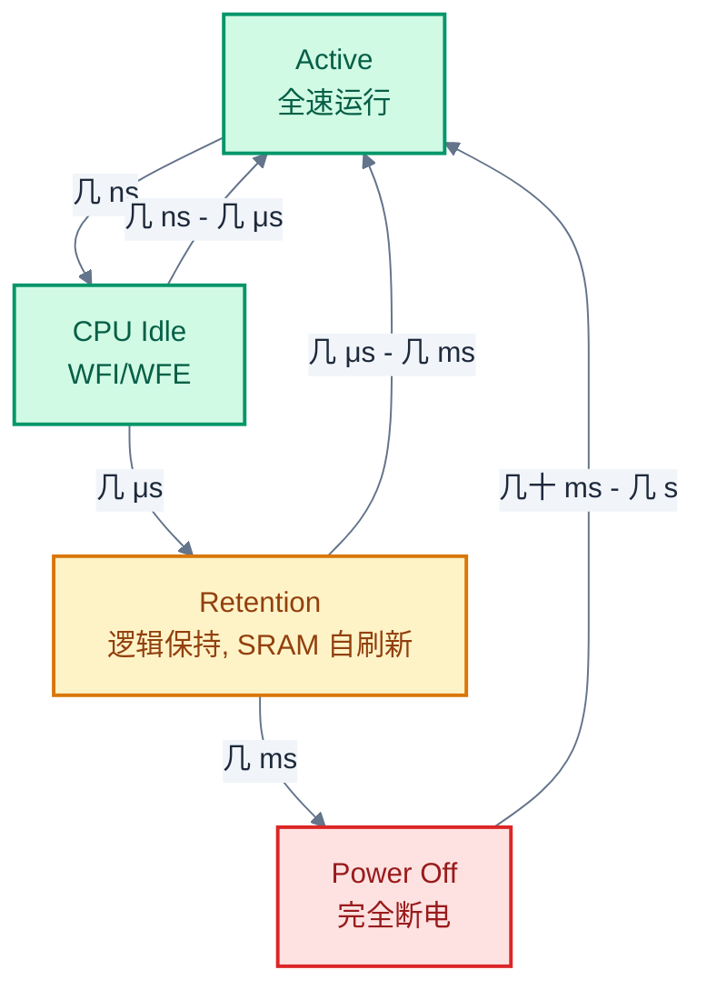
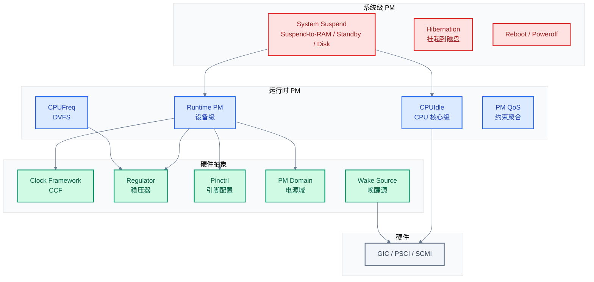
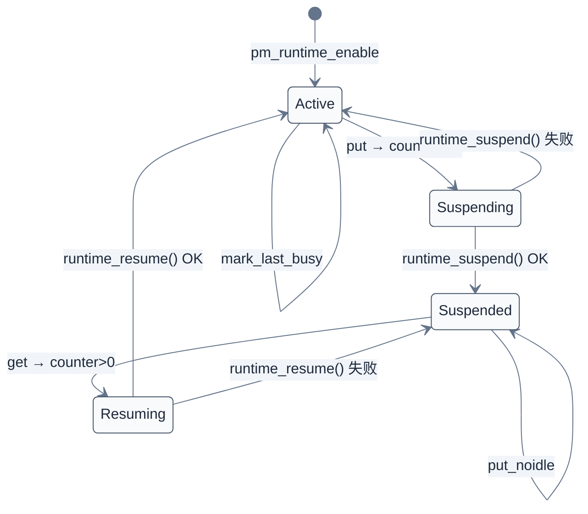
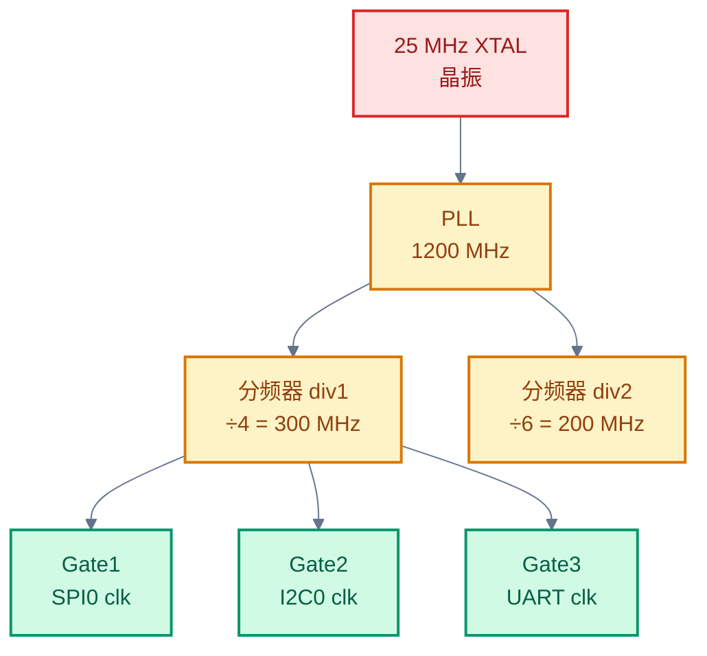
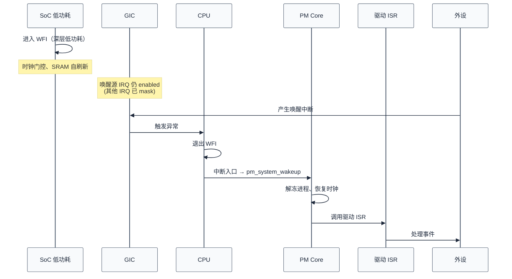
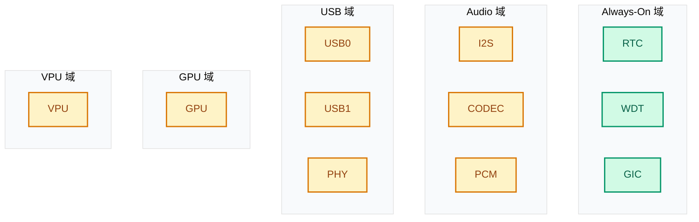

# 电源管理与功耗调优

> 把前八章散落的电源管理话题集中起来深入展开：Linux Runtime PM、System PM、Clock 框架、Regulator、Pinctrl、Wake Source、CPUIdle/CPUFreq、PM Domain、各协议驱动 PM 实现、Zephyr PM 子系统、功耗测量与调优。前八章按协议/性能维度讲，本篇按"功耗"这一横切维度讲——嵌入式设备的续航、热设计、稳定性最终都汇聚到电源管理这一底层机制。
>
> **工程师视角**：把设备待机功耗从 100 mW 降到 5 mW、把 SoC 温度从 75°C 降到 55°C、把唤醒延迟从 50 ms 降到 5 ms——这些不是"芯片更好"带来的，是 runtime PM、clock gating、regulator 模式切换、PM Domain 协同优化的结果。理解电源管理是嵌入式低功耗工程师的核心能力。

### 关键术语

| 缩写 | 全称 | 含义 |
|------|------|------|
| PM | Power Management | 电源管理 |
| RPM | Runtime Power Management | 运行时电源管理 |
| ASPM | Active State Power Management | 活跃状态电源管理（PCIe） |
| SoC | System on Chip | 片上系统 |
| CCF | Common Clock Framework | Linux 通用时钟框架 |
| PLL | Phase Locked Loop | 锁相环 |
| OPP | Operating Performance Point | 性能-电压对 |
| DVFS | Dynamic Voltage and Frequency Scaling | 动态电压频率调节 |
| P-state | Performance state | 性能状态 |
| C-state | (CPU) Power state | CPU 低功耗状态 |
| ACPI | Advanced Configuration and Power Interface | 高级配置与电源接口 |
| S-state | ACPI System state | 系统电源状态（S0/S3/S5 等） |
| GIC | Generic Interrupt Controller | ARM 通用中断控制器 |
| WFI | Wait For Interrupt | 等待中断（ARM 指令） |
| WFE | Wait For Event | 等待事件（ARM 指令） |
| GPIO | General Purpose Input/Output | 通用 IO |
| Pinctrl | Pin Controller | 引脚控制器 |
| regulator | — | 稳压器（Linux 子系统） |
| PMIC | Power Management IC | 电源管理芯片 |
| CPUIdle | — | Linux CPU 空闲状态子系统 |
| CPUFreq | — | Linux CPU 频率调节子系统 |
| PM QoS | PM Quality of Service | PM 服务质量约束 |
| SCMI | System Control and Management Interface | ARM 系统控制管理接口 |
| PSCI | Power State Coordination Interface | ARM 电源状态协调接口 |
| SMC | Secure Monitor Call | 安全监控调用（ARM 指令） |

### 前置知识

| 需要了解 | 参考文档 |
|----------|----------|
| 五种协议的基本工作原理 | [00-通信协议总览](./00-通信协议总览.md) ~ [05-SDIO-eMMC协议与驱动](./05-SDIO-eMMC协议与驱动.md) |
| 协议对比与选型 | [06-协议对比与选型](./06-协议对比与选型.md) |
| 性能调优与 DMA | [07-性能调优与DMA深入](./07-性能调优与DMA深入.md) |
| 中断处理与延迟 | [08-中断处理与延迟优化](./08-中断处理与延迟优化.md) |

---

## 1. 电源管理总览：从硬件状态到软件框架

> 第八章讲中断时，中断处理需要 CPU 处于活跃状态。但 CPU 大部分时间在空闲——这时应该让 CPU 进入低功耗状态。本章先建立完整的电源管理全景：硬件状态、软件框架、Linux/Zephyr 的差异。

### 1.1 功耗从哪里来

嵌入式 SoC 的功耗由几部分组成：

| 劏耗来源 | 占比（典型） | 控制方式 |
|----------|-------------|---------|
| 动态功耗（开关电容） | 60-80% | 降频、降压、关 clock |
| 静态功耗（漏电） | 10-30% | 关电源、关 power island |
| IO 功耗（外设驱动） | 5-15% | pinctrl 配置、关 IO |
| 模拟功耗（PLL/ADC/DAC） | 5-10% | 关 PLL、闲置模块 |

**动态功耗公式**：

$$P_{\text{dynamic}} = \alpha \cdot C \cdot V^2 \cdot f$$

- $\alpha$：活动因子（0-1，反映电路翻转频率）
- $C$：电容
- $V$：电压
- $f$：频率

> **核心要点**：电压是平方项，降电压收益最大。频率是线性项，降频率也有效但收益小。降频后可以同时降电压（OPP 表），收益最大。

#### 数值演算：1.2 V → 0.8 V 的功耗节省

假设某 CPU 模块在 $V_1 = 1.2\text{V}$、$f_1 = 1.5\text{GHz}$ 下动态功耗为 500 mW。如果切到 OPP 低电压档 $V_2 = 0.8\text{V}$、$f_2 = 1.0\text{GHz}$：

$$P_2 = P_1 \cdot \frac{V_2^2 \cdot f_2}{V_1^2 \cdot f_1} = 500 \text{mW} \cdot \frac{0.8^2 \cdot 1.0}{1.2^2 \cdot 1.5} = 500 \cdot \frac{0.64}{2.16} \approx 148 \text{mW}$$

节省 70% 功耗。这就是 DVFS 的核心收益。

### 1.2 硬件低功耗状态层级

从浅到深的低功耗状态：



| 状态 | 唤醒延迟 | 功耗节省 | 应用场景 |
|------|---------|---------|---------|
| Active | — | 0% | 正常运行 |
| Idle（WFI） | < 1 μs | 10-30% | 中断间隙 |
| Retention | 10-100 μs | 50-80% | 短期待机 |
| Power Off | 1-100 ms | 95-99% | 长期待机、深度睡眠 |

### 1.3 Linux 电源管理子系统组成



### 1.4 Zephyr PM 子系统对比

Zephyr 的 PM 设计哲学不同——追求确定性、低开销，而非通用性：

| 维度 | Linux | Zephyr |
|------|-------|--------|
| 系统级 PM | Suspend-to-RAM/Disk/Standby | PM_STATE_RUNTIME_IDLE ~ PM_STATE_SOFT_OFF |
| 设备级 PM | Runtime PM（每设备独立） | `pm_device` + runtime（可选） |
| CPU 空闲 | CPUIdle + cpuidle driver | idle thread + `pm_system_suspend` |
| 频率调节 | CPUFreq + governor | 无（一般固定频率） |
| PM QoS | 完整 PM QoS 框架 | 简化版 `pm_policy_state_lock` |
| Clock 框架 | CCF（复杂） | 简单的 clock 控制 API |
| Regulator | 完整框架 | 简化的 `regulator` API |

> **核心要点**：Linux PM 是"通用框架+多种状态"，复杂但灵活；Zephyr PM 是"RTOS 适配+简化状态"，简单但够用。理解两者差异，移植驱动时才能正确处理 PM 部分。

---

## 2. Linux Runtime PM：设备级电源管理

> 第一章建立了 PM 全景。本章深入 Runtime PM——Linux 设备级 PM 的核心机制。Runtime PM 让每个设备独立管理自己的电源状态：用时上电、闲时下电，无需等系统级挂起。

### 2.1 Runtime PM 的核心思想

**问题**：传统 System PM 需要整个系统挂起，唤醒延迟大（几十 ms 到几秒）。但很多场景下，单个设备可以独立挂起——例如 SPI Flash 读取完成后，SPI 控制器可以立即关 clock，等下次访问再开。

**解决方案**：Runtime PM。每个设备有：
- **usage counter**：引用计数。`pm_runtime_get` 加 1，`pm_runtime_put` 减 1
- **state**：`active` / `suspended` / `suspending` / `resuming`
- **autosuspend delay**：闲后多少 ms 才真正挂起（避免频繁切换）

### 2.2 核心 API

来自 [pm_runtime.h:490-540](file:///home/pbw/2042f/linux/include/linux/pm_runtime.h#L490-L540)：

```c
/* 异步 get：递增计数，异步发起 resume */
static inline int pm_runtime_get(struct device *dev)
{
    return __pm_runtime_resume(dev, RPM_GET_PUT | RPM_ASYNC);
}

/* 同步 get：递增计数，同步等待 resume 完成 */
static inline int pm_runtime_get_sync(struct device *dev)
{
    return __pm_runtime_resume(dev, RPM_GET_PUT);
}

/* 推荐 get：递增计数，同步 resume，失败时回滚计数 */
static inline int pm_runtime_resume_and_get(struct device *dev)
{
    return pm_runtime_get_active(dev, 0);  // 失败时 put_noidle
}

/* 异步 put：递减计数，0 时异步发起 suspend */
static inline void pm_runtime_put(struct device *dev)
{
    __pm_runtime_suspend(dev, RPM_GET_PUT | RPM_ASYNC);
}

/* autosuspend put：递减计数，0 时启动 autosuspend 定时器 */
static inline int pm_runtime_put_autosuspend(struct device *dev)
{
    return __pm_runtime_suspend(dev, RPM_GET_PUT | RPM_ASYNC);
}
```

#### `pm_runtime_mark_last_busy`

来自 [pm_runtime.h:226-236](file:///home/pbw/2042f/linux/include/linux/pm_runtime.h#L226-L236)：

```c
static inline void pm_runtime_mark_last_busy(struct device *dev)
{
    WRITE_ONCE(dev->power.last_busy, ktime_get_to_ns());
}
```

更新"最后活动时间"，autosuspend timer 基于这个时间计算"已经空闲多久"。

#### autosuspend 配置

```c
/* 启用 autosuspend 模式（put 时启动 timer 而非立即挂起） */
pm_runtime_use_autosuspend(dev);

/* 设置 autosuspend 延迟（ms） */
pm_runtime_set_autosuspend_delay(dev, 1000);  // 1 秒后挂起

/* 在 dev_pm_ops 中调用 mark_last_busy 维持活跃 */
```

### 2.3 `struct dev_pm_ops`：驱动 PM 回调集

来自 [pm.h:288-312](file:///home/pbw/2042f/linux/include/linux/pm.h#L288-L312)：

```c
struct dev_pm_ops {
    int (*prepare)(struct device *dev);
    void (*complete)(struct device *dev);

    /* System PM */
    int (*suspend)(struct device *dev);
    int (*resume)(struct device *dev);
    int (*freeze)(struct device *dev);
    int (*thaw)(struct device *dev);
    int (*poweroff)(struct device *dev);
    int (*restore)(struct device *dev);

    /* Runtime PM */
    int (*runtime_suspend)(struct device *dev);
    int (*runtime_resume)(struct device *dev);
    int (*runtime_idle)(struct device *dev);

    /* ... 更多 callback ... */
};
```

#### 宏简化定义

```c
#define SET_RUNTIME_PM_OPS(suspend_fn, resume_fn, idle_fn) \
    .runtime_suspend = suspend_fn, \
    .runtime_resume = resume_fn, \
    .runtime_idle = idle_fn,

#define SET_SYSTEM_SLEEP_PM_OPS(suspend_fn, resume_fn) \
    .suspend = suspend_fn, \
    .resume = resume_fn, \
    .freeze = suspend_fn, \
    .thaw = resume_fn, \
    .poweroff = suspend_fn, \
    .restore = resume_fn,
```

### 2.4 Runtime PM 状态机



### 2.5 Runtime PM 的"三种调用模式"

| 模式 | 含义 | 典型场景 |
|------|------|---------|
| Sync（同步） | 调用者等待操作完成 | 必须立即访问设备 |
| Async（异步） | 提交到 PM workqueue 异步处理 | 可以后台 resume |
| No-op | 只更新计数，不实际操作 | `pm_runtime_get_noresume` |

```c
/* 驱动初始化时 */
pm_runtime_get_noresume(dev);   // 防止在 probe 中被挂起
/* ... probe 工作 ... */
pm_runtime_put_noidle(dev);     // 标记 probe 完成

pm_runtime_set_active(dev);     // 标记为 active（设备已上电）
pm_runtime_enable(dev);         // 启用 runtime PM
pm_runtime_use_autosuspend(dev);
pm_runtime_set_autosuspend_delay(dev, 1000);
```

### 2.6 Runtime PM 的引用计数陷阱

#### 陷阱 1：get 失败未 put

```c
// 错误代码
ret = pm_runtime_get_sync(dev);
if (ret < 0)
    return ret;  // 计数已经 +1，但没 put，导致永远 active
// 正确：
ret = pm_runtime_get_sync(dev);
if (ret < 0) {
    pm_runtime_put_noidle(dev);  // 失败也要 put_noidle
    return ret;
}
```

**推荐用 `pm_runtime_resume_and_get`**，它内部已经处理失败回滚。

#### 陷阱 2：probe 中 get 但 remove 中忘 put

```c
static int my_probe(struct platform_device *pdev)
{
    pm_runtime_get_sync(dev);  // +1
    /* ... */
}

static int my_remove(struct platform_device *pdev)
{
    /* 忘了 pm_runtime_put */
    /* 设备永远 active，PM 失效 */
}
```

#### 陷阱 3：autosuspend 时长不当

- 太短：频繁挂起/恢复，开销大于收益
- 太长：低功耗机会错失

经验值：外设控制器 100-1000 ms，存储设备 1000-3000 ms。

> **核心要点**：Runtime PM 是设备级 PM 的基石。掌握 `get/put/autosuspend` 三件套和引用计数管理，就能让设备在不影响功能的前提下自动进入低功耗状态。

---

## 3. Linux System PM：系统级挂起与恢复

> 第二章讲了设备级 Runtime PM。本章讲系统级 PM——当用户执行 `echo mem > /sys/power/state` 时，整个系统如何挂起到 RAM、如何恢复。

### 3.1 系统电源状态

| 状态 | 含义 | 唤醒延迟 | 功耗 |
|------|------|---------|------|
| `freeze` | 冻结用户空间，CPU 进入 idle | 几十 ms | 中等 |
| `standby` | 挂起到 standby（ACPI S1） | 几十 ms | 低 |
| `mem` | 挂起到 RAM（ACPI S3） | 几百 ms - 几秒 | 极低 |
| `disk` | 挂起到磁盘（ACPI S4，hibernation） | 几秒 | 几乎为 0 |

ARM 平台主要用 `mem`（Suspend-to-RAM）。

### 3.2 Suspend 流程

```mermaid
%%{init: {"theme": "base", "themeVariables": {"primaryColor": "#f8fafc", "primaryTextColor": "#1e293b", "primaryBorderColor": "#475569", "lineColor": "#64748b", "secondaryColor": "#f1f5f9", "secondaryBorderColor": "#94a3b8", "tertiaryColor": "#f8fafc", "fontFamily": "\"trebuchet ms\", verdana, arial, sans-serif"}}}%%
flowchart TD
    USER[用户空间<br/>echo mem > state] --> FREEZE[冻结用户进程<br/>freeze_processes]
    FREEZE --> SYNC[同步文件系统<br/>sync]
    SYNC --> PREPARE[设备 prepare 阶段<br/>bus_type.pm.prepare]
    PREPARE --> SUSPEND[设备 suspend 阶段<br/>bus_type.pm.suspend]
    SUSPEND --> LATE[设备 suspend_late 阶段<br/>bus_type.pm.suspend_late]
    LATE --> NOIRQ[设备 suspend_noirq 阶段<br/>bus_type.pm.suspend_noirq]
    NOIRQ --> SYSDEVICE[系统设备挂起<br/>sysdev_suspend]
    SYSDEVICE --> CPU[CPU 离线 + 进入 WFI]
    CPU --> OFF[SoC 进入低功耗<br/>PSCI suspend]

    OFF --> WAKE[唤醒源中断]
    WAKE --> RESUME_CPU[CPU 恢复]
    RESUME_CPU --> RESUME_NOIRQ[设备 resume_noirq]
    RESUME_NOIRQ --> RESUME_EARLY[设备 resume_early]
    RESUME_EARLY --> RESUME[设备 resume]
    RESUME --> COMPLETE[设备 complete]
    COMPLETE --> THAW[解冻用户进程]

classDef userspace fill:#fee2e2, stroke:#dc2626, color:#991b1b, stroke-width:2px;
classDef kernel fill:#dbeafe, stroke:#2563eb, color:#1e40af, stroke-width:2px;
classDef cpu fill:#d1fae5, stroke:#059669, color:#065f46, stroke-width:2px;
classDef off fill:#fef3c7, stroke:#d97706, color:#92400e, stroke-width:2px;
class USER,FREEZE,SYNC userspace;
class PREPARE,SUSPEND,LATE,NOIRQ,SYSDEVICE,RESUME_NOIRQ,RESUME_EARLY,RESUME,COMPLETE,THAW kernel;
class CPU,RESUME_CPU cpu;
class OFF,WAKE off;
```



### 3.3 三阶段 PM 回调

System PM 把每个设备的挂起/恢复分成三个阶段：

| 阶段 | 挂起时 | 恢复时 | 上下文 |
|------|--------|--------|--------|
| `prepare` / `complete` | 设备准备（如刷新缓存） | 设备完成 | 进程上下文，可睡眠 |
| `suspend` / `resume` | 主要挂起逻辑 | 主要恢复逻辑 | 进程上下文，可睡眠 |
| `suspend_late` / `resume_early` | 系统即将完全停止 | 系统刚开始恢复 | 进程上下文，IRQ 已禁 |
| `suspend_noirq` / `resume_noirq` | IRQ 完全不可用 | IRQ 仍不可用 | 进程上下文，无 IRQ |

驱动通常用 `SET_SYSTEM_SLEEP_PM_OPS` 宏只设置 `suspend`/`resume`，少数需要 `late`/`noirq` 处理特殊场景。

### 3.4 Runtime PM 与 System PM 的协作

System PM 挂起时会先调用每个设备的 `pm_runtime_suspend`，让设备进入 suspended 状态。System PM resume 时不会自动 `pm_runtime_resume`——设备保持 suspended，等下次访问时由 Runtime PM 恢复。

```c
/* 驱动中典型的 suspend 实现 */
static int my_suspend(struct device *dev)
{
    /* 如果设备已经 runtime suspended，跳过 */
    if (pm_runtime_suspended(dev))
        return 0;

    /* 否则做实际挂起 */
    return my_runtime_suspend(dev);
}

static int my_resume(struct device *dev)
{
    /* 如果挂起前是 runtime suspended，不主动恢复 */
    if (pm_runtime_suspended(dev))
        return 0;

    return my_runtime_resume(dev);
}
```

### 3.5 `pm_message_t` 与 `power.event`

PM 回调的参数 `pm_message_t` 包含 event 字段：

```c
typedef struct pm_message {
    int event;
} pm_message_t;

#define PM_EVENT_SUSPEND     0x0001  // 系统挂起到 RAM
#define PM_EVENT_RESUME      0x0002  // 系统 resume
#define PM_EVENT_FREEZE      0x0004  // 冻结（无设备电源改变）
#define PM_EVENT_QUIESCE     0x0008  // 静默
#define PM_EVENT_HIBERNATE   0x0010  // 休眠到磁盘
#define PM_EVENT_THAW        0x0020  // 解冻
#define PM_EVENT_RESTORE     0x0040  // 恢复
#define PM_EVENT_RECOVER     0x0080  // 恢复
/* AUTO 系列（runtime PM 触发） */
#define PM_EVENT_USER        0x0100
#define PM_EVENT_REMOTE      0x0200
#define PM_EVENT_AUTO        0x0400
```

驱动根据 event 类型做不同处理（如 hibernate 不需要保存硬件状态到内存，但需要刷新到磁盘）。

### 3.6 `dpm_suspend` / `dpm_resume`

System PM 的核心由 `drivers/base/power/main.c` 实现：

```c
// 简化逻辑
int dpm_suspend(pm_message_t state)
{
    /* 1. 遍历 dpm_list，调用每个设备的 prepare */
    list_for_each_entry(dev, &dpm_list, power.entry) {
        dev->bus->pm->prepare(dev);
    }

    /* 2. 遍历，调用 suspend */
    list_for_each_entry(dev, &dpm_list, power.entry) {
        dev->bus->pm->suspend(dev);
    }

    /* 3. 遍历，调用 suspend_late */
    /* 4. 遍历，调用 suspend_noirq */
}

int dpm_resume(pm_message_t state)
{
    /* 反向遍历，依次调用 resume_noirq → resume_early → resume → complete */
}
```

> **核心要点**：System PM 把挂起/恢复分成 4 个阶段（prepare/suspend/late/noirq），驱动按需实现。Runtime PM 与 System PM 协作——已 runtime suspended 的设备在 system suspend 时跳过实际硬件操作。

---

## 4. Clock 框架：CCF 深入

> 第一章讲到动态功耗的两大杠杆是电压和频率。频率由 clock 子系统控制——本章深入 Linux Common Clock Framework（CCF）。

### 4.1 CCF 的设计目标

**问题**：传统 SoC 上每个驱动直接读写时钟寄存器，导致：
- 多个驱动同时改时钟，互相冲突
- 时钟拓扑不可见，无法 debug
- 时钟启停无法引用计数
- 父时钟切换时子时钟的依赖不可控

**解决方案**：CCF（Common Clock Framework）。把所有时钟抽象为 `struct clk`，建立父子拓扑，提供统一的 `clk_prepare_enable` / `clk_disable_unprepare` / `clk_set_rate` API。

### 4.2 `struct clk` 和 `struct clk_hw`

CCF 把时钟分成两层：

| 层 | 数据结构 | 作用 |
|----|---------|------|
| 消费者层 | `struct clk` | 驱动用，引用计数、prepare/enable 状态 |
| 提供者层 | `struct clk_hw` | clock driver 实现，包含具体硬件操作 |

```c
// include/linux/clk.h
struct clk {
    const char *name;
    struct clk_core *core;  // 内部核心结构
    struct device *dev;
    struct clk *parent;
    /* ... */
};

// include/linux/clk-provider.h
struct clk_hw {
    struct clk_core *core;
    struct clk *clk;
    const struct clk_init_data *init;
};

struct clk_ops {
    int     (*prepare)(struct clk_hw *hw);
    void    (*unprepare)(struct clk_hw *hw);
    int     (*enable)(struct clk_hw *hw);
    void    (*disable)(struct clk_hw *hw);
    int     (*is_enabled)(struct clk_hw *hw);
    unsigned long (*recalc_rate)(struct clk_hw *hw, unsigned long parent_rate);
    long    (*round_rate)(struct clk_hw *hw, unsigned long rate, unsigned long *parent_rate);
    int     (*set_rate)(struct clk_hw *hw, unsigned long rate, unsigned long parent_rate);
    int     (*set_parent)(struct clk_hw *hw, u8 index);
    u8      (*get_parent)(struct clk_hw *hw);
    /* ... */
};
```

### 4.3 `prepare` vs `enable` 的分离

为什么 `clk_prepare_enable` 有两步？

| 步骤 | 上下文 | 典型操作 |
|------|--------|---------|
| `prepare` | 进程上下文（可睡眠） | 等待 PLL 锁定、配置慢速寄存器 |
| `enable` | 任何上下文（不可睡眠） | 写 clock gate 寄存器（单个寄存器位） |

分离的原因：有些时钟操作很慢（PLL 锁定需要几百 μs），不能在硬中断上下文做。`prepare` 在进程上下文预先做完慢操作，`enable` 只做最快的门控。

### 4.4 时钟拓扑示例



**关键概念**：
- **父时钟**：`PLL` 是 `DIV1` 的父时钟
- **rate propagation**：`clk_set_rate(DIV1, 300M)` 会向上找能调整的父时钟（PLL）
- **gate propagation**：`clk_enable(GATE1)` 会先 ensure PLL 已 enable、DIV1 已 enable，最后 enable GATE1

### 4.5 消费者 API

```c
struct clk *clk;

/* 获取时钟 */
clk = devm_clk_get(dev, "ssp_clk");  // 从 DT 获取
if (IS_ERR(clk))
    return PTR_ERR(clk);

/* 启用时钟 */
ret = clk_prepare_enable(clk);
if (ret)
    return ret;

/* 设置频率 */
ret = clk_set_rate(clk, 50000000);  // 50 MHz
unsigned long actual_rate = clk_get_rate(clk);

/* 释放时钟 */
clk_disable_unprepare(clk);
/* devm 自动 free */
```

### 4.6 Clock 调试

```bash
# 查看时钟树
cat /sys/kernel/debug/clk/clk_summary
#                                 enable  prepare  protect                                duty  hardware
#    clock                          count    count    count      rate        accuracy phase  enable
# ---------------------------------------------------------------------------------------
#  xtal                                4        4        0   25000000          0     0  Y
#     pll                              3        3        0 1200000000          0     0  Y
#        div1                           3        3        0  300000000          0     0  Y
#           spi0_clk                    1        1        0  300000000          0     0  Y
#           i2c0_clk                    1        1        0  300000000          0     0  Y
#        div2                           0        0        0  200000000          0     0  Y

# 查看具体时钟
cat /sys/kernel/debug/clk/spi0_clk/clk_rate
cat /sys/kernel/debug/clk/spi0_clk/clk_parent
cat /sys/kernel/debug/clk/spi0_clk/clk_flags
```

> **核心要点**：CCF 把时钟抽象为有父子关系的图，提供统一的 prepare/enable/set_rate API。驱动只调 `clk_prepare_enable`，CCF 自动处理父时钟依赖。调试用 `/sys/kernel/debug/clk/clk_summary`。

---

## 5. Regulator 框架：电压管理

> 第四章讲了 clock（频率）。本章讲 regulator（电压）。两者协同实现 DVFS——降频同时降压，收益最大。

### 5.1 Regulator 的作用

`struct regulator` 抽象电源稳压器：
- 启用/禁用（power on/off）
- 设置电压
- 设置电流限制
- 设置工作模式（PWM / PFM / auto）

### 5.2 消费者 API

来自 `include/linux/regulator/consumer.h`：

```c
struct regulator *reg;

/* 获取 */
reg = devm_regulator_get(dev, "vdd");
reg = devm_regulator_get_optional(dev, "vdd");  // 可选，找不到不报错

/* 启用 */
ret = regulator_enable(reg);
regulator_disable(reg);

/* 设置电压 */
int min_uV = 1100000, max_uV = 1300000;
ret = regulator_set_voltage(reg, min_uV, max_uV);

/* 获取当前电压 */
int uV = regulator_get_voltage(reg);

/* 设置工作模式 */
regulator_set_mode(reg, REGULATOR_MODE_FAST);   // PWM，性能高功耗大
regulator_set_mode(reg, REGULATOR_MODE_NORMAL); // 自动切换
regulator_set_mode(reg, REGULATOR_MODE_IDLE);   // PFM，低负载省电
```

### 5.3 Regulator 与 OPP

OPP（Operating Performance Point）表把"频率-电压"配对：

```dts
&cpu0 {
    operating-points-v2 = <&cpu0_opp_table>;

    cpu0_opp_table: opp-table {
        compatible = "operating-points-v2";

        opp-408000000 {
            opp-hz = /bits/ 64 <408000000>;
            opp-microvolt = <950000 950000 975000>;
            opp-supported-hw = <0x1>;
        };
        opp-816000000 {
            opp-hz = /bits/ 64 <816000000>;
            opp-microvolt = <1050000 1050000 1075000>;
            opp-supported-hw = <0x1>;
        };
        opp-1200000000 {
            opp-hz = /bits/ 64 <1200000000>;
            opp-microvolt = <1150000 1150000 1225000>;
            opp-supported-hw = <0x1>;
        };
    };
};
```

CPUFreq 在切换频率时通过 OPP 表自动调用 regulator 切换电压。

### 5.4 Regulator 模式

| 模式 | 含义 | 适用场景 |
|------|------|---------|
| `REGULATOR_MODE_FAST` | PWM 模式，纹波小但效率低（轻载） | 高性能 |
| `REGULATOR_MODE_NORMAL` | 自动 PWM/PFM 切换 | 通用 |
| `REGULATOR_MODE_IDLE` | PFM 模式，轻载高效 | 低功耗待机 |
| `REGULATOR_MODE_STANDBY` | 极低功耗模式 | 深度待机 |

待机时把 regulator 切到 IDLE 模式，可以节省 10-30% 的电源芯片自身功耗。

> **核心要点**：Regulator 框架抽象电压控制，与 Clock 框架协同实现 DVFS。OPP 表把频率-电压对绑定，CPUFreq 切换频率时自动调压。低功耗场景下 regulator 模式切换是额外节能点。

---

## 6. Pinctrl 与睡眠引脚配置

> 第四五章讲了 clock 和 regulator。但外设的引脚（GPIO 复用）也是功耗源——本章讲 pinctrl 如何管理引脚的低功耗状态。

### 6.1 Pinctrl 的状态

Pinctrl 框架允许同一组引脚有多个状态：

| 状态 | 含义 |
|------|------|
| `default` | 默认功能（如 SPI 的 MOSI/MISO/CLK/CS） |
| `sleep` | 睡眠状态（引脚配置为输入下拉/上拉，关闭驱动） |
| `idle` | 空闲状态（介于 default 和 sleep 之间） |
| `init` | 初始状态（probe 之前） |

### 6.2 设备树配置

```dts
&spi0 {
    pinctrl-names = "default", "sleep";
    pinctrl-0 = <&spi0_pins_default>;
    pinctrl-1 = <&spi0_pins_sleep>;

    /* ... */
};

/* 默认状态：SPI 功能 */
spi0_pins_default: spi0-pins-default {
    pinmux = <PINMUX_GPIO10_FUNC_SPI0_MOSI>,
             <PINMUX_GPIO11_FUNC_SPI0_MISO>,
             <PINMUX_GPIO12_FUNC_SPI0_CLK>,
             <PINMUX_GPIO13_FUNC_SPI0_CS>;
    drive-strength = <8>;  /* 驱动强度 8 mA */
    bias-disable;          /* 无上下拉 */
};

/* 睡眠状态：引脚配置为输入下拉，关闭驱动 */
spi0_pins_sleep: spi0-pins-sleep {
    pinmux = <PINMUX_GPIO10_FUNC_GPIO>,
             <PINMUX_GPIO11_FUNC_GPIO>,
             <PINMUX_GPIO12_FUNC_GPIO>,
             <PINMUX_GPIO13_FUNC_GPIO>;
    input-enable;
    bias-pull-down;        /* 下拉 */
};
```

### 6.3 Pinctrl PM API

```c
// include/linux/pinctrl/pinctrl-state.h
int pinctrl_pm_select_default_state(struct device *dev);
int pinctrl_pm_select_sleep_state(struct device *dev);
int pinctrl_pm_select_idle_state(struct device *dev);
int pinctrl_pm_select_state(struct device *dev, struct pinctrl_state *state);
```

#### 驱动典型用法

```c
static int my_runtime_suspend(struct device *dev)
{
    /* ... 关 clock 等 ... */
    return pinctrl_pm_select_sleep_state(dev);
}

static int my_runtime_resume(struct device *dev)
{
    int ret = pinctrl_pm_select_default_state(dev);
    if (ret)
        return ret;
    /* ... 开 clock 等 ... */
    return 0;
}
```

### 6.4 引脚功耗的来源

引脚在以下情况会消耗额外功耗：

1. **浮空输入**：引脚电平不确定，输入缓冲器反复翻转，消耗动态功耗
   - 解决：上拉或下拉

2. **未关闭的输出**：输出驱动一个高电平到外部低电平负载
   - 解决：睡眠时改为输入或下拉

3. **高驱动强度**：驱动强度越大，翻转时短路电流越大
   - 解决：根据负载选择最小够用的驱动强度

4. **未使用的 GPIO**：默认可能是输入浮空
   - 解决：在 DT 中显式配置为输入下拉

> **核心要点**：Pinctrl 不只是引脚复用，也是功耗管理的一部分。睡眠时把外设引脚切到 sleep 状态（输入下拉/上拉），可以避免引脚浮空导致的功耗浪费。

---

## 7. Wake Source：唤醒源管理

> 第六章讲了睡眠时的引脚配置。但设备睡眠后必须能被唤醒——本章讲 wake source 机制。

### 7.1 唤醒源类型

| 唤醒源 | 机制 | 典型场景 |
|--------|------|---------|
| 中断 | IRQ 触发唤醒 | 网卡 RX、按键、SDIO 卡插入 |
| GPIO | GPIO 中断 | 按键、外设中断信号 |
| RTC | 定时唤醒 | 周期性唤醒 |
| Alarm | 高精度定时器 | 周期性任务 |
| 调试串口 | 串口 RX 触发 | 调试场景 |

### 7.2 设备唤醒 API

```c
// include/linux/pm_wakeup.h

/* 初始化设备为可唤醒源 */
int device_init_wakeup(struct device *dev, bool enable);

/* 查询设备是否允许唤醒 */
bool device_may_wakeup(const struct device *dev);

/* 启用/禁用设备的唤醒能力 */
int dev_pm_enable_wake_irq(struct device *dev);
int dev_pm_disable_wake_irq(struct device *dev);

/* 启用/禁用中断唤醒 */
int enable_irq_wake(unsigned int irq);
int disable_irq_wake(unsigned int irq);
```

### 7.3 唤醒流程



### 7.4 唤醒源调试

```bash
# 查看唤醒源统计
cat /sys/kernel/debug/wakeup_sources
# name           active_count   event_count   wakeup_count   expire_count   active_since       total_time         max_time       last_time        prevent_suspend_time
# dwc3.0.auto             0            0              0             0              0                  0                  0                0                       0
# 1c2b400.i2c             0            0              0             0              0                  0                  0                0                       0
# gpio-keys               5           12              5             0              0            1234567           234567           234567                       0

# 查看可唤醒设备
ls /sys/devices/platform/.../power/wakeup
# active_count  max_time  total_time  ...
# echo enabled > /sys/devices/.../power/wakeup  # 启用唤醒
# echo disabled > /sys/devices/.../power/wakeup # 禁用唤醒
```

`active_count` 是该唤醒源被触发的次数。`wakeup_count` 是真正导致系统从 suspend 恢复的次数（如果唤醒时系统已 suspend）。

### 7.5 配置唤醒源

#### 设备树

```dts
&i2c0 {
    /* 启用 i2c0 作为唤醒源 */
    wakeup-source;
};

&gpio_keys {
    compatible = "gpio-keys";
    /* ... */
    button@0 {
        label = "Power";
        gpios = <&gpio1 5 GPIO_ACTIVE_LOW>;
        linux,code = <KEY_POWER>;
        wakeup-source;  /* 此按键可唤醒系统 */
        wakeup-event-action = <EV_ACT_ASSERTED>;
    };
};
```

#### 驱动中启用唤醒

```c
static int my_probe(struct platform_device *pdev)
{
    /* 启用设备唤醒能力 */
    device_init_wakeup(dev, true);

    /* 在 system suspend 时，调用 enable_irq_wake 让 IRQ 能唤醒 */
    /* 通常 dev_pm_ops.suspend 中调用 */
}

static int my_suspend(struct device *dev)
{
    if (device_may_wakeup(dev))
        enable_irq_wake(dev->irq);
    return 0;
}

static int my_resume(struct device *dev)
{
    if (device_may_wakeup(dev))
        disable_irq_wake(dev->irq);
    return 0;
}
```

> **核心要点**：唤醒源是系统从低功耗恢复的关键。`device_init_wakeup` 启用能力，`enable_irq_wake` 让具体 IRQ 能在 suspend 状态下唤醒。调试用 `/sys/kernel/debug/wakeup_sources` 查看触发统计。

---

## 8. CPUIdle 与 CPUFreq：CPU 级 PM

> 前几章讲设备级 PM。本章讲 CPU 级 PM——CPUIdle 让 CPU 进入低功耗状态，CPUFreq 让 CPU 动态调频。

### 8.1 CPUIdle 状态

CPUIdle 把 CPU 的低功耗状态抽象为 C-state：

| C-state | 含义 | 唤醒延迟 | 功耗节省 |
|---------|------|---------|---------|
| C0 | 运行 | 0 | 0% |
| C1 | Halt（WFI） | < 1 μs | 10-30% |
| C2 | Stop clock | 10-100 μs | 30-60% |
| C3 | Sleep（关 PLL） | 100-1000 μs | 60-90% |
| Cn | 更深 | 更长 | 更多 |

#### `struct cpuidle_state`

```c
// include/linux/cpuidle.h
struct cpuidle_state {
    char        name[CPUIDLE_NAME_LEN];
    char        desc[CPUIDLE_DESC_LEN];
    u32         flags;
    unsigned int    exit_latency;     /* 唤醒延迟 ns */
    unsigned int    target_residency; /* 最小驻留时间 ns */
    unsigned int    disabled;
    int (*enter)(struct cpuidle_device *dev, struct cpuidle_driver *drv, int index);
    int (*enter_dead)(struct cpuidle_device *dev, int index);
    /* ... */
};
```

- `exit_latency`：从该状态唤醒的延迟（决定是否能用）
- `target_residency`：进入该状态后至少要驻留多久才划算（避免切换开销超过收益）

### 8.2 CPUIdle Governor

CPUIdle governor 核心是"预测下一个空闲时长"：

- 如果空闲时间短（< 10 μs）：选 C1（WFI）
- 如果空闲时间中等（10 μs - 100 μs）：选 C2
- 如果空闲时间长（> 100 μs）：选 C3

预测算法有 `menu`（默认，基于历史）、`teo`、`ladder`（旧）等。

#### 调试 CPUIdle

```bash
# 查看可用 C-state
cat /sys/devices/system/cpu/cpu0/cpuidle/state*/name
# C0
# C1
# C3

# 查看每个 state 的使用次数
cat /sys/devices/system/cpu/cpu0/cpuidle/state*/usage
# 0
# 12345
# 678

# 查看每个 state 的驻留时间（μs）
cat /sys/devices/system/cpu/cpu0/cpuidle/state*/time
# 0
# 123456
# 78901234

# 禁用某个 state
echo 1 > /sys/devices/system/cpu/cpu0/cpuidle/state3/disable
```

### 8.3 CPUFreq 与 DVFS

CPUFreq 让 CPU 动态切换频率和电压：

```c
// include/linux/cpufreq.h
struct cpufreq_policy {
    struct cpufreq_cpuinfo cpuinfo;
    struct cpufreq_frequency_table *freq_table;
    struct list_head        policy_list;
    struct cpufreq_governor *governor;
    /* ... */
};

struct cpufreq_driver {
    char        name[CPUFREQ_NAME_LEN];
    u8          flags;
    void        (*init)(struct cpufreq_policy *policy);
    void        (*exit)(struct cpufreq_policy *policy);
    int         (*verify)(struct cpufreq_policy_data *policy);
    int         (*setpolicy)(struct cpufreq_policy *policy);
    int         (*target)(struct cpufreq_policy *policy, unsigned int target_freq, unsigned int relation);
    unsigned int (*get)(unsigned int cpu);
    /* ... */
};
```

### 8.4 Governor 类型

| Governor | 行为 | 适用场景 |
|----------|------|---------|
| `performance` | 永远最高频率 | 性能优先 |
| `powersave` | 永远最低频率 | 功耗优先 |
| `userspace` | 用户态控制 | 手动调优 |
| `ondemand` | 监控负载，快速拉高 | 通用（默认） |
| `conservative` | 类似 ondemand 但平滑 | 平衡 |
| `schedutil` | 用调度器信息调频 | 现代默认 |

#### 调试 CPUFreq

```bash
# 查看当前频率
cat /sys/devices/system/cpu/cpu0/cpufreq/scaling_cur_freq
# 1200000

# 查看可用频率
cat /sys/devices/system/cpu/cpu0/cpufreq/scaling_available_frequencies
# 408000 816000 1200000

# 切换 governor
echo schedutil > /sys/devices/system/cpu/cpu0/cpufreq/scaling_governor

# 手动设置频率
echo userspace > /sys/devices/system/cpu/cpu0/cpufreq/scaling_governor
echo 816000 > /sys/devices/system/cpu/cpu0/cpufreq/scaling_setspeed

# 查看切换统计
cat /sys/devices/system/cpu/cpu0/cpufreq/stats/time_in_state
# 408000 12345
# 816000 67890
# 1200000 11111
```

> **核心要点**：CPUIdle 让 CPU 进入低功耗状态（C-state），CPUFreq 让 CPU 动态调频调压（DVFS）。两者协同：CPUIdle 管"空闲时多省电"，CPUFreq 管"工作时多高效"。

---

## 9. PM Domain：电源域管理

> 第八九章讲 CPU 级 PM。但 SoC 上还有多个电源岛（power island）——某些外设可以整组断电。本章讲 PM Domain。

### 9.1 PM Domain 概念

SoC 把外设按物理电源岛分组：



每个电源岛可以独立上电/断电：
- Audio 域不用时整组断电（节省漏电）
- USB 域不用时整组断电
- GPU/VPU 不用时断电

### 9.2 `struct generic_pm_domain`

```c
// include/linux/pm_domain.h
struct generic_pm_domain {
    struct device dev;
    struct dev_pm_domain domain;
    struct list_head gpd_list_node;
    struct list_head master_links;     /* 该 domain 是哪些的父 */
    struct list_head slave_links;       /* 该 domain 依赖哪些 */
    struct list_head dev_list;          /* 该 domain 下的设备 */
    struct lockdep_map dep_map;
    unsigned int state_count;           /* 状态使用计数 */
    unsigned int status_count;          /* 状态保护计数 */
    ktime_t time_in_state[CPUIDLE_STATE_MAX];
    ktime_t account_time;
    int (*power_off)(struct generic_pm_domain *domain);
    int (*power_on)(struct generic_pm_domain *domain);
    unsigned int flags;
    /* ... */
};
```

### 9.3 设备附加到 PM Domain

```c
// 驱动中
int of_genpd_add_provider_simple(struct device_node *np, struct generic_pm_domain *genpd);

// 设备树
&usb0 {
    power-domains = <&usb_pd>;  /* 附加到 usb_pd 电源域 */
    power-domain-names = "default";
};
```

当一个 PM Domain 下所有设备都 runtime suspended 时，PM Domain 自动断电。任一设备 resume 时自动上电整个 domain。

### 9.4 PM Domain 调试

```bash
# 查看所有 PM Domain
ls /sys/kernel/debug/pm_genpd/
# audio_pd  usb_pd  gpu_pd  vpu_pd

# 查看某个 domain 状态
cat /sys/kernel/debug/pm_genpd/usb_pd/status
# Domain  State     Status     Use Count  Device Count  Suspended Devices
# usb_pd  on        Active     0          3             0
```

> **核心要点**：PM Domain 让一组外设共享电源开关——所有设备都 suspended 时整组断电。这是降低漏电功耗的关键机制。

---

## 10. 各协议驱动的 PM 实现

> 前九章讲框架。本章用源码细节看每种协议驱动如何具体实现 PM。

### 10.1 SPI DesignWare 的 PM

SPI DW 驱动用 autosuspend 模式：

```c
// 假想的 dw_spi_pm 实现
static int dw_spi_runtime_suspend(struct device *dev)
{
    struct dw_spi *dws = dev_get_drvdata(dev);

    /* 屏蔽所有中断 */
    dw_spi_mask_intr(dws, 0xff);

    /* 关 clock */
    clk_disable_unprepare(dws->clk);

    /* 切到 sleep pinctrl */
    pinctrl_pm_select_sleep_state(dev);

    /* 关 regulator */
    regulator_disable(dws->vcc);

    return 0;
}

static int dw_spi_runtime_resume(struct device *dev)
{
    struct dw_spi *dws = dev_get_drvdata(dev);
    int ret;

    /* 开 regulator */
    ret = regulator_enable(dws->vcc);
    if (ret)
        return ret;

    /* 切回 default pinctrl */
    pinctrl_pm_select_default_state(dev);

    /* 开 clock */
    ret = clk_prepare_enable(dws->clk);
    if (ret)
        goto err_disable_reg;

    /* 重新初始化硬件 */
    dw_spi_hw_init(dws);

    return 0;

err_disable_reg:
    regulator_disable(dws->vcc);
    return ret;
}

static const struct dev_pm_ops dw_spi_pm_ops = {
    SET_RUNTIME_PM_OPS(dw_spi_runtime_suspend, dw_spi_runtime_resume, NULL)
    SET_SYSTEM_SLEEP_PM_OPS(pm_runtime_force_suspend, pm_runtime_force_resume)
};

/* probe 中 */
static int dw_spi_probe(struct platform_device *pdev)
{
    /* ... */

    pm_runtime_use_autosuspend(dev);
    pm_runtime_set_autosuspend_delay(dev, 250);  /* 250 ms */
    pm_runtime_set_active(dev);
    pm_runtime_enable(dev);

    /* ... */
}
```

**特点**：
- 250 ms autosuspend delay（典型值）
- 传输时通过 `pm_runtime_resume_and_get` 保证 active
- 传输完成通过 `pm_runtime_mark_last_busy + pm_runtime_put_autosuspend` 释放

### 10.2 I2C DesignWare 的 PM

来自 [i2c-designware-platdrv.c](file:///home/pbw/2042f/linux/drivers/i2c/busses/i2c-designware-platdrv.c#L216-L222)：

```c
/* probe 中 */
WARN_ON(pm_runtime_enabled(device));

pm_runtime_set_autosuspend_delay(device, 1000);  /* 1 秒 */
pm_runtime_use_autosuspend(device);
pm_runtime_set_active(device);

/* ... */

/* 传输函数中 */
static int dw_i2c_xfer(struct i2c_adapter *adapter, struct i2c_msg *msgs, int num)
{
    struct dw_i2c_dev *dev = i2c_get_adapdata(adapter);

    /* 必须先 resume */
    ret = pm_runtime_resume_and_get(dev->dev);
    if (ret < 0)
        return ret;

    /* ... 实际传输 ... */

    /* 标记活动，启动 autosuspend timer */
    pm_runtime_mark_last_busy(dev->dev);
    pm_runtime_put_autosuspend(dev->dev);

    return ret;
}
```

**特点**：
- I2C 速率慢、传输短，autosuspend delay 较长（1 秒）
- ISR 中检测 `pm_runtime_suspended`，避免误处理

### 10.3 CAN MCAN 的 PM

来自 [m_can.c:774-786](file:///home/pbw/2042f/linux/drivers/net/can/m_can/m_can.c#L774-L786)：

```c
static int m_can_clk_start(struct m_can_classdev *cdev)
{
    if (cdev->pm_clock_support == 0)
        return 0;

    return pm_runtime_resume_and_get(cdev->dev);
}

static void m_can_clk_stop(struct m_can_classdev *cdev)
{
    if (cdev->pm_clock_support)
        pm_runtime_put_sync(cdev->dev);
}
```

ISR 中检测 PM 状态（[m_can.c:1242](file:///home/pbw/2042f/linux/drivers/net/can/m_can/m_can.c#L1242)）：

```c
static int m_can_interrupt_handler(struct m_can_classdev *cdev)
{
    /* ... */

    if (pm_runtime_suspended(cdev->dev))
        return IRQ_NONE;  /* PM 已挂起，不处理中断 */

    /* ... */
}
```

`m_can_open` 中调用 `m_can_clk_start` 引用时钟，`m_can_close` 中调用 `m_can_clk_stop` 释放。

### 10.4 USB DWC3 的 PM

注册时设置 autosuspend：

```c
// drivers/usb/dwc3/core.c
pm_runtime_use_autosuspend(dev);
pm_runtime_set_autosuspend_delay(dev, DWC3_DEFAULT_AUTOSUSPEND_DELAY);
/* DWC3_DEFAULT_AUTOSUSPEND_DELAY = 500 ms */
```

Runtime PM 实现 [core.c:2617-2680](file:///home/pbw/2042f/linux/drivers/usb/dwc3/core.c#L2617-L2680)：

```c
int dwc3_runtime_suspend(struct dwc3 *dwc)
{
    int ret;

    if (dwc3_runtime_checks(dwc))
        return -EBUSY;  /* 有活跃的 URB，不能挂起 */

    ret = dwc3_suspend_common(dwc, PMSG_AUTO_SUSPEND);
    if (ret)
        return ret;

    return 0;
}
EXPORT_SYMBOL_GPL(dwc3_runtime_suspend);

int dwc3_runtime_resume(struct dwc3 *dwc)
{
    struct device *dev = dwc->dev;
    int ret;

    ret = dwc3_resume_common(dwc, PMSG_AUTO_RESUME);
    if (ret)
        return ret;

    switch (dwc->current_dr_role) {
    case DWC3_GCTL_PRTCAP_DEVICE:
        if (dwc->pending_events) {
            /* 挂起期间收到的事件，重新启用 IRQ */
            pm_runtime_put(dev);
            dwc->pending_events = false;
            enable_irq(dwc->irq_gadget);
        }
        break;
    case DWC3_GCTL_PRTCAP_HOST:
    default:
        break;
    }

    pm_runtime_mark_last_busy(dev);

    return 0;
}
EXPORT_SYMBOL_GPL(dwc3_runtime_resume);

int dwc3_runtime_idle(struct dwc3 *dwc)
{
    struct device *dev = dwc->dev;

    switch (dwc->current_dr_role) {
    case DWC3_GCTL_PRTCAP_DEVICE:
        if (dwc3_runtime_checks(dwc))
            return -EBUSY;
        break;
    case DWC3_GCTL_PRTCAP_HOST:
    default:
        break;
    }

    pm_runtime_autosuspend(dev);

    return 0;
}
```

`dwc3_check_event_buf` 中处理 PM 已挂起但收到中断的情况（[gadget.c:4599-4609](file:///home/pbw/2042f/linux/drivers/usb/dwc3/gadget.c#L4599-L4609)）：

```c
if (pm_runtime_suspended(dwc->dev)) {
    dwc->pending_events = true;
    /* 触发 runtime resume */
    pm_runtime_get(dwc->dev);
    disable_irq_nosync(dwc->irq_gadget);
    return IRQ_HANDLED;
}
```

System PM [core.c:2698-2710](file:///home/pbw/2042f/linux/drivers/usb/dwc3/core.c#L2698-L2710)：

```c
int dwc3_pm_suspend(struct dwc3 *dwc)
{
    struct device *dev = dwc->dev;
    int ret;

    ret = dwc3_suspend_common(dwc, PMSG_SUSPEND);
    if (ret)
        return ret;

    pinctrl_pm_select_sleep_state(dev);  /* 切到 sleep pinctrl */

    return 0;
}
```

### 10.5 SDHCI 的 PM

来自 [sdhci.c:3861-3928](file:///home/pbw/2042f/linux/drivers/mmc/host/sdhci.c#L3861-L3928)：

```c
void sdhci_runtime_suspend_host(struct sdhci_host *host)
{
    unsigned long flags;

    mmc_retune_timer_stop(host->mmc);

    spin_lock_irqsave(&host->lock, flags);
    host->ier &= SDHCI_INT_CARD_INT;  /* 只保留 SDIO 卡中断 */
    sdhci_writel(host, host->ier, SDHCI_INT_ENABLE);
    sdhci_writel(host, host->ier, SDHCI_SIGNAL_ENABLE);
    spin_unlock_irqrestore(&host->lock, flags);

    synchronize_hardirq(host->irq);  /* 等待 ISR 完成 */

    spin_lock_irqsave(&host->lock, flags);
    host->runtime_suspended = true;
    spin_unlock_irqrestore(&host->lock, flags);
}
EXPORT_SYMBOL_GPL(sdhci_runtime_suspend_host);

void sdhci_runtime_resume_host(struct sdhci_host *host, int soft_reset)
{
    struct mmc_host *mmc = host->mmc;
    unsigned long flags;
    int host_flags = host->flags;

    if (host_flags & (SDHCI_USE_SDMA | SDHCI_USE_ADMA)) {
        if (host->ops->enable_dma)
            host->ops->enable_dma(host);
    }

    sdhci_init(host, soft_reset);  /* 重新初始化硬件 */

    if (mmc->ios.power_mode != MMC_POWER_UNDEFINED &&
        mmc->ios.power_mode != MMC_POWER_OFF) {
        /* 强制重新设置时钟和电压 */
        host->pwr = 0;
        host->clock = 0;
        host->reinit_uhs = true;
        mmc->ops->start_signal_voltage_switch(mmc, &mmc->ios);
        mmc->ops->set_ios(mmc, &mmc->ios);

        /* ... HS400 ES / preset value 处理 ... */
    }

    spin_lock_irqsave(&host->lock, flags);
    host->runtime_suspended = false;
    if (sdio_irq_claimed(mmc))
        sdhci_enable_sdio_irq_nolock(host, true);
    sdhci_enable_card_detection(host);
    spin_unlock_irqrestore(&host->lock, flags);
}
EXPORT_SYMBOL_GPL(sdhci_runtime_resume_host);
```

`sdhci_irq` 中检测 PM 状态（[sdhci.c:3567](file:///home/pbw/2042f/linux/drivers/mmc/host/sdhci.c#L3567)）：

```c
if (host->runtime_suspended) {
    spin_unlock(&host->lock);
    return IRQ_NONE;
}
```

**特点**：
- 挂起时只保留 SDIO 卡中断（用于 SDIO 设备唤醒）
- 唤醒后重新初始化硬件（clock、power、UHS 模式）
- ISR 检测 `runtime_suspended` 跳过处理

### 10.6 各协议 PM 实现对比

| 协议 | autosuspend delay | PM 操作 | 唤醒支持 |
|------|------------------|---------|---------|
| SPI (DW) | 250 ms | 关 clock、切 pinctrl | 一般不支持 |
| I2C (DW) | 1000 ms | 关 clock | 一般不支持 |
| CAN (MCAN) | 看实现 | 关 clock | 网络唤醒（魔术包） |
| USB (DWC3) | 500 ms | 关 PHY、断连接 | USB 远程唤醒 |
| MMC (SDHCI) | 看实现 | 关 clock、保留 SDIO IRQ | SDIO 中断唤醒 |

> **核心要点**：各协议 PM 实现遵循相同模式——挂起关 clock/regulator、切 pinctrl、保留必要 IRQ；唤醒时反向恢复。差异在于：保留哪些中断（决定能否唤醒）、autosuspend delay 长短（基于使用频率）。

---

## 11. Zephyr PM 子系统

> 第十章讲 Linux PM。本章讲 Zephyr PM——设计哲学不同，追求确定性、低开销。

### 11.1 PM 状态

来自 [state.h:25-110](file:///home/pbw/rtos/cs-learning-notes/zephyr-project/zephyr/include/zephyr/pm/state.h#L25-L110)：

```c
enum pm_state {
    PM_STATE_ACTIVE,            // 全速运行
    PM_STATE_RUNTIME_IDLE,      // 运行时空闲（C0ix，类似 ACPI S0ix）
    PM_STATE_SUSPEND_TO_IDLE,   // 挂起到 idle（ACPI S1）
    PM_STATE_STANDBY,           // 待机（ACPI S2）
    PM_STATE_SUSPEND_TO_RAM,    // 挂起到 RAM（ACPI S3）
    PM_STATE_SUSPEND_TO_DISK,   // 挂起到磁盘（ACPI S4）
    PM_STATE_SOFT_OFF,          // 软关机（ACPI S5）
    PM_STATE_COUNT,
};

struct pm_state_info {
    enum pm_state state;
    uint8_t substate_id;            /* 子状态 */
    uint32_t min_residency_us;      /* 最小驻留时间 μs */
    uint32_t exit_latency_us;       /* 唤醒延迟 μs */
};
```

### 11.2 `pm_system_suspend` 流程

来自 [pm.c:155-260](file:///home/pbw/rtos/cs-learning-notes/zephyr-project/zephyr/subsys/pm/pm.c#L155-L260)：

```c
bool pm_system_suspend(int32_t kernel_ticks)
{
    uint8_t id = CPU_ID;
    k_spinlock_key_t key;
    int32_t ticks, events_ticks;
    uint32_t exit_latency_ticks;

    /* 如果没有可用 PM 状态，直接返回 */
    if (!pm_policy_state_any_active() && (z_cpus_pm_forced_state[id] == NULL)) {
        return false;
    }

    /* 计算到下一个事件的 tick 数 */
    events_ticks = pm_policy_next_event_ticks();
    ticks = ticks_expiring_sooner(kernel_ticks, events_ticks);

    /* 选择下一个 PM 状态 */
    key = k_spin_lock(&pm_forced_state_lock);
    if (z_cpus_pm_forced_state[id] != NULL) {
        z_cpus_pm_state[id] = z_cpus_pm_forced_state[id];
        z_cpus_pm_forced_state[id] = NULL;
    } else {
        z_cpus_pm_state[id] = pm_policy_next_state(id, ticks);
    }
    k_spin_unlock(&pm_forced_state_lock, key);

    if (z_cpus_pm_state[id] == NULL) {
        return false;  /* 不做 PM */
    }

    /* 挂起设备（如果不是 runtime_idle） */
#ifdef CONFIG_PM_DEVICE_SYSTEM_MANAGED
    if (atomic_sub(&_cpus_active, 1) == 1) {
        if ((z_cpus_pm_state[id]->state != PM_STATE_RUNTIME_IDLE) &&
            !z_cpus_pm_state[id]->pm_device_disabled) {
            if (!pm_suspend_devices()) {
                pm_resume_devices();
                z_cpus_pm_state[id] = NULL;
                (void)atomic_add(&_cpus_active, 1);
                return false;
            }
        }
    }
#endif

    /* 设置唤醒定时器（考虑唤醒延迟） */
    exit_latency_ticks = EXIT_LATENCY_US_TO_TICKS(z_cpus_pm_state[id]->exit_latency_us);
    if ((exit_latency_ticks > 0) && (ticks != K_TICKS_FOREVER)) {
        /* 提前唤醒，弥补唤醒延迟 */
        /* ... */
    }

    /* 通知 PM 状态 */
    pm_state_notify(true);

    /* 进入电源状态（arch 实现，如 WFI） */
    pm_state_enter(z_cpus_pm_state[id]->state,
                   z_cpus_pm_state[id]->substate_id);

    /* 唤醒后通过 pm_system_resume 恢复 */
    return true;
}
```

`pm_system_resume` 来自 [pm.c:100-133](file:///home/pbw/rtos/cs-learning-notes/zephyr-project/zephyr/subsys/pm/pm.c#L100-L133)：

```c
void pm_system_resume(void)
{
    uint8_t id = CPU_ID;

    if (atomic_test_and_clear_bit(z_post_ops_required, id)) {
        /* 恢复设备 */
#ifdef CONFIG_PM_DEVICE_SYSTEM_MANAGED
        if (atomic_add(&_cpus_active, 1) == 0) {
            if ((z_cpus_pm_state[id]->state != PM_STATE_RUNTIME_IDLE) &&
                    !z_cpus_pm_state[id]->pm_device_disabled) {
                pm_resume_devices();
            }
        }
#endif
        /* 退出电源状态的 arch 操作 */
        pm_state_exit_post_ops(z_cpus_pm_state[id]->state,
                               z_cpus_pm_state[id]->substate_id);
        pm_state_notify(false);
#ifdef CONFIG_SYS_CLOCK_EXISTS
        sys_clock_idle_exit();  /* 恢复系统时钟 */
#endif
        z_cpus_pm_state[id] = NULL;
    }
}
```

### 11.3 设备级 PM：`pm_device`

来自 [device.h:67-185](file:///home/pbw/rtos/cs-learning-notes/zephyr-project/zephyr/include/zephyr/pm/device.h)：

```c
enum pm_device_state {
    PM_DEVICE_STATE_ACTIVE,
    PM_DEVICE_STATE_SUSPENDED,
    PM_DEVICE_STATE_SUSPENDING,
    PM_DEVICE_STATE_RESUMING,
    PM_DEVICE_STATE_OFF,
};

enum pm_device_action {
    PM_DEVICE_ACTION_TURN_ON,    /* 上电 */
    PM_DEVICE_ACTION_TURN_OFF,   /* 断电 */
    PM_DEVICE_ACTION_SUSPEND,    /* 挂起 */
    PM_DEVICE_ACTION_RESUME,     /* 恢复 */
};

typedef int (*pm_device_action_cb_t)(const struct device *dev,
                                      enum pm_device_action action);
```

`pm_device_action_run` 实现 [device.c:48-103](file:///home/pbw/rtos/cs-learning-notes/zephyr-project/zephyr/subsys/pm/device.c#L48-L103)：

```c
int pm_device_action_run(const struct device *dev, enum pm_device_action action)
{
    /* 根据当前状态校验动作 */
    switch (action) {
    case PM_DEVICE_ACTION_TURN_ON:
        /* ... */
        break;
    case PM_DEVICE_ACTION_SUSPEND:
        if (dev->pm->state != PM_DEVICE_STATE_ACTIVE)
            return -EALREADY;
        break;
    /* ... */
    }

    /* 调用驱动 action 回调 */
    ret = dev->pm->action_cb(dev, action);

    /* 更新状态 */
    switch (action) {
    case PM_DEVICE_ACTION_TURN_ON:
    case PM_DEVICE_ACTION_RESUME:
        dev->pm->state = PM_DEVICE_STATE_ACTIVE;
        break;
    case PM_DEVICE_ACTION_SUSPEND:
        dev->pm->state = PM_DEVICE_STATE_SUSPENDED;
        break;
    case PM_DEVICE_ACTION_TURN_OFF:
        dev->pm->state = PM_DEVICE_STATE_OFF;
        break;
    }

    return ret;
}
```

### 11.4 设备 Runtime PM

`pm_device_runtime_get` 实现 [device_runtime.c:194-309](file:///home/pbw/rtos/cs-learning-notes/zephyr-project/zephyr/subsys/pm/device_runtime.c#L194-L309)：

```c
int pm_device_runtime_get(const struct device *dev)
{
    /* 引用计数 +1 */
    atomic_inc(&dev->pm->usage);

    /* 如果从 0 到 1，需要 resume */
    if (atomic_get(&dev->pm->usage) == 1) {
        /* 处理电源域 claim */
        /* ... */

        /* 取消异步挂起 */
        if (dev->pm->state == PM_DEVICE_STATE_SUSPENDING) {
            /* ... */
        }

        /* 调用 action_cb RESUME */
        ret = pm_device_action_run(dev, PM_DEVICE_ACTION_RESUME);
        if (ret) {
            atomic_dec(&dev->pm->usage);
            return ret;
        }
    }

    return 0;
}
```

### 11.5 Zephyr PM 与 Linux PM 对比

| 维度 | Linux Runtime PM | Zephyr `pm_device` |
|------|------------------|---------------------|
| API | `pm_runtime_get/put` | `pm_device_runtime_get/put` |
| 引用计数 | 内部维护 | `atomic_t usage` |
| Autosuspend | 支持（delay） | 不支持（直接挂起） |
| 异步 | 支持（workqueue） | 支持（`pm_device_runtime_enable` + 中断线程） |
| PM Domain | 自动级联 | 手动配置 |
| Wake Source | `device_init_wakeup` | 设备树 `wakeup-source` |
| 系统级 | System PM 4 阶段 | `pm_system_suspend` 单阶段 |
| 状态机 | 4 状态（active/suspended/suspending/resuming） | 5 状态 |

> **核心要点**：Zephyr PM 比 Linux 简单——没有 autosuspend、没有复杂的 PM Domain 级联、System PM 是单阶段。但基本机制相同：引用计数 + 状态机 + 驱动 action 回调。

---

## 12. 功耗测量与调优工具

> 第十一章讲框架。本章讲如何测量功耗、定位瓶颈。

### 12.1 功耗测量方法

#### 方法 1：硬件功耗测量板

物理测量电流：
- 在电源 IC 输出端串接小电阻（如 0.1 Ω），测电压差
- 用高精度电流探头（如 Joulescope）
- 测量各电源域独立功耗

```
SoC
├── VDD_CORE 1.2V → 串接电阻 → 测电流
├── VDD_CPU 1.0V → 串接电阻 → 测电流
├── VDD_DDR 1.2V → 串接电阻 → 测电流
├── VDD_IO 3.3V → 串接电阻 → 测电流
└── VDD_GPU 0.9V → 串接电阻 → 测电流
```

#### 方法 2：软件估算

```bash
# 查看各设备累计活跃时间
cat /sys/kernel/debug/pm_genpd/*/time_in_state

# 查看 CPU 各 C-state 累计时间
cat /sys/devices/system/cpu/cpu0/cpuidle/state*/time

# 估算功耗
# P = sum(P_active * t_active + P_idle * t_idle + P_off * t_off) / t_total
```

### 12.2 Linux PM 调试工具

#### `powertop`

```bash
# 安装
apt install powertop

# 运行
sudo powertop
# 显示：
# - 实时功耗估算
# - 各设备活跃时间
# - 各进程 wakeup 次数
# - 调优建议（如 "USB device dwc3.0.auto autosuspend timeout"）
```

#### `turbostat`

```bash
# 显示 CPU 频率、功耗、C-state
sudo turbostat --debug sleep 5
```

#### PM debugfs

```bash
# 查看所有 PM Domain
ls /sys/kernel/debug/pm_genpd/

# 查看 wakeup 源
cat /sys/kernel/debug/wakeup_sources

# 查看时钟树
cat /sys/kernel/debug/clk/clk_summary

# 查看 regulator
cat /sys/kernel/debug/regulator/regulator_summary

# 查看 CPUIdle 统计
cat /sys/devices/system/cpu/cpu0/cpuidle/state*/usage

# 查看 CPUFreq 统计
cat /sys/devices/system/cpu/cpu0/cpufreq/stats/time_in_state
```

#### ftrace: PM tracepoint

```bash
# 跟踪 PM 事件
cd /sys/kernel/debug/tracing
echo 1 > events/power/cpu_idle/enable
echo 1 > events/power/cpu_frequency/enable
echo 1 > events/power/device_pm_usage_end/enable
echo 1 > events/power/device_pm_usage_start/enable
echo 1 > tracing_on

sleep 5
cat trace
```

#### `pm_trace`

```bash
# 启用 PM trace（用于调试挂起失败）
echo 1 > /sys/power/pm_trace

# 挂起
echo mem > /sys/power/state

# 如果挂起失败重启，查看 RTC 中的 trace 信息
dmesg | grep "hash matches"
```

### 12.3 调优经验

#### 经验 1：减少 wakeup 次数

```bash
# 查看 wakeup 次数最多的进程
sudo powertop --csv=powertop.csv
# 找到 "Wakeup" 列，排序
```

减少 timer 频率、合并轮询任务。

#### 经验 2：启用 autosuspend

很多设备默认不启用 autosuspend：

```bash
# USB 设备 autosuspend
echo auto > /sys/bus/usb/devices/.../power/control
echo 2000 > /sys/bus/usb/devices/.../power/autosuspend_delay_ms

# PCI 设备 autosuspend
echo auto > /sys/bus/pci/devices/.../power/control
```

#### 经验 3：调整 CPUIdle governor

```bash
# 用 menu governor（默认）
# 如果不满意，尝试 teo
echo teo > /sys/devices/system/cpu/cpuidle/current_governor_ro  # 只读
```

#### 经验 4：关闭不必要的唤醒源

```bash
# 查看 wakeup 源
cat /sys/kernel/debug/wakeup_sources

# 禁用某个设备的唤醒能力
echo disabled > /sys/devices/.../power/wakeup
```

#### 经验 5：降低 CPUFreq max

```bash
# 限制最高频率（节流）
echo 816000 > /sys/devices/system/cpu/cpu0/cpufreq/scaling_max_freq
```

### 12.4 Zephyr 功耗工具

```c
// Zephyr 用 timing framework 测量 PM 进入/退出延迟
#include <timing/timing.h>

timing_t start, end;
uint32_t total_cycles;

timing_init();
timing_start();
start = timing_counter_get();

/* 触发 PM */
pm_system_suspend(...);

end = timing_counter_get();
total_cycles = timing_cycles_get(&start, &end);
printk("PM resume latency: %u cycles = %u us\n",
       total_cycles, (uint32_t)timing_cycles_to_us(total_cycles));
```

---

## 13. 实战调优案例

> 第十二章讲工具。本章用 5 个真实场景把工具串起来。

### 13.1 案例 1：电池续航从 8 小时到 24 小时

**现象**：嵌入式设备待机续航 8 小时，目标 24 小时。

**测量**：
1. 用 Joulescope 测待机功耗：250 mW
2. `powertop` 显示 CPU idle 占 95%，但仍有 5% 活跃
3. `/sys/kernel/debug/wakeup_sources` 显示某 GPIO 每 5 秒唤醒一次

**定位**：
- GPIO 是某个传感器的中断，sensor 驱动每 5 秒读一次
- 每次唤醒 CPU 退出 C3 到 C0，耗时 50 μs
- 但真正的问题是：CPU 唤醒后持续运行 100 ms 才回 C3

**优化**：
1. sensor 改为按需读取（应用层显式触发）
2. 把 sensor IRQ 设为 level 触发，避免抖动重复唤醒
3. 启用 `CONFIG_NO_HZ_IDLE` 减少定时器中断
4. 启用 USB autosuspend（USB 子系统每秒唤醒一次）

**结果**：待机功耗 250 mW → 80 mW，续航 24+ 小时。

### 13.2 案例 2：SoC 温度过高

**现象**：满负载运行 30 分钟后 SoC 温度达 85°C，触发降频。

**测量**：
1. `cat /sys/class/thermal/thermal_zone0/temp` 显示 85000
2. `turbostat` 显示 CPU 持续 1.5 GHz 满频
3. `cat /sys/kernel/debug/clk/clk_summary` 显示 GPU 时钟也满

**定位**：
- 应用未限制 CPU 频率，ondemand governor 持续拉满
- GPU 在应用未使用时仍保持时钟开启

**优化**：
1. 用 `schedutil` governor 替代 `ondemand`
2. 限制 CPU 最高频率到 1.2 GHz：`echo 1200000 > scaling_max_freq`
3. 应用层不渲染时显式关闭 GPU clock
4. 启用 thermal cooling device：`echo 1 > /sys/class/thermal/cooling_device0/cur_state`

**结果**：满负载温度 85°C → 65°C，性能损失 < 10%。

### 13.3 案例 3：挂起失败

**现象**：执行 `echo mem > /sys/power/state` 后系统挂起但无法唤醒。

**测量**：
1. 启用 `pm_trace` 后挂起，重启后 `dmesg | grep hash`
2. 找到某个驱动 `my_driver` 导致挂起卡住

**定位**：
- 该驱动 `suspend` 回调中持 spinlock 后调用 `msleep(10)`
- `msleep` 在 suspend 后期 IRQ 已禁，无法调度

**优化**：
1. 把 `msleep` 改为 `mdelay`（但浪费 CPU）
2. 更好的做法：把等待逻辑提前到 `prepare` 阶段（可睡眠）
3. 用 `usleep_range` 配合 `try_to_freeze` 检查点

**结果**：挂起成功，唤醒延迟 200 ms。

### 13.4 案例 4：唤醒延迟高

**现象**：USB 远程唤醒到设备可用延迟 1.5 秒。

**测量**：
1. 在 USB 中断入口和 `complete()` 之间打 timestamp
2. ftrace 跟踪 `device_pm_*` 事件
3. 发现：resume 总耗时 1.5 秒，其中 USB host resume 800 ms，设备重新枚举 700 ms

**定位**：
- DWC3 在 resume 时做了完整的 PHY 复位和重新枚举
- 设备从挂起恢复需要 500 ms+ 才能响应控制传输

**优化**：
1. 启用 USB persist（设备不重新枚举）：`echo 1 > /sys/bus/usb/devices/.../power/persist`
2. 缩短 PHY 复位时间（寄存器配置）
3. resume 时跳过部分初始化（如果是 runtime resume 而非 system resume）

**结果**：唤醒延迟 1.5 秒 → 300 ms。

### 13.5 案例 5：eMMC 待机功耗高

**现象**：eMMC 待机时仍消耗 50 mW。

**测量**：
1. 单独测 eMMC 电源域电流：40 mA @ 1.2V = 48 mW
2. `cat /sys/kernel/debug/clk/clk_summary | grep mmc` 显示 mmc clk 仍 enabled
3. `cat /sys/kernel/debug/mmc0/ios` 显示 eMMC 在 HS200 模式

**定位**：
- eMMC 驱动未正确实现 autosuspend
- 即使无 IO，eMMC 仍保持 HS200 时钟

**优化**：
1. 实现 eMMC 驱动的 runtime PM（关 mmc clock）
2. 让 eMMC 进入 sleep state（CMD5）：`echo suspend > /sys/block/mmcblk0/device/state`
3. 启用 mmc block layer 的 runtime PM：`echo auto > /sys/block/mmcblk0/device/power/control`

**结果**：eMMC 待机功耗 50 mW → 5 mW。

### 13.6 调优案例总结

| 案例 | 工具 | 关键发现 | 优化手段 |
|------|------|---------|---------|
| 续航 8→24h | Joulescope + powertop | 周期性唤醒 | 减少唤醒 + autosuspend |
| 温度 85→65°C | thermal zone + turbostat | 持续高频 | 限频 + schedutil |
| 挂起失败 | pm_trace | ISR 中睡眠 | 改阶段 + delay |
| 唤醒延迟 | ftrace device_pm | 重新枚举 | USB persist |
| eMMC 待机 | 单独电流计 + clk_summary | clock 未关 | runtime PM + sleep |

> **核心要点**：每个调优案例都遵循"测量-定位-优化-验证"。测量用硬件电流计+软件统计，定位用 ftrace + debugfs，优化用 autosuspend + runtime PM + governor 调整。

---

## 14. 调优速查表

### 14.1 各协议 PM 参数速查

| 协议 | autosuspend delay | 关键 PM 操作 | 唤醒支持 |
|------|------------------|-------------|---------|
| SPI | 100-500 ms | clk_disable + pinctrl sleep | 不支持（一般） |
| I2C | 500-2000 ms | clk_disable | 不支持（一般） |
| CAN | 看实现 | clk_disable | 网络唤醒 |
| USB | 200-1000 ms | 关 PHY + autosuspend | 远程唤醒 |
| MMC | 1000-3000 ms | clk_disable + 保留 SDIO IRQ | SDIO 中断 |

### 14.2 通用 PM 调优原则

| 原则 | 含义 |
|------|------|
| **测量先行** | 没测量的调优是赌博 |
| **autosuspend 启用** | 默认禁用，必须显式开启 |
| **引用计数正确** | get/put 配对，失败也 put |
| **保留必要 IRQ** | 唤醒源 IRQ 在 suspend 后仍能触发 |
| **PM 与功能解耦** | runtime PM 不影响功能正确性 |
| **System PM 简化** | 已 runtime suspended 跳过 system suspend |
| **Pinctrl sleep 状态** | 睡眠时切引脚配置 |
| **DVFS 而非仅调频** | 降频同时降压收益最大 |
| **PM Domain 利用** | 多设备共享电源域 |

### 14.3 PM 调试工具速查

| 工具 | 用途 | 命令 |
|------|------|------|
| `powertop` | 综合功耗分析 | `sudo powertop` |
| `turbostat` | CPU 频率/功耗 | `turbostat --debug sleep 5` |
| `/sys/kernel/debug/pm_genpd/` | PM Domain | `cat .../pm_genpd/usb_pd/status` |
| `/sys/kernel/debug/wakeup_sources` | 唤醒源 | `cat .../wakeup_sources` |
| `/sys/kernel/debug/clk/clk_summary` | 时钟树 | `cat .../clk/clk_summary` |
| `/sys/kernel/debug/regulator/regulator_summary` | regulator | `cat .../regulator_summary` |
| `/sys/devices/system/cpu/cpuN/cpuidle/` | CPUIdle | `cat .../cpuidle/state*/usage` |
| `/sys/devices/system/cpu/cpuN/cpufreq/` | CPUFreq | `cat .../cpufreq/scaling_cur_freq` |
| `/sys/class/thermal/thermal_zone*/temp` | 温度 | `cat .../thermal_zone0/temp` |
| `ftrace: power/cpu_idle` | CPUIdle trace | `echo 1 > events/power/cpu_idle/enable` |
| `pm_trace` | 挂起失败调试 | `echo 1 > /sys/power/pm_trace` |
| Joulescope / 示波器 | 物理功耗 | 接电流探头 |

---

## 15. 总结：电源管理的工程哲学

### 15.1 PM 的"三个权衡"

| 权衡 | 一端 | 另一端 | 设计选择 |
|------|------|--------|---------|
| 功耗 vs 性能 | 永远最低功耗 | 永远最高性能 | DVFS + autosuspend 动态切换 |
| 唤醒延迟 vs 节能 | 浅睡眠（C1） | 深睡眠（C3） | governor 按预测空闲时长选 |
| 通用性 vs 确定性 | Linux 通用 | Zephyr 实时 | 不同框架适应不同场景 |

### 15.2 PM 工程的"五层境界"

1. **第一层**：会用 `pm_runtime_get/put`，能跑通 autosuspend
2. **第二层**：理解引用计数、autosuspend delay、mark_last_busy
3. **第三层**：能正确实现 `dev_pm_ops` 的 suspend/resume/runtime_*
4. **第四层**：会用 powertop/ftrace 定位功耗瓶颈
5. **第五层**：能在 SoC 级设计 PM Domain 拓扑、规划 wake source

### 15.3 与第七、八章的关系

| 章节 | 维度 | 核心机制 |
|------|------|---------|
| 07 | 性能与 DMA | 数据搬运优化 |
| 08 | 中断与延迟 | 事件通知优化 |
| 09 | 电源管理 | 功耗优化 |

**三者协同**：
- DMA 优化减少 CPU 数据搬运负担 → CPU 可更多时间 idle
- 中断优化减少上下文切换 → 减少唤醒次数
- PM 优化在 CPU idle 时进入低功耗 → 真正省电

> **核心要点**：嵌入式低功耗是"性能+中断+电源"三维协同优化。第七章解决"做得快"，第八章解决"响应快"，第九章解决"做得少+睡得深"。三者必须同时考虑——做快了才能更多时间睡，少唤醒才能睡得深。

### 15.4 后续学习建议

- **ARM PSCI / SCMI**：理解 ARM 平台的电源管理接口
- **ACPI**：x86 平台的电源管理规范
- **Linux PM QoS**：理解约束聚合机制
- **thermal 框架**：温度与性能的平衡
- **CPU hotplug**：动态开关 CPU 核心

---

## 参考资料

- [Linux Power Management documentation](https://www.kernel.org/doc/html/latest/power/index.html) — Linux PM 完整文档
- [Linux Runtime PM documentation](https://www.kernel.org/doc/html/latest/power/runtime_pm.html) — Runtime PM 详细说明
- [Linux Common Clock Framework](https://www.kernel.org/doc/html/latest/driver-api/clk.html) — CCF 文档
- [Linux Regulator framework](https://www.kernel.org/doc/html/latest/driver-api/regulator.html) — Regulator 文档
- [Linux CPUIdle](https://www.kernel.org/doc/html/latest/admin-guide/pm/cpuidle.html) — CPUIdle 文档
- [Linux CPUFreq](https://www.kernel.org/doc/html/latest/admin-guide/pm/cpufreq.html) — CPUFreq 文档
- [Zephyr Power Management](https://docs.zephyrproject.org/latest/services/pm/index.html) — Zephyr PM 文档
- [Zephyr PM states](https://docs.zephyrproject.org/latest/hardware/peripherals/pm.html) — Zephyr PM 状态
- [ARM PSCI specification](https://developer.arm.com/documentation/den0022/latest) — ARM PSCI 规范
- [ARM SCMI specification](https://developer.arm.com/documentation/den0056/latest) — ARM SCMI 规范
- [Linux source: include/linux/pm_runtime.h](file:///home/pbw/2042f/linux/include/linux/pm_runtime.h) — Runtime PM API
- [Linux source: include/linux/pm.h](file:///home/pbw/2042f/linux/include/linux/pm.h) — `struct dev_pm_ops`
- [Linux source: drivers/base/power/runtime.c](file:///home/pbw/2042f/linux/drivers/base/power/runtime.c) — Runtime PM 实现
- [Linux source: drivers/base/power/main.c](file:///home/pbw/2042f/linux/drivers/base/power/main.c) — System PM 实现
- [Linux source: drivers/usb/dwc3/core.c](file:///home/pbw/2042f/linux/drivers/usb/dwc3/core.c) — DWC3 PM 实现
- [Linux source: drivers/mmc/host/sdhci.c](file:///home/pbw/2042f/linux/drivers/mmc/host/sdhci.c) — SDHCI PM 实现
- [Linux source: drivers/net/can/m_can/m_can.c](file:///home/pbw/2042f/linux/drivers/net/can/m_can/m_can.c) — MCAN PM 实现
- [Linux source: drivers/i2c/busses/i2c-designware-platdrv.c](file:///home/pbw/2042f/linux/drivers/i2c/busses/i2c-designware-platdrv.c) — DW I2C 平台驱动
- [Zephyr source: subsys/pm/pm.c](file:///home/pbw/rtos/cs-learning-notes/zephyr-project/zephyr/subsys/pm/pm.c) — Zephyr PM 核心
- [Zephyr source: include/zephyr/pm/state.h](file:///home/pbw/rtos/cs-learning-notes/zephyr-project/zephyr/include/zephyr/pm/state.h) — PM 状态定义
- [Zephyr source: subsys/pm/device.c](file:///home/pbw/rtos/cs-learning-notes/zephyr-project/zephyr/subsys/pm/device.c) — 设备 PM
- [Zephyr source: subsys/pm/device_runtime.c](file:///home/pbw/rtos/cs-learning-notes/zephyr-project/zephyr/subsys/pm/device_runtime.c) — 设备 Runtime PM
