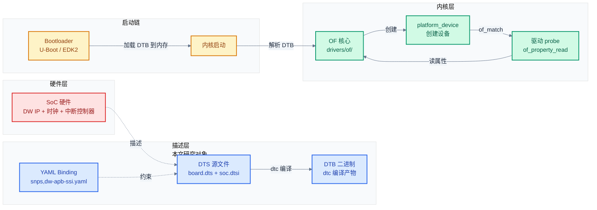
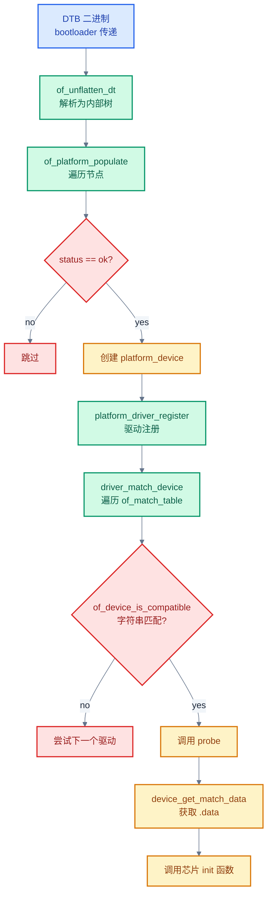
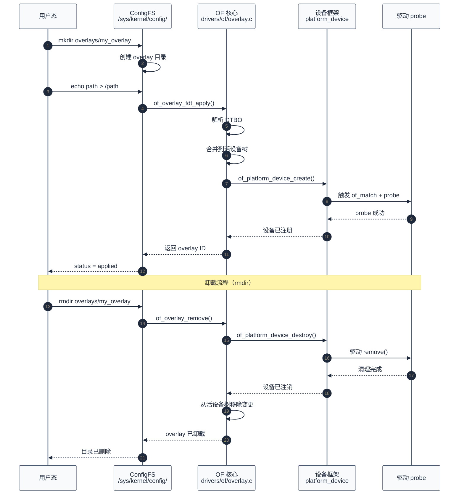
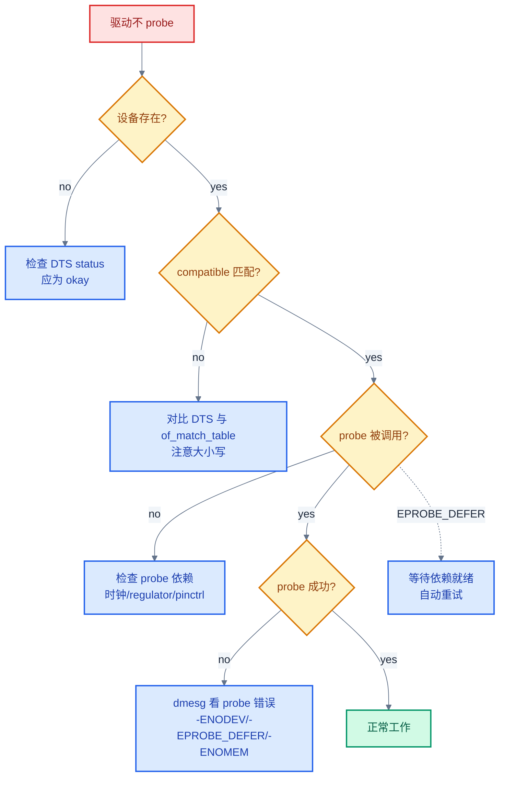

# 设备树与绑定专题

> 本篇以"硬件描述如何与驱动代码匹配"为核心问题，从 DTS 语法基础出发，逐层推进到 binding 契约、五种协议的 binding 实例、`of_match` 匹配机制、属性解析 API、overlay 动态修改，最后用常见配置错误案例收尾。以 Synopsys DesignWare 系列 IP（DW APB SSI / DW_apb_i2c / DWC_mshc）和 Bosch MCAN 的真实 binding 文档与驱动源码为贯穿案例。
>
> **工程师视角**：BSP 移植中 80% 的"驱动不工作"问题不是驱动代码 bug，而是设备树配置错误——compatible 拼错、reg 地址偏移、中断号不对、时钟没使能、pinctrl 没配。掌握设备树不是"会写 DTS 语法"，而是"能看懂 binding 文档、能用 dtc 验证、能在 /proc/device-tree 里对照、能在驱动源码里找到 of_property_read 对应的属性名"。

### 关键术语

| 缩写 | 全称 | 含义 |
|------|------|------|
| DTS | Device Tree Source | 设备树源文件，文本格式 |
| DTSI | Device Tree Source Include | 可被 include 的 DTS 片段 |
| DTB | Device Tree Blob | 编译后的二进制设备树 |
| DTBO | Device Tree Blob Overlay | 编译后的 overlay 二进制 |
| Binding | — | 设备树绑定规范，定义节点的合法属性 |
| phandle | Pointer Handle | 节点的唯一引用句柄 |
| of | Open Firmware | Linux 中设备树 API 的前缀（`of_property_read`） |
| FDT | Flattened Device Tree | 扁平设备树，启动时传递给内核的格式 |
| dtc | Device Tree Compiler | 设备树编译器 |
| YAML | YAML Ain't Markup Language | 绑定文档的现代格式（取代 .txt） |
| OFF | Open Firmware Framework | 开放固件框架，设备树的起源 |
| ACPI | Advanced Configuration and Power Interface | x86 为主的配置接口，与 DT 并存 |
| UEFI | Unified Extensible Firmware Interface | 统一可扩展固件接口 |
| SoC | System on Chip | 片上系统 |
| IP | Intellectual Property | 可复用的硬件模块（如 DW APB SSI） |

### 前置知识

| 需要了解 | 参考文档 |
|----------|----------|
| 五种通信协议的基本概念 | [00-通信协议总览](./00-通信协议总览.md) |
| Linux 驱动模型（probe、platform_driver） | [01-SPI协议与驱动](./01-SPI协议与驱动.md) §4 |
| 各协议的控制器驱动结构 | [01-SPI](./01-SPI协议与驱动.md) ~ [05-SDIO-eMMC](./05-SDIO-eMMC协议与驱动.md) |
| 中断与时钟子系统基础 | [08-中断处理与延迟优化](./08-中断处理与延迟优化.md) |

---

## 1. 概述

### 1.1 设备树解决什么问题

在设备树出现之前，Linux 内核把所有板级硬件信息硬编码在 `arch/arm/mach-*` 目录下——每出一块新板子就要改内核源码、重新编译。这导致 ARM 内核树膨胀到不可维护的程度（Linux 3.x 前 `arch/arm/` 占了内核代码量的 30% 以上）。

设备树的核心思想是**把"硬件描述"从"内核代码"中分离出来**：

- 内核只保留"如何驱动某类 IP"的通用代码（如 `i2c-designware-platdrv.c`）
- 板级信息（这个 IP 在哪个地址、接了什么时钟、中断线是几号）放在 DTS 文件里
- 启动时 bootloader 把 DTB 传给内核，内核解析后创建 platform_device，再与驱动匹配

> **核心要点**：设备树是一份"硬件配置清单"，它让同一份驱动代码能在不同板子上运行，只需更换 DTS。这就是为什么 BSP 工程师 80% 的工作是改 DTS 而非改驱动——硬件差异通过 DTS 吸收。

### 1.2 系统上下文

设备树不是孤立文件——它向上连接内核驱动框架，向下描述 SoC 硬件拓扑，在启动链中由 bootloader 传递给内核，在运行时通过 `/proc/device-tree` 暴露给用户态。

**项目定位**：设备树是 Linux ARM/MIPS/RISC-V 平台上**唯一的板级硬件描述机制**（x86 主要用 ACPI）。它处于 bootloader 与内核之间——bootloader 加载 DTB 到内存，内核启动时解析 DTB 创建设备。所有 platform_device、时钟、中断、pinctrl、regulator 的初始化都依赖设备树提供的信息。

**软硬件耦合点**：

| 耦合方向 | 接口 | 共同设计点 |
|----------|------|-----------|
| DTS ↔ 内核驱动 | `compatible` 字符串 + `of_match_table` | 驱动声明它能处理哪些 compatible，内核做字符串匹配 |
| DTS ↔ 时钟子系统 | `clocks` / `clock-names` 属性 | `clk_get()` 按名字查找 DTS 中引用的时钟提供者 |
| DTS ↔ 中断子系统 | `interrupts` / `interrupt-parent` | `platform_get_irq()` 解析 DTS 的中断描述 |
| DTS ↔ pinctrl | `pinctrl-0` / `pinctrl-names` | 引脚复用配置通过 DTS 传递给 pinctrl 子系统 |
| DTS ↔ DMA | `dmas` / `dma-names` | `dma_request_chan()` 按 DTS 描述获取 DMA 通道 |
| DTS ↔ regulator | `regulators` 节点 + phandle | 电源调节器通过 phandle 被外设引用 |
| DTS ↔ PHY | `phys` / `phy-names` | USB/PCIe PHY 通过 DTS 关联到控制器 |
| Bootloader ↔ 内核 | DTB 在内存中的位置（r2 寄存器 / UEFI config table） | bootloader 必须把 DTB 加载到内核可访问的地址 |

**跨实现对比**（详细对比见 [§10](#10-zephyr-设备树对照)）：Linux 用 DTS→DTB→内核解析的三段式，binding 用 YAML 文档化；Zephyr 也用 DTS 但在编译期由 `devicetree.h` 宏展开为 C 结构体，无运行时解析开销；UEFI/ACPI 平台（x86）不用 DTS 而用 ACPI 的 _DSD 方法描述设备属性，驱动通过 `device_property_read_*` 统一接口同时支持 DTS 和 ACPI。



> **如何读这张图**：本文研究对象是蓝色描述层——DTS 源文件、YAML binding、DTB 二进制。左侧红色是硬件（被描述对象），右侧绿色是内核（描述的消费者），底部黄色是启动链（描述的传递路径）。三条关键链路：**DTS → dtc → DTB** 是编译路径（§2）；**Bootloader → 内核 → OF 核心 → platform_device** 是启动解析路径（§1.3）；**YAML binding ↔ DTS** 是契约约束路径（§3）——binding 定义"可以写什么"，DTS 是"实际写了什么"。

### 1.3 一个具体例子：从 DTS 到驱动 probe

以 DW I2C 控制器为例，完整的链路是：DTS 节点 → DTB → 内核解析 → platform_device → 驱动 of_match → probe → 读取属性。

**第一步：DTS 节点**（板级硬件描述）

```dts
/* 板级 DTS 文件片段 */
i2c@f0000 {
    compatible = "snps,designware-i2c";
    reg = <0xf0000 0x1000>;
    interrupts = <11>;
    clock-frequency = <400000>;
    clocks = <&i2cclk>;
    status = "okay";

    /* 从设备节点 */
    eeprom@64 {
        compatible = "atmel,24c02";
        reg = <0x64>;
    };
};
```

**第二步：驱动 of_match_table**（声明能处理哪些 compatible）

```c
/* 摘自 [i2c-designware-platdrv.c](file:///home/pbw/2042f/linux/drivers/i2c/busses/i2c-designware-platdrv.c) 第 254-260 行 */
static const struct of_device_id dw_i2c_of_match[] = {
    { .compatible = "mobileye,eyeq6lplus-i2c" },
    { .compatible = "mscc,ocelot-i2c" },
    { .compatible = "snps,designware-i2c" },   /* 与 DTS 的 compatible 匹配 */
    {}
};
MODULE_DEVICE_TABLE(of, dw_i2c_of_match);
```

**第三步：platform_driver 注册**（把 of_match_table 挂到 driver 上）

```c
/* 同文件第 291-301 行 */
static struct platform_driver dw_i2c_driver = {
    .probe  = dw_i2c_plat_probe,
    .remove = dw_i2c_plat_remove,
    .driver = {
        .name           = "i2c_designware",
        .of_match_table = dw_i2c_of_match,  /* 内核用此表匹配 DTS */
        .pm             = pm_ptr(&i2c_dw_dev_pm_ops),
    },
};
```

**第四步：内核匹配与 probe**（内核遍历 of_match_table，字符串匹配后调用 probe）

内核在启动时为 DTS 中每个 `status = "okay"` 的节点创建 `platform_device`。当驱动注册时，内核遍历 `of_match_table`，用 `of_device_is_compatible()` 做字符串比较。匹配成功后调用 `probe`，在 `probe` 中通过 `device_property_read_*` 读取 DTS 属性。

> **核心要点**：DTS 的 `compatible` 字符串是驱动与硬件的唯一契约。驱动在 `of_match_table` 里声明"我能处理这些 compatible"，内核做字符串匹配。这就是为什么 compatible 拼错一个字母——驱动永远不会 probe。

---

## 2. DTS 语法基础

> 上一章用 DW I2C 的例子建立了"从 DTS 到 probe"的全景。但那个例子的 DTS 节点里有很多语法元素——`reg`、`interrupts`、`clocks`、`<&i2cclk>`——它们各自是什么含义？本章从语法层面拆解 DTS 的核心元素。

### 2.1 节点与属性

DTS 的基本结构是**树形节点**，每个节点有名字和若干**属性**：

```dts
/dts-v1/;            /* DTS 版本声明 */

/ {                  /* 根节点 */
    model = "Example Board";
    compatible = "vendor,board";

    /* 节点格式：name@address { properties; child_nodes; }; */
    node_label: node_name@address {
        property-name = <value>;           /* 32 位整型 */
        property-name-64 = /bits/ 64 <value>; /* 64 位整型 */
        string-prop = "hello";              /* 字符串 */
        string-list = "a", "b", "c";        /* 字符串列表 */
        int-array = <1 2 3 4>;              /* 整型数组 */
        byte-array = [01 02 03 04];         /* 字节数组 */
        bool-prop;                          /* 布尔属性（存在即 true） */
        phandle-prop = <&other_node>;       /* 引用其他节点 */

        child_node {
            child-property = <42>;
        };
    };
};
```

关键语法规则：

| 语法元素 | 格式 | 示例 | 说明 |
|----------|------|------|------|
| 节点名 | `name@address` | `i2c@f0000` | `@` 后是寄存器基地址（十六进制） |
| 节点标签 | `label: name@addr` | `i2c0: i2c@f0000` | 标签可被 `&label` 引用 |
| 整型 | `<value>` | `<0x400000>` | 32 位，尖括号 |
| 64 位整型 | `/bits/ 64 <value>` | `/bits/ 64 <0x100000000>` | 需要显式声明位数 |
| 字符串 | `"text"` | `"snps,dw-apb-ssi"` | 双引号 |
| 字符串列表 | `"a", "b"` | `"core", "bus"` | 逗号分隔 |
| 整型数组 | `<1 2 3>` | `<0 25 4>` | 空格分隔 |
| 字节数组 | `[01 02]` | `[de ad be ef]` | 方括号，十六进制 |
| 布尔 | `property;` | `snps,clk-freq-optimized;` | 无值，存在即真 |
| phandle 引用 | `<&label>` | `<&i2cclk>` | 尖括号 + & + 标签 |

### 2.2 phandle 与引用

phandle（pointer handle）是 DTS 中跨节点引用的机制。当节点 A 需要引用节点 B 时，用 `&label` 语法：

```dts
/* 时钟提供者节点 */
clk_controller: clock-controller@1000 {
    compatible = "vendor,clk-ctrl";
    reg = <0x1000 0x100>;
    #clock-cells = <1>;    /* 表示引用时需额外传 1 个参数（时钟号） */
};

/* 外设节点引用时钟 */
i2c@f0000 {
    compatible = "snps,designware-i2c";
    clocks = <&clk_controller 5>;  /* 引用 clk_controller，参数 5 = 时钟号 */
    clock-names = "ref";
};
```

`#xxx-cells` 属性决定了引用时需要传几个参数：

| 属性 | 含义 | 典型值 |
|------|------|--------|
| `#address-cells` | 子节点 `reg` 中地址的 cell 数 | 1 或 2 |
| `#size-cells` | 子节点 `reg` 中长度的 cell 数 | 1 或 2 |
| `#interrupt-cells` | `interrupts` 属性的 cell 数 | 1~3 |
| `#clock-cells` | `clocks` 引用的参数 cell 数 | 0 或 1 |
| `#dma-cells` | `dmas` 引用的参数 cell 数 | 1 或 2 |
| `#gpio-cells` | `gpios` 引用的参数 cell 数 | 2 |
| `#phy-cells` | `phys` 引用的参数 cell 数 | 0 或 1 |

上述 phandle 引用关系可以用下面的树形图直观展示——DTS 的本质是一棵树,phandle 是树中跨节点的"指针":

```mermaid
%%{init: {"theme": "base", "themeVariables": {"primaryColor": "#f8fafc", "primaryTextColor": "#1e293b", "primaryBorderColor": "#475569", "lineColor": "#64748b", "secondaryColor": "#f1f5f9", "secondaryBorderColor": "#94a3b8", "tertiaryColor": "#f8fafc", "fontFamily": "\"trebuchet ms\", verdana, arial, sans-serif"}}}%%
flowchart TD
    ROOT[/ 根节点<br/>model = Example Board]
    ROOT --> SOC
    ROOT --> CLKCTL
    ROOT --> GIC

    subgraph "时钟/中断提供者"
        CLKCTL["clk_controller: clock-controller@1000<br/>#clock-cells = 1"]
        GIC["gic: interrupt-controller@1000<br/>#interrupt-cells = 3"]
    end

    subgraph "SoC 总线"
        SOC["soc: soc<br/>#address-cells = 1<br/>#size-cells = 1"]
        SOC --> I2C
        SOC --> SPI
        SOC --> MMC

        I2C["i2c@f0000<br/>compatible = snps,designware-i2c<br/>clocks = &clk_controller 5<br/>interrupts = &gic 0 154 4"]
        SPI["spi@fff00000<br/>compatible = snps,dw-apb-ssi<br/>dmas = &dmac 2, &dmac 3"]
        MMC["mmc@fe310000<br/>compatible = rockchip,rk3568-dwcmshc<br/>bus-width = 8"]
    end

    I2C -.->|clocks phandle| CLKCTL
    I2C -.->|interrupt-parent| GIC
    SPI -.->|interrupt-parent| GIC

    classDef root fill:#fef3c7, stroke:#d97706, color:#92400e, stroke-width:2px;
    classDef provider fill:#d1fae5, stroke:#059669, color:#065f46, stroke-width:2px;
    classDef bus fill:#dbeafe, stroke:#2563eb, color:#1e40af, stroke-width:2px;
    classDef dev fill:#cffafe, stroke:#0891b2, color:#155e75, stroke-width:2px;
    class ROOT root;
    class CLKCTL,GIC provider;
    class SOC bus;
    class I2C,SPI,MMC dev;
```

> **如何读这张图**：DTS 是一棵树——根节点（黄）下有 SoC 总线节点（蓝）和若干"提供者"节点（绿）。外设节点（青）通过 phandle（虚线）引用提供者:`i2c@f0000` 的 `clocks = <&clk_controller 5>` 用 phandle 引用 `clk_controller`,参数 `5` 是时钟号;`interrupts = <0 154 4>` 通过 `interrupt-parent`（默认继承）找到 `gic`。phandle 让 DTS 保持了树形结构,同时支持跨节点的引用关系。

> **核心要点**：phandle 是 DTS 的"指针"——通过 `&label` 引用其他节点，`#xxx-cells` 声明引用时需要几个参数。理解 `#address-cells` 和 `#size-cells` 是看懂 `reg` 属性的前提。

### 2.3 reg 与地址映射

`reg` 属性描述设备的寄存器地址空间。它的格式由父节点的 `#address-cells` 和 `#size-cells` 决定：

```dts
/* 父节点声明：地址 2 个 cell，长度 1 个 cell */
soc {
    #address-cells = <2>;   /* 地址用 2 个 cell（支持 64 位地址） */
    #size-cells = <1>;      /* 长度用 1 个 cell（最大 4GB） */

    /* reg = <addr_high addr_low size> */
    i2c@0xf0000 {
        reg = <0x0 0xf0000 0x1000>;
        /* 地址 = 0x0000_0000_000f_0000, 长度 = 0x1000 */
    };
};
```

常见组合：

| `#address-cells` | `#size-cells` | `reg` 格式 | 适用场景 |
|:-:|:-:|------|------|
| 1 | 1 | `<addr size>` | 32 位地址，最常见 |
| 2 | 2 | `<addr_hi addr_lo size_hi size_lo>` | 64 位地址 |
| 1 | 0 | `<addr>` | 无长度（如中断控制器） |
| 2 | 1 | `<addr_hi addr_lo size>` | 64 位地址 + 32 位长度 |

MCAN 控制器是多 `reg` 区域的典型例子——它有寄存器区和消息 RAM 两个独立区域：

```dts
/* 摘自 bosch,m_can.yaml 的 example */
can@20e8000 {
    compatible = "bosch,m_can";
    reg = <0x020e8000 0x4000>,   /* 第一个区域：M_CAN 寄存器 */
          <0x02298000 0x4000>;   /* 第二个区域：message RAM */
    reg-names = "m_can", "message_ram";
};
```

`reg-names` 给每个 `reg` 区域命名，驱动通过 `platform_get_resource_byname()` 按名字获取。

### 2.4 interrupt 描述

中断描述有三种风格，由 `#interrupt-cells` 决定：

**简单风格**（`#interrupt-cells = <1>`）：

```dts
i2c@f0000 {
    interrupts = <11>;   /* 中断号 11 */
};
```

**GIC 风格**（`#interrupt-cells = <3>`）：

```dts
i2c@f0000 {
    /* <type number flags> */
    /* type: 0=SPI(共享外设中断), 1=PPI(私有外设中断) */
    /* number: 中断号（GIC SPI 从 16 开始） */
    /* flags: bit[3:0] 触发类型(1=上升沿 2=下降沿 4=高电平 8=低电平) */
    interrupts = <0 154 4>;   /* SPI 154, 高电平触发 */
};
```

**中断父节点**：

```dts
soc {
    interrupt-parent = <&gic>;  /* 子节点默认继承此父节点 */

    i2c@f0000 {
        /* 未显式指定 interrupt-parent，继承 soc 的 &gic */
        interrupts = <0 154 4>;
    };

    gpio@2000 {
        /* GPIO 控制器有自己的中断父节点 */
        interrupt-parent = <&gic>;
        interrupts = <0 32 4>;
    };
};
```

> **如何读这些例子**：GIC 风格的 `<0 154 4>` 中，`0` 表示 SPI（Shared Peripheral Interrupt，共享外设中断），`154` 是 GIC 的 SPI 中断号（对应 GIC 规范的 `SPI_ID + 32`），`4` 表示高电平触发（bit 2 = 4）。驱动中 `platform_get_irq(pdev, 0)` 返回的是内核虚拟中断号（virq），与 DTS 里的 `154` 不同——后者是硬件中断号（hwirq），由 `irq_domain` 翻译。

---

## 3. Binding：硬件描述的契约

> 上一章讲了 DTS 语法——任何合法的节点都能写。但"合法"不等于"正确"：SPI 控制器的节点能不能写 `clock-frequency` 属性？`reg` 的第二个区域叫什么名字？这些约束由 **binding 文档**定义。本章讲 binding 是什么、怎么读、怎么写。

### 3.1 为什么需要 binding

DTS 语法只规定"怎么写"（节点、属性、值的格式），不规定"写什么"。如果没有约束，每个板子作者可能用不同属性名表达同一含义（有人写 `bus-frequency`，有人写 `clock-frequency`，有人写 `i2c-bus-frequency`），驱动就无法统一解析。

binding 文档的作用是**为每类设备定义标准属性集**——哪些属性必须有（required）、哪些可选（optional）、每个属性的类型和取值范围。Linux 内核的 binding 文档位于 `Documentation/devicetree/bindings/`，现代格式是 YAML（旧的 `.txt` 格式已逐步淘汰）。

### 3.2 YAML binding 格式

以 DW I2C 的 binding 为例：

```yaml
# 摘自 Documentation/devicetree/bindings/i2c/snps,designware-i2c.yaml
$id: http://devicetree.org/schemas/i2c/snps,designware-i2c.yaml#
$schema: http://devicetree.org/meta-schemas/core.yaml#

title: Synopsys DesignWare APB I2C Controller

maintainers:
  - Jarkko Nikula <jarkko.nikula@linux.intel.com>

allOf:
  - $ref: /schemas/i2c/i2c-controller.yaml#   # 继承 I2C 控制器通用 binding

properties:
  compatible:
    oneOf:
      - const: snps,designware-i2c
      - items:
          - enum: [mobileye,eyeq6lplus-i2c, mscc,ocelot-i2c, sophgo,sg2044-i2c]
          - const: snps,designware-i2c        # fallback

  reg:
    maxItems: 1

  interrupts:
    maxItems: 1

  clock-frequency:
    enum: [100000, 400000, 1000000, 3400000]
    default: 400000

  i2c-sda-hold-time-ns:
    description: SDA hold time in nanoseconds.

  dmas:
    items:
      - description: TX DMA Channel
      - description: RX DMA Channel

  dma-names:
    items: [{const: tx}, {const: rx}]

required:
  - compatible
  - reg
  - interrupts

unevaluatedProperties: false   # 禁止未定义的属性
```

关键字段解读：

| 字段 | 含义 |
|------|------|
| `$id` | binding 的唯一标识 URL |
| `title` | 设备名称 |
| `maintainers` | 维护者（有问题找谁） |
| `allOf: $ref` | 继承父类 binding（如 `i2c-controller.yaml` 提供通用 I2C 属性） |
| `properties` | 定义所有合法属性及其类型/取值约束 |
| `required` | 必须存在的属性列表 |
| `unevaluatedProperties: false` | 严格模式——未在 properties 中定义的属性会报错 |

> **核心要点**：YAML binding 不只是文档，它是**可执行的规范**——内核的 `dt-validate` 工具用这些 YAML 文件自动验证 DTS 是否合规。`unevaluatedProperties: false` 是最严格的约束，它防止"随意添加未定义属性"。

### 3.3 compatible 字符串与 fallback 机制

`compatible` 是 DTS 中最重要的属性——它是驱动匹配的唯一依据。DW 系列绑定展示了 compatible 的三种模式：

**模式一：通用 compatible**

```yaml
compatible:
  const: snps,designware-i2c
```

```dts
i2c@f0000 {
    compatible = "snps,designware-i2c";  /* 直接用通用名 */
};
```

**模式二：厂商特定 + fallback**

```yaml
compatible:
  items:
    - enum: [sophgo,sg2044-i2c, mscc,ocelot-i2c, thead,th1520-i2c]
    - const: snps,designware-i2c        # fallback 到通用 IP
```

```dts
i2c@f0000 {
    /* 厂商自己的 compatible + 通用 IP 的 compatible */
    compatible = "sophgo,sg2044-i2c", "snps,designware-i2c";
};
```

这种"厂商 + fallback"模式的含义是：这块 IP 是 Synopsys DW I2C，但有厂商特定的 quirk。驱动可以同时注册两个 compatible——先匹配厂商特定名（触发 quirk 处理），不匹配时回退到通用名。

**模式三：层级 fallback（Rockchip MMC）**

```yaml
# 摘自 snps,dwcmshc-sdhci.yaml
compatible:
  oneOf:
    - items:
        - enum: [rockchip,rk3528-dwcmshc, rockchip,rk3562-dwcmshc, rockchip,rk3576-dwcmshc]
        - const: rockchip,rk3588-dwcmshc   # fallback 到 rk3588
    - enum:
        - rockchip,rk3568-dwcmshc
        - rockchip,rk3588-dwcmshc
        - snps,dwcmshc-sdhci                # 最通用
```

```dts
mmc@fe310000 {
    compatible = "rockchip,rk3568-dwcmshc";  /* 直接匹配 */
};

mmc@fe320000 {
    compatible = "rockchip,rk3528-dwcmshc", "rockchip,rk3588-dwcmshc";
    /* rk3528 的行为与 rk3588 一致,用 fallback 表示 */
};
```

> **如何读这些模式**：compatible 列表从左到右是"从特定到通用"。内核匹配时也是从左到右——先尝试最特定的 compatible，匹配不到再试下一个。这意味着驱动可以只注册最特定的 compatible 来触发 quirk，也可以注册通用的 compatible 来处理标准行为。

---

## 4. 五种协议的 binding 实例

> 前三章讲了 DTS 语法和 binding 契约。本章把五种协议的 binding 放在一起对比，揭示各自的"特有属性"和"为什么需要这些属性"。每个协议都用真实的 YAML binding 和 DTS 节点为例。

### 4.1 SPI binding：DW APB SSI

DW APB SSI 的 binding 定义了 SPI 控制器的标准属性，以及一些 SPI 特有的参数：

```dts
/* 摘自 snps,dw-apb-ssi.yaml 的 example */
spi@fff00000 {
    compatible = "snps,dw-apb-ssi";
    reg = <0xfff00000 0x1000>;
    #address-cells = <1>;
    #size-cells = <0>;           /* SPI 子节点只有片选号,无地址长度 */
    interrupts = <0 154 4>;
    clocks = <&spi_m_clk>;
    num-cs = <2>;                /* 片选数量 */
    cs-gpios = <&gpio0 13 0>,    /* 用 GPIO 做片选 */
               <&gpio0 14 0>;
    rx-sample-delay-ns = <3>;    /* DW 特有:RX 采样延迟 */

    /* SPI 从设备节点 */
    flash@1 {
        compatible = "spi-nand";
        reg = <1>;               /* 片选号 1 */
        rx-sample-delay-ns = <7>; /* 从设备级覆盖 */
    };
};
```

SPI binding 的特有属性：

| 属性 | 类型 | 说明 |
|------|------|------|
| `#address-cells` | 固定 1 | 子节点 `reg` 是片选号 |
| `#size-cells` | 固定 0 | 片选无长度 |
| `num-cs` | u32 | 原生片选信号数量 |
| `cs-gpios` | phandle 数组 | 用 GPIO 做片选（当原生 CS 不够时） |
| `rx-sample-delay-ns` | u32 | DW 特有：RX 采样延迟（纳秒） |
| `dmas` | phandle 数组 | TX/RX DMA 通道 |
| `dma-names` | 字符串列表 | `"tx"`, `"rx"` |

`rx-sample-delay-ns` 是 DW SPI 的特有属性——它控制 RX 数据的采样时刻，用于补偿 PCB 走线延迟。这个属性可以在控制器级设默认值，也可以在从设备级覆盖（不同从设备可能需要不同延迟）。

### 4.2 I2C binding：DW_apb_i2c

I2C binding 的核心是 `clock-frequency`（总线速率）和 SDA/SCL 时序参数：

```dts
/* 摘自 snps,designware-i2c.yaml 的 example */
i2c@1120000 {
    compatible = "snps,designware-i2c";
    reg = <0x1120000 0x1000>;
    interrupts = <12 1>;
    clock-frequency = <400000>;          /* 400kHz Fast-mode */
    i2c-sda-hold-time-ns = <300>;        /* SDA 保持时间 */
    i2c-sda-falling-time-ns = <300>;     /* SDA 下降时间 */
    i2c-scl-falling-time-ns = <300>;     /* SCL 下降时间 */
    snps,bus-capacitance-pf = <400>;     /* 总线电容(pF) */
    snps,clk-freq-optimized;             /* 布尔:时钟频率优化模式 */

    eeprom@64 {
        compatible = "atmel,24c02";
        reg = <0x64>;                    /* 7-bit I2C 地址 */
    };
};
```

I2C binding 的特有属性：

| 属性 | 类型 | 说明 |
|------|------|------|
| `clock-frequency` | u32 | 总线速率：100000/400000/1000000/3400000 |
| `i2c-sda-hold-time-ns` | u32 | SDA 保持时间（DW 用此计算 HCNT/LCNT） |
| `i2c-sda-falling-time-ns` | u32 | SDA 下降时间（默认 300） |
| `i2c-scl-falling-time-ns` | u32 | SCL 下降时间（默认 300） |
| `snps,bus-capacitance-pf` | u32 | 总线电容，用于高速模式计算（100 或 400） |
| `snps,clk-freq-optimized` | 布尔 | 减少内部延迟以优化时钟频率 |

> **核心要点**：I2C binding 的时序属性（`i2c-sda-hold-time-ns` 等）直接对应 [02-I2C协议与驱动](./02-I2C协议与驱动.md) §5 讲的 DW HCNT/LCNT 计算——驱动读这些属性后，代入公式算出 `DW_IC_FS_SCL_HCNT` / `DW_IC_FS_SCL_LCNT` 寄存器值。DTS 属性 → 驱动计算 → 寄存器值，这是"硬件描述如何影响驱动行为"的典型链路。

### 4.3 CAN binding：Bosch MCAN

MCAN binding 最特殊的是 `bosch,mram-cfg`——消息 RAM 配置：

```dts
/* 摘自 bosch,m_can.yaml 的 example */
can@20e8000 {
    compatible = "bosch,m_can";
    reg = <0x020e8000 0x4000>,      /* M_CAN 寄存器 */
          <0x02298000 0x4000>;      /* message RAM */
    reg-names = "m_can", "message_ram";
    interrupts = <0 114 0x04>,      /* int0 */
                 <0 114 0x04>;      /* int1 */
    interrupt-names = "int0", "int1";
    clocks = <&clks IMX6SX_CLK_CANFD>,
             <&clks IMX6SX_CLK_CANFD>;
    clock-names = "hclk", "cclk";

    /* 消息 RAM 配置：<offset sidf xidf rxf0 rxf1 rxb txe txb> */
    bosch,mram-cfg = <0x0 0 0 32 0 0 0 1>;
};
```

`bosch,mram-cfg` 的 8 个参数：

| 索引 | 含义 | 范围 | 示例值 |
|:----:|------|:----:|:------:|
| 0 | Message RAM 偏移 | — | 0x0 |
| 1 | 11-bit Filter 元素数 | 0-128 | 0 |
| 2 | 29-bit Filter 元素数 | 0-64 | 0 |
| 3 | Rx FIFO 0 元素数 | 0-64 | 32 |
| 4 | Rx FIFO 1 元素数 | 0-64 | 0 |
| 5 | Rx Buffer 元素数 | 0-64 | 0 |
| 6 | Tx Event FIFO 元素数 | 0-32 | 0 |
| 7 | Tx Buffer 元素数 | 0-32 | 1 |

> **如何读这组参数**：`<0x0 0 0 32 0 0 0 1>` 表示——从 Message RAM 偏移 0 开始，不配 11-bit/29-bit 滤波器，Rx FIFO 0 放 32 个元素，不配 Rx FIFO 1/Rx Buffer/Tx Event FIFO，Tx Buffer 放 1 个元素。多个 MCAN 实例可共享同一 Message RAM，通过 `offset` 参数划分各自的区域。

### 4.4 USB binding：DWC3

USB DWC3 binding 的特点是 PHY 和 USB 2.0/3.0 时钟的复杂配置：

```dts
/* 典型 DWC3 节点（基于 snps,dwc3.yaml） */
usb@fe900000 {
    compatible = "snps,dwc3";
    reg = <0xfe900000 0x100000>;
    interrupts = <0 60 4>;          /* GIC SPI 60, 高电平 */
    clocks = <&cru USB3_OTG_REF>, <&cru USB3_SUSPEND>;
    clock-names = "ref", "suspend";
    phys = <&u2phy_otg>, <&u3phy_pipe>;   /* USB2 + USB3 PHY */
    phy-names = "usb2-phy", "usb3-phy";
    dr_mode = "otg";                /* 双角色：host/peripheral/otg */
    maximum-speed = "super-speed";  /* 最高速度限制 */
    snps,dis_u2_susphy_quirk;       /* quirk:禁用 U2 suspend */
    snps,dis_enblslpm_quirk;        /* quirk:禁用 LPM */

    /* DWC3 作为 subnode 包裹在 glue 节点里 */
};
```

USB binding 的特有属性：

| 属性 | 类型 | 说明 |
|------|------|------|
| `dr_mode` | 字符串 | `host` / `peripheral` / `otg` |
| `maximum-speed` | 字符串 | `low-speed` / `full-speed` / `high-speed` / `super-speed` |
| `phys` | phandle 数组 | USB2 PHY + USB3 PHY |
| `phy-names` | 字符串列表 | `"usb2-phy"`, `"usb3-phy"` |
| `snps,*_quirk` | 布尔 | Synopsys 特定 quirk（如 `dis_u2_susphy_quirk`） |

### 4.5 MMC binding：DWC mshc

MMC binding 的核心是总线宽度、速度模式和时钟配置：

```dts
/* 摘自 snps,dwcmshc-sdhci.yaml 的 example */
mmc@fe310000 {
    compatible = "rockchip,rk3568-dwcmshc";
    reg = <0xfe310000 0x10000>;
    interrupts = <0 25 0x4>;
    clocks = <&cru 17>, <&cru 18>, <&cru 19>, <&cru 20>, <&cru 21>;
    clock-names = "core", "bus", "axi", "block", "timer";
    bus-width = <8>;                /* 8 线 eMMC */
    max-frequency = <200000000>;    /* 最高 200MHz（HS400） */
    supports-cqe;                   /* 启用 CQE 命令队列 */
    no-sdio;                        /* 不支持 SDIO */
    no-sd;                          /* 不支持 SD 卡 */
    non-removable;                  /* 不可移除（eMMC 焊死） */

    /* eMMC 颗粒的分区信息等 */
};
```

MMC binding 的特有属性：

| 属性 | 类型 | 说明 |
|------|------|------|
| `bus-width` | u32 | 1 / 4 / 8 线 |
| `max-frequency` | u32 | 最高时钟频率（Hz） |
| `supports-cqe` | 布尔 | 启用 CQE 命令队列引擎 |
| `non-removable` | 布尔 | 不可移除（eMMC） |
| `no-sdio` / `no-sd` | 布尔 | 禁用 SDIO/SD 模式 |
| `cap-mmc-highspeed` | 布尔 | 支持 MMC 高速 |
| `cap-sd-highspeed` | 布尔 | 支持 SD 高速 |
| `mmc-hs200-1_8v` | 布尔 | 支持 HS200 |
| `mmc-hs400-1_8v` | 布尔 | 支持 HS400 |
| `mmc-hs400-enhanced-strobe` | 布尔 | 支持 HS400ES |

> **核心要点**：五种协议的 binding 各有"特有属性"，但它们共享一组通用属性——`compatible` / `reg` / `interrupts` / `clocks` / `dmas` / `pinctrl-0`。理解通用属性后，学每个协议的 binding 只需关注它的特有部分。下表对比五种协议的"标志性特有属性"：

| 协议 | 标志性特有属性 | 作用 |
|------|--------------|------|
| SPI | `num-cs`, `cs-gpios`, `rx-sample-delay-ns` | 片选与采样延迟 |
| I2C | `clock-frequency`, `i2c-sda-hold-time-ns` | 总线速率与时序 |
| CAN | `bosch,mram-cfg` | 消息 RAM 分配 |
| USB | `dr_mode`, `maximum-speed`, `phys` | 角色与 PHY |
| MMC | `bus-width`, `max-frequency`, `supports-cqe` | 总线宽度与速度 |

---

## 5. of_match：驱动如何找到设备

> 前一章讲了 binding 定义了"合法的 compatible"。本章回答反过来：驱动如何声明自己能处理哪些 compatible？内核如何做匹配？`of_match_table` 的 `.data` 字段有什么用？

### 5.1 of_device_id 表

驱动通过 `of_device_id` 表声明它能处理的 compatible 字符串：

```c
/* 摘自 [spi-dw-mmio.c](file:///home/pbw/2042f/linux/drivers/spi/spi-dw-mmio.c) 第 434-451 行 */
static const struct of_device_id dw_spi_mmio_of_match[] = {
    { .compatible = "snps,dw-apb-ssi",          .data = dw_spi_pssi_init },
    { .compatible = "mscc,ocelot-spi",          .data = dw_spi_mscc_ocelot_init },
    { .compatible = "mscc,jaguar2-spi",         .data = dw_spi_mscc_jaguar2_init },
    { .compatible = "amazon,alpine-dw-apb-ssi", .data = dw_spi_alpine_init },
    { .compatible = "renesas,rzn1-spi",         .data = dw_spi_pssi_init },
    { .compatible = "snps,dwc-ssi-1.01a",       .data = dw_spi_hssi_init },
    { .compatible = "intel,keembay-ssi",        .data = dw_spi_intel_init },
    { .compatible = "intel,mountevans-imc-ssi", .data = dw_spi_mountevans_imc_init },
    { .compatible = "microchip,sparx5-spi",     .data = dw_spi_mscc_sparx5_init },
    { .compatible = "canaan,k210-spi",          .data = dw_spi_canaan_k210_init },
    { .compatible = "amd,pensando-elba-spi",    .data = dw_spi_elba_init },
    {}
};
MODULE_DEVICE_TABLE(of, dw_spi_mmio_of_match);
```

这段代码体现了"一个驱动支持多款芯片"的设计——每条 `.compatible` 对应一款芯片，`.data` 字段指向该芯片的初始化函数。

两个关键细节：

1. **表末尾的空 `{}`**：标记表结束。内核遍历时遇到空 entry 停止。漏掉这个空 entry 会导致越界访问。
2. **`MODULE_DEVICE_TABLE(of, ...)`**：告诉 modpost 在模块中生成 modules.alias，让 `udevd` 能在加载模块时做设备匹配。

### 5.2 .data 字段与初始化函数

`.data` 字段是 `of_device_id` 的精髓——它让一个驱动用不同的初始化逻辑处理不同芯片。DW SPI 驱动的 probe 函数这样使用：

```c
/* 摘自 [spi-dw-mmio.c](file:///home/pbw/2042f/linux/drivers/spi/spi-dw-mmio.c) 第 362-374 行 */
/* 在 probe 函数中 */
if (device_property_read_u32(&pdev->dev, "reg-io-width",
                             &dws->reg_io_width))
    dws->reg_io_width = 4;

/* 依赖 DTS 默认值 */
device_property_read_u32(&pdev->dev, "num-cs", &dws->num_cs);

/* 通过 of_match 获取芯片特定的初始化函数 */
init_func = device_get_match_data(&pdev->dev);
if (init_func) {
    ret = init_func(pdev, dwsmmio);
    if (ret)
        goto out_reset;
}
```

`device_get_match_data()` 的返回值就是 `of_device_id.data` 字段——当 DTS 的 `compatible` 是 `"snps,dw-apb-ssi"` 时，返回 `dw_spi_pssi_init`；当 `compatible` 是 `"intel,mountevans-imc-ssi"` 时，返回 `dw_spi_mountevans_imc_init`。

每个初始化函数处理该芯片的 quirk：

```c
/* 摘自 spi-dw-mmio.c 第 240-253 行 */
static int dw_spi_mountevans_imc_init(struct platform_device *pdev,
                                      struct dw_spi_mmio *dwsmmio)
{
    /*
     * Intel Mount Evans SoC 的 DW apb_ssi_v4.02a 有 errata:
     * TX FIFO 满可能导致数据损坏。 workaround 是永远不完全填满 FIFO。
     * TX FIFO 深度是 32, 所以把 fifo_len 设为 31。
     */
    dwsmmio->dws.fifo_len = 31;
    return 0;
}
```

> **核心要点**：`.data` 字段实现了"一驱动多芯片"的模式——通用代码在 probe 中调用 `device_get_match_data()` 获取芯片特定初始化函数，在初始化函数中设置 quirk。新增一款芯片只需在 `of_match_table` 加一行 + 写一个 init 函数，无需改 probe 主体。这是 Linux 驱动框架"开闭原则"的典型实践。

### 5.3 匹配流程

内核的匹配流程可以用下图概括：



> **如何读这张图**：蓝色是 DTB 输入,绿色是内核匹配逻辑,黄色是驱动侧,红色是判断分支。关键节点是 `of_device_is_compatible`——它做字符串比较,把 DTS 的 `compatible` 列表与 `of_match_table` 的每条 `.compatible` 对照。匹配成功后,`device_get_match_data` 返回 `.data` 字段,驱动据此执行芯片特定逻辑。

---

## 6. 属性解析 API

> 上一章讲了驱动如何通过 `of_match_table` 匹配设备。匹配成功后,probe 函数需要从 DTS 读取硬件配置——时钟频率、中断号、DMA 通道、寄存器宽度等。本章讲 Linux 提供的属性解析 API。

### 6.1 两套 API：of_property vs device_property

Linux 有两套属性解析 API：

| API 前缀 | 头文件 | 适用场景 |
|----------|--------|---------|
| `of_property_read_*` | `<linux/of.h>` | 只支持 DT |
| `device_property_read_*` | `<linux/property.h>` | 统一接口,同时支持 DT 和 ACPI |

**推荐使用 `device_property_*`**——它内部自动判断设备是 DT 还是 ACPI,调用对应的底层实现。这让驱动能同时在 ARM（DT）和 x86（ACPI）平台运行。

```c
/* 统一接口示例（摘自 spi-dw-mmio.c 第 362-367 行） */
if (device_property_read_u32(&pdev->dev, "reg-io-width",
                             &dws->reg_io_width))
    dws->reg_io_width = 4;   /* 读取失败用默认值 */

device_property_read_u32(&pdev->dev, "num-cs", &dws->num_cs);
```

### 6.2 常用 API 速查

| API | 读取类型 | 失败返回值 | 示例属性 |
|-----|---------|:---------:|---------|
| `device_property_read_u32(dev, name, &val)` | u32 | -EINVAL | `clock-frequency` |
| `device_property_read_u16(dev, name, &val)` | u16 | -EINVAL | `bus-width` |
| `device_property_read_string(dev, name, &str)` | 字符串 | -EINVAL | `dr_mode` |
| `device_property_read_bool(dev, name)` | 布尔（存在性） | false | `non-removable` |
| `device_property_read_u32_array(dev, name, arr, n)` | u32 数组 | -EINVAL | `bosch,mram-cfg` |
| `device_get_match_data(dev)` | of_device_id.data | NULL | 初始化函数指针 |
| `devm_clk_get(dev, name)` | 时钟 | ERR_PTR | `clocks` + `clock-names` |
| `platform_get_irq(pdev, idx)` | 中断号 | -ENXIO | `interrupts` |
| `devm_gpiod_get(dev, name, flags)` | GPIO | ERR_PTR | `cs-gpios` |
| `devm_dma_request_chan(dev, name)` | DMA 通道 | ERR_PTR | `dmas` + `dma-names` |

### 6.3 读取数组的例子：MCAN 的 mram-cfg

MCAN 的 `bosch,mram-cfg` 是一个 8 元素的 u32 数组，解析代码如下：

```c
/* 简化的 m_can 驱动属性读取（基于 drivers/net/can/m_can/m_can.c） */
struct mram_cfg {
    u32 offset;
    u32 sidf_elems;
    u32 xidf_elems;
    u32 rxf0_elems;
    u32 rxf1_elems;
    u32 rxb_elems;
    u32 txe_elems;
    u32 txb_elems;
};

static int m_can_parse_mram_cfg(struct device *dev, struct mram_cfg *cfg)
{
    u32 mram_cfg[8];
    int ret;

    ret = device_property_read_u32_array(dev, "bosch,mram-cfg",
                                         mram_cfg, 8);
    if (ret) {
        dev_err(dev, "Missing bosch,mram-cfg property\n");
        return ret;
    }

    cfg->offset     = mram_cfg[0];
    cfg->sidf_elems = mram_cfg[1];
    cfg->xidf_elems = mram_cfg[2];
    cfg->rxf0_elems = mram_cfg[3];
    /* ... 其余字段类似 ... */

    return 0;
}
```

> **核心要点**：属性解析 API 的设计原则是"失败返回负错误码,驱动用默认值"。这让 DTS 中的可选属性（如 `reg-io-width`、`num-cs`）可以省略——省略时驱动用硬件默认值。但必须属性（如 `compatible`、`reg`）的缺失会导致 binding 验证失败,不会到驱动 probe。

---

## 7. Device Tree Overlay

> 前六章讲的是"静态设备树"——编译时确定,运行时不变。但在某些场景（如 FPGA 重新配置、扩展板热插拔、Capsule Update），需要在运行时修改设备树。Overlay 机制就是为此设计的。

### 7.1 overlay 的用途

Device Tree Overlay（DTO）允许在不重新编译内核的情况下，动态向设备树添加或修改节点。典型场景：

1. **FPGA 重新配置**：FPGA 加载新 bitstream 后，其上的 IP 核变化，需要用 overlay 添加新 IP 的设备节点
2. **扩展板（BeagleBone Cape / Raspberry Pi HAT）**：插入扩展板时加载对应 overlay，拔出时卸载
3. **Capsule Update**：固件更新后硬件配置变化，用 overlay 更新设备树
4. **调试**：临时启用某个设备或修改属性

### 7.2 overlay 语法

overlay 文件以 `.dtso` 为扩展名，语法与普通 DTS 类似，但有 `/plugin/` 声明：

```dts
/* 摘自 Documentation/devicetree/overlay-notes.rst 的示例 */
/dts-v1/;
/plugin/;                    /* 声明这是 overlay */

&ocp {                       /* 通过 label 引用基树的节点 */
    /* 在 ocp 节点下添加新设备 */
    bar {
        compatible = "corp,bar";
        status = "okay";
        reg = <0x5000 0x100>;
        interrupts = <0 60 4>;
    };
};
```

overlay 与基树的合并规则：

| 操作 | 语法 | 效果 |
|------|------|------|
| 添加节点 | `&label { new_node { ... }; };` | 在 label 节点下添加 new_node |
| 添加属性 | `&label { new-prop = <42>; };` | 给 label 节点添加 new-prop |
| 修改属性 | `&label { existing-prop = <99>; };` | 覆盖原有值 |
| 删除属性 | `&label { /delete-property/ old-prop; };` | 删除属性 |
| 删除节点 | `&label { /delete-node/ old-node; };` | 删除节点 |

### 7.3 加载方式

Linux 提供了多种 overlay 加载方式：

**方式一：ConfigFS（推荐）**

```bash
# 挂载 configfs（通常已自动挂载）
mount -t configfs none /sys/kernel/config

# 创建 overlay 目录
mkdir /sys/kernel/config/device-tree/overlays/my_overlay

# 写入 overlay DTB 路径
echo /lib/firmware/my_overlay.dtbo > /sys/kernel/config/device-tree/overlays/my_overlay/path

# 查看状态
cat /sys/kernel/config/device-tree/overlays/my_overlay/status
# 输出: applied

# 卸载 overlay
rmdir /sys/kernel/config/device-tree/overlays/my_overlay
```

ConfigFS 加载 overlay 的内部流程涉及用户态、configfs、OF 核心和驱动框架四层协作,下图用时序图展示完整链路:



> **如何读这张图**：加载 overlay 的关键链路是 **echo path → configfs → of_overlay_fdt_apply → 合并活设备树 → 创建 platform_device → 触发 probe**。卸载是反序操作——先 remove 驱动,再销毁 device,最后从活设备树移除变更。这意味着 overlay 不只是"修改数据结构",而是"动态创建/销毁设备"——驱动必须支持模块化加载/卸载才能真正利用 overlay。

**方式二：内核启动参数**

```bash
# 在 bootloader 中传递
fdt_overlay=/lib/firmware/my_overlay.dtbo
```

**方式三：U-Boot 加载**

```bash
# U-Boot 命令
load mmc 0:1 ${fdt_addr_r} base.dtb
load mmc 0:1 ${fdto_addr_r} my_overlay.dtbo
fdt addr ${fdt_addr_r}
fdt apply ${fdto_addr_r}
booti ${kernel_addr_r} - ${fdt_addr_r}
```

> **核心要点**：overlay 不是"修改 DTB 文件",而是"修改内核内存中的活设备树"。加载 overlay 后,内核会为新节点创建 platform_device,触发驱动 probe;卸载时反序操作——先卸载驱动,再删除节点。这意味着 overlay 能触发驱动的动态加载/卸载,但前提是驱动本身支持（如 FPGA 管理器框架）。

---

## 8. 常见配置错误案例

> 前七章讲了"怎么正确写 DTS"。本章反过来——讲"常见的错误写法"。这些错误都来自真实的 BSP 调试经验,每个案例都包含症状、原因、排查方法。

### 8.1 案例：compatible 拼写错误

**症状**：驱动不 probe，`dmesg` 无任何相关日志，`/sys/bus/platform/devices/` 下有设备但无驱动绑定。

**错误 DTS**：

```dts
i2c@f0000 {
    compatible = "snps,designware-i2c";  /* 拼对了 */
};
```

```dts
i2c@f0000 {
    compatible = "snps,designware-i2C";  /* 大写 C,拼错了! */
};
```

**排查**：

```bash
# 1. 查看设备的 compatible
cat /sys/bus/platform/devices/f0000.i2c/of_node/compatible
# 输出: snps,designware-i2C

# 2. 查看驱动支持的 compatible
cat /sys/bus/platform/drivers/i2c_designware/of_match_table
# 或在源码中 grep

# 3. 对比发现大小写不一致
```

**修复**：DTS 中的 `compatible` 必须与驱动 `of_match_table` 中的完全一致（区分大小写）。

### 8.2 案例：reg 地址与实际不匹配

**症状**：驱动 probe 时访问寄存器触发总线错误（`External abort on linefetch`），或读到的寄存器值全是 0xFFFFFFFF。

**错误原因**：DTS 中的 `reg` 地址与 SoC 数据手册不一致。

```dts
/* 错误：地址写错了 */
i2c@e0000 {
    reg = <0xe0000 0x1000>;  /* 实际地址是 0xf0000 */
};

/* 正确：查 SoC 数据手册 */
i2c@f0000 {
    reg = <0xf0000 0x1000>;
};
```

**排查**：

```bash
# 查看内核解析的 reg
cat /proc/device-tree/soc/i2c@f0000/reg
# 输出是二进制,需用 xxd 查看
xxd /proc/device-tree/soc/i2c@f0000/reg

# 对照 SoC 数据手册的 memory map
```

### 8.3 案例：中断号错误

**症状**：驱动 probe 成功，但传输时无中断响应，超时后报错 `transfer timeout`。

**错误原因**：GIC 风格的 `interrupts` 中，SPI 中断号需要减 32。

```dts
/* 错误：直接用数据手册的 SPI 号 */
i2c@f0000 {
    interrupts = <0 186 4>;  /* 数据手册写 SPI 186,但 GIC 的 hwirq = 186 + 32 = 218 */
};

/* 正确：DTS 中写的是 GIC hwirq,即 SPI 号 + 32 */
i2c@f0000 {
    interrupts = <0 154 4>;  /* 154 = 186 - 32? 不,应该是 SPI 号直接填 */
};
```

> **待确认**：GIC 的中断号映射规则因 GIC 版本和 SoC 设计而异。常见规则是 DTS 中的 `interrupts` 第二个参数就是 SPI 号（不是 hwirq），GIC 驱动内部做 `SPI + 32` 的转换。但不同 SoC 可能有差异，需查 SoC 的 binding 文档。

**排查**：

```bash
# 查看中断注册情况
cat /proc/interrupts | grep i2c

# 查看内核解析的中断号
cat /sys/kernel/debug/irq/irqs/<num>
```

### 8.4 案例：时钟缺失

**症状**：驱动 probe 时报 `failed to get clock` 或访问寄存器时挂死。

**错误原因**：DTS 中 `clocks` 属性缺失或引用了不存在的时钟提供者。

```dts
/* 错误：忘记配 clocks */
i2c@f0000 {
    compatible = "snps,designware-i2c";
    reg = <0xf0000 0x1000>;
    interrupts = <0 154 4>;
    /* 缺少 clocks!DW I2C 需要参考时钟 */
};

/* 正确 */
i2c@f0000 {
    compatible = "snps,designware-i2c";
    reg = <0xf0000 0x1000>;
    interrupts = <0 154 4>;
    clocks = <&i2cclk>;
    clock-names = "ref";
};
```

**排查**：

```bash
# 查看时钟树
cat /sys/kernel/debug/clk/clk_summary

# 检查时钟是否使能
cat /sys/kernel/debug/clk/i2cclk/clk_enable_count
```

### 8.5 案例：DMA 配置错误

**症状**：PIO 模式正常，DMA 模式下 `dmaengine_submit` 返回错误或传输超时。

**错误原因**：`dmas` 属性中的 phandle 指向错误的 DMA 控制器，或 `dma-names` 顺序不对。

```dts
/* 错误：dma-names 顺序与 dmas 不匹配 */
spi@fff00000 {
    dmas = <&dmac0 2>, <&dmac0 3>;    /* TX channel, RX channel */
    dma-names = "rx", "tx";           /* 顺序反了!应该是 tx, rx */
};

/* 正确 */
spi@fff00000 {
    dmas = <&dmac0 2>, <&dmac0 3>;    /* TX, RX */
    dma-names = "tx", "rx";           /* 与 dmas 顺序一致 */
};
```

**排查**：

```bash
# 查看 DMA 通道申请情况
cat /sys/kernel/debug/dmaengine/

# 检查 DMA 控制器的通道
cat /sys/class/dma/dma0chan0/in_use
```

### 8.6 案例：pinctrl 未配置

**症状**：I2C 通信失败，示波器上 SCL/SDA 无信号，或信号电平不对。

**错误原因**：pinctrl 未配置，引脚处于默认状态（可能是 GPIO 或其他复用功能）。

```dts
/* 错误：忘记配 pinctrl */
i2c@f0000 {
    compatible = "snps,designware-i2c";
    /* 缺少 pinctrl-0 和 pinctrl-names! */
};

/* 正确 */
&i2c0 {
    pinctrl-names = "default";
    pinctrl-0 = <&i2c0_pins>;
};

/* 在 pinctrl 节点中定义引脚复用 */
pinctrl {
    i2c0_pins: i2c0-pins {
        rockchip,pins =
            <0 5 1 &pcfg_pull_none>,   /* I2C0_SCL */
            <0 6 1 &pcfg_pull_none>;   /* I2C0_SDA */
    };
};
```

**排查**：

```bash
# 查看引脚复用状态
cat /sys/kernel/debug/pinctrl/pinctrl-pins

# 查看当前引脚功能
cat /sys/kernel/debug/gpio
```

> **核心要点**：DTS 配置错误的排查遵循"从上到下"的顺序——先确认 compatible（驱动是否 probe），再确认 reg（寄存器能否访问），再确认 interrupts（中断能否触发），再确认 clocks（时钟是否使能），最后确认 pinctrl（引脚是否正确复用）。每一步都可用 `/proc/device-tree`、`/sys/kernel/debug/` 下的调试节点验证。

---

## 9. 调试工具与方法

> 上一章讲了常见错误案例。本章系统介绍 DTS 调试工具链——从编译期验证到运行时排查。

### 9.1 编译期工具

**dtc（Device Tree Compiler）**

```bash
# DTS → DTB
dtc -I dts -O dtb -o board.dtb board.dts

# DTB → DTS（反编译）
dtc -I dtb -O dts -o board.dts board.dtb

# 带 overlay 编译
dtc -@ -I dts -O dtb -o overlay.dtbo overlay.dtso
# -@ 生成 symbols（phandle 符号表,overlay 需要）

# 语法检查（不输出文件）
dtc -I dts -O dtb -o /dev/null board.dts 2>&1 | grep -i warning
```

**dt-validate（Binding 验证）**

```bash
# 安装工具
pip install dtschema

# 验证 DTS 是否符合 YAML binding
dt-validate -s Documentation/devicetree/bindings/ board.dts

# 在内核源码中验证（make 目标）
make dt_binding_check   # 验证 binding 文档本身
make dtbs_check         # 验证编译出的 DTB 是否符合 binding
```

### 9.2 运行时调试节点

**`/proc/device-tree`**

```bash
# 查看完整设备树（以文件系统形式）
ls /proc/device-tree/

# 查看某节点的 compatible
cat /proc/device-tree/soc/i2c@f0000/compatible
# 输出: snps,designware-i2c

# 查看属性（二进制,需 xxd）
xxd /proc/device-tree/soc/i2c@f0000/reg
# 00000000: 000f 0000 0010 0000

# 查看节点是否存在
ls /proc/device-tree/soc/ | grep i2c
```

**`/sys/bus/platform/`**

```bash
# 查看设备与驱动绑定
ls /sys/bus/platform/devices/
ls -la /sys/bus/platform/devices/f0000.i2c/
# driver -> ../../../../bus/platform/drivers/i2c_designware

# 查看驱动支持的 compatible
ls /sys/bus/platform/drivers/i2c_designware/
# module/  of_match_table  uevent  ...

# 查看设备树节点
ls /sys/bus/platform/devices/f0000.i2c/of_node/
```

**`/sys/kernel/debug/`**

```bash
# 时钟树
cat /sys/kernel/debug/clk/clk_summary

# 中断信息
cat /proc/interrupts
cat /sys/kernel/debug/irq/irqs/154

# pinctrl
cat /sys/kernel/debug/pinctrl/pinctrl-pins

# regulator
cat /sys/kernel/debug/regulator/regulator_summary

# DMA
ls /sys/kernel/debug/dmaengine/
```

### 9.3 probe 失败排查流程



> **如何读这张图**：probe 失败排查遵循"从外到内"的顺序——先确认设备存在(DTS status),再确认 compatible 匹配,再确认 probe 被调用(依赖是否就绪),最后看 probe 内部错误。`-EPROBE_DEFER` 是特殊的——它不是真正的错误,而是"依赖还没准备好,稍后重试"。

---

## 10. Zephyr 设备树对照

> 前九章以 Linux 为主线讲了 DTS 的完整体系。本章对照 Zephyr 的设备树机制——虽然语法相同,但编译模型和运行时使用方式有本质差异。

### 10.1 Zephyr DTS 的定位差异

Linux 和 Zephyr 都用 DTS 描述硬件,但"何时解析"完全不同：

| 维度 | Linux | Zephyr |
|------|-------|--------|
| 解析时机 | 运行时（内核启动时解析 DTB） | 编译时（由 devicetree.h 宏展开） |
| DTB 传递 | bootloader → 内核 | 不存在 DTB,DTS 直接编译进 C 代码 |
| 属性访问 | `of_property_read_*()` 运行时读 | `DT_PROP()` 宏编译时展开为常量 |
| 内存开销 | 需保存整个 DTB + 解析后的树 | 零运行时开销（宏展开为常量） |
| 灵活性 | 支持 overlay 动态修改 | 编译时固定,运行时不可改 |
| Binding 验证 | `dt-validate` 可选 | `edtlib` 强制（编译时验证） |

> **核心要点**：Linux 的 DTS 是"运行时配置文件"——内核启动时解析,支持 overlay 动态修改;Zephyr 的 DTS 是"编译时头文件"——在编译阶段展开为 C 宏,运行时零开销。这反映了两者的设计哲学差异:Linux 追求灵活性（同一内核跑不同板子）,Zephyr 追求确定性和低开销（编译时固定,运行时不可变）。

### 10.2 Zephyr 的 DTS 使用方式

Zephyr 在编译时用 Python 脚本解析 DTS + YAML binding,生成 `zephyr/include/generated/devicetree_generated.h`。驱动通过 `devicetree.h` 提供的宏访问设备属性：

```c
/* Zephyr 驱动中访问 DTS 属性 */
#include <zephyr/devicetree.h>

/* 获取设备节点 ID */
#define I2C_NODE DT_NODELABEL(i2c0)

/* 读取属性（编译时展开为常量） */
#define BUS_FREQ   DT_PROP(I2C_NODE, clock_frequency)   /* 400000 */
#define REG_ADDR   DT_REG_ADDR(I2C_NODE)                /* 0xf0000 */
#define REG_SIZE   DT_REG_SIZE(I2C_NODE)                /* 0x1000 */
#define IRQ_NUM    DT_IRQ_BY_NAME(I2C_NODE, irq_0)      /* 11 */

/* 遍历子节点 */
DT_FOREACH_CHILD(I2C_NODE, CHILD_FN)

/* 判断 status */
#if DT_NODE_HAS_STATUS(I2C_NODE, okay)
    /* 设备已启用 */
#endif
```

对应的 DTS：

```dts
/* Zephyr 的 DTS 语法与 Linux 相同 */
&i2c0 {
    clock-frequency = <400000>;
    status = "okay";

    eeprom@64 {
        compatible = "atmel,at24";
        reg = <0x64>;
        size = <256>;
        status = "okay";
    };
};
```

### 10.3 binding 格式差异

Zephyr 的 YAML binding 格式与 Linux 类似但有差异：

```yaml
# Zephyr binding 示例（dts/bindings/i2c/snps,designware-i2c.yaml）
compatible: "snps,designware-i2c"

description: |
    Synopsys DesignWare I2C controller

include: i2c-controller.yaml   # 继承

properties:
    clock-frequency:
      type: int
      required: false
      default: 100000
      description: |
        I2C bus clock frequency in Hz.

    fifo-depth:
      type: int
      required: false
      default: 16
      description: |
        Depth of the hardware FIFO.
```

主要差异：

| 特性 | Linux binding | Zephyr binding |
|------|:-------------:|:--------------:|
| 顶级 `compatible` | `properties.compatible` | 顶级 `compatible` |
| 属性类型声明 | 用 `$ref` 引用 schema | 用 `type: int/string/boolean` |
| `required` 位置 | 顶级 `required` 列表 | 每个属性内 `required: true/false` |
| 默认值 | `default` | `default` |
| `include` | `allOf: $ref` | `include:` |
| 验证工具 | dt-validate（可选） | edtlib（强制,编译时） |

> **核心要点**：Zephyr 的 binding 验证是**强制的**——编译时 `edtlib` 会检查 DTS 是否符合 binding,不符合直接编译失败。这比 Linux 的"dt-validate 可选验证"更严格。这是 RTOS 的设计哲学——把错误发现在编译期,而非运行时。

---

## 11. 速查表

> 前十章讲了 DTS 的完整体系——从语法到 binding,从匹配到属性解析,从 overlay 到调试。本章把散落在各章的"属性↔API 对应关系""五种协议的差异""常用调试命令"汇总成速查表,方便日常 BSP 工作时快速查阅。

### 11.1 DTS 属性与驱动 API 对照

| DTS 属性 | 驱动 API | 返回值 | 说明 |
|----------|---------|--------|------|
| `compatible` | `device_get_match_data()` | `of_device_id.data` | 匹配 + 获取芯片数据 |
| `reg` | `platform_get_resource()` | `struct resource *` | 获取寄存器地址 |
| `reg` (by name) | `platform_get_resource_byname()` | `struct resource *` | 按名字获取 |
| `interrupts` | `platform_get_irq(pdev, idx)` | `int virq` | 获取虚拟中断号 |
| `interrupts` (by name) | `platform_get_irq_byname()` | `int virq` | 按名字获取 |
| `clocks` | `devm_clk_get(dev, name)` | `struct clk *` | 获取时钟 |
| `dmas` | `dma_request_chan(dev, name)` | `struct dma_chan *` | 获取 DMA 通道 |
| `pinctrl-0` | `pinctrl_select_state()` | `int` | 切换引脚状态 |
| `resets` | `devm_reset_control_get()` | `struct reset_control *` | 获取 reset 控制器 |
| `phys` | `devm_phy_get(dev, name)` | `struct phy *` | 获取 PHY |
| `power-domains` | `dev_pm_domain_attach()` | `int` | 关联电源域 |
| `gpio` (自定义) | `devm_gpiod_get()` | `struct gpio_desc *` | 获取 GPIO |

### 11.2 五种协议的 required 属性

| 协议 | compatible | reg | interrupts | clocks | 其他必需 |
|------|:---:|:---:|:---:|:---:|------|
| SPI (DW APB SSI) | ✓ | ✓ | ✓ | ✓ | `#address-cells`, `#size-cells` |
| I2C (DW) | ✓ | ✓ | ✓ | — | — |
| CAN (MCAN) | ✓ | ✓ (2个) | ✓ | ✓ | `reg-names`, `clock-names`, `bosch,mram-cfg` |
| USB (DWC3) | ✓ | ✓ | ✓ | ✓ | `phys`, `phy-names` |
| MMC (DWC mshc) | ✓ | ✓ | ✓ | ✓ | `clock-names` |

### 11.3 调试命令速查

| 命令 | 用途 |
|------|------|
| `cat /proc/device-tree/<node>/compatible` | 查看设备 compatible |
| `cat /proc/interrupts` | 查看中断注册与触发次数 |
| `cat /sys/kernel/debug/clk/clk_summary` | 查看时钟树 |
| `cat /sys/kernel/debug/pinctrl/pinctrl-pins` | 查看引脚复用 |
| `ls /sys/bus/platform/devices/` | 查看已注册设备 |
| `ls /sys/bus/platform/drivers/` | 查看已注册驱动 |
| `dmesg \| grep -i "probe\|defer"` | 查看 probe 与 defer 日志 |
| `dtc -I dtb -O dts /boot/board.dtb` | 反编译 DTB |
| `dt-validate board.dts` | 验证 DTS 合规性 |

---

## 参考资料

- [Device Tree Specification v0.4](https://www.devicetree.org/specifications/) — 参考了 §2 节点与属性语法、§3 中断描述
- [Linux Device Tree Documentation](https://www.kernel.org/doc/html/latest/devicetree/index.html) — 参考了 overlay-notes.rst、usage-model.rst
- [Device Tree for Dummies](https://elinux.org/Device_Tree_What_It_Is) — 参考了整体概念框架
- [Linux Kernel Documentation: bindings](https://www.kernel.org/doc/html/latest/devicetree/bindings/index.html) — 参考了 SPI/I2C/CAN/USB/MMC 的 YAML binding
- [snps,dw-apb-ssi.yaml (本地)](file:///home/pbw/2042f/linux/Documentation/devicetree/bindings/spi/snps,dw-apb-ssi.yaml) — DW SPI 绑定规范
- [snps,designware-i2c.yaml (本地)](file:///home/pbw/2042f/linux/Documentation/devicetree/bindings/i2c/snps,designware-i2c.yaml) — DW I2C 绑定规范
- [bosch,m_can.yaml (本地)](file:///home/pbw/2042f/linux/Documentation/devicetree/bindings/net/can/bosch,m_can.yaml) — Bosch MCAN 绑定规范
- [snps,dwcmshc-sdhci.yaml (本地)](file:///home/pbw/2042f/linux/Documentation/devicetree/bindings/mmc/snps,dwcmshc-sdhci.yaml) — DWC MMC 绑定规范
- [spi-dw-mmio.c (本地)](file:///home/pbw/2042f/linux/drivers/spi/spi-dw-mmio.c) — 参考了 of_match_table 第 434-451 行、probe 第 362-374 行
- [i2c-designware-platdrv.c (本地)](file:///home/pbw/2042f/linux/drivers/i2c/busses/i2c-designware-platdrv.c) — 参考了 of_match_table 第 254-260 行、platform_driver 第 291-301 行
- [Zephyr Device Tree Documentation](https://docs.zephyrproject.org/latest/build/dts/index.html) — 参考了 Zephyr DTS 编译模型
- [Overlay Notes (本地)](file:///home/pbw/2042f/linux/Documentation/devicetree/overlay-notes.rst) — 参考了 overlay 语法与加载方式

---

**上一篇**：[09-电源管理与功耗调优