# QSPI 协议与驱动深入分析

> 本篇从 "用数据线数换带宽" 的本质出发，把 Quad/Octal SPI 还原为 "标准 SPI + 多线数据阶段 + 可内存映射" 三层叠加，逐层推进到 SPI NOR Flash 命令集与状态寄存器、JEDEC SFDP 自描述、Linux `spi-mem` 框架与 `spi-nor` 子系统、Cadence QSPI 控制器寄存器级实现，直至 XIP 就地执行与 Octal/xSPI 演进。是 [01-SPI 协议与驱动](./01-SPI协议与驱动.md) 的进阶延伸。
> **工程师视角**：QSPI 调试中九成问题不在 "多线" 本身，而在三处——QE 位没置上（Quad 出不去）、dummy 周期数不对（数据错位）、SFDP 解析与手填参数不一致（驱动选错命令）。把 "命令/地址/dummy/数据" 四阶段的线宽和拍数理清，再去看 `spi_mem_op` 怎么落到控制器寄存器，问题就无处藏身。

### 关键术语

| 缩写 | 全称 | 含义 |
|------|------|------|
| QSPI | Quad Serial Peripheral Interface | 四线 SPI，数据阶段 4 位并行 |
| OSPI | Octal Serial Peripheral Interface | 八线 SPI，数据阶段 8 位并行 |
| xSPI | eXtended SPI | 八线串行闪存接口统称（Macronix/Micron 等推动） |
| DTR | Double Transfer Rate | 双倍数据速率，时钟上下沿各采样一次 |
| STR | Single Transfer Rate | 单倍数据速率，仅一个沿采样 |
| SDR | Single Data Rate | 同 STR |
| NOR | Not OR（Flash） | 或非型 Flash，支持 XIP、按字节编程 |
| NAND | Not AND（Flash） | 与非型 Flash，容量大、需 ECC |
| XIP | eXecute In Place | 就地执行，CPU 直接从 Flash 取指 |
| SFDP | Serial Flash Discoverable Parameters | JEDEC JESD216，Flash 自描述参数表 |
| BFPT | Basic Flash Parameter Table | SFDP 中的基础参数表（ID 0xFF00） |
| QE | Quad Enable | 状态寄存器中启用 Quad 输出的控制位 |
| WIP | Write In Progress | 状态寄存器编程/擦除忙位（SR bit0） |
| WEL | Write Enable Latch | 写使能锁存位（SR bit1） |
| MTD | Memory Technology Device | Linux 抽象闪存设备的子系统 |
| STIG | Software Triggered Instruction Generator | Cadence QSPI 的 "软件触发命令" 通路 |
| APM | Advanced Peripheral Module | （Cadence DMA 直读语境）间接访问通路 |
| GENFIFO | Generic FIFO | Zynq GQSPI 的命令生成 FIFO |
| dirmap | Direct Mapping | spi-mem 直接映射（XIP 基础） |
| CQE | Command Queue Engine | eMMC/UFS 命令队列（对照） |
| FWC | Flash Write Counter | （部分 Flash）写入次数统计 |

> **跨项目对照**：QSPI 控制器 `spi-cadence-quadspi.c`（Linux 主线） ↔ `flash_cadence_qspi_nor.c`（Zephyr）；SPI NOR 子系统 `drivers/mtd/spi-nor/`（Linux，含 SFDP 解析） ↔ `drivers/flash/spi_nor.c`（Zephyr，轻量）；QSPI NOR 启动存储 ↔ [05-eMMC](./05-SDIO-eMMC协议与驱动.md) HS400 启动存储（前者支持 XIP，后者容量大）。

### 前置知识

| 需要了解 | 参考文档 |
|----------|----------|
| 标准 SPI 四模式、Linux `spi_controller` 框架、DW SSI 驱动 | [01-SPI协议与驱动](./01-SPI协议与驱动.md) |
| MTD 子系统与闪存分区 | [zephyr-rtos/13-设备驱动模型.md](../zephyr-rtos/13-设备驱动模型.md) |
| 设备树基础语法 | [zephyr-rtos/03-设备树详解.md](../zephyr-rtos/03-设备树详解.md) |
| DMA 与 cache 一致性 | [07-性能调优与DMA深入](./07-性能调优与DMA深入.md) |

---

## 1. QSPI 本质：用数据线数换带宽

### 1.1 为什么标准 SPI 不够：启动存储的带宽瓶颈

[01 章](./01-SPI协议与驱动.md) 算过：标准单线 SPI 在 25 MHz 下读 1 MB 内核镜像约需 335 ms。这个数字在嵌入式启动场景里越来越难接受——现代 SoC 启动时要加载的不再是几百 KB 的 U-Boot，而是几 MB 的内核加几十 MB 的 initramfs。继续靠 "升频率" 提速会撞墙：

- **信号完整性墙**：板级 SPI 走线超过 50 MHz 后，SCK 边沿反射、MISO 串扰开始主导误码，100 MHz 几乎是 PCB 物理极限
- **Flash 读取墙**：SPI NOR Flash 的最高时钟分两档——普通命令模式 50~104 MHz，"性能模式"（需配置 dummy）可达 133~166 MHz，再往上收益骤减
- **引脚成本墙**：频率翻倍要走线翻倍精细，PCB 叠层成本上升

既然频率这条路走不远，工程师转向另一个维度：**加数据线数**。这正是 QSPI 的设计起点——同一时钟频率下，4 线并行传输让吞吐翻 4 倍，8 线翻 8 倍。

### 1.2 多线传输：把单车道改成四车道

标准 SPI 在数据阶段只用 MOSI（发）和 MISO（收）各 1 根。QSPI 的核心改动是：**把这两根线复用为 4 根双向 IO 线（IO0~IO3）**，数据阶段 4 位同时传。Octal SPI 进一步扩到 8 根（IO0~IO7）。

一个直观的对比——读 1 字节（0xA5，`10100101`）：

```
标准 SPI (1 线)：8 个时钟周期，每周期传 1 位
SCK  ‾\__/‾\__/‾\__/‾\__/‾\__/‾\__/‾\__/‾\__
IO0  --1----0----1----0----0----1----0----1-->   (MOSI)

Quad SPI (4 线)：2 个时钟周期，每周期传 4 位
SCK  ‾\__/‾\__
IO0  --1----0-->
IO1  --0----1-->
IO2  --1----0-->
IO3  --0----1-->
     | 位3~0 | 位7~4 |
     | 0x5  | 0xA  |   → 拼回 0xA5
```

> **核心要点**：QSPI 不改变 SPI 的 "时钟驱动交换" 本质，只改变数据阶段的 "位宽"。命令、地址阶段是否也走多线，决定了是 1-1-4（命令地址单线、数据四线）还是 1-4-4、4-4-4（QPI）。提速倍数约等于数据阶段线数，"约" 是因为命令/地址/dummy 仍有开销。

### 1.3 四阶段事务：命令 / 地址 / dummy / 数据

SPI NOR Flash 的每一次访问都是固定四段式，这是 QSPI 协议层与标准 SPI 最大的形态差异：

| 阶段 | 作用 | 典型线宽（Quad 读 EBh） | 典型长度 |
|------|------|------------------------|----------|
| **命令** | 操作码（如 0xEB = Quad IO 读） | 1 线 | 1 字节（8 bit） |
| **地址** | 要读/写的 Flash 偏移 | 4 线 | 3 或 4 字节 |
| **dummy** | 等待 Flash 内部取数延迟 | 4 线 | 2~8 字节（=周期数） |
| **数据** | 真正的有效载荷 | 4 线 | N 字节 |

**为什么需要 dummy？** 标准读（03h）没有 dummy——地址发完 Flash 立刻输出第一字节，但频率被限制在 33~50 MHz。快速读（0Bh，1 线）和 Quad 读（EBh，4 线）为了跑更高频率（104~133 MHz），Flash 内部需要更多时钟周期把数据从存储阵列搬到输出移位寄存器。这几拍 "空转" 期间主机必须继续送时钟但不采数据——这就是 dummy 周期。dummy 数少了会采到过渡数据（错位），多了浪费带宽。

这四段式恰好对应了 Linux `spi_mem_op` 结构的四个字段（`cmd`/`addr`/`dummy`/`data`，见 [04 章](#4-linux-spi-mem-框架深入)），这是 `spi-mem` 框架设计的直接动因。

### 1.4 带宽演算：Quad/Octal 的实际收益

QSPI 读吞吐公式：

$$
BW = \frac{f_{\text{SCK}} \times W_{\text{data}}}{8}
$$

逐符号解释：

- $f_{\text{SCK}}$：串行时钟频率（Hz），受 Flash 性能模式与 PCB 限制，典型 50~133 MHz
- $W_{\text{data}}$：数据阶段线宽（bit，1/2/4/8）
- $8$：bit 转 byte

数值演算：读 1 MB 内核，$f_{\text{SCK}} = 50\,\text{MHz}$

| 模式 | $W_{\text{data}}$ | 理论带宽 | 纯数据时间 | 较标准 SPI |
|------|------------------|----------|-----------|-----------|
| 标准（1-1-1） | 1 | 6.25 MB/s | 167.8 ms | 1× |
| Quad（1-1-4） | 4 | 25 MB/s | 41.9 ms | 4× |
| Quad（1-4-4） | 4 | 25 MB/s | 41.9 ms | 4× |
| Octal（1-8-8） | 8 | 50 MB/s | 21.0 ms | 8× |
| Octal DTR（8-8-8D） | 8×2 | 100 MB/s | 10.5 ms | 16× |

实际时间还需加上命令+地址+dummy 的固定开销。以 Quad IO 读（1-4-4）为例，4 字节地址 + 6 拍 dummy 共约 14 个时钟周期（命令 8 + 地址 8 + dummy 6，按 4 线折算），约 0.28 μs，相对 1 MB 的 42 ms 可忽略。但对小粒度随机读（如 4 KB），开销占比就显著了——这是 QSPI 随机 IOPS 受限的根源。

> **核心要点**：QSPI 提速靠 "加线数" 而非 "升频率"，绕开了 PCB 信号完整性墙。但命令/地址/dummy 的固定开销对大块顺序读可忽略，对小粒度随机读却主导延迟——所以 QSPI 适合 "启动加载、大块顺序读"，不适合 "高 IOPS 随机访问"（后者该用 eMMC/UFS）。

### 1.5 系统上下文

QSPI 在嵌入式系统中的位置——它是启动存储链路的关键一环，与 eMMC/UFS 形成 "XIP 启动 vs 大容量主存" 的分工：

```mermaid
%%{init: {"theme": "base", "themeVariables": {"primaryColor": "#f8fafc", "primaryTextColor": "#1e293b", "primaryBorderColor": "#475569", "lineColor": "#64748b", "secondaryColor": "#f1f5f9", "secondaryBorderColor": "#94a3b8", "tertiaryColor": "#f8fafc", "fontFamily": "\"trebuchet ms\", verdana, arial, sans-serif"}}}%%
flowchart LR
    subgraph "上层软件"
        FS["文件系统<br/>JFFS2/UBIFS/SquashFS"]
        MTD["MTD 子系统<br/>mtd_info/read/erase"]
        SpiNor["spi-nor core<br/>scan/读写/擦"]
    end
    subgraph "本文研究对象"
        SpiMem["spi-mem 框架<br/>spi_mem_op/exec_op/dirmap"]
        Ctlr["QSPI 控制器驱动<br/>Cadence/Zynq/STM32"]
    end
    subgraph "硬件 / Flash"
        Flash[("SPI NOR Flash<br/>MX25/W25/MT25<br/>命令集+SFDP+QE")]
    end
    subgraph "对照存储"
        Emmc[("eMMC/UFS<br/>05 章主存")]
    end

    FS --> MTD --> SpiNor --> SpiMem --> Ctlr -->|"SCK+IO0~7+CS"| Flash
    SpiMem -.->|"XIP 内存映射"| Ctlr
    Flash -.->|"对照: 不支持 XIP<br/>容量大"| Emmc

    classDef up fill:#dbeafe,stroke:#2563eb,color:#1e40af,stroke-width:2px
    classDef focus fill:#d1fae5,stroke:#059669,color:#065f46,stroke-width:2px
    classDef hw fill:#fef3c7,stroke:#d97706,color:#92400e,stroke-width:2px
    classDef cmp fill:#f1f5f9,stroke:#64748b,color:#334155,stroke-width:2px
    class FS,MTD,SpiNor up
    class SpiMem,Ctlr focus
    class Flash hw
    class Emmc cmp
```



**三层背景**：

1. **项目定位**：QSPI 是 SPI 向存储场景的带宽扩展，主要连接 SPI NOR/NAND Flash，承担启动加载（BootROM → U-Boot → 内核）和 XIP 执行职责；eMMC/UFS 承担主存储职责。两者分工而非替代。
2. **软硬件耦合点**：QSPI 性能链路涉及 **Flash 颗粒（命令集/QE/SFDP）↔ 控制器（多线能力/dirmap/DMA）↔ PCB（多线等长/串扰）↔ cache（XIP 一致性）**。任一环节配置错误都会导致 "能识别但读出乱码" 或 "跑不快"——典型如 QE 位未置导致 Quad 数据全错、dummy 拍数不符导致数据错位、XIP 写后未失效 cache 导致读到旧数据。
3. **跨实现对比**：Linux `spi-nor` 子系统（含完整 SFDP 解析、dirmap、RWW）↔ Zephyr `spi_nor.c`（轻量、编译期 flash_info 表）；Cadence QSPI（Linux `spi-cadence-quadspi.c` 用 STIG+DMA+mmap 三通路）↔ Zynq GQSPI（`spi-zynqmp-gqspi.c` 用 GENFIFO 命令生成）↔ STM32 QSPI（`spi-stm32-qspi.c`）。

---

## 2. QSPI 电气与时序

> 上一章建立了 "四阶段多线" 的协议本质。这一章落到电气层——IO 线怎么复用、四阶段时序怎么排、DTR 怎么翻倍、多线并行带来哪些信号完整性新问题。

### 2.1 IO0~IO3 的角色切换

标准 SPI 的 4 根线（SCK/MOSI/MISO/CS）在 QSPI 下重新命名与复用：

| 引脚 | 标准 SPI | QSPI 数据阶段 | QSPI 命令/地址阶段（1-1-4 模式） |
|------|---------|--------------|-------------------------------|
| SCK | 时钟 | 时钟 | 时钟 |
| MOSI | 主→从数据 | IO0（双向） | IO0（单线发命令/地址） |
| MISO | 从→主数据 | IO1（双向） | IO1（Hi-Z，读时不用） |
| WP# | 写保护 | IO2（双向） | IO2（Hi-Z 或保持 WP 功能） |
| HOLD# | 暂停 | IO3（双向） | IO3（Hi-Z 或保持 HOLD 功能） |
| CS# | 片选 | 片选 | 片选 |

> **如何读这张表**：QSPI 把原本专用的 `WP#` 和 `HOLD#` 引脚 "征用" 为 IO2/IO3。代价是这两根线在 Quad 模式下失去原功能——所以启用 Quad 前，必须通过 QE 位把 WP#/HOLD# 切到 IO2/IO3 功能（见 [3.3 节](#33-qe-位启用-quad-输出的关键)）。Octal 进一步把 SCK 之外的所有线都纳入 IO0~IO7，但需 Flash 进入 Octal 模式。

### 2.2 Quad IO 读时序（EBh，1-4-4）

以 Macronix MX25L 的 Quad IO 快读（0xEB）为例，3 字节地址 + 2 字节 dummy（16 拍，4 线折算 4 拍）+ 数据：

```
CS#  ‾‾\__________________________________________________________/‾‾
        ↑ 命令      ↑ 地址(3B,4线)    ↑ dummy(2B)    ↑ 数据(N×4线)
SCK  ..‾\__/‾\__/‾\__/‾\__/‾\__/‾\__/‾\__/‾\__/‾\__/‾\__/‾\__/‾\__/‾\__/...
       EB   A23..A0 (12拍)            M0~M7          D7..D0 D7..D0
IO0  --1010----....-----------------xxxx----1010----1010----...
IO1  --1101----....-----------------xxxx----1010----1010----...
IO2  --xxxx----....-----------------xxxx----1010----1010----...   (QE=1 后才驱动)
IO3  --xxxx----....-----------------xxxx----1010----1010----...
            1线             4线              4线        4线
```

关键时序参数（MX25L25673G，典型值，来源：Macronix 数据手册）：

| 参数 | 含义 | 典型值 |
|------|------|--------|
| $f_{\text{SCK}}$（Quad） | Quad 模式最大时钟 | 104 MHz |
| $t_{\text{CSS}}$ | CS 拉低到首拍 | 5 ns |
| $t_{\text{CSH}}$ | 末拍到 CS 拉高 | 5 ns |
| dummy 周期 | Quad IO 读所需 | 6 拍（104 MHz）/ 8 拍（133 MHz） |
| $t_{\text{SHSL2}}$ | 两次访问 CS 高电平 | 50 ns |

dummy 周期随频率升高而增多——这是 [1.3 节](#13-四阶段事务命令--地址--dummy--数据) "Flash 内部取数延迟" 的直接体现：频率越高，Flash 阵列访问时间相对周期数越多，需要的空转拍数越多。

### 2.3 Octal / OSPI 时序

Octal SPI 把数据线扩到 8 根，命令/地址/数据均可 8 线（8-8-8，称 QPI 的八线版）。以 ISSI IS25LP 系列 Octal 读为例：

```
命令(1拍,8线)  地址(4拍,8线,3B+1B模式)  dummy(2拍)  数据(N拍,8线)
IO0~7: 0x8B   A23..A0 + 0x00       xx        D7..D0 D7..D0 ...
```

8 线下每拍传 1 字节，命令只占 1 拍（标准 SPI 命令占 8 拍）。这让 Octal 的协议开销骤降，特别适合小粒度访问。代价是引脚数翻倍（8 根 IO + SCK + CS + 可能的 DQS）。

### 2.4 DTR 双沿采样：带宽再翻倍

DTR（Double Transfer Rate）在时钟上下沿各采样一次，单线等效带宽翻倍，4 线 DTR 等效 8 线 STR。Octal DTR（8-8-8D）是当前 SPI NOR 的性能顶点：

| 模式 | 线宽 | 采样沿 | 等效位/拍 | @104 MHz 带宽 |
|------|------|--------|----------|--------------|
| 1-1-1 STR | 1 | 1 | 1 | 13 MB/s |
| 1-4-4 STR | 4 | 1 | 4 | 52 MB/s |
| 8-8-8 STR | 8 | 1 | 8 | 104 MB/s |
| 8-8-8 DTR | 8 | 2 | 16 | 208 MB/s |

**DTR 的难点**：上下沿都采样要求接收端精确对齐两个沿的眼图中心。高频下时钟与数据的相位关系不再是 "单沿那么宽松"，因此 DTR 模式通常引入 **DQS（Data Strobe）信号**——Flash 在输出数据的同时拉一个 DQS，控制器用 DQS 对齐采样点。这是 DDR 数据训练的硬件基础，eMMC HS400es 也用同样机制（见 [05 章](./05-SDIO-eMMC协议与驱动.md)）。

### 2.5 多线信号完整性新问题

多线并行带来标准 SPI 没有的 SI 挑战：

| 问题 | 现象 | 对策 |
|------|------|------|
| **IO 间串扰** | IO0 跳变耦合到 IO1~3，数据错位 | 线间距 ≥ 3W，关键信号包地 |
| **等长失配** | 4/8 根线长度差大，同一拍数据到达错位 | IO0~IO7 等长 < 50 mil，同层走线 |
| **同时翻转噪声（SSN）** | 8 线同时翻转瞬间大电流，地弹/电源弹 | 增加去耦电容，电源平面完整 |
| **WP/HOLD 残留功能** | QE 未置时 IO2/IO3 仍受 WP/HOLD 控制，数据异常 | 确认 QE 位已置；上电序列正确 |

> **核心要点**：QSPI 信号完整性比标准 SPI 严格得多——单线 SPI 只要 SCK/MISO 两根线质量过关就能跑，QSPI 要 4~8 根线等长、串扰受控、SSN 可控。产品化阶段 "Quad 模式偶发数据错" 九成是等长或串扰问题，降频能缓解但治标不治本。

---

## 3. SPI NOR Flash 协议层

> 上一章讲了 QSPI 电气与时序。但 QSPI 只提供 "传输管道"，管道里传什么由 Flash 的命令协议决定。这一章深入 SPI NOR 的命令集、状态寄存器、QE 位、4 字节寻址、SFDP 自描述——这些是驱动正确工作的协议契约。

### 3.1 命令集：读 / 写 / 擦 / 状态

SPI NOR 命令集由 JEDEC JESD216 与各厂商数据手册共同定义（不是单一规范，这是 SPI 与 I2C/CAN 的区别——后者有规范，前者靠惯例+厂商手册）。核心命令：

| 命令 | 操作码 | 线宽（命令-地址-数据） | dummy | 用途 |
|------|--------|----------------------|-------|------|
| READ | 0x03 | 1-1-1 | 0 | 标准读，最低频（33~50 MHz） |
| FAST_READ | 0x0B | 1-1-1 | 1B | 快速读，1 线数据 |
| DOR | 0x3B | 1-1-2 | 1B | 双线输出读 |
| DIOR | 0xBB | 1-2-2 | 1B | 双线 IO 读 |
| QOR | 0x6B | 1-1-4 | 1B | 四线输出读 |
| QIOR | 0xEB | 1-4-4 | 2B | 四线 IO 读（最常用 Quad 读） |
| PP | 0x02 | 1-1-1 | — | 页编程（写） |
| QPP | 0x32 | 1-1-4 | — | 四线编程（1-1-4） |
| 4PP | 0x38 | 1-4-4 | — | 四线 IO 编程 |
| SE | 0x20 | 1-1-0 | — | 扇区擦除（4 KB） |
| BE32K | 0x52 | 1-1-0 | — | 块擦除（32 KB） |
| BE | 0xD8 | 1-1-0 | — | 块擦除（64 KB） |
| CE | 0xC7 | 1-0-0 | — | 整片擦除 |
| WREN | 0x06 | 1-0-0 | — | 写使能（每次写/擦前必须） |
| WRDI | 0x04 | 1-0-0 | — | 写禁止 |
| RDSR | 0x05 | 1-0-1 | — | 读状态寄存器 1 |
| RDSR2 | 0x35 | 1-0-1 | — | 读状态寄存器 2（含 QE） |
| WRSR | 0x01 | 1-0-1 | — | 写状态寄存器 |
| RDID | 0x9F | 1-0-3 | — | 读 JEDEC ID（厂商+容量） |
| RDSFDP | 0x5A | 1-1-4 | 1B | 读 SFDP 参数表 |
| EN4B | 0xB7 | 1-0-0 | — | 进入 4 字节地址模式 |
| EX4B | 0xE9 | 1-0-0 | — | 退出 4 字节地址模式 |
| RSTEN | 0x66 | 1-0-0 | — | 复位使能（配合 RST） |
| RST | 0x99 | 1-0-0 | — | 软复位 |

> **如何读这张表**：读命令的线宽决定带宽，dummy 决定可达频率。`QIOR(0xEB)` 是 Quad 场景最常用读命令，因为它地址也走 4 线，开销最小。注意 `QPP(0x32)` 是 1-1-4（命令地址单线、数据四线），`4PP(0x38)` 才是 1-4-4——编程命令的线宽选择比读命令更分裂，因为写性能往往不是瓶颈。

### 3.2 状态寄存器：WIP / WEL / QE 位

SPI NOR 状态寄存器（SR）通常 1~3 字节，关键位：

| 位 | 名称 | 含义 |
|----|------|------|
| SR1 bit0 | **WIP** | Write In Progress，编程/擦除进行中。驱动轮询此位判断完成 |
| SR1 bit1 | **WEL** | Write Enable Latch，WREN 后置 1，写/擦命令后自动清 0 |
| SR1 bit2..6 | BP0~BP4 | Block Protect，写保护范围（块级保护） |
| SR1 bit7 | SRWD | Status Register Write Protect，配合 WP# 硬件保护 |
| SR2 bit1（Winbond）/ bit6（Macronix） | **QE** | Quad Enable，置 1 后 IO2/IO3 切换为数据线 |
| SR2/CR | CMP / LB | 保护反转 / 安全寄存器锁 |

**WIP 轮询是 NOR 驱动的核心节奏**：编程一页（256 B）典型 0.7~3 ms，擦一个扇区（4 KB）典型 30~400 ms，擦整片可达数十秒。期间 WIP=1，任何读命令会被忽略或返回无效数据。所以写/擦后必须 `RDSR` 轮询 WIP 清零，才能发下一条命令。

### 3.3 QE 位：启用 Quad 输出的关键

QE（Quad Enable）是 QSPI 驱动最容易踩坑的地方。**没有 QE，IO2/IO3 仍作 WP#/HOLD# 用，Quad 数据阶段这两根线不会驱动，读出全 0 或错乱**。问题是不同厂商 QE 位位置和置位方法都不一样：

| 厂商 | 典型型号 | QE 位置 | 置位方式 | 备注 |
|------|---------|---------|----------|------|
| Macronix | MX25L | SR2 bit6 | WREN + WRSR 写 SR2 | 部分老型号无独立 SR2，QE 在 SR1 bit6 |
| Winbond | W25Q | SR2 bit1 | WREN + WRSR2(0x31) 写 SR2 | 必须显式置位 |
| Micron | MT25Q | CR（配置寄存器）bit1 | WREN + WRR(0x01) 写 CR | QE 名为 QUAD，在 CR 不在 SR |
| ISSI | IS25LP | SR1 bit6 | WREN + WRSR | 无独立 SR2 |
| GigaDevice | GD25Q | SR2 bit1 | WREN + WRSR2 | 类似 Winbond |
| Spansion/Infineon | S25FL | 无 QE | Quad 通过 CR 配置，或硬件固定 | 较新型号用 1-1-4 无需 QE |

> **核心要点**：QE 位是 QSPI 驱动 "能识别但 Quad 读出乱码" 的头号原因。Linux `spi-nor` 子系统为每个 `flash_info` 条目标注 `SECT_4K | SPI_NOR_QUAD_READ` 等标志，并在 `spi_nor_sr_unlock`/`write_sr` 路径按厂商差异置 QE——这是 `spi-nor/` 下各厂商文件（`macronix.c`/`winbond.c`/`micron-st.c`...）存在的主要原因之一：处理 QE 与保护位的厂商差异。SFDP 普及后，部分参数可从 BFPT 自动推导，但 QE 仍是厂商特定的 "开关"。

### 3.4 4 字节地址：大容量寻址

SPI NOR 容量超过 16 MB（$2^{24}$）时，3 字节地址不够，需进入 4 字节地址模式：

- **进入方式**：发 `EN4B(0xB7)`，Flash 内部切换为 4 字节模式，之后所有地址类命令需 4 字节地址
- **退出方式**：发 `EX4B(0xE9)` 回到 3 字节模式
- **4 字节专用命令**：部分 Flash 提供带 4B 标识的命令（如 `READ_4B(0x13)`、`QIOR_4B(0xEC)`），但更现代的做法是 `EN4B` 后用统一命令 + 4 字节地址

`spi-nor` 用 `nor->addr_nbytes` 记录当前地址宽度（3 或 4），`spi_nor_set_4byte_addr` 统一处理。SFDP 的 4BAIT 表（ID 0xFF84）描述 Flash 支持的 4 字节命令。

### 3.5 SFDP：Flash 的自描述（JEDEC JESD216）

**SFDP（Serial Flash Discoverable Parameters）** 是 JEDEC JESD216 定义的标准，让 Flash 主动告诉主机 "我支持哪些命令、容量多大、dummy 几拍"。这是 SPI NOR 生态摆脱 "每个型号硬编码到驱动" 的关键。

SFDP 通过 `RDSFDP(0x5A)` 命令读取，结构是 "头 + 多个参数表"：

```
SFDP 结构：
┌─────────────────┐
│  SFDP Header    │  signature=0x50444653("SFDP") + 版本 + 参数表数量
├─────────────────┤
│ Param Header #0 │  BFPT (0xFF00) 基础参数表指针
├─────────────────┤
│ Param Header #1 │  SMPT (0xFF81) 扇区映射表指针
├─────────────────┤
│ Param Header #2 │  4BAIT (0xFF84) 4字节地址指令表指针
├─────────────────┤
│ Param Header #3 │  Profile1 (0xFF05) xSPI Profile 1.0 表指针
└─────────────────┘
        ↓ PTP 指向
┌─────────────────┐
│  BFPT 表体       │  容量/页大小/擦除类型/读命令/dummy...
└─────────────────┘
```

源码中的关键定义（`linux/drivers/mtd/spi-nor/sfdp.c`）：

```c
/* 摘自 linux/drivers/mtd/spi-nor/sfdp.c:L14-L35 */
#define SFDP_PARAM_HEADER_ID(p)      (((p)->id_msb << 8) | (p)->id_lsb)
#define SFDP_PARAM_HEADER_PTP(p)     ...
#define SFDP_PARAM_HEADER_PARAM_LEN(p) ((p)->length * 4)

#define SFDP_BFPT_ID         0xff00  /* Basic Flash Parameter Table */
#define SFDP_SECTOR_MAP_ID   0xff81  /* Sector Map Table */
#define SFDP_4BAIT_ID        0xff84  /* 4-byte Address Instruction Table */
#define SFDP_PROFILE1_ID     0xff05  /* xSPI Profile 1.0 table. */

#define SFDP_SIGNATURE       0x50444653U   /* "SFDP" 小端 */
```

各表的职责：

| 表 | ID | 内容 |
|----|------|------|
| **BFPT** | 0xFF00 | 容量、页大小、擦除类型与命令、支持的读命令及 dummy、写粒度 |
| **SMPT** | 0xFF81 | 非均匀扇区映射（不同区域擦除块大小不同） |
| **4BAIT** | 0xFF84 | 4 字节地址模式支持的命令 |
| **Profile1** | 0xFF05 | xSPI 8D-8D-8D 命令、dummy、频率等级 |

`spi_nor_parse_sfdp` 依次解析这些表，把结果填入 `spi_nor_flash_parameter`。BFPT 解析函数 `spi_nor_parse_bfpt`（sfdp.c:L432）是核心——它一次读完 BFPT（16 个 DWORD = 64 字节），然后按位域提取容量、擦除类型等。

> **核心要点**：SFDP 让 QSPI 驱动从 "为每个 Flash 型号写一条 `flash_info`" 演进到 "读 SFDP 自动配置"。但 SFDP 不是万能——早期 Flash 不支持，部分厂商 SFDP 表有错（需 quirks 修正），QE 位仍需厂商特定处理。`spi-nor` 的策略是 "SFDP 优先，`flash_info` 兜底"。

### 3.6 擦除类型与扇区映射

NOR Flash 写入前必须先擦除（只能把 1 写成 0，擦除把块复位为全 1）。擦除粒度决定灵活性：

| 擦除命令 | 粒度 | 用途 |
|---------|------|------|
| SE (0x20) | 4 KB | 最常用，文件系统最小单元 |
| BE32K (0x52) | 32 KB | 中等块 |
| BE (0xD8) | 64 KB | 大块，擦除快 |
| CE (0xC7) | 全片 | 整片擦除 |

一个 Flash 通常支持多种擦除粒度，BFPT 会列出所有支持的类型。`spi_nor` 会从中选择 "最优擦除组合"——小粒度用于零散更新，大粒度用于大块擦除提速。SMPT 表则描述非均匀映射（如某些区域只能 64 KB 擦除，另一些支持 4 KB）。

---

## 4. Linux spi-mem 框架深入

> 第三章讲了 Flash 协议层。但协议怎么落到控制器？[01 章 4.3 节](./01-SPI协议与驱动.md) 已简介过 `spi-mem` 框架的 `spi_mem_op`。这一章深入它的能力协商、执行路径与直接映射——这是理解所有 QSPI 控制器驱动的通用钥匙。

### 4.1 spi_mem_op：四段操作描述

`spi_mem_op`（`linux/include/linux/spi/spi-mem.h:L164-L203`）把 Flash 四阶段事务抽象为一个结构体，每段独立指定线宽与 DDR：

```c
/* 摘自 linux/include/linux/spi/spi-mem.h:L164-L203 */
struct spi_mem_op {
    struct {
        u8  nbytes;       // 命令字节数（1 或 2，Octal DTR 可 2）
        u8  buswidth;     // 命令阶段线宽（1/2/4/8）
        u8  dtr : 1;      // 是否 DDR
        u16 opcode;       // 操作码
    } cmd;

    struct {
        u8  nbytes;       // 地址字节数（3/4）
        u8  buswidth;     // 地址阶段线宽
        u8  dtr : 1;
        u64 val;          // 地址值
    } addr;

    struct {
        u8  nbytes;       // dummy 字节数（按线宽折算）
        u8  buswidth;
        u8  dtr : 1;
    } dummy;

    struct {
        u8  buswidth;     // 数据阶段线宽
        u8  dtr : 1;
        u8  ecc : 1;      // 要求硬件 ECC（SPI NAND）
        u8  swap16 : 1;   // Octal DTR 字节序交换
        enum spi_mem_data_dir dir;  // IN/OUT/NONE
        unsigned int nbytes;
        union {
            void        *in;
            const void  *out;
        } buf;
    } data;

    unsigned int max_freq;  // 该操作最大频率
};
```

> **核心要点**：`spi_mem_op` 的设计精髓是 "每段独立指定线宽与 DDR"——这让它能精确表达 1-1-4、1-4-4、4-4-4、8-8-8D 等所有组合，控制器驱动据此配置寄存器。`SPI_MEM_OP` 宏（L205）和 `SPI_MEM_OP_CMD/ADDR/DUMMY/DATA_IN/DATA_OUT` 系列宏（L16-L113）让操作定义像填表一样简洁。

### 4.2 spi_controller_mem_ops 契约

控制器驱动通过实现 `spi_controller_mem_ops`（spi-mem.h:L344）接入框架：

```c
/* 摘自 linux/include/linux/spi/spi-mem.h:L344-L360（节选） */
struct spi_controller_mem_ops {
    bool (*supports_op)(struct spi_mem *mem, const struct spi_mem_op *op);
    int  (*exec_op)(struct spi_mem *mem, const struct spi_mem_op *op);
    int  (*adjust_op_size)(struct spi_mem *mem, struct spi_mem_op *op);
    /* dirmap 系列：直接映射，XIP 的基础 */
    int  (*dirmap_create)(struct spi_mem_dirmap_desc *desc);
    void (*dirmap_destroy)(struct spi_mem_dirmap_desc *desc);
    ssize_t (*dirmap_read)(struct spi_mem_dirmap_desc *desc,
                           u64 offs, size_t len, void *buf);
    ssize_t (*dirmap_write)(struct spi_mem_dirmap_desc *desc,
                            u64 offs, size_t len, const void *buf);
    const char *(*get_name)(struct spi_mem *mem);
};
```

这是通用代码与平台代码之间的契约——通用 `spi-nor` 只构造 `spi_mem_op`，不关心寄存器；控制器只实现这组回调，不关心 Flash 厂商差异。三个核心回调的分工：

| 回调 | 职责 | 典型实现 |
|------|------|----------|
| `supports_op` | 能力协商：控制器是否支持该 op 的线宽/DDR 组合 | 检查 `op->cmd.buswidth` 等是否在能力集内 |
| `exec_op` | 执行一次 op（配置寄存器 + 触发 + 等待） | 写命令/地址/dummy 寄存器，启动传输 |
| `adjust_op_size` | 拆分限制：单次 op 最大数据长度（受 FIFO/DMA 边界） | 把超长 op 截断为可控粒度 |

### 4.3 supports_op：能力协商

`spi_mem_supports_op`（spi-mem.c:L280）先调控制器 `supports_op`，再调 `spi_mem_default_supports_op`（L167）做通用校验。`spi_mem_default_supports_op` 检查 "线宽是否单调"——例如 1-4-2（命令单线、地址四线、数据双线）是非法的，因为控制器无法在地址阶段用 4 线却在数据阶段退回 2 线。

Cadence QSPI 的 `cqspi_supports_mem_op`（spi-cadence-quadspi.c:L1514）额外检查 DTR 能力：

```c
/* 摘自 linux/drivers/spi/spi-cadence-quadspi.c:L1514-L1553（节选） */
static bool cqspi_supports_mem_op(struct spi_mem *mem,
                                  const struct spi_mem_op *op)
{
    struct cqspi_st *cqspi = spi_controller_get_devdata(mem->spi->controller);
    bool all_true, all_false;

    /* 检查是否所有阶段都是 DTR，或都不是 DTR（不允许混合） */
    all_true = op->cmd.dtr &&
               (!op->addr.nbytes || op->addr.dtr) &&
               (!op->dummy.nbytes || op->dummy.dtr) &&
               (!op->data.nbytes || op->data.dtr);
    all_false = !op->cmd.dtr && !op->addr.dtr && !op->dummy.dtr &&
                !op->data.dtr;

    if (all_true) {
        /* DTR 模式：Cadence 只支持 8-8-8 DTR */
        if (op->cmd.nbytes && op->cmd.buswidth != 8)
            return false;
        if (op->addr.nbytes && op->addr.buswidth != 8)
            return false;
        if (op->data.nbytes && op->data.buswidth != 8)
            return false;
        /* DTR 命令字节必须重复（高低字节相同） */
        if ((op->cmd.opcode >> 8) != (op->cmd.opcode & 0xFF))
            return false;
        if (cqspi->is_rzn1)
            return false;   /* RZN1 版本不支持 DTR */
    } else if (!all_false) {
        /* 混合 DTR 模式不支持 */
        return false;
    }

    return spi_mem_default_supports_op(mem, op);
}
```

> **核心要点**：`supports_op` 是 "能力声明" 而非 "执行"。它的作用是让 `spi-nor` 在 scan 阶段知道控制器能跑哪些模式——如果控制器不支持 8-8-8D，`spi-nor` 就回退到 1-4-4 或 1-1-4。这种 "能力协商 + 优雅回退" 是 `spi-mem` 框架设计的核心，让同一份 `spi-nor` 代码能跨从经典 SPI 到 Octal DTR 的所有控制器工作。

### 4.4 exec_op：执行路径

`spi_mem_exec_op`（spi-mem.c:L385）是执行入口。若控制器实现了 `exec_op`，直接调用；否则回退到 "用标准 `spi_message` 拆分四段" 的兼容路径（让老控制器也能用 `spi-mem`，但拿不到硬件优化）。

Cadence QSPI 的 `cqspi_exec_mem_op`（spi-cadence-quadspi.c:L1471）展示了典型实现的结构：

```c
/* 摘自 linux/drivers/spi/spi-cadence-quadspi.c:L1471-L1512（节选） */
static int cqspi_exec_mem_op(struct spi_mem *mem, const struct spi_mem_op *op)
{
    struct cqspi_st *cqspi = spi_controller_get_devdata(mem->spi->controller);
    struct device *dev = &cqspi->pdev->dev;
    const struct cqspi_driver_platdata *ddata = of_device_get_match_data(dev);
    int ret;

    if (refcount_read(&cqspi->inflight_ops) == 0)
        return -ENODEV;

    /* 1. 唤醒设备（runtime PM） */
    if (!(ddata && (ddata->quirks & CQSPI_DISABLE_RUNTIME_PM))) {
        ret = pm_runtime_resume_and_get(dev);
        if (ret) { /* ... */ return ret; }
    }

    /* 2. 引用计数：防止执行期间被 suspend */
    if (!refcount_read(&cqspi->refcount))
        return -EBUSY;
    refcount_inc(&cqspi->inflight_ops);

    /* 3. 真正执行：根据 op 类型分发到 read/write/erase 命令通路 */
    ret = cqspi_mem_process(mem, op);

    /* 4. 释放 PM 引用 */
    if (!(ddata && (ddata->quirks & CQSPI_DISABLE_RUNTIME_PM)))
        pm_runtime_put_autosuspend(dev);

    /* 5. 维护 inflight 计数 */
    if (refcount_read(&cqspi->inflight_ops) > 1)
        refcount_dec(&cqspi->inflight_ops);

    return ret;
}
```

**设计决策解读**：这段代码体现的不是 "怎么写寄存器"，而是 "QSPI 控制器如何与电源管理共存"——QSPI 启动后通常长期空闲（系统跑起来后根文件系统可能已挂到 eMMC），但偶发的配置读取又要求它随时就绪。`refcount + runtime PM autosuspend` 的组合让控制器 "用即醒、闲即睡"，又不影响正在进行的传输。这是控制器驱动工程化的典型范式。

### 4.5 dirmap：直接映射（XIP 的基础）

`dirmap`（direct mapping）让一段 Flash 地址空间直接映射到 CPU 物理地址空间——CPU 读这段地址，控制器自动发起 QSPI 读，CPU 无需发 `exec_op`。这是 XIP 的硬件基础。

`spi_mem_dirmap_desc`（spi-mem.h:L250-L255）描述一个映射：

```c
/* 摘自 linux/include/linux/spi/spi-mem.h:L250-L255 */
struct spi_mem_dirmap_desc {
    struct spi_mem *mem;
    struct spi_mem_dirmap_info info;   // 含 op_tmpl + offset + length
    unsigned int nodirmap;             // 控制器不支持 dirmap 时置 1，回退到 exec_op
    void *priv;                        // 控制器私有数据
};
```

`nodirmap` 字段的设计很关键——`spi_mem_dirmap_read`（spi-mem.c:L854）在 `nodirmap=1` 时自动回退到 `spi_mem_exec_op`。这让 `spi-nor` 的读路径用同一套代码，无论控制器是否支持 mmap：

```c
/* spi_mem_dirmap_read 的简化等价逻辑 */
ssize_t spi_mem_dirmap_read(desc, offs, len, buf) {
    if (desc->nodirmap) {
        /* 降级：构造 op 调 exec_op */
        op = desc->info.op_tmpl;
        op.addr.val = offs;
        op.data.nbytes = len;
        spi_mem_exec_op(desc->mem, &op);
    } else {
        /* 原生：调控制器的 dirmap_read（可能走 mmap 或 DMA） */
        desc->mem->spi->controller->mem_ops->dirmap_read(desc, offs, len, buf);
    }
}
```

`spi_nor` 在 scan 时为读路径创建 `dirmap.rdesc`（spi-nor.h:L418），写路径创建 `wdesc`。读时优先走 dirmap，拿到 mmap 或 DMA 加速。

> **核心要点**：`dirmap` 是 `spi-mem` 对 XIP 的抽象——它把 "CPU 直接读物理地址 = 控制器自动发 QSPI 读" 这件事封装为通用接口。支持 mmap 的控制器（Cadence、Zynq、STM32）在 `dirmap_create` 里建立页表映射；不支持的控制器自动降级到 `exec_op`，软件层无感知。这种 "能力优先 + 优雅降级" 是现代 Linux 驱动框架的标志性设计。

### 4.6 adjust_op_size：拆分限制

部分控制器单次传输有长度限制（FIFO 容量、DMA 描述符边界、地址回卷）。`adjust_op_size` 让控制器把超长 op 截断到可控粒度，`spi-nor` 循环提交。例如某控制器 DMA 单段最大 4 MB，读 8 MB 时 `adjust_op_size` 把 op 截到 4 MB，框架自动分两次提交。

---

## 5. Linux SPI NOR 子系统

> 第四章讲了 `spi-mem` 通用框架。但 Flash 的 "读 ID → 解析 SFDP → 选读命令 → 置 QE → 注册 MTD" 这套流程由 `spi-nor` 子系统统管。这一章深入 `drivers/mtd/spi-nor/` 的核心数据结构与 scan/读写路径。

### 5.1 分层架构

```
应用层   open("/dev/mtd0") / mount jffs2 / dd
  │
MTD      mtd_info { read, write, erase, _read_oob... }
  │       drivers/mtd/mtdcore.c
  ▼
spi-nor  spi_nor { scan, read, write, erase, params, dirmap }
  │       drivers/mtd/spi-nor/core.c  + 各厂商 *.c
  ▼
spi-mem  spi_mem_op → exec_op / dirmap
  │       drivers/spi/spi-mem.c
  ▼
控制器   cqspi / zynqmp_gqspi / stm32_qspi / fsl_qspi / nxp_fspi...
  │
  ▼
硬件     SPI NOR Flash
```

`spi-nor` 子系统位于 MTD 与 `spi-mem` 之间，向上实现 `mtd_info` 回调，向下构造 `spi_mem_op` 调控制器。这种分层让 Flash 厂商差异（命令集、QE、保护位）与控制器差异（寄存器、DMA、mmap）正交解耦。

### 5.2 struct spi_nor 核心字段

`struct spi_nor`（`linux/include/linux/mtd/spi-nor.h:L382-L423`）是子系统核心：

```c
/* 摘自 linux/include/linux/mtd/spi-nor.h:L382-L423（节选） */
struct spi_nor {
    struct mtd_info     mtd;          // 嵌入 MTD 设备
    struct mutex        lock;         // 串行化访问
    struct spi_nor_rww {
        wait_queue_head_t wait;
        bool ongoing_io, ongoing_rd, ongoing_pe;
        unsigned int used_banks;
    } rww;                            // Read-While-Write（并发读写）
    struct device      *dev;
    struct spi_mem     *spimem;       // 关联的 spi_mem（指向下层）
    u8      *bouncebuf;               // DMA 对齐反弹缓冲
    size_t   bouncebuf_size;
    u8      *id;                      // JEDEC ID
    const struct flash_info *info;    // 静态 flash_info 表
    u8       addr_nbytes;             // 3 或 4
    u8       read_opcode;             // 选定的读命令（如 0xEB）
    u8       read_dummy;              // 选定的 dummy 拍数
    u8       program_opcode;          // 写命令（如 0x02/0x32）
    enum spi_nor_protocol read_proto; // 读协议（1-1-4/1-4-4/8-8-8D...）
    enum spi_nor_protocol write_proto;
    enum spi_nor_protocol reg_proto;  // 寄存器访问协议（通常 1-1-1）
    struct sfdp *sfdp;                // SFDP 解析结果
    struct spi_nor_flash_parameter *params;  // 容量/命令/擦除类型等
    struct {
        struct spi_mem_dirmap_desc *rdesc;   // 读直接映射
        struct spi_mem_dirmap_desc *wdesc;   // 写直接映射
    } dirmap;
    void *priv;
};
```

> **核心要点**：`struct spi_nor` 的字段组合体现了 "运行时选定状态" 的设计——`read_opcode`/`read_dummy`/`read_proto` 在 scan 阶段从 "Flash 支持的多种读命令" 中选定一个最优组合。`rww` 字段（6.x 引入）让 NOR 支持 "读A扇区的同时写B扇区"，提升并发性，是 SPI NOR 子系统近年重要演进。

### 5.3 spi_nor_scan：探测与能力选择

`spi_nor_scan`（core.c:L3563）是子系统入口，被各控制器驱动在 probe 时调用。流程：

1. **读 JEDEC ID**（`RDID 0x9F`），3 字节厂商+容量 ID
2. **查 `flash_info` 表**：按 ID 匹配静态信息（容量、标志、QE 位置）
3. **解析 SFDP**（若支持）：`spi_nor_parse_sfdp` 读取并填充 `params`，覆盖/补充 `flash_info`
4. **选择读协议**：`spi_nor_select_read`（core.c:L2536）按 `hwcaps` 与 Flash 能力选最优读命令
5. **置 QE 位**：按厂商差异写 SR2/CR
6. **进入 4 字节模式**：容量 > 16 MB 时发 `EN4B`
7. **创建 dirmap**：为读写路径建立直接映射描述符
8. **注册 MTD**：`mtd_device_register` 暴露 `/dev/mtdX`

`hwcaps`（`struct spi_nor_hwcaps`，spi-nor.h:L211）描述控制器支持的读能力，是一个位图：

```c
/* 摘自 linux/include/linux/mtd/spi-nor.h:L222-L244（节选） */
#define SNOR_HWCAPS_READ            BIT(0)   // 1-1-1 标准读
#define SNOR_HWCAPS_READ_FAST       BIT(1)   // 1-1-1 快速读
#define SNOR_HWCAPS_READ_1_1_2      BIT(3)   // Dual 输出
#define SNOR_HWCAPS_READ_1_2_2      BIT(4)
#define SNOR_HWCAPS_READ_2_2_2      BIT(5)
#define SNOR_HWCAPS_READ_1_1_4      BIT(7)   // Quad 输出
#define SNOR_HWCAPS_READ_1_4_4      BIT(8)   // Quad IO
#define SNOR_HWCAPS_READ_4_4_4      BIT(9)   // QPI
#define SNOR_HWCAPS_READ_1_8_8      BIT(12)  // Octal IO
#define SNOR_HWCAPS_READ_8_8_8      BIT(13)  // OPI
#define SNOR_HWCAPS_READ_1_8_8_DTR  BIT(14)  // Octal DTR
#define SNOR_HWCAPS_READ_8_8_8_DTR  BIT(15)  // 8D-8D-8D
```

控制器驱动在调用 `spi_nor_scan` 前填好 `hwcaps`——例如 Cadence 填 `SNOR_HWCAPS_READ_1_1_4 | _1_4_4 | _1_8_8 | _8_8_8_DTR`，`spi-nor` 据此与 Flash 能力取交集，选最优。

### 5.4 读路径：spi_nor_read → spi_nor_spimem_read_data

MTD 读回调 `spi_nor_read`（core.c:L2087）的核心循环：

```c
/* 摘自 linux/drivers/mtd/spi-nor/core.c:L2087-L2129（节选） */
static int spi_nor_read(struct mtd_info *mtd, loff_t from, size_t len,
                        size_t *retlen, u_char *buf)
{
    struct spi_nor *nor = mtd_to_spi_nor(mtd);
    ssize_t ret;

    ret = spi_nor_prep_and_lock_rd(nor, from, len);   // 加锁 + 唤醒
    if (ret) return ret;

    while (len) {
        loff_t addr = from;
        /* Octal DTR 走专门路径，其他走通用 spimem 读 */
        if (nor->read_proto == SNOR_PROTO_8_8_8_DTR)
            ret = spi_nor_octal_dtr_read(nor, addr, len, buf);
        else
            ret = spi_nor_read_data(nor, addr, len, buf);

        if (ret == 0) { ret = -EIO; goto read_err; }
        if (ret < 0)  goto read_err;

        *retlen += ret;
        buf += ret;
        from += ret;
        len -= ret;
    }
    ret = 0;
read_err:
    spi_nor_unlock_and_unprep_rd(nor, from, len);
    return ret;
}
```

`spi_nor_read_data`（core.c:L247）内部调 `spi_nor_spimem_read_data`（L201），后者构造 `spi_mem_op`（用 scan 时选定的 `read_opcode`/`read_dummy`/`read_proto`）并优先走 dirmap：

```c
/* spi_nor_spimem_read_data 的简化等价逻辑（core.c:L201） */
static ssize_t spi_nor_spimem_read_data(nor, from, len, buf) {
    struct spi_mem_op op = SPI_MEM_OP(
        SPI_MEM_OP_CMD(nor->read_opcode, 1),       // 选定的读命令
        SPI_MEM_OP_ADDR(nor->addr_nbytes, from, 1),// 3 或 4 字节地址
        SPI_MEM_OP_DUMMY(nor->read_dummy, 1),      // 选定的 dummy
        SPI_MEM_OP_DATA_IN(len, buf, 1));          // 数据线宽按 read_proto
    spi_nor_spimem_adjust_op_size(nor, &op);       // 控制器拆分限制
    /* 优先 dirmap，否则 exec_op */
    return spi_mem_dirmap_read(nor->dirmap.rdesc, op.addr.val,
                               op.data.nbytes, op.data.buf.in);
}
```

注意 `op.data.buswidth` 实际由 `read_proto` 决定（1/2/4/8），上面简化为 1。真实代码用 `spi_nor_get_protocol_data_nbits(nor->read_proto)` 提取。

### 5.5 写 / 擦路径：WREN → program → RDSR 轮询

写路径 `spi_nor_write`（core.c:L2198）的节奏（页编程，每次最多 256 B）：

1. `WREN(0x06)` 置 WEL
2. 构造 `PP(0x02)` 或 `QPP(0x32)` op，地址对齐到页边界，长度截到页尾
3. `exec_op` 发出
4. `RDSR(0x05)` 轮询 WIP 清零（`spi_nor_ready`，core.c:L687）
5. 循环下一页

擦路径 `spi_nor_erase`（core.c:L1756）类似，但用 `SE(0x20)`/`BE(0xD8)`，擦除粒度按请求范围选择最优组合（`spi_nor_div_by_erase_size`，L1483）。

**写之前的 WREN 是协议强制的**——Flash 硬件保证 WEL 在每次写/擦完成后自动清零，避免误写。这是 SPI NOR 的 "写保护协议层"。

### 5.6 bounce buffer 与 dirmap 读

两个性能细节：

- **bounce buffer**（`nor->bouncebuf`）：当用户缓冲地址/长度不满足 DMA 对齐要求时，驱动用一块对齐的 bounce buffer 中转。代价是多一次 memcpy，收益是能走 DMA。`spi_nor_spimem_read_data` 在检测到不对齐时启用。
- **dirmap 读优先**：scan 时创建 `rdesc`，读路径优先 `spi_mem_dirmap_read`。支持 mmap 的控制器（Cadence）直接 CPU 读物理地址；不支持的自动降级 `exec_op` + DMA。

> **核心要点**：`spi-nor` 读路径的优化层次是 "dirmap mmap > dirmap DMA > exec_op DMA > exec_op PIO"。同一份 `spi-nor` 代码，在 Cadence 上拿到 mmap 级性能，在老控制器上优雅降级。这是分层抽象的价值。

---

## 6. 典型控制器驱动：Cadence QSPI

> 第四章讲了通用 `spi-mem` 契约，第五章讲了 `spi-nor` 上层流程。这一章用 Cadence QSPI 作为贯穿案例，看一个真实 QSPI 控制器如何把 `spi_mem_op` 翻译成寄存器操作，以及它独有的 STIG / 间接 / 直接映射三通路设计。

### 6.1 Cadence QSPI 架构

Cadence QSPI 控制器提供三种访问 Flash 的通路：

| 通路 | 原理 | 适用 | 对应 `mem_ops` |
|------|------|------|---------------|
| **STIG** | 软件触发命令，把 cmd/addr/dummy 写入配置寄存器，硬件自动发完整 op | 命令类操作（WREN/RDSR/SE/RDID） | `exec_op`（非数据 op） |
| **间接访问（INDACR）** | 通过 INDRAM/INDRD/INDWR 寄存器流式传输，支持 DMA | 大块数据读写 | `exec_op`（数据 op） |
| **直接映射（mmap）** | Flash 地址段映射到 CPU 物理地址，CPU 读即触发 QSPI 读 | XIP / dirmap 读 | `dirmap_read` |

这三通路设计是 Cadence 的核心工程权衡——STIG 处理 "小命令"（无数据或短数据），间接访问处理 "大块流式"（带 DMA），直接映射处理 "随机访问"（XIP）。三者各司其职，避免 "一种通路打天下" 的低效。

### 6.2 寄存器地图

Cadence QSPI 寄存器（`linux/drivers/spi/spi-cadence-quadspi.c:L144+`）：

| 偏移 | 寄存器 | 全称 | 作用 |
|------|--------|------|------|
| 0x00 | CONFIG | Configuration | 全局使能、CS 选择、分频、DTR 使能、解码模式 |
| 0x04 | RD_INSTR | Read Instruction | 读命令 opcode、各阶段线宽、dummy、mode 使能 |
| 0x08 | WR_INSTR | Write Instruction | 写命令 opcode、地址/数据线宽 |
| 0x0C | DELAY | Delay | CSS/TSHSL/TCHSH/TSD2D 等时序延迟 |
| 0x14 | SRAM_PARTITION | SRAM Partition | 间接读写 SRAM 缓冲分区 |
| 0x18 | IND_ADDR | Indirect Address | 间接访问目标地址 |
| 0x1C | IND_CNT | Indirect Count | 间接访问字节数 |
| 0x20 | IND_CTRL | Indirect Control | 间接访问启动/状态 |
| 0x24 | IND_STAT | Indirect Status | 间接访问完成/错误状态 |
| 0x28 | IND_TRIG | Indirect Trigger | 间接访问触发 |
| 0x40 | DMA_PERIPH | DMA Peripheral | DMA 外设配置 |
| 0x44 | DMA_INDMARKER | DMA Indirect Marker | DMA 间接标记 |
| ... | REMAP | Address Remap | 直接映射地址重映射 |
| ... | INDRAM_x | Indirect SRAM | 间接访问 SRAM 数据窗口 |

`RD_INSTR`（L159-L169）的字段布局最能体现 "把 `spi_mem_op` 落到寄存器" 的设计：

```c
/* 摘自 linux/drivers/spi/spi-cadence-quadspi.c:L159-L169 */
#define CQSPI_REG_RD_INSTR                  0x04
#define CQSPI_REG_RD_INSTR_OPCODE_LSB       0     // 读命令 opcode
#define CQSPI_REG_RD_INSTR_TYPE_INSTR_LSB   8     // 命令阶段线宽（2 bit）
#define CQSPI_REG_RD_INSTR_TYPE_ADDR_LSB    12    // 地址阶段线宽
#define CQSPI_REG_RD_INSTR_TYPE_DATA_LSB    16    // 数据阶段线宽
#define CQSPI_REG_RD_INSTR_MODE_EN_LSB      20    // 模式字节使能（连续读）
#define CQSPI_REG_RD_INSTR_DUMMY_LSB        24    // dummy 周期数（5 bit）
#define CQSPI_REG_RD_INSTR_TYPE_INSTR_MASK  0x3
#define CQSPI_REG_RD_INSTR_TYPE_ADDR_MASK   0x3
#define CQSPI_REG_RD_INSTR_TYPE_DATA_MASK   0x3
#define CQSPI_REG_RD_INSTR_DUMMY_MASK       0x1F
```

`TYPE_INSTR/ADDR/DATA` 各 2 bit，编码 4 种线宽（1/2/4/8）。`spi_mem_op` 的 `cmd.buswidth/addr.buswidth/data.buswidth` 直接填入这三位域——这就是 `exec_op` 把 op 翻译成寄存器的核心。

### 6.3 cqspi_mem_ops：契约实现

Cadence 把 `spi_controller_mem_ops` 实现为（spi-cadence-quadspi.c:L1732-L1741）：

```c
/* 摘自 linux/drivers/spi/spi-cadence-quadspi.c:L1732-L1741 */
static const struct spi_controller_mem_ops cqspi_mem_ops = {
    .exec_op    = cqspi_exec_mem_op,     // 见 4.4 节
    .get_name   = cqspi_get_name,
    .supports_op = cqspi_supports_mem_op, // 见 4.3 节
};

static const struct spi_controller_mem_caps cqspi_mem_caps = {
    .dtr         = true,      // 支持 DTR
    .per_op_freq = true,      // 支持每个 op 独立设频
};
```

`mem_caps` 是能力声明（不是回调），告诉 `spi-mem` 框架 "本控制器支持 DTR、支持 per-op 频率"。框架据此做额外优化（如 DTR 命令字节重复处理）。

### 6.4 读路径：STIG vs 间接 DMA vs 直接映射

Cadence 读操作的分发逻辑（`cqspi_read`，L1417）：

1. **小数据读**（如读 ID、读状态）：走 STIG，把 op 写入 `RD_INSTR` 等寄存器，触发命令，从 SRAM 读回
2. **大块数据读**：走间接 DMA，配置 `IND_ADDR/IND_CNT`，启动 DMA，等 `IND_STAT` 完成
3. **dirmap 读**：走直接映射，CPU 读 mmap 地址，控制器自动发 `RD_INSTR` 配置的读命令

`cqspi_direct_read_execute`（L1358）是 DMA 直读的核心——它用 `dma_async_issue_pending` 提交 DMA 描述符，从 Flash 流式读到内存。这与 [01 章 6.2 节](./01-SPI协议与驱动.md) DW SPI 的 DMA 同步问题类似，但 QSPI 单向读不需要 TX/RX 同步。

### 6.5 probe 与多 Flash 分区

Cadence 控制器可接多片 Flash（每片独立 CS），`cqspi_setup_flash`（L1743）为每个 CS 创建子 `spi_controller`，每片 Flash 独立 probe。设备树用 `#address-cells`/`#size-cells` + 子节点描述每片 Flash 的时序参数（`cdns,read-delay`/`cdns,tshsl-ns` 等）。

> **核心要点**：Cadence QSPI 的三通路（STIG/间接/直接映射）是 QSPI 控制器设计的教科书范式——它把 "命令类操作"、"大块流式"、"随机访问" 三类负载分别优化，避免互相拖累。理解这三通路，再看 Zynq GQSPI 的 GENFIFO、STM32 QSPI 的命令端口/内存端口双通道，会发现它们解决的是同一类问题，只是抽象层级不同。

---

## 7. 其他控制器对照

> 第六章深入了 Cadence。这一章用对照表快速建立 "QSPI 控制器家族" 的全景，重点看各家抽象的差异。

### 7.1 Zynq MPSoC GQSPI：GENFIFO 命令生成

`spi-zynqmp-gqspi.c` 的特色是 **GENFIFO**——一个 "命令生成 FIFO"，软件把 "要发什么命令、几线、几字节" 编码成一个 32-bit 字写入 GENFIFO，硬件自动展开为完整 SPI 时序。`zynqmp_qspi_fillgenfifo`（spi-zynqmp-gqspi.c:L671）负责编码。

GENFIFO 的优势是 "一条命令描述任意 op"——比 Cadence 的 "写多个寄存器" 更紧凑，适合高频小命令场景。代价是编码格式复杂，调试时需对照手册解码 GENFIFO 字。

### 7.2 STM32 QSPI / OSPI

`spi-stm32-qspi.c`（QuadSPI）与 `spi-stm32-ospi.c`（OctalSPI）用 "命令端口 + 内存端口" 双通道：命令端口发 cmd/addr/dummy，内存端口做数据传输与 mmap。OSPI 额外支持 DTR 与 DQS。

### 7.3 NXP FSPI / FlexSPI

`spi-nxp-fspi.c`（FSPI）与 FlexSPI（用于 i.MX RT 系列）用 LUT（Look-Up Table）——一个 8 条目的微指令表，每条目用 4×8 bit 编码一个序列（如 "发命令 → 发地址 → N 拍 dummy → 读数据"）。LUT 让 FlexSPI 能表达任意命令序列，灵活性极高，是高端 MCU（i.MX RT）跑 Octal Flash 的主流方案。

### 7.4 控制器能力对比

| 控制器 | 驱动 | 命令描述 | DMA | mmap | DTR | 典型 SoC |
|--------|------|---------|-----|------|-----|---------|
| Cadence QSPI | `spi-cadence-quadspi.c` | 寄存器字段（RD_INSTR） | ✓ | ✓ | ✓ | Intel/Altera/TI |
| Zynq GQSPI | `spi-zynqmp-gqspi.c` | GENFIFO 编码字 | ✓ | ✓ | 部分 | Xilinx Zynq |
| STM32 QSPI | `spi-stm32-qspi.c` | 命令端口寄存器 | ✓ | ✓ | ✗ | STM32F7/H7 |
| STM32 OSPI | `spi-stm32-ospi.c` | 命令端口寄存器 | ✓ | ✓ | ✓ | STM32L5/U5/H5 |
| NXP FSPI | `spi-nxp-fspi.c` | LUT 序列表 | ✓ | ✓ | ✓ | i.MX 8/RT |
| DesignWare SSI | `spi-dw.c` | （[01 章](./01-SPI协议与驱动.md)，非 QSPI，靠 spi-mem 兼容） | ✓ | ✗ | ✗ | 多种 SoC |

> **核心要点**：各家 QSPI 控制器命令描述方式各异（寄存器字段 / GENFIFO / LUT），但都通过 `spi_controller_mem_ops.exec_op` 统一为同一套上层接口。这种 "下层百花齐放、上层统一抽象" 正是 Linux 子系统设计的精髓——`spi-nor` 代码无需为每家控制器写分支。

---

## 8. Octal SPI / xSPI / OSPI 演进

> 前几章以 Quad 为主线。这一章看 Octal 与 xSPI 如何把 SPI NOR 推向与 eMMC 竞争的带宽段，以及 DTR 带来的新约束。

### 8.1 Octal 8 线时序

Octal SPI 把 IO 扩到 8 根，命令/地址/数据均可 8 线（8-8-8，称 OPI 模式）。8 线下每拍传 1 字节，命令从 8 拍缩到 1 拍，协议开销骤降。典型 Octal Flash（Macronix MX25UM、Micron MT35X、ISSI IS25LX）在 8-8-8 STR 下可达 104 MB/s，DTR 下 200+ MB/s。

进入 Octal 模式是 **不可逆且需谨慎** 的——一旦 Flash 切到 8-8-8 模式，标准的 1-1-1 命令不再可用。若控制器不支持 Octal，Flash 将 "失联"。所以置位 Octal 模式寄存器前，驱动必须确认控制器 `supports_op` 返回 true，且通常保留 "恢复 1-1-1 模式" 的退出路径（部分 Flash 需硬件复位）。

### 8.2 xSPI Profile 1.0

JEDEC JESD251 定义的 xSPI Profile 1.0 是 Octal Flash 的命令集标准。SFDP 的 Profile1 表（ID 0xFF05）描述 8D-8D-8D 模式的命令、dummy、频率等级。`spi_nor_parse_profile1`（sfdp.c:L1187）解析它，填充 Octal 读命令。

Profile 1.0 的意义是 "Octal Flash 命令集标准化"——不同厂商的 Octal Flash 命令码原本各异，Profile 1.0 让它们可被 SFDP 统一描述，驱动不再需为每个型号硬编码。

### 8.3 DTR Octal（8D-8D-8D）

8-8-8 DTR 是当前 SPI NOR 性能顶点。如 [2.4 节](#24-dtr-双沿采样带宽再翻倍) 所述，DTR 需要 DQS 对齐采样。Octal DTR Flash（如 MX25UM）通常在数据阶段输出 DQS，控制器用 DQS 训练采样点。

`spi-nor` 用 `SNOR_PROTO_8_8_8_DTR`（spi-nor.h:L244）标识此模式，`spi_nor_read` 在此模式下走 `spi_nor_octal_dtr_read`（core.c:L2105）专用路径——因为 DTR 的命令字节需重复（opcode 高低字节相同，见 [4.3 节](#43-supports_op能力协商) Cadence 检查），dummy 按周期而非字节计。

### 8.4 HyperBus 对照

HyperBus（Cypress/Infineon 推动）是另一条高速串行闪存路线——8 数据线 + 差分时钟 + DDR，但协议与 SPI 不兼容（无命令阶段，直接地址访问）。Linux 用 `mtd/hyperbus/` 单独子系统。它与 Octal SPI 是 "同带宽段、不同协议" 的竞争关系，Octal SPI 因兼容 SPI 生态逐渐胜出。

---

## 9. XIP：就地执行

> QSPI 控制器的直接映射能力，最终指向一个极具吸引力的能力——XIP，让 CPU 直接从 Flash 取指执行，无需先拷贝到 RAM。这一章讲 XIP 的原理、硬件前提、cache 一致性与代价。

### 9.1 XIP 原理：内存映射 + 直接取指

XIP 的本质：把 Flash 的全部或部分地址空间映射到 CPU 物理地址空间。CPU 执行 `ldr`/取指时，MMU 把虚拟地址翻译为映射的物理地址，QSPI 控制器自动发起读，返回指令数据。软件完全无需 `read()` 系统调用。

```
CPU 取指 0xC0008000
   │ (虚拟地址)
   ▼ MMU 翻译
物理地址 0x00080000
   │ (落在 QSPI mmap 窗口)
   ▼ QSPI 控制器自动发起
QSPI 读: cmd=0xEB addr=0x80000 dummy=2 data=...
   │
   ▼ 返回指令字节
CPU 继续执行
```

这是 QSPI 相对 eMMC/UFS 的根本优势——eMMC 协议有 "命令-响应-数据" 三阶段延迟（见 [06 章 5.3 节](./06-协议对比与选型.md)），无法做内存映射，必须先加载到 RAM 才能执行。SPI NOR 因其 "地址直接驱动读" 的协议特性，天然适合 XIP。

### 9.2 XIP 的硬件前提

XIP 要求控制器具备：

1. **内存映射窗口**：Cadence/Zynq/STM32/NXP FSPI 都有，DW APB SSI 没有（见 [01 章](./01-SPI协议与驱动.md)）
2. **配置读命令**：mmap 窗口需预先配置好读命令（opcode/线宽/dummy），之后 CPU 每次读都自动用此命令。这正是 `dirmap_create` 的职责
3. **线性寻址**：Flash 地址到物理地址的映射是线性的，无 FTL（不像 NAND/eMMC）

### 9.3 缓存一致性：写后自失效

XIP 的最大工程难点是 **cache 一致性**。CPU 取指时会缓存 Flash 内容到 I-cache。若之后修改了 Flash 同一位置（如 OTA 升级写新镜像），cache 仍是旧指令——CPU 会继续执行旧代码。

解决方法：

- **写后失效 I-cache**：写 Flash 后，对修改的地址范围执行 `__flush_dcache_area` + `__invalidate_icache_range`（ARM64）。Linux `spi-nor` 在 XIP 写路径会做此操作
- **写时取消映射**：部分实现写时临时切回非 XIP 模式，写完再恢复映射并失效 cache
- **只 XIP 只读段**：把 XIP 限制在只读段（代码段），数据段放 RAM——这是嵌入式 Linux XIP 的常见妥协

### 9.4 XIP 的代价

XIP 不是免费午餐：

| 代价 | 说明 |
|------|------|
| **写性能差** | XIP 要求 Flash 长期处于 mmap 读模式，写需切换命令、失效 cache，开销大 |
| **随机访问慢** | Flash 随机读延迟（含 cmd+addr+dummy）比 RAM 高 1~2 个数量级 |
| **磨损管理弱** | XIP 要求线性映射，难叠加磨损均衡（FTL 会破坏线性性） |
| **启动未必更快** | 现代内核镜像大，全拷贝到 RAM 跑反而比随机 XIP 取指快 |

> **核心要点**：XIP 的真正价值在 **RAM 受限场景**——几 KB SRAM 的 MCU，无法容纳整个固件，XIP 让它直接从 Flash 跑。对 RAM 充足的 Linux 系统，XIP 收益有限，反而引入 cache 一致性复杂度，主流发行版很少用。Zephyr/RT-Thread 等 RTOS 在小 MCU 上 XIP 更常见（如 `flash_andes_qspi_xip.c`）。

---

## 10. 设备树与绑定

> 前几章讲了协议与驱动。这一章看 QSPI 在设备树里怎么描述——控制器的时序参数、Flash 子节点、分区、与 [10 章](./10-设备树与绑定专题.md) 设备树专题呼应。

### 10.1 SPI NOR 绑定（jedec,spi-nor）

Flash 子节点用通用 `jedec,spi-nor` compatible（驱动不再为每个型号写 compatible，靠 JEDEC ID + SFDP 识别）：

| 属性 | 含义 |
|------|------|
| `compatible = "jedec,spi-nor"` | 匹配 `spi-nor` 驱动 |
| `reg = <0>` | CS 编号 |
| `spi-max-frequency = <50000000>` | 该 Flash 允许的最大 SCK |
| `spi-rx-bus-width = <4>` | 控制器到该 Flash 的数据线宽（1/2/4/8） |
| `spi-tx-bus-width = <1>` | 写方向线宽 |
| `m25p,fast-read` | 优先用 FAST_READ（0x0B）而非 READ（0x03） |
| `broken-flash-reset` | Flash 软复位有 bug，跳过 |
| `label = "u-boot"` | MTD 分区名 |

### 10.2 控制器绑定（Cadence 示例）

Cadence QSPI 控制器绑定（`Documentation/devicetree/bindings/spi/cadence,qspi-nor.yaml`）特有属性：

| 属性 | 含义 |
|------|------|
| `compatible = "cdns,qspi-nor"` | 匹配 `spi-cadence-quadspi` |
| `cdns,fifo-depth = <128>` | 控制器 FIFO 深度 |
| `cdns,fifo-width = <4>` | FIFO 宽度（字节） |
| `cdns,trigger-address = <0x7ff00000>` | 间接访问触发地址 |
| `cdns,rclk-en` | 使用 rclk（回读时钟） |
| 子节点 `cdns,read-delay` 等 | 每 CS 的时序参数 |

### 10.3 分区与 mtdparts

Flash 分区用 `partitions` 子节点 + `fixed-partitions` compatible 描述，每个分区指定 `label`/`reg`（偏移+大小）/`read-only`：

```dts
&qspi {
    flash@0 {
        compatible = "jedec,spi-nor";
        reg = <0>;
        spi-max-frequency = <50000000>;
        spi-rx-bus-width = <4>;
        spi-tx-bus-width = <1>;
        cdns,read-delay = <2>;
        cdns,tshsl-ns = <50>;

        partitions {
            compatible = "fixed-partitions";
            #address-cells = <1>;
            #size-cells = <1>;

            partition@0 {
                label = "u-boot";
                reg = <0x000000 0x100000>;
                read-only;
            };
            partition@100000 {
                label = "kernel";
                reg = <0x100000 0x500000>;
            };
            partition@600000 {
                label = "rootfs";
                reg = <0x600000 0xa00000>;
            };
        };
    };
};
```

启动后 `/dev/mtd0`/`mtd0ro`/`mtd1`... 对应各分区，可挂 JFFS2/UBIFS 或用 `dd`/`mtd_debug` 访问。

> **核心要点**：`spi-rx-bus-width` 是设备树里启用 Quad 的关键——它告诉 `spi-nor` "控制器到这片 Flash 的物理连线是 4 线"，scan 时据此尝试 Quad 读命令。但这只声明了 "硬件连线"，真正启用还需置 QE 位（软件侧）。两者缺一不可：`spi-rx-bus-width=4` + QE 置位，Quad 才真正工作。

---

## 11. 调试与常见问题

> 这一章把前面散落的调试点汇成可操作的排查路径。QSPI 调试遵循 "先确认能识别 → 再确认 Quad 通 → 最后调性能" 的三段式。

### 11.1 寄存器级调试

`spi-nor` 提供 debugfs（`drivers/mtd/spi-nor/debugfs.c`）：

```bash
# 列出 SPI NOR 设备
$ ls /sys/kernel/debug/spi-nor/
mtd0/

# 查看参数
$ cat /sys/kernel/debug/spi-nor/mtd0/params
name:          s25fl512s
id:            ef 40 1a 00 00 00 00 00
size:          64.0 MiB
write_size:    0x1
page_size:     0x100
sector_size:   0x1000
blocks:        0x800
4ba:           yes
SR1:           0x00
SR2:           0x02      # QE 位（bit1）已置
read_opcode:   0xeb      # Quad IO 读
read_dummy:    6
read_proto:    1-4-4
```

控制器寄存器可通过 `devmem` 或厂商 debugfs 读取（如 Cadence 的 `CQSPI_REG_RD_INSTR`）。

### 11.2 mtd_debug 与用户态验证

```bash
# 读 1KB 到文件
$ mtd_debug read /dev/mtd0 0 1024 /tmp/flash.bin

# 写（先擦后写）
$ mtd_debug erase /dev/mtd0 0 65536
$ mtd_debug write /dev/mtd0 0 1024 /tmp/data.bin
$ mtd_debug read /dev/mtd0 0 1024 /tmp/verify.bin
$ cmp /tmp/data.bin /tmp/verify.bin   # 比对

# 查看 MTD 信息
$ cat /proc/mtd
dev: size erasesize name
mtd0: 04000000 00010000 "s25fl512s"
```

### 11.3 常见问题排查表

| 现象 | 可能原因 | 排查方法 |
|------|----------|----------|
| **`spi_nor_scan` 失败，读 ID 全 0xFF** | CS 未拉低 / 接线错 / 频率过高 | 示波器看 CS 与 SCK；降频到 1 MHz 重试 |
| **读 ID 全 0x00** | CPOL/CPHA 错配 / MISO 接反 | 改 mode；查原理图 |
| **能识别但 Quad 读出乱码** | QE 位未置 / `spi-rx-bus-width` 未配 | 看 debugfs `SR2` 的 QE 位；查 DTS |
| **数据错位（每 N 字节规律错）** | dummy 周期数不对 | 调 `read_dummy`；对照 Flash 手册频率/dummy 表 |
| **高频偶发错误，降频正常** | 信号完整性（等长/串扰） | 示波器看眼图；调 `rx-sample-delay` |
| **SFDP 解析失败** | Flash 不支持 SFDP / 表有错 | `spi_nor` 回退到 `flash_info`；查 dmesg |
| **写后读不到新数据** | WIP 未等待 / cache 未失效（XIP） | 确认 `RDSR` 轮询；XIP 场景失效 I-cache |
| **擦除超时** | WIP 卡死 / 写保护未解 | 解除 BP 位；查 WIP 是否真清零 |
| **4 字节模式后地址错乱** | 未发 EN4B / 控制器未配置 4B | 确认 `addr_nbytes==4`；查控制器配置 |
| **Octal 模式后 Flash 失联** | 控制器不支持 Octal 却切了模式 | 确认 `supports_op` 返回 true 前不切；硬件复位恢复 |
| **dirmap 读比 exec_op 还慢** | 控制器无真 mmap，降级路径未优化 | 确认 `nodirmap=0`；检查是否真走 mmap |

### 11.4 时序参数调优

Cadence 的 `DELAY` 寄存器（L176-L181）四参数对应 CS 时序：

| 参数 | 含义 | 调优方向 |
|------|------|----------|
| `TSLCH` | CS 拉低到首 SCK 边沿 | 过小导致 Flash 来不及响应，增大 |
| `TCHSH` | 末 SCK 边沿到 CS 拉高 | 过小导致最后一位丢失，增大 |
| `TSD2D` | 两次访问间 CS 高电平 | 过小导致 Flash 未释放，增大 |
| `TSHSL` | CS 拉高到下次拉低（最严格） | 通常最大，决定最大吞吐 |

设备树用 `cdns,tshsl-ns` 等以纳秒指定，驱动换算为时钟周期数写入寄存器。高速场景这些参数的微调直接决定稳定性。

> **核心要点**：QSPI 调试遵循 "先看识别再看 Quad 最后调时序"。识别失败查电气与 mode；Quad 乱码查 QE 与 `spi-rx-bus-width`；偶发错误查 SI 与 dummy。九成问题在这三步内定位，无需深入源码。

---

## 12. Zephyr 对照

> Linux 的 `spi-nor` 子系统庞大且动态。Zephyr 作为 RTOS，用更轻的方式管理 SPI NOR。这一章对照两者差异。

### 12.1 Zephyr SPI NOR 框架

Zephyr 的 SPI NOR 驱动在 `zephyr/drivers/flash/spi_nor.c`，核心是 `flash_driver_api`：

```c
/* Zephyr flash 驱动接口（简化） */
static const struct flash_driver_api spi_nor_api = {
    .read          = spi_nor_read,
    .write         = spi_nor_write,
    .erase         = spi_nor_erase,
    .write_block_size = ...,
    .get_parameters = spi_nor_get_parameters,
#ifdef CONFIG_FLASH_JESD216_API
    .sfdp_read     = spi_nor_sfdp_read,   /* 暴露 SFDP 读取给应用 */
#endif
};
```

Zephyr 的 `spi_nor` 也读 SFDP（若 `CONFIG_FLASH_JESD216` 启用），但部分低端 Flash 仍用编译期 `spi_nor_config` 表（含 JEDEC ID、容量、页大小）。QSPI 控制器驱动（如 `flash_cadence_qspi_nor.c`、`flash_stm32_qspi.c`、`nrf_qspi_nor.c`）直接实现 flash API + 内存映射，不经过 `spi-mem` 抽象。

### 12.2 Zephyr QSPI 控制器

Zephyr 的 QSPI 控制器驱动是 "Flash 驱动 + 控制器驱动合一"——如 `flash_cadence_qspi_nor.c` 同时实现 Cadence 寄存器操作与 flash API，不拆分为 `spi-mem` + `spi-nor` 两层。这反映了 RTOS 的简洁取向：牺牲抽象通用性，换取实现直接、代码量小。

### 12.3 Linux vs Zephyr 差异

| **对比维度** | **Linux** | **Zephyr** |
|:------------:|:---------:|:----------:|
| 分层 | MTD → spi-nor → spi-mem → 控制器 | flash API → 控制器（合一） |
| SFDP | 完整解析（BFPT/SMPT/4BAIT/Profile1） | 部分支持（BFPT 为主） |
| dirmap | 通用抽象，控制器可选 | 控制器特定，常直接 mmap |
| XIP | 内核支持但少用 | 小 MCU 场景常用 |
| RWW | 6.x 引入支持 | 多数驱动不支持 |
| 内存分配 | 动态（kmalloc） | 静态（device data） |
| 配置 | DTS + Kconfig | DTS + Kconfig |

> **核心要点**：Linux 的多层抽象换通用性（同一 `spi-nor` 跑所有控制器），Zephyr 的合一换简洁性（每个控制器一个驱动）。选 OS 时若 QSPI 是关键存储路径且需支持多款 Flash，Linux 的 `spi-nor` + SFDP 生态更省心；若固定一款 Flash 且追求代码精简，Zephyr 直接写控制器驱动更合适。

---

## 13. 与 SPI / SDIO 对比

> 本篇讲了 QSPI 的全部细节。最后把它放回 [06 章协议对比与选型](./06-协议对比与选型.md) 的框架，与标准 SPI 和 eMMC 做三方对比，定位 QSPI 的工程价值。

| **对比维度** | **标准 SPI** | **QSPI/OSPI** | **eMMC** |
|:------------:|:------------:|:-------------:|:--------:|
| **数据线** | 1+1（MOSI+MISO） | 4 或 8（IO0~IO7） | 8（DAT0~7） |
| **时钟频率** | 50~100 MHz | 50~166 MHz | 52~200 MHz |
| **峰值带宽** | ~12 MB/s | ~50 MB/s（Q）/ ~200 MB/s（8D） | ~400 MB/s（HS400） |
| **协议开销** | 极低（无帧头） | 低（cmd+addr+dummy） | 中（cmd+resp+CRC） |
| **寻址** | CS + 偏移 | CS + 3/4B 地址 | RCA + LBA |
| **XIP** | 部分支持（需控制器 mmap） | 支持（控制器 mmap） | 不支持 |
| **容量** | < 16 MB 常见 | 16 MB~2 GB（NOR/NAND） | 4~128 GB |
| **磨损管理** | 无 | NOR 无 / NAND 需 ECC | 内置 FTL |
| **协议复杂度** | 极简 | 简单 | 复杂（SD 协议族） |
| **典型用途** | 传感器、小 Flash | 启动存储、XIP | 主存储、根文件系统 |
| **驱动框架** | `spi_controller` | `spi-mem` + `spi-nor` | `mmc_host` + `mmc_core` |

> **核心要点**：QSPI 是 "标准 SPI 与 eMMC 之间的中间态"——比标准 SPI 快 4~16 倍且支持 XIP，比 eMMC 简单且能 XIP，但容量与带宽不及 eMMC。选型时：要 XIP 启动选 QSPI NOR，要大容量主存选 eMMC，要两者兼顾用 "QSPI NOR 启动 + eMMC 跑系统" 的经典组合（见 [06 章 8.1 节](./06-协议对比与选型.md)）。

---

## 参考资料

- [JEDEC JESD216 Serial Flash Discoverable Parameters (SFDP)](https://www.jedec.org/standards-documents/docs/jesd216) — 参考了 SFDP 头结构、BFPT/SMPT/4BAIT/Profile1 各表定义
- [JEDEC JESD251 xSPI Profile 1.0](https://www.jedec.org/) — 参考了 Octal DTR 命令集与 Profile1 表
- [Macronix MX25L25673G Datasheet](https://www.macronix.com/) — 参考了 Quad IO 读时序、QE 位（SR2 bit6）、dummy 周期表
- [Winbond W25Q256 Datasheet](https://www.winbond.com/) — 参考了 QE 位（SR2 bit1）、4 字节地址模式
- [Cadence QSPI Controller Datasheet](https://www.cadence.com/) — 参考了 CONFIG/RD_INSTR/WR_INSTR/DELAY 寄存器、STIG/间接/直接映射三通路
- [Linux SPI mem framework documentation](https://www.kernel.org/doc/html/latest/driver-api/spi.html) — `spi_mem_op`/`spi_controller_mem_ops` 设计
- [Linux MTD subsystem](https://www.kernel.org/doc/html/latest/mtd/) — MTD 与 spi-nor 分层
- `linux/Documentation/devicetree/bindings/spi/cadence,qspi-nor.yaml` — Cadence QSPI 设备树绑定
- `linux/Documentation/devicetree/bindings/mtd/jedec,spi-nor.yaml` — SPI NOR 设备树绑定
- [linux/include/linux/spi/spi-mem.h](file:///home/pbw/2042f/linux/include/linux/spi/spi-mem.h) — `spi_mem_op`（L164）、`spi_controller_mem_ops`（L344）、dirmap 描述符（L250）定义
- [linux/include/linux/mtd/spi-nor.h](file:///home/pbw/2042f/linux/include/linux/mtd/spi-nor.h) — `struct spi_nor`（L382）、`SNOR_HWCAPS_*`（L222）、`spi_nor_scan`（L450）
- [linux/drivers/spi/spi-mem.c](file:///home/pbw/2042f/linux/drivers/spi/spi-mem.c) — `spi_mem_default_supports_op`（L167）、`spi_mem_exec_op`（L385）、`spi_mem_dirmap_read`（L854）
- [linux/drivers/mtd/spi-nor/core.c](file:///home/pbw/2042f/linux/drivers/mtd/spi-nor/core.c) — `spi_nor_read`（L2087）、`spi_nor_spimem_read_data`（L201）、`spi_nor_scan`（L3563）、`spi_nor_select_read`（L2536）
- [linux/drivers/mtd/spi-nor/sfdp.c](file:///home/pbw/2042f/linux/drivers/mtd/spi-nor/sfdp.c) — SFDP 签名（L35）、BFPT/SMPT/4BAIT/Profile1 表 ID（L21-L25）、`spi_nor_parse_bfpt`（L432）
- [linux/drivers/spi/spi-cadence-quadspi.c](file:///home/pbw/2042f/linux/drivers/spi/spi-cadence-quadspi.c) — 寄存器定义（L144+）、`cqspi_exec_mem_op`（L1471）、`cqspi_supports_mem_op`（L1514）、`cqspi_mem_ops`（L1732）
- [linux/drivers/spi/spi-zynqmp-gqspi.c](file:///home/pbw/2042f/linux/drivers/spi/spi-zynqmp-gqspi.c) — GENFIFO 命令生成（`zynqmp_qspi_fillgenfifo` L671）
- [zephyr/drivers/flash/spi_nor.c](file:///home/pbw/rtos/cs-learning-notes/zephyr-project/zephyr/drivers/flash/spi_nor.c) — Zephyr SPI NOR 驱动
- [zephyr/drivers/flash/flash_cadence_qspi_nor.c](file:///home/pbw/rtos/cs-learning-notes/zephyr-project/zephyr/drivers/flash/flash_cadence_qspi_nor.c) — Zephyr Cadence QSPI 驱动

---

**上一篇**：[10-设备树与绑定专题](./10-设备树与绑定专题.md)
**回目录**：[README](./README.md)
