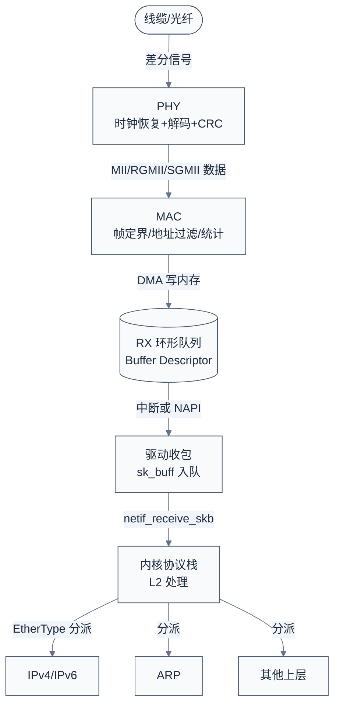
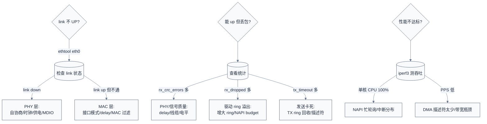

# 以太网协议与驱动

> 本篇以"对等网络、帧寻址、尽力而为"为主线，从网卡接入局域网的具体场景出发，逐层展开物理层（MDI 差分对 + 自协商 + 时钟恢复）、链路层（MAC 帧格式、802.3 帧 vs 802.1Q VLAN、CSMA/CD 与全双工）、Linux 网络驱动（`net_device` + `sk_buff` + NAPI + phylink 抽象 + Cadence MACB/GEM 驱动深入），并与 Zephyr `eth_dwmac` / MDIO+PHY 分层框架对照。
>
> **工程师视角**：以太网与本专题五种协议（SPI/I2C/CAN/USB/SDIO）本质不同——它是**对等网络**而不是主从总线，上层直接挂 TCP/IP 协议栈。调试以太网（link 起不来、丢包、性能上不去、NAPI 忙轮询、PHY 自协商失败）时，第一要务是定位"问题在第几层"：是 PHY 没握手、MAC 没配好、驱动 ring buffer 溢出、还是协议栈丢包。本篇先立分层模型，再钻驱动。

### 关键术语

| **缩写** | **全称** | **含义** |
|------|------|------|
| MAC | Media Access Control | 介质访问控制层，以太网链路层核心 |
| PHY | Physical Layer | 物理层收发器，负责编码/解码与电气信号 |
| MDI | Medium Dependent Interface | 介质相关接口，RJ45 引脚定义 |
| MDIO | Management Data Input/Output | PHY 管理接口（双线串行寄存器访问） |
| MII | Media Independent Interface | 介质无关接口，MAC↔PHY 数据通路 |
| RMII | Reduced MII | 简化 MII（50MHz 时钟、2 根数据线） |
| GMII | Gigabit MII | 千兆 MAC↔PHY 接口（8 位数据 + 125MHz） |
| RGMII | Reduced GMII | 简化千兆接口（4 位 DDR，125MHz 双沿） |
| SGMII | Serial Gigabit MII | 串行千兆接口（1.25Gbps 差分对） |
| CSMA/CD | Carrier Sense Multiple Access with Collision Detection | 载波侦听多路访问/冲突检测（半双工） |
| FCS | Frame Check Sequence | 帧校验序列（CRC-32） |
| CRC | Cyclic Redundancy Check | 循环冗余校验 |
| VLAN | Virtual Local Area Network | 虚拟局域网（IEEE 802.1Q 帧标签） |
| Q-TAG | Queue Tag | 802.1Q 帧中 4 字节 VLAN 标签 |
| MTU | Maximum Transmission Unit | 最大传输单元（默认 1500 字节） |
| sk_buff | socket buffer | Linux 网络核心数据缓冲结构 |
| NAPI | New API | Linux 收包轮询机制（减少中断） |
| TX/RX | Transmit/Receive | 发送/接收 |
| DMA | Direct Memory Access | 直接内存访问 |
| BD | Buffer Descriptor | 缓冲区描述符（DMA 环形队列） |
| L2/L3/L4 | Layer 2/3/4 | 链路/网络/传输层 |
| IP | Internet Protocol | 网际协议 |
| ARP | Address Resolution Protocol | 地址解析协议（IP→MAC） |
| PHY Reg | PHY Register | PHY 管理寄存器（MII 寄存器） |
| NVM | Non-Volatile Memory | 非易失存储器 |
| OUI | Organizationally Unique Identifier | 组织唯一标识符（MAC 前 3 字节） |
| EOP | End of Packet | 包结束 |
| SFP | Small Form-factor Pluggable | 可插拔光模块接口 |

### 前置知识

| **需要了解** | **参考文档** |
|----------|----------|
| 差分信号与通信协议共性维度 | [00-通信协议总览](./00-通信协议总览.md) |
| Linux 驱动模型（probe、platform driver） | [01-SPI协议与驱动](./01-SPI协议与驱动.md) |
| DMA 环形队列与描述符 | [07-性能调优与DMA深入](./07-性能调优与DMA深入.md) |
| NAPI 与中断底半部 | [08-中断处理与延迟优化](./08-中断处理与延迟优化.md) |
| 互联协议全景坐标系 | [interconnect/01-互联总线与协议全景辨析](./interconnect/01-互联总线与协议全景辨析.md) |

---

## 1. 以太网本质：对等的帧交换网络

> [00-通信协议总览](./00-通信协议总览.md) 已把五种协议按"主从/对等、同步/异步"归位，但以太网不在其中——它是板级总线之外、面向机器间通信的**网络协议**。这一章用"插网线上网"的具体场景说透两件事：为什么以太网选对等模型，以及"帧"为什么是以太网的通信单元。

### 1.1 一个具体场景：把开发板接入局域网

把开发板的网口通过网线接到交换机，再从交换机接入路由器：

1. **链路协商阶段**（毫秒级）：
   - 网线两端各自上电后，PHY 开始**自协商**（Auto-Negotiation）：通过一组脉冲交换双方支持的速度/双工能力，协商出共同的最高能力（比如 1000Mbps 全双工）
   - 协商成功后，PHY 把 link 状态上报给 MAC，`net_device` 层触发 `LINK_UP` 通知上层

2. **IP 配置阶段**（协议栈层面）：
   - 内核拿到链路事件后，通过 DHCP（若配置）或静态配置获得 IP 地址
   - 要发第一个包时，先查 ARP 表找网关 MAC，找不到则广播 ARP 请求，得到应答后建 ARP 缓存

3. **运行阶段**：应用产生数据 → 协议栈封装成 IP 包 → 链路层封装成 MAC 帧（含目的/源 MAC + EtherType）→ 驱动把帧填入 DMA 描述符 → MAC 逐位交给 PHY 发出。

> **核心要点**：与 USB 的"主机轮询、设备被动应答"完全相反——以太网上**任何节点都可以在任何时刻发起帧**，没有总调度者。交换机（或 Hub）负责转发，但不决定"谁先发"。这意味着碰撞可能发生（半双工时），MAC 必须处理重传；全双工下点到点连接则彻底取消碰撞检测。

### 1.2 与 USB 对比：为什么以太网选对等

| **对比维度** | **USB** | **Ethernet** |
|----------|-----|-----|
| 角色模型 | 主机轮询，设备被动 | 对等，任何节点可发起 |
| 拓扑 | 树型（Hub 级联） | 星型/网状（交换机互连） |
| 通信单元 | 端点（Endpoint）+ 管道 | MAC 帧（Frame） |
| 寻址 | 设备地址 + 端点号 | 48 位 MAC 地址 |
| 即插即用 | 枚举协议分配地址 | 自协商 + ARP/DHCP |
| 距离 | 2.0 ≤ 5m，3.x ≤ 3m | 铜缆 100m，光纤 km 级 |
| 供电 | 总线供电 5V | 无（PoE 是 802.3af/at/bt 附加） |
| 可靠性 | 协议内置重传/流控 | 链路层尽力而为，可靠靠 TCP |
| 实时性 | Isochronous 保时序 | TSN（802.1Qbv）扩展 |

以太网选对等的根本原因：它的目标场景是**机器互联**——服务器、PC、交换机彼此地位平等，谁都无法"枚举"和"调度"别人。即插即用不需要统一枚举：节点接入后通过自协商完成物理握手，通过 ARP/DHCP 完成地址学习。CAN 也是对等，但 CAN 用帧 ID 仲裁（总线广播、物理层仲裁），以太网用交换机按 MAC 转发（逐跳转发、无总线仲裁）——两者"对等"的实现路径不同。

### 1.3 帧：以太网的通信单元

以太网交换数据的最小单位是**MAC 帧**，一个典型以太网 II 帧结构如下：

| 字段 | 长度 | 说明 |
|------|------|------|
| **前导码** | 7 字节 | 0x55 × 7，收端同步时钟 |
| **SFD** | 1 字节 | 帧起始定界符 0xD5 |
| **目的 MAC** | 6 字节 | 48 位目标地址 |
| **源 MAC** | 6 字节 | 48 位源地址 |
| **EtherType / Length** | 2 字节 | ≥1536 表示类型（0x0800=IPv4，0x0806=ARP），否则表示长度（802.3 原始帧） |
| **Payload** | 46–1500 字节 | 数据（不足 46 需填充） |
| **FCS** | 4 字节 | CRC-32 校验（目的 MAC 到 Payload） |

> **帧为什么有最小长度 64 字节（不含前导码）？** 半双工以太网用 CSMA/CD，发送方必须在发出前 64 字节内检测到冲突（否则无法确定自己是否独占总线）。64 字节 = 目的(6)+源(6)+类型(2)+最小载荷(46)+FCS(4)。全双工下无冲突，但帧长限制被保留以兼容交换机与网络设备。这正是"以太网二地址+类型字段"与 USB"设备地址+端点"的差异根源：帧要能在网络上被逐跳转发，所以必须自带完整的目的地址，而 USB 只在主机管辖的一条链路内寻址。

### 1.4 以太网速率档次

| **速率** | **标准** | **接口** | **典型介质** | **编码** | **最大距离** |
|------|------|----------|----------|------|------|
| **10M** | IEEE 802.3 | MII | UTP Cat3 | Manchester | 100m |
| **100M** | IEEE 802.3u | MII/RMII | UTP Cat5 | 4B/5B | 100m |
| **1G** | IEEE 802.3ab | GMII/RGMII/SGMII | UTP Cat5e | 8B/10B | 100m |
| **2.5G/5G** | IEEE 802.3bz | SGMII(×2/×5)/USXGMII | UTP Cat5e/6 | 8B/10B 或更高 | 100m |
| **10G** | IEEE 802.3ae | XGMII/XAUI/SFI | 光纤/SFP+ | 64B/66B | 多模 ~300m |
| **25G/40G/100G** | IEEE 802.3by/bj | …/CAUI/… | 光纤/SFP28/QSFP | 64B/66B 及以上 | 视介质 |
| **400G/800G** | IEEE 802.3bs/df | …/…/… | 光纤 | PAM4 | 视介质 |

> **如何读这张表**：纵向看是"以太网的物理升级史"——每代提升速率靠两件事：更高的编码效率（Manchester → 4B/5B → 8B/10B → 64B/66B → PAM4）和更复杂的均衡/调制。横向看 MAC↔PHY 接口不断简化引脚（MII 16 线 → RGMII 12 线 → SGMII 2 线），同时把时钟嵌进数据流。这与 USB 2.0→3.0 的演进逻辑一致：速率越高，越依赖串行化与时钟恢复。

---

## 2. 物理层：MDI 差分对与自协商

> 上一章讲了"帧在链路上怎么被识别"。这一章讲线上的位怎么编码、MAC 与 PHY 怎么分工——以太网把"物理媒介无关"和"物理媒介相关"用 MAC/PHY 接口切开，这是它可复用到光纤/同轴/双绞线/车载等多种介质的关键。

### 2.1 MAC 与 PHY 的分工

以太网芯片内部严格分为两块：

| **部件** | **职责** | **实现层次** |
|----------|----------|--------------|
| **MAC** | 帧封装/解封装、CRC 计算、流控、地址过滤、统计 | 逻辑（数字） |
| **PHY** | 编码（8B/10B 等）、时钟恢复、电平驱动、自协商、链路检测 | 模拟 + 数字混合 |

两者之间的数据接口是 **MII 家族**（RMII/RGMII/SGMII），管理接口是 **MDIO**（一根时钟 MDC + 一根数据 MDIO，读写 PHY 的 32 个 16 位寄存器）。

> **为什么必须拆成 MAC 和 PHY？** 因为物理介质差异极大——双绞线用差分电压，光纤用光信号，汽车以太网用单对线。若 MAC 直接含 PHY，换一种介质就要重新设计数字逻辑。拆开后 MAC 是纯数字、可移植，PHY 是模拟为主、按介质定制，标准只规定 MII/MDIO 接口，两边各自演进。驱动工程师看到的也正是这个分工：MAC 驱动 + PHY 驱动（或 phylink 让 MAC 统一管理）。

### 2.2 编码与时钟恢复

以太网把**时钟嵌在数据流里**，收端靠数据跳变恢复时钟（这与 USB NRZI 思路相同）：

| **速率** | **编码** | **原理** |
|----------|----------|----------|
| 10M | Manchester | 每位中间必有跳变（高→低=0，低→高=1） |
| 100M | 4B/5B + MLT-3 | 4 位数据映射 5 位码，保证跳变密度 |
| 1G | 8B/10B | 8 位数据映射 10 位码，保证 DC 平衡与时钟密度 |
| 10G+ | 64B/66B | 2 位同步头 + 64 位数据，开销仅 3% |
| 400G+ | PAM4 | 4 电平承载 2 bit/符号，配合 DSP 均衡 |

> **为什么高速必须用扰码/平衡码？** 如果数据里出现一长串 0 或 1，收端无法产生跳变来恢复时钟，且直流分量会漂移损坏链路。8B/10B 和 64B/66B 通过保证"跳变足够多 + DC 平衡"解决这两个问题。代价是额外开销：8B/10B 损失 20% 带宽（标称 1.25Gbps 线速只承载 1Gbps 数据），这也是 10G 改用 64B/66B（仅 3% 开销）的原因。

### 2.3 自协商（Auto-Negotiation）

两个 PHY 相连后，各自广播能力集（速度、双工、流控），取**双方共同支持的最高优先级组合**：

| **优先级** | **能力** |
|-----------|----------|
| 最高 | 10G / 5G / 2.5G 全双工（取决于双方实现） |
| | 1000M 全双工 |
| | 1000M 半双工 |
| | 100M 全双工 |
| | 100M 半双工 |
| 最低 | 10M 全双工 / 10M 半双工 |

自协商失败的典型表现：**link 不 UP 或速率降档**。排查方向是 PHY 配置（寄存器 0/4/9）、时钟、供电、以及对端强制模式（若一端强制 100M 全双工、另一端自协商，可能出现"速率协商成 100M 但双工不一致"的经典故障）。

### 2.4 全双工 vs 半双工：CSMA/CD

- **半双工**（共享式 Hub 时代）：CSMA/CD——发前先侦听（Carrier Sense），空闲才发；边发边检测（Collision Detection），发现冲突发 jamming 信号后指数退避重发。帧长下限 64 字节与冲突窗口强相关。
- **全双工**（交换机时代）：每对差分线独立收发，无冲突、无 CSMA/CD，帧长下限保留兼容性。MAC 增加 PAUSE 流控帧（802.3x）在缓存溢出前请求对端暂停。

> **核心要点**：现代以太网 99% 是全双工点到点（交换机每端口独立），CSMA/CD 已几乎不触发。但工程师仍需理解它——因为它决定了帧长下限、NIC 统计里 `collisions` 字段的意义，以及为何旧式 Hub 会带来大量冲突而交换机不会。

---

## 3. 链路层协议：从 MAC 帧到 VLAN

> 上一章解决了"线上怎么传"。这一章讲"帧里装什么"——MAC 地址怎么来、EtherType 怎么区分协议、VLAN 怎么在帧里插标签。这些是驱动之上、协议栈之下的"链路层细节"。

### 3.1 MAC 地址与以太网协议族

- MAC 地址 48 位，前 3 字节 OUI（厂商，IEEE 分配），后 3 字节厂商分配。
- 单播（bit0=0）/ 组播（bit0=1）/ 广播（FF:FF:FF:FF:FF:FF）。
- EtherType 字段标识上层协议：`0x0800` IPv4、`0x86DD` IPv6、`0x0806` ARP、`0x8100` VLAN 标签、`0x88A8` QinQ、`0x88F7` PTP。
- 交换机维护 **FDB（Forwarding Database）**：学源 MAC → 端口映射，据此转发帧。这就是"交换机按 MAC 逐跳转发"的机制。

### 3.2 802.1Q VLAN 标签

标准以太网帧在源 MAC 之后插入 4 字节 Q-TAG：

| **字段** | **长度** | **说明** |
|----------|----------|----------|
| **TPID** | 2 字节 | 0x8100（原 EtherType 位置被占，真正 EtherType 后移） |
| **TCI** | 2 字节 | 3 bit PCP 优先级 + 1 bit DEI + 12 bit VID（0–4095） |

VLAN 的作用是把一个物理网络切成多个逻辑网络：广播域被隔离、安全可控、流量可按 VLAN 标记转发。驱动层面，`ndo_vlan_rx_add_vid` / `ndo_vlan_rx_kill_vid` 负责把 VLAN 过滤规则下发到 MAC 硬件。

### 3.3 帧长度与 MTU

- 标准以太网帧最大载荷 **1500 字节**，即 **MTU=1500**（IP 层视角）。
- **Jumbo Frame**（≥1500，常见 9000）用于数据中心减少每包开销，需要交换机和两端 MAC 都开启。
- 载荷不足 46 字节要填充（padding）到最小帧长 64 字节，收端按 EtherType 或 length 识别实际载荷长度。
- IP 分片：超过 MTU 的 IP 包在发送侧分片，在接收侧重组；驱动层不关心，协议栈处理。

### 3.4 链路层完整收帧流程（从线到 sk_buff）



> **如何读这张图**：PHY 负责把模拟信号还原成数字帧字节流（含 CRC 校验），MAC 负责帧定界、地址过滤、按 RX 描述符 DMA 到内存，驱动把内存中的帧数据包成 `sk_buff` 交给协议栈。**"哪个环节丢帧"是调试的分层线索**——PHY CRC 错（信号质量）、MAC 丢帧（描述符溢出/过滤配置）、驱动丢帧（ring 满）、协议栈丢帧（内存/缓冲区不足）。

---

## 4. Linux 网络驱动框架：net_device 与 sk_buff

> 前面三层讲的是协议。这一章进入 Linux 实现：以太网驱动的核心契约是 `struct net_device` + `struct net_device_ops`，数据流动的核心结构是 `sk_buff` 与 DMA 环形队列。参照 [01-SPI协议与驱动](./01-SPI协议与驱动.md) 的"子系统抽象"思路，本章揭示 `net_device` 如何像 `spi_controller` 一样扮演"通用框架 ↔ 厂商驱动"的中间层。

### 4.1 struct net_device：网络设备的通用契约

`net_device` 是 Linux 网络子系统的核心数据结构，同时代表"一个网络接口"和"驱动与协议栈的契约"。驱动通过 `alloc_etherdev_mq(sizeof(priv), num_queues)` 分配，私有数据挂在其后，用 `netdev_priv()` 访问。

> 关键设计：`net_device` 是"**小而通用的内核对象**"，与 USB 的 `usb_device` 地位相同——协议栈只认 `net_device` 提供的标准接口（`net_device_ops`、`features`、`ethtool_ops` 等），不关心底层是 MACB、e1000e 还是 veth。这就是"子系统抽象"在网络栈的体现。

### 4.2 struct net_device_ops：驱动回调集

以 Cadence MACB 为例（[macb_main.c:4295](file:///home/pbw/2042f/linux/drivers/net/ethernet/cadence/macb_main.c#L4295)）：

```c
static const struct net_device_ops macb_netdev_ops = {
	.ndo_open		= macb_open,
	.ndo_stop		= macb_close,
	.ndo_start_xmit		= macb_start_xmit,
	/* ... 省略其余字段 ... */
};
```

| **回调** | **作用** | **类比** |
|----------|----------|----------|
| `ndo_open` | 打开设备：申请内存、配 PHY、启用队列、NAPI 使能 | USB 设备 `probe` 后激活 |
| `ndo_stop` | 关闭设备：停队列、NAPI 停、释放资源 | 设备 `disconnect` |
| `ndo_start_xmit` | 发送一个 `sk_buff` | URB `submit` |
| `ndo_set_rx_mode` | 配置接收过滤（单播/多播/混杂） | 端点过滤器 |
| `ndo_set_mac_address` | 修改 MAC | 设备地址 |
| `ndo_tx_timeout` | 发送超时恢复 | watchdog |
| `ndo_vlan_rx_add_vid/kill_vid` | 增加/删除 VLAN 过滤 | — |
| `ndo_setup_tc` | 流量分类（QoS/TBF） | — |

> **核心要点**：`ndo_start_xmit` 是以太网驱动的"发送主入口"，对应 USB 的 `urb_enqueue`、SPI 的 `transfer_one`——协议栈把 `sk_buff` 交给驱动，驱动负责把它变成硬件能消费的描述符。理解这个回调，"驱动如何发送数据"就有了抓手。

### 4.3 sk_buff：网络数据包容器

`sk_buff` 是所有网络协议共用的数据缓冲结构（[linux/include/linux/skbuff.h](file:///home/pbw/2042f/linux/include/linux/skbuff.h)），记录包数据、协议头偏移、校验和状态、DMA 映射等。关键字段：

| **字段/概念** | **含义** |
|---------------|----------|
| `head`/`data`/`tail`/`end` | 缓冲区指针范围；`data` 可上下移动（添加/剥离协议头） |
| `len` | 包数据总长度 |
| `protocol` | 链路层 EtherType（收包时由驱动设置） |
| `skb_shinfo` | 分片/GSO/时间戳信息 |
| `dev` | 关联的网络设备 |

> **为什么 `data` 指针要能移动？** 每层协议都要在自己头部前添加或剥离头部：以太网驱动加 14 字节 MAC 头，IP 层加 IP 头，TCP 层加 TCP 头。`skb_reserve()` 预留头部空间、`skb_push()`/`skb_pull()` 移动指针，避免每层都复制数据。这是"零拷贝分层"的核心机制。

### 4.4 DMA 环形队列（Buffer Descriptor Ring）

MAC 与内存之间通过**描述符环形队列**交换数据：驱动预先分配 N 个描述符（BD），每个 BD 指向一块 DMA 缓冲区并带控制/状态位（owned by HW/CPU），硬件按序消费，驱动按序回收。

MACB 的硬件描述符极小——只有两个字段（[macb.h:849](file:///home/pbw/2042f/linux/drivers/net/ethernet/cadence/macb.h#L849)）：

```c
/* struct macb_dma_desc - Hardware DMA descriptor
 * @addr: DMA address of data buffer
 * @ctrl: Control and status bits
 */
struct macb_dma_desc {
	u32	addr;
	u32	ctrl;
};
```

驱动侧为每个 TX 描述符维护一份**软件影子**（[macb.h:968](file:///home/pbw/2042f/linux/drivers/net/ethernet/cadence/macb.h#L968)），记录硬件不知道的信息：

```c
struct macb_tx_skb {
	struct sk_buff		*skb;
	dma_addr_t		mapping;
	size_t			size;
	bool			mapped_as_page;
};
```

> **这段代码体现了什么设计决策？** 硬件描述符只有 `addr`+`ctrl`，因为它只需要"去拿数据、发完置位"；而 DMA 映射关系、`sk_buff` 归属是软件层面的资源管理，必须由驱动跟踪。**"硬件极简描述符 + 软件影子数组"**是以太网驱动释放/回收 DMA 资源的基础——收完一帧要 `dma_unmap` + `dev_kfree_skb`，若只靠硬件描述符，驱动无法知道该释放哪个 `sk_buff`。这正是与 [07-性能调优与DMA深入](./07-性能调优与DMA深入.md) 中 SDHCI ADMA 描述符的同一思想：描述符是"驱动与硬件之间的共享内存契约"。

Ring 满的后果：RX 满 → 丢帧（`stats.rx_dropped` 上升）；TX 满 → `ndo_start_xmit` 返回 `NETDEV_TX_BUSY` 并停队列（见 4.5）。

### 4.5 发送路径：ndo_start_xmit 到硬件

以 MACB 的 `macb_start_xmit`（[macb_main.c:2262](file:///home/pbw/2042f/linux/drivers/net/ethernet/cadence/macb_main.c#L2262)）为例，发送一个 `sk_buff` 的完整步骤：

1. 协议栈调 `ndo_start_xmit(skb, dev)`，驱动获得一个待发送包
2. **校验和卸载判断**：`macb_clear_csum` 检查网卡是否支持硬件计算校验和，若支持则剥掉协议栈算好的校验和（避免双重计算）
3. **填充与 FCS**：`macb_pad_and_fcs` 确保帧长 ≥ 64 字节，并决定是否让硬件追加 FCS
4. **LSO/GSO 判断**：若 `skb_shinfo(skb)->gso_size` 非零，说明是大包切分（TCP Segmentation Offload），此时按 TCP 头/载荷边界拆分，硬件来切段
5. **描述符计数**：根据 `skb_headlen` 和分片（frags）计算需要多少个 TX 描述符，超过 `max_tx_length` 的要拆成多段
6. **入队**：`spin_lock` 保护队列指针，把 `sk_buff` 挂到 TX ring，提交描述符给硬件
7. **唤醒发送队列**：若硬件还有空位，调 `netif_wake_queue` 让协议栈继续投递

其中**入队与硬件触发**是理解发送路径的核心（[macb_main.c:2331](file:///home/pbw/2042f/linux/drivers/net/ethernet/cadence/macb_main.c#L2331)）：

```c
	/* This is a hard error, log it. */
	if (CIRC_SPACE(queue->tx_head, queue->tx_tail,
		       bp->tx_ring_size) < desc_cnt) {
		netif_stop_subqueue(dev, queue_index);
		netdev_dbg(bp->dev, "tx_head = %u, tx_tail = %u\n",
			   queue->tx_head, queue->tx_tail);
		ret = NETDEV_TX_BUSY;
		goto unlock;
	}

	/* Map socket buffer for DMA transfer */
	if (macb_tx_map(bp, queue, skb, hdrlen)) {
		dev_kfree_skb_any(skb);
		goto unlock;
	}

	/* Make newly initialized descriptor visible to hardware */
	wmb();
	skb_tx_timestamp(skb);
	netdev_tx_sent_queue(netdev_get_tx_queue(bp->dev, queue_index),
			     skb->len);

	spin_lock(&bp->lock);
	macb_writel(bp, NCR, macb_readl(bp, NCR) | MACB_BIT(TSTART));
	spin_unlock(&bp->lock);

	if (CIRC_SPACE(queue->tx_head, queue->tx_tail, bp->tx_ring_size) < 1)
		netif_stop_subqueue(dev, queue_index);
```

> **这段代码体现了什么设计决策？** 四个关键点：
> 1. **`CIRC_SPACE` 判满**：用环形队列的经典 head/tail 余量判断描述符是否够用，不够就 `netif_stop_subqueue` 停队列并返回 `NETDEV_TX_BUSY`——协议栈会停止投递并稍后重试。这是"驱动用 back-pressure 反压协议栈"的机制。
> 2. **`macb_tx_map` 逐段 DMA 映射**：`sk_buff` 的 head 和每个 frag 都可能超过硬件 `max_tx_length`，所以按 `max_tx_length` 切成多段、每段一个描述符——软件把"逻辑帧"映射成"物理描述符链"。
> 3. **`wmb()` 内存屏障**：在填好描述符后、触发硬件前必须保证描述符写入对硬件可见。DMA 场景下"写可见性顺序"是驱动最容易出错的地方，`wmb()` 是硬件与 CPU 之间的契约。
> 4. **`macb_writel(NCR, ... | TSTART)`**：软件通过写 `TSTART` 位"敲一下"MAC 开始搬运——描述符准备好但硬件不会自动启动，必须显式触发。这正是"共享内存 + 门铃（doorbell）"模型。

`macb_tx_map` 内部（[macb_main.c:1990](file:///home/pbw/2042f/linux/drivers/net/ethernet/cadence/macb_main.c#L1990)）先映射 head 再映射 frags，每段记录 `mapping`/`size`/`mapped_as_page` 到影子数组——**这些信息只用于发送完成后的释放**：

```c
	/* First, map non-paged data */
	len = skb_headlen(skb);
	/* first buffer length */
	size = hdrlen;
	offset = 0;
	while (len) {
		tx_skb = macb_tx_skb(queue, tx_head);
		mapping = dma_map_single(&bp->pdev->dev,
					 skb->data + offset,
					 size, DMA_TO_DEVICE);
		/* Save info to properly release resources */
		tx_skb->skb = NULL;
		tx_skb->mapping = mapping;
		tx_skb->size = size;
		tx_skb->mapped_as_page = false;
		/* ... 循环处理剩余段 ... */
	}
```

**发送完成回收**：硬件发完一帧会清掉首个描述符的 `TX_USED` 位。`macb_tx_complete`（[macb_main.c:1172](file:///home/pbw/2042f/linux/drivers/net/ethernet/cadence/macb_main.c#L1172)）在 NAPI 的 TX poll 里扫描描述符：

```c
		desc = macb_tx_desc(queue, tail);
		/* Make hw descriptor updates visible to CPU */
		rmb();
		ctrl = desc->ctrl;
		/* TX_USED bit is only set by hardware on the very first buffer
		 * descriptor of the transmitted frame.
		 */
		if (!(ctrl & MACB_BIT(TX_USED)))
			break;
		/* Process all buffers of the current transmitted frame */
		for (;; tail++) {
			tx_skb = macb_tx_skb(queue, tail);
			skb = tx_skb->skb;
			if (skb) {
				bp->dev->stats.tx_packets++;
				queue->stats.tx_packets++;
				bp->dev->stats.tx_bytes += skb->len;
				packets++;
			}
			/* Now we can safely release resources */
			macb_tx_unmap(bp, tx_skb, budget);
			/* skb is set only for the last buffer of the frame. */
			if (skb)
				break;
		}
```

> **这段代码体现了什么设计决策？** 注意注释里"TX_USED 只由硬件在**帧的第一个描述符**上置位"——一个帧可能跨多个描述符，硬件只在帧头描述符标记完成，驱动靠"追踪到帧尾（skb 非空）再 break"来整帧回收。**"帧头标记 + 遍历到帧尾"** 避免了为每个描述符都维护完成位，是描述符链压缩硬件状态的设计。回收末尾还有一段阈值判断：仅在 `CIRC_CNT <= MACB_TX_WAKEUP_THRESH` 时 `netif_wake_subqueue`，避免频繁唤醒——这是"背压与唤醒的节流"。

### 4.6 接收路径：中断 → NAPI → 协议栈

接收用 **NAPI**（详见 [08-中断处理与延迟优化](./08-中断处理与延迟优化.md)）。中断处理函数 `macb_interrupt`（[macb_main.c:1851](file:///home/pbw/2042f/linux/drivers/net/ethernet/cadence/macb_main.c#L1851)）看到 RX 就绪位后，把队列挂进 NAPI 调度：

```c
			if (napi_schedule_prep(&queue->napi_rx)) {
				queue_writel(queue, IDR, bp->rx_intr_mask);
				__napi_schedule(&queue->napi_rx);
			}
```

> **这段代码体现了什么设计决策？** 先 `napi_schedule_prep` 确认队列未在轮询、再**写 `IDR` 关 RX 中断**、然后才 `__napi_schedule`——"**先关中断再入队轮询**"的顺序保证中断处理与 poll 之间没有竞态窗口：一旦进入 NAPI，中断保持关闭，靠 poll 批量消费；poll 结束才重新开中断。

`macb_rx_poll` 调用 `macb_rx` → `macb_rx_frame`（[macb_main.c:1436](file:///home/pbw/2042f/linux/drivers/net/ethernet/cadence/macb_main.c#L1436)）把 DMA 缓冲区里的帧数据复制进 `sk_buff` 并交给协议栈。关键片段：

```c
	/* The ethernet header starts NET_IP_ALIGN bytes into the
	 * first buffer. Since the header is 14 bytes, this makes the
	 * payload word-aligned.
	 * Instead of calling skb_reserve(NET_IP_ALIGN), we just copy
	 * the two padding bytes into the skb so that we avoid hitting
	 * the slowpath in memcpy(), and pull them off afterwards.
	 */
	skb = netdev_alloc_skb(bp->dev, len + NET_IP_ALIGN);
	/* ... 逐段拷贝 DMA 缓冲数据到 skb ... */
	__skb_pull(skb, NET_IP_ALIGN);
	skb->protocol = eth_type_trans(skb, bp->dev);
	bp->dev->stats.rx_packets++;
	bp->dev->stats.rx_bytes += skb->len;
	napi_gro_receive(napi, skb);
```

> **这段代码体现了什么设计决策？** 两个细节：
> 1. **`NET_IP_ALIGN` 对齐优化**：以太网头 14 字节，为了让它后的 IP 头对齐到 4 字节（CPU 访问更高效），驱动故意多拷贝 2 字节填充再 `__skb_pull`。这个"凑对齐"的拷贝在每一帧上发生，是接收路径的经典优化——**宁可多拷 2 字节，也要让上层免于 unaligned 访问**。
> 2. **`napi_gro_receive` 而非 `netif_receive_skb`**：把帧送入 **GRO（Generic Receive Offload）**——NAPI 上下文里合并属于同一 TCP 流的多帧为一个大 `sk_buff`，减少协议栈处理次数。这是 NAPI 之外的第二层批量化，是高性能收包的标配。

最后，poll 收完（work_done < budget）时重新使能中断，并处理"轮询期间又有新包"的边界——若 `macb_rx_pending` 仍为真，则**不打开中断而是重新 `napi_schedule`**（[macb_main.c:1649](file:///home/pbw/2042f/linux/drivers/net/ethernet/cadence/macb_main.c#L1649)），避免"关中断后错过唤醒"的经典竞态。

> **为什么用 NAPI 而不是纯中断？** 高速流量下每帧一个中断会让 CPU 陷入中断风暴（interrupt storm），上下文切换开销超过处理包本身。NAPI 在负载高时"中断转轮询"，把收包开销摊薄到批量处理。这是以太网驱动区别于 USB HCD（URB 完成回调）的关键性能设计。

### 4.7 phylink：MAC 与 PHY 的现代接口

老式驱动用 `phy_connect` 直接在驱动里绑定 PHY；现代驱动（MACB 即采用）用 **phylink** 框架（[macb_main.c:30](file:///home/pbw/2042f/linux/drivers/net/ethernet/cadence/macb_main.c#L30) 引入 `<linux/phylink.h>`）。MACB 提供三个回调，phylink 在 PHY 状态变化时回调它们：

```c
static void macb_mac_config(struct phylink_config *config, unsigned int mode,
			    const struct phylink_link_state *state);
static void macb_mac_link_down(struct phylink_config *config, unsigned int mode,
			       phy_interface_t interface);
static void macb_mac_link_up(struct phylink_config *config, unsigned int mode,
			     phy_interface_t interface, struct phy_device *phy);
```

驱动初始化时调用 `phylink_create` 注册这几个回调，`macb_open` 里 `macb_phylink_connect`（[macb_main.c:765](file:///home/pbw/2042f/linux/drivers/net/ethernet/cadence/macb_main.c#L765)）用设备树的 `phy-handle` 找到 PHY 并 `phylink_start`。此后：

- **自协商结果变化** → phylink 解析能力位 → 调 `macb_mac_config`（配置 MAC 侧速率/双工）
- **link 建立** → 调 `macb_mac_link_up`（配置 RGMII delay、启动 DMA）
- **link 断开** → 调 `macb_mac_link_down`

> **这段代码体现了什么设计决策？** 把"PHY 状态机"和"MAC 应做的事"解耦：PHY 自协商、能力解析、SFP 管理是**通用逻辑**，由 phylink 核心实现；MAC 驱动只回答"我的 MAC 在当前模式下该怎么配"（三个回调）。这样同一 phylink 核心可以服务千兆 MAC、10G MAC、SFP+ 模块，而 MAC 驱动无需了解 PHY 细节。设备树的 `phy-mode`/`phy-handle`/`fixed-link` 正是 phylink 的输入契约——这也是为什么现代以太网节点必须有这些属性。

---

## 5. Linux MACB/GEM 驱动深入

> 第 4 章讲了框架。这一章用 Cadence MACB/GEM（`cdns,macb` / `cdns,gem`，[macb_main.c](file:///home/pbw/2042f/linux/drivers/net/ethernet/cadence/macb_main.c)）做解剖样本——它覆盖板级 10/100/1000M 全速率、支持 phylink、多队列与 PTP，是嵌入式 SoC（Zynq、SAMA、RISC-V SoC 常见）的标准网卡 IP，与 [04-USB协议与驱动](./04-USB协议与驱动.md) 的 DWC2 分析思路对应。

### 5.1 macb_probe：驱动入口

[macb_probe](file:///home/pbw/2042f/linux/drivers/net/ethernet/cadence/macb_main.c#L5438) 的关键步骤：

1. `devm_platform_get_and_ioremap_resource` 拿寄存器基址
2. `of_device_get_match_data` 获取平台配置（`cdns,macb` vs `cdns,gem` 等兼容串）
3. `macb_config->clk_init` 初始化时钟（pclk/hclk/tx_clk/rx_clk/tsu_clk）
4. `macb_probe_queues` 探测队列数量（GEM 支持多队列）
5. `alloc_etherdev_mq(sizeof(*bp), num_queues)` 分配 `net_device` + 私有数据
6. 设置寄存器读写函数（native I/O 或普通 mmio）、DMA 突发长度、jumbo 支持等

probe 中段展示了 `net_device` 与驱动私有数据的关系（[macb_main.c:5479](file:///home/pbw/2042f/linux/drivers/net/ethernet/cadence/macb_main.c#L5479)）：

```c
	dev = alloc_etherdev_mq(sizeof(*bp), num_queues);
	if (!dev) {
		err = -ENOMEM;
		goto err_disable_clocks;
	}
	dev->base_addr = regs->start;
	SET_NETDEV_DEV(dev, &pdev->dev);
	bp = netdev_priv(dev);
	bp->pdev = pdev;
	bp->dev = dev;
	bp->regs = mem;
	bp->num_queues = num_queues;
	/* ... 按 config 设置 DMA 突发、jumbo、wol 等 ... */
	if (!hw_is_gem(bp->regs, bp->native_io))
		bp->max_tx_length = MACB_MAX_TX_LEN;
	else if (macb_config->max_tx_length)
		bp->max_tx_length = macb_config->max_tx_length;
	else
		bp->max_tx_length = GEM_MAX_TX_LEN;
```

> **这段代码体现了什么设计决策？** `alloc_etherdev_mq(sizeof(*bp), num_queues)` 把 `net_device` 和 `struct macb` 分配在**同一块连续内存**里，`netdev_priv()` 返回私有一侧的指针——一个分配、两个视图。这与 USB 驱动 `alloc_etherdev`/`usb_alloc_dev` 同构。"net_device + 私有数据一体分配"避免了二次分配失败后的清理负担，是内核 device 模型的常见模式。注意 `max_tx_length` 由 `hw_is_gem` 硬件探测和 `macb_config` 平台配置共同决定——**硬件能力 + 平台差异决定驱动行为**。

### 5.2 macb 私有结构

| **结构** | **作用** |
|----------|----------|
| `struct macb` | 顶层实例：寄存器、时钟、队列数组、phylink 配置、DMA 参数 |
| `struct macb_queue` | 每队列：TX/RX 描述符环形缓冲、NAPI 实例、锁 |
| `struct macb_tx_skb` | TX 描述符的软件影子：`sk_buff`、DMA 映射、大小 |
| `struct macb_dma_desc` | 硬件描述符：`addr` + `ctrl` 两字段 |

`struct macb`（[macb.h:1281](file:///home/pbw/2042f/linux/drivers/net/ethernet/cadence/macb.h#L1281)）通过 `netdev_priv` 与 `net_device` 关联，等价于 USB 驱动里 `struct dwc2_hsotg` 与 `usb_hcd` 的关系。

### 5.3 macb_open：从 ifconfig up 到能收发

`macb_open`（[macb_main.c:2930](file:///home/pbw/2042f/linux/drivers/net/ethernet/cadence/macb_main.c#L2930)）是 `ndo_open` 的实现，展示了一个网卡从"上电"到"能收发"的完整初始化序列：

```c
static int macb_open(struct net_device *dev)
{
	size_t bufsz = dev->mtu + ETH_HLEN + ETH_FCS_LEN + NET_IP_ALIGN;
	struct macb *bp = netdev_priv(dev);
	int err;
	err = pm_runtime_resume_and_get(&bp->pdev->dev);
	if (err < 0)
		return err;
	/* RX buffers initialization */
	macb_init_rx_buffer_size(bp, bufsz);
	err = macb_alloc_consistent(bp);
	if (err)
		goto err_out;
	bp->macbgem_ops.mog_init_rings(bp);
	macb_init_buffers(bp);
	/* ... 使能每队列 NAPI ... */
	macb_init_hw(bp);
	err = phy_set_mode_ext(bp->phy, PHY_MODE_ETHERNET, bp->phy_interface);
	if (err)
		goto err_out;
	err = phy_power_on(bp->phy);
	if (err)
		goto err_out;
	err = macb_phylink_connect(bp);
	if (err)
		goto err_out;
	netif_tx_start_all_queues(dev);
	return 0;
	/* 各 err_out 逆序回退:关 PHY/复位/释放内存/暂停电源 */
}
```

> **这段代码体现了什么设计决策？** 初始化顺序是硬性的：
> 1. **先唤醒电源**（`pm_runtime_resume_and_get`），否则后续寄存器访问无效
> 2. **按 MTU 定 RX 缓冲区大小**（`dev->mtu + ETH_HLEN + ETH_FCS_LEN + NET_IP_ALIGN`）——RX 缓冲刚好容纳最大帧，不浪费内存
> 3. **分配 DMA 一致性内存 + 初始化环形缓冲**（`macb_alloc_consistent`/`macb_init_buffers`）——描述符与数据缓冲必须在硬件使用前就绪
> 4. **使能 NAPI** 后才初始化硬件——`macb_init_hw` 配置 MAC 寄存器、地址过滤等
> 5. **配 PHY 模式、上电、phylink 连接**——最后启动 PHY，等待自协商
> 6. `netif_tx_start_all_queues` 放行发送队列——此前协议栈发不出包

> 这个顺序对应"**软件资源 → 硬件配置 → PHY 启动 → 队列放行**"的依赖链：任一环节倒序都可能让硬件在描述符未就绪时就开始 DMA。这也解释了为什么 `ndo_stop` 完全逆序执行。

### 5.4 MACB vs GEM

| **对比维度** | **MACB** | **GEM** |
|----------|----------|---------|
| 速率 | 10/100M | 10/100/1000M |
| 队列 | 单队列 | 多队列（QoS/TFC） |
| TX 描述符 | 简化 | 支持 LSO/jumbo 拆分 |
| 接口 | MII/RMII | GMII/RGMII/SGMII |
| 时间戳 | 无 | PTP 硬件时间戳（tsu_clk） |
| phylink | 部分支持 | 完整支持 |
| RX 缓冲 | 固定 128 字节 × 多块 | 按 MTU 动态、支持 64 位 DMA 与 PTP 扩展描述符 |

---

## 6. Zephyr 网络栈与驱动对照

> 第 4–5 章讲了 Linux。这一章对照 Zephyr——它的网络栈是"**专为嵌入式 RTOS 裁剪的完整 TCP/IP 栈**"，驱动模型与 Linux 不同但分层逻辑相通。参照 [04-USB协议与驱动](./04-USB协议与驱动.md) 第 11 章的对照写法，这里揭示 Zephyr `net_if` 与 Linux `net_device` 的同构关系。

### 6.1 Zephyr 网络栈结构

Zephyr 原生网络栈位于 `subsys/net/ip/`（[zephyr-project/zephyr/subsys/net/ip/](file:///home/pbw/rtos/cs-learning-notes/zephyr-project/zephyr/subsys/net/ip/)），核心模块：

| **模块** | **作用** |
|----------|----------|
| `net_if.c` | 网络接口抽象（对应 Linux `net_device`） |
| `net_pkt.c` | 数据包缓冲（对应 `sk_buff`） |
| `net_context.c` | 应用套接字上下文（对应 `struct sock`） |
| `ipv4.c`/`ipv6.c`/`udp.c`/`tcp.c` | L3/L4 协议 |
| `net_mgmt.c` | 接口事件管理（link up/down、地址变化） |

驱动目录在 `drivers/ethernet/`，包括 `eth_dwmac.c`（DesignWare MAC）、`eth_sam_gmac.c`（对应 Linux MACB 同源 IP）、`eth_stm32_hal_*` 等。MAC 与 PHY 分层在 Zephyr 中体现为 **MDIO 驱动 + PHY 驱动 + 以太网驱动** 三件套（`drivers/ethernet/mdio/`、`drivers/ethernet/phy/`）。

### 6.2 ethernet_api：驱动回调契约

以太网驱动通过 `struct ethernet_api`（[zephyr-project/zephyr/include/zephyr/net/ethernet.h](file:///home/pbw/rtos/cs-learning-notes/zephyr-project/zephyr/include/zephyr/net/ethernet.h)）暴露能力：

```c
struct ethernet_api {
	struct net_if_api iface_api;          /* 必须位于首位：与 net_if 兼容 */
	int (*start)(const struct device *dev);
	int (*stop)(const struct device *dev);
	enum ethernet_hw_caps (*get_capabilities)(const struct device *dev);
	int (*set_config)(const struct device *dev, enum ethernet_config_type type,
			  const struct ethernet_config *config);
	int (*send)(const struct device *dev, struct net_pkt *pkt);
};
```

| **回调** | **对应 Linux** |
|----------|----------------|
| `start`/`stop` | `ndo_open`/`ndo_stop` |
| `send` | `ndo_start_xmit` |
| `get_capabilities` | `net_device->features` |
| `set_config` | `ndo_set_features`/ethtool |

> **核心要点**：`struct ethernet_api` 第一个成员必须是 `struct net_if_api`（有 `BUILD_ASSERT(offsetof(...) == 0)` 强制校验）——这是 C 语言实现"继承"的技巧，让以太网驱动能直接当 `net_if` 驱动用。数据单元是 `struct net_pkt`（Zephyr 的包缓冲），对应 Linux `sk_buff`。

eth_dwmac 的实现就是这套契约的落地（[eth_dwmac.c:684](file:///home/pbw/rtos/cs-learning-notes/zephyr-project/zephyr/drivers/ethernet/eth_dwmac.c#L684)）：

```c
static const struct ethernet_api dwmac_api = {
	.iface_api.init		= dwmac_iface_init,
	.get_capabilities	= dwmac_caps,
	.set_config		= dwmac_set_config,
	.send			= dwmac_send,
};
```

> **这段代码体现了什么设计决策？** 与 Linux `net_device_ops` 一样，驱动通过一个**回调结构体**向内核暴露能力，内核只认这个结构，不关心底层实现。`.iface_api.init` 先于以太网专有回调被调用——`net_if` 把设备初始化为一个网络接口，此后 `send` 才是真正的数据通路。

### 6.3 发送路径：net_if_tx → eth_dwmac

协议栈发包的入口是 `net_if_tx`（[net_if.c:216](file:///home/pbw/rtos/cs-learning-notes/zephyr-project/zephyr/subsys/net/ip/net_if.c#L216)），它做了三层事情：

```c
	if (net_if_flag_is_set(iface, NET_IF_LOWER_UP)) {
		/* ... 统计与跟踪 ... */
		net_if_tx_lock(iface);
		status = net_if_l2(iface)->send(iface, pkt);
		net_if_tx_unlock(iface);
		if (status < 0) {
			NET_WARN_RATELIMIT("iface %d pkt %p send failure status %d",
				     net_if_get_by_iface(iface), pkt, status);
		}
		/* ... 更新 TX 时间统计 ... */
	}
```

1. **先检查 `NET_IF_LOWER_UP`**——接口链路未就绪直接不发送（对应 Linux 的 `netif_carrier_ok`）
2. **加锁后调 `net_if_l2(iface)->send`**——L2 层的发送回调，以太网的 L2 会把 `net_pkt` 的 LL 头部（MAC 地址、EtherType）封装好再往下传
3. **失败时 `NET_WARN_RATELIMIT` 限速告警**——避免错误风暴刷屏（对比 Linux 的 `net_ratelimit`）

`dwmac_send`（[eth_dwmac.c:130](file:///home/pbw/rtos/cs-learning-notes/zephyr-project/zephyr/drivers/ethernet/eth_dwmac.c#L130)）是真正的硬件驱动侧发送：

```c
	/* map packet fragments */
	d_idx = p->tx_desc_head;
	frag = pkt->buffer;
	do {
		/* reserve a free descriptor for this fragment */
		if (k_sem_take(&p->free_tx_descs, TX_AVAIL_WAIT) != 0) {
			LOG_DBG("no more free tx descriptors");
			goto abort;
		}
		/* pin this fragment */
		pinned = net_buf_clone(frag, TX_AVAIL_WAIT);
		if (!pinned) {
			LOG_DBG("net_buf_clone() returned NULL");
			k_sem_give(&p->free_tx_descs);
			goto abort;
		}
		sys_cache_data_flush_range(pinned->data, pinned->len);
		p->tx_frags[d_idx] = pinned;
		/* if no more fragments after this one: */
		if (!frag->frags) {
			des2_flags |= TDES2_IOC;
			des3_flags |= TDES3_LD;
			/* ... 填最后一个描述符 ... */
		}
		/* ... 继续下一个 frag ... */
	} while (frag);
```

> **这段代码体现了什么设计决策？** 三个要点与 Linux 遥相呼应：
> 1. **`k_sem_take` 计数信号量当"空闲描述符池"**：有多少个空闲 TX 描述符就有多少信号量计数，取一个描述符就减一——这是 RTOS 版的"ring 满检查"，比 Linux 的 `CIRC_SPACE` 判断多了一层阻塞语义（`TX_AVAIL_WAIT` 等待）
> 2. **`net_buf_clone` + `sys_cache_data_flush_range`**：`net_pkt` 可能被协议栈复用，驱动要 clone 保活（引用计数），并显式刷 cache——在无 IOMMU 的 MCU 上，DMA 读取前必须 flush，否则 cache 里的数据还没落内存。这就是 [07-性能调优与DMA深入](./07-性能调优与DMA深入.md) 里"cache 一致性"的嵌入式形态
> 3. **`TDES2_IOC`/`TDES3_LD` 标志**：最后一个描述符置中断（IOC）和链尾（LD）位——与 MACB 的"帧尾描述符标记"思想一致

### 6.4 Zephyr MDIO + PHY 分层

- **MDIO 驱动**：提供 `mdio_read`/`mdio_write` 访问 PHY 寄存器（`mdio_stm32_hal.c`、`mdio_esp32.c` 等），对应 Linux `drivers/net/mdio/`。
- **PHY 驱动**：管理自协商、速率/双工配置、链路状态（`phy_mii.h` 提供通用 MII PHY 逻辑，各 PHY 芯片加私有配置）。
- **固定 link**：`phy_fixed_link.c` 用于无 PHY 的固定速率场景（对应 Linux fixed-link 设备树属性）。

> **核心要点**：Zephyr 的 MDIO+PHY 拆分与 Linux phylink 的思路一致——**PHY 逻辑与 MAC 逻辑解耦**，PHY 驱动可复用、MAC 驱动只关心 MII 数据路径。这是"接口契约 + 分层"思想在两种内核里的殊途同归。

### 6.5 net_pkt vs sk_buff 结构对照

`net_pkt` 的核心字段（[net_pkt.h:92](file:///home/pbw/rtos/cs-learning-notes/zephyr-project/zephyr/include/zephyr/net/net_pkt.h#L92)）：

```c
struct net_pkt {
	/** The fifo is used by RX/TX threads and by socket layer. */
	intptr_t fifo;
	/** Slab pointer from where it belongs to */
	struct k_mem_slab *slab;
	/** buffer holding the packet */
	union {
		struct net_buf *frags;   /**< buffer fragment */
		struct net_buf *buffer;  /**< alias to a buffer fragment */
	};
	/** Internal buffer iterator used for reading/writing */
	struct net_pkt_cursor cursor;
	/** Network connection context */
	struct net_context *context;
	/** Network interface */
	struct net_if *iface;
	/* ... */
};
```

| **对比维度** | **Linux sk_buff** | **Zephyr net_pkt** |
|----------|-------------------|---------------------|
| 缓冲组织 | 链表 + 分片 | `net_buf` 片段链表 + 游标 |
| 内存来源 | slab/kmalloc（动态） | `NET_PKT_DATA_POOL_DEFINE` 静态池 |
| 头移动 | `skb_push`/`skb_pull` | `net_pkt_append`/`net_pkt_pull` + `cursor` |
| 生命周期 | 协议栈引用计数 | `net_buf` 引用计数 + 池回收 |
| 发送同步 | 无信号量，靠 ring 判断 | `k_sem` 空闲描述符池（阻塞） |

> **这段代码体现了什么设计决策？** `fifo` 字段说明 Zephyr 的 `net_pkt` 同时充当**队列节点**——包通过 fifo 投递给 TX/RX 线程，这是 Zephyr 网络栈"线程化处理"的基础（对比 Linux 的软中断直接路径）。`slab` 指针记录包来自哪个内存池，释放时归还正确池。`cursor` 是 Zephyr 的读写游标，替代 `sk_buff` 的 `data` 指针移动，语义更明确。

> Zephyr 的设计面向**无动态内存或受控内存**的嵌入式场景：所有 `net_pkt` 预先从内存池分配，避免运行期 `kmalloc` 失败。代价是最大包数量受限（由 Kconfig 决定），高吞吐场景需要调大 `NET_PKT_RX_COUNT`。

---

## 7. 设备树与配置

> 第 6 章讲了驱动。这一章回答"一个以太网节点在设备树里长什么样、怎么配"——`phy-mode`/`phy-handle`/`mac-address`/`fixed-link` 等属性是驱动与板级硬件的绑定契约，与 [10-设备树与绑定专题](./10-设备树与绑定专题.md) 呼应。

### 7.1 Linux 以太网设备树绑定

典型 MAC 节点（省略时钟/中断等细节）：

```dts
&macb0 {
	compatible = "cdns,macb";
	reg = <0xfffc4000 0x4000>;
	phy-mode = "rgmii";
	phy-handle = <&phy0>;
	/* 可选：固定 MAC 地址（不配则驱动从 ROM/随机生成） */
	mac-address = [00 11 22 33 44 55];

	mdio {
		#address-cells = <1>;
		#size-cells = <0>;
		phy0: ethernet-phy@4 {
			reg = <4>;
		};
	};
};
```

| **属性** | **含义** |
|----------|----------|
| `phy-mode` | MAC↔PHY 接口模式：`mii`/`rmii`/`gmii`/`rgmii`/`sgmii` 等 |
| `phy-handle` | 指向 PHY 节点（MDIO 上具体地址） |
| `mac-address` | 可选固定 MAC；缺失时驱动读 ROM 或生成 |
| `max-speed` | 限制协商最大速率 |
| `fixed-link` | 无 PHY 的固定速率场景（`speed`/`duplex` 子属性） |
| `tx-internal-delay`/`rx-internal-delay` | RGMII 收发内部延迟调整（常见调试点） |

> **RGMII 的 delay 是经典坑**：RGMII 数据与时钟相对延迟若不匹配，1000M 会大量 CRC 错、link 起不来或狂掉包。调试优先级：`phy-mode` 是否与硬件走线一致 → `tx/rx-internal-delay` 是否与 PHY 数据手册匹配 → MDIO 能否读到 PHY 寄存器。

### 7.2 Zephyr 设备树示例

Zephyr 网络节点类似，但通过 `ethernet` 兼容串与 `net` 子系统绑定：

```dts
&macb {
	status = "okay";
	pinctrl-0 = <&macb_default>;
	pinctrl-names = "default";
	phy-handle = <&phy0>;
	phy-mode = "rgmii-id";
};

&mdio {
	status = "okay";
	phy0: ethernet-phy@4 {
		compatible = "ethernet-phy-ieee802.3-c22";
		reg = <4>;
	};
};
```

> 注意 `rgmii-id`：这个模式表示"PHY 自带收发延迟"，此时 MAC 侧不再加 delay。这是 RGMII delay 配置的第三种形态（MAC 加 / PHY 加 / 都不加），也是驱动调试里最容易困惑的一点。

### 7.3 常见配置错误

| **错误** | **现象** | **排查** |
|----------|----------|----------|
| `phy-mode` 与硬件不匹配 | link 不 UP / 大量 CRC 错 | 查原理图 RGMII 延迟走线 |
| PHY 地址写错 | MDIO 读不到 PHY 寄存器 | 看复位后 PHY 实际地址（硬件 strapping） |
| 缺 `phy-handle` | phylink 找不到 PHY | 确认 mdio 节点与 PHY 子节点存在 |
| `fixed-link` 与 PHY 冲突 | 自协商被绕过但 PHY 存在 | 二选一，不能同时用 |
| 多网口混淆 | MAC 地址或队列配错 | 核对 reg/中断/phy 对应关系 |

---

## 8. 调试与常见问题

> 前七章建立了"分层 → 框架 → 驱动 → 设备树"的完整链条。这一章回到工程现场：链路起不来、丢包、性能不达标、NAPI 忙轮询、CRC 错误——按层定位是调试以太网的黄金方法。参照 [04-USB协议与驱动](./04-USB协议与驱动.md) 第 13 章的调试方法论。

### 8.1 调试工具链

| **工具** | **用途** |
|----------|----------|
| `ip link` / `ethtool` | 链路状态、协商速率、统计、功能位、PHY 寄存器 |
| `ip addr` / `route` | IP 配置与路由 |
| `tcpdump` / `wireshark` | 抓包分析（L2-L4） |
| `ping` / `iperf3` | 连通性与吞吐测试 |
| `dmesg` | 驱动日志（`netdev_*` 打印） |
| `cat /proc/net/dev` | 接口收发包/错误统计 |
| `perf` / `ftrace` | 收发包路径性能分析 |

### 8.2 按层定位问题



> **如何读这张图**：链路相关先看 PHY（ethtool 是第一步），丢包看统计再定位（CRC→PHY、dropped→ring），性能问题重点查 NAPI 与 DMA。**先分层、后钻细节**，避免在错误的层浪费时间。

### 8.3 常见问题排查表

| **问题** | **可能原因** | **排查/解决** |
|----------|--------------|----------------|
| link 不 UP | 自协商失败、PHY 未复位、时钟缺失 | `ethtool eth0` 看协商；查 MDIO 读写 |
| 速率降档 | 线缆/对端能力不足、delay 配置错 | 强制模式测试、换线、查 `phy-mode` |
| 大量 CRC 错 | RGMII delay 不匹配、信号质量差 | 调 `tx/rx-internal-delay`、量眼图 |
| RX 丢包 | ring 满、NAPI budget 小、中断丢失 | `-g eth0` 看 ring；调大 ring/budget |
| TX 卡死 | TX 描述符泄漏、未回收 | 看 `tx_queue` 统计、watchdog |
| PPS/吞吐低 | 单队列中断集中、DMA 未开启 | IRQ affinity、多队列、校验和卸载 |
| 双工不匹配 | 一端强制一端自动协商 | 两端统一用自协商或统一强制 |

### 8.4 ethtool 关键命令

```bash
ethtool eth0              # 当前 link 速率/双工
ethtool -s eth0 speed 1000 duplex full autoneg off   # 强制模式
ethtool -S eth0           # 详细统计（rx_crc_errors/rx_dropped/tx_timeout...）
ethtool -g eth0           # ring 大小
ethtool -K eth0 tx on rx on   # 开启/关闭 checksum offload
ethtool -p eth0           # 灯闪定位网口
```

---

## 9. Linux vs Zephyr 全景对比

> 第 4–6 章分别展开两端实现。这一章收束成一张全景对比表，回答"同一份以太网能力，两个内核怎么抽象"——这与 [04-USB协议与驱动](./04-USB协议与驱动.md) 第 14 章的 USB 双栈对比呼应。

| **对比维度** | **Linux** | **Zephyr** |
|----------|-----------|------------|
| 驱动契约 | `net_device` + `net_device_ops` | `net_if` + `ethernet_api` |
| 数据包 | `sk_buff`（动态分配+分片） | `net_pkt`（内存池静态分配） |
| 收包机制 | NAPI（中断转轮询） | 中断 + 队列（较简单） |
| PHY 管理 | phylink（mac_config/mac_link_up） | MDIO 驱动 + PHY 驱动 |
| 协议栈 | 完整 TCP/IP（含 TCP 拥塞控制、IPv6、路由） | 裁剪版 TCP/IP（TCP 可选、IPv6 支持） |
| 发送优化 | LSO/TSO、checksum offload、多队列 | 基础 offload（部分网卡） |
| 适用场景 | 完整网络系统/服务器 | 资源受限嵌入式、IoT |

> **核心要点**：Zephyr 的 `net_pkt` + 静态内存池、`ethernet_api` + `net_if_api` 继承技巧，体现的是"**嵌入式受控内存 + 精简接口**"哲学；Linux 的 `sk_buff` 动态分配 + NAPI + phylink 体现的是"**高性能 + 可扩展**"哲学。两者分层模型（MAC/PHY/协议栈）同构，实现取舍不同——这正是对照学习的价值。

---

## 参考资料

### 协议规范

- [IEEE 802.3 Ethernet Working Group](https://www.ieee802.org/3/) — 以太网物理层与 MAC 层规范（802.3、802.3u/ab/ae/bz 等）
- [IEEE 802.1Q-2022 (VLAN)](https://www.ieee802.org/1/) — 虚拟局域网与桥接规范，定义了 Q-TAG 与 PCP/DEI/VID
- [IEEE 802.1Qbv / 802.1AS (TSN)](https://www.ieee802.org/1/) — 时间敏感网络，802.1Qbv 门控调度、802.1AS 时间同步
- [IEEE 802.3x (PAUSE flow control)](https://www.ieee802.org/3/) — 全双工流控帧

### Linux 内核源码

- [macb_main.c](file:///home/pbw/2042f/linux/drivers/net/ethernet/cadence/macb_main.c) — MACB/GEM 驱动主体（probe/start_xmit/NAPI/phylink）
- [macb.h](file:///home/pbw/2042f/linux/drivers/net/ethernet/cadence/macb.h) — MACB 私有结构与寄存器定义
- [netdevice.h](file:///home/pbw/2042f/linux/include/linux/netdevice.h) — `struct net_device` / `net_device_ops`
- [skbuff.h](file:///home/pbw/2042f/linux/include/linux/skbuff.h) — `sk_buff` 数据缓冲结构
- [net/core/dev.c](file:///home/pbw/2042f/linux/net/core/dev.c) — 收发包核心（`netif_receive_skb`、NAPI 调度）
- [phy.h](file:///home/pbw/2042f/linux/include/linux/phy.h) — `struct phy_device` 与 PHY 驱动接口
- [phylink.h](file:///home/pbw/2042f/linux/include/linux/phylink.h) — phylink 框架接口

### Zephyr 源码

- [drivers/ethernet/eth.h](file:///home/pbw/rtos/cs-learning-notes/zephyr-project/zephyr/drivers/ethernet/eth.h) — 以太网驱动头文件
- [include/zephyr/net/ethernet.h](file:///home/pbw/rtos/cs-learning-notes/zephyr-project/zephyr/include/zephyr/net/ethernet.h) — `ethernet_api` 定义（参考了 §6.2）
- [drivers/ethernet/eth_dwmac.c](file:///home/pbw/rtos/cs-learning-notes/zephyr-project/zephyr/drivers/ethernet/eth_dwmac.c) — DesignWare MAC 驱动
- [drivers/ethernet/mdio/](file:///home/pbw/rtos/cs-learning-notes/zephyr-project/zephyr/drivers/ethernet/mdio/) — MDIO 驱动目录
- [drivers/ethernet/phy/](file:///home/pbw/rtos/cs-learning-notes/zephyr-project/zephyr/drivers/ethernet/phy/) — PHY 驱动目录（`phy_mii.h` 通用逻辑）
- [subsys/net/ip/net_if.c](file:///home/pbw/rtos/cs-learning-notes/zephyr-project/zephyr/subsys/net/ip/net_if.c) — 网络接口抽象
- [subsys/net/ip/net_pkt.c](file:///home/pbw/rtos/cs-learning-notes/zephyr-project/zephyr/subsys/net/ip/net_pkt.c) — 包缓冲

### 工具与文档

- [Zephyr Networking Documentation](https://docs.zephyrproject.org/latest/connectivity/networking/index.html) — 网络栈配置与驱动开发指南
- [Linux 内核网络驱动文档 (Documentation/networking/)](https://docs.kernel.org/networking/index.html) — `netdevices.rst`、`phy.rst`、`NAPI` 文档
- [ethtool](https://www.kernel.org/pub/software/network/ethtool/) — 网卡配置与诊断工具

### 相关文档

- [04-USB协议与驱动](./04-USB协议与驱动.md) — USB 主机轮询模型，与以太网对等模型对照
- [06-协议对比与选型](./06-协议对比与选型.md) — 五种板级协议与网络的选型
- [07-性能调优与DMA深入](./07-性能调优与DMA深入.md) — DMA 描述符环形队列
- [08-中断处理与延迟优化](./08-中断处理与延迟优化.md) — NAPI 与中断优化
- [interconnect/01-互联总线与协议全景辨析](./interconnect/01-互联总线与协议全景辨析.md) — 以太网在互联全景中的位置

---

**下一篇**：[06-协议对比与选型](./06-协议对比与选型.md) — 把本专题各协议放入同一选型框架，判断何时选以太网、何时选板级总线。
