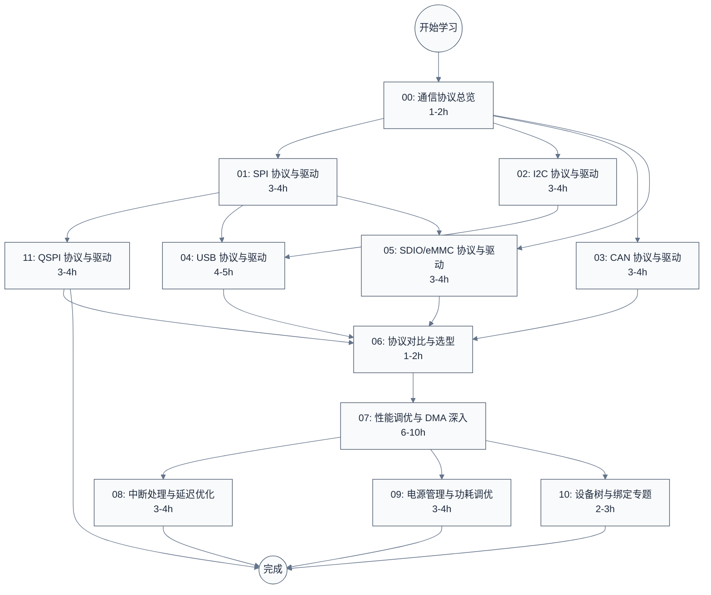

# 硬件外设与通信协议学习笔记

> 面向嵌入式驱动工程师、BSP 工程师和硬件工程师的常见通信协议完整学习指南。覆盖 SPI、I2C、CAN、USB、SDIO/eMMC 五种协议，以"协议规范 + Linux 驱动源码（主线）+ Zephyr 驱动源码（对照）+ 设备树 + 调试实践"为骨架，深入到寄存器与数据结构层面。
>
> 在五种协议之外，另设四个横向专题：性能调优与 DMA、中断与延迟、电源管理、设备树与绑定。这些专题贯穿所有协议，单独成篇以便深入。
>
> **工程师视角**：这五种协议几乎出现在每一颗 SoC 上。理解它们的协议本质与驱动框架，是做 BSP 移植、外设适配、性能调优、问题定位的必备基础。

---

## 学习路线图



---

## 文档索引

| 序号 | 文档 | 内容概要 | 建议用时 |
|:----:|------|---------|:--------:|
| 00 | [通信协议总览](./00-通信协议总览.md) | 五种协议一句话对比、共性维度（主从/同步/电气/拓扑）、嵌入式典型拓扑、选型引子 | 1-2h |
| 01 | [SPI 协议与驱动](./01-SPI协议与驱动.md) | CPOL/CPHA 四模式、Linux `spi_controller`/`spi_message` 框架、DesignWare SPI 驱动深入、Zephyr 对照（→ 进阶见 11） | 3-4h |
| 11 | [QSPI 协议与驱动](./11-QSPI协议与驱动.md) | **01 进阶**：Quad/Octal 多线传输、SPI NOR 命令集与 QE 位、JEDEC SFDP、Linux `spi-mem`/`spi-nor` 子系统、Cadence QSPI 寄存器级、XIP、Octal/xSPI 演进 | 3-4h |
| 02 | [I2C 协议与驱动](./02-I2C协议与驱动.md) | 开漏+上拉计算、START/STOP/ACK、DW_apb_i2c 寄存器、Linux `i2c-designware` 流程、Zephyr 对照 | 3-4h |
| 03 | [CAN 协议与驱动](./03-CAN协议与驱动.md) | 差分仲裁、位时序计算、Bosch MCAN 寄存器、Linux SocketCAN + `m_can.c`、Zephyr 对照 | 3-4h |
| 04 | [USB 协议与驱动](./04-USB协议与驱动.md) | NRZI/位填充、端点与传输类型、枚举流程、Linux URB 生命周期 + dwc2/dwc3、Zephyr UDC 对照 | 4-5h |
| 05 | [SDIO/eMMC 协议与驱动](./05-SDIO-eMMC协议与驱动.md) | SD 命令格式、HS200/HS400、DWC_mshc 寄存器、Linux `sdhci-of-dwcmshc`、Zephyr SD 子系统 | 3-4h |
| 06 | [协议对比与选型](./06-协议对比与选型.md) | 五种协议横向对比表、主从/同步/错误恢复策略对比、选型决策树 | 1-2h |
| **横向专题** | | | |
| 07 | [性能调优与 DMA 深入](./07-性能调优与DMA深入.md) | Linux dmaengine 框架、DW AHB DMA 驱动深入、cache 一致性、各协议 DMA 描述符布局与位级对比、CQE 命令队列引擎、dma-buf/IOMMU、Zephyr DMA 对照、DMA 电源管理、DMA 错误处理与恢复、DMA 控制器内部架构与调优、性能测量工具链、实战调优案例（23 章） | 6-10h |
| 08 | [中断处理与延迟优化](./08-中断处理与延迟优化.md) | 顶半部/底半部、NAPI、threaded IRQ、IRQ affinity、RT-Linux、延迟测量、各协议中断模式对比 | 3-4h |
| 09 | [电源管理与功耗调优](./09-电源管理与功耗调优.md) | runtime PM、各协议低功耗状态、唤醒源、clock gating、regulator、功耗测量与优化 | 3-4h |
| 10 | [设备树与绑定专题](./10-设备树与绑定专题.md) | DTS 语法、各协议 binding、of_match、属性解析、overlay、常见配置错误案例 | 2-3h |
| **网络专题** | | | |
| 12 | [以太网协议与驱动](./12-以太网协议与驱动.md) | 对等网络本质、MAC 帧/VLAN、PHY 自协商、Linux `net_device`/`sk_buff`/NAPI/phylink + MACB/GEM 驱动、Zephyr `net_if`/MDIO+PHY 对照、设备树与调试 | 5-7h |

---

## 参考资源

### 官方 Spec（位于 `reference/` 目录）

| 文件 | 覆盖章节 | 说明 |
|------|---------|------|
| `DW_apb_i2c_databook(2.04a).pdf` | 02-I2C | Synopsys DesignWare APB I2C 控制器数据手册 |
| `bosch_mcan_users_manual_v331.pdf` | 03-CAN | Bosch MCAN 控制器用户手册 v3.3.1 |
| `DWC_mshc_databook(2.0a).pdf` | 05-SDIO/eMMC | Synopsys DesignWare Mobile Storage HC 数据手册 |
| `DWC_mshc_user(2.0a).pdf` | 05-SDIO/eMMC | Synopsys DesignWare Mobile Storage HC 用户手册 |
| `jedec-jesd216-sfdp.pdf` | 11-QSPI | JEDEC JESD216 SFDP 串行闪存可发现参数标准（需从 jedec.org 下载） |
| `jedec-jesd251-xspi.pdf` | 11-QSPI | JEDEC JESD251 xSPI Profile 1.0 标准（需从 jedec.org 下载） |

> **待补充**：USB 2.0/3.0 规范需从 [usb.org](https://www.usb.org/document-library) 手动下载（站点要求注册）；SPI 无单一官方规范，章节内引用 NXP/Microchip 公开应用笔记与 Synopsys DW_apb_ssi databook；QSPI 的 JEDEC SFDP（JESD216）/xSPI（JESD251）标准与各 Flash 厂商数据手册（Macronix/Winbond/Micron）需从 jedec.org 与厂商站点手动下载。

### 以太网官方规范（在线）

| 文档 | 用途 | 建议阅读时机 |
|------|------|------|
| [IEEE 802.3 (Ethernet)](https://www.ieee802.org/3/) | 物理层与 MAC 帧、各速率标准（802.3u/ab/ae/bz）、PAUSE 流控 | 学完 12 §2-§3 后 |
| [IEEE 802.1Q (VLAN)](https://www.ieee802.org/1/) | VLAN Q-TAG、PCP/DEI/VID、桥接 | 学完 12 §3.2 后 |
| [IEEE 802.1Qbv / 802.1AS (TSN)](https://www.ieee802.org/1/) | 时间敏感网络门控调度与时间同步 | 深入实时以太网时 |

### 驱动源码

| 源码树 | 路径 | 用途 |
|--------|------|------|
| Linux | `/home/pbw/2042f/linux/` | 主线驱动深入分析（`drivers/spi/`、`drivers/spi/spi-mem.c`、`drivers/spi/spi-cadence-quadspi.c`、`drivers/mtd/spi-nor/`、`drivers/i2c/busses/`、`drivers/net/can/m_can/`、`drivers/net/ethernet/cadence/macb_main.c`、`drivers/usb/dwc2|dwc3/`、`drivers/mmc/host/`） |
| Zephyr | `zephyr-project/zephyr/` | 关键对照（`drivers/spi/spi_dw.c`、`drivers/flash/spi_nor.c`、`drivers/flash/flash_cadence_qspi_nor.c`、`drivers/i2c/i2c_dw.c`、`drivers/can/can_mcan.c`、`drivers/ethernet/eth_dwmac.c`、`drivers/usb/udc/udc_dwc2.c`、`subsys/sd/`） |

---

## 按角色推荐学习路径

### 驱动/BSP 工程师

关注协议规范、驱动框架、设备树配置、调试方法：

```
00 总览 → 01 SPI → 11 QSPI → 02 I2C → 03 CAN → 05 SDIO/eMMC → 06 对比 → 07 调优与 DMA → 08 中断与延迟 → 09 电源 → 10 设备树
```

- **01-03 是核心**：SPI/I2C/CAN 是 SoC 上最常见的外设接口，BSP 移植时几乎必涉及
- **11 QSPI**：SPI 启动存储的进阶，调试 SPI NOR 启动、Quad/XIP、QE 位问题必备
- **05 SDIO/eMMC**：存储启动路径的关键，调试 eMMC 启动问题必备
- **04 USB** 可作为进阶，依赖对端点/URB 模型的理解
- **12 以太网**：涉及 TCP/IP 与网络驱动时再深入，先掌握 NAPI/phylink/设备树三件事
- **07-10 横向专题**：性能调优、中断、电源、设备树——BSP 工程师进阶必备

### 硬件工程师

关注电气特性、信号完整性、拓扑设计：

```
00 总览 → 02 I2C（上拉电阻计算）→ 03 CAN（差分/终端电阻）→ 04 USB（D+/D-、眼图）→ 06 对比 → 10 设备树
```

- **02/03 是核心**：I2C 上拉选型、CAN 终端电阻与位时序是硬件调试高频问题
- **04 USB**：高速 USB 信号完整性（眼图、阻抗匹配）是硬件难点
- **10 设备树**：硬件工程师需要看懂 DTS 描述并验证驱动解析

### 应用/系统工程师

关注协议能力边界、选型、性能：

```
00 总览 → 06 对比 → 07 调优与 DMA → 按需查阅 01-05
```

- **00 + 06**：建立"什么场景用什么协议"的判断力
- **07 调优**：理解性能瓶颈分布，定位"为什么慢"
- 按需查阅具体协议章节的"协议层细节"与"调试"小节

---

## 写作约定

本专题遵循仓库根目录 `CLAUDE.md` 的写作规范，要点包括：

- 每篇文档标题下有 `> 一句话概括` + `> **工程师视角**：`
- `### 关键术语` 表格定义所有非通识性缩写
- 每个主要章节（H2）开头有桥接引用块（承接上文 + 说明动机 + 预告内容）
- 重要概念"本质先行"：先具体场景，再形式化描述
- 数学公式用 LaTeX，独立公式后有逐符号解释与数值演算
- 源码引用标注文件路径与行号，摘录不超 50 行，前后有文字解释
- Mermaid 图含 `%%{init}%%` 主题配置，节点 ID 用 PascalCase
- 核心结论用 `> **核心要点**：` 标注

---

**文档版本**：v1.4（新增 11-QSPI 协议与驱动：Quad/Octal 多线传输、SPI NOR 命令集与 QE 位、JEDEC SFDP、Linux `spi-mem`/`spi-nor` 子系统、Cadence QSPI 寄存器级、XIP、Octal/xSPI 演进；修正 Linux 源码路径为 `2042f/linux`）
**最后更新**：2026-07-29
**适用对象**：驱动工程师、BSP 工程师、嵌入式工程师、硬件工程师
