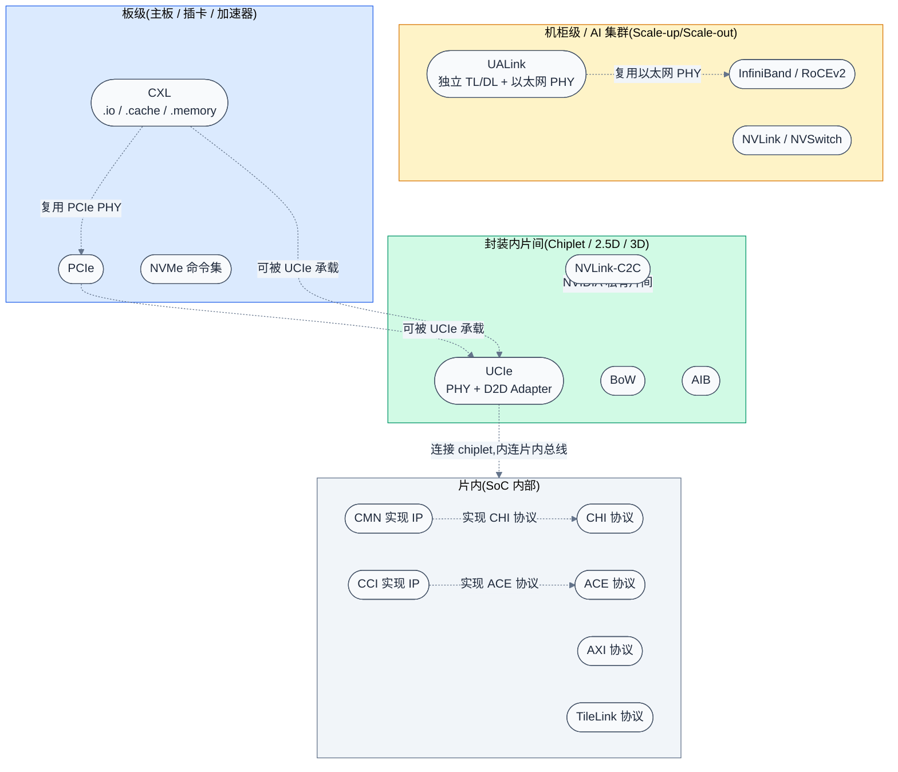
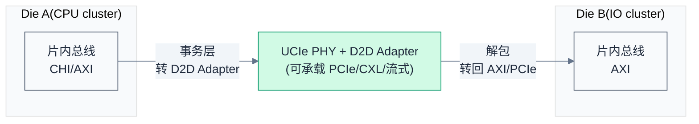
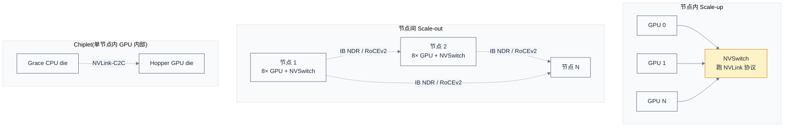

# 互联总线与协议全景辨析 —— 从片内到机柜级

> 一句话概括:用"物理范围 × 协议层级"两个维度,把 AXI/ACE/CHI、CMN/CCI、TileLink、UCIe、PCIe、CXL、NVLink、UALink、InfiniBand/RoCE 这一长串名字归位,辨析"协议 vs 实现""PHY vs 事务层"两组核心混淆。
> **工程师视角**:在"组件交界处"工作时,最怕的不是某个协议细节不清楚,而是"搞不清这个名字到底属于哪一层"——比如把 CXL(事务层协议)和 UCIe(PHY+Link 标准)当成同类比较,或把 CMN(实现 IP)和 CHI(协议规范)混为一谈。本文不深入任何单个协议,只建立坐标系,让你看到任何新名字都能秒定位。

### 关键术语

| 缩写 | 全称 | 含义 |
|------|------|------|
| AMBA | Advanced Microcontroller Bus Architecture | Arm 的片内总线架构家族,含 AXI/ACE/CHI |
| AXI | Advanced eXtensible Interface | AMBA 4 高性能主从总线协议,非一致性 |
| ACE | AXI Coherency Extensions | AXI 的缓存一致性扩展,AMBA 4 |
| CHI | Coherent Hub Interface(Arm 早期全称,现多直接称 AMBA CHI) | AMBA 5 新一代一致性协议,面向可扩展系统 |
| CCI | Cache Coherent Interconnect | Arm 老一代一致性互联 **IP 实现**,跑 ACE |
| CMN | Coherent Mesh Network | Arm 新一代 mesh 互联 **IP 实现**,跑 CHI(如 CMN-600/700) |
| TileLink | — | RISC-V 生态的片内一致性互连协议(SiFive 等) |
| NoC | Network-on-Chip | 片上网络,通用概念,非具体协议 |
| UCIe | Universal Chiplet Interconnect Express | 封装内片间 PHY + D2D Adapter(链路层)标准,可承载 PCIe/CXL/流式协议 |
| BoW | Bunch of Wires | OCP 开放片间接口,轻量级 |
| AIB | Advanced Interface Bus | Intel 早期片间接口,已停止开发并迁移至 UCIe |
| PCIe | Peripheral Component Interconnect Express | 板级高速串行总线标准 |
| CXL | Compute Express Link | 基于 PCIe PHY 的事务层扩展协议,含 .io/.cache/.memory |
| NVLink | NVIDIA High-Speed Interconnect | NVIDIA 私有 GPU 互联 |
| NVSwitch | — | NVIDIA 单节点全互联交换芯片 |
| UALink | Ultra Accelerator Link | 开放加速器间 Scale-up 互联标准,对标 NVLink |
| IB | InfiniBand | IBTA 高性能 RDMA 网络体系 |
| RoCE | RDMA over Converged Ethernet | 以太网上的 RDMA |
| CCIX | Cache Coherent Interconnect for Accelerators | 与 CXL 竞争的早期一致性扩展协议,2021 后基本退出 |
| PHY | Physical Layer | 物理层(电气/时钟/训练) |
| RC | Root Complex | PCIe 树根 |
| HBM | High Bandwidth Memory | 高带宽内存,常与 AI 加速器同封装 |

> **跨项目对照(协议 ↔ 实现)**:CHI(Arm 规范) ↔ CMN(Arm 实现 IP);ACE(Arm 规范) ↔ CCI(Arm 实现 IP);PCIe 规范(PCI-SIG) ↔ DWC/Synopsys/Intel RC 实现;UCIe 规范 ↔ 各厂商 PHY 实现;CXL 规范 ↔ Linux `drivers/cxl/` 实现;NVLink(NVIDIA 私有) ↔ NVSwitch 实现。

### 1.1 前置知识

| 需要了解 | 参考文档 |
|----------|----------|
| 缓存一致性基本概念(snoop / directory / MESI) | — |
| PCIe 拓扑与配置空间基础 | [../pcie/pcie-learning-resources.md](../pcie/pcie-learning-resources.md) |
| DDR / HBM 作为内存介质 | [../ddr/README.md](../ddr/README.md) |
| RDMA 与 AI 集群网络 | [../rdma/README.md](../rdma/README.md) · [../nccl/02-gpu-interconnect-background.md](../nccl/02-gpu-interconnect-background.md) |

---

## 1. 概述

### 1.2 系统上下文

**项目定位**:本文不是某一类总线/协议的深入笔记,而是横跨"片内 → 封装内片间 → 板级 → 机柜级"四层物理范围的**辨析型总览**。它的位置在整个学习体系里是"入口"——读完本文,你应该能对任何互联相关的名字(无论是新出的还是历史的)回答两个问题:**它在哪一层?它属于协议还是实现?**

**软硬件耦合点**(这是本规范最强调的部分,也是互联领域最容易踩坑的部分):

- **协议规范 ↔ 实现 IP**:同一份规范可以有多家实现。比如 CHI 规范由 Arm 定义,但 CMN-600/CMN-700 是 Arm 自家的实现 IP;AXI 是开放协议,Verifying IP / 自己写 RTL 都可以。**混淆协议与实现是入门最大的坑。**
- **PHY ↔ 事务层**:很多名字横跨多层。PCIe 同时定义 PHY、Link、Transaction;CXL **不重新定义 PHY**,复用 PCIe 5.0+ PHY,只在事务层扩展;UCIe **只到 D2D Adapter(链路层)**,事务层可以承载 PCIe/CXL/流式协议;UALink 有独立 TL/DL,只复用以太网 PHY。
- **封装边界 ↔ 协议选择**:同一组 CPU ↔ IO 通信,封装内走 UCIe(便宜、短距、高密度),板级走 PCIe/CXL(长距、可插拔),机柜级走 UALink/NVLink/IB(集群互联)。**物理距离决定协议选型。**
- **一致性域边界**:缓存一致性能不能跨越某层互联,是设计决策的分水岭。片内 CHI 默认硬件一致性;板级 CXL.cache 把加速器纳入 Host 硬件一致性域;机柜级 NVLink 做硬件一致性,UALink 用 load/store/atomic 做**软件层**一致性(非硬件 snoop);PCIe / NTB / IB 都不做一致性。

**跨实现/跨架构对比**(本节贯穿全文,这里给出总览):

| 对比维度 | Arm 生态 | RISC-V 生态 | NVIDIA | 开放标准 |
|----------|----------|-------------|--------|----------|
| 片内一致性协议 | CHI(AMBA 5) | TileLink | 自研私有 | — |
| 片内一致性实现 IP | CMN-600/700 | 自研 / SiFive | 自研 | — |
| Chiplet 片间 | UCIe(开放) | UCIe | NVLink-C2C(私有) | UCIe |
| 板级内存扩展 | CXL | CXL | NVLink + CXL(均支持) | CXL |
| 机柜级加速器互联 | UALink(开放) | UALink | NVLink/NVSwitch | UALink / IB / RoCE |



> **如何读这张图**:从下到上是物理范围递增(片内 → 封装内 → 板级 → 机柜级),虚线表示"承载/复用"关系——上层的协议可以跑在下层的 PHY/Link 之上。注意三条关键复用关系:**CXL 复用 PCIe PHY**(板级)、**PCIe/CXL 可被 UCIe 承载**(封装内)、**UALink 复用以太网 PHY**(机柜级)。UALink 与 CXL 是互补而非复用(详见 §6.3)。**NVLink-C2C 是 NVIDIA 私有方案**,绕过 UCIe 自己做片间,这是 NVIDIA 生态封闭性的体现。

> **核心要点**:互联领域的所有名字都可以用两个正交维度定位——**物理范围**(信号走多远)和**协议层级**(负责 PHY/Link/Transaction 的哪一层)。下文先用这两个维度建立坐标系,再逐层填名字。

---

## 2. 两个核心维度:物理范围 × 协议层级

> 上一章用一张全景图把所有名字铺开。但光看图还分不清"谁是谁",因为这些名字不在同一个维度上比较。本章先建立两个正交维度,后续每一章都把名字往这个坐标系里填。

### 2.1 维度一:物理范围

物理范围指信号实际传输的距离,它直接决定了电气约束、带宽密度、成本和协议选型。

| 物理范围 | 典型距离 | 电气约束 | 带宽密度 | 典型载体 |
|----------|----------|----------|----------|----------|
| **片内**(On-Die) | mm 级 | 无寄生,RC 主导 | 极高(数千线并行) | AXI/ACE/CHI/TileLink/NoC |
| **封装内片间**(Die-to-Die) | 1-10 mm(裸片间) | 微凸点/TSV 寄生小 | 高(数百-上千对差分) | UCIe/BoW/AIB/NVLink-C2C |
| **板级**(Board) | cm-m 级 | PCB 走线、连接器、阻抗 | 中(16-32 Lane) | PCIe/CXL |
| **机柜级/集群**(Rack/Cluster) | m-百 m 级 | 光纤/铜缆、串行SerDes | 单线高,总线和拓扑主导 | NVLink/UALink/IB/RoCE |

> **为什么物理范围决定一切?** 因为信号完整性随距离恶化。片内可以并行拉 1000 根线,封装内能拉几百根(微凸点密度限制),板级受 PCIe 插槽/Lane 数限制只能 16-32 根,机柜级只能用串行 SerDes + 光纤。**线数下降 → 必须提高单线速率 → 必须用更复杂的均衡/训练/FEC**。这就是为什么 UCIe 单线 ~32 Gbps、PCIe 6.0 单线 64 GT/s、IB 单线 400 Gbps 量级——距离越远,单线越快但 Lane 数越少。

### 2.2 维度二:协议层级

互联协议通常分三层(借用 OSI 思路,但不是严格对应):

| 协议层 | 职责 | 关键问题 | 典型例子 |
|--------|------|----------|----------|
| **PHY(物理层)** | 电气信号、时钟恢复、训练、均衡 | 0/1 怎么传?如何对齐? | PCIe PHY、UCIe PHY、SerDes |
| **Link(链路层)** | 流控、重传、错误纠正、包成帧 | 包怎么打包?丢了怎么办? | PCIe Data Link Layer、UCIe Adapter |
| **Transaction(事务层)** | 读写语义、一致性、地址翻译 | 读/写/锁/缓存语义? | PCIe TLP、CXL.cache/.memory、CHI transaction |

**关键辨析**:一个名字常常只覆盖其中一层或两层,而不是全部。这是初学者最大的混淆源:

| 名字 | 覆盖的层 | 不覆盖的层 |
|------|----------|------------|
| **UCIe** | PHY + D2D Adapter(Link) | Transaction(可承载 PCIe/CXL/流式) |
| **PCIe** | PHY + Link + Transaction | — |
| **CXL** | Transaction(复用 PCIe PHY+Link) | PHY、Link(都借用 PCIe 5.0+) |
| **CHI** | Transaction(片内) | PHY、Link(片内是普通 RTL 线) |
| **UALink** | PHY(以太网) + DL + TL(完整独立 stack) | —(三层都自定义) |
| **NVLink** | 三层都自己定义(私有) | — |
| **IB / RoCE** | 三层(物理层借以太网 PHY) | RoCE 借以太网 PHY |

> **核心要点**:看到一个名字,先问"它定义到哪一层?"——UCIe 是 PHY + D2D Adapter(不关心上面跑什么事务),CXL 是事务层(不关心下面 PHY 是谁的),PCIe/NVLink/UALink 是三层通吃(但 UALink 的 PHY 借以太网)。这一问就能消解大半混淆。

### 2.3 一个具体小例子:CPU 写加速器内存,各层在干什么

为了把两层维度落到具体场景,看一个 2-step 例子:

**场景 A:CXL 内存扩展卡,Host CPU 写 CXL 设备上的 DDR**

```text
1. CPU 发出 store 指令,目标地址落在 CXL.mem 暴露的 MMIO 窗口
2. Host RC 把它封装成 CXL.mem 事务(事务层:Write request)
3. CXL 借用 PCIe 5.0 PHY+Link,把包传到 CXL 设备(链路+物理层)
4. CXL 设备解包,把写请求转给本地 DDR 控制器
5. 本地 DDR 控制器写 HBM/DDR(另一套独立 PHY:DFI→DDR PHY→DRAM)
```

**场景 B:同 SoC 内,CPU cluster 写 IO cluster 的寄存器(片内)**

```text
1. CPU 发出 store 指令,目标地址落在 IO cluster 的 AXI slave 端口
2. CMN mesh 路由该事务(事务层:AXI/CHI transaction)
3. 信号沿片内金属线传到 IO cluster(没有独立 PHY/Link 概念,就是 RTL 线)
4. IO cluster 的 AXI slave 解码,写本地寄存器
```

对比两个场景可以看到:**片内只有事务层概念**(金属线就是 PHY),**板级才有完整的 PHY/Link/Transaction 三层**。这就是为什么片内协议(CHI/AXI)看起来"只有事务定义",而板级协议(PCIe/CXL)有厚厚的 PHY/Link 章节。

---

## 3. 片内互联(On-Die / SoC 内部)

> 上一章建立了两个维度。本章把"片内"这一层填满——它只有事务层(物理层就是金属线),所以这里讨论的全是事务层协议(CHI/AXI/ACE/TileLink)和它们的实现 IP(CMN/CCI)。这一层最大的混淆是"协议 vs 实现",本章先讲清这个区别,再逐个填名字。

### 3.1 本质:片内互联在干什么

片内互联本质是一组**多主多从的交换网络**,解决"SoC 内十几个 IP(CPU cluster、GPU、NPU、DMA、内存控制器、PCIe RC、显示控制器...)如何共享内存和寄存器"的问题。

具体场景:CPU cluster 要读 DDR 内存、GPU 要读 DDR、PCIe RC 要 DMA 到 DDR、NPU 要读 CPU 的 L3 缓存——这些主控(Master)都要访问从控(Slave),互联就是中间的"路由器+仲裁器+一致性控制器"。

它和板级总线最大的区别:**片内不需要"训练"**,金属线直接连通,带宽靠"并行拉宽"(片内可以拉 1024 位数据线)。所以片内协议规范几乎不讨论电气,只讨论事务语义和一致性。

### 3.2 AMBA 家族演进:AXI → ACE → CHI

Arm 的 AMBA(Advanced Microcontroller Bus Architecture)是片内互联事实标准。三代演进的本质是**一致性规模的增长**:

| 协议 | 代际 | 一致性 | 典型规模 | 核心机制 |
|------|------|--------|----------|----------|
| **AXI4** | AMBA 4 | 无 | 单主-单从/多主非一致性 | 5 通道(读地址/读数据/写地址/写数据/写响应),outstanding |
| **ACE** | AMBA 4 | 有(snoop) | 中小规模多核(8-16 核) | AXI + AC/CR/CD 三个 snoop 通道,总线监听 |
| **CHI** | AMBA 5 | 有(目录/home node) | 大规模(64+ 核,服务器级) | 全新协议,请求/监听/数据分离,home node 做目录 |

> **为什么从 ACE 演进到 CHI?** ACE 用总线监听(snoop broadcast):一个主控发起一致性请求,所有缓存一致性主控都要被广播查询,规模一上来 snoop 流量爆炸(16 核时每次事务要广播给其余 15 个 master)。CHI 引入 **home node(目录)**:home node 记录每行缓存的拥有者,只需查询目录中记录的 sharer,避免广播 snoop。这跟多核 CPU 从监听协议转向目录协议是同一个动机。注意 CHI 仍保留 snoop 通道(SNP),只是按需发起而非广播。

> **核心要点**:AXI/ACE/CHI 是**协议**(规范文档,Arm IHI 0022 / IHI 0050),不是芯片。它们定义信号、通道、事务、状态机,但不规定 RTL 实现。

### 3.3 协议 vs 实现:CMN / CCI 到底是什么

这是用户最困惑的点之一。简单说:

- **CHI / ACE / AXI 是协议**(Arm 出的规范,任何人都可实现)
- **CMN / CCI 是 Arm 卖的 IP 实现**(Arm 自己写的 RTL,跑这些协议)

| 实现 IP | 实现的协议 | 拓扑 | 典型产品 | 状态 |
|---------|-----------|------|----------|------|
| **CCI-500/550** | ACE | crossbar/ring | Cortex-A72/A76 时代手机 SoC | 老一代 |
| **CMN-600** | CHI | mesh | Neoverse N1/V1 服务器 | 当前主流 |
| **CMN-650** | CHI | mesh | Neoverse V2 | 当前 |
| **CMN-700** | CHI | mesh | Neoverse N2/V3 | 当前 |

**类比**:CHI 之于 CMN,就像 POSIX 之于 Linux、HTTP 之于 Nginx。前者是规范,后者是实现。Arm 既出规范(卖授权费)又出实现(卖 IP 授权),但其他厂商也可以自己写跑 CHI 的 RTL——只是大部分厂商选择直接买 CMN。

> **核心要点**:"CMN vs CHI"是一个**伪问题**:CMN 是跑 CHI 协议的硬件 IP,二者不在同一层,不存在"谁替代谁"。同理,CCI 是跑 ACE 的硬件 IP。

### 3.4 TileLink:RISC-V 生态的对应物

TileLink 是 RISC-V 生态(主要由 SiFive 推动)的片内一致性互连协议,地位类似 Arm 的 CHI。它也是规范,有开源实现(Chipyard / RocketChip 里的 diplomatic design)。

| 对比维度 | CHI(Arm) | TileLink(RISC-V) |
|----------|----------|---------------------|
| 来源 | Arm 私有规范 | RISC-V 生态,开源参考 |
| 一致性机制 | home node 目录 | 目录 + 监听 |
| 典型实现 | Arm CMN IP | SiFive 自研 / Chipyard |
| 适用规模 | 服务器级(64+ 核) | 中小规模(教育/嵌入式为主) |

> 注意:RISC-V SoC **不强制**用 TileLink。很多 RISC-V 芯片(如阿里平头哥、SG2042/SG2046)用自研或商用 IP,可能跑 CHI 或私有协议。TileLink 在 RISC-V 生态影响力大,但不是唯一选择。

### 3.5 NoC:概念而非协议

NoC(Network-on-Chip)是**通用概念**,指用网络(路由器+链路)而非总线连接片内节点。CMN 本质就是一款 NoC(mesh 拓扑)。看到"NoC"时,要问"具体指哪家的 NoC?"——它本身不是协议名。

---

## 4. 封装内片间互联(Chiplet / Die-to-Die)

> 上一章讲清了片内协议 vs 实现的辨析。一个自然的问题是:SoC 拆成多颗裸片(chiplet)后,裸片之间怎么连?本章回答这个问题——这就是 UCIe 的战场。注意:UCIe 和 CHI 不在同一层,UCIe 是 PHY+Link,上面可以跑 CHI/PCIe/CXL。

### 4.1 本质:为什么要做 chiplet

单颗大芯片(单片 die)遇到物理极限:光刻掩模版 reticle limit(约 858mm²)、良率随面积指数下降、不同模块工艺不匹配(逻辑用 3nm、模拟用 12nm 更优)。Chiplet 思路:**把大 SoC 拆成多颗小裸片,在封装内用高密度互联拼起来**。

这带来的核心需求:**不同厂商的裸片能拼在一起**。每家厂商的片内协议(自研或 CHI/AXI)是私有的,直接对接不可能。于是需要**标准化的片间 PHY+Link**,把"裸片间 0/1 怎么传"统一掉——这就是 UCIe。

### 4.2 UCIe:片间的"PCIe"

UCIe(Universal Chiplet Interconnect Express)由 Intel 主导,2022 年 3 月成立联盟(后有 AMD/Arm/TSMC/三星等加入,2024 年 8 月发布 UCIe 2.0)。它的定位非常精确:

| 维度 | UCIe 的定位 |
|------|-------------|
| 物理范围 | 封装内(2D / 2.5D interposer / 3D 堆叠 / organic substrate) |
| 协议层 | PHY + D2D Adapter(链路层,含重传/CRC/状态机) |
| 不覆盖 | 事务层(可承载 PCIe / CXL / 用户自定义流式协议) |
| 速率 | UCIe 1.0:4-32 GT/s;UCIe 2.0 引入 3D 封装支持,带宽密度大幅提升 |
| 核心价值 | 让不同厂商的 chiplet 物理互联,上层协议不变 |

UCIe 规范定义了两个内部接口:**RDI(Raw Die-to-Die Interface)** 连接 PHY 与 D2D Adapter,**FDI(Flit D2D Interface)** 连接 D2D Adapter 与上层协议栈。D2D Adapter 承担链路层职责(重传、CRC、时钟域穿越、状态机),PHY 负责电气信号与训练。

**为什么 UCIe 不定义事务层?** 因为 PCIe/CXL 的事务层已经很成熟,CPU-IO 通信用 PCIe 事务、CPU-内存扩展用 CXL 事务,这些不需要重新发明。UCIe 只需要把"封装内怎么传 0/1"标准化,让上层协议"无缝迁移"——你可以在 UCIe PHY 上跑 PCIe(就像在板级 PCIe PHY 上跑一样),对软件完全透明。

> **核心要点**:UCIe 是**片间 PHY + D2D Adapter(链路层)标准**,不是事务层协议。它和 CXL/PCIe 是**承载关系**(UCIe 在下,PCIe/CXL 在上),不是竞争关系。

### 4.3 UCIe vs 其他片间方案

| 方案 | 来源 | 开放性 | 状态 |
|------|------|--------|------|
| **UCIe** | Intel 主导联盟 | 开放标准 | 当前主流,生态最大(120+ 成员) |
| **BoW**(Bunch of Wires) | OCP | 开放 | 轻量级,工业影响力弱于 UCIe |
| **AIB** | Intel | Intel 曾开源捐献 | 早期方案,Intel 已停止开发并迁移至 UCIe |
| **NVLink-C2C** | NVIDIA | 私有 | 仅 NVIDIA 自家 chiplet(如 Grace+Hopper) |

**NVLink-C2C 的特殊性**:NVIDIA 不用 UCIe,自己搞了 NVLink-C2C 做 chiplet 互联(Grace CPU 和 Hopper GPU 之间)。这是 NVIDIA 生态封闭的体现——垂直整合可以从 PHY 到协议整体优化,不必等待开放标准跨厂商协调。

### 4.4 Chiplet 与片内/板级的衔接

Chiplet 互联处在中间位置,要和上下层衔接:



> **如何读这张图**:UCIe 是"翻译器"——把 Die A 片内协议(比如 CHI)的事务,翻译成 UCIe Adapter 的 flit,通过 UCIe PHY 传到 Die B,Die B 再翻译回自己的片内协议(可能是 PCIe 走 RC,也可能是 AXI)。**事务语义在两侧保持一致(都跑 PCIe 或都跑 CXL),PHY 在中间标准化(UCIe)**。

---

## 5. 板级互联(Board / 插卡 / 加速器)

> 上一章讲了封装内 chiplet 怎么连。但芯片做出来后,还要插到主板上,连接其他芯片、内存条、加速器卡。这就是板级互联——PCIe 的主场,以及它在内存扩展场景的扩展:CXL。本章辨析 PCIe 和 CXL 的关系,这是初学者第二大的混淆点。

### 5.1 PCIe:板级事实标准

PCIe 是板级高速串行总线标准,由 PCI-SIG 维护。各代单 lane 速率:PCIe 3.0=8 GT/s、4.0=16 GT/s、**5.0=32 GT/s**(×16 双向 128 GB/s)、**6.0=64 GT/s**(×16 双向 256 GB/s,采用 PAM4 + FLIT)、7.0=128 GT/s。它三层全定义:PHY(电气+LTSSM)、Link(Data Link Layer,重传/流控)、Transaction(TLP,事务语义)。

PCIe 的核心特点:**Root Complex 中心化路由** + **非一致性**。所有设备通信都要经过 RC,设备间直传(P2P)是规范扩展且受 ACS 控制;设备不参与 CPU 缓存一致性。

> PCIe 详细内容见本仓库 [../pcie/](../pcie/) 专题,本文不展开。

### 5.2 CXL:在 PCIe PHY 上加内存语义

CXL(Compute Express Link)是 2019 年由 Intel 主导推出的开放标准,当前主流 3.1,2025 年 11 月发布 4.0(速率翻倍至 128 GT/s,支持多机架内存池化)。它的核心定位:**让 CPU 和加速器/内存扩展卡之间,除了 PCIe 的"DMA 语义"外,还能有"缓存一致性内存语义"**。

CXL 由三个子协议组成:

| 子协议 | 本质 | 方向 | 用途 |
|--------|------|------|------|
| **CXL.io** | 就是 PCIe 协议 | — | 设备发现、配置、DMA、中断(完全兼容 PCIe) |
| **CXL.cache** | 一致性缓存协议 | Device(加速器)发起,Host 响应 | 加速器一致性访问 Host 内存,并在加速器侧缓存(加速器缓存纳入 Host 一致性域) |
| **CXL.memory** | 一致性内存协议 | Host 发起,Device 响应 | Host 把加速器上的 DDR/HBM 当本地内存用 |

> **如何读这张表**:CXL.cache 和 CXL.memory 的"方向"列是关键——前者由加速器主动请求访问 Host 内存(加速器是 requester),后者由 Host 主动请求访问设备内存(Host 是 requester)。两个方向组合,才能让 Host 和加速器双向共享内存且保持一致性。

> **为什么 CXL 要复用 PCIe PHY?** 因为重新定义 PHY 太贵——PCIe 5.0/6.0 PHY 经过多年优化,信号完整性、连接器、Retimer 都成熟。CXL 聪明地**只在事务层加 .cache/.memory**,PHY/Link 直接借 PCIe 5.0+。代价是 CXL 设备必须先以 PCIe 设备身份被 BIOS 枚举,再协商切换到 CXL 模式。

> **核心要点**:CXL 不是 PCIe 的替代,而是** PCIe PHY 上的事务层扩展**。一个 CXL 设备开机时是 PCIe 设备(走 CXL.io),协商后启用 .cache/.memory。CXL 和 PCIe 的关系是"扩展"而非"竞争"。

### 5.3 CXL 的典型场景:内存池化与扩展

```text
传统服务器:CPU 焊接 DDR,内存固定
CXL 内存扩展:CPU ↔ CXL 内存卡(走 CXL.memory)
                ↑ CPU 把卡上的 DDR 当本地内存用,延迟略高但带宽翻倍
CXL 内存池化:多台 CPU 共享一组 CXL 内存(走 CXL Switch)
                ↑ 内存按需分配给不同服务器,提高利用率
```

### 5.4 NVMe 不是总线

常见误解:把 NVMe 和 PCIe 并列。**NVMe 不是总线/协议层,是跑在 PCIe 上的存储命令集**。它定义"如何对 SSD 发读写命令",但传输靠 PCIe TLP。类似关系:SCSI 跑在 SAS 上、NVMe 跑在 PCIe 上、NVMe-oF 跑在 IB/RoCE 上。

### 5.5 CCIX:被 CXL 击败的竞争者

CCIX(Cache Coherent Interconnect for Accelerators,读作"see-six")是 2016 年 ARM/AMD/Xilinx 等推动的开放一致性扩展协议,定位和 CXL 高度重合。2021 年后随着 CXL 生态壮大,CCIX 基本退出主流。**这是"开放标准也会内卷"的典型例子**——两个开放标准做同一件事,最终生态优势方(CXL,有 Intel 加持)胜出。

---

## 6. 机柜级 / AI 集群互联

> 上一章讲清了板级 PCIe 与 CXL。但 AI 训练的瓶颈早已不是单机内,而是多 GPU 之间——一次大模型训练要几百张 GPU 协同。这就是机柜级/集群互联的战场:NVIDIA 私有 NVLink/NVSwitch vs 开放阵营 UALink,以及更远的 IB/RoCE。本章辨析这些名字。

### 6.1 为什么 AI 集群需要专门互联

GPU 训练的通信模式是**大块数据批量传输(梯度同步,几十 MB 到几 GB)**,对**带宽**极敏感。PCIe 5.0 ×16 = 128 GB/s 双向,看似够,但单节点 8 卡全互联需要 28 条 PCIe 链路——根本铺不下。于是 NVIDIA 发明 NVLink:单链路带宽远超 PCIe,且支持全互联拓扑。

详细背景见 [../nccl/02-gpu-interconnect-background.md](../nccl/02-gpu-interconnect-background.md)。

### 6.2 NVLink / NVSwitch:NVIDIA 私有方案

| 名字 | 本质 | 范围 |
|------|------|------|
| **NVLink** | NVIDIA 私有高速互联协议(三层都自研) | 板级(GPU-GPU / GPU-CPU) |
| **NVSwitch** | 单节点全互联交换芯片 | 板级(让 N 张 GPU 两两 NVLink 直连) |
| **NVLink-C2C** | NVLink 的片间版(chiplet) | 封装内(Grace+Hopper) |
| **MNNVL** | Multi-Node NVLink | 跨节点(Blackwell B200) |

NVLink 是**私有方案**:只有 NVIDIA 卡能用,其他厂商(GPU/ASIC)无法接入。这就是开放阵营要推 UALink 的根本动机。

### 6.3 UALink:开放阵营的对标

UALink(Ultra Accelerator Link)由 AMD/Intel/Google/Microsoft/Broadcom/Meta/Cisco/HPE/AWS/Astera Labs 等于 2024 年 10 月成立联盟推动,2025 年 4 月发布 **UALink 200G 1.0** 规范。它的定位:

| 维度 | UALink 的定位 |
|------|---------------|
| 物理范围 | 机柜级 Scale-up(同一 pod 内加速器互联) |
| 协议层 | **独立的 TL + DL**,PHY 复用以太网(IEEE P802.3dj,200 Gb/s/lane) |
| 关键特性 | 单层 fabric 支持 **最多 1024 个加速器**;端口 800 Gb/s(x4);hop 延迟 100-150 ns |
| 事务语义 | 内存语义(load/store/atomic),非消息语义 |
| 对标 | NVLink / NVSwitch |
| 开放性 | 开放标准,100+ 成员 |

**UALink 与 CXL 的关系:互补而非复用**。常见误解是"UALink 复用 CXL 协议层",实际上 UALink 有**自己独立的事务层(TL)和数据链路层(DL)**,只复用以太网 PHY。它与 CXL 的真实关系是:

- **System Node 内部**(单 OS image):Host ↔ Accelerator 用 CXL.mem / CXL.cache / CHI C2C 维持一致性
- **System Node 之间**:Accelerator ↔ Accelerator 用 UALink 跨节点互联,用 load/store/atomic 语义共享内存(软件层一致性)

> **核心要点**:UALink **不是** CXL 的复用,而是独立的 Scale-up 协议栈(自己的 TL/DL + 以太网 PHY)。它与 CXL 在层级上互补——CXL 管 System Node 内部一致性,UALink 管 pod 内跨 System Node 的加速器互联。这是常见的混淆点,务必区分。

### 6.4 IB / RoCE:更远的 Scale-out

| 互联 | 范围 | 语义 | 典型场景 |
|------|------|------|----------|
| NVLink/UALink | 机柜内 Scale-up | 一致性内存语义 | 同集群 GPU 高带宽梯度同步 |
| InfiniBand/RoCE | 数据中心 Scale-out | RDMA(消息语义) | 跨机柜/跨节点数据搬运 |

二者不互斥——一个大模型训练同时用三层:节点内 NVLink(900 GB/s)、节点间 IB/NDR(400 Gbps)、跨集群 RoCE。详细见 [../rdma/](../rdma/) 和 [../nccl/](../nccl/)。

---

## 7. "叠罗汉"关系:谁承载谁

> 前面几章逐层填了名字,但层与层之间如何组合,是初学者最模糊的部分。本章用一张表把所有"承载关系"列清楚,这是本文最值得收藏的一张表。

### 7.1 承载关系总表

| 场景 | 物理层 | 链路层 | 事务语义 | 例子 |
|------|--------|--------|----------|------|
| SoC 内多核一致性 | 片内金属线 | (无独立链路层) | CHI | Arm Neoverse SoC(CMN-700 上跑 CHI) |
| SoC 内非一致性主从 | 片内金属线 | (无) | AXI | DMA 控制器访问外设寄存器 |
| Chiplet 间 CPU-IO | UCIe PHY | UCIe Adapter | PCIe / CXL / 流式 | AMD EPYC chiplet、Intel Xeon chiplet |
| Chiplet 间 CPU-GPU(NVIDIA) | NVLink-C2C PHY | NVLink-C2C | NVLink 私有 | Grace + Hopper |
| 板级 CPU-加速器 | PCIe 5.0 PHY | PCIe Data Link | CXL.cache/.memory | 服务器 CXL 内存扩展卡 |
| 板级 CPU-SSD | PCIe PHY | PCIe Data Link | NVMe 命令集(跑在 PCIe TLP 上) | NVMe SSD |
| 机柜级 GPU-GPU(NVIDIA) | NVLink PHY | NVLink | NVLink 私有 | DGX H100 节点内 8 卡 |
| 机柜级加速器(开放) | 以太网 PHY(IEEE P802.3dj) | UALink DL | UALink TL(load/store/atomic) | 未来 UALink pod(≤1024 加速器) |
| 数据中心跨节点 | 以太网/IB PHY | IB/Ethernet | RDMA verbs | RoCEv2 集群 |

> **如何读这张表**:每一行是一个完整 stack,**从左到右是分层,从上到下是不同物理范围**。关键观察:PHY 和事务层是解耦的——PCIe 事务可以跑在板级 PCIe PHY 上,也可以被 UCIe 承载跑在封装内;UALink 的事务语义(内存 load/store)概念上类似 CXL.mem,但协议栈完全独立,只共享以太网 PHY。这是理解所有"承载关系"的钥匙。

### 7.2 一个端到端例子:AI 训练三层互联



> **如何读这张图**:一次大模型训练同时用到**三层物理范围**:GPU 内部 chiplet 用 NVLink-C2C(封装内)、节点内 8 卡用 NVLink+NVSwitch(板级/机柜级边界)、跨节点用 IB/RoCE(数据中心级)。**每层用不同协议,因为物理距离和带宽密度需求不同**——没有一种协议能通吃所有层。

---

## 8. 常见混淆点逐条辨析

> 前面七章建立了完整坐标系。本章把用户最常混淆的名字对逐条拎出来辨析,作为速查表。如果读完前面记不住,记住这一章就够用。

### 8.1 CXL vs UCIe

| 维度 | CXL | UCIe |
|------|-----|------|
| 层级 | 事务层(.io/.cache/.memory) | PHY + D2D Adapter(链路层) |
| 物理范围 | 板级(默认)/可被承载到片间 | 封装内片间 |
| 关系 | **UCIe 可以承载 CXL**(CXL 在上,UCIe 在下) | — |
| 一句话 | "做什么"——内存一致性语义 | "怎么连"——裸片物理接口 |

**常见错误**:把 CXL 和 UCIe 当成同类竞争协议。实际上它们是**不同层**,可以叠用:CPU chiplet 和内存 chiplet 之间,可以走"UCIe PHY + CXL.memory 事务"。

### 8.2 CMN vs CHI

| 维度 | CHI | CMN |
|------|-----|-----|
| 类型 | 协议规范(Arm IHI 0050) | 实现 IP(CMN-600/700) |
| 类比 | POSIX 规范 | Linux 实现 |
| 关系 | CMN **实现** CHI 协议 | — |
| 一句话 | "怎么定义一致性事务" | "Arm 卖的跑 CHI 的 RTL" |

**常见错误**:问"CHI 和 CMN 哪个好/哪个新?"——这是伪问题,二者不在同一层。

### 8.3 CXL vs NVLink

| 维度 | CXL | NVLink |
|------|-----|--------|
| 开放性 | 开放标准(CXL Consortium) | NVIDIA 私有 |
| 物理层 | 复用 PCIe 5.0+ PHY | 自定义 PHY(带宽密度更高) |
| 目标场景 | CPU-加速器内存扩展/池化 | GPU-GPU 高带宽训练互联 |
| 一致性 | 有(CXL.cache/.memory) | 有(NVLink 一致性域) |
| 生态 | 多厂商 | 仅 NVIDIA |

**常见错误**:认为 CXL 和 NVLink 是直接竞品。实际重叠有限:CXL 主打 CPU-加速器内存扩展,NVLink 主打 GPU 间训练互联。UALink 才是 NVLink 的直接对标。

### 8.4 UCIe vs UALink

| 维度 | UCIe | UALink |
|------|------|--------|
| 物理范围 | 封装内(片间) | 机柜级(pod 内跨节点) |
| 层级 | PHY + D2D Adapter | PHY(以太网) + 独立 DL + 独立 TL |
| 距离 | mm 级 | m 级 |
| 事务语义 | 不定义(承载 PCIe/CXL/流式) | 内存语义(load/store/atomic) |
| 一句话 | "chiplet 怎么拼" | "加速器集群怎么连" |

**常见错误**:因为名字都以 U 开头,以为是同类。实际物理范围差三级(片间 PHY vs 机柜级完整 stack),且 UALink 是**独立协议栈**(非复用 CXL,见 §6.3)。

### 8.5 PCIe vs CXL

| 维度 | PCIe | CXL |
|------|------|-----|
| 层级 | PHY + Link + Transaction | 仅事务层(借 PCIe PHY/Link) |
| 一致性 | 无 | 有(.cache/.memory) |
| 关系 | CXL **复用** PCIe 5.0+ PHY | CXL.io 本质就是 PCIe |
| 一句话 | "板级通用总线" | "PCIe 上的内存一致性扩展" |

**常见错误**:认为 CXL 替代 PCIe。实际 CXL **依赖** PCIe PHY,二者是扩展关系。

### 8.6 NVMe vs PCIe

| 维度 | PCIe | NVMe |
|------|------|------|
| 层级 | 三层总线协议 | 命令集(跑在 PCIe TLP 上) |
| 关系 | NVMe **跑在** PCIe 上 | — |
| 一句话 | "怎么传" | "对 SSD 发什么命令" |

**常见错误**:把 NVMe 和 PCIe 并列为"两种总线"。NVMe 不是总线,是应用层命令集。

### 8.7 BoW vs UCIe vs AIB

| 维度 | BoW | UCIe | AIB |
|------|-----|------|-----|
| 来源 | OCP | Intel 主导联盟 | Intel |
| 开放性 | 开放 | 开放 | Intel 曾开源捐献 |
| 复杂度 | 轻量(简单并行) | 中(含 D2D Adapter) | 中 |
| 生态 | 弱 | 强(120+ 成员) | 已停止开发,迁移至 UCIe |

三者都是片间 PHY+Link,**UCIe 是当前事实标准**,BoW 在某些低带宽场景有优势,AIB 是历史方案(已被 UCIe 取代)。

---

## 9. 学习路线建议

> 读完本文,你应该能对任何互联名字秒定位。但要在某一层深入,需要按工作场景选下一步。本章给出按角色推荐的学习路径。

### 9.1 按"交界处"选深入方向

```text
本文(全景辨析)
   │
   ├─ 工作涉及 SoC 内部一致性(固件/RTL)
   │   → AMBA AXI/ACE 规范(IHI 0022)
   │   → AMBA CHI 规范(IHI 0050)
   │   → CMN-600/700 TRM(Arm 实现 IP)
   │
   ├─ 工作涉及加速器/CXL 内存(驱动/固件)
   │   → ../pcie/ 专题(PCIe 基础)
   │   → CXL 3.1 Spec(.io/.cache/.memory)
   │   → Linux drivers/cxl/ 源码
   │
   ├─ 工作涉及 Chiplet 封装(硬件/集成)
   │   → UCIe Spec
   │   → 厂商封装工艺文档(TSMC CoWoS 等)
   │
   └─ 工作涉及 AI 集群拓扑(分布式/性能)
       → ../nccl/ 专题(NVLink/NVSwitch 拓扑)
       → ../rdma/ 专题(IB/RoCE)
       → UALink 1.0 Spec
```

### 9.2 一个常见反模式

**反模式**:试图一次性"学完所有互联协议再开始干活"。互联领域名字多但分层清晰,没必要全学。正确做法是:**先建立全景(本文),再按工作交界处选一层深入,其他层"知道在哪查就行"**。

> **核心要点**:本文的价值不是教你任何单个协议的细节,而是给你一张地图——以后看到任何新名字(比如又冒出个"SRD""CXL-PCIe Bridge""BoW-IF"),你能立刻问出两个问题:**它在哪一层?它属于协议还是实现?** 能问出这两个问题,就再也不会"傻傻分不清楚"。

---

## 参考资料

### 官方规范与文档

- [AMBA AXI and ACE Protocol Specification (ARM IHI 0022)](https://developer.arm.com/documentation/ihi0022/latest) — 参考了 AXI4 通道模型、ACE 一致性扩展章节
- [AMBA CHI Architecture Specification (ARM IHI 0050)](https://developer.arm.com/documentation/ihi0050/latest) — 参考了 CHI 请求/监听/数据通道、home node 目录机制
- [AMBA CMN-600 Technical Reference Manual](https://developer.arm.com/documentation/100451/latest) — 参考了 CMN mesh 拓扑、CHI 实现映射
- [AMBA CMN-700 Technical Reference Manual](https://developer.arm.com/documentation/102278/latest) — 参考了新一代 mesh 互联 IP
- [UCIe Specification (1.0/1.1/2.0)](https://www.uciexpress.org/specification) — 参考了 UCIe PHY + D2D Adapter 分层、RDI/FDI 接口、上层协议(PCIe/CXL/Streaming)承载模型;UCIe 2.0(2024-08)参考了 3D 封装与可管理性架构
- [PCI Express Base Specification 6.0](https://pcisig.com/specifications) — 参考了 PCIe 三层架构、各代速率(3.0=8/4.0=16/5.0=32/6.0=64 GT/s)、RC 中心化路由、PAM4 + FLIT
- [CXL Specification 3.1 / 4.0](https://computeexpresslink.org/cxl-specification-30-download/) — 参考了 CXL.io/cache/memory 三子协议及方向(Host/Device requester)、与 PCIe PHY 的复用关系;CXL 4.0(2025-11)参考了 128 GT/s 速率与多机架内存池化
- [UALink 200G 1.0 Specification](https://ualinkconsortium.org/) — 参考了 UALink 独立 TL/DL + 以太网 PHY 的协议栈、200 Gb/s/lane、1024 加速器规模、load/store/atomic 内存语义
- [InfiniBand Architecture Specification Vol.1-2 (IBTA)](https://www.infinibandta.org/) — 参考了 IB/RoCEv2 在 Scale-out 中的定位

### 相邻专题(本仓库内)

- [PCIe 专题](../pcie/pcie-learning-resources.md) — 板级总线深入
- [DDR 内存技术](../ddr/README.md) — 内存介质侧
- [RDMA 技术笔记](../rdma/README.md) — IB/RoCE 深入
- [NCCL 与 GPU 互联背景](../nccl/02-gpu-interconnect-background.md) — NVLink/NVSwitch 深入
- [NVIDIA KMD 与 NVLink 拓扑](../nvidia-kmd/09-NVLink-KMD拓扑与训练.md) — NVLink 内核驱动视角
- [外设通信协议总览](../hsperi/00-通信协议总览.md) — SPI/I2C/CAN/USB/SDIO 等低速外设协议(本文未覆盖)

### 历史与背景

- [CCIX Specification (archive)](https://www.ccixconsortium.com/) — 已退出主流,作为 CXL 的历史对照
- [OCP BoW (Bunch of Wires)](https://www.opencompute.org/) — 开放轻量片间接口
- [Intel AIB Specification](https://github.com/intel/aib-phy-hardware) — Intel 早期开放片间接口

---

**文档版本**: v1.0
**最后更新**: 2026-07-31
**适用对象**: 嵌入式工程师、系统软件工程师、固件/驱动工程师、芯片系统工程师
**前置阅读**: 无(本文是互联专题入口)
**下一篇**: 暂无(按 [README](./README.md) 学习路线选相邻专题深入)
