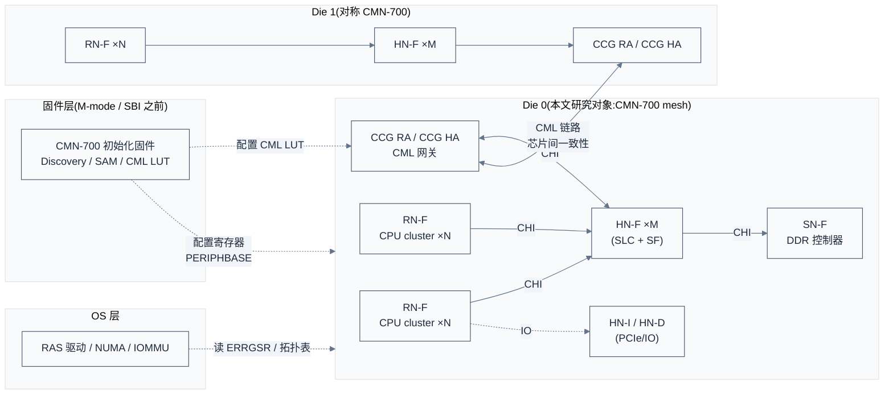
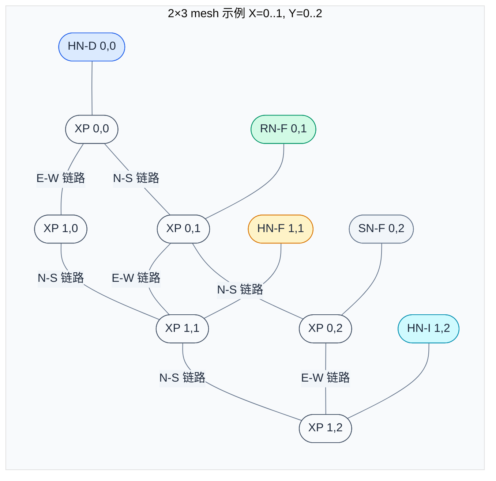
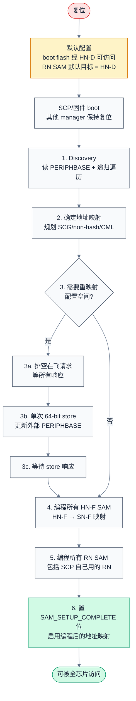
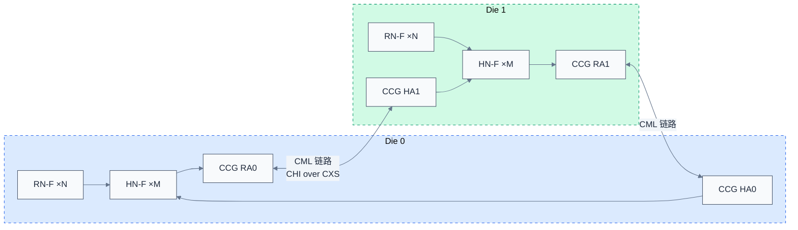
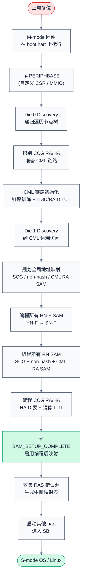

# CMN-700 架构与初始化固件 —— 面向多 die RISC-V 服务器 SoC

> 一句话概括:从 mesh 拓扑、Node ID 编码、三层 SAM、Discovery 树,到 boot-time 编程序列与 CML 多 die 互连,把 CMN-700 这块"硬件骨架"如何被固件"激活"讲透。
> **工程师视角**:你在为多 die RISC-V 服务器 SoC 开发 CMN-700 初始化固件。这块互联 IP 是整个芯片的"血管系统",一旦 SAM 编错或 CML LDID 表填错,表现就是"上电即挂"或"偶发脏数据",且没有任何报错信息。本文围绕"固件要做哪些事、为什么要这样做、寄存器怎么写"展开,把 TRM 散落在 1300 多页里的关键流程串成一条可落地的工程主线。

### 关键术语

| 缩写 | 全称 | 含义 |
|------|------|------|
| CMN | Coherent Mesh Network | Arm 新一代 mesh 互联 IP,跑 CHI 协议(CMN-700 是 r3p2) |
| CHI | Coherent Hub Interface | AMBA 5 一致性协议规范,CMN-700 的事务层语言 |
| AMBA | Advanced Microcontroller Bus Architecture | Arm 片内总线架构家族 |
| RN | Request Node | 请求节点,发起 CHI 事务(读/写/snoop) |
| HN | Home Node | 主节点,受理请求并维护一致性目录 |
| SN | Slave Node | 从节点,最终数据来源(典型为内存控制器) |
| RN-F | Fully coherent Request Node | 全一致性请求节点,典型为 CPU cluster |
| RN-I | I/O coherent Request Node | I/O 一致性请求节点,带本地 cache 但不参与 snoop |
| RN-D | I/O coherent Request Node (No cache) | I/O 一致性请求节点,无本地 cache |
| HN-F | Fully coherent Home Node | 全一致性主节点,管理 SLC 与目录 |
| HN-I | I/O coherent Home Node | I/O 主节点,桥接非一致性设备 |
| HN-D | I/O Home Node + DVM Node | 含 DVM Node/CFG/PCCB 的 I/O 主节点,boot 配置入口与默认目标,每 die 唯一 |
| HN-P | HN-I with PCIe optimization | 含 PCIe 优化的 I/O 主节点,接 PCIe subordinate |
| SN-F | Fully coherent Slave Node | 全一致性从节点,DRAM 控制器 |
| XP | Crosspoint | mesh 交叉点,完成路由与仲裁 |
| CAL | Component Aggregation Layer | 组件聚合层,让多个设备共享一个 XP 端口 |
| SAM | System Address Map | 系统地址映射,把 PA 翻译成 target NodeID |
| SCG | System Cache Group | 系统缓存组,一组 HN-F 共享同一哈希地址范围 |
| SLC | System Level Cache | 系统级缓存,由 HN-F 实现,全芯片共享 |
| SF | Snoop Filter | 监听过滤器,HN-F 内部维护 RN-F cache 的影子目录 |
| DVM | Distributed Virtual Memory | 分布式虚拟内存消息,用于 TLB 同步 |
| CML | Coherent Multichip Link | 跨芯片一致性链路 |
| CCG | Coherent CXL Gateway | 相干 CXL 网关,把本芯片 RN 暴露给远端芯片,含 HA/RA 代理与 CXS LA |
| CCLA | CXS Link Agent | CXS 链路代理(CCG 内子模块,提供 CML 链路侧功能) |
| CXS | CHI eXtended Streaming | CHI 扩展串行链路(CML 物理层载体),CCG 间互联的串行接口,见 AMBA CXS 规范 IHI 0079 |
| RAID | Request Agent ID | 请求代理 ID(CML_SMP 协议中标识 RN 的逻辑 ID,跨 chip 使用) |
| LDID | Logical Device ID | 逻辑设备 ID(mesh 内部通信用的逻辑 ID,本/远端 RN 统一编址) |
| HAID | Home Agent ID | 主代理 ID(逻辑上标识某个 HN) |
| RAS | Reliability, Availability, Serviceability | 可靠性/可用性/可维护性,CMN-700 错误处理框架 |
| PERIPHBASE | Peripheral Base | 系统寄存器,提供配置空间的基地址 |

> **跨项目对照(ARM ↔ RISC-V)**:CMN-700 是 Arm 自家 IP,但**可作为独立互联 IP 集成到 RISC-V SoC**——RISC-V 端通过 CHI 适配(RN-F_CHIE_ESAM 等变体即为 CHI-E 协议接入);TF-A BL31 ↔ OpenSBI M-mode(在 RISC-V 平台由 SBI 固件或更早的 M-mode 固件承担 CMN-700 配置职责);PSCI ↔ HSM(电源管理对应扩展);Arm GIC ↔ RISC-V AIA/PLIC(DVM 对应 RISC-V 上的 IPI + SFENCE)。

---

## 1. 概述

### 1.1 前置知识

| 需要了解 | 参考文档 |
|----------|----------|
| 片内总线协议全景(AXI/ACE/CHI、协议 vs 实现) | [01-互联总线与协议全景辨析](./01-互联总线与协议全景辨析.md) |
| 缓存一致性基本概念(MESI/snoop/directory) | — |
| ARM CHI 协议请求/监听/数据通道 | [AMBA CHI Architecture Specification (ARM IHI 0050)](https://developer.arm.com/documentation/ihi0050/latest) |
| 多 die/Chiplet 与 UCIe 背景 | [01-互联总线与协议全景辨析](./01-互联总线与协议全景辨析.md) §3.4 |

### 1.2 系统上下文

**项目定位**:CMN-700 是 Arm Neoverse 系列的可扩展一致性互联 IP,定位是**单 die 内数十核到上百核 + 多 die 互连的"片内 + 封装内"骨干**。它跑 CHI 协议(AMBA 5),通过 mesh 拓扑把 CPU cluster(RN-F)、内存控制器(SN-F)、I/O(HN-I/HN-D)、PCIe RC、加速器(CXL via CCG)等组件连成一个全局一致性域。在本笔记的工程场景里,**多 die RISC-V 服务器 SoC 用 CMN-700 作为每个 die 内部的 mesh,并通过 CML 链路把多个 die 的一致性域拼接成单 OS 镜像可见的 SMP 域**——这是 RISC-V 服务器突破单核数量瓶颈、对标 ARM Neoverse N2/V3 系列的必经之路。

**软硬件耦合点**(固件 ↔ 硬件 ↔ 驱动 ↔ OS 的交界面):

- **固件 ↔ CMN-700 寄存器**:固件在 M-mode(SBI 之前)/SCP 上电阶段,通过 PERIPHBASE 找到配置空间,完成 Discovery、Node ID 校验、SAM 三层映射、CML LDID/RAID LUT 填写。**任何一个表项写错,OS 启动后会出现"随机脏页"或"挂死"——因为硬件会按错误的 NodeID 路由请求。**
- **CMN-700 ↔ DDR PHY/SN-F**:HN-F SAM 把 HN-F 映射到 SN-F,SN-F 直连 DDR 控制器(DMC)。DMC 的物理容量、地址范围、片选分布直接决定 HN-F SAM 的 3-SN/5-SN/Direct 模式选型。
- **CMN-700 ↔ CXL/PCIe**:CCG(Coherent CXL Gateway)节点既是 CML 远端代理的入口,也可作为 CXL Type-1/3 设备接入 CHI 域的桥梁。固件需在 CCG 上为每个 CXL 设备编程 RAID→LDID 查找表。
- **OS 驱动 ↔ CMN-700 RAS**:OS 启动后,CMN-700 的错误上报通过 ERRGSR/ERRFR 等寄存器暴露给驱动;驱动需读拓扑表(由固件 discovery 生成)定位错误源。固件如果在 discovery 阶段漏掉某个 HN-F,OS 就无法收到该 HN-F 的错误中断。
- **CMN-700 ↔ 时钟/电源**:CMN-700 跨多个时钟域(同步 GCLK0 或最多 4 个异步 GCLK0-3,加 CML/CXS 链路时钟),HN-F 内部电源域分 Logic/SLC RAM0/SLC RAM1/SF,另有 CXS 电源域。固件在引导时需配置 `por_mxp_xy_override_sel_*` 等寄存器告知硬件当前实际拓扑,运行时通过 P-Channel/Q-Channel 控制电源状态。

**跨实现/跨架构对比**:

| 对比维度 | CMN-700(Arm 实现 IP) | CMN-600(上一代) | CCI-550/500(老一代) | 自研 NoC(RISC-V 厂商) |
|----------|----------|-------------|--------|----------|
| 协议 | CHI(AMBA 5) | CHI(AMBA 5) | ACE(AMBA 4) | 多为 TileLink 或自研 |
| 拓扑 | mesh(最大 12×12)+ CML 多 die | mesh(最大 8×8)+ CML | crossbar | 通常 mesh/ring |
| 单 die RN-F 接口数 | 最多 256(无 CAL 可达,加 CAL2 端口复用) | 最大 128 | 16 | 视实现 |
| 多 die 一致性 | CML via CCG,HAID/RAID/LDID | CML via CCG,规模较小 | 无原生多 die | 视实现 |
| SLC 总容量 | 0-512 MB(最多 128 个 HN-F) | 0-64 MB | 无 SLC | 视实现 |
| RAS | 分布式错误记录 + 集中式中断 | 较简化 | 基础 | 视实现 |
| 配置接口 | PERIPHBASE + 配置寄存器 + Discovery | 同 | 寄存器映射 | 视实现 |



> **如何读这张图**:Die 0 与 Die 1 通过 CCG ↔ CML ↔ CCG 拼成一个跨芯片一致性域;固件在 M-mode 阶段对两个 die 都做 Discovery + SAM + CML LUT 编程,OS 启动后通过固件留下的拓扑表感知 NUMA 与 RAS。注意:**固件位于 CMN-700 之外**,通过 PERIPHBASE 给出的配置空间窗口去"操控"CMN-700——这点常被初学者误解为"CMN-700 自己有固件",实际上 CMN-700 只是被动接受配置。

> **核心要点**:CMN-700 是一块**完全由外部固件配置**的"哑硬件"——上电后只有最小默认配置(boot flash 经 HN-D 可访问),其余所有路由、地址映射、多 die 拓扑都得固件显式编程。这一设计把"系统拓扑"完全交给软件定义,换来 IP 的极致可重用性,代价是固件复杂度极高。

---

## 2. CMN-700 架构总览

> 第一章把 CMN-700 放进了系统上下文,留下的问题是:**这块 mesh 内部长什么样?固件要配置的具体对象是什么?** 本章用一张 mesh 图把节点类型、XP 交叉点、CAL 聚合层摆清楚,先把"配置对象"摆在桌面上,后面三章再讲怎么编址、怎么映射、怎么发现。

### 2.1 本质:CMN-700 在系统里干什么

CMN-700 在系统里干两件事:

1. **多主多从的交换网络**:把数十个 CPU cluster、若干 I/O 子系统、若干内存控制器连成一个可路由的网,任何 RN 都能访问任何 SN/HN。这和以太网交换机类似,但片内带宽远高于以太网(CMN-700 单链路 128/256 bit,频率可达 2 GHz 以上)。
2. **硬件缓存一致性维护**:所有 RN-F 的私有 cache(L1/L2)通过 HN-F 维护的目录(Snoop Filter)保持一致。CPU 写一个 cacheline,HN-F 知道哪个 RN-F 持有该行,自动发起 snoop 或失效。

CMN-700 与传统"总线"最大的区别:**它是 mesh 而非 bus**。总线是共享介质,一次只能一个主控占用;mesh 是多跳网络,每个 XP 都可以独立路由,理论上任意两点间的带宽不互相抢。这就是为什么 CMN-700 能扩展到 256 RN-F——总线做不到。

### 2.2 Mesh 拓扑与节点位置

CMN-700 的 mesh 是二维网格,X 方向与 Y 方向各有若干 XP(Crosspoint,交叉点),最大支持 12×12(X 与 Y 各最多 12 个 XP)。每个 XP 是 mesh 上的一个路由节点,东西南北四个方向各有一条物理链路,同时最多带 4 个设备端口(P0/P1/P2/P3)接入实际设备。



> **如何读这张图**:圆角矩形是 XP(交叉点),实线是 mesh 物理链路;XP 旁边的圆形是挂在 XP 设备端口上的实际节点。每个节点的物理位置用 `(X, Y)` 标识,这就是后面 Node ID 编码的依据。注意 HN-D 必须在 `(0,0)`,因为它是 Discovery 的根节点和 boot 默认目标。

**为什么是 mesh 而不是 crossbar 或 ring?**

- **Crossbar**:任意两点直连,延迟最低,但晶体管数随节点数平方增长(N²),16 节点以上不可行。
- **Ring**:每节点两邻居,延迟随节点数线性增长,N=64 时跨环延迟已不可接受。
- **Mesh**:每个 XP 只与东西南北邻居相连,延迟随距离对角增长,且局部带宽独立,可扩展到 N=144(12×12)以上。

CMN-700 选 mesh 是**规模与延迟的折衷**——给每个 RN-F 提供"局部高速、远端可达"的访问特性,典型延迟在 1-3 跳内,而 crossbar 撑不到这个规模。

### 2.3 节点类型全景

CMN-700 的节点按功能分四大类,**固件需要在 Discovery 阶段识别每一类并分别配置**:

| 类别 | 节点 | 角色 | 典型实例 |
|------|------|------|----------|
| **RN(请求节点)** | RN-F | 全一致性请求节点,带本地 cache,参与 snoop | CPU cluster |
| | RN-I | I/O 一致性请求节点,带本地 cache,不参与 snoop | 网卡 DMA 引擎 |
| | RN-D | I/O 一致性请求节点,无本地 cache | 简单 DMA 控制器 |
| **HN(主节点)** | HN-F | 全一致性主节点,管理 SLC + SF + 目录 | mesh 内的 SLC tile |
| | HN-I | I/O 主节点,桥接非一致性 AXI/ACE-Lite 设备 | PCIe RC、低速 IO |
| | HN-D | I/O HN + DVM Node + CFG + PCCB,boot 配置入口与默认目标 | boot ROM 桥、DVM 域根 |
| | HN-P | HN-I 的 PCIe 优化变体 | PCIe Root Complex |
| | HN-T | HN-I + DTC + DVM Node | 含调试追踪控制器的 HN-I 变体 |
| | HN-V | HN-I + DVM Node | 分布式 DVM 节点的 HN-I 变体 |
| **SN(从节点)** | SN-F | 全一致性从节点,DRAM 控制器 | DMC520 |
| | SBSX | CHI 到 AXI/ACE-Lite 桥接节点 | 连接 ACE-Lite 内存设备(如 DMC) |
| **CML(多 die)** | CCG RA | Request Agent,本芯片发出跨芯片请求的网关 | die 间一致性出口 |
| | CCG HA | Home Agent,本芯片响应远端请求的网关 | die 间一致性入口 |
| | CCLA | CML 本地代理,链路层控制 | CML 链路管理 |

> **核心要点**:固件最关心的两类节点是 **HN-F**(决定内存一致性语义,需要配 SAM、SLC 分区、SF)和 **CCG**(决定多 die 拓扑,需要配 RAID/LDID/HAID 三张表)。RN-F 通常由 SoC 集成时硬连接,固件只校验其存在,不配其行为。

### 2.4 XP 内部:CAL 聚合层

一个 XP 有 4 个设备端口,如果一个端口只接一个设备,那 RN-F 数量上限受 XP 数量限制。CAL(Component Aggregation Layer)让多个相同类型设备共享一个端口,把 RN-F 上限从"每端口 1 个"提升到"每端口 2 个(CAL2)或 4 个(CAL4)"。

- **CAL2**:2 个相同设备共享端口,延迟 +1 cycle(或 CALBYP2 零延迟但时序紧张)
- **CAL4**:4 个相同设备共享端口(只支持 CHID/CHIE 变体的 RN-F 和 SNF-E)
- **HCAL2**:异构聚合,允许 RNI+HNI、RND+HNI、RNI+RND

CAL 不是物理多路复用,而是**逻辑上的 Node ID 复用**——见下一章 Node ID 编码。**固件视角**:CAL 模式下多个设备共享同一个 RN SAM,这是为何"多个 RN-F 共享一个 RN SAM 编程入口"的硬件原因。

### 2.5 与 CMN-600 / CCI 对比

| 对比维度 | CMN-700(r3p2) | CMN-600 | CCI-550 |
|----------|----------|-------------|--------|
| mesh 最大规模 | 12×12 | 8×8 | 不支持 mesh |
| RN-F 单 die 上限 | 256(无 CAL 1-256 / CAL2 2-256)| 128 | 16 |
| SLC 容量上限 | 512 MB | 64 MB | — |
| 多 die 一致性 | CML via CCG(支持分层缓存)| CML via CCG | 不支持 |
| CHI 协议版本 | CHI E | CHI C | ACE(非 CHI) |
| RAS | 分布式 ERRGSR + 集中中断 | 基础 | 基础 |
| 内存条带 | 2/3/4/5/6/8-SN | 2/3/4-SN | 不支持 |

> **核心要点**:从 CCI 到 CMN-600 再到 CMN-700,本质是**一致性规模与多 die 能力的迭代**。CMN-700 相比 CMN-600 的关键扩展是:**mesh 规模 1.5 倍**(8×8→12×12,144 XP)、**SLC 容量 8 倍**(64→512 MB,128 个 HN-F)、**新增 5-SN/6-SN 条带模式**、**CML 支持分层缓存**(整个 die 可对外呈现为单个 caching agent)。RISC-V 服务器选 CMN-700 而非 CMN-600,主要看中其多 die 拼接能力——单 die 上百核的 RISC-V 短期内不可行,多 die 是唯一出路。

---

## 3. Node ID 编码:物理位置即地址

> 第二章把节点类型摆清楚了,留下的问题是:**mesh 内一个 RN 怎么知道要找的 HN 在哪里?** 答案是 Node ID——CHI 包头里的目标标识符。本章讲 Node ID 的编码规则,它把"物理位置"直接编码进 ID,这是 CMN-700 路由的基础,也是固件 Discovery 与 SAM 编程的语义基础。

### 3.1 为什么需要 Node ID

CHI 协议规范要求每个事务携带 `TargetID` 与 `SourceID`,mesh 路由器(XP)根据 `TargetID` 决定把包往东西南北哪个方向送。CMN-700 的设计选择是:**Node ID 直接编码物理位置**,这样 XP 只需看 Node ID 的某些位就能决定路由方向,不需要查表。

这一选择带来两个工程后果:

1. **Node ID 不是任意分配的**:它的值由设备在 mesh 上的 (X, Y) 坐标 + 端口号 + 设备号唯一决定。SoC 集成时一旦布线完成,Node ID 就固定了。
2. **Discovery 必须基于 Node ID 反推位置**:固件通过读每个节点的 Node ID 寄存器,解码出 (X, Y, Port, DeviceID),才能在拓扑表里记录它"在哪里"。

### 3.2 编码格式与位宽

CMN-700 的 Node ID 位宽由 mesh 的 X、Y 维度共同决定——**取 X、Y 较大者决定位宽**(TRM §3.4.1 Table 3-13)。**固件必须先从全局配置寄存器读出 mesh 尺寸,再决定 Node ID 解码方式**:

| X mesh 维度 | Y mesh 维度 | Node ID 位宽 |
|------------|------------|------------|
| ≤ 4 | ≤ 4 | 7 bits |
| 5-8 | ≤ 8 | 9 bits |
| ≤ 8 | 5-8 | 9 bits |
| ≥ 9 | ≥ 9 | 11 bits |

> 表格未明确覆盖的边界(如 X=8、Y=9)按"较大者决定位宽"原则推断——max(8,9)=9 → 11 bits。

7-bit Node ID 的默认编码格式(TRM Table 3-14,X、Y 各 2 bit,端口 1 bit,设备 2 bit):

```
NodeID[6:0] = { X[1:0], Y[1:0], Port[1], DeviceID[1:0] }
              2 bit   2 bit   1 bit     2 bit(默认 0b00)
```

注意字段顺序是 **X 在 MSB、Y 其次、Port 再次、DeviceID 在 LSB**。默认模式下每个端口只接一个设备,DeviceID 固定为 `0b00`;CAL2 模式下 DeviceID 取 `0b00` 或 `0b01` 区分同端口的两个设备,**Port 字段仍保留**(TRM §3.4.1):

```
NodeID[6:0] = { X[1:0], Y[1:0], Port[1], DeviceID[1:0] }   /* CAL2:DeviceID=0b00/0b01 */
              2 bit   2 bit   1 bit     2 bit
```

CAL4 模式下 DeviceID 取 `0b00`~`0b11` 区分同端口的四个设备,格式结构不变。**注意**:还有一种 "extra device ports" 模式(TRM §3.4.2),XP 有 P0-P3 四个端口,`NodeID[2:1]` 编码端口号、`NodeID[0]` 编码设备号,此模式只支持 CAL2;固件 Discovery 必须先判断是否处于 extra device ports 模式,再选对应解码公式。

> **为什么用物理坐标编码?** 因为 mesh 路由是几何的——XP 拿到 `TargetID` 后,比较自己的 (X, Y) 与目标的 (X, Y),决定向 X+ 或 X- 或 Y+ 或 Y- 转发。**如果 Node ID 是任意逻辑号,XP 就得查表,而查表的延迟会随 mesh 规模线性增长;几何编码让 XP 路由是 O(1) 的位运算**。这是 CMN-700 把"规模可扩展"放在首位的体现。

### 3.3 CAL 模式下的 Node ID 复用

CAL2 让两个相同设备共享一个 XP 端口,这两个设备的 Node ID 仅在最低 2 位(`DeviceID`,即 `NodeID[1:0]`)上不同,**Port 字段不变**:

- 端口 P0 上的设备 0:`NodeID[1:0] = 0b00`
- 端口 P0 上的设备 1:`NodeID[1:0] = 0b01`
- 端口 P1 上的设备 0:`NodeID[1:0] = 0b00`(Port 位不同,DeviceID 相同)
- 端口 P1 上的设备 1:`NodeID[1:0] = 0b01`

默认模式下端口只有 P0/P1 两种(Port 字段 1 bit),不存在 P2/P3。若 SoC 使用 "extra device ports" 模式(TRM §3.4.2),才有 P0-P3 四个端口,此时 `NodeID[2:1]` 编码端口号、`NodeID[0]` 编码设备号,该模式仅支持 CAL2。

CAL4 时 4 个设备的 `NodeID[1:0]` 分别为 `00/01/10/11`,**仅 RN-F_CHID_ESAM、RN-F_CHIE_ESAM 与 SNF-E 三种设备类型支持 CAL4**(TRM §3.1.1.13)。

**固件影响**:Discovery 解码 Node ID 时,必须根据全局配置寄存器的 CAL 模式位选择不同的解码公式。如果用错公式,会把同端口的两个设备识别成不同端口的设备,后续 SAM 编程就会指向错误目标。

### 3.4 具体小例子:从一个 Node ID 反推物理位置

**默认模式例子**(TRM Example 3-2,§3.4.1):7-bit Node ID,无 CAL,XP(1,0) 上 P1 端口接 HN-I,DeviceID=0。按 `{X[1:0], Y[1:0], Port, DeviceID[1:0]}` 拆分:

```
X = 1 → 0b01
Y = 0 → 0b00
Port = 1 → 0b1
DeviceID = 0 → 0b00

NodeID = {01, 00, 1, 00} = 0b0100100 = 0x24
```

TRM 原文验证:"For the HN-I connected to XP (1,0), the node ID reads as (1,0,1,0). This format is equivalent to (0b01, 0b00, 0b1, 0b00) or 0x24." ✓

**CAL2 模式例子**(TRM Figure 3-36/3-37,§3.4.1):7-bit Node ID,CAL2,XP(1,1) 上 P1 端口接两个 RN-F,第二个 RN-F 的 DeviceID=1。按同一格式拆分(共 7 bit):

```
X = 1 → 0b01
Y = 1 → 0b01
Port = 1 → 0b1
DeviceID = 1 → 0b01

NodeID = 0b 01 01 1 01 = 0b0101101 = 0x2D = 45
```

TRM Figure 3-36 中 XP(1,1) P1 第二个 RN-F 标注为 RN-F 45,与计算结果一致 ✓。

> **如何读这两个例子**:同一个物理位置(X=1, Y=1, P1)上,无 CAL 时 DeviceID 固定 0,NodeID = `0b0101100 = 0x2C = 44`;CAL2 时第二个设备 DeviceID=1,NodeID = `0x2D = 45`,两者仅在 DeviceID 字段(NodeID[1:0])上不同。**CAL2 与无 CAL 模式的解码公式结构相同**(都是 `{X, Y, Port, DeviceID}`),区别仅在 DeviceID 字段是否被使用——固件 Discovery 函数读 Node ID 寄存器后用统一公式解码即可,CAL 模式只影响"同端口的多个设备如何区分",不影响解码公式本身。

---

## 4. SAM:三层地址映射

> 第三章讲清楚了"Node ID 标识谁",留下的问题是:**RN 发出一个 PA(物理地址),怎么知道这个地址该送给哪个 HN?HN 收到后,又怎么知道数据存在哪个 SN?跨 die 时,本 die 的 HN 怎么知道这个地址在远端 die?** 三个问题对应三层 SAM,本章逐层拆解。

### 4.1 为什么需要三层 SAM

直观想法:整个系统只有一张全局地址映射表,任何节点查这张表就知道目标。CMN-700 没这么做,而是把映射拆成三层:

| 层 | 名称 | 所在位置 | 输入 | 输出 | 决策内容 |
|---|------|---------|------|------|---------|
| 1 | RN SAM | 每个 RN 内部 | PA | HN-F/HN-I/HN-D/HN-P/CCG RA NodeID | 本 die 内请求选 HN,或选 CCG RA 走跨 die |
| 2 | HN-F SAM | 每个 HN-F 内部 | PA | SN-F NodeID | 数据存在哪个 SN(即哪个 DRAM 通道) |
| 3 | CML RA SAM | 每个 CCG RA 内部 | PA | 远端 CCG HA NodeID | 这个 PA 在远端 die 时,送给哪个 die 的 CCG HA |

**为什么拆三层?** 三个理由:

1. **决策上下文不同**:RN 选 HN 时关心"哪个 HN 离我近 / 哪个 HN 上 SLC 命中率高";HN 选 SN 时关心"哪个 DRAM 通道有这条 cacheline";跨 die 选 HA 时关心"哪个 die 持有这个地址"。三个决策的输入相同(PA)但目标不同,各自维护映射更清晰。
2. **可扩展性**:若用单一全局表,每次新增一个 SN 都要更新所有 RN 的表;分层后,RN 只关心 HN 集合,SN 增减只影响 HN-F SAM。
3. **硬件并行**:三层 SAM 在不同节点上,可以并行查询;若用单一集中表,会成为瓶颈。

> **核心要点**:三层 SAM 是 CMN-700 的"软件定义拓扑"核心——固件在三层分别填表,告诉硬件"这个 PA 该去哪"。**RN SAM 决定 die 内分布、HN-F SAM 决定 DRAM 通道分布、CML RA SAM 决定 die 间分布**,三者解耦但必须一致(不能 RN 把地址送给 HN-F,HN-F 又认为该地址在远端 die——这会死锁)。

### 4.2 RN SAM:请求侧选 HN

RN SAM 是 RN 发出 CHI 请求时的"地址翻译器",输入 PA,输出 TargetID。它的查找策略按优先级排列(TRM §3.4.6.1 Figure 3-42):

```
1. DVM 操作?            → DVM Target ID        (Priority-1)
2. 落在 GIC region?     → GIC Target ID        (Priority-2)
3. 落在 non-hashed region? → Non-Hash Target ID  (Priority-3)
4. 落在 HTG/SCG hashed region? → 哈希选 HN-F / CCG  (Priority-4)
5. 落在 DSU HNI region? → DSU HNI Target ID     (Priority-5)
6. 都不匹配?           → 默认目标 HN-D         (Priority-6,boot 后必须关掉)
```

注意 **non-hashed 优先级(P3)高于 hashed/HTG(P4)**——这是因为 non-hashed region 通常用于 IO 空间,需要确定性路由,不能被哈希"打散"。HTG/SCG hashed region 内部还并行查 CCG/CXG Target ID(用于 CXL.mem 区域)与 HTG Target ID,两者同级。

**关键概念**:

- **SCG(System Cache Group,系统缓存组)**:一组 HN-F 共享同一哈希地址范围。一个 SCG 内的 HN-F 必须有相同的 SLC 分区大小。**Legacy CMN mode(RNSAM_FLEX_TGTID_EN=0)下最多 4 个 SCG**(且 HN-F ≤ 64);灵活目标 ID 模式(RNSAM_FLEX_TGTID_EN=1)下最多 32 个 HTG,其中 **HTG0-3 始终只用于 SCG**(向后兼容限制,两种模式均适用),HTG4-31 可作 SCG 或 HN-P/CCG 哈希(HTG 总数上限 32)。每个 SCG 最多 **128 个 HN-F target ID**(无 CAL)或 **256 个 HN-F**(启用 CAL2)(TRM §3.4.6.3)。
- **HTG(Hashed Target Group,哈希目标组)**:跨 die 的哈希组,目标可以是本 die HN-F 也可以是远端 die 的 CCG HA。这是多 die 场景的关键扩展。RN SAM 最多支持 32 个 HTG(RNSAM_NUM_HTG ≤ 32)。
- **Non-hashed region**:最多 64 个,每个映射到一个固定 TargetID,用于 IO 空间(HN-I/HN-D/HN-P)。
- **GIC region**:专门路由到 GIC 的地址范围,可与 hashed/non-hashed 重叠。
- **DSU HNI region**:专门路由到 DSU(DynamIQ Shared Unit)HN-I 的区域,优先级 P5。

**固件编程步骤**(简化伪代码):

```c
/* 摘自 TRM §4.4.3.1 RN SAM programming,本笔记简化呈现 */
void program_rnsam(void) {
    /* 1. 配置每个 SCG 的地址范围与 HN-F 列表 */
    for (int scg = 0; scg < num_scg; scg++) {
        WRITE_REG(RNSAM_SCG_REGION(scg), BASE_ADDR | SIZE | VALID);
        WRITE_REG(RNSAM_SCG_NUM_HNF(scg), hnf_count[scg]);
        for (int i = 0; i < hnf_count[scg]; i++) {
            WRITE_REG(RNSAM_SCG_HNF_NODEID(scg, i), hnf_nodeid[scg][i]);
        }
    }
    /* 2. 配置 non-hashed region */
    for (int i = 0; i < num_nonhash; i++) {
        WRITE_REG(RNSAM_NONHASH_REGION(i), BASE | SIZE | VALID);
        WRITE_REG(RNSAM_NONHASH_TARGET(i), target_nodeid[i]);
    }
    /* 3. 关闭默认 TargetID 模式,启用编程后的映射 */
    WRITE_REG(RNSAM_STATUS, DEFAULT_TARGET_DIS | SAM_EN);
}
```

解释:这段伪代码体现了"先填区域描述符、再填目标列表、最后使能"的通用模式。**关键设计决策**是 `RNSAM_STATUS` 寄存器的"默认目标禁用"位——boot 阶段默认目标是 HN-D(让 boot flash 可访问),SAM 编程完成后必须置位 `DEFAULT_TARGET_DIS`,否则未匹配地址会"漏"到 HN-D,可能造成 boot flash 被意外写入。

### 4.3 HN-F SAM:HN 侧选 SN

HN-F 收到请求后,如果数据不在 SLC,要进一步访问 SN-F(DRAM)。HN-F SAM 决定"这个 PA 对应哪个 SN-F"。

HN-F SAM 支持两种粒度(TRM §3.4.7):

- **Range-based(范围式)**:64 个非哈希区,每区映射到一个固定 SN(用于 SRAM、专用 DRAM 分区)。
- **Hashed(哈希式)**:8 个哈希区,每区采用条带(stripe)方式分布到一组 SN。条带模式有 **2/3/4/5/6/8-SN** 六种:
  - 2/4/8-SN 用 XOR 哈希在 **64B 粒度**上条带(`Select` 来自 `PA[MSB:6]` 的 XOR)
  - 3/5/6-SN 用 9 bit 地址位(`PA[21:8]`)+ 用户自定义地址位在 **256MB 粒度**上条带:**3-SN 用 2 个用户自定义位**(`hn_cfg_sam_top_address_bit0/1`),**5-SN/6-SN 用 3 个用户自定义位**(`hn_cfg_sam_top_address_bit0/1/2`)

**为什么需要 3/5/6-SN 模式?** 因为 DRAM 通道数未必是 2 的幂。例如 3 通道 DDR5 系统,用 3-SN 模式可以让带宽均匀分布到 3 个 SN;若强行用 2-SN 或 4-SN,会浪费一个通道或让某通道超载。

**HN-F SAM 编程示例**(摘自 TRM §4.4.3.2.1):

```c
/* 摘自 TRM §4.4.3.2.1 RNSAM programming with power-of-two hashing */
/* 3-SN 模式:每个 HN-F 把请求条带到 3 个 SN-F */
void program_hnf_sam_3sn(int hnf_id) {
    WRITE_REG(CMN_HNS_SAM_CONTROL(hnf_id), HN_CFG_THREE_SN_EN(1));
    /* 哈希位选择:用于 256MB 条带粒度的 9 bit 地址范围 */
    WRITE_REG(CMN_HNS_SAM_6SN_NODEID(hnf_id), HN_HASH_ADDR_BITS_SEL(0b001));
    /* 用户定义的高位地址 bit(决定 256MB 边界) */
    WRITE_REG(CMN_HNS_SAM_CONTROL(hnf_id),
              HN_CFG_SAM_TOP_ADDRESS_BIT0(32) |  /* PA[32] */
              HN_CFG_SAM_TOP_ADDRESS_BIT1(33));  /* PA[33] */
    /* 3 个 SN-F 的 NodeID */
    WRITE_REG(CMN_HNS_SAM_CONTROL(hnf_id),
              HN_CFG_SN0_NODEID(sn0_nodeid) |
              HN_CFG_SN1_NODEID(sn1_nodeid) |
              HN_CFG_SN2_NODEID(sn2_nodeid));
}
```

解释:这段代码体现"先选模式 → 配哈希位 → 配 SN NodeID"的次序。**设计决策**:`hn_cfg_sam_top_address_bit0/1` 让用户决定哪些 PA 位参与 256MB 条带边界——这一灵活性让系统能根据 DRAM 容量调整条带粒度,避免固定 bit 位在某些容量下产生不均匀分布。

### 4.4 CML RA SAM:跨芯片选 HA

多 die 系统里,一个 PA 可能属于远端 die。本 die RN 发出请求时,**RN SAM**(在本地 RN 内)决定 TargetID:若 PA 在本 die,TargetID = 本 die HN-F;若 PA 在远 die,TargetID = 本 die CCG RA。请求到达 CCG RA 后,**CML RA SAM**(在 CCG RA 内,即 RA SAM)决定"送到哪个远端 die 的 CCG HA"(TRM §3.4.5:"CML RA SAM — Present in all CML RA nodes. Generates a target ID for requests to remote CML HA nodes.")。

CML RA SAM 的查找结果可以是:

- **远端 CCG HA**:PA 属于远端 die,送对应 die 的 CCG HA NodeID(HAID)。
- **CXLA(CXL Agent)**:PA 属于 CXL 设备,送 CXL Agent。

**关键约束**:RN SAM 与 CML RA SAM 是两个不同节点上的 SAM,但必须协同一致——RN SAM 决定"本 die 内选 HN-F 还是 CCG RA",CML RA SAM 决定"CCG RA 收到后送给哪个远端 CCG HA"。固件编程时,先确定全局地址分配(哪些 PA 段在哪个 die),再在两个 die 上分别配 RN SAM(指向本 die CCG RA 的远 die 段)和 CML RA SAM(指向对端 die CCG HA 的 HAID),确保两边"看到"的地址归属互为镜像。

### 4.5 哈希函数与具体演算

CMN-700 RN SAM 在 SCG 内选 HN-F 用的是 **power-of-two XOR 哈希**。设 SCG 有 32 个 HN-F,需要 5 bit 选择位 $\text{Select}[4:0]$,哈希函数(TRM §4.4.3.2.1):

$$
\begin{aligned}
\text{Select}[4] &= \text{PA}[10] \oplus \text{PA}[15] \oplus \text{PA}[20] \oplus \cdots \oplus \text{PA}[50] \\
\text{Select}[3] &= \text{PA}[9]  \oplus \text{PA}[14] \oplus \text{PA}[19] \oplus \cdots \oplus \text{PA}[49] \\
\text{Select}[2] &= \text{PA}[8]  \oplus \text{PA}[13] \oplus \text{PA}[18] \oplus \cdots \oplus \text{PA}[48] \\
\text{Select}[1] &= \text{PA}[7]  \oplus \text{PA}[12] \oplus \text{PA}[17] \oplus \cdots \oplus \text{PA}[47] \\
\text{Select}[0] &= \text{PA}[6]  \oplus \text{PA}[11] \oplus \text{PA}[16] \oplus \cdots \oplus \text{PA}[51]
\end{aligned}
$$

逐符号解释:

- $\text{PA}[n]$:物理地址的第 $n$ bit
- $\text{Select}[k]$:5 bit 选择索引的第 $k$ bit
- $\oplus$:按位异或(XOR)
- 下标序列 $10, 15, 20, \ldots, 50$:从某个起始位开始,步长 5 取一个 PA bit,共 9 个 bit 异或得到一个 $\text{Select}$ 位

**具体数值演算**:设 $\text{PA} = \texttt{0x0000\_0000\_0000\_0040}$(二进制低位 `...0100_0000`,即 $\text{PA}[6]=1$,其余所有位均为 0),SCG0 内 32 个 HN-F,NodeID 表如下(假设 $\text{HN-F}_0 \ldots \text{HN-F}_{31}$ 的 NodeID 是 `0x40`..`0x5F`)。

计算 $\text{Select}[4:0]$:

1. $\text{Select}[0] = \text{PA}[6] \oplus \text{PA}[11] \oplus \text{PA}[16] \oplus \cdots \oplus \text{PA}[51]$
   - $\text{PA}[6] = 1$,$\text{PA}[11..51]$ 序列中所有位均为 0(因为 $\text{PA} = \texttt{0x40}$ 时只有 $\text{PA}[6]$ 非零)
   - $\text{Select}[0] = 1 \oplus 0 \oplus 0 \oplus \cdots \oplus 0 = 1$
2. $\text{Select}[1] = \text{PA}[7] \oplus \text{PA}[12] \oplus \cdots \oplus \text{PA}[47]$,所有位都是 0
   - $\text{Select}[1] = 0$
3. $\text{Select}[2] = \text{PA}[8] \oplus \text{PA}[13] \oplus \cdots \oplus \text{PA}[48] = 0$
4. $\text{Select}[3] = \text{PA}[9] \oplus \text{PA}[14] \oplus \cdots \oplus \text{PA}[49] = 0$
5. $\text{Select}[4] = \text{PA}[10] \oplus \text{PA}[15] \oplus \cdots \oplus \text{PA}[50] = 0$

得到 $\text{Select}[4:0] = \texttt{0b00001} = 1$,即选择 SCG0 中的第 1 个 HN-F(NodeID `0x41`)。

**验证**:$\text{PA} = \texttt{0x40} = 64$ 字节偏移,正好是一个 cacheline 的边界(64B 对齐)。在 32 HN-F 哈希下,64 字节偏移映射到 $\text{HN-F}_1$——这符合"相邻 cacheline 散布到不同 HN-F"的设计目标,避免热点地址集中到单个 HN-F。

> **如何理解哈希函数**:每 5 个 PA bit 异或一组,本质是把 PA 的高位"折叠"到低位,让相邻 cacheline 落到不同 HN-F。**为什么用 XOR 而不是取模?** XOR 是位运算,硬件实现是一个 gate,延迟极低;取模需要除法器,延迟与功耗都高得多。这是 CMN-700 把"低延迟"放在首位的体现。

> **核心要点**:三层 SAM 共同完成"PA → HN-F → SN-F / 远端 HA"的翻译,固件必须保证三层映射自洽:**RN SAM 给出的 HN-F 必须是 HN-F SAM 已配置的 HN-F;HN-F SAM 的 SN 必须实际存在;CML RA SAM 的远端 HA 必须对端 die 已配置为对应 HA**。任何一层不一致,轻则请求被丢,重则 mesh 死锁。

---

## 5. Discovery:发现拓扑

> 第四章讲了 SAM 三层映射的"应该配什么",留下的问题是:**固件怎么知道当前 SoC 上有哪些节点、它们各自的 Node ID 是什么?** 答案是 Discovery——CMN-700 提供的一套自描述数据结构,固件遍历它就能拿到完整拓扑。本章讲 Discovery 的树结构与遍历流程。

### 5.1 为什么需要 Discovery

直观想法:SoC 集成时拓扑就固定了,固件直接硬编码一份节点表就行。CMN-700 不这么做,而是要求固件**运行时遍历 Discovery 树**得到拓扑,理由有三:

1. **同一 IP 多种配置**:CMN-700 是可配置 IP,不同 SoC 用同一 RTL 但 mesh 规模、节点数量、CAL 模式都不同。Discovery 让一份固件代码适配多种配置,无需 per-SoC 硬编码。
2. **升级时拓扑变更**:同一 SoC 不同芯片版本可能增减节点(例如早期只有 4 个 HN-F,后期扩到 8 个)。Discovery 让固件无需为每个版本重写。
3. **多 die 拓扑动态拼接**:多 die 系统里,每个 die 的 Discovery 树独立,但 CML 链路连通后,远端 die 的部分节点也需要被发现。Discovery 机制支持跨 die 发现(通过 CCG RA 的远端发现入口)。

### 5.2 Discovery 树结构

CMN-700 的 Discovery 是一棵**三层树**(TRM §3.5.4):

| 层级 | 节点类型 | 角色 |
|------|---------|------|
| Level 1 | HN-D | 根节点,包含 Global Config Manager 与 Global Config Subordinate |
| Level 2 | XP | 每个 XP 是一个子节点,包含其设备端口的连接信息 |
| Level 3 | 设备节点 | XP 下的实际设备(RN-F/HN-F/SN-F 等),叶子 |

**根节点位置固定**:HN-D 必须在 mesh 的 `(0,0)` 位置,固件从 `PERIPHBASE` 系统寄存器(或外部信号 `CFGM_PERIPHBASE`)得到 HN-D 的配置寄存器基地址,从那里开始遍历。

**节点结构**:每个节点占一个 64 KB 配置空间块,布局简化如下:

```
┌────────────────────────────────┐ ← Node Base (PERIPHBASE + offset)
│ node_info register             │  ← 节点类型、Node ID、变体信息
├────────────────────────────────┤
│ child_info register            │  ← 子节点数量、child_ptr 字段偏移
├────────────────────────────────┤
│ ...per-node 配置寄存器...       │
├────────────────────────────────┤
│ child_pointer[0]               │  ← 第 0 个子节点的偏移(相对 PERIPHBASE)
│ child_pointer[1]               │
│ ...                            │
└────────────────────────────────┘
```

**Child Pointer 计算**(TRM §3.5.3):

```
子节点地址 = PERIPHBASE + child_pointer[29:0]
```

注意 child_pointer 是相对 PERIPHBASE 的偏移,不是绝对地址。这是为了让 Discovery 在不同的 PERIPHBASE 配置下都能工作——固件只需读 PERIPHBASE,所有子节点地址都基于它计算。

**节点类型识别**:`node_info` 寄存器低 16 bit 是节点类型标识(TRM §3.5 Table 3-58),部分值:

| 节点类型 | node_info[15:0] | 节点类型 | node_info[15:0] |
|---------|----------------|---------|----------------|
| DVM | 0x0001 | RN-I | 0x000A |
| CFG | 0x0002 | RN-D | 0x000D |
| DTC | 0x0003 | RN SAM | 0x000F |
| HN-I | 0x0004 | HN-P | 0x0011 |
| HN-F | 0x0005 | CCG RA | 0x0103 |
| XP | 0x0006 | CCG HA | 0x0104 |
| SBSX | 0x0007 | CCLA | 0x0105 |
| HN-F_MPAM_S | 0x0008 | CCLA_RNI | 0x0106 |
| HN-F_MPAM_NS | 0x0009 | APB | 0x1000 |

注意:**HN-D 没有独立的 node_type 值**——它是 Global Configuration Subordinate 的载体,通过 Discovery 树的根节点位置(PERIPHBASE 直接指向)识别,而非通过 node_info 类型字段。固件 Discovery 时,HN-D 是入口,不需要用 node_type 区分。

### 5.3 Discovery 流程伪代码

```c
/* 摘自 TRM §3.5 Discovery 机制,本笔记简化呈现 */
typedef struct {
    uint16_t type;
    uint32_t node_id;
    uint8_t  x, y, port, device_id;
    uint64_t cfg_base;     /* 节点配置寄存器基地址 */
    uint8_t  is_remote;    /* 是否远端 die 节点 */
} node_entry_t;

static node_entry_t g_nodes[MAX_NODES];
static int g_node_count;

void cmn700_discover(void) {
    /* 1. 读 PERIPHBASE 系统寄存器得到 HN-D 配置空间基地址 */
    uint64_t periphbase = read_periphbase_sysreg();

    /* 2. 从根节点 HN-D 开始递归遍历 */
    discover_recurse(periphbase, 0, /*parent_port=*/0, /*is_remote=*/0);
}

static void discover_recurse(uint64_t node_base, uint8_t parent_port,
                             uint8_t parent_device, uint8_t is_remote) {
    /* 1. 读 node_info 寄存器:节点类型 + Node ID */
    uint64_t info = read64(node_base + OFF_NODE_INFO);
    uint16_t type    = info & 0xFFFF;
    uint32_t node_id = (info >> 32) & 0x7FF;  /* 11-bit Node ID */

    /* 2. 按 mesh 规模与 CAL/extra-device-ports 模式解码 (X, Y, Port, DeviceID) */
    decode_node_id(node_id, mesh_size, cal_mode, extra_ports_mode,
                   &x, &y, &port, &device_id);

    /* 3. 记入全局拓扑表 */
    g_nodes[g_node_count++] = (node_entry_t){
        .type = type, .node_id = node_id,
        .x = x, .y = y, .port = port, .device_id = device_id,
        .cfg_base = node_base, .is_remote = is_remote,
    };

    /* 4. 读 child_info 寄存器:子节点数量 + child_ptr 偏移 */
    uint64_t child_info = read64(node_base + OFF_CHILD_INFO);
    int child_count = child_info & 0xFFFF;
    int child_ptr_off = (child_info >> 16) & 0xFFFF;

    /* 5. 若是叶子节点(XP 的设备端口),直接返回 */
    if (child_count == 0) return;

    /* 6. 遍历每个 child_pointer,递归 */
    for (int i = 0; i < child_count; i++) {
        uint32_t child_ptr = read32(node_base + child_ptr_off + i * 8);
        uint64_t child_base = PERIPHBASE + (child_ptr & 0x3FFFFFFF);
        discover_recurse(child_base, /*port_from_xp=*/i, /*dev=*/0, is_remote);
    }
}
```

解释:这段伪代码体现了 Discovery 的三个关键设计决策:

1. **PERIPHBASE 是 Discovery 的锚**:所有节点地址都是相对 PERIPHBASE 的偏移,这让 Discovery 代码与实际物理地址解耦——同一份代码在不同 PERIPHBASE 配置下都能工作。
2. **递归遍历而非扁平扫描**:mesh 是树状的(HN-D → XP → 设备),递归天然契合这一结构;扁平扫描 64KB×N 空间既慢又会撞到无效地址触发 fault。
3. **is_remote 标志区分本/远 die 节点**:远端 die 的节点通过 CCG RA 入口被发现,固件需要区分对待(远端节点的配置寄存器不能直接写,要走 CML 远端配置通道)。

### 5.4 多 die Discovery

多 die 系统里,每个 die 有独立的 HN-D(都位于本 die 的 `(0,0)`)。本 die Discovery 完成后,需要继续发现远端 die:

1. 在本 die Discovery 时识别出 CCG RA 节点(`node_info == 0x0103`)。
2. 通过 CCG RA 的远端发现寄存器,读出对端 die 的 PERIPHBASE 偏移(经 CML 链路映射)。
3. 递归调用 `discover_recurse`,但 `is_remote = 1`,且访问远端节点配置寄存器要走 CML 的远端配置访问通道(不能直接 load/store)。

**固件实践要点**:多 die Discovery 必须先完成 CML 链路初始化(链路训练、LDID/RAID LUT 编程),再做远端 Discovery——否则远端配置访问会超时挂死。典型顺序是:**本 die Discovery → CML 链路初始化 → CML LUT 编程 → 远 die Discovery → 全局 SAM 编程**。

> **核心要点**:Discovery 是 CMN-700 "软件定义拓扑"的入口,固件通过它从硬件读出"实际有什么节点",再据此编写 SAM。**多 die 场景下 Discovery 分两阶段**:先本 die,后远 die,中间夹着 CML 链路初始化——这一顺序是固件架构的骨架,任何步骤错位都会导致挂死或拓扑残缺。

---

## 6. Boot-time 编程序列

> 第五章讲了 Discovery 的"读拓扑",留下的问题是:**拿到拓扑后,固件要按什么顺序写哪些寄存器,才能让 CMN-700 从"boot 默认状态"过渡到"全功能运行状态"?** 答案是 boot-time 编程序列,本章按 TRM §4.4.1 的官方流程拆解,并给出 SAM 编程的具体示例。

### 6.1 完整启动流程

TRM §4.4.1 给出的 boot-time 编程序列共 6 步 + 1 个使能动作(本笔记按工程视角重排,标出每步的"为什么"):



> **如何读这张图**:核心是步骤 3-6 的"重映射 → HN-F SAM → RN SAM → 使能"序列。重映射前必须排空在飞请求,否则 PERIPHBASE 改变后,正在飞的请求会找不到响应路径。HN-F SAM 必须先于 RN SAM 编程,因为 RN SAM 使能后请求会立即路由到 HN-F,如果 HN-F SAM 还没编好,HN-F 无法继续路由到 SN-F。

### 6.2 步骤详解

**步骤 1:Discovery**(见第 5 章)。固件读 PERIPHBASE,递归遍历得到完整节点表。

**步骤 2:确定地址映射**。固件根据系统内存规划(哪些 PA 段是 DRAM、哪些是 IO、哪些是远 die)确定:

- 每个 SCG 的 base/size 与 HN-F 列表(本 die)
- 每个 non-hashed region 的 base/size 与 target NodeID
- 每个 HN-F 的 SN 模式(Direct/3-SN/5-SN/6-SN)
- CML RA SAM(哪些 PA 段在远 die)

**步骤 3:配置空间重映射(可选)**。如果 PERIPHBASE 默认值与系统设计不符,需要重映射:

1. **排空在飞请求**:等所有已发出请求的响应回来。TRM §4.4.1 仅要求"drain all requests in flight by waiting for their responses",未定义专门的 drain 寄存器;具体排空机制由 SoC 集成决定(典型做法是阻塞 RN 发新请求后,轮询一个只读安全地址的响应以确认在飞队列清空)。
2. **单次 64-bit store**:写外部 PERIPHBASE 寄存器(在 CMN-700 之外的逻辑里,通过 `CFGM_PERIPHBASE` 输入信号告知 CMN-700 新的 PERIPHBASE)。
3. **等响应**:必须等这次 store 的响应回来,才能继续后续操作——否则后续访问会用到错误的 PERIPHBASE。

> **为什么必须排空?** 因为 PERIPHBASE 改变是全局的,任何在飞的请求若依赖原 PERIPHBASE 路由,都会丢响应。这是 CMN-700 唯一一处需要"软件显式排空"的地方,后续 SAM 编程不需要排空(因为 SAM 编程是逐步使能,未使能前请求仍走默认目标)。

**步骤 4:HN-F SAM 编程**(见 §4.3)。对每个 HN-F,配置 SN-F 模式与 SN-F NodeID 列表。

**步骤 5:RN SAM 编程**(见 §4.2)。对所有 RN(RN-F/RN-I/RN-D),配置 SCG、non-hashed region、target 列表。

**步骤 6:使能 SAM**。TRM 措辞是 "sets a bit that enables use of the programmed address map ... SAM setup is complete",对应 `rnsam_status` 寄存器中 "disable the default target ID mode" 位(本笔记称 SAM_SETUP_COMPLETE)。置位后关闭默认目标模式,此后所有请求按编程后的 SAM 路由。

### 6.3 RN SAM 编程示例解读

TRM §4.4.3.2.1 给出的 32-HN-F power-of-two 哈希 RNSAM 编程示例(精简呈现):

```c
/* 摘自 TRM §4.4.3.2.1 Example 4-43: RNSAM programming */
/* 场景:32 个 HN-F,无 CAL,HNSAM 用 3-SN 或 Direct 模式 */

/* === 1. 配置 SCG0 的地址范围 === */
WRITE_REG(RNSAM_SCG_REGION(0),
    REGION_VALID(1) |
    REGION_TARGET_TYPE(0b000) /* HNF */ |
    REGION_BASE_ADDR(scg0_base) |
    REGION_SIZE(scg0_size));
WRITE_REG(RNSAM_SCG_NUM_HNF(0), 0x20);  /* 32 HN-F */

/* === 2. 填写 32 个 HN-F 的 NodeID === */
/* sys_cache_grp_hn_nodeid_reg[7:0] 共 8 个寄存器,每个存 4 个 NodeID */
for (int indx = 0; indx < 8; indx++) {
    for (int id = 0; id < 4; id++) {
        WRITE_REG(RNSAM_SCG_HN_NODEID(indx, id),
                  hnf_nodeid[4 * indx + id]);  /* 32 HN-F 的 NodeID */
    }
}

/* === 3. HN-F SAM:3-SN 模式 === */
for (int hnf = 0; hnf < 32; hnf++) {
    WRITE_REG(HNSAM_CONTROL(hnf), HN_CFG_THREE_SN_EN(1));
    WRITE_REG(HNSAM_6SN_NODEID(hnf), HN_HASH_ADDR_BITS_SEL(0b001));
    WRITE_REG(HNSAM_CONTROL(hnf),
        HN_CFG_SAM_TOP_ADDR_BIT0(32) |  /* PA[32] 参与条带 */
        HN_CFG_SAM_TOP_ADDR_BIT1(33));  /* PA[33] 参与条带 */
    WRITE_REG(HNSAM_CONTROL(hnf),
        HN_CFG_SN0_NODEID(sn0[hnf]) |
        HN_CFG_SN1_NODEID(sn1[hnf]) |
        HN_CFG_SN2_NODEID(sn2[hnf]));
}

/* === 4. 关闭默认目标,启用编程后的 SAM === */
WRITE_REG(RNSAM_STATUS, DEFAULT_TARGET_DIS(1) | SAM_EN(1));
```

解释:这段代码体现三个设计决策:

1. **SCG 区域描述符 + HN-F 列表分离**:区域描述符告诉硬件"这个 PA 段用哈希",HN-F 列表告诉硬件"哈希到这 32 个 HN-F"。这种分离让同一 SCG 可以容纳任意数量的 HN-F,硬件按 `scg_num_hnf` 决定哈希位宽。
2. **HN-F NodeID 按 4 个一组打包**:每个 32-bit 寄存器存 4 个 8-bit(实际 7-bit)NodeID,节省寄存器空间。固件循环 `for (indx, id)` 必须严格按这个打包顺序写。
3. **3-SN 模式的 PA[32:33] 参与条带**:256MB 条带粒度需要 9 bit + 用户定义高位。这里用 PA[32:33] 作为条带边界,意味着每 4 GB(2^32) 在 3 个 SN 间重新分布——这与典型 4 GB DRAM rank 边界对齐。

> **核心要点**:boot-time 编程序列的核心是"先配下层(HN-F SAM)再配上层(RN SAM),最后统一使能"。**TRM §4.4.1 与 §4.4.3.1 两处都把 HN-F SAM 编程列在 RN SAM 之前**(步骤 5 先于步骤 6,§4.4.3.1 步骤 3 先于步骤 4-5),但未用 "must" 明确声明为硬性约束。工程上仍建议遵循这一顺序——RN SAM 的 default-target 模式禁用位(TRM 措辞 "disable the default target ID mode",即笔记中的 SAM_SETUP_COMPLETE)置位后,请求立即按编程后的 SAM 路由,若 HN-F SAM 未就绪,HN-F 无法继续路由到 SN-F,会触发协议错误或超时。

---

## 7. CML 多 die 互连

> 第六章讲清了单 die 内的 SAM 编程,留下的问题是:**多 die 系统里,两个 die 的 CMN-700 怎么拼成一个全局一致性域?** 答案是 CML(Coherent Multichip Link)与 CCG(Coherent CXL Gateway)。本章讲 CCG 节点、三张 ID 表(RAID/LDID/HAID)与跨芯片寻址流程,这是多 die RISC-V 服务器的核心章节。

### 7.1 CCG 节点:跨芯片网关

CCG 节点成对出现(TRM §3.4.5 / §2.4):

- **CCG HA(Home Agent)**:本 die 接收跨 die 请求的入口,作为本地 RN 的 **HA 代理**——内部含 RN SAM(对本地 RN 提供 HN-F/HN-I 目标解析),并含 **RAID→LDID LUT**(把远端 RA 的 RAID 映射到本地 LDID 空间,让本 die HN-F 的 SF 能记录远端 RN 的 cache 状态)。对端 die 的 CCG RA 发来的请求,由本 die CCG HA 接收,转给本 die HN-F 处理。
- **CCG RA(Request Agent)**:本 die 发出跨 die 请求的出口,作为远端 RA 的代理——内部含 **RA SAM**(将请求地址映射为远端 HAID)与 **RAID LUT**(LDID→RAID,用于本 die HN-F snoop 远端 RN 时生成 CML_SMP SrcID)。本 die RN 通过 CML RA SAM 把请求送到 CCG RA,CCG RA 通过 CML 链路发给对端 die 的 CCG HA。

CCG RA 与 CCG HA 之间通过 **CML 链路**通信,CML 是 CHI 协议的扩展(支持远端 snoop、远端 directory lookup),物理层走 CXS(CHI eXtended Streaming,CHI 扩展串行链路),CCLA(CXS Link Agent)是 CCG 内提供 CXS 链路侧功能的子模块。

**RISC-V 多 die 拓扑示例**:



> **如何读这张图**:每 die 有一对 CCG RA / CCG HA。Die 0 的 RN-F 想访问 Die 1 的内存:RN-F → 本 die HN-F → 本 die CCG RA0 → CML → Die 1 CCG HA1 → Die 1 HN-F → Die 1 SN-F → DRAM。回程数据原路返回。**关键设计**:CCG RA 与 CCG HA 是分离的物理节点,而非同一个;这让请求方向与响应方向可以独立流控。

### 7.2 RAID / LDID / HAID 三张 ID 表

跨 die 通信需要把"远端 RN"识别为"本 die 内某个逻辑 RN",否则本 die HN-F 的 SF 与目录无法维护。CMN-700 用三张 ID 表完成这一翻译(TRM §3.4.13):

| 表 | 所在节点 | 输入 | 输出 | 用途 |
|---|---------|------|------|------|
| **RAID → LDID LUT** | CCG HA | 远端 RAID | 本 die LDID | 把远端 RN 在本 die 内"伪装"成某个 LDID,让 HN-F SF 能记录 |
| **RAID LUT(LDID→RAID)** | CCG RA | 本 die LDID | 远端 RAID | 本 die HN-F 要 snoop 远端 RN 时,把 LDID 翻译成 RAID 发到对端 |
| **HAID 表(RA SAM)** | CCG RA | PA | 远端 HAID | 跨 die 选 HA 时,把请求地址映射到远端 die 的 CCG HA |

上表前两张互为镜像:CCG HA 的 RAID→LDID LUT 把远端 RN 的 RAID 翻译成本 die LDID(请求入口),CCG RA 的 RAID LUT 把本 die LDID 翻译成远端 RAID(snoop 出口)——两张表共同完成跨 chip 的 RN 身份翻译,固件必须保证两 die 上的表项互为镜像(TRM §3.4.13 Figure 3-67)。

**LDID 编号空间**(TRM §3.1.3,以 Die 0 为例):

- **P0 device port 上的本 die RN-F**:128 个,LDID = 0-127(默认分配,集成时固定)
- **P0 上的 CXL Type-1 设备**:LDID = 128-130(必须编程 CCG HA 的 RAID→LDID LUT)
- **P1 device port 上的本 die RA(Request Agent)**:256 个,LDID = 0-255(P1 与 P0 是独立 LDID 空间)
- **P1 上的 CXL Type-1 设备**:LDID = 256-257
- **远端 die RN-F(非分层缓存)**:LDID = 258-385(共 128 个,假设对端 die 也是 128 RN-F),需编程 CCG HA 的 RAID→LDID LUT
- **远端 die RN-F(分层缓存)**:整个远 die 对外呈现为 1 个 caching agent,LDID = 258;远 die 内部 RN-F 的 LDID = 259-386

注意 P0 与 P1 是**两套独立的 LDID 空间**,各自从 0 开始;远端 RN-F 在两个空间中均从 LDID 258 开始分配(P0 避开本 die 已用的 0-130,P1 避开本 die 已用的 0-257),由 CCG HA 的 RAID→LDID LUT 编程映射。

**为什么有"分层缓存"模式?** 因为非分层模式下,本 die HN-F 的 SF 要记录对端 die 每个 RN-F 的 cache 状态——128 RN-F × 多 die 会让 SF 容量爆炸。分层模式让整个远 die 对外呈现为单个 caching agent,SF 只需记录 1 项,代价是 die 间 snoop 增多(无法精确知道远 die 哪个 RN-F 持有数据)。这是"SF 容量 vs die 间 snoop 流量"的工程权衡。

### 7.3 跨芯片寻址流程

设 Die 0 的 RN-F0 要读 PA = 0x8000_0000_0000(假设该 PA 属于 Die 1):

1. **RN-F0 发出 CHI 请求**,TargetID 由 Die 0 RN SAM 决定。
2. **Die 0 RN SAM 查 HTG/CML RA SAM**,发现 PA 在远 die,TargetID = Die 0 CCG RA0 的 NodeID。
3. **CCG RA0 收到请求**,查自身 RA SAM,确定远 die 的 CCG HA1 的 HAID,通过 CML 链路发出。
4. **CCG HA1(Die 1)收到请求**,用自身 RN SAM(对本地 RN 提供 HN-F 目标解析)把请求转给 Die 1 的 HN-F。
5. **Die 1 HN-F 处理请求**:查 SF,如果 miss 则向 Die 1 SN-F 取数据。
6. **数据返回**:Die 1 HN-F → Die 1 CCG HA1 → CML → Die 0 CCG RA0 → Die 0 RN-F0。

**snoop 路径**:如果 Die 1 HN-F 需要发起 snoop(因为某 RN 持有该 cacheline),它用 LDID 查找——若 LDID 表明是远 die RN,通过 Die 1 CCG RA 的 RAID LUT(LDID→RAID)把 LDID 翻译成远端 RAID,通过 CML 发 snoop 给 Die 0 的 CCG HA,Die 0 CCG HA 再转给 Die 0 RN-F。

> **核心要点**:多 die 一致性的核心是**三张 ID 表(RAID/LDID/HAID)的协同**——固件必须在两个 die 上都正确填写这三张表,且两边的表必须互为镜像(Die 0 的 LDID→RAID 表对应 Die 1 的 RAID→LDID 表)。**任一表项错位,表现就是跨 die 访问返回错误数据或死锁**,且这类问题极难定位——CHI 协议层不会报错,只会看到 OS 层"偶发脏页"或"挂死"。

---

## 8. 电源、时钟与 RAS

> 第七章讲清了多 die 寻址,留下的问题是:**这么复杂的互联,怎么管电、怎么管时钟、怎么报错?** 本章简要覆盖三方面,不展开细节——固件初始化阶段主要关心"上电时序"与"RAS 中断路由",运行时管理多由 OS 驱动承担。

### 8.1 时钟域

CMN-700 时钟域(TRM §3.2.1):支持 **1 个同步时钟域**(GCLK0)或 **最多 4 个异步时钟域**(GCLK0/1/2/3),各异步时钟域频率必须相同(异步同频),异步域间用 **AMCS**(Asynchronous Mesh Clock Slice)桥接。2×2 及更小 mesh 不支持多时钟域。

- **GCLKn(mesh 时钟)**:XP 与设备端口的主时钟,所有 GCLKn 由单个 Q-Channel 统一控制,无法独立 gate。
- **CCG/CXS 链路时钟**:CML 链路独立时钟域,跨 die 必然异步,通过 CXSDB(CXS Domain Bridge)桥接。
- **设备时钟**:每个 RN/SN/HN 可有自己的独立时钟(如 DDR 控制器时钟)。

**固件关注点**:Discovery 时需读 `por_mxp_xy_override_sel_*` 寄存器,告知硬件当前实际 mesh 规模(因为 RTL 编译时是参数化的,实际配置可能与默认参数不同)。时钟域关系由 SoC 集成决定,固件一般不直接配置,但要确保异步时钟域间的 AMCS 已正确使能。

### 8.2 电源域

CMN-700 电源域(TRM §3.3.1):**mesh 整体只能是单一电源域**(不可拆分);HN-F 分区内部可独立控制 4 个电源域;另有 CXS 电源域:

- **Logic 域**:HN-F 内除 SLC/SF RAM 外的所有逻辑。
- **SLC RAM0 域**:SLC Tag/Data RAM way[7:0]。
- **SLC RAM1 域**:SLC Tag/Data RAM way[15:8](384K/1.5MB/3MB 配置下含 way[11:8])。
- **SF(Snoop Filter)域**:HN-F 的 SF SRAM,关电时必须 invalidate 所有 RN-F cache。
- **CXS 域**:CML 链路 PHY,可关电以关闭跨 die 链路。

每个 HN-F 分区的 RAM 域可独立控制,实现精细化功耗管理。

**HN-F Memory Retention 模式**(TRM §3.3.4 / §3.3.5):HN-F 有一类电源状态 `MEM_RET`,定义为"**逻辑关闭,启用的 RAM 处于 retention**"——SLC 与 SF 的 SRAM 阵列进入低功耗保持态,数据不丢失,**与外部 DRAM 无关**。这是为低功耗场景设计(典型用于 S3/S5)。进入 MEM_RET 需关闭 CMN-700 逻辑电源;退出时需重新加电、复位、重配 PWPR(Physical Watchdog Power Register)与配置寄存器(包括 RN SAM)。固件通过 P-Channel 控制电源状态转换,转换前需排空 SLC 脏行(写回 SN-F)以保持数据一致。

### 8.3 RAS 错误处理

CMN-700 的 RAS 框架是**分布式错误记录 + 集中式中断**(TRM §3.8):

- **分布式记录**:5 类错误检测节点——**XP、HN-I、HN-F、SBSX、CCG**,每个节点有自己的 ERRGSR/ERRFR/ERRSTATUS/ERRADDR/ERRMISC 寄存器,记录本节点检测到的错误。
- **集中式中断**:**HN-D 是中央中断处理单元**,通过 INTREQERRS/INTREQFAULTS(及 non-secure 变体)信号汇总所有节点的错误中断,送给固件/OS。HN-D 内含 4 组 × 5 类 ERRGSR(secure/non-secure × error/fault)。

**错误分类**:

| 错误类型 | 含义 | 处理 |
|---------|------|------|
| CE(Corrected Error) | 已纠正错误(如 1-bit ECC) | 记录,不中断 |
| DE(Deferred Error) | 延迟错误(数据已用,事后发现) | 记录,异步中断 |
| UE(Uncorrectable Error) | 不可纠正错误 | 记录,致命中断 |

**固件关注点**:Discovery 时必须收集所有 HN-F/HN-I/CCG 的 ERRGSR 基地址,生成一张"错误源 → 中断号"的映射表,供 OS 驱动使用。**漏掉某个节点,该节点的错误中断永远无法上报**,这是 RAS 调试中最常见的"看不到错误"原因。

> **核心要点**:CMN-700 的电源/时钟/RAS 都遵循"分布式实现 + 集中协调"模式——节点自治,HN-D 汇总。**固件的职责是 Discovery 阶段把所有节点的"配置寄存器地址 + 错误源"收集完整,生成拓扑表与中断映射表给 OS**。这一步不做好,OS 拿到的就是"半个 SoC",运行时故障无从定位。

---

## 9. 多 die RISC-V 服务器固件实践

> 前八章讲了 CMN-700 本身,本章把视角拉回工程场景:**为多 die RISC-V 服务器 SoC 开发 CMN-700 初始化固件,与 ARM 平台有什么特殊差异?整体流程应该怎么组织?**

### 9.1 RISC-V 视角的特殊性

CMN-700 是 Arm 自家 IP,但作为独立互联 IP 集成到 RISC-V SoC 完全可行——本质上是把 RISC-V CPU cluster 作为 RN-F 接入 CHI 协议。关键差异在三个方面:

| 对比维度 | ARM 平台(Neoverse) | RISC-V 平台 |
|---------|-------------------|------------|
| RN-F 协议变体 | RN-F_CHIB/C/D/E ESAM | RN-F_CHIE ESAM(CHI-E 是 RISC-V 常用变体) |
| 配置固件承载 | TF-A BL31 / SCP firmware | OpenSBI / M-mode 固件 / SCP |
| 系统寄存器访问 | MRS/MSR 指令读 PERIPHBASE | RISC-V CSR 自定义指令读 PERIPHBASE |
| DVM 来源 | GIC ITS 的 TLB 失效消息 | RISC-V AIA IMSIC + IPI + SFENCE.VMA |
| 电源管理协议 | PSCI(ARM 电源管理接口) | OpenSBI HSM 扩展 + 自定义 SBI 扩展 |
| 启动顺序 | BL1→BL2→BL31→BL33→Linux | ROM→M-mode固件→SBI→S-mode→Linux |

**关键工程差异**:

1. **PERIPHBASE 来源**:ARM 平台用 `MRS PERIPHBASE` 系统寄存器读;RISC-V 没有标准化等价物,通常通过自定义 CSR 或 SoC-specific memory-mapped 寄存器提供。**固件工程师必须查阅自家 SoC 的集成手册**,不能照搬 ARM 流程。
2. **DVM 等价**:CMN-700 的 DVM 消息(用于 TLB 失效广播)由含 DVM Node 的 HN-D/HN-V/HN-T 处理(TRM §2.2)。ARM 上 DVM 由 GIC ITS 触发;RISC-V 上等价机制是 SFENCE.VMA 广播 + IPI,但 CMN-700 的 DVM 域根节点仍按 DVM 协议工作——RISC-V SoC 需要一个"RISC-V TLB 失效 → DVM 消息"的桥接逻辑,通常在 RN-F_CHIE 适配层实现。
3. **启动承载**:ARM 上 CMN-700 配置常由 SCP(System Control Processor)承担,AP 侧 BL31 只做后续电源管理;RISC-V 服务器通常没有独立 SCP,CMN-700 配置由 M-mode 固件(运行在第一个 hart 上)承担,完成后启动其他 hart 与 SBI。

### 9.2 初始化固件整体流程



> **如何读这张图**:这是多 die RISC-V 服务器上 CMN-700 初始化固件的典型流程,关键节点是"本 die Discovery → CML 初始化 → 远 die Discovery → SAM 编程 → 使能"。**两个 Discovery 之间必须夹着 CML 初始化**——这是多 die 场景最容易出错的地方,如果跳过 CML 链路训练直接做远 die Discovery,远端访问会超时挂死。

### 9.3 与 ARM 平台的关键差异

最后用一张表总结,固件工程师从 ARM 平台迁移到 RISC-V 平台时最容易踩的坑:

| 差异点 | ARM 平台做法 | RISC-V 平台做法 | 坑 |
|--------|------------|---------------|-----|
| PERIPHBASE | `MRS PERIPHBASE` | 自定义 CSR / MMIO | 误用 ARM 指令导致非法指令异常 |
| 配置承载 | SCP 独立处理器 | M-mode 固件在 boot hart 上 | SCP 与 AP 解耦的设计在 RISC-V 上需重新设计 |
| DVM | GIC ITS 自动 | 需 RN-F_CHIE 适配 + SFENCE 桥接 | 误以为 RISC-V 不需要 DVM,导致 TLB 不一致 |
| 电源管理 | PSCI SMC | OpenSBI HSM + 自定义 SBI | 直接照搬 PSCI 调用约定会失败 |
| Hart 启动 | ARM PSCI CPU_ON | OpenSBI HSM boot | Hart 状态机与 PSCI 不同 |
| Cache 维护 | DC CVAC/CSW 等 | CMO 指令或 RN-F 适配 | CMN-700 的 CMO 走 HN-F,RISC-V CMO 与之对齐需注意 |

> **核心要点**:CMN-700 在 RISC-V 平台上的**硬件行为与 ARM 平台完全一致**(都是 CHI 协议),差异全在**固件承载层**——PERIPHBASE 访问方式、DVM 桥接、电源管理协议、启动顺序。**RISC-V 固件工程师的关键认知是:CMN-700 不关心你跑 ARM 还是 RISC-V,它只关心 CHI 包;但固件如何把 RISC-V 的状态/中断/电源语义映射到 CMN-700 期望的 CHI 语义,是迁移工作的核心。**

---

## 参考资料

### 官方文档

- [Arm® Neoverse™ CMN-700 Coherent Mesh Network Technical Reference Manual (102308_0302_07_en)](https://developer.arm.com/documentation/102308/latest) — 参考了 §2 关于 CMN-700、§3.1 组件与 CAL、§3.2 时钟、§3.3 电源、§3.4 Node ID/SAM、§3.5 Discovery、§3.7 CML、§3.9 RAS、§4.4 编程序列、§4.4.3 SAM 编程示例、§5 SLC;Figure 3-5 CAL2 配置、Figure 3-42 RN SAM 选择策略、Figure 3-75 Discovery 树、Figure 3-78 节点结构、Example 4-43 RNSAM 编程、Example 4-44 Prefetch Target 编程
- [AMBA CHI Architecture Specification (ARM IHI 0050)](https://developer.arm.com/documentation/ihi0050/latest) — 参考了 CHI 协议请求/监听/数据通道定义,对应 RN-F/HN-F/SN-F 的协议行为
- [AMBA AXI and ACE Protocol Specification (ARM IHI 0022)](https://developer.arm.com/documentation/ihi0022/latest) — 参考了 AXI/ACE 协议,CMN-700 HN-I/HN-D 桥接非一致性设备用 AXI/ACE-Lite
- [ARM DEN0006 TBBR Specification](https://developer.arm.com/documentation/den0006/latest) — 启动链信任传递,虽然本文未深入,但 SCP/M-mode 固件启动顺序受其影响

### 本地资料

- [CMN-700 TRM PDF(本地)](./reference/arm_neoverse_cmn_700_trm_102308_0302_07_en%20%281%29.pdf) — 离线可读,本文所有章节号/图号/Figure 引用均对应该版本

### 相邻笔记

- [01-互联总线与协议全景辨析](./01-互联总线与协议全景辨析.md) — 建立"协议 vs 实现""PHY vs 事务层"坐标系,本文是其在 CMN-700 实现层的具体展开

---

**文档版本**: v1.0
**最后更新**: 2026-08-03
**适用对象**: 为多 die RISC-V 服务器 SoC 开发 CMN-700 初始化固件的工程师
