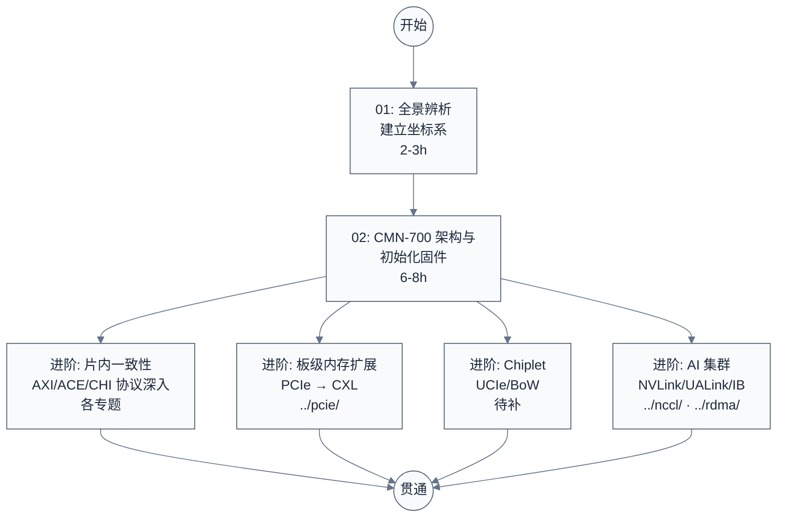

# 互联总线与协议专题

> 面向嵌入式/系统软件工程师的互联总线与协议全景学习指南。从片内到机柜级,用"物理范围 × 协议层级"两个维度把 AXI/ACE/CHI、CMN/CCI、TileLink、UCIe、BoW、PCIe、CXL、NVLink/NVSwitch、UALink、InfiniBand/RoCE 等一众名字归位,辨析"协议 vs 实现""PHY vs 事务层"等核心混淆点。

---

## 学习路线图



---

## 文档索引

| 序号 | 文档 | 内容概要 | 建议用时 |
|:----:|------|---------|:--------:|
| 01 | [互联总线与协议全景辨析](./01-互联总线与协议全景辨析.md) | 两个维度归位、协议 vs 实现、PHY vs 事务层、叠罗汉关系、常见混淆点逐条澄清 | 2-3h |
| 02 | [CMN-700 架构与初始化固件](./02-CMN-700架构与初始化固件.md) | 面向多 die RISC-V 服务器 SoC 的 CMN-700 学习笔记:mesh 拓扑、Node ID 编码、三层 SAM、Discovery、boot-time 编程序列、CML 多 die 互连、RISC-V 平台迁移实践 | 6-8h |

---

## 官方文档

| 文档 | 用途 | 建议阅读时机 |
|------|------|------|
| [AMBA AXI and ACE Protocol Specification (ARM IHI 0022)](https://developer.arm.com/documentation/ihi0022/latest) | AXI4 / ACE 协议规范,AXI 信号/通道/事务、ACE 一致性扩展 | 学完 01 后深入片内一致性时 |
| [AMBA CHI Architecture Specification (ARM IHI 0050)](https://developer.arm.com/documentation/ihi0050/latest) | CHI 协议规范,请求/监听/数据通道、目录协议 | 学完 01 后深入 CHI 时 |
| [Arm Neoverse CMN-700 Technical Reference Manual (102308)](https://developer.arm.com/documentation/102308/latest) | CMN-700 完整 TRM,mesh/节点/SAM/Discovery/CML/编程序列 | 学完 02 后深入具体章节时 |
| [AMBA CMN-600 Technical Reference Manual](https://developer.arm.com/documentation/102336/latest) | CMN-600 TRM,与 CMN-700 对照参考 | 学完 02 后做多代对比时 |
| [UCIe Specification (1.0/1.1/2.0)](https://www.uciexpress.org/) | Universal Chiplet Interconnect Express,片间 PHY + D2D Adapter 标准;2.0 支持 3D 封装 | 学完 01 后深入 Chiplet 时 |
| [PCI Express Base Specification 6.0](https://pcisig.com/specifications) | PCIe 板级总线规范(5.0=32/6.0=64 GT/s) | 已有 [../pcie/](../pcie/) 专题 |
| [CXL Specification 3.1 / 4.0](https://computeexpresslink.org/) | CXL.io/cache/memory 协议规范;4.0(2025-11)速率翻倍至 128 GT/s | 学完 01 后深入板级内存扩展时 |
| [UALink 200G 1.0 Specification](https://ualinkconsortium.org/) | 加速器间 Scale-up 互联开放标准,独立 TL/DL + 以太网 PHY,支持 1024 加速器 | 学完 01 后深入 AI 集群时 |
| [InfiniBand Architecture Specification (IBTA)](https://www.infinibandta.org/) | IB 架构与 RoCEv2 规范 | 已有 [../rdma/](../rdma/) 专题 |

---

## 源码导航

本专题为概念辨析型,无独立 `src/` 子目录。涉及的具体实现源码分布在相邻专题:

| 仓库 | 路径 | 职责 | 对应专题 |
|------|------|------|---------|
| linux-common | `drivers/pci/`、`drivers/cxl/` | PCIe 与 CXL 内核驱动 | [../pcie/](../pcie/) |
| linux-common | `drivers/infiniband/`、`drivers/net/ethernet/` | IB/RoCE 驱动 | [../rdma/](../rdma/) |
| linux-common | `drivers/net/ethernet/nvidia/`、CUDA UMD/KMD | NVLink / NVSwitch | [../nccl/](../nccl/) · [../nvidia-kmd/](../nvidia-kmd/) |

---

## 按角色推荐学习路径

### 在"组件交界处"工作的固件/驱动工程师

先建立全景,再按需深入交界处:

```
01 全景辨析 → 按工作场景选相邻专题:
  - 调试 SoC 内部一致性 → AMBA AXI/ACE/CHI 规范 + CMN TRM
  - 调试加速器/CXL 内存 → ../pcie/ + CXL Spec
  - 调试 AI 集群拓扑     → ../nccl/ + ../rdma/
```

- **01 是入口**:用两个维度把所有名字归位,解决"cxl、cmn、ucie 傻傻分不清楚"
- 之后按"交界处"选专题,不必全学

---

**文档版本**: v1.1
**最后更新**: 2026-08-03
**适用对象**: 嵌入式工程师、系统软件工程师、固件/驱动工程师
