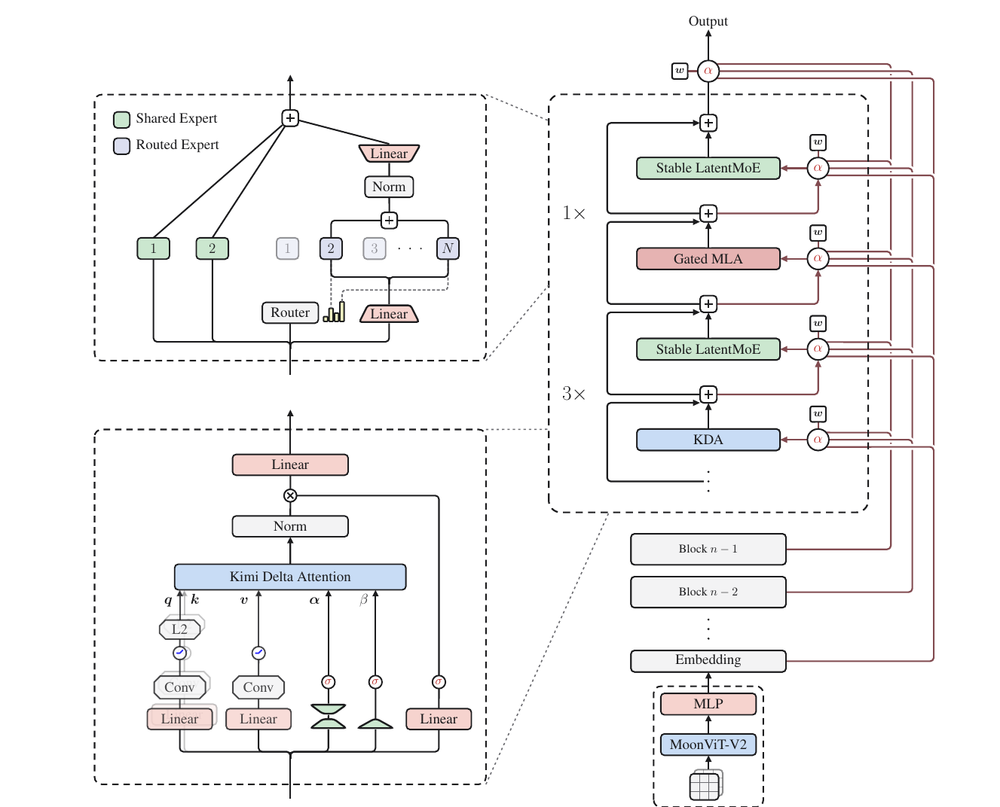
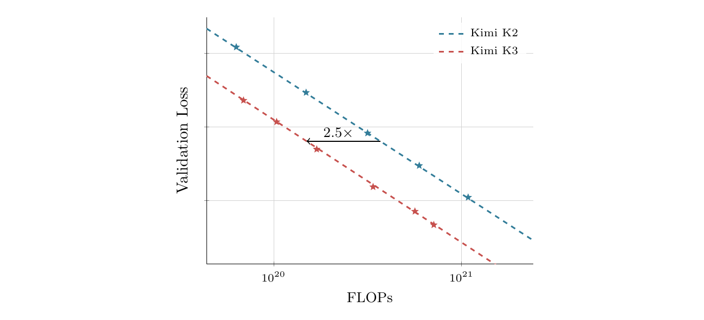
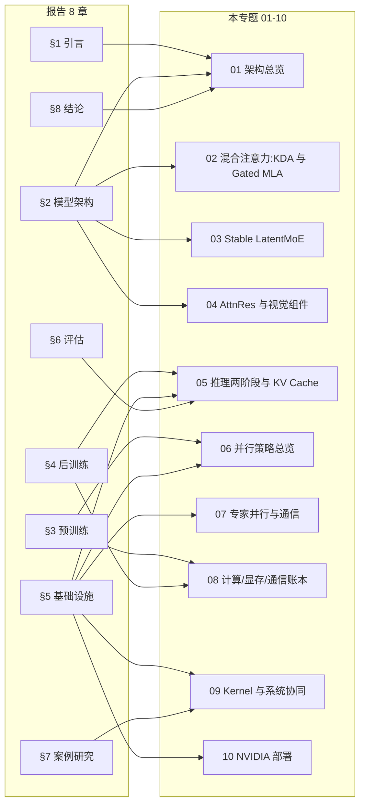
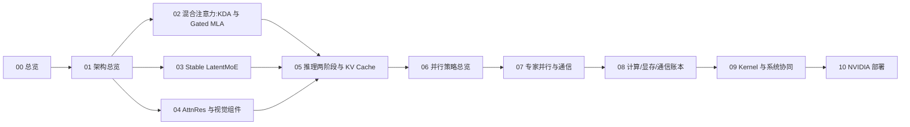

# Kimi K3 模型总览

Kimi K3 是 Moonshot AI 开源的 3T 级原生多模态 MoE 模型:总参数 2.78T、每 token 激活参数 104.2B、训练上下文最长 1M,是报告发布时首个开源的 3T 级模型(报告 §8)。

本篇是专题第 0 篇(总览),建立三个全局坐标:K3 的规模与形态、稀疏激活如何把容量与推理成本解耦、相对 K2 与 DeepSeek 谱系的位置;并给出技术报告 8 章与后续 01-10 篇的对应关系。

本篇事实来源为 Kimi K3 技术报告(`reference/kimi-k3-arxiv-2607.24653.pdf`,arXiv 2607.24653v2)。正文数值除另注外均出自报告表 1,引用统一写"报告 §X.X"。

## 前置阅读

后续各机制会单独展开,本篇只需三个基础概念:

- **Transformer 注意力**:q/k/v 投影与 KV cache 是什么,否则无法理解"MLA 省 KV cache"。
- **MoE 稀疏激活**:每个 token 不经过全部权重,而由路由器挑选少数专家计算(报告 §2.3)。
- **MLA 的动机**(可选):DeepSeek-V2 将 KV 压成低维 latent 以减少缓存,03 篇会重讲。

缺少这些背景也可继续阅读,术语出现时回看即可。

## 1. 模型概览

报告 §1 用两条轴定位 K3 相对开源生态的位置:预训练底座规模,以及后训练与推理预算。报告指出,开源模型在后一条轴上推进很快,在前一条轴上大多停留在 1T 级。

K3 把两条轴同时推到前沿:预训练底座做到 3T 级(对应报告 §3),后训练把推理预算、工具调用与长程交互扩展到 1M 上下文(对应报告 §4)。这两条轴对应报告 §3 与 §4 的主线,也是本专题后续篇幅的划分依据。

## 2. 主要参数

下表列出 K3 的尺寸与形态,是后续 01-10 篇反复引用的基准。除部署精度出自报告 §4.1.4 外,其余数字均出自报告表 1。

| 维度 | 取值 |
| --- | --- |
| 总参数量 | 2.78T(摘要与引言写 2.8T,为四舍五入) |
| 每 token 激活参数 | 104.2B(摘要写 104B) |
| 层数 | 93(69 KDA + 24 Gated MLA) |
| 隐层宽度 | 7,168 |
| 注意力头 | 96 |
| 路由专家数 | 896 |
| 每 token 激活专家 | 16(稀疏度 56 = 896/16) |
| 共享专家数 | 2(N_s = 2) |
| Latent MoE 维度 | 3,584(0.5× 隐宽) |
| MoE 每专家隐层 | 3,072 |
| 激活函数 | SiTU-GLU |
| MTP 层数 | 1 |
| 词表大小 | ≈160K(精确值见 §8 待确认项) |
| 训练上下文长度 | 1M(报告 §3.4:8K→64K→256K→1M 渐进扩展) |
| 部署精度 | MXFP4 专家权重 + MXFP8 激活,非专家组件保持高精度 |
| 视觉编码器 | MoonViT-V2:401M 参数、27 层、patch 14、12 头 |

主要参数中,总参数 2.78T 与激活参数 104.2B 相差约 27 倍,这是稀疏设计的前提:路由专家收窄进 3,584 维 latent 空间,每 token 只激活其中 16 个(另加 2 个共享专家)。口径上,摘要写 2.8T / 104B,表 1 写 2.78T / 104.2B;本专题统一用表 1 精确值,涉及摘要口径时注明四舍五入。

## 3. 稀疏激活与推理成本

MoE 的核心作用是把"容量"(总参数)与"单 token 计算量"(激活参数)解耦:K3 用 2.78T 权重承载知识,每个 token 只激活其中 104.2B(约 3.7%),单 token 的计算与显存开销被压在激活参数一侧。这一设计把规模做大的同时,把推理成本约束在可承受范围内,是后续 05-09 篇围绕的主线。

按表 1 数字推算,每 token 只经过 16 个路由专家、2 个共享专家与注意力投影,触碰的权重约 104.2B / 2.78T ≈ 3.7%,路由稀疏度为 896 / 16 = 56(报告 §2.3)。

若 2.78T 全部激活(dense 化),单 token 计算量与权重读取量放大约 27 倍,训练与推理的 FLOPs 和显存带宽都不可承受。稀疏是"容量要更大、算力有限"这对约束下唯一能同时满足两条的组织方式。

稀疏化本身带来三类代价,分别在后续篇目展开:

1. **通信**。896 个专家分布到多卡后,每层前向都要把每个 token 的 latent 表示派发(dispatch)到被选中的 16 个专家所在卡、算完再把 16 份输出合并(combine)回原卡,两段都是 all-to-all,专家越多通信越重(05/06/07 篇)。
2. **负载均衡**。896 个专家不能空转或过载,需要无辅助损失的均衡算法。报告 §2.3 给出的 Quantile Balancing 在路由得分上加一个专家特定偏置 $b_j$ 再取 Top-k,并把该偏置调到每专家目标负载 $q = mk/n$ 对应的得分分位数上,使专家选中分布趋于均匀;偏置只影响 Top-k 选择、不进入混合权重(03 篇)。
3. **kernel 与量化**。组 GEMM、稀疏权重流、MXFP4 反量化都需要专门 kernel(报告 §5.4.2,09 篇);专家权重占参数大头(报告 §4.1.4),量化与显存账本都围绕它展开(08 篇)。

## 4. 架构总览

报告 §2 把 K3 的组织方式归纳为沿序列、深度、宽度三条维度的信息流扩展:

1. **序列维**:KDA 与 Gated MLA 混合注意力负责长上下文 token 混合。
2. **深度维**:AttnRes 让每层可选择性地取回 embedding 与前序 block 的表示。
3. **宽度维**:每层注意力之后的 Stable LatentMoE 做稀疏 channel 混合,每 token 激活 896 个路由专家中的 16 个。

视觉侧由 MoonViT-V2 编码图像与视频,经轻量投影映射到共享 embedding 空间后进入主干,不设独立视觉塔;矩阵参数的优化器为 Per-Head Muon(报告 §2.5)。

*来源:Kimi K3 技术报告 Figure 2*

报告 Fig.2 的图注与图面对应关系:左上为带 shared/routed 专家的 Stable LatentMoE 模块,左下为 KDA 模块,右下为原生视觉通路;MTP 预测头作为侧路挂在主干层堆叠旁(报告表 1:MTP 层数 = 1),不在主序列流内。混合架构与原生多模态是 K3 的地基而非后装,这也是 01 篇拆解架构主线时的第一张图。

## 5. K2 到 K3 的演进

K3 不是独立设计,而是 K2 的"同隐宽、更深、更稀疏"演进:隐宽 7,168 不变,层数 61→93,路由专家 384→896,每 token 激活 8→16。完整对照见下表(报告表 1)。

| 维度 | K2 | K3 | Δ |
| --- | --- | --- | --- |
| 架构 | MoE | MoE | – |
| 层数 | 61 | 93 | ↑ 52% |
| 总参数 | 1.04T | 2.78T | ↑ 167% |
| 激活参数 | 32.6B | 104.2B | ↑ 220% |
| 隐层宽度 | 7,168 | 7,168 | = |
| Latent MoE 维度 | – | 3,584(0.5×) | – |
| MoE 每专家隐层 | 2,048 | 3,072 | ↑ 50% |
| 路由专家数 | 384 | 896 | ↑ 133% |
| 每 token 激活专家 | 8 | 16 | ↑ 100% |
| 共享专家数 | 1 | 2 | ↑ 100% |
| 注意力头 | 64 | 96 | ↑ 50% |
| Dense 层数 | 1 | 1 | = |
| 词表大小 | 160K | 160K | = |
| 训练上下文长度 | 128K | 1M | 8× |
| 注意力机制 | MLA | Hybrid KDA–MLA | – |
| 激活函数 | SwiGLU | SiTU-GLU | – |
| 注意力层构成 | 61 MLA | 69 KDA + 24 MLA | – |
| MTP 层数 | 1 | 1 | = |
| 视觉编码器 | – | MoonViT-V2(401M / 27 层 / patch 14 / 12 头) | – |

这些改动的整体收益由报告 §3.2 的 scaling-law 曲线给出。

*来源:Kimi K3 技术报告 Figure 7*

Fig.7 在 log-log 坐标系中,分别用 K2、K3 两组实际训练检查点拟合幂律曲线,横轴为训练算力(FLOPs)、纵轴为 loss。K3 的拟合线整体位于 K2 之下:同一 loss 水平下 K3 所需算力更少。报告将这一差距量化为约 2.5× 的整体 scaling 效率提升(报告 §2、§3.2,Fig.7 图注)。

谱系上,两份关键设计直接来自 DeepSeek:压缩 KV 的 MLA 由 DeepSeek-V2 提出,K3 保留在周期性的全局注意力层(报告 §2.1.2);shared/routed 专家组织沿用 DeepSeekMoE(报告 §2.3)。

## 6. 技术报告章节与本专题对应

报告 8 章中,§2(模型架构)与 §5(基础设施)是本专题的主要来源;§3/§4 对应预训练与后训练,§6/§7 对应评估与案例。下图给出"报告章节 → 本专题笔记"的映射:

精确到小节的对应:

| 报告章节 | 内容 | 本专题对应篇 |
| --- | --- | --- |
| §1 引言 | 两条 scaling 轴、贡献清单 | 00(本篇)、01 |
| §2 模型架构 | KDA、Gated MLA、AttnRes、Stable LatentMoE、视觉、Muon | 01、02、03、04 |
| §3 预训练 | 数据、scaling law、配方、长上下文扩展 | 06(背景)、08(超参来源) |
| §4 后训练 | SFT/RL、多教师蒸馏、MXFP4 QAT、EAGLE-3 | 05(投机解码)、08(账本) |
| §5 基础设施 | KDA 协同设计、3T 预训练、1M RL、推理服务 | 05、06、07、09、10 |
| §6 评估 | 主结果、第三方、成本效率 | 05(成本效率) |
| §7 案例研究 | kernel 优化、Kimi Code 造芯 | 09 |
| §8 结论 | 开源首个 3T-class | 01 |

## 7. 阅读顺序

本专题以推理部署的全链路为主线:01-04 的模型结构讲解,落点都在其对推理部署的影响与可优化点;05-10 按推理链路展开。阅读顺序按"总览 → 架构 → 三大模块 → 推理 → 并行 → 账本 → kernel → 部署"排列,后一篇只依赖前一篇已定义的术语:

顺序说明:

1. **00 → 01**:先建立全局坐标,再进入架构主线。报告 §2 的序列/深度/宽度三条信息流是理解各模块的骨架。
2. **01 → 02/03/04**:架构主线拆为三个新机制。02 的混合注意力(KDA 与 Gated MLA)决定长上下文推理成本与全局交互;03 的 Stable LatentMoE 是 896 专家稀疏规模的来源;04 的 AttnRes 与视觉组件处理跨层信息流与多模态输入。
3. **02/03/04 → 05**:模块讲完后进入推理服务侧,混合 KDA–MLA 架构给前缀缓存、投机解码、kernel 各带来新问题(报告 §5.4)。
4. **05 → 06 → 07**:06 讲并行策略总览(TP/PP/EP/DP,报告 §5.2),07 承接 06 的 EP 主骨架判断、展开 MoE 专家并行与 all-to-all 通信(MoonEP,报告 §5.2.1)。
5. **07 → 08**:账本把前面定义的尺寸(参数量、量化位宽、并行切分)折算成显存与通信量。
6. **08 → 09 → 10**:账本揭示瓶颈后,09 落到 kernel 级(WarpDecode、EAGLE-3 投机解码,报告 §5.4.2),10 落到 NVIDIA 平台(MXFP4 硬件支持、fleet 调度,报告 §5.4.3)。

## 8. 资料来源与引用规范

| 文件 | 内容 | 角色 |
| --- | --- | --- |
| `reference/kimi-k3-arxiv-2607.24653.pdf` | 主报告,47 页 | 正文事实来源,引用格式"报告 §X.X" |
| `reference/kimi-linear-arxiv-2510.26692.pdf` | KDA 出处(Kimi Linear Attention) | 02 篇引用 |
| `reference/attention-residuals-arxiv-2603.15031.pdf` | AttnRes 出处 | 04 篇引用 |
| `reference/kimi-k3.txt` | 主报告 pdftotext,用于 grep 定位章节 | 辅助,非一手 |

全专题统一的三条数字纪律:

1. 报告表 1 可查的数字,标"报告表 1"。
2. 推算类数字(如逐层参数量),标"按表 1 超参推算"。
3. 查不到或未闭合的项,标 `> **待确认**`,不编数字。

本篇的待确认项:

> **待确认**:词表精确值 163,840——报告表 1 写"160K",精确值以 HF config 为准;MLA 的 latent KV 维度、KDA 每头维度等注意力内部数值,报告表 1 未给出,02 篇展开时以一手 config 核对。

## 9. 小结

K3 的核心参数:2.78T 权重、104.2B 激活、1M 上下文、93 层 96 头、896 专家稀疏路由。设计的核心是用稀疏激活把容量做大、把单 token 成本压住。后续 01-10 篇按"架构 → 模块 → 推理 → 并行 → 账本 → kernel → 部署"逐层展开。

下一篇:[01 架构全貌](./01-architecture-full-picture.md),从报告 §1/§2 讲架构主线:K3 如何按序列 / 深度 / 宽度三条信息流组织,每个 block 内 KDA、Gated MLA、AttnRes、Stable LatentMoE 如何拼接。
