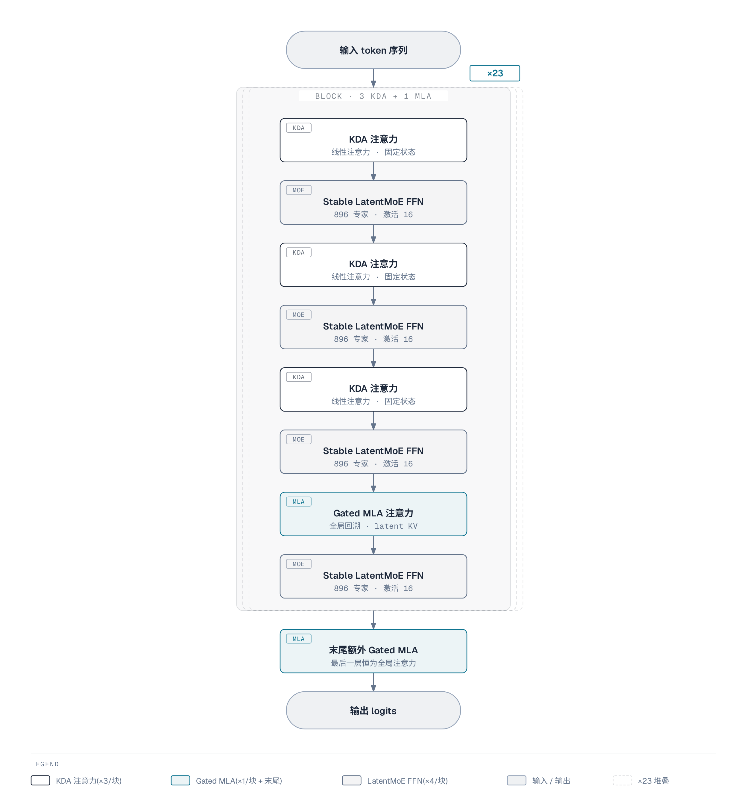

# Kimi K3 架构全貌

承接 [00 模型总览](./00-k3-overview.md) 的全局坐标，本篇把报告 §2 的架构展开成一张总表、一条三路信息流主线与一张 block 结构图。

行文重点不在架构形态本身，而在每个架构元素对推理部署的影响与可优化点:两种 KV(键值，key/value)形态怎么决定 KV Cache(键值缓存)显存与前缀缓存，896 专家的极端稀疏怎么要求专家并行与 all-to-all(全对全)通信，跨层取回怎么影响激活存留与 kernel(GPU 并行计算程序)设计。

这些内容分别对应 05(KV Cache 与两阶段推理)、06/07(并行与专家通信)、08(计算/显存/通信账本)、09(kernel 协同)、10(NVIDIA 部署)。事实来源为报告表 1 与 §2、§4.1.4、§5.4,正文引用统一写"报告 §X.X"。

*来源:Kimi K3 技术报告 Figure 2*

报告 Fig.2 自上而下画的是 token 序列与图像经 MoonViT-V2 编码后混排进主干，穿过重复堆叠的 block,末端接输出头。图注把架构概括为 token / channel / layer(词元/通道/层)三路混合，分别对应本节的 sequence / width / depth 三根轴；MTP(多 token 预测，multi-token prediction)预测头作为侧路挂在主干旁，不在主序列流内(报告 Fig.2 图注、表 1)。

## 1. 主要参数总表

K3 的全部尺寸与形态由报告表 1 一张表给定，是后续 02-10 篇反复引用的基准。除部署精度出自报告 §4.1.4 外，下表数字均出自报告表 1。

| 维度 | 取值 |
| --- | --- |
| 架构类型 | MoE(稀疏混合专家) |
| 总参数量 | 2.78T |
| 每 token 激活参数 | 104.2B |
| 层数 | 93 = 69 KDA + 24 Gated MLA |
| 隐层宽度 hidden | 7,168 |
| 注意力头 | 96 |
| 路由专家数 | 896 |
| 每 token 激活专家 | 16(稀疏度 56 = 896/16) |
| 共享专家数 | 2 |
| Latent MoE 维度 | 3,584(0.5× 隐宽) |
| MoE 每专家隐层 | 3,072 |
| Dense 层数 | 1 |
| 激活函数 | SiTU-GLU |
| MTP 层数 | 1 |
| 词表大小 | ≈160K(精确值 163,840 待确认) |
| 训练上下文长度 | 1M |
| 部署精度 | MXFP4 专家权重 + MXFP8 激活，非专家组件保持高精度 |
| 视觉编码器 | MoonViT-V2:401M 参数、27 层、patch 14、12 头 |

表中数字分三组，各管一路部署账本：

1. **隐层宽度 7168 与 96 头**决定单层注意力与 FFN(前馈网络，feed-forward network)的计算形状，是 08 篇逐层账本的起点。
2. **896 / 16 / 2 与 latent 3584**决定稀疏扩张怎么不爆炸，直接对应 06/07 篇的专家并行与 all-to-all 通信量。
3. **93 层与 1M 上下文**是 depth 与 sequence 两轴的输入，落到 05 篇的 KV Cache 显存与 09 篇的 kernel。

表中没有 head_dim(每个注意力头的向量维度)、MLA 的 latent KV 维度、KDA 每头维度这类注意力内部数值——报告表 1 不给。

## 2. 三路信息流主线

报告 §2 把 K3 的信息流沿序列长度、网络深度、模型宽度三条轴展开(报告 §2)。三根轴对应三个机制，各用一个特定运算形状解决一条规模问题，也各带一个部署后果：

| 轴 | 机制 | 部署后果 | 后续篇 |
| --- | --- | --- | --- |
| sequence | Hybrid Attention(KDA + Gated MLA) | 两种 KV 形态并存，决定 KV Cache 显存与前缀缓存 | 02、05 |
| depth | Attention Residuals(AttnRes) | 跨层取回使层间依赖变宽，影响激活存留与 kernel | 04、09 |
| width | Stable LatentMoE | 896 专家极端稀疏，要求专家并行与 all-to-all 通信 | 03、06、07 |

### 2.1 sequence 轴:KDA 固定状态 + MLA 逐 token 压缩 KV

sequence 轴要解的是 softmax 注意力(标准注意力:把每个 token 对历史的关注权重归一化后加权求和)把每 token 的 key/value 都存下来、KV cache 随序列线性增长，1M 上下文不可承受。K3 用两种注意力并存来解，代价是部署端要同时维护两套性质不同的缓存。

- **KDA 把历史写进固定大小的状态**。每头一份 $S \in \mathbb{R}^{d_k \times d_v}$;输入 $x_t \in \mathbb{R}^{7168}$ 经投影得 $q_t, k_t \in \mathbb{R}^{d_k}$、$v_t \in \mathbb{R}^{d_v}$。每 token 的写入是通道衰减 + 外积 $k_t v_t^\top$(给固定矩阵加一个秩 1 项),读出是 $S^\top q_t$(一个 $d_v$ 维向量)。状态不随序列增长、每请求只存一份(报告 §5.1、§5.4.1)。
- **MLA 把每 token 压成低维 latent 再缓存**。缓存 $c_t$ 一个向量而非每头 key + value,注意力仍是标准 softmax 注意力族：$QK^\top \to \operatorname{softmax} \to V$。缓存随序列增长但被压缩，同时保留全局 token-to-token 交互——每个 token 都能直接关注到任意其它 token(报告 §2.1.2)。每 block 只放 1 层 MLA,保证全局精确回溯。

两套缓存落到部署端三条结论(报告 §5.4.1)：

1. **KV Cache 显存**。KDA 层缓存不随序列增长(近似 O(1)),MLA 层随序列增长但被 latent 压缩。1M 上下文下显存大头集中在 24 个 MLA 层。
2. **前缀缓存**。前缀缓存指把已算过的输入前缀结果存下来，下次相同前缀直接复用、不重算。复用前缀必须把 KDA 状态与 MLA KV 同时恢复到同一边界才有效；统一分页池把固定大小的 KDA 状态与逐 token 的 MLA KV 装进同一池。
3. **prefill/decode 分离**。prefill(预填充，一次算完整段输入)与 decode(解码，逐 token 生成)是两个阶段。当两类节点采用不同 TP(张量并行，把一层内的矩阵沿张量维度切到多卡)度时，两种缓存在传输路径上各自重排，GPU 上零数据重排(shuffle)。

### 2.2 depth 轴:跨层取回与激活存留

层一深，标准残差(把每层输出加回输入的跳接)把所有前序信息压进单一状态、逐层衰减；AttnRes 让每层用一个可学习的 pseudo-query(伪查询向量，学出来的检索向量)选择性检索 embedding 与前序 block 的表示，换取 93 层可训(报告 §2.2)。代价是跨层表示要常驻显存、推理时要专门 kernel 合并。

- **取回运算**:每个注意力层的输出都作为一个 key/value 候选，pseudo-query 对 embedding 与前序层输出做 attention,按数据相关权重取回(报告 §2.2)。
- **Block 形式**:93 层切成 8 个约 12 层的 block,块内先求和、块间做 attention,内存与通信开销从 O(Ld) 降到 O(Nd)——L 是层数、d 是单层表示维度、N 是 block 数(报告 §2.2)。
- **kernel**:块表示在边界层算一次、被后续层共享并常驻 GPU,AttnRes 计算整体被 checkpointing(激活重算:前向不存中间激活、反向时重算)包裹(报告 §5.2.2);decode 时跨 block 的合并算子放 side stream(独立执行流)与主 stream 计算重叠，online softmax(边算边归一化)合并进 TP 的跨卡规约(报告 §5.4.2)。

### 2.3 width 轴:896 专家的极端稀疏

width 轴把 channel 混合(在特征维度上做混合)扩到 896 个路由专家、每 token 激活 16 个(稀疏度 56):2.78T 权重、单 token 只读 104.2B(约 3.7%)。极端稀疏换来容量，代价是专家并行、all-to-all 通信、负载均衡三件事同时必须解决。

- **形状链**。$x[L,7168] \to W_\downarrow[3584,7168] \to z[L,3584] \to$ 16 个路由专家 $\to$ RMSNorm(均方根归一化)$+ W_\uparrow[7168,3584] \to$ out$[L,7168]$;2 个共享专家走全宽 7168 直接处理、每 token 恒激活(报告 §2.3)。完整数据流在 §4。
- **派发与合并**。被选中的 16 个专家落在不同卡上，每层前向把该 token 的 latent 表示派发(dispatch)到专家所在卡、算完把 16 份输出合并(combine)回原卡，传输单元是每 token 3584 维，两段都是 all-to-all。报告 §5.2.1 用 MoonEP 实现完美负载均衡、静态计算形状与零拷贝通信。
- **负载均衡**。Quantile Balancing(分位数均衡)在路由得分上加专家特定偏置 $b_j$ 再取 Top-k(得分最高的前 k 个专家),偏置调到每专家目标负载 $q = mk/n$ 对应的分位数上；偏置只影响 Top-k 选择、不进混合权重(报告 §2.3.3)。

## 3. block 结构:三路信息流落成一个 block

三路信息流最终落成具体的 block 布局:每个 block 3 个 KDA 注意力 + 1 个 Gated MLA 注意力(3:1),每个注意力层配一个 Stable LatentMoE FFN;backbone(主干网络)末尾再放一个 Gated MLA,保证最后一层永远是全局注意力(报告 §2.1、Fig.2 图注)。

按表 1 与 §2.1 推算，block 数为 69 KDA ÷ 3 = 23;23 个 block 共 92 层，加末尾 1 个 MLA 正好是 93 = 69 KDA + 24 MLA。3:1 交错是"长程便宜 + 全局精确回溯"的折中:全 KDA 只有压缩状态、缺全局精确回溯，全 MLA 在 1M 上下文下缓存不可承受(报告 §2.1)。

这里的两处"block"是两种不同分组:注意力混合的 23 个 block 是上面这个 3:1 分组；AttnRes 的 8 个 block(约 12 层/block)是 §2.2 的跨层分组，二者不相关，别混。

## 4. 为什么 hidden 7168 不变却能扩到 896 专家

结论是模型宽度与专家宽度被解耦了:896 个路由专家工作在 3584 维 latent 空间，不碰 7168 全宽(报告 §2.3)。这是 2.78T 规模下参数与通信都可负担的关键。

LatentMoE 把全宽 d = 7168 留给共享专家与共享投影，路由专家只处理 ℓ = 3584 的压缩表示。数据流是:输入 token 先经下投影 W↓ 从 7168 维降到 3584 维，被选中的 16 个路由专家在这份压缩表示上各自算完、按路由权重加权聚合，再经上投影 W↑ 升回 7168 维，与 2 个共享专家在全宽上直接算出的输出相加，得到本层结果(报告 §2.3)。

由此，每个路由专家的 FFN 是 3584×3072×2 而非 7168×3072×2(按表 1 推算),专家权重流量与 all-to-all 传输的激活都按 3584 维算，相比全宽减少约一半(报告 §2.3 的动机)。

代价是 latent 表示有信息压缩，且路由路径拉长成 W↓ → 专家 FFN → W↑ 的近四次连续矩阵乘，条件数(矩阵数值稳定性的度量)差、会放大内部激活。K3 在专家聚合与 W↑ 之间插 RMSNorm 把聚合表示幅值拉回固定范围，并用 SiTU-GLU 给 gate/up 两个分支(门控与上投影两个线性分支)的线性因子平滑封顶、压住离群点。这两项细节在 03 篇。

## 5. 部署视角的架构定性

对推理部署而言，K3 架构的核心可压缩为一句：**两种注意力 KV 形态 + 极端稀疏 MoE**。它同时带来显存红利(稀疏激活、latent 压缩、低精度量化)与三类部署代价(通信、均衡、kernel):

| 架构特性 | 部署红利 | 部署代价 | 对应篇 |
| --- | --- | --- | --- |
| KDA 固定大小状态 | KV 缓存不随序列增长，1M 长前缀便宜 | 串行递推，decode 需专用 kernel | 02、05、09 |
| Gated MLA 低维 KV | 全局注意力下 KV 缓存被压缩 | 与 KDA 状态两套缓存需联合分页管理 | 05 |
| 896 专家 / 16 激活 | 单 token 只读 104.2B 权重 | 专家并行 + all-to-all 通信 + 负载均衡 | 06、07 |
| latent 3584 维专家 | 专家权重与路由通信量减半 | 路由路径四次连续矩阵乘，需稳定化 | 03、08 |
| MXFP4 / MXFP8 量化 | 参数显存大头的专家权重以 4 bit 存储 | 反量化开销，需专用 kernel | 08、10 |

## 待确认

- 词表精确值 163,840——报告表 1 写"160K",精确值以 HF config 为准。
- MLA 的 latent KV 维度、KDA 每头维度、head_dim——报告表 1 未给出，02/03 篇展开时核对。
- 末尾额外 Gated MLA 是否也配一个 Stable LatentMoE FFN、MoE FFN 总层数——报告只明说"block 内每个注意力层配一个"(报告 Fig.2 图注)。

## 下一篇

下一篇 [02 混合注意力:KDA 与 Gated MLA](./02-hybrid-attention-kda-mla.md) 展开 sequence 轴:KDA 的 delta-rule 递推与门控、Gated MLA 的 latent KV 压缩，以及二者 3:1 分工在推理两阶段里的具体含义。
