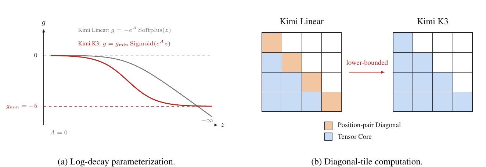

# Kimi K3 混合注意力:KDA 与 Gated MLA

承接 [01 架构全貌](./01-architecture-full-picture.md) 的 sequence 轴。K3 沿序列维的信息流由两种注意力混合承担:KDA(Kimi Delta 注意力)用一个固定大小的循环状态换掉随序列增长的 KV cache(键值缓存),Gated MLA(门控多头潜在注意力)把每 token 的 key/value 压成低维 latent(潜在向量)再缓存。

**"KDA 固定大小状态 vs MLA 逐 token 压缩 KV"这一根本差异，决定后面 KV Cache 显存账、前缀缓存设计与 decode(逐 token 生成)kernel 的全部分野**。

机制细节出自报告 §2.1 与 Kimi Linear 论文，部署影响出自报告 §5.1、§5.4,正文引用统一写"报告 §X.X"或"Kimi Linear 论文"。

## 1. 混合分工:3 KDA + 1 MLA 的取舍

每 block 3 个 KDA + 1 个 Gated MLA,backbone(主干网络)末尾再放 1 个 MLA(报告 §2.1)。这个 3:1 是对两个极端代价的折中:全 KDA 只有压缩状态、缺全局精确回溯；全 MLA 在 1M 上下文下 KV 缓存不可承受。MLA 每 4 层设一个全局回溯锚点(anchor),锚点之间的 3 层 KDA 提供便宜的长程混合。

按表 1 推算，69 KDA ÷ 3 = 23 block,23 × (3 + 1) = 92 层，加末尾 1 个 MLA 正好 93 = 69 KDA + 24 MLA。落到部署端:24 个 MLA 层是 KV 显存大头，69 个 KDA 层缓存不随序列增长(近似 O(1)),是 05 篇账本的分母。

## 2. KDA:固定大小状态的 delta-rule 递推

KDA 把 softmax 注意力的 KV cache 换成一个固定大小的循环状态 $S \in \mathbb{R}^{d_k \times d_v}$,每个注意力头(head,注意力并行拆分的一份)一份(报告 §5.1)。每个 token 的运算都作用在这个固定矩阵上:先通道衰减，再加一个外积增量；读出是与 query(查询向量)的矩阵-向量积。状态不随序列增长是缓存近似 O(1) 的根；但递推是串行的，部署端要把串行递推摊平成并行。

### 2.1 每步更新:衰减 + 外积累加

单头情形下，每 token 的状态更新与输出为(报告 §2.1.1):

$$S_t = \left(I - \beta_t k_t k_t^\top\right)\operatorname{Diag}(\alpha_t)\,S_{t-1} + \beta_t k_t v_t^\top, \qquad \tilde{o}_t = S_t^\top q_t$$

输入 $x_t \in \mathbb{R}^{7168}$ 先经 ShortConv(短卷积，对最近几个 token 做局部卷积)和 Swish 激活函数投影，得 $q_t, k_t \in \mathbb{R}^{d_k}$、$v_t \in \mathbb{R}^{d_v}$;q/k 再经 L2 归一化(把向量长度拉回 1)(报告 §2.1.1)。三个量的形状与每步运算：

| 量 | 形状 | 每步运算 |
| --- | --- | --- |
| $\alpha_t$ | $d_k$ 维向量 | 对 $S_{t-1}$ 每个 key 通道独立衰减($\operatorname{Diag}(\alpha_t)$ 左乘) |
| $\beta_t$ | 标量 | 控制外积 $k_t v_t^\top$ 写入状态的大小 |
| $S_t$ | 固定 $d_k \times d_v$ | 衰减后减去 $k_t k_t^\top$ 方向成分、累加外积 $\beta_t k_t v_t^\top$;读出 $\tilde{o}_t = S_t^\top q_t$($d_v$ 维) |

更新是作用在固定矩阵上的"一次衰减 + 两个秩 1(rank-1)项"的小规模运算，复杂度只随 $d_k, d_v$ 走、不随序列长度走。delta 规则(delta-rule)指每步做一次外积增量更新，等价于对衰减后状态做一步梯度下降式更新(Kimi Linear 论文)。

关键性质:不管序列多长，$S_t$ 始终是 $d_k \times d_v$,这是"KDA 层缓存近似 O(1)"的机制来源。

### 2.2 chunkwise:chunk 内并行、chunk 间串行

上式每步依赖上一步，GPU 上纯串行不可行；训练与 prefill(预填充，一次算完整段输入)用 chunkwise(分块)形式:一个 chunk(块，连续的若干 token)内并行、chunk 间串行(报告 §2.1.1)。一个 chunk 的 C 个位置一次算出，输出拆成两项：

$$O_{[t]} = \underbrace{(\Gamma_{[t]}^{1\to C} \odot Q_{[t]})\,S_{[t]}}_{\text{inter-chunk}} + \underbrace{A_{[t]}\,\tilde{V}_{[t]}}_{\text{intra-chunk}}$$

- **inter-chunk(块间)项**携带 chunk 之前的上下文：$Q_{[t]} \in \mathbb{R}^{C \times d_k}$ 逐元素乘 $\Gamma_{[t]} \in \mathbb{R}^{C \times d_k}$ 后，与进入状态 $S_{[t]} \in \mathbb{R}^{d_k \times d_v}$ 做 GEMM(通用矩阵乘),得 $[C, d_v]$;
- **intra-chunk(块内)项**是 chunk 内 token 间交互:因果下三角掩码(只保留"当前 token 之前"的位置)$A_{[t]} = \operatorname{Tril}(\cdots) \in \mathbb{R}^{C \times C}$ 乘 pseudo-value(伪值，经过修正的值矩阵)$\tilde{V}_{[t]} \in \mathbb{R}^{C \times d_v}$,得 $[C, d_v]$,保证只读已见 token;
- **结果修正**:query 按累计衰减 $\Gamma^{1\to C}$ 调制、key 按其倒数 $1/\Gamma^{1\to C}$ 重标定，把"逐 token 衰减"折算成"相对当前 chunk 头的衰减"。

两项都是密集 GEMM,chunk 越大越能喂饱 Tensor Core(GPU 上专做矩阵乘的硬件单元)。修正里的 $1/\Gamma$ 正是 §2.3 的入口：$\Gamma$ 是 $(0,1)$ 内保留因子的连乘，倒数会无界增大。

### 2.3 lower-bounded decay:把衰减压出数值安全区

Kimi Linear 对每步 log-decay(对数衰减)用无界的 negative-Softplus(一种激活函数)映射 $g = -e^{A}\operatorname{Softplus}(z) \in (-\infty, 0)$;K3 改成 scaled sigmoid(缩放 sigmoid 激活),把 log-decay 压到固定下界 $g_{\min} = -5$(报告 §2.1.1):

$$g_t^h = g_{\min}\,\operatorname{Sigmoid}\!\left(e^{A_h} z_t^h\right) \in (g_{\min},\,0)^{d_k}, \qquad \alpha_t^h = \exp(g_t^h) \in (e^{g_{\min}},\,1)^{d_k}$$

下界要解的是 §2.2 末尾的数值问题:key 除以累计衰减倒数 $1/\Gamma$,而 $\Gamma$ 是 $(0,1)$ 内保留因子的连乘，倒数会无界增大、有限精度下溢出(报告 §2.1.1)。

$g_{\min} = -5$ 时每个保留因子 $\alpha > e^{-5} \approx 6.7\times 10^{-3}$,16-token tile(分块)的累计 log-decay 落在 $(-80, 0)$,倒数 $< e^{80}$,仍在 BF16(16 位浮点格式)动态范围内(报告 §2.1.1)。

它带来的 kernel 结构变化比数值本身更重要:Kimi Linear 里对角线 tile 因因果约束需显式 position-pair(逐位置对)计算、是 chunk 内瓶颈；K3 的有界范围让全部因果 tile 都能走密集 Tensor Core 矩阵乘，position-pair 路径整个被消除(报告 §2.1.1)。

*来源:Kimi K3 技术报告 Figure 3*

Fig.3 两幅并列：(a) 两种 log-decay 参数化的曲线，Kimi Linear 无界下降、K3 被 $g_{\min} = -5$ 限制后趋平不触零；(b) 对角线 tile 的两种计算方式(报告 Fig.3 图注)。

### 2.4 输出门控与 NoPE 定位

K3 把 KDA 的输出门从 Kimi Linear 的低秩参数化(用两个小矩阵相乘近似一个大矩阵)改成输入依赖的 full-rank(满秩)投影(报告 §2.1.1):

$$y_t = W_o\left[\operatorname{Sigmoid}(W_g x_t) \odot \operatorname{RMSNorm}(\tilde{o}_t)\right]$$

运算顺序:循环输出 $\tilde{o}_t$ 先做按头的 RMSNorm(均方根归一化),门控 $\operatorname{Sigmoid}(W_g x_t)$ 由一次 GEMM + sigmoid 得到，二者逐元素相乘后经 $W_o$ 投影回 7168。满秩让每个 token 独立决定从状态读出哪些通道，低秩门表达受限(报告 §2.1.1)。

位置信息由 KDA 的 channel-wise decay(逐通道衰减)天然编码:越近的 token 衰减越少。这正是 §3 MLA 可以省掉 RoPE(旋转位置编码，把每个 token 的表示按位置做旋转)的原因——KDA 层承担位置/近因敏感，MLA 层只做无约束的全局内容交互(报告 §2.1.2)。

### 2.5 部署含义

KDA 的三个部署性质直接决定后面的账本与 kernel:

1. **KV 近似 O(1)**。状态固定、不随序列增长(报告 §5.1)。
2. **每请求一份**。状态是整条序列一份，不是每个 token 一个条目，长前缀保留与复用便宜(报告 §5.4.1)。
3. **decode 就地更新 + 回滚**。decode 每步就地更新状态，与 GPU 偏好宽并行的特点相悖；而且投机解码(先用小模型猜多个 token、目标模型一次验证)拒绝一部分草稿 token 时，已就地更新的循环状态无法像每个 token 一个条目的 KV 那样直接截断回退。报告 §5.4.2 的 ReplaySSM(回放重建状态)式设计因此只缓存远小于状态的投影输入(每 token 的 $k_t$、$v_t$ 与衰减/写强度系数),验证时在片上回放重建已接受 token 的状态，配合 MTP(多 token 预测)投机解码。

## 3. Gated MLA:逐 token 的 latent KV 压缩

MLA(多头潜在注意力)保留全局 token-to-token 注意力，但把每 token 的 key/value 压成一个低维 latent 向量 $c_t$ 再缓存，缓存随序列增长但被压缩。K3 的 MLA 用 NoPE(不加位置编码)+ 满秩门控，位置信息交给 KDA 层承担(报告 §2.1.2)。

### 3.1 latent 压缩与注意力重建

MLA 不缓存每头的 key/value,而是缓存一个共享的压缩向量，注意力计算时用学到的上投影(重建投影)重建内容 key/value(报告 §2.1.2):

$$c_t = W_c x_t$$

- **缓存对象**:$x_t \in \mathbb{R}^{7168}$ 经 GEMM $W_c$ 得 $c_t \in \mathbb{R}^{d_c}$($d_c$ 为 latent KV 维，报告表 1 未给出),每 token 存一个；
- **重建与注意力**:计算注意力时把逐 token 的 $c_t$ 堆成的 $[L, d_c]$ 矩阵上投影回各头 key/value,再做标准 softmax 注意力：$QK^\top[L, L] \to \operatorname{softmax} \to V$,输出 $[L, d_v]$;
- **压缩比含义**:缓存量从"每头 key 维 + value 维"降到"latent 维"。K3 的 latent KV 维度报告表 1 未给出，压缩比无法量化，见"待确认"。

MLA 由 DeepSeek-V2 提出，K2/K2.5 沿用，K3 保留在周期性全局注意力层里作为"精确回溯锚点"(报告 §2.1.2)。

### 3.2 不加位置编码(NoPE)

标准注意力在计算 q 与 k 的相关性时，会把位置信息拼进去，否则"名词在哪个句子、相隔多远"这类相对位置语义就丢了。最常见的做法是 RoPE(旋转位置编码):把每个 token 的表示按它的位置做旋转。K3 的 MLA 层相反——**q、k 都不加显式位置编码(NoPE,No Positional Encoding)**,把位置与近因信息完全交给穿插的 KDA 层承担。KDA 的 channel-wise decay 天然表达"越近的 token 衰减越少",MLA 只做无约束的全局内容匹配(报告 §2.1.2)。

对部署端，这个选择有两处直接好处：

- **简化缓存**:MLA 写入缓存的 KV 里没有位置相关分量(不用 RoPE 的旋转因子、也不用单独存位置),前缀缓存命中时省掉按位置对齐的一步；
- **扩上下文不用重调**:RoPE 系方法扩上下文要重估计 frequency base(频率基，旋转的角速度基准)或用 YaRN(一种位置插值方法)插值，MLA 用 NoPE 后没有这一步(报告 §2.1.2)。

这与 K2/K2.5 的做法不同:K2 沿用带位置编码的 MLA,缓存里含位置相关项；K3 把它去掉(报告 §2.1.2)。

### 3.3 输出门控:逐通道调制读到的内容

MLA 的注意力先算出每个 token 的表示 $\tilde{o}_t$(对全部历史 KV 加权读到的全局内容),K3 再给一层**输出门**,让这个表示按当前 token 自己的输入逐通道调制：

$$y_t = W_o\left[\operatorname{Sigmoid}(W_g x_t) \odot \tilde{o}_t\right]$$

运算与形状:门控是**一次 GEMM + 逐元素乘**。输入 $x_t$ 为 [7168] 维，门投影 $W_g$ 按头输出([7168, head×d_g] 量级),过了 Sigmoid 后成为 (0,1) 的逐通道门；与注意力输出 $\tilde{o}_t$([7168] 或按头)逐元素相乘，最后经输出投影 $W_o$ 映射回 7168。报告中称这是"输入依赖、channel-wise 的输出门"。效果上，它给每个通道加了一个由输入决定的软开关:token 想强调全局读到的哪些通道就放大、不想要的就压暗(报告 §2.1.2)。

"满秩"指门投影是满秩矩阵:参数化与 KDA 侧的门控一致(K3 的 KDA 侧多一道 RMSNorm,MLA 侧没有)。表达力不受低秩限制，每个 token 能独立地选择从全局注意力读到的通道组合(报告 §2.1.2)。

### 3.4 部署含义

1. **缓存随序列增长但被压缩**。
2. **每 token 一个条目，可按每个 token 分页**。这是前缀缓存能到 512-token 细粒度的基础(报告 §5.4.1)。
3. **与 KDA 固定状态需联合分页**。两套缓存性质不同，不能分别维护独立管理器。

## 4. 两种 KV 形态的运算与缓存形状

KDA 状态与 MLA latent KV 在大小、生命周期、复用粒度上根本不同，同一前缀只有把两者同时恢复到同一边界才能复用；K3 因此把两套缓存装进统一分页池，而非各自建一个管理器(报告 §5.4.1)。

| 机制 | KV 形状 | 随序列增长 | decode 读写法 | kernel 含义 |
| --- | --- | --- | --- | --- |
| KDA 循环状态 | 每头固定 $d_k \times d_v$,每请求一份 | 否 | 读固定状态，近似 O(1) | 每步就地更新状态、串行递推，需专用 decode kernel;回滚靠回放重建 |
| MLA latent KV | 每 token 一个 $c_t \in \mathbb{R}^{d_c}$ | 是(被 latent 压缩) | 读全部历史 KV,O(N) | 重建后走标准 softmax 注意力、密集 GEMM;缓存按每个 token 可分页 |

这一差异落到部署端是三条结论(报告 §5.4.1)：

1. **KV 显存**。KDA 层近似 O(1) 不随序列涨，MLA 层随序列涨但被 latent 压缩。1M 上下文下显存大头在 24 个 MLA 层。
2. **前缀缓存要同时恢复两态到同一边界**。KDA 状态固定、只在稀疏边界存 checkpoint(检查点，保存的状态快照);MLA KV 是每个 token 一个条目。复用前缀时，命中边界必须同时有 MLA 块与 KDA checkpoint 才有效。
3. **prefill/decode 分离时的传输重排**。两节点 TP(张量并行)度不同时，re-layout(重新布局)在传输路径上完成，GPU 侧零数据重排(shuffle);页内状态按头连续存放，每头字节流自包含，是最小跨节点传输单元。

统一分页池的具体布局(6144-token 物理块内嵌 12 个 512-token 哈希块、KDA checkpoint 稀疏落点)与两阶段查找，见报告 §5.4.1。

## 待确认

- **MLA 的 latent KV 维度**:报告表 1 未给出，K3 的 KV 压缩比无法量化。
- **KDA 每头维度 $d_k / d_v$**:报告表 1 未给出；Kimi Linear 论文设 $d_k = d_v = 128$(该文所有实验),但这是 Kimi Linear 的配置，K3 是否沿用报告未声明。
- **头划分**:hidden 7168 / 96 头 ≈ 74.67 非整数，"96 头"不直接给出 head_dim。若 KDA 取 $d_k = 128$ 且 96 头，key 侧需 $96 \times 128 = 12288$ 维，超过 hidden 7168——KDA 与 MLA 头数可能不同，报告表 1 未给出分头方式。

## 下一篇

下一篇 [03 Stable LatentMoE](./03-moe-stable-latentmoe.md) 沿 width 轴展开:896 个路由专家工作在 3584 维 latent 空间，以及 Quantile Balancing 如何在极端稀疏下稳住负载均衡。
