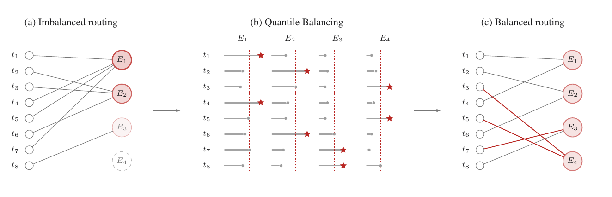

# Kimi K3 Stable LatentMoE:896 专家与负载均衡

承接 [02 混合注意力](./02-hybrid-attention-kda-mla.md) 的 sequence 轴，本篇沿 width 轴展开。

这套宽度设计是 896 个路由专家 + 2 个全宽共享专家，每 token 激活 16 个路由专家，稀疏度 56 = 896/16。

**稀疏度 56 让总容量 2.78T、单 token 只激活 104.2B 参数，但把部署压力从算力与参数显存转移到通信、负载均衡、kernel 三条线上**。

机制与数值出自报告 §2.3、§4.1.4、§5.2.1，正文引用统一写"报告 §X.X"。

## 1. 稀疏组织:896 路由专家 + 2 共享专家

MoE(专家混合)把一层里对每个 token 做非线性变换的单一 FFN(前馈网络)换成一大批专家 FFN，每个 token 只路由到其中几个。K3 沿 width 轴把专家池从 K2 的 384 个路由专家扩到 896 个，每 token 激活数从 8 翻到 16；总参数从 1.04T 涨到 2.78T，激活参数从 32.6B 涨到 104.2B(报告 §2.3)。扩容不是把每层 FFN 加宽，而是扩大专家池、增加激活专家数，换专家专化空间。

| 维度 | Kimi K2 | Kimi K3 | 变化 |
| --- | --- | --- | --- |
| 路由专家数 | 384 | 896 | ↑133% |
| 每 token 激活路由专家 | 8 | 16 | ↑100% |
| 共享专家数 | 1 | 2 | ↑100% |
| MoE 每专家隐层 | 2,048 | 3,072 | ↑50% |
| Latent MoE 维度 | — | 3,584(0.5×) | — |
| 总参数量 | 1.04T | 2.78T | ↑167% |
| 每 token 激活参数 | 32.6B | 104.2B | ↑220% |

表内数值均出自报告表 1。稀疏度 56 是路由专家的口径：896 个路由专家里每 token 只激活 16 个，896/16 = 56(报告 §2.3)。每层另配 2 个全宽共享专家处理常见变换，不参与稀疏路由、每 token 恒激活(报告 §2.3)。层结构沿用 DeepSeekMoE 的"共享专家 + 路由专家"组织，共享专家数固定为 $N_s = 2$(报告 §2.3)。

路由本身是"一次 GEMM(通用矩阵乘)+ 一次 Top-k(取前 k 个最大值)"：路由器把每个 token 投到 896 个专家各得到一个得分，再选 Top-16 派发(报告 §2.3.3，式 13 在 §5)。整批即 $X[L,7168] \times W_r^\top[7168,896] \to S[L,896]$，一次 GEMM 算出全部专家的得分；Top-16 是每个 token 按 896 个得分排序、取前 16 的规约，再按选中结果把 token 散点派发到专家所在卡。

扩容同时放大了两个失败模式，Stable LatentMoE 用三个组件分别压住(报告 §2.3)。

一是数值不稳定。路由路径 $W_\downarrow \to$ 专家 FFN $\to W_\uparrow$ 串成近四次连续矩阵乘、条件数差，2.8T 规模下内部激活会爆炸，由 §3 的 RMSNorm 与 §4 的 SiTU-GLU 处理。

二是负载均衡失效。专家数接近 $10^3$ 后，既有的无辅助损失均衡方法压不住，由 §5 的 Quantile Balancing 处理。

## 2. 路由分支的 shape 链:7168 → 3584 → 专家 → 7168

常规 MoE 里，每个被选中的专家都接收全宽 $d$ 维的 token，通信量与专家权重流量随激活专家数一起涨。896 专家、16 激活的规模下直接套用不可负担(报告 §2.3)。

LatentMoE(潜在专家混合)把"全宽路径"与"路由专家宽度"解耦：全宽 $d = 7168$ 留给共享专家与共享投影，896 个路由专家只处理 $\ell = 3584$ 维的低维表示(报告 §2.3、表 1)。

路由分支一条 shape 链走完(报告 §2.3，式 11)：

$$x[L,7168] \;\xrightarrow{W_\downarrow[3584,7168]}\; z[L,3584] \;\xrightarrow{\text{16 个路由专家}}\; u[L,3584] \;\xrightarrow{\text{RMSNorm} + W_\uparrow[7168,3584]}\; \text{out}[L,7168]$$

$$u = \sum_{i \in T_k(x)} p_i\,E_i^{\text{routed}}(W_\downarrow x), \qquad y = \sum_{j=1}^{N_s} E_j^{\text{shared}}(x) + W_\uparrow\,\text{RMSNorm}(u) \tag{11}$$

各步运算与形状：

1. **下投影** $W_\downarrow[3584,7168]$：GEMM 把 $x[L,7168]$ 降到 $z[L,3584]$，是派发的源数据。
2. **路由专家** $E_i^{\text{routed}}: \mathbb{R}^{3584} \to \mathbb{R}^{3584}$：被选中的 16 个专家各对 $z$ 算一次 FFN(3584→3072→3584)，按路由权重 $p_i$ 加权聚合得 $u[L,3584]$。
3. **上投影** $W_\uparrow[7168,3584]$：RMSNorm 后 GEMM 升回 $[L,7168]$。
4. **共享专家** $E_j^{\text{shared}}: \mathbb{R}^{7168} \to \mathbb{R}^{7168}$：2 个专家直接吃全宽 $x$，输出到 $d$，与路由分支相加(报告 §2.3)。

把专家放进 latent 空间的账，落在参数与通信两处：

| 维度 | 全宽专家(7168) | latent 专家(3584) |
| --- | --- | --- |
| gate/up 两个输入投影 | 7168×3072×2 | 3584×3072×2 |
| down 投影 | 3072×7168 | 3072×3584 |
| 每专家 FFN 参数量 | ≈ 66.0M | ≈ 33.0M |
| all-to-all 每 token 传输 | $d = 7168$ 维 | $\ell = 3584$ 维 |

每个路由专家的 FFN 参数量按"3 个矩阵"计：gate 门控矩阵 $W_g$ 与 up 上投影矩阵 $W_u$ 各为 3584×3072，down 下投影矩阵为 3072×3584，$3\times 3584\times 3072 \approx 33.0$M(按表 1 推算)。全宽专家约 66.0M。latent 化把每个路由专家权重减半，叠加到 896 个专家后，是总参数还能压在 2.78T 的关键(按表 1 推算，报告未给逐层细分)。

### 2.1 派发与合并的搬移形状

路由专家分布到多卡后，每层前向都要各做一次派发(dispatch，把数据散点送到目标卡)与一次合并(combine，把结果归并回原卡)，搬移单元是 latent 表示 $z \in \mathbb{R}^{3584}$ 而非全宽 7168(报告 §2.3 的动机)。

- **dispatch(派发)**：每个 rank(并行计算里的一张卡)上 $S$ 个 token，每个 token 的 $z$ 送到它选中的 $K = 16$ 个专家所在的 rank。这是散点搬移，总流量 $S \times K \times \ell$ 维。源侧按专家分组、目标侧拼成每个专家的 token 块，是一次 all-to-all(全对全集合通信，每个 rank 与所有 rank 交换数据)。
- **combine(合并)**：16 份专家输出按路由权重加权聚合回原 token，是 dispatch 的逆 all-to-all，流量同样 $S \times K \times \ell$。
- **共享专家与路由专家的搬移之别**：2 个共享专家在每个 EP(专家并行)rank 上复制，$x$ 全宽在本 rank 本地直算、不参与派发。只有 896 个路由专家跨 rank，才走 dispatch/combine 的 all-to-all(报告 §5.2)。MoonEP 做到完美负载均衡(每 rank 恰好收 $S \times K$ 个 token)、静态计算形状与零拷贝通信(报告 §5.2.1)。

代价有两处。一是 latent 表示是压缩后的子空间，路由专家看不到全宽完整表示，信息压缩由共享专家与 $W_\uparrow$ 补回。二是路由路径拉长成 $W_\downarrow \to$ 专家 FFN $\to W_\uparrow$ 的近四次连续矩阵乘，放大了数值不稳定性(报告 §2.3)。

## 3. Normalized LatentMoE:稳定 routed 分支

原始 LatentMoE 把 $W_\uparrow$ 直接作用在聚合表示 $u$ 上，而 $u$ 的幅值随被选专家及其路由权重变化。K3 在专家聚合与 up 投影之间插入 RMSNorm(均方根归一化，把向量长度拉回固定尺度)，再与全宽共享分支合并(报告 §2.3.1)。落点即式 11 里的 $W_\uparrow\,\text{RMSNorm}(u)$。

它要压制的，正是 $W_\downarrow$、多支专家 FFN、$W_\uparrow$ 串成的近四次连续矩阵乘在 2.8T 规模下产生的内部激活爆炸。归一化把 $u$ 的尺度拉回固定范围，不让幅值经连续矩阵乘逐层放大(报告 §2.3)。

部署端这层 RMSNorm 是逐 token 的轻量元素算子(减均值、除方差、再缩放)，开销可忽略、不引入额外通信。报告另给出训练侧一致的验证 loss 与下游 benchmark 提升(报告 §2.3.1)。

## 4. SiTU-GLU:有界门控与低精度友好

GLU(门控线性单元)用一个门控信号逐元素调制另一个线性分支：$\operatorname{Sigmoid}(W_g x) \odot W_u x$。SwiGLU 把 sigmoid 门换成 $\operatorname{Swish}(x) = x\,\operatorname{Sigmoid}(x)$，成为大模型广泛采用的 FFN 设计(报告 §2.3.2)。

问题在于 SwiGLU 的两个乘法因子都无界：门控里的线性因子与 up 分支的 $x$ 若同向偏大，乘积会产生激活离群点，低精度算术下溢出风险高。GLU 的 sigmoid 门虽避免了无界增长，却丢掉了 Swish 在正半轴近似线性的响应(报告 §2.3.2)。

SiTU-GLU 用平滑截顶 $\operatorname{softcap}(x, \beta) = \beta\tanh(x/\beta)$ 同时给两个分支的线性因子封顶，保留 sigmoid 因子不动(报告 §2.3.2、§B)：

$$\text{SiTU-GLU}(x) = \left[\beta_1 \tanh\!\left(\frac{W_g x}{\beta_1}\right) \odot \operatorname{Sigmoid}(W_g x)\right] \odot \left[\beta_2 \tanh\!\left(\frac{W_u x}{\beta_2}\right)\right] \tag{12}$$

K3 取 $\beta_1 = 4$(gate 分支)、$\beta_2 = 25$(up 分支)(报告 §2.3.2)。$\beta\tanh(z/\beta)$ 在原点附近一阶等于 $z$(式 18：$\beta\tanh(z/\beta) = z + O(z^3/\beta^2)$)，大 $|\cdot|$ 时饱和到 $\pm\beta$，故 SiTU-GLU 在原点附近贴合 SwiGLU、输出有上界(报告 §B)：

$$\|\text{SiTU-GLU}(x)\|_\infty \le \beta_1 \beta_2 = 100 \tag{19}$$

运算上仍是 GLU 那一套 GEMM + 逐元素：gate/up 各一次投影后，$\tanh$、sigmoid、逐元素乘都不含跨 token 依赖。与对 gate 预激活做硬截断(hard clamping)不同，平滑截顶在饱和边界之外仍保留非零梯度，训练表现更好(报告 §B)。

![SiTU-GLU 与 GLU/SwiGLU 的门控、up 分支定义及标量响应对比:SiTU-GLU(红，β₁=4、β₂=25)在原点附近贴合 SwiGLU,大正值输入逼近 |f(x)|≤β₁β₂=100 上界，SwiGLU 保持无界；横轴 x∈[−10,100],内嵌小图放大原点附近区域(源:报告 Fig.4)](./images/k3-fig4-situ-glu.png)

*来源:Kimi K3 技术报告 Figure 4*

报告 Fig.4 分两部分：左半给 GLU / SwiGLU / SiTU-GLU 三者的 gate 与 up 分支定义，右半画三者标量响应。

SiTU-GLU 曲线(红)在原点附近与 SwiGLU 重叠，在正半轴趋近 $\beta_1\beta_2 = 100$ 的上界，而 SwiGLU 无界地继续涨。横轴域 $x \in [-10, 100]$，内嵌小图放大原点附近(报告 Fig.4 图注)。

部署含义集中在低精度量化：SiTU-GLU 让 FFN 激活有界($\le 100$)、无离群点，是报告 §4.1.4 把专家权重压到 MXFP4、激活按 MXFP8 计算而不溢出的前提之一。有界激活使量化尺度可预先估计、不必为极值离群点牺牲表示精度。

## 5. Quantile Balancing:按分位数设专家偏置

K3 走无辅助损失路由，不引入 DeepSeek 式的辅助负载均衡损失，而是给路由得分加专家特定偏置 $b_j$ 再取 Top-k(报告 §2.3.3)：

$$s_i = \operatorname{Sigmoid}(W_r x_i), \qquad T_i = \operatorname{arg\,topk}(s_i + b), \qquad p_{i,j} = \frac{s_{i,j}}{\sum_{r \in T_i} s_{i,r}},\; j \in T_i \tag{13}$$

$b$ 只进 Top-k 选择、不进 $p_{i,j}$，因此调节派发时不改变混合权重，也不进入路由器的梯度优化(报告 §2.3.3)。

既有的无辅助损失方法用固定步长更新偏置：$b_j^{(t+1)} = b_j^{(t)} + \gamma\,\operatorname{sign}(\bar\ell - \ell_j)$，其中 $\gamma$ 要在"适应慢"与"负载震荡"之间折中。专家池扩到 896 后，这个折中区间被压没了——负载不均会拖慢专家并行训练，还可能让部分专家欠训(报告 §2.3.3)。

Quantile Balancing(分位数均衡，下文称 QB)改按"目标负载对应的路由得分分位数"设偏置，一次前向算出下一步偏置、不引入辅助 loss。分三步(报告 §2.3.3)：

1. **目标负载**。一批 $m$ 个 token 路由到 $n$ 个专家、每 token 选 $k$ 个，目标负载 $q := mk/n$。
2. **用 Top-(k+1) 取截断值**。把 Top-k 换成 Top-(k+1)：前 $k$ 个是实际路由，第 $(k+1)$ 个是该 token 的截断 $\alpha_i$——专家得分要超过 $\alpha_i$ 才能挤进 token $i$ 的 Top-k。这一步免去了单独在 token 侧估分位数。
3. **按分位数设偏置**。固定各 token 截断后，调到 expert $j$ 的 token 数随阈值 $-\hat{b}_j$ 单调递减；令该计数等于 $q$，则 $-\hat{b}_j$ 就是 margin(余量，专家得分减去截断值)$s_{i,j} - \alpha_i^{(t)}$ 的第 $(q+1)$ 大值。因 $q/m = k/n$，这等价于 margins 的 $(1-k/n)$ 分位数(报告 §2.3.3)：

$$\hat{b}_j^{(t+1)} \leftarrow -\,\operatorname{quantile}_{1-k/n}\!\left(s_{:,j} - \alpha^{(t)}\right), \qquad b^{(t+1)} \leftarrow \hat{b}^{(t+1)} - \operatorname{mean}\!\left(\hat{b}^{(t+1)}\right) \tag{14}$$

margin 里减掉的是带偏置的截断 $\alpha_i$，旧偏置只经截断进入更新；第二行减去公共偏移，不改变 Top-k 选择(报告 §2.3.3)。更新只在下一步生效，一个 batch 从不用由自身导出的偏置来路由；最终偏置在推理时冻结(报告 §2.3.3)。

*来源:Kimi K3 技术报告 Figure 5*

Fig.5 三幅并排，是"问题 → 机制 → 效果"的同一路由过程，不是三个独立稳态(报告 Fig.5 图注)：

1. **(a)** 朴素 Top-k 路由下 8 个 token 明显偏向少数专家，负载 (4,3,1,0)。
2. **(b)** 画 margin $s_{i,j} + b_j - \alpha_i$ 与偏置调整量，调整量放在第 $(q+1)$ 大 margin 处使恰好 $q = 2$ 个 margin 越过。
3. **(c)** 保留的选择给出均衡负载 (2,2,2,2)，即 $8/4 = 2$，红边标出被 QB 改派的 token(报告 Fig.5 图注)。

在 896 专家规模下，式 14 的分位数覆盖整个全局 batch，margins 数以百万计、分散在多 rank 与多个累积步，精确分位数无法逐 token 收集。

实际用直方图估计：每个专家一张 margin 直方图，一次 all-reduce(全归约，把所有 rank 的计数求和并广播回每个 rank)汇总各 rank 的桶(bin，直方图里一个区间)计数，再从汇总计数读出分位数。计数可加，直方图天然代表整个 batch，估计误差止于桶宽度，通信成本每专家仅几百个桶(报告 §2.3.3)。

与辅助 loss 路由(DeepSeek 等)的取舍：辅助 loss 把均衡写进训练目标、实现简单，但均衡项与主任务 loss 竞争、通常需调权重。QB 不引入额外 loss，偏置 $b$ 从 $p_{i,j}$ 中省略，调节派发时不改变混合权重、也不进入路由器的梯度优化。代价是把均衡问题变成"算准分位数"——896 专家下要用直方图近似(报告 §2.3.3)。

## 6. MoE 稀疏的部署账

权重与激活被稀疏度 56 解耦：2.78T 参数绝大部分存在 896 个专家的 FFN 里，单 token 只激活约 3.7%(104.2B / 2.78T，按表 1 推算)。总参数大，决定了参数显存与量化是显存账的大头；单 token 计算小，决定了推理吞吐更受通信与带宽约束，而非纯 FLOPs(浮点运算次数)。

部署端三条线逐一落位：

1. **参数显存与量化**。专家权重占模型参数显存的大头，部署时量化到 MXFP4(4 位微缩放浮点格式，每个权重 0.5 字节)、激活按 MXFP8(8 位微缩放浮点格式)计算；注意力投影、latent MoE 投影($W_\downarrow / W_\uparrow$)、共享专家、路由器保持更高精度(报告 §4.1.4)。逐层路由专家 FFN ≈ $3\times 3584\times 3072\times 896 \approx 29.6$B，93 层合计 ≈ 2.75T，与 2.78T 总量吻合(按表 1 推算，报告未给逐层细分，精确值待确认)。
2. **专家并行与 all-to-all**。896 专家分布到多卡后，每层都要把 token 派发到专家所在卡、算完再聚合回来；共享专家在各 EP rank 上复制，派发/聚合的 all-to-all 与计算重叠以隐藏延迟(报告 §5.2)。这引出的三个问题——rank 间 token 负载不均、激活/梯度/优化器状态超内存、视觉编码器计算量波动上关键路径——对应报告 §5.2.1-5.2.3。
3. **均衡与 kernel**(报告 §5.2.1)。MoonEP 用动态冗余专家做到完美负载均衡、静态计算形状、零拷贝通信：每 rank 恰好收 $S\times K$ 个 token，冗余专家上界 $E/R$、紧；规划 kernel 预计算每个 token 的目标位置，直接发送到专家分组位置、返回通信缓冲视图，免中间拷贝；完美均衡使每层计算形状静态可知，消掉逐层 MoE 主机同步与 kernel 启动开销。rank 内每个专家的 token 数仍偏斜，再用工作负载感知的 GEMM 调度器适配。

稀疏推理由此从"算力受限"转为"通信与带宽受限"：单 token 只激活 104.2B 参数，FLOPs 需求低，但每次前向都要把 896 专家的权重从显存读进计算单元、把 token 经 all-to-all 送到专家所在卡、并保证各卡负载均衡以摊平 makespan(一批任务从开始到全部完成的耗时)。

## 待确认

- **逐层专家参数量精确值**：报告未给 896 专家的逐层细分，$3\times 3584\times 3072 \approx 33.0$M/专家、$29.6$B/层均为按表 1 推算。
- **专家 FFN 是否含 bias**：报告表 1 未说明 LLM 专家 FFN 的 bias 配置(去 bias 只对 MoonViT-V2 明说)，上表参数量按无 bias 计。
- **$W_\downarrow / W_\uparrow$ 与共享专家的具体形状**：报告只给 latent 维度 $\ell = 3584$ 与每专家隐层 3072，$W_\downarrow$ 是否含二次项、共享专家内部布局报告未展开。

## 下一篇

下一篇 [04 AttnRes 与视觉组件](./04-attnres-vision-components.md) 沿 depth 轴展开 Attention Residuals 的跨层取回，并交代原生视觉通路(MoonViT-V2 编码器与投影)在推理两阶段里的位置。
