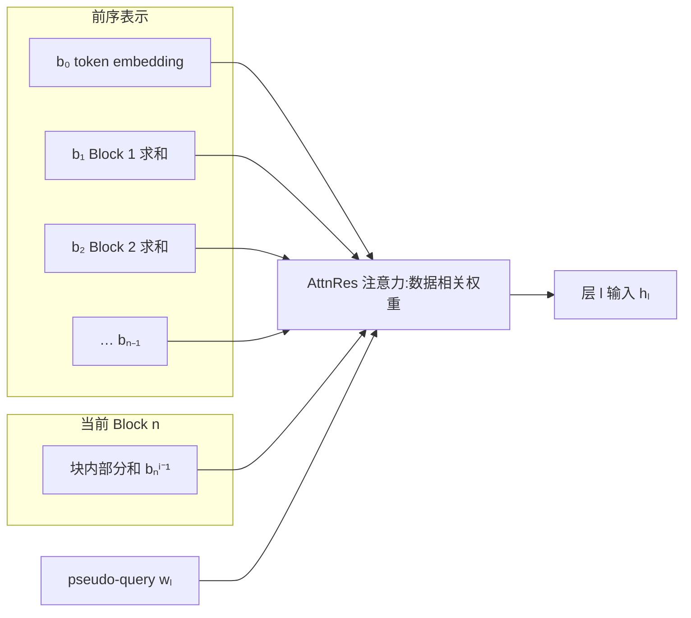

# Kimi K3 深度轴与视觉组件:Attention Residuals、MoonViT-V2 与 NoPE

承接 [03 Stable LatentMoE](./03-moe-stable-latentmoe.md) 的 width 轴,本篇补上 depth 轴与原生视觉通路。[01 架构全貌](./01-architecture-full-picture.md) §2.2 已把 depth 轴概括为"跨层取回与激活存留":AttnRes 让每层用可学习 pseudo-query 对 embedding 与前序层输出做 attention,按数据相关权重选择性取回。

**它缓解 PreNorm 下的深度稀释、换来 93 层可训,代价是把块表示常驻显存、把层间依赖拉宽到"依赖前面所有块",并在 decode 侧引入专门的合并 kernel**(报告 §2.2、§5.2.2、§5.4.2)。

视觉输入由 MoonViT-V2 编码后混排进主干,其 token 数即推理侧的输入开销(报告 §2.4);NoPE、Per-Head Muon、MTP 三个配角分别落在 MLA 缓存、优化器、投机解码上。

机制出自报告 §2.2、§2.4、§2.5、表 1、§4.1.4、§5.2.2、§5.4.2;AttnRes 的通用机制细节报告 defer 到 Attention Residuals 论文,正文引用统一写"报告 §X.X"或"AttnRes 论文"。

## 1. Attention Residuals:深度维的选择性取回

深度维的瓶颈与序列维同构:标准残差把前序信息用固定单位权重累加进单一状态,如同时间上的 RNN;AttnRes 把序列上"注意力替代循环"的办法应用到深度上,让每层按数据相关权重取回前序表示(报告 §2.2、AttnRes 论文)。

### 1.1 标准残差的深度瓶颈

标准残差 $h_l = h_{l-1} + f_{l-1}(h_{l-1})$ 展开后,每层拿到的是所有前序层输出的等权求和。depth 维的聚合因此用的是固定单位权重,不像序列混合与专家路由那样有可学习的、输入相关的加权(AttnRes 论文 §1)。

在 PreNorm 主导的实践中,这种无权重累加让隐状态幅值随深度以 $O(L)$ 增长,逐层稀释每层的相对贡献,早期层的信息被埋没、无法被选择性取回(AttnRes 论文 §1)。报告 §2.2 把这一现象概括为"把所有前序信息压进单一状态 $h_l$ 的瓶颈,类似时间上的 RNN"。

序列维早已用 attention 取代循环,让每个位置按数据相关权重取回所有前序位置;depth 维却仍停留在固定权重累加。AttnRes 要做的就是把同一套方法应用到 depth 维。

### 1.2 Full AttnRes 的机制

Full AttnRes 给每层 $l$ 设一个可学习的 pseudo-query $q_l = w_l \in \mathbb{R}^d$,把 embedding 与前序层输出当作 key/value 做 softmax 注意力(报告 §2.2,式 8–9):

$$k_i = v_i = \begin{cases} h_1, & i = 0 \\ f_i(h_i), & 1 \le i \le l-1 \end{cases}$$

$$\alpha_{i \to l} = \frac{\phi(q_l, k_i)}{\sum_{j=0}^{l-1} \phi(q_l, k_j)}, \qquad h_l = \sum_{i=0}^{l-1} \alpha_{i \to l}\, v_i$$

kernel 取 $\phi(q, k) = \exp\left(q^\top \operatorname{RMSNorm}(k)\right)$,RMSNorm 放在 key 上,防止幅值大的层输出主导权重(报告 §2.2)。权重 $\alpha_{i \to l}$ 同时由学习的 pseudo-query 与随输入变化的 key 决定,因此是数据相关而非固定单位权重。

pseudo-query 是与前向计算解耦的学习参数,意味着任意一组层的注意力权重可以并行计算,不必等前序层串行输出(报告 §2.2、AttnRes 论文 §3.1)。

Full 形式的代价:每 token 需要 $O(L^2 d)$ 算术与 $O(Ld)$ 内存存所有层输出。深度远小于序列长,算术可负担;内存 $O(Ld)$ 在普通训练里与反向传播已有的激活完全重合、零额外开销,但大规模下激活重算 + 流水线并行会让它变成实际的 $O(Ld)$ 额外内存与跨阶段通信(报告 §2.2、AttnRes 论文 §3.1)。

### 1.3 Block AttnRes 与 93 层分区

要把 $O(Ld)$ 压下来,Block AttnRes 把 $L$ 层切成 $N$ 个 block:block 内层输出先求和成一个块表示,block 间只对 $N$ 个块表示做 attention(报告 §2.2):

$$b_n = \sum_{j \in B_n} f_j(h_j), \qquad b_0 = h_1$$

$b_n^i$ 记为 block $n$ 前 $i$ 层的部分和,$b_0 = h_1$ 保证 embedding 永远是取回源。block $n$ 的第 $i$ 层,value 矩阵为(报告 §2.2,式 10):

$$V = \begin{cases} [b_0, b_1, \dots, b_{n-1}]^\top, & i = 1 \\ [b_0, b_1, \dots, b_{n-1}, b_n^{i-1}]^\top, & i \ge 2 \end{cases}$$

首层只读前序块表示(含 embedding $b_0$),后续层再额外读本块的部分和。内存与通信从 $O(Ld)$ 降到 $O(Nd)$;$N \approx 8$ 在多数规模上已能恢复大部分收益(报告 §2.2、AttnRes 论文 §3.2)。

K3 的分区按 $L = 93$ 展开(报告 §2.2):

| 结构 | 数值 | 说明 |
| --- | --- | --- |
| 总层数 | 93 | 报告表 1 |
| block 大小 | 12 层 | 报告 §2.2 |
| block 数 | 8 | 7 个满块(12 层)+ 1 个残缺块(9 层) |
| 前序表示源 | 9 | 8 个块表示 + 1 个 embedding $b_0$ |

$8 \times 12 = 96$,而 K3 只有 93 层,故最后一个 block 只有 9 层(按报告 §2.2"8 blocks with 12-layer size, giving a partial final block"推算)。这与 01 §3 里注意力混合的 23 个 block 是两种分组:前者是 3:1 的 KDA/MLA 交错,后者是 §2.2 的跨层取回分组,二者不相关。

左框是常驻的跨块表示(embedding 与已完成的块求和),右框是本块的部分和;两者与 pseudo-query 一起喂给 AttnRes 注意力,产出该层的输入。

## 2. AttnRes 的部署账

Block AttnRes 把部署代价从"每层算一次、常驻 $L$ 个表示"压到"边界层算一次、常驻 $N$ 个块表示",但块表示仍要常驻 GPU,层间依赖从"只依赖上一层"变成"依赖前面所有块",推理侧要专门的合并 kernel(报告 §5.2.2、§5.4.2)。

### 2.1 常驻块表示与 checkpointing

块表示在边界层算一次,被后续所有层共享,直接常驻 GPU(报告 §5.2.2)。AttnRes 计算整体被 checkpointing 包裹,使每层反向传播要保存的激活与标准残差架构相同:块表示由边界层一次性产生、复用,不按层重复保存(报告 §5.2.2)。

流水线并行下,块表示还要跨阶段传递。报告 §5.2.2 采用 cache-based 流水线通信:只增量传输新产生的 block,微批结束后立即释放,内存足迹达到理论下界。这是 AttnRes 论文 §4.1 的 cross-stage caching 在 K3 训练里的落点。

### 2.2 两阶段 kernel:side stream 与 TP all-reduce 合并

推理侧,Block AttnRes 走两阶段调度:一个批处理的 inter-block pass 每 block 读一次缓存的块表示,之后每层用 online-softmax merge 并入块内部分和(报告 §5.4.2)。这两类 kernel 的访存占比都很大,优化集中在访存效率上。

1. **prefill**。在每个 TP rank 上物化块表示会有冗余显存,报告用序列并行(SP)处理激活:TP all-reduce 被拆成 reduce-scatter + all-gather,块内 kernel 插在两个集合通信之间,在序列分片的 hidden state 上运行,使每个 token 的块表示只在一个 rank 上物化(报告 §5.4.2)。
2. **decode**。inter-block kernel 放到 side stream 上,与主 stream 的独立计算重叠;块内 kernel 则靠融合:AttnRes 输出与部分和更新的合并、以及后续 RMSNorm,一起融合进前一个 TP all-reduce,省掉一个专用 kernel(报告 §5.4.2)。

两阶段 + online softmax 的通用形式在 AttnRes 论文 §4.2:phase 1 把整块 $S$ 层的查询 batch 成一次矩阵乘,把访存从 $S$ 次摊销为 1 次;phase 2 顺序算块内部分和,再用 online softmax 合并。论文给出的推理延迟开销 < 2%(AttnRes 论文 §4.2)。

常驻块表示的显存量级,论文以 128K 上下文、8 块为例给出 $N \cdot T \cdot d \approx 15$ GB,序列分片到 $P$ 卡后降到 $N \cdot (T/P) \cdot d \approx 1.9$ GB,配 16K chunked prefill 可降到 0.3 GB 以下(AttnRes 论文 §4.2,该例是论文的通用量级,非 K3 专属)。

这两阶段的 inter/intra 划分、side-stream 重叠、online softmax 与 TP all-reduce 的融合,是 09 篇 kernel 素材,与 KDA decode、稀疏 MoE GEMM 一起展开。

## 3. MoonViT-V2:视觉输入的 token 开销

K3 是原生多模态:文本、图像、视频由同一个主干在一个 context 里处理,没有后置的对齐阶段(报告 §2.4)。部署侧,视觉路径的开销集中在输入:图像像素经编码变成与文本等价的 token 混排进序列,推理时的序列长度与编码计算量随之增加。

MoonViT-V2 是一个 27 层、约 401M 参数的视觉 transformer(报告表 1),采用 RMSNorm 并去掉所有线性与注意力投影的 bias 项——去 bias 是为稳定 from-scratch 优化(报告 §2.4)。

它与 K2.5 的关键差异在训练方式:K3 从零用 next-token prediction 训练编码器,而非从 SigLIP 等对比预训练模型初始化。报告 §2.4 给出的理由是联合优化稳定性,SigLIP 初始化的 MoonViT-3D 梯度范数持续偏高、频繁尖峰,MoonViT-V2 全程平稳,且视觉评估上与基线持平。

图像与视频完全共享参数;注意力被分解为帧内空间与帧间时间两趟,时间维再用 temporal pooling 压缩 token(报告 §2.4)。进入投影之前,一个 2×2 的 pixel-shuffle 下采样把视觉 token 数降到 1/4,使最高 3584×3584 像素的输入能在 1M token context 内负担(报告 §2.4)。

token 数按 §2.4 推算:patch 14(表 1),3584×3584 输入切成 $3584/14 = 256$ 个 patch 每边,共 $256 \times 256 = 65536$ 个 patch,pixel-shuffle 4× 降采样后为 16384 token。

| 维度 | 数值 |
| --- | --- |
| 参数 | 401M(≈0.4B) |
| 层数 | 27 |
| patch 大小 | 14 |
| 注意力头 | 12 |
| pixel-shuffle | 2×2,降 4× |
| 最大输入 | 3584×3584 px |
| 最大输入 token 数 | ≈ 16384 |

除最大输入 token 数外,表中数值均出自报告表 1 与 §2.4;最大输入 token 数按 §2.4 与 patch 14 推算。

部署含义有两处:

1. **序列长度与编码计算随输入增加**。视觉 token 混排进主干后增加序列长度;长上下文多模态下,大图与长视频显著增加视觉编码器的计算时间并造成跨设备负载不均。报告 §5.2.3 用动态 context parallelism 把单张大图沿 patch 维切到多卡、以 gather-KV 计算注意力,并把多张大图分到多个 sub-CP group 负载均衡分布,再把剩余编码计算藏进 PP bubble,基本消除视觉编码器的有效开销(报告 §5.2.3)。
2. **输入相关的波动负载**。编码器的计算量随输入变化,在流水线调度里需要专门的拆分与填充策略,是 06/07 篇 MoE/流水线调度讨论的输入侧背景。

## 4. NoPE:位置信息的再分工

NoPE 不是简单删掉位置编码,而是把位置/近因信息的编码职责从"逐层加 RoPE"转移到 KDA 的衰减递推;MLA 层因此只做无约束的全局内容交互(报告 §2.1.2、§3.4)。

K3 对全部 MLA 层用 NoPE,query 与 key 都不加显式位置编码(报告 §2.1.2)。位置与近因信息由穿插的 KDA 层提供:channel-wise decay 让越近的 token 衰减越少,近因信息内嵌在循环状态里(报告 §2.1.2,承接 02 §2.4)。这份分工换来两个直接收益:

1. **上下文扩展不需改位置参数**。扩到 1M token 不需要重调 RoPE frequency base 或上 YaRN,模型直接外推(报告 §2.1.2、§3.4)。
2. **MLA 的 KV 缓存更简**。对比 DeepSeek-V2 的 MLA:DeepSeek-V2 的 MLA 仍缓存一个 decoupled 的 RoPE key $k_t^R$,与压缩 latent $c_t^{KV}$ 一起存;K3 的 NoPE MLA 只缓存 $c_t$,省掉这份逐 token 的位置分量(DeepSeek-V2 论文;K3 侧报告 §2.1.2 明确 query 与 key 均无显式位置编码)。

代价是位置能力全部由 KDA 状态承担,全局回溯层本身不携带位置敏感度——这正是 02 §4 说的两套 KV 形态必须联合分页、恢复到同一边界才能复用前缀的背景。

## 5. Per-Head Muon 与 MTP

两个配角,分别落在优化器侧与投机解码侧。Per-Head Muon 只影响训练,部署无直接影响;MTP 预测头是投机解码 EAGLE-3 draft 模型的种子(报告 §2.5、表 1、§4.1.4)。

Per-Head Muon 的作用在训练侧:K3 沿用 Muon 优化矩阵参数,对注意力投影把 full-matrix 的 Newton-Schulz 正交化改成按头分块分别正交化,均衡各头的更新尺度、改善大尺度下的训练稳定性,并略降优化器开销(报告 §2.5)。它不进推理路径。

MTP 是预训练阶段挂的 1 层多 token 预测头(表 1:Number of MTP Layers = 1),结构镜像一个主干 block。部署端它的价值是:报告 §4.1.4 把这层 MTP 微调成 EAGLE-3 风格的 draft 模型——EAGLE-3 的 draft 恰好是单层 decoder、结构与 MTP 层一致,于是冻结目标模型、只更新 draft 层与特征融合投影。

draft 输入融合目标模型的低/中/高层特征,取自第 1、第 4 与最后一个 AttnRes block 的输出,拼接后经 bias-free 矩阵 $W_{E3}$ 投影,初值 $[0\ 0\ I]$ 保证初始时退化为只依赖高层特征(报告 §4.1.4)。

MTP 层复用 AttnRes block 表示作为特征源,是块表示在部署端的另一处用途。投机解码的机制是:draft 模型先一次猜多个 token、目标模型再一次性验证,接受则跳过重复的逐 token 计算、拒绝则回退到最后一个接受 token;K3 的 draft/target 配合细节在 05/09 篇展开。

## 6. 小结

depth 轴的账本与 width 轴不同:稀疏 MoE 的代价是通信与均衡(03),AttnRes 的代价是显存与 kernel。

块表示要常驻 GPU,层间依赖从上一层拉宽到前面所有块,推理侧用两阶段 kernel + online softmax + TP all-reduce 融合把新增访存压进既有通信路径(报告 §5.2.2、§5.4.2)。

视觉路径的账本在输入侧:MoonViT-V2 把像素转成 token 混排进主干,单张最大图约 1.6 万 token,序列长度与编码计算随输入波动(报告 §2.4、§5.2.3)。

NoPE 把位置职责转移到 KDA、简化了 MLA 缓存;MTP 预测头是投机解码的 draft 种子。

这些代价各自落向后续几篇:

1. **AttnRes 的 inter/intra 两阶段 kernel**、side-stream 重叠与 TP all-reduce 融合是 09 篇的素材。
2. **视觉 token 开销与编码计算波动**进入 06/07 篇的调度讨论。
3. **NoPE 简化后的 MLA 缓存**是 05 篇 KV Cache 账本的背景。
4. **MTP 微调成的 EAGLE-3 draft**与投机解码在 05/09 篇展开。

## 待确认

- **MoonViT-V2 的 token 数**:报告只给 pixel-shuffle 4× 降采样与 3584×3584 上限,16384 token 是按 §2.4、patch 14 推算。
- **AttnRes 的 sub-layer 粒度**:报告 §2.2 以 93 个 transformer 层为单位(8 block × 12 层),每个层输出 $f_i(h_i)$ 一个 key/value;AttnRes 论文的伪代码在 attention 与 MLP 两个 sub-layer 各设一个 pseudo-query,粒度更细。K3 实际按哪种粒度落地报告未说明。
- **NoPE 与前缀复用的关系**:NoPE 使 MLA 的 KV 不含绝对位置、更利于前缀复用,是推断,报告未明说。

## 下一篇

下一篇 [05 推理两阶段](./05-inference-two-phases.md) 进入推理主流程:prefill/decode 两阶段如何分派 KDA 与 MLA、KV Cache 与投机解码的调度。
