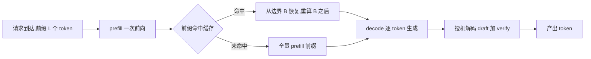
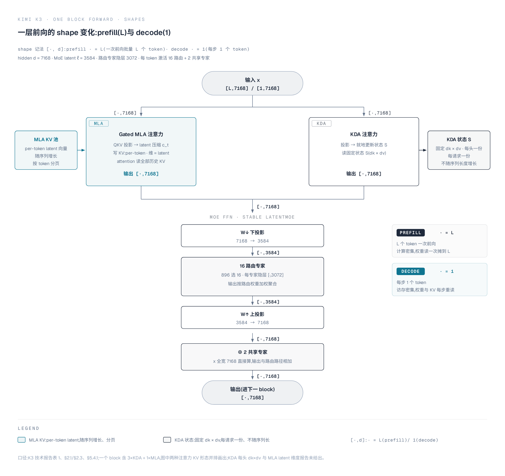
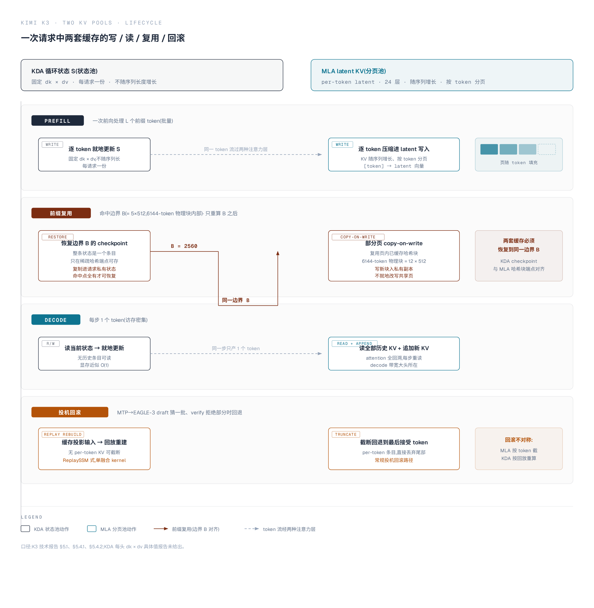
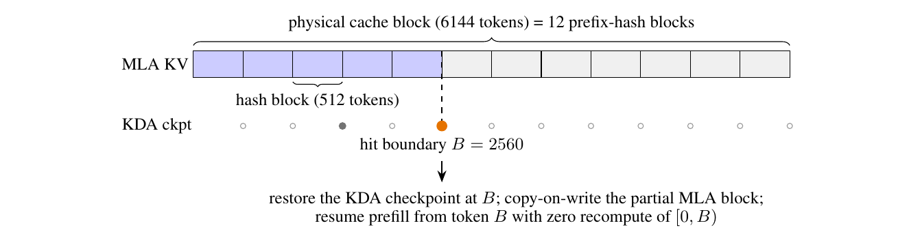

# Kimi K3 推理两阶段:prefill 与 decode

承接 [04 AttnRes 与视觉组件](./04-attnres-vision-components.md) 的深度轴与输入侧,本篇进入推理主流程。

前四篇的 KDA/MLA、MoE、AttnRes 结构在此汇成一次请求在推理系统里的完整走法:prefill 一次算完整个前缀,decode 逐 token 生成,KV 缓存、前缀复用、调度与投机解码在每一段各接管一个瓶颈。

两套 KV 形态的分野承接 [02 混合注意力](./02-hybrid-attention-kda-mla.md) §4。机制与系统设计出自报告 §5.4、§4.1.4,正文引用统一写"报告 §X.X"。

## 1. 两阶段:prefill 的计算密集与 decode 的访存密集

一次请求的推理被切成两个计算形态迥异的阶段:prefill 把整个输入前缀放进一次前向、并行算完,瓶颈在算力;decode 每步只产出一个 token,算力需求极小、却要每步重读激活权重与 KV cache,瓶颈在带宽。

两者的算术强度相差约 $L$ 倍($L$ 为前缀长度),吞吐与延迟的瓶颈在阶段间迁移,这也是推理系统把两者拆成不同节点池、分别调度的根因。

K3 的尺寸取自表 1:总参数 2.78T、每 token 激活参数 104.2B、上下文最长 1M。用标准"每参数每 token 一次乘加 = 2 FLOPs"估算,两个阶段的账本如下(按表 1 推算,报告未给绝对 FLOPs):

| 维度 | prefill | decode |
| --- | --- | --- |
| 处理对象 | 整个输入前缀(最长 1M token) | 单步生成 1 个 token |
| 计算量 | ≈ 2 × 激活参数 × 前缀长,随输入线性 | ≈ 2 × 激活参数,每 token 固定 |
| 1M 上下文的量级 | ≈ 2.1×10¹⁷ FLOPs(约 208 PFLOPs) | ≈ 2.1×10¹¹ FLOPs/token |
| 权重读取 | 读一次,摊到全部前缀 token | 每步重读一遍激活权重 |
| 瓶颈 | 计算密集,算术强度随 L 升高 | 访存密集,受权重与 KV cache 带宽约束 |

数字来源:激活参数 104.2B(报告表 1),FLOPs 按 $2\times$ 激活参数 $\times$ token 数推算。

1M prefill 为 $2\times104.2\times10^9\times10^6\approx2.1\times10^{17}$ FLOPs,decode 每 token 为 $2\times104.2\times10^9\approx2.1\times10^{11}$ FLOPs。

算术强度的迁移是核心结论:每读入一遍权重,prefill 对它做 $L$ 次乘加($L$ 越大强度越高),decode 只做 1 次乘加。

按激活参数 104.2B、专家权重 MXFP4(0.5 B/参数,报告 §4.1.4)推算,decode 每 token 至少需流过约 52 GB 激活权重——这是权重带宽的下限,非专家组件仍高精度、实际更高(报告 §4.1.4)。

$L=1\text{M}$ 时 prefill 的算术强度约为 decode 的 $10^6$ 倍量级,一算一访、边界清晰。

两个阶段的硬件偏好因此相反,报告 §5.4.1 直接以 prefill/decode disaggregation 为前提:prefill 节点与 decode 节点可以取不同 TP 度,两者之间按需传输状态(§2)。这一拆分把"一次请求走完"变成"两条资源池之间的流水",后续的传输重排、前缀复用都挂在它上面。

同一层前向在 prefill 与 decode 下的张量形状差异,是理解访存与 kernel 划分的关键:prefill 沿 `[L,·]` 批量推进,decode 沿 `[1,·]` 逐个 token 走。注意力与 MoE 各步的形状变化见下图。

## 2. 两套 KV 落地:统一分页池

02 §4 给出两条部署结论:KDA 状态固定、每请求一份,MLA KV 逐 token 增长但被 latent 压缩。推理路径上这两套 cache 不能各建一个管理器——大小、生命周期、复用粒度都不同,却要在同一边界一起恢复。K3 的做法是把 KDA 状态装进与 MLA KV 同一个分页池,统一下游的分配、引用计数与驱逐逻辑(报告 §5.4.1)。

两套缓存沿请求生命周期的写、读、复用与回滚点,见下图:

两种 cache 的形态差异,决定统一池要解决什么:

| 形态 | KDA 循环状态 | MLA latent KV |
| --- | --- | --- |
| 大小 | 固定 $d_k\times d_v$(per head) | 每 token 一个 latent 向量 |
| 随序列增长 | 否,近似 O(1) | 是,被 latent 压缩 |
| 每请求份数 | 一份 | 每 token 一份 |
| 分页方式 | 整条状态作为一个条目 | per-token 条目分页 |

统一分页池落成四个设计点(报告 §5.4.1):

1. **同字节大小、共享一套实现**。KDA 状态页与 MLA KV 页统一到同一字节大小,两种页类型共用一份 allocation、reference counting、eviction 逻辑,不再各写一套管理器。
2. **页内按头连续存放,每头字节流自包含**。页内所有 head 的状态 head-by-head 连续排布,每个 head 的字节流自包含,是跨节点传输的最小单元。
3. **prefill/decode 分离时 re-layout 走传输路径**。prefill 与 decode 节点取不同 TP 度时,re-layout 在传输路径上完成,GPU 侧零 shuffle——状态在跨节点时按需重排,不在计算节点上搬。
4. **类型混淆访问零开销兜底**。池化布局下,任何 type-confused 访问(把 MLA 页当 KDA 状态读)得到的是垃圾而非看似合理的数据,相当于一个零开销的 sanity check(报告 §5.4.1)。

这四点合起来回答"两套不同 cache 怎么在一条路径上走":分配/计数/驱逐统一,字节流按头对齐,跨节点重排放传输侧,类型错误静默暴露。KDA 状态近似 O(1) 意味着 1M 长前缀的显存大头集中在 24 个 MLA 层(报告 §5.4.1),这一点进入 08 篇账本。

## 3. 前缀缓存:从 block-hash 到细粒度前缀

统一池管的是"怎么存",前缀缓存管的是"怎么复用"。

block-hash 式前缀缓存以物理块为粒度、只哈希完整块,在 K3 上直接失效:KDA 状态是逐序列的循环状态而非逐 token 条目,状态快照只能在稀疏边界保存,于是共享块大小被逼到 1024–6144 token,哈希粒度也被存储块绑架(报告 §5.4.1)。

K3 的解法是解耦两种粒度:哈希跑在 MLA 页内的细哈希块(512 token),物理块仍是粗分配单位;KDA checkpoint 只落在 MLA 哈希端点的稀疏子集上。

### 3.1 block-hash 为什么失效

block-hash 匹配要求所有层共享一个块大小,且命中前缀只有在命中边界的 KDA 状态已被持久化时才能复用。

KDA 层每序列只维护一个大循环状态、没有 per-token 条目,状态快照只在稀疏边界才负担得起;于是共享块大小被迫取 1024–6144 token,又因哈希与存储块绑定,哈希粒度也跟着变粗——尽管 MLA 的 per-token 条目本可容忍细得多的块(报告 §5.4.1)。

这么粗的粒度几乎没法用:短于一个块的请求永远无法复用,chunked prefill 在跨过完整块边界之前导不出任何可缓存前缀(报告 §5.4.1)。失效的根子不在 MLA,而在"哈希粒度必须与存储块绑定"这一耦合。

### 3.2 解耦:细哈希块 + 稀疏 KDA checkpoint

解耦后两条轴反向对齐(报告 §5.4.1):

- **前缀哈希走细粒度**。在 MLA 页内按 512-token 哈希块计算链式哈希,物理块仍是 6144 token 的粗分配单位(6144 = 12 × 512)。
- **KDA checkpoint 走稀疏落点**。循环状态的 checkpoint 只保存在 MLA 哈希端点的稀疏子集上——这是查找唯一可能引用的位置。

prefill 时,一个部分填充的 MLA 页以其最后一个完整哈希块的链式哈希注册进前缀缓存索引,每个哈希覆盖其前所有哈希块,匹配到某个端点即认证了到该端点为止的整条前缀;注册端点随页填充推进(报告 §5.4.1)。

每次前向之后,KDA kernel 在最后处理的哈希对齐位置持久化循环状态;checkpoint 较大,随请求推进被取代的中间 checkpoint 会回收,会话轮次边界上的则保留供跨请求复用(报告 §5.4.1)。

已缓存的 checkpoint 是只读快照:命中时复制进请求私有的运行状态,新 checkpoint 写进新槽位,对其它请求可见的 checkpoint 永不被就地改写(报告 §5.4.1)。

### 3.3 两阶段查找与 hit boundary

查找分两阶段(报告 §5.4.1、Fig.12):MLA 阶段先按链式哈希匹配完整物理块,在第一个缺失块处回落到其内部哈希端点,使部分填充的页仍可命中;KDA 阶段要求候选边界在每个 KDA cache group 都有 checkpoint,每个 group 各自维护一个独立的循环状态。

命中是同时满足两阶段的最长边界——一定是哈希块的整数倍,但不必是物理块的整数倍。

报告给的实例:一条前 2800 token 匹配缓存的前缀,命中在 $B=2560=5\times512$,落在 6144-token 物理块内部。

恢复该处的 KDA checkpoint,把含命中边界的部分填充物理块 copy-on-write 成私有副本,复用其中已缓存的 5 个 MLA 哈希块,从 token $B$ 继续 prefill、不重算 $[0,B)$(报告 §5.4.1、Fig.12 图注)。

*来源:Kimi K3 技术报告 Figure 12*

图的结构对照报告 Fig.12 图注:6144-token 物理块含 12 个 512-token 哈希块,蓝格为已缓存的 MLA 块、浅灰格为空块。

条带下方的标记给出每个哈希边界的 KDA checkpoint 状态——空心圆(◦)为该边界无存储 checkpoint,灰点(•)为已持久化的 KDA checkpoint,橙点(•)标记命中在 $B=2560$ 的 checkpoint;已持久化的 checkpoint 稀疏、通常与会话轮次边界重合。

图内小字在抽取 PNG 中不可辨,数值以报告 Fig.12 图注与 §5.4.1 正文为准。

### 3.4 并发调度下的一致性

命中块同时是共享缓存条目与私有请求的增长点,MLA 与 KDA cache group 又必须在每个命中边界一致,三个机制各自对应一个具体失效模式(报告 §5.4.1):

1. **分配前全局 pin 住命中块**。所有 cache group 共用一个空闲链表,给一个 group 分配私有副本可能驱逐另一个 group 刚命中的块;因此任何分配发生前,每个命中块都跨所有 group pin 住。
2. **未落副本的块排除在匹配外**。私有副本的复制在 GPU 上前向之前立即执行,当前调度步内新分配或新注册的块仍会把前一个所有者的字节交给读者;这类块在副本落地前不进匹配。
3. **checkpoint 要么全命中要么全失效**。一个 checkpoint 只有在每个 KDA group 都存在时才能恢复请求,驱逐某个 group 的 checkpoint 原子地使其兄弟失效。

靠这三条,每个已注册状态恰好对应其声明的 token 前缀,混合 KDA–MLA 模型的前缀缓存达到与全注意力模型同等的通用性:任何共享前缀都能在任意 512-token 边界复用,与请求长度、分块、调度交错无关(报告 §5.4.1)。

## 4. 连续批处理与调度

连续批处理是 decode 侧的基础:请求在 token 边界动态加入或离开 batch,单实例的算力与显存始终被填满。

单实例之上,挑战从"每请求效率"转为"可预测性":一次 prefix-cache miss 比命中贵数个数量级,一波 1M token 请求还可能饿死短请求。

报告 §5.4.3 用两条 fleet 级策略各解一端:cache-aware 亲和调度把请求路由到持有其前缀缓存的集群,预算准入控制给每类请求独立的资源预算,防止突发长上下文压垮系统级 SLO。

在 1M 上下文下,一个典型 coding 输入携带约 400K token 前缀、却只需 4K token 的 prefill 增量,命中前缀避免重算整条前缀、比 miss 便宜数个数量级(报告 §5.4.3)。

亲和调度因此把请求路由到持有其前缀缓存的集群——跨集群迁移缓存要走过远比集群内 fabric 慢的链路。

代价是会话被绑到单个集群、其故障会中断所有绑定会话;一致哈希把每个会话 pin 到主备两个集群,主集群服务、故障时预分配的备集群接管,备集群不持有前缀缓存、接管时重算前缀(报告 §5.4.3)。

常规路径保住缓存局部性,单集群故障的影响被均摊到整个 fleet。

预算准入控制针对的是请求成本的三个数量级跨度:短请求 2K token 以下、超长请求到 1M token,单请求成本相差约三个数量级。

任何固定请求数的总负载都高度不可预测,按"平均请求"做的容量规划、排队模型、限流配额全部失效(报告 §5.4.3)。

典型失效是长上下文突发打满算力、随后到达的短请求排不上队、全流量的 TTFT(time to first token)一起恶化。

解法是给不同请求类分配独立资源预算,突发长上下文最多吃掉自己的份额、不能拖垮其它类的 SLO(报告 §5.4.3)。这一层的具体落地落在 10 篇 NVIDIA 部署。

## 5. 投机解码:MTP→EAGLE-3 draft 与状态回滚

decode 是访存密集阶段,投机解码用一个小 draft 模型先猜多个 token、目标模型一次验证,把串行 decode 换成"猜一批 + 验一批",减少每 token 摊销的权重读取。

K3 的 draft 不是另训一个小模型,而是把预训练的 MTP 层微调成 EAGLE-3 风格的 draft(报告 §4.1.4)。

代价是验证拒绝时要回滚 KV 状态,而 KDA 的循环状态在投机回滚时不能像普通 KV 那样直接截断,需要用 ReplaySSM 式设计缓存投影输入、回放重建状态(报告 §5.4.2)。

### 5.1 MTP 微调成 EAGLE-3 draft

K3 预训练时挂了一层多 token 预测(MTP)层,结构镜像一个主干 block;EAGLE-3 的 draft 恰是单层 decoder、结构与 MTP 层一致,于是冻结目标模型、只更新 draft 层与特征融合投影,把 MTP 层微调成 EAGLE-3 风格 draft(报告 §4.1.4)。

draft 输入融合目标模型的低/中/高层特征,取自第 1、第 4 与最后一个 AttnRes block 的输出,拼接后经 bias-free 矩阵 $W_{E3}$ 投影到 hidden 维,初值 $[0\ 0\ I]$ 使初始表示退化为只依赖高层特征、再在微调中逐步纳入低/中层特征(报告 §4.1.4)。

训练时 draft 展开 7 步,第一步之外目标侧最新位置特征不可用,draft 消费自己更早步骤的输出、镜像推理时的循环 drafting(报告 §4.1.4)。

### 5.2 接受率与 LK 损失

无损投机采样的加速由每 token 接受率 $\sum_{x\in V}\min(p(x),q(x))$ 决定,$p,q$ 分别为目标与 draft 的下一 token 分布(报告 §4.1.4)。对容量受限的 draft,最小化传统 KL 散度代理并不能保证最大化接受率,因此直接优化基于似然的 LK 损失——接受率本身的负对数(报告 §4.1.4):

$$L_{\text{LK}} = -\log\sum_{x\in V}\min\big(p(x), q(x)\big)$$

$p,q$ 在温度 1、无辅助 ground-truth 交叉熵项下评估(报告 §4.1.4)。这一目标与 draft 的接受率直接对齐,是 §5.1 微调阶段的优化对象。

### 5.3 KDA 回滚难题与 ReplaySSM 式设计

投机解码的通用回滚是截断:MLA 的 KV cache 是 per-token 条目,验证拒绝后回退到最后接受 token 即可。

KDA 的状态是每步就地更新的循环状态,验证拒绝一部分 draft token 时状态已越过最后接受 token、无法平凡回退(报告 §5.4.2)。

为每个 draft 位置存状态快照能支持回滚,却会把状态流量放大——在大批量在线服务的典型 batch 下这一开销占主导(报告 §5.4.2)。

报告 §5.4.2 的解法利用一个关键事实:任意已接受 draft 前缀之后的状态,完全由这些 draft token 的投影输入决定,而投影输入远小于状态本身。

于是只缓存投影输入,在片上重建已接受 token 的状态,再写回已验证与 bonus token 的状态——这一设计与同期工作 ReplaySSM 独立提出(报告 §5.4.2)。

重放的 token、bonus token 与下一个 draft 窗口共享一个循环回路,包进单个融合 kernel,涵盖 short convolution、输入归一化、门控、KDA 递推与输出归一化(报告 §5.4.2)。

验证延迟随验证 token 数亚线性增长、低于状态缓存基线(报告 §5.4.2)。

投影缓存从不离开 decode 阶段,因此前缀缓存与 prefill–decode 分离仍操作与非投机服务相同的载荷(报告 §5.4.2)。这个"缓存投影输入、回放重建状态"的融合 kernel 是 09 篇的素材,与 KDA decode、稀疏 MoE GEMM 一起展开。

## 6. 一次请求的全链路走查

用一条 1M token 前缀续写的请求把前五节串成一条可复算的链:瓶颈沿"prefill 算力 → 写缓存显存 → decode 带宽"迁移,每段各有一个优化点对上。口径沿用 08 篇:104.2B 激活参数、MXFP4 专家权重、报告表 1 超参;FLOPs 与字节均为按表 1 与 08 篇口径推算。

**1. prefill:一次前向算完 1M token,算力分三块。** 权重绑定项 $2\times104.2\times10^9\times10^6\approx2.1\times10^{17}$ FLOPs,加上 24 层 MLA 的二次注意力 $3.4\times10^{17}$ FLOPs,完整约 $5.5\times10^{17}$ FLOPs(08 §1.4)。三块计算形态:

| 计算形态 | 1M prefill 量级 | 占比 | 形态 |
| --- | --- | --- | --- |
| MLA O($L^2$) 注意力(24 层) | $\approx3.4\times10^{17}$ | $\approx62\%$ | 二次项,prefill 大头 |
| MoE FFN GEMM(16 路由 + 2 共享专家) | $\approx1.34\times10^{17}$ | $\approx24\%$ | MoE 路径权重绑定,134 G/token、占 208 G 的 64% |
| KDA 状态递推 + dense 投影 + 其余 | $\approx0.76\times10^{17}$ | $\approx14\%$ | KDA 递推为常数×$L$(08 §1.3),量小 |

算术强度一侧:prefill 把 1.44 TB 权重(MXFP4 全模型)读一次、在其上做 $5.5\times10^{17}$ FLOPs,约 $4\times10^5$ FLOPs/byte;decode 每 token 读约 52 GB 只做 208 GFLOPs,约 4 FLOPs/byte——两者相差约 5 个数量级,是"prefill 计算密集、decode 访存密集"的量化注脚。

**2. 写缓存:KDA 固定一份、MLA 逐 token 分页。** prefill 结束时两套 KV 各写一份:KDA 状态 $69$ 层 × $96$ 头 × $d_k d_v$,BF16 约 217 MB/请求、每请求一份、不随 $L$ 增长;MLA latent KV $24$ 层 × $10^6$ × $\ell_{kv}$,取 $\ell_{kv}=512$、FP8 约 12.3 GB/请求(08 §2.3)。长前缀的 KV 显存几乎全落在 24 个 MLA 层。

前缀缓存命中时这两份一并复用(报告 §5.4.1、Fig.12):哈希跑在 512-token 哈希块、物理块是 6144 token,命中边界是同时满足 MLA 块与 KDA checkpoint 的最长边界、不必是物理块整数倍。报告实例里 2800 token 匹配前缀命中在 $B=2560=5\times512$;恢复该处 KDA checkpoint、复用已缓存 MLA 哈希块,只重算 $[B,1\text{M})$ 的增量。共享前缀越长,复用越多。

**3. decode:逐 token 生成,访存主导。** 每 token 算力仅 $\approx2.1\times10^{11}$ FLOPs,却要重读 104.2B 激活权重:MXFP4 下限约 52 GB/token,BF16 口径约 208 GB/token(08 §4.2);$L=1\text{M}$ 时还要读 24 层 MLA 的 KV,注意力交互约 0.69 TFLOPs/token(08 §1.3)。这一阶段受显存带宽而非 FLOPs 约束,算术强度仅约 4 FLOPs/byte。

**4. 投机解码:EAGLE-3 draft + 状态回滚。** decode 的权重读取是逐 token 的固定开销,投机解码用 EAGLE-3 draft 一次猜多个 token、目标模型一次验证,把 52 GB/次的读取摊到多个 token(05 §5)。代价在 KDA 回滚:循环状态不可截断,改为缓存远小于状态的投影输入、片上回放重建已接受 token 状态(ReplaySSM 式,09 §3)。

**5. 端到端结论:瓶颈分段,优化各救一段。**

| 阶段 | 主导瓶颈 | 优化点 | 对应篇 |
| --- | --- | --- | --- |
| prefill 全量 | MLA O($L^2$) 算力 + MoE GEMM | TP 摊 dense、FlashKDA 并行、KCP 通信 | 06/08/09 |
| 前缀命中 | MLA KV 显存 + 命中粒度 | latent 压缩、统一分页池、512 哈希块复用 | 05/08/09 |
| decode | 52 GB/token 权重带宽 | MXFP4(4×)、WarpDecode 流式、EAGLE-3 投机 | 08/09 |
| 投机回滚 | KDA 循环状态不可截断 | ReplaySSM 式投影缓存 + 回放重建 | 05/09 |

走查的落点:prefill 的算力大头是 MLA 二次项(靠混合注意力限制在 24 层),decode 的带宽大头是专家权重(靠 MXFP4 压 4×、靠投机解码摊薄),中间的复用靠 512-token 哈希块把命中粒度做细。

## 7. 小结:部署关键点索引

本篇把一次请求在推理系统里的走法拆成五个部署关键点,各自落向账本、kernel、平台三篇:

| 部署关键点 | 本篇位置 | 内容 | 落点篇 |
| --- | --- | --- | --- |
| KV 显存 | §2 | KDA 近似 O(1),显存大头在 24 个 MLA 层 | 08 计算/显存/通信账本 |
| 前缀复用 | §3 | 512-token 哈希块 + 稀疏 KDA checkpoint,任意 512 边界复用 | 08 账本 |
| 传输重排 | §2 | prefill/decode 不同 TP 度时 re-layout 走传输路径、零 GPU shuffle | 08 账本(通信) |
| 调度准入 | §4 | cache-aware 亲和 + 预算准入控制 | 10 NVIDIA 部署 |
| 投机解码 | §5 | EAGLE-3 draft + ReplaySSM 式状态回放 | 09 Kernel 与系统协同 |

## 待确认

- **prefill/decode 的绝对 FLOPs 与带宽**:报告未给绝对数值。正文 208 PFLOPs(1M prefill)、2.1×10¹¹ FLOPs/token(decode)与 52 GB 权重下限,按"2×激活参数×token 数"标准估算、激活参数取表 1 的 104.2B;52 GB 取 MXFP4 的 0.5 B/参数下限,非专家组件高精度、实际更高(报告 §4.1.4)。
- **MLA latent KV 维度、KDA 每头维度**:承 02 待确认,报告表 1 未给出,KV 压缩比无法量化。

## 下一篇

下一篇 [06 并行策略总览](./06-parallelism-taxonomy.md) 把推理系统从单实例拉到多卡:TP/PP/EP/DP 四类并行如何分派 K3 的 2.78T 权重与 1M 上下文,为 08 的账本提供通信量与显存来源。
