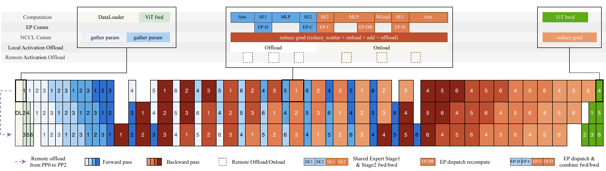

# Kimi K3 并行与通信:切分维度总览

承接 [05 推理两阶段](./05-inference-two-phases.md) 的单实例走法,本篇把推理从单卡拉到多卡。

K3 是 2.78T 总参数、104.2B 激活参数、1M 上下文的模型,单卡既装不下权重、也处理不了 1M 序列;并行策略这一层回答三个问题:把什么切到多卡上、每次切换来什么集合通信、在什么硬件边界内做。

落点是一个选型判断——TP(张量并行)只在 NVLink 域内做算子内拆分,EP(专家并行)跨机分片权重才是主骨架。训练侧的并行组合(报告 §5.2)给出底层,推理侧的差异点(EP 优先、KV 并行、prefill/decode 分离)是本篇归宿。

机制与系统设计出自报告 §5.1、§5.2、§5.4,正文引用统一写"报告 §X.X"。

## 1. 并行切什么、换什么

六种并行维度的差别不在"分多少卡",而在"切分的对象"与"切完之后换什么通信"两件事。下表把每个维度落成这两列,是后续所有通信账本(08 篇)的索引:

| 并行维度 | 切分对象 | 换来的集合通信 |
| --- | --- | --- |
| TP 张量并行(Tensor Parallelism) | 单个算子内部:权重矩阵按列/行、注意力按头 | all-reduce(对部分结果求和) |
| EP 专家并行(Expert Parallelism) | MoE 的 896 个路由专家 | all-to-all(token 派发与结果合并) |
| PP 流水线并行(Pipeline Parallelism) | 层(93 层切成若干 stage) | 点对点(激活逐 stage 传递) |
| DP 数据并行(Data Parallelism) | batch(数据样本) | 梯度 all-reduce(推理无) |
| CP 上下文并行(Context Parallelism) | 序列(切成长段分到各卡) | all-gather / prefix scan |
| SP 序列并行(Sequence Parallelism) | 序列维的算子内部(激活沿序列切) | reduce-scatter + all-gather |

TP 与 EP 都分片权重,但切法不同:TP 切进单个算子的内部,每层都要对部分结果做一次 all-reduce,通信频繁、要求低延迟高带宽互联;EP 切在专家之间,每个专家是独立 FFN,只把 token 路由到专家所在卡,一次 all-to-all。两者是 K3 权重分片的两个候选,§2 判它们的分工。

CP 与 SP 都切序列,但切的是两个层级。

- **CP** 把整条序列切成若干连续段分给各卡,段与段之间交换"上下文"——softmax 注意力交换 KV 块,KDA 交换循环状态(§4)。
- **SP** 在单个算子内部沿序列维切激活,避免 TP 各 rank 重复物化整条序列的中间量,配合 TP all-reduce 拆成 reduce-scatter + all-gather(报告 §5.4.2 对 AttnRes 激活采用 SP)。

区别:CP 解决"每段要看见全文",SP 解决"非 TP 区域的激活不必重复物化"。

通信量的关系式(具体数值留 07/08 篇):TP 的 all-reduce 每层每 token 都要发生,数据量正比于该层激活张量大小;EP 的 all-to-all 每层一次,数据量正比于"激活专家数 × latent 维 × token 数",与总专家数无关——每个 token 只路由到 16 个专家,这是 896 专家规模下 all-to-all 仍可负担的前提。

## 2. 为什么 K3 以专家并行为主基调

结论是权重分片的主基调必须是 EP,TP 只在 NVLink 域内补算子内拆分。这条判断由两个事实推出:2.78T 权重逐卡放不下,而 TP 不能跨机随意扩。

**2.78T 与 104.2B 各指什么。** 总参数 2.78T 是全量权重盘——模型所有层的全部参数之和;激活参数 104.2B 是每个 token 实际参与计算的参数量(报告表 1)。

两者差 56 倍,原因在 01 篇 §2.3 已述:896 个路由专家里每 token 只激活 16 个(稀疏度 56),大权重盘存放在专家 FFN 里,单 token 只走其中很小一部分。

这个"大而省"的结构是推理可行的前提,但也意味着权重必须有人常驻:全量 2.78T 不能靠"每 token 只读 104B"就消失。

**2.78T 逐卡放不下。** 专家权重按 MXFP4 存、约 0.5 B/参数(报告 §4.1.4),全量约 $2.78\times10^{12}\times0.5\approx1.4$ TB(按表 1 与 §4.1.4 推算),单卡 HBM 容量远小于此,必须跨卡分片。这是并行策略必须存在的原始约束,不是并行收益的主动选择。

**TP 不能跨机随便扩。** TP 每层做一次 all-reduce,通信量随激活、随层数高频发生,要求节点内的高带宽低延迟互联;工程上 TP 只能落在节点内 NVLink 域(如 8-GPU domain),跨机扩展 TP 会受节点间网络带宽限制,而且 TP 的权重分片粒度被域大小限制在 1/8 量级。

EP 则没有这个上限:896 个专家可以分到跨机的数百张卡上,每卡只持有几个专家,分片粒度随 EP 规模任意放大。

于是两种权重分片策略的选型边界清晰:

| 维度 | TP 张量并行 | EP 专家并行 |
| --- | --- | --- |
| 切分对象 | 每层算子内部(列/行、头) | 896 个路由专家 |
| 通信 | 每层 all-reduce(高频) | 每层 all-to-all(路由激活) |
| 通信量 | 随激活张量、每层每 token | 随激活专家数 × latent 维 × token |
| 可扩范围 | 节点内 NVLink 域(如 8-GPU) | 跨机,EP 可达数百 |
| 权重分片粒度 | 1/TP,受域大小上限 | 1/EP,可任意放大 |

结论:896 专家的权重分片走 EP 是主基调,TP 只在 NVLink 域内做算子内拆分(注意力、共享专家、latent 投影这些 dense 部分)。这与报告 §5.2 训练侧"MoE 用 EP + all-to-all、共享专家在 EP rank 间复制"的组合一致。

## 3. 训练侧的组合:五维并行各司其职

训练侧的五维并行是推理侧并行的底层,各自分担一种"装不下"或"算力不足"(报告 §5.2):

| 并行 | 分担什么 | 对应的规模瓶颈 |
| --- | --- | --- |
| PP + VP(Pipeline + Virtual Pipeline) | 93 层切成 stage,虚拟 stage 填流水线气泡 | 层深与流水线 warmup |
| EP | 896 专家跨卡 + all-to-all,MoonEP 均衡负载 | 权重装不下 + token 负载不均 |
| ZeRO-1 DP | 优化器状态跨 DP rank 分片 | 优化器状态显存 |
| Pipeline ZeRO-2 | 梯度跨 DP rank 分片并 offload 到 CPU | 梯度显存 |
| CP(KCP,§4) | 长序列切段 + 循环状态同步 | 1M 上下文序列 |

PP 与 VP 是一对:PP 把 93 层切到不同 stage、激活逐 stage 点对点传递;VP 让一个物理设备跑多个虚拟 stage,交错 1F1B 调度填补流水线 warmup 的气泡(报告 §5.2)。EP 是 §2 的结论,MoonEP 用动态冗余专家实现每 rank 恰好收 $S\times K$ 个 token 的完美均衡、静态计算形状与零拷贝通信(报告 §5.2.1)。

ZeRO-1 DP 与 Pipeline ZeRO-2 处理训练独有的显存大头:ZeRO-1 把优化器状态跨数据并行 rank 分片(报告 §5.2);Pipeline ZeRO-2 进一步把梯度跨 DP rank 分片、分片梯度存 CPU、GPU 只留双梯度缓冲(报告 §5.2.2)。

这两项是训练侧特有的——推理没有梯度与优化器状态,分片主线换成权重分布与 KV 分布,这是 §6 与训练侧的分野。

## 4. KDA 上下文并行:固定大小的状态同步

上下文并行(CP)切序列,但 softmax 注意力的 CP 方案对 KDA 直接失效:KDA 不是逐 token 的 KV 条目,而是一个被就地更新的累计循环状态。

KCP(KDA Context Parallelism)把每段的效果分解成两个本地可算的量,用 prefix scan 组合,只需一次固定大小的 all-gather。这是"固定大小通信"对"线性增长通信"的架构红利(报告 §5.1.2)。

**softmax 的 CP 换的是随序列增长的 KV。** softmax 注意力的 CP 让各 rank 交换 KV 块,块大小随序列长度增长(报告 §5.1.2)。这是逐 token 缓存形态的直接后果:要让每段看见全文,就得把全文的 KV 都搬过去。

**KDA 失效的原因在 delta-rule。** KDA 的更新是 $S_t = M_t S_{t-1} + \beta_t k_t v_t^\top$,其中 $M_t = I - \beta_t k_t k_t^\top\,\mathrm{Diag}(\alpha_t)$(报告 §2.1.1)。

vanilla linear attention 的 CP 方案"各 rank 从 $S=0$ 算出本地状态、再对前序 rank 求和"在这里不成立:$M_t$ 依赖当前 token,一段序列的效果取决于进入该段时的状态,不能只从 $S=0$ 单独算出再简单相加(报告 §5.1.2)。

**KCP 的分解。** 设第 $i$ 个 CP rank 持有序列一段、局部第 $t$ 个 token 的状态记为 $S_t^{[i]}$,$\tilde{S}$ 表示同一递推从 $S=0$ 起步的结果。第 $i+1$ 个 rank 在局部第 $t$ 步的状态可写成(报告 §5.1.2,Eq.17 整理):

$$S_t^{[i+1]} = \tilde{S}_t^{[i+1]} + M^{t\leftarrow 1}_{[i+1]}\, S_{[i]}^{T_i}, \qquad M^{t\leftarrow 1}_{[i+1]} = \prod_{r=1}^{t} M_r$$

第一项是本地 token 生成的状态,第二项把前序 rank 的入口状态 $S_{[i]}^{T_i}$ 经本段的累计转移矩阵 $M^{t\leftarrow 1}_{[i+1]}$ 传播进来。

每个 rank 只需本地算出两个碎片——累计转移矩阵 $M_{[i]}^{T_i\leftarrow 1}\in\mathbb{R}^{d_k\times d_k}$ 与从零生成的状态 $\tilde{S}_{[i]}^{T_i}\in\mathbb{R}^{d_k\times d_v}$,二者都与序列长度无关。

入口状态由 prefix scan 恢复(报告 §5.1.2):

$$S_{[i]}^{T_i} = \sum_{j=1}^{i}\left(\prod_{l=j+1}^{i} M^{T_l\leftarrow 1}_{[l]}\right)\tilde{S}_{[j]}^{T_j}$$

各 rank 先本地算好自己的两个碎片,一次 all-gather 交换,再按序施加 $S\leftarrow M^{T_j\leftarrow 1}_{[j]}S + \tilde{S}_{[j]}^{T_j}$ 即可恢复每段的入口状态。通信就是这一轮固定大小的 all-gather,与序列长度无关,计算量线性缩放(报告 §5.1.2)。

对比就落在通信量上:softmax attention 的 CP 交换随序列增长的 KV 块,KDA 的 KCP 交换两个固定大小张量($d_k\times d_k$ 与 $d_k\times d_v$)。1M 上下文下前者线性增长到不可承受,后者恒定。

这是 KDA"固定大小循环状态"这条架构选择在并行层的直接兑现——不是 KCP 的实现技巧,而是 KDA 本身取消了逐 token KV 缓存之后,CP 通信自然与序列长度解耦。

## 5. 流水线阶段的重叠调度

PP 切层之后,流水线各 stage 的计算、通信、offload 不是串行排布,而是错相位重叠:同一 stage 内三类操作串行,不同 stage 之间让通信与 offload 重叠进其他 stage 的计算空档,流水线气泡被填补、吞吐不降到串行水平。

这一调度原则训练与推理通用,是 PP 在层深 93 的模型上仍能维持高利用率所换取的调度复杂度(报告 §5.2,Fig.11)。

*来源:Kimi K3 技术报告 Figure 11*

图的结构对照报告 Fig.11:横轴是时间(时间步,一次前向-反向过程),纵轴每行一个 PP stage;三类色块分别对应 compute、communication、offload。

核心形态是"同一行内三类串行、不同行之间错相位"——某 stage 的通信/offload 段大致对齐其他 stage 的计算段。

报告正文给出的对应物:专家派发与合并的 all-to-all 与计算重叠以隐藏其延迟(报告 §5.2),Memory-efficient MoE 里 dispatch 重算引入的通信与 group-GEMM 反向的一部分重叠,以消除这部分激活存储(报告 §5.2.2)。图内各 stage 编号与横轴细刻度在抽取 PNG 中不可辨,精确数值以报告正文为准。

重叠是 PP 的通用收益,但 K3 的训练侧额外把 offload 也纳进了这张甘特图:激活用块级 FP8 量化 + offload/remote-offload,通信与 offload 都错开到计算之外(报告 §5.2.2)。这是 93 层、1M 上下文下激活显存超预算时的解法,offload 本身是把显存压力转移到带宽与调度复杂度上,重叠调度正是消除这部分代价的手段。

## 6. 推理侧的并行落点与选型

推理侧的并行骨架与训练侧同源,但分片主线不同:训练侧有 DP/ZeRO 的梯度与优化器分片、PP 反向的激活 offload;推理侧没有梯度,并行主线换成 EP 的权重分布、KV 的切分与 prefill/decode 的分离。四项差异:

1. **EP 为骨架**。896 专家跨机分片、每层 all-to-all 路由 token,是推理多卡部署的主结构(承 §2)。
2. **prefill/decode 不同 TP 度**。prefill 节点与 decode 节点取不同 TP 度,状态在传输路径上按需重排、GPU 侧零 shuffle(报告 §5.4.1,05 篇 §2)。
3. **KV 并行(MLA latent 切分)**。TP 按头切分,MLA 的 latent KV 随头落到各 rank;§5.4.1 的"每头字节流自包含、是跨节点传输最小单元"正是这一切分的对齐单位(报告 §5.4.1)。
4. **与训练侧的分野**。训练侧的梯度 all-reduce、优化器/梯度分片、反向激活 offload 全部消失,分片对象从"训练状态"换成"权重 + KV + prefill/decode 两池"。

选型结论落成一张可操作的表:

| 情形 | 用什么 | 原因 |
| --- | --- | --- |
| 权重放不进单卡 | EP 跨机分专家 | 分片粒度可任意放大,不受域上限 |
| 单算子内 dense 计算要加速 | TP,限 NVLink 域 | all-reduce 高频,只能节点内 |
| 层深 93、单卡放不下一整层 | PP 切层 + 重叠 | 激活逐 stage 传递,offload 重叠进气泡 |
| 1M 长序列 prefill | CP(KCP)+ SP | 状态固定大小通信,激活沿序列切 |
| 梯度/优化器显存超预算(仅训练) | ZeRO-1 / Pipeline ZeRO-2 | 分片优化器与梯度,offload 到 CPU |

EP 通信的具体账本(all-to-all 数据量、MoonEP 的零拷贝路径、均衡上限)、KV 并行的切分粒度与 prefill/decode 分离的传输重排,进入下一篇 07 与 08。

## 待确认

- **NVLink 域大小(8-GPU domain)**:TP 只在节点内高带宽域做是并行工程的通用判断,报告未给出 K3 部署的具体互联拓扑与 TP/EP 分组数值,以部署平台为准。
- **权重总量 1.4 TB**:按 2.78T 参数 × MXFP4 0.5 B/参数推算(表 1、报告 §4.1.4),非专家组件高精度、实际更大;单卡 HBM 容量按部署平台定,报告未给。
- **KV 并行的具体切分粒度**:报告 §5.4.1 只给"TP 按头切分、每头字节流自包含"这一层,MLA latent 切到哪个维度、每 rank 持几个头未展开,07/08 篇核对。

## 下一篇

下一篇 [07 专家并行通信](./07-expert-parallel-comm.md) 展开 EP 的 all-to-all 通信账本:token 派发/合并的数据量、MoonEP 的完美均衡与零拷贝路径,以及它在推理与训练两侧的差异。
