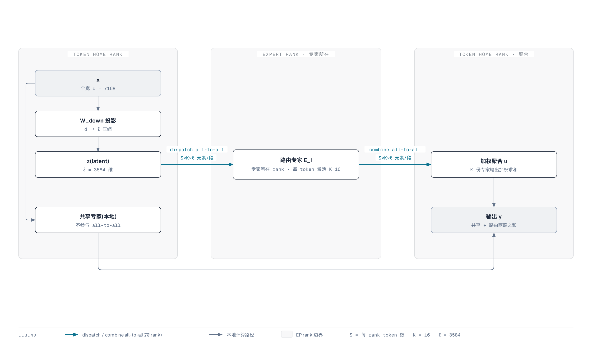

# Kimi K3 专家并行通信:all-to-all 账本与 MoonEP 均衡

承接 [06 并行与通信](./06-parallelism-taxonomy.md) 的选型判断——EP 是权重分片的主骨架。本篇把"896 专家跨卡部署后,一层 MoE 前向到底产生多少通信、怎么把它做均衡"算成可复算的账。

**MoE 的部署代价不在 FLOPs**——单 token 只激活 104.2B 参数(稀疏度 56),算力需求低;真正的代价在每层一次的 dispatch/combine 两段 all-to-all,以及让各 rank 同时算完的负载均衡。

通信量的量级由三个数相乘决定:每 token 激活专家数 $K$、latent 维度 $\ell$、每 rank 序列长度 $S$;MoonEP 用固定形状 + 冗余专家把均衡从"数据相关的动态问题"压成"每 rank 恒收 $S\times K$ 的静态形状"。

机制出自报告 §5.2.1,均衡机制承接 03 篇 §5 的 Quantile Balancing,超参出自报告表 1,正文引用统一写"报告 §X.X"。

## 1. 部署代价的落点:all-to-all 与负载均衡

896 个路由专家分到多卡之后,权重装不下的问题解决了,但每次前向都新增两项成本:把 token 送到专家所在卡、把结果收回来(两段 all-to-all),以及保证各卡同时算完(负载均衡)。这两项与稀疏度直接相关,且都是"每层一次"的高频成本。

稀疏度 56 把算力压下去了,却没有把通信压下去。每 token 只算 16 个专家,但这 16 个专家分布在不同的卡上,于是每个 token 的 latent 表示要跨越卡边界送到 16 个专家、算完再把 16 份输出收回来。这是 896 专家规模下"单 token 算得少、通信少不了"的根本原因(承接 03 篇 §6 的"通信与带宽受限"判断)。

负载均衡是另一项代价。Top-k 路由是数据相关的,每个 token 独立选 16 个专家,负载分布随 batch 内容波动;只要某张卡收的 token 明显多于其他卡,makespan 就被最慢的卡拖住,其余卡空转。这条问题在 §3 展开,§4 给出 MoonEP 的解法。

## 2. dispatch / combine 两段 all-to-all 的数据量

一层 MoE 前向里,路由分支的数据流经过两次跨卡通信:dispatch 把 latent 派到专家所在卡,combine 把专家输出收回来。数据量的量级由 $S\times K\times \ell$ 决定,与总专家数 $E$、EP 规模 $R$ 都无关。

先定义口径。序列在 EP 维切分,每 rank 本地持 $S$ 个 token(全局 token 数 $= S\times R$,$R$ 为 EP 规模);每 token 激活 $K=16$ 个路由专家;路由专家输入输出都是 latent 维度 $\ell=3584$(报告表 1);每元素按 MXFP8 存 1 字节(报告 §4.1.4:专家权重 MXFP4、输入激活 MXFP8)。

上图是路由分支的完整通路:全宽 $x$ 先经 $W_\downarrow$ 压到 latent $z$,$z$ 经 dispatch 派到 $K$ 个专家所在卡、算完经 combine 收回 home rank 加权聚合,共享专家全程本地计算、不参与 all-to-all(报告 §2.3,式 11)。

数据量按"token-expert 对"计数:每个 token 要向 $K$ 个专家各发一份完整 latent,共 $S\times K$ 份;每份 $\ell$ 个元素。

| 阶段 | 单向数据量(元素/rank) | 说明 |
| --- | --- | --- |
| dispatch | $S\times K\times \ell$ | 本地 $S$ 个 token 各发 $K$ 份 latent |
| combine | $S\times K\times \ell$ | $K$ 份专家输出(各 $\ell$ 维)送回 home rank |
| 一层合计(单向) | $2\,S\,K\,\ell$ | dispatch + combine 各一段 |

同一 rank 上多个专家命中同一 token 时可合并发送,数据量只会小于 $S\times K\times \ell$,不会超过;该式是均衡态的上界,也是 MoonEP 的平衡定义口径(每 rank 恒收 $S\times K$ 个 token,报告 §5.2.1)。收发全计时,一层为 $4\,S\,K\,\ell$ 元素;下文以单向口径为主。

字节量取元素数乘每元素字节数 $b$($b=1$ 为 MXFP8,$b=2$ 为 BF16 参照):

$$D_{\text{一层, 单向}} = 2\,S\,K\,\ell\,b = 2\times S\times 16\times 3584\times b = 114{,}688 \times S\times b\ \text{字节}$$

量级按表 1 代入 $K=16$、$\ell=3584$,取 $S$ 为部署参数(报告未给具体 $S$,示例值标待确认):

| 场景 | $S$(每 rank token) | 一层单向数据量(FP8,$b=1$) |
| --- | --- | --- |
| decode 单步 | 1 | $114{,}688\ \text{B}\approx 112\ \text{KiB}$ |
| prefill chunk | 1024 | $1.17\times 10^8\ \text{B}\approx 112\ \text{MiB}$ |

关键观察是数据量与 $E$、$R$ 无关:896 个专家分到 8 卡还是 16 卡,每 rank 每层的派发量都由 $S\times K\times \ell$ 决定(每个 token 只路由 16 个专家,这是 896 专家规模下 all-to-all 仍可负担的前提,承接 06 篇 §2)。

$R$ 只影响两件事:token 落在远端 rank 的比例(期望 $1-\frac1R$),以及单条消息的大小(rank 越多、消息越碎)。

## 3. 负载不均衡的来源与两级均衡

负载不均衡来自路由的数据相关性:Top-k 每 token 独立取前 $K$ 个得分,某些专家(高频语义模式)被大量 token 同时选中而过载,另一些长期无人选中而空转。

映射到 EP 上,过载专家所在 rank 收更多 token、算更久,其余 rank 空转,makespan 由最慢 rank 决定;同时每专家 token 数逐层逐步变化,激活形状动态变化造成内存碎片(报告 §5.2.1)。

均衡在 K3 里分两级,各管一层:

1. **路由层:Quantile Balancing(03 篇 §5)**。把均衡做进路由偏置 $b$,让每个专家的目标负载趋近 $q = mk/n$;偏置在推理时冻结(报告 §2.3.3)。它均衡的是"专家被选中的统计分布"。
2. **并行层:MoonEP(§4)**。保证"每 rank 恰好收 $S\times K$ 个 token",是确定性的 rank 级均衡,与路由输出的具体内容无关。

两级的关系:QB 把路由尽量摊匀,减少为填平所需迁移的 token 与冗余专家;MoonEP 的 $E/R$ 上界保证不管路由输出多偏,都能用有界冗余把每 rank 填满。推理侧路由虽冻结,但负载仍随每次请求的内容波动,因此并行侧的均衡在推理时依然必要。

## 4. MoonEP:固定形状与完美均衡

MoonEP 是 K3 训练侧专家并行方案(报告 §5.2.1),核心是"动态冗余专家 + 固定形状 + 零拷贝":每 rank 恰好收 $S\times K$ 个 token,计算形状静态可知,通信免中间拷贝。它保留了 DeepEP 这类常规方案的整体计算流,额外引入冗余专家的在线规划与迁移(报告 §5.2.1)。

**完美均衡:每 rank 恰收 $S\times K$。** $S$ 是每 rank 本地 token 数、$K=16$ 是每 token 激活专家数,于是所有 rank 做相同量的计算,makespan 无空转(报告 §5.2.1)。这是通信量与调度都变静态的源头。

**冗余专家上界 $E/R$。** 记 $E=896$ 为专家数、$R$ 为 EP 规模。报告 §E 证明:对任意路由输出,总存在一个均衡计划,使每 rank 的冗余专家数不超过 $E/R$,且该上界本质紧(存在路由输出使冗余数达到 $\lceil E(R-1)/R^2\rceil\approx E/R$)。

因此每 rank 预留 $E/R$ 个冗余专家槽位,规划恒有可行解,训练不会被中断(报告 §5.2.1)。冗余专家即复制到非 home rank 的专家,代价是冗余权重存储(§6 给具体账)。

**在线规划。** 每一步求精确最优不可承受,离线用整数线性规划(ILP)对代表性情形求精确解作参照,再设计一个 GPU 规划 kernel,近最优、开销可忽略、恒守 $E/R$ 上界(报告 §5.2.1)。前向里从当前 micro-batch 与本层的路由输出规划冗余专家,并在路由专家计算前预取(报告 §5.2.1)。

**零拷贝通信。** 用 fused permute/unpermute 算子:规划 kernel 预计算每个 token 的目标位置,token 直接发到远端 rank 的专家分组位置,通信缓冲的视图直接交给计算,消掉中间拷贝(报告 §5.2.1)。

对照:最坏不均衡下支持同样的无拷贝路径,DeepEP 需要 $S\times K\times R$ 大小的通信缓冲,而 MoonEP 因完美均衡只需固定的 $S\times K$(报告 §5.2.1)。

**静态形状与 sync-free。** 常规 MoE 的每专家 token 数逐层逐步变化,主机每层都要与设备同步拿到实际形状才能启动专家计算,层间流水线因此停滞;完美均衡后每 rank 恒收 $S\times K$,各层形状静态可知,逐层主机同步与主机侧 kernel 启动开销一并消除(报告 §5.2.1)。

**Expert-GEMM 调度与重叠。** 聚合负载跨 rank 均衡后,rank 内 per-expert token 数仍偏斜,固定顺序、无视负载的调度会把偏斜变成 SM 工作者的 makespan 不均。

用 workload-aware 调度器在启动前按当前 token 分布适配参数、执行期保持不变,参数由解析成本模型 + 离线 autotuning 的轻量启发式选出(报告 §5.2.1)。共享专家 GEMM 派到独立流,与其他 kernel 重叠(报告 §5.2.1)。

六个要点是一条链:完美均衡(S×K)是根,冗余专家上界(E/R)保证均衡恒可达,在线规划把均衡算出来,零拷贝与静态形状把均衡的收益兑现到通信与调度,GEMM 调度消解 rank 内的残余偏斜。

## 5. token 溢出与容量约束

标准 MoE 专家并行沿用 capacity factor / token dropping 的容量思路:每专家 token 容量有限,超出容量的 token 被 drop 或截断,capacity factor 作为超参手动调、留下残余不均衡(这是 Switch Transformer / GShard 一脉的通行机制,报告未采用这两个词)。

报告 §5.2.1 对照的先验工作 ECHO、UltraEP 属同类:预设冗余专家数或施加 per-rank token cap,一旦 cap 内无可行计划训练就强行停止,cap 还需手动调(报告 §5.2.1)。

K3 换了一条路:**固定形状 + 冗余专家**,让每 rank 总能收满 $S\times K$,不存在溢出 drop。代价是存储冗余——每 rank 最多多存 $E/R$ 个冗余专家权重,外加共享专家在每个 EP rank 的复制(§6)。

这笔账的取舍是:用冗余存储换通信与调度的确定性,避免 token 丢失带来的模型质量折损,也免去 capacity factor 的手动调参。

## 6. EP8 与 EP16 的分片账

$E=896$ 个路由专家分到 $R$ 张卡,每 rank 的 home 专家数、冗余专家存储、共享专家复制随 $R$ 变化,而每 token 计算量与每 rank all-to-all 量都与 $R$ 无关。下表按表 1 超参推算($\ell=3584$、$h=3072$、$d=7168$、$K=16$、$E=896$、$N_s=2$)。

每路由专家 FFN 参数 $=3\times\ell\times h=3\times 3584\times 3072\approx 33.0$M;每共享专家 FFN 参数 $=3\times d\times h=3\times 7168\times 3072\approx 66.0$M。

专家权重 MXFP4 按 0.5 B/参数计(报告 §4.1.4)。以上均为按表 1 推算,报告未给逐层细分。

**本表参数/显存均为每层口径**(每个专家 FFN 逐层存在);全模型 93 层口径 = 每层 × 93,10 篇 §2 按全模型口径计。

| 维度 | EP8($R=8$) | EP16($R=16$) | 与 $R$ 的关系 |
| --- | --- | --- | --- |
| 每 rank home 路由专家 | 112 | 56 | $E/R$ |
| 每 rank 冗余专家上界 | 112 | 56 | $E/R$(报告 §5.2.1) |
| 每 rank 路由专家总数(上界) | 224 | 112 | home + 冗余 |
| 每 rank 冗余专家参数(上界) | $112\times 33.0\text{M}\approx 3.70$B | $56\times 33.0\text{M}\approx 1.85$B | 随 $R$ 减半 |
| 每 rank 冗余专家显存(上界,MXFP4) | $\approx 1.85$ GB | $\approx 0.92$ GB | 随 $R$ 减半 |
| 每 rank 共享专家参数 | 132M | 132M | 与 $R$ 无关 |
| 全 fleet 共享专家复制 | $8\times 132\text{M}\approx 1.06$B | $16\times 132\text{M}\approx 2.11$B | 随 $R$ 翻倍 |
| 每 token 路由专家 FLOPs | $16\times 6\ell h\approx 1.06$G | 同左 | 与 $R$ 无关 |
| 每 token 共享专家 FLOPs | $2\times 6dh\approx 264$M | 同左 | 与 $R$ 无关 |
| all-to-all 远端占比(期望) | $7/8\approx 87.5\%$ | $15/16\approx 93.75\%$ | $1-\frac1R$ |

每 token 路由专家 FLOPs 的推导:每专家 FFN 三个矩阵(gate/up/down)共 $6\,\ell\,h = 6\times 3584\times 3072\approx 66$M FLOPs,乘 $K=16$ 得 1.06G(按表 1 推算)。

共享专家同理,每专家 $6\,d\,h\approx 132$M FLOPs,乘 2 得 264M(按表 1 推算)。两者都与 $R$ 无关——$R$ 只决定权重分多细、冗余存多少。

选型落点:

1. **EP16 把每 rank 的权重足迹减半**:home 专家 112→56,冗余专家存储 1.85GB→0.92GB,适配显存更小或想用更高精度的卡;代价是共享专家复制总成本翻倍(1.06B→2.11B)、远端占比略升(87.5%→93.75%)。
2. **EP8 每 rank 持更多专家、冗余存储更大**,但共享专家复制总量少、远端占比略低,适合显存充裕、想少传一点远端流量的部署。

共享专家复制是"零通信换冗余存储":2 个全宽专家复制到每个 EP rank,每 rank 多存 132M 参数;共享专家属非专家组件、保持更高精度(BF16,报告 §4.1.4),每 rank 约 264 MB。换来的是它们完全不参与 all-to-all、每 token 本地直算(报告 §5.2:共享专家在 EP rank 间复制)。

每 token 为此多付 264M FLOPs 的 dense 计算,这部分与稀疏路由无关、恒激活,是复制而非分片的必然结果。

## 7. 与 TP 的接口

EP 与 TP 是两层,分工不重叠:EP 是外层,跨机分片 896 个路由专家;TP 是内层,在节点内 NVLink 域切 dense 算子——注意力、共享专家、latent 投影($W_\downarrow$/$W_\uparrow$)、路由器(承接 06 篇 §2)。

dense 部分要么复制(共享专家)、要么位于 all-to-all 边界之外(latent 投影),因此 TP 的 all-reduce 与 EP 的 all-to-all 作用在不同张量上。

all-to-all 发生在 latent 空间($\ell=3584$),dispatch 传的是 $z=W_\downarrow x$ 而非全宽 $7168$ 维,latent MoE 已经把 all-to-all 数据量减半(承接 03 篇 §2)。

all-to-all 与 TP all-reduce 在链路层错峰:报告 §5.2 把专家派发/合并的 all-to-all 与计算重叠以隐藏延迟,与 06 篇 §5 的 PP 重叠调度同属一层原则。

路由专家 FFN 是否在节点内再叠 TP(算子内拆分)、EP 与 TP 的具体分组数值,报告未给出,> **待确认**;组合骨架可概括为 EP 分片权重、TP 加速 dense、两者经 latent 边界衔接。

## 优化点清单

| 优化点 | 优化对象 | 机制 | 收益(量级) | 代价/适用 |
| --- | --- | --- | --- | --- |
| MoonEP 静态形状 + 零拷贝 | 专家 dispatch/combine 通信 | 完美均衡下每 rank 恒收 $S\times K$,fused permute/unpermute 免中间拷贝 | 通信缓冲 $S\times K\times R \to S\times K$;消逐层主机同步 | 训练侧方案,冗余专家需在线规划 kernel(报告 §5.2.1) |
| 冗余专家上界 $E/R$ | 负载均衡可行性 | 任意路由输出下冗余数 ≤ $E/R$,上界本质紧 | 均衡计划恒有解、不 drop token | 每 rank 多存 $E/R$ 个冗余专家权重 |
| EP16 vs EP8 | 每 rank 专家显存 | home/冗余专家随 $R$ 减半 | 冗余专家显存 1.85→0.92 GB | 共享专家复制翻倍、远端占比 87.5%→93.75% |
| Quantile Balancing | 路由层训练均衡 | 路由偏置使专家目标负载趋 $q=mk/n$ | 摊匀专家选中分布 | 推理时偏置冻结,并行侧仍靠 MoonEP |

## 待确认

- **每 rank 序列长度 $S$**:通信量公式里的 $S$ 是部署参数,报告未给训练/推理的每 rank token 数,量级示例($S=1$、$S=1024$)为按公式代入的示意值。
- **每专家参数量精确值**:$3\times 3584\times 3072\approx 33.0$M/路由专家、$3\times 7168\times 3072\approx 66.0$M/共享专家均为按表 1 推算,报告未给逐层细分,也未说明专家 FFN 是否含 bias(去 bias 仅对 MoonViT-V2 明说)。
- **共享专家隐层维度**:按表 1"MoE Hidden Dimension per Expert = 3072"同口径代入全宽共享专家,报告未单独给出共享专家隐层是否与路由专家一致。
- **EP×TP 组合**:路由专家 FFN 是否再叠 TP、EP/TP 分组数值、all-to-all 在 TP 域内的具体切分,报告 §5.4 未展开,以部署平台为准。
- **token dropping / capacity factor**:这两个词不出自报告,是 Switch Transformer / GShard 一脉的通行机制;报告 §5.2.1 对应的表述是 ECHO/UltraEP 的"预设冗余专家或 per-rank token cap"。

## 下一篇

下一篇 [08 计算与通信账本](./08-compute-comm-ledger.md) 把本节的 all-to-all 通信量与 03 篇的量化账本合并,给出推理前向的计算/通信总账:量化反量化 kernel、稀疏 GEMM 与 all-to-all 的带宽占用,以及 prefill/decode 两阶段的吞吐约束。
