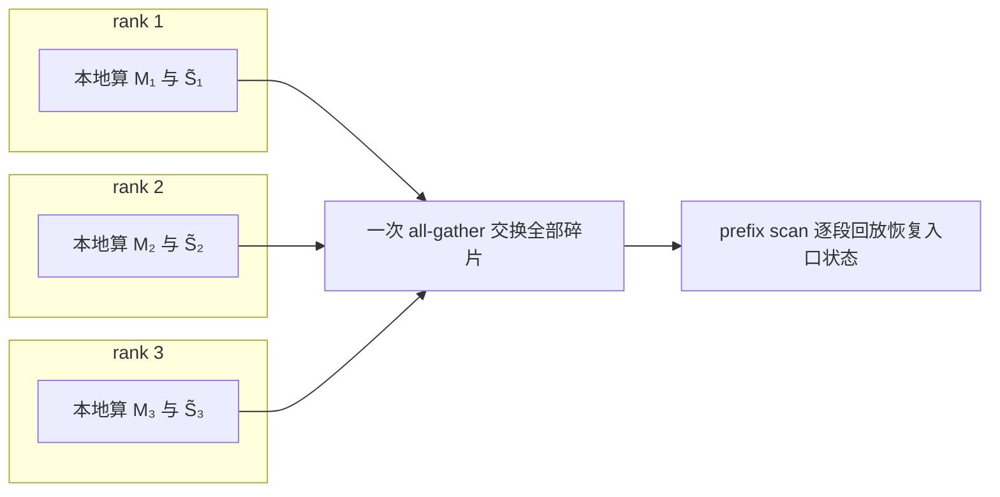
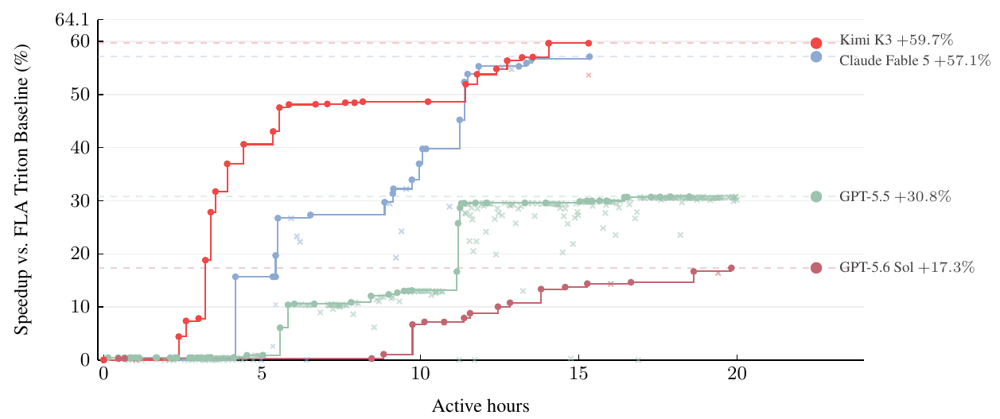

# Kimi K3 Kernel 与系统协同:五个专用 kernel 与统一缓存

承接 [08 计算、显存与通信账本](./08-compute-comm-ledger.md) 的三本账,本篇回答这些瓶颈在 kernel 与 serving 系统层面如何落地。

混合 KDA–MLA 架构与极端稀疏 MoE 使通用 Transformer 服务路径——一套注意力 kernel、一套 dense GEMM、softmax CP、block-hash 前缀缓存——在每个环节都失效,K3 因此把它改造成五块专门机制:FlashKDA、KCP、KDA 解码 kernel、Block AttnRes kernel、MoE 解码 kernel,外加统一分页缓存与两级调度。

**每个 kernel 都因一个通用方案无法回答的部署瓶颈而存在,各自把吞吐、显存或带宽救回一处;系统层再把它们串成可预测的服务。**

机制与系统设计出自报告 §5.1.1、§5.1.2、§5.4.1、§5.4.2、§5.4.3,Fig.14 出自报告 §7,正文引用统一写"报告 §X.X";性能数值报告未给绝对数的,推算一律注明,查不到的标 `> **待确认**`。

| 部署瓶颈(承接 08) | 阶段 | 专门机制 | 救回哪本账 |
| --- | --- | --- | --- |
| KDA 串行递推无宽并行 | prefill | FlashKDA:chunkwise 重叠 | 算力/延迟 |
| softmax CP 线性 KV 交换 | prefill(1M) | KCP:固定大小 all-gather | 通信 |
| decode 状态就地更新 + MTP 回滚 | decode | KDA 解码 kernel:回放重建 | 带宽/延迟 |
| AttnRes 块表示冗余物化与访存 | prefill/decode | Block AttnRes kernel:SP + online softmax | 显存/访存 |
| decode group GEMM 访存密集 + MXFP4 反量化 | decode | MoE 解码 kernel:WarpDecode 流式 | 带宽 |
| 两套 cache 协同、请求成本跨度 | 系统 | 统一分页缓存 + 亲和/准入调度 | 显存/可预测性 |

报告对 KDA kernel 按执行 regime 分章:prefill/训练侧在 §5.1(FlashKDA 与 KCP),decode 侧在 §5.4.2(KDA 解码、Block AttnRes、MoE)。这一分章的根由是 prefill 与 decode 的瓶颈不同——前者要压并行、后者要管状态与访存,与 05 篇 §1 的两阶段分野一致。

## 1. FlashKDA:把 KDA 串行递推摊平成 prefill 并行

KDA 的 delta-rule 递推逐 token 串行,而 GPU 偏好宽且均匀的并行;prefill 里这个矛盾表现为 chunk 间状态传播期间的 SM 空转。

FlashKDA 用 CUTLASS 手写 chunkwise kernel,把 chunk 内计算与跨 chunk 状态传播重叠起来,使串行传播被块内计算覆盖,同时服务训练与推理 prefill(报告 §5.1.1)。

chunkwise 形式是 prefill 并行的入口(02 篇 §2.2):chunk 内并行、chunk 间串行,循环状态必须逐 chunk 传播。朴素执行把这两个阶段交替排布,串行传播期间 SM 空闲。

FlashKDA 的改动是把工作拆成两类可独立调度、独立调参的单元——token 并行的 stage(块内矩阵乘)与 head 并行的递推(跨块状态传播)——并让二者在时间上重叠(报告 §5.1.1)。

跨块传播虽在 chunk 维串行,但各 head 的状态彼此独立,传播可以在 head 维展开;块内计算则在 token 维展开。两者重叠后,串行传播的时延被块内计算吸收,不再单独暴露在关键路径上。

选 CUTLASS 不是实现偏好,而是 02 篇 §2.3 的结构红利:K3 把 log-decay 压到固定下界 $g_{\min}=-5$ 后,全部因果 tile 都能走密集 Tensor Core 矩阵乘,position-pair 特例路径整个被消除(报告 §2.1.1)。

CUTLASS 恰好以 tile 级 GEMM 原语为骨架,FlashKDA 直接落在这些原语上,无需为对角线 tile 另写 position-pair 分支。报告给的对照是定性而非数值:FlashKDA 明显优于 Triton 参考实现,并作为 flash-linear-attention 的后端自动派发(报告 §5.1.1)。

它的边界同样清晰:这只解决并行 regime。decode 时每步只产一个 token、状态被就地更新,瓶颈从"压并行"转到"管状态",FlashKDA 的 chunkwise 重叠帮不上忙,于是 decode 另立一套 kernel(§3)。prefill 内部,FlashKDA 也只在单设备内压并行;1M 序列跨设备时,需要 §2 的 KCP 补上通信侧。

## 2. KCP:delta-rule 下的固定大小状态同步

上下文并行切序列,但 softmax 的 CP 方案对 KDA 失效,vanilla linear attention 的"从零算本地状态再求和"也被 delta-rule 破坏。

KCP 把每段效果分解成两个本地可算的碎片——累计转移矩阵 $M$ 与从零生成的状态 $\tilde{S}$——再用 prefix scan 组合,一次固定大小 all-gather 同步,通信与序列长度解耦(报告 §5.1.2)。

softmax CP 的失效是逐 token 缓存形态的直接后果:让每段看见全文,就得交换随序列增长的 KV 块(报告 §5.1.2)。vanilla linear attention 走的是另一条路——各 rank 从 $S=0$ 算出本地状态,再对前序 rank 求和恢复入口状态(报告 §5.1.2 引 [116, 115])。这条加法递推在 KDA 上不成立:KDA 的更新是

$$S_t = M_t S_{t-1} + \beta_t k_t v_t^\top, \qquad M_t = I - \beta_t k_t k_t^\top\,\mathrm{Diag}(\alpha_t)$$

$M_t$ 依赖当前 token,一段序列的效果取决于进入该段时的状态,不能只从 $S=0$ 单独算出再简单相加(报告 §5.1.2,承接 06 篇 §4)。

KCP 的解法利用了递推仍是"关于入口状态的仿射"这一性质:每段效果可拆成齐次部分与特解部分。设第 $i$ 个 CP rank 持有序列一段、局部第 $t$ 步状态为 $S_t^{[i]}$,$\tilde{S}$ 表示同一递推从 $S=0$ 起步的结果,则(报告 §5.1.2,Eq.17 整理):

$$S_t^{[i+1]} = \tilde{S}_t^{[i+1]} + M^{t\leftarrow 1}_{[i+1]}\,S_{[i]}^{T_i}, \qquad M^{t\leftarrow 1}_{[i+1]} = \prod_{r=1}^{t} M_r$$

第一项是本地 token 从零生成的状态,第二项把前序 rank 的入口状态 $S_{[i]}^{T_i}$ 经本段的累计转移矩阵 $M^{t\leftarrow 1}_{[i+1]}$ 传播进来。

每个 rank 只需本地算出两个碎片——累计转移矩阵 $M_{[i]}^{T_i\leftarrow 1}\in\mathbb{R}^{d_k\times d_k}$ 与从零生成的状态 $\tilde{S}_{[i]}^{T_i}\in\mathbb{R}^{d_k\times d_v}$,二者都与序列长度无关。

碎片的组合满足结合律,入口状态可由 prefix scan 恢复(报告 §5.1.2):

$$S_{[i]}^{T_i} = \sum_{j=1}^{i}\left(\prod_{l=j+1}^{i} M^{T_l\leftarrow 1}_{[l]}\right)\tilde{S}_{[j]}^{T_j}$$

各 rank 先本地算好自己的两个碎片,一次 all-gather 交换,再按序施加 $S\leftarrow M^{T_j\leftarrow 1}_{[j]}S + \tilde{S}_{[j]}^{T_j}$ 恢复每段的入口状态,计算量线性缩放(报告 §5.1.2)。通信就是这一轮固定大小 all-gather,与序列长度无关。

| CP 方案 | 交换内容 | 随 $L$ | 对 KDA 是否成立 |
| --- | --- | --- | --- |
| softmax CP | 逐 token KV 块 | O($L$) | 逐 token 缓存形态,KDA 无此缓存 |
| vanilla linear CP | 本地状态求和 | O(1) | 否,delta-rule 的 $M_t$ 破坏加法假设 |
| KCP | $M$($d_k\times d_k$)+ $\tilde{S}$($d_k\times d_v$) | O(1) | 是,拆齐次/特解 + prefix scan |

08 篇 §3.4 的量级对照已给结论:1M 上下文下 softmax CP 单层 KV 交换约 28.7 GB,KCP 交换两个固定张量、量级约 50 MB/层(按 $d_k=d_v=128$、96 头、$P=8$ 代入),相差约 500 倍。这不是 KCP 的实现技巧,而是 KDA 取消逐 token KV 之后 CP 通信自然与序列长度解耦(报告 §5.1.2)。

代价一侧:固定大小的 $M$ 是 $d_k\times d_k$ 矩阵,其元素量随 $d_k^2$ 增长,all-gather 的数据量是 $P\times(d_k\times d_k + d_k\times d_v)$ 每头;它对序列长度 O(1),但对每头维度是二次的。

此外还有一份单设备内的对应物:报告 §5.1.1 的 SM 级上下文并行在单 rank 内把序列切给各 SM、并行算段转移再合并,零跨设备通信——它是 KCP 的设备内版本,同样依赖"段转移可独立求值、事后精确合并"这条性质。

## 3. KDA 解码 kernel:回放重建状态的投机回滚

decode 阶段 KDA 的瓶颈从"压并行"转为"管好逐步就地更新的循环状态":状态每步被原地改写,MTP 投机解码验证拒绝一部分 draft token 时,状态已越过最后接受 token、无法像 MLA 的 per-token KV 那样直接截断回退(报告 §5.4.2)。

解法是只缓存远小于状态的投影输入、在片上回放重建已接受 token 的状态,融合成单个 kernel,验证延迟亚线性增长(报告 §5.4.2)。

为每个 draft 位置存一份状态快照能支持回滚,但会把状态流量按 draft 数放大——在大批量在线服务典型 batch 下这份开销占主导,这正是快照方案被否掉的原因(报告 §5.4.2)。

关键事实是:任意已接受 draft 前缀之后的状态,完全由这些 draft token 的投影输入决定,而投影输入远小于状态本身。

状态 $S\in\mathbb{R}^{d_k\times d_v}$ 每个 head 一份,投影输入只是每 token 的 $k_t\in\mathbb{R}^{d_k}$、$v_t\in\mathbb{R}^{d_v}$ 与标量/向量系数 $\beta_t,\alpha_t$(承接 02 篇 §2.1)。

于是 kernel 缓存投影输入而非状态:验证时在片上回放已接受 token 的状态、写回已验证与 bonus token 的状态——这一设计与同期工作 ReplaySSM 独立提出(报告 §5.4.2 引 [25])。

回放的 token、bonus token 与下一个 draft 窗口共享一个循环回路,包进单个融合 kernel,覆盖 short convolution、输入归一化、门控、KDA 递推与输出归一化(报告 §5.4.2)。

报告给的对照是定性:验证延迟随验证 token 数亚线性增长、低于状态缓存基线(报告 §5.4.2)。

这条设计与 §1/§2 的协同点在一处:投影缓存从不离开 decode 阶段,因此前缀缓存与 prefill–decode 分离仍操作与非投机服务相同的载荷(报告 §5.4.2)。回放重建不产生新的跨阶段状态格式,KDA 状态在 decode 阶段之外照旧走统一分页池的 checkpoint 路径(§6),投机解码没有给系统层引入第二套缓存语义。

## 4. Block AttnRes kernel:跨层取回的两阶段访存合并

Block AttnRes 走两阶段调度——批处理的 inter-block pass 每 block 读一次缓存块表示,之后每层用 online-softmax merge 并入块内部分和(承接 04 篇 §2.2)。

这两类 kernel 在 prefill 与 decode 的访存占比都大,优化集中在压访存:prefill 用 SP 消除块表示的冗余物化,decode 用 side-stream 重叠 + 融合进 TP all-reduce 消除专用 kernel(报告 §5.4.2)。

prefill 的问题在冗余:块表示若在每个 TP rank 上都物化,显存与 I/O 按 TP 度放大。

解法是对激活采用序列并行(SP):把 TP all-reduce 拆成 reduce-scatter 与 all-gather 两段,块内 kernel 插在二者之间、在序列分片的 hidden state 上运行,使每个 token 的块表示只在一个 rank 上物化(报告 §5.4.2)。

这样块表示的显存从"每 rank 一份"降到"序列分片后每 rank 只持自己那一段",I/O 同步减少。代价是 all-reduce 从一个集合通信拆成两个,但这笔通信的数据量受序列分片约束,比冗余物化的显存开销小。

decode 的问题不同:inter-block pass 有独立时延,块内 phase 有独立访存。

解法分两侧——inter-block kernel 放到 side stream 上,与主 stream 的独立计算重叠;块内 kernel 则靠融合:AttnRes 输出与部分和更新的合并、以及后续 RMSNorm,一起融合进前一个 TP all-reduce,省掉一个专用 kernel(报告 §5.4.2)。

前者用并行流隐藏时延,后者把访存并入既有通信路径,把 08 篇 §2.4 里 AttnRes 块表示这份常驻显存的读取代价压到最小。

*来源:Kimi K3 技术报告 Figure 14*

报告 Fig.14 是 §7 的 case study「GPU kernel optimization on AttnRes」,不是 §5.4.2 服务 kernel 的吞吐测量:各模型在相同配置的沙箱里独立优化 AttnRes kernel,横轴 Active hours、纵轴 Speedup vs. FLA Triton Baseline(%)(报告 §7、Fig.14 轴标)。

四个百分比对应四个模型的优化轨迹——Kimi K3 +59.7%、Claude Fable 5 +57.1%、GPT-5.5 +30.8%、GPT-5.6 Sol +17.3%(报告 §7);Kimi K3 的 +59.7% 与 §7 正文给出的 AttnRes 延迟 283.6→114.4 ms(约 59.7% 削减)一致。

抽取 PNG 呈现为四根柱两组,与 §7「优化轨迹」的折线描述形态不符,图上小字不可辨,语义以报告 §7 为准。

这个 case 与本篇的关系在 §7 的一句收尾:早期 Kimi K3 checkpoint 在后期开发阶段已经承担了大部分 kernel 优化工作(报告 §7)。

§5.4.2 的 Block AttnRes 服务 kernel 本身,正是这类优化工作的产物——两阶段 merge、SP 分片、side-stream 重叠都是针对真实访存瓶颈的工程选择,而非可以套用的通用 kernel 模板。

## 5. MoE 解码 kernel:访存密集的流式 GEMM

MoE 在 decode 是访存问题而非算力问题:小 batch 下 group GEMM 退化为权重矩阵的流式读取,而 tile-centric kernel 的计算导向设计与预处理开销不适合这一 regime。

K3 用 token-centric 的 WarpDecode 逐输出元素流式读权重、离线重排权重降反量化;latent GEMM 则靠融合与分片压掉冗余权重流量(报告 §5.4.2)。

Stable LatentMoE 同时放大了专家总数与每 token 激活专家数,专家空间与每 token 专家数的增长推高调度与协调开销,常规 MoE kernel 难以维持高硬件利用率(报告 §5.4.2)。优化分两处:latent GEMM 与路由专家 GEMM。

latent GEMM 是 $W_\downarrow/W_\uparrow$ 与路由器这套 dense 投影(承接 03 篇 §2),三项优化(报告 §5.4.2):

1. 把 latent 下投影与 MoE 路由器融合成单个 GEMM;
2. 把 latent 权重矩阵跨 rank 分片,输出 all-gather 用 multimem store 指令融合进 GEMM epilogue;
3. 把由此产生的通信与其它算子(如共享专家计算)重叠。

三者合起来消除冗余权重流量与重复计算,并把通信时延藏进计算。

路由专家的 group GEMM 是 decode 的主战场:小 batch 下 16 个路由专家的 FFN 计算退化为权重矩阵的流式读取——每个权重只读一次、对应一个输出元素。

这正是 08 篇 §2.1 的 52 GB/token 权重流下限(按 MXFP4 下限推算)在 kernel 层的兑现:tile-centric kernel 面向计算密集、要建 descriptor 与分组、预处理开销在小 batch 下反而占主导。

K3 改用 token-centric 的 WarpDecode 设计:每个 warp 负责一个输出元素,直接从显存流式读取与之关联的权重;为再提并行度,每个 warp 细分成 lane team,各处理互不相交的专家子集,再做 warp 内归约(报告 §5.4.2 引 [12])。

MXFP4 反量化是这条流式路径上的第二笔开销(承接 08 篇 §4.3):权重进 GEMM 前要反量化。K3 在离线一次性重排权重布局,使运行时反量化开销大幅下降(报告 §5.4.2)。代价是一次性的预处理,换取的是 decode 每一步的流式反量化与访存融合——对访存密集的 decode 而言,这一步是值得的取舍。

协同点:MoE 解码 kernel 只解决单卡内的访存;跨卡的专家分片与 all-to-all 由 07 篇的 MoonEP 承担,量化范围由 08 篇 §4 的"只量化路由专家"决定。三者合起来,decode 的权重流从"BF16 约 208 GB/token"压到"MXFP4 约 52 GB 下限",再由流式 kernel 把这 52 GB 读得尽可能便宜。

## 6. 统一分页缓存与调度:把机制串成系统

五个 kernel 各自救回吞吐、显存或带宽,系统层负责把它们串成可预测的服务:统一分页池让 KDA 状态与 MLA KV 走同一条分配/驱逐/传输路径,cache-aware 亲和调度让前缀命中兑现成成本节约,预算准入控制让三个数量级的请求成本跨度不互相拖垮(报告 §5.4.1、§5.4.3)。

统一分页池是两套 cache 的底座(报告 §5.4.1,05 篇 §2 已述):KDA 状态固定、每请求一份,MLA KV 逐 token 增长、per-token 分页,二者大小与生命周期都不同,却要在同一边界一起恢复。

K3 把它们装进同一分页池,统一到同字节大小,共享一套分配、引用计数、驱逐逻辑;页内按 head 连续存放,每 head 字节流自包含、是跨节点传输的最小单元;prefill/decode 不同 TP 度时 re-layout 走传输路径、GPU 侧零 shuffle(报告 §5.4.1)。

细粒度前缀缓存解决复用粒度(报告 §5.4.1,05 篇 §3 已述):前缀哈希跑在 512-token 哈希块上、物理块仍是 6144 token 的粗分配单位,KDA checkpoint 只落在哈希端点的稀疏子集;命中是同时满足 MLA 块与 KDA checkpoint 的最长边界,可落在物理块内部(报告给 $B=2560$ 的实例)。

这三条与 §3 的协同点在于:KDA 解码 kernel 的投影缓存不离开 decode 阶段,所以前缀缓存的 payload 与非投机服务完全一致,投机解码不破坏前缀复用。

调度层管跨实例的可预测性(报告 §5.4.3,05 篇 §4 已述):一次 prefix-cache miss 比命中贵数个数量级,所以 cache-aware 亲和调度把请求路由到持有其前缀缓存的集群;会话被绑到单集群的故障风险,由一致哈希 pin 到主备两个集群兜底。

请求成本横跨三个数量级(2K 到 1M token),预算准入控制给每类请求独立资源预算,突发长上下文最多吃掉自己的份额、不能拖垮短请求的 TTFT。

系统层与 kernel 层是两套正交的取舍:kernel 层回答"每个算子怎么算得便宜",系统层回答"这些便宜算不算得准、算得稳"。统一分页池把 KDA 状态与 MLA KV 的显存账合并,亲和调度把前缀命中的算力账兑现,准入控制把请求成本的可预测性补上——前五节的吞吐/显存/带宽收益,只有在系统层这一步才转化为稳定的 SLO。

## 7. 小结:结构定了 kernel,kernel 定了吞吐

五个 kernel 与统一缓存不是并列的技巧,而是结构选择的必然:固定大小循环状态定了 FlashKDA 与 KCP 的形态,per-token 压缩 KV 定了统一分页池的复用粒度,极端稀疏 MoE 定了 WarpDecode 的流式 GEMM,跨层取回的块表示定了 AttnRes 的 SP + online softmax。

结构先定下每个瓶颈的形态,kernel 再决定这些瓶颈能否被摊平、隐藏或流式化——吞吐、显存与带宽的每一处救回,都能回溯到一个结构决定与一个对应的 kernel 选择。

## 优化点清单

| 优化点 | 优化对象 | 机制 | 收益(量级) | 代价/适用 |
| --- | --- | --- | --- | --- |
| FlashKDA chunkwise | prefill KDA 并行 | 块内 GEMM 与跨块状态传播重叠 | 消 SM 空转、压 prefill 延迟 | 只救并行 regime,decode 不适用(报告 §5.1.1) |
| ReplaySSM 状态重建 | 投机解码回滚 | 缓存投影输入、片上回放重建状态 | 验证延迟亚线性、低于状态缓存基线 | 投影缓存只在 decode 阶段、不跨阶段 |
| online-softmax 并入 TP all-reduce | AttnRes decode 通信 | 块内 kernel 融合进前一个 all-reduce | 省一个专用 kernel、访存并入既有通信路径 | 需 SP 拆两段 all-reduce 的对应设计 |
| WarpDecode + 权重预排列 | decode MoE GEMM 反量化 | token-centric 流式读权重 + 离线重排降反量化 | 把 52 GB 权重流读得便宜、反量化开销大降 | 一次性预处理;面向小 batch 访存密集 |
| 统一分页池 | 两套 cache 显存管理 | KDA 状态 + MLA KV 同池、同字节大小 | 跨请求复用、统一分配/驱逐 | re-layout 走传输路径、type-confused 零开销兜底 |

## 待确认

- **服务 kernel 的性能数值**:报告 §5.1.1/§5.4.2 对 FlashKDA、KDA 解码、Block AttnRes、MoE 解码 kernel 只给定性描述("substantially outperforms the Triton reference""sub-linearly""below state-caching baselines"),未给吞吐/延迟绝对数。§7 case study 的 283.6→114.4 ms、DSA/KDA 削减 55.1%/73.6%、MLA 超半峰值 TFLOPS,是 K3 作为 agent 优化 kernel 的评测结果,不是服务 kernel 的部署吞吐,二者不可混用。
- **Fig.14 形态**:§7 文本与轴标描述为优化轨迹折线(x=Active hours、y=Speedup vs. FLA Triton Baseline),抽取 PNG 呈四根柱两组,形态不一致;本文按 §7 文本写语义、按图释写视觉,具体形态待重裁复核。
- **KCP 通信量精确字节**:依赖 KDA 每头维度 $d_k/d_v$(02/08 待确认)与头数、CP 规模,正文 50 MB/层为代入示例。
- **投影缓存相对状态的缩小倍数**:报告 §5.4.2 只说投影输入"远小于状态本身",未给定量倍数。

## 下一篇

下一篇 [10 NVIDIA 部署](./10-nvidia-deployment.md) 把本篇的 kernel 与调度落到具体硬件:NVIDIA 平台上的 MXFP4 反量化路径、稀疏 MoE GEMM 的访存优化与 KDA 解码的循环状态 kernel,如何在 H 系列与部署集群上兑现这些吞吐与显存收益。
