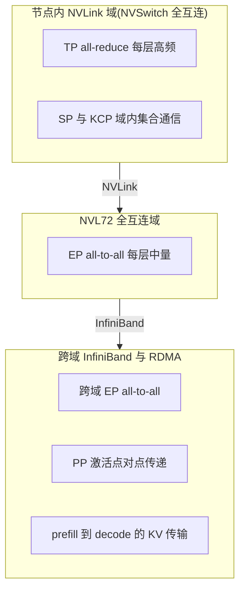

# Kimi K3 的 NVIDIA 平台部署

承接 [09 Kernel 与系统协同](./09-kernel-system-codesign.md) 的五个专用 kernel 与统一缓存,本篇回答它们落在什么 NVIDIA 硬件上、为什么是这些配置。

前九篇把 K3 拆成架构、推理、并行、账本与 kernel 五层,每一层都留下一个硬件需求:TP 要域内高带宽、EP all-to-all 要全互连、MXFP4 要硬件反量化、1M 上下文要节点级显存覆盖权重与 KV。

本篇沿这条需求链走,把每个机制需求对应到一个硬件特性。

信源分三路,正文只在第一次声明、不逐表重复:

- 报告内的事实标"报告 §X.X"。
- NVIDIA 硬件通用背景(8-GPU NVLink 域、NVL72、NVLink/NVSwitch/InfiniBand、Blackwell/B300 系列)报告未涉及,来自归档文档,硬件数字标"以 NVIDIA 官方文档为准"或只做方向性表述。
- 字节账推算沿用 08 篇口径,标"按表 1 与 §4.1.4 推算"。

## 1. 8-GPU NVLink 域:算子内拆分的自然边界

一个 8-GPU NVLink 域是 TP 的落点,不是 EP 的落点。TP 每层做一次 all-reduce,量小但频率高,对延迟敏感,只能落在节点内低延迟高带宽互联;EP 跨机分片权重才是 K3 的主骨架,TP 只在域内补 dense 算子的拆分。这一分工承接 06 §2 的选型判断,本篇只补它的硬件侧理由。

TP 的通信形态决定了它必须留在域内。08 §3.1 给过量级:TP all-reduce 约 $2d$ 元素/层/token,BF16 下约 28.7 KB/token/层,93 层约 2.7 MB/token。

单步量小,却每层每 token 都发生,延迟敏感度远高于 EP 的每层一次 all-to-all。

把它放到节点间网络,每步多一次跨节点往返,decode 的毫秒级步时会被通信吃掉;放在节点内 NVLink 全互连域,延迟在亚微秒量级、带宽高出跨节点网络一个数量级(方向性表述,具体数值以 NVIDIA 官方文档为准)。

每域装什么,用 08 §2 的四桶账对一遍:权重桶里,dense 非专家(注意力投影、latent 投影、共享专家、路由器)约 30B 参数、BF16 约 60 GB,在域内做 TP 分片(TP8 时每卡约 7.5 GB);路由专家由 EP 跨域分片,每域只持本域 rank 的 home 专家与冗余专家。

激活桶是 prefill 的逐层瞬时峰值,不进常驻。

KV 与块表示桶随请求来去,不在"每域能装多少权重"这笔账里,放到 §5。

| 并行 | 作用域 | 物理承载 | 边界理由 |
| --- | --- | --- | --- |
| TP | 域内(8-GPU) | NVLink 全互连 | all-reduce 每层高频,延迟敏感 |
| EP | 域内或跨域 | NVLink(NVL72)或 InfiniBand | all-to-all 每层中量,权重分片主骨架 |
| PP | 跨域为主 | InfiniBand 点对点 | 激活逐 stage 传递,量小可错峰 |
| CP/SP | 域内 | NVLink | 固定大小/分片的域内集合通信 |

域大小还有一层含义:它设定了 TP 的上限,也决定 EP 分组时"每域持多少专家"。8-GPU 是 NVIDIA 节点的常见 scale-up 单元,但报告未给 K3 部署的具体域大小与 TP/EP 分组数值,这一数字以部署平台与 NVIDIA 官方文档为准(06 篇 §待确认 已标)。

## 2. NVL72 全互连:896 专家 all-to-all 的通信底座

EP 的 all-to-all 需要 token home rank 与专家所在 rank 之间任意互通,8-GPU 域把这个范围限死在 8 卡以内,EP 一过 8 卡就得让每层 all-to-all 走跨节点网络。

NVL72 把全互连域从 8 卡扩到数十卡级,使 896 专家的 all-to-all 可以整体留在高带宽 NVLink fabric 内完成——这是它对 MoE 通信的核心价值,具体卡数与带宽数字以 NVIDIA 官方文档为准。

先看约束承接 07。all-to-all 的单向数据量 $D=2SK\ell b$ 与专家总数 $E$、EP 规模 $R$ 无关(07 §2):每个 token 只路由 16 个专家,896 专家规模下 all-to-all 本可负担。

但 $R$ 影响远端占比 $1-1/R$:EP8 时约 87.5% 的 token 落在远端 rank,EP16 时升到 93.75%(07 §6)。$R$ 越大,权重足迹越小、远端流量占比越高——这对矛盾要一个"既宽又快"的域来解。

NVL72 提供的就是这个宽域:在一个数十卡全互连域内做 EP,all-to-all 不离开低延迟高带宽 fabric;896 专家可以均匀摊到域内各卡,每卡 home 专家数随域宽下降。

按表 1 与 §4.1.4 推算,EP16 下每 rank 路由专家约 86 GB(home,全模型 93 层口径),冗余上界再翻倍至约 172 GB(07 §6 的 $E/R$ 上界);EP 扩到 72 卡时每 rank home 专家约 19 GB、冗余上界约 38 GB。

域越宽,每卡权重足迹越小,all-to-all 却仍留在 fabric 内,不必为压低权重足迹而把通信推过节点边界。

代价在存储冗余:EP 规模越大,共享专家复制总量越大(07 §6 给出随 $R$ 翻倍),冗余专家存储也随 $E/R$ 存在上界。用更大的全互连域换"all-to-all 不离 fabric",付的是共享专家与冗余专家的复制显存。

这是 896 专家、每层一次 all-to-all 的高频通信结构下,值得付出的存储冗余;若 EP 被逼到跨节点网络,all-to-all 的每层延迟会成为 decode 吞吐的硬上限。

## 3. NVLink、NVSwitch 与 InfiniBand 的分工

三类互联分别对应 06 §1 通信类型表的三个层次:NVLink 是域内点对点链路,NVSwitch 把多点连成全互连交换 fabric,InfiniBand(或 RoCE)承担跨域 scale-out。分工的本质是"域内高频低延迟通信走 NVLink fabric,跨域通信走慢一个数量级的网络"。

06 §1 的六类集合通信按这一分工归位:

| 通信类型(承接 06/08) | 物理承载 | 域内/域间 |
| --- | --- | --- |
| TP all-reduce | NVLink + NVSwitch | 域内,每层高频 |
| SP reduce-scatter + all-gather | NVLink + NVSwitch | 域内 |
| KCP 固定大小 all-gather | NVLink + NVSwitch | 域内 |
| EP all-to-all | NVLink fabric(NVL72)或 InfiniBand | 域内优先,跨域次之 |
| PP 激活点对点传递 | InfiniBand / NVLink | 跨域为主 |
| prefill 到 decode 的 KV 传输 | InfiniBand + RDMA | 跨域 |

NVSwitch 的价值不止"连成全互连",还在于交换机内的归约能力:集合通信的部分归约在交换机硬件内完成,可减少 GPU 间传输量(方向性表述,具体以 NVIDIA 官方文档为准)。这对 TP all-reduce 这类"每层都要做一次"的域内通信尤其关键——它把 TP 的每步通信成本压在可接受范围,是 TP 能留在域内做算子内拆分的硬件前提。

PP 与 prefill/decode 传输走跨域网络的另一面:它们的数据量小(08 §3.3 给 PP 激活约 14 KB/token/层边界)或是一次性大批量(prefill 到 decode 的 KV 整段迁移),对带宽不敏感或可错峰,因此能容忍比 NVLink 慢的网络。

分工的判据不是互联的绝对带宽,而是通信的频次与延迟敏感度——高频低延迟的留在域内,低频大批量的放到域间,两类成本各归其位。

## 4. MXFP4 的硬件落点

报告 §4.1.4 的 MXFP4 是一个"省显存、省带宽"的部署意图,不是硬件指令描述:专家权重压到 MXFP4(0.5 B/参数)、激活走 MXFP8、非专家组件保持高精度,并从 SFT 起全程 QAT。它把 08 §4.2 的"权重桶 5.56 TB → 1.44 TB、decode 权重流 4× 削减"变成可能。硬件侧怎么消费这 4 bit 权重,报告没展开,是 B 路。

两条反量化路径承接 08 §4.3 与 09 §5:

1. **软件反量化**:权重进 GEMM 前反量化。K3 用离线权重重排把运行时反量化与访存融合,一次性预处理换 decode 每步的廉价反量化(报告 §5.4.2)。
2. **硬件原生 block-scaled MMA**:MXFP4 是微缩放(block-scaled)格式,一块元素共享一个 scale,支持原生 FP4×FP8 Tensor Core 计算,反量化内嵌在 MMA 里,不必先回 FP16 再算(方向性表述,格式参数与指令以 NVIDIA 官方文档为准)。

两条路径的差别落在带宽红利能否兑现到计算侧。若硬件只有软件反量化路径,4 bit 权重省下的是存储与加载带宽,但计算仍要经过一次反量化到更高精度的开销;若硬件有 block-scaled FP4 原生支持,4× 的权重字节削减(08 §4.2)能直接转成 decode 带宽红利——这正是 08 §4.2"decode 权重流 52 GB 下限"的兑现条件。

报告 §4.1.4 只声明格式选择并引 [104] 作为 MXFP4 出处,未给 block size 与 microscaling 参数(08 §4.3 已标待确认)。Blackwell 一代引入 block-scaled FP4 的 Tensor Core 支持,B300 系列对 MXFP4 的支持位属于 B 路硬件能力,具体型号、格式参数与吞吐以 NVIDIA 官方文档为准。

## 5. 配置到节点规模的推算

权重 1.44 TB 由 EP 分片后降到每卡单卡 HBM 量级,不再是长上下文部署的瓶颈;1M 上下文的 KV 与块表示才是每请求显存的大头,决定节点级长上下文并发请求的上限。本节给"配置→总量"的推算观,数字按 08 篇 §2 口径。

| 桶(承接 08) | 总量 | 分片/并发方式 | 对节点数的含义 |
| --- | --- | --- | --- |
| 权重 | 1.44 TB(MXFP4 专家 + BF16 非专家) | EP 跨域分专家 + TP 域内分 dense | 决定最少域数,一次分片常驻 |
| KDA 状态 | 约 217 MB/请求(固定) | 每请求一份 | 随并发请求线性,可忽略 |
| MLA latent KV | 约 12.3 GB/请求(1M) | 统一分页池,逐 token 增长 | 长上下文并发的大头 |
| 块表示 | 约 115 GB/请求(1M,BF16) | SP 分片 + FP8 减半 | 随 token 增长 |

权重账按表 1 与 §4.1.4 推算:2.78T 参数里路由专家约 2.75T,压到 MXFP4 后约 1.38 TB,加上非专家约 60 GB(BF16),合计约 1.44 TB(08 §2.1)。这一总量需要 TB 级总 HBM 才能单份常驻,是 EP 分片存在的直接原因(承接 06 §2);分片后权重摊到各 rank,不再是并发约束。

每请求账才是长上下文的约束:1M 上下文的 KDA 状态约 217 MB、MLA latent KV 约 12.3 GB(取 latent KV 维 512、FP8,08 §2.3)、块表示约 115 GB(BF16,08 §2.4),单请求合计约 128 GB 量级。

SP 分片 + FP8 把块表示降半再按 rank 摊薄,但单请求的 MLA KV + 块表示仍与一个 8-GPU 域的可用 HBM 同量级——长上下文部署的域数由"并发请求数 × 每请求约 128 GB"决定,权重 1.44 TB 反而一次分片就够。

这给出一条选型倒推:短请求权重绑定、decode 访存密集,偏好 MXFP4 + EP 分片压低权重流;长请求 KV 与块表示绑定,偏好大 HBM 域 + 分片 KV 与块表示;两者硬件偏好相反,对应 §6 的 prefill/decode 分离与预算准入——把两类请求拆进不同资源池,各按自己的瓶颈配硬件。

## 6. Fleet 调度与服务自治

单实例之上,挑战从"每请求效率"转为"可预测性":一次 prefix-cache miss 比命中贵数个数量级,一波 1M 请求会饿死短请求(报告 §5.4.3)。报告给出两条 fleet 级策略——cache-aware 亲和调度与预算准入控制——把 §5 的硬件配置观接到集群规模,承接 05 §4 与 09 §6。

**cache-aware 亲和调度**解决前缀复用。1M 上下文的典型 coding 输入携带约 400K token 前缀、却只需 4K token 的 prefill 增量,命中前缀避免重算整条前缀、比 miss 便宜数个数量级(报告 §5.4.3)。

因此请求被路由到持有其前缀缓存的集群——跨集群迁移缓存要走过远比集群内 fabric 慢的链路。

代价是会话绑单集群、其故障会中断所有绑定会话;一致哈希把每个会话 pin 到主备两集群,备集群不持前缀缓存、接管时重算前缀,重算工作量由一致哈希均匀摊到整个 fleet(报告 §5.4.3)。

**预算准入控制**解决请求成本的三个数量级跨度。生产流量从 2K 以下的短请求到 1M 的超长请求,单请求成本相差约三个数量级,"平均请求"的容量规划、排队模型、限流配额全部失效。

典型失效是长上下文突发打满算力、随后短请求排不上队、全流量 TTFT(time to first token)一起恶化(报告 §5.4.3)。

解法是给每类请求独立资源预算,突发长上下文最多吃自己的份额、不能拖垮其它类的 SLO(报告 §5.4.3)。

集群视角下,这两条与 prefill/decode 分离(报告 §5.4.1)是一条链:分离把请求切成两池,亲和调度决定去哪池、哪集群,准入控制在池边界拦突发。§5 的"短/长请求硬件偏好相反"在这里兑现为"分池 + 分级预算",使前缀复用与成本跨度都不再靠单个大池硬扛。

## 7. 小结:部署目标到硬件配置

| 部署目标 | 硬件配置倾向 | 对应机制 |
| --- | --- | --- |
| 短延迟(TTFT) | prefill 高 TP 域、域内 NVLink | 05 两阶段、06 TP、08 算力账 |
| 高吞吐(decode) | MXFP4 减带宽、EP 分片、连续批处理 | 08 带宽账、09 MoE 解码 kernel |
| 长上下文(1M) | 大 HBM 域、NVL72 全互连、KCP | 02 KDA、06 CP、08 KV 账 |
| 低成本 | MXFP4 量化、EP16 减每卡权重、前缀复用 | 08 量化账、07 EP 分片、05/09 前缀缓存 |

四个目标对应四组硬件配置,但同一套部署常要同时满足其中两个以上,落点由瓶颈倒推:显存受限先 EP+MXFP4,decode 带宽受限先量化,1M prefill 先 KCP 与大 HBM 域,短延迟先 prefill 高 TP 域(承接 08 §5 的四个旋钮)。

## 待确认

- **8-GPU NVLink 域大小、NVL72 的卡数、NVLink/NVSwitch/InfiniBand 带宽代际数字**:B 路硬件背景,报告未涉及,正文只做方向性表述,具体数值以 NVIDIA 官方文档为准。
- **B300/Blackwell 对 MXFP4 的硬件支持**:block-scaled FP4 原生 MMA、微缩放格式参数(block size、scale 位宽)属 B 路,报告 §4.1.4 未给,以 NVIDIA 官方文档为准。
- **单卡 HBM 容量与每域卡数**:§5 的节点数推算依赖它们,报告未给,正文只给量级与方向。
- **MLA latent KV 维 $\ell_{kv}$、KDA 每头维度 $d_k/d_v$**:承 02/08 待确认,§5 的 KV 字节账(12.3 GB、217 MB)依赖 $\ell_{kv}=512$、$d_k=d_v=128$ 的代入示例,非 K3 实测。

## 回到总览

本篇把部署这条线收尾:00-04 定义结构(混合注意力、LatentMoE、AttnRes 的形态),05 定义推理两阶段,06-07 定义并行与通信,08 把三者折算成账本,09 把瓶颈落到 kernel,本篇把 kernel 与调度落到硬件与集群。

返回 [00 总览](./00-k3-overview.md) 可重看这条"架构 → 模块 → 推理 → 并行 → 账本 → kernel → 平台"主线的起点;全链路的结论一致:结构先定下每个瓶颈的形态,kernel 决定瓶颈能否摊平,硬件配置决定 kernel 在什么尺度上兑现,而 fleet 调度最终把这些收益转成可预测的服务。
