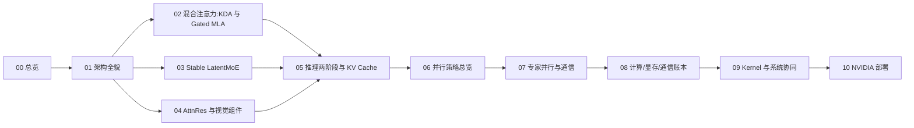

# Kimi K3 推理专题

Kimi K3 是 Moonshot AI 开源的 3T 级原生多模态 MoE 模型(2.78T 参数、104.2B 激活、1M 上下文,报告发布时首个开源 3T-class)。本专题沿"架构 → 模块 → 推理 → 并行 → 账本 → kernel → 部署"一条主线,拆解这套混合注意力 + 极端稀疏 MoE 架构在推理部署侧的完整链路:每篇把结构决定讲清后,落到它对推理部署的影响与可优化点。

## 学习路线

阅读顺序与 [00 模型总览](./00-k3-overview.md) 一致:00-04 定义结构,05 定义推理两阶段,06-07 定义并行与通信,08 把三者折算成账本,09 落到 kernel,10 落到硬件与集群。后一篇只依赖前一篇已定义的术语。

## 文档索引

| 序号 | 文档 | 概要 | 建议学时 |
| --- | --- | --- | --- |
| 00 | [模型总览](./00-k3-overview.md) | K3 的规模与形态、稀疏激活如何解耦容量与成本、相对 K2 的演进、报告章节与本专题映射 | 1 |
| 01 | [架构全貌](./01-architecture-full-picture.md) | 表 1 主要参数、序列/深度/宽度三路信息流主线、block 结构与部署定性 | 1.5 |
| 02 | [混合注意力:KDA 与 Gated MLA](./02-hybrid-attention-kda-mla.md) | KDA 的 delta-rule 递推、lower-bounded decay、Gated MLA 的 latent 压缩与 NoPE、两种 KV 形态对比 | 2 |
| 03 | [Stable LatentMoE](./03-moe-stable-latentmoe.md) | 896 路由专家的 latent 空间、RMSNorm 稳定化、SiTU-GLU 有界门控、Quantile Balancing 负载均衡 | 2 |
| 04 | [AttnRes 与视觉组件](./04-attnres-vision-components.md) | Block Attention Residuals 的跨层取回、MoonViT-V2 视觉通路、NoPE、Per-Head Muon 与 MTP | 2 |
| 05 | [推理两阶段与 KV Cache](./05-inference-two-phases.md) | prefill/decode 的分工、统一分页池、细粒度前缀缓存、连续批处理与投机解码 | 2 |
| 06 | [并行策略总览](./06-parallelism-taxonomy.md) | TP/EP/PP/DP/CP/SP 六种切分、为何以 EP 为主基调、KCP、训练与推理侧的分野 | 1.5 |
| 07 | [专家并行通信](./07-expert-parallel-comm.md) | dispatch/combine 两段 all-to-all 账本、两级负载均衡、MoonEP 的固定形状与零拷贝 | 1.5 |
| 08 | [计算/显存/通信账本](./08-compute-comm-ledger.md) | 算力、显存、通信三本可复算的账,以及 MXFP4/MXFP8 的量化范围与代价 | 2 |
| 09 | [Kernel 与系统协同](./09-kernel-system-codesign.md) | FlashKDA、KCP、KDA 解码、Block AttnRes、MoE 解码五个专用 kernel 与统一缓存、两级调度 | 1.5 |
| 10 | [NVIDIA 平台部署](./10-nvidia-deployment.md) | 8-GPU NVLink 域、NVL72、NVLink/NVSwitch/InfiniBand 分工、MXFP4 硬件落点与 fleet 调度 | 1 |

## 官方文档

| 文档 | 内容 | 链接 |
| --- | --- | --- |
| Kimi K3: Open Frontier Intelligence | 主技术报告(47 页),本专题事实来源 | <https://arxiv.org/abs/2607.24653> |
| Kimi Linear | KDA / Kimi Linear Attention 出处 | <https://arxiv.org/abs/2510.26692> |
| Attention Residuals | AttnRes 出处 | <https://arxiv.org/abs/2603.15031> |

## 来源说明

一手来源存于 `reference/`,不编号、不进 HTML,是正文数值与章节引用的查证基准:

| 文件 | 内容 |
| --- | --- |
| `reference/kimi-k3-arxiv-2607.24653.pdf` | 主报告(47 页),正文引用统一写"报告 §X.X" |
| `reference/kimi-linear-arxiv-2510.26692.pdf` | Kimi Linear(KDA 出处),02 篇引用 |
| `reference/attention-residuals-arxiv-2603.15031.pdf` | Attention Residuals(AttnRes 出处),04 篇引用 |
| `reference/kimi-k3.txt` | 主报告 pdftotext 提取文本,grep 定位辅助,非一手 |

全专题统一三条数字纪律:报告表 1 可查的数字标"报告表 1";推算类数字标"按表 1 推算"并给公式;查不到或未闭合的项标 `> **待确认**`,不编数字。
