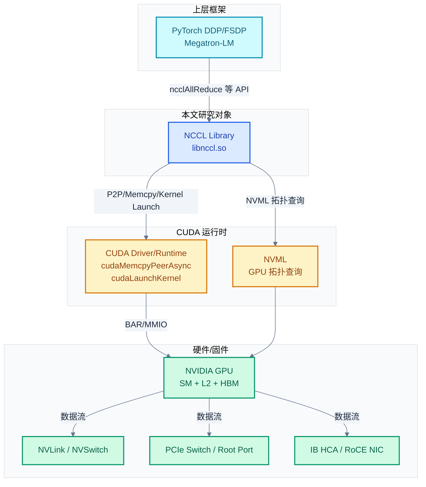
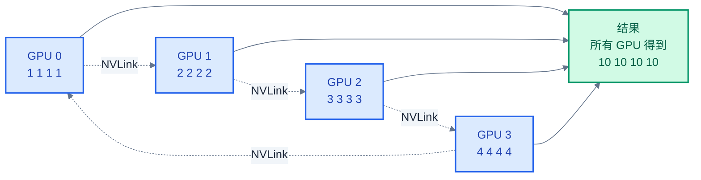
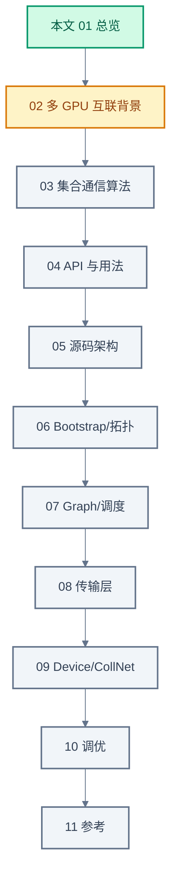

# NCCL 总览:它在系统中干什么

> 一句话概括:NCCL 是 NVIDIA 提供的拓扑感知 GPU 间通信库,把一次集合通信(如 AllReduce)用单个 CUDA kernel 同时完成通信与计算,屏蔽 PCIe/NVLink/InfiniBand 等底层传输差异。
> **工程师视角**:理解 NCCL 的"单 kernel 通信+计算"和"通用 API × 平台 transport 分离"两个核心设计,是后续所有章节的基础——前者解释为什么 NCCL 比"memcpy+kernel"快,后者解释为什么同一份代码能跑遍 NVLink/PCIe/IB。

### 关键术语

| 缩写 | 全称 | 含义 |
|------|------|------|
| NCCL | NVIDIA Collective Communications Library | NVIDIA 集合通信库,发音 "Nickel" |
| Collective | Collective Communication Operation | 集合通信操作(AllReduce/Broadcast 等) |
| Communicator | — | NCCL 通信上下文,绑定一个 CUDA 设备 |
| Rank | — | communicator 中的进程/线程编号 |
| World Size | — | communicator 中 rank 总数 |
| Stream | CUDA Stream | CUDA 异步执行队列,NCCL 调用挂在 stream 上 |
| DDP | Distributed Data Parallel | PyTorch 分布式数据并行,默认用 NCCL |
| FSDP | Fully Sharded Data Parallel | PyTorch 全分片数据并行,通信依赖 NCCL |
| MPI | Message Passing Interface | 通用分布式通信标准,NCCL API 借鉴 MPI |
| RCCL | ROCm Communication Collectives | AMD GPU 上的 NCCL 等价物 |
| OneCCL | oneAPI Collective Communications Library | Intel 上的对应库 |
| Gloo | — | PyTorch 自带的轻量通信库(已被 NCCL 取代) |

**前置阅读**:无。本文是系列总览。

**下一篇**:[02-多 GPU 互联背景](./02-gpu-interconnect-background.md)

---

## 1. NCCL 是什么

### 1.1 一句话定义

NCCL(NVIDIA Collective Communications Library,发音 "Nickel")是一个 **GPU 间通信原语库**——它提供一组标准的集合通信操作(AllReduce、Broadcast、AllGather 等),并自动选择当前硬件拓扑下最快的实现路径。

> 来源:[NCCL Overview §1](https://docs.nvidia.com/deeplearning/nccl/user-guide/docs/overview.html) — "The NVIDIA Collective Communications Library (NCCL, pronounced "Nickel") is a library providing inter-GPU communication primitives that are topology-aware and can be easily integrated into applications."

**注意三个关键词**:
- **inter-GPU**:NCCL 只解决 GPU 间通信,不管 CPU 间通信(那是 MPI 的事)
- **topology-aware**:NCCL 启动时探测 NVLink/PCIe/IB 拓扑,据此选择 ring/tree/collnet 算法
- **easily integrated**:NCCL 是一个 C 库,API 风格模仿 MPI,几十行代码可以集成

### 1.2 它解决什么问题

**场景**:你在 8 卡 H100 服务器上训练 LLM。每个 GPU 算完自己的梯度后,需要把 8 个梯度求平均(AllReduce)。如果用朴素的 CUDA 实现:

1. GPU 0 把梯度 cudaMemcpy 到 CPU
2. CPU 求平均
3. CPU 把结果 cudaMemcpy 回所有 GPU

**问题**:这种"GPU → CPU → GPU"路径会过 PCIe 两次,带宽只有 NVLink 的 1/10,且 CPU 成为瓶颈。8 卡 H100 的 NVLink 总带宽是 4.8 TB/s,而 CPU 内存带宽通常 < 200 GB/s——朴素实现浪费了 96% 的硬件能力。

**NCCL 的解决方案**:把 AllReduce 实现为**一个 CUDA kernel**,直接在 GPU 上跑,数据走 NVLink(NVIDIA GPU 间高速互联)在 GPU 间流动,完全不经 CPU。一次调用既完成通信也完成归约计算。

> **核心要点**:NCCL 把"通信原语"实现为"GPU kernel"而非"host 库函数"。这是它与 MPI 等 host 侧通信库的本质差异,也是它在 GPU 训练场景下性能远超 MPI 的根本原因。

### 1.3 不解决什么

NCCL **不是**:

- **并行编程框架**:它不分配任务、不管模型划分、不调度计算(那是 PyTorch/Megatron 的事)
- **CPU 间通信库**:它不在 CPU 进程间传消息(那是 MPI/ZMQ 的事)
- **存储 I/O 库**:它不读写文件、不查数据库

NCCL **是**:一个专注 GPU 间集合通信的底层库,提供 8 个 collective + Send/Recv 给上层框架调用。

---

## 2. 系统上下文:NCCL 在更大系统中的位置

> 本节对应 CLAUDE.md §1.8 三层背景要求。

### 2.1 项目定位

NCCL 处于 **"深度学习训练框架"与"GPU 硬件 + 互联"之间**:

- 上层:PyTorch DDP/FSDP、Megatron-LM、DeepSpeed、Horovod——这些框架决定何时通信、通信什么
- 中间:**NCCL**——决定怎么通信(选算法、选传输路径、调度并发)
- 下层:CUDA Driver + GPU 硬件 + NVLink/NVSwitch + PCIe + IB HCA——执行实际数据搬运

NCCL 的边界:接收上层"做一次 AllReduce"的 API 调用,返回完成,内部决定用 ring 还是 tree、走 NVLink 还是 IB、开几个 channel。它不接触模型代码、不接触优化器、不接触数据加载。

### 2.2 软硬件耦合点

NCCL 与四个相邻组件耦合:



> **如何读这张图**:NCCL 是蓝色中心,向上对应用暴露 C API,向下通过 CUDA Driver/Runtime 调用 GPU,通过 NVML 查询拓扑(不直接访问硬件)。硬件层(绿色)是数据流的实际通道:NVLink(节点内 GPU 间)、PCIe(节点内 fallback)、IB(节点间)。NCCL 不直接读写硬件寄存器,所有 GPU 操作都经 CUDA API。

四个耦合接口:

1. **应用 ↔ NCCL**:C API(`ncclAllReduce` 等),遵循 MPI 风格,详见 [04 章](./04-nccl-api-and-usage.md)
2. **NCCL ↔ CUDA**:用 `cudaLaunchKernel` 启动通信 kernel,用 `cudaMemcpyPeerAsync` 做 P2P 拷贝
3. **NCCL ↔ NVML**:用 NVML(NVIDIA Management Library)查询 GPU 的 NVLink 状态、PCIe bus ID、SM 数等拓扑信息
4. **NCCL ↔ IB Verbs**(节点间):直接调用 libibverbs 的 verbs API 注册 MR、post WR、poll CQ,详见 [../rdma/04-rdma-verbs-api.md](../rdma/04-rdma-verbs-api.md)

### 2.3 跨实现对比

NCCL 不是唯一选择,下表对比当前主流 GPU 通信库:

| 对比维度 | **NCCL** | **MPI** | **RCCL** | **OneCCL** | **Gloo** |
|----------|----------|---------|----------|------------|----------|
| 厂商 | NVIDIA | 标准(MPI Forum) | AMD | Intel | Meta(PyTorch 自带) |
| 目标硬件 | NVIDIA GPU | 通用 CPU/GPU | AMD GPU | Intel GPU/CPU | CPU + GPU |
| 拓扑感知 | 强(NVML/CUDA 自动) | 弱(需手动) | 强(NVML-like) | 中 | 弱 |
| 单 kernel 通信+计算 | 是 | 否(host 实现) | 是(对齐 NCCL) | 否 | 否 |
| 与 CUDA Stream 集成 | 是 | 需要插件 | 是(ROCm Stream) | 否 | 否 |
| 跨节点传输 | IB Verbs / Sockets | IB / TCP | IB Verbs / Sockets | IB / TCP | TCP |
| 在 LLM 训练中地位 | **事实标准** | 历史/学术 | AMD 必选 | Intel 必选 | PyTorch fallback |

> **如何读这张表**:NCCL 的核心差异在第三行——"单 kernel 通信+计算"。MPI 把通信当 host 侧操作,数据要在 host 与 device 间来回拷贝;NCCL 把通信当 kernel launch,数据直接在 GPU 间通过 NVLink 流动。这一差异让 NCCL 在 GPU 训练场景下性能领先。RCCL 是 AMD 对 NCCL 的源码 fork,API 几乎完全相同,只是把 CUDA 调用替换为 HIP 调用。

### 2.4 NCCL 在 LLM 训练中的应用场景

NCCL 是 LLM 分布式训练的通信底座,被以下场景重度使用:

| 训练范式 | 通信操作 | 频次 | 数据量 |
|----------|---------|------|--------|
| **DDP**(数据并行) | AllReduce(梯度) | 每步一次 | 模型参数量 × 4 字节 |
| **FSDP**(全分片) | AllGather + ReduceScatter | 每层两次 | 分片参数量 × 4 |
| **TP**(张量并行) | AllReduce / AllGather | 每层多次 | 激活值 × 4 |
| **MoE**(专家并行) | All-to-All | 每层一次 | token 路由数据 |
| **PP**(流水并行) | Send/Recv(P2P) | 每个 micro-batch | 激活值 × 4 |

> 详见 [../LLM/05-LLM分布式训练:并行策略与ZeRO.md](../LLM/05-LLM分布式训练：并行策略与ZeRO.md) 讲解各并行策略的通信开销。

---

## 3. NCCL 的核心设计

### 3.1 设计哲学:"单 kernel 通信+计算"

传统集合通信的实现方式是**"memcpy + 计算分离"**:

```
1. 启动 memcpy kernel,把数据从其他 GPU 拷过来
2. 同步等待 memcpy 完成
3. 启动计算 kernel,做归约
```

NCCL 把这两步合并为**一个 kernel**:

```c
// 伪代码:NCCL AllReduce kernel 内部
__global__ void allReduceRingKernel(...) {
    while (有未完成的 chunk) {
        // 1. 通过 NVLink 接收上一个 GPU 的 chunk
        // 2. 在寄存器中做归约
        // 3. 通过 NVLink 把当前 chunk 发给下一个 GPU
    }
}
```

**为什么这样设计**:通信和计算之间没有同步开销。如果分成两个 kernel,中间要有一次 stream 同步(几百 ns),大量小 chunk 时累加开销显著。合成一个 kernel 后,通信与计算在 thread block 内部交替进行,延迟降到最小。

> 来源:[NCCL Overview §1](https://docs.nvidia.com/deeplearning/nccl/user-guide/docs/overview.html) — "NCCL, on the other hand, implements each collective in a single kernel handling both communication and computation operations. This allows for fast synchronization and minimizes the resources needed to reach peak bandwidth."

### 3.2 设计哲学:"通用 API × 平台 transport 分离"

NCCL 在源码层面把"通用算法代码"与"平台相关传输代码"分离:

- **通用层**(`src/enqueue.cc`、`src/graph/`、`src/scheduler/`):实现 ring/tree 算法、channel 调度、任务入队,跨所有硬件
- **传输层**(`src/transport/p2p.cc`、`net.cc`、`coll_net.cc`、`shm.cc`):实现具体硬件路径,每个文件对应一种传输类型

两层之间通过函数指针表(`ncclTransport` 结构体)解耦——通用代码调用 `transport->send.proxyProgress(...)`,具体调到 NVLink 还是 IB 由 transport 表决定。这与 ARM TF-A 的 `plat_psci_ops_t` 设计思想完全一致(详见 [../trusted-firmware/05-tf-a-bl31-secure-monitor.md](../trusted-firmware/05-tf-a-bl31-secure-monitor.md))。

详见 [05 源码架构](./05-source-architecture.md) §3 与 [08 传输层](./08-transport-layer.md) §2。

### 3.3 与 CUDA Stream 的协作

NCCL 的每个 collective API 都接一个 `stream` 参数:

```c
ncclResult_t ncclAllReduce(const void* sendbuff, void* recvbuff, size_t count,
                           ncclDataType_t datatype, ncclRedOp_t op,
                           ncclComm_t comm, cudaStream_t stream);
```

**为什么需要 stream**:NCCL 调用是**异步**的——API 返回时通信还没开始,只是把任务挂到 stream 上。这样:

- 同一个 stream 上,NCCL collective 与上游/下游 CUDA kernel 自动按序执行
- 多个 stream 上的 NCCL 调用可以并发(用 group 协调,见 [04 章](./04-nccl-api-and-usage.md))

> **核心要点**:NCCL 把"集合通信"实现为"在指定 CUDA stream 上 launch 的 kernel"。这与 MPI 的"host 侧同步调用"模型根本不同——你不需要 `MPI_Barrier` 之类的同步,只要把 NCCL 调用与计算 kernel 放在同一个 stream 上,CUDA stream 自动保证执行顺序。

---

## 4. 一个具体例子:4 GPU AllReduce

### 4.1 输入输出

**场景**:4 个 GPU(GPU 0/1/2/3)各持有一个长度为 4 的向量,要做 AllReduce(SUM),让每个 GPU 都得到所有向量的和。

**输入**:

| GPU | 持有向量 |
|:---:|---------|
| 0 | [1, 1, 1, 1] |
| 1 | [2, 2, 2, 2] |
| 2 | [3, 3, 3, 3] |
| 3 | [4, 4, 4, 4] |

**期望输出**(所有 GPU):

```
[1+2+3+4, 1+2+3+4, 1+2+3+4, 1+2+3+4] = [10, 10, 10, 10]
```

### 4.2 NCCL 调用

```c
// 简化伪代码:4 进程,每进程在 1 个 GPU 上
ncclUniqueId id;
if (rank == 0) ncclGetUniqueId(&id);
MPI_Bcast(&id, sizeof(id), MPI_BYTE, 0, MPI_COMM_WORLD);  // 广播 id
ncclCommInitRank(&comm, 4, id, rank);                      // 创建 communicator

ncclAllReduce(sendbuff, recvbuff, 4, ncclFloat, ncclSum,
              comm, stream);                                // 执行 AllReduce
cudaStreamSynchronize(stream);                             // 等待完成
```

**关键点**:4 个进程各调一次 `ncclAllReduce`。NCCL 内部会让 4 个 GPU 通过 NVLink/PCIe 协作,完成环形数据流动 + 归约,最后所有 GPU 的 `recvbuff` 都得到 `[10, 10, 10, 10]`。具体数据流见 [03 章](./03-collective-operations-and-algorithms.md) 的 Ring AllReduce 数值演算。

### 4.3 数据流可视化



> **如何读这张图**:4 个 GPU 通过 NVLink 连成环(虚线),数据在环上流动 2(n-1)=6 步(详见 03 章)。每步每 GPU 接收 + 归约 + 发送一个 chunk。最终所有 GPU 持有完整的求和结果。

---

## 5. 与相邻实现的对比

### 5.1 NCCL vs MPI

| 对比维度 | NCCL | MPI |
|----------|------|-----|
| 通信模型 | kernel launch(异步) | host 调用(同步或异步) |
| GPU 间数据路径 | 直接 NVLink/PCIe P2P | 通常经 host(需 CUDA-aware MPI) |
| 拓扑感知 | 自动(NVML) | 需手动配置 |
| API 风格 | 借鉴 MPI(`ncclAllReduce` ↔ `MPI_Allreduce`) | 标准 |
| 同步机制 | CUDA stream | 显式 `MPI_Wait`/`MPI_Test` |
| 适用场景 | GPU 训练 | HPC、CPU 集群、混合 |

NCCL 的 API 命名故意模仿 MPI,方便 MPI 用户迁移。但实现差异巨大——NCCL 是"GPU kernel",MPI 是"host routine"。

### 5.2 NCCL vs Gloo

Gloo 是 PyTorch 自带的通信库,在 NCCL 不可用时作为 fallback:

- **NCCL 优势**:GPU 间性能远超 Gloo(NVLink 直通 vs CPU 中转)
- **Gloo 优势**:不依赖 CUDA,跨平台,debug 简单
- **现状**:PyTorch 默认 backend='nccl';用 Gloo 主要在 CPU 训练或 NCCL 故障排查时

### 5.3 NCCL vs RCCL

RCCL(ROCm Communication Collectives)是 AMD GPU 上的对应库,源码 fork 自 NCCL:

- API 完全一致(把 `nccl` 前缀换成 `rccl`)
- 把 CUDA 调用替换为 HIP 调用(`cudaMemcpyPeerAsync` ↔ `hipMemcpyPeerAsync`)
- transport 层保留 IB Verbs / Sockets 不变(因为 IB/RoCE 与 GPU 厂商无关)

学习 NCCL 的代码可以无缝迁移到 RCCL。

---

## 6. 本系列学习路径



后续 10 章按"硬件 → 算法 → API → 源码 → 调优"递进。本文是总览,接下来 [02 章](./02-gpu-interconnect-background.md) 讲清楚 NVLink/NVSwitch/PCIe/IB 这些硬件到底是什么——这是 NCCL 性能优化的物理基础。

---

> **核心要点**:NCCL 是 GPU 间集合通信库,本质是"把集合通信实现为 CUDA kernel"。它处于"训练框架 ↔ GPU 硬件"之间,通过函数指针表分离通用算法与平台传输。理解这两点(单 kernel、API × transport 分离)是读懂 NCCL 全部源码的钥匙。

---

## 参考资料

- [NCCL Overview](https://docs.nvidia.com/deeplearning/nccl/user-guide/docs/overview.html) — 参考了 §1(NCCL 定义、single kernel 设计、支持的互联技术列表)
- [NCCL GitHub README](https://github.com/NVIDIA/nccl/blob/master/README.md) — 参考了项目定位与编译说明(本地 [src/nccl-src/README.md](./src/nccl-src/README.md))
- [NCCL Source Code](https://github.com/NVIDIA/nccl/tree/master/src) — 参考了 `src/` 目录结构与 `src/include/transport.h` 的 transport 接口契约(本地 [src/nccl-src/src/](./src/nccl-src/src/))
- [PyTorch DDP Documentation](https://pytorch.org/docs/stable/generated/torch.nn.parallel.DistributedDataParallel.html) — 参考 DDP 默认使用 NCCL backend
- [../LLM/05-LLM分布式训练](../LLM/05-LLM分布式训练：并行策略与ZeRO.md) — 各并行策略对通信原语的需求
- [../rdma/01-rdma-overview.md](../rdma/01-rdma-overview.md) — RDMA 概念,NCCL Net transport 底层依赖
- [../trusted-firmware/05-tf-a-bl31-secure-monitor.md](../trusted-firmware/05-tf-a-bl31-secure-monitor.md) — ARM TF-A 的 `plat_psci_ops_t` 函数指针表设计,与 NCCL transport 接口可对照
