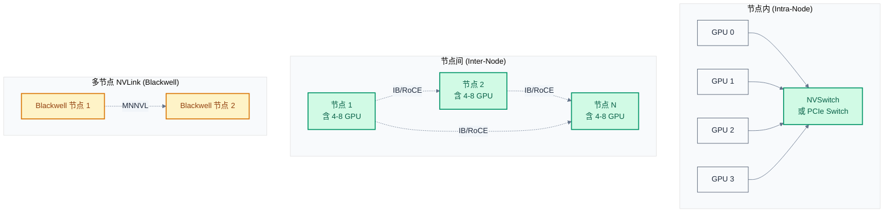
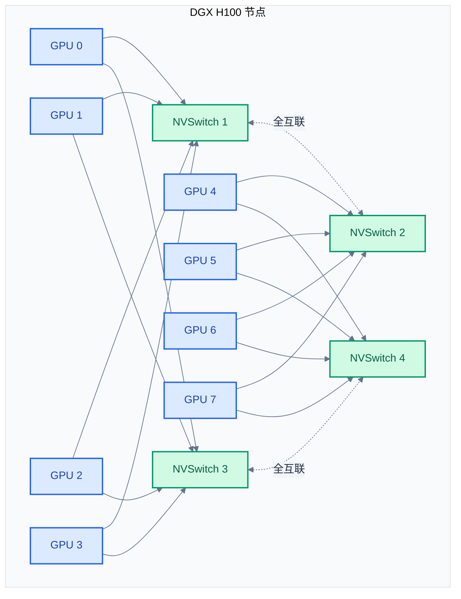
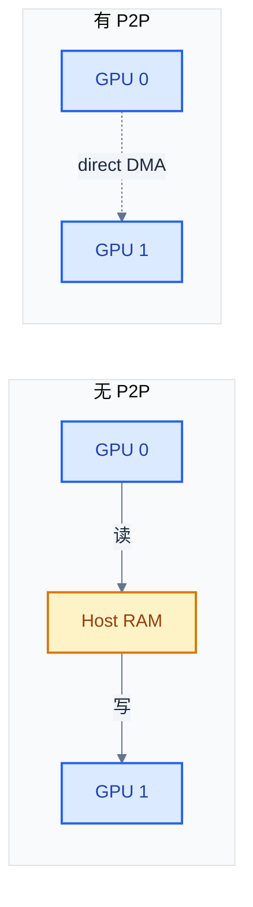

# 多 GPU 互联背景:NVLink / NVSwitch / PCIe / IB

> 一句话概括:NCCL 跑在 NVLink / NVSwitch / PCIe / InfiniBand 这套硬件栈上,这些互联的本质差异(带宽、延迟、范围、拓扑)决定了 NCCL 的算法选择与性能上限。
> **工程师视角**:NCCL 的"拓扑感知"本质就是探测本章所讲的硬件拓扑。理解 NVLink vs PCIe vs IB 的带宽量级差异(600 GB/s vs 64 GB/s vs 100 GB/s),才能理解为什么 NCCL 会优先选 NVLink、为什么跨节点必须 fallback 到 IB。

### 关键术语

| 缩写 | 全称 | 含义 |
|------|------|------|
| NVLink | NVIDIA High-Speed Interconnect | NVIDIA GPU 间高速互联,4 代演进 |
| NVSwitch | NVIDIA NVSwitch | 单节点全互联交换芯片,使每对 GPU 都有 NVLink 直连 |
| NVLink-C2C | NVLink Chip-to-Chip | 跨芯片 NVLink(GH200 Grace+Hopper 集成) |
| MNNVL | Multi-Node NVLink | 多节点 NVLink(Blackwell B200) |
| NVLS | NVLink SHARP | NVSwitch 上的硬件归约原语 |
| PCIe | Peripheral Component Interconnect Express | 通用外设互联标准,见 [../pcie/](../pcie/) |
| P2P | Peer-to-Peer | GPU 间直接 DMA,不经 CPU |
| ACS | Access Control Services | PCIe 访问控制服务,影响 P2P 路由 |
| ATS | Address Translation Services | PCIe 地址翻译服务 |
| IB | InfiniBand | 高性能 RDMA 网络协议 |
| RoCE | RDMA over Converged Ethernet | 以太网上的 RDMA |
| HCA | Host Channel Adapter | IB 主机通道适配器(网卡) |
| GDR | GPUDirect RDMA | RDMA 直接到 GPU 显存 |
| GDP2P | GPUDirect Peer-to-Peer | 同节点 GPU 间 P2P 直传 |
| GDS | GPUDirect Storage | 存储直读到 GPU |
| DGX | Deep Learning GPU Accelerator | NVIDIA 整机柜 AI 服务器 |
| BW | Bandwidth | 带宽 |
| TCC | Target Command Cycle | 一次传输周期 |

**前置阅读**:[01-nccl-overview.md](./01-nccl-overview.md) — NCCL 在系统中的定位

**下一篇**:[03-集合通信原语与算法](./03-collective-operations-and-algorithms.md)

---

## 1. 互联硬件全景

### 1.1 为什么 GPU 需要专门互联

CPU 间互联(QPI/UPI/XGMI)是为**低延迟 cache line 传输**优化,带宽几十 GB/s。但 GPU 训练的通信模式不同——**大块数据批量传输**(几十 MB 到几 GB 梯度),对**带宽**敏感而对**延迟**不敏感。

NVIDIA GPU 的算力(Volta 100 TFLOPS → Hopper 2000 TFLOPS → Blackwell 9000 TFLOPS)增长远快于 PCIe 带宽(Gen3 32 GB/s → Gen5 128 GB/s)。如果只用 PCIe,通信成为训练瓶颈。NVLink 因此诞生,目标是**让 GPU 间带宽与显存带宽同量级**(HBM3 ~3 TB/s,NVLink4 1.8 TB/s 双向)。

> **核心要点**:GPU 算力增长 > PCIe 带宽增长,这是 NVLink 出现的根本原因。NCCL 的性能上限被本章所讲硬件决定——同一份 NCCL 代码,在 NVLink 系统上能跑出 PCIe 系统 10 倍以上的带宽。

### 1.2 三层互联分类

NCCL 关心的互联硬件分三层,按范围递增:



| 范围 | 互联 | 带宽(双向) | 延迟 | NCCL transport |
|------|------|-------------|------|---------------|
| 节点内 GPU 间 | NVLink 4 | 900 GB/s(每对) | 100-200 ns | P2P |
| 节点内 GPU 间 | NVSwitch 全互联 | 900 GB/s × N(N 选 2) | 200-400 ns | P2P / CollNet |
| 节点内 GPU 间 | PCIe Gen5 P2P | 64-128 GB/s | 500-1000 ns | P2P |
| 节点间(传统) | IB HDR / NDR | 100-400 Gb/s | 1-2 μs | Net |
| 节点间(传统) | RoCE v2 | 100-400 Gb/s | 2-5 μs | Net |
| 节点间(Blackwell) | MNNVL | 900 GB/s × 节点数 | 200-500 ns | P2P(扩展) |

> **如何读这张表**:看带宽差距——NVLink4 节点内 900 GB/s,IB NDR 节点间 50 GB/s(400 Gb/s ÷ 8),差 18 倍。NCCL 在节点内用 ring/tree 打满 NVLink,跨节点则受限于 IB 带宽。这就是为什么分布式训练的"节点内 vs 节点间"性能差距巨大。

---

## 2. NVLink:NVIDIA 的高速 GPU 互联

### 2.1 NVLink 代际演进

NVLink 是 NVIDIA 自研的高速 GPU 间互联,从 2014 年 NVLink 1(Volta)到 2024 年 NVLink 4(Hopper/Blackwell),已演进 4 代:

| 代际 | 首发GPU | 首发年份 | 单链路带宽 | 每GPU链路数 | 单GPU总带宽(双向) | 拓扑 |
|------|---------|---------|-----------|-------------|--------------------|------|
| NVLink 1 | Tesla P100 / V100 | 2014/2017 | 40 GB/s | 4 | 160 GB/s | cube(4 GPU) |
| NVLink 2 | V100(DGX-1) | 2017 | 50 GB/s | 6 | 300 GB/s | + NVSwitch1(16 GPU) |
| NVLink 3 | A100 | 2020 | 50 GB/s | 12 | 600 GB/s | + NVSwitch3(8 GPU) |
| NVLink 4 | H100 | 2022 | 100 GB/s | 18 | 1800 GB/s(900 GB/s × 2 dir) | + NVSwitch3 + NVLS |
| NVLink 4+ | B200 | 2024 | 100 GB/s | 18 | 1.8 TB/s | + MNNVL(多节点) |

> 来源:[NVIDIA NVLink 产品页](https://www.nvidia.com/en-us/data-center/nvlink/) 与 [NVIDIA H100 Whitepaper](https://resources.nvidia.com/en-us-tensor-core/nvidia-hopper-architecture-whitepaper)

**为什么带宽能这么高**:NVLink 用的是 NVIDIA 自定义的高速差分对(类似 SerDes),单 lane 速率 100 GB/s(双向)。NVLink4 一颗 H100 芯片有 18 条链路 × 50 GB/s 单向 = 900 GB/s 单向 / 1800 GB/s 双向。这个带宽量级接近 HBM3 显存带宽(H100 是 3 TB/s),让 GPU 间数据流动不成为瓶颈。

### 2.2 NVSwitch:全互联拓扑

**问题**:NVLink 链路有限(H100 18 条)。如果用网状拓扑(mesh)直连 8 GPU,每对 GPU 只能分到 2-3 条链路,带宽减半。

**NVSwitch 解决方案**:在主板上加一颗专用交换芯片,所有 GPU 的 NVLink 都接到这颗芯片。这样每对 GPU 都能用全带宽通信。



> **如何读这张图**:DGX H100 有 4 颗 NVSwitch,每颗提供 36 个 NVLink4 端口。8 颗 H100 每颗 18 条 NVLink,接到 4 颗 NVSwitch 上(每颗 NVSwitch 接 18×8/4 = 36 条)。任一对 GPU 间都能用全部 18 条 NVLink 中的几条通信——4 颗 NVSwitch 内部 fabric 让任意两 GPU 间都可达 900 GB/s 全带宽。这就是 DGX H100 节点内 8 GPU 全互联的物理基础。

### 2.3 NVSwitch 上的硬件归约:NVLS

普通 NVSwitch 提供"任意两 GPU 间高速通信"的能力。NVLink SHARP(NVLS)在此基础上提供**硬件归约原语**:

**问题**:传统 Ring AllReduce 在 8 GPU 上要 14 步(2(n-1)),Tree 要 log(n) 步。能不能一步完成?

**NVLS 解决方案**:NVSwitch 内部有归约单元,允许多个 GPU 同时往同一 NVSwitch 地址写入,硬件在转发时直接做归约(sum/max/min)。这样一次 NVSwitch access 等价于一次跨所有 GPU 的 AllReduce。

> 来源:NVIDIA H100 Whitepaper §NVLink Switch 与 [NCCL Device API §NVLS](https://docs.nvidia.com/deeplearning/nccl/user-guide/docs/api/device.html)

**意义**:NCCL 的 `collnet` transport 利用 NVLS,延迟从 O(log n) 或 O(n) 降到 O(1)。8 GPU AllReduce 从 14 步降到 1 步。但需要 NVSwitch 3+ 硬件支持。详见 [09 章](./09-device-kernels-and-collnet.md)。

### 2.4 NVLink-C2C:芯片间 NVLink(GH200)

Hopper 架构引入 NVLink-C2C(Chip-to-Chip),用于 Grace CPU + Hopper GPU 的整合封装:

- **特点**:把 Grace CPU 和 Hopper GPU 封装在同一基板上,用 NVLink-C2C 连接
- **带宽**:900 GB/s(单向),远超传统 PCIe Gen5 的 64 GB/s
- **共享内存**:CPU 和 GPU 看到统一地址空间,GPU 可直接访问 CPU 内存
- **GH200 应用**:NCCL 在 GH200 上能用 NVLink-C2C 路径做 CPU↔GPU 通信,绕过 PCIe

### 2.5 MNNVL:多节点 NVLink(Blackwell)

Blackwell B200 引入 MNNVL(Multi-Node NVLink),让多个节点的 GPU 也能通过 NVLink 直连:

- **拓扑**:多个 Blackwell 机柜通过 NVLink optical cable 互联,形成超大 NVSwitch fabric
- **编程模型**:NCCL 把多节点 GPU 当作"超大单节点"处理,transport 走 P2P 而非 Net
- **NCCL 代码**:`src/mnnvl.cc` 处理 MNNVL 注册与发现

> 来源:[NCCL src/mnnvl.cc](./src/nccl-src/src/mnnvl.cc) 与 [NVIDIA Blackwell 架构白皮书](https://resources.nvidia.com/en-us-blackwell-architecture)

MNNVL 改变了 NCCL 的边界——传统"节点内 NVLink + 节点间 IB"的二分模型被打破,跨节点也可走 NVLink。详见 [09 章](./09-device-kernels-and-collnet.md)。

---

## 3. PCIe:P2P 与 NCCL 的 fallback 路径

### 3.1 PCIe 在 GPU 通信中的角色

PCIe 是通用外设互联,详见 [../pcie/](../pcie/) 系列。本节只讲与 NCCL 相关的部分。

**GPU 上的 PCIe**:
- GPU 通过 PCIe Gen5 x16 接到 Root Complex 或 PCIe Switch
- 单链路带宽:Gen5 x16 = 64 GB/s 双向(32 GB/s 单向)
- 远低于 NVLink4(900 GB/s),所以 PCIe 是 NCCL 的 **fallback 路径**,在 NVLink 不可用时启用

### 3.2 P2P DMA:绕过 CPU

PCIe P2P(Peer-to-Peer)DMA 让两个 PCIe 设备直接传输数据,不经 host CPU 中转:



NCCL 的 `transport/p2p.cc` 用 CUDA 的 `cudaMemcpyPeerAsync` 触发 P2P DMA:

```c
// 简化:NCCL 内部用 cudaMemcpyPeerAsync 做 P2P
// 实际 NCCL 用更底层的 CUDA Driver API
cudaMemcpyPeerAsync(dst, dstDev, src, srcDev, size, stream);
```

### 3.3 ACS:P2P 的拦路虎

ACS(Access Control Services)是 PCIe 规范的一部分,用于阻止未授权的 P2P 路由:

- **目的**:虚拟化场景下,防止 VM A 的 PCIe 设备直接访问 VM B 的设备
- **副作用**:GPU P2P DMA 会被 ACS 拦截,导致 NCCL fallback 到 host 中转

**排查**:

```bash
# 查看 ACS 状态
lspci -vvv | grep -i "Access Control"

# 关闭 ACS(在主板 BIOS / Linux 内核参数)
# 内核参数:pcie_acs_override=downstream,multifunction
```

NCCL 当检测到 ACS 阻断 P2P 时会打印 warning 并 fallback:

```
NCCL WARN PCIe P2P access disabled by ACS
```

环境变量 `NCCL_P2P_DISABLE=1` 可强制禁用 P2P(性能会下降,但解决某些 ACS/IOMMU 问题)。详见 [10 章](./10-environment-variables-and-tuning.md)。

### 3.4 ATS:地址翻译服务

ATS(Address Translation Services)让 PCIe 设备缓存页表项,加速 DMA:

- GPU 做 P2P 或 GDR 时,需要把虚拟地址翻译成物理地址
- 没 ATS:每次翻译要 CPU 介入(IOMMU lookup),延迟 1-2 μs
- 有 ATS:GPU 缓存翻译结果,后续访问延迟降到 100 ns

ATS 对 NCCL 的影响:大消息时影响小(摊薄),小消息时影响明显。NCCL 自动检测 ATS 支持并启用。

---

## 4. InfiniBand / RoCE:节点间高速网络

> 本节是 NCCL Net transport 的硬件背景。IB Verbs API 详见 [../rdma/04-rdma-verbs-api.md](../rdma/04-rdma-verbs-api.md)。

### 4.1 RDMA 概念

RDMA(Remote Direct Memory Access)让一台机器直接读写另一台机器的内存,不经 CPU:

| 对比维度 | 传统 TCP | RDMA |
|----------|---------|------|
| CPU 参与 | 每个包都过 TCP/IP 栈 | 不参与(网卡硬件处理) |
| 内存拷贝 | 应用 ← 内核 ← 网卡 | 应用 ↔ 网卡(零拷贝) |
| 延迟 | 50-100 μs | 1-2 μs(IB) |
| 带宽 | 受 CPU 限制 | 网卡线速(IB HDR 100 Gb/s、NDR 400 Gb/s) |

### 4.2 IB vs RoCE

| 对比维度 | InfiniBand | RoCE v2 |
|----------|-----------|---------|
| 链路层 | IB 专用 | 以太网 |
| 路由 | IB 子网管理 | IP 路由 |
| 带宽 | HDR 200 Gb/s、NDR 400 Gb/s、XDR 800 Gb/s | 100/200/400 Gb/s |
| 拥塞控制 | IB 专用 | DCQCN(以太网) |
| 兼容性 | 需要 IB 交换机 | 标准以太网交换机 |
| 成本 | 高 | 中 |

NCCL 对 IB 和 RoCE 都支持,通过同一套 IB Verbs API 编程(RoCE 也用 verbs)。详见 [../rdma/02-rdma-transport-protocols.md](../rdma/02-rdma-transport-protocols.md)。

### 4.3 GPUDirect RDMA:跨节点 GPU 直传

**问题**:传统跨节点 GPU 通信路径:

```
GPU A → CPU A → NIC A → NIC B → CPU B → GPU B
       (PCIe)  (IB)    (IB)   (PCIe)
```

数据过 PCIe 两次,且 CPU 复制消耗 CPU 周期。

**GPUDirect RDMA 解决方案**:让 NIC 直接访问 GPU 显存,绕过 CPU:

```
GPU A → NIC A → NIC B → GPU B
(PCIe P2P)(IB)  (IB) (PCIe P2P)
```

NIC 通过 PCIe P2P 直接读 GPU 显存,然后通过 IB 发出去。CPU 只在初始化时设置好 MR(Memory Region),传输过程中完全不参与。

**NCCL 实现**:
- `transport/net.cc` 调用 `ibv_reg_mr` 注册 GPU 显存为 MR
- 调用 `ibv_post_send` 让 NIC 直接 DMA GPU 显存
- 详见 [08 章](./08-transport-layer.md) §Net Transport

### 4.4 GPUDirect 三件套

NVIDIA 的 GPUDirect 技术栈分三个组件,都与 NCCL 相关:

| 技术 | 用途 | NCCL 用法 |
|------|------|----------|
| **GPUDirect P2P** | 同节点 GPU 间直传 | `transport/p2p.cc` 主路径 |
| **GPUDirect RDMA (GDR)** | NIC 直读 GPU 显存 | `transport/net.cc` 跨节点路径 |
| **GPUDirect Storage (GDS)** | 存储(如 NVMe)直读 GPU | NCCL 不直接用,但训练框架加载 checkpoint 时用 |

NCCL 主要用前两个。GDR 的启用级别由 `NCCL_NET_GDR_LEVEL` 控制,详见 [10 章](./10-environment-variables-and-tuning.md)。

---

## 5. 完整拓扑示例:DGX H100

### 5.1 DGX H100 拓扑

```mermaid
%%{init: {"theme": "base", "themeVariables": {"primaryColor": "#f8fafc", "primaryTextColor": "#1e293b", "primaryBorderColor": "#475569", "lineColor": "#64748b", "secondaryColor": "#f1f5f9", "secondaryBorderColor": "#94a3b8", "tertiaryColor": "#f8fafc", "fontFamily": "\"trebuchet ms\", verdana, arial, sans-serif"}}}%%
flowchart TD
    subgraph "DGX H100 单节点"
        subgraph "GPU 层"
            G0[H100 GPU 0]
            G1[H100 GPU 1]
            G2[H100 GPU 2]
            G3[H100 GPU 3]
            G4[H100 GPU 4]
            G5[H100 GPU 5]
            G6[H100 GPU 6]
            G7[H100 GPU 7]
        end

        subgraph "NVSwitch 层(4 颗)"
            NVS1[NVSwitch 0]
            NVS2[NVSwitch 1]
            NVS3[NVSwitch 2]
            NVS4[NVSwitch 3]
        end

        subgraph "CPU 与 IO 层"
            CPU0[CPU 0<br/>Dual Sapphire Rapids]
            CPU1[CPU 1]
            PCIE1[PCIe Switch<br/>ConnectX-7]
            IB1[IB NDR HCA<br/>400 Gb/s × 8]
        end

        G0 & G1 & G2 & G3 & G4 & G5 & G6 & G7 -.->|NVLink4 全互联| NVS1 & NVS2 & NVS3 & NVS4
        CPU0 --> G0
        CPU0 --> G1
        CPU0 --> G2
        CPU0 --> G3
        CPU1 --> G4
        CPU1 --> G5
        CPU1 --> G6
        CPU1 --> G7
        CPU0 & CPU1 -. PCIe Gen5 .-> PCIE1
        PCIE1 --> IB1
    end

    IB1 <-. IB NDR .-> OtherNodes[其他 DGX 节点]

    classDef gpu fill:#dbeafe,stroke:#2563eb,color:#1e40af,stroke-width:2px
    classDef nvs fill:#d1fae5,stroke:#059669,color:#065f46,stroke-width:2px
    classDef cpu fill:#fef3c7,stroke:#d97706,color:#92400e,stroke-width:2px
    classDef ib fill:#cffafe,stroke:#0891b2,color:#155e75,stroke-width:2px
    class G0,G1,G2,G3,G4,G5,G6,G7 gpu
    class NVS1,NVS2,NVS3,NVS4 nvs
    class CPU0,CPU1,PCIE1 cpu
    class IB1,OtherNodes ib
```



> **如何读这张图**:DGX H100 节点内 GPU 间走 NVLink4(经 4 颗 NVSwitch 全互联,900 GB/s 任一对),节点间走 IB NDR(8 张 400 Gb/s HCA,聚合 400 GB/s 出节点)。这种"节点内 NVLink + 节点间 IB"的二分拓扑是 NCCL ring/tree 算法的物理基础——ring 在节点内绕 NVLink,跨节点通过 IB 边。

### 5.2 nvidia-smi topo -m 输出

实际运行 `nvidia-smi topo -m` 看到 GPU 间拓扑:

```
        GPU0 GPU1 GPU2 GPU3 GPU4 GPU5 GPU6 GPU7  NIC0 NIC1 NIC2 NIC3 NIC4 NIC5 NIC6 NIC7
GPU0     X  NV12 NV12 NV12 NV12 NV12 NV12 NV12 PIX  PIX  PIX  PIX  SYS  SYS  SYS  SYS
GPU1   NV12    X  NV12 NV12 NV12 NV12 NV12 NV12 SYS  SYS  SYS  SYS  PIX  PIX  PIX  PIX
...
```

- **NV12**:经 12 条 NVLink 连接(全带宽)
- **PIX**:同 PCIe Switch(可 P2P,带宽受限)
- **SYS**:跨 NUMA / CPU socket(需经 host,慢)

NCCL 启动时通过 NVML + sysfs 探测这张表,据此选择 ring 边。详见 [06 章](./06-bootstrap-and-topology.md)。

### 5.3 NCCL 在 DGX H100 上的传输路径选择

| 通信场景 | NCCL transport | 路径 |
|----------|----------------|------|
| 同节点任意两 GPU | `p2p`(首选) | NVLink4 经 NVSwitch |
| 同节点 GPU(NVLink 不可用) | `p2p`(PCIe) | PCIe P2P 经 PCIe Switch |
| 同节点 GPU(P2P 被禁) | `shm` | 共享内存经 host |
| 跨节点任意两 GPU | `net`(GDR) | IB NDR 经 ConnectX-7 HCA + GPUDirect RDMA |
| 跨节点(GDR 不可用) | `net`(无 GDR) | host memcpy 中转 + IB |
| NVSwitch 加速 AllReduce | `collnet` | NVLS 硬件归约 |

---

## 6. 互联技术对比总结

| 对比维度 | NVLink 4 | NVSwitch | NVLink-C2C | MNNVL | PCIe Gen5 | IB NDR | RoCE v2 |
|----------|----------|----------|-----------|-------|-----------|--------|---------|
| 范围 | 节点内 | 节点内 | 封装内 | 节点间 | 节点内 | 节点间 | 节点间 |
| 带宽(单向) | 900 GB/s | 900 GB/s × 任意对 | 900 GB/s | 900 GB/s × 节点数 | 32 GB/s | 50 GB/s(400 Gb/s) | 50 GB/s |
| 延迟 | 100-200 ns | 200-400 ns | 50 ns | 200-500 ns | 500-1000 ns | 1-2 μs | 2-5 μs |
| 拓扑 | cube / mesh | 全互联(fabric) | 1:1 | 全互联 fabric | 树(RC/Switch) | 任意(路由) | 任意(路由) |
| 编程模型 | P2P API | + NVLS 归约 | 共享内存 | 类 NVSwitch | P2P API | IB Verbs / Sockets | IB Verbs |
| NCCL transport | `p2p` | `p2p` / `collnet` | `p2p` | `p2p`(扩展) | `p2p` / `shm` | `net` | `net` |
| 主要用途 | GPU-GPU 直连 | 多 GPU 全互联 | CPU-GPU 集成 | 多节点 NVLink | fallback / CPU | 跨节点训练 | 跨节点(以太网) |

> **如何读这张表**:NCCL 的传输选择本质是"按拓扑距离选最快路径"——节点内首选 NVLink(900 GB/s),没有 NVLink 用 PCIe(32 GB/s),跨节点用 IB(50 GB/s),Blackwell 用 MNNVL 把跨节点也升到 NVLink 级别。NCCL 2.30 的 `transport/` 目录把这五种硬件抽象为 4 类 transport: `p2p` / `shm` / `net` / `collnet`,详见 [08 章](./08-transport-layer.md)。

---

## 7. 与后续章节的衔接

本章建立了"硬件物理基础"。接下来:

- [03 章](./03-collective-operations-and-algorithms.md) 讲算法——为什么 Ring 算法对 NVLink 全互联最优,为什么 Tree 算法对 IB 跨节点更好
- [06 章](./06-bootstrap-and-topology.md) 讲 NCCL 怎么探测本章所讲的拓扑(NVML/sysfs)
- [08 章](./08-transport-layer.md) 讲 NCCL 怎么调用 NVLink / PCIe P2P / IB Verbs 把数据搬过去
- [10 章](./10-environment-variables-and-tuning.md) 讲怎么用环境变量强制 NCCL 选某条传输路径

> **核心要点**:NCCL 跑在本章所述硬件之上,带宽从 NVLink 4 的 900 GB/s 到 PCIe 的 32 GB/s 到 IB NDR 的 50 GB/s,差近 30 倍。NCCL 的拓扑感知本质就是按这个带宽梯度选最优路径——节点内用 NVLink ring/tree,跨节点 fallback 到 IB。后续所有算法选择、环境变量调优都建立在本章的硬件基础上。

---

## 参考资料

- [NVIDIA NVLink 产品页](https://www.nvidia.com/en-us/data-center/nvlink/) — NVLink 代际演进与带宽规格
- [NVIDIA H100 Architecture Whitepaper](https://resources.nvidia.com/en-us-tensor-core/nvidia-hopper-architecture-whitepaper) — NVLink4、NVSwitch3、NVLS 规格
- [NVIDIA Blackwell Architecture Whitepaper](https://resources.nvidia.com/en-us-blackwell-architecture) — MNNVL 多节点 NVLink 设计
- [NVIDIA DGX H100 System Architecture](https://docs.nvidia.com/dgx/dgx-h100-system-architecture/) — DGX H100 完整拓扑与 4 颗 NVSwitch 互联
- [GPUDirect RDMA Documentation](https://docs.nvidia.com/cuda/gpudirect-rdma/) — GDR 工作原理
- [NCCL Overview §1](https://docs.nvidia.com/deeplearning/nccl/user-guide/docs/overview.html) — NCCL 支持的互联技术列表(PCIe/NVLINK/NVswitch/InfiniBand Verbs/IP sockets)
- [../pcie/](../pcie/) — PCIe 系统笔记,覆盖枚举/配置/BAR/ACS
- [../rdma/01-rdma-overview.md](../rdma/01-rdma-overview.md) — RDMA 概念
- [../rdma/02-rdma-transport-protocols.md](../rdma/02-rdma-transport-protocols.md) — IB vs RoCE 协议
- [../rdma/04-rdma-verbs-api.md](../rdma/04-rdma-verbs-api.md) — IB Verbs API,NCCL Net transport 直接调用
