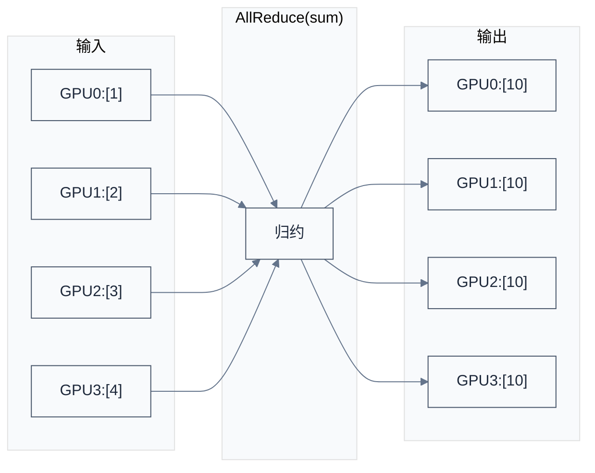
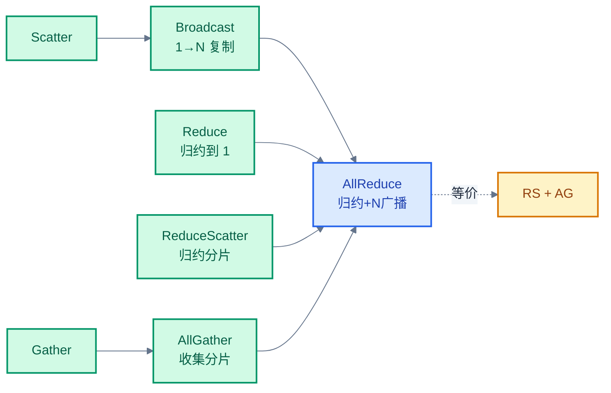
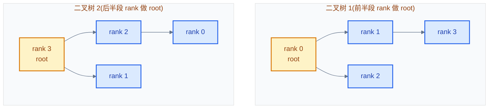
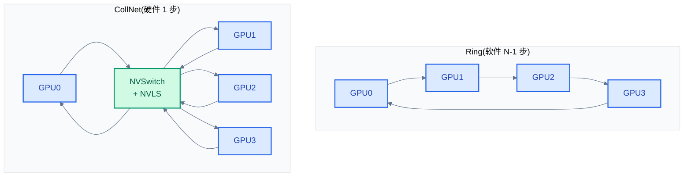
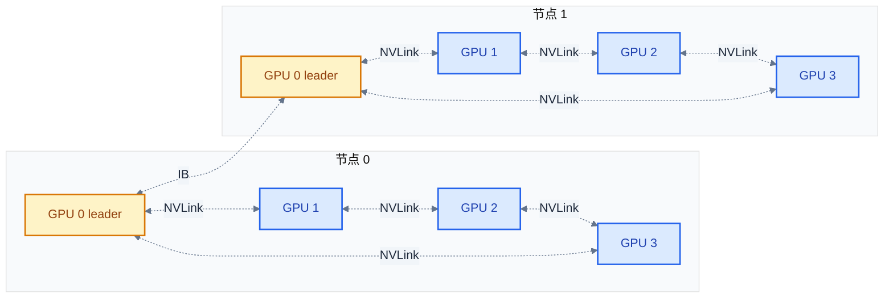

# 集合通信原语与算法

> 一句话概括:NCCL 提供 8 个集合通信原语(AllReduce/Broadcast/Reduce/AllGather/ReduceScatter/AlltoAll/Gather/Scatter),底层用三种算法(Ring/Tree/CollNet)实现,根据消息大小与硬件拓扑自动选择。
> **工程师视角**:Ring 是大消息带宽王者、Tree 是小消息延迟王者、CollNet 是 NVSwitch 加速器。理解这三个算法的带宽与延迟公式,才能看懂 `NCCL_DEBUG=INFO` 输出中"Algo:Ring"或"Algo:Tree"的选择逻辑。

### 关键术语

| 缩写 | 全称 | 含义 |
|------|------|------|
| AllReduce | All-to-All Reduce | 所有 rank 都得到所有数据的归约结果 |
| ReduceScatter | Reduce + Scatter | 归约后分片,每个 rank 得到一部分 |
| AllGather | All-to-All Gather | 每个 rank 收集所有 rank 的分片 |
| AlltoAll | All-to-All | 每个 rank 发给每个 rank 不同数据 |
| Ring | — | 环形通信图 |
| Tree | — | 树形通信图(双二叉树) |
| CollNet | Collective Network | NVSwitch 加速的硬件归约 |
| NVLS | NVLink SHARP | NVSwitch 上的归约原语 |
| AR | AllReduce | 简写 |
| RS | ReduceScatter | 简写 |
| AG | AllGather | 简写 |
| Latency | — | 延迟(启动开销,与消息大小无关) |
| BW | Bandwidth | 带宽(单位时间传输量) |
| chunk | — | NCCL 把大消息切分成 chunk,流式处理 |
| Optimal Bandwidth | — | 算法能达到的理论最大带宽 |

**前置阅读**:
- [01-nccl-overview.md](./01-nccl-overview.md) — NCCL 在系统中的位置
- [02-gpu-interconnect-background.md](./02-gpu-interconnect-background.md) — NVLink/IB 带宽差异

**下一篇**:[04-NCCL API 与基本用法](./04-nccl-api-and-usage.md)

---

## 1. 八个集合通信原语

> [01 章](./01-nccl-overview.md) 介绍了 NCCL 的系统定位。本章回答下一个问题:NCCL 到底提供了哪些通信操作?这些操作的输入输出是什么?

NCCL 官方提供 8 个 collective 操作(参考 [NCCL Communication Operations](https://docs.nvidia.com/deeplearning/nccl/user-guide/docs/ops.html))。下面以 4 GPU 为例,展示每个操作的输入输出。

### 1.1 AllReduce(归约广播)

**本质**:所有 rank 的输入做归约(sum/max/min),结果广播到所有 rank。



**应用场景**:DDP 中所有 GPU 把各自梯度 AllReduce(sum),每个 GPU 得到平均梯度。

### 1.2 Reduce(只归约不广播)

**本质**:与 AllReduce 相同,但只有 root rank 得到结果。

```
输入:GPU0:[1]  GPU1:[2]  GPU2:[3]  GPU3:[4]    root=0
输出:GPU0:[10] GPU1:—    GPU2:—    GPU3:—
```

**应用场景**:聚合优化器状态到 rank 0。

### 1.3 Broadcast(广播)

**本质**:root rank 的数据复制到所有 rank。

```
输入:GPU0:[1,2,3]  GPU1:—  GPU2:—  GPU3:—     root=0
输出:GPU0:[1,2,3]  GPU1:[1,2,3]  GPU2:[1,2,3]  GPU3:[1,2,3]
```

**应用场景**:rank 0 加载模型 checkpoint,广播到其他 rank。

### 1.4 AllGather(全收集)

**本质**:每个 rank 持有输入的一部分(chunk),输出是所有 chunk 拼接。

```
输入:GPU0:[1,1]  GPU1:[2,2]  GPU2:[3,3]  GPU3:[4,4]
输出:GPU0:[1,1,2,2,3,3,4,4]
      GPU1:[1,1,2,2,3,3,4,4]
      GPU2:[1,1,2,2,3,3,4,4]
      GPU3:[1,1,2,2,3,3,4,4]
```

**应用场景**:FSDP 在前向计算前 AllGather 完整参数。

### 1.5 ReduceScatter(归约分片)

**本质**:AllReduce 的逆操作——先归约再分片,每个 rank 得到一部分归约结果。

```
输入:GPU0:[1,2,3,4]  GPU1:[2,3,4,5]  GPU2:[3,4,5,6]  GPU3:[4,5,6,7]
输出:GPU0:[10]  GPU1:[14]  GPU2:[18]  GPU3:[22]
      (每 rank 持归约结果的一个 chunk)
```

**应用场景**:FSDP 反向后 ReduceScatter 梯度。ReduceScatter + AllGather = AllReduce。

### 1.6 AlltoAll(全交换)

**本质**:每个 rank 给每个 rank 发不同的数据。`sendbuf[i][j]` 表示 rank i 发给 rank j 的数据;`recvbuf[i][j]` 表示 rank i 收到来自 rank j 的数据。

```
输入:GPU0 给 GPU0/1/2/3 分别发 [a0,a1,a2,a3]
     GPU1 给 GPU0/1/2/3 分别发 [b0,b1,b2,b3]
     ...
输出:GPU0 收到 [a0,b0,c0,d0]
     GPU1 收到 [a1,b1,c1,d1]
     ...
```

**应用场景**:MoE 模型中 expert routing,token 在 expert 间重新分配。

### 1.7 Gather / Scatter

- **Gather**:所有 rank 数据汇集到 root(类似 AllGather 但只有 root 得到)
- **Scatter**:root 数据分片发到所有 rank(Broadcast 的分片版)

```
Gather:   输入:各 rank 持 chunk → 输出:root 持完整数组
Scatter:  输入:root 持完整数组 → 输出:各 rank 持 chunk
```

**应用场景**:相对少用,主要作为其他操作的构造块。

### 1.8 八个操作的关系



> **如何读这张图**:AllReduce 是最常用的操作,等价于"ReduceScatter + AllGather"。这种拆分让 Ring AllReduce 可以分解为两个对称的环形阶段(见 §2)。

---

## 2. Ring 算法:大消息带宽王者

### 2.1 Ring AllReduce 算法

**核心思想**:把 N 个 rank 排成环,把数据切分成 N 个 chunk,通过 N-1 步 reduce-scatter 让每个 rank 持有一个完整归约的 chunk,再通过 N-1 步 all-gather 把这个 chunk 广播出去。

**算法步骤**(N=4,数据分 4 chunk):

1. **Reduce-Scatter 阶段**(N-1=3 步):
   - 每步:rank i 从 rank i-1 收一个 chunk,与自己对应 chunk 归约,把结果发给 rank i+1
   - 经过 3 步,每个 rank 持有一个 chunk 的完整归约结果
2. **All-Gather 阶段**(N-1=3 步):
   - 每步:rank i 把完整归约的 chunk 发给 rank i+1
   - 经过 3 步,每个 rank 持有所有 chunk 的归约结果

### 2.2 4 GPU Ring AllReduce 数值演算

**初始状态**(每 GPU 持 4 个数,N=4,数据分 4 个 chunk):

| GPU | chunk 0 | chunk 1 | chunk 2 | chunk 3 |
|:---:|:-------:|:-------:|:-------:|:-------:|
| GPU 0 | 1 | 1 | 1 | 1 |
| GPU 1 | 2 | 2 | 2 | 2 |
| GPU 2 | 3 | 3 | 3 | 3 |
| GPU 3 | 4 | 4 | 4 | 4 |

目标:每个 GPU 都得到 `[10, 10, 10, 10]`(所有 chunk 的 sum)。

#### Reduce-Scatter 阶段(3 步)

约定:环顺序为 GPU0 → GPU1 → GPU2 → GPU3 → GPU0。每步:
- rank i 从 rank (i-1+4) mod 4 收一个 chunk(加到自己对应 chunk 上)
- rank i 把刚加好的 chunk 发给 rank (i+1) mod 4

**初始**:每 GPU 持 `[c0, c1, c2, c3]`。

**第 1 步**(每 GPU 同时执行,从左邻居收一个 chunk,加到自己,发给右邻居):

- GPU0 从 GPU3 收到 chunk 3 (=4),加到自己的 chunk 3:1+4=5。然后 GPU0 把新 chunk 3=5 发给 GPU1
- GPU1 从 GPU0 收到 chunk 0 (=1),加到自己的 chunk 0:2+1=3。然后 GPU1 把新 chunk 0=3 发给 GPU2
- GPU2 从 GPU1 收到 chunk 1 (=2),加到自己的 chunk 1:3+2=5。然后 GPU2 把新 chunk 1=5 发给 GPU3
- GPU3 从 GPU2 收到 chunk 2 (=3),加到自己的 chunk 2:4+3=7。然后 GPU3 把新 chunk 2=7 发给 GPU0

| GPU | c0 | c1 | c2 | c3 |
|:---:|:--:|:--:|:--:|:--:|
| GPU0 | 1 | 1 | 1 | **5** |
| GPU1 | **3** | 2 | 2 | 2 |
| GPU2 | 3 | **5** | 3 | 3 |
| GPU3 | 4 | 4 | **7** | 4 |

**第 2 步**(把上一步刚加好的 chunk 再传一跳,加和):

- GPU0 从 GPU3 收到 chunk 2 (=7),加到自己的 chunk 2:1+7=8。然后 GPU0 把 chunk 2=8 发给 GPU1
- GPU1 从 GPU0 收到 chunk 3 (=5),加到自己的 chunk 3:2+5=7。然后 GPU1 把 chunk 3=7 发给 GPU2
- GPU2 从 GPU1 收到 chunk 0 (=3),加到自己的 chunk 0:3+3=6。然后 GPU2 把 chunk 0=6 发给 GPU3
- GPU3 从 GPU2 收到 chunk 1 (=5),加到自己的 chunk 1:4+5=9。然后 GPU3 把 chunk 1=9 发给 GPU0

| GPU | c0 | c1 | c2 | c3 |
|:---:|:--:|:--:|:--:|:--:|
| GPU0 | 1 | 1 | **8** | 5 |
| GPU1 | 3 | 2 | 2 | **7** |
| GPU2 | **6** | 5 | 3 | 3 |
| GPU3 | 4 | **9** | 7 | 4 |

**第 3 步**(再传一跳):

- GPU0 从 GPU3 收到 chunk 1 (=9),加到自己的 chunk 1:1+9=10。然后 GPU0 把 chunk 1=10 发给 GPU1
- GPU1 从 GPU0 收到 chunk 2 (=8),加到自己的 chunk 2:2+8=10。然后 GPU1 把 chunk 2=10 发给 GPU2
- GPU2 从 GPU1 收到 chunk 3 (=7),加到自己的 chunk 3:3+7=10。然后 GPU2 把 chunk 3=10 发给 GPU3
- GPU3 从 GPU2 收到 chunk 0 (=6),加到自己的 chunk 0:4+6=10。然后 GPU3 把 chunk 0=10 发给 GPU0

| GPU | c0 | c1 | c2 | c3 |
|:---:|:--:|:--:|:--:|:--:|
| GPU0 | 1 | **10** | 8 | 5 |
| GPU1 | 3 | 2 | **10** | 7 |
| GPU2 | 6 | 5 | 3 | **10** |
| GPU3 | **10** | 9 | 7 | 4 |

**Reduce-Scatter 完成**:每个 GPU 持有**一个完整归约的 chunk**(都是 10):
- GPU0 持 c1=10
- GPU1 持 c2=10
- GPU2 持 c3=10
- GPU3 持 c0=10

#### All-Gather 阶段(3 步)

每 GPU 把自己完整归约的 chunk 沿环传给下一个 GPU,直到所有 GPU 都拿到所有 chunk:

**第 4 步**(传 chunk 3 跳,即原本 GPU0 的 c1,经 GPU1→GPU2→GPU3 一周):

简化:每步把 GPU(i-1) 的完整 chunk 传到 GPU(i),不加和。

- GPU0 持 c1=10,把 c1 发给 GPU1
- GPU1 持 c2=10,把 c2 发给 GPU2
- GPU2 持 c3=10,把 c3 发给 GPU3
- GPU3 持 c0=10,把 c0 发给 GPU0

经过这步,每 GPU 多持有一个 chunk:
| GPU | 完整 chunk |
|:---:|:----------:|
| GPU0 | c1=10, c0=10 |
| GPU1 | c2=10, c1=10 |
| GPU2 | c3=10, c2=10 |
| GPU3 | c0=10, c3=10 |

**第 5 步**:再传一跳
| GPU | 完整 chunk |
|:---:|:----------:|
| GPU0 | c1, c0, c3=10, c2=10 |
| GPU1 | c2, c1, c0=10, c3=10 |
| GPU2 | c3, c2, c1=10, c0=10 |
| GPU3 | c0, c3, c2=10, c1=10 |

**第 6 步**:最后一跳
| GPU | 完整 chunk |
|:---:|:----------:|
| GPU0 | **c0=10, c1=10, c2=10, c3=10** ✓ |
| GPU1 | **c0=10, c1=10, c2=10, c3=10** ✓ |
| GPU2 | **c0=10, c1=10, c2=10, c3=10** ✓ |
| GPU3 | **c0=10, c1=10, c2=10, c3=10** ✓ |

**完成!所有 GPU 都得到 [10, 10, 10, 10]**。

### 2.3 Ring AllReduce 性能分析

**总通信量**:每 rank 在每个阶段(N-1 步)传输 `(N-1)/N × M` 数据(M 为总消息大小),两阶段共:

$$
\text{每 rank 通信量} = 2 \times (N-1) \times \frac{M}{N} = \frac{2(N-1)}{N} \times M
$$

- 4 GPU, 1 GB AllReduce:$2 \times 3 / 4 \times 1 \text{ GB} = 1.5 \text{ GB}$
- 8 GPU, 1 GB AllReduce:$2 \times 7 / 8 \times 1 \text{ GB} = 1.75 \text{ GB}$

**带宽利用率**(理论最优):

$$
\eta_{\text{Ring}} = \frac{\text{理想带宽利用率}}{\text{实际带宽利用率}} = \frac{M/N}{2(N-1)M/N} = \frac{1}{2(N-1)/N} = \frac{N}{2(N-1)}
$$

当 N 较大时,$\eta \to 1/2$,即**带宽利用率接近 50%**(每 rank 总传输量是消息的 2 倍左右)。

**延迟**:

$$
\text{Latency}_{\text{Ring}} = 2(N-1) \times \alpha + \frac{2(N-1) M}{N \times B}
$$

其中 $\alpha$ 是单步启动延迟,$B$ 是单链路带宽。

- 大消息(GB 级):$M/B$ 主导,带宽效率高
- 小消息(KB 级):$2(N-1)\alpha$ 主导,延迟随 N 线性增长

> **核心要点**:Ring AllReduce 的带宽利用率随 GPU 数趋于 50%,延迟随 N 线性增长。适合**大消息 + 中等规模**(8-32 GPU)。

### 2.4 NCCL 的 Ring 实现位置

Ring 算法在 NCCL 源码中:

| 文件 | 职责 |
|------|------|
| [src/graph/rings.cc](./src/nccl-src/src/graph/rings.cc) | Ring 图构建(选择环顺序) |
| [src/include/trees.h](./src/nccl-src/src/include/trees.h) | ring/tree 数据结构 |
| [src/device/all_reduce.h](./src/nccl-src/src/device/all_reduce.h) | AllReduce GPU kernel |
| [src/device/prims_ll128.h](./src/nccl-src/src/device/prims_ll128.h) | LL128 协议(高带宽 ring 协议) |

---

## 3. Tree 算法:小消息延迟王者

### 3.1 双二叉树算法

**核心思想**:把 N 个 rank 组织成两棵二叉树(一棵上行、一棵下行),归约在树上从叶到根完成。用**双**二叉树让带宽利用率接近最优。



**两棵树互补**:在树 1 中是叶子的 rank,在树 2 中是内部节点,反之亦然。这样每 rank 在一棵树做发送、另一棵树做接收,带宽利用均匀。

### 3.2 Tree AllReduce 流程

1. **Reduce 阶段**(从叶到根):每个非叶 rank 等所有子节点传完后,归约,把结果发父节点
2. **Broadcast 阶段**(从根到叶):root 把归约结果广播给所有子节点

### 3.3 Tree 性能分析

**通信量**(双二叉树):

$$
\text{每 rank 通信量} = 2 \times M \times \frac{1}{2} = M
$$

(每 rank 在每棵树上传输约 M/2,两棵树共 M)

**带宽利用率**:$\eta = 1/1 = 100\%$(理论上),实际受树根瓶颈限制,约 80-90%。

**延迟**:

$$
\text{Latency}_{\text{Tree}} = 2 \log_2 N \times \alpha + \frac{2M}{B}
$$

- 大消息(GB 级):带宽稍逊 Ring(Ring 利用率 50%,Tree 80%)
- 小消息(KB 级):延迟 $\log N$ 增长,远优于 Ring 的 $O(N)$

> **核心要点**:Tree AllReduce 延迟 $O(\log N)$,适合**小消息 + 大规模**(64+ GPU)。NCCL 默认在 64 GPU 以上规模时切到 Tree。

### 3.4 NCCL Tree 实现

| 文件 | 职责 |
|------|------|
| [src/graph/trees.cc](./src/nccl-src/src/graph/trees.cc) | 双二叉树构建 |
| [src/include/trees.h](./src/nccl-src/src/include/trees.h) | `ncclTree` 数据结构(父/子节点列表) |
| [src/device/prims_simple.h](./src/nccl-src/src/device/prims_simple.h) | Simple 协议(用于 Tree 小消息) |

---

## 4. CollNet 算法:NVSwitch 硬件加速

### 4.1 CollNet 的本质

**核心思想**:NVSwitch 提供硬件归约原语(NVLS / NVLink SHARP)。NCCL 直接调用这个硬件原语,把 AllReduce 从软件的 N-1 步降到硬件的 1 步。



### 4.2 CollNet 性能分析

**通信量**:每 rank 发 M、收 M,共 2M。

**带宽利用率**:理论上接近 100%(每 rank 总传输 2M,理想也是 2M)。

**延迟**:

$$
\text{Latency}_{\text{CollNet}} = \alpha + \frac{2M}{B}
$$

延迟与 N 无关!8 GPU 与 64 GPU AllReduce 延迟相同(只要在单节点内)。

**限制**:
- 需要 NVSwitch 3+ 硬件(DGX A100/H100 等)
- 节点内最多 8/16 GPU(NVSwitch 容量)
- 跨节点需 fallback 到 Ring/Tree + Net

### 4.3 NCCL CollNet 实现

| 文件 | 职责 |
|------|------|
| [src/transport/coll_net.cc](./src/nccl-src/src/transport/coll_net.cc) | CollNet transport 实现 |
| [src/transport/nvls.cc](./src/nccl-src/src/transport/nvls.cc) | NVLS(NVSwitch SHARP)传输 |
| [src/include/coll_net.h](./src/nccl-src/src/include/coll_net.h) | CollNet 接口 |

---

## 5. 算法对比与自动选择

### 5.1 三种算法对比

| 对比维度 | Ring | Tree | CollNet |
|----------|------|------|---------|
| 拓扑 | 任意(ring) | 任意(tree) | NVSwitch fabric |
| 算法步数 | $2(N-1)$ | $2 \log_2 N$ | $1$ |
| 延迟(小消息) | $O(N)$ | $O(\log N)$ | $O(1)$ |
| 带宽利用率 | 50% | 80-90% | ~100% |
| 硬件依赖 | 无 | 无 | NVSwitch 3+ |
| 跨节点支持 | 是(节点间 ring) | 是(节点间 tree) | 否(仅节点内) |
| 适用规模 | 8-32 GPU | 32+ GPU | 8-16 GPU 节点内 |
| 适用消息 | 大(>1 MB) | 小(<1 MB) | 全部 |

### 5.2 NCCL 自动选择

NCCL 在 `src/graph/tuning.cc` 中根据消息大小、rank 数、拓扑自动选择算法。决策逻辑大致:

```c
// 简化伪代码:NCCL 算法选择
ncclAlgo selectAlgo(size_t msgSize, int nRanks, int nNodes, bool hasNvswitch) {
  if (hasNvswitch && msgSize > 1 KB && nRanks <= 16) {
    return ALGO_COLLNET;  // NVSwitch 加速
  }
  if (nRanks >= 64 && msgSize < 1 MB) {
    return ALGO_TREE;     // 小消息大规模用 Tree
  }
  return ALGO_RING;      // 默认 Ring
}
```

> 实际决策更复杂,涉及 `NCCL_ALGO` 环境变量强制、`tuning.cc` 的启发式等。详见 [07 章](./07-graph-and-scheduling.md)。

### 5.3 强制算法选择

```bash
# 强制使用 Ring
NCCL_ALGO=Ring ./my_app

# 强制使用 Tree
NCCL_ALGO=Tree ./my_app

# 看 NCCL 实际选了什么算法
NCCL_DEBUG=INFO ./my_app 2>&1 | grep "Algo"
```

详见 [10 章](./10-environment-variables-and-tuning.md)。

---

## 6. Ring 在跨节点场景:层次化 Ring

跨节点时,NCCL 把 ring 组织成**层次结构**:

1. **节点内 ring**:同节点 GPU 走 NVLink ring
2. **节点间 ring**:每节点选一个 "leader" GPU,leader 之间走 IB ring
3. **层次归约**:节点内 ring 完成 ReduceScatter → leader 间跨节点 ring → 节点内 ring AllGather



> **如何读这张图**:跨节点 Ring AllReduce 时,每节点选一个 leader GPU(通常是 rank 0)。节点内 ring 完成局部归约,leader 之间跨节点 IB ring 完成全局归约。这种层次化设计让节点内带宽(NVLink 900 GB/s)和节点间带宽(IB 50 GB/s)的差距被充分利用——大块数据走 NVLink,只有聚合后的少量数据走 IB。

---

## 7. 与后续章节的衔接

本章建立了"算法层"。接下来:

- [04 章](./04-nccl-api-and-usage.md) 讲 API——怎么把这些算法用起来
- [05 章](./05-source-architecture.md) 讲源码——这些算法在 `src/` 中怎么组织
- [07 章](./07-graph-and-scheduling.md) 讲 Graph——NCCL 怎么为本章算法构建通信图
- [09 章](./09-device-kernels-and-collnet.md) 讲 CollNet 实现——NVLS 硬件归约在源码里怎么落地

> **核心要点**:NCCL 三大算法各有所长——Ring 大消息带宽优(50% 利用率,延迟 O(N))、Tree 小消息延迟优(80% 利用率,延迟 O(log N))、CollNet NVSwitch 硬件加速(100% 利用率,延迟 O(1))。NCCL 根据消息大小、rank 数、硬件拓扑自动选择。理解这三个算法的带宽/延迟公式,是看懂 `NCCL_DEBUG` 输出和定位性能问题的钥匙。

---

## 参考资料

- [NCCL Communication Operations](https://docs.nvidia.com/deeplearning/nccl/user-guide/docs/ops.html) — 8 个 collective 操作 API 说明
- [NCCL API: Collective Functions](https://docs.nvidia.com/deeplearning/nccl/user-guide/docs/api/colls.html) — API 原型
- [NCCL Source: graph/](https://github.com/NVIDIA/nccl/tree/master/src/graph) — Ring/Tree 图构建(本地 [src/nccl-src/src/graph/](./src/nccl-src/src/graph/))
- [NCCL Source: device/](https://github.com/NVIDIA/nccl/tree/master/src/device) — GPU kernel 实现(本地 [src/nccl-src/src/device/](./src/nccl-src/src/device/))
- [Horovod Paper: Sergeev et al., 2017](https://arxiv.org/abs/1802.05799) — Ring AllReduce 算法详解
- [NVIDIA H100 Whitepaper §NVSwitch](https://resources.nvidia.com/en-us-tensor-core/nvidia-hopper-architecture-whitepaper) — NVLS 硬件归约原语
- [../LLM/05-LLM分布式训练](../LLM/05-LLM分布式训练：并行策略与ZeRO.md) — DDP/FSDP/ZeRO 的通信开销与算法选择
