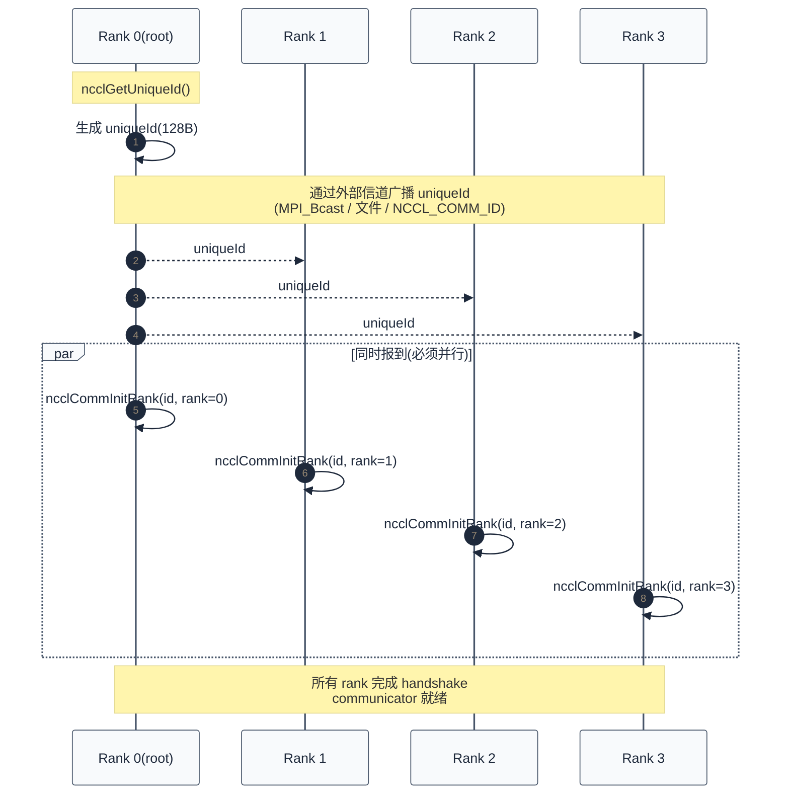
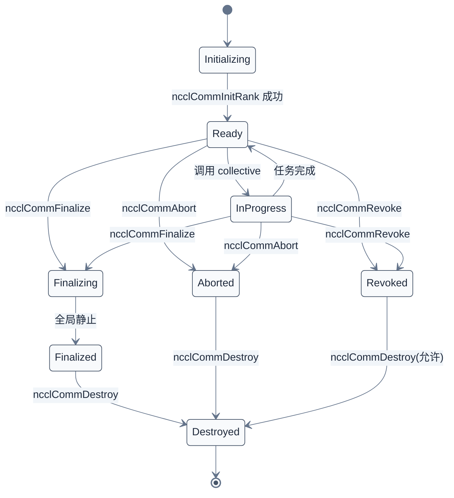

# NCCL API 与基本用法

> 一句话概括:NCCL 用 `ncclComm_t` 抽象通信上下文,通过 `ncclGetUniqueId` + `ncclCommInitRank` 三步建立 communicator,所有集合操作挂在 CUDA Stream 上异步执行,Group 语义提供批量化 enqueue。
> **工程师视角**:理解"Communicator 是上下文不是管道""API 仅 enqueue""Group 是批处理边界"这三点,就能写出正确的 NCCL 调用代码——而这三点恰恰是新手最常踩坑的地方(死锁、初始化失败、AsyncError 漏检)。

### 关键术语

| 缩写 | 全称 | 含义 |
|------|------|------|
| Communicator | — | NCCL 通信上下文,绑定一个 CUDA device |
| UniqueId | — | 通信器初始化邀请码(128 字节,内部含 TCP 监听地址) |
| Rank | — | communicator 中进程/线程编号(0 到 world_size-1) |
| World Size | — | communicator 中 rank 总数 |
| Stream | CUDA Stream | CUDA 异步执行队列,NCCL 调用挂在 stream 上 |
| Group | — | NCCL API 调用批处理边界,由 `ncclGroupStart/End` 包围 |
| P2P | Peer-to-Peer | 点对点通信(Send/Recv),区别于集合通信 |
| Root | — | 集合通信中的指定 rank(Broadcast/Reduce 的源头/汇点) |
| AsyncError | — | 通信器异步错误状态(API 返回后发生的错误) |
| In-place | — | sendbuff == recvbuff 的就地操作模式 |

**前置阅读**:
- [03-集合通信原语与算法](./03-collective-operations-and-algorithms.md) — 8 个原语与算法选择

**下一篇**:[05-NCCL 源码架构](./05-source-architecture.md)

---

## 1. Communicator:NCCL 的通信上下文

> [03 章](./03-collective-operations-and-algorithms.md) 讲了 NCCL 提供 8 个原语和 3 种算法。本章回答下一个问题:用户如何用 C 代码调用这些原语?通信上下文如何建立?

### 1.1 什么是 Communicator

NCCL 把"通信上下文"抽象为 `ncclComm_t`。这是一个**不透明句柄**(opaque handle),实际指向内部结构 `struct ncclComm`(详见 [05 章](./05-source-architecture.md)):

```c
/* 摘自 [src/nccl.h.in](./src/nccl-src/src/nccl.h.in) 第 35-41 行 */
typedef struct ncclComm* ncclComm_t;
typedef struct ncclWindow_vidmem* ncclWindow_t;
#define NCCL_COMM_NULL NULL

#define NCCL_UNIQUE_ID_BYTES 128
typedef struct { char internal[NCCL_UNIQUE_ID_BYTES]; } ncclUniqueId;
```

`ncclUniqueId` 是 128 字节的"邀请码"——任何持有它的进程都能加入同一个通信器。其内部包含 rank 0 的 TCP 监听地址与端口,以及一个随机 magic number 用于鉴权。

> **核心要点**:Communicator 是**通信上下文**而非**传输管道**。一次 `ncclCommInitRank` 完成后,所有 collective 复用同一组 channel 和 transport;通信路径在初始化时根据拓扑固化(详见 [06 章](./06-bootstrap-and-topology.md)),运行时不再重算。

### 1.2 rank 与 world_size

Communicator 内部用 `(rank, world_size)` 标识每个成员:
- **world_size**:通信器中 rank 总数,4 GPU 即 `world_size=4`
- **rank**:当前进程在通信器中的编号,从 0 开始,必须唯一

```
rank 0  rank 1  rank 2  rank 3
  ↓       ↓       ↓       ↓
[GPU0]  [GPU1]  [GPU2]  [GPU3]
   ←————— 同一个 communicator —————→
        world_size = 4
```

### 1.3 与 CUDA device 的绑定

每个 communicator 绑定一个 CUDA device。**调用 `ncclCommInitRank` 前,当前线程必须先 `cudaSetDevice`**,这一约束直接写在 `nccl.h.in` 的 API 注释中:

```c
/* 摘自 [src/nccl.h.in](./src/nccl-src/src/nccl.h.in) 第 180-187 行 */
/* Creates a new communicator (multi thread/process version).
 * rank must be between 0 and nranks-1 and unique within a communicator clique.
 * Each rank is associated to a CUDA device, which has to be set before calling
 * ncclCommInitRank.
 * ncclCommInitRank implicitly syncronizes with other ranks, so it must be
 * called by different threads/processes or use ncclGroupStart/ncclGroupEnd. */
ncclResult_t  ncclCommInitRank(ncclComm_t* comm, int nranks,
                               ncclUniqueId commId, int rank);
```

为什么需要"先 setDevice"?因为 NCCL 在 `ncclCommInitRank` 内部要为该 GPU 建立 NVML/CUDA 上下文、分配 device memory 用于通信 scratch、绑定 transport(详见 [06 章](./06-bootstrap-and-topology.md) 拓扑探测)——这些都依赖当前线程的 active device。

---

## 2. 初始化三步曲

NCCL 通信器初始化采用"邀请码 + 同时报到"模式,需要三步:



### 2.1 第一步:生成 UniqueId

```c
/* 摘自 [src/nccl.h.in](./src/nccl-src/src/nccl.h.in) 第 169-173 行 */
/* Generates an Id to be used in ncclCommInitRank. ncclGetUniqueId should be
 * called once and the Id should be distributed to all ranks in the
 * communicator before calling ncclCommInitRank. */
ncclResult_t  ncclGetUniqueId(ncclUniqueId* uniqueId);
```

只需在 **rank 0** 上调用一次。NCCL 内部启动一个临时 TCP 监听 socket,把地址 + 端口编码进 128 字节的 `uniqueId`(详见 [06 章](./06-bootstrap-and-topology.md) bootstrap 实现)。

### 2.2 第二步:广播 UniqueId

`uniqueId` 必须分发给所有 rank,但分发信道**不是** NCCL——因为 NCCL 通信器还没建立。常用方式:

| 分发方式 | 适用场景 | 备注 |
|---------|---------|------|
| `MPI_Bcast` | 已有 MPI 环境 | HPC 集群最常见 |
| 共享文件 | 单机多进程 | rank 0 写文件,其他 rank 读 |
| `NCCL_COMM_ID` 环境变量 | 无 MPI 时的 fallback | 格式 `<ip>:<port>`,跳过 uniqueId 广播 |
| Slurm/PBS env | 任务调度器分发 | 用 `SLURM_PROCID` 作 rank |

`NCCL_COMM_ID` 是个特殊的"反向"机制:rank 0 不广播 uniqueId,而是其他 rank 通过环境变量直接连到 rank 0 的 TCP 监听端口(详见 [06 章](./06-bootstrap-and-topology.md) bootstrap `bootstrapNetInit`)。

### 2.3 第三步:同时报到

所有 rank 必须同时调用 `ncclCommInitRank`。**这条隐含同步约束**是新手最常踩坑的地方——下面三种调用方式只有 (a) 和 (c) 正确:

```c
// (a) 多进程,每个进程调用一次(正确,最常见)
cudaSetDevice(my_rank);
ncclCommInitRank(&comm, world_size, id, my_rank);  // 各进程并行报到

// (b) 单进程顺序调用(错误!会死锁)
for (int r = 0; r < world_size; r++) {
  cudaSetDevice(r);
  ncclCommInitRank(&comms[r], world_size, id, r);  // rank 0 卡住等其他人
}

// (c) 单进程多线程,包在 group 内(正确)
ncclGroupStart();
for (int r = 0; r < world_size; r++) {
  cudaSetDevice(r);
  ncclCommInitRank(&comms[r], world_size, id, r);  // group 内只是入队
}
ncclGroupEnd();  // 一次性 flush,所有 rank 同时报到
```

参考 [NCCL Documentation §Communicators](https://docs.nvidia.com/deeplearning/nccl/user-guide/docs/overview.html#communicators)。

### 2.4 单进程多 GPU 的快捷方式

如果 4 个 GPU 都在同一个进程(典型的 PyTorch DDP 单机场景),用 `ncclCommInitAll` 一行搞定:

```c
/* 摘自 [src/nccl.h.in](./src/nccl-src/src/nccl.h.in) 第 189-196 行 */
/* Creates a clique of communicators (single process version).
 * This is a convenience function to create a single-process communicator clique.
 * Returns an array of ndev newly initialized communicators in comm.
 * comm should be pre-allocated with size at least ndev*sizeof(ncclComm_t).
 * If devlist is NULL, the first ndev CUDA devices are used.
 * Order of devlist defines user-order of processors within the communicator. */
ncclResult_t  ncclCommInitAll(ncclComm_t* comm, int ndev, const int* devlist);
```

```c
ncclComm_t comms[4];
int devs[4] = {0, 1, 2, 3};
ncclCommInitAll(comms, 4, devs);  // 一次创建 4 个 communicator
// comms[i] 绑定到 GPU devs[i]
```

注意 `comm` 应预先分配 `ndev*sizeof(ncclComm_t)` 空间;`devlist` 为 NULL 时使用前 `ndev` 个 CUDA 设备;`devlist` 的顺序定义了 communicator 内的 rank 顺序。

> **核心要点**:NCCL 初始化采用"邀请码模式"而非 MPI 的"全员同时启动"。优势是允许跨集群动态扩容(见 §7.3 的 `ncclCommGrow`);代价是必须有一个外部分发信道广播 uniqueId。

---

## 3. 集合操作 API

### 3.1 8 个 collective API 签名

NCCL 提供 8 个集合通信 API(对应 [03 章](./03-collective-operations-and-algorithms.md) 的 8 个原语)。以 AllReduce 为例:

```c
/* 摘自 [src/nccl.h.in](./src/nccl-src/src/nccl.h.in) 第 496-508 行(以 AllReduce 为例) */
ncclResult_t ncclAllReduce(const void* sendbuff, void* recvbuff, size_t count,
    ncclDataType_t datatype, ncclRedOp_t op, ncclComm_t comm,
    cudaStream_t stream);
```

参数说明:
- `sendbuff`:发送缓冲区(device pointer,**必须在 `comm` 绑定的 GPU 上**)
- `recvbuff`:接收缓冲区(device pointer,可与 sendbuff 相同做 in-place)
- `count`:元素个数(不是字节数,字节数 = count × sizeof(datatype))
- `datatype`:见 §3.2
- `op`:归约操作,见 §3.3
- `comm`:通信器
- `stream`:CUDA stream,见 §4

其他 7 个 API 签名类似,差异在于是否需要 `root`、是否需要 `op`:

| API | 是否需要 root | 是否需要 op | 输入/输出语义 |
|-----|---------------|-------------|---------------|
| AllReduce | 否 | 是 | 全 in / 全 out |
| Reduce | 是 | 是 | 全 in / root out |
| Broadcast | 是 | 否 | root in / 全 out |
| AllGather | 否 | 否 | 各自 in / 全 out |
| ReduceScatter | 否 | 是 | 全 in / 各自 out |
| AlltoAll | 否 | 否 | 各自给各自 |
| Gather | 是 | 否 | 全 in / root out |
| Scatter | 是 | 否 | root in / 全 out |

### 3.2 数据类型(12 种)

```c
/* 摘自 [src/nccl.h.in](./src/nccl-src/src/nccl.h.in) 第 280-300 行(节选) */
typedef enum {
  ncclInt8       = 0,  ncclChar    = 0,
  ncclUint8      = 1,
  ncclInt32      = 2,  ncclInt     = 2,
  ncclUint32     = 3,
  ncclInt64      = 4,  ncclUint64  = 5,
  ncclFloat16    = 6,  ncclHalf    = 6,
  ncclFloat32    = 7,  ncclFloat   = 7,
  ncclFloat64    = 8,  ncclDouble  = 8,
  ncclBfloat16   = 9,
  ncclFloat8e4m3 = 10,
  ncclFloat8e5m2 = 11,
} ncclDataType_t;
```

12 种类型覆盖从 8-bit 整数到 FP8(Hopper/Blackwell)。`ncclChar`/`ncclInt`/`ncclHalf`/`ncclFloat`/`ncclDouble` 是与早期 NCCL 兼容的别名,数值与对应类型相同。

### 3.3 归约操作

```c
/* 摘自 [src/nccl.h.in](./src/nccl-src/src/nccl.h.in) 第 313-322 行(节选) */
typedef enum {
  ncclSum        = 0,
  ncclProd       = 1,
  ncclMax         = 2,
  ncclMin         = 3,
  ncclAvg         = 4,
  /* NCCL 2.10+:带预乘的归约 */
  ncclPreMulSum  = 5,
} ncclRedOp_t;
```

`ncclAvg` 内部等价于 `Sum / world_size`,常用于梯度平均(否则用户要手动除)。`ncclPreMulSum` 用于稀疏训练等场景,归约前每个 rank 先乘以一个标量(通过 `ncclRedOpCreatePreMulSum` 创建自定义 op)。

### 3.4 一个具体演算

延续 [03 章](./03-collective-operations-and-algorithms.md) §1.1 的例子,做一次具体的 AllReduce:

```
4 GPU,每个 GPU 上有 1 个 float32 元素:
  rank 0: sendbuff[0] = 1.0f
  rank 1: sendbuff[0] = 2.0f
  rank 2: sendbuff[0] = 3.0f
  rank 3: sendbuff[0] = 4.0f

调用:
  ncclAllReduce(sendbuff, recvbuff, count=1,
                ncclFloat32, ncclSum, comm, stream);

数学过程:
  recvbuff[0] = 1.0 + 2.0 + 3.0 + 4.0 = 10.0f

结果:所有 rank 的 recvbuff[0] = 10.0f
```

如果 `op=ncclAvg`,结果为 `10.0 / 4 = 2.5f`。如果 `op=ncclMax`,结果为 `4.0f`。

---

## 4. CUDA Stream 异步语义

NCCL API 是**异步**的:调用返回只意味着任务被 enqueue 到 stream,真正执行要等 stream 推进。这与 cuBLAS/cuDNN 等 CUDA 库的异步模型一致。

```c
cudaStream_t stream;
cudaStreamCreate(&stream);

// 调用立即返回,任务进入 stream 队列
ncclAllReduce(sendbuff, recvbuff, N, ncclFloat32, ncclSum, comm, stream);

// 此时 recvbuff 内容未定,可能还没开始执行
cudaStreamSynchronize(stream);  // 阻塞直到完成

// 现在 recvbuff 内容可读
cudaMemcpy(host_buf, recvbuff, N * sizeof(float), cudaMemcpyDeviceToHost);
```

### 4.1 Stream 与 Communicator 的关系

- 一个 communicator 可以挂到**任意多个 stream** 上(不同 collective 用不同 stream 并行)
- 同一个 stream 上多个 collective 按 FIFO 顺序执行
- **跨 stream 通信**:NCCL 不保证不同 stream 上的 collective 执行顺序。如果需要同步,用户负责用 `cudaEvent` 做同步

```c
cudaStream_t s1, s2;
cudaEvent_t e;
cudaEventCreate(&e);

cudaStreamCreate(&s1); cudaStreamCreate(&s2);

// s1 上的 collective 完成后通知 s2
ncclAllReduce(buf1, buf1, N, ..., comm, s1);
cudaEventRecord(e, s1);              // s1 完成时打点
cudaStreamWaitEvent(s2, e);          // s2 等 event
ncclAllReduce(buf2, buf2, N, ..., comm, s2);  // 保证在 buf1 之后
```

### 4.2 与计算 overlap

NCCL 异步语义的关键用途:通信与计算 overlap,这是大规模训练性能的核心。

```c
cudaStream_t compute_stream, comm_stream;
// 前向 → 反向 → 梯度 AllReduce → 参数更新
forward(x, compute_stream);                    // 计算
backward(grad, compute_stream);                // 计算
ncclAllReduce(grad, grad, N, ncclFloat32,
             ncclSum, comm, comm_stream);     // 通信(可与 backward 的后续算子 overlap)
optimizer_step(params, compute_stream);        // 更新(等 AllReduce 完成)

cudaStreamSynchronize(compute_stream);
cudaStreamSynchronize(comm_stream);
```

> **核心要点**:NCCL API **仅 enqueue**。真正执行依赖 `cudaStreamSynchronize` 或 `cudaStreamQuery`。这种异步语义让通信与计算可以并行,是大规模训练性能的关键——但同时也意味着 `ncclAllReduce` 返回 `ncclSuccess` 不代表执行成功,真正错误需查 AsyncError(见 §9.2)。

---

## 5. Group 语义:批量 enqueue

### 5.1 为什么需要 Group

考虑 4 GPU P2P 通信场景:每个 rank 要同时 Send 给其他 rank,同时 Recv 其他 rank 的数据。新手最常见的写法会死锁:

```c
// 错误写法:ncclSend 是 enqueue 语义,但 group 外的 enqueue 会立即 flush
ncclSend(buf, N, ncclFloat32, peer=1, comm, stream);  // rank 0 enqueue 后立即尝试 flush
                                                       // 但 rank 1 还没 Recv,数据无处可去 → 死锁
ncclRecv(buf, N, ncclFloat32, peer=2, comm, stream);
```

NCCL 的 `ncclSend`/`ncclRecv` **不是立即发送**,而是 enqueue。但 enqueue 需要一个边界告诉 NCCL"这一批任务可以一起 flush"——这就是 `ncclGroupStart/End`。

### 5.2 Group API

```c
/* 摘自 [src/group.cc](./src/nccl-src/src/group.cc) 第 96-114 行 */
NCCL_API(ncclResult_t, ncclGroupStart);
ncclResult_t ncclGroupStart() {
  ncclResult_t ret = ncclSuccess;
  NCCL_NVTX3_FUNC_RANGE;
  NCCLCHECK(ncclGroupStartInternal());
  TRACE_CALL("ncclGroupStart()");
  return ret;
}

NCCL_API(ncclResult_t, ncclGroupEnd);
ncclResult_t ncclGroupEnd() {
  ncclResult_t ret = ncclSuccess;
  NCCL_NVTX3_FUNC_RANGE;
  NCCLCHECKGOTO(ncclGroupEndInternal(), ret, exit);
  TRACE_CALL("ncclGroupEnd()");
exit:
  return ret;
}
```

### 5.3 Group 内部机制:thread-local 队列

NCCL 用 **thread-local 变量**保存 group 状态,所以 group 必须在同一线程内 start/end:

```c
/* 摘自 [src/group.cc](./src/nccl-src/src/group.cc) 第 27-32 行 */
thread_local int ncclGroupDepth = 0;                    // group 嵌套深度
thread_local ncclResult_t ncclGroupError = ncclSuccess;  // 累积错误
thread_local struct ncclComm* ncclGroupCommHead[ncclGroupTaskTypeNum] = {nullptr};
thread_local struct ncclComm* ncclGroupCommPreconnectHead = nullptr;
thread_local struct ncclIntruQueue<struct ncclAsyncJob, &ncclAsyncJob::next> ncclAsyncJobs;
thread_local int ncclGroupBlocking = -1;                /* default mode */
```

Group 内的 collective 调用通过 `ncclAsyncLaunch` 决定走"立即执行"还是"加入 asyncJobs 队列":

```c
/* 摘自 [src/group.cc](./src/nccl-src/src/group.cc) 第 35-73 行(简化) */
ncclResult_t ncclAsyncLaunch(struct ncclAsyncJob* job,
                             ncclResult_t (*func)(struct ncclAsyncJob*),
                             void (*undo)(struct ncclAsyncJob*),
                             void (*destructor)(void*), ncclComm_t comm) {
  ncclResult_t ret = ncclSuccess;
  job->destroyFlag = comm->destroyFlag;
  if (ncclGroupDepth == 0) {
    ret = func(job);                        // 不在 group 内:立即执行
    if (ret != ncclSuccess && undo) undo(job);
    if (destructor) destructor(job);
  } else {
    job->func = func;                      // 在 group 内:加入队列
    /* ... 检查 blocking 模式一致性 ... */
    ncclIntruQueueEnqueue(&ncclAsyncJobs, job);
  }
  return ret;
}
```

这段代码体现的核心设计:**group 是"批处理边界"**。group 内的调用只入队不执行,`ncclGroupEnd` 时一次性 flush 所有任务。这让 NCCL 能看到整个批次的通信模式(哪些 rank 互相 Send/Recv),据此优化调度——例如把多个 Send/Recv 合并成一个 Ring AllReduce(详见 [07 章](./07-graph-and-scheduling.md))。

### 5.4 Group 的三种典型用法

**用法 1:P2P Send/Recv 配对(必须)**

```c
ncclGroupStart();
for (int p = 0; p < world_size; p++) {
  if (p == my_rank) continue;
  ncclSend(sendbuf[p], N, ncclFloat32, p, comm, stream);
  ncclRecv(recvbuf[p], N, ncclFloat32, p, comm, stream);
}
ncclGroupEnd();  // 此时所有 Send/Recv 一起提交,避免死锁
```

**用法 2:跨 communicator 批量 collective**

```c
ncclGroupStart();
for (int i = 0; i < n_comms; i++) {
  ncclAllReduce(sendbuf[i], recvbuf[i], N, ncclFloat32,
                ncclSum, comms[i], stream);
}
ncclGroupEnd();  // 多个 communicator 的 collective 一起调度
```

**用法 3:同一 communicator 多个 collective 合并**

```c
ncclGroupStart();
ncclAllReduce(grad_layer1, grad_layer1, N1, ncclFloat32, ncclSum, comm, stream);
ncclAllReduce(grad_layer2, grad_layer2, N2, ncclFloat32, ncclSum, comm, stream);
ncclAllReduce(grad_layer3, grad_layer3, N3, ncclFloat32, ncclSum, comm, stream);
ncclGroupEnd();  // 3 次 AllReduce 合并调度,减少 launch 开销
```

> **核心要点**:Group 语义把多次 enqueue 合并到一次 flush,让 NCCL 看到完整通信模式后做更优调度。`ncclSend`/`ncclRecv` 跨 rank 通信**必须**包在 group 内,否则会死锁。

---

## 6. P2P Send/Recv API

```c
/* 摘自 [src/nccl.h.in](./src/nccl-src/src/nccl.h.in) 第 589-608 行 */
ncclResult_t ncclSend(const void* sendbuff, size_t count, ncclDataType_t datatype,
                      int peer, ncclComm_t comm, cudaStream_t stream);
ncclResult_t ncclRecv(void* recvbuff, size_t count, ncclDataType_t datatype,
                      int peer, ncclComm_t comm, cudaStream_t stream);
```

参数:`peer` 是目标/源 rank(**不是 GPU index**),取值范围 `[0, world_size)`,但 `peer != my_rank`。NCCL 内部会根据 communicator 的拓扑选择最快的传输路径(可能是 NVLink P2P、共享内存、或跨节点的 IB,详见 [08 章](./08-transport-layer.md))。

### 6.1 Send/Recv 必须配对

每个 `ncclSend(peer=r)` **必须**在 rank `r` 上有对应的 `ncclRecv(peer=my_rank)`,且 `count` 与 `datatype` 匹配。否则 group end 时数据无处可去,产生死锁或 timeout。

### 6.2 Send/Recv 的实现路径

`ncclSend` 的内部 dispatch 路径:

```c
/* 摘自 [src/collectives.cc](./src/nccl-src/src/collectives.cc) 第 271-291 行 */
ncclResult_t ncclSend(const void* sendbuff, size_t count, ncclDataType_t datatype,
                      int peer, ncclComm_t comm, cudaStream_t stream) {
  NVTX3_FUNC_WITH_PARAMS(Send, NcclNvtxParamsSendRecv,
                         NVTX3_PAYLOAD(comm ? comm->commHash : 0,
                                       count * ncclTypeSize(datatype), peer));
  struct ncclInfo info = {ncclFuncSend,
                          "Send",
                          NULL,             // sendbuff 实际放在 recvbuff 字段(Send 用对端 RecvMem)
                          (void*)sendbuff,
                          count, datatype, ncclSum, peer, comm, stream,
                          1, 1};
  return ncclEnqueueCheck(&info);
}
```

注意 `ncclSend` 与 `ncclAllReduce` 走**完全相同**的 enqueue 路径(`ncclEnqueueCheck`),区别仅在 `ncclInfo.collFunc = ncclFuncSend` vs `ncclFuncAllReduce`。这种"统一 dispatch + 类型字段区分"的设计是 NCCL 源码的典型模式(详见 [05 章](./05-source-architecture.md) 调用层次)。

> **核心要点**:`ncclSend`/`ncclRecv` 不是独立的传输机制,而是 collective 调度框架在 `ncclFunc = ncclFuncSend/Recv` 时的特例。这让 P2P 通信能与 collective 通信共享同一套 channel、transport、proxy 基础设施。

---

## 7. Communicator 生命周期

NCCL 2.30 后,通信器生命周期扩展为 6 个 API:

```c
/* 摘自 [src/nccl.h.in](./src/nccl-src/src/nccl.h.in) 第 198-222 行(节选) */
/* Finalize a communicator. ncclCommFinalize flushes all issued communications,
 * and marks communicator state as ncclInProgress. The state will change to ncclSuccess
 * when the communicator is globally quiescent and related resources are freed; then,
 * calling ncclCommDestroy can locally free the rest of the resources. */
ncclResult_t  ncclCommFinalize(ncclComm_t comm);
/* Frees local resources associated with communicator object. */
ncclResult_t  ncclCommDestroy(ncclComm_t comm);
/* Frees resources associated with communicator object and aborts any operations
 * that might still be running on the device. */
ncclResult_t  ncclCommAbort(ncclComm_t comm);
/* Revoke a communicator. ncclCommRevoke stops all in-flight operations
 * and marks communicator state as ncclInProgress. The state will change to ncclSuccess
 * when the communicator is quiescent; then, management operations (destroy, split,
 * shrink) can proceed safely. */
ncclResult_t  ncclCommRevoke(ncclComm_t comm, int revokeFlags);
```

### 7.1 通信器状态机



### 7.2 四个销毁 API 的差异

| API | 触发动作 | 是否阻塞 | 是否广播 | 在异常状态可用 | 适用场景 |
|-----|---------|---------|---------|----------------|---------|
| `ncclCommFinalize` | flush 在途任务,标记 InProgress | 否(异步) | 是 | 否 | 正常退出第一步 |
| `ncclCommDestroy` | 释放本地资源 | 是 | 否 | 是 | Finalize 后清理 |
| `ncclCommAbort` | 立即中止 + 释放 | 是 | 否 | 是 | 已知 rank crash 的紧急清理 |
| `ncclCommRevoke` | 标记失效,停止所有任务 | 否(异步) | 是 | — | 协作式故障恢复 |

**典型使用模式**:

```c
// (a) 正常退出
ncclCommFinalize(comm);                  // 异步开始 flush
ncclResult_t state;
do {
  ncclCommGetAsyncError(comm, &state);   // 轮询状态
} while (state == ncclInProgress);
ncclCommDestroy(comm);                   // 全局静止后销毁

// (b) 异常退出(已知其他 rank crash)
ncclCommAbort(comm);    // 立即释放,不等其他 rank

// (c) 协作恢复(其他 rank 被踢出,本 rank 想继续)
ncclCommRevoke(comm, NCCL_REVOKE_DEFAULT);  // 标记 comm 失效
ncclResult_t state;
do {
  ncclCommGetAsyncError(comm, &state);
} while (state == ncclInProgress);
ncclComm_t newcomm;
int excluded[] = {failed_rank};
ncclCommShrink(comm, excluded, 1, &newcomm, NULL, NCCL_SHRINK_DEFAULT);
comm = newcomm;  // 用新 comm 继续工作
```

### 7.3 动态成员管理

NCCL 2.18+ 引入了动态成员管理 API,用于弹性训练(fault-tolerant training):

```c
/* 摘自 [src/nccl.h.in](./src/nccl-src/src/nccl.h.in) 第 224-257 行(节选) */
/* Creates one or more communicators from an existing one.
 * Ranks with the same color will end up in the same communicator. */
ncclResult_t  ncclCommSplit(ncclComm_t comm, int color, int key,
                            ncclComm_t *newcomm, ncclConfig_t* config);
/* Shrink existing communicator.
 * Ranks in excludeRanksList will be removed form the existing communicator. */
ncclResult_t  ncclCommShrink(ncclComm_t comm, int* excludeRanksList,
                             int excludeRanksCount, ncclComm_t* newcomm,
                             ncclConfig_t* config, int shrinkFlags);
/* Grow communicator by adding new ranks.
 * Parameter usage:
 * - Existing non-root: comm, uniqueId=NULL, rank=-1
 * - Existing root: comm, uniqueId=&id, rank=-1
 * - New ranks: comm=NULL, uniqueId=&id, rank=assigned */
ncclResult_t  ncclCommGrow(ncclComm_t comm, int nRanks,
                           const ncclUniqueId* uniqueId, int rank,
                           ncclComm_t* newcomm, ncclConfig_t* config);
```

- **Split**:按 `color` 分组,组内按 `key` 排序。MPI `MPI_Comm_split` 的 NCCL 版本。用于模型并行下不同子组通信
- **Shrink**:剔除故障 rank,重新编号。用于弹性训练——某 GPU 故障后,剩余 GPU 继续
- **Grow**:扩容,加入新 rank。需要新的 uniqueId(由 `ncclCommGetUniqueId` 在已存在 comm 上生成,见 `nccl.h.in` 第 247 行)。注意:"UID is consumed upon successful grow and cannot be reused"(每个 UID 只能用一次)

> **核心要点**:`Finalize`/`Abort`/`Revoke`/`Destroy` 四个 API 解决不同退出场景。`Revoke` 是协作式失效,允许其他 rank 通过 `Shrink` 恢复;`Abort` 是单边中止,用于已知 rank crash 的紧急清理。`Split`/`Shrink`/`Grow` 让 NCCL 支持弹性训练,这是 LLM 训练大规模化后的关键能力。

---

## 8. 完整最小示例:4 GPU AllReduce

下面是一个完整可编译的 C 代码,在单进程内 4 GPU 上做 AllReduce 并验证。代码体现本章所有要点:`ncclCommInitAll` 初始化、`ncclGroupStart/End` 批量化、Stream 异步、结果验证:

```c
#include <stdio.h>
#include <cuda_runtime.h>
#include <nccl.h>

#define N_RANKS 4

int main(int argc, char* argv[]) {
  int devs[N_RANKS] = {0, 1, 2, 3};

  // 1. 一次性创建 4 个 communicator(单进程多 GPU 快捷方式)
  ncclComm_t comms[N_RANKS];
  ncclCommInitAll(comms, N_RANKS, devs);

  // 2. 在每个 GPU 上分配 send/recv 缓冲区并填入数据
  float* d_send[N_RANKS];
  float* d_recv[N_RANKS];
  float  h_init[N_RANKS] = {1.0f, 2.0f, 3.0f, 4.0f};  // 各 rank 的输入

  for (int r = 0; r < N_RANKS; r++) {
    cudaSetDevice(devs[r]);
    cudaMalloc(&d_send[r], sizeof(float));
    cudaMalloc(&d_recv[r], sizeof(float));
    cudaMemcpy(d_send[r], &h_init[r], sizeof(float), cudaMemcpyHostToDevice);
  }

  // 3. 每个 communicator 用自己的 stream(可与计算 overlap)
  cudaStream_t streams[N_RANKS];
  for (int r = 0; r < N_RANKS; r++) {
    cudaSetDevice(devs[r]);
    cudaStreamCreate(&streams[r]);
  }

  // 4. Group 内同时调用 4 个 collective
  //    让 NCCL 看到完整通信模式,合并调度
  ncclGroupStart();
  for (int r = 0; r < N_RANKS; r++) {
    ncclAllReduce(d_send[r], d_recv[r], /*count=*/1,
                  ncclFloat32, ncclSum, comms[r], streams[r]);
  }
  ncclGroupEnd();

  // 5. 等待所有 stream 完成(NCCL API 仅 enqueue)
  for (int r = 0; r < N_RANKS; r++) {
    cudaSetDevice(devs[r]);
    cudaStreamSynchronize(streams[r]);
  }

  // 6. 验证:每个 GPU 的 recvbuff[0] 应为 1+2+3+4=10.0f
  for (int r = 0; r < N_RANKS; r++) {
    float h_out;
    cudaSetDevice(devs[r]);
    cudaMemcpy(&h_out, d_recv[r], sizeof(float), cudaMemcpyDeviceToHost);
    printf("rank %d: result = %.1f (expected 10.0)\n", r, h_out);
    if (h_out != 10.0f) {
      fprintf(stderr, "rank %d verification FAILED\n", r);
    }
  }

  // 7. 查询异步错误(API 返回 success 不代表执行成功)
  for (int r = 0; r < N_RANKS; r++) {
    ncclResult_t async_err;
    ncclCommGetAsyncError(comms[r], &async_err);
    if (async_err != ncclSuccess) {
      fprintf(stderr, "rank %d async error: %s\n",
              r, ncclGetErrorString(async_err));
    }
  }

  // 8. 释放资源(ncclCommInitAll 创建的 comms 需逐个 destroy)
  for (int r = 0; r < N_RANKS; r++) {
    cudaSetDevice(devs[r]);
    cudaFree(d_send[r]);
    cudaFree(d_recv[r]);
    cudaStreamDestroy(streams[r]);
    ncclCommDestroy(comms[r]);
  }

  return 0;
}
```

> **代码说明**:第 4 步的 `ncclGroupStart/End` 把 4 个 collective 合并成一次调度。即使本例每个 collective 只有一个元素,group 也能让 NCCL 看到完整的 4-rank 通信模式,据此建立最优 ring。

### 8.1 编译与运行

```bash
# 编译(假设 NCCL 安装在 /usr/local/nccl)
nvcc -O2 \
     -I/usr/local/nccl/include \
     -L/usr/local/nccl/lib -lnccl \
     -o allreduce_test allreduce_test.cu

# 运行(需要 4 张 GPU)
./allreduce_test
# 期望输出:
# rank 0: result = 10.0 (expected 10.0)
# rank 1: result = 10.0 (expected 10.0)
# rank 2: result = 10.0 (expected 10.0)
# rank 3: result = 10.0 (expected 10.0)
```

### 8.2 调试:用 NCCL_DEBUG=INFO 看实际算法选择

```bash
NCCL_DEBUG=INFO ./allreduce_test 2>&1 | grep -E "Algo|Proto|nChannels|via"
```

典型输出(单机 8 GPU H100):

```
NCCL INFO AllReduce: opCount 1 sendbuff 0x... recvbuff 0x... count 1 datatype 7 op 0
NCCL INFO AllReduce: 4 ranks via Algo:Tree Proto:LL nChannels:1
```

- **Algo:Tree**:消息只有 1 个 float(4 字节),Tree 算法 $O(\log N)$ 启动开销最小
- **Proto:LL**:LL 协议针对小消息优化,详见 [09 章](./09-device-kernels-and-collnet.md)
- **nChannels:1**:小消息只需 1 个通道,详见 [07 章](./07-graph-and-scheduling.md)

如果消息增加到 1GB,输出会变成 `Algo:Ring Proto:LL128 nChannels:8`——大消息用 Ring + LL128 + 多通道,详见 [10 章](./10-environment-variables-and-tuning.md) 调优方法论。

---

## 9. 错误处理

### 9.1 同步错误

NCCL API 直接返回 `ncclResult_t`,同步错误(参数错误、初始化失败等)在调用返回时就能看到:

```c
/* 摘自 [src/nccl.h.in](./src/nccl-src/src/nccl.h.in) 第 43-53 行 */
typedef enum {
  ncclSuccess            =  0,
  ncclUnhandledCudaError =  1,
  ncclSystemError        =  2,
  ncclInternalError      =  3,
  ncclInvalidArgument    =  4,
  ncclInvalidUsage       =  5,
  ncclRemoteError        =  6,   // 其他 rank 报错,通过 bootstrap 广播过来
  ncclInProgress         =  7,   // 异步操作进行中(非错误,Finalize 后查询)
  ncclTimeout            =  8,
} ncclResult_t;
```

### 9.2 异步错误

由于 NCCL 是异步的,**API 返回 `ncclSuccess` 不代表执行成功**——可能只是 enqueue 成功。真正的错误需要通过 `ncclCommGetAsyncError` 查询:

```c
/* 摘自 [src/nccl.h.in](./src/nccl-src/src/nccl.h.in) 第 285-287 行 */
/* Checks whether the comm has encountered any asynchronous errors */
ncclResult_t  ncclCommGetAsyncError(ncclComm_t comm, ncclResult_t *asyncError);
```

典型错误处理流程:

```c
ncclResult_t err;
ncclCommGetAsyncError(comm, &err);
if (err != ncclSuccess) {
  // 异步错误:某个 collective 执行失败
  fprintf(stderr, "NCCL async error: %s\n", ncclGetErrorString(err));
  fprintf(stderr, "Last error: %s\n", ncclGetLastError(comm));
  ncclCommAbort(comm);          // 不能用 Finalize,因为状态已异常
  // ... 触发恢复流程(ncclCommShrink 或重启)...
}
```

**何时检查 AsyncError**?
- 每次 `cudaStreamSynchronize` 后
- 长时间运行的训练循环中,每 N 步轮询一次
- 任何怀疑通信异常的时刻(超时、其他 rank 无响应)

### 9.3 错误字符串

```c
const char* ncclGetErrorString(ncclResult_t result);  // 错误码 → 字符串
const char* ncclGetLastError(ncclComm_t comm);          // 最近一次错误的人类可读描述
```

### 9.4 常见错误与排查

| 错误码 | 含义 | 常见原因 | 排查方法 |
|--------|------|---------|---------|
| `ncclInvalidUsage` | 5 | 用法错误(rank 重复、comm 已 destroy) | 看 `NCCL_DEBUG=INFO` 输出 |
| `ncclSystemError` | 2 | socket/CUDA/IB 系统调用失败 | 检查权限、driver、IB 状态 |
| `ncclRemoteError` | 6 | 其他 rank 报错 | 在所有 rank 上看 log,定位 root cause |
| `ncclTimeout` | 8 | 初始化或 collective 超时 | 检查网络可达性、防火墙、`NCCL_TIMEOUT` |
| `ncclUnhandledCudaError` | 1 | CUDA 调用失败 | 检查 CUDA device 状态、内存 |

详见 [10 章](./10-environment-variables-and-tuning.md) §4 调优排查表。

---

## 官方文档索引

| 文档 | 用途 | 建议阅读时机 |
|------|------|------|
| [NCCL Operations](https://docs.nvidia.com/deeplearning/nccl/user-guide/docs/ops.html) | 8 个 collective 操作定义 | 学完本章后 |
| [NCCL Communicators](https://docs.nvidia.com/deeplearning/nccl/user-guide/docs/overview.html#communicators) | Communicator 概念 | 学完 §1-2 后 |
| [NCCL Point-to-Point](https://docs.nvidia.com/deeplearning/nccl/user-guide/docs/p2p.html) | Send/Recv API | 学完 §6 后 |
| [NCCL Groups](https://docs.nvidia.com/deeplearning/nccl/user-guide/docs/overview.html#groups) | Group 语义 | 学完 §5 后 |
| [NCCL Error Handling](https://docs.nvidia.com/deeplearning/nccl/user-guide/docs/usage.html) | 错误处理与 AsyncError | 学完 §9 后 |
| [NCCL Communicator Lifecycle](https://docs.nvidia.com/deeplearning/nccl/user-guide/docs/overview.html#communicator-lifecycle) | Finalize/Abort/Revoke/Split/Shrink/Grow | 学完 §7 后 |

---

## 参考资料

- [NCCL Documentation Overview](https://docs.nvidia.com/deeplearning/nccl/user-guide/docs/overview.html) — 参考了 §Communicators、§Groups、§Point-to-point、§Communicator Lifecycle
- [NCCL Communication Operations](https://docs.nvidia.com/deeplearning/nccl/user-guide/docs/ops.html) — 参考了 8 个 collective API 定义、数据类型与归约操作枚举
- [NCCL API Reference (本地源码)](./src/nccl-src/src/nccl.h.in) — 离线可读,参考了 L35-41 communicator/uniqueId 定义、L169-257 初始化与生命周期 API、L280-322 数据类型与归约操作、L496-608 collective 与 Send/Recv API
- [NCCL Group Implementation (本地源码)](./src/nccl-src/src/group.cc) — 参考了 L27-32 thread-local group 状态、L35-73 ncclAsyncLaunch 双模式 dispatch、L96-114 group start/end、L766-820 ncclGroupEndInternal flush 逻辑
- [NCCL Collectives Dispatch (本地源码)](./src/nccl-src/src/collectives.cc) — 参考了 L129-313 ncclAllReduce/ncclSend/ncclRecv 的统一 enqueue 模式
