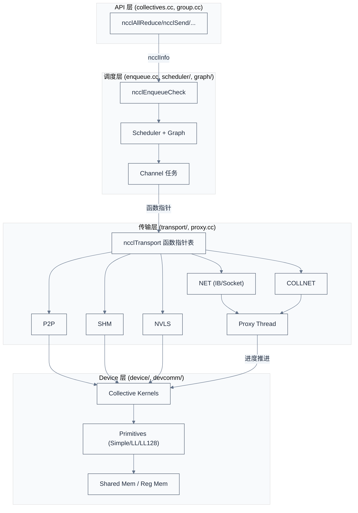
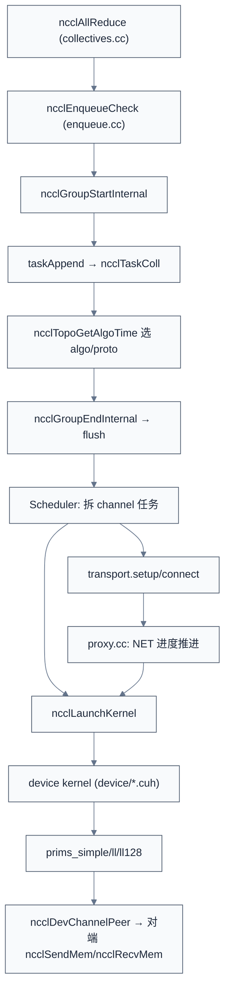
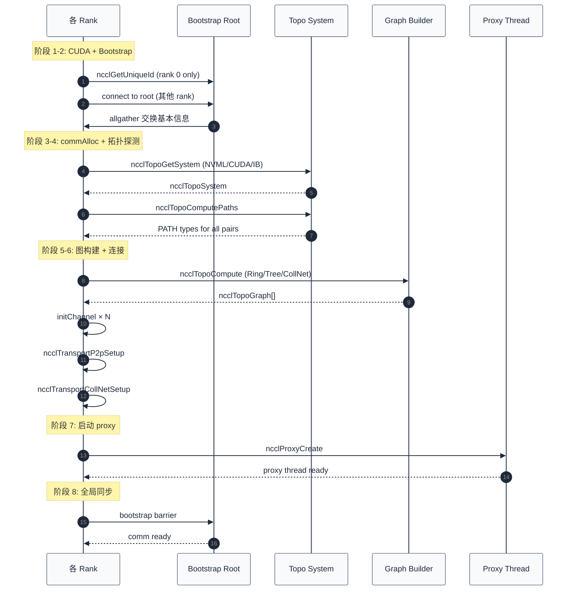

# NCCL 源码架构

> 一句话概括:NCCL 源码分 API 层 / 调度层 / 传输层 / Device 层四层,核心数据结构是 `ncclComm`(通信上下文)与 `ncclChannel`(通道),通过 `ncclTransport` 函数指针表实现"通用算法 × 平台传输"的解耦。
> **工程师视角**:理解 NCCL 架构的关键不是记住 213 处环境变量或几十个文件,而是看懂四层之间的"契约"——API 层与调度层的契约是 `ncclInfo`,调度层与传输层的契约是 `ncclTransport` 函数指针表,传输层与 device 层的契约是 `ncclDevChannelPeer`。每个契约都是一组函数指针,这与 [TF-A 的 `plat_psci_ops_t`](../trusted-firmware/04-tf-a-architecture.md) 同构。

### 关键术语

| 缩写 | 全称 | 含义 |
|------|------|------|
| Comm | Communicator | NCCL 通信上下文(`ncclComm` 结构) |
| Channel | — | 通信通道,绑定 ring/tree 算法 + transport |
| Task | — | 一次 collective 调用的内部表示 |
| Peer | — | 通信对端(rank) |
| Enqueue | — | 任务入队(异步语义核心) |
| Proxy Thread | — | 每个 comm 一个 CPU 线程,推进网络进度 |
| Transport | — | 数据传输实现(P2P/SHM/NET/COLLNET) |
| Device Kernel | — | GPU 上执行的 collective kernel |
| Persistent Kernel | — | Hopper+ 上常驻的 kernel,减少 launch 开销 |
| Plugin | — | NCCL 2.19+ 引入的可替换网络后端 |
| RMA | Remote Memory Access | 节点间 GPU 显存直接访问 |
| GIN | Gather-Reduce-Scatter Network | NVSwitch 上的硬件集合加速单元 |

**前置阅读**:
- [04-NCCL API 与基本用法](./04-nccl-api-and-usage.md) — 用户 API 视角

**下一篇**:[06-Bootstrap 与拓扑探测](./06-bootstrap-and-topology.md)

---

## 1. NCCL 源码全景

> [04 章](./04-nccl-api-and-usage.md) 讲了用户视角的 API:communicator 初始化、collective 调用、Group 语义。本章回答下一个问题:这些 API 调用进入 NCCL 库后,内部如何分层处理?数据如何从一台 GPU 流到另一台 GPU?

### 1.1 顶层目录结构

NCCL 2.30.7 源码根目录 `src/`(本地路径 [`./src/nccl-src/src/`](./src/nccl-src/src/)):

| 目录/文件 | 职责 | 关键内容 |
|----------|------|---------|
| `nccl.h.in` | 公共 API 头 | 所有用户可见 API 原型(`ncclComm_t`、`ncclAllReduce` 等) |
| `init.cc` | 初始化主流程 | `ncclCommInitRank` / `ncclCommInitAll` 的实现 |
| `bootstrap.cc` | Bootstrap 网络 | 初始化时 rank 互连的 TCP socket 协议 |
| `collectives.cc` | Collective dispatch | 8 个 collective API → `ncclEnqueueCheck` |
| `enqueue.cc` | Enqueue 主流程 | `ncclEnqueueCheck` → `taskAppend` |
| `group.cc` | Group 语义 | `ncclGroupStart/End` 的 thread-local 队列 |
| `proxy.cc` | Proxy thread | 每个 comm 一个 CPU 线程,推进 NET transport |
| `transport.cc` | Transport 注册表 | 4 个 transport 的函数指针表 |
| `channel.cc` | Channel 管理 | `initChannel` / `freeChannel` |
| `mem_manager.cc` | 内存管理 | `ncclMemAlloc` / `ncclMemFree` |
| `mnnvl.cc` | MNNVL 支持 | Blackwell 多节点 NVLink |
| `dev_runtime.cc` | Device runtime | GPU 侧任务派发 |
| `ce_coll.cc` | CE 协作引擎 | Hopper 后的硬件加速 |
| `ras/` | RAS | Reliability/Availability/Serviceability |
| `devcomm/` | Device-side comm | `ncclDevComm`、`ncclDevChannelPeer` |
| `device/` | GPU kernels | 集合通信 kernel + 三种协议(Simple/LL/LL128) |
| `gin/` | GIN | NVSwitch 硬件归约 |
| `graph/` | 拓扑与算法图 | `topo.cc` 探测、`rings.cc`/`trees.cc` 构图、`search.cc` 通道搜索 |
| `include/` | 内部头文件 | `comm.h`、`transport.h`、`graph.h`、`channel.h` 等 |
| `misc/` | 杂项工具 | 位运算、哈希等 |
| `nccl_device/` | Device 头文件 | GPU 侧使用的头 |
| `os/` | OS 抽象 | Linux 特定代码(IPC socket 等) |
| `param/` | 参数系统 | `NCCL_PARAM` 宏的运行时支持 |
| `plugin/` | 插件 | 外部网络插件接口 |
| `register/` | 内存注册 | 用户 buffer 注册 |
| `rma/` | RMA | 远程内存访问 |
| `scheduler/` | 调度器 | `allgatherv_sched.cc`、`symmetric_sched.cc` |
| `transport/` | Transport 实现 | P2P/SHM/NET/COLLNET/NVLS 五种 |

### 1.2 四层架构

NCCL 内部分四层,每层有明确的"对上接口 / 对下依赖"契约:



**层的契约**:

| 契约 | 上层 | 下层 | 形式 |
|------|------|------|------|
| `ncclInfo` | API 层 | 调度层 | C 结构体,描述一次 collective 的所有参数 |
| `ncclTransport` | 调度层 | 传输层 | 函数指针表(setup/connect/proxyProgress 等) |
| `ncclDevChannelPeer` | 传输层 | Device 层 | device pointer,描述对端 channel 状态 |

> **核心要点**:NCCL 架构本质是"**通用集合算法 × 可插拔 transport × 通道调度**"三层正交化。任意一层都可以独立替换:换 transport 不动算法;换算法不动 transport;加 channel 数不动 kernel。这是它与 MPI 等单层实现的关键差异。

---

## 2. 核心数据结构

NCCL 内部有十几个核心结构体,本节聚焦最重要的四个:`ncclComm`、`ncclChannel`、`ncclTaskColl`、`ncclSharedResources`。

### 2.1 `ncclComm`:通信上下文主结构

`ncclComm` 是 NCCL 的"上帝对象",持有通信所需的所有状态。这里摘录其关键字段:

```c
/* 摘自 [src/include/comm.h](./src/nccl-src/src/include/comm.h) 第 523-633 行(简化) */
struct ncclComm {
  /* ... 省略前段(magic / destructor 列表 / memStack 等)... */
  struct ncclCudaContext* context;
  struct ncclSharedResources* sharedRes;     // 跨 comm 共享的资源(split/shrink 后)
  int* topParentRanks;
  struct ncclChannel channels[MAXCHANNELS]; // 通道数组(核心)
  struct ncclPeerInfo* peerInfo;             // 当前 rank 的对端信息
  struct ncclTopoSystem* topo;               // 拓扑系统(详见 06 章)
  struct ncclProxyConnector* gproxyConn;     // 全局 proxy 连接

  ncclNet_t* ncclNet;                        // NET transport 实例
  void* netContext;                           // NET 上下文
  void* ginContext;                           // GIN 上下文
  void* rmaContext;                           // RMA 上下文
  ncclCollNet_t* ncclCollNet;                 // CollNet transport 实例
  void* bootstrap;                           // Bootstrap 状态(详见 06 章)

  struct ncclTopoGraph graphs[NCCL_NUM_ALGORITHMS];  // Ring/Tree/CollNet 图
  uint64_t magic;                              // 网络通信 magic number
  uint64_t commHash;                           // comm 唯一 hash

  /* rank 基本信息 */
  int rank;        // 当前 rank
  int nRanks;      // 总 rank 数
  int cudaDev;     // 绑定的 CUDA device
  int nvmlDev;     // NVML device index
  int compCap;     // GPU compute capability
  int64_t busId;   // PCI bus ID
  int cpuArch;     // CPU 架构(x86/ARM/POWER)
  int cpuVendor;   // CPU 厂商(Intel/AMD/Zhaoxin)
  int node;        // 当前节点编号
  int nNodes;      // 总节点数
  int localRank;  // 节点内 rank
  int localRanks; // 节点内 rank 数

  /* MNNVL(Blackwell 多节点 NVLink)信息 */
  int MNNVL;
  struct cliqueinfo clique;
  int cliqueRank;

  /* 通道数(运行时调优的核心参数) */
  int nChannels;          // 已连接的通道数
  int collChannels;       // 用于 collective 的通道数
  int nvlsChannels;       // 用于 NVLS 的通道数
  int p2pnChannels;       // 用于 P2P 的通道数
  int p2pnChannelsPerPeer;
  int p2pSchedGroupSize;

  /* Buffer 大小(三种协议各自) */
  int buffSizes[NCCL_NUM_PROTOCOLS];
  int p2pChunkSize;
  int nvlsChunkSize;

  uint64_t opCount;       // 操作计数(P2P + collective)
  uint64_t collOpCount;   // collective 操作计数
  /* ... 省略数百行字段 ... */
};
```

**字段分组**(对照看):

| 分组 | 关键字段 | 作用 |
|------|---------|------|
| 共享资源 | `sharedRes` | split/shrink 后子 comm 共享父 comm 的资源 |
| 通道 | `channels[MAXCHANNELS]`、`nChannels` | 通信通道数组,典型 4-32 |
| 拓扑 | `topo`、`peerInfo`、`graphs[]` | 硬件拓扑与算法图(详见 06、07 章) |
| Transport | `ncclNet`、`ncclCollNet`、`netContext` | 4 种 transport 的实例与上下文 |
| Bootstrap | `bootstrap` | 初始化时的 TCP socket 状态(详见 06 章) |
| Rank 信息 | `rank`、`nRanks`、`cudaDev`、`node`、`nNodes` | 当前 rank 在系统中的位置 |
| 调优 | `nChannels`、`buffSizes[]`、`p2pChunkSize` | 运行时可调的参数 |
| MNNVL | `MNNVL`、`clique` | Blackwell 多节点 NVLink 支持 |

> **核心要点**:`ncclComm` 是个"上帝对象",集中了所有状态——这让 NCCL API 可以单参数(`ncclComm_t comm`)访问所有上下文。代价是结构体庞大(数百字段),split/shrink 时需要复杂的共享资源管理(`sharedRes`)。

### 2.2 `ncclChannel`:通道结构

Channel 是 NCCL 的核心抽象,绑定一个 ring 或 tree 拓扑 + 一个 transport 实现:

```c
/* 摘自 [src/include/comm.h](./src/nccl-src/src/include/comm.h) 第 150-172 行 */
struct ncclChannel {
  struct ncclChannelPeer** peers;            // 各 rank 的 channel peer 信息
  struct ncclDevChannelPeer** devPeers;      // device 侧 peer 指针
  struct ncclDevChannelPeer** devPeersHostPtr;  // host 可访问的 dev peer 数组
  struct ncclRing ring;                     // Ring 拓扑(详见 07 章)
  int* devRingUserRanks;                    // device 上的 rank 顺序
  struct ncclTree tree;                      // 双二叉树拓扑

  struct ncclTree collnetChain;              // CollNet Chain 模式
  struct ncclDirect collnetDirect;           // CollNet Direct 模式

  struct ncclNvls nvls;                      // NVLS 归约

  int id;                                    // channel 编号
  uint32_t workFifoProduced;                // work fifo 生产位置

  /* comm split sharable resources */
  struct ncclChannelPeer* collnetPeers;
  struct ncclDevChannelPeer* collnetDevPeers;
  struct ncclChannelPeer* nvlsPeers;
  struct ncclDevChannelPeer* nvlsDevPeers;
};
```

**关键设计**:`ncclChannel` 同时持有 `ring`、`tree`、`collnetChain`、`collnetDirect`、`nvls` 五种拓扑——因为同一个 channel 可能被不同算法复用。例如 rank 0→1→2→3→0 的 ring,在 channel 0 上既能做 Ring AllReduce,也能做 Tree AllReduce(只需选不同字段)。

### 2.3 `ncclTaskColl`:一次 collective 的内部表示

```c
/* 摘自 [src/include/comm.h](./src/nccl-src/src/include/comm.h) 第 193-235 行(简化) */
struct ncclTaskColl {
  struct ncclTaskColl* next;
  ncclFunc_t func;                 // ncclFuncAllReduce / ncclFuncAllGather / ...
  void const* sendbuff;
  void* recvbuff;
  size_t count;
  int root;
  ncclDataType_t datatype;
  ncclRedOp_t opHost;              // 用户传入的 op
  struct ncclDevRedOpFull opDev;   // 转换后的 device op(含预乘系数)
  int chunkSteps, sliceSteps;       // 流水线参数(详见 09 章)

  // 算法决策(由调度器填充)
  size_t trafficBytes;
  int32_t nMaxChannels:8;
  int32_t nWarps:8;
  int32_t algorithm:8, protocol:8;  // NCCL_ALGO_RING / NCCL_ALGO_TREE / ...
  uint32_t isCollnet:1, isNvls:1, isSymLast:1;

  // 内存注册与远端地址
  void* sendMhandle;
  void* recvMhandle;
  void** sendNetHandles;          // 各 NET 对端注册句柄
  void** recvNetHandles;
  uintptr_t* sendbuffRmtAddrs;    // 各对端的远端 sendbuff 地址
  uintptr_t* recvbuffRmtAddrs;

  uint8_t nChannels;              // 该 collective 使用的通道数
};
```

这是 `ncclInfo` 在内部被转换后的形态。`ncclInfo` 是 API 层的简单参数集合(用户视角),`ncclTaskColl` 是调度层的内部表示(含算法决策、远端地址等运行时计算的字段)。

### 2.4 `ncclSharedResources`:跨 comm 共享

```c
/* 摘自 [src/include/comm.h](./src/nccl-src/src/include/comm.h) 第 120-148 行 */
struct ncclSharedResources {
  int refCount;                              // 引用计数
  struct ncclComm* owner;                    // 创建该资源的 comm
  struct ncclChannelPeer* peers[MAXCHANNELS];
  struct ncclDevChannelPeer* devPeers[MAXCHANNELS];
  uint64_t p2pOpCount[MAXCHANNELS];          // 各 channel 的 P2P 计数
  uint64_t collOpCount;                      // collective 计数
  int tpNRanks;                              // TP(tensor parallel)rank 数
  int tpNLocalRanks;
  int tpNChannels;
  int tpP2pNChannels;
  int tpP2pChunkSize;
  uint64_t magic;
  int* tpRankToLocalRank;                    // TP rank → localRank 映射
  struct ncclStrongStream deviceStream, hostStream;  // 内部 stream
  int persistentRefs;                         // persistent kernel 引用
  cudaEvent_t launchEvent, scratchEvent;
  struct ncclProxyState* proxyState;          // proxy thread 状态
  struct ncclGinState ginState;               // GIN 状态
};
```

**为什么需要 SharedResources**?`ncclCommSplit` 创建的子 comm 不需要重新建立 channel/proxyState,可以复用父 comm 的资源——`refCount` 跟踪引用计数,所有子 comm destroy 后才释放底层资源。这是 NCCL 弹性训练能力的关键。

### 2.5 Device 侧结构:`ncclSendMem` / `ncclRecvMem`

```c
/* 摘自 [src/include/comm.h](./src/nccl-src/src/include/comm.h) 第 53-77 行 */
struct ncclSendMem {
  union {
    struct {
      uint64_t head;                                    // ring buffer 头指针
      char pad1[CACHE_LINE_SIZE - sizeof(uint64_t)];    // cache line 对齐
      void* ptrExchange;                                // 指针交换缓冲
      uint64_t redOpArgExchange[2];                     // 归约参数交换
      char pad2[CACHE_LINE_SIZE - sizeof(void*) - 2 * sizeof(uint64_t)];
      int offsFifo[NCCL_STEPS];                         // 偏移 FIFO
    };
    char pad3[MEM_ALIGN];                               // 整体对齐到 4KB
  };
};

struct ncclRecvMem {
  union {
    struct {
      uint64_t tail;                                    // ring buffer 尾指针
      char pad1[CACHE_LINE_SIZE - sizeof(uint64_t)];
      struct ncclConnFifo connFifo[NCCL_STEPS];         // 连接 FIFO
      int flush;                                         // GDRCopy flush 标志
    };
    char pad4[MEM_ALIGN];
  };
};
```

这两个结构体放在 device memory 中,**GPU 直接读写,不经过 CPU**。它们是 device kernel 之间通信的 ring buffer,通过 `head`/`tail` 指针 + `NCCL_STEPS` 个 slot 实现 producer-consumer 流水线。

> **核心要点**:NCCL 把"状态"分两层放:**host 侧**(`ncclComm`、`ncclChannel`、`ncclTaskColl` 等)由 CPU 读写,负责调度与控制流;**device 侧**(`ncclSendMem`、`ncclRecvMem`、`ncclDevChannelPeer` 等)由 GPU 直接读写,负责数据流水线。CPU 不进入数据路径,这是 NCCL 性能的关键。

---

## 3. 调用层次:从 API 到 Kernel

下面追踪一次 `ncclAllReduce` 调用,看它如何穿透四层到达 GPU:

### 3.1 API 层:collectives.cc

```c
/* 摘自 [src/collectives.cc](./src/nccl-src/src/collectives.cc) 第 166-178 行 */
ncclResult_t ncclAllReduce(const void* sendbuff, void* recvbuff, size_t count,
                           ncclDataType_t datatype, ncclRedOp_t op,
                           ncclComm* comm, cudaStream_t stream) {
  NVTX3_FUNC_WITH_PARAMS(AllReduce, NcclNvtxParamsAllReduce,
                         NVTX3_PAYLOAD(comm ? comm->commHash : 0,
                                       count * ncclTypeSize(datatype), op));
  struct ncclInfo info = {
    ncclFuncAllReduce, "AllReduce", sendbuff, recvbuff, count,
    datatype, op, 0, comm, stream,
    ALLREDUCE_CHUNKSTEPS, ALLREDUCE_SLICESTEPS
  };
  return ncclEnqueueCheck(&info);
}
```

**职责**:把用户参数打包成 `ncclInfo`,交给 `ncclEnqueueCheck`。所有 8 个 collective API 走相同的 dispatch 路径,区别只在 `ncclInfo.collFunc` 字段。这种"**统一 dispatch + 类型字段区分**"的设计让新增 collective 操作的成本极低。

### 3.2 调度层入口:enqueue.cc

```c
/* 摘自 [src/enqueue.cc](./src/nccl-src/src/enqueue.cc) 第 3124-3172 行(简化) */
ncclResult_t ncclEnqueueCheck(struct ncclInfo* info) {
  // 1. 检查 communicator 状态
  ncclResult_t ret = CommCheck(info->comm, info->opName, "comm");
  if (ret != ncclSuccess) return ncclGroupErrCheck(ret);
  if (info->comm->revokedFlag) {
    WARN("%s: communicator was revoked", info->opName);
    return ncclGroupErrCheck(ncclInvalidUsage);
  }

  // 2. 隐式启动 group(用户没显式调 GroupStart 也ok)
  NCCLCHECK(ncclGroupStartInternal());
  NCCLCHECKGOTO(ncclCommEnsureReady(info->comm), ret, fail);

  // 3. 参数校验(可选的调试模式)
  NCCLCHECKGOTO(ArgsCheck(info), ret, fail);

  INFO(NCCL_COLL, "%s: opCount %lx sendbuff %p recvbuff %p count %zu ...",
       info->opName, info->comm->opCount, info->sendbuff, info->recvbuff,
       info->count, ...);

  // 4. 任务入队
  NCCLCHECKGOTO(taskAppend(info->comm, info), ret, fail);

exit:
  // 5. 隐式 group end(若 depth==0 则触发 flush)
  ncclGroupErrCheck(ret);
  NCCLCHECK(ncclGroupEndInternal());
  // 6. 非阻塞模式:检查 async error
  if (info->comm && !info->comm->config.blocking)
    NCCLCHECK(ncclCommGetAsyncError(info->comm, &ret));
  return ret;
fail:
  if (info->comm && !info->comm->config.blocking)
    (void)ncclCommSetAsyncError(info->comm, ret);
  goto exit;
}
```

**关键设计:隐式 Group**。每个 collective API 都被自动包在 `ncclGroupStartInternal` / `ncclGroupEndInternal` 内——如果用户显式调了 `ncclGroupStart`,group depth 增加,内部 end 不会触发 flush;如果用户没调,depth=0,end 触发立即 flush。这就是为什么 group 既可选又强大。

### 3.3 调度层:taskAppend → scheduler

`taskAppend` 把 `ncclInfo` 转换为 `ncclTaskColl`,挂到 comm 的 task list,然后调度器选算法与协议:

```
taskAppend(info->comm, info)
  → 分配 ncclTaskColl,填充 sendbuff/recvbuff/count/datatype/op/root
  → 调用 ncclTopoGetAlgoTime 选最优 (algorithm, protocol) 组合
      算法候选:Ring / Tree / CollNet Direct / CollNet Chain / NVLS / NVLS_TREE / PAT
      协议候选:Simple / LL / LL128
      选择标准:estTime 最小,详见 03 章 §3.1 性能公式
  → 填充 task->algorithm, task->protocol, task->nChannels
  → 把 task 挂到 comm->taskList
```

### 3.4 传输层:transport.cc + 函数指针表

调度完成后,channel 准备好对端连接。这时通过 `ncclTransport` 函数指针表调用具体 transport:

```c
/* 摘自 [src/transport.cc](./src/nccl-src/src/transport.cc) — transport 注册表 */
ncclTransports[NTRANSPORTS + 1] = {
  &p2pTransport,        // TRANSPORT_P2P = 0
  &shmTransport,        // TRANSPORT_SHM = 1
  &netTransport,        // TRANSPORT_NET = 2
  &collNetTransport,    // TRANSPORT_COLLNET = 3
  &profilerTransport    // PROFILER(非数据 transport,仅采样)
};

/* selectTransport 模板:遍历 4 个 transport,问"你能连吗?" */
template <int T>
static ncclResult_t selectTransport(...) {
  if (ncclTransports[T]->canConnect(...)) {
    return ncclTransports[T]->send.setup(...);  // 调用具体 transport 的 setup
  }
  return selectTransport<T-1>(...);  // 否则试前一个
}
```

这是与 [TF-A `plat_psci_ops_t`](../trusted-firmware/04-tf-a-architecture.md) 同构的"通用代码 × 平台实现"契约设计——通用调度代码通过函数指针调用具体 transport,新增 transport 只需实现函数指针表,不动调度代码。

### 3.5 传输层:host 侧 proxy + device 侧 kernel

NET transport 是唯一需要 CPU 协助的 transport(IB/Socket 都要 CPU 推进进度)。每个 comm 启动一个 proxy thread:

```
proxy.cc: ncclProxyPersistent()
  → 死循环,检查各 channel 的工作 FIFO
  → 如果有新任务,调用对应 transport 的 proxyProgress:
      netTransport.recv.proxyProgress(...)  // 推进 IB recv
      netTransport.send.proxyProgress(...)  // 推进 IB send
  → 直到 comm->destroyFlag 被设置
```

而 P2P/SHM/COLLNET/NVLS transport 完全在 device 侧执行,GPU kernel 直接读写对端 GPU 显存,不经 proxy。

### 3.6 Device 层:kernel 执行

最终 device kernel 启动(详见 [09 章](./09-device-kernels-and-collnet.md)):

```
ncclLaunchKernel(comm, stream)
  → 选择对应 (algorithm, protocol) 的 kernel:
      Ring + Simple → allreduce_ring_simple_kernel
      Ring + LL128 → allreduce_ring_ll128_kernel
      Tree + LL    → allreduce_tree_ll_kernel
      ...
  → kernel 内调用 prims_simple.h / prims_ll.h / prims_ll128.h 的原语
  → 原语通过 ncclDevChannelPeer 读写对端 ncclSendMem/ncclRecvMem
  → 数据在 ring/tree 拓扑上流动
```

### 3.7 完整调用链汇总



> **核心要点**:NCCL 的调用链体现"host 控制流 + device 数据流"分离:CPU 负责"哪些 rank 通信、走哪条通道、用什么算法",GPU 负责"实际数据搬移与归约"。Proxy thread 是这条链上唯一让 CPU 进入数据路径的环节——仅限 NET transport,P2P/SHM/COLLNET 完全绕过 CPU。

---

## 4. 通信器初始化流程

`ncclCommInitRank` 内部走几十个步骤,这里按阶段汇总:

```c
/* 摘自 [src/init.cc](./src/nccl-src/src/init.cc) 第 2561-2578 行 */
ncclResult_t ncclCommInitRank(ncclComm_t* newcomm, int nranks,
                              ncclUniqueId commId, int myrank) {
  NCCLCHECK(ncclInitEnv());                    // 1. 初始化 env plugin
  NVTX3_RANGE(NcclNvtxParamsCommInitRank)
  (void)ncclCudaLibraryInit();                 // 2. 加载 CUDA driver + dlsym hooks

  int cudaDev;
  ncclConfig_t config = NCCL_CONFIG_INITIALIZER;
  CUDACHECK(cudaGetDevice(&cudaDev));          // 3. 获取当前 device

  NCCLCHECK(ncclCommInitRankDev(newcomm, nranks, 1, &commId,
                                myrank, cudaDev, &config, __func__));  // 4. 实际初始化
  return ncclSuccess;
}
```

`ncclCommInitRankFunc`(L1831 起)是真正的初始化主流程,关键阶段:

```
阶段 1: CUDA 上下文
  - cudaSetDevice(cudaDev)
  - 查询 compute capability、maxSharedMem
  - ncclInitKernelsForDevice:加载 device kernel

阶段 2: Bootstrap(详见 06 章)
  - 普通 init:bootstrapInit(uniqueId, rank, nranks)
    → rank 0 启动 TCP 监听,其他 rank 连接
    → 所有 rank 互连握手,交换基本信息
  - Split:bootstrapSplit
  - Grow:bootstrapInit with growHandle

阶段 3: commAlloc
  - 分配 ncclComm 结构体
  - 初始化字段(rank、nRanks、cudaDev、busId、cpuArch 等)
  - 分配 channels[MAXCHANNELS]

阶段 4: 拓扑探测(详见 06 章)
  - ncclTopoGetSystem:NVML/CUDA/IB 探测硬件拓扑
  - ncclTopoComputePaths:计算所有 rank 对的 PATH 类型
  - 构造 ncclTopoSystem

阶段 5: 算法图构建(详见 07 章)
  - ncclTopoCompute:为 Ring/Tree/CollNet/NVLS 各构建一个图
  - ncclTopoPreset / ncclTopoPostset:rank 间交换图信息

阶段 6: Channel 与 transport 连接(详见 07、08 章)
  - initChannel:为每个 channel 初始化 ring/tree/collnet 字段
  - ncclTransportP2pSetup:为各对 rank 建立 P2P/SHM/NET 连接
  - ncclTransportCollNetSetup:为 CollNet 建立连接

阶段 7: Proxy thread 启动
  - ncclProxyCreate:每个 comm 一个 CPU 线程
  - 线程进入 ncclProxyPersistent 主循环

阶段 8: 最终同步
  - bootstrap barrier:所有 rank 完成初始化
  - 标记 comm 为 ready
```

### 4.1 初始化时序图



> **核心要点**:NCCL 初始化是个"重"操作——涉及 TCP 握手、拓扑探测、算法图构建、多 transport 连接、proxy thread 启动,典型耗时 100ms-10s(取决于规模)。这也是为什么初始化必须所有 rank 同时进行:任何 rank 慢了都会卡住整个 bootstrap 协议。

---

## 5. 关键设计决策

### 5.1 决策一:通用 API × 平台 transport 分离

这是 NCCL 与 [TF-A BL31](../trusted-firmware/04-tf-a-architecture.md) 最相似的架构决策。

**问题**:NCCL 要在多种互联上跑同样的 AllReduce——NVLink(节点内)、IB(节点间)、PCIe(老 GPU)、NVSwitch(硬件归约)。如果每种互联写一个 AllReduce 实现,会有 $8 \times 4 = 32$ 个 kernel,且每加一种互联要重写 8 个 collective。

**NCCL 的方案**:

```c
/* 摘自 [src/include/transport.h](./src/nccl-src/src/include/transport.h) — 接口契约 */
struct ncclTransportComm {
  ncclResult_t (*setup)(...);      // 建立 connection
  ncclResult_t (*connect)(...);    // 连接对端
  ncclResult_t (*free)(...);       // 释放
  ncclResult_t (*proxySharedInit)(...);
  ncclResult_t (*proxySetup)(...);
  ncclResult_t (*proxyConnect)(...);
  ncclResult_t (*proxyProgress)(...);  // 推进进度(关键)
  /* ... 其他方法 ... */
};

struct ncclTransport {
  const char name[8];
  ncclResult_t (*canConnect)(...);  // 询问:你能连这两个 rank 吗?
  struct ncclTransportComm send;     // 发送方向的方法集
  struct ncclTransportComm recv;     // 接收方向的方法集
};
```

**对照 TF-A**:

| 维度 | NCCL `ncclTransport` | TF-A `plat_psci_ops_t` |
|------|---------------------|----------------------|
| 用途 | 抽象数据传输实现 | 抽象平台电源管理实现 |
| 形式 | 函数指针表结构体 | 函数指针表结构体 |
| 通用代码 | `transport.cc` 调度 + `enqueue.cc` | `psci_common.c` 通用 PSCI 库 |
| 平台代码 | `transport/p2p.cc`、`transport/net.cc` 等 | `plat/qemu/qemu_pm.c` 等 |
| 契约核心 | `proxyProgress`、`canConnect` | `pwr_domain_on`、`pwr_domain_off` 等 |
| 替换成本 | 新增 transport 实现函数指针表即可 | 新增平台填 `plat_psci_ops_t` 即可 |

### 5.2 决策二:通道(Channel)正交化

**问题**:NVLink 单口带宽 50 GB/s,8 GPU 全互联需要 4 个独立 ring 才能打满。如何让"加更多 ring"不影响算法代码?

**NCCL 的方案**:把 ring/tree 算法与具体数据流解耦:

```
ncclAllReduce(task)
  → scheduler 拆成 N 个 channel task(典型 N=8)
  → 每个 channel 用独立 ring slot
  → channel 0: ring 0→1→2→3→0
  → channel 1: ring 0→3→2→1→0  (反向)
  → channel 2: ring 0→2→1→3→0  (错位)
  → ...
  → kernel 内并行处理 N 个 channel,数据切成 N 份
```

**收益**:加 channel 数(调 `NCCL_MAX_NCHANNELS`)就能线性增加带宽,不动 kernel 代码。代价是 channel 数受硬件限制(NVLink 物理通道数、NIC 数)。

### 5.3 决策三:Proxy Thread 辅助

**问题**:IB/Socket 网络进度推进需要 CPU 系统调用(`ibv_post_recv`、`poll_completion` 等),GPU 不能直接做。

**NCCL 的方案**:每个 comm 启动一个 CPU 线程,专门推进 NET transport:

```
proxy thread main loop:
  while not destroyFlag:
    for each channel:
      if work FIFO has new task:
        transport.proxyProgress(...)  // 推进 IB/Socket 进度
```

**关键设计**:proxy 只处理 NET,P2P/SHM/NVLS 完全绕过 proxy(GPU 直接读写对端)。这让节点内通信延迟极低(无 CPU 介入),节点间通信靠 proxy 充分利用 IB。

### 5.4 决策四:Persistent Kernel(Hopper+)

**问题**:每次 collective 都 launch kernel,launch 开销约 5-10 μs。小消息 AllReduce 延迟 5 μs,launch 开销就占 50%+。

**NCCL 的方案**(Hopper 后):kernel 启动后**不退出**,持续运行,通过 doorbell 触发新任务:

```
persistent kernel main loop:
  while not abortFlag:
    if doorbell[i] signaled:
      execute task[i]
      signal done
    else:
      __nanosleep(1)  // 短暂休眠
```

**收益**:多次 collective 共享一次 kernel launch,启动开销摊薄到几乎为 0。代价是 GPU SM 资源被常驻占用。这是 Hopper 后 NCCL 在小消息延迟上突破 5 μs 的关键。

> **核心要点**:NCCL 四个关键设计——**通用×平台分离、Channel 正交化、Proxy Thread、Persistent Kernel**——共同实现了"高性能 + 可扩展 + 可移植"。其中前两个是结构性的(影响所有 transport 与算法),后两个是性能性的(影响特定场景的延迟与吞吐)。

---

## 6. 与 TF-A / Zephyr 架构对比

### 6.1 三种"通用代码 × 平台实现"设计对照

| 维度 | NCCL `ncclTransport` | TF-A `plat_psci_ops_t` | Zephyr `device_api` |
|------|---------------------|----------------------|--------------------|
| 抽象目标 | 数据传输实现 | 电源管理操作 | 设备驱动 |
| 契约形式 | 函数指针表结构体 | 函数指针表结构体 | `struct device` + `DEVICE_API_GET` |
| 调用方式 | `ncclTransports[T]->send.setup(...)` | `plat_psci_ops->pwr_domain_on(...)` | `device_get_binding(name)->api->foo(...)` |
| 平台数量 | 4(可扩展) | 数十(QEMU/MTK/Intel...) | 数百 |
| 替换成本 | 实现一个 `ncclTransport` 结构体 | 填一个 `plat_psci_ops_t` | 注册一个 device driver |
| 共性 | 都用函数指针表解耦 | 同左 | 同左 |

三者架构本质相同,只是抽象层次与领域不同。

### 6.2 Host vs Device 代码职责划分

| 维度 | Host 侧(proxy.cc/transport.cc) | Device 侧(device/) |
|------|-------------------------------|-------------------|
| 主要文件 | `collectives.cc`、`enqueue.cc`、`group.cc`、`transport/*.cc`、`proxy.cc` | `device/*.cuh`、`device/symmetric/*.cuh` |
| 执行者 | CPU | GPU SM |
| 主要工作 | 调度、控制流、网络进度推进 | 数据搬移、归约计算 |
| 数据路径 | 仅 NET transport 经 proxy | P2P/SHM/NVLS 完全在 device |
| 异步性 | API 返回后异步推进 | 由 stream 调度执行 |

---

## 官方文档索引

| 文档 | 用途 | 建议阅读时机 |
|------|------|------|
| [NCCL Documentation](https://docs.nvidia.com/deeplearning/nccl/user-guide/docs/) | NCCL 完整文档 | 学完本章后 |
| [NCCL Source Code (GitHub)](https://github.com/NVIDIA/nccl) | 源码在线浏览 | 学完本章后 |
| [NCCL Source Code (本地)](./src/nccl-src/) | 离线源码,本笔记引用 | 全程参考 |

---

## 参考资料

- [NCCL Documentation Overview](https://docs.nvidia.com/deeplearning/nccl/user-guide/docs/overview.html) — 参考了 §Communicators、§Operations、§Environment Variables 概述
- [NCCL Communicator (本地源码)](./src/nccl-src/src/include/comm.h) — 参考了 L53-77 device 侧结构、L120-172 SharedResources 与 Channel、L193-235 TaskColl、L523-633 ncclComm 主结构
- [NCCL Init Flow (本地源码)](./src/nccl-src/src/init.cc) — 参考了 L1831-1900 ncclCommInitRankFunc 八阶段、L2561-2578 ncclCommInitRank 入口、L2580-2620 ncclCommInitAll
- [NCCL Enqueue (本地源码)](./src/nccl-src/src/enqueue.cc) — 参考了 L3124-3172 ncclEnqueueCheck 隐式 group 设计
- [NCCL Transport Interface (本地源码)](./src/nccl-src/src/include/transport.h) — 参考了 ncclTransportComm / ncclTransport 函数指针表(契约设计)
- [NCCL Transport Registry (本地源码)](./src/nccl-src/src/transport.cc) — 参考了 ncclTransports[] 注册表与 selectTransport 模板
- [TF-A Architecture (本仓库笔记)](../trusted-firmware/04-tf-a-architecture.md) — 参考了 plat_psci_ops_t 契约设计对照
